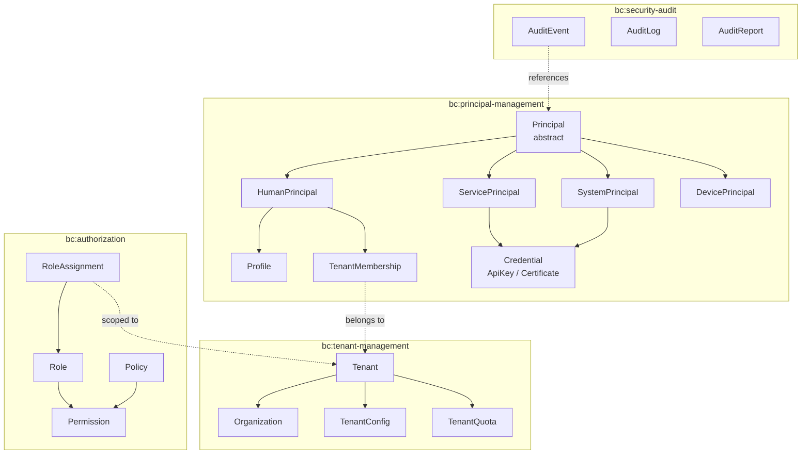
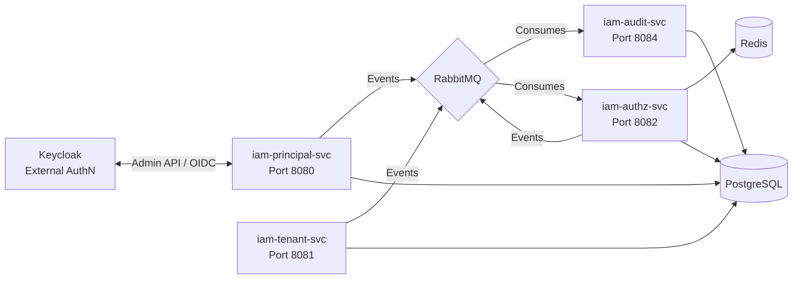
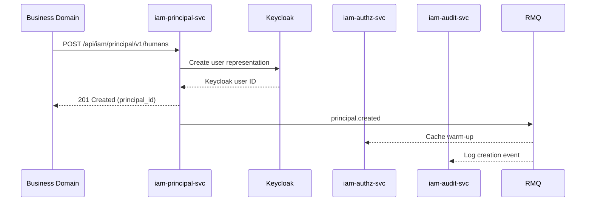
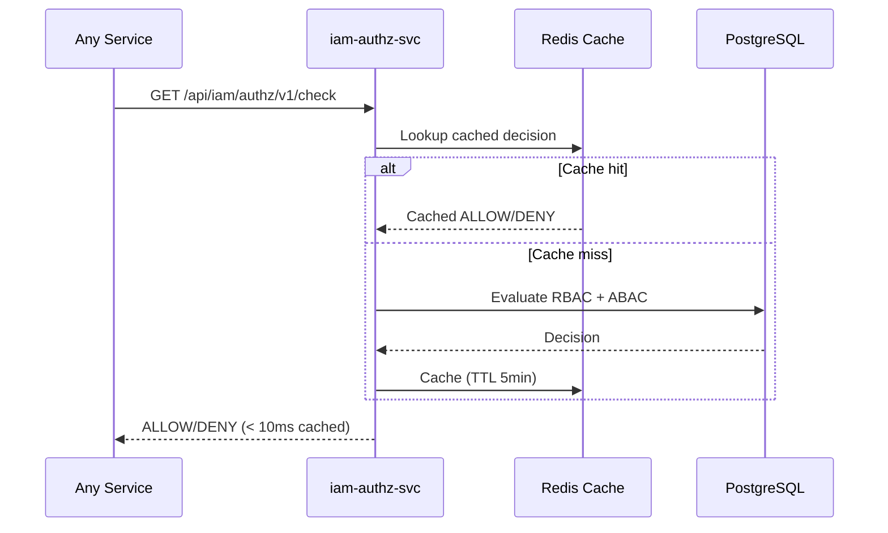
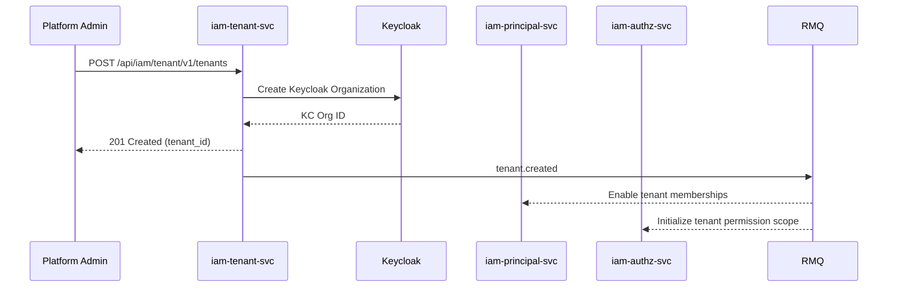

<!-- TEMPLATE COMPLIANCE: 100%
Template: suite-spec.md v1.0.0
Present sections: SS0 (Suite Identity & Purpose), SS1 (Ubiquitous Language), SS2 (Domain Model),
  SS3 (Service Landscape), SS4 (Integration Patterns), SS5 (Event Conventions),
  SS6 (Feature Catalog), SS7 (Cross-Cutting Concerns), SS8 (External Interfaces),
  SS9 (Architecture Decisions), SS10 (Roadmap), SS11 (Appendix)
Missing sections: none
Priority: N/A — fully compliant
-->

# Identity & Access Management (IAM) Suite Specification

> **Conceptual Stack Layer:** Suite
> **Space:** Platform
> **Owner:** IAM Engineering Team
> **Schema alignment:** `suite-layer.schema.json`
> **Companion files:** `iam.catalog.uvl` (referenced in SS6)
> **Contains:** Domain/Service Specs, Platform-Feature Specs, Feature Catalog

> **Meta Information**
> - **Version:** 2026-04-03
> - **Template:** `suite-spec.md` v1.0.0
> - **Template Compliance:** 100%
> - **Author(s):** OpenLeap Architecture Team
> - **Status:** DRAFT
> - **Suite ID:** `iam` (pattern: `^[a-z]{2,4}$`)
> - **Suite Name:** Identity & Access Management
> - **Description:** Provides centralized authentication coordination, fine-grained authorization, principal lifecycle management, multi-tenant isolation, and security audit logging for the OpenLeap platform.
> - **Semantic Version:** `3.0.0`
> - **Team:**
>   - Name: `team-iam`
>   - Email: `iam-team@openleap.io`
>   - Slack: `#iam-team`
> - **Bounded Contexts:** `bc:principal-management`, `bc:authorization`, `bc:tenant-management`, `bc:security-audit`

---

## Specification Guidelines

> **This specification MUST comply with the OpenLeap specification guidelines.**
>
> ### Non-Negotiables
> - Never invent facts. If required info is missing, add an **OPEN QUESTION** entry.
> - Preserve intent and decisions. Only change meaning when explicitly requested.
> - Keep the spec **self-contained**: no "see chat", no implicit context.
>
> ### Style Guide
> - Prefer short sentences and lists.
> - Use MUST/SHOULD/MAY for normative statements.
> - Keep terminology consistent with the Ubiquitous Language defined in SS1.
> - Avoid ambiguous words ("often", "maybe") unless explicitly noting uncertainty.

---

<!-- ═══════════════════════════════════════════════════════════════════
     SS0  SUITE IDENTITY & PURPOSE
     ═══════════════════════════════════════════════════════════════════ -->

## 0. Suite Identity & Purpose

### 0.1 Suite Identity

| Field | Value |
|-------|-------|
| id | `iam` |
| name | Identity & Access Management |
| description | Centralized authentication coordination, fine-grained authorization, principal lifecycle management, multi-tenant isolation, and security audit logging. |
| version | `3.0.0` |
| status | `draft` |
| owner.team | `team-iam` |
| owner.email | `iam-team@openleap.io` |
| owner.slack | `#iam-team` |
| boundedContexts | `bc:principal-management`, `bc:authorization`, `bc:tenant-management`, `bc:security-audit` |

### 0.2 Business Purpose

The IAM Suite encompasses all capabilities required for **authenticating users, managing identities, controlling access, and maintaining security across the OpenLeap platform**. It provides a hybrid architecture combining external authentication (Keycloak for OAuth2/OIDC) with internal services for fine-grained authorization, principal lifecycle management, multi-tenant organization, and security audit logging. IAM is the foundation tier that all business domains reference for identity and access control.

### 0.3 In Scope

- Principal authentication integration with Keycloak (OAuth2/OIDC/SAML)
- Fine-grained authorization and permission checking (RBAC + ABAC)
- Principal profile and account lifecycle management (HUMAN, SERVICE, SYSTEM, DEVICE)
- Multi-tenant organization and tenant hierarchy management
- Role and permission definition, assignment, and evaluation
- Access audit logging and security event tracking
- API key and service/system principal credential management
- Session management and monitoring coordination
- Password policy enforcement (via Keycloak)
- GDPR-compliant principal data handling (export, anonymization)

### 0.4 Out of Scope

- Business partner contracts and relationships (-> bp suite)
- Employee HR records and payroll (-> hr suite)
- Business transaction audit (-> Platform Audit Service)
- Infrastructure security: firewall, network, OS hardening (-> Platform Team)
- Data encryption at rest (-> Database/Storage Layer)
- Application-level business rules (-> Domain Services)

### 0.5 Target Users

| Role | Interest |
|------|----------|
| Platform Administrator | System-wide principal and tenant management, Keycloak configuration |
| Tenant Administrator | Tenant-scoped principal management, role assignment, organization hierarchy |
| Security Administrator | Role/permission definition, ABAC policies, security monitoring |
| Human Principal (End User) | Self-service profile management, password change (via Keycloak) |
| System Integrator | Configure system/service principals, manage API credentials |
| Compliance Officer | GDPR requests, audit log review, compliance reporting |
| Application Developer | Integrate services with IAM for authorization checks |

### 0.6 Business Value

- **Single Source of Truth:** One centralized place for all principal identities across the platform
- **Domain-Agnostic Foundation:** Works with any business context (manufacturing, retail, education, healthcare, finance)
- **Hybrid Best-of-Breed:** Keycloak for authentication, custom services for business-context authorization
- **Multi-Tenant Isolation:** Complete data segregation with Row-Level Security at the database level
- **Compliance Ready:** GDPR, SOX, ISO 27001 audit trail and data handling capabilities
- **Extensible:** Support for custom roles, permissions, attribute-based policies, and new principal types

---

<!-- ═══════════════════════════════════════════════════════════════════
     SS1  UBIQUITOUS LANGUAGE
     ═══════════════════════════════════════════════════════════════════ -->

## 1. Ubiquitous Language

### 1.1 Glossary

| ID | Term | Aliases | Definition |
|----|------|---------|------------|
| iam:glossary:principal | Principal | Identity, Subject | Any authenticated entity (human, service, system, device) that can access the platform. The abstract root concept of the IAM suite. |
| iam:glossary:human-principal | Human Principal | User, End User | A real person with system access, authenticated via Keycloak username/password + optional MFA. Stored in the `human_principals` table. |
| iam:glossary:service-principal | Service Principal | Service Account, API User | A microservice or internal application that authenticates via OAuth2 client credentials or API key. Stored in the `service_principals` table. |
| iam:glossary:system-principal | System Principal | Integration User, Technical User | An external system integration (ERP, CRM, partner API) that authenticates via mTLS or OAuth2 client credentials. Stored in the `system_principals` table. |
| iam:glossary:device-principal | Device Principal | IoT Device, Edge Device | An IoT device, kiosk, or terminal that authenticates via device certificate (mTLS). Stored in the `device_principals` table. |
| iam:glossary:authentication | Authentication | AuthN, Login | The process of verifying a principal's identity ("who you are"). Delegated to Keycloak for credential validation. |
| iam:glossary:authorization | Authorization | AuthZ, Access Control | The process of evaluating whether a principal has permission to perform an action on a resource ("what you can do"). Handled by iam.authz. |
| iam:glossary:tenant | Tenant | Organization, Customer | A top-level organizational entity using the platform. Every principal belongs to exactly one primary tenant. Tenants provide data isolation. |
| iam:glossary:role | Role | — | A named collection of permissions assigned to principals within a tenant scope (e.g., "AccountManager", "Auditor"). RBAC building block. |
| iam:glossary:permission | Permission | Privilege | A specific right to perform an action on a resource type (e.g., "invoice:approve", "order:read"). Granular authorization unit. |
| iam:glossary:policy | Policy | ABAC Rule, Access Policy | A conditional rule that dynamically grants or denies permissions based on attributes and context. Uses CEL or JSON expressions. |
| iam:glossary:role-assignment | Role Assignment | — | The binding of a role to a principal within a specific tenant context, optionally time-bounded. |
| iam:glossary:organization | Organization | Department, Unit, Team | A hierarchical subdivision within a tenant. Used for organizational scoping of permissions and data. |
| iam:glossary:audit-event | Audit Event | Security Event, Access Log | An immutable record of a security-relevant action (login, permission change, data access). Stored by iam.audit. |
| iam:glossary:keycloak-sync | Keycloak Sync | — | Bidirectional synchronization between IAM principal records and Keycloak user representations. |
| iam:glossary:api-key | API Key | — | A secret credential issued to service or system principals for programmatic authentication. Exchanged for JWT at the gateway. |
| iam:glossary:context-tags | Context Tags | — | Lightweight JSONB field on principals for optional business classification hints. Business data stays in business domains. |
| iam:glossary:tenant-membership | Tenant Membership | — | Association between a principal and a tenant with validity period and primary flag. |

### 1.2 UBL Boundary Test

**IAM vs. HR:**
IAM uses "Principal" to mean any authenticated entity (human or technical) with platform access. HR uses "Employee" to mean a person with an employment contract, payroll, and organizational assignment. An Employee in HR *references* a Principal in IAM via `principal_id` as a foreign key. IAM does not know about employment contracts; HR does not manage authentication. This confirms IAM and HR are separate suites.

**IAM vs. BP (Business Partner):**
IAM uses "Tenant" to mean a data-isolation boundary on the platform. BP uses "Organization" to mean a legal business entity with addresses, contacts, and contracts. A BP Organization may *map to* an IAM Tenant, but BP manages the business relationship while IAM manages the access boundary. This confirms IAM and BP are separate suites.

---

<!-- ═══════════════════════════════════════════════════════════════════
     SS2  DOMAIN MODEL
     ═══════════════════════════════════════════════════════════════════ -->

## 2. Domain Model

### 2.1 Conceptual Overview



### 2.2 Core Concepts

| Concept | Glossary Ref | Owner (BC) | Description |
|---------|-------------|------------|-------------|
| Principal | `iam:glossary:principal` | `bc:principal-management` | Abstract root entity for all authenticated identities |
| HumanPrincipal | `iam:glossary:human-principal` | `bc:principal-management` | Concrete principal type for real people |
| ServicePrincipal | `iam:glossary:service-principal` | `bc:principal-management` | Concrete principal type for microservices |
| SystemPrincipal | `iam:glossary:system-principal` | `bc:principal-management` | Concrete principal type for external integrations |
| DevicePrincipal | `iam:glossary:device-principal` | `bc:principal-management` | Concrete principal type for IoT devices |
| Role | `iam:glossary:role` | `bc:authorization` | Named permission collection |
| Permission | `iam:glossary:permission` | `bc:authorization` | Granular action-on-resource right |
| Policy | `iam:glossary:policy` | `bc:authorization` | Conditional ABAC rule |
| RoleAssignment | `iam:glossary:role-assignment` | `bc:authorization` | Principal-to-role binding |
| Tenant | `iam:glossary:tenant` | `bc:tenant-management` | Top-level data isolation entity |
| Organization | `iam:glossary:organization` | `bc:tenant-management` | Hierarchical unit within tenant |
| AuditEvent | `iam:glossary:audit-event` | `bc:security-audit` | Immutable security log entry |

### 2.3 Shared Kernel

| Type | Authoritative Owner | Attributes | Used By |
|------|-------------------|------------|---------|
| `PrincipalId` | `bc:principal-management` | UUID | All BCs reference principals |
| `TenantId` | `bc:tenant-management` | UUID | All BCs use for tenant scoping |
| `PrincipalType` | `bc:principal-management` | Enum: HUMAN, SERVICE, SYSTEM, DEVICE | authz, audit |
| `PrincipalStatus` | `bc:principal-management` | Enum: PENDING, ACTIVE, SUSPENDED, INACTIVE, DELETED | authz, audit |

### 2.4 Bounded Context Map

| Source BC | Target BC | Relationship Pattern | Description |
|-----------|-----------|---------------------|-------------|
| `bc:principal-management` | `bc:authorization` | Published Language | Principal publishes events; authz consumes to maintain cache |
| `bc:principal-management` | `bc:security-audit` | Published Language | Principal publishes lifecycle events; audit logs them |
| `bc:authorization` | `bc:security-audit` | Published Language | Authz publishes decision events; audit logs them |
| `bc:tenant-management` | `bc:principal-management` | Published Language | Tenant publishes lifecycle events; principal consumes for membership validation |
| `bc:tenant-management` | `bc:authorization` | Published Language | Tenant publishes events; authz consumes for tenant-scoped cache invalidation |
| `bc:principal-management` | Keycloak (External) | Anti-Corruption Layer | IAM translates between internal Principal model and Keycloak User Representation |

---

<!-- ═══════════════════════════════════════════════════════════════════
     SS3  SERVICE LANDSCAPE
     ═══════════════════════════════════════════════════════════════════ -->

## 3. Service Landscape

### 3.1 Service Catalog

| Service ID | Display Name | Bounded Context | Status | Responsibility | Spec Reference |
|-----------|-------------|----------------|--------|---------------|----------------|
| `iam-principal-svc` | Principal Management Service | `bc:principal-management` | APPROVED | Principal CRUD, Keycloak sync, credential management, tenant membership | `iam_principal_spec.md` |
| `iam-authz-svc` | Authorization Service | `bc:authorization` | DRAFT | RBAC/ABAC management, permission checking, role assignment | `iam_authz_spec.md` |
| `iam-tenant-svc` | Tenant Management Service | `bc:tenant-management` | DRAFT | Tenant lifecycle, organization hierarchy, tenant config and quotas | `iam_tenant_spec.md` |
| `iam-audit-svc` | Security Audit Service | `bc:security-audit` | DRAFT | Security event logging, audit queries, compliance reporting | `iam_audit_spec.md` |

### 3.2 Responsibility Matrix

| Capability | iam-principal-svc | iam-authz-svc | iam-tenant-svc | iam-audit-svc | Keycloak |
|------------|:-:|:-:|:-:|:-:|:-:|
| Authentication (credential validation) | | | | | ● |
| Principal CRUD | ● | | | | |
| Keycloak user sync | ● | | | | ● |
| API key management | ● | | | | |
| Role definition & assignment | | ● | | | |
| Permission checking | | ● | | | |
| ABAC policy evaluation | | ● | | | |
| Tenant provisioning | | | ● | | |
| Organization hierarchy | | | ● | | |
| Tenant configuration | | | ● | | |
| Security event logging | | | | ● | |
| Audit query & reporting | | | | ● | |
| Password management | | | | | ● |
| MFA enforcement | | | | | ● |
| Token issuance (OIDC) | | | | | ● |

### 3.3 Service Dependency Diagram



---

<!-- ═══════════════════════════════════════════════════════════════════
     SS4  INTEGRATION PATTERNS
     ═══════════════════════════════════════════════════════════════════ -->

## 4. Integration Patterns

### 4.1 Pattern Decision

| Aspect | Decision | Rationale |
|--------|----------|-----------|
| **Primary pattern** | Event-driven (async) | Loose coupling between IAM services; audit logging must not block business operations |
| **Exception** | Synchronous REST for authorization checks | Sub-10ms latency requirement for permission checks; Redis-cached responses |
| **Exception** | Synchronous REST for principal creation by business domains | Caller needs `principal_id` immediately as FK; eventual consistency too complex |
| **External integration** | Anti-Corruption Layer to Keycloak | Keycloak Admin REST API is external; translate between IAM model and KC User Representation |

### 4.2 Intra-Suite Event Flows

**Flow 1: Human Principal Onboarding**


**Flow 2: Authorization Check**


**Flow 3: Tenant Provisioning**


### 4.3 Sync vs. Async Decision Log

| Interaction | Pattern | Rationale |
|-------------|---------|-----------|
| Business domain → principal creation | Sync (REST) | Caller needs principal_id immediately |
| Any service → authorization check | Sync (REST) | Latency-critical; Redis-cached |
| Principal lifecycle → authz cache | Async (Event) | Cache invalidation is not latency-critical |
| All state changes → audit logging | Async (Event) | Audit must not block business operations |
| Tenant creation → downstream services | Async (Event) | Provisioning steps are independent |

### 4.4 Error Handling

| Failure Scenario | Strategy | Fallback |
|-----------------|----------|----------|
| Keycloak unreachable during principal creation | Retry 3x with exponential backoff | Return 503; principal NOT created (consistency) |
| Redis cache unavailable during authz check | Fallback to PostgreSQL | Degraded latency (~50ms instead of ~10ms) |
| RabbitMQ unreachable for event publishing | Transactional Outbox pattern | Events persisted in outbox table; polled and published on recovery |
| Audit service unreachable | Fire-and-forget with DLQ | Events queued in DLQ; replayed when audit service recovers |

---

<!-- ═══════════════════════════════════════════════════════════════════
     SS5  EVENT CONVENTIONS
     ═══════════════════════════════════════════════════════════════════ -->

## 5. Event Conventions

### 5.1 Routing Key Pattern

| Segment | Pattern | Example |
|---------|---------|---------|
| 1 - Suite | `iam` | `iam` |
| 2 - Domain | `principal` \| `authz` \| `tenant` \| `audit` | `principal` |
| 3 - Aggregate | lowercase entity name | `principal` |
| 4 - Action | past-tense verb | `created` |

**Full pattern:** `iam.{domain}.{aggregate}.{action}`
**Exchange:** `iam.events` (topic)
**Queue naming:** `{consumer-svc}.iam.{domain}.{aggregate}.{action}`

### 5.2 Payload Envelope

```json
{
  "eventId": "uuid",
  "eventType": "iam.{domain}.{aggregate}.{action}",
  "timestamp": "ISO-8601",
  "tenantId": "string",
  "correlationId": "uuid",
  "causationId": "uuid",
  "producer": "iam-{domain}-svc",
  "schemaVersion": "1.0.0",
  "payload": { }
}
```

### 5.3 Versioning Strategy

| Field | Value |
|-------|-------|
| **Strategy** | Schema evolution with backward compatibility |
| **Description** | New optional fields are additive. Removing fields requires a new major version with parallel publishing during migration. |

### 5.4 Event Catalog

**iam.principal Events:**

| Routing Key | Producer | Consumer(s) | Description |
|------------|----------|-------------|-------------|
| `iam.principal.principal.created` | `iam-principal-svc` | `iam-authz-svc`, `iam-audit-svc`, business domains | New principal registered |
| `iam.principal.principal.activated` | `iam-principal-svc` | `iam-authz-svc`, `iam-audit-svc` | Principal activated |
| `iam.principal.principal.deactivated` | `iam-principal-svc` | `iam-authz-svc` (clear cache), `iam-audit-svc` | Principal deactivated |
| `iam.principal.principal.suspended` | `iam-principal-svc` | `iam-authz-svc` (clear cache), `iam-audit-svc` | Principal suspended |
| `iam.principal.principal.deleted` | `iam-principal-svc` | `iam-authz-svc`, `iam-audit-svc` | Principal purged (GDPR) |
| `iam.principal.profile.updated` | `iam-principal-svc` | `iam-audit-svc` | Human principal profile changed |
| `iam.principal.apikey.created` | `iam-principal-svc` | `iam-audit-svc` | API key generated |
| `iam.principal.apikey.rotated` | `iam-principal-svc` | `iam-audit-svc` | API key rotated |
| `iam.principal.credentials.rotated` | `iam-principal-svc` | `iam-audit-svc` | Service credentials rotated |
| `iam.principal.membership.added` | `iam-principal-svc` | `iam-authz-svc`, `iam-audit-svc` | Principal added to tenant |
| `iam.principal.membership.removed` | `iam-principal-svc` | `iam-authz-svc`, `iam-audit-svc` | Principal removed from tenant |

**iam.authz Events:**

| Routing Key | Producer | Consumer(s) | Description |
|------------|----------|-------------|-------------|
| `iam.authz.role.created` | `iam-authz-svc` | `iam-audit-svc` | New role defined |
| `iam.authz.role.assigned` | `iam-authz-svc` | `iam-audit-svc`, business services | Role granted to principal |
| `iam.authz.role.revoked` | `iam-authz-svc` | `iam-audit-svc`, business services | Role revoked from principal |
| `iam.authz.permission.granted` | `iam-authz-svc` | `iam-audit-svc` | Direct permission granted |
| `iam.authz.permission.denied` | `iam-authz-svc` | `iam-audit-svc` | Authorization denied (security monitoring) |
| `iam.authz.policy.evaluated` | `iam-authz-svc` | `iam-audit-svc` | ABAC policy evaluated |

**iam.tenant Events:**

| Routing Key | Producer | Consumer(s) | Description |
|------------|----------|-------------|-------------|
| `iam.tenant.tenant.created` | `iam-tenant-svc` | `iam-principal-svc`, `iam-authz-svc`, all services | New tenant provisioned |
| `iam.tenant.tenant.activated` | `iam-tenant-svc` | all services | Tenant activated |
| `iam.tenant.tenant.suspended` | `iam-tenant-svc` | `iam-principal-svc`, `iam-authz-svc`, all services | Tenant suspended |
| `iam.tenant.tenant.deleted` | `iam-tenant-svc` | all services | Tenant purged |
| `iam.tenant.organization.created` | `iam-tenant-svc` | `iam-authz-svc` | New organization unit |
| `iam.tenant.settings.updated` | `iam-tenant-svc` | all services | Tenant feature flags or config changed |

**iam.audit Events:**

| Routing Key | Producer | Consumer(s) | Description |
|------------|----------|-------------|-------------|
| `iam.audit.alert.threshold-exceeded` | `iam-audit-svc` | SIEM, notification service | Security threshold breached |

**Consumed Events (from outside IAM):**

IAM is a foundational suite. Business domains create principals via synchronous API calls to iam.principal. IAM does NOT consume business domain events.

---

<!-- ═══════════════════════════════════════════════════════════════════
     SS6  FEATURE CATALOG
     ═══════════════════════════════════════════════════════════════════ -->

## 6. Feature Catalog

### 6.1 Feature Tree

```
IAM Suite
├── F-IAM-001  Principal Management               [COMPOSITION] [mandatory]
│   ├── F-IAM-001-01  Create Human Principal       [LEAF]        [mandatory]
│   ├── F-IAM-001-02  Create Service Principal     [LEAF]        [mandatory]
│   ├── F-IAM-001-03  Create System Principal      [LEAF]        [mandatory]
│   ├── F-IAM-001-04  Create Device Principal      [LEAF]        [optional]
│   ├── F-IAM-001-05  Principal Lifecycle Mgmt     [LEAF]        [mandatory]
│   ├── F-IAM-001-06  Profile Management           [LEAF]        [mandatory]
│   └── F-IAM-001-07  Credential Management        [LEAF]        [mandatory]
├── F-IAM-002  Authorization                       [COMPOSITION] [mandatory]
│   ├── F-IAM-002-01  RBAC Management              [LEAF]        [mandatory]
│   ├── F-IAM-002-02  Permission Check             [LEAF]        [mandatory]
│   ├── F-IAM-002-03  ABAC Policy Evaluation       [LEAF]        [optional]
│   └── F-IAM-002-04  Delegation & Impersonation   [LEAF]        [optional]
├── F-IAM-003  Tenant Management                   [COMPOSITION] [mandatory]
│   ├── F-IAM-003-01  Tenant Lifecycle             [LEAF]        [mandatory]
│   ├── F-IAM-003-02  Organization Hierarchy       [LEAF]        [optional]
│   ├── F-IAM-003-03  Tenant Configuration         [LEAF]        [mandatory]
│   └── F-IAM-003-04  Tenant Quotas                [LEAF]        [optional]
├── F-IAM-004  Security Audit                      [COMPOSITION] [mandatory]
│   ├── F-IAM-004-01  Security Event Logging       [LEAF]        [mandatory]
│   ├── F-IAM-004-02  Audit Query & Reporting      [LEAF]        [mandatory]
│   ├── F-IAM-004-03  Audit Export & Archival      [LEAF]        [optional]
│   └── F-IAM-004-04  SIEM Integration             [LEAF]        [optional]
└── F-IAM-005  GDPR Compliance                     [COMPOSITION] [mandatory]
    ├── F-IAM-005-01  Data Export                   [LEAF]        [mandatory]
    └── F-IAM-005-02  Data Erasure                  [LEAF]        [mandatory]
```

### 6.2 Mandatory Features

| Feature ID | Name | Rationale |
|-----------|------|-----------|
| `F-IAM-001` | Principal Management | All platform services require authenticated principals |
| `F-IAM-002` | Authorization | All platform services require access control |
| `F-IAM-003` | Tenant Management | Multi-tenancy is a platform requirement |
| `F-IAM-004` | Security Audit | Compliance and security monitoring are non-negotiable |
| `F-IAM-005` | GDPR Compliance | EU regulatory requirement for personal data handling |

### 6.3 Cross-Suite Feature Dependencies

| This Suite Feature | Requires | From Suite | Reason |
|-------------------|----------|-----------|--------|
| — | — | — | IAM is foundational; it does not depend on other suites |

### 6.4 Feature Register

| Feature ID | Name | Status | Spec Reference |
|-----------|------|--------|---------------|
| `F-IAM-001-01` | Create Human Principal | `development` | `features/F-IAM-001/F-IAM-001-01/F-IAM-001-01.md` |
| `F-IAM-001-02` | Create Service Principal | `development` | `features/F-IAM-001/F-IAM-001-02/F-IAM-001-02.md` |
| `F-IAM-001-03` | Create System Principal | `development` | `features/F-IAM-001/F-IAM-001-03/F-IAM-001-03.md` |
| `F-IAM-001-04` | Create Device Principal | `draft` | `features/F-IAM-001/F-IAM-001-04/F-IAM-001-04.md` |
| `F-IAM-001-05` | Principal Lifecycle Mgmt | `development` | `features/F-IAM-001/F-IAM-001-05/F-IAM-001-05.md` |
| `F-IAM-001-06` | Profile Management | `development` | `features/F-IAM-001/F-IAM-001-06/F-IAM-001-06.md` |
| `F-IAM-001-07` | Credential Management | `development` | `features/F-IAM-001/F-IAM-001-07/F-IAM-001-07.md` |
| `F-IAM-002-01` | RBAC Management | `development` | `features/F-IAM-002/F-IAM-002-01/F-IAM-002-01.md` |
| `F-IAM-002-02` | Permission Check | `development` | `features/F-IAM-002/F-IAM-002-02/F-IAM-002-02.md` |
| `F-IAM-002-03` | ABAC Policy Evaluation | `draft` | `features/F-IAM-002/F-IAM-002-03/F-IAM-002-03.md` |
| `F-IAM-002-04` | Delegation & Impersonation | `planned` | `features/F-IAM-002/F-IAM-002-04/F-IAM-002-04.md` |
| `F-IAM-003-01` | Tenant Lifecycle | `development` | `features/F-IAM-003/F-IAM-003-01/F-IAM-003-01.md` |
| `F-IAM-003-02` | Organization Hierarchy | `draft` | `features/F-IAM-003/F-IAM-003-02/F-IAM-003-02.md` |
| `F-IAM-003-03` | Tenant Configuration | `development` | `features/F-IAM-003/F-IAM-003-03/F-IAM-003-03.md` |
| `F-IAM-003-04` | Tenant Quotas | `planned` | `features/F-IAM-003/F-IAM-003-04/F-IAM-003-04.md` |
| `F-IAM-004-01` | Security Event Logging | `development` | `features/F-IAM-004/F-IAM-004-01/F-IAM-004-01.md` |
| `F-IAM-004-02` | Audit Query & Reporting | `draft` | `features/F-IAM-004/F-IAM-004-02/F-IAM-004-02.md` |
| `F-IAM-004-03` | Audit Export & Archival | `planned` | `features/F-IAM-004/F-IAM-004-03/F-IAM-004-03.md` |
| `F-IAM-004-04` | SIEM Integration | `planned` | `features/F-IAM-004/F-IAM-004-04/F-IAM-004-04.md` |
| `F-IAM-005-01` | Data Export | `draft` | `features/F-IAM-005/F-IAM-005-01/F-IAM-005-01.md` |
| `F-IAM-005-02` | Data Erasure | `draft` | `features/F-IAM-005/F-IAM-005-02/F-IAM-005-02.md` |

### 6.5 Variability Summary

| Metric | Value |
|--------|-------|
| Total composition nodes | 5 |
| Total leaf features | 21 |
| Mandatory features | 15 |
| Optional features | 6 |
| Cross-suite `requires` | 0 |
| Attributes (total across leaves) | 23 |
| Binding times used | `deploy`, `runtime` |

---

<!-- ═══════════════════════════════════════════════════════════════════
     SS7  CROSS-CUTTING CONCERNS
     ═══════════════════════════════════════════════════════════════════ -->

## 7. Cross-Cutting Concerns

### 7.1 Compliance

| Regulation | Requirement | Implementation |
|-----------|-------------|----------------|
| GDPR (EU) | Right to access, rectification, erasure of personal data | `iam_gdpr_export_spec.md`; anonymization in iam-principal-svc; audit log redaction |
| ISO 27001 | Information security management system | Role-based access, audit logging, encryption in transit/at rest |
| SOX (if applicable) | Financial data access controls and audit trails | Immutable audit logs, role segregation, 7-year retention |
| NIST 800-63 | Digital identity guidelines | Keycloak MFA, password policies, session management |

### 7.2 Security

| Aspect | Approach |
|--------|---------|
| **Authentication** | Delegated to Keycloak (OAuth2/OIDC). All internal services validate JWT bearer tokens. |
| **Authorization** | iam-authz-svc provides RBAC + ABAC. Deny-by-default. All endpoints require explicit permission. |
| **Data Classification** | PII (principal profiles) — Confidential. Credentials — Secret. Audit logs — Restricted. Roles/permissions — Internal. |
| **Encryption** | TLS 1.3 in transit. AES-256 at rest for credentials and PII. API keys stored as bcrypt hashes. |

### 7.3 Multi-Tenancy

| Aspect | Value |
|--------|-------|
| **Model** | `shared_schema` |
| **Isolation** | Row-Level Security (RLS) via `tenant_id` on all tables. PostgreSQL RLS policies enforced at database level. |
| **Tenant ID Propagation** | JWT claim `tenant_id` → HTTP header `X-Tenant-ID` → Event envelope `tenantId` field |

**Rules:**
- All queries MUST include `tenant_id` filter (enforced by RLS).
- Cross-tenant data access is forbidden at the API level.
- Platform administrators operate in a special `SYSTEM` tenant context.
- Tenant-scoped indexes MUST include `tenant_id` as leading column.

### 7.4 Audit

**Audit Requirements:**
- All state changes on aggregates MUST be audit-logged via domain events.
- All authentication attempts (success/failure) MUST be logged by Keycloak and forwarded to iam-audit-svc.
- All authorization denials MUST be logged with full context (who, what, when, resource).
- Audit log entries MUST include: principal_id, tenant_id, action, resource, timestamp, outcome, source_ip.

**Retention Policies:**

| Entity / Data Class | Retention Period | Legal Basis | Action After Expiry |
|--------------------|-----------------|-------------|-------------------|
| Security audit events | 7 years | SOX, ISO 27001 | `archive` to cold storage |
| Authentication logs | 90 days | Internal security policy | `delete` |
| Principal profile data | Duration of account + 30 days | GDPR Art. 17 | `anonymize` |
| Role assignment history | 7 years | SOX compliance | `archive` |
| GDPR export requests | 3 years | GDPR Art. 5(1)(e) | `delete` |

---

<!-- ═══════════════════════════════════════════════════════════════════
     SS8  EXTERNAL INTERFACES
     ═══════════════════════════════════════════════════════════════════ -->

## 8. External Interfaces

### 8.1 Outbound Interfaces (IAM -> Other Suites)

| Target Suite | Interface Type | Interface Name | Description |
|-------------|---------------|----------------|-------------|
| All suites | `event` | `iam.principal.principal.created` | Notifies business domains of new principal availability |
| All suites | `event` | `iam.principal.principal.deactivated` | Notifies business domains to revoke active sessions |
| All suites | `event` | `iam.tenant.tenant.created` | Notifies business domains to initialize tenant-scoped data |
| All suites | `event` | `iam.tenant.settings.updated` | Notifies business domains of feature flag changes |
| All suites | `api` | `GET /api/iam/authz/v1/check` | Authorization check endpoint called by all services |
| All suites | `api` | `GET /api/iam/principal/v1/principals/{id}` | Principal lookup for display names, status |

### 8.2 Inbound Interfaces (Other Suites -> IAM)

| Source Suite | Interface Type | Interface Name | Description |
|-------------|---------------|----------------|-------------|
| hr | `api` | `POST /api/iam/principal/v1/humans` | HR creates human principal when employee is hired |
| bp | `api` | `POST /api/iam/principal/v1/humans` | BP creates principal for B2B customer users |
| Any suite | `api` | `GET /api/iam/authz/v1/check` | Authorization check before business operations |
| Any suite | `api` | `GET /api/iam/principal/v1/principals/{id}` | Resolve principal display name for UI |

### 8.3 External Context Mapping

| External Suite | DDD Pattern | Translation |
|---------------|-------------|-------------|
| hr → iam | Conformist (downstream) | HR calls IAM API directly; IAM does not adapt to HR vocabulary |
| bp → iam | Conformist (downstream) | BP calls IAM API directly; IAM does not adapt to BP vocabulary |
| Any → iam (authz check) | Open Host Service | IAM exposes a standardized authorization check API; consumers conform to IAM's permission model |
| iam → Keycloak | Anti-Corruption Layer | IAM translates between internal `Principal` model and Keycloak `UserRepresentation` |

---

<!-- ═══════════════════════════════════════════════════════════════════
     SS9  ARCHITECTURE DECISIONS
     ═══════════════════════════════════════════════════════════════════ -->

## 9. Architecture Decisions

### ADR-IAM-001: Hybrid Authentication Architecture

| Field | Value |
|-------|-------|
| **ID** | `ADR-IAM-001` |
| **Status** | `accepted` |
| **Scope** | All IAM services |

**Context:**
The platform needs authentication and identity management. Building a custom identity provider is complex and security-critical. Using only Keycloak limits fine-grained business authorization.

**Decision:**
Use Keycloak for authentication (credential validation, MFA, SSO, token issuance) and custom IAM services for authorization, principal lifecycle, and business-context access control.

**Rationale:**
- Keycloak is battle-tested for authentication
- Custom services provide business-domain-specific authorization
- Separation of concerns: AuthN vs AuthZ

**Consequences:**

| Positive | Negative |
|----------|----------|
| Best-of-breed for each concern | Two systems to maintain |
| Keycloak handles security-critical credential management | Keycloak sync adds complexity |
| Custom authz enables business-context permissions | Operational overhead of Keycloak cluster |

**Affected Services:** `iam-principal-svc`, `iam-authz-svc`

### ADR-IAM-002: Table-Per-Class Inheritance for Principal Types

| Field | Value |
|-------|-------|
| **ID** | `ADR-IAM-002` |
| **Status** | `accepted` |
| **Scope** | `iam-principal-svc` |

**Context:**
Principals come in four types (HUMAN, SERVICE, SYSTEM, DEVICE) with different attributes. Need a persistence strategy.

**Decision:**
Use Table-Per-Class (TPC) inheritance. Each concrete principal type has its own complete table with all shared + specific columns.

**Rationale:**
- No JOINs for single-type queries (performance)
- Each table has only relevant columns (clean schema)
- Independent indexing per type

**Consequences:**

| Positive | Negative |
|----------|----------|
| Fast single-type queries | Cross-type queries need UNION |
| Clean per-type schema | Shared column changes must be applied to all tables |
| Independent scaling per type | More tables to manage |

**Affected Services:** `iam-principal-svc`

### ADR-IAM-003: RBAC Primary, ABAC Secondary

| Field | Value |
|-------|-------|
| **ID** | `ADR-IAM-003` |
| **Status** | `accepted` |
| **Scope** | `iam-authz-svc` |

**Context:**
Need a permission model. Pure RBAC is simple but inflexible. Pure ABAC is powerful but complex.

**Decision:**
Use RBAC for 90% of permissions (role-based). Use ABAC for conditional access (10%) where attributes like time, location, or resource properties matter.

**Rationale:**
- RBAC covers most use cases simply
- ABAC adds flexibility for edge cases
- Deny-by-default; DENY policies override ALLOW

**Consequences:**

| Positive | Negative |
|----------|----------|
| Simple for common cases | Two models to understand |
| Flexible for edge cases | Policy misconfiguration risk when mixing |
| Industry-standard approach | ABAC evaluation adds latency |

**Affected Services:** `iam-authz-svc`

### ADR-IAM-004: API Key to JWT Exchange at Gateway

| Field | Value |
|-------|-------|
| **ID** | `ADR-IAM-004` |
| **Status** | `accepted` |
| **Scope** | `iam-principal-svc`, API Gateway |

**Context:**
External systems authenticate with API keys or certificates. Internally, all services expect JWT bearer tokens.

**Decision:**
The API Gateway exchanges API keys / certificates for short-lived JWTs via Keycloak token exchange. Internal services only see JWTs.

**Rationale:**
- Uniform internal authentication (always JWT)
- API keys are simpler for external integrators
- Gateway handles the translation (Anti-Corruption Layer)

**Consequences:**

| Positive | Negative |
|----------|----------|
| Internal services have one auth model | Gateway becomes a critical path |
| API keys are simple for integrators | Token exchange adds gateway latency (~5ms) |
| Centralized credential validation | API key rotation requires gateway awareness |

**Affected Services:** `iam-principal-svc`, API Gateway

### ADR-IAM-005: Domain-Agnostic IAM

| Field | Value |
|-------|-------|
| **ID** | `ADR-IAM-005` |
| **Status** | `accepted` |
| **Scope** | All IAM services |

**Context:**
IAM initially referenced HR employees and BP organizations directly. This created coupling to business domains.

**Decision:**
IAM is domain-agnostic. It manages principals without knowledge of business contexts. Business domains store `principal_id` as a foreign key. Context tags (optional JSONB) provide lightweight hints without hard references.

**Rationale:**
- IAM works with any business domain combination
- No coupling to specific domain models
- Context tags enable basic classification without schema coupling

**Consequences:**

| Positive | Negative |
|----------|----------|
| Fully reusable across industries | No business-context awareness in IAM UI |
| No coupling to HR/BP domain changes | Business domains must manage their own principal references |
| Clean DDD boundaries | Context tags may be misused as business data |

**Affected Services:** All IAM services

---

<!-- ═══════════════════════════════════════════════════════════════════
     SS10  ROADMAP
     ═══════════════════════════════════════════════════════════════════ -->

## 10. Roadmap

| Phase | Timeframe | Items |
|-------|-----------|-------|
| Phase 1: Foundation | Q2 2026 | Core principal CRUD (HUMAN, SERVICE, SYSTEM), Keycloak sync, basic RBAC, tenant lifecycle, audit logging, GDPR export |
| Phase 2: Advanced Authorization | Q3 2026 | ABAC policy engine (OPA integration evaluation), delegation & impersonation, organization hierarchy, tenant quotas |
| Phase 3: Enterprise | Q4 2026 | Device principal support, SIEM integration, audit export & archival, federated identity (cross-tenant), self-service provisioning |
| Phase 4: Optimization | Q1 2027 | Performance tuning (100K+ principals), advanced caching strategies, white-label tenant branding, tenant health scoring |

---

<!-- ═══════════════════════════════════════════════════════════════════
     SS11  APPENDIX
     ═══════════════════════════════════════════════════════════════════ -->

## 11. Appendix

### 11.1 Change Log

| Date | Version | Author | Changes |
|------|---------|--------|---------|
| 2025-12-06 | 1.0.0 | OpenLeap Architecture Team | Initial specification |
| 2025-12-12 | 2.0.0 | OpenLeap Architecture Team | Renamed iam.user to iam.principal; Removed business domain references; IAM is now domain-agnostic |
| 2026-04-01 | 2.1.0 | OpenLeap Architecture Team | Restructured to suite-spec.md template compliance (SS0-SS11) |
| 2026-04-03 | 3.0.0 | OpenLeap Architecture Team | Full template compliance: added SS9 ADRs (5 decisions), SS10 Roadmap, expanded SS8 External Interfaces with context mapping, expanded SS7 retention policies |

### 11.2 Review & Approval

**Status:** DRAFT

**Reviewers:**

| Role | Name | Date | Status |
|------|------|------|--------|
| Suite Architect | {Name} | — | [ ] Reviewed |
| Domain Lead (principal) | {Name} | — | [ ] Reviewed |
| Domain Lead (authz) | {Name} | — | [ ] Reviewed |
| Domain Lead (tenant) | {Name} | — | [ ] Reviewed |
| Domain Lead (audit) | {Name} | — | [ ] Reviewed |
| Product Owner | {Name} | — | [ ] Reviewed |
| Security Architect | {Name} | — | [ ] Reviewed |

**Approval:**

| Role | Name | Date | Approved |
|------|------|------|----------|
| Suite Architect | {Name} | — | [ ] |
| CISO/Security Director | {Name} | — | [ ] |
| Engineering Manager | {Name} | — | [ ] |

### 11.3 Acronyms

| Acronym | Full Name | Description |
|---------|-----------|-------------|
| IAM | Identity & Access Management | This suite |
| KC | Keycloak | External authentication provider |
| OIDC | OpenID Connect | Authentication protocol |
| OAuth2 | OAuth 2.0 | Authorization framework |
| JWT | JSON Web Token | Token format |
| RBAC | Role-Based Access Control | Permission model |
| ABAC | Attribute-Based Access Control | Policy-based permission model |
| MFA | Multi-Factor Authentication | Additional security layer |
| SSO | Single Sign-On | Unified authentication |
| SAML | Security Assertion Markup Language | Federation protocol |
| RLS | Row-Level Security | Database isolation technique |
| GDPR | General Data Protection Regulation | EU privacy law |
| OPA | Open Policy Agent | CNCF policy engine |
| SIEM | Security Information and Event Management | Security monitoring |
| CEL | Common Expression Language | Policy expression language |
| TPC | Table-Per-Class | Persistence inheritance strategy |
| DLQ | Dead Letter Queue | Failed message queue |
| ACL | Anti-Corruption Layer | DDD integration pattern |

### 11.4 IAM vs. Application Security — Quick Reference

| Question | IAM Suite Answer | Application Layer Answer |
|----------|------------------|--------------------------|
| Who authenticates? | Keycloak (OAuth2/OIDC) | Validates token from Keycloak |
| Who authorizes? | iam.authz (permissions) | Calls iam.authz for decisions |
| Who manages users? | iam.principal | Consumes user data from iam.principal |
| Who enforces tenant isolation? | Database RLS + iam.authz | Sets tenant context, trusts RLS |
| Who logs access? | iam.audit | Publishes events to iam.audit |
| Who manages passwords? | Keycloak | Never touches passwords |
| Who defines business roles? | iam.authz + business domains | Requests roles from iam.authz |
| Who handles MFA? | Keycloak | Trusts Keycloak MFA claims |

### 11.5 Performance Requirements

**Response Time Targets:**
- Authorization check (iam.authz): < 10ms (cached), < 50ms (uncached)
- Principal lookup (iam.principal): < 20ms
- Token validation: < 5ms
- Audit log write: < 5ms (async)
- Audit log query: < 200ms (simple), < 2s (complex)

**Throughput Targets:**
- Authorization checks: 10,000 requests/second per instance
- Principal API: 1,000 requests/second per instance
- Audit writes: 5,000 events/second per instance
- Keycloak token issuance: 500 tokens/second

**Scalability Targets:**
- Principals: 100,000 per installation
- Tenants: 1,000 per installation
- Concurrent sessions: 10,000
- Roles per tenant: 500
- Permissions per role: 1,000
- Audit events: 100M events/year

### 11.6 Domain Specification References

| Domain Spec | Service | Status |
|------------|---------|--------|
| `iam_principal_spec.md` | iam-principal-svc | APPROVED |
| `iam_authz_spec.md` | iam-authz-svc | DRAFT |
| `iam_tenant_spec.md` | iam-tenant-svc | DRAFT |
| `iam_audit_spec.md` | iam-audit-svc | DRAFT |
| `iam_gdpr_export_spec.md` | Cross-service feature | DRAFT |

### 11.7 External Standards References

- OAuth 2.0 Specification: https://oauth.net/2/ (RFC 6749)
- OpenID Connect Core 1.0: https://openid.net/connect/
- JSON Web Token (JWT): RFC 7519
- SAML 2.0: Security Assertion Markup Language
- GDPR: General Data Protection Regulation (EU)
- NIST Digital Identity Guidelines: https://pages.nist.gov/800-63-3/
- Keycloak Documentation: https://www.keycloak.org/documentation
- OPA Documentation: https://www.openpolicyagent.org/docs/
- NIST RBAC Model: https://csrc.nist.gov/projects/role-based-access-control

---

## Authoring Checklist

> Before moving to REVIEW status, verify:

- [x] Suite ID follows pattern `^[a-z]{2,4}$` (SS0)
- [x] Business purpose is at least 50 characters (SS0)
- [x] In-scope and out-of-scope are concrete and mutually exclusive (SS0)
- [x] UBL glossary has entries for every core concept (SS1)
- [x] Every glossary definition is at least 20 characters (SS1)
- [x] UBL boundary test demonstrates vocabulary distinction from at least one related suite (SS1)
- [x] Every core concept in SS2 has a glossary_ref back to SS1 (SS2)
- [x] Shared kernel types define authoritative attributes (SS2)
- [x] Bounded context map uses valid DDD patterns (SS2)
- [x] Service catalog lists all services with status and spec reference (SS3)
- [x] Integration pattern decision has rationale (SS4)
- [x] Event flows cover all major intra-suite workflows (SS4)
- [x] Routing key pattern is documented with segments and examples (SS5)
- [x] Payload envelope matches platform standard (SS5)
- [x] Event catalog lists every published event (SS5)
- [x] Feature tree is complete with mandatory/optional annotations (SS6)
- [x] Cross-suite feature dependencies are listed (SS6)
- [ ] Companion `iam.catalog.uvl` is created and matches SS6 tree (SS6)
- [x] Compliance requirements list all applicable regulations (SS7)
- [x] Multi-tenancy model is specified (SS7)
- [x] Retention policies have legal basis (SS7)
- [x] External interfaces document all cross-suite communication (SS8)
- [x] External context mapping uses valid DDD patterns (SS8)
- [x] All ADRs have ID pattern `ADR-IAM-NNN` (SS9)
- [x] Roadmap covers at least the next two phases (SS10)

---

**END OF SPECIFICATION**
