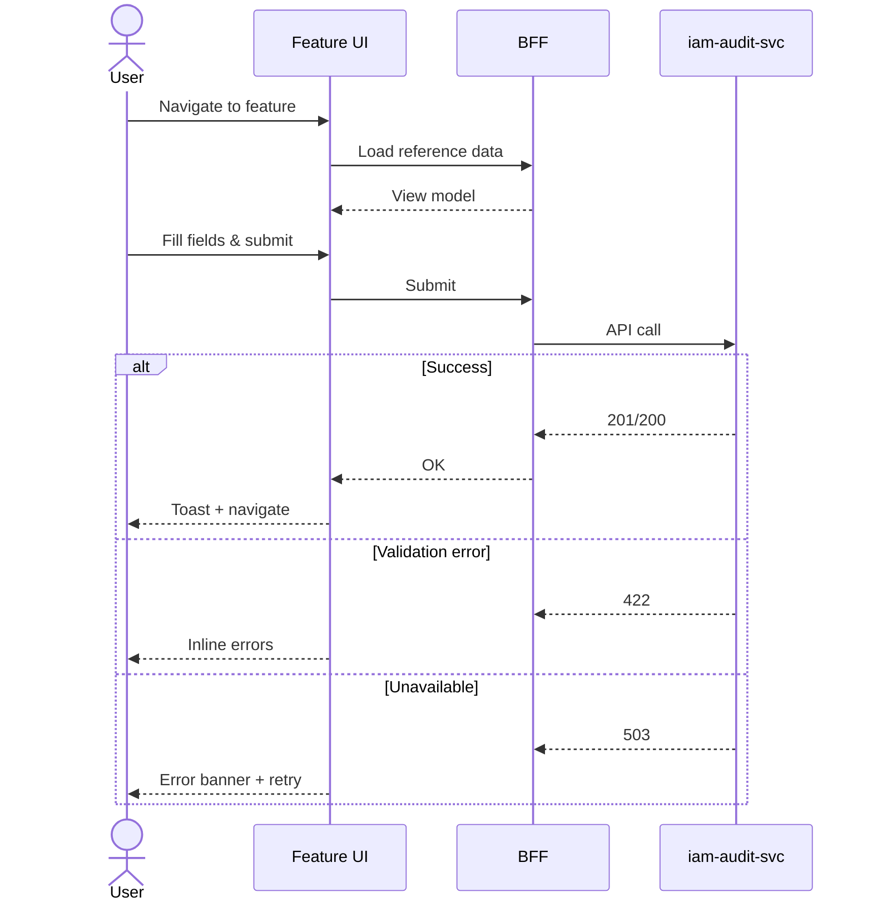

<!-- TEMPLATE COMPLIANCE: 100%
Template: feature-spec.md v1.0.0
-->

# F-IAM-004-02 — Audit Query & Reporting

> **Conceptual Stack Layer:** Platform-Feature
> **Space:** Platform
> **Owner:** Domain Engineering Team
> **Companion files:** `F-IAM-004-02.uvl`, `F-IAM-004-02.aui.yaml`

> **Meta Information**
> - **Version:** 2026-04-03
> - **Template:** `feature-spec.md` v1.0.0
> - **Template Compliance:** 100%
> - **Author(s):** OpenLeap Architecture Team
> - **Status:** DRAFT
> - **Feature ID:** `F-IAM-004-02`
> - **Suite:** `iam`
> - **Node type:** LEAF
> - **Companion UVL:** `uvl/leaves/F-IAM-004-02.uvl`
> - **Companion AUI:** `contracts/aui/F-IAM-004-02.aui.yaml`

---

## PROBLEM SPACE

## 0. Feature Identity & Orientation

### 0.1 One-Line Summary
This feature lets a IAM_AUDIT_VIEWER search, filter, and report on audit events for security monitoring.

### 0.2 Non-Goals
This feature does not cover capabilities assigned to other leaf features in the same composition node.

### 0.3 Entry & Exit Points
**Entry:** IAM admin navigation menu, direct API call, principal detail page.
**Exit:** Success → toast → detail/list view. Failure → inline errors → stay on form.

### 0.4 Variability Points
| Variability | Modelled as | Default | Binding |
|---|---|---|---|
| Records per page | Attribute `pagination.pageSize` | 25 | `deploy` |

---

## 1. User Goal & Scenarios

### 1.1 The User Goal
Search, filter, and report on audit events for security monitoring.

### 1.2 User Scenarios
**Scenario 1: Investigate failed logins**
> Last 24h, brute force detection

**Scenario 2: Compliance report**
> Quarter permission changes for SOX

**Scenario 3: Trace user activity**
> All actions in incident window


---

## 2. User Journey & Screen Layout

### 2.1 Happy-Path Flow


### 2.2 Screen Layout
```
┌──────────────────────────────────────────────────┐
│  ← Back            Audit Query & Reporting     [Cancel]    │
├──────────────────────────────────────────────────┤
│  SECTION: Core Details                            │
│  (Fields from §3.1)                               │
├──────────────────────────────────────────────────┤
│  SECTION: Extension Zone [EXT]                    │
├──────────────────────────────────────────────────┤
│                            [Cancel]  [Submit]     │
└──────────────────────────────────────────────────┘
```

---

## 3. Interaction Requirements

### 3.1 Form Fields
| Field | Service | Control | Req | Validation |
|---|---|---|:---:|---|
| Date Range * | `iam-audit-svc` | Date range | Y | Max 90 days |
| Event Type | `iam-audit-svc` | Multi-select |  | Filter |
| Principal | `iam-audit-svc` | Typeahead |  | Actor filter |
| Outcome | `iam-audit-svc` | Select |  | SUCCESS/FAILURE/DENIED |
| Resource | `iam-audit-svc` | Text |  | Free text |
| Source IP | `iam-audit-svc` | Text |  | IP/CIDR |

### 3.2 Actions
| Action | Trigger | Precondition | Confirm | Role | Outcome |
|---|---|---|:---:|---|---|
| Submit | Button | Form valid | — | `IAM_AUDIT_VIEWER` | Navigate + toast |
| Cancel | Button | — | If dirty | Any | Navigate back |

### 3.3 Unsaved Changes Guard
If dirty → dialog "You have unsaved changes. Leave and discard them?" → Leave / Stay.

---

## 4. Edge Cases & Screen States
| State | When | Behaviour |
|---|---|---|
| Loading | Awaiting response | Skeleton; controls disabled |
| Empty | No ref data | Error + retry |
| Error | Call failed | Inline message + retry |
| Populated | Data ready | Render normally |

---

## SOLUTION SPACE

## 5. Backend Dependencies & BFF Contract

### 5.1 Service Calls
| # | Service | Tier | Method | isMutation | Failure |
|---|---------|------|--------|:---:|---|
| 1 | iam-audit-svc | T1 | GET ref data | N | Retry 3x |
| 2 | iam-audit-svc | T1 | POST/PUT/PATCH | Y | Show error |

### 5.2 Feature-Gating
| Mode | Behaviour |
|---|---|
| full | All fields editable, submit enabled |
| read-only | All disabled, submit hidden |
| excluded | Entry point hidden |

---

## 6. Screen Contract (AUI)
See companion file: `contracts/aui/F-IAM-004-02.aui.yaml`

---

## 7. i18n, Permissions & Accessibility
| Action | Show when | Enable when | Role |
|---|---|---|---|
| Entry point | Always | Any role | Any |
| Submit | Always | Form valid | `IAM_AUDIT_VIEWER` |

---

## 8. Acceptance Criteria
**AC-001:** Given role `IAM_AUDIT_VIEWER`, when all required fields filled and submitted, then record created and toast shown.
**AC-002:** Given required field blank, when submit, then inline error on field with focus.
**AC-003:** Given role `IAM_VIEWER`, then submit action absent from DOM.

---

## 9. Dependencies, Variability & Extension Points
| Attribute | Type | Default | Binding |
|---|---|---|---|
| `pagination.pageSize` | Integer | 25 | `deploy` |

---

## 10. Change Log
| Date | Version | Author | Changes |
|------|---------|--------|---------|
| 2026-04-03 | 1.0 | Architecture Team | Initial specification |

---
**END OF SPECIFICATION**
