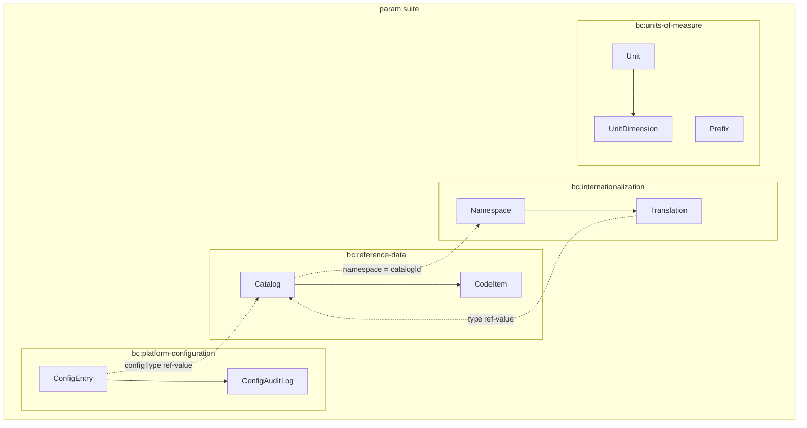
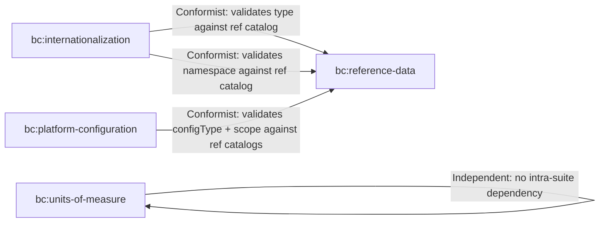
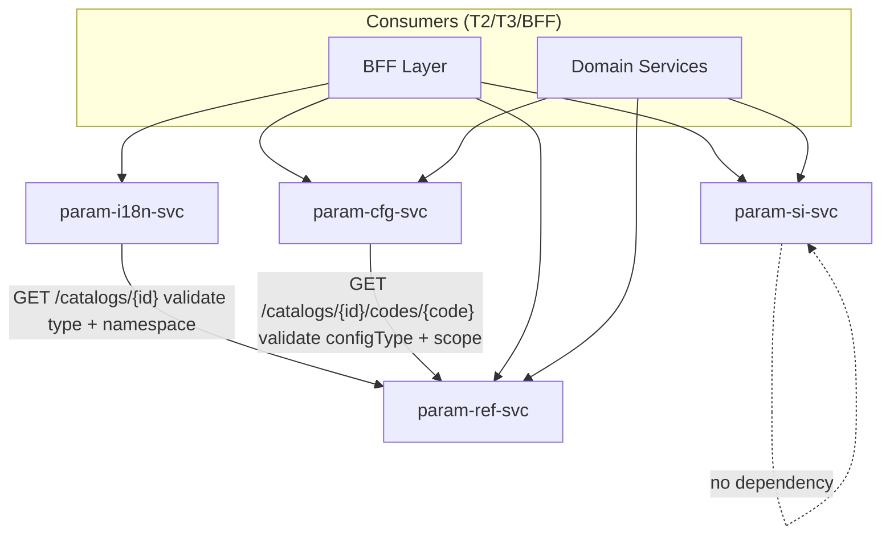
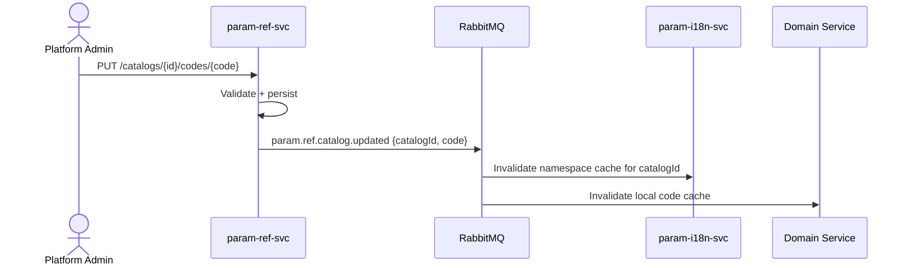
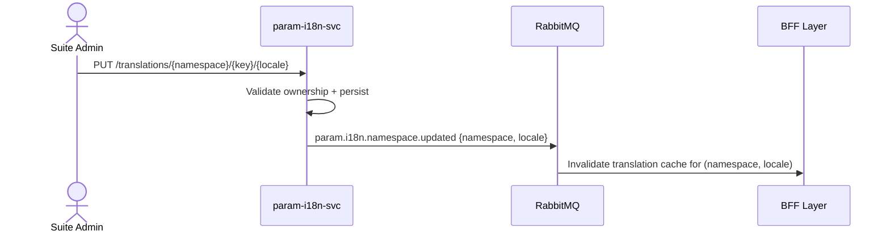
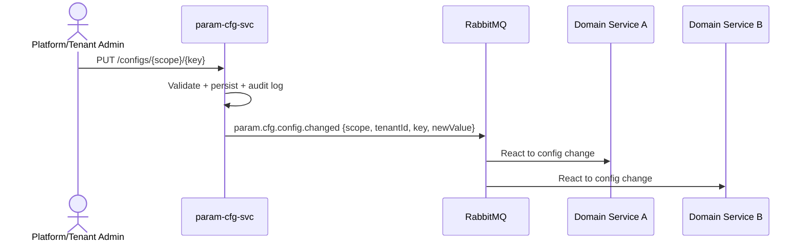

<!-- TEMPLATE COMPLIANCE: 100%
Template: suite-spec.md v1.0.0
Present sections: SS0 (Suite Identity & Purpose), SS1 (Ubiquitous Language), SS2 (Domain Model),
  SS3 (Service Landscape), SS4 (Integration Patterns), SS5 (Event Conventions),
  SS6 (Feature Catalog), SS7 (Cross-Cutting Concerns), SS8 (External Interfaces),
  SS9 (Architecture Decisions), SS10 (Roadmap), SS11 (Appendix)
Missing sections: none
Priority: N/A — fully compliant
-->

# Platform Parameterization (PARAM) Suite Specification

> **Conceptual Stack Layer:** Suite
> **Space:** Platform
> **Owner:** Platform Engineering Team
> **Schema alignment:** `suite-layer.schema.json`
> **Companion files:** `param.catalog.uvl` (referenced in SS6)
> **Contains:** Domain/Service Specs, Platform-Feature Specs, Feature Catalog

> **Meta Information**
> - **Version:** 2026-04-03
> - **Template:** `suite-spec.md` v1.0.0
> - **Template Compliance:** 100%
> - **Author(s):** OpenLeap Architecture Team
> - **Status:** DRAFT
> - **Suite ID:** `param` (pattern: `^[a-z]{2,4}$`)
> - **Suite Name:** Platform Parameterization
> - **Description:** Provides the foundational parameterization layer for the OpenLeap platform: reference codes and catalogs, internationalized translations, runtime configuration, and units of measure with SI-compliant conversion.
> - **Semantic Version:** `1.0.0`
> - **Team:**
>   - Name: `team-param`
>   - Email: `platform-core@openleap.io`
>   - Slack: `#platform-core`
> - **Bounded Contexts:** `bc:reference-data`, `bc:internationalization`, `bc:platform-configuration`, `bc:units-of-measure`

---

## Specification Guidelines

> **This specification MUST comply with the OpenLeap specification guidelines.**
>
> ### Non-Negotiables
> - Never invent facts. If required info is missing, add an **OPEN QUESTION** entry.
> - Preserve intent and decisions. Only change meaning when explicitly requested.
> - Keep the spec **self-contained**: no "see chat", no implicit context.
>
> ### Style Guide
> - Prefer short sentences and lists.
> - Use MUST/SHOULD/MAY for normative statements.
> - Keep terminology consistent with the Ubiquitous Language defined in SS1.
> - Avoid ambiguous words ("often", "maybe") unless explicitly noting uncertainty.

---

<!-- ═══════════════════════════════════════════════════════════════════
     SS0  SUITE IDENTITY & PURPOSE
     ═══════════════════════════════════════════════════════════════════ -->

## 0. Suite Identity & Purpose

### 0.1 Suite Identity

| Field | Value |
|-------|-------|
| id | `param` |
| name | Platform Parameterization |
| description | Reference codes, translations, runtime configuration, and units of measure — the read-heavy parametric foundation consumed by all tiers. |
| version | `1.0.0` |
| status | `draft` |
| owner | `team-param` (platform-core@openleap.io) |

### 0.2 Business Purpose

The Platform Parameterization suite provides the **single source of truth for all codes, labels, configuration values, and units of measure** used across the OpenLeap platform. Without this suite, every domain service would maintain its own copy of ISO standards, language packs, feature flags, and conversion logic — leading to inconsistency, drift, and duplication. The param suite centralizes these concerns into four cohesive services that share a common vocabulary around "parametric reference data that configures how other services behave."

### 0.3 Scope

**In Scope:**
- ISO and domain-specific code catalogs (countries, currencies, languages, order statuses)
- Human-readable labels and translations with locale fallback chains
- Global and tenant-scoped runtime configuration entries (feature flags, runtime parameters)
- SI unit definitions, custom units, prefixes, and dimensional-analysis-based conversion
- Administrative UI features for platform operators to manage all of the above
- Change events for consumer cache invalidation

**Out of Scope:**
- Business rules that interpret codes (e.g., "which countries are EU members") — owned by domain services
- Currency exchange rate lookups — owned by domain services
- Authentication and authorization — owned by the `iam` suite
- Document storage, reporting, job scheduling — owned by the `tech` suite
- Business Partner master data — owned by `bp` suite (T2)

### 0.4 Target Users

| User Type | Interest |
|-----------|----------|
| Platform Administrator | Manages catalogs, translations, and global configuration |
| Tenant Administrator | Manages tenant-scoped configuration and translation overrides |
| Domain Service Team | Consumes codes, labels, config values, and unit conversions via REST APIs |
| BFF Layer | Resolves labels for display, loads config for feature gating, formats quantities |
| Integration Engineer | Subscribes to change events for cache invalidation |

### 0.5 Business Value

- **Single source of truth** for codes, labels, config, and units — eliminates data drift
- **No-code extensibility** — new catalogs, translations, config types, and custom units can be added without service redeployment
- **Tenant isolation** — tenant-scoped translations and configuration enable per-customer parameterization
- **Standards compliance** — SI units with dimensional analysis prevent physically meaningless conversions
- **Cache-friendly architecture** — read-heavy, event-driven invalidation enables p95 < 10ms resolution at the BFF

---

<!-- ═══════════════════════════════════════════════════════════════════
     SS1  UBIQUITOUS LANGUAGE
     ═══════════════════════════════════════════════════════════════════ -->

## 1. Ubiquitous Language

### 1.1 Glossary

| ID | Term | Aliases | Definition |
|----|------|---------|------------|
| `param:glossary:catalog` | Catalog | Codelist, Code Table, Katalog | A named collection of code items that represents a controlled vocabulary. Platform catalogs (e.g., `countries`) are managed by the platform team; domain catalogs (e.g., `sd.order-status`) are contributed by T2/T3 suites. |
| `param:glossary:code-item` | Code Item | Code, Code Value, Eintrag | A single entry within a catalog, identified by a unique code string (e.g., `DE`, `EUR`, `OPEN`). Code items carry no human-readable label — labels live in the i18n domain. |
| `param:glossary:catalog-scope` | Catalog Scope | Scope, Gültigkeitsbereich | Whether a catalog is owned by the platform (`PLATFORM`) or contributed by a domain suite (`DOMAIN`). Determines who may create, update, or deprecate codes. |
| `param:glossary:namespace` | Namespace | i18n Namespace, Namensraum | A logical grouping of translation keys. For CATALOG translations, the namespace equals the `catalogId`. For MESSAGE translations, the namespace equals a Feature Leaf ID (`F-{SUITE}-{NNN}-{NN}`). |
| `param:glossary:translation` | Translation | Label, Übersetzung | A locale-specific string value for a `(namespace, key)` pair. The translation service resolves labels through a fallback chain: exact locale → parent language → default → key itself. |
| `param:glossary:translation-type` | Translation Type | Übersetzungstyp | Classifies a translation as either `CATALOG` (label for a code value) or `MESSAGE` (UI string for a feature). Derived from the namespace pattern. Managed as a ref-value in the `translation-type` catalog. |
| `param:glossary:fallback-chain` | Fallback Chain | Locale Resolution, Auflösungskette | The ordered sequence used to resolve a translation: exact locale (e.g., `de-DE`) → parent language (`de`) → default locale (`default`) → key itself (last resort). |
| `param:glossary:config-entry` | Config Entry | Configuration Parameter, Konfigurationseintrag | A runtime configuration value identified by `(scope, tenantId, key)`. Values are always strings; `configType` describes interpretation. Global entries affect all tenants; tenant entries override per-tenant. |
| `param:glossary:config-scope` | Config Scope | Konfigurationsbereich | Whether a config entry is `GLOBAL` (platform-wide) or `TENANT` (tenant-specific). Global entries require `PLATFORM_ADMIN` to change. |
| `param:glossary:config-type` | Config Type | Konfigurationstyp | Classifies a config entry's interpretation: `RUN_FLAG` (boolean on/off), `FEATURE_FLAG` (UVL runtime binding), or `PARAMETER` (arbitrary typed value). Managed as a ref-value. |
| `param:glossary:well-known-key` | Well-Known Key | Reservierter Schlüssel | A global config key with documented, stable semantics (e.g., `platform.maintenance-mode`). Well-known keys are protected — they cannot be deleted and their semantics are governed by the platform team. |
| `param:glossary:base-unit` | Base Unit | SI-Basiseinheit | One of the 7 fundamental SI units: metre, kilogram, second, ampere, kelvin, mole, candela. Base units are immutable seed data. |
| `param:glossary:derived-unit` | Derived Unit | Abgeleitete Einheit | A unit defined in terms of base units via dimensional exponents and a conversion factor (e.g., Newton = kg·m/s²). |
| `param:glossary:prefix` | Prefix | SI-Präfix, Vorsatz | A decimal multiplier applied to a unit (e.g., kilo = 10³, milli = 10⁻³). Only applicable to units with `allowPrefix = true`. |
| `param:glossary:dimensional-signature` | Dimensional Signature | Dimensionssignatur | A canonical string encoding the 7 base-dimension exponents of a unit (e.g., Newton = `L^1;M^1;T^-2;I^0;Th^0;N^0;J^0`). Two units are convertible if and only if their signatures match. |
| `param:glossary:quantity` | Quantity | Messwert, Größe | A transient value object pairing a `BigDecimal` value with a `Unit`. Used in conversion API requests/responses but never persisted by the si service. |
| `param:glossary:affine-conversion` | Affine Conversion | Affine Umrechnung | A conversion requiring both factor and offset (e.g., Celsius → Kelvin: `K = C × 1 + 273.15`). Affine units MUST NOT appear in compound expressions. |

### 1.2 UBL Boundary Test

| Term | Meaning in `param` | Meaning in `iam` | Translation needed? |
|------|--------------------|--------------------|---------------------|
| Scope | Config scope (`GLOBAL`/`TENANT`) — determines visibility of a config entry | Permission scope — determines what a permission grants access to | Yes — same word, different concept. Cross-suite references use fully qualified terms. |
| Tenant | The tenant context that scopes config entries and translation overrides | The organizational entity managed by `iam-tenant-svc` | No — same concept, same meaning. `tenantId` is shared kernel from IAM. |
| Key | A configuration key string or a translation key within a namespace | An API key credential managed by `iam-principal-svc` | Yes — same word, different concept. |

| Term | Meaning in `param` | Meaning in `tech` | Translation needed? |
|------|--------------------|--------------------|---------------------|
| Template | Not used in param | A Jasper/report template in `tech-rpt-svc` | N/A — no collision. |
| Code | A code item value within a catalog (e.g., `DE`, `EUR`) | Not used as domain term in tech | N/A — no collision. |

---

<!-- ═══════════════════════════════════════════════════════════════════
     SS2  DOMAIN MODEL
     ═══════════════════════════════════════════════════════════════════ -->

## 2. Domain Model

### 2.1 Conceptual Overview



### 2.2 Core Concepts

| Concept | Bounded Context | Glossary Ref | Description |
|---------|----------------|--------------|-------------|
| Catalog | `bc:reference-data` | `param:glossary:catalog` | Named collection of code items with scope governance |
| CodeItem | `bc:reference-data` | `param:glossary:code-item` | Single code entry within a catalog |
| Translation | `bc:internationalization` | `param:glossary:translation` | Locale-specific string for a (namespace, key) pair |
| Namespace | `bc:internationalization` | `param:glossary:namespace` | Logical grouping of translation keys |
| ConfigEntry | `bc:platform-configuration` | `param:glossary:config-entry` | Runtime config value with scope and audit trail |
| ConfigAuditLog | `bc:platform-configuration` | — | Immutable record of config mutations |
| Unit | `bc:units-of-measure` | `param:glossary:derived-unit` | Unit of measurement with conversion factor |
| Prefix | `bc:units-of-measure` | `param:glossary:prefix` | SI decimal multiplier |
| DimensionalSignature | `bc:units-of-measure` | `param:glossary:dimensional-signature` | 7-exponent vector for compatibility checking |

### 2.3 Shared Kernel Types

The param suite consumes `tenantId` (UUID) as a shared kernel type from the IAM suite. It is propagated via JWT claim → HTTP header `X-Tenant-ID` → event envelope `tenantId` field.

No shared kernel types are exported by the param suite — each bounded context owns its aggregates independently. Cross-context references are by value (e.g., `catalogId` as a string, not an entity reference).

### 2.4 Bounded Context Map (Intra-Suite)



**Pattern justification:**
- `bc:internationalization` is a **Conformist** to `bc:reference-data` — it validates `TranslationType` and CATALOG namespace existence against ref catalogs. The dependency is unidirectional; ref has no knowledge of i18n.
- `bc:platform-configuration` is a **Conformist** to `bc:reference-data` — it validates `configType` and `configScope` as ref-values. The dependency is unidirectional.
- `bc:units-of-measure` is **Independent** — it has no intra-suite dependencies. It bootstraps from SI standard seed data.
- `bc:reference-data` is the **upstream** context within the suite. It has no dependencies on other param contexts.

---

<!-- ═══════════════════════════════════════════════════════════════════
     SS3  SERVICE LANDSCAPE
     ═══════════════════════════════════════════════════════════════════ -->

## 3. Service Landscape

### 3.1 Service Catalog

| Service ID | Name | Bounded Context | Status | Responsibility | Spec Reference |
|-----------|------|----------------|--------|----------------|----------------|
| `param-ref-svc` | Reference Data Service | `bc:reference-data` | active | Authoritative source for all codes and catalogs (ISO and domain-specific). Provides codes only — never labels. | `domain-specs/param_ref-spec.md` |
| `param-i18n-svc` | Internationalization Service | `bc:internationalization` | active | Authoritative source for all human-readable labels and translations. Resolves locale fallback chains. | `domain-specs/param_i18n-spec.md` |
| `param-cfg-svc` | Platform Configuration Service | `bc:platform-configuration` | active | Runtime configuration store for global and tenant-scoped entries. Emits change events for cache invalidation. | `domain-specs/param_cfg-spec.md` |
| `param-si-svc` | SI Unit Service | `bc:units-of-measure` | active | Unit definitions, SI prefixes, and dimensional-analysis-based conversion with arbitrary precision. | `domain-specs/param_si-spec.md` |

### 3.2 Responsibility Matrix

| Capability | ref | i18n | cfg | si |
|-----------|-----|------|-----|------|
| Code validation | ✓ (authoritative) | | | |
| Catalog CRUD | ✓ | | | |
| Label resolution | | ✓ (authoritative) | | |
| Translation CRUD | | ✓ | | |
| Locale fallback | | ✓ | | |
| Runtime config read/write | | | ✓ (authoritative) | |
| Config change audit | | | ✓ | |
| Feature flag resolution | | | ✓ | |
| Unit catalog | | | | ✓ (authoritative) |
| Unit conversion | | | | ✓ |
| Dimensional analysis | | | | ✓ |
| Prefix formatting | | | | ✓ |

### 3.3 Dependency Diagram



---

<!-- ═══════════════════════════════════════════════════════════════════
     SS4  INTEGRATION PATTERNS
     ═══════════════════════════════════════════════════════════════════ -->

## 4. Integration Patterns

### 4.1 Pattern Decision

**Primary pattern:** Event-Driven Architecture (EDA) for change notification + Synchronous REST for lookups.

**Rationale:** The param suite is read-heavy (>99% reads). Consumers cache parametric data locally. When data changes, the authoritative service publishes an event so consumers can invalidate their caches. The write path is low-frequency (admin operations). Synchronous REST is appropriate for lookups because consumers need immediate, consistent responses.

### 4.2 Event Flows

#### Flow 1: Catalog Code Change → Consumer Cache Invalidation



#### Flow 2: Translation Update → BFF Cache Invalidation



#### Flow 3: Config Entry Change → All Consumers



### 4.3 Sync vs Async Decision

| Operation | Pattern | Rationale |
|-----------|---------|-----------|
| Code validation on write | Sync REST | Consumer needs immediate accept/reject |
| Label resolution for display | Sync REST (cached) | BFF needs labels before rendering |
| Config lookup on startup | Sync REST | Service must have config before accepting traffic |
| Cache invalidation | Async Event | Eventual consistency is acceptable (TTL < 1s) |
| Audit log creation | Sync (within transaction) | Audit MUST NOT be lost if write succeeds |

### 4.4 Error Handling

| Failure | Handling |
|---------|----------|
| ref-svc unavailable during i18n write validation | i18n-svc returns 503; admin retries |
| Event publish fails (RabbitMQ down) | Transactional outbox guarantees delivery on recovery |
| Consumer misses event | Short TTL cache (1 hour max) ensures eventual refresh |

---

<!-- ═══════════════════════════════════════════════════════════════════
     SS5  EVENT CONVENTIONS
     ═══════════════════════════════════════════════════════════════════ -->

## 5. Event Conventions

### 5.1 Routing Key Pattern

**Pattern:** `param.{domain}.{aggregate}.{action}`

| Segment | Values | Description |
|---------|--------|-------------|
| `param` | fixed | Suite prefix |
| `{domain}` | `ref`, `i18n`, `cfg`, `si` | Domain short code |
| `{aggregate}` | e.g., `catalog`, `namespace`, `config`, `unit` | Aggregate name (singular, lowercase) |
| `{action}` | `created`, `updated`, `deleted`, `changed`, `deprecated` | Past-tense verb |

**Examples:**
- `param.ref.catalog.created`
- `param.ref.catalog.updated`
- `param.i18n.namespace.updated`
- `param.cfg.config.changed`
- `param.si.unit.created`

### 5.2 Payload Envelope

All events follow the platform-standard envelope:

```json
{
  "eventId": "uuid",
  "eventType": "param.{domain}.{aggregate}.{action}",
  "timestamp": "ISO-8601",
  "tenantId": "uuid",
  "correlationId": "uuid",
  "causationId": "uuid (optional)",
  "producer": "param-{domain}-svc",
  "schemaVersion": "1.0.0",
  "payload": { }
}
```

### 5.3 Versioning Strategy

- Event schemas are versioned via `schemaVersion` in the envelope.
- Breaking changes increment the major version and introduce a new routing key suffix (e.g., `param.ref.catalog.updated.v2`).
- Non-breaking additions (new optional fields) increment the minor version.

### 5.4 Event Catalog

| Routing Key | Producer | Trigger | Payload Summary |
|-------------|----------|---------|-----------------|
| `param.ref.catalog.created` | `param-ref-svc` | New catalog registered | `{ catalogId, scope, codeCount }` |
| `param.ref.catalog.updated` | `param-ref-svc` | Catalog metadata or codes changed | `{ catalogId, changedCodes[] }` |
| `param.ref.catalog.deprecated` | `param-ref-svc` | Catalog marked deprecated | `{ catalogId, deprecatedAt }` |
| `param.i18n.namespace.updated` | `param-i18n-svc` | Translation(s) changed in a namespace | `{ namespace, locale, changedKeys[] }` |
| `param.i18n.namespace.seeded` | `param-i18n-svc` | Bulk seed completed for a namespace | `{ namespace, keyCount, locales[] }` |
| `param.cfg.config.changed` | `param-cfg-svc` | Config entry created/updated/deleted | `{ scope, tenantId, key, configType, previousValue, newValue }` |
| `param.si.unit.created` | `param-si-svc` | Custom unit registered | `{ unitId, symbol, dimensionalSignature }` |
| `param.si.unit.deleted` | `param-si-svc` | Custom unit removed | `{ unitId, symbol }` |

### 5.5 Exchange & Queue Naming

| Exchange | Type | Durable |
|----------|------|---------|
| `param.ref.events` | topic | yes |
| `param.i18n.events` | topic | yes |
| `param.cfg.events` | topic | yes |
| `param.si.events` | topic | yes |

**Consumer queue naming:** `<consumerSuite>.<consumerDomain>.in.param.{domain}.events`

Example: `sd.ord.in.param.ref.events` — the `sd-ord-svc` consuming ref catalog change events.

---

<!-- ═══════════════════════════════════════════════════════════════════
     SS6  FEATURE CATALOG
     ═══════════════════════════════════════════════════════════════════ -->

## 6. Feature Catalog

> **Note:** T1 services are platform infrastructure and by default do not own user-facing features (see CONCEPTUAL_STACK §7.3). However, the param suite provides administrative UIs for platform and tenant operators to manage reference data, translations, configuration, and units. These administrative features follow the same feature specification process as T2/T3 features, per the precedent established by the IAM suite (ADR-PARAM-001).

### 6.1 Feature Tree

```
PARAM Suite  [ROOT]
├── F-PARAM-001  Reference Data Management  [COMPOSITION]  mandatory
│   ├── F-PARAM-001-01  Browse Catalogs  [LEAF]  mandatory
│   ├── F-PARAM-001-02  Manage Catalog Codes  [LEAF]  mandatory
│   └── F-PARAM-001-03  Bulk Import/Export  [LEAF]  optional
│
├── F-PARAM-002  Translation Management  [COMPOSITION]  mandatory
│   ├── F-PARAM-002-01  Browse Translations  [LEAF]  mandatory
│   ├── F-PARAM-002-02  Edit Translations  [LEAF]  mandatory
│   └── F-PARAM-002-03  Seed Translation Bundles  [LEAF]  optional
│
├── F-PARAM-003  Configuration Management  [COMPOSITION]  mandatory
│   ├── F-PARAM-003-01  Browse Configuration  [LEAF]  mandatory
│   ├── F-PARAM-003-02  Edit Configuration Entry  [LEAF]  mandatory
│   └── F-PARAM-003-03  Configuration Audit Trail  [LEAF]  optional
│
└── F-PARAM-004  Unit Management  [COMPOSITION]  optional
    ├── F-PARAM-004-01  Browse Units & Prefixes  [LEAF]  mandatory
    ├── F-PARAM-004-02  Manage Custom Units  [LEAF]  optional
    └── F-PARAM-004-03  Unit Conversion Tool  [LEAF]  optional
```



```mermaid
graph TD
    ROOT[PARAM Suite]

    ROOT --> F001[F-PARAM-001<br/>Reference Data Management]
    ROOT --> F002[F-PARAM-002<br/>Translation Management]
    ROOT --> F003[F-PARAM-003<br/>Configuration Management]
    ROOT --> F004[F-PARAM-004<br/>Unit Management]

    F001 --> F001_01[F-PARAM-001-01<br/>Browse Catalogs]
    F001 --> F001_02[F-PARAM-001-02<br/>Manage Catalog Codes]
    F001 --> F001_03[F-PARAM-001-03<br/>Bulk Import/Export]

    F002 --> F002_01[F-PARAM-002-01<br/>Browse Translations]
    F002 --> F002_02[F-PARAM-002-02<br/>Edit Translations]
    F002 --> F002_03[F-PARAM-002-03<br/>Seed Translation Bundles]

    F003 --> F003_01[F-PARAM-003-01<br/>Browse Configuration]
    F003 --> F003_02[F-PARAM-003-02<br/>Edit Configuration Entry]
    F003 --> F003_03[F-PARAM-003-03<br/>Configuration Audit Trail]

    F004 --> F004_01[F-PARAM-004-01<br/>Browse Units & Prefixes]
    F004 --> F004_02[F-PARAM-004-02<br/>Manage Custom Units]
    F004 --> F004_03[F-PARAM-004-03<br/>Unit Conversion Tool]

    style F001_03 stroke-dasharray: 5 5
    style F002_03 stroke-dasharray: 5 5
    style F003_03 stroke-dasharray: 5 5
    style F004 stroke-dasharray: 5 5
    style F004_02 stroke-dasharray: 5 5
    style F004_03 stroke-dasharray: 5 5
```

### 6.2 Mandatory Features

All products that include the PARAM suite MUST include:
- F-PARAM-001-01 (Browse Catalogs) and F-PARAM-001-02 (Manage Catalog Codes) — platform operators must be able to view and manage reference codes.
- F-PARAM-002-01 (Browse Translations) and F-PARAM-002-02 (Edit Translations) — translations are required for any UI-bearing product.
- F-PARAM-003-01 (Browse Configuration) and F-PARAM-003-02 (Edit Configuration Entry) — runtime config management is essential for all deployments.
- If F-PARAM-004 (Unit Management) is included, F-PARAM-004-01 (Browse Units & Prefixes) is mandatory within that composition.

### 6.3 Cross-Suite Feature Dependencies

| Feature | Requires | Suite | Rationale |
|---------|----------|-------|-----------|
| All PARAM features | IAM authentication | `iam` | All admin features require authenticated access |
| F-PARAM-001-02 | `iam-authz-svc` permission check | `iam` | Catalog code mutations require `PARAM_REF_ADMIN` or `{SUITE}_ADMIN` role |
| F-PARAM-002-02 | `iam-authz-svc` permission check | `iam` | Translation mutations require namespace ownership |
| F-PARAM-003-02 | `iam-authz-svc` permission check | `iam` | Config mutations require `PLATFORM_ADMIN` (global) or `TENANT_ADMIN` (tenant) |
| F-PARAM-004-02 | `iam-authz-svc` permission check | `iam` | Custom unit creation requires `PLATFORM_ADMIN` |

### 6.4 Feature Register

| ID | Name | Status | Spec Path |
|----|------|--------|-----------|
| `F-PARAM-001` | Reference Data Management | `development` | `features/compositions/F-PARAM-001.md` |
| `F-PARAM-001-01` | Browse Catalogs | `development` | `features/leaves/F-PARAM-001-01/feature-spec.md` |
| `F-PARAM-001-02` | Manage Catalog Codes | `development` | `features/leaves/F-PARAM-001-02/feature-spec.md` |
| `F-PARAM-001-03` | Bulk Import/Export | `planned` | `features/leaves/F-PARAM-001-03/feature-spec.md` |
| `F-PARAM-002` | Translation Management | `development` | `features/compositions/F-PARAM-002.md` |
| `F-PARAM-002-01` | Browse Translations | `development` | `features/leaves/F-PARAM-002-01/feature-spec.md` |
| `F-PARAM-002-02` | Edit Translations | `development` | `features/leaves/F-PARAM-002-02/feature-spec.md` |
| `F-PARAM-002-03` | Seed Translation Bundles | `planned` | `features/leaves/F-PARAM-002-03/feature-spec.md` |
| `F-PARAM-003` | Configuration Management | `development` | `features/compositions/F-PARAM-003.md` |
| `F-PARAM-003-01` | Browse Configuration | `development` | `features/leaves/F-PARAM-003-01/feature-spec.md` |
| `F-PARAM-003-02` | Edit Configuration Entry | `development` | `features/leaves/F-PARAM-003-02/feature-spec.md` |
| `F-PARAM-003-03` | Configuration Audit Trail | `planned` | `features/leaves/F-PARAM-003-03/feature-spec.md` |
| `F-PARAM-004` | Unit Management | `draft` | `features/compositions/F-PARAM-004.md` |
| `F-PARAM-004-01` | Browse Units & Prefixes | `draft` | `features/leaves/F-PARAM-004-01/feature-spec.md` |
| `F-PARAM-004-02` | Manage Custom Units | `planned` | `features/leaves/F-PARAM-004-02/feature-spec.md` |
| `F-PARAM-004-03` | Unit Conversion Tool | `planned` | `features/leaves/F-PARAM-004-03/feature-spec.md` |

### 6.5 Variability Summary

| Metric | Value |
|--------|-------|
| Total composition nodes | 4 |
| Total leaf features | 12 |
| Mandatory features | 7 |
| Optional features | 5 |
| Cross-suite `requires` | 5 (all → `iam`) |
| Binding times used | `deploy`, `runtime` |

---

<!-- ═══════════════════════════════════════════════════════════════════
     SS7  CROSS-CUTTING CONCERNS
     ═══════════════════════════════════════════════════════════════════ -->

## 7. Cross-Cutting Concerns

### 7.1 Compliance

| Regulation | Requirement | Implementation |
|-----------|-------------|----------------|
| GDPR (EU) | Translation data is not personal. Config entries MAY contain tenant-identifying labels. | Config audit logs that reference admin identities follow IAM GDPR retention. |
| ISO 27001 | Information security management | Role-based write access, audit logging on config changes, encryption in transit. |

### 7.2 Security

| Aspect | Approach |
|--------|---------|
| **Authentication** | All endpoints require a valid JWT bearer token. Delegated to Keycloak via IAM suite. |
| **Authorization** | Read access: `ANY_AUTHENTICATED`. Write access: role-gated per domain — `PLATFORM_ADMIN`, `{SUITE}_ADMIN`, `TENANT_ADMIN`. Deny-by-default. |
| **Data Classification** | Reference codes: Public/Internal. Translations: Internal. Config values: Internal (may contain Confidential flags). Unit data: Public. |
| **Encryption** | TLS 1.3 in transit. AES-256 at rest for config entries. |

### 7.3 Multi-Tenancy

| Aspect | Value |
|--------|-------|
| **Model** | `shared_schema` |
| **Isolation** | Row-Level Security (RLS) via `tenant_id` on config entries and tenant-scoped translations. Reference codes and units are tenant-agnostic (platform-scoped). |
| **Tenant ID Propagation** | JWT claim `tenant_id` → HTTP header `X-Tenant-ID` → Event envelope `tenantId` field |

**Rules:**
- Config entries with `scope = TENANT` MUST include `tenant_id` and are isolated via RLS.
- Config entries with `scope = GLOBAL` have `tenant_id = NULL` and are visible to all tenants.
- Reference catalogs are platform-scoped — visible to all tenants, writable only by platform/suite admins.
- Translations are platform-scoped by default; tenant-specific translation overrides MAY be introduced in a future phase.
- SI units and prefixes are platform-scoped — no tenant isolation needed.

### 7.4 Audit

**Audit Requirements:**
- All config entry mutations MUST be recorded in `ConfigAuditLog` (within the same transaction).
- Catalog code mutations SHOULD be traceable via domain events (no dedicated audit table; events are the audit trail).
- Translation mutations SHOULD be traceable via domain events.
- SI unit mutations (custom units only) SHOULD be traceable via domain events.

**Retention Policies:**

| Entity / Data Class | Retention Period | Legal Basis | Action After Expiry |
|--------------------|-----------------|-------------|-------------------|
| ConfigAuditLog entries | 7 years | SOX, ISO 27001 | `archive` to cold storage |
| Config change events | 90 days in MQ | Internal policy | Auto-expire from queue |
| Reference data events | 90 days in MQ | Internal policy | Auto-expire from queue |
| Translation events | 90 days in MQ | Internal policy | Auto-expire from queue |

---

<!-- ═══════════════════════════════════════════════════════════════════
     SS8  EXTERNAL INTERFACES
     ═══════════════════════════════════════════════════════════════════ -->

## 8. External Interfaces

### 8.1 Outbound (param → other suites)

| Target Suite | Interface Type | Interface Name | Description |
|-------------|---------------|----------------|-------------|
| `iam` | API (inbound) | JWT validation | All param services validate JWT tokens issued by Keycloak (IAM) |
| `iam` | API (inbound) | Permission check | Write operations call `iam-authz-svc` for role verification |

### 8.2 Inbound (other suites → param)

| Source Suite | Interface Type | Interface Name | Description |
|-------------|---------------|----------------|-------------|
| All T2/T3 suites | API | Code validation | Domain services validate codes against `param-ref-svc` on write |
| All T2/T3 suites | API | Label resolution | BFF resolves labels via `param-i18n-svc` for display |
| All T2/T3 suites | API | Config lookup | Services read runtime config from `param-cfg-svc` on startup and on event |
| PPS, FAC, OPS | API | Unit conversion | Domain services delegate unit operations to `param-si-svc` |
| All T2/T3 suites | Event | Cache invalidation | Consumers subscribe to `param.*.events` for cache busting |

### 8.3 External Context Mapping

| External Suite | DDD Pattern | Rationale |
|---------------|-------------|-----------|
| `iam` | **Customer-Supplier** (param is customer) | param consumes IAM for authentication and authorization. IAM has no dependency on param. |
| All T2/T3 | **Open Host Service** (param is supplier) | param exposes stable REST APIs and event contracts. Consumers are free to cache and interpret data. |
| `tech` | **Separate Ways** | No direct dependency between param and tech suites. |

---

<!-- ═══════════════════════════════════════════════════════════════════
     SS9  ARCHITECTURE DECISIONS
     ═══════════════════════════════════════════════════════════════════ -->

## 9. Architecture Decisions

### ADR-PARAM-001: T1 Administrative Features

**Status:** Accepted

**Context:** The Conceptual Stack (§7.3) states that T1 services do not own user-facing features. However, param services require administrative UIs for platform operators to manage catalogs, translations, configuration, and units.

**Decision:** The param suite defines administrative features following the same specification process as T2/T3 features, consistent with the precedent established by the IAM suite.

**Consequences:**
- Positive: Full feature specification coverage for admin UIs
- Positive: AUI contracts enable platform-free UI generation
- Negative: Increases specification volume for a T1 suite

### ADR-PARAM-002: Ref-Service as Intra-Suite Hub

**Status:** Accepted

**Context:** Both i18n-svc and cfg-svc need to validate typed values (TranslationType, ConfigType, ConfigScope) against controlled vocabularies.

**Decision:** The `param-ref-svc` serves as the validation hub within the suite. Types are stored as ref-values in managed catalogs, not as hardcoded enums.

**Consequences:**
- Positive: New types can be added without code changes in consuming services
- Positive: Single source of truth for all controlled vocabularies
- Negative: i18n-svc and cfg-svc have a synchronous dependency on ref-svc at write time

### ADR-PARAM-003: SI Service Independence

**Status:** Accepted

**Context:** The si-svc manages units of measure based on the International System of Units. It bootstraps from SI standard seed data and has no dependency on reference codes.

**Decision:** The `param-si-svc` is independent within the suite — it has no intra-suite dependency on ref-svc, i18n-svc, or cfg-svc.

**Consequences:**
- Positive: si-svc can be deployed and operated independently
- Positive: No circular dependency risk
- Negative: Unit-of-measure codes in ref-svc (if needed by other suites) must be seeded separately

### ADR-PARAM-004: Suite Prefix Migration from `t1`

**Status:** Accepted

**Context:** The four param services historically used the `t1` prefix (e.g., `t1-ref-svc`, `t1.ref.events`). The restructuring into the param suite requires a prefix migration.

**Decision:** API paths migrate from `/api/t1/{domain}/v1` to `/api/param/{domain}/v1`. Event routing keys migrate from `t1.{domain}.*` to `param.{domain}.*`. A compatibility period of 6 months MUST be maintained during which both old and new prefixes are supported.

**Consequences:**
- Positive: Clean suite boundary, consistent naming
- Negative: Migration effort for all consumers
- Mitigation: Dual-prefix routing during transition period

---

<!-- ═══════════════════════════════════════════════════════════════════
     SS10  ROADMAP
     ═══════════════════════════════════════════════════════════════════ -->

## 10. Roadmap

| Phase | Timeframe | Items |
|-------|-----------|-------|
| Phase 1 — Foundation | Q2 2026 | Suite spec finalization, feature specs for all mandatory leaves, AUI contracts, prefix migration plan |
| Phase 2 — Admin UIs | Q3 2026 | CUI implementation for mandatory features, bulk import/export (F-PARAM-001-03), seed bundles (F-PARAM-002-03) |
| Phase 3 — Advanced | Q4 2026 | Config audit trail UI (F-PARAM-003-03), custom unit management (F-PARAM-004-02), unit conversion tool (F-PARAM-004-03), tenant-scoped translation overrides |

---

<!-- ═══════════════════════════════════════════════════════════════════
     SS11  APPENDIX
     ═══════════════════════════════════════════════════════════════════ -->

## 11. Appendix

### 11.1 Change Log

| Date | Version | Author | Changes |
|------|---------|--------|---------|
| 2026-04-03 | 1.0.0 | OpenLeap Architecture Team | Initial suite specification — consolidation from standalone T1 domain specs |

### 11.2 Review & Approval

**Status:** DRAFT

**Reviewers:**

| Role | Name | Date | Status |
|------|------|------|--------|
| Suite Architect | TBD | — | [ ] Reviewed |
| Domain Lead (ref) | TBD | — | [ ] Reviewed |
| Domain Lead (i18n) | TBD | — | [ ] Reviewed |
| Domain Lead (cfg) | TBD | — | [ ] Reviewed |
| Domain Lead (si) | TBD | — | [ ] Reviewed |
| Product Owner | TBD | — | [ ] Reviewed |

**Approval:**

| Role | Name | Date | Approved |
|------|------|------|----------|
| Suite Architect | TBD | — | [ ] |
| Engineering Manager | TBD | — | [ ] |

---

## Authoring Checklist

> Before moving to REVIEW status, verify:

- [x] Suite ID follows pattern `^[a-z]{2,4}$` (SS0)
- [x] Business purpose is at least 50 characters (SS0)
- [x] In-scope and out-of-scope are concrete and mutually exclusive (SS0)
- [x] UBL glossary has entries for every core concept (SS1)
- [x] Every glossary definition is at least 20 characters (SS1)
- [x] UBL boundary test demonstrates vocabulary distinction from at least one related suite (SS1)
- [x] Every core concept in SS2 has a glossary_ref back to SS1 (SS2)
- [x] Shared kernel types define authoritative attributes (SS2)
- [x] Bounded context map uses valid DDD patterns (SS2)
- [x] Service catalog lists all services with status and spec reference (SS3)
- [x] Integration pattern decision has rationale (SS4)
- [x] Event flows cover all major intra-suite workflows (SS4)
- [x] Routing key pattern is documented with segments and examples (SS5)
- [x] Payload envelope matches platform standard (SS5)
- [x] Event catalog lists every published event (SS5)
- [x] Feature tree is complete with mandatory/optional annotations (SS6)
- [x] Cross-suite feature dependencies are listed (SS6)
- [ ] Companion `param.catalog.uvl` is created and matches SS6 tree (SS6)
- [x] Compliance requirements list all applicable regulations (SS7)
- [x] Multi-tenancy model is specified (SS7)
- [x] Retention policies have legal basis (SS7)
- [x] External interfaces document all cross-suite communication (SS8)
- [x] External context mapping uses valid DDD patterns (SS8)
- [x] All ADRs have ID pattern `ADR-PARAM-NNN` (SS9)
- [x] Roadmap covers at least the next two phases (SS10)

---

**END OF SPECIFICATION**
