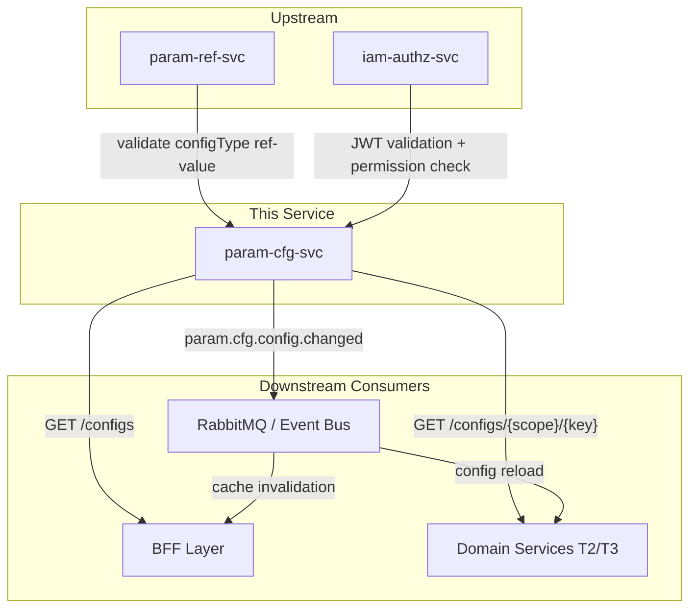
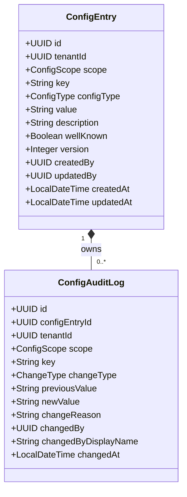
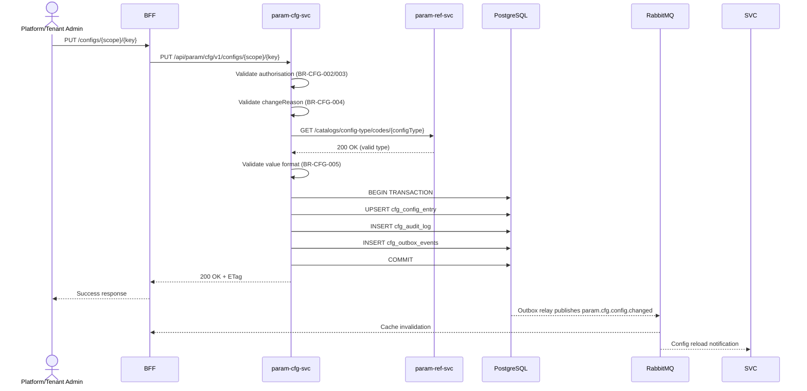
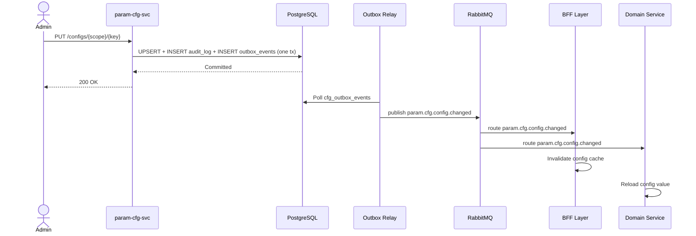
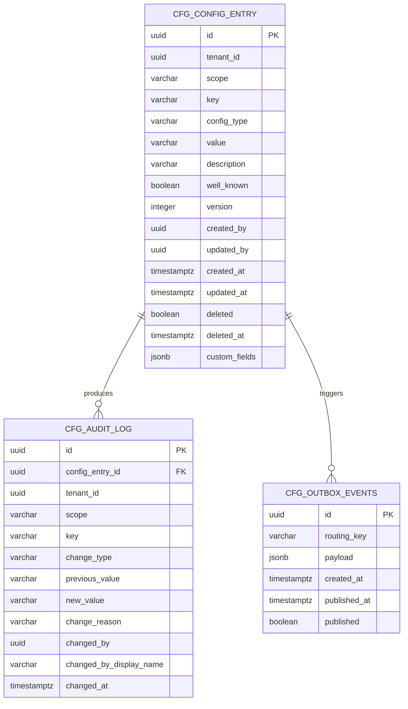

<!-- TEMPLATE COMPLIANCE: ~95%
Template: domain-service-spec.md v1.0.0
Present sections: §0-§15
-->

# param.cfg — Platform Configuration Service Domain Specification

> **Conceptual Stack Layer:** Domain / Service
> **Space:** Platform
> **Owner:** Platform Engineering Team
> **Schema alignment:** `service-layer.schema.json`
> **Companion files:** `contracts/http/param/cfg/openapi.yaml`, `contracts/events/param/cfg/config.changed.schema.json`
> **Referenced by:** Platform-Feature Spec SS5 (F-PARAM-003-01, F-PARAM-003-02, F-PARAM-003-03), BFF Contract
> **Belongs to:** PARAM Suite Spec

> **Meta Information**
> - **Version:** 2026-04-03
> - **Template:** `domain-service-spec.md` v1.0.0
> - **Template Compliance:** ~95% — fully compliant
> - **Author(s):** OpenLeap Architecture Team
> - **Status:** DRAFT
> - **Suite:** `param` (Platform Parameterization)
> - **Domain:** `cfg` (Platform Configuration)
> - **Bounded Context Ref:** `bc:platform-configuration`
> - **Service ID:** `param-cfg-svc`
> - **basePackage:** `io.openleap.param.cfg`
> - **API Base Path:** `/api/param/cfg/v1`
> - **OpenLeap Starter Version:** `v4.1.0`
> - **Port:** `8102`
> - **Repository:** `https://github.com/openleap-io/io.openleap.param.cfg`
> - **Tags:** `param`, `cfg`, `configuration`, `feature-flags`, `platform`
> - **Team:**
>   - Name: `team-param`
>   - Email: `platform-core@openleap.io`
>   - Slack: `#platform-core`

---

## Specification Guidelines Compliance

> ### Non-Negotiables
> - Never invent facts. If required info is missing, add an **OPEN QUESTION** entry.
> - Preserve intent and decisions. Only change meaning when explicitly requested.
> - Do not remove normative constraints unless they are explicitly replaced.
> - Keep the spec **self-contained**: no "see chat", no implicit context.
>
> ### Source of Truth Priority
> When sources conflict:
> 1. Spec (explicit) wins
> 2. Starter specs (implementation constraints) next
> 3. Guidelines (best practices) last
>
> Record conflicts in the **Decisions & Conflicts** section (see Section 14).
>
> ### Style Guide
> - Prefer short sentences and lists.
> - Use MUST/SHOULD/MAY for normative statements.
> - Keep terminology consistent (Aggregate, Domain Service, Application Service, Command, Event).
> - Avoid ambiguous words ("often", "maybe") unless explicitly noting uncertainty.
> - Keep examples minimal and clearly marked as examples.
> - Do not add implementation code unless the chapter explicitly requires it.

---

## 0. Document Purpose & Scope

### 0.1 Purpose

This specification defines the `param-cfg-svc` domain service within the Platform Parameterization suite. The service provides the authoritative runtime configuration store for all global and tenant-scoped configuration entries including feature flags, runtime parameters, and operational switches. Every mutation produces an immutable audit trail and publishes a change event so that consumers can invalidate their caches without redeployment.

### 0.2 Target Audience

- Platform Administrators & Tenant Administrators
- System Architects & Technical Leads
- BFF engineers integrating feature-gate logic
- Integration Engineers consuming config-change events
- Compliance auditors reviewing configuration change history

### 0.3 Scope

**In Scope:**
- Business domain model for configuration entries and audit logs
- Business rules governing scope-based access, well-known key protection, and change reason enforcement
- REST API contracts for reading and mutating configuration entries
- Audit trail query API
- Event contract for `param.cfg.config.changed`
- Multi-tenant data isolation via RLS
- Extension points for product-level customisation

**Out of Scope:**
- Authentication and authorisation enforcement — delegated to IAM (`iam-authz-svc`)
- Translation/label resolution — handled by `param-i18n-svc`
- Reference code validation — handled by `param-ref-svc` (upstream dependency)
- Infrastructure configuration (Kubernetes config maps, environment variables) — out of platform scope
- Application Performance Monitoring — handled by platform observability stack

### 0.4 Related Documents

- `T1_Platform/param/_param_suite.md` — PARAM Suite Architecture
- `T1_Platform/param/domain-specs/param_ref-spec.md` — Reference Data Service (upstream dependency)
- `T1_Platform/param/features/compositions/F-PARAM-003.md` — Configuration Management feature composition
- `T1_Platform/param/features/leaves/F-PARAM-003-01/feature-spec.md` — Browse Configuration
- `T1_Platform/param/features/leaves/F-PARAM-003-02/feature-spec.md` — Edit Configuration Entry
- `T1_Platform/param/features/leaves/F-PARAM-003-03/feature-spec.md` — Configuration Audit Trail
- `https://github.com/openleap-io/io.openleap.dev.concepts/blob/main/governance/bff-guideline.md` (GOV-BFF-001) — BFF pattern governance
- `T1_Platform/iam/domain-specs/iam_authz-spec.md` — Authorisation service

---

## 1. Business Context

### 1.1 Domain Purpose

The Platform Configuration domain solves the problem of hardcoded and scattered runtime settings across a multi-tenant ERP platform. Without a centralised configuration service, every domain team would embed constants, feature toggles, and operational parameters directly in code or environment variables — making tenant customisation impossible and emergency changes require full redeployments.

`param-cfg-svc` provides a structured, access-controlled, fully audited store for all runtime parameters. Platform administrators can change global settings instantly; tenant administrators can override selected values for their tenant without affecting others. Every change is recorded with who changed it, when, and why — satisfying SOX and ISO 27001 audit requirements.

### 1.2 Business Value

- **Zero-downtime operations:** Change feature flags and runtime parameters without redeployment.
- **Tenant customisation:** Tenant-scoped overrides enable per-customer parameterisation without code changes.
- **Full audit trail:** Every mutation captures actor, timestamp, reason, and before/after values for compliance.
- **Cache-friendly architecture:** Published change events let consumers invalidate caches instantly, maintaining p95 < 10ms config resolution at the BFF.
- **Well-known key protection:** Platform governance keys (e.g., `platform.maintenance-mode`) are immutable in key and scope — preventing accidental disruption.
- **SAP BC-equivalent:** Replaces SAP transaction SM30 (table view maintenance) and RSPFPAR (profile parameters) for platform-level configuration.

### 1.3 Key Stakeholders

| Role | Responsibility | Primary Use Cases |
|------|----------------|-------------------|
| Platform Administrator | Manages global config entries; sets well-known keys | Create/update GLOBAL entries; view full audit history |
| Tenant Administrator | Manages tenant-scoped overrides | Create/update TENANT entries for their tenant only |
| BFF Layer | Reads config at feature-gate evaluation time | GET /configs with scope+key lookup; cache on change event |
| Domain Service (System) | Reads config values at runtime | GET /configs/{scope}/{key} |
| Compliance Auditor | Reviews configuration changes for regulatory evidence | Browse audit trail by date range and actor |
| Integration Engineer | Subscribes to config-change events for cache invalidation | Consume `param.cfg.config.changed` events |

### 1.4 Strategic Positioning

The Platform Configuration domain is a **foundational T1 service** consumed by every tier. It MUST NOT depend on T2/T3 domain services (ADR-001). Its only upstream dependencies within the platform are `param-ref-svc` (for configType and scope ref-value validation) and `iam-authz-svc` (for permission checking).

Architecturally, this service corresponds to SAP's **BC-SEC** profile parameter management and **Customising table** infrastructure — providing a no-code, API-first equivalent for cloud-native multi-tenant ERP.

The service is intentionally simple in its domain model (one aggregate, one child entity). Complexity lives in its access control, audit requirements, and the platform-wide impact of its output. The `param.cfg.config.changed` event is consumed by virtually every service and BFF in the platform — making reliability and correctness the highest priorities.

### 1.5 Service Context

| Property | Value |
|----------|-------|
| **Suite** | `param` |
| **Domain** | `cfg` |
| **Bounded Context** | `bc:platform-configuration` |
| **Service ID** | `param-cfg-svc` |
| **Base Package** | `io.openleap.param.cfg` |

**Responsibilities:**
- Authoritative store for all global and tenant-scoped configuration entries
- Enforce scope-based access control (GLOBAL: PLATFORM_ADMIN only; TENANT: TENANT_ADMIN for own tenant)
- Protect well-known keys against deletion and key/scope mutation
- Record immutable audit log entries for every mutation
- Publish `param.cfg.config.changed` events via outbox for consumer cache invalidation
- Validate `configType` values against `param-ref-svc` reference catalog

**Authoritative Sources:**

| Source Type | Description | Access Pattern |
|-------------|-------------|----------------|
| REST API | Runtime config values, audit trail | Synchronous |
| Database | Owned: `cfg_config_entry`, `cfg_audit_log` | Direct (owner) |
| Events | Published: `param.cfg.config.changed` | Asynchronous (outbox) |



---

## 2. Service Identity

| Property | Value | Schema Field |
|----------|-------|-------------|
| **Service ID** | `param-cfg-svc` | `metadata.id` |
| **Display Name** | `Platform Configuration Service` | `metadata.name` |
| **Suite** | `param` | `metadata.suite` |
| **Domain** | `cfg` | `metadata.domain` |
| **Bounded Context** | `bc:platform-configuration` | `metadata.bounded_context_ref` |
| **Version** | `1.0.0` | `metadata.version` |
| **Status** | DRAFT | `metadata.status` |
| **API Base Path** | `/api/param/cfg/v1` | `metadata.api_base_path` |
| **Repository** | `https://github.com/openleap-io/io.openleap.param.cfg` | `metadata.repository` |
| **Tags** | `param`, `cfg`, `platform`, `configuration` | `metadata.tags` |

**Team:**

| Property | Value |
|----------|-------|
| **Name** | `team-param` |
| **Email** | `platform-core@openleap.io` |
| **Slack** | `#platform-core` |

---

## 3. Domain Model

### 3.1 Conceptual Overview

The `bc:platform-configuration` bounded context contains a single aggregate: **ConfigEntry**. A `ConfigEntry` is identified by the composite business key `(scope, tenantId, key)` and holds a typed string `value`. Every mutation to a `ConfigEntry` produces a **ConfigAuditLog** child entity — an immutable record of who changed what to what and why.

The domain is intentionally minimal: there are no cross-aggregate workflows, no saga patterns, and no complex state machines. The domain's contract complexity lies in its access control rules and the platform-wide significance of its published events.



### 3.2 Core Concepts

| Concept | Glossary Ref | Description |
|---------|-------------|-------------|
| ConfigEntry | `param:glossary:config-entry` | Aggregate root: a runtime config value identified by (scope, tenantId, key) |
| ConfigAuditLog | — | Immutable child entity: captures every mutation with actor, reason, and before/after values |
| ConfigScope | `param:glossary:config-scope` | GLOBAL (platform-wide) or TENANT (per-tenant override) |
| ConfigType | `param:glossary:config-type` | Classifies the value interpretation: RUN_FLAG, FEATURE_FLAG, or PARAMETER |
| Well-Known Key | `param:glossary:well-known-key` | Protected key with stable semantics; cannot be deleted; key and scope are immutable |
| Change Reason | — | Mandatory free-text justification for every mutation; stored in audit log |

### 3.3 Aggregate Definitions

#### ConfigEntry (Aggregate Root)

##### Aggregate Root

| Attribute | Type | Format | Description | Constraints | Required | Read-Only |
|-----------|------|--------|-------------|-------------|----------|-----------|
| `id` | `string` | `uuid` | System-generated surrogate key (OlUuid.create()) | PK | Yes | Yes |
| `tenantId` | `string` | `uuid` | Tenant owning this entry. NULL for GLOBAL entries | FK to IAM tenant | Yes | Yes |
| `scope` | `string` | `enum` | Visibility scope of this entry: GLOBAL or TENANT | enum_ref: ConfigScope | Yes | Yes (after creation) |
| `key` | `string` | — | Hierarchical config key, e.g. `platform.maintenance-mode` | max 200, pattern `^[a-z0-9][a-z0-9.\-]*[a-z0-9]$` | Yes | Yes (after creation) |
| `configType` | `string` | `enum` | How the value should be interpreted by consumers | enum_ref: ConfigType; ref-value validated against `param-ref-svc` | Yes | No |
| `value` | `string` | — | String-encoded config value | max 2000; content must conform to configType | Yes | No |
| `description` | `string` | — | Human-readable explanation of what this key controls | max 500 | No | No |
| `wellKnown` | `boolean` | — | Whether this key is protected by platform governance | System-set; only platform team may declare well-known keys | No | Yes |
| `version` | `integer` | `int32` | Optimistic locking version, incremented on each mutation | min 1 | Yes | Yes |
| `createdBy` | `string` | `uuid` | User ID who created this entry | FK to IAM principal | Yes | Yes |
| `updatedBy` | `string` | `uuid` | User ID who last updated this entry | FK to IAM principal | Yes | Yes |
| `createdAt` | `string` | `date-time` | UTC timestamp of entry creation | ISO-8601 | Yes | Yes |
| `updatedAt` | `string` | `date-time` | UTC timestamp of last mutation | ISO-8601 | Yes | Yes |

**State Descriptions:**

| State | Description | Business Meaning |
|-------|-------------|-----------------|
| `ACTIVE` | Entry exists and is readable | Config value is in use by consumers |
| `DELETED` | Entry has been soft-deleted | Key removed; prior audit logs retained for compliance |

**Allowed Transitions:**

| From State | To State | Trigger | Guard |
|------------|----------|---------|-------|
| — | `ACTIVE` | `PUT /configs/{scope}/{key}` (create) | Authorised actor; key not already present |
| `ACTIVE` | `ACTIVE` | `PUT /configs/{scope}/{key}` (update) | Authorised actor; changeReason provided; ETag matches |
| `ACTIVE` | `DELETED` | `DELETE /configs/{scope}/{key}` | Authorised actor; `wellKnown = false` |

**Domain Events Emitted:**
- `param.cfg.config.changed` (on create, update, or delete) — see §7.2

##### Child Entities

**ConfigAuditLog**

**Business Purpose:** Provides an immutable, tamper-evident record of every mutation to a ConfigEntry. Used for compliance auditing (SOX, ISO 27001) and forensic investigation.

**Collection Constraints:** Unbounded — every mutation produces exactly one audit log entry.

| Attribute | Type | Format | Description | Constraints | Required |
|-----------|------|--------|-------------|-------------|----------|
| `id` | `string` | `uuid` | Surrogate key (OlUuid.create()) | PK | Yes |
| `configEntryId` | `string` | `uuid` | FK to the parent ConfigEntry | FK | Yes |
| `tenantId` | `string` | `uuid` | Tenant context (denormalised for RLS) | — | Yes |
| `scope` | `string` | `enum` | Scope of the entry at time of change (denormalised) | enum_ref: ConfigScope | Yes |
| `key` | `string` | — | Config key at time of change (denormalised for audit durability) | max 200 | Yes |
| `changeType` | `string` | `enum` | Nature of the change | enum_ref: ChangeType | Yes |
| `previousValue` | `string` | — | Value before mutation; null for CREATED entries | max 2000, nullable | No |
| `newValue` | `string` | — | Value after mutation; null for DELETED entries | max 2000, nullable | No |
| `changeReason` | `string` | — | Mandatory justification provided by the actor | max 500, not blank | Yes |
| `changedBy` | `string` | `uuid` | User ID of the actor performing the change | FK to IAM principal | Yes |
| `changedByDisplayName` | `string` | — | Display name of actor at time of change (denormalised) | max 200 | Yes |
| `changedAt` | `string` | `date-time` | UTC timestamp of the mutation | ISO-8601 | Yes |

**Invariants:**
- BR-CFG-006: Every ConfigEntry mutation MUST produce exactly one ConfigAuditLog entry within the same transaction.
- Audit log entries are immutable — no update or delete operations are permitted on ConfigAuditLog.

##### Value Objects

None in this domain. All attributes are scalar types.

### 3.4 Enumerations

**ConfigScope**

| Value | Description | Deprecated |
|-------|-------------|------------|
| `GLOBAL` | Platform-wide entry visible to all tenants. Only PLATFORM_ADMIN may write. | No |
| `TENANT` | Tenant-specific override visible only to the owning tenant. TENANT_ADMIN may write for their own tenant. | No |

**ConfigType**

| Value | Description | Deprecated |
|-------|-------------|------------|
| `RUN_FLAG` | Boolean on/off switch. Value MUST be `"true"` or `"false"` (case-insensitive). Used for operational toggles such as maintenance mode or read-only mode. | No |
| `FEATURE_FLAG` | UVL runtime feature binding. Value MUST be a valid feature leaf ID (pattern `^F-[A-Z]+-[0-9]+-[0-9]+$`). Controls feature availability at BFF gate evaluation. | No |
| `PARAMETER` | Arbitrary typed parameter. Value is an uninterpreted string (max 2000 chars). Consumers are responsible for parsing. Used for connection strings, timeout values, and domain-specific constants. | No |

**ChangeType**

| Value | Description | Deprecated |
|-------|-------------|------------|
| `CREATED` | A new ConfigEntry was created. `previousValue` is null. | No |
| `UPDATED` | An existing ConfigEntry value was changed. Both `previousValue` and `newValue` are set. | No |
| `DELETED` | A ConfigEntry was soft-deleted. `newValue` is null. | No |

### 3.5 Shared Types

None exported by this bounded context. `tenantId` (UUID) is consumed as shared kernel from the IAM suite.

---

## 4. Business Rules

### 4.1 Business Rules Catalog

| ID | Name | Aggregates | Operations | Priority |
|----|------|------------|------------|----------|
| BR-CFG-001 | Well-Known Key Protection | ConfigEntry | All mutations | Critical |
| BR-CFG-002 | Global Scope Authorisation | ConfigEntry | Create, Update, Delete | Critical |
| BR-CFG-003 | Tenant Scope Authorisation | ConfigEntry | Create, Update, Delete | Critical |
| BR-CFG-004 | Change Reason Mandatory | ConfigEntry | Create, Update, Delete | High |
| BR-CFG-005 | Value Type Validation | ConfigEntry | Create, Update | High |
| BR-CFG-006 | Mandatory Audit Trail | ConfigEntry, ConfigAuditLog | Create, Update, Delete | Critical |
| BR-CFG-007 | Scope and Key Immutability | ConfigEntry | Update | High |
| BR-CFG-008 | Composite Key Uniqueness | ConfigEntry | Create | High |

### 4.2 Detailed Rule Definitions

#### BR-CFG-001: Well-Known Key Protection

**Business Context:** Platform governance keys (e.g., `platform.maintenance-mode`) have documented, stable semantics that are referenced in runbooks, monitoring, and BFF gate logic. Accidental deletion or key rename would break platform behaviour silently.

**Rule Statement:** A ConfigEntry with `wellKnown = true` MUST NOT be deleted. Its `scope` and `key` fields MUST NOT be changed after creation. Its `value` and `description` MAY be updated.

**Applies To:**
- Aggregate: ConfigEntry
- Operations: Delete, any Update that targets `scope` or `key`

**Enforcement:** Application Service rejects delete and scope/key-mutation requests on well-known entries at validation time, before any persistence attempt.

**Validation Logic:** IF `configEntry.wellKnown = true` AND operation is DELETE → reject. IF operation is UPDATE AND (`scope` changes OR `key` changes) → reject regardless of wellKnown.

**Error Handling:**
- **Error Code:** `CFG-001`
- **Error Message:** `"This is a protected key. Scope and key cannot be changed, and the entry cannot be deleted."`
- **User action:** Use the Update endpoint to change `value`, `configType`, or `description` only.

**Examples:**
- **Valid:** Update `value` of `platform.maintenance-mode` from `"false"` to `"true"`.
- **Invalid:** DELETE `platform.maintenance-mode` → rejected with CFG-001.

---

#### BR-CFG-002: Global Scope Authorisation

**Business Context:** GLOBAL config entries affect all tenants on the platform. Only platform administrators are authorised to change them.

**Rule Statement:** A ConfigEntry with `scope = GLOBAL` MUST only be created, updated, or deleted by a principal with the `PLATFORM_ADMIN` role.

**Applies To:**
- Aggregate: ConfigEntry (scope = GLOBAL)
- Operations: Create, Update, Delete

**Enforcement:** IAM permission check before command dispatch. Returns HTTP 403 if the caller lacks `PLATFORM_ADMIN`.

**Validation Logic:** IF `scope = GLOBAL` AND caller does NOT have `PLATFORM_ADMIN` → reject.

**Error Handling:**
- **Error Code:** `CFG-002`
- **Error Message:** `"Insufficient permissions. Only PLATFORM_ADMIN may modify GLOBAL configuration entries."`
- **User action:** Contact a platform administrator to make this change.

**Examples:**
- **Valid:** PLATFORM_ADMIN PUTs `platform.maintenance-mode` → accepted.
- **Invalid:** TENANT_ADMIN attempts to PUT a GLOBAL key → HTTP 403.

---

#### BR-CFG-003: Tenant Scope Authorisation

**Business Context:** TENANT config entries are overrides for a specific tenant. A tenant administrator MUST only modify entries belonging to their own tenant.

**Rule Statement:** A ConfigEntry with `scope = TENANT` MUST only be created, updated, or deleted by a principal with `TENANT_ADMIN` for the matching `tenantId`, or by `PLATFORM_ADMIN`.

**Applies To:**
- Aggregate: ConfigEntry (scope = TENANT)
- Operations: Create, Update, Delete

**Enforcement:** Application Service extracts `tenantId` from JWT claim and validates it matches the entry's `tenantId` (or caller is PLATFORM_ADMIN).

**Validation Logic:** IF `scope = TENANT` AND caller is NOT PLATFORM_ADMIN AND `jwt.tenantId ≠ entry.tenantId` → reject.

**Error Handling:**
- **Error Code:** `CFG-003`
- **Error Message:** `"Insufficient permissions. You may only modify configuration entries for your own tenant."`
- **User action:** Contact a platform administrator if cross-tenant modification is required.

**Examples:**
- **Valid:** TENANT_ADMIN of Tenant A updates a TENANT entry belonging to Tenant A.
- **Invalid:** TENANT_ADMIN of Tenant A tries to update a TENANT entry belonging to Tenant B → HTTP 403.

---

#### BR-CFG-004: Change Reason Mandatory

**Business Context:** Config changes can have immediate platform-wide effect. A mandatory change reason ensures every mutation is traceable to a business justification — satisfying SOX and ISO 27001 controls.

**Rule Statement:** All create, update, and delete operations on ConfigEntry MUST include a non-blank `changeReason` of at most 500 characters.

**Applies To:**
- Aggregate: ConfigEntry
- Operations: Create, Update, Delete

**Enforcement:** Request body validation at Application Service boundary. Rejected before any domain logic executes.

**Validation Logic:** IF `changeReason` is null, blank, or > 500 chars → reject.

**Error Handling:**
- **Error Code:** `CFG-004`
- **Error Message:** `"changeReason is required and must not be blank (max 500 characters)."`
- **User action:** Provide a concise justification for this configuration change.

**Examples:**
- **Valid:** `"Enabling maintenance mode for scheduled database migration at 02:00 UTC"`
- **Invalid:** `""` (blank) → HTTP 422.

---

#### BR-CFG-005: Value Type Validation

**Business Context:** Consumers interpret `value` according to `configType`. A non-boolean value in a `RUN_FLAG` entry would cause consumers to crash or produce undefined behaviour.

**Rule Statement:** The `value` field MUST conform to the format expected by `configType`:
- `RUN_FLAG`: value MUST be `"true"` or `"false"` (case-insensitive).
- `FEATURE_FLAG`: value MUST match pattern `^F-[A-Z]{2,6}-[0-9]{3}-[0-9]{2}$`.
- `PARAMETER`: value MAY be any string up to 2000 characters.

**Applies To:**
- Aggregate: ConfigEntry
- Operations: Create, Update

**Enforcement:** Domain object validation before persistence.

**Validation Logic:** Switch on `configType` and validate `value` against type-specific pattern.

**Error Handling:**
- **Error Code:** `CFG-005`
- **Error Message:** `"Value does not conform to configType {type}. Expected format: {format}."`
- **User action:** Correct the value to match the expected format for the selected config type.

**Examples:**
- **Valid:** RUN_FLAG with value `"false"`.
- **Invalid:** RUN_FLAG with value `"yes"` → HTTP 422 with CFG-005.

---

#### BR-CFG-006: Mandatory Audit Trail

**Business Context:** Regulatory requirements (SOX, ISO 27001) mandate that every configuration change is recorded with full before/after state, actor identity, and timestamp. Gaps in the audit trail invalidate compliance evidence.

**Rule Statement:** Every ConfigEntry mutation (create, update, delete) MUST produce exactly one ConfigAuditLog entry within the same database transaction. If audit log creation fails, the entire mutation MUST be rolled back.

**Applies To:**
- Aggregates: ConfigEntry, ConfigAuditLog
- Operations: Create, Update, Delete

**Enforcement:** Application Service creates ConfigAuditLog within the same transaction as the ConfigEntry mutation. The outbox event is also written in the same transaction.

**Validation Logic:** Audit log is a post-condition of mutation, not a precondition. Failure is enforced by transactional integrity.

**Error Handling:**
- **Error Code:** `CFG-006`
- **Error Message:** `"Internal error: audit log creation failed. The operation was rolled back."`
- **User action:** Retry the operation. If the error persists, contact platform support.

---

#### BR-CFG-007: Scope and Key Immutability

**Business Context:** Config keys are referenced by consumer code and BFF logic using the `(scope, key)` composite. Allowing renames would silently break all consumers that cache by key.

**Rule Statement:** After a ConfigEntry is created, its `scope` and `key` fields MUST NOT be changed.

**Applies To:**
- Aggregate: ConfigEntry
- Operations: Update

**Enforcement:** Application Service ignores `scope` and `key` in update payloads. The URL path `{scope}/{key}` identifies the entry; any mismatch between path and body is rejected.

**Error Handling:**
- **Error Code:** `CFG-007`
- **Error Message:** `"scope and key are immutable after creation. To rename a key, delete the old entry and create a new one."`
- **User action:** Delete the old entry and create a new one with the desired key.

---

#### BR-CFG-008: Composite Key Uniqueness

**Business Context:** Each `(scope, tenantId, key)` triple MUST identify exactly one ConfigEntry. Duplicate keys cause non-deterministic resolution at consumer caches.

**Rule Statement:** Within a given `(scope, tenantId)` namespace, the `key` MUST be unique.

**Applies To:**
- Aggregate: ConfigEntry
- Operations: Create

**Enforcement:** Database unique constraint on `(scope, tenant_id, key)`. Application Service catches constraint violation and maps to HTTP 409.

**Error Handling:**
- **Error Code:** `CFG-008`
- **Error Message:** `"A configuration entry with key '{key}' already exists in scope '{scope}' for this tenant. Use PUT to update it."`
- **User action:** Use the PUT endpoint to update the existing entry.

**Examples:**
- **Valid:** Create `GLOBAL / platform.maintenance-mode` when none exists.
- **Invalid:** Create `GLOBAL / platform.maintenance-mode` again → HTTP 409.

### 4.3 Data Validation Rules

**Field-Level Validations:**

| Field | Validation Rule | Error Message |
|-------|----------------|---------------|
| `scope` | Required; one of `GLOBAL`, `TENANT` | "scope is required and must be GLOBAL or TENANT." |
| `key` | Required; max 200 chars; pattern `^[a-z0-9][a-z0-9.\-]*[a-z0-9]$` | "key must be lowercase alphanumeric with dots and hyphens, max 200 chars." |
| `configType` | Required; one of `RUN_FLAG`, `FEATURE_FLAG`, `PARAMETER` | "configType is required and must be a valid config type." |
| `value` | Required; max 2000 chars; format per BR-CFG-005 | "value is required and must conform to configType format." |
| `description` | Optional; max 500 chars | "description must not exceed 500 characters." |
| `changeReason` | Required on mutations; max 500 chars; not blank | "changeReason is required and must not be blank (max 500 chars)." |

**Cross-Field Validations:**
- If `scope = TENANT`, then `tenantId` in JWT MUST be set (non-null). Platform system accounts without a tenantId cannot create TENANT entries.
- If `configType = RUN_FLAG`, `value` MUST parse as boolean.
- If `configType = FEATURE_FLAG`, `value` MUST match feature leaf ID pattern.

### 4.4 Reference Data Dependencies

| Catalog | Source Service | Fields Referencing | Validation |
|---------|----------------|-------------------|------------|
| `config-type` | `param-ref-svc` | `configType` | Value MUST exist as active code in catalog `config-type` |
| `config-scope` | `param-ref-svc` | `scope` | Value MUST exist as active code in catalog `config-scope` |

---

## 5. Use Cases

### 5.1 Business Logic Placement

| Logic Type | Placement | Examples |
|------------|-----------|----------|
| Aggregate invariants | Domain Object (`ConfigEntry`) | Value format validation, wellKnown immutability |
| Cross-aggregate logic | Domain Service | Audit log creation paired with entry mutation |
| Orchestration & transactions | Application Service | Permission check → command dispatch → outbox write |
| Access control | Application Service (pre-command) | Scope-based RBAC, tenant isolation |

### 5.2 Use Cases

#### UC-CFG-001: List Configuration Entries

| Property | Value |
|----------|-------|
| **ID** | UC-CFG-001 |
| **Name** | List Configuration Entries |
| **Type** | READ |
| **Trigger** | REST GET |
| **Feature** | F-PARAM-003-01 |

**Actor:** Platform Administrator, Tenant Administrator, BFF Layer, Domain Service

**Preconditions:**
- Actor is authenticated with a valid JWT.
- For TENANT-scoped results: JWT contains `tenantId`.

**Main Flow:**
1. Actor sends `GET /api/param/cfg/v1/configs` with optional filters (`scope`, `configType`, `key` pattern).
2. System applies scope-based visibility: TENANT_ADMIN sees only their tenant's TENANT entries and all GLOBAL entries. PLATFORM_ADMIN sees all.
3. System returns paginated list of ConfigEntry read models sorted by `key` ascending.

**Postconditions:**
- Response contains page of ConfigEntry summaries matching filters.

**Business Rules Applied:**
- BR-CFG-002: GLOBAL visibility is unrestricted for reads; TENANT reads are scoped to caller's tenant.

**Alternative Flows:**
- **Alt-1:** No matching entries → 200 with empty `content` array.

**Exception Flows:**
- **Exc-1:** JWT expired or invalid → 401 Unauthorised.

---

#### UC-CFG-002: Get Configuration Entry

| Property | Value |
|----------|-------|
| **ID** | UC-CFG-002 |
| **Name** | Get Configuration Entry |
| **Type** | READ |
| **Trigger** | REST GET |
| **Feature** | F-PARAM-003-01 |

**Actor:** Any authenticated principal, BFF Layer, Domain Service

**Preconditions:**
- Actor is authenticated.
- ConfigEntry with the given `(scope, key)` exists.

**Main Flow:**
1. Actor sends `GET /api/param/cfg/v1/configs/{scope}/{key}`.
2. System resolves `tenantId` from JWT for TENANT scope.
3. System returns full ConfigEntry read model.

**Postconditions:**
- ConfigEntry is returned.

**Business Rules Applied:**
- BR-CFG-003: TENANT-scoped entry is only visible to matching tenant or PLATFORM_ADMIN.

**Exception Flows:**
- **Exc-1:** Entry not found → 404.
- **Exc-2:** TENANT_ADMIN requests another tenant's TENANT entry → 403.

---

#### UC-CFG-003: Create or Update Configuration Entry

| Property | Value |
|----------|-------|
| **ID** | UC-CFG-003 |
| **Name** | Create or Update Configuration Entry |
| **Type** | WRITE |
| **Trigger** | REST PUT |
| **Feature** | F-PARAM-003-02 |
| **Command** | `UpsertConfigEntryCommand` |

**Actor:** Platform Administrator (GLOBAL), Tenant Administrator (TENANT for own tenant)

**Preconditions:**
- Actor is authenticated with appropriate role.
- If entry exists: ETag in `If-Match` header matches current version.
- `changeReason` is provided and non-blank.

**Main Flow:**
1. Actor sends `PUT /api/param/cfg/v1/configs/{scope}/{key}` with request body.
2. Application Service validates scope-based authorisation (BR-CFG-002, BR-CFG-003).
3. Application Service validates `changeReason` (BR-CFG-004).
4. Domain validates value format against `configType` (BR-CFG-005).
5. If entry does not exist: create it; set `changeType = CREATED`.
6. If entry exists: validate ETag; update `value`, `configType`, `description`; set `changeType = UPDATED`.
7. ConfigAuditLog entry created in same transaction (BR-CFG-006).
8. Outbox event `param.cfg.config.changed` written in same transaction.
9. System returns updated ConfigEntry with new `version` and `ETag`.

**Postconditions:**
- ConfigEntry is ACTIVE with new `value`.
- ConfigAuditLog entry records the mutation.
- `param.cfg.config.changed` event is queued for publishing.

**Business Rules Applied:**
- BR-CFG-001, BR-CFG-002, BR-CFG-003, BR-CFG-004, BR-CFG-005, BR-CFG-006, BR-CFG-007, BR-CFG-008

**Alternative Flows:**
- **Alt-1:** ETag missing on update → 428 Precondition Required.

**Exception Flows:**
- **Exc-1:** ETag mismatch → 412 Precondition Failed (concurrent edit).
- **Exc-2:** Duplicate key on create → 409 Conflict.
- **Exc-3:** Value fails type validation → 422 Unprocessable Entity.

---

#### UC-CFG-004: Delete Configuration Entry

| Property | Value |
|----------|-------|
| **ID** | UC-CFG-004 |
| **Name** | Delete Configuration Entry |
| **Type** | WRITE |
| **Trigger** | REST DELETE |
| **Feature** | F-PARAM-003-02 |
| **Command** | `DeleteConfigEntryCommand` |

**Actor:** Platform Administrator (GLOBAL), Tenant Administrator (TENANT for own tenant)

**Preconditions:**
- Actor is authenticated with appropriate role.
- Entry exists and `wellKnown = false`.
- `changeReason` provided in request body or `X-Change-Reason` header.

**Main Flow:**
1. Actor sends `DELETE /api/param/cfg/v1/configs/{scope}/{key}`.
2. Application Service validates authorisation (BR-CFG-002, BR-CFG-003).
3. Application Service validates `wellKnown = false` (BR-CFG-001).
4. ConfigEntry soft-deleted (status → DELETED).
5. ConfigAuditLog entry created with `changeType = DELETED` (BR-CFG-006).
6. Outbox event `param.cfg.config.changed` written.
7. Returns 204 No Content.

**Postconditions:**
- ConfigEntry is DELETED; not returned in list/get queries.
- Audit log preserved for compliance.

**Business Rules Applied:**
- BR-CFG-001, BR-CFG-002, BR-CFG-003, BR-CFG-004, BR-CFG-006

**Exception Flows:**
- **Exc-1:** `wellKnown = true` → 422 with CFG-001.
- **Exc-2:** Entry not found → 404.

---

#### UC-CFG-005: View Configuration Audit Trail

| Property | Value |
|----------|-------|
| **ID** | UC-CFG-005 |
| **Name** | View Configuration Audit Trail |
| **Type** | READ |
| **Trigger** | REST GET |
| **Feature** | F-PARAM-003-03 |

**Actor:** Platform Administrator, Tenant Administrator

**Preconditions:**
- Actor is authenticated.
- ConfigEntry with given `(scope, key)` exists (including deleted entries with retained audit logs).

**Main Flow:**
1. Actor sends `GET /api/param/cfg/v1/configs/{scope}/{key}/audit` with optional filters (`dateFrom`, `dateTo`, `changedBy`).
2. System validates caller may access this entry's audit log (same RBAC as entry access).
3. System returns paginated ConfigAuditLog entries sorted by `changedAt` descending.

**Postconditions:**
- Audit log page returned.

**Business Rules Applied:**
- BR-CFG-003: TENANT audit trail only visible to matching tenant or PLATFORM_ADMIN.

**Exception Flows:**
- **Exc-1:** No audit entries match filters → 200 with empty `content`.

---

### 5.3 Process Flow Diagrams

#### Config Entry Mutation Flow



### 5.4 Cross-Domain Workflows

The `param-cfg-svc` has no outbound cross-domain workflow dependencies. It is a foundational T1 service that produces events for T2/T3 consumers.

**Inbound consideration:** When a tenant is deleted in `iam-tenant-svc`, any TENANT-scoped config entries for that tenant SHOULD be archived or deleted. This workflow is choreography-based: `param-cfg-svc` subscribes to the tenant deletion event.

> OPEN QUESTION: See Q-CFG-001 in §14.3

---

## 6. REST API

### 6.1 API Overview

| Endpoint | Method | Operation | Auth | CQRS Type |
|----------|--------|-----------|------|-----------|
| `/api/param/cfg/v1/configs` | GET | List config entries | Bearer JWT | READ |
| `/api/param/cfg/v1/configs/{scope}/{key}` | GET | Get single config entry | Bearer JWT | READ |
| `/api/param/cfg/v1/configs/{scope}/{key}` | PUT | Create or update config entry | Bearer JWT | WRITE |
| `/api/param/cfg/v1/configs/{scope}/{key}` | DELETE | Delete config entry | Bearer JWT | WRITE |
| `/api/param/cfg/v1/configs/{scope}/{key}/audit` | GET | Get audit trail | Bearer JWT | READ |

**Base URL:** `/api/param/cfg/v1`
**Auth:** Bearer JWT (Keycloak-issued). `tenantId` extracted from JWT claim `ten`.
**Content-Type:** `application/json`

### 6.2 Resource Operations

#### 6.2.1 List Configuration Entries

```http
GET /api/param/cfg/v1/configs?scope=GLOBAL&configType=RUN_FLAG&key=platform.*&page=0&size=25
Authorization: Bearer {token}
```

**Query Parameters:**

| Parameter | Type | Required | Description |
|-----------|------|----------|-------------|
| `scope` | string | No | Filter by scope: `GLOBAL` or `TENANT`. If omitted, returns all visible entries. |
| `configType` | string | No | Filter by type: `RUN_FLAG`, `FEATURE_FLAG`, `PARAMETER`. |
| `key` | string | No | Prefix/pattern filter on key (e.g. `platform.*`). |
| `page` | integer | No | Zero-based page number. Default: 0. |
| `size` | integer | No | Page size. Default: 25. Max: 100. |

**Success Response: `200 OK`**
```json
{
  "content": [
    {
      "id": "01965b2e-cafe-7000-abcd-000000000001",
      "scope": "GLOBAL",
      "key": "platform.maintenance-mode",
      "configType": "RUN_FLAG",
      "value": "false",
      "description": "Enables global read-only maintenance mode for all tenants.",
      "wellKnown": true,
      "version": 3,
      "updatedAt": "2026-04-03T08:00:00Z",
      "_links": {
        "self": { "href": "/api/param/cfg/v1/configs/GLOBAL/platform.maintenance-mode" },
        "audit": { "href": "/api/param/cfg/v1/configs/GLOBAL/platform.maintenance-mode/audit" }
      }
    }
  ],
  "page": { "size": 25, "totalElements": 1, "totalPages": 1, "number": 0 }
}
```

**Error Responses:**
- `401 Unauthorized` — Invalid or expired JWT
- `403 Forbidden` — Caller has no read access

---

#### 6.2.2 Get Configuration Entry

```http
GET /api/param/cfg/v1/configs/{scope}/{key}
Authorization: Bearer {token}
```

**Path Parameters:**

| Parameter | Type | Description |
|-----------|------|-------------|
| `scope` | string | `GLOBAL` or `TENANT` |
| `key` | string | Config key, e.g. `platform.maintenance-mode` |

**Success Response: `200 OK`**
```json
{
  "id": "01965b2e-cafe-7000-abcd-000000000001",
  "tenantId": null,
  "scope": "GLOBAL",
  "key": "platform.maintenance-mode",
  "configType": "RUN_FLAG",
  "value": "false",
  "description": "Enables global read-only maintenance mode for all tenants.",
  "wellKnown": true,
  "version": 3,
  "createdBy": "01965b2e-cafe-7000-abcd-000000000099",
  "createdAt": "2026-01-15T10:00:00Z",
  "updatedBy": "01965b2e-cafe-7000-abcd-000000000099",
  "updatedAt": "2026-04-03T08:00:00Z",
  "_links": {
    "self": { "href": "/api/param/cfg/v1/configs/GLOBAL/platform.maintenance-mode" },
    "audit": { "href": "/api/param/cfg/v1/configs/GLOBAL/platform.maintenance-mode/audit" }
  }
}
```

**Response Headers:**
- `ETag: "3"` — Current version for optimistic locking

**Error Responses:**
- `404 Not Found` — Entry does not exist
- `403 Forbidden` — TENANT entry of another tenant

---

#### 6.2.3 Create or Update Configuration Entry

```http
PUT /api/param/cfg/v1/configs/{scope}/{key}
Authorization: Bearer {token}
Content-Type: application/json
If-Match: "3"
```

**Request Body:**
```json
{
  "configType": "RUN_FLAG",
  "value": "true",
  "description": "Enables global read-only maintenance mode for all tenants.",
  "changeReason": "Enabling maintenance window for scheduled DB migration at 02:00 UTC."
}
```

**Success Response: `200 OK`** (update) or **`201 Created`** (create)
```json
{
  "id": "01965b2e-cafe-7000-abcd-000000000001",
  "scope": "GLOBAL",
  "key": "platform.maintenance-mode",
  "configType": "RUN_FLAG",
  "value": "true",
  "description": "Enables global read-only maintenance mode for all tenants.",
  "wellKnown": true,
  "version": 4,
  "updatedAt": "2026-04-03T09:00:00Z",
  "_links": {
    "self": { "href": "/api/param/cfg/v1/configs/GLOBAL/platform.maintenance-mode" },
    "audit": { "href": "/api/param/cfg/v1/configs/GLOBAL/platform.maintenance-mode/audit" }
  }
}
```

**Response Headers (create only):**
- `Location: /api/param/cfg/v1/configs/GLOBAL/platform.maintenance-mode`
- `ETag: "4"`

**Business Rules Checked:**
- BR-CFG-001: wellKnown key protection
- BR-CFG-002/003: scope-based authorisation
- BR-CFG-004: changeReason required
- BR-CFG-005: value format
- BR-CFG-006: audit trail created
- BR-CFG-007: scope/key immutability
- BR-CFG-008: composite key uniqueness

**Events Published:**
- `param.cfg.config.changed` (changeType: CREATED or UPDATED)

**Error Responses:**
- `400 Bad Request` — Malformed request body
- `403 Forbidden` — Insufficient permissions for scope
- `409 Conflict` — Duplicate key on create
- `412 Precondition Failed` — ETag mismatch (concurrent edit)
- `422 Unprocessable Entity` — Business rule violation (CFG-001 through CFG-005)
- `428 Precondition Required` — If-Match header missing on update

---

#### 6.2.4 Delete Configuration Entry

```http
DELETE /api/param/cfg/v1/configs/{scope}/{key}
Authorization: Bearer {token}
X-Change-Reason: Removing obsolete feature flag after full rollout.
```

**Success Response: `204 No Content`**

**Business Rules Checked:**
- BR-CFG-001: wellKnown key cannot be deleted
- BR-CFG-002/003: scope-based authorisation
- BR-CFG-004: change reason required
- BR-CFG-006: audit trail created

**Events Published:**
- `param.cfg.config.changed` (changeType: DELETED)

**Error Responses:**
- `404 Not Found` — Entry does not exist
- `403 Forbidden` — Insufficient permissions
- `422 Unprocessable Entity` — CFG-001 (well-known key)

---

#### 6.2.5 Get Configuration Audit Trail

```http
GET /api/param/cfg/v1/configs/{scope}/{key}/audit?dateFrom=2026-01-01T00:00:00Z&dateTo=2026-04-03T23:59:59Z&page=0&size=25
Authorization: Bearer {token}
```

**Query Parameters:**

| Parameter | Type | Required | Description |
|-----------|------|----------|-------------|
| `dateFrom` | string/date-time | No | Filter audit entries from this timestamp (inclusive) |
| `dateTo` | string/date-time | No | Filter audit entries to this timestamp (inclusive) |
| `changedBy` | string/uuid | No | Filter by actor user ID |
| `page` | integer | No | Zero-based page. Default: 0. |
| `size` | integer | No | Page size. Default: 25. Max: 100. |

**Success Response: `200 OK`**
```json
{
  "content": [
    {
      "id": "01965b2e-cafe-7000-abcd-000000000010",
      "scope": "GLOBAL",
      "key": "platform.maintenance-mode",
      "changeType": "UPDATED",
      "previousValue": "false",
      "newValue": "true",
      "changeReason": "Enabling maintenance window for scheduled DB migration at 02:00 UTC.",
      "changedBy": "01965b2e-cafe-7000-abcd-000000000099",
      "changedByDisplayName": "Alice Platform Admin",
      "changedAt": "2026-04-03T09:00:00Z"
    }
  ],
  "page": { "size": 25, "totalElements": 1, "totalPages": 1, "number": 0 }
}
```

**Error Responses:**
- `403 Forbidden` — TENANT entry audit trail for another tenant
- `404 Not Found` — Entry never existed (no audit trail)

---

### 6.3 Business Operations

No business operations (non-CRUD actions) are defined for this service. All operations are standard CRUD on ConfigEntry.

### 6.4 OpenAPI Specification

| Property | Value |
|----------|-------|
| **Location** | `T1_Platform/param/contracts/http/param/cfg/openapi.yaml` |
| **Version** | OpenAPI 3.1 |
| **Docs URL** | `http://localhost:8102/swagger-ui.html` (local development) |
| **Status** | Stub — full specification to be generated from this domain spec §6 |

---

## 7. Events & Integrations

### 7.1 Architecture Pattern

**Pattern:** Event-Driven Architecture (EDA) for change notification + Synchronous REST for reads.

**Broker:** RabbitMQ (topic exchange `param.events`)

**Rationale:** `param-cfg-svc` is a write-infrequent, read-heavy service. Consumers cache config values locally and rely on change events for cache invalidation. The write path is low-frequency (admin operations). REST is appropriate for config lookups; events handle fan-out notification without coupling producers to consumers.

The suite-level integration pattern is defined in `_param_suite.md` §4. The cfg domain follows **Flow 3: Config Entry Change → All Consumers** from that spec.

**Publishing pattern:** Outbox per ADR-013. Events are written to `cfg_outbox_events` in the same transaction as the domain mutation, then relayed to RabbitMQ by the outbox relay service.

### 7.2 Published Events

#### Event: ConfigEntry.Changed

**Routing Key:** `param.cfg.config.changed`

**Business Purpose:** Notifies all consumers (BFF layer, domain services) that a config entry has been created, updated, or deleted. Consumers MUST use this event to invalidate their local config caches and reload affected values.

**When Published:** Every ConfigEntry mutation (create, update, delete) — exactly once per mutation, within the same transaction as the domain change (ADR-013 outbox).

**Payload Structure:**
```json
{
  "aggregateType": "param.cfg.config-entry",
  "changeType": "UPDATED",
  "entityIds": ["01965b2e-cafe-7000-abcd-000000000001"],
  "scope": "GLOBAL",
  "tenantId": null,
  "key": "platform.maintenance-mode",
  "configType": "RUN_FLAG",
  "previousValue": "false",
  "newValue": "true",
  "version": 4,
  "occurredAt": "2026-04-03T09:00:00Z"
}
```

> **Note:** This event carries value fields (`previousValue`, `newValue`) in addition to IDs, deviating slightly from ADR-011 thin events. This is intentional: consumers need the new value to update their cache without a follow-up REST call. The payload does NOT carry `description`, `createdBy`, or other non-cache-relevant fields. See §14.2 Decision D-CFG-001.

**Event Envelope:**
```json
{
  "eventId": "01965b2e-cafe-7000-abcd-000000000020",
  "traceId": "abc-trace-123",
  "tenantId": null,
  "occurredAt": "2026-04-03T09:00:00Z",
  "producer": "param.cfg",
  "schemaRef": "https://schemas.openleap.io/param/cfg/config.changed/1.0.0",
  "payload": { "...": "see above" }
}
```

**Known Consumers:**

| Consumer Service | Handler | Purpose | Processing Type |
|-----------------|---------|---------|-----------------|
| BFF Layer (all suites) | `CfgCacheInvalidationHandler` | Invalidate feature-gate cache | Fire-and-forget |
| Any T2/T3 domain service | `ConfigChangeConsumer` | Reload config value for own keys | Fire-and-forget |
| `iam-authz-svc` | `FeatureFlagCacheHandler` | Update FEATURE_FLAG gate state | Fire-and-forget |

### 7.3 Consumed Events

`param-cfg-svc` does not consume events in its primary use cases. It is a producer-only service for the config change event.

**Conditional: Tenant Deletion Cleanup**

> OPEN QUESTION: See Q-CFG-001 in §14.3

If tenant deletion choreography is implemented, this service would consume:

| Event | Source | Routing Key | Handler Class | Business Logic |
|-------|--------|-------------|---------------|----------------|
| `iam.tenant.tenant.deleted` | `iam-tenant-svc` | `iam.tenant.tenant.deleted` | `TenantDeletionConfigCleanupHandler` | Archive or hard-delete all TENANT entries for the deleted `tenantId` |

**Queue configuration (if consumed):**
- Queue: `param.cfg.in.iam.tenant.tenant`
- DLQ: `param.cfg.in.iam.tenant.tenant.dlq`
- Retry: 3x with exponential backoff (per ADR-014)

### 7.4 Event Flow Diagrams



### 7.5 Integration Points Summary

**Upstream Dependencies:**

| Service | Purpose | Integration Type | Criticality | Endpoints Used | Fallback |
|---------|---------|-----------------|-------------|----------------|---------|
| `param-ref-svc` | Validate `configType` ref-value | REST (synchronous) | Medium | `GET /api/param/ref/v1/catalogs/config-type/codes/{code}` | Cache last known valid types; reject unknown on cache miss |
| `iam-authz-svc` | JWT validation + permission check | Token introspection (startup) | Critical | n/a (JWT validation is in-process) | No fallback — auth failure rejects request |

**Downstream Consumers:**

| Consumer | Purpose | Integration Type | Criticality |
|----------|---------|-----------------|-------------|
| BFF Layer | Feature-gate config lookup; cache invalidation | REST + Events | Critical |
| Domain Services (T2/T3) | Runtime config value lookup | REST + Events | High |
| `iam-authz-svc` | FEATURE_FLAG gate state | Events | High |

---

## 8. Data Model

### 8.1 Storage Technology

**Database:** PostgreSQL 16 (per ADR-016)
**Schema:** `param_cfg`
**Multitenancy:** Row-Level Security (RLS) via `tenant_id` column; PLATFORM_ADMIN role bypasses RLS for GLOBAL entries.
**UUID generation:** `OlUuid.create()` per ADR-021.
**Dual-key pattern:** UUID PK (`id`) + composite business key UK (`scope`, `tenant_id`, `key`) per ADR-020.

### 8.2 Conceptual Data Model



### 8.3 Table Definitions

#### Table: `cfg_config_entry`

**Business Description:** Stores all runtime configuration entries — both platform-global and tenant-scoped. This is the authoritative source for all config values consumed by the platform.

**Columns:**

| Column | Type | Nullable | PK | UK | Description |
|--------|------|----------|----|----|-------------|
| `id` | `UUID` | NOT NULL | Yes | — | Surrogate PK (OlUuid.create()) |
| `tenant_id` | `UUID` | NULL | — | Part of UK | Owning tenant; NULL for GLOBAL entries |
| `scope` | `VARCHAR(10)` | NOT NULL | — | Part of UK | GLOBAL or TENANT |
| `key` | `VARCHAR(200)` | NOT NULL | — | Part of UK | Hierarchical config key |
| `config_type` | `VARCHAR(20)` | NOT NULL | — | — | RUN_FLAG, FEATURE_FLAG, or PARAMETER |
| `value` | `VARCHAR(2000)` | NOT NULL | — | — | String-encoded config value |
| `description` | `VARCHAR(500)` | NULL | — | — | Human-readable purpose of this key |
| `well_known` | `BOOLEAN` | NOT NULL | — | — | True if key is platform-governance protected |
| `version` | `INTEGER` | NOT NULL | — | — | Optimistic lock version |
| `created_by` | `UUID` | NOT NULL | — | — | IAM principal ID who created this entry |
| `updated_by` | `UUID` | NOT NULL | — | — | IAM principal ID who last updated this entry |
| `created_at` | `TIMESTAMPTZ` | NOT NULL | — | — | Creation timestamp (UTC) |
| `updated_at` | `TIMESTAMPTZ` | NOT NULL | — | — | Last mutation timestamp (UTC) |
| `deleted` | `BOOLEAN` | NOT NULL | — | — | Soft-delete flag; default false |
| `deleted_at` | `TIMESTAMPTZ` | NULL | — | — | Soft-delete timestamp |
| `custom_fields` | `JSONB` | NOT NULL | — | — | Extension fields for product customisation (default `'{}'`) |

**Indexes:**

| Index Name | Columns | Unique |
|------------|---------|--------|
| `cfg_config_entry_pk` | `id` | Yes |
| `cfg_config_entry_bk` | `scope, tenant_id, key` | Yes |
| `cfg_config_entry_scope_type_idx` | `scope, config_type` | No |
| `cfg_config_entry_tenant_idx` | `tenant_id` | No |
| `cfg_config_entry_custom_fields_gin` | `custom_fields` (GIN) | No |

**Relationships:**
- To `cfg_audit_log`: one-to-many via `cfg_audit_log.config_entry_id`

**Data Retention:**
- Soft delete: entries are marked `deleted = true` and excluded from standard queries.
- Hard delete: MUST NOT be used; retained for audit trail join integrity.
- Deleted entries SHOULD be archived to cold storage after 7 years per compliance policy.

---

#### Table: `cfg_audit_log`

**Business Description:** Immutable change history for all ConfigEntry mutations. One row per mutation event. Rows MUST NOT be updated or deleted.

**Columns:**

| Column | Type | Nullable | PK | FK | Description |
|--------|------|----------|----|----|-------------|
| `id` | `UUID` | NOT NULL | Yes | — | Surrogate PK (OlUuid.create()) |
| `config_entry_id` | `UUID` | NOT NULL | — | `cfg_config_entry.id` | Parent entry |
| `tenant_id` | `UUID` | NULL | — | — | Tenant context (denormalised) |
| `scope` | `VARCHAR(10)` | NOT NULL | — | — | Scope at time of change (denormalised) |
| `key` | `VARCHAR(200)` | NOT NULL | — | — | Key at time of change (denormalised) |
| `change_type` | `VARCHAR(10)` | NOT NULL | — | — | CREATED, UPDATED, or DELETED |
| `previous_value` | `VARCHAR(2000)` | NULL | — | — | Value before mutation; NULL for CREATED |
| `new_value` | `VARCHAR(2000)` | NULL | — | — | Value after mutation; NULL for DELETED |
| `change_reason` | `VARCHAR(500)` | NOT NULL | — | — | Actor-provided justification |
| `changed_by` | `UUID` | NOT NULL | — | — | IAM principal ID of actor |
| `changed_by_display_name` | `VARCHAR(200)` | NOT NULL | — | — | Display name at time of change (denormalised) |
| `changed_at` | `TIMESTAMPTZ` | NOT NULL | — | — | Mutation timestamp (UTC) |

**Indexes:**

| Index Name | Columns | Unique |
|------------|---------|--------|
| `cfg_audit_log_pk` | `id` | Yes |
| `cfg_audit_log_entry_idx` | `config_entry_id, changed_at DESC` | No |
| `cfg_audit_log_tenant_idx` | `tenant_id, changed_at DESC` | No |
| `cfg_audit_log_actor_idx` | `changed_by` | No |

**Relationships:**
- To `cfg_config_entry`: many-to-one via `config_entry_id`

**Data Retention:**
- Audit log rows MUST be retained for a minimum of 7 years (SOX/ISO 27001).
- No delete operations are permitted on this table.

---

#### Table: `cfg_outbox_events`

**Business Description:** Transactional outbox buffer per ADR-013. Stores unpublished events written in the same transaction as domain mutations. The outbox relay reads and publishes them to RabbitMQ.

**Columns:**

| Column | Type | Nullable | PK | Description |
|--------|------|----------|-----|-------------|
| `id` | `UUID` | NOT NULL | Yes | Surrogate PK |
| `routing_key` | `VARCHAR(200)` | NOT NULL | — | RabbitMQ routing key (e.g. `param.cfg.config.changed`) |
| `payload` | `JSONB` | NOT NULL | — | Full event envelope |
| `created_at` | `TIMESTAMPTZ` | NOT NULL | — | Row creation timestamp |
| `published_at` | `TIMESTAMPTZ` | NULL | — | When relay published to MQ; NULL if unpublished |
| `published` | `BOOLEAN` | NOT NULL | — | Flag for relay polling query (default false) |

**Indexes:**

| Index Name | Columns | Unique |
|------------|---------|--------|
| `cfg_outbox_events_pk` | `id` | Yes |
| `cfg_outbox_relay_idx` | `published, created_at` | No |

**Data Retention:**
- Published rows SHOULD be purged after 24 hours.
- Unpublished rows trigger alerting if older than 5 minutes.

### 8.4 Reference Data Dependencies

| Catalog | Source Service | Fields Referencing | Validation |
|---------|----------------|-------------------|------------|
| `config-type` | `param-ref-svc` | `config_type` | Active code MUST exist |
| `config-scope` | `param-ref-svc` | `scope` | Active code MUST exist |

---

## 9. Security

### 9.1 Data Classification

**Overall Classification:** Internal / Sensitive (some entries may be Confidential if they contain connection strings or API keys)

| Data Element | Classification | Rationale | Protection Measures |
|--------------|----------------|-----------|---------------------|
| Config key | Internal | Key names reveal system architecture | IAM-enforced access; not exposed to unauthenticated callers |
| Config value (RUN_FLAG) | Internal | Boolean flag; low sensitivity | Standard access control |
| Config value (FEATURE_FLAG) | Internal | References feature IDs | Standard access control |
| Config value (PARAMETER) | Confidential | May contain connection strings, tokens, or API keys | PLATFORM_ADMIN only for GLOBAL; encrypted at rest recommended |
| Audit log (actor, reason) | Internal | Personal data (changedBy user ID) | GDPR subject access request applies |
| Audit log (changedByDisplayName) | Internal | User display name (PII) | Anonymised if user is deleted; retention minimum 7 years |

> OPEN QUESTION: See Q-CFG-002 for encryption-at-rest requirements for PARAMETER type values.

### 9.2 Access Control

**Roles & Permissions:**

| Role | Scope | Capabilities |
|------|-------|-------------|
| `PLATFORM_ADMIN` | Global | Full CRUD on GLOBAL and TENANT entries; full audit trail access |
| `TENANT_ADMIN` | Tenant | CRUD on own TENANT entries; read GLOBAL entries; own tenant audit trail |
| `PARAM_VIEWER` | Varies | Read-only access to all config entries visible to their role |
| `SYSTEM` (service account) | Global | Read-only: GET /configs and GET /configs/{scope}/{key} |

**Permission Matrix:**

| Operation | PLATFORM_ADMIN | TENANT_ADMIN | PARAM_VIEWER | SYSTEM |
|-----------|----------------|--------------|--------------|--------|
| List GLOBAL entries | ✓ | ✓ (read) | ✓ (read) | ✓ (read) |
| List own TENANT entries | ✓ | ✓ | ✓ (read) | ✓ (read) |
| Get GLOBAL entry | ✓ | ✓ | ✓ | ✓ |
| Get own TENANT entry | ✓ | ✓ | ✓ | ✓ |
| Mutate GLOBAL entry | ✓ | — | — | — |
| Mutate own TENANT entry | ✓ | ✓ | — | — |
| View audit trail (GLOBAL) | ✓ | ✓ | ✓ | — |
| View audit trail (own TENANT) | ✓ | ✓ | ✓ | — |

**Data Isolation:**
- RLS policy on `cfg_config_entry`: rows with `scope = TENANT` are only readable by matching `tenant_id` from JWT claim.
- RLS policy on `cfg_audit_log`: inherited via `tenant_id` denormalisation.
- GLOBAL entries are readable by all authenticated callers; writable only by PLATFORM_ADMIN.

### 9.3 Compliance Requirements

| Regulation | Applicability | Controls |
|------------|--------------|---------|
| GDPR Art. 30 | `changedByDisplayName` is personal data | Right to erasure: anonymise display name in audit log (ID retained) on principal deletion; MUST NOT delete audit row |
| GDPR Art. 17 | Audit log contains PII (changedBy, changedByDisplayName) | Anonymisation on request; hard-delete prohibited per retention rules |
| SOX | Config changes to financial system parameters | Mandatory audit trail (BR-CFG-006); 7-year retention; immutable log |
| ISO 27001 A.12.4 | Logging and monitoring of privileged actions | Change reason required (BR-CFG-004); audit trail read by PARAM_VIEWER |

---

## 10. Quality Attributes

### 10.1 Performance

| Metric | Target | Notes |
|--------|--------|-------|
| GET /configs (list) p95 latency | < 20ms | With index-backed query; cached at BFF |
| GET /configs/{scope}/{key} p95 | < 10ms | Direct key lookup; cached at BFF |
| PUT /configs p95 latency | < 100ms | Includes ref-svc validation + outbox write |
| DELETE /configs p95 latency | < 100ms | Includes audit write + outbox write |
| Peak read throughput | 500 req/sec | Primarily from BFF cold-start and cache miss |
| Peak write throughput | 10 req/sec | Admin operations are low-frequency |
| Event processing (outbox relay) | < 500ms end-to-end | From commit to consumer receipt |
| Concurrent admin users | Up to 20 | Config admin is not a high-concurrency scenario |

### 10.2 Availability & Reliability

| Property | Target |
|----------|--------|
| Service availability | 99.9% (3 nines) |
| RTO (Recovery Time Objective) | < 5 minutes |
| RPO (Recovery Point Objective) | < 1 minute (WAL-based replication) |

**Failure Scenarios:**

| Scenario | Impact | Mitigation |
|----------|--------|-----------|
| `param-cfg-svc` unavailable | BFF falls back to cached config; READ operations degrade | Consumer-side cache with TTL; circuit breaker on upstream calls |
| `param-ref-svc` unavailable | Config mutations blocked (type validation fails) | Cache last valid config-type codes; allow writes using cached values for up to 5 minutes |
| RabbitMQ outage | Outbox accumulates unpublished events; consumer caches stale | Outbox relay retries; alert if unpublished events > 5 minutes old |
| PostgreSQL unavailable | All reads and writes fail | Read-through cache at BFF; automated failover to replica (ADR-016) |

### 10.3 Scalability

- **Horizontal scaling:** `param-cfg-svc` is stateless; multiple instances behind load balancer.
- **Database read replicas:** GET endpoints SHOULD route to read replicas; write endpoints to primary.
- **Event consumer scaling:** BFF consumer handles fan-out; no ordering guarantee required for cache invalidation.
- **Capacity planning:**
  - Expected entries: < 10,000 ConfigEntry rows platform-wide.
  - Audit log growth: ~20 rows/day → ~73,000 rows/year; trivial at PostgreSQL scale.
  - Storage: < 100 MB total for 10 years including audit log.

### 10.4 Maintainability

- **API versioning:** `/v1` prefix. Breaking changes require new `/v2` endpoint; `/v1` MUST be supported for minimum 12 months after `/v2` GA.
- **Backward compatibility:** Adding new optional response fields is non-breaking. Removing fields requires version bump.
- **Health checks:** `GET /api/param/cfg/v1/actuator/health` — includes DB connectivity and outbox lag.
- **Metrics:** Expose `cfg.config.mutation.count` (by scope, configType, changeType) and `cfg.outbox.lag` via Micrometer.
- **Alerting thresholds:**
  - Outbox lag > 5 minutes → PagerDuty P2.
  - PUT/DELETE error rate > 5% → PagerDuty P2.
  - DB connection pool exhaustion → PagerDuty P1.

---

## 11. Feature Dependencies

### 11.1 Purpose

This section maps platform features (leaf nodes in the feature tree) to the endpoints and domain operations of `param-cfg-svc`. It enables product teams to understand which features activate which backend capabilities, and allows BFF architects to scope gateway logic per feature selection.

### 11.2 Feature Dependency Register

| Feature ID | Feature Name | Composition | Status |
|------------|-------------|-------------|--------|
| `F-PARAM-003-01` | Browse Configuration | F-PARAM-003 Configuration Management | DRAFT |
| `F-PARAM-003-02` | Edit Configuration Entry | F-PARAM-003 Configuration Management | DRAFT |
| `F-PARAM-003-03` | Configuration Audit Trail | F-PARAM-003 Configuration Management | DRAFT |

### 11.3 Endpoints per Feature

| Feature ID | Endpoints Used | Method | Purpose |
|------------|---------------|--------|---------|
| `F-PARAM-003-01` | `/api/param/cfg/v1/configs` | GET | Browse and filter config entries |
| `F-PARAM-003-01` | `/api/param/cfg/v1/configs/{scope}/{key}` | GET | View single entry detail |
| `F-PARAM-003-02` | `/api/param/cfg/v1/configs/{scope}/{key}` | PUT | Create or update config entry |
| `F-PARAM-003-02` | `/api/param/cfg/v1/configs/{scope}/{key}` | DELETE | Delete config entry |
| `F-PARAM-003-03` | `/api/param/cfg/v1/configs/{scope}/{key}/audit` | GET | View audit trail for entry |

### 11.4 BFF Aggregation Hints

- `F-PARAM-003-01`: The BFF SHOULD cache the list response with a short TTL (e.g., 30 seconds) and invalidate on `param.cfg.config.changed` event. Do not server-side paginate if total entry count is < 500 — return all in a single response.
- `F-PARAM-003-02`: The BFF MUST forward the `If-Match` / `ETag` headers verbatim to prevent optimistic locking bypasses.
- `F-PARAM-003-03`: The BFF MUST gate access to this feature on `F-PARAM-003-03` inclusion. If excluded from product config, return 404 for the audit route.
- All features: BFF MUST filter `customFields` in responses based on caller's permissions (field-level security per ADR-067).

### 11.5 Impact Assessment

| Change Type | Features Affected | Impact |
|-------------|------------------|--------|
| Add new `configType` enum value | F-PARAM-003-01, F-PARAM-003-02 | Low — filter UI gains new option; no breaking change |
| Remove `description` field | F-PARAM-003-01, F-PARAM-003-02 | High — breaking API change; requires v2 |
| Add audit trail to all mutations | F-PARAM-003-03 | None — already implemented |
| Add `expiresAt` field to ConfigEntry | F-PARAM-003-01, F-PARAM-003-02 | Medium — new optional field; non-breaking for reads |

---

## 12. Extension Points

### 12.1 Purpose

The `param-cfg-svc` domain follows the Open-Closed Principle: the platform service is closed for modification but open for extension. Products extend this service by filling declared extension points in their product spec (§17.5) — without modifying the platform service code.

The platform service declares WHAT can be extended. Products declare HOW they extend it. Implementation uses the `core-extension` module from the OpenLeap starter (ADR-067, ADR-011).

### 12.2 Custom Fields

#### Custom Fields: ConfigEntry

**Extensible:** Yes

**Rationale:** Product deployments may need to attach product-specific metadata to config entries — for example, a cost centre code for billing allocation, an environment label for CI/CD tooling integration, or a ServiceNow change ticket reference for ITIL compliance. These are product-specific additions that MUST NOT be added to the platform model.

**Storage:** `custom_fields JSONB NOT NULL DEFAULT '{}'` on `cfg_config_entry`

**API Contract:**
- Custom fields included in ConfigEntry REST responses under `customFields: { ... }`.
- Custom fields accepted in PUT request bodies under `customFields: { ... }`.
- Validation failures return HTTP 422.

**Field-Level Security:** Custom field definitions carry `readPermission` and `writePermission`. The BFF MUST filter custom fields based on the user's permissions.

**Event Propagation:** Custom field values SHOULD NOT be included in the `param.cfg.config.changed` event payload. Custom field changes are product concerns and do not affect consumer cache invalidation.

**Extension Candidates:**
- `changeTicketRef` (string) — ITIL/ServiceNow change ticket number for audit correlation
- `costCentre` (string) — Cost centre code for billing of config management effort
- `environment` (string) — Environment label (dev/staging/prod) for CI/CD tooling integration
- `expiresAt` (date-time) — Optional expiry for time-bounded config values

#### Custom Fields: ConfigAuditLog

**Extensible:** No

**Rationale:** Audit log is immutable compliance evidence. Allowing custom fields risks data quality issues and complicates tamper-evidence controls. Products needing additional audit metadata MUST use extension events or separate logging.

### 12.3 Extension Events

Products MAY register handlers for the following extension event hooks:

| Hook ID | Trigger Point | Semantics | Use Case |
|---------|--------------|-----------|---------|
| `ext.param.cfg.pre-upsert` | Before ConfigEntry create/update | Synchronous gate; MAY reject with error | Validate change against product-specific policy (e.g., "no GLOBAL changes during freeze window") |
| `ext.param.cfg.post-upsert` | After ConfigEntry create/update | Fire-and-forget | Notify product-specific systems (e.g., ITIL change management, Slack alert) |
| `ext.param.cfg.pre-delete` | Before ConfigEntry delete | Synchronous gate; MAY reject | Prevent deletion of entries referenced by product workflows |
| `ext.param.cfg.post-delete` | After ConfigEntry delete | Fire-and-forget | Clean up product-specific references to the deleted key |

Extension events follow fire-and-forget semantics for post-hooks. Synchronous pre-hooks have a timeout of 500ms; timeout = allow (fail-open) to preserve platform availability.

### 12.4 Extension Rules

| Rule Slot ID | Aggregate | Lifecycle Point | Default Behaviour | Product Override |
|-------------|-----------|----------------|-----------------|-----------------|
| `ext-rule.cfg.value-policy` | ConfigEntry | Before value persistence | Accept any value conforming to configType | Product enforces additional value constraints (e.g., URL format for endpoint parameters) |
| `ext-rule.cfg.key-naming` | ConfigEntry | Before key persistence | Accept any key matching platform pattern | Product enforces namespace prefix (e.g., `acme.*` keys only) |
| `ext-rule.cfg.change-approval` | ConfigEntry | Before GLOBAL mutation | No approval required | Product requires two-person approval for GLOBAL changes |

### 12.5 Extension Actions

Products MAY add the following custom actions to the Configuration Management UI:

| Action Slot ID | Trigger | Default | Example Product Use |
|---------------|---------|---------|---------------------|
| `ext-action.cfg.export` | Config list / entry detail | Hidden | Export config snapshot to JSON for deployment pipelines |
| `ext-action.cfg.compare-envs` | Config list | Hidden | Compare GLOBAL config between production and staging environments |
| `ext-action.cfg.rollback` | Audit trail entry | Hidden | Restore a previous config value from audit history |

Extension actions surface as extension zones in the feature AUI screen contract (`ext.customFields` zone in `F-PARAM-003-01.aui.yaml`).

### 12.6 Aggregate Hooks

**Pre-Create Hook:**

| Property | Value |
|----------|-------|
| Hook ID | `hook.cfg.config-entry.pre-create` |
| Input | `UpsertConfigEntryCommand` |
| Output | Pass (proceed) or Reject (error with reason) |
| Timeout | 500ms (fail-open) |
| Failure Mode | Log warning; allow operation to proceed |

**Post-Create Hook:**

| Property | Value |
|----------|-------|
| Hook ID | `hook.cfg.config-entry.post-create` |
| Input | Created `ConfigEntry` + `ConfigAuditLog` |
| Output | Fire-and-forget |
| Failure Mode | Log error; do not roll back domain transaction |

**Pre-Update Hook:**

| Property | Value |
|----------|-------|
| Hook ID | `hook.cfg.config-entry.pre-update` |
| Input | `UpsertConfigEntryCommand` + current `ConfigEntry` |
| Output | Pass or Reject |
| Timeout | 500ms (fail-open) |
| Failure Mode | Log warning; allow operation to proceed |

**Pre-Delete Hook:**

| Property | Value |
|----------|-------|
| Hook ID | `hook.cfg.config-entry.pre-delete` |
| Input | `DeleteConfigEntryCommand` + current `ConfigEntry` |
| Output | Pass or Reject |
| Timeout | 500ms (fail-open) |
| Failure Mode | Log warning; allow deletion to proceed |

### 12.7 Extension API Endpoints

> OPEN QUESTION: See Q-CFG-003 for whether extension management endpoints are owned by `param-cfg-svc` or a central extension registry service.

Standard extension management endpoints (per ADR-067):

| Endpoint | Method | Description |
|----------|--------|-------------|
| `/api/param/cfg/v1/extensions/config-entry/custom-fields` | GET | List registered custom field definitions for ConfigEntry |
| `/api/param/cfg/v1/extensions/config-entry/custom-fields/{id}` | PUT | Register or update a custom field definition |
| `/api/param/cfg/v1/extensions/config-entry/hooks` | GET | List registered hook handlers |

### 12.8 Extension Points Summary & Guidelines

**Quick-Reference Matrix:**

| Extension Type | Declared | Supported Aggregates | Product Fills In |
|---------------|----------|---------------------|------------------|
| Custom Fields (extension-field) | Yes | ConfigEntry (yes), ConfigAuditLog (no) | Product addon spec |
| Extension Events (extension-event) | Yes | 4 hook points (pre/post upsert + pre/post delete) | Product spec §17.5 |
| Extension Rules (extension-rule) | Yes | 3 rule slots (value-policy, key-naming, change-approval) | Product addon |
| Extension Actions (extension-action) | Yes | 3 action slots (export, compare-envs, rollback) | Product spec §17.5 |
| Aggregate Hooks (aggregate-hook) | Yes | 4 hooks (pre-create, post-create, pre-update, pre-delete) | Product spec §17.5 |

**Guidelines:**
- Extension field names MUST use `camelCase`.
- Extension rules MUST be idempotent — they MAY be called multiple times for the same input.
- Pre-hooks MUST complete within 500ms or be timed out (fail-open).
- Post-hooks MUST NOT affect domain transaction outcome.
- Custom fields MUST NOT store business-critical config values — those belong in the platform `value` field.
- Extension actions MUST NOT bypass platform access control.

---

## 13. Migration & Evolution

### 13.1 Data Migration

**Legacy System Reference:** SAP BC configuration is managed via transaction SM30 (table view maintenance) and profile parameters via RZ10/RZ20. The following mapping applies for initial data migration:

| Source (SAP) | Target (param-cfg-svc) | Mapping Notes | Data Quality Issues |
|--------------|----------------------|---------------|---------------------|
| SAP Profile Parameters (RZ10) | GLOBAL entries, configType = PARAMETER | Map parameter name → `key`; value → `value` | Values may contain OS-specific paths; review before import |
| SAP Table View entries (SM30, TVARVC) | GLOBAL/TENANT entries, configType = PARAMETER | Map variable name → `key`; value → `value` | Scoping may differ; default to GLOBAL if tenant context unclear |
| SAP Feature flags (experimental) | GLOBAL entries, configType = FEATURE_FLAG | Map to UVL feature leaf IDs | Requires feature ID normalisation |
| SAP Maintenance mode variants | `platform.maintenance-mode` (well-known) | Single key; Boolean | Set `wellKnown = true` |

**Migration Tool:** CSV/JSON import via `PUT /api/param/cfg/v1/configs/{scope}/{key}` with `changeReason = "Initial migration from legacy system"`. Each imported entry produces an audit log record.

### 13.2 Deprecation & Sunset

**Deprecated Features:**

| Feature | Deprecated In | Sunset In | Replacement |
|---------|--------------|-----------|-------------|
| None currently | — | — | — |

**API Deprecation Policy:**
- Deprecated endpoints carry `Deprecation: true` and `Sunset: {date}` response headers.
- Minimum notice period: 6 months before sunset.
- Deprecation announced via `#platform-core` Slack and platform changelog.

**Future Evolution Notes:**
- A future enhancement MAY add an `expiresAt` field to ConfigEntry for time-bounded flags (e.g., temporary maintenance mode).
- A future enhancement MAY add multi-value (array) support for PARAMETER type entries.
- Encryption-at-rest for sensitive PARAMETER values is on the roadmap (see Q-CFG-002).

---

## 14. Governance & Consistency

### 14.1 Consistency Checks

| Check | Status | Notes |
|-------|--------|-------|
| Every REST WRITE endpoint maps to exactly one WRITE use case | Pass | PUT → UC-CFG-003; DELETE → UC-CFG-004 |
| Every WRITE use case maps to exactly one domain operation | Pass | UC-CFG-003 → UpsertConfigEntryCommand; UC-CFG-004 → DeleteConfigEntryCommand |
| Events listed in use cases appear in §7 with schema refs | Pass | `param.cfg.config.changed` in UC-CFG-003/004 and §7.2 |
| Persistence and multitenancy assumptions consistent | Pass | RLS via `tenant_id`; dual-key on `(scope, tenant_id, key)`; standard columns present |
| No chapter contradicts another | Pass | Scope/key immutability consistent between BR-CFG-007, §3.3 transitions, §6.2.3 |
| Feature dependencies (§11) align with feature spec SS5 refs | Pass | F-PARAM-003-01/02/03 endpoints mapped in §11.3 |
| Extension points (§12) do not duplicate integration events (§7) | Pass | §12.3 extension events are product hooks; §7.2 is the platform integration event |

### 14.2 Decisions & Conflicts

**Source of truth priority:** Spec (explicit) > Starter specs > Guidelines.

| ID | Decision | Rationale | Trade-off |
|----|----------|-----------|-----------|
| D-CFG-001 | Event payload includes `previousValue`/`newValue` (semi-thick event) | Consumers need the new value to update cache without a follow-up GET; eliminates N+1 cache-fill requests at scale | Slight deviation from ADR-011 thin events; justified by param suite's read-heavy cache invalidation architecture (see `_param_suite.md` §4) |
| D-CFG-002 | `wellKnown` flag is system-set; no API to set it | Prevents privilege escalation where an admin marks any key as well-known to prevent deletion | Well-known keys must be seeded via migration scripts or platform bootstrap code |
| D-CFG-003 | Soft delete (not hard delete) for ConfigEntry | Enables audit log join integrity; audit rows reference the parent entry's `id` | Adds `deleted` flag complexity; query layer MUST filter `deleted = false` by default |
| D-CFG-004 | Change reason required on DELETE via `X-Change-Reason` header (not body) | DELETE MUST NOT have a request body per HTTP semantics; header is the appropriate carrier | Non-standard pattern; documented here to prevent future confusion |

### 14.3 Open Questions

#### Q-CFG-001: Tenant Deletion Choreography
- **Question:** Should `param-cfg-svc` subscribe to `iam.tenant.tenant.deleted` events and archive/delete TENANT config entries for the deleted tenant?
- **Why it matters:** Without cleanup, orphaned TENANT entries accumulate indefinitely; GDPR right-to-erasure may require prompt deletion of tenant PII.
- **Suggested options:**
  - Option A: Subscribe to `iam.tenant.tenant.deleted`; soft-delete all TENANT entries for that tenant; produce audit log with `changeReason = "Tenant deleted"`.
  - Option B: Rely on tenant-level data archival job that runs on a schedule.
  - Option C: Do nothing — orphaned TENANT entries are harmless since the tenant no longer exists.
- **Owner:** TBD

#### Q-CFG-002: Encryption at Rest for PARAMETER Values
- **Question:** Should `value` be encrypted at rest for entries with `configType = PARAMETER` that may contain secrets (API keys, connection strings)?
- **Why it matters:** Storing plaintext secrets in a config table is a security risk; PostgreSQL column-level encryption or a secrets manager integration may be required.
- **Suggested options:**
  - Option A: Recommend use of a dedicated secrets manager (e.g., HashiCorp Vault) for sensitive values; PARAMETER type explicitly excludes secrets.
  - Option B: Add a `configType = SECRET` with column-level encryption (pgcrypto) and restricted RBAC.
  - Option C: Column-level encryption for all PARAMETER values.
- **Owner:** TBD

#### Q-CFG-003: Extension Management API Ownership
- **Question:** Should extension management endpoints (custom field registration, hook registration) be owned by `param-cfg-svc` or a central extension registry service?
- **Why it matters:** A central registry avoids endpoint proliferation across all domain services but adds a cross-service dependency.
- **Suggested options:**
  - Option A: Each domain service owns its own extension management endpoints (current spec approach).
  - Option B: Central `core-extension-svc` owns all extension metadata; domain services call it at startup.
- **Owner:** TBD

#### Q-CFG-004: TENANT Entry Scope Key Overlap with GLOBAL
- **Question:** If a TENANT entry has the same `key` as a GLOBAL entry, which takes precedence at the consumer?
- **Why it matters:** Resolution priority affects feature flag behaviour for tenants with overrides.
- **Suggested options:**
  - Option A: TENANT always overrides GLOBAL for the matching tenant (standard override semantics).
  - Option B: Resolution priority is consumer responsibility; `param-cfg-svc` returns both and consumers decide.
  - Option C: TENANT scope cannot use the same key as a GLOBAL well-known key.
- **Owner:** TBD (consumer-side resolution order should be documented in BFF guidelines)

#### Q-CFG-005: Port Assignment Confirmation
- **Question:** Is port `8102` definitively assigned to `param-cfg-svc` in the service port registry?
- **Why it matters:** Port collision between param suite services would cause local development failures.
- **Suggested options:** Confirm and document in `_param_suite.md` port registry.
- **Owner:** TBD

### 14.4 ADRs

Domain-level ADR references:

| ADR | Applies To | Implementation Note |
|-----|------------|---------------------|
| ADR-001 | §1.4 Strategic Positioning | T1 service; no T2/T3 dependencies |
| ADR-002 | §5 Use Cases | WRITE use cases have dedicated commands; READ use cases return read models |
| ADR-003 | §7 Events | EDA for cache invalidation |
| ADR-004 | §6, §7 | REST for reads and writes; messaging for event fan-out |
| ADR-006 | §5.2 | `UpsertConfigEntryCommand`, `DeleteConfigEntryCommand` as Java records |
| ADR-007 | §5.2 | Separate handler per command |
| ADR-008 | §5.2 | Central command gateway dispatches to handlers |
| ADR-011 | §7.2 | Semi-thick event (D-CFG-001 decision) |
| ADR-013 | §7.1, §8.3 | Outbox table `cfg_outbox_events` |
| ADR-014 | §7.3 | Retry 3x exponential backoff → DLQ for consumed events |
| ADR-016 | §8 | PostgreSQL; TIMESTAMPTZ; JSONB for custom_fields |
| ADR-017 | §5.2 | READ use cases return dedicated read models |
| ADR-020 | §8.3 | Dual-key: UUID PK + composite business key UK |
| ADR-021 | §8.3 | `OlUuid.create()` for all UUID generation |
| ADR-029 | §5.4 | Choreography for tenant deletion cleanup (if implemented) |
| ADR-067 | §12 | Extensibility architecture; `core-extension` module |

### 14.5 Suite-Level ADR References

Suite-level architecture decisions are documented in `T1_Platform/param/_param_suite.md`:
- §4 Integration Patterns: EDA + REST decision
- §4.2 Flow 3: Config Entry Change → All Consumers
- §SS9 Architecture Decisions: Suite-level ADR catalog

---

## 15. Appendix

### 15.1 Glossary

| Term | Definition | Source |
|------|------------|--------|
| ConfigEntry | Aggregate root: a runtime configuration value identified by (scope, tenantId, key). | `param:glossary:config-entry` |
| ConfigAuditLog | Immutable child entity recording each mutation to a ConfigEntry. | This spec §3.3 |
| ConfigScope | GLOBAL (platform-wide) or TENANT (per-tenant override). | `param:glossary:config-scope` |
| ConfigType | Classification of value interpretation: RUN_FLAG, FEATURE_FLAG, or PARAMETER. | `param:glossary:config-type` |
| Well-Known Key | Platform-governance-protected config key with documented stable semantics. | `param:glossary:well-known-key` |
| Change Reason | Mandatory free-text justification for every ConfigEntry mutation. | BR-CFG-004 |
| Outbox | Transactional table (`cfg_outbox_events`) used to guarantee event delivery. | ADR-013 |
| Thin Event | Event payload containing only entity IDs and change type — not full entity. | ADR-011 |
| Semi-Thick Event | Deviation from ADR-011: includes selected value fields for cache optimisation. | D-CFG-001 |
| RLS | Row-Level Security — PostgreSQL mechanism that filters rows by `tenant_id`. | ADR-016 |
| Dual-Key | Pattern of UUID surrogate PK + composite business key unique constraint. | ADR-020 |
| ETag | HTTP entity tag carrying the `version` integer for optimistic concurrency. | §6.2 |
| BFF | Backend for Frontend — Nitro server layer that gates features and transforms responses. | GOV-BFF-001 |

### 15.2 References

| Reference | Description |
|-----------|-------------|
| `T1_Platform/param/_param_suite.md` | PARAM Suite Architecture Specification |
| `T1_Platform/param/domain-specs/param_ref-spec.md` | Reference Data Service Specification (upstream) |
| `T1_Platform/param/features/compositions/F-PARAM-003.md` | Configuration Management Feature Composition |
| `T1_Platform/param/contracts/http/param/cfg/openapi.yaml` | OpenAPI stub for param-cfg-svc |
| `T1_Platform/param/contracts/events/param/cfg/config.changed.schema.json` | Event schema for param.cfg.config.changed |
| `https://github.com/openleap-io/io.openleap.dev.concepts/blob/main/templates/platform/domain/domain-service-spec.md` | TPL-SVC v1.0.0 |
| `https://github.com/openleap-io/io.openleap.dev.concepts/blob/main/governance/template-governance.md` | GOV-TPL-001 |
| `https://github.com/openleap-io/io.openleap.dev.concepts/blob/main/governance/bff-guideline.md` | GOV-BFF-001 |
| `io.openleap.dev.guidelines` (ADR-001 through ADR-067) | Backend development guidelines |
| SAP BC (SM30, RZ10, TVARVC) | Legacy equivalent: table view and profile parameter management |

### 15.3 Status Output Requirements

| Output | Path | Purpose |
|--------|------|---------|
| Changelog | `status/spec-changelog.md` | Documents what changed in this upgrade |
| Open Questions | `status/spec-open-questions.md` | Tracks unresolved questions (Q-CFG-001 through Q-CFG-005) |

### 15.4 Change Log

| Date | Version | Author | Changes |
|------|---------|--------|---------|
| 2026-04-03 | 1.0.0 | OpenLeap Architecture Team | Initial full spec — upgraded from migration stub to full TPL-SVC v1.0.0 compliance |

---

**END OF SPECIFICATION**
