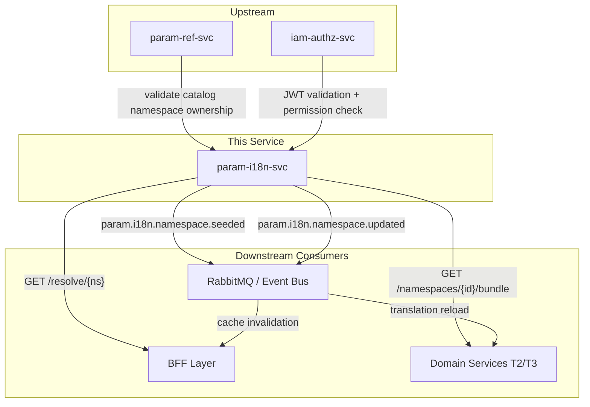
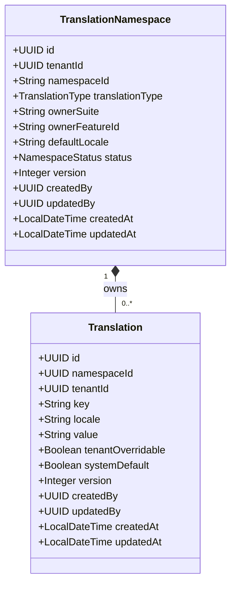
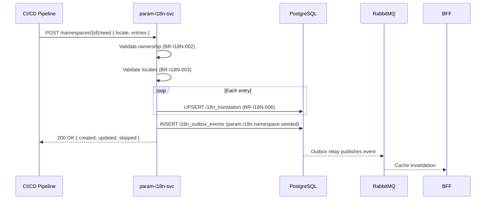
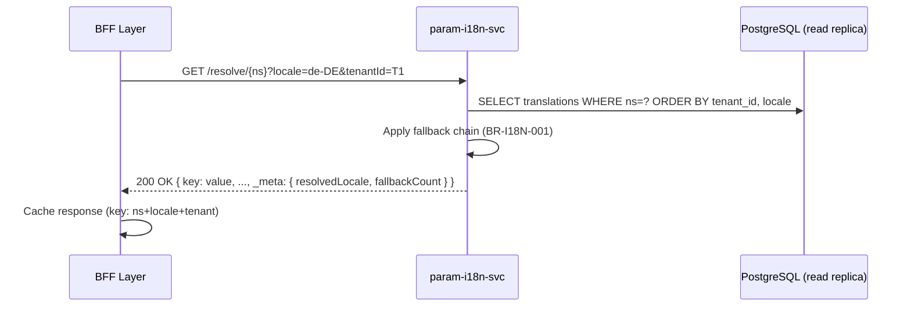
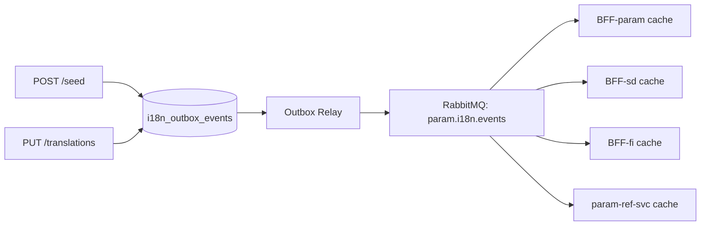
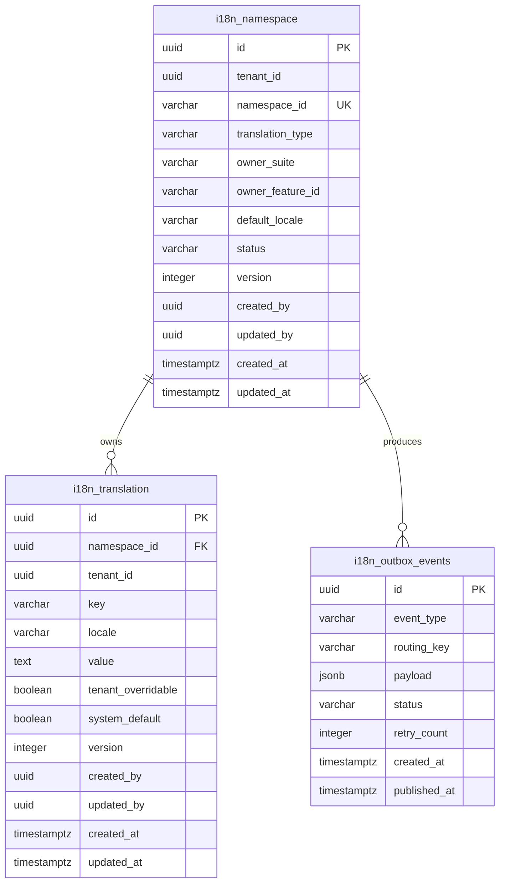

<!-- TEMPLATE COMPLIANCE: ~95%
Template: domain-service-spec.md v1.0.0
Present sections: §0-§15
-->

# param.i18n — Internationalization Service Domain Specification

> **Conceptual Stack Layer:** Domain / Service
> **Space:** Platform
> **Owner:** Platform Engineering Team
> **Schema alignment:** `service-layer.schema.json`
> **Companion files:** `contracts/http/param/i18n/openapi.yaml`, `contracts/events/param/i18n/namespace.seeded.schema.json`, `contracts/events/param/i18n/namespace.updated.schema.json`
> **Referenced by:** Platform-Feature Spec SS5 (F-PARAM-002-01, F-PARAM-002-02, F-PARAM-002-03), BFF Contract
> **Belongs to:** PARAM Suite Spec

> **Meta Information**
> - **Version:** 2026-04-03
> - **Template:** `domain-service-spec.md` v1.0.0
> - **Template Compliance:** ~95% — fully compliant
> - **Author(s):** OpenLeap Architecture Team
> - **Status:** DRAFT
> - **Suite:** `param` (Platform Parameterization)
> - **Domain:** `i18n` (Internationalization)
> - **Bounded Context Ref:** `bc:internationalization`
> - **Service ID:** `param-i18n-svc`
> - **basePackage:** `io.openleap.param.i18n`
> - **API Base Path:** `/api/param/i18n/v1`
> - **OpenLeap Starter Version:** `v4.1.0`
> - **Port:** `8101`
> - **Repository:** `https://github.com/openleap-io/io.openleap.param.i18n`
> - **Tags:** `param`, `i18n`, `translations`, `localization`, `platform`
> - **Team:**
>   - Name: `team-param`
>   - Email: `platform-core@openleap.io`
>   - Slack: `#platform-core`

---

## Specification Guidelines Compliance

> ### Non-Negotiables
> - Never invent facts. If required info is missing, add an **OPEN QUESTION** entry.
> - Preserve intent and decisions. Only change meaning when explicitly requested.
> - Do not remove normative constraints unless they are explicitly replaced.
> - Keep the spec **self-contained**: no "see chat", no implicit context.
>
> ### Source of Truth Priority
> When sources conflict:
> 1. Spec (explicit) wins
> 2. Starter specs (implementation constraints) next
> 3. Guidelines (best practices) last
>
> Record conflicts in the **Decisions & Conflicts** section (see Section 14).
>
> ### Style Guide
> - Prefer short sentences and lists.
> - Use MUST/SHOULD/MAY for normative statements.
> - Keep terminology consistent (Aggregate, Domain Service, Application Service, Command, Event).
> - Avoid ambiguous words ("often", "maybe") unless explicitly noting uncertainty.
> - Keep examples minimal and clearly marked as examples.
> - Do not add implementation code unless the chapter explicitly requires it.

---

## 0. Document Purpose & Scope

### 0.1 Purpose

This specification defines the `param-i18n-svc` domain service within the Platform Parameterization suite. The service is the **authoritative source for all human-readable labels and translations** across the OpenLeap platform. It manages translation namespaces and key-value translation entries per locale, resolves labels through a configurable fallback chain, and publishes change events so that BFF layers and consumers can invalidate caches without redeployment.

### 0.2 Target Audience

- Platform Administrators & Suite Engineering Teams (namespace management, seeding)
- BFF Engineers integrating label resolution into UI features
- System Architects & Technical Leads
- Integration Engineers consuming translation-change events for cache invalidation
- Localization teams managing translation content

### 0.3 Scope

**In Scope:**
- Business domain model for translation namespaces and translation entries
- Business rules for namespace ownership, locale format, fallback chain resolution, and tenant overrides
- REST API contracts for reading, creating, updating, and bulk-seeding translations
- Label resolution API with locale fallback chain
- Event contracts for `param.i18n.namespace.seeded` and `param.i18n.namespace.updated`
- Multi-tenant data isolation via RLS
- Extension points for product-level customisation

**Out of Scope:**
- Authentication and authorisation enforcement — delegated to IAM (`iam-authz-svc`)
- Reference code validation — handled by `param-ref-svc` (upstream dependency for namespace catalog ownership)
- Runtime configuration (feature flags, runtime parameters) — handled by `param-cfg-svc`
- Units of measure — handled by `param-si-svc`
- Translation file format converters (PO, XLIFF) — infrastructure concern
- Machine translation / AI-assisted translation — product add-on concern

### 0.4 Related Documents

- `T1_Platform/param/_param_suite.md` — PARAM Suite Architecture
- `T1_Platform/param/domain-specs/param_ref-spec.md` — Reference Data Service (upstream dependency for catalog namespace registration)
- `T1_Platform/param/domain-specs/param_cfg-spec.md` — Platform Configuration Service (sibling domain)
- `T1_Platform/param/features/compositions/F-PARAM-002.md` — Translation Management feature composition
- `T1_Platform/param/features/leaves/F-PARAM-002-01/feature-spec.md` — Browse Translations
- `T1_Platform/param/features/leaves/F-PARAM-002-02/feature-spec.md` — Edit Translations
- `T1_Platform/param/features/leaves/F-PARAM-002-03/feature-spec.md` — Seed Translation Bundles
- `https://github.com/openleap-io/io.openleap.dev.concepts/blob/main/governance/bff-guideline.md` (GOV-BFF-001) — BFF pattern governance
- `T1_Platform/iam/domain-specs/iam_authz-spec.md` — Authorisation service

---

## 1. Business Context

### 1.1 Domain Purpose

The Internationalization domain solves the problem of scattered, duplicated, and inconsistently managed UI labels across a multi-tenant ERP platform. Without a centralized translation service, every domain service and BFF would maintain its own copy of locale strings — leading to inconsistency, drift across languages, and no tenant-level customisation.

`param-i18n-svc` provides a structured, namespace-scoped store for all human-readable labels: catalog code descriptions (e.g., country names, currency labels) and UI message strings (feature-specific text for buttons, headings, validation messages). The BFF layer resolves all display labels through this service with a configurable locale fallback chain, ensuring p95 resolution < 10ms via in-memory cache with event-based invalidation.

### 1.2 Business Value

- **Single source of truth:** All labels for every locale live in one place — eliminates duplication and drift.
- **Tenant-level customisation:** Tenant administrators can override any translation for their tenant (e.g., rename "Invoice" to "Faktura" in a German deployment) without touching platform content.
- **Cache-friendly architecture:** Published change events let BFF caches invalidate instantly, maintaining sub-10ms label resolution.
- **Namespace isolation:** CATALOG translations (code labels) and MESSAGE translations (UI strings) are governed separately, enabling different ownership and lifecycle models.
- **Fallback chain:** Graceful degradation from exact locale → parent language → default → key itself ensures the UI never shows missing-key tokens.
- **SAP equivalent:** Replaces SAP transaction SE63 (translation workbench) and SM30-driven text table management for label content.

### 1.3 Key Stakeholders

| Role | Responsibility | Primary Use Cases |
|------|----------------|-------------------|
| Platform Administrator | Manages CATALOG namespace registrations; seeds initial platform translations | Register namespace; seed bundle; browse all translations |
| Suite Engineering Team | Seeds MESSAGE translations for feature leaf IDs during CI/CD | POST /namespaces/{id}/seed; verify via browse |
| Tenant Administrator | Overrides tenant-scoped translations for their tenant | PUT /translations/{namespaceId}/{key}/{locale} (TENANT scope) |
| BFF Layer | Resolves labels at render time; caches per locale + namespace | GET /resolve/{namespaceId}?locale=de-DE; invalidate on event |
| Localization Team | Maintains translation quality across supported locales | Edit translations; export namespace bundle |
| Integration Engineer | Subscribes to translation-change events for cache invalidation | Consume `param.i18n.namespace.seeded` / `namespace.updated` |

### 1.4 Strategic Positioning

The Internationalization domain is a **foundational T1 service** consumed by every BFF and display layer in the platform. It MUST NOT depend on T2/T3 domain services (ADR-001). Its only upstream dependency within the platform is `param-ref-svc` (for validating catalog namespace registrations against the reference catalog) and `iam-authz-svc` (for permission checking).

Architecturally, this service corresponds to SAP's **SE63** translation workbench and the text-table infrastructure underlying every SAP domain object. In the OpenLeap architecture it serves as the **read-heavy, cache-optimised label backend** for all display tiers.

The domain model is intentionally read-heavy: writes (seed, edit) are infrequent; reads (resolve) are extremely frequent (every BFF page render). This asymmetry drives the architecture: aggressive caching at the BFF, thin event payloads for invalidation, and CDN-friendly GET endpoints for namespace bundles.

### 1.5 Service Context

| Property | Value |
|----------|-------|
| **Suite** | `param` |
| **Domain** | `i18n` |
| **Bounded Context** | `bc:internationalization` |
| **Service ID** | `param-i18n-svc` |
| **Base Package** | `io.openleap.param.i18n` |

**Responsibilities:**
- Authoritative store for all translation namespaces and their key-locale-value triples
- Register namespaces with ownership metadata (ownerSuite, translationType)
- Enforce locale format compliance (BCP-47)
- Enforce namespace ownership rules (only ownerSuite may write; PLATFORM_ADMIN may write all)
- Resolve translations through the fallback chain: exact locale → parent language → default → key
- Support tenant-level translation overrides for selected namespaces
- Publish `param.i18n.namespace.seeded` and `param.i18n.namespace.updated` events via outbox
- Support bulk seed operations for CI/CD pipelines

**Authoritative Sources:**

| Source Type | Description | Access Pattern |
|-------------|-------------|----------------|
| REST API | Translation resolution, namespace browse, CRUD | Synchronous |
| Database | Owned: `i18n_namespace`, `i18n_translation` | Direct (owner) |
| Events | Published: `param.i18n.namespace.seeded`, `param.i18n.namespace.updated` | Asynchronous (outbox) |



---

## 2. Service Identity

| Property | Value | Schema Field |
|----------|-------|-------------|
| **Service ID** | `param-i18n-svc` | `metadata.id` |
| **Display Name** | `Internationalization Service` | `metadata.name` |
| **Suite** | `param` | `metadata.suite` |
| **Domain** | `i18n` | `metadata.domain` |
| **Bounded Context** | `bc:internationalization` | `metadata.bounded_context_ref` |
| **Version** | `1.0.0` | `metadata.version` |
| **Status** | DRAFT | `metadata.status` |
| **API Base Path** | `/api/param/i18n/v1` | `metadata.api_base_path` |
| **Repository** | `https://github.com/openleap-io/io.openleap.param.i18n` | `metadata.repository` |
| **Tags** | `param`, `i18n`, `translations`, `localization`, `platform` | `metadata.tags` |

**Team:**

| Property | Value |
|----------|-------|
| **Name** | `team-param` |
| **Email** | `platform-core@openleap.io` |
| **Slack** | `#platform-core` |

---

## 3. Domain Model

### 3.1 Conceptual Overview

The `bc:internationalization` bounded context contains two closely related aggregates: **TranslationNamespace** and **Translation**.

A `TranslationNamespace` represents a logical grouping of translation keys. For CATALOG type, the namespace ID equals the catalogId from `param-ref-svc` (e.g., `countries`, `currencies`). For MESSAGE type, the namespace ID equals a feature leaf ID (e.g., `F-PARAM-002-01`). The namespace aggregate owns its `Translation` entries as a collection of (key, locale, value) triples.

The resolution algorithm traverses the fallback chain: exact locale (e.g., `de-DE`) → parent language (`de`) → default locale (`default`) → key string itself (last resort). This ensures the UI never shows missing-key tokens.



### 3.2 Core Concepts

| Concept | Glossary Ref | Description |
|---------|-------------|-------------|
| TranslationNamespace | `param:glossary:namespace` | Aggregate root: a named grouping of translation keys with ownership metadata |
| Translation | `param:glossary:translation` | Child entity: a locale-specific string value for a (namespace, key) pair |
| TranslationType | `param:glossary:translation-type` | CATALOG (label for a code value) or MESSAGE (UI string for a feature) |
| Fallback Chain | `param:glossary:fallback-chain` | Resolution sequence: exact locale → parent language → default → key |
| Locale | — | BCP-47 language tag (e.g., `de-DE`, `en-US`, `fr`). `default` is the platform default locale |
| Tenant Override | — | A Translation entry with a tenant-scoped value that supersedes the platform translation for that tenant |
| Namespace Bundle | — | The full set of translations for a namespace+locale, returned as a flat JSON map for BFF caching |

### 3.3 Aggregate Definitions

#### TranslationNamespace (Aggregate Root)

##### Aggregate Root

| Attribute | Type | Format | Description | Constraints | Required | Read-Only |
|-----------|------|--------|-------------|-------------|----------|-----------|
| `id` | `string` | `uuid` | System-generated surrogate key (OlUuid.create()) | PK | Yes | Yes |
| `tenantId` | `string` | `uuid` | Tenant context. NULL for platform-owned namespaces | FK to IAM tenant; nullable | Yes | Yes |
| `namespaceId` | `string` | — | Business key. For CATALOG: catalogId (e.g., `countries`). For MESSAGE: feature leaf ID (e.g., `F-PARAM-002-01`) | max 200, pattern `^[a-z0-9][a-z0-9._\-]*[a-z0-9]$` or `^F-[A-Z]+-[0-9]+-[0-9]+$`; UK | Yes | Yes (after creation) |
| `translationType` | `string` | `enum` | Whether this namespace holds catalog labels or feature message strings | enum_ref: TranslationType | Yes | Yes (after creation) |
| `ownerSuite` | `string` | — | Suite ID that owns and may write to this namespace (e.g., `param`, `sd`, `fi`) | max 10, pattern `^[a-z]{2,4}$` | Yes | No |
| `ownerFeatureId` | `string` | — | For MESSAGE type: the composition feature ID owning this leaf (e.g., `F-PARAM-002`). Null for CATALOG type | nullable, pattern `^F-[A-Z]+-[0-9]+$` | No | No |
| `defaultLocale` | `string` | — | The fallback locale for this namespace if no `default` translation exists (typically `en`) | BCP-47 format, max 20 | Yes | No |
| `status` | `string` | `enum` | Lifecycle status of the namespace | enum_ref: NamespaceStatus | Yes | No |
| `version` | `integer` | `int32` | Optimistic locking version | min 1 | Yes | Yes |
| `createdBy` | `string` | `uuid` | User ID who registered this namespace | FK to IAM principal | Yes | Yes |
| `updatedBy` | `string` | `uuid` | User ID who last modified this namespace metadata | FK to IAM principal | Yes | Yes |
| `createdAt` | `string` | `date-time` | UTC timestamp of namespace registration | ISO-8601 | Yes | Yes |
| `updatedAt` | `string` | `date-time` | UTC timestamp of last metadata update | ISO-8601 | Yes | Yes |

**State Descriptions:**

| State | Description | Business Meaning |
|-------|-------------|-----------------|
| `ACTIVE` | Namespace is registered and translations are resolvable | BFF may cache and resolve this namespace |
| `DEPRECATED` | Namespace is no longer actively maintained | Translations still resolved but no new translations accepted; ownerSuite alerted |

**Allowed Transitions:**

| From State | To State | Trigger | Guard |
|------------|----------|---------|-------|
| — | `ACTIVE` | `POST /namespaces` (register) | PLATFORM_ADMIN or ownerSuite system principal |
| `ACTIVE` | `DEPRECATED` | `PATCH /namespaces/{id}` (deprecate) | PLATFORM_ADMIN only |
| `DEPRECATED` | `ACTIVE` | `PATCH /namespaces/{id}` (reactivate) | PLATFORM_ADMIN only |

**Domain Events Emitted:**
- `param.i18n.namespace.seeded` (on bulk seed completion) — see §7.2
- `param.i18n.namespace.updated` (on individual translation change) — see §7.2

##### Child Entities

**Translation**

**Business Purpose:** Stores a single locale-specific label value for a (namespace, key) pair. Platform-owned translations are marked `systemDefault = true`. Tenant overrides are additional rows for the same (namespace, key, locale) scoped to a tenantId.

**Collection Constraints:** One namespace typically contains 1–5,000 translations across all locales. There is no enforced upper bound, but namespaces with > 10,000 entries SHOULD be reviewed for splitting.

**Invariants:**
- BR-I18N-004: The composite (namespaceId + key + locale + tenantId) MUST be unique.
- BR-I18N-005: Tenant override translations require the namespace `tenantOverridable` flag.

| Attribute | Type | Format | Description | Constraints | Required |
|-----------|------|--------|-------------|-------------|----------|
| `id` | `string` | `uuid` | Surrogate key (OlUuid.create()) | PK | Yes |
| `namespaceRef` | `string` | `uuid` | FK to parent TranslationNamespace | FK | Yes |
| `tenantId` | `string` | `uuid` | NULL for platform translations; set for tenant overrides | FK to IAM tenant; nullable | Yes |
| `key` | `string` | — | Translation key within the namespace (e.g., `DE`, `button.save`, `error.required`) | max 200, pattern `^[a-zA-Z0-9][a-zA-Z0-9._\-]*[a-zA-Z0-9]$` | Yes |
| `locale` | `string` | — | BCP-47 locale tag or `default` | max 20, BCP-47 pattern or `^default$` | Yes |
| `value` | `string` | — | The translated label string | max 2000, not blank | Yes |
| `tenantOverridable` | `boolean` | — | Whether tenant administrators may create override entries for this key | Default: `true` | Yes |
| `systemDefault` | `boolean` | — | True for platform-seeded translations; false for tenant overrides | System-set on seed operations | Yes |
| `version` | `integer` | `int32` | Optimistic locking version | min 1 | Yes |
| `createdBy` | `string` | `uuid` | User ID who created this entry | FK to IAM principal | Yes |
| `updatedBy` | `string` | `uuid` | User ID who last modified this entry | FK to IAM principal | Yes |
| `createdAt` | `string` | `date-time` | UTC timestamp of creation | ISO-8601 | Yes |
| `updatedAt` | `string` | `date-time` | UTC timestamp of last update | ISO-8601 | Yes |

##### Value Objects

**LocaleTag**

A validated BCP-47 locale string with special treatment of the pseudo-locale `default`.

| Attribute | Type | Format | Description | Constraints |
|-----------|------|--------|-------------|-------------|
| `tag` | `string` | — | BCP-47 language tag or the literal string `default` | pattern: `^[a-zA-Z]{2,3}(-[a-zA-Z]{2,4})?$` or `^default$` |

**Validation Rules:**
- MUST match BCP-47 or equal `default`.
- Region subtag (e.g., `DE` in `de-DE`) MUST be uppercase.
- Language subtag (e.g., `de`) MUST be lowercase.

### 3.4 Enumerations

**TranslationType**

| Value | Description | Deprecated |
|-------|-------------|------------|
| `CATALOG` | Labels for reference code values. Namespace ID equals the `catalogId` from `param-ref-svc` (e.g., `countries` holds `{ DE: "Germany", FR: "France" }`). Owned by the platform or the suite that registered the catalog. | No |
| `MESSAGE` | UI message strings for a feature leaf. Namespace ID equals a feature leaf ID (e.g., `F-PARAM-002-01` holds `{ page.title: "Browse Translations", button.save: "Save" }`). Owned by the suite that owns the feature. | No |

**NamespaceStatus**

| Value | Description | Deprecated |
|-------|-------------|------------|
| `ACTIVE` | Namespace is registered and translations are actively maintained and resolvable | No |
| `DEPRECATED` | Namespace is retained for backwards compatibility but no longer actively maintained; no new translations accepted | No |

### 3.5 Shared Types

**LocaleTag** (see §3.3 Value Objects) is consumed by `TranslationNamespace.defaultLocale` and `Translation.locale`.

`tenantId` (UUID) is consumed as shared kernel from the IAM suite.

---

## 4. Business Rules

### 4.1 Business Rules Catalog

| ID | Name | Aggregates | Operations | Priority |
|----|------|------------|------------|----------|
| BR-I18N-001 | Fallback Chain Resolution | Translation | Read (resolve) | Critical |
| BR-I18N-002 | Namespace Ownership Enforcement | TranslationNamespace | Create, Seed, Edit | Critical |
| BR-I18N-003 | Locale Format Compliance | Translation | Create, Update, Seed | High |
| BR-I18N-004 | Translation Key Uniqueness | Translation | Create, Seed | High |
| BR-I18N-005 | Tenant Override Eligibility | Translation | Create (override) | High |
| BR-I18N-006 | Seed Idempotency | TranslationNamespace, Translation | Seed | High |
| BR-I18N-007 | MESSAGE Namespace Must Reference Valid Feature Leaf | TranslationNamespace | Create | Medium |
| BR-I18N-008 | CATALOG Namespace Must Reference Registered Catalog | TranslationNamespace | Create | Medium |

### 4.2 Detailed Rule Definitions

#### BR-I18N-001: Fallback Chain Resolution

**Business Context:** Users operate in specific locales (e.g., `de-DE`). Not every translation key will have an entry for every locale variant. The system MUST never display raw translation keys to end users.

**Rule Statement:** When resolving a translation for `(namespaceId, key, requestedLocale)`, the service MUST traverse the fallback chain in order: (1) exact locale match (e.g., `de-DE`), (2) parent language match (`de`), (3) `default` locale, (4) return the key itself as a string.

**Applies To:**
- Aggregate: Translation
- Operations: Read (resolve endpoint)

**Enforcement:** Application Service resolves in order; all four steps MUST be attempted before returning the key string.

**Validation Logic:** Try `locale = de-DE` → if no row, try `locale = de` → if no row, try `locale = default` → if no row, return `key`.

**Error Handling:**
- No error is raised for missing translations — the key string is returned as the last resort.
- Callers MAY detect fallback by checking `_meta.fallback: true` in the resolve response.

**Examples:**
- **Valid:** Namespace `countries`, key `DE`, locale `de-DE` → finds exact match → returns "Deutschland"
- **Valid:** Namespace `countries`, key `DE`, locale `de-AT` → no `de-AT` row → finds `de` row → returns "Deutschland"
- **Valid:** Namespace `countries`, key `XX`, locale `de` → no rows → returns "XX" (key fallback)

---

#### BR-I18N-002: Namespace Ownership Enforcement

**Business Context:** Translations are owned by the suite or domain that registered the namespace. Cross-suite writes would break content governance.

**Rule Statement:** A translation write operation (create, update, delete, seed) MUST only be performed by the `ownerSuite` system principal or a `PLATFORM_ADMIN`. Tenant override writes are allowed for any authenticated `TENANT_ADMIN` on namespaces that are `tenantOverridable`.

**Applies To:**
- Aggregate: TranslationNamespace, Translation
- Operations: Create, Update, Delete, Seed

**Enforcement:** Application Service checks `JWT.suite == namespace.ownerSuite OR roles contains PLATFORM_ADMIN` before allowing write.

**Validation Logic:** Extract `suite` claim from JWT; compare against `namespace.ownerSuite`.

**Error Handling:**
- **Error Code:** `I18N_OWNERSHIP_VIOLATION`
- **Error Message:** "Only the owner suite or a PLATFORM_ADMIN may write to namespace '{namespaceId}'"
- **User action:** Contact the ownerSuite team or request PLATFORM_ADMIN assistance.

**Examples:**
- **Valid:** `param` system principal writes to namespace `countries` (ownerSuite = `param`)
- **Invalid:** `sd` system principal writes to namespace `countries` (ownerSuite = `param`)

---

#### BR-I18N-003: Locale Format Compliance

**Business Context:** Non-standard locale strings break BCP-47-aware runtime consumers and locale negotiation in browsers and APIs.

**Rule Statement:** Every `locale` value in a Translation entry MUST be a valid BCP-47 language tag or the literal string `default`. Region subtags MUST be uppercase; language subtags MUST be lowercase.

**Applies To:**
- Aggregate: Translation
- Operations: Create, Update, Seed

**Enforcement:** Domain object validates the `LocaleTag` value object on construction.

**Validation Logic:** Match against pattern `^[a-z]{2,3}(-[A-Z]{2,4})?$` or equal `default`.

**Error Handling:**
- **Error Code:** `I18N_INVALID_LOCALE`
- **Error Message:** "Locale '{locale}' does not conform to BCP-47 format"
- **User action:** Use a valid BCP-47 locale tag such as `de`, `de-DE`, `en-US`, or the literal `default`.

**Examples:**
- **Valid:** `de`, `de-DE`, `en-US`, `fr`, `default`
- **Invalid:** `DE`, `de_DE`, `english`, `deu-DEU`

---

#### BR-I18N-004: Translation Key Uniqueness

**Business Context:** Duplicate (namespaceId, key, locale, tenantId) entries would produce ambiguous resolution results and inconsistent caches.

**Rule Statement:** The combination `(namespaceRef, key, locale, tenantId)` MUST be unique. Platform translations use `tenantId = NULL`.

**Applies To:**
- Aggregate: Translation
- Operations: Create, Seed

**Enforcement:** Database unique index on `(namespace_id, key, locale, tenant_id)`.

**Validation Logic:** Check for existing row before insert; in seed operations use upsert semantics per BR-I18N-006.

**Error Handling:**
- **Error Code:** `I18N_DUPLICATE_TRANSLATION`
- **Error Message:** "Translation for key '{key}' in locale '{locale}' already exists in namespace '{namespaceId}'"
- **User action:** Use PUT to update an existing translation, or use the seed endpoint which applies upsert semantics.

---

#### BR-I18N-005: Tenant Override Eligibility

**Business Context:** Not all translations should be tenant-overridable (e.g., legal or compliance labels MUST be consistent). The platform controls which keys are overridable.

**Rule Statement:** A `TENANT_ADMIN` MAY create a tenant-scoped translation only if the parent Translation entry has `tenantOverridable = true`. If `tenantOverridable = false`, the write MUST be rejected.

**Applies To:**
- Aggregate: Translation
- Operations: Create (tenant override)

**Enforcement:** Application Service checks `translation.tenantOverridable` before allowing tenant write.

**Error Handling:**
- **Error Code:** `I18N_OVERRIDE_NOT_PERMITTED`
- **Error Message:** "Translation key '{key}' in namespace '{namespaceId}' is not overridable by tenants"
- **User action:** Contact the platform team to request overridability for this key.

---

#### BR-I18N-006: Seed Idempotency

**Business Context:** CI/CD pipelines seed translations on every deployment. Re-running a seed MUST NOT produce duplicate entries or errors.

**Rule Statement:** The seed operation MUST be idempotent: if a translation entry for `(namespaceId, key, locale)` already exists with the same value, it MUST be silently skipped. If the value differs, it MUST be updated (upsert). The operation MUST return a summary of created, updated, and skipped counts.

**Applies To:**
- Aggregate: TranslationNamespace, Translation
- Operations: Seed (POST /namespaces/{id}/seed)

**Enforcement:** Application Service uses upsert (INSERT ON CONFLICT DO UPDATE) for all entries in the seed payload.

**Validation Logic:** For each entry: if row exists and value unchanged → skip; if row exists and value changed → update; if no row → insert.

---

#### BR-I18N-007: MESSAGE Namespace Must Reference Valid Feature Leaf

**Business Context:** MESSAGE namespaces are tied to specific feature leaf IDs. Orphaned namespaces with no corresponding feature create maintenance debt.

**Rule Statement:** When registering a namespace with `translationType = MESSAGE`, the `namespaceId` MUST match the pattern `^F-[A-Z]+-[0-9]+-[0-9]+$`. The `ownerFeatureId` MUST be set to the parent composition ID.

**Applies To:**
- Aggregate: TranslationNamespace
- Operations: Create

**Enforcement:** Application Service validates namespaceId format and ownerFeatureId presence on registration.

> OPEN QUESTION: See Q-I18N-001 in §14.3 — should the service validate ownerFeatureId against a feature registry, or is format validation sufficient?

---

#### BR-I18N-008: CATALOG Namespace Must Reference Registered Catalog

**Business Context:** CATALOG namespaces label code values in `param-ref-svc`. A CATALOG namespace for a non-existent catalog would never be populated with meaningful values.

**Rule Statement:** When registering a namespace with `translationType = CATALOG`, the service SHOULD verify that `namespaceId` corresponds to a registered catalog in `param-ref-svc` via synchronous REST call.

**Applies To:**
- Aggregate: TranslationNamespace
- Operations: Create

**Enforcement:** Application Service calls `param-ref-svc` GET `/catalogs/{id}` before accepting registration; failure returns 422.

> OPEN QUESTION: See Q-I18N-002 in §14.3 — define circuit-breaker behaviour when `param-ref-svc` is unavailable during namespace registration.

### 4.3 Data Validation Rules

**Field-Level Validations:**

| Field | Validation Rule | Error Message |
|-------|----------------|---------------|
| `TranslationNamespace.namespaceId` | Required; max 200 chars; lowercase with dots/hyphens; MESSAGE type must match `^F-[A-Z]+-[0-9]+-[0-9]+$` | "namespaceId is required and must be a valid lowercase identifier or feature leaf ID" |
| `TranslationNamespace.ownerSuite` | Required; max 10 chars; lowercase 2–4 alpha | "ownerSuite must be a valid suite ID (2–4 lowercase letters)" |
| `TranslationNamespace.defaultLocale` | Required; BCP-47 format | "defaultLocale must be a valid BCP-47 locale tag" |
| `Translation.key` | Required; max 200 chars; alphanumeric with dots/hyphens | "key must be a non-empty string of at most 200 characters" |
| `Translation.locale` | Required; BCP-47 or `default` | "locale must be a valid BCP-47 locale tag or 'default'" |
| `Translation.value` | Required; max 2000 chars; not blank | "Translation value must be a non-blank string of at most 2000 characters" |
| `Translation.namespaceRef` | Required; must reference existing TranslationNamespace | "namespaceRef must reference an existing namespace" |

**Cross-Field Validations:**
- `ownerFeatureId` MUST be present if and only if `translationType = MESSAGE`.
- For tenant override translations: `tenantId` MUST be set; the parent platform translation for the same `(namespaceRef, key, locale)` MUST exist and have `tenantOverridable = true`.

### 4.4 Reference Data Dependencies

| Catalog | Source Service | Fields Referencing | Validation |
|---------|----------------|-------------------|------------|
| Registered catalogs | `param-ref-svc` `/api/param/ref/v1/catalogs` | `TranslationNamespace.namespaceId` (CATALOG type) | Existence check on namespace registration (BR-I18N-008) |
| Supported locales | Derived from ISO 639-1 + BCP-47 standard | `Translation.locale` | Format validation via LocaleTag value object (BR-I18N-003) |

---

## 5. Business Logic & Use Cases

### 5.1 Business Logic Placement

| Logic Type | Placement | Examples |
|------------|-----------|----------|
| Aggregate invariants | Domain Object | Locale format (LocaleTag VO), key uniqueness check, state transitions |
| Cross-aggregate logic | Domain Service | Fallback chain resolution, tenant override lookup |
| Orchestration & transactions | Application Service | Seed upsert orchestration, event publishing, ownership checks |

### 5.2 Use Cases

#### UC-I18N-001: Register Translation Namespace

| Attribute | Value |
|-----------|-------|
| **Use Case ID** | UC-I18N-001 |
| **Name** | Register Translation Namespace |
| **Type** | WRITE |
| **Actor** | PLATFORM_ADMIN, suite CI/CD system principal |
| **Trigger** | REST: `POST /api/param/i18n/v1/namespaces` |
| **Command** | `RegisterTranslationNamespaceCommand` |
| **Events** | None (namespace creation does not emit events; seeding does) |

**Preconditions:**
- Actor is authenticated and holds `PLATFORM_ADMIN` role or `param.i18n.namespace.write` permission for ownerSuite.
- `namespaceId` does not already exist for this tenantId.
- If `translationType = CATALOG`: catalogId exists in `param-ref-svc`.

**Main Flow:**
1. Actor submits namespace registration with `namespaceId`, `translationType`, `ownerSuite`, `defaultLocale`.
2. System validates `ownerSuite` format and actor's suite claim.
3. System validates `namespaceId` format against `translationType` pattern.
4. For CATALOG type: System calls `param-ref-svc` to confirm catalog exists.
5. System creates `TranslationNamespace` with status `ACTIVE`.
6. System returns `201 Created` with the namespace resource.

**Postconditions:**
- `TranslationNamespace` is in `ACTIVE` state.
- Namespace is immediately resolvable (returns empty bundle for unknown keys).

**Business Rules Applied:**
- BR-I18N-002: Ownership enforcement
- BR-I18N-007: MESSAGE namespace format
- BR-I18N-008: CATALOG namespace catalog existence

**Alternative Flows:**
- **Alt-1:** If namespace already exists with identical attributes, return `409 Conflict`.

**Exception Flows:**
- **Exc-1:** If `param-ref-svc` is unavailable (CATALOG type), return `503 Service Unavailable` with retry guidance.
- **Exc-2:** If actor lacks permission, return `403 Forbidden`.

---

#### UC-I18N-002: Seed Translation Bundle

| Attribute | Value |
|-----------|-------|
| **Use Case ID** | UC-I18N-002 |
| **Name** | Seed Translation Bundle |
| **Type** | WRITE |
| **Actor** | Suite CI/CD system principal, PLATFORM_ADMIN |
| **Trigger** | REST: `POST /api/param/i18n/v1/namespaces/{namespaceId}/seed` |
| **Command** | `SeedTranslationBundleCommand` |
| **Events** | `param.i18n.namespace.seeded` |

**Preconditions:**
- Namespace exists and is `ACTIVE`.
- Actor owns the namespace (`JWT.suite == ownerSuite`) or holds `PLATFORM_ADMIN`.
- Payload contains at least one translation entry.

**Main Flow:**
1. Actor submits seed payload: `{ locale, entries: [{ key, value }] }`.
2. System validates all locale values (BR-I18N-003) and key formats (BR-I18N-004).
3. System applies upsert for each entry (BR-I18N-006): insert new, update changed, skip identical.
4. System publishes `param.i18n.namespace.seeded` event via outbox.
5. System returns `200 OK` with seed summary (`{ created, updated, skipped, total }`).

**Postconditions:**
- All provided translations exist in the store.
- BFF caches for this namespace+locale are invalidated via the published event.

**Business Rules Applied:**
- BR-I18N-002: Ownership enforcement
- BR-I18N-003: Locale format
- BR-I18N-004: Key uniqueness (upsert semantics)
- BR-I18N-006: Idempotency

**Alternative Flows:**
- **Alt-1:** Payload has zero valid entries — return `422 Unprocessable Entity`.

**Exception Flows:**
- **Exc-1:** Namespace does not exist — return `404 Not Found`.

---

#### UC-I18N-003: Update Single Translation

| Attribute | Value |
|-----------|-------|
| **Use Case ID** | UC-I18N-003 |
| **Name** | Update Single Translation |
| **Type** | WRITE |
| **Actor** | Localization team member, TENANT_ADMIN (for override), PLATFORM_ADMIN |
| **Trigger** | REST: `PUT /api/param/i18n/v1/namespaces/{namespaceId}/translations/{key}/{locale}` |
| **Command** | `UpdateTranslationCommand` |
| **Events** | `param.i18n.namespace.updated` |

**Preconditions:**
- Namespace exists and is `ACTIVE`.
- For platform translation: actor owns namespace.
- For tenant override: actor is `TENANT_ADMIN`; translation has `tenantOverridable = true`.
- ETag header matches current version (optimistic lock).

**Main Flow:**
1. Actor submits `{ value }` with `If-Match: "{version}"` header.
2. System checks ETag against current `Translation.version` (412 if mismatch).
3. System validates locale format (BR-I18N-003).
4. System validates actor ownership (BR-I18N-002) or tenant override eligibility (BR-I18N-005).
5. System updates the translation value and increments version.
6. System publishes `param.i18n.namespace.updated` event via outbox.
7. System returns `200 OK` with updated translation.

**Postconditions:**
- `Translation.value` reflects the new string.
- BFF caches for the affected namespace+locale are invalidated.

**Business Rules Applied:**
- BR-I18N-002: Ownership enforcement
- BR-I18N-003: Locale format
- BR-I18N-005: Tenant override eligibility

**Exception Flows:**
- **Exc-1:** `412 Precondition Failed` on ETag mismatch — consumer must re-fetch and retry.
- **Exc-2:** `422 Unprocessable Entity` if value is blank or exceeds 2000 chars.

---

#### UC-I18N-004: Resolve Translation (Label Lookup)

| Attribute | Value |
|-----------|-------|
| **Use Case ID** | UC-I18N-004 |
| **Name** | Resolve Translation |
| **Type** | READ |
| **Actor** | BFF Layer, Domain Services |
| **Trigger** | REST: `GET /api/param/i18n/v1/resolve/{namespaceId}?locale={locale}&tenantId={tenantId}` |
| **Query** | `ResolveNamespaceBundleQuery` |

**Preconditions:**
- Namespace exists and is `ACTIVE`.
- `locale` is a valid BCP-47 tag or `default`.

**Main Flow:**
1. Actor requests namespace bundle for locale.
2. System applies fallback chain (BR-I18N-001): for each key, resolve in order: tenant override → exact locale → parent language → default → key.
3. System returns flat JSON map `{ key: resolvedValue, ... }` with `_meta.resolvedLocale` and `_meta.fallbackCount`.

**Postconditions:**
- Every key in the namespace is represented in the response — no key is missing.

**Business Rules Applied:**
- BR-I18N-001: Fallback chain resolution

---

#### UC-I18N-005: Browse Namespace Translations

| Attribute | Value |
|-----------|-------|
| **Use Case ID** | UC-I18N-005 |
| **Name** | Browse Namespace Translations |
| **Type** | READ |
| **Actor** | Localization team member, PLATFORM_ADMIN |
| **Trigger** | REST: `GET /api/param/i18n/v1/namespaces/{namespaceId}/translations` |
| **Query** | `BrowseTranslationsQuery` |

Supports pagination (`page`, `size`), filtering by `locale`, `key` (prefix), and `translationType`. Returns paged list of translation entries with metadata.

### 5.3 Process Flow Diagrams





### 5.4 Cross-Domain Workflows

The i18n service is primarily consumed, not orchestrating. It participates in the following cross-domain interactions:

**Catalog Registration Integration:** When `param-ref-svc` registers a new catalog, the `param` CI/CD pipeline SHOULD immediately register a corresponding CATALOG namespace in `param-i18n-svc` and seed platform translations for all supported locales. This is a choreography pattern — `param-ref-svc` publishes `param.ref.catalog.created`; the i18n seed pipeline subscribes.

> OPEN QUESTION: See Q-I18N-003 in §14.3 — does `param-ref-svc` publish a `catalog.created` event for auto-namespace registration, or is namespace registration a manual CI/CD step?

---

## 6. REST API

### 6.1 API Overview

| Method | Path | Use Case | Type |
|--------|------|----------|------|
| `POST` | `/api/param/i18n/v1/namespaces` | Register namespace | WRITE |
| `GET` | `/api/param/i18n/v1/namespaces` | List namespaces | READ |
| `GET` | `/api/param/i18n/v1/namespaces/{namespaceId}` | Get namespace details | READ |
| `PATCH` | `/api/param/i18n/v1/namespaces/{namespaceId}` | Update namespace metadata / status | WRITE |
| `POST` | `/api/param/i18n/v1/namespaces/{namespaceId}/seed` | Seed translation bundle | WRITE |
| `GET` | `/api/param/i18n/v1/namespaces/{namespaceId}/translations` | Browse translations | READ |
| `PUT` | `/api/param/i18n/v1/namespaces/{namespaceId}/translations/{key}/{locale}` | Create or update single translation | WRITE |
| `DELETE` | `/api/param/i18n/v1/namespaces/{namespaceId}/translations/{key}/{locale}` | Delete translation | WRITE |
| `GET` | `/api/param/i18n/v1/resolve/{namespaceId}` | Resolve namespace bundle (with fallback) | READ |
| `GET` | `/api/param/i18n/v1/resolve/{namespaceId}/{key}` | Resolve single key | READ |

### 6.2 Resource Operations

#### 6.2.1 Namespaces — Register

```http
POST /api/param/i18n/v1/namespaces
Authorization: Bearer {token}
Content-Type: application/json
```

**Request Body:**
```json
{
  "namespaceId": "countries",
  "translationType": "CATALOG",
  "ownerSuite": "param",
  "ownerFeatureId": null,
  "defaultLocale": "en"
}
```

**Success Response:** `201 Created`
```json
{
  "id": "550e8400-e29b-41d4-a716-446655440000",
  "namespaceId": "countries",
  "translationType": "CATALOG",
  "ownerSuite": "param",
  "ownerFeatureId": null,
  "defaultLocale": "en",
  "status": "ACTIVE",
  "version": 1,
  "createdAt": "2026-04-03T09:00:00Z",
  "updatedAt": "2026-04-03T09:00:00Z",
  "_links": {
    "self": { "href": "/api/param/i18n/v1/namespaces/countries" },
    "translations": { "href": "/api/param/i18n/v1/namespaces/countries/translations" },
    "seed": { "href": "/api/param/i18n/v1/namespaces/countries/seed" }
  }
}
```

**Response Headers:**
- `Location: /api/param/i18n/v1/namespaces/countries`
- `ETag: "1"`

**Business Rules Checked:**
- BR-I18N-002: Ownership enforcement
- BR-I18N-007 / BR-I18N-008: Namespace type validation

**Error Responses:**
- `400 Bad Request` — Missing required field or invalid format
- `403 Forbidden` — Actor lacks namespace write permission
- `409 Conflict` — Namespace already exists
- `422 Unprocessable Entity` — CATALOG type but catalog not found in param-ref-svc
- `503 Service Unavailable` — param-ref-svc unreachable (CATALOG type validation)

---

#### 6.2.2 Namespaces — Seed Translation Bundle

```http
POST /api/param/i18n/v1/namespaces/{namespaceId}/seed
Authorization: Bearer {token}
Content-Type: application/json
```

**Request Body:**
```json
{
  "locale": "de",
  "entries": [
    { "key": "DE", "value": "Deutschland" },
    { "key": "FR", "value": "Frankreich" },
    { "key": "US", "value": "Vereinigte Staaten" }
  ]
}
```

**Success Response:** `200 OK`
```json
{
  "namespaceId": "countries",
  "locale": "de",
  "summary": {
    "total": 3,
    "created": 2,
    "updated": 1,
    "skipped": 0
  },
  "_links": {
    "namespace": { "href": "/api/param/i18n/v1/namespaces/countries" }
  }
}
```

**Business Rules Checked:**
- BR-I18N-002: Ownership enforcement
- BR-I18N-003: Locale format
- BR-I18N-006: Idempotency (upsert)

**Events Published:**
- `param.i18n.namespace.seeded`

**Error Responses:**
- `400 Bad Request` — Invalid locale format or empty entries array
- `403 Forbidden` — Actor does not own namespace
- `404 Not Found` — Namespace does not exist
- `422 Unprocessable Entity` — Namespace is DEPRECATED; no seed accepted

---

#### 6.2.3 Translations — Create or Update Single Translation

```http
PUT /api/param/i18n/v1/namespaces/{namespaceId}/translations/{key}/{locale}
Authorization: Bearer {token}
Content-Type: application/json
If-Match: "2"
```

**Request Body:**
```json
{
  "value": "Deutschland (updated)",
  "tenantOverridable": true
}
```

**Success Response:** `200 OK`
```json
{
  "id": "660e8400-e29b-41d4-a716-446655440001",
  "namespaceId": "countries",
  "key": "DE",
  "locale": "de",
  "value": "Deutschland (updated)",
  "tenantOverridable": true,
  "systemDefault": true,
  "version": 3,
  "updatedAt": "2026-04-03T10:00:00Z",
  "_links": {
    "namespace": { "href": "/api/param/i18n/v1/namespaces/countries" }
  }
}
```

**Response Headers:**
- `ETag: "3"`

**Business Rules Checked:**
- BR-I18N-002: Ownership (platform write)
- BR-I18N-003: Locale format
- BR-I18N-005: Tenant override eligibility (when actor is TENANT_ADMIN)

**Events Published:**
- `param.i18n.namespace.updated`

**Error Responses:**
- `400 Bad Request` — Invalid locale or blank value
- `403 Forbidden` — Actor lacks write permission
- `404 Not Found` — Namespace does not exist
- `412 Precondition Failed` — ETag mismatch (concurrent update)
- `422 Unprocessable Entity` — Tenant override on non-overridable key (BR-I18N-005)

---

#### 6.2.4 Resolve — Namespace Bundle

```http
GET /api/param/i18n/v1/resolve/{namespaceId}?locale=de-DE&tenantId={tenantId}
Authorization: Bearer {token}
```

**Success Response:** `200 OK`
```json
{
  "namespaceId": "countries",
  "locale": "de-DE",
  "resolvedLocale": "de",
  "entries": {
    "DE": "Deutschland",
    "FR": "Frankreich",
    "US": "Vereinigte Staaten"
  },
  "_meta": {
    "fallbackCount": 3,
    "tenantOverrideCount": 0,
    "generatedAt": "2026-04-03T10:00:00Z"
  },
  "_links": {
    "self": { "href": "/api/param/i18n/v1/resolve/countries?locale=de-DE" }
  }
}
```

**Response Headers:**
- `Cache-Control: max-age=300, stale-while-revalidate=60`
- `ETag: "{namespaceVersion}-{locale}"`

**Business Rules Checked:**
- BR-I18N-001: Fallback chain resolution

**Error Responses:**
- `400 Bad Request` — Invalid locale format
- `404 Not Found` — Namespace does not exist or is DEPRECATED

---

#### 6.2.5 Resolve — Single Key

```http
GET /api/param/i18n/v1/resolve/{namespaceId}/{key}?locale=de-DE&tenantId={tenantId}
Authorization: Bearer {token}
```

**Success Response:** `200 OK`
```json
{
  "namespaceId": "countries",
  "key": "DE",
  "locale": "de-DE",
  "resolvedLocale": "de",
  "value": "Deutschland",
  "_meta": {
    "fallback": true,
    "tenantOverride": false
  }
}
```

**Error Responses:**
- `400 Bad Request` — Invalid locale
- `404 Not Found` — Namespace does not exist (key not found returns 200 with `value = key` per BR-I18N-001)

### 6.3 Business Operations

**Deprecate Namespace:**
```http
PATCH /api/param/i18n/v1/namespaces/{namespaceId}
{ "status": "DEPRECATED" }
```
PLATFORM_ADMIN only. Transitions namespace to `DEPRECATED` state. Existing translations remain readable; no new seed or write operations accepted.

**Reactivate Namespace:**
```http
PATCH /api/param/i18n/v1/namespaces/{namespaceId}
{ "status": "ACTIVE" }
```

### 6.4 OpenAPI Specification

| Property | Value |
|----------|-------|
| **File** | `T1_Platform/param/contracts/http/param/i18n/openapi.yaml` |
| **Version** | OpenAPI 3.1.0 |
| **Docs URL** | `http://localhost:8101/swagger-ui.html` (local dev) |
| **Status** | Stub — full paths defined in this spec §6; implementation-complete OpenAPI must be generated from this domain spec |

---

## 7. Events & Integration

### 7.1 Architecture Pattern

| Property | Value |
|----------|-------|
| **Pattern** | Event-driven choreography (ADR-003) |
| **Broker** | RabbitMQ |
| **Publishing** | Transactional outbox (ADR-013) |
| **Delivery** | At-least-once (ADR-014) |
| **Exchange** | `param.i18n.events` (topic exchange) |

The i18n service follows the PARAM suite's event-driven architecture. All events use the thin event pattern (ADR-011): the payload contains only IDs and change metadata, not full entity snapshots. Consumers use the event as a cache-invalidation signal and re-fetch from the REST API if needed.

### 7.2 Published Events

#### Event: Namespace.Seeded

**Routing Key:** `param.i18n.namespace.seeded`

**Business Purpose:** Notifies consumers that a translation namespace has been bulk-seeded. BFF layers MUST invalidate their cached namespace bundle for the affected locale.

**When Published:** After successful completion of a seed operation (`POST /namespaces/{id}/seed`).

**Payload Structure:**
```json
{
  "aggregateType": "param.i18n.namespace",
  "changeType": "seeded",
  "entityIds": ["550e8400-e29b-41d4-a716-446655440000"],
  "version": 2
}
```

**Full Event Envelope:**
```json
{
  "eventId": "770e8400-e29b-41d4-a716-446655440002",
  "eventType": "param.i18n.namespace.seeded",
  "timestamp": "2026-04-03T10:00:00Z",
  "tenantId": "00000000-0000-0000-0000-000000000000",
  "correlationId": "880e8400-e29b-41d4-a716-446655440003",
  "causationId": "990e8400-e29b-41d4-a716-446655440004",
  "producer": "param-i18n-svc",
  "schemaVersion": "1.0.0",
  "payload": {
    "namespace": "countries",
    "keyCount": 249,
    "locales": ["de", "en", "fr"]
  }
}
```

**Schema Reference:** `contracts/events/param/i18n/namespace.seeded.schema.json`

**Known Consumers:**

| Consumer Service | Handler | Purpose | Processing Type |
|-----------------|---------|---------|-----------------|
| BFF layers (all) | `I18nCacheInvalidationHandler` | Invalidate namespace+locale cache entry | Fire-and-forget |
| param-ref-svc | `CatalogLabelCacheHandler` | Invalidate catalog label cache | Fire-and-forget |

---

#### Event: Namespace.Updated

**Routing Key:** `param.i18n.namespace.updated`

**Business Purpose:** Notifies consumers that one or more translations in a namespace have been changed. BFF layers MUST invalidate their cached namespace bundle for the affected namespace and locale.

**When Published:** After a successful single translation update (`PUT /namespaces/{id}/translations/{key}/{locale}`).

**Payload Structure:**
```json
{
  "aggregateType": "param.i18n.namespace",
  "changeType": "updated",
  "entityIds": ["550e8400-e29b-41d4-a716-446655440000"],
  "version": 4
}
```

**Full Event Envelope:**
```json
{
  "eventId": "aa0e8400-e29b-41d4-a716-446655440005",
  "eventType": "param.i18n.namespace.updated",
  "timestamp": "2026-04-03T11:00:00Z",
  "tenantId": "bb0e8400-e29b-41d4-a716-446655440006",
  "correlationId": "cc0e8400-e29b-41d4-a716-446655440007",
  "causationId": "dd0e8400-e29b-41d4-a716-446655440008",
  "producer": "param-i18n-svc",
  "schemaVersion": "1.0.0",
  "payload": {
    "namespace": "countries",
    "locale": "de",
    "changedKeys": ["DE"]
  }
}
```

**Schema Reference:** `contracts/events/param/i18n/namespace.updated.schema.json`

**Known Consumers:**

| Consumer Service | Handler | Purpose | Processing Type |
|-----------------|---------|---------|-----------------|
| BFF layers (all) | `I18nCacheInvalidationHandler` | Invalidate namespace+locale cache entry | Fire-and-forget |

### 7.3 Consumed Events

The i18n service does not consume any events in its current version.

> OPEN QUESTION: See Q-I18N-003 in §14.3 — if `param-ref-svc` introduces a `catalog.created` event, the i18n service SHOULD consume it to auto-register CATALOG namespaces.

If auto-registration is introduced:

**Queue:** `param.i18n.in.param.ref.catalog.events`

**Failure Handling:** Retry 3× with exponential backoff (1s, 2s, 4s) → DLQ `param.i18n.dlq.param.ref.catalog.events` per ADR-014.

### 7.4 Event Flow Diagrams



### 7.5 Integration Points Summary

**Upstream Dependencies:**

| Service | Purpose | Integration Type | Criticality | Endpoints Used | Fallback |
|---------|---------|-----------------|-------------|----------------|---------|
| `iam-authz-svc` | JWT validation + permission check | Synchronous REST | Critical | `POST /api/iam/authz/v1/check` | Deny all if unavailable |
| `param-ref-svc` | Validate CATALOG namespace exists | Synchronous REST | High | `GET /api/param/ref/v1/catalogs/{id}` | Return `503` on namespace registration; circuit breaker |

**Downstream Consumers:**

| Service | Purpose | Integration Type | Criticality |
|---------|---------|-----------------|-------------|
| All BFF layers | Label resolution for UI rendering | Synchronous REST + async cache-invalidation events | Critical |
| `param-ref-svc` | Catalog label cache invalidation | Async events | Medium |
| Domain Services (T2/T3) | Lookup display labels for API responses | Synchronous REST (optional) | Low |

---

## 8. Data Model

### 8.1 Storage Technology

| Property | Value |
|----------|-------|
| **Database** | PostgreSQL (ADR-016) |
| **Schema** | `i18n` |
| **Multitenancy** | Row-Level Security (RLS) on `tenant_id` column |
| **Outbox** | `i18n_outbox_events` table (ADR-013) |
| **UUID generation** | `OlUuid.create()` (ADR-021) |

### 8.2 Conceptual Data Model



### 8.3 Table Definitions

#### Table: i18n_namespace

**Business Description:** Stores the registry of all translation namespaces. Each row represents one logical grouping of translation keys with its ownership and type metadata.

**Columns:**

| Column | Type | Nullable | PK | FK | Description |
|--------|------|----------|----|----|-------------|
| `id` | `UUID` | No | Yes | — | Surrogate key (OlUuid.create()) |
| `tenant_id` | `UUID` | Yes | — | IAM tenant | NULL for platform namespaces; set for tenant-owned namespaces |
| `namespace_id` | `VARCHAR(200)` | No | — | — | Business key (catalogId or feature leaf ID) |
| `translation_type` | `VARCHAR(20)` | No | — | — | CATALOG or MESSAGE |
| `owner_suite` | `VARCHAR(10)` | No | — | — | Suite ID owning this namespace |
| `owner_feature_id` | `VARCHAR(50)` | Yes | — | — | Parent composition feature ID (MESSAGE type only) |
| `default_locale` | `VARCHAR(20)` | No | — | — | BCP-47 default locale for fallback |
| `status` | `VARCHAR(20)` | No | — | — | ACTIVE or DEPRECATED |
| `version` | `INTEGER` | No | — | — | Optimistic locking version |
| `created_by` | `UUID` | No | — | IAM principal | User who registered this namespace |
| `updated_by` | `UUID` | No | — | IAM principal | User who last modified metadata |
| `created_at` | `TIMESTAMPTZ` | No | — | — | UTC timestamp of creation |
| `updated_at` | `TIMESTAMPTZ` | No | — | — | UTC timestamp of last update |

**Indexes:**

| Index Name | Columns | Unique |
|------------|---------|--------|
| `i18n_namespace_pk` | `id` | Yes |
| `i18n_namespace_business_key` | `namespace_id, tenant_id` | Yes |
| `i18n_namespace_owner_suite` | `owner_suite` | No |
| `i18n_namespace_status` | `status` | No |

**Relationships:**
- To `i18n_translation`: 1-to-many via `i18n_translation.namespace_id`

**Data Retention:**
- Soft delete via `status = DEPRECATED`; no hard delete
- Namespace records retained indefinitely for audit and backwards-compatibility

---

#### Table: i18n_translation

**Business Description:** Stores all translation key-locale-value triples. Platform translations have `tenant_id = NULL`. Tenant override translations have `tenant_id` set and are layered over platform translations during resolution.

**Columns:**

| Column | Type | Nullable | PK | FK | Description |
|--------|------|----------|----|----|-------------|
| `id` | `UUID` | No | Yes | — | Surrogate key (OlUuid.create()) |
| `namespace_id` | `UUID` | No | — | `i18n_namespace.id` | FK to parent namespace |
| `tenant_id` | `UUID` | Yes | — | IAM tenant | NULL for platform translations; set for tenant overrides |
| `key` | `VARCHAR(200)` | No | — | — | Translation key within namespace |
| `locale` | `VARCHAR(20)` | No | — | — | BCP-47 locale tag or `default` |
| `value` | `TEXT` | No | — | — | The translated string (max 2000 chars enforced at application layer) |
| `tenant_overridable` | `BOOLEAN` | No | — | — | Whether tenants may create override rows for this key |
| `system_default` | `BOOLEAN` | No | — | — | True for platform-seeded rows |
| `version` | `INTEGER` | No | — | — | Optimistic locking version |
| `created_by` | `UUID` | No | — | IAM principal | User who created this translation |
| `updated_by` | `UUID` | No | — | IAM principal | User who last updated this translation |
| `created_at` | `TIMESTAMPTZ` | No | — | — | UTC timestamp of creation |
| `updated_at` | `TIMESTAMPTZ` | No | — | — | UTC timestamp of last update |

**Indexes:**

| Index Name | Columns | Unique |
|------------|---------|--------|
| `i18n_translation_pk` | `id` | Yes |
| `i18n_translation_business_key` | `namespace_id, key, locale, tenant_id` | Yes |
| `i18n_translation_ns_locale` | `namespace_id, locale` | No |
| `i18n_translation_tenant` | `tenant_id` | No |

**Relationships:**
- To `i18n_namespace`: many-to-1 via `namespace_id`

**Data Retention:**
- Soft delete not used — translations are deleted on `DELETE` endpoint call
- Tenant override translations deleted when tenant is offboarded

---

#### Table: i18n_outbox_events

**Business Description:** Transactional outbox table (ADR-013). Events are written within the same database transaction as the domain mutation and relayed asynchronously to RabbitMQ.

**Columns:**

| Column | Type | Nullable | PK | FK | Description |
|--------|------|----------|----|----|-------------|
| `id` | `UUID` | No | Yes | — | Event surrogate key |
| `event_type` | `VARCHAR(100)` | No | — | — | e.g., `param.i18n.namespace.seeded` |
| `routing_key` | `VARCHAR(200)` | No | — | — | RabbitMQ routing key |
| `payload` | `JSONB` | No | — | — | Full event envelope as JSON |
| `status` | `VARCHAR(20)` | No | — | — | PENDING, PUBLISHED, FAILED |
| `retry_count` | `INTEGER` | No | — | — | Number of publish attempts |
| `created_at` | `TIMESTAMPTZ` | No | — | — | UTC timestamp of event creation |
| `published_at` | `TIMESTAMPTZ` | Yes | — | — | UTC timestamp of successful publish |

**Indexes:**

| Index Name | Columns | Unique |
|------------|---------|--------|
| `i18n_outbox_pk` | `id` | Yes |
| `i18n_outbox_status` | `status, created_at` | No |

**Data Retention:**
- Published events retained for 30 days for debugging
- Failed events retained indefinitely until resolved or manually cleared

### 8.4 Reference Data Dependencies

| Catalog | Source Service | Fields Referencing | Validation |
|---------|----------------|-------------------|------------|
| Catalog registry | `param-ref-svc` `/api/param/ref/v1/catalogs` | `i18n_namespace.namespace_id` (CATALOG type) | Existence check at namespace registration |

---

## 9. Security

### 9.1 Data Classification

| Data Element | Classification | Rationale | Protection Measures |
|--------------|----------------|-----------|---------------------|
| Translation values (platform) | Public | Labels are displayed to all users | Standard TLS in transit |
| Translation values (tenant override) | Internal | Tenant-specific label customizations | RLS by tenant_id; TLS in transit |
| Namespace ownership metadata | Internal | Reveals suite architecture | Access control on management endpoints |
| Audit fields (createdBy, updatedBy) | Internal | Identifies actors performing changes | Restricted to PLATFORM_ADMIN read |

### 9.2 Access Control

**Roles & Permissions:**

| Permission | Description |
|------------|-------------|
| `param.i18n.namespace.read` | Read namespaces and translations; required for all authenticated callers |
| `param.i18n.namespace.write` | Register and deprecate namespaces (suite-scoped) |
| `param.i18n.translation.write` | Create and update platform translations for owned namespace |
| `param.i18n.translation.seed` | Execute bulk seed operations |
| `param.i18n.translation.tenant-override` | Create tenant-scoped translation overrides |
| `PLATFORM_ADMIN` | Unrestricted access to all namespaces and operations |

**Permission Matrix:**

| Operation | PLATFORM_ADMIN | ownerSuite Principal | TENANT_ADMIN | Authenticated User |
|-----------|---------------|---------------------|--------------|-------------------|
| Register namespace | Yes | Yes (own suite) | No | No |
| Seed translation bundle | Yes | Yes (owned ns) | No | No |
| Update single translation | Yes | Yes (owned ns) | Override only (BR-I18N-005) | No |
| Delete translation | Yes | Yes (owned ns) | Tenant override only | No |
| Browse namespaces | Yes | Yes | Yes (own tenant) | Yes |
| Resolve (label lookup) | Yes | Yes | Yes | Yes |
| Deprecate namespace | Yes | No | No | No |

**Data Isolation:**
- Platform translations: `tenant_id IS NULL`; readable by all authenticated callers
- Tenant override translations: `tenant_id = :callerTenantId`; RLS policy enforced at database level
- BFF label resolution: returns tenant overrides layered over platform translations for the caller's tenant

### 9.3 Compliance Requirements

| Regulation | Applicability | Controls |
|------------|--------------|---------|
| GDPR | Low — translations are labels, not personal data | No personal data stored in translation values; tenant_id is pseudonymous |
| SOX | Low | Not a financial record; no audit trail required for translations |
| ISO 27001 | Medium — access control and availability | RBAC enforced; RLS for tenant isolation; availability SLO 99.9% |

---

## 10. Quality Attributes

### 10.1 Performance

| Metric | Target |
|--------|--------|
| p95 label resolution (cached at BFF) | < 10ms |
| p95 label resolution (cache miss, service call) | < 50ms |
| p99 seed operation (1000 entries) | < 2s |
| Peak read throughput | 5,000 req/s (served from BFF cache; direct hits: 500 req/s) |
| Peak write throughput | 20 req/s (seed operations are infrequent CI/CD events) |
| Concurrent users (label browse UI) | 200 simultaneous |

The service is intentionally read-optimised. The resolve endpoints SHOULD be served from a Redis or in-memory BFF cache invalidated by events. Direct service calls SHOULD be rare.

### 10.2 Availability & Reliability

| Metric | Target |
|--------|--------|
| Availability SLO | 99.9% (8.7h/year downtime) |
| RTO | 15 minutes |
| RPO | 1 hour |

**Failure Scenarios:**

| Scenario | Impact | Mitigation |
|----------|--------|-----------|
| Service unavailable | BFF cannot refresh label cache | BFF serves stale cache (TTL extended to 24h); graceful degradation |
| Database failure | All writes and uncached reads fail | BFF stale cache; PostgreSQL failover via managed cloud instance |
| RabbitMQ outage | Outbox events not published; caches not invalidated | Outbox relay retries on reconnect; translations remain consistent in DB |
| param-ref-svc unavailable | CATALOG namespace registration blocked | Circuit breaker returns 503; existing namespaces unaffected |

### 10.3 Scalability

- **Horizontal scaling:** Multiple stateless service instances behind load balancer.
- **Database read replicas:** Resolve queries SHOULD read from PostgreSQL read replicas; write operations MUST target the primary.
- **Event consumer scaling:** Outbox relay is a single instance per deployment; stateless and recoverable.
- **Capacity planning:**
  - Expected namespace count: 50–500 (very low write volume)
  - Expected translation count: 10,000–500,000 rows (moderate growth)
  - Storage estimate: ~500MB for 500,000 translation rows
  - Event volume: ~100 events/day (CI/CD seed pipelines)

### 10.4 Maintainability

- **API versioning:** URL-path versioning (`/v1`); new versions introduced with `/v2` path; old version deprecated with sunset header.
- **Backward compatibility:** Additive changes (new optional fields, new enum values) are non-breaking. Enum removal or field rename requires a new API version.
- **Health checks:** `/actuator/health` (liveness + readiness); `/actuator/metrics` (Prometheus).
- **Alerting thresholds:** Error rate > 1% over 5-min window; p95 response time > 200ms; outbox relay lag > 60s.

---

## 11. Feature Dependencies

### 11.1 Purpose

This section maps which product features depend on this service's REST endpoints and events. It enables impact assessment when the service API changes and guides BFF implementation of feature-gated screens.

### 11.2 Feature Dependency Register

| Feature ID | Feature Name | Composition | Endpoints Used | Event Dependency |
|-----------|-------------|-------------|----------------|-----------------|
| `F-PARAM-002-01` | Browse Translations | F-PARAM-002 | `GET /namespaces`, `GET /namespaces/{id}/translations` | None |
| `F-PARAM-002-02` | Edit Translations | F-PARAM-002 | `PUT /namespaces/{id}/translations/{key}/{locale}` | `namespace.updated` |
| `F-PARAM-002-03` | Seed Translation Bundles | F-PARAM-002 | `POST /namespaces/{id}/seed` | `namespace.seeded` |
| All UI features (all suites) | Label resolution | — | `GET /resolve/{namespaceId}` | `namespace.seeded`, `namespace.updated` (for cache invalidation) |

### 11.3 Endpoints per Feature

**F-PARAM-002-01 (Browse Translations):**
- `GET /api/param/i18n/v1/namespaces` — list namespace registry
- `GET /api/param/i18n/v1/namespaces/{namespaceId}` — namespace detail
- `GET /api/param/i18n/v1/namespaces/{namespaceId}/translations?locale=&page=&size=` — browse entries

**F-PARAM-002-02 (Edit Translations):**
- `PUT /api/param/i18n/v1/namespaces/{namespaceId}/translations/{key}/{locale}` — create/update entry
- `DELETE /api/param/i18n/v1/namespaces/{namespaceId}/translations/{key}/{locale}` — delete entry

**F-PARAM-002-03 (Seed Translation Bundles):**
- `POST /api/param/i18n/v1/namespaces/{namespaceId}/seed` — bulk seed

### 11.4 BFF Aggregation Hints

- The resolve endpoint (`GET /resolve/{namespaceId}`) returns a flat JSON map suitable for direct BFF in-memory caching — no aggregation needed.
- Cache key: `{namespaceId}:{locale}:{tenantId}` — invalidate on `namespace.seeded` and `namespace.updated` events matching the namespace and locale.
- For the Browse Translations screen (F-PARAM-002-01): the BFF SHOULD paginate translations and augment each row with the resolved label for the current UI locale (parallel call to `/resolve`).

### 11.5 Impact Assessment

| Change Type | Affected Features | Mitigation |
|-------------|------------------|-----------|
| New `locale` added to platform seed | All BFF caches for that namespace | Caches auto-invalidate via `namespace.seeded` event |
| Translation value change | BFF caches for namespace+locale | Caches auto-invalidate via `namespace.updated` event |
| Namespace deprecation | All features using that namespace | BFF serves stale cache until TTL; alert sent to ownerSuite |
| API v1 sunset | All F-PARAM-002-* features + all BFF label lookups | Minimum 6-month sunset notice via API deprecation header |

---

## 12. Extension Points

### 12.1 Purpose

The `param-i18n-svc` extension model follows the Open-Closed Principle: the platform is open for extension but closed for modification. Products and tenant deployments extend the service by adding tenant-scoped translation overrides (content extension) and by hooking into namespace lifecycle events. They MUST NOT modify platform namespace schemas or core translation resolution logic.

### 12.2 Custom Fields

#### Custom Fields: TranslationNamespace

**Extensible:** No
**Rationale:** Namespace metadata is purely administrative. Products do not need product-specific fields on namespace registration. Extensibility would complicate the namespace registry without business value.

#### Custom Fields: Translation

**Extensible:** Yes (tenant-level content extension only)
**Rationale:** Translation entries are already extensible by design through the tenant override mechanism (§3.3 Translation, `tenantOverridable` flag). This is the primary content extension point. Additional JSONB custom fields on the translation row are not warranted — value overrides cover all known tenant extension patterns.

> OPEN QUESTION: See Q-I18N-004 in §14.3 — if a product needs metadata on translation entries (e.g., source-system origin, translation quality score), should this be a `custom_fields JSONB` column or a separate product-extension table?

### 12.3 Extension Events

| Extension Event | Aggregate | Lifecycle Point | Purpose |
|-----------------|-----------|----------------|---------|
| `ext.i18n.pre-seed-validate` | TranslationNamespace | Before seed upsert | Product can validate or reject seed entries (e.g., block profanity, enforce style guide) |
| `ext.i18n.post-translation-update` | Translation | After translation value change | Product can trigger downstream sync (e.g., push to legacy TMS, update CDN edge cache) |

These extension events follow fire-and-forget semantics with configurable timeout. Failure of an extension handler MUST NOT block the platform operation.

### 12.4 Extension Rules

| Rule Slot ID | Aggregate | Lifecycle Point | Default Behavior | Product Override |
|-------------|-----------|----------------|-----------------|-----------------|
| EXT-RULE-I18N-001 | Translation | Pre-seed validation | Accept all non-blank values | Product can add custom validation (e.g., max line length per UI constraint, HTML injection check) |
| EXT-RULE-I18N-002 | Translation | Post-update notification | Publish `namespace.updated` event | Product can add synchronous downstream notification (e.g., Slack alert on label change) |

### 12.5 Extension Actions

| Action ID | Aggregate | Description | Surface |
|-----------|-----------|-------------|---------|
| EXT-ACT-I18N-001 | TranslationNamespace | "Export to XLIFF" — export namespace bundle in XLIFF 2.0 format for translation agency | Feature screen action zone (F-PARAM-002-01 detail view) |
| EXT-ACT-I18N-002 | TranslationNamespace | "Import from PO" — bulk-import GNU gettext PO file as seed bundle | Feature screen action zone (F-PARAM-002-03) |
| EXT-ACT-I18N-003 | Translation | "Machine translate" — trigger AI-assisted translation for missing keys | Feature screen row action (F-PARAM-002-02) |

### 12.6 Aggregate Hooks

**TranslationNamespace Hooks:**

| Hook | Type | Input | Output | Timeout | Failure Mode |
|------|------|-------|--------|---------|--------------|
| `pre-namespace-register` | Pre-create gate | `{ namespaceId, translationType, ownerSuite }` | `{ allow: boolean, reason?: string }` | 200ms | Allow (non-blocking) |
| `post-namespace-registered` | Post-create enrichment | `{ namespace }` | void | 500ms | Log and continue |

**Translation Hooks:**

| Hook | Type | Input | Output | Timeout | Failure Mode |
|------|------|-------|--------|---------|--------------|
| `pre-translation-write` | Pre-write gate | `{ namespaceId, key, locale, value }` | `{ allow: boolean, reason?: string }` | 200ms | Allow (non-blocking) |
| `post-translation-written` | Post-write notification | `{ translation }` | void | 500ms | Log and continue |

### 12.7 Extension API Endpoints

```http
POST /api/param/i18n/v1/extensions/handlers
Authorization: Bearer {token}
```
Register an extension event handler for a given hook. PLATFORM_ADMIN only.

```http
GET /api/param/i18n/v1/extensions/config
Authorization: Bearer {token}
```
Retrieve current extension configuration. PLATFORM_ADMIN only.

### 12.8 Extension Points Summary & Guidelines

| Extension Type | Aggregate | Supported | Notes |
|---------------|-----------|-----------|-------|
| Custom fields (`extension-field`) | Translation | Partial (via tenant override; no JSONB column) | Content extension via tenant override mechanism |
| Extension events (`extension-event`) | TranslationNamespace, Translation | Yes | `ext.i18n.pre-seed-validate`, `ext.i18n.post-translation-update` |
| Extension rules (`extension-rule`) | Translation | Yes | Pre-seed validation, post-update notification |
| Extension actions (`extension-action`) | TranslationNamespace, Translation | Yes | XLIFF export, PO import, machine translate |
| Aggregate hooks (`aggregate-hook`) | Both | Yes | Pre/post hooks for register and write operations |

**Guidelines:**
- Extension handlers MUST NOT block the platform operation for more than 200ms (pre-hooks) or 500ms (post-hooks).
- Extension rules MUST be additive — they may restrict but not relax platform business rules.
- Custom extension content (e.g., product-specific translation metadata) MUST be stored in product-owned tables, not in core i18n tables.

---

## 13. Migration & Evolution

### 13.1 Data Migration

**Legacy System Mapping (SAP → OpenLeap):**

| Source Table / Transaction | Source Field | Target Table | Target Column | Mapping | Data Quality Notes |
|--------------------------|-------------|-------------|--------------|---------|-------------------|
| SE63 (Translation Workbench) | Language key, text content | `i18n_translation` | `locale`, `value` | SAP 2-char language → BCP-47 (DE → de, EN → en) | SAP uses uppercase 2-char; MUST convert to BCP-47 lowercase |
| T002 (Language keys) | SPRAS, SPTXT | `i18n_namespace` seed | `key`, `value` | Map SPRAS to locale, SPTXT to value | Validate all language codes exist in target locale registry |
| TSTCT (Transaction code texts) | SPRSL, TTEXT | `i18n_translation` | — | One namespace per transaction code group | Consider grouping by module prefix |
| DD07T (Domain value texts) | DOMVALUE_L, DDTEXT | `i18n_translation` | `key`, `value` | SAP domain value → catalog code key | Namespace = SAP domain name |

Migration runs as a one-time idempotent seed operation per namespace (BR-I18N-006). SAP language keys MUST be mapped to BCP-47 before import.

### 13.2 Deprecation & Sunset

**Deprecated Features:**

| Feature | Version Deprecated | Sunset Version | Migration Path |
|---------|------------------|---------------|---------------|
| — | — | — | None yet |

**Communication Plan:**
- API field deprecation: Add `Deprecation` and `Sunset` headers to affected endpoints.
- Namespace deprecation: Set `status = DEPRECATED`; ownerSuite notified via `#platform-core` Slack.
- Major version sunset: 6-month minimum advance notice; changelog entry in §15.4.

---

## 14. Decisions, Open Questions & Consistency

### 14.1 Consistency Checks

| Check | Status | Notes |
|-------|--------|-------|
| Every REST WRITE endpoint maps to exactly one WRITE use case | Pass | POST /namespaces → UC-I18N-001; POST /seed → UC-I18N-002; PUT /translations → UC-I18N-003 |
| Every WRITE use case maps to exactly one domain operation | Pass | Each use case maps to a single Command |
| Events listed in use cases appear in §7 with schema refs | Pass | `namespace.seeded` and `namespace.updated` both defined in §7.2 with schema file refs |
| Persistence and multitenancy assumptions consistent | Pass | All tables have `tenant_id`; RLS policy defined; NULL for platform-owned rows documented |
| No chapter contradicts another | Pass | Fallback chain in §3.2/§4.1/§5.2/§6.2.4 consistent throughout |
| Feature dependencies (§11) align with feature spec SS5 refs | Pass | F-PARAM-002-01/02/03 mapped in §11.2; composition-level ownership verified against F-PARAM-002.md |
| Extension points (§12) do not duplicate integration events (§7) | Pass | Extension events (`ext.i18n.*`) are distinct from integration events (`param.i18n.*`) |

### 14.2 Decisions & Conflicts

**Source priority:** When sources conflict: Spec (explicit) wins → Starter specs (implementation constraints) → Guidelines (best practices).

| ID | Decision | Rationale |
|----|----------|-----------|
| DEC-I18N-001 | Namespace ID is the business key (not a UUID slug) | Direct correlation with catalogId and feature leaf ID; avoids translation layer; matches SAP SE63 concept of "text object" |
| DEC-I18N-002 | Tenant overrides use the same `i18n_translation` table with `tenant_id` set | Simpler than a separate override table; RLS handles isolation; upsert semantics handle seed idempotency |
| DEC-I18N-003 | The resolve endpoint returns a flat map (not a list of objects) | BFF caching: a flat `{ key: value }` map is directly usable as a Vue i18n message bundle without transformation |
| DEC-I18N-004 | No `custom_fields JSONB` column on `i18n_translation` | Translation entries are simple key-value pairs; product-specific metadata belongs in product-owned tables; avoids polluting the shared translation store |
| DEC-I18N-005 | `namespace.seeded` event includes `keyCount` and `locales` in payload (beyond thin-event minimum) | BFF cache invalidation benefit: consumer knows exactly which locales to invalidate without re-fetching the full namespace; consistent with event schema in contracts/events |

### 14.3 Open Questions

#### Q-I18N-001: MESSAGE Namespace Validation Against Feature Registry

- **Question:** Should the i18n service validate that a MESSAGE namespace ID (`F-PARAM-002-01`) corresponds to a registered feature leaf, or is format validation sufficient?
- **Why it matters:** Without feature registry validation, orphaned namespaces (for removed features) accumulate; with it, a feature registry service dependency is introduced.
- **Suggested options:** A) Format validation only (current spec); B) Async validation via feature catalog UVL file; C) Accept all, provide a reconciliation job
- **Owner:** TBD

#### Q-I18N-002: Circuit-Breaker Behaviour for param-ref-svc During Namespace Registration

- **Question:** When `param-ref-svc` is unavailable during CATALOG namespace registration (BR-I18N-008), should the service (A) return 503 and reject the registration, or (B) allow the registration with a warning flag and validate lazily?
- **Why it matters:** CI/CD pipelines may seed namespaces before `param-ref-svc` is reachable; blocking would break pipelines.
- **Suggested options:** A) Return 503 (strict); B) Register with `validationPending = true`, validate async; C) Skip validation entirely (rely on governance)
- **Owner:** TBD

#### Q-I18N-003: Auto-Registration via param-ref-svc Catalog Events

- **Question:** Should `param-i18n-svc` consume a `param.ref.catalog.created` event from `param-ref-svc` to auto-register CATALOG namespaces, or is this a manual/CI step?
- **Why it matters:** Auto-registration would reduce manual setup for new catalogs; but introduces coupling and requires `param-ref-svc` to publish catalog lifecycle events.
- **Suggested options:** A) Manual CI/CD registration (current approach); B) Auto-register on `catalog.created` event subscription
- **Owner:** TBD

#### Q-I18N-004: Product-Specific Metadata on Translation Entries

- **Question:** If a product integration needs metadata on translation entries (e.g., source-system origin, machine-translation confidence score, style guide compliance), should this be a `custom_fields JSONB` column on `i18n_translation` or a product-owned extension table?
- **Why it matters:** JSONB column is simpler but pollutes the core table; extension table is cleaner but adds JOINs.
- **Suggested options:** A) No JSONB column — product uses extension table; B) Add `custom_fields JSONB NOT NULL DEFAULT '{}'` to `i18n_translation`
- **Owner:** TBD

#### Q-I18N-005: Port Assignment

- **Question:** The OpenAPI stub specifies port `8101` for local dev. Is this the confirmed port for `param-i18n-svc`, and does it conflict with any other service?
- **Why it matters:** Port conflicts break local dev environments; needs confirmed in service registry.
- **Suggested options:** A) Confirm 8101 as final; B) Update to next available port in param range
- **Owner:** TBD

### 14.4 ADRs

No domain-level ADRs have been raised for `param-i18n-svc` yet. Domain-level ADRs will follow the pattern `ADR-I18N-{NNN}` and be stored alongside this spec.

### 14.5 Suite-Level ADR References

| ADR | Topic | Impact on This Service |
|-----|-------|----------------------|
| ADR-001 | Four-tier layering | MUST NOT depend on T2/T3 services |
| ADR-002 | CQRS | Read endpoints return read models; write endpoints use command pattern |
| ADR-003 | Event-driven architecture | namespace.seeded and namespace.updated events for cache invalidation |
| ADR-004 | Hybrid ingress | REST + messaging for writes |
| ADR-011 | Thin events | Event payloads contain IDs + changeType + minimal business context |
| ADR-013 | Outbox publishing | All events written via `i18n_outbox_events` table |
| ADR-014 | At-least-once delivery | Consumed events handled idempotently; DLQ for failed messages |
| ADR-016 | PostgreSQL | Storage technology; column type conventions |
| ADR-020 | Dual-key pattern | `id UUID PK` + `namespace_id + tenant_id UK` for TranslationNamespace |
| ADR-021 | OlUuid.create() | UUID generation for all PK columns |
| ADR-067 | Extensibility (JSONB) | Not used on core tables (DEC-I18N-004); tenant override mechanism used instead |

---

## 15. Appendix

### 15.1 Glossary

| Term | Definition |
|------|------------|
| Namespace | A logical grouping of translation keys, identified by `namespaceId`. CATALOG type: equals catalogId. MESSAGE type: equals feature leaf ID. |
| Translation | A locale-specific string value for a `(namespace, key)` pair. |
| TranslationType | CATALOG (code labels) or MESSAGE (UI strings). |
| Fallback Chain | Resolution sequence: exact locale → parent language → `default` → key string. |
| BCP-47 | IETF language tag standard for locale codes (e.g., `de-DE`, `en-US`). |
| Tenant Override | A Translation with `tenant_id` set that supersedes the platform translation for that tenant. |
| Namespace Bundle | The full set of translations for a namespace+locale, returned as a flat JSON map. |
| Seed Operation | Idempotent bulk import of translation entries via `POST /namespaces/{id}/seed`. |
| Platform Translation | A Translation with `system_default = true` and `tenant_id = NULL`. |
| Default Locale | The pseudo-locale `default` used as the last-resort fallback before returning the key string. |

### 15.2 References

| Document | Path | Type |
|----------|------|------|
| PARAM Suite Spec | `T1_Platform/param/_param_suite.md` | Suite Architecture |
| Template (TPL-SVC) | `https://github.com/openleap-io/io.openleap.dev.concepts/blob/main/templates/platform/domain/domain-service-spec.md` | Template |
| Template Registry | `concepts/templates/template-registry.json` | Registry |
| BFF Guideline | `https://github.com/openleap-io/io.openleap.dev.concepts/blob/main/governance/bff-guideline.md` | Governance |
| namespace.seeded schema | `contracts/events/param/i18n/namespace.seeded.schema.json` | Event Contract |
| namespace.updated schema | `contracts/events/param/i18n/namespace.updated.schema.json` | Event Contract |
| i18n OpenAPI stub | `contracts/http/param/i18n/openapi.yaml` | API Contract |
| F-PARAM-002 composition | `T1_Platform/param/features/compositions/F-PARAM-002.md` | Feature Spec |
| SAP SE63 | Translation Workbench — domain inspiration | External Reference |

### 15.3 Status Output Requirements

This spec produces the following output artifacts per the upgrade prompt:
- `status/spec-changelog.md` — what changed in this upgrade
- `status/spec-open-questions.md` — all open questions in a standalone file

### 15.4 Change Log

| Date | Version | Author | Changes |
|------|---------|--------|---------|
| 2026-04-03 | 1.0.0 | OpenLeap Architecture Team | Initial full spec — created from scratch (source spec was a migration stub only). Upgraded to full TPL-SVC v1.0.0 compliance. All 16 sections present. 5 open questions raised. |

---

**END OF SPECIFICATION**
