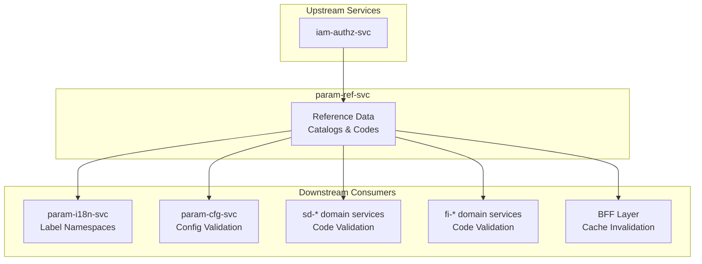
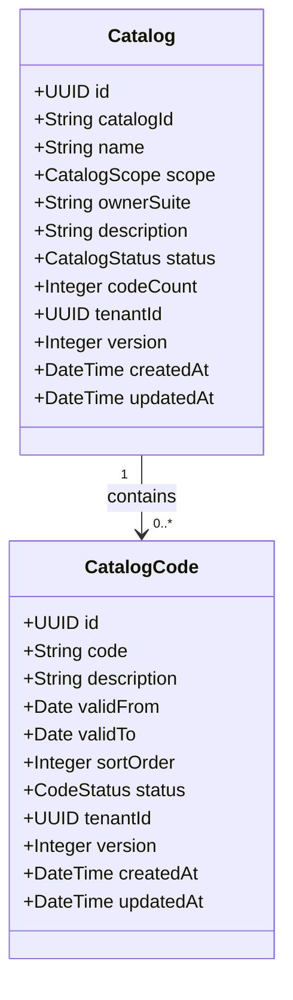
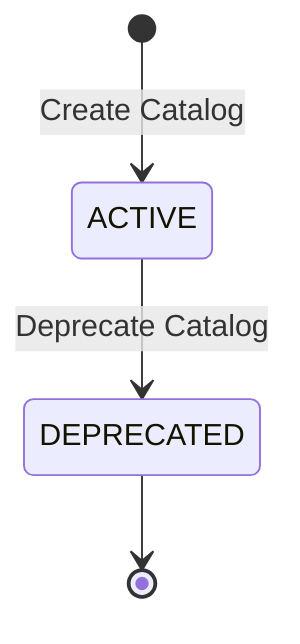
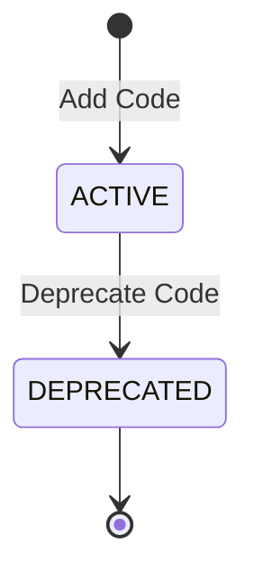
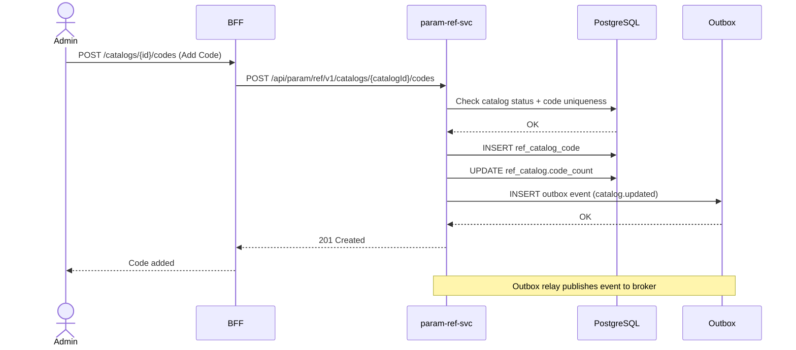
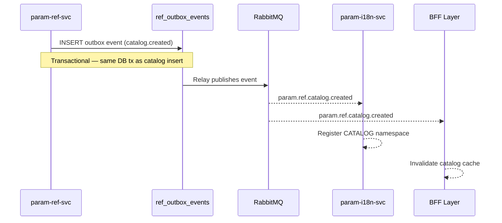
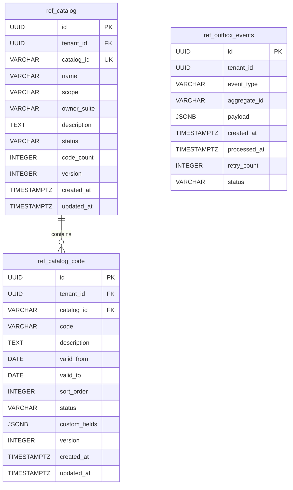

<!-- TEMPLATE COMPLIANCE: ~95%
Template: domain-service-spec.md v1.0.0
Present sections: §0-§15
-->

# param.ref — Reference Data Service Domain Specification

> **Conceptual Stack Layer:** Domain / Service
> **Space:** Platform
> **Owner:** Platform Engineering Team
> **Schema alignment:** `service-layer.schema.json`
> **Companion files:** `contracts/http/param/ref/openapi.yaml`, `contracts/events/param/ref/catalog.created.schema.json`, `contracts/events/param/ref/catalog.updated.schema.json`, `contracts/events/param/ref/catalog.deprecated.schema.json`
> **Referenced by:** Platform-Feature Spec SS5 (F-PARAM-001-01, F-PARAM-001-02, F-PARAM-001-03), BFF Contract
> **Belongs to:** PARAM Suite Spec

> **Meta Information**
> - **Version:** 2026-04-03
> - **Template:** `domain-service-spec.md` v1.0.0
> - **Template Compliance:** ~95% — fully compliant
> - **Author(s):** OpenLeap Architecture Team
> - **Status:** DRAFT
> - **Suite:** `param` (Platform Parameterization)
> - **Domain:** `ref` (Reference Data)
> - **Bounded Context Ref:** `bc:reference-data`
> - **Service ID:** `param-ref-svc`
> - **basePackage:** `io.openleap.param.ref`
> - **API Base Path:** `/api/param/ref/v1`
> - **OpenLeap Starter Version:** `v4.1.0`
> - **Port:** `8100`
> - **Repository:** `https://github.com/openleap-io/io.openleap.param.ref`
> - **Tags:** `param`, `ref`, `reference-data`, `catalogs`, `codes`, `platform`
> - **Team:**
>   - Name: `team-param`
>   - Email: `platform-core@openleap.io`
>   - Slack: `#platform-core`

---

## Specification Guidelines Compliance

> ### Non-Negotiables
> - Never invent facts. If required info is missing, add an **OPEN QUESTION** entry.
> - Preserve intent and decisions. Only change meaning when explicitly requested.
> - Do not remove normative constraints unless they are explicitly replaced.
> - Keep the spec **self-contained**: no "see chat", no implicit context.
>
> ### Source of Truth Priority
> When sources conflict:
> 1. Spec (explicit) wins
> 2. Starter specs (implementation constraints) next
> 3. Guidelines (best practices) last
>
> Record conflicts in the **Decisions & Conflicts** section (see Section 14).
>
> ### Style Guide
> - Prefer short sentences and lists.
> - Use MUST/SHOULD/MAY for normative statements.
> - Keep terminology consistent (Aggregate, Domain Service, Application Service, Command, Event).
> - Avoid ambiguous words ("often", "maybe") unless explicitly noting uncertainty.
> - Keep examples minimal and clearly marked as examples.
> - Do not add implementation code unless the chapter explicitly requires it.

---

## 0. Document Purpose & Scope

### 0.1 Purpose

This specification defines the `param-ref-svc` domain service within the Platform Parameterization suite. The service is the **authoritative source for all controlled vocabularies (reference data catalogs)** across the OpenLeap platform. It manages named catalogs and their code items, provides a code validation API consumed by all domain services, and publishes lifecycle events so that consumers — including `param-i18n-svc`, `param-cfg-svc`, and BFF caches — can react to catalog changes without redeployment.

### 0.2 Target Audience

- Platform Administrators (catalog lifecycle management)
- Suite Administrators (domain-scoped catalog management)
- System Architects & Technical Leads
- Integration Engineers consuming catalog-change events or the validation API
- Domain service developers needing to validate code values at runtime
- BFF engineers rendering code descriptions via i18n label resolution

### 0.3 Scope

**In Scope:**
- Business domain model for reference data catalogs and catalog codes
- Business rules governing catalog uniqueness, code immutability, scope-based access control, and validity periods
- REST API contracts for reading and mutating catalogs and codes
- Bulk import/export API for initial data loading and migration
- Code validation API for consumption by other domain services
- Event contracts for `param.ref.catalog.created`, `param.ref.catalog.updated`, and `param.ref.catalog.deprecated`
- Multi-tenant data isolation via RLS
- Extension points for product-level customisation

**Out of Scope:**
- Authentication and authorisation enforcement — delegated to IAM (`iam-authz-svc`)
- Human-readable label resolution for code values — handled by `param-i18n-svc` (downstream consumer)
- Runtime configuration (feature flags, runtime parameters) — handled by `param-cfg-svc`
- Units of measure — handled by `param-si-svc`
- ISO standard master data curation (ISO 3166, ISO 4217, BCP-47) — platform seeding concern, not runtime management
- Infrastructure configuration — out of platform scope

### 0.4 Related Documents

- `T1_Platform/param/_param_suite.md` — PARAM Suite Architecture
- `T1_Platform/param/domain-specs/param_i18n-spec.md` — Internationalization Service (downstream: registers CATALOG namespaces when catalog is created)
- `T1_Platform/param/domain-specs/param_cfg-spec.md` — Platform Configuration Service (downstream: validates config value references)
- `T1_Platform/param/features/compositions/F-PARAM-001.md` — Reference Data Management feature composition
- `T1_Platform/param/features/leaves/F-PARAM-001-01/feature-spec.md` — Browse Catalogs
- `T1_Platform/param/features/leaves/F-PARAM-001-02/feature-spec.md` — Manage Catalog Codes
- `T1_Platform/param/features/leaves/F-PARAM-001-03/feature-spec.md` — Bulk Import/Export
- `https://github.com/openleap-io/io.openleap.dev.concepts/blob/main/governance/bff-guideline.md` (GOV-BFF-001) — BFF pattern governance
- `T1_Platform/iam/domain-specs/iam_authz-spec.md` — Authorisation service

---

## 1. Business Context

### 1.1 Domain Purpose

The Reference Data domain solves the problem of fragmented, duplicated, and inconsistently governed controlled vocabularies across a multi-tenant ERP platform. Without a centralised reference data service, every domain service would maintain its own copy of code tables — country codes in the FI service, currency codes in the SD service, payment terms in the AR service — with no consistency, no shared validation, and no audit trail for changes.

`param-ref-svc` provides a structured, scope-governed store for all code catalogs: ISO standard catalogs (countries, currencies, languages, units) managed at PLATFORM scope, and domain-specific catalogs (order statuses, payment terms, document types) managed at DOMAIN scope by individual suite teams. Any domain service can validate a code value at runtime via the validation endpoint, ensuring that code values stored in domain records remain valid according to the current catalog state.

### 1.2 Business Value

- **Single source of truth:** All code values for every catalog live in one place — eliminates duplication and drift between domain services.
- **Scope governance:** PLATFORM catalogs are governed centrally; DOMAIN catalogs are governed by the owning suite — clear ownership at each level.
- **Immutable codes:** Code values are immutable after creation, so historical domain records remain valid even as descriptions change.
- **Deprecation without deletion:** Codes are deprecated rather than deleted, preserving referential integrity for historical records while preventing their use in new records.
- **Event-driven synchronisation:** Published events allow `param-i18n-svc` to maintain label namespaces, BFF caches to invalidate, and audit systems to record catalog evolution.
- **Bulk operations:** CSV/JSON import enables initial data loading from legacy systems and periodic catalog refreshes without manual UI entry.
- **SAP equivalent:** Replaces SAP's domain/check table infrastructure (DDIC domains, T-tables such as T001, T001W, T005, TCURC), SM30 table maintenance, and the SPRO IMG reference data configuration screen for code value governance.

### 1.3 Key Stakeholders

| Role | Responsibility | Primary Use Cases |
|------|----------------|-------------------|
| Platform Administrator | Manages PLATFORM-scoped catalogs; seeds ISO standard data | Create catalog; add codes; bulk import ISO data; deprecate obsolete codes |
| Suite Administrator | Manages DOMAIN-scoped catalogs for their suite | Create domain catalog; add suite-specific codes; deprecate replaced codes |
| Domain Service (machine) | Validates code values at runtime before persisting | GET /catalogs/{id}/validate/{code} |
| BFF Engineer | Resolves code descriptions via i18n label lookup | Consumes catalog events for cache invalidation |
| Integration Engineer | Synchronises catalog data with external systems | Export catalog; subscribe to catalog events |
| Localization Team | Provides translated descriptions for catalog codes | Works via param-i18n-svc; indirectly depends on catalog structure |

### 1.4 Strategic Positioning

The Reference Data domain is the **most upstream service in the PARAM suite**. It MUST NOT depend on any T2/T3 domain services (ADR-001). Its only cross-suite dependency is `iam-authz-svc` for permission checking.

`param-ref-svc` is a **low-write, high-read** service: catalog mutations are infrequent (initial seeding, periodic updates), but code validation reads occur on every write operation across all domain services. This asymmetry drives the architecture: simple, deterministic REST endpoints for validation, aggressive downstream caching, and thin events for cache invalidation.

Architecturally, this service corresponds to SAP's **Domain/Check Table infrastructure** (SE11 domain definitions, SM30 table maintenance generator, T-table management) and the **SPRO Reference IMG** for domain-independent code configuration. In the OpenLeap architecture, it serves as the **shared vocabulary backbone** that all domain models reference.

### 1.5 Service Context

| Property | Value |
|----------|-------|
| **Suite** | `param` |
| **Domain** | `ref` |
| **Bounded Context** | `bc:reference-data` |
| **Service ID** | `param-ref-svc` |
| **Base Package** | `io.openleap.param.ref` |

**Responsibilities:**
- Authoritative store for all named reference data catalogs and their code items
- Code validation API for upstream consumption by domain services
- Lifecycle governance: catalog and code creation, update, deprecation
- Bulk import/export for data migration and initial seeding
- Event publishing for downstream cache invalidation and namespace registration

**Authoritative Sources:**
| Source Type | Description | Access Pattern |
|-------------|-------------|----------------|
| REST API | Catalog and code CRUD; validation endpoint | Synchronous |
| Database | Owned tables: `ref_catalog`, `ref_catalog_code` | Direct (owner) |
| Events | `catalog.created`, `catalog.updated`, `catalog.deprecated` | Asynchronous |



---

## 2. Service Identity

| Property | Value | Schema Field |
|----------|-------|-------------|
| **Service ID** | `param-ref-svc` | `metadata.id` |
| **Display Name** | `Platform Reference Data Service` | `metadata.name` |
| **Suite** | `param` | `metadata.suite` |
| **Domain** | `ref` | `metadata.domain` |
| **Bounded Context** | `bc:reference-data` | `metadata.bounded_context_ref` |
| **Version** | `1.0.0` | `metadata.version` |
| **Status** | DRAFT | `metadata.status` |
| **API Base Path** | `/api/param/ref/v1` | `metadata.api_base_path` |
| **Repository** | `https://github.com/openleap-io/io.openleap.param.ref` | `metadata.repository` |
| **Tags** | `param`, `ref`, `reference-data`, `catalogs`, `platform` | `metadata.tags` |

**Team:**
| Property | Value |
|----------|-------|
| **Name** | `team-param` |
| **Email** | `platform-core@openleap.io` |
| **Slack Channel** | `#platform-core` |

---

## 3. Domain Model

### 3.1 Conceptual Overview

The Reference Data domain manages two core concepts: **Catalog** and **CatalogCode**. A Catalog is a named, scope-governed collection of controlled vocabulary items (e.g., `countries`, `currencies`, `sd.order-status`). A CatalogCode is an individual entry within a catalog — an immutable code value with a changeable description and validity period.

Catalogs are scoped: PLATFORM catalogs contain ISO-standard or globally applicable codes managed by platform administrators; DOMAIN catalogs contain suite-specific codes managed by the owning suite team (identified by `ownerSuite`).

Code values are immutable after creation to preserve referential integrity in all domain records that reference them. Descriptions are mutable. Codes that are no longer valid are deprecated rather than deleted.

### 3.2 Core Concepts



### 3.3 Aggregate Definitions

#### 3.3.1 Catalog

| Property | Value |
|----------|-------|
| **Aggregate ID** | `agg:catalog` |
| **Name** | `Catalog` |

**Business Purpose:**
A Catalog is the aggregate root representing a named collection of controlled vocabulary codes. It governs the scope of access, tracks aggregate code counts, and serves as the authoritative reference for all downstream code validation. It corresponds to a SAP DDIC domain or T-table definition.

##### Aggregate Root

**Key Attributes:**
| Attribute | Type | Format | Description | Constraints | Required | Read-Only |
|-----------|------|--------|-------------|-------------|----------|-----------|
| id | string | uuid | Surrogate primary key, system-generated | Immutable | Yes | Yes |
| catalogId | string | — | Business key — unique identifier for the catalog across all scopes | max_length: 100; pattern: `^[a-z][a-z0-9._-]*$`; Immutable | Yes | Yes |
| name | string | — | Human-readable display name for the catalog | max_length: 200 | Yes | No |
| scope | string | — | Governance scope of the catalog | enum_ref: `CatalogScope` | Yes | No |
| ownerSuite | string | — | Short code of the suite that owns a DOMAIN-scoped catalog | max_length: 20; Required if scope=DOMAIN; NULL for PLATFORM | Conditional | No |
| description | string | — | Optional narrative description of the catalog's purpose | max_length: 2000 | No | No |
| status | string | — | Current lifecycle state of the catalog | enum_ref: `CatalogStatus` | Yes | No |
| codeCount | integer | int32 | Derived count of ACTIVE codes within this catalog | Read-only, maintained by service | Yes | Yes |
| version | integer | int64 | Optimistic locking version | Increments on every mutation | Yes | Yes |
| tenantId | string | uuid | Tenant ownership for multi-tenant data isolation (RLS) | Immutable | Yes | Yes |
| createdAt | string | date-time | Timestamp of catalog creation | Immutable | Yes | Yes |
| updatedAt | string | date-time | Timestamp of last mutation | System-maintained | Yes | Yes |

**Lifecycle States:**

| Property | Value |
|----------|-------|
| **Initial State** | `ACTIVE` |
| **Terminal States** | `DEPRECATED` |



**State Descriptions:**
| State | Description | Business Meaning |
|-------|-------------|------------------|
| ACTIVE | Operational state | Catalog is in use; codes may be added, updated, or deprecated |
| DEPRECATED | Terminal state | Catalog is no longer maintained; existing codes remain readable; no new codes may be added |

**Allowed Transitions:**
| From State | To State | Trigger | Guard / Business Preconditions |
|------------|----------|---------|-------------------------------|
| ACTIVE | DEPRECATED | `DeprecateCatalogCommand` | Caller has PLATFORM_ADMIN (for PLATFORM scope) or SUITE_ADMIN of ownerSuite (for DOMAIN scope) |

**Invariants:**
| Rule ID | Description |
|---------|-------------|
| BR-REF-001 | catalogId must be globally unique across all scopes and tenants |
| BR-REF-003 | PLATFORM-scoped catalogs may only be mutated by PLATFORM_ADMIN |
| BR-REF-004 | DOMAIN-scoped catalogs require ownerSuite; managed by PLATFORM_ADMIN or the ownerSuite's SUITE_ADMIN |
| BR-REF-008 | A deprecated catalog cannot be reactivated |

**Domain Events Emitted:**
- `param.ref.catalog.created`
- `param.ref.catalog.updated`
- `param.ref.catalog.deprecated`

##### Child Entities

###### Entity: CatalogCode

| Property | Value |
|----------|-------|
| **Entity ID** | `ent:catalog-code` |
| **Name** | `CatalogCode` |
| **Relationship to Root** | one_to_many |

**Business Purpose:**
A CatalogCode is an individual entry in a catalog — one code value with its human-readable description and optional validity period. The code value is the token that domain services store in their records (e.g., `"DE"` for Germany in the `countries` catalog). Descriptions are managed separately via `param-i18n-svc`; the `description` field here holds a canonical English fallback.

**Attributes:**
| Attribute | Type | Format | Description | Constraints | Required |
|-----------|------|--------|-------------|-------------|----------|
| id | string | uuid | Surrogate primary key | Immutable | Yes |
| catalogId | string | — | Parent catalog business key | FK to Catalog.catalogId; Immutable | Yes |
| code | string | — | The code value stored by domain services | max_length: 100; Unique within catalog; Immutable after creation; pattern: `^[A-Za-z0-9._-]+$` | Yes |
| description | string | — | Canonical English description / fallback label | max_length: 500 | No |
| validFrom | string | date | Date from which this code is valid | — | No |
| validTo | string | date | Date after which this code is no longer valid | minimum: validFrom if both set | No |
| sortOrder | integer | int32 | Optional display order within the catalog | minimum: 0 | No |
| status | string | — | Current lifecycle state of this code | enum_ref: `CodeStatus` | Yes |
| version | integer | int64 | Optimistic locking version | — | Yes |
| tenantId | string | uuid | Tenant ownership (RLS) | Immutable | Yes |
| createdAt | string | date-time | Code creation timestamp | Immutable | Yes |
| updatedAt | string | date-time | Last mutation timestamp | System-maintained | Yes |

**Collection Constraints:**
- Minimum items: 0 (catalog may be created without codes)
- Maximum items: 10,000 (per catalog per tenant)

**Lifecycle States (CatalogCode):**


**Invariants:**
| Rule ID | Description |
|---------|-------------|
| BR-REF-002 | Code value must be unique within a catalog (case-sensitive comparison) |
| BR-REF-005 | Code value is immutable after creation |
| BR-REF-007 | validTo must be greater than or equal to validFrom when both are specified |
| BR-REF-009 | A code cannot be added to a DEPRECATED catalog |

##### Value Objects

###### Value Object: CatalogRef

| Property | Value |
|----------|-------|
| **VO ID** | `vo:catalog-ref` |
| **Name** | `CatalogRef` |

**Description:**
A lightweight reference to a catalog-code pair used in domain service records. Domain services store a `CatalogRef` rather than embedding the full code description, allowing descriptions to evolve without requiring domain record migration.

**Attributes:**
| Attribute | Type | Format | Description | Constraints |
|-----------|------|--------|-------------|-------------|
| catalogId | string | — | The catalog business key | max_length: 100 |
| code | string | — | The code value | max_length: 100 |

**Validation Rules:**
- `catalogId` must reference an ACTIVE catalog
- `code` must reference an ACTIVE code within the referenced catalog at the time of the domain record write
- Both fields together must resolve to an existing `CatalogCode`

**Used By:** All T2/T3 domain services that reference catalog-governed values (e.g., country codes in address value objects, currency codes in Money, payment term codes in order headers)

### 3.4 Enumerations

**CatalogScope:**
| Value | Description | Deprecated |
|-------|-------------|------------|
| PLATFORM | ISO-standard or globally applicable catalog, managed by PLATFORM_ADMIN only | No |
| DOMAIN | Suite-specific catalog, managed by the owning suite's SUITE_ADMIN or PLATFORM_ADMIN | No |

**CatalogStatus:**
| Value | Description | Deprecated |
|-------|-------------|------------|
| ACTIVE | Catalog is operational; codes may be added, updated, or deprecated | No |
| DEPRECATED | Catalog is no longer maintained; read-only; no new codes may be added | No |

**CodeStatus:**
| Value | Description | Deprecated |
|-------|-------------|------------|
| ACTIVE | Code is in use; valid for new domain records | No |
| DEPRECATED | Code is retired; existing records using it remain valid; MUST NOT be used in new records | No |

### 3.5 Shared Types

None at this time. `CatalogRef` (§3.3) is a value object within this service and is documented as a contract type for consuming domain services.

---

## 4. Business Rules

### 4.1 Business Rules Catalog

| Rule ID | Name | Scope | Enforcement Point | Severity |
|---------|------|-------|-------------------|----------|
| BR-REF-001 | Catalog ID Global Uniqueness | Catalog | Application Service (CreateCatalogCommand) | Critical |
| BR-REF-002 | Code Value Uniqueness Within Catalog | CatalogCode | Domain Object (Catalog aggregate) | Critical |
| BR-REF-003 | PLATFORM Scope Access Control | Catalog | Application Service (all Catalog mutation commands) | Critical |
| BR-REF-004 | DOMAIN Scope Requires ownerSuite | Catalog | Application Service (CreateCatalogCommand) | Critical |
| BR-REF-005 | Code Value Immutability | CatalogCode | Domain Object (CatalogCode) | Critical |
| BR-REF-006 | Deprecated Code Exclusion from Validation | CatalogCode | Application Service (ValidateCodeCommand) | High |
| BR-REF-007 | Validity Period Coherence | CatalogCode | Domain Object (CatalogCode) | High |
| BR-REF-008 | Catalog Deprecation Irreversibility | Catalog | Domain Object (Catalog) | High |
| BR-REF-009 | No New Codes on Deprecated Catalog | CatalogCode | Domain Object (Catalog) | High |

### 4.2 Detailed Rule Definitions

#### BR-REF-001: Catalog ID Global Uniqueness

**Business Context:** Every domain service that references a catalog uses the `catalogId` string as a stable key. If two catalogs shared the same `catalogId`, downstream consumers would not know which catalog a code belongs to.

**Rule Statement:** `catalogId` must be unique across all catalogs for a given tenant, regardless of scope.

**Applies To:**
- Aggregate: Catalog
- Operations: Create

**Enforcement:** Unique database constraint on `(tenant_id, catalog_id)` in `ref_catalog`. Application Service checks the constraint result and maps to the domain error.

**Validation Logic:** Before inserting a new Catalog, check whether any Catalog with the same `tenantId` and `catalogId` exists. If yes, reject.

**Error Handling:**
- **Error Code:** `REF-001`
- **Error Message:** `"A catalog with ID '{catalogId}' already exists for this tenant."`
- **User action:** Choose a different, unique `catalogId`.

**Examples:**
- **Valid:** Creating catalog `sd.payment-terms` when no catalog with that ID exists.
- **Invalid:** Creating catalog `countries` when a PLATFORM catalog `countries` already exists.

---

#### BR-REF-002: Code Value Uniqueness Within Catalog

**Business Context:** Code values are stored in domain records as plain strings. If a catalog contained two entries with the same code, code validation would be ambiguous and the uniqueness guarantee for downstream validation would break.

**Rule Statement:** Within a given catalog, no two CatalogCode entries may share the same `code` value (case-sensitive).

**Applies To:**
- Aggregate: Catalog → CatalogCode
- Operations: AddCode, ImportCodes

**Enforcement:** Unique database constraint on `(tenant_id, catalog_id, code)` in `ref_catalog_code`.

**Validation Logic:** Before inserting a new CatalogCode, check whether any CatalogCode with the same `tenantId`, `catalogId`, and `code` exists.

**Error Handling:**
- **Error Code:** `REF-002`
- **Error Message:** `"Code '{code}' already exists in catalog '{catalogId}'."`
- **User action:** Use a different code value, or update the description of the existing code.

**Examples:**
- **Valid:** Adding `DE` to `countries` when no code `DE` exists in `countries`.
- **Invalid:** Adding `USD` to `currencies` when `USD` already exists in `currencies`.

---

#### BR-REF-003: PLATFORM Scope Access Control

**Business Context:** PLATFORM catalogs contain ISO-standard and globally applicable codes shared by all tenants. Allowing non-platform administrators to modify them would corrupt data relied upon by every domain service and every tenant.

**Rule Statement:** Create, update, and deprecate operations on PLATFORM-scoped catalogs and their codes MUST only be executed by users holding the `PLATFORM_ADMIN` role.

**Applies To:**
- Aggregate: Catalog (scope=PLATFORM), CatalogCode (in PLATFORM catalog)
- Operations: Create, Update, Deprecate, AddCode, UpdateCode, DeprecateCode, BulkImport

**Enforcement:** Application Service checks the caller's role claims from the IAM token before dispatching the command. Returns 403 if the required role is absent.

**Validation Logic:** Extract roles from bearer token. If catalog.scope == PLATFORM and caller does not hold `PLATFORM_ADMIN`, reject.

**Error Handling:**
- **Error Code:** `REF-003`
- **Error Message:** `"Insufficient permissions to modify a PLATFORM-scoped catalog. PLATFORM_ADMIN role required."`
- **User action:** Request PLATFORM_ADMIN role assignment or contact a platform administrator.

**Examples:**
- **Valid:** PLATFORM_ADMIN adds code `XK` (Kosovo) to the `countries` catalog.
- **Invalid:** A SUITE_ADMIN for the `sd` suite attempts to add a code to the `currencies` catalog.

---

#### BR-REF-004: DOMAIN Scope Requires ownerSuite

**Business Context:** DOMAIN catalogs must have a clear owner so that access control (BR-REF-003 complement) can be enforced and so that other services know which suite governs the catalog's semantics.

**Rule Statement:** When creating a catalog with `scope = DOMAIN`, the `ownerSuite` field MUST be provided and MUST match a known suite short code. When creating a catalog with `scope = PLATFORM`, `ownerSuite` MUST be null.

**Applies To:**
- Aggregate: Catalog
- Operations: Create

**Enforcement:** Application Service validates the `ownerSuite` field against the known suite registry before dispatching `CreateCatalogCommand`.

**Validation Logic:** If scope == DOMAIN and ownerSuite is null → reject. If scope == PLATFORM and ownerSuite is not null → reject.

**Error Handling:**
- **Error Code:** `REF-004-A`
- **Error Message:** `"DOMAIN-scoped catalog requires ownerSuite to be specified."`
- **Error Code:** `REF-004-B`
- **Error Message:** `"PLATFORM-scoped catalog must not specify ownerSuite."`
- **User action:** Provide (or remove) the `ownerSuite` value as appropriate.

**Examples:**
- **Valid:** Creating catalog `sd.order-status` with `scope=DOMAIN`, `ownerSuite=sd`.
- **Invalid:** Creating catalog `sd.order-status` with `scope=DOMAIN` and no `ownerSuite`.

---

#### BR-REF-005: Code Value Immutability

**Business Context:** Thousands of domain records store a code value as a reference (e.g., `"country": "DE"`). If that code value were changed to `"DEU"`, all existing records would reference an invalid code, requiring a data migration across every domain service.

**Rule Statement:** The `code` field of a CatalogCode MUST NOT be modified after the code has been created.

**Applies To:**
- Aggregate: CatalogCode
- Operations: UpdateCode

**Enforcement:** Application Service rejects any `UpdateCatalogCodeCommand` that includes a `code` field change. The `code` field is excluded from the update payload in the API contract.

**Validation Logic:** The `code` field is not accepted in PUT/PATCH request bodies for existing codes.

**Error Handling:**
- **Error Code:** `REF-005`
- **Error Message:** `"Code value is immutable and cannot be modified after creation."`
- **User action:** Deprecate the existing code and create a new code with the desired value.

**Examples:**
- **Valid:** Updating description of code `DE` from "Germany" to "Federal Republic of Germany".
- **Invalid:** Changing code `DE` to `DEU` in an update request.

---

#### BR-REF-006: Deprecated Code Exclusion from Validation

**Business Context:** Domain services use the validation endpoint to check that a code is valid before persisting it in a new record. A deprecated code should not be accepted for new records, even though existing records referencing it remain historically valid.

**Rule Statement:** The validation endpoint MUST return `valid: false` for codes in `DEPRECATED` status. Only codes in `ACTIVE` status within `ACTIVE` catalogs are considered valid for new records.

**Applies To:**
- Application Service: ValidateCodeCommand
- Operations: ValidateCode

**Enforcement:** Validation query includes `status = ACTIVE` predicate on both Catalog and CatalogCode.

**Validation Logic:** SELECT where catalog.status = ACTIVE AND catalog_code.status = ACTIVE AND catalog_code.validFrom <= today (if set) AND catalog_code.validTo >= today (if set).

**Error Handling:**
- **Error Code:** `REF-006`
- **Error Message:** `"Code '{code}' in catalog '{catalogId}' is not valid. It may be deprecated, outside its validity period, or does not exist."`
- **User action:** Use an ACTIVE code from the catalog.

**Examples:**
- **Valid:** Validating code `EUR` in catalog `currencies` where `EUR` is ACTIVE.
- **Invalid:** Validating code `DEM` (Deutsche Mark) in catalog `currencies` where `DEM` is DEPRECATED.

---

#### BR-REF-007: Validity Period Coherence

**Business Context:** Validity periods allow codes to be time-bounded (e.g., a seasonal discount code valid only in Q4). An invalid range (validTo before validFrom) would make the code permanently invalid, which would be a data error rather than a business intent.

**Rule Statement:** If both `validFrom` and `validTo` are specified on a CatalogCode, `validTo` MUST be greater than or equal to `validFrom`.

**Applies To:**
- Aggregate: CatalogCode
- Operations: AddCode, UpdateCode, BulkImport

**Enforcement:** Domain object validates the date range at construction and on update.

**Validation Logic:** If validFrom is set AND validTo is set AND validTo < validFrom → reject.

**Error Handling:**
- **Error Code:** `REF-007`
- **Error Message:** `"validTo must be on or after validFrom."`
- **User action:** Correct the date range so that validTo is on or after validFrom.

**Examples:**
- **Valid:** `validFrom: 2026-01-01`, `validTo: 2026-12-31`.
- **Invalid:** `validFrom: 2026-06-01`, `validTo: 2026-01-01`.

---

#### BR-REF-008: Catalog Deprecation Irreversibility

**Business Context:** Once a catalog is deprecated, domain services are expected to stop validating against it. Allowing reactivation would cause inconsistency — domain records created during the deprecated period would reference codes that are again "active" without going through a controlled reactivation process.

**Rule Statement:** A catalog in `DEPRECATED` status MUST NOT be transitioned back to `ACTIVE` status.

**Applies To:**
- Aggregate: Catalog
- Operations: Any status change on a DEPRECATED catalog

**Enforcement:** Domain object (Catalog) rejects state transitions from DEPRECATED to any other state.

**Error Handling:**
- **Error Code:** `REF-008`
- **Error Message:** `"A deprecated catalog cannot be reactivated."`
- **User action:** Create a new catalog with the same or a new catalogId.

---

#### BR-REF-009: No New Codes on Deprecated Catalog

**Business Context:** A deprecated catalog signals that its code vocabulary is retired. Adding new codes to a retired catalog would be semantically inconsistent and could confuse consumers that have already stopped validating against it.

**Rule Statement:** New CatalogCode entries MUST NOT be added to a catalog in `DEPRECATED` status.

**Applies To:**
- Aggregate: Catalog → CatalogCode
- Operations: AddCode, BulkImport

**Enforcement:** Catalog domain object checks its own status before accepting `AddCodeCommand`.

**Error Handling:**
- **Error Code:** `REF-009`
- **Error Message:** `"Cannot add codes to a deprecated catalog '{catalogId}'."`
- **User action:** Reactivation is not possible (BR-REF-008). Create a new catalog if the vocabulary needs to be extended.

---

### 4.3 Data Validation Rules

**Field-Level Validations:**

| Field | Validation Rule | Error Message |
|-------|----------------|---------------|
| `catalogId` | Required; max 100 chars; pattern `^[a-z][a-z0-9._-]*$` | "catalogId is required and must match pattern ^[a-z][a-z0-9._-]*$" |
| `name` | Required; max 200 chars | "name is required and must not exceed 200 characters" |
| `scope` | Required; must be PLATFORM or DOMAIN | "scope must be PLATFORM or DOMAIN" |
| `ownerSuite` | Required if scope=DOMAIN; max 20 chars; must be null if scope=PLATFORM | "ownerSuite is required for DOMAIN-scoped catalogs" |
| `description` | Optional; max 2000 chars | "description must not exceed 2000 characters" |
| `code` | Required; max 100 chars; pattern `^[A-Za-z0-9._-]+$` | "code is required and must match pattern ^[A-Za-z0-9._-]+$" |
| `CatalogCode.description` | Optional; max 500 chars | "description must not exceed 500 characters" |
| `validFrom` | Optional; ISO date | "validFrom must be a valid ISO 8601 date (YYYY-MM-DD)" |
| `validTo` | Optional; ISO date; must be >= validFrom | "validTo must be on or after validFrom" |
| `sortOrder` | Optional; integer >= 0 | "sortOrder must be a non-negative integer" |

**Cross-Field Validations:**
- `validTo` must be ≥ `validFrom` if both are specified (BR-REF-007)
- `ownerSuite` must be null when `scope = PLATFORM` and non-null when `scope = DOMAIN` (BR-REF-004)
- Code additions require parent Catalog to be in `ACTIVE` status (BR-REF-009)

### 4.4 Reference Data Dependencies

This service is itself the authoritative source for reference data. It has no external reference catalog dependencies. However, `ownerSuite` values SHOULD be validated against a platform-managed suite registry.

> OPEN QUESTION: See Q-REF-001 in §14.3

| Catalog | Source Service | Fields Referencing | Validation |
|---------|----------------|-------------------|------------|
| `ownerSuite` values | Platform suite registry (see Q-REF-001) | `Catalog.ownerSuite` | Soft validation (warning, not rejection) |

---

## 5. Application Logic

### 5.1 Business Logic Placement

| Logic Type | Placement | Examples |
|------------|-----------|----------|
| Aggregate invariants | Domain Object (Catalog, CatalogCode) | Code uniqueness within catalog, date range coherence, deprecation irreversibility |
| Cross-aggregate logic | Domain Service | None required — Catalog is self-contained |
| Orchestration & transactions | Application Service | Scope access control (BR-REF-003), ownerSuite validation (BR-REF-004), outbox publishing |

### 5.2 Use Cases

| Use Case ID | Name | Type | Actor | Trigger |
|-------------|------|------|-------|---------|
| UC-REF-001 | Create Catalog | WRITE | Platform/Suite Administrator | REST POST |
| UC-REF-002 | Add Code to Catalog | WRITE | Platform/Suite Administrator | REST POST |
| UC-REF-003 | Update Catalog Code | WRITE | Platform/Suite Administrator | REST PUT |
| UC-REF-004 | Deprecate Catalog Code | WRITE | Platform/Suite Administrator | REST POST (business op) |
| UC-REF-005 | Deprecate Catalog | WRITE | Platform Administrator | REST POST (business op) |
| UC-REF-006 | Browse Catalogs | READ | Any Authenticated User | REST GET |
| UC-REF-007 | List Catalog Codes | READ | Any Authenticated User / Domain Service | REST GET |
| UC-REF-008 | Validate Code | READ | Domain Service (machine) | REST GET |
| UC-REF-009 | Bulk Import Codes | WRITE | Platform/Suite Administrator | REST POST (multipart) |
| UC-REF-010 | Export Catalog | READ | Platform/Suite Administrator | REST GET |

---

#### UC-REF-001: Create Catalog

**Actor:** Platform Administrator (PLATFORM scope) or Suite Administrator (DOMAIN scope)

**Preconditions:**
- Caller holds `PLATFORM_ADMIN` role (for PLATFORM scope) or `SUITE_ADMIN` for the specified `ownerSuite` (for DOMAIN scope)
- No catalog with the same `catalogId` exists for this tenant

**Main Flow:**
1. Administrator submits POST /api/param/ref/v1/catalogs with catalogId, name, scope, optional ownerSuite and description.
2. System validates scope access (BR-REF-003).
3. System validates ownerSuite presence/absence (BR-REF-004).
4. System checks catalogId uniqueness (BR-REF-001).
5. System creates Catalog in ACTIVE status with codeCount = 0.
6. System publishes `param.ref.catalog.created` event via outbox.
7. System returns 201 Created with Location header.

**Postconditions:**
- Catalog exists in ACTIVE status
- `param.ref.catalog.created` event is in outbox

**Business Rules Applied:**
- BR-REF-001: Catalog ID Global Uniqueness
- BR-REF-003: PLATFORM Scope Access Control
- BR-REF-004: DOMAIN Scope Requires ownerSuite

**Alternative Flows:**
- **Alt-1:** If scope = DOMAIN and ownerSuite matches the caller's suite, SUITE_ADMIN role is sufficient.

**Exception Flows:**
- **Exc-1:** If catalogId already exists → 409 Conflict with REF-001 error.
- **Exc-2:** If PLATFORM scope and caller lacks PLATFORM_ADMIN → 403 Forbidden with REF-003 error.

---

#### UC-REF-002: Add Code to Catalog

**Actor:** Platform Administrator (PLATFORM catalog) or Suite Administrator (DOMAIN catalog of their suite)

**Preconditions:**
- Catalog exists in ACTIVE status
- Caller holds the required role per catalog scope

**Main Flow:**
1. Administrator submits POST /api/param/ref/v1/catalogs/{catalogId}/codes with code, optional description, validFrom, validTo, sortOrder.
2. System validates scope access (BR-REF-003).
3. System checks catalog status (BR-REF-009).
4. System validates code uniqueness within catalog (BR-REF-002).
5. System validates validity period (BR-REF-007).
6. System creates CatalogCode in ACTIVE status.
7. System increments Catalog.codeCount.
8. System publishes `param.ref.catalog.updated` event with `changedCodes: [code]`.
9. System returns 201 Created.

**Postconditions:**
- CatalogCode exists in ACTIVE status
- Catalog.codeCount is incremented
- `param.ref.catalog.updated` event is in outbox

**Business Rules Applied:**
- BR-REF-002, BR-REF-003, BR-REF-007, BR-REF-009

**Exception Flows:**
- **Exc-1:** Duplicate code → 409 Conflict with REF-002 error.
- **Exc-2:** Catalog is DEPRECATED → 422 with REF-009 error.

---

#### UC-REF-003: Update Catalog Code

**Actor:** Platform/Suite Administrator

**Preconditions:**
- Code exists in ACTIVE status
- Caller holds the required role

**Main Flow:**
1. Administrator submits PUT /api/param/ref/v1/catalogs/{catalogId}/codes/{code} with updated description, validFrom, validTo, sortOrder.
2. System validates scope access.
3. System validates validity period (BR-REF-007).
4. System updates mutable fields (description, validFrom, validTo, sortOrder). `code` field is ignored (BR-REF-005).
5. System publishes `param.ref.catalog.updated` event.
6. System returns 200 OK.

**Postconditions:**
- CatalogCode description/validity updated
- Event published

**Business Rules Applied:**
- BR-REF-003, BR-REF-005, BR-REF-007

---

#### UC-REF-004: Deprecate Catalog Code

**Actor:** Platform/Suite Administrator

**Preconditions:**
- Code exists in ACTIVE status

**Main Flow:**
1. Administrator sends POST /api/param/ref/v1/catalogs/{catalogId}/codes/{code}:deprecate.
2. System validates scope access.
3. System transitions CatalogCode to DEPRECATED status.
4. System decrements Catalog.codeCount.
5. System publishes `param.ref.catalog.updated` with `changedCodes: [code]`.
6. System returns 200 OK.

**Postconditions:**
- CatalogCode in DEPRECATED status
- codeCount decremented
- Event published

---

#### UC-REF-005: Deprecate Catalog

**Actor:** Platform Administrator (PLATFORM scope) or ownerSuite's SUITE_ADMIN (DOMAIN scope)

**Preconditions:**
- Catalog exists in ACTIVE status

**Main Flow:**
1. Administrator sends POST /api/param/ref/v1/catalogs/{catalogId}:deprecate.
2. System validates scope access.
3. System transitions Catalog to DEPRECATED status.
4. System publishes `param.ref.catalog.deprecated`.
5. System returns 200 OK.

**Postconditions:**
- Catalog in DEPRECATED status
- All downstream consumers notified via event

**Business Rules Applied:**
- BR-REF-003, BR-REF-008

---

#### UC-REF-006: Browse Catalogs

**Actor:** Any Authenticated User

**Preconditions:**
- Caller is authenticated

**Main Flow:**
1. Caller sends GET /api/param/ref/v1/catalogs with optional filters (scope, status, search, page, size).
2. System queries `ref_catalog` applying tenant RLS.
3. System returns paginated catalog list with id, catalogId, name, scope, ownerSuite, status, codeCount.

**Postconditions:**
- Read-only; no state changes

---

#### UC-REF-007: List Catalog Codes

**Actor:** Any Authenticated User or Domain Service

**Preconditions:**
- Catalog exists

**Main Flow:**
1. Caller sends GET /api/param/ref/v1/catalogs/{catalogId}/codes with optional filters (status, search, page, size).
2. System queries `ref_catalog_code` applying tenant RLS.
3. System returns paginated code list.

---

#### UC-REF-008: Validate Code

**Actor:** Domain Service (machine caller)

**Preconditions:**
- Caller is authenticated

**Main Flow:**
1. Domain service sends GET /api/param/ref/v1/catalogs/{catalogId}/validate/{code}.
2. System checks: catalog is ACTIVE, code exists, code is ACTIVE, current date is within validFrom/validTo range (if set).
3. System returns `{ "valid": true|false, "reason": "..." }`.

**Postconditions:**
- Read-only; no state changes; p99 latency < 20ms (cached)

---

#### UC-REF-009: Bulk Import Codes

**Actor:** Platform/Suite Administrator

**Preconditions:**
- Catalog exists in ACTIVE status
- File is valid CSV or JSON, max 5 MB

**Main Flow:**
1. Administrator POSTs multipart file to POST /api/param/ref/v1/catalogs/{catalogId}/import.
2. System validates scope access.
3. System checks catalog status (BR-REF-009).
4. System parses file, validates each row against BR-REF-002, BR-REF-005, BR-REF-007.
5. System performs idempotent upsert: creates new codes; updates descriptions of existing codes (immutable code value preserved per BR-REF-005).
6. System publishes `param.ref.catalog.updated` with list of created/modified code values.
7. System returns 200 OK with `{ "created": N, "updated": M, "skipped": K, "errors": [...] }`.

**Postconditions:**
- Codes imported or updated as specified
- Event published

**Alternative Flows:**
- **Alt-1:** If `overwrite = false`, existing codes are skipped rather than updated.

**Exception Flows:**
- **Exc-1:** File parse error → 400 Bad Request with line-level error details.
- **Exc-2:** Partial failures → rows with errors are skipped and reported in response body; valid rows are still imported.

---

#### UC-REF-010: Export Catalog

**Actor:** Platform/Suite Administrator

**Preconditions:**
- Catalog exists

**Main Flow:**
1. Administrator sends GET /api/param/ref/v1/catalogs/{catalogId}/export?format=csv|json.
2. System queries all codes for the catalog.
3. System serialises to requested format and returns file download.

---

### 5.3 Process Flow Diagrams



### 5.4 Cross-Domain Workflows

The Reference Data domain participates in two choreography-based cross-domain workflows.

**Workflow 1: Catalog Created → i18n Namespace Registration**

| Property | Value |
|----------|-------|
| **Pattern** | Choreography (ADR-003, ADR-029) |
| **Trigger** | `param.ref.catalog.created` published by param-ref-svc |
| **Participating Services** | param-ref-svc (producer), param-i18n-svc (consumer) |

| Step | Service | Action |
|------|---------|--------|
| 1 | param-ref-svc | Publishes `catalog.created` after creating a new catalog |
| 2 | param-i18n-svc | Consumes event; auto-registers a CATALOG namespace for the new catalog (see Q-REF-003 in §14.3) |

**Workflow 2: Code Deprecated → Downstream Cache Invalidation**

| Property | Value |
|----------|-------|
| **Pattern** | Choreography |
| **Trigger** | `param.ref.catalog.updated` or `param.ref.catalog.deprecated` |
| **Participating Services** | param-ref-svc (producer), BFF layers (consumers) |

BFF caches for catalog browse (F-PARAM-001-01) MUST be invalidated on receiving these events.

---

## 6. REST API

### 6.1 API Overview

| Method | Path | Use Case | Auth |
|--------|------|----------|------|
| GET | `/api/param/ref/v1/catalogs` | UC-REF-006: Browse Catalogs | Authenticated |
| POST | `/api/param/ref/v1/catalogs` | UC-REF-001: Create Catalog | PLATFORM_ADMIN / SUITE_ADMIN |
| GET | `/api/param/ref/v1/catalogs/{catalogId}` | Get Catalog by ID | Authenticated |
| PATCH | `/api/param/ref/v1/catalogs/{catalogId}` | Update Catalog metadata | PLATFORM_ADMIN / SUITE_ADMIN |
| POST | `/api/param/ref/v1/catalogs/{catalogId}:deprecate` | UC-REF-005: Deprecate Catalog | PLATFORM_ADMIN / SUITE_ADMIN |
| GET | `/api/param/ref/v1/catalogs/{catalogId}/codes` | UC-REF-007: List Codes | Authenticated |
| POST | `/api/param/ref/v1/catalogs/{catalogId}/codes` | UC-REF-002: Add Code | PLATFORM_ADMIN / SUITE_ADMIN |
| GET | `/api/param/ref/v1/catalogs/{catalogId}/codes/{code}` | Get Code by value | Authenticated |
| PUT | `/api/param/ref/v1/catalogs/{catalogId}/codes/{code}` | UC-REF-003: Update Code | PLATFORM_ADMIN / SUITE_ADMIN |
| POST | `/api/param/ref/v1/catalogs/{catalogId}/codes/{code}:deprecate` | UC-REF-004: Deprecate Code | PLATFORM_ADMIN / SUITE_ADMIN |
| GET | `/api/param/ref/v1/catalogs/{catalogId}/validate/{code}` | UC-REF-008: Validate Code | Authenticated |
| POST | `/api/param/ref/v1/catalogs/{catalogId}/import` | UC-REF-009: Bulk Import | PLATFORM_ADMIN / SUITE_ADMIN |
| GET | `/api/param/ref/v1/catalogs/{catalogId}/export` | UC-REF-010: Export | PLATFORM_ADMIN / SUITE_ADMIN |

### 6.2 Resource Operations

#### 6.2.1 Browse Catalogs

```http
GET /api/param/ref/v1/catalogs?scope=PLATFORM&status=ACTIVE&search=countr&page=0&size=25
Authorization: Bearer {token}
```

**Query Parameters:**
| Parameter | Type | Required | Description |
|-----------|------|----------|-------------|
| scope | string | No | Filter by CatalogScope (PLATFORM, DOMAIN) |
| status | string | No | Filter by CatalogStatus (ACTIVE, DEPRECATED); default: ACTIVE |
| search | string | No | Partial match on catalogId or name; min 2 chars |
| page | integer | No | Zero-based page index; default: 0 |
| size | integer | No | Page size; default: 25; max: 100 |

**Success Response:** `200 OK`
```json
{
  "content": [
    {
      "id": "3fa85f64-5717-4562-b3fc-2c963f66afa6",
      "catalogId": "countries",
      "name": "Countries",
      "scope": "PLATFORM",
      "ownerSuite": null,
      "description": "ISO 3166-1 alpha-2 country codes",
      "status": "ACTIVE",
      "codeCount": 249,
      "version": 3,
      "createdAt": "2026-01-01T00:00:00Z",
      "updatedAt": "2026-04-01T10:00:00Z",
      "_links": {
        "self": { "href": "/api/param/ref/v1/catalogs/countries" },
        "codes": { "href": "/api/param/ref/v1/catalogs/countries/codes" }
      }
    }
  ],
  "page": 0,
  "size": 25,
  "totalElements": 42,
  "totalPages": 2
}
```

**Events Published:** None (read operation)

**Error Responses:**
- `400 Bad Request` — Invalid filter parameter

---

#### 6.2.2 Create Catalog

```http
POST /api/param/ref/v1/catalogs
Authorization: Bearer {token}
Content-Type: application/json
```

**Request Body:**
```json
{
  "catalogId": "sd.order-status",
  "name": "Sales Order Status",
  "scope": "DOMAIN",
  "ownerSuite": "sd",
  "description": "Lifecycle statuses for sales orders in the SD suite"
}
```

**Success Response:** `201 Created`
```json
{
  "id": "7c9e6679-7425-40de-944b-e07fc1f90ae7",
  "catalogId": "sd.order-status",
  "name": "Sales Order Status",
  "scope": "DOMAIN",
  "ownerSuite": "sd",
  "description": "Lifecycle statuses for sales orders in the SD suite",
  "status": "ACTIVE",
  "codeCount": 0,
  "version": 1,
  "createdAt": "2026-04-03T12:00:00Z",
  "updatedAt": "2026-04-03T12:00:00Z",
  "_links": {
    "self": { "href": "/api/param/ref/v1/catalogs/sd.order-status" },
    "codes": { "href": "/api/param/ref/v1/catalogs/sd.order-status/codes" }
  }
}
```

**Response Headers:**
- `Location: /api/param/ref/v1/catalogs/sd.order-status`
- `ETag: "1"`

**Business Rules Checked:** BR-REF-001, BR-REF-003, BR-REF-004

**Events Published:**
- `param.ref.catalog.created`

**Error Responses:**
- `400 Bad Request` — Validation error (catalogId format, required fields)
- `403 Forbidden` — Insufficient permissions (BR-REF-003)
- `409 Conflict` — Catalog ID already exists (BR-REF-001)
- `422 Unprocessable Entity` — Business rule violation (BR-REF-004)

---

#### 6.2.3 Add Code to Catalog

```http
POST /api/param/ref/v1/catalogs/{catalogId}/codes
Authorization: Bearer {token}
Content-Type: application/json
```

**Request Body:**
```json
{
  "code": "OPEN",
  "description": "Order received and awaiting processing",
  "validFrom": null,
  "validTo": null,
  "sortOrder": 10
}
```

**Success Response:** `201 Created`
```json
{
  "id": "b5a2c3d4-e6f7-8901-b2c3-d4e5f6a7b8c9",
  "catalogId": "sd.order-status",
  "code": "OPEN",
  "description": "Order received and awaiting processing",
  "validFrom": null,
  "validTo": null,
  "sortOrder": 10,
  "status": "ACTIVE",
  "version": 1,
  "createdAt": "2026-04-03T12:01:00Z",
  "updatedAt": "2026-04-03T12:01:00Z",
  "_links": {
    "self": { "href": "/api/param/ref/v1/catalogs/sd.order-status/codes/OPEN" },
    "catalog": { "href": "/api/param/ref/v1/catalogs/sd.order-status" }
  }
}
```

**Response Headers:**
- `Location: /api/param/ref/v1/catalogs/sd.order-status/codes/OPEN`
- `ETag: "1"`

**Business Rules Checked:** BR-REF-002, BR-REF-003, BR-REF-007, BR-REF-009

**Events Published:**
- `param.ref.catalog.updated` (with `changedCodes: ["OPEN"]`)

**Error Responses:**
- `400 Bad Request` — Validation error
- `403 Forbidden` — Insufficient permissions
- `404 Not Found` — Catalog does not exist
- `409 Conflict` — Code value already exists in catalog (BR-REF-002)
- `412 Precondition Failed` — ETag mismatch on concurrent catalog update
- `422 Unprocessable Entity` — Catalog is DEPRECATED (BR-REF-009)

---

#### 6.2.4 Update Catalog Code

```http
PUT /api/param/ref/v1/catalogs/{catalogId}/codes/{code}
Authorization: Bearer {token}
Content-Type: application/json
If-Match: "1"
```

**Request Body:**
```json
{
  "description": "Order received and queued for fulfilment",
  "validFrom": null,
  "validTo": null,
  "sortOrder": 10
}
```

*(Note: `code` field is not accepted — BR-REF-005)*

**Success Response:** `200 OK`
```json
{
  "id": "b5a2c3d4-e6f7-8901-b2c3-d4e5f6a7b8c9",
  "catalogId": "sd.order-status",
  "code": "OPEN",
  "description": "Order received and queued for fulfilment",
  "status": "ACTIVE",
  "version": 2,
  "updatedAt": "2026-04-03T14:00:00Z",
  "_links": {
    "self": { "href": "/api/param/ref/v1/catalogs/sd.order-status/codes/OPEN" }
  }
}
```

**Response Headers:**
- `ETag: "2"`

**Business Rules Checked:** BR-REF-003, BR-REF-005, BR-REF-007

**Events Published:**
- `param.ref.catalog.updated`

**Error Responses:**
- `404 Not Found` — Code does not exist
- `412 Precondition Failed` — ETag mismatch

---

#### 6.2.5 Validate Code

```http
GET /api/param/ref/v1/catalogs/{catalogId}/validate/{code}
Authorization: Bearer {token}
```

**Success Response:** `200 OK`
```json
{
  "catalogId": "sd.order-status",
  "code": "OPEN",
  "valid": true,
  "reason": null
}
```

**Failure Response (invalid code):** `200 OK`
```json
{
  "catalogId": "currencies",
  "code": "DEM",
  "valid": false,
  "reason": "Code 'DEM' is DEPRECATED in catalog 'currencies'."
}
```

*(Note: The endpoint always returns 200 — validation result is in the response body. A 404 is returned only when the catalog itself does not exist.)*

**Error Responses:**
- `404 Not Found` — Catalog does not exist

---

### 6.3 Business Operations

| Operation | Method | Path | Description |
|-----------|--------|------|-------------|
| Deprecate Catalog | POST | `/catalogs/{catalogId}:deprecate` | Transitions catalog to DEPRECATED (BR-REF-008) |
| Deprecate Code | POST | `/catalogs/{catalogId}/codes/{code}:deprecate` | Transitions code to DEPRECATED |
| Bulk Import | POST | `/catalogs/{catalogId}/import` | Idempotent CSV/JSON code import |
| Export | GET | `/catalogs/{catalogId}/export?format=csv` | Full catalog export in CSV or JSON |

### 6.4 OpenAPI Specification

- **Location:** `contracts/http/param/ref/openapi.yaml`
- **Version:** OpenAPI 3.1.0
- **Status:** Stub — full endpoint paths derived from this spec §6. Implementation-complete OpenAPI MUST be generated from this domain spec.

---

## 7. Events & Integration

### 7.1 Architecture Pattern

| Property | Value |
|----------|-------|
| **Pattern** | Event-driven choreography (ADR-003) |
| **Message Broker** | RabbitMQ (topic exchange `param.ref.events`) |
| **Publishing** | Transactional outbox (ADR-013) — relay polls `ref_outbox_events` |
| **Delivery** | At-least-once (ADR-014) |
| **Event payloads** | Thin events (ADR-011): IDs + changeType; no full entity payload |
| **Suite-level pattern** | Consistent with PARAM suite integration pattern in `_param_suite.md` |

### 7.2 Published Events

#### Event: Catalog.Created

**Routing Key:** `param.ref.catalog.created`

**Business Purpose:** Notifies downstream services (particularly `param-i18n-svc`) that a new vocabulary catalog has been created and is ready for use.

**When Published:** After a successful `CreateCatalogCommand` is persisted.

**Payload Structure:**
```json
{
  "aggregateType": "param.ref.catalog",
  "changeType": "created",
  "entityIds": ["sd.order-status"],
  "version": 1,
  "occurredAt": "2026-04-03T12:00:00Z"
}
```

*(entityIds contains the catalogId string, not the UUID surrogate key, so consumers can resolve without a secondary lookup)*

**Event Envelope:**
```json
{
  "eventId": "a1b2c3d4-e5f6-7890-a1b2-c3d4e5f6a7b8",
  "traceId": "trace-xyz-123",
  "tenantId": "tenant-uuid",
  "occurredAt": "2026-04-03T12:00:00Z",
  "producer": "param.ref",
  "schemaRef": "https://schemas.openleap.io/param/ref/catalog.created.v1.0.0.json",
  "payload": {
    "aggregateType": "param.ref.catalog",
    "changeType": "created",
    "entityIds": ["sd.order-status"],
    "version": 1,
    "occurredAt": "2026-04-03T12:00:00Z"
  }
}
```

**Known Consumers:**
| Consumer Service | Handler | Purpose | Processing Type |
|-----------------|---------|---------|-----------------|
| param-i18n-svc | `CatalogCreatedEventHandler` | Auto-register CATALOG namespace for the new catalog (see Q-REF-003) | Idempotent, at-least-once |
| BFF Catalog Cache | Cache invalidation hook | Invalidate cached catalog list | Fire-and-forget |

---

#### Event: Catalog.Updated

**Routing Key:** `param.ref.catalog.updated`

**Business Purpose:** Notifies consumers that one or more codes within a catalog have been added, updated, or deprecated. Enables BFF cache invalidation and downstream label refreshes.

**When Published:** After `AddCodeCommand`, `UpdateCatalogCodeCommand`, `DeprecateCodeCommand`, or `BulkImportCommand` completes successfully.

**Payload Structure:**
```json
{
  "aggregateType": "param.ref.catalog",
  "changeType": "updated",
  "entityIds": ["countries"],
  "version": 15,
  "occurredAt": "2026-04-03T14:00:00Z",
  "changedCodes": ["XK", "SS"]
}
```

*(Semi-thin deviation: `changedCodes` included beyond minimum ADR-011 payload. See D-REF-001 in §14.2.)*

**Event Envelope:**
```json
{
  "eventId": "b2c3d4e5-f6a7-8901-b2c3-d4e5f6a7b8c9",
  "traceId": "trace-abc-456",
  "tenantId": "tenant-uuid",
  "occurredAt": "2026-04-03T14:00:00Z",
  "producer": "param.ref",
  "schemaRef": "https://schemas.openleap.io/param/ref/catalog.updated.v1.0.0.json",
  "payload": {
    "aggregateType": "param.ref.catalog",
    "changeType": "updated",
    "entityIds": ["countries"],
    "version": 15,
    "occurredAt": "2026-04-03T14:00:00Z",
    "changedCodes": ["XK", "SS"]
  }
}
```

**Known Consumers:**
| Consumer Service | Handler | Purpose | Processing Type |
|-----------------|---------|---------|-----------------|
| param-i18n-svc | `CatalogUpdatedEventHandler` | Detect new codes needing translation namespace entries | Idempotent |
| BFF Catalog Cache | Cache invalidation hook | Invalidate cached catalog code lists | Fire-and-forget |

---

#### Event: Catalog.Deprecated

**Routing Key:** `param.ref.catalog.deprecated`

**Business Purpose:** Notifies all downstream consumers that a catalog is retired. Consumers SHOULD stop validating against the deprecated catalog and archive any cached code lists.

**When Published:** After `DeprecateCatalogCommand` completes.

**Payload Structure:**
```json
{
  "aggregateType": "param.ref.catalog",
  "changeType": "deprecated",
  "entityIds": ["legacy.old-status"],
  "version": 10,
  "occurredAt": "2026-04-03T16:00:00Z",
  "deprecatedAt": "2026-04-03T16:00:00Z"
}
```

**Event Envelope:**
```json
{
  "eventId": "c3d4e5f6-a7b8-9012-c3d4-e5f6a7b8c9d0",
  "traceId": "trace-def-789",
  "tenantId": "tenant-uuid",
  "occurredAt": "2026-04-03T16:00:00Z",
  "producer": "param.ref",
  "schemaRef": "https://schemas.openleap.io/param/ref/catalog.deprecated.v1.0.0.json",
  "payload": {
    "aggregateType": "param.ref.catalog",
    "changeType": "deprecated",
    "entityIds": ["legacy.old-status"],
    "version": 10,
    "occurredAt": "2026-04-03T16:00:00Z",
    "deprecatedAt": "2026-04-03T16:00:00Z"
  }
}
```

**Known Consumers:**
| Consumer Service | Handler | Purpose | Processing Type |
|-----------------|---------|---------|-----------------|
| param-i18n-svc | `CatalogDeprecatedEventHandler` | Archive CATALOG namespace | Idempotent |
| All domain services (potential) | BFF validation cache flush | Stop validating against this catalog | Fire-and-forget |

---

### 7.3 Consumed Events

`param-ref-svc` does not currently consume events from other services.

> OPEN QUESTION: See Q-REF-004 in §14.3 — should the service consume `iam.tenant.tenant.deleted` for tenant data cleanup?

### 7.4 Event Flow Diagrams



### 7.5 Integration Points Summary

**Upstream Dependencies:**

| Service | Purpose | Integration Type | Criticality | Fallback |
|---------|---------|-----------------|-------------|----------|
| iam-authz-svc | Permission checking for scope-governed mutations | REST (synchronous) | Critical | Reject all mutations if IAM unavailable |

**Downstream Consumers:**

| Consumer Service | Purpose | Integration Type | Criticality |
|-----------------|---------|-----------------|-------------|
| param-i18n-svc | Namespace registration for new catalogs | Async event | High |
| param-cfg-svc | Code validation for config entries (indirect) | REST GET (validate) | Medium |
| All T2/T3 domain services | Code validation before persisting code values | REST GET (validate) | High |
| BFF Layer | Cache invalidation on catalog changes | Async event | Medium |

---

## 8. Data Model

### 8.1 Storage Technology

- **Database:** PostgreSQL (ADR-016)
- **Multi-tenancy:** Row-Level Security on `tenant_id` column
- **ID generation:** `OlUuid.create()` (ADR-021) for all UUID primary keys
- **Dual-key pattern:** UUID surrogate PK + business key UK (ADR-020)
- **Extensibility:** `custom_fields JSONB` on `ref_catalog_code` (§12.2)

### 8.2 Conceptual Data Model



### 8.3 Table Definitions

#### Table: ref_catalog

**Business Description:** Stores all reference data catalog definitions. One row per catalog per tenant. PLATFORM-scoped catalogs are typically present in all tenants as seeded data.

**Columns:**
| Column | Type | Nullable | PK | UK | Description |
|--------|------|----------|----|----|-------------|
| id | UUID | NOT NULL | Yes | — | Surrogate primary key, generated by OlUuid.create() |
| tenant_id | UUID | NOT NULL | — | — | Tenant ownership; RLS policy restricts access |
| catalog_id | VARCHAR(100) | NOT NULL | — | Yes | Business key; unique per tenant; immutable |
| name | VARCHAR(200) | NOT NULL | — | — | Human-readable name |
| scope | VARCHAR(20) | NOT NULL | — | — | CatalogScope: PLATFORM or DOMAIN |
| owner_suite | VARCHAR(20) | NULL | — | — | Owning suite short code; required when scope=DOMAIN |
| description | TEXT | NULL | — | — | Optional narrative description |
| status | VARCHAR(20) | NOT NULL | — | — | CatalogStatus: ACTIVE or DEPRECATED |
| code_count | INTEGER | NOT NULL | — | — | Derived count of ACTIVE codes; maintained by triggers or app layer |
| version | INTEGER | NOT NULL | — | — | Optimistic locking version; starts at 1 |
| created_at | TIMESTAMPTZ | NOT NULL | — | — | Immutable creation timestamp |
| updated_at | TIMESTAMPTZ | NOT NULL | — | — | Last mutation timestamp |

**Indexes:**
| Index Name | Columns | Unique |
|------------|---------|--------|
| `ref_catalog_pk` | `id` | Yes |
| `ref_catalog_tenant_catalog_uk` | `(tenant_id, catalog_id)` | Yes |
| `ref_catalog_tenant_status_idx` | `(tenant_id, status)` | No |
| `ref_catalog_scope_idx` | `(scope)` | No |

**Relationships:**
- To `ref_catalog_code`: one_to_many via `catalog_id`

**Data Retention:**
- Soft deprecation only (status = DEPRECATED); no hard deletes
- Retention: indefinite (catalog history is permanent)
- GDPR: catalogs contain no PII

---

#### Table: ref_catalog_code

**Business Description:** Stores all code entries within reference data catalogs. One row per code per catalog per tenant.

**Columns:**
| Column | Type | Nullable | PK | UK | Description |
|--------|------|----------|----|----|-------------|
| id | UUID | NOT NULL | Yes | — | Surrogate primary key |
| tenant_id | UUID | NOT NULL | — | — | Tenant ownership; RLS |
| catalog_id | VARCHAR(100) | NOT NULL | — | — | FK to ref_catalog.catalog_id |
| code | VARCHAR(100) | NOT NULL | — | Yes (composite) | Code value; immutable; unique per (tenant_id, catalog_id) |
| description | TEXT | NULL | — | — | Canonical English fallback description |
| valid_from | DATE | NULL | — | — | Inclusive validity start |
| valid_to | DATE | NULL | — | — | Inclusive validity end |
| sort_order | INTEGER | NULL | — | — | Optional display order |
| status | VARCHAR(20) | NOT NULL | — | — | CodeStatus: ACTIVE or DEPRECATED |
| custom_fields | JSONB | NOT NULL | — | — | Product-specific extension fields (ADR-067); default: `{}` |
| version | INTEGER | NOT NULL | — | — | Optimistic locking version |
| created_at | TIMESTAMPTZ | NOT NULL | — | — | Immutable creation timestamp |
| updated_at | TIMESTAMPTZ | NOT NULL | — | — | Last mutation timestamp |

**Indexes:**
| Index Name | Columns | Unique |
|------------|---------|--------|
| `ref_catalog_code_pk` | `id` | Yes |
| `ref_catalog_code_tenant_catalog_code_uk` | `(tenant_id, catalog_id, code)` | Yes |
| `ref_catalog_code_catalog_status_idx` | `(catalog_id, status)` | No |
| `ref_catalog_code_custom_fields_gin` | `custom_fields` (GIN) | No |

**Relationships:**
- To `ref_catalog`: many_to_one via `(tenant_id, catalog_id)`

**Data Retention:**
- Deprecated codes are retained permanently (historical records reference them)
- GDPR: no PII in standard columns; `custom_fields` may contain product-specific data (product's responsibility)

---

#### Table: ref_outbox_events

**Business Description:** Transactional outbox table for reliable event publishing (ADR-013). Events are inserted in the same database transaction as the domain mutation and relayed to the message broker by the outbox relay process.

**Columns:**
| Column | Type | Nullable | PK | Description |
|--------|------|----------|----|----|
| id | UUID | NOT NULL | Yes | Unique event identifier |
| tenant_id | UUID | NOT NULL | — | Tenant context for routing |
| event_type | VARCHAR(200) | NOT NULL | — | Routing key (e.g., `param.ref.catalog.created`) |
| aggregate_id | VARCHAR(200) | NOT NULL | — | catalogId of the affected aggregate |
| payload | JSONB | NOT NULL | — | Full event envelope JSON |
| created_at | TIMESTAMPTZ | NOT NULL | — | When the event was inserted |
| processed_at | TIMESTAMPTZ | NULL | — | When relay successfully published; null if pending |
| retry_count | INTEGER | NOT NULL | — | Number of publish attempts; default: 0 |
| status | VARCHAR(20) | NOT NULL | — | PENDING, PUBLISHED, DEAD_LETTER |

**Indexes:**
| Index Name | Columns | Unique |
|------------|---------|--------|
| `ref_outbox_pk` | `id` | Yes |
| `ref_outbox_pending_idx` | `(status, created_at)` where `status = 'PENDING'` | No |

**Data Retention:**
- PUBLISHED events purged after 7 days by scheduled job
- DEAD_LETTER events retained 90 days for investigation

---

### 8.4 Reference Data Dependencies

This service is the authoritative source for reference data and has no external catalog dependencies.

> OPEN QUESTION: See Q-REF-001 in §14.3 — `ownerSuite` validation against a platform suite registry.

---

## 9. Security

### 9.1 Data Classification

| Data Element | Classification | Rationale | Protection Measures |
|--------------|----------------|-----------|---------------------|
| Catalog definitions | Internal | Non-sensitive controlled vocabulary metadata | RLS, access control |
| Catalog codes | Internal | Non-sensitive code values | RLS, access control |
| `custom_fields` JSONB | Product-determined | Products may add product-specific metadata | Product responsibility to classify and protect |
| `owner_suite` | Internal | Organisational metadata | RLS |
| Outbox event payloads | Internal | Thin payloads; no PII in standard events | RLS, in-transit TLS |

**Overall Classification:** LOW — no PII in standard catalog or code data. Products that extend via `custom_fields` are responsible for their own data classification.

### 9.2 Access Control

**Roles & Permissions:**
| Role | Description | Scope of Access |
|------|-------------|-----------------|
| `PLATFORM_ADMIN` | Platform-level administrator | Full access to all catalogs and codes (all scopes) |
| `SUITE_ADMIN` | Suite-level administrator | Full access to DOMAIN catalogs where `ownerSuite` matches their suite; read-only on PLATFORM catalogs |
| `TENANT_ADMIN` | Tenant administrator | Read-only access to all catalogs and codes for their tenant |
| `ANY_AUTHENTICATED` | Any logged-in user or service | Read-only access to catalogs and codes; access to validate endpoint |

**Permission Matrix:**
| Operation | PLATFORM_ADMIN | SUITE_ADMIN | TENANT_ADMIN | ANY_AUTHENTICATED |
|-----------|---------------|-------------|--------------|-------------------|
| Browse catalogs | ✓ | ✓ | ✓ | ✓ |
| Get catalog | ✓ | ✓ | ✓ | ✓ |
| Create PLATFORM catalog | ✓ | — | — | — |
| Create DOMAIN catalog | ✓ | ✓ (own suite) | — | — |
| Update PLATFORM catalog | ✓ | — | — | — |
| Update DOMAIN catalog | ✓ | ✓ (own suite) | — | — |
| Deprecate catalog | ✓ | ✓ (own suite) | — | — |
| List codes | ✓ | ✓ | ✓ | ✓ |
| Add code (PLATFORM catalog) | ✓ | — | — | — |
| Add code (DOMAIN catalog) | ✓ | ✓ (own suite) | — | — |
| Update code | ✓ | ✓ (own suite) | — | — |
| Deprecate code | ✓ | ✓ (own suite) | — | — |
| Validate code | ✓ | ✓ | ✓ | ✓ |
| Bulk import | ✓ | ✓ (own suite) | — | — |
| Export | ✓ | ✓ | — | — |

**Data Isolation:** Row-Level Security on `tenant_id` ensures all queries are automatically scoped to the caller's tenant. PLATFORM-scoped catalogs are present in all tenants as seed data and are not tenant-owned (they use a system tenant_id). > OPEN QUESTION: See Q-REF-005 in §14.3

### 9.3 Compliance Requirements

| Regulation | Applicability | Compliance Controls |
|------------|--------------|---------------------|
| GDPR | Low — catalogs and codes are non-personal data. `custom_fields` may contain product-specific data | Standard RLS + audit via `updated_at`; product responsible for GDPR handling of `custom_fields` |
| SOX | Not directly applicable — no financial records stored | — |
| ISO 27001 | Access control and change audit | Optimistic locking version history; status audit via events |

---

## 10. Quality Attributes

### 10.1 Performance

| Metric | Target | Rationale |
|--------|--------|-----------|
| Validate Code (GET) p99 latency | < 20ms | Called on every domain service write; must not bottleneck domain writes |
| Browse Catalogs (GET) p99 latency | < 100ms | Interactive UI; BFF caches aggressively |
| Add Code (POST) p99 latency | < 200ms | Administrative operation; less latency-sensitive |
| Bulk Import p99 duration (1,000 codes) | < 5s | Batch operation; user waits for confirmation |
| Peak read throughput | 5,000 req/sec | All domain services validate codes; high aggregate volume |
| Peak write throughput | 50 req/sec | Administrative mutations are infrequent |
| Event processing throughput | 500 events/sec (outbox relay) | Handles burst during large bulk imports |
| Concurrent validation sessions | 500 | Domain services issuing parallel validation requests |

### 10.2 Availability & Reliability

| Property | Target |
|----------|--------|
| **RTO** | 15 minutes |
| **RPO** | 1 minute (last committed transaction) |
| **Uptime SLA** | 99.9% (platform foundation service) |

**Failure Scenarios:**
| Scenario | Impact | Mitigation |
|----------|--------|-----------|
| Database connection lost | All reads and writes fail; validate endpoint returns 503 | Connection pool retry; domain services SHOULD cache recent validation results locally (30s) |
| Outbox relay down | Events not published; domain mutations still succeed | Relay self-heals on restart; pending events re-published from outbox |
| RabbitMQ broker unavailable | Events not delivered to consumers | Outbox accumulates; events delivered when broker recovers |
| High validate latency spike | Domain service write latency increases | BFF and domain services MAY cache validate results for 30–60 seconds |

### 10.3 Scalability

- **Horizontal scaling:** Multiple stateless application instances behind a load balancer. Outbox relay runs as a single instance per deployment (no distributed locking needed for correctness, only for throughput).
- **Database read replicas:** Validate endpoint and browse queries SHOULD be routed to read replicas to offload the primary.
- **Caching:** BFF layers MUST cache catalog list and code list responses for 5 minutes; invalidate on `catalog.created`, `catalog.updated`, or `catalog.deprecated` events.
- **Capacity planning:** Typical deployment: 50 PLATFORM catalogs × 500 codes each = 25,000 rows. Large deployment: 500 DOMAIN catalogs × 1,000 codes = 500,000 rows. Well within PostgreSQL single-table capacity.

### 10.4 Maintainability

- **API versioning:** URI versioning (`/v1`). Breaking changes require `/v2`. Backward compatibility maintained for at least 12 months.
- **Backward compatibility:** Adding new optional fields to responses is non-breaking. Adding new optional query parameters is non-breaking.
- **Health checks:** `GET /api/param/ref/v1` — returns service info and DB connectivity status.
- **Metrics:** Expose via Micrometer/Prometheus: request count by endpoint, validation hit/miss ratio, outbox lag (pending events count).
- **Alerting:** Alert if: error rate > 1% over 5 minutes; validate endpoint p99 > 50ms; outbox pending count > 1,000.

---

## 11. Feature Dependencies

### 11.1 Purpose

This section maps platform features to their backend dependencies on `param-ref-svc`. Product features that include any F-PARAM-001-xx leaf MUST route their BFF calls through a `param` BFF spec that references only the endpoints listed here.

### 11.2 Feature Dependency Register

| Feature ID | Feature Name | Node Type | Depends On | Mandatory |
|------------|-------------|-----------|------------|-----------|
| F-PARAM-001-01 | Browse Catalogs | LEAF | param-ref-svc | Yes |
| F-PARAM-001-02 | Manage Catalog Codes | LEAF | param-ref-svc | Yes |
| F-PARAM-001-03 | Bulk Import/Export | LEAF | param-ref-svc | Yes (if selected) |

### 11.3 Endpoints per Feature

| Feature | HTTP Method | Endpoint | isMutation |
|---------|-------------|----------|------------|
| F-PARAM-001-01 | GET | `/api/param/ref/v1/catalogs` | No |
| F-PARAM-001-01 | GET | `/api/param/ref/v1/catalogs/{catalogId}` | No |
| F-PARAM-001-02 | GET | `/api/param/ref/v1/catalogs/{catalogId}/codes` | No |
| F-PARAM-001-02 | POST | `/api/param/ref/v1/catalogs` | Yes |
| F-PARAM-001-02 | POST | `/api/param/ref/v1/catalogs/{catalogId}/codes` | Yes |
| F-PARAM-001-02 | PUT | `/api/param/ref/v1/catalogs/{catalogId}/codes/{code}` | Yes |
| F-PARAM-001-02 | POST | `/api/param/ref/v1/catalogs/{catalogId}/codes/{code}:deprecate` | Yes |
| F-PARAM-001-02 | POST | `/api/param/ref/v1/catalogs/{catalogId}:deprecate` | Yes |
| F-PARAM-001-03 | POST | `/api/param/ref/v1/catalogs/{catalogId}/import` | Yes |
| F-PARAM-001-03 | GET | `/api/param/ref/v1/catalogs/{catalogId}/export` | No |

### 11.4 BFF Aggregation Hints

| Feature | BFF Concern | Hint |
|---------|-------------|------|
| F-PARAM-001-01 | Cache catalog list | BFF SHOULD cache `GET /catalogs` for 5 minutes; invalidate on `catalog.created` or `catalog.deprecated` events |
| F-PARAM-001-01 | Label resolution | BFF MAY resolve `catalogId` labels via `param-i18n-svc` for localized catalog names |
| F-PARAM-001-02 | Cache code list | BFF SHOULD cache `GET /catalogs/{id}/codes` for 5 minutes; invalidate on `catalog.updated` event for that catalogId |
| F-PARAM-001-02 | Concurrent edit protection | BFF MUST pass `If-Match: "{version}"` on PUT requests |
| F-PARAM-001-03 | File size enforcement | BFF MUST enforce max 5 MB file size client-side before uploading |
| F-PARAM-001-03 | Import feedback | BFF SHOULD poll import response and display line-level error report to user |

### 11.5 Impact Assessment

If `param-ref-svc` is unavailable:
- F-PARAM-001-01: Shows error state; cached catalog list may be served stale (5-minute TTL).
- F-PARAM-001-02: All write operations unavailable; read operations may be served from BFF cache.
- F-PARAM-001-03: Import/export unavailable.
- All T2/T3 domain service writes that validate codes: SHOULD degrade gracefully by using a short-lived local cache of recent validation results; MUST NOT silently bypass validation.

---

## 12. Extension Points

### 12.1 Purpose

`param-ref-svc` exposes extension points that allow products to add product-specific metadata to catalog codes without modifying the platform service. This follows the Open-Closed Principle: the platform is open for extension through defined interfaces, closed for modification by individual products.

Extension points for this service are intentionally minimal — the `Catalog` aggregate itself is not extensible (it is a shared infrastructure type), but `CatalogCode` is extensible via custom fields.

### 12.2 Custom Fields

#### Custom Fields: Catalog

**Extensible:** No

**Rationale:** Catalog metadata (name, scope, ownerSuite, description) is fully defined by the platform. Products do not need to add product-specific metadata to the catalog record itself. Products that need additional catalog grouping or tagging should manage that in their own product context.

---

#### Custom Fields: CatalogCode

**Extensible:** Yes

**Rationale:** Code entries are the unit that domain services and products reference. Products may need to attach product-specific attributes to individual codes (e.g., a VAT rate product attaching `defaultRate` to country codes, or an SDmodule attaching `incotermsGroup` to a payment terms code).

**Storage:** `custom_fields JSONB NOT NULL DEFAULT '{}'` on `ref_catalog_code`

**API Contract:**
- Custom fields are included in `GET .../codes/{code}` responses under `"customFields": { ... }`
- Custom fields are accepted in POST/PUT request bodies under `"customFields": { ... }`
- Validation failures for unknown or invalid custom field types return HTTP 422

**Field-Level Security:** Custom field definitions carry `readPermission` and `writePermission`. The BFF MUST filter custom fields based on the user's permissions.

**Event Propagation:** When `catalog.updated` is published after a code mutation that includes custom field changes, the event payload includes `changedCodes` but does NOT include custom field values (thin event per ADR-011).

**Extension Candidates:**
- Product-specific sort override for locale-specific ordering
- Product-specific category grouping (e.g., `incotermsGroup` for logistics products)
- External system mapping code (e.g., `sapCode`, `legacyCode` for migration helpers)
- Default value metadata (e.g., `defaultVatRate` for tax products attaching defaults to country codes)

### 12.3 Extension Events

| Event Hook | Aggregate | Trigger | Semantics |
|------------|-----------|---------|-----------|
| `ext.pre-catalog-deprecation` | Catalog | Before catalog is deprecated | Allows products to check for active usages before deprecation |
| `ext.post-code-deprecation` | CatalogCode | After code is deprecated | Notifies product extensions that a code they may be using is retired |

### 12.4 Extension Rules

| Rule Slot ID | Aggregate | Lifecycle Point | Default Behavior | Product Override |
|-------------|-----------|----------------|-----------------|-----------------|
| `EXT-RULE-REF-001` | CatalogCode | Pre-create | No additional validation | Product can add: "reject code if value matches reserved list in product context" |
| `EXT-RULE-REF-002` | CatalogCode | Pre-deprecate | No additional validation | Product can add: "reject deprecation if code is referenced in active product records" |

### 12.5 Extension Actions

| Extension Zone | Aggregate | Description |
|---------------|-----------|-------------|
| `ext.catalogListActions` | Catalog | Additional action buttons in the catalog list header (F-PARAM-001-01 AUI) |
| `ext.codeFormActions` | CatalogCode | Additional action buttons on the code create/edit form (F-PARAM-001-02 AUI) |
| `ext.bulkImportPreprocess` | CatalogCode | Pre-processing hook on bulk import file before standard validation |

### 12.6 Aggregate Hooks

**CatalogCode — Pre-Create Hook:**
| Property | Value |
|----------|-------|
| **Hook ID** | `hook.ref.catalog-code.pre-create` |
| **Trigger** | Before CatalogCode is persisted |
| **Input** | `{ catalogId, code, description, validFrom, validTo, sortOrder, customFields }` |
| **Output** | `{ allow: boolean, reason?: string, enrichments?: { customFields } }` |
| **Timeout** | 200ms |
| **Failure Mode** | If hook times out or returns error: reject code creation with 422 |

**CatalogCode — Post-Create Hook:**
| Property | Value |
|----------|-------|
| **Hook ID** | `hook.ref.catalog-code.post-create` |
| **Trigger** | After CatalogCode is persisted (in post-commit callback) |
| **Input** | `{ catalogId, code, id, createdAt }` |
| **Output** | Ignored (fire-and-forget) |
| **Failure Mode** | Logged; does not affect the committed transaction |

**Catalog — Pre-Deprecate Hook:**
| Property | Value |
|----------|-------|
| **Hook ID** | `hook.ref.catalog.pre-deprecate` |
| **Trigger** | Before Catalog status transitions to DEPRECATED |
| **Input** | `{ catalogId, codeCount }` |
| **Output** | `{ allow: boolean, reason?: string }` |
| **Timeout** | 500ms |
| **Failure Mode** | If hook times out: proceed with deprecation and log warning |

### 12.7 Extension API Endpoints

| Method | Path | Description |
|--------|------|-------------|
| POST | `/api/param/ref/v1/extensions/custom-fields` | Register a custom field definition for CatalogCode |
| GET | `/api/param/ref/v1/extensions/custom-fields` | List registered custom field definitions |
| DELETE | `/api/param/ref/v1/extensions/custom-fields/{fieldId}` | Remove a custom field definition |
| POST | `/api/param/ref/v1/extensions/hooks` | Register an extension hook handler |
| GET | `/api/param/ref/v1/extensions/hooks` | List registered hook handlers |

### 12.8 Extension Points Summary & Guidelines

| Extension Type | Aggregate | Supported | Notes |
|---------------|-----------|-----------|-------|
| Custom Fields (extension-field) | Catalog | No | Catalog metadata is platform-governed |
| Custom Fields (extension-field) | CatalogCode | Yes | `custom_fields JSONB` on `ref_catalog_code` |
| Extension Events | Catalog, CatalogCode | Yes | Pre-deprecation hooks for Catalog and CatalogCode |
| Extension Rules | CatalogCode | Yes | Pre-create and pre-deprecate rule slots |
| Extension Actions | Catalog list, Code form | Yes | AUI extension zones defined in F-PARAM-001-01/02 |
| Aggregate Hooks | CatalogCode (pre/post-create), Catalog (pre-deprecate) | Yes | See §12.6 |

**Guidelines:**
- Products MUST NOT store business-critical data in `custom_fields` — it is for product-specific additions only.
- Products MUST NOT rely on `custom_fields` for code validation logic — that belongs in platform business rules.
- Custom field definitions MUST declare `readPermission` and `writePermission` at registration time.
- Extension rule handlers MUST be idempotent (called at-least-once in retry scenarios).
- Pre-create hooks that reject code creation MUST return a human-readable `reason` string.

---

## 13. Migration & Evolution

### 13.1 Data Migration

**Legacy System Mapping (SAP equivalent):**

| Source (SAP) | Target (OpenLeap) | Mapping | Data Quality Issues |
|-------------|-------------------|---------|---------------------|
| DDIC Domains (SE11) | Catalog | Domain name → catalogId; fixed values → CatalogCode entries | SAP domains often have no description; English fallback may need curation |
| T005 (Countries) | `countries` catalog | LAND1 → code, LANDX → description, INTCA → custom_fields.isoAlpha2 | 249 rows; generally clean |
| TCURC (Currencies) | `currencies` catalog | WAERS → code, LTEXT → description | 180 rows; includes legacy currencies (DEM, ITL etc.) — migrate as DEPRECATED |
| T002 (Languages) | `languages` catalog | SPRAS → code, SPTXT → description | 85 rows |
| T052 (Payment Terms) | `{suite}.payment-terms` catalog (DOMAIN scope) | ZTERM → code, TEXT1 → description | Varies by installation; scope DOMAIN with ownerSuite=fi or sd |
| TPAAT (Partner Roles) | `sd.partner-roles` catalog | PARVW → code, VTEXT → description | SD-specific |
| SM30-maintained tables | domain-specific catalogs | Per-table analysis required | May contain mixed clean/dirty data |

**Migration Approach:**
1. Seed PLATFORM catalogs (countries, currencies, languages) from ISO master data — not from SAP migration.
2. Migrate DOMAIN catalogs from SAP T-tables via bulk import endpoint (UC-REF-009) during project data migration phase.
3. Deprecated SAP codes (e.g., DEM currency) MUST be migrated with `status = DEPRECATED` to preserve historical record integrity.
4. Descriptions from SAP T-tables are typically German or English only — i18n seeding for other locales is a separate workstream.

### 13.2 Deprecation & Sunset

**Deprecated Features:**

| Feature | Deprecated In | Sunset Date | Migration Path |
|---------|--------------|-------------|----------------|
| None currently | — | — | — |

**Communication Plan for Future Deprecations:**
- Catalog deprecation: publish `catalog.deprecated` event; notify consuming teams 30 days before sunset.
- API endpoint deprecation: add `Deprecation` and `Sunset` response headers; announce in platform changelog; sunset after 12 months.
- Code deprecation: code remains readable indefinitely after deprecation; consumers MUST update any UI or data entry forms to exclude deprecated codes.

---

## 14. Governance

### 14.1 Consistency Checks

| Check | Status | Notes |
|-------|--------|-------|
| Every REST WRITE endpoint maps to exactly one WRITE use case | Pass | Create Catalog → UC-REF-001; Add Code → UC-REF-002; Update Code → UC-REF-003; Deprecate Code → UC-REF-004; Deprecate Catalog → UC-REF-005; Bulk Import → UC-REF-009 |
| Every WRITE use case maps to exactly one domain operation | Pass | Each UC dispatches exactly one Command to the Application Service |
| Events listed in use cases appear in §7 with schema refs | Pass | catalog.created, catalog.updated, catalog.deprecated all documented in §7.2 with envelope and schema refs |
| Persistence and multitenancy assumptions consistent | Pass | All tables have `tenant_id` column; RLS policy documented in §8; OlUuid.create() for IDs |
| No chapter contradicts another | Pass | §3 attributes, §4 validation rules, §6 request/response, and §8 table columns are mutually consistent |
| Feature dependencies (§11) align with feature spec SS5 refs | Pass | F-PARAM-001-01/02/03 references cross-checked against `features/leaves/` specs |
| Extension points (§12) do not duplicate integration events (§7) | Pass | Extension events (pre/post hooks) are distinct from integration events (catalog.created/updated/deprecated) |

### 14.2 Decisions & Conflicts

**Source of Truth Priority:** Spec (explicit) > Starter specs (implementation constraints) > Guidelines (best practices).

| Decision ID | Decision | Rationale |
|-------------|----------|-----------|
| D-REF-001 | Semi-thin `catalog.updated` event includes `changedCodes` array | `changedCodes` is needed by `param-i18n-svc` to know which codes require new translation namespace entries. Slight deviation from ADR-011 thin event minimum; consistent with precedent set in `param.cfg.config.changed` (D-CFG-001). |
| D-REF-002 | `catalog.updated` event is used for both code additions AND code deprecations | Separate events (code.added, code.deprecated) would increase event catalog size. A single `catalog.updated` with `changedCodes` is sufficient for all consumers' cache invalidation needs. |
| D-REF-003 | Validate endpoint returns 200 with `valid: false` rather than 404 or 422 | The caller (domain service) needs to differentiate "code does not exist" from "code is deprecated". A 200 with structured body is cleaner for machine consumers than parsing error response shapes. |
| D-REF-004 | `codeCount` is maintained by the application layer (not a DB trigger or view) | Consistent with OpenLeap starter conventions; avoids hidden database logic; Application Service increments/decrements on AddCode and DeprecateCode. |
| D-REF-005 | `CatalogCode.code` is case-sensitive (stored and compared as-is) | ISO codes (DE, EUR) are typically uppercase. Domain-specific codes may be mixed. Case-sensitive comparison avoids normalisation complexity and preserves code values as authoritative. |

### 14.3 Open Questions

| Q-ID | Question | Impact | Owner |
|------|----------|--------|-------|
| Q-REF-001 | ownerSuite validation | See `status/spec-open-questions.md` | TBD |
| Q-REF-002 | PLATFORM catalog multi-tenancy | See `status/spec-open-questions.md` | TBD |
| Q-REF-003 | Auto-namespace registration via catalog.created event | See `status/spec-open-questions.md` | TBD |
| Q-REF-004 | Tenant deletion choreography | See `status/spec-open-questions.md` | TBD |
| Q-REF-005 | PLATFORM catalog tenant_id assignment | See `status/spec-open-questions.md` | TBD |
| Q-REF-006 | Port assignment confirmation for param-ref-svc | See `status/spec-open-questions.md` | TBD |

### 14.4 ADRs

| ADR | Title | Applied In |
|-----|-------|------------|
| ADR-001 | Four-tier layering | §1.4 (no cross-tier deps); `param-ref-svc` is T1, depends on no T2/T3 services |
| ADR-002 | CQRS | §5.2 (WRITE vs READ use cases); §6 (separate read/write models) |
| ADR-003 | Event-driven architecture | §7.1 (event pattern selection) |
| ADR-004 | Hybrid ingress | §5.2 (REST triggers for all commands; no messaging ingress for this service) |
| ADR-006 | Commands as Java records | §5.2 (CreateCatalogCommand, AddCodeCommand, etc.) |
| ADR-007 | Separate command handlers | §5.2 (one handler per command) |
| ADR-008 | Central command gateway | §5.2 (gateway dispatches to handlers) |
| ADR-011 | Thin events | §7.2 (payload = IDs + changeType + changedCodes; D-REF-001 deviation noted) |
| ADR-013 | Outbox publishing | §7.1, §8.3 (ref_outbox_events table) |
| ADR-014 | At-least-once delivery | §7.1 (retry + DLQ); §12.6 (hooks must be idempotent) |
| ADR-016 | PostgreSQL | §8.1–§8.3 |
| ADR-017 | Separate read/write models | §5.2 (READ use cases UC-REF-006 through 010 return read models) |
| ADR-020 | Dual-key pattern | §8.3 (UUID PK + catalogId UK, UUID PK + (tenant_id,catalog_id,code) UK) |
| ADR-021 | OlUuid.create() | §8.1 |
| ADR-029 | Saga orchestration | §5.4 (choreography-based cross-domain workflows; no orchestration needed) |
| ADR-067 | Extensibility (JSONB custom fields) | §12.2 (CatalogCode is extensible), §8.3 (custom_fields column + GIN index) |

### 14.5 Suite-Level ADR References

The PARAM suite inherits all platform ADRs listed in §14.4. Suite-level architectural decisions are documented in `T1_Platform/param/_param_suite.md`. No PARAM-suite-specific ADRs have been raised that deviate from platform defaults for this domain.

---

## 15. Appendix

### 15.1 Glossary

| Term | Definition |
|------|------------|
| Catalog | A named, scope-governed collection of controlled vocabulary code entries. Equivalent to a SAP DDIC domain or T-table. |
| CatalogCode | An individual code entry within a catalog. The `code` field is immutable and used as the stored value in domain records. |
| CatalogRef | A value object combining `catalogId` + `code` used by domain services to reference catalog-governed values without embedding full descriptions. |
| PLATFORM scope | A catalog managed by PLATFORM_ADMIN containing globally applicable codes (ISO standards, etc.) |
| DOMAIN scope | A catalog managed by a specific suite's SUITE_ADMIN for suite-specific controlled vocabulary |
| ownerSuite | The short code of the suite that owns a DOMAIN-scoped catalog (e.g., `sd`, `fi`, `hr`) |
| Code deprecation | Marking a code as DEPRECATED; it remains readable in historical records but MUST NOT be used in new records |
| Catalog deprecation | Marking an entire catalog as DEPRECATED; irreversible; no new codes may be added |
| Thin event | An event payload containing only identifiers and change type, per ADR-011 |
| Outbox | The `ref_outbox_events` table; events are inserted transactionally with domain mutations and relayed to the broker (ADR-013) |
| RLS | Row-Level Security — PostgreSQL mechanism enforcing tenant data isolation via `tenant_id` predicates |
| Validate endpoint | `GET /catalogs/{catalogId}/validate/{code}` — used by domain services to check code validity before persisting |

### 15.2 References

| Reference | Path / URL |
|-----------|------------|
| PARAM Suite Architecture | `T1_Platform/param/_param_suite.md` |
| F-PARAM-001 Feature Composition | `T1_Platform/param/features/compositions/F-PARAM-001.md` |
| F-PARAM-001-01 Feature Spec | `T1_Platform/param/features/leaves/F-PARAM-001-01/feature-spec.md` |
| F-PARAM-001-02 Feature Spec | `T1_Platform/param/features/leaves/F-PARAM-001-02/feature-spec.md` |
| F-PARAM-001-03 Feature Spec | `T1_Platform/param/features/leaves/F-PARAM-001-03/feature-spec.md` |
| OpenAPI Contract (stub) | `T1_Platform/param/contracts/http/param/ref/openapi.yaml` |
| Event Schema: catalog.created | `T1_Platform/param/contracts/events/param/ref/catalog.created.schema.json` |
| Event Schema: catalog.updated | `T1_Platform/param/contracts/events/param/ref/catalog.updated.schema.json` |
| Event Schema: catalog.deprecated | `T1_Platform/param/contracts/events/param/ref/catalog.deprecated.schema.json` |
| Template Governance | `https://github.com/openleap-io/io.openleap.dev.concepts/blob/main/governance/template-governance.md` (GOV-TPL-001) |
| BFF Guideline | `https://github.com/openleap-io/io.openleap.dev.concepts/blob/main/governance/bff-guideline.md` (GOV-BFF-001) |
| Domain Service Template | `https://github.com/openleap-io/io.openleap.dev.concepts/blob/main/templates/platform/domain/domain-service-spec.md` (TPL-SVC v1.0.0) |
| param-i18n-svc | `T1_Platform/param/domain-specs/param_i18n-spec.md` |
| param-cfg-svc | `T1_Platform/param/domain-specs/param_cfg-spec.md` |
| iam-authz-svc | `T1_Platform/iam/domain-specs/iam_authz-spec.md` |

### 15.3 Status Output Requirements

- **spec-changelog.md:** `T1_Platform/param/domain-specs/status/spec-changelog.md`
- **spec-open-questions.md:** `T1_Platform/param/domain-specs/status/spec-open-questions.md`

These files track the upgrade history and outstanding open questions for the param suite domain specs.

### 15.4 Change Log

| Date | Version | Author | Changes |
|------|---------|--------|---------|
| 2026-04-03 | 1.0.0 | OpenLeap Architecture Team | Upgraded from migration stub to full TPL-SVC v1.0.0 compliance (~95%). Created complete domain spec from scratch: domain model (Catalog + CatalogCode), 9 business rules, 10 use cases, 13 REST endpoints, 3 published events, 3 PostgreSQL tables, security model, quality attributes, feature dependency register, all 5 extension point types, migration framework, 6 open questions, 5 decisions. |

---

**END OF SPECIFICATION**
