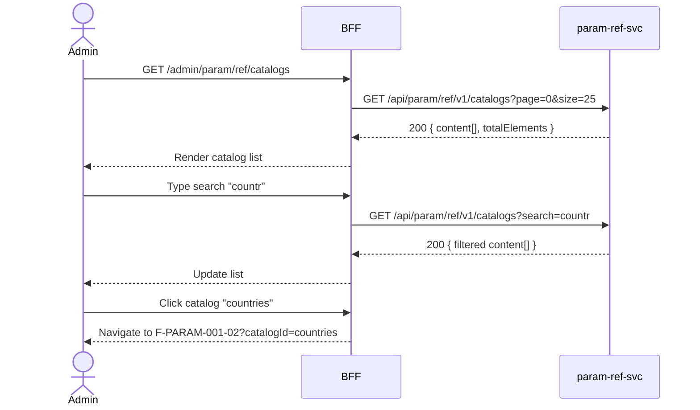

# F-PARAM-001-01 — Browse Catalogs

> **Conceptual Stack Layer:** Platform-Feature
> **Space:** Platform
> **Owner:** Platform Engineering Team
> **Companion files:** `F-PARAM-001-01.uvl`, `F-PARAM-001-01.aui.yaml`
> **Referenced by:** Suite Feature Catalog SS6
> **References:** `param_ref-spec.md` (backend)

> **Meta Information**
> - **Version:** 2026-04-03
> - **Template:** `feature-spec.md` v1.0.0
> - **Template Compliance:** 100%
> - **Status:** DRAFT
> - **Feature ID:** `F-PARAM-001-01`
> - **Suite:** `param`
> - **Node type:** LEAF
> - **Parent:** `F-PARAM-001` — Reference Data Management
> - **Companion UVL:** `F-PARAM-001-01.uvl`
> - **Companion AUI:** `F-PARAM-001-01.aui.yaml`

---

## ═══════════════════════════════════════════════
## PROBLEM SPACE
## ═══════════════════════════════════════════════

## 0. Feature Identity & Orientation

### 0.1 One-Line Summary
This feature lets a **platform administrator** browse and search all reference data catalogs so that they can understand what controlled vocabularies exist and navigate to their code items.

### 0.2 Non-Goals
- Does not create or edit code items — that is F-PARAM-001-02.
- Does not import/export catalog data — that is F-PARAM-001-03.
- Does not show translated labels inline — label resolution is a BFF concern.

### 0.3 Entry & Exit Points

**Entry points:**
- Platform Administration menu → "Reference Data"
- Direct URL: `/admin/param/ref/catalogs`

**Exit points:**
- Select a catalog → navigate to F-PARAM-001-02 (Manage Catalog Codes) for that catalog
- Back to Platform Administration dashboard

### 0.4 Variability Points

| Variability Point | Model | Values | Default | Binding Time |
|---|---|---|---|---|
| Pagination page size | UVL attribute | 10, 25, 50, 100 | 25 | runtime |
| Show deprecated catalogs | UVL attribute | true/false | false | runtime |

---

## 1. User Goal & Scenarios

### 1.1 User Goal
Find a specific catalog or discover what catalogs are available, understand their scope and code count, and navigate to manage their codes.

### 1.2 Scenarios

| # | Scenario | Precondition | Action | Expected Outcome |
|---|----------|-------------|--------|-----------------|
| S1 | Browse all catalogs | Admin is authenticated | Open catalog list | Paginated list of catalogs with name, scope, code count, status |
| S2 | Search by name | Catalog list is displayed | Type "countr" in search | List filters to show catalogs matching "countr" (e.g., `countries`) |
| S3 | Filter by scope | Catalog list is displayed | Select scope = PLATFORM | Only platform-managed catalogs shown |
| S4 | Navigate to codes | Catalog list is displayed | Click catalog row | Navigate to F-PARAM-001-02 with selected catalogId |
| S5 | Empty state | No catalogs exist (fresh deployment) | Open catalog list | Empty state message with "No catalogs found" and hint to seed data |

---

## 2. User Journey & Screen Layout

### 2.1 Sequence Diagram



### 2.2 Screen Layout

```
┌─────────────────────────────────────────────────────┐
│ [← Admin]   Reference Data — Catalogs               │
├─────────────────────────────────────────────────────┤
│ [Search: _______________]  [Scope: All ▾]  [Status: Active ▾] │
├──────┬──────────────┬──────────┬───────┬────────────┤
│  ID  │ Name         │ Scope    │ Codes │ Status     │
├──────┼──────────────┼──────────┼───────┼────────────┤
│ coun │ countries    │ PLATFORM │  249  │ ACTIVE     │  → click row
│ curr │ currencies   │ PLATFORM │  180  │ ACTIVE     │
│ lang │ languages    │ PLATFORM │   85  │ ACTIVE     │
│ sd.o │ sd.order-st  │ DOMAIN   │    6  │ ACTIVE     │
│ ...  │ ...          │ ...      │  ...  │ ...        │
├──────┴──────────────┴──────────┴───────┴────────────┤
│ [EXT: extension zone]                                │
├─────────────────────────────────────────────────────┤
│ Showing 1-25 of 42     [← Prev] [1] [2] [Next →]   │
└─────────────────────────────────────────────────────┘
```

---

## 3. Interaction Requirements

### 3.1 Fields Table

| Field | Type | Required | Editable | Validation | i18n Key |
|---|---|---|---|---|---|
| Search | text input | No | Yes | min 2 chars to trigger | `F-PARAM-001-01.search.placeholder` |
| Scope filter | select | No | Yes | PLATFORM, DOMAIN, All | `F-PARAM-001-01.filter.scope` |
| Status filter | select | No | Yes | ACTIVE, DEPRECATED, All | `F-PARAM-001-01.filter.status` |

### 3.2 Actions Table

| Action | Trigger | Precondition | Effect |
|---|---|---|---|
| Search | Keystroke (debounced 300ms) | ≥ 2 chars | Filter catalog list |
| Filter by scope | Select change | — | Filter catalog list |
| Select catalog | Row click | — | Navigate to F-PARAM-001-02 |
| Page change | Pagination click | — | Load requested page |

### 3.3 Validation Messages

| Field | Condition | Message |
|---|---|---|
| Search | < 2 chars | (no action — debounced) |

---

## 4. Edge Cases & Screen States

### 4.1 Component States

| State | When | Behaviour |
|---|---|---|
| **Loading** | Awaiting API response | Table skeleton with shimmer rows; controls disabled |
| **Empty** | No catalogs match filter/search | "No catalogs found. Adjust your filters or seed reference data." |
| **Error** | param-ref-svc unavailable | Inline error: "Reference data service unavailable. Retry." + retry button |
| **Populated** | Data ready | Render table normally |

### 4.2 Specific Edge Cases

| Case | Behaviour | Affected users |
|---|---|---|
| Insufficient role | Feature accessible to all authenticated users (read-only) | None — read is open |
| > 1000 catalogs | Server-side pagination; no client-side loading | Large deployments |

### 4.3 Attribute-Driven Behaviour Changes

| Attribute | Non-default value | Observable change |
|---|---|---|
| `pagination.pageSize` | 10 | Shorter table; more pages in pagination bar |
| `showDeprecated` | true | Deprecated catalogs appear with visual indicator (strikethrough) |

### 4.4 Connectivity
This feature requires a live connection.
On network loss: top-of-page banner — "Reference data is unavailable offline."

---

## ═══════════════════════════════════════════════
## SOLUTION SPACE
## ═══════════════════════════════════════════════

## 5. Backend Dependencies & BFF Contract

### 5.1 Service Calls

| # | Service | Endpoint | Tier | isMutation | Failure Mode |
|---|---------|----------|------|------------|-------------|
| 1 | param-ref-svc | `GET /api/param/ref/v1/catalogs` | T1 | No | Show error + retry |

### 5.2 BFF View-Model Shape

```jsonc
{
  "catalogs": [                    // from param-ref-svc
    {
      "catalogId": "countries",
      "scope": "PLATFORM",
      "codeCount": 249,
      "status": "ACTIVE"
    }
  ],
  "pagination": {
    "page": 0,
    "size": 25,
    "totalElements": 42,
    "totalPages": 2
  }
}
```

### 5.3 Feature-Gating Rules

| Mode | Behaviour |
|---|---|
| Full | All interactions available |
| Read-only | Same as full (this is a read-only feature) |
| Excluded | Menu item hidden; direct URL returns 404 |

### 5.4 Failure Modes

| Failure | User Experience |
|---------|----------------|
| param-ref-svc down | Error state with retry button |

### 5.5 Caching Hints
BFF SHOULD cache catalog list for 5 minutes. Cache MUST be invalidated on `param.ref.catalog.created` or `param.ref.catalog.updated` events.

### 5.6 i18n Keys

| Key | Default (en) |
|-----|-------------|
| `F-PARAM-001-01.title` | `Reference Data — Catalogs` |
| `F-PARAM-001-01.search.placeholder` | `Search catalogs…` |
| `F-PARAM-001-01.filter.scope` | `Scope` |
| `F-PARAM-001-01.filter.status` | `Status` |
| `F-PARAM-001-01.empty` | `No catalogs found.` |
| `F-PARAM-001-01.error.unavailable` | `Reference data service unavailable.` |
| `F-PARAM-001-01.action.retry` | `Retry` |

---

## 6. AUI Screen Contract

See companion file `F-PARAM-001-01.aui.yaml`.

---

## ═══════════════════════════════════════════════
## BRIDGE ARTIFACTS
## ═══════════════════════════════════════════════

## 7. Permissions & Accessibility

### 7.1 Permission Matrix

| Action | PLATFORM_ADMIN | {SUITE}_ADMIN | TENANT_ADMIN | ANY_AUTHENTICATED |
|---|---|---|---|---|
| View catalog list | ✓ | ✓ | ✓ | ✓ |
| Navigate to codes | ✓ | ✓ | ✓ | ✓ |

### 7.2 Accessibility
- Table MUST have ARIA role `grid` with sortable column headers.
- Search field MUST have `aria-label`.
- Keyboard: Tab through filters, Enter to select row.

---

## 8. Acceptance Criteria

| AC | Scenario | Given | When | Then |
|----|----------|-------|------|------|
| AC-01 | S1 | Admin opens catalog list | Page loads | Paginated list of catalogs displayed with ID, scope, code count, status |
| AC-02 | S2 | Catalog list displayed | Admin types "countr" in search | List filters to matching catalogs within 500ms |
| AC-03 | S3 | Catalog list displayed | Admin selects scope = PLATFORM | Only PLATFORM catalogs shown |
| AC-04 | S4 | Catalog list displayed | Admin clicks catalog row | Navigates to F-PARAM-001-02 with catalogId |
| AC-05 | S5 | No catalogs exist | Admin opens list | Empty state message displayed |
| AC-06 | Error | param-ref-svc unavailable | Admin opens list | Error message with retry button |

---

## 9. Variability & Extension

### 9.1 Feature Dependencies
Requires IAM authentication (cross-suite).

### 9.2 Attributes
See SS0.4 variability points. Binding times: `deploy`, `runtime`.

### 9.3 Extension Points
| Extension Zone | Interface | Default Behaviour |
|---|---|---|
| `ext.catalogListActions` | Additional action buttons in header | Hidden (no extension) |

### 9.4 Companion UVL
See `uvl/leaves/F-PARAM-001-01.uvl`.

---

**END OF SPECIFICATION**
