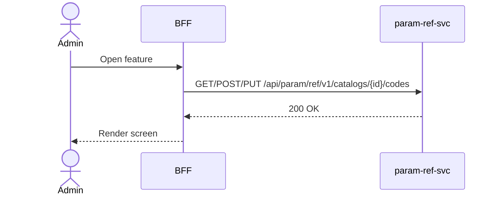

# F-PARAM-001-02 — Manage Catalog Codes

> **Conceptual Stack Layer:** Platform-Feature
> **Space:** Platform
> **Owner:** Platform Engineering Team
> **Companion files:** `F-PARAM-001-02.uvl`, `F-PARAM-001-02.aui.yaml`
> **Referenced by:** Suite Feature Catalog SS6
> **References:** `param_ref-spec.md` (backend)

> **Meta Information**
> - **Version:** 2026-04-03
> - **Template:** `feature-spec.md` v1.0.0
> - **Template Compliance:** 100%
> - **Status:** DRAFT
> - **Feature ID:** `F-PARAM-001-02`
> - **Suite:** `param`
> - **Node type:** LEAF
> - **Parent:** `F-PARAM-001` — Reference Data Management
> - **Companion UVL:** `F-PARAM-001-02.uvl`
> - **Companion AUI:** `F-PARAM-001-02.aui.yaml`

---

## ═══════════════════════════════════════════════
## PROBLEM SPACE
## ═══════════════════════════════════════════════

## 0. Feature Identity & Orientation

### 0.1 One-Line Summary
This feature lets a **platform or suite administrator** view, create, update, and deprecate code items within a selected reference data catalog so that domain services always have correct code values to validate against.

### 0.2 Non-Goals
- Does not duplicate functionality of sibling features in F-PARAM-001.
- See composition spec `F-PARAM-001.md` for boundary rationale.

### 0.3 Entry & Exit Points
**Entry points:**
- Platform Administration menu → linked from parent composition
- Direct URL or navigation from sibling feature

**Exit points:**
- Back to parent composition view or Platform Administration dashboard

### 0.4 Variability Points
| Variability Point | Model | Values | Default | Binding Time |
|---|---|---|---|---|
| Pagination page size | UVL attribute | 10, 25, 50, 100 | 25 | runtime |

---

## 1. User Goal & Scenarios

### 1.1 User Goal
This feature lets a **platform or suite administrator** view, create, update, and deprecate code items within a selected reference data catalog so that domain services always have correct code values to validate against.

### 1.2 Scenarios
| # | Scenario | Precondition | Action | Expected Outcome |
|---|----------|-------------|--------|-----------------|
| S1 | View codes | Catalog selected | Open codes list | Paginated code items for selected catalog |
| S2 | Create code | Admin has write role | Click Add, fill form, submit | New code item created; event published |
| S3 | Edit code | Code exists | Click edit, change description, submit | Code updated; event published |
| S4 | Deprecate code | Code is ACTIVE | Click deprecate | Code marked DEPRECATED; still visible but flagged |
| S5 | Validation error | Admin submits duplicate code | Submit | 422 error: code already exists |

---

## 2. User Journey & Screen Layout

### 2.1 Sequence Diagram

### 2.2 Screen Layout
See companion AUI contract `F-PARAM-001-02.aui.yaml` for zone layout.

---

## 3. Interaction Requirements

### 3.1 Fields Table
| Field | Type | Required | Editable | Validation | i18n Key |
|---|---|---|---|---|---|
| Code | text input | Yes | No (after create) | max 50 chars, unique per catalog | `F-PARAM-001-02.field.code` |
| Description | text input | No | Yes | max 500 chars | `F-PARAM-001-02.field.description` |
| Status | select | Yes | Yes | ACTIVE, DEPRECATED | `F-PARAM-001-02.field.status` |
| Valid From | date | No | Yes | — | `F-PARAM-001-02.field.validFrom` |
| Valid To | date | No | Yes | must be after Valid From | `F-PARAM-001-02.field.validTo` |

### 3.2 Actions Table
| Action | Trigger | Precondition | Effect |
|---|---|---|---|
| Add Code | Button click | Admin has write role | Open create form |
| Save | Form submit | Form valid | Create/update code item |
| Deprecate | Action button | Code is ACTIVE | Mark DEPRECATED |
| Cancel | Button click | — | Discard changes, return to list |

### 3.3 Validation Messages
| Field | Condition | Message |
|---|---|---|
| Required fields | Empty on submit | "{Label} is required." |
| API 422 | BR violated | Error message from backend |

---

## 4. Edge Cases & Screen States

### 4.1 Component States
| State | When | Behaviour |
|---|---|---|
| **Loading** | Awaiting response | Skeleton; controls disabled |
| **Empty** | No data matches | Message + CTA |
| **Error** | Service unavailable | Inline message + retry button |
| **Populated** | Data ready | Render normally |

### 4.2 Specific Edge Cases
| Case | Behaviour | Affected users |
|---|---|---|
| Insufficient role | Action absent from DOM | Non-admin roles |
| Concurrent edit (412) | Banner: "Updated by another user. Reload." | Concurrent editors |

### 4.3 Attribute-Driven Behaviour Changes
| Attribute | Non-default value | Observable change |
|---|---|---|
| `pagination.pageSize` | 10 | Shorter list, more pages |

### 4.4 Connectivity
This feature requires a live connection.

---

## ═══════════════════════════════════════════════
## SOLUTION SPACE
## ═══════════════════════════════════════════════

## 5. Backend Dependencies & BFF Contract

### 5.1 Service Calls
| # | Service | Endpoint | Tier | isMutation | Failure Mode |
|---|---------|----------|------|------------|-------------|
| 1 | param-ref-svc | `GET/POST/PUT /api/param/ref/v1/catalogs/{id}/codes` | T1 | Yes | Show error + retry |

### 5.2 BFF View-Model Shape
See domain spec `param_ref-spec.md` §6 for response contract.

### 5.3 Feature-Gating Rules
| Mode | Behaviour |
|---|---|
| Full | All interactions available |
| Read-only | Mutation actions hidden |
| Excluded | Menu item hidden; direct URL returns 404 |

### 5.4 Caching Hints
BFF SHOULD cache read responses. Cache MUST be invalidated on relevant domain events.

### 5.5 i18n Keys
| Key | Default (en) |
|-----|-------------|
| `F-PARAM-001-02.title` | `Catalog Codes — {catalogId}` |
| `F-PARAM-001-02.action.add` | `Add Code` |
| `F-PARAM-001-02.action.save` | `Save` |
| `F-PARAM-001-02.action.deprecate` | `Deprecate` |
| `F-PARAM-001-02.error.duplicate` | `Code already exists in this catalog.` |

---

## 6. AUI Screen Contract
See companion file `F-PARAM-001-02.aui.yaml`.

---

## ═══════════════════════════════════════════════
## BRIDGE ARTIFACTS
## ═══════════════════════════════════════════════

## 7. Permissions & Accessibility

### 7.1 Permission Matrix
| Action | PLATFORM_ADMIN | {SUITE}_ADMIN | TENANT_ADMIN | ANY_AUTHENTICATED |
|---|---|---|---|---|
| Read | ✓ | ✓ | ✓ | ✓ |
| Write | ✓ | ✓ (own scope) | — | — |

### 7.2 Accessibility
- All interactive elements MUST be keyboard-accessible.
- Forms MUST have proper ARIA labels and error associations.

---

## 8. Acceptance Criteria
| AC | Given | When | Then |
|----|-------|------|------|
| AC-01 | Catalog selected | Codes list loads | All codes shown with status |
| AC-02 | Admin clicks Add | Fills form, submits | Code created, list refreshed |
| AC-03 | Admin edits code | Changes description, saves | Code updated, event published |
| AC-04 | Admin deprecates | Clicks deprecate | Code marked DEPRECATED |
| AC-05 | Duplicate code | Admin submits duplicate | 422 error shown |

---

## 9. Variability & Extension

### 9.1 Feature Dependencies
Requires IAM authentication (cross-suite).

### 9.2 Attributes
See SS0.4. Binding times: `deploy`, `runtime`.

### 9.3 Extension Points
| Extension Zone | Interface | Default Behaviour |
|---|---|---|
| `ext.customFields` | Additional fields in form | Hidden |

### 9.4 Companion UVL
See `uvl/leaves/F-PARAM-001-02.uvl`.

---
**END OF SPECIFICATION**
