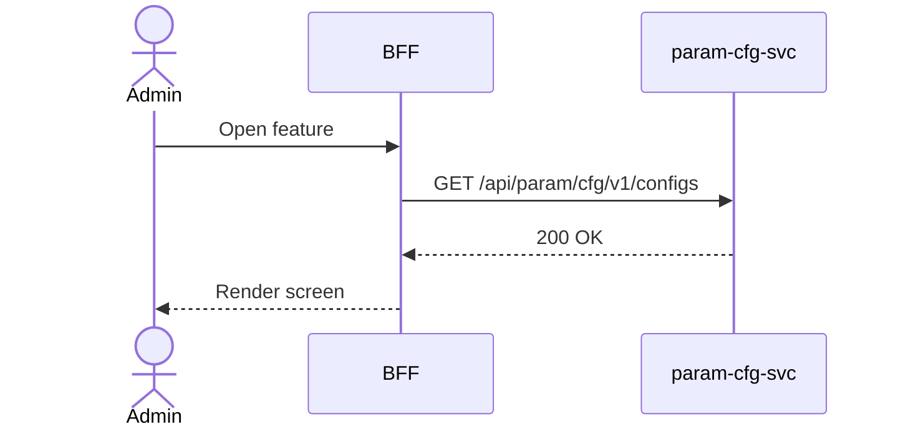

# F-PARAM-003-01 — Browse Configuration

> **Conceptual Stack Layer:** Platform-Feature
> **Space:** Platform
> **Owner:** Platform Engineering Team
> **Companion files:** `F-PARAM-003-01.uvl`, `F-PARAM-003-01.aui.yaml`

> **Meta Information**
> - **Version:** 2026-04-03
> - **Template:** `feature-spec.md` v1.0.0
> - **Template Compliance:** 100%
> - **Status:** DRAFT
> - **Feature ID:** `F-PARAM-003-01`
> - **Suite:** `param`
> - **Node type:** LEAF
> - **Parent:** `F-PARAM-003` — Configuration Management
> - **Companion UVL:** `F-PARAM-003-01.uvl`
> - **Companion AUI:** `F-PARAM-003-01.aui.yaml`

---

## ═══════════════════════════════════════════════
## PROBLEM SPACE
## ═══════════════════════════════════════════════

## 0. Feature Identity & Orientation

### 0.1 One-Line Summary
This feature lets a **platform or tenant administrator** browse and search all runtime configuration entries, filtered by scope and type, so that they can understand current system settings.

### 0.2 Non-Goals
- Does not duplicate functionality of sibling features in F-PARAM-003.
- See composition spec `F-PARAM-003.md` for boundary rationale.

### 0.3 Entry & Exit Points
**Entry points:**
- Platform Administration menu → linked from parent composition
- Direct URL or navigation from sibling feature

**Exit points:**
- Back to parent composition view or Platform Administration dashboard

### 0.4 Variability Points
| Variability Point | Model | Values | Default | Binding Time |
|---|---|---|---|---|
| Pagination page size | UVL attribute | 10, 25, 50, 100 | 25 | runtime |

---

## 1. User Goal & Scenarios

### 1.1 User Goal
This feature lets a **platform or tenant administrator** browse and search all runtime configuration entries, filtered by scope and type, so that they can understand current system settings.

### 1.2 Scenarios
| # | Scenario | Precondition | Action | Expected Outcome |
|---|----------|-------------|--------|-----------------|
| S1 | Browse global configs | Configs exist | Open config list, filter scope=GLOBAL | Global config entries shown |
| S2 | Browse tenant configs | Tenant admin logged in | Filter scope=TENANT | Tenant-scoped entries for admin's tenant |
| S3 | Search by key | List displayed | Type key pattern | Filtered by key pattern |
| S4 | Filter by type | List displayed | Select type=FEATURE_FLAG | Only feature flags shown |
| S5 | Navigate to edit | Config shown | Click entry | Navigate to F-PARAM-003-02 |

---

## 2. User Journey & Screen Layout

### 2.1 Sequence Diagram

### 2.2 Screen Layout
See companion AUI contract `F-PARAM-003-01.aui.yaml` for zone layout.

---

## 3. Interaction Requirements

### 3.1 Fields Table
| Field | Type | Required | Editable | Validation | i18n Key |
|---|---|---|---|---|---|
| Key search | text input | No | Yes | min 2 chars | `F-PARAM-003-01.search.key` |
| Scope filter | select | No | Yes | GLOBAL, TENANT, All | `F-PARAM-003-01.filter.scope` |
| Type filter | select | No | Yes | RUN_FLAG, FEATURE_FLAG, PARAMETER, All | `F-PARAM-003-01.filter.type` |

### 3.2 Actions Table
| Action | Trigger | Precondition | Effect |
|---|---|---|---|
| Search | Keystroke debounced | ≥ 2 chars | Filter config list |
| Filter | Select change | — | Filter config list |
| Select entry | Row click | — | Navigate to F-PARAM-003-02 |

### 3.3 Validation Messages
| Field | Condition | Message |
|---|---|---|
| Required fields | Empty on submit | "{Label} is required." |
| API 422 | BR violated | Error message from backend |

---

## 4. Edge Cases & Screen States

### 4.1 Component States
| State | When | Behaviour |
|---|---|---|
| **Loading** | Awaiting response | Skeleton; controls disabled |
| **Empty** | No data matches | Message + CTA |
| **Error** | Service unavailable | Inline message + retry button |
| **Populated** | Data ready | Render normally |

### 4.2 Specific Edge Cases
| Case | Behaviour | Affected users |
|---|---|---|
| Insufficient role | Mutation actions absent from DOM | Non-admin roles |
| Concurrent edit (412) | Banner: "Updated by another user. Reload." | Concurrent editors |

### 4.3 Attribute-Driven Behaviour Changes
| Attribute | Non-default value | Observable change |
|---|---|---|
| `pagination.pageSize` | 10 | Shorter list, more pages |

### 4.4 Connectivity
This feature requires a live connection.

---

## ═══════════════════════════════════════════════
## SOLUTION SPACE
## ═══════════════════════════════════════════════

## 5. Backend Dependencies & BFF Contract

### 5.1 Service Calls
| # | Service | Endpoint | Tier | isMutation | Failure Mode |
|---|---------|----------|------|------------|-------------|
| 1 | param-cfg-svc | `GET /api/param/cfg/v1/configs` | T1 | No | Show error + retry |

### 5.2 BFF View-Model Shape
See domain spec `param_cfg-spec.md` §6 for response contract.

### 5.3 Feature-Gating Rules
| Mode | Behaviour |
|---|---|
| Full | All interactions available |
| Read-only | Mutation actions hidden |
| Excluded | Menu item hidden; direct URL returns 404 |

### 5.5 i18n Keys
| Key | Default (en) |
|-----|-------------|
| `F-PARAM-003-01.title` | `Configuration` |
| `F-PARAM-003-01.search.key` | `Search by key…` |
| `F-PARAM-003-01.empty` | `No configuration entries found.` |

---

## 6. AUI Screen Contract
See companion file `F-PARAM-003-01.aui.yaml`.

---

## ═══════════════════════════════════════════════
## BRIDGE ARTIFACTS
## ═══════════════════════════════════════════════

## 7. Permissions & Accessibility

### 7.1 Permission Matrix
| Action | PLATFORM_ADMIN | {SUITE}_ADMIN | TENANT_ADMIN | ANY_AUTHENTICATED |
|---|---|---|---|---|
| Read | ✓ | ✓ | ✓ | ✓ |
| Write | ✓ | ANY_AUTHENTICATED | — | — |

### 7.2 Accessibility
- All interactive elements MUST be keyboard-accessible.
- Forms MUST have proper ARIA labels.

---

## 8. Acceptance Criteria
| AC | Given | When | Then |
|----|-------|------|------|
| AC-01 | Configs exist | Admin opens list | Entries shown with key, scope, type, value |
| AC-02 | Admin filters GLOBAL | Selects scope | Only global entries |
| AC-03 | Admin clicks entry | Entry selected | Navigate to edit |

---

## 9. Variability & Extension

### 9.1 Feature Dependencies
Requires IAM authentication.

### 9.2 Extension Points
| Extension Zone | Interface | Default Behaviour |
|---|---|---|
| `ext.customFields` | Additional fields | Hidden |

### 9.4 Companion UVL
See `uvl/leaves/F-PARAM-003-01.uvl`.

---
**END OF SPECIFICATION**
