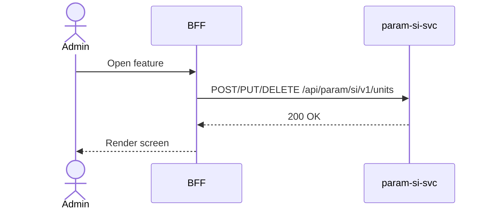

# F-PARAM-004-02 — Manage Custom Units

> **Conceptual Stack Layer:** Platform-Feature
> **Space:** Platform
> **Owner:** Platform Engineering Team
> **Companion files:** `F-PARAM-004-02.uvl`, `F-PARAM-004-02.aui.yaml`

> **Meta Information**
> - **Version:** 2026-04-03
> - **Template:** `feature-spec.md` v1.0.0
> - **Template Compliance:** 100%
> - **Status:** DRAFT
> - **Feature ID:** `F-PARAM-004-02`
> - **Suite:** `param`
> - **Node type:** LEAF
> - **Parent:** `F-PARAM-004` — Unit Management
> - **Companion UVL:** `F-PARAM-004-02.uvl`
> - **Companion AUI:** `F-PARAM-004-02.aui.yaml`

---

## ═══════════════════════════════════════════════
## PROBLEM SPACE
## ═══════════════════════════════════════════════

## 0. Feature Identity & Orientation

### 0.1 One-Line Summary
This feature lets a **platform administrator** create, edit, and delete custom (non-SI) units with their conversion factors and dimensional signatures so that domain services can use industry-specific units.

### 0.2 Non-Goals
- Does not duplicate functionality of sibling features in F-PARAM-004.
- See composition spec `F-PARAM-004.md` for boundary rationale.

### 0.3 Entry & Exit Points
**Entry points:**
- Platform Administration menu → linked from parent composition
- Direct URL or navigation from sibling feature

**Exit points:**
- Back to parent composition view or Platform Administration dashboard

### 0.4 Variability Points
| Variability Point | Model | Values | Default | Binding Time |
|---|---|---|---|---|
| Pagination page size | UVL attribute | 10, 25, 50, 100 | 25 | runtime |

---

## 1. User Goal & Scenarios

### 1.1 User Goal
This feature lets a **platform administrator** create, edit, and delete custom (non-SI) units with their conversion factors and dimensional signatures so that domain services can use industry-specific units.

### 1.2 Scenarios
| # | Scenario | Precondition | Action | Expected Outcome |
|---|----------|-------------|--------|-----------------|
| S1 | Create custom unit | Admin has role | Fill form (name, symbol, factor, dimensions), submit | Unit created; event published |
| S2 | Edit custom unit | Custom unit exists | Change conversion factor, save | Unit updated |
| S3 | Delete custom unit | Custom unit exists, no active consumers | Delete | Unit removed; event published |
| S4 | Attempt edit base unit | Base unit selected | Edit button absent | BR-SI-004: base units are immutable |
| S5 | Duplicate symbol | Admin enters existing symbol | Submit | 422: symbol must be unique |

---

## 2. User Journey & Screen Layout

### 2.1 Sequence Diagram

### 2.2 Screen Layout
See companion AUI contract `F-PARAM-004-02.aui.yaml` for zone layout.

---

## 3. Interaction Requirements

### 3.1 Fields Table
| Field | Type | Required | Editable | Validation | i18n Key |
|---|---|---|---|---|---|
| Name | text input | Yes | Yes | unique, max 100 | `F-PARAM-004-02.field.name` |
| Symbol | text input | Yes | No (after create) | unique, NFC-normalized | `F-PARAM-004-02.field.symbol` |
| Factor to SI | number input | Yes | Yes | > 0, precision 38,18 | `F-PARAM-004-02.field.factor` |
| Offset to SI | number input | No | Yes | default 0 | `F-PARAM-004-02.field.offset` |
| Allow Prefix | checkbox | No | Yes | — | `F-PARAM-004-02.field.allowPrefix` |
| Dimensions (L,M,T,I,Th,N,J) | 7× integer inputs | Yes | Yes | integers | `F-PARAM-004-02.field.dimensions` |

### 3.2 Actions Table
| Action | Trigger | Precondition | Effect |
|---|---|---|---|
| Create | Form submit | Valid + PLATFORM_ADMIN | Create custom unit |
| Save | Form submit | Valid + PLATFORM_ADMIN | Update custom unit |
| Delete | Action button + confirm | PLATFORM_ADMIN + custom unit | Delete unit |

### 3.3 Validation Messages
| Field | Condition | Message |
|---|---|---|
| Required fields | Empty on submit | "{Label} is required." |
| API 422 | BR violated | Error message from backend |

---

## 4. Edge Cases & Screen States

### 4.1 Component States
| State | When | Behaviour |
|---|---|---|
| **Loading** | Awaiting response | Skeleton; controls disabled |
| **Empty** | No data matches | Message + CTA |
| **Error** | Service unavailable | Inline message + retry button |
| **Populated** | Data ready | Render normally |

### 4.2 Specific Edge Cases
| Case | Behaviour | Affected users |
|---|---|---|
| Insufficient role | Mutation actions absent from DOM | Non-admin roles |
| Concurrent edit (412) | Banner: "Updated by another user. Reload." | Concurrent editors |

### 4.3 Attribute-Driven Behaviour Changes
| Attribute | Non-default value | Observable change |
|---|---|---|
| `pagination.pageSize` | 10 | Shorter list, more pages |

### 4.4 Connectivity
This feature requires a live connection.

---

## ═══════════════════════════════════════════════
## SOLUTION SPACE
## ═══════════════════════════════════════════════

## 5. Backend Dependencies & BFF Contract

### 5.1 Service Calls
| # | Service | Endpoint | Tier | isMutation | Failure Mode |
|---|---------|----------|------|------------|-------------|
| 1 | param-si-svc | `POST/PUT/DELETE /api/param/si/v1/units` | T1 | Yes | Show error + retry |

### 5.2 BFF View-Model Shape
See domain spec `param_si-spec.md` §6 for response contract.

### 5.3 Feature-Gating Rules
| Mode | Behaviour |
|---|---|
| Full | All interactions available |
| Read-only | Mutation actions hidden |
| Excluded | Menu item hidden; direct URL returns 404 |

### 5.5 i18n Keys
| Key | Default (en) |
|-----|-------------|
| `F-PARAM-004-02.title` | `Manage Custom Unit` |
| `F-PARAM-004-02.action.create` | `Create Unit` |
| `F-PARAM-004-02.action.delete` | `Delete Unit` |
| `F-PARAM-004-02.error.baseImmutable` | `SI base units cannot be modified.` |
| `F-PARAM-004-02.error.symbolDuplicate` | `Symbol already exists.` |

---

## 6. AUI Screen Contract
See companion file `F-PARAM-004-02.aui.yaml`.

---

## ═══════════════════════════════════════════════
## BRIDGE ARTIFACTS
## ═══════════════════════════════════════════════

## 7. Permissions & Accessibility

### 7.1 Permission Matrix
| Action | PLATFORM_ADMIN | {SUITE}_ADMIN | TENANT_ADMIN | ANY_AUTHENTICATED |
|---|---|---|---|---|
| Read | ✓ | ✓ | ✓ | ✓ |
| Write | ✓ | PLATFORM_ADMIN | — | — |

### 7.2 Accessibility
- All interactive elements MUST be keyboard-accessible.
- Forms MUST have proper ARIA labels.

---

## 8. Acceptance Criteria
| AC | Given | When | Then |
|----|-------|------|------|
| AC-01 | Valid form | Admin submits | Custom unit created, event published |
| AC-02 | Base unit | Admin opens | Edit/delete buttons absent |
| AC-03 | Duplicate symbol | Admin submits | 422 error |
| AC-04 | Custom unit | Admin deletes + confirms | Unit removed |

---

## 9. Variability & Extension

### 9.1 Feature Dependencies
Requires IAM authentication.

### 9.2 Extension Points
| Extension Zone | Interface | Default Behaviour |
|---|---|---|
| `ext.customFields` | Additional fields | Hidden |

### 9.4 Companion UVL
See `uvl/leaves/F-PARAM-004-02.uvl`.

---
**END OF SPECIFICATION**
