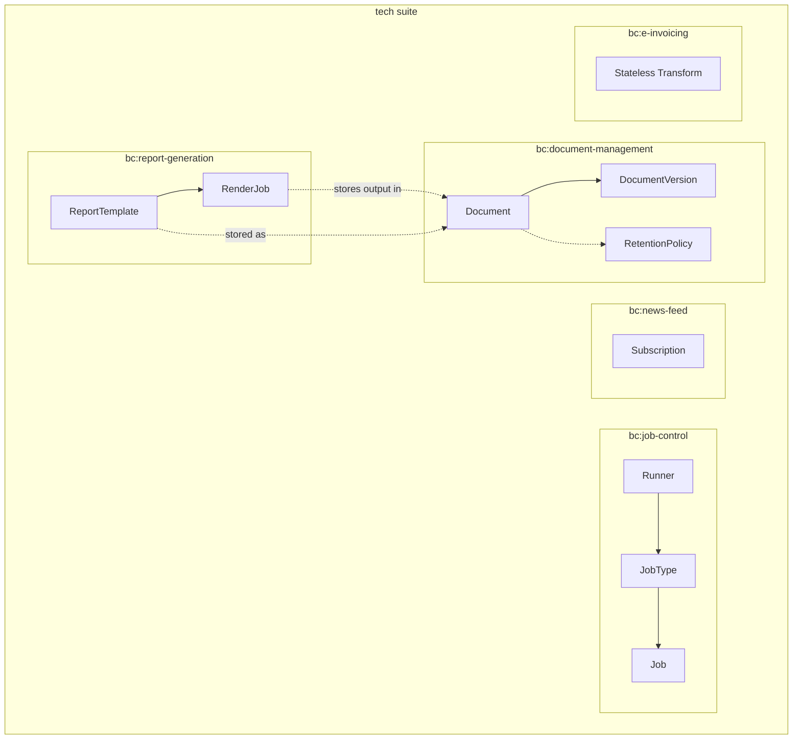
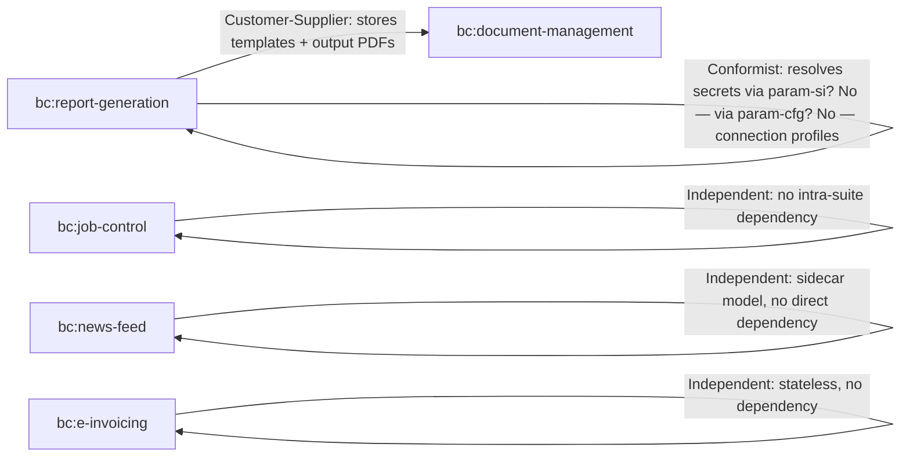
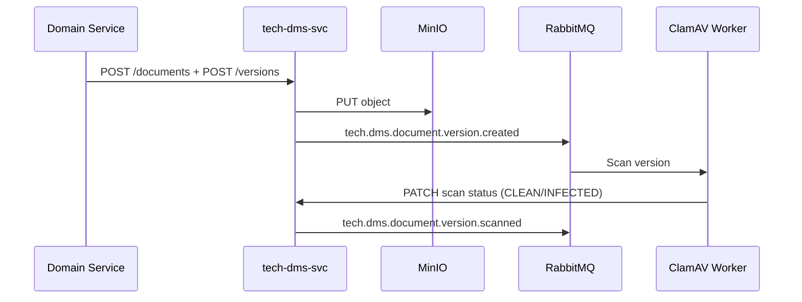
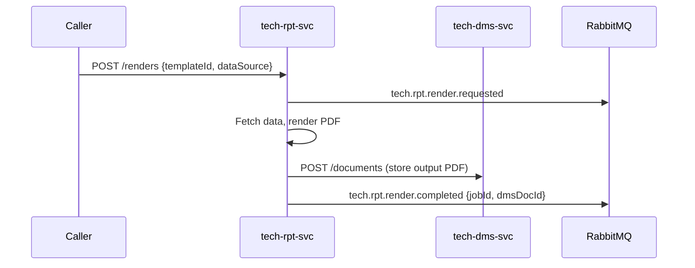
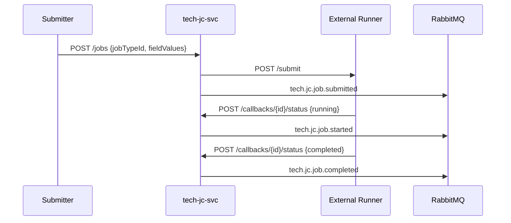

<!-- TEMPLATE COMPLIANCE: 100%
Template: suite-spec.md v1.0.0
Present sections: SS0-SS11
Missing sections: none
-->

# Technical Infrastructure (TECH) Suite Specification

> **Conceptual Stack Layer:** Suite
> **Space:** Platform
> **Owner:** Platform Engineering Team
> **Schema alignment:** `suite-layer.schema.json`
> **Companion files:** `tech.catalog.uvl` (referenced in SS6)
> **Contains:** Domain/Service Specs, Platform-Feature Specs, Feature Catalog

> **Meta Information**
> - **Version:** 2026-04-03
> - **Template:** `suite-spec.md` v1.0.0
> - **Template Compliance:** 100%
> - **Author(s):** OpenLeap Architecture Team
> - **Status:** DRAFT
> - **Suite ID:** `tech` (pattern: `^[a-z]{2,4}$`)
> - **Suite Name:** Technical Infrastructure
> - **Description:** Provides the technical processing backbone for the OpenLeap platform: document storage and retention, report generation, job orchestration, event distribution (news feed), and e-invoicing transformation.
> - **Semantic Version:** `1.0.0`
> - **Team:**
>   - Name: `team-tech`
>   - Email: `platform-infra@openleap.io`
>   - Slack: `#platform-infra`
> - **Bounded Contexts:** `bc:document-management`, `bc:report-generation`, `bc:job-control`, `bc:news-feed`, `bc:e-invoicing`

---

## Specification Guidelines

> **This specification MUST comply with the OpenLeap specification guidelines.**
>
> ### Non-Negotiables
> - Never invent facts. If required info is missing, add an **OPEN QUESTION** entry.
> - Preserve intent and decisions. Only change meaning when explicitly requested.
> - Keep the spec **self-contained**: no "see chat", no implicit context.
>
> ### Style Guide
> - Prefer short sentences and lists.
> - Use MUST/SHOULD/MAY for normative statements.
> - Keep terminology consistent with the Ubiquitous Language defined in SS1.

---

<!-- ═══════════════════════════════════════════════════════════════════
     SS0  SUITE IDENTITY & PURPOSE
     ═══════════════════════════════════════════════════════════════════ -->

## 0. Suite Identity & Purpose

### 0.1 Suite Identity

| Field | Value |
|-------|-------|
| id | `tech` |
| name | Technical Infrastructure |
| description | Document storage, report generation, job orchestration, event distribution, and e-invoicing transformation — the processing backbone consumed by all tiers. |
| version | `1.0.0` |
| status | `draft` |
| owner | `team-tech` (platform-infra@openleap.io) |

### 0.2 Business Purpose

The Technical Infrastructure suite provides the **processing, storage, and transformation capabilities** that domain services delegate to rather than implementing themselves. Without this suite, every domain would build its own blob storage, PDF renderer, job scheduler, event fan-out mechanism, and ZUGFeRD embedder — leading to massive duplication, inconsistent compliance handling, and operational overhead. The tech suite centralizes these concerns into five cohesive services that all answer the question "process, store, transform, or distribute this work item on behalf of a caller."

### 0.3 Scope

**In Scope:**
- Binary document storage, versioning, retention, legal holds, virus scanning (dms)
- Jasper-based report template management, async rendering, PDF output (rpt)
- Generic job orchestration: runner registry, job types, submission, callbacks, restart (jc)
- Event enrichment, subscription management, encrypted delivery to external consumers (nfs)
- ZUGFeRD/XRechnung XML embedding into PDF invoices (zugferd)
- Administrative UI features for platform operators

**Out of Scope:**
- Reference codes, translations, configuration, units — owned by the `param` suite
- Authentication and authorization — owned by the `iam` suite
- Business partner master data — owned by `bp` suite (T2)
- Domain-specific business logic that uses these services (e.g., invoice creation logic)

### 0.4 Target Users

| User Type | Interest |
|-----------|----------|
| Platform Administrator | Manages document policies, report templates, runner registry, NFS subscriptions |
| Domain Service Team | Consumes DMS for storage, RPT for reports, JC for async jobs, ZUGFeRD for e-invoicing |
| Job Submitter | Submits and monitors long-running jobs via JC |
| External Consumer | Receives enriched events via NFS subscriptions |
| Compliance Officer | Reviews document retention, legal holds, audit trails |

### 0.5 Business Value

- **Single storage authority** — DMS eliminates per-module blob handling with compliance-grade retention
- **Consistent reporting** — RPT provides a Jasper-based render pipeline reusable across all domains
- **Unified job management** — JC gives every async workload (AI agents, ETL, bulk ops) a consistent lifecycle
- **Secure event fan-out** — NFS delivers enriched, encrypted events to external subscribers without exposing internals
- **E-invoicing compliance** — ZUGFeRD ensures EN 16931 / XRechnung compliance for all invoicing domains

---

<!-- ═══════════════════════════════════════════════════════════════════
     SS1  UBIQUITOUS LANGUAGE
     ═══════════════════════════════════════════════════════════════════ -->

## 1. Ubiquitous Language

### 1.1 Glossary

| ID | Term | Aliases | Definition |
|----|------|---------|------------|
| `tech:glossary:document` | Document | Dokument, Blob | A metadata record identifying a stored binary object. Tracks title, type, tags, attributes, entity links, and lifecycle state. The binary content is stored in MinIO; only metadata lives in PostgreSQL. |
| `tech:glossary:document-version` | Document Version | Version, Fassung | An immutable snapshot of a document's binary content at a point in time. Each upload creates a new version; versions are never overwritten. |
| `tech:glossary:retention-policy` | Retention Policy | Aufbewahrungsrichtlinie | A rule that defines how long documents of a given type must be preserved and what happens after expiry (archive, delete). Enforced via S3 Object Lock. |
| `tech:glossary:legal-hold` | Legal Hold | Aufbewahrungssperre | A flag that prevents deletion or modification of a document regardless of retention policy. Used during audits or litigation. |
| `tech:glossary:presigned-url` | Presigned URL | Vorsignierte URL | A time-limited S3 URL that allows direct browser-to-MinIO upload/download, bypassing the API gateway for large files. |
| `tech:glossary:report-template` | Report Template | Berichtsvorlage | A Jasper (JRXML/JASPER) template that defines the layout and data bindings for a rendered report. Templates are versioned and stored in DMS. |
| `tech:glossary:render-job` | Render Job | Render-Auftrag | An asynchronous job that produces a PDF by merging a report template with data from a configured data source (JDBC or HTTP). |
| `tech:glossary:runner` | Runner | Ausführungsmaschine | An external execution engine registered with the Job Control Service. Runners self-register, receive job dispatches, and report status via callbacks. |
| `tech:glossary:job-type` | Job Type | Auftragstyp | A meta-definition describing what parameters a job requires (field schema), which runner handles it, and what feedback metrics to expect. |
| `tech:glossary:job` | Job | Auftrag | A concrete job submission with field values, lifecycle state (PENDING → SUBMITTED → RUNNING → COMPLETED/FAILED/CANCELLED), and runner feedback. |
| `tech:glossary:job-template` | Job Template | Auftragsvorlage | A reusable preset of field values for a given job type, enabling one-click job submission. |
| `tech:glossary:subscription` | NFS Subscription | Abonnement | A registration by an external consumer to receive enriched, encrypted events from a specific producer. Each subscription gets a dedicated RabbitMQ queue. |
| `tech:glossary:enrichment` | Enrichment | Anreicherung | The process of augmenting a thin domain event with additional data fetched from the producer's API using a delegated token, before delivering to the subscriber. |
| `tech:glossary:zugferd-profile` | ZUGFeRD Profile | ZUGFeRD-Profil | A compliance level (BASIC, COMFORT, EXTENDED, EN16931, XRechnung) that determines the XML schema and required fields when embedding invoice data into a PDF. |

### 1.2 UBL Boundary Test

| Term | Meaning in `tech` | Meaning in `param` | Translation needed? |
|------|-------------------|--------------------|--------------------|
| Template | A Jasper report template (JRXML) or a job parameter preset | Not used | N/A — no collision |
| Version | An immutable document version (binary content snapshot) | Not used | N/A — no collision |
| Type | Document type or Job type (classification of work items) | Config type or Translation type (classification of parametric data) | Yes — same word, different concept. Cross-suite uses fully qualified terms. |

| Term | Meaning in `tech` | Meaning in `iam` | Translation needed? |
|------|-------------------|------------------|--------------------|
| Policy | Retention policy (how long to keep documents) | Authorization policy (ABAC rules) | Yes — same word, different concept. |
| Audit | Document access audit trail (who read/wrote what) | Security audit events (auth attempts, denials) | Yes — different scope and purpose. |

---

<!-- ═══════════════════════════════════════════════════════════════════
     SS2  DOMAIN MODEL
     ═══════════════════════════════════════════════════════════════════ -->

## 2. Domain Model

### 2.1 Conceptual Overview



### 2.2 Core Concepts

| Concept | Bounded Context | Glossary Ref | Description |
|---------|----------------|--------------|-------------|
| Document | `bc:document-management` | `tech:glossary:document` | Metadata record for a stored binary |
| DocumentVersion | `bc:document-management` | `tech:glossary:document-version` | Immutable binary snapshot |
| RetentionPolicy | `bc:document-management` | `tech:glossary:retention-policy` | Compliance retention rule |
| ReportTemplate | `bc:report-generation` | `tech:glossary:report-template` | Jasper template definition |
| RenderJob | `bc:report-generation` | `tech:glossary:render-job` | Async PDF rendering task |
| Runner | `bc:job-control` | `tech:glossary:runner` | External execution engine |
| JobType | `bc:job-control` | `tech:glossary:job-type` | Meta-definition for jobs |
| Job | `bc:job-control` | `tech:glossary:job` | Concrete job submission |
| Subscription | `bc:news-feed` | `tech:glossary:subscription` | Event consumer registration |

### 2.3 Shared Kernel Types

The tech suite consumes `tenantId` (UUID) as a shared kernel type from the IAM suite. DMS enforces per-tenant bucket isolation using this value.

The tech suite exports no shared kernel types. Cross-suite references to DMS documents use `dmsDocumentId` (UUID) as a foreign reference.

### 2.4 Bounded Context Map (Intra-Suite)



**Pattern justification:**
- `bc:report-generation` is a **Customer-Supplier** of `bc:document-management` — RPT stores Jasper templates and rendered PDFs in DMS.
- `bc:job-control`, `bc:news-feed`, and `bc:e-invoicing` are **Independent** — they have no intra-suite dependencies.

---

<!-- ═══════════════════════════════════════════════════════════════════
     SS3  SERVICE LANDSCAPE
     ═══════════════════════════════════════════════════════════════════ -->

## 3. Service Landscape

### 3.1 Service Catalog

| Service ID | Name | Bounded Context | Status | Responsibility | Spec Reference |
|-----------|------|----------------|--------|----------------|----------------|
| `tech-dms-svc` | Document Management Service | `bc:document-management` | active | Centralized document storage, versioning, retention, ACL, virus scanning, audit trail | `domain-specs/tech_dms-spec.md` |
| `tech-rpt-svc` | Report Generation Service | `bc:report-generation` | active | Jasper template management, async PDF rendering, data-source integration | `domain-specs/tech_rpt-spec.md` |
| `tech-jc-svc` | Job Control Service | `bc:job-control` | active | Generic job orchestration: runner registry, job types, submission, callbacks, restart | `domain-specs/tech_jc-spec.md` |
| `tech-nfs-svc` | News Feed Service | `bc:news-feed` | active | Event subscription, enrichment, encryption, and delivery to external consumers | `domain-specs/tech_nfs-spec.md` |
| `tech-zugferd-svc` | ZUGFeRD E-Invoicing Service | `bc:e-invoicing` | active | Stateless ZUGFeRD/XRechnung XML embedding into PDF invoices | `domain-specs/tech_zugferd-spec.md` |

### 3.2 Responsibility Matrix

| Capability | dms | rpt | jc | nfs | zugferd |
|-----------|-----|-----|------|-----|---------|
| Blob storage | ✓ (authoritative) | | | | |
| Document versioning | ✓ | | | | |
| Retention / legal hold | ✓ | | | | |
| Virus scanning | ✓ | | | | |
| Report template CRUD | | ✓ (authoritative) | | | |
| Async PDF rendering | | ✓ | | | |
| Runner registry | | | ✓ (authoritative) | | |
| Job lifecycle | | | ✓ | | |
| Event subscription | | | | ✓ (authoritative) | |
| Event enrichment | | | | ✓ | |
| ZUGFeRD embedding | | | | | ✓ (authoritative) |

---

<!-- ═══════════════════════════════════════════════════════════════════
     SS4  INTEGRATION PATTERNS
     ═══════════════════════════════════════════════════════════════════ -->

## 4. Integration Patterns

### 4.1 Pattern Decision

**Primary pattern:** Event-Driven Architecture (EDA) for lifecycle notifications + Synchronous REST for operations.

**Rationale:** Tech suite services are primarily consumed synchronously (upload a document, submit a job, render a report). Events notify downstream consumers of lifecycle transitions (document created, job completed, render finished). NFS is itself an event distribution service — it bridges internal events to external consumers.

### 4.2 Event Flows

#### Flow 1: Document Upload → Virus Scan → Consumer Notification



#### Flow 2: Report Render (Async)



#### Flow 3: Job Lifecycle



---

<!-- ═══════════════════════════════════════════════════════════════════
     SS5  EVENT CONVENTIONS
     ═══════════════════════════════════════════════════════════════════ -->

## 5. Event Conventions

### 5.1 Routing Key Pattern

**Pattern:** `tech.{domain}.{aggregate}.{action}`

**Examples:**
- `tech.dms.document.created`
- `tech.dms.document.version.created`
- `tech.dms.document.version.scanned`
- `tech.rpt.render.requested`
- `tech.rpt.render.completed`
- `tech.rpt.template.activated`
- `tech.jc.job.submitted`
- `tech.jc.job.completed`
- `tech.jc.runner.registered`

### 5.2 Payload Envelope

Standard platform envelope (same as param suite — see EVENT_STANDARDS.md).

### 5.3 Event Catalog

| Routing Key | Producer | Trigger | Payload Summary |
|-------------|----------|---------|-----------------|
| `tech.dms.document.created` | `tech-dms-svc` | New document record | `{ docId, title, docType }` |
| `tech.dms.document.version.created` | `tech-dms-svc` | New version uploaded | `{ docId, versionNo, contentType, sizeBytes }` |
| `tech.dms.document.version.scanned` | `tech-dms-svc` | Virus scan complete | `{ docId, versionNo, scanResult }` |
| `tech.dms.document.archived` | `tech-dms-svc` | Retention-driven archive | `{ docId }` |
| `tech.dms.document.deleted` | `tech-dms-svc` | Soft-delete | `{ docId }` |
| `tech.dms.document.legalhold.changed` | `tech-dms-svc` | Legal hold toggled | `{ docId, legalHold }` |
| `tech.rpt.template.created` | `tech-rpt-svc` | New template | `{ templateId, code, name }` |
| `tech.rpt.template.version.created` | `tech-rpt-svc` | Template version uploaded | `{ templateId, version, checksum }` |
| `tech.rpt.template.activated` | `tech-rpt-svc` | Template set ACTIVE | `{ templateId, code }` |
| `tech.rpt.render.requested` | `tech-rpt-svc` | Async render submitted | `{ jobId, templateId }` |
| `tech.rpt.render.completed` | `tech-rpt-svc` | Render finished | `{ jobId, artifactDmsId, sizeBytes }` |
| `tech.rpt.render.failed` | `tech-rpt-svc` | Render failed | `{ jobId, errorCode }` |
| `tech.jc.runner.registered` | `tech-jc-svc` | Runner self-registered | `{ runnerId, slug }` |
| `tech.jc.job.submitted` | `tech-jc-svc` | Job dispatched to runner | `{ jobId, jobTypeSlug, runnerId }` |
| `tech.jc.job.started` | `tech-jc-svc` | Runner started processing | `{ jobId }` |
| `tech.jc.job.completed` | `tech-jc-svc` | Job completed | `{ jobId, feedback }` |
| `tech.jc.job.failed` | `tech-jc-svc` | Job failed | `{ jobId, error }` |
| `tech.jc.job.cancelled` | `tech-jc-svc` | Job cancelled | `{ jobId }` |

### 5.4 Exchanges

| Exchange | Type | Durable |
|----------|------|---------|
| `tech.dms.events` | topic | yes |
| `tech.rpt.events` | topic | yes |
| `tech.jc.events` | topic | yes |

> **Note:** NFS does not publish its own domain events — it is a distribution service. ZUGFeRD is stateless and publishes no events.

---

<!-- ═══════════════════════════════════════════════════════════════════
     SS6  FEATURE CATALOG
     ═══════════════════════════════════════════════════════════════════ -->

## 6. Feature Catalog

> **Note:** Same T1 admin feature precedent as IAM and PARAM suites (ADR-TECH-001).

### 6.1 Feature Tree

```
TECH Suite  [ROOT]
├── F-TECH-001  Document Management  [COMPOSITION]  mandatory
│   ├── F-TECH-001-01  Browse Documents  [LEAF]  mandatory
│   ├── F-TECH-001-02  Manage Retention Policies  [LEAF]  mandatory
│   └── F-TECH-001-03  Document Audit Trail  [LEAF]  optional
│
├── F-TECH-002  Report Management  [COMPOSITION]  mandatory
│   ├── F-TECH-002-01  Browse Report Templates  [LEAF]  mandatory
│   ├── F-TECH-002-02  Manage Report Templates  [LEAF]  mandatory
│   └── F-TECH-002-03  Render History  [LEAF]  optional
│
├── F-TECH-003  Job Control  [COMPOSITION]  mandatory
│   ├── F-TECH-003-01  Browse Jobs & Runners  [LEAF]  mandatory
│   ├── F-TECH-003-02  Manage Job Types  [LEAF]  mandatory
│   └── F-TECH-003-03  Job Execution History  [LEAF]  optional
│
├── F-TECH-004  News Feed Administration  [COMPOSITION]  optional
│   ├── F-TECH-004-01  Browse Subscriptions  [LEAF]  mandatory
│   └── F-TECH-004-02  Manage Subscriptions  [LEAF]  mandatory
│
└── F-TECH-005  E-Invoicing  [COMPOSITION]  optional
    └── F-TECH-005-01  Service Health & Info  [LEAF]  mandatory
```

### 6.2 Feature Register

| ID | Name | Status | Spec Path |
|----|------|--------|-----------|
| `F-TECH-001` | Document Management | `development` | `features/compositions/F-TECH-001.md` |
| `F-TECH-001-01` | Browse Documents | `development` | `features/leaves/F-TECH-001-01/feature-spec.md` |
| `F-TECH-001-02` | Manage Retention Policies | `development` | `features/leaves/F-TECH-001-02/feature-spec.md` |
| `F-TECH-001-03` | Document Audit Trail | `planned` | `features/leaves/F-TECH-001-03/feature-spec.md` |
| `F-TECH-002` | Report Management | `development` | `features/compositions/F-TECH-002.md` |
| `F-TECH-002-01` | Browse Report Templates | `development` | `features/leaves/F-TECH-002-01/feature-spec.md` |
| `F-TECH-002-02` | Manage Report Templates | `development` | `features/leaves/F-TECH-002-02/feature-spec.md` |
| `F-TECH-002-03` | Render History | `planned` | `features/leaves/F-TECH-002-03/feature-spec.md` |
| `F-TECH-003` | Job Control | `development` | `features/compositions/F-TECH-003.md` |
| `F-TECH-003-01` | Browse Jobs & Runners | `development` | `features/leaves/F-TECH-003-01/feature-spec.md` |
| `F-TECH-003-02` | Manage Job Types | `development` | `features/leaves/F-TECH-003-02/feature-spec.md` |
| `F-TECH-003-03` | Job Execution History | `planned` | `features/leaves/F-TECH-003-03/feature-spec.md` |
| `F-TECH-004` | News Feed Administration | `draft` | `features/compositions/F-TECH-004.md` |
| `F-TECH-004-01` | Browse Subscriptions | `draft` | `features/leaves/F-TECH-004-01/feature-spec.md` |
| `F-TECH-004-02` | Manage Subscriptions | `draft` | `features/leaves/F-TECH-004-02/feature-spec.md` |
| `F-TECH-005` | E-Invoicing | `draft` | `features/compositions/F-TECH-005.md` |
| `F-TECH-005-01` | Service Health & Info | `draft` | `features/leaves/F-TECH-005-01/feature-spec.md` |

### 6.3 Variability Summary

| Metric | Value |
|--------|-------|
| Total composition nodes | 5 |
| Total leaf features | 12 |
| Mandatory features | 7 |
| Optional features | 5 |
| Cross-suite `requires` | All → `iam` |
| Binding times used | `deploy`, `runtime` |

---

<!-- ═══════════════════════════════════════════════════════════════════
     SS7  CROSS-CUTTING CONCERNS
     ═══════════════════════════════════════════════════════════════════ -->

## 7. Cross-Cutting Concerns

### 7.1 Compliance

| Regulation | Requirement | Implementation |
|-----------|-------------|----------------|
| GDPR (EU) | Documents may contain personal data; right to erasure | DMS supports soft-delete and anonymization; legal hold overrides erasure |
| GoBD (DE) | Tax-relevant documents must be retained 10 years, unaltered | DMS Object Lock (Compliance mode) + WORM |
| EN 16931 | European e-invoicing standard | ZUGFeRD service validates per profile |
| E-Rechnungsverordnung | German B2G e-invoicing | XRechnung profile in ZUGFeRD service |

### 7.2 Security

| Aspect | Approach |
|--------|---------|
| **Authentication** | JWT bearer tokens via IAM |
| **Authorization** | DMS: per-document ACL + RLS. RPT/JC/NFS: role-based. ZUGFeRD: open question (Q-001 in spec). |
| **Data Classification** | Documents: Confidential. Report outputs: Confidential. Job configs: may contain Secrets (encrypted). NFS payloads: encrypted with subscriber public key. |
| **Encryption** | TLS 1.3 in transit. SSE-KMS for DMS blobs. AES-256-GCM for NFS payloads. Job secrets: AES-256 at rest. |

### 7.3 Multi-Tenancy

| Aspect | Value |
|--------|-------|
| **Model** | DMS: `bucket_per_tenant`. RPT/JC: `shared_schema` with RLS. NFS: per-subscriber queue. ZUGFeRD: stateless (no tenancy). |
| **Isolation** | DMS: per-tenant S3 buckets + PostgreSQL RLS. RPT/JC: RLS via `tenant_id`. |
| **Tenant ID Propagation** | JWT → `X-Tenant-ID` → event envelope `tenantId` |

### 7.4 Audit

**Retention Policies:**

| Entity / Data Class | Retention Period | Legal Basis | Action After Expiry |
|--------------------|-----------------|-------------|-------------------|
| Document access audit | 7 years | GoBD, ISO 27001 | `archive` |
| Config audit (cfg entries used by JC) | 7 years | SOX | `archive` |
| Job execution logs | 90 days | Internal policy | `delete` |
| Render job metadata | 1 year | Internal policy | `archive` |

---

<!-- ═══════════════════════════════════════════════════════════════════
     SS8  EXTERNAL INTERFACES
     ═══════════════════════════════════════════════════════════════════ -->

## 8. External Interfaces

### 8.1 Outbound (tech → other suites)

| Target Suite | Interface Type | Interface Name | Description |
|-------------|---------------|----------------|-------------|
| `iam` | API | JWT validation | All tech services validate JWT tokens |
| `iam` | API | Permission check | Write operations check roles |
| `param` | API | i18n label resolution | RPT references i18n bundles in Jasper templates |
| `param` | API | Config lookup | JC/RPT read runtime config |

### 8.2 Inbound (other suites → tech)

| Source Suite | Interface Type | Interface Name | Description |
|-------------|---------------|----------------|-------------|
| All T2/T3 | API | Document CRUD | Domain services store/retrieve documents via DMS |
| All T2/T3 | API | Report rendering | Domain services request PDF generation via RPT |
| All T2/T3 | API | Job submission | Services submit async jobs via JC |
| FI, SD, SRV | API | ZUGFeRD embedding | Invoicing domains embed e-invoice XML via ZUGFeRD |
| All T2/T3 | Event | Document lifecycle | Consumers react to DMS events |

### 8.3 External Context Mapping

| External Suite | DDD Pattern | Rationale |
|---------------|-------------|-----------|
| `iam` | **Customer-Supplier** (tech is customer) | tech consumes IAM for auth |
| `param` | **Customer-Supplier** (tech is customer) | RPT consumes i18n bundles; JC reads config |
| All T2/T3 | **Open Host Service** (tech is supplier) | Stable REST APIs and event contracts |

---

<!-- ═══════════════════════════════════════════════════════════════════
     SS9  ARCHITECTURE DECISIONS
     ═══════════════════════════════════════════════════════════════════ -->

## 9. Architecture Decisions

### ADR-TECH-001: T1 Administrative Features
**Status:** Accepted
**Decision:** Tech suite defines admin features per IAM/PARAM precedent.

### ADR-TECH-002: DMS as Intra-Suite Storage Hub
**Status:** Accepted
**Decision:** RPT stores templates and rendered PDFs in DMS rather than its own blob storage. This avoids duplicating MinIO integration and retention logic.

### ADR-TECH-003: ZUGFeRD Statelessness
**Status:** Accepted
**Decision:** The ZUGFeRD service remains fully stateless with no database. Each request is self-contained. This simplifies deployment and eliminates data migration concerns.

### ADR-TECH-004: Suite Prefix Migration from `t1`
**Status:** Accepted
**Decision:** Same migration pattern as PARAM (ADR-PARAM-004). API paths migrate from `/api/t1/{domain}/v1` to `/api/tech/{domain}/v1`. 6-month dual-prefix compatibility period.

### ADR-TECH-005: JC API Path Exception
**Status:** Accepted
**Context:** The JC service historically uses `/api/platform/jc/v1` instead of `/api/t1/jc/v1`.
**Decision:** Migrate to `/api/tech/jc/v1` for consistency, with `/api/platform/jc/v1` as a deprecated alias during transition.

---

<!-- ═══════════════════════════════════════════════════════════════════
     SS10  ROADMAP
     ═══════════════════════════════════════════════════════════════════ -->

## 10. Roadmap

| Phase | Timeframe | Items |
|-------|-----------|-------|
| Phase 1 — Foundation | Q2 2026 | Suite spec, feature specs for mandatory leaves, prefix migration plan |
| Phase 2 — Admin UIs | Q3 2026 | CUI for DMS/RPT/JC admin features, document audit trail, render history |
| Phase 3 — Advanced | Q4 2026 | NFS admin UI, JC cron scheduling (Q-002), ZUGFeRD extraction (read direction) |

---

<!-- ═══════════════════════════════════════════════════════════════════
     SS11  APPENDIX
     ═══════════════════════════════════════════════════════════════════ -->

## 11. Appendix

### 11.1 Change Log

| Date | Version | Author | Changes |
|------|---------|--------|---------|
| 2026-04-03 | 1.0.0 | OpenLeap Architecture Team | Initial suite specification |

### 11.2 Review & Approval

**Status:** DRAFT

**Reviewers:**

| Role | Name | Date | Status |
|------|------|------|--------|
| Suite Architect | TBD | — | [ ] Reviewed |
| Domain Lead (dms) | TBD | — | [ ] Reviewed |
| Domain Lead (rpt) | TBD | — | [ ] Reviewed |
| Domain Lead (jc) | TBD | — | [ ] Reviewed |
| Domain Lead (nfs) | TBD | — | [ ] Reviewed |
| Domain Lead (zugferd) | TBD | — | [ ] Reviewed |

---

## Authoring Checklist

- [x] Suite ID follows pattern `^[a-z]{2,4}$` (SS0)
- [x] Business purpose ≥ 50 characters (SS0)
- [x] In-scope / out-of-scope concrete and exclusive (SS0)
- [x] UBL glossary entries for every core concept (SS1)
- [x] UBL boundary test (SS1)
- [x] Core concepts have glossary_ref (SS2)
- [x] Bounded context map with DDD patterns (SS2)
- [x] Service catalog complete (SS3)
- [x] Integration pattern with rationale (SS4)
- [x] Routing key pattern documented (SS5)
- [x] Event catalog complete (SS5)
- [x] Feature tree with mandatory/optional (SS6)
- [ ] Companion `tech.catalog.uvl` created (SS6)
- [x] Compliance requirements (SS7)
- [x] Multi-tenancy model (SS7)
- [x] Retention policies (SS7)
- [x] External interfaces (SS8)
- [x] ADRs with `ADR-TECH-NNN` (SS9)
- [x] Roadmap ≥ 2 phases (SS10)

---

**END OF SPECIFICATION**
