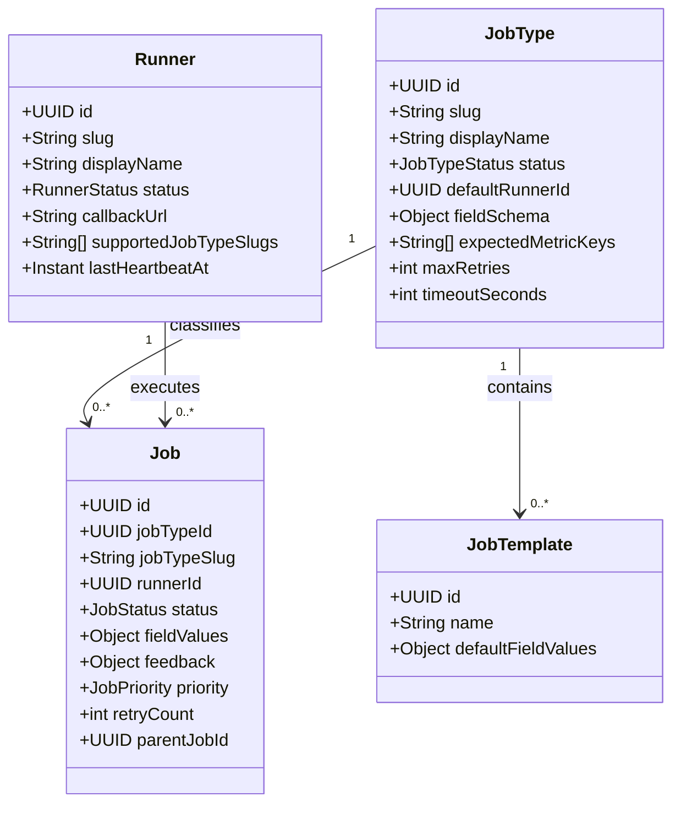
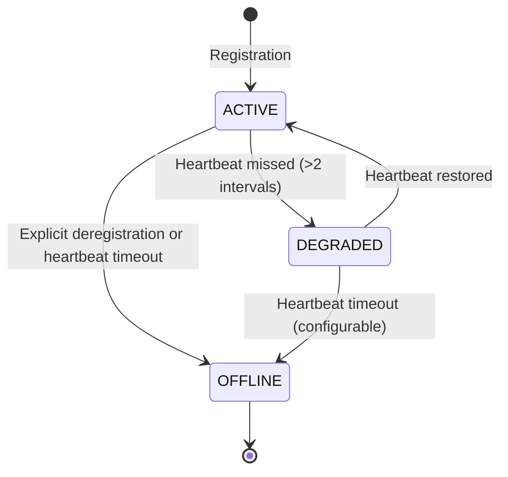
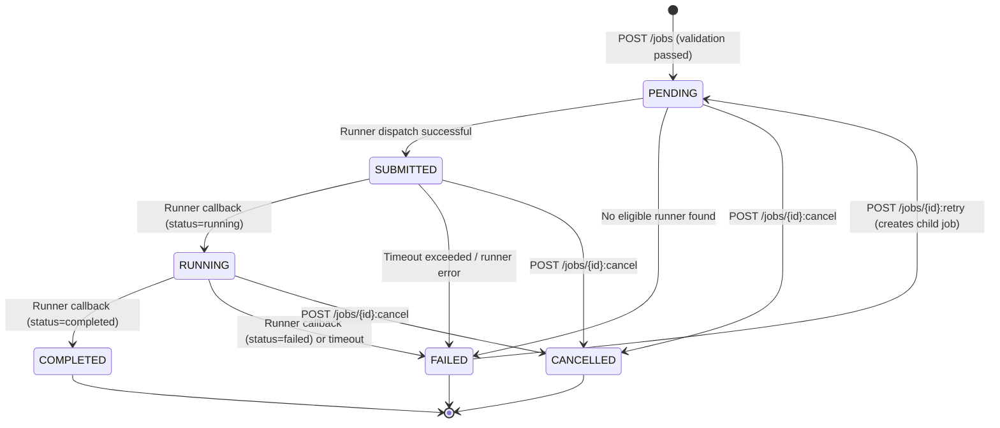
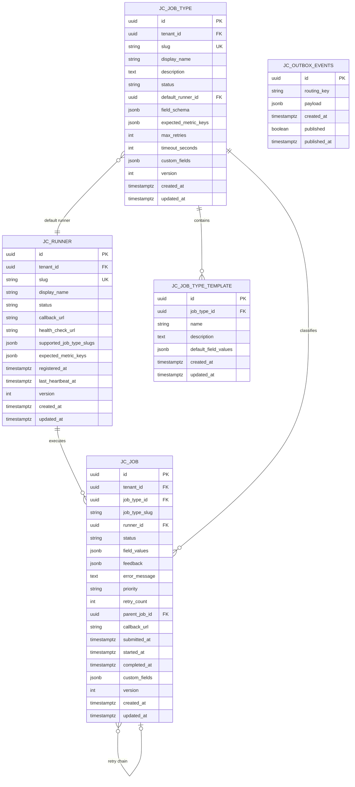

<!-- TEMPLATE COMPLIANCE: ~95%
Template: domain-service-spec.md v1.0.0
Present sections: §0–§15
Gaps: §5.3 process flow diagrams (stub), §12.7 extension API endpoints (stub)
-->

# tech.jc — Job Control Service Domain Specification

> **Conceptual Stack Layer:** Domain / Service
> **Space:** Platform
> **Owner:** Platform Infrastructure Team
> **Schema alignment:** `service-layer.schema.json`
> **Companion files:** `contracts/http/tech/jc/openapi.yaml`, `contracts/events/tech/jc/*.schema.json`
> **Referenced by:** Platform-Feature Specs (F-TECH-003-xx), BFF Contract
> **Belongs to:** Tech Suite Spec (`T1_Platform/tech/_tech_suite.md`)

> **Meta Information**
> - **Version:** 2026-04-03
> - **Template:** `domain-service-spec.md` v1.0.0
> - **Template Compliance:** ~95% — remaining gaps: §5.3 process flow diagrams (stub), §12.7 extension API endpoints (stub)
> - **Author(s):** OpenLeap Architecture Team
> - **Status:** DRAFT
> - **Suite:** `tech` (Technical Infrastructure)
> - **Domain:** `jc` (Job Control)
> - **Bounded Context Ref:** `bc:job-control`
> - **Service ID:** `tech-jc-svc`
> - **basePackage:** `io.openleap.tech.jc`
> - **API Base Path:** `/api/tech/jc/v1`
> - **Deprecated alias:** `/api/platform/jc/v1` (ADR-TECH-005, 6-month transition)
> - **OpenLeap Starter Version:** `v3.0.0`
> - **Port:** `8096`
> - **Repository:** `https://github.com/openleap-io/io.openleap.tech.jc`
> - **Tags:** `tech`, `jc`, `platform`, `job`, `orchestration`, `runner`
> - **Team:**
>   - Name: `team-tech`
>   - Email: `platform-infra@openleap.io`
>   - Slack: `#platform-infra`

---

## Specification Guidelines Compliance

> ### Non-Negotiables
> - Never invent facts. If required info is missing, add an **OPEN QUESTION** entry.
> - Preserve intent and decisions. Only change meaning when explicitly requested.
> - Do not remove normative constraints unless they are explicitly replaced.
> - Keep the spec **self-contained**: no "see chat", no implicit context.
>
> ### Source of Truth Priority
> When sources conflict:
> 1. Spec (explicit) wins
> 2. Starter specs (implementation constraints) next
> 3. Guidelines (best practices) last
>
> Record conflicts in the **Decisions & Conflicts** section (see Section 14).
>
> ### Style Guide
> - Prefer short sentences and lists.
> - Use MUST/SHOULD/MAY for normative statements.
> - Keep terminology consistent (Aggregate, Domain Service, Application Service, Command, Event).
> - Avoid ambiguous words ("often", "maybe") unless explicitly noting uncertainty.
> - Keep examples minimal and clearly marked as examples.
> - Do not add implementation code unless the chapter explicitly requires it.

---

## 0. Document Purpose & Scope

### 0.1 Purpose

The Job Control Service (JC) provides a generic job orchestration backbone for the OpenLeap ERP platform. It manages a registry of external execution engines (Runners), a catalog of job type definitions (JobTypes), and the full lifecycle of concrete job submissions (Jobs) from creation through completion or failure. Any domain service that needs to execute long-running, resource-intensive, or asynchronous work — such as AI inference, ETL imports, bulk exports, or scheduled batch runs — delegates execution to a registered Runner through this service.

### 0.2 Target Audience

- Platform Engineers maintaining infrastructure-level orchestration services
- Platform Infrastructure Team owning this service
- Domain Service Teams (from T2–T4) that submit jobs via JC
- Platform Administrators monitoring Runner health and job throughput
- DevOps teams configuring Runner deployments and callback infrastructure

### 0.3 Scope

**In Scope:**
- Runner self-registration, deregistration, and heartbeat management
- JobType catalog: slug-keyed definitions with field schemas, timeouts, retry limits, and runner assignments
- JobTemplate management: reusable parameter presets per JobType
- Job submission, dispatch to runners, and lifecycle management (PENDING → SUBMITTED → RUNNING → COMPLETED / FAILED / CANCELLED)
- Runner-to-service callback mechanism for status updates and feedback
- Job retry orchestration with parent-child chaining
- Job execution history per job instance
- Published lifecycle events (runner registered, job submitted/started/completed/failed/cancelled)
- GDPR tenant purge: delete all job data on `iam.tenant.deleted`

**Out of Scope:**
- Cron / scheduled job triggering (see Q-JC-001)
- Runner implementation logic — JC dispatches; runners execute
- Report rendering jobs — owned by `tech-rpt-svc`
- Business-domain workflow saga orchestration — owned by individual business services (ADR-029)
- Notification delivery on job completion — delegate to `tech-nfs-svc`
- Infrastructure provisioning or container scheduling (Kubernetes Jobs)

### 0.4 Related Documents

- `T1_Platform/tech/_tech_suite.md` — Tech Suite Architecture Specification
- `T1_Platform/iam/domain-specs/iam_tenant-spec.md` — Tenant Management (source of tenant.deleted event)
- `T1_Platform/iam/domain-specs/iam_audit-spec.md` — Audit Service (consumes JC events)
- `T1_Platform/tech/domain-specs/tech_nfs-spec.md` — News Feed Service (downstream consumer)
- `T1_Platform/tech/domain-specs/tech_rpt-spec.md` — Report Generation Service (job submitter)
- `T1_Platform/tech/features/leaves/F-TECH-003-01/feature-spec.md` — Browse Jobs & Runners
- `T1_Platform/tech/features/leaves/F-TECH-003-02/feature-spec.md` — Manage Job Types
- `T1_Platform/tech/features/leaves/F-TECH-003-03/feature-spec.md` — Job Execution History
- `contracts/http/tech/jc/openapi.yaml` — REST API contract
- `contracts/events/tech/jc/` — Event schema contracts

---

## 1. Business Context

### 1.1 Domain Purpose

The Job Control domain solves the asynchronous execution coordination challenge in a multi-tenant ERP: domain services routinely need to trigger long-running work — AI enrichment of business entities, large-scale data imports, PDF batch generation, nightly report runs — without blocking synchronous API calls. Without a central job orchestration service, each domain would build its own ad-hoc async execution mechanism, leading to inconsistent monitoring, no cross-domain visibility into job health, and duplicated runner infrastructure.

JC provides a single authoritative registry of what can be executed (JobTypes), who executes it (Runners), and what the current execution state is (Jobs). Platform operators get a unified admin surface. Domain services get a stable, contract-driven submission API. Runners get a reliable dispatch and callback protocol.

### 1.2 Business Value

- **Unified monitoring:** Platform operators see all async work across all domains in one view — no per-service dashboards required.
- **Runner decoupling:** Domain services submit jobs by slug; JC resolves which runner handles execution. Runners can be swapped or scaled without touching business code.
- **Retry reliability:** Built-in retry orchestration with configurable limits and parent-child chaining reduces manual intervention for transient failures.
- **Operational transparency:** Full execution history with runner feedback enables post-mortem analysis and auditing.
- **SAP parity:** Replaces SAP Background Processing (SM36/SM37 — `TBTCP`/`TBTCS` tables) as the platform's generic async job scheduling infrastructure.
- **AI/ETL readiness:** Provides the dispatch layer for AI inference runners and ETL pipeline executors without requiring a separate workflow engine.

### 1.3 Key Stakeholders

| Role | Responsibility | Primary Use Cases |
|------|----------------|-------------------|
| Platform Infrastructure Team | Owns and operates JC; manages runner registry | All operational concerns |
| Platform Administrator | Monitors job health, manages job types, reviews failed jobs | UC-JC-001 through UC-JC-007 |
| Domain Service Team | Submits jobs via JC REST API; consumes completion events | UC-JC-006, UC-JC-007 |
| Runner Operator | Deploys and maintains runner software; handles dispatched jobs | UC-JC-002, UC-JC-008 |
| Compliance / Audit | Reviews job execution audit trails | Consumes published events |

### 1.4 Strategic Positioning

The Job Control Service is a **T1 Platform Foundation** service (ADR-001, four-tier layering). It depends only on platform infrastructure (PostgreSQL, RabbitMQ) and the IAM suite for tenant context. Business domains (T2–T4) submit jobs to it; they do not depend on each other through JC. JC has no dependency on any T2–T4 business service.

JC occupies the same architectural niche as SAP Background Processing (`SM36`/`SM37`) — the system-level job scheduler — but is adapted for a microservices context: runner registration is self-service, job types are defined via API rather than ABAP programs, and dispatch uses HTTP callbacks rather than RFC.

### 1.5 Service Context

| Property | Value |
|----------|-------|
| **Suite** | `tech` |
| **Domain** | `jc` |
| **Bounded Context** | `bc:job-control` |
| **Service ID** | `tech-jc-svc` |
| **Base Package** | `io.openleap.tech.jc` |

**Responsibilities:**
- Maintain Runner registry with health and heartbeat tracking
- Maintain JobType catalog with field schema validation
- Accept job submissions, validate field values, and dispatch to eligible runners
- Track job lifecycle and store runner feedback
- Emit lifecycle events consumed by audit and notification services
- Enforce per-tenant data isolation (RLS)
- Purge tenant data on `iam.tenant.deleted`

**Authoritative Sources:**
| Source Type | Description | Access Pattern |
|-------------|-------------|----------------|
| REST API | Runner registry, job type catalog, job submissions and history | Synchronous |
| Database | All Runner, JobType, JobTemplate, Job, and outbox records | Direct (owner) |
| Events | Job and runner lifecycle events | Asynchronous |

```mermaid
graph TB
    subgraph "Upstream Domains"
        IAM[iam-tenant-svc]
        RPT[tech-rpt-svc]
        BIZ[T2/T3 Business Services]
    end

    subgraph "tech-jc-svc"
        JC[Job Control]
    end

    subgraph "Downstream Domains"
        AUD[iam-audit-svc]
        NFS[tech-nfs-svc]
    end

    subgraph "External"
        RUN1[AI Agent Runner]
        RUN2[ETL Runner]
        RUN3[Report Runner]
    end

    IAM -->|tenant.deleted event| JC
    RPT -->|POST /jobs| JC
    BIZ -->|POST /jobs| JC
    JC -->|dispatch callback| RUN1
    JC -->|dispatch callback| RUN2
    JC -->|dispatch callback| RUN3
    RUN1 -->|POST /callbacks/{id}/status| JC
    JC -->|job.* events| AUD
    JC -->|job.* events| NFS
```

---

## 2. Service Identity

| Property | Value | Schema Field |
|----------|-------|-------------|
| **Service ID** | `tech-jc-svc` | `metadata.id` |
| **Display Name** | `Job Control Service` | `metadata.name` |
| **Suite** | `tech` | `metadata.suite` |
| **Domain** | `jc` | `metadata.domain` |
| **Bounded Context** | `bc:job-control` | `metadata.bounded_context_ref` |
| **Version** | `1.0.0` | `metadata.version` |
| **Status** | DRAFT | `metadata.status` |
| **API Base Path** | `/api/tech/jc/v1` | `metadata.api_base_path` |
| **Repository** | `https://github.com/openleap-io/io.openleap.tech.jc` | `metadata.repository` |
| **Tags** | `tech`, `jc`, `platform`, `job`, `runner` | `metadata.tags` |

**Team:**
| Property | Value |
|----------|-------|
| **Name** | `team-tech` |
| **Email** | `platform-infra@openleap.io` |
| **Slack Channel** | `#platform-infra` |

---

## 3. Domain Model

### 3.1 Conceptual Overview

The Job Control domain has three aggregates. **Runner** represents an external execution engine that registers itself with JC and declares which job types it handles. **JobType** is a meta-definition — it names a class of work, declares the parameter schema (as JSON Schema), assigns a default runner, and sets retry and timeout policies. **Job** is a concrete submission: a caller provides a job type slug and field values; JC validates the values against the type's schema and dispatches to an available runner.

A fourth concept, **JobTemplate**, is a child entity of JobType — it stores a named set of default field values for quick job submission without repeating all parameters.

### 3.2 Core Concepts



### 3.3 Aggregate Definitions

#### 3.3.1 Runner

| Property | Value |
|----------|-------|
| **Aggregate ID** | `agg:runner` |
| **Name** | `Runner` |

**Business Purpose:**
Represents an external execution engine that has self-registered with the Job Control Service. A Runner declares its identity, callback URL, and the set of job type slugs it can handle. JC routes job dispatches to eligible Runners and tracks their health via periodic heartbeats.

##### Aggregate Root

**Key Attributes:**
| Attribute | Type | Format | Description | Constraints | Required | Read-Only |
|-----------|------|--------|-------------|-------------|----------|-----------|
| id | string | uuid | Unique system identifier. Generated by `OlUuid.create()`. | Immutable | Yes | Yes |
| tenantId | string | uuid | Tenant ownership for RLS enforcement. | Immutable | Yes | Yes |
| slug | string | — | URL-safe unique name (e.g., `ai-agent-runner`). | Pattern: `^[a-z0-9-]+$`, max 64 chars; unique per tenant | Yes | No |
| displayName | string | — | Human-readable runner name shown in admin UI. | max 255 chars | Yes | No |
| status | string | — | Current lifecycle state. | enum_ref: `RunnerStatus` | Yes | Yes |
| callbackUrl | string | uri | HTTP endpoint where JC dispatches jobs. MUST be reachable at registration. | max 2048 chars | Yes | No |
| healthCheckUrl | string | uri | HTTP endpoint JC polls to verify runner availability. | max 2048 chars | No | No |
| supportedJobTypeSlugs | array | — | List of job type slugs this runner can handle. | min 1 item | Yes | No |
| expectedMetricKeys | array | — | Metric keys the runner will include in job feedback. | — | No | No |
| registeredAt | string | date-time | Timestamp of initial registration. | — | Yes | Yes |
| lastHeartbeatAt | string | date-time | Timestamp of most recent heartbeat ping. | — | No | Yes |
| version | integer | int32 | Optimistic locking version counter. | min: 0 | Yes | Yes |
| createdAt | string | date-time | Record creation timestamp. | — | Yes | Yes |
| updatedAt | string | date-time | Record last-modification timestamp. | — | Yes | Yes |

**Lifecycle States:**

| Property | Value |
|----------|-------|
| **Initial State** | `ACTIVE` |
| **Terminal States** | `OFFLINE` |



**State Descriptions:**
| State | Description | Business Meaning |
|-------|-------------|------------------|
| `ACTIVE` | Runner is healthy and receiving heartbeats | Eligible for job dispatch |
| `DEGRADED` | Runner missed heartbeat window | Dispatch paused; new jobs not routed here |
| `OFFLINE` | Runner has been deregistered or timed out | No dispatches; historical record retained |

**Allowed Transitions:**
| From State | To State | Trigger | Guard / Business Preconditions |
|------------|----------|---------|-------------------------------|
| — | `ACTIVE` | `POST /runners` (self-registration) | slug unique per tenant; callbackUrl reachable |
| `ACTIVE` | `DEGRADED` | Heartbeat monitor (internal) | No heartbeat received within `heartbeatIntervalSeconds × 2` |
| `DEGRADED` | `ACTIVE` | `PATCH /runners/{id}/heartbeat` | Valid runner id |
| `ACTIVE` or `DEGRADED` | `OFFLINE` | `DELETE /runners/{id}` or timeout | No running jobs assigned (BR-JC-005) |

**Invariants:**
| Rule ID | Description |
|---------|-------------|
| BR-JC-001 | Runner slug must be unique per tenant |
| BR-JC-003 | Runner must declare at least one supported job type slug at registration |

**Domain Events Emitted:**
- `tech.jc.runner.registered`

---

#### 3.3.2 JobType

| Property | Value |
|----------|-------|
| **Aggregate ID** | `agg:job-type` |
| **Name** | `JobType` |

**Business Purpose:**
Defines a class of executable work. Each JobType has a unique slug, a JSON Schema that describes the parameters callers must supply, a default runner assignment, timeout and retry policies, and optionally a list of metric keys the runner will report in job feedback. JobTypes are the contract between callers (who submit jobs) and runners (who execute them).

##### Aggregate Root

**Key Attributes:**
| Attribute | Type | Format | Description | Constraints | Required | Read-Only |
|-----------|------|--------|-------------|-------------|----------|-----------|
| id | string | uuid | Unique system identifier. | Immutable | Yes | Yes |
| tenantId | string | uuid | Tenant ownership for RLS enforcement. | Immutable | Yes | Yes |
| slug | string | — | URL-safe unique name (e.g., `pdf-render`, `data-import`). | Pattern: `^[a-z0-9-]+$`, max 64 chars; unique per tenant | Yes | No |
| displayName | string | — | Human-readable name shown in admin UI. | max 255 chars | Yes | No |
| description | string | — | Business description of what this job type does. | max 2000 chars | No | No |
| status | string | — | Current lifecycle state. | enum_ref: `JobTypeStatus` | Yes | No |
| defaultRunnerId | string | uuid | Runner assigned by default for new jobs of this type. | FK: Runner.id | Yes | No |
| fieldSchema | object | — | JSON Schema (draft-07) describing required and optional job parameters. | Valid JSON Schema | Yes | No |
| expectedMetricKeys | array | — | Metric keys runner will include in feedback (e.g., `["rowsProcessed","errorCount"]`). | — | No | No |
| maxRetries | integer | int32 | Maximum number of automatic retry attempts after failure. | min: 0, max: 10; default: 3 | Yes | No |
| timeoutSeconds | integer | int32 | Job execution timeout in seconds. JC marks job FAILED if no completion callback is received within this window. | min: 10, max: 86400; default: 3600 | Yes | No |
| version | integer | int32 | Optimistic locking version counter. | min: 0 | Yes | Yes |
| createdAt | string | date-time | Record creation timestamp. | — | Yes | Yes |
| updatedAt | string | date-time | Record last-modification timestamp. | — | Yes | Yes |

**Lifecycle States:**

| Property | Value |
|----------|-------|
| **Initial State** | `ACTIVE` |
| **Terminal States** | `DEPRECATED` |

**State Descriptions:**
| State | Description | Business Meaning |
|-------|-------------|------------------|
| `ACTIVE` | JobType is available for new job submissions | Fully operational |
| `INACTIVE` | Temporarily disabled by administrator | No new jobs accepted; existing jobs unaffected |
| `DEPRECATED` | Scheduled for removal; callers warned | New submissions rejected; historical jobs retained |

**Allowed Transitions:**
| From State | To State | Trigger | Guard / Business Preconditions |
|------------|----------|---------|-------------------------------|
| — | `ACTIVE` | `POST /job-types` | slug unique per tenant |
| `ACTIVE` | `INACTIVE` | `PUT /job-types/{id}` (status change) | No PENDING/RUNNING jobs for this type |
| `INACTIVE` | `ACTIVE` | `PUT /job-types/{id}` (status change) | — |
| `ACTIVE` or `INACTIVE` | `DEPRECATED` | `PUT /job-types/{id}` (status change) | — |

**Invariants:**
| Rule ID | Description |
|---------|-------------|
| BR-JC-002 | JobType slug must be unique per tenant |
| BR-JC-007 | defaultRunnerId must reference an existing ACTIVE Runner that supports this slug |

**Domain Events Emitted:**
- None (JobType is a catalog entity; changes are audited via the standard audit service)

##### Child Entities

###### Entity: JobTemplate

| Property | Value |
|----------|-------|
| **Entity ID** | `ent:job-template` |
| **Name** | `JobTemplate` |
| **Relationship to Root** | one_to_many |

**Business Purpose:**
Stores a named preset of field values for a JobType, enabling one-click job submission without re-entering all parameters. Comparable to SAP job variants (transaction SM36, JOBREPORT field with variant).

**Attributes:**
| Attribute | Type | Format | Description | Constraints | Required |
|-----------|------|--------|-------------|-------------|----------|
| id | string | uuid | Unique system identifier. | — | Yes |
| jobTypeId | string | uuid | Parent job type. | FK: JobType.id | Yes |
| name | string | — | Descriptive name for this template. | max 128 chars; unique per jobTypeId | Yes |
| description | string | — | Explanation of when to use this template. | max 500 chars | No |
| defaultFieldValues | object | — | Partial or full field values conforming to the JobType's fieldSchema. | Valid per fieldSchema | Yes |
| createdAt | string | date-time | Record creation timestamp. | — | Yes |
| updatedAt | string | date-time | Record last-modification timestamp. | — | Yes |

**Collection Constraints:**
- Minimum items: 0
- Maximum items: 50 per JobType

**Invariants:**
| Rule ID | Description |
|---------|-------------|
| BR-JC-009 | Template defaultFieldValues must be valid against the parent JobType's fieldSchema |

---

#### 3.3.3 Job

| Property | Value |
|----------|-------|
| **Aggregate ID** | `agg:job` |
| **Name** | `Job` |

**Business Purpose:**
Represents a single execution request. A caller submits a Job with a jobTypeSlug and fieldValues; JC validates the values, selects an eligible runner, and dispatches. The Job tracks the complete execution lifecycle from dispatch through runner feedback to completion or failure. Failed jobs may be retried, creating a parent-child chain.

##### Aggregate Root

**Key Attributes:**
| Attribute | Type | Format | Description | Constraints | Required | Read-Only |
|-----------|------|--------|-------------|-------------|----------|-----------|
| id | string | uuid | Unique system identifier. Generated by `OlUuid.create()`. | Immutable | Yes | Yes |
| tenantId | string | uuid | Tenant ownership for RLS enforcement. | Immutable | Yes | Yes |
| jobTypeId | string | uuid | Resolved job type at submission time. | FK: JobType.id; Immutable | Yes | Yes |
| jobTypeSlug | string | — | Denormalized slug for display without join. | Immutable | Yes | Yes |
| runnerId | string | uuid | Runner assigned to execute this job. | FK: Runner.id | No | No |
| status | string | — | Current lifecycle state. | enum_ref: `JobStatus` | Yes | Yes |
| fieldValues | object | — | Parameter values provided by the submitting caller. | Valid per JobType.fieldSchema | Yes | Yes |
| feedback | object | — | Structured output returned by the runner on completion (metric values, result references, etc.). | — | No | Yes |
| errorMessage | string | — | Error description returned by the runner on failure. | max 4000 chars | No | Yes |
| priority | string | — | Dispatch priority. Higher-priority jobs are dispatched first when multiple jobs queue for the same runner. | enum_ref: `JobPriority`; default: `NORMAL` | Yes | No |
| retryCount | integer | int32 | Number of times this job has been retried (0 for original submission). | min: 0 | Yes | Yes |
| parentJobId | string | uuid | References the original job in a retry chain; null for original submissions. | FK: Job.id | No | Yes |
| callbackUrl | string | uri | Optional caller-provided URL for JC to POST a completion notification to. | max 2048 chars | No | Yes |
| submittedAt | string | date-time | Timestamp when JC dispatched the job to the runner. | — | No | Yes |
| startedAt | string | date-time | Timestamp of first `running` status callback from runner. | — | No | Yes |
| completedAt | string | date-time | Timestamp of `completed`, `failed`, or `cancelled` transition. | — | No | Yes |
| version | integer | int32 | Optimistic locking version counter. | min: 0 | Yes | Yes |
| createdAt | string | date-time | Record creation timestamp. | — | Yes | Yes |
| updatedAt | string | date-time | Record last-modification timestamp. | — | Yes | Yes |

**Lifecycle States:**

| Property | Value |
|----------|-------|
| **Initial State** | `PENDING` |
| **Terminal States** | `COMPLETED`, `FAILED`, `CANCELLED` |



**State Descriptions:**
| State | Description | Business Meaning |
|-------|-------------|------------------|
| `PENDING` | Job created; awaiting dispatch to runner | Queued, not yet executing |
| `SUBMITTED` | JC has dispatched the job to the assigned runner | Runner acknowledged receipt |
| `RUNNING` | Runner has confirmed it is actively processing | Execution in progress |
| `COMPLETED` | Runner reported successful completion | Final state; feedback available |
| `FAILED` | Runner reported failure or JC timeout was reached | Final state; errorMessage populated |
| `CANCELLED` | Job was explicitly cancelled before completion | Final state |

**Allowed Transitions:**
| From State | To State | Trigger | Guard / Business Preconditions |
|------------|----------|---------|-------------------------------|
| — | `PENDING` | `POST /jobs` | fieldValues valid per jobType.fieldSchema (BR-JC-004) |
| `PENDING` | `SUBMITTED` | JC dispatch loop | ACTIVE runner available for jobTypeSlug |
| `PENDING` | `FAILED` | JC dispatch loop | No ACTIVE runner for jobTypeSlug after dispatch retries |
| `SUBMITTED` | `RUNNING` | `POST /callbacks/{id}/status` (status=running) | Valid runner auth token |
| `SUBMITTED` | `FAILED` | JC timeout monitor | Job age > JobType.timeoutSeconds |
| `RUNNING` | `COMPLETED` | `POST /callbacks/{id}/status` (status=completed) | Valid runner auth token |
| `RUNNING` | `FAILED` | `POST /callbacks/{id}/status` (status=failed) or timeout | Valid runner auth token or age check |
| `PENDING`, `SUBMITTED`, `RUNNING` | `CANCELLED` | `POST /jobs/{id}:cancel` | Authorised caller; not already terminal |
| `FAILED` | `PENDING` | `POST /jobs/{id}:retry` | retryCount < JobType.maxRetries (BR-JC-006) |

**Invariants:**
| Rule ID | Description |
|---------|-------------|
| BR-JC-004 | fieldValues must be valid against the JobType's fieldSchema at submission |
| BR-JC-005 | Only PENDING, SUBMITTED, or RUNNING jobs may be cancelled |
| BR-JC-006 | Retry allowed only when retryCount < JobType.maxRetries |

**Domain Events Emitted:**
- `tech.jc.job.submitted`
- `tech.jc.job.started`
- `tech.jc.job.completed`
- `tech.jc.job.failed`
- `tech.jc.job.cancelled`

### 3.4 Enumerations

#### RunnerStatus

**Description:** Lifecycle states of a registered execution engine.

| Value | Description | Deprecated |
|-------|-------------|------------|
| `ACTIVE` | Runner is healthy and receiving heartbeats; eligible for dispatch | No |
| `DEGRADED` | Runner has missed the heartbeat window; dispatch paused | No |
| `OFFLINE` | Runner has been deregistered or timed out; historical record only | No |

#### JobTypeStatus

**Description:** Availability status of a job type definition.

| Value | Description | Deprecated |
|-------|-------------|------------|
| `ACTIVE` | Job type accepts new submissions | No |
| `INACTIVE` | Job type is temporarily disabled; no new submissions | No |
| `DEPRECATED` | Job type is scheduled for removal; callers should migrate | No |

#### JobStatus

**Description:** Lifecycle states of a job submission.

| Value | Description | Deprecated |
|-------|-------------|------------|
| `PENDING` | Job created and queued for dispatch | No |
| `SUBMITTED` | Job dispatched to an assigned runner | No |
| `RUNNING` | Runner confirmed active processing | No |
| `COMPLETED` | Job finished successfully; feedback available | No |
| `FAILED` | Job failed due to runner error or timeout | No |
| `CANCELLED` | Job was cancelled by an authorised caller | No |

#### JobPriority

**Description:** Dispatch priority for job ordering within a runner's queue.

| Value | Description | Deprecated |
|-------|-------------|------------|
| `LOW` | Background, non-urgent work (e.g., nightly cleanup) | No |
| `NORMAL` | Standard operational jobs | No |
| `HIGH` | Time-sensitive or user-initiated jobs | No |
| `CRITICAL` | Highest priority; preempts NORMAL and HIGH queue items | No |

### 3.5 Shared Types

#### FieldSchema

| Property | Value |
|----------|-------|
| **Type ID** | `type:field-schema` |
| **Name** | `FieldSchema` |

**Description:** A JSON Schema (draft-07) object stored as JSONB that describes the parameters a caller must supply when submitting a job of a given type. The schema is validated at job submission time (BR-JC-004).

**Attributes:**
| Attribute | Type | Format | Description | Constraints |
|-----------|------|--------|-------------|-------------|
| type | string | — | Always `"object"` for field schemas | `"object"` |
| properties | object | — | Map of field name to JSON Schema field definition | — |
| required | array | — | List of field names that are mandatory | — |
| additionalProperties | boolean | — | Whether unlisted fields are accepted; SHOULD be `false` | — |

**Validation Rules:**
- MUST be a valid JSON Schema draft-07 object.
- MUST have `"type": "object"` at the root.
- SHOULD declare `"additionalProperties": false` to prevent unrecognized parameters.
- `required` fields MUST be present in `properties`.

**Used By:**
- `agg:job-type` (stored as `fieldSchema` column)
- `agg:job` (validated against `fieldSchema` at submission)

---

## 4. Business Rules & Constraints

### 4.1 Business Rules Catalog

| ID | Rule Name | Description | Scope | Enforcement | Error Code |
|----|-----------|-------------|-------|-------------|------------|
| BR-JC-001 | Runner slug uniqueness | Runner slug must be unique per tenant | Runner | Create | `JC_RUNNER_SLUG_EXISTS` |
| BR-JC-002 | JobType slug uniqueness | JobType slug must be unique per tenant | JobType | Create | `JC_JOBTYPE_SLUG_EXISTS` |
| BR-JC-003 | Runner must support at least one job type | A runner MUST declare at least one supportedJobTypeSlug at registration | Runner | Create, Update | `JC_RUNNER_NO_JOB_TYPES` |
| BR-JC-004 | Field values must conform to schema | Job fieldValues MUST be valid against the parent JobType's fieldSchema | Job | Create | `JC_JOB_INVALID_FIELDS` |
| BR-JC-005 | Only active jobs can be cancelled | Only PENDING, SUBMITTED, or RUNNING jobs may be cancelled | Job | Cancel action | `JC_JOB_NOT_CANCELLABLE` |
| BR-JC-006 | Retry limit enforcement | A FAILED job may only be retried if retryCount < JobType.maxRetries | Job | Retry action | `JC_JOB_MAX_RETRIES_EXCEEDED` |
| BR-JC-007 | Default runner must be active | JobType.defaultRunnerId must reference an ACTIVE Runner at creation time | JobType | Create, Update | `JC_JOBTYPE_RUNNER_INACTIVE` |
| BR-JC-008 | Runner deregistration guard | A Runner in ACTIVE or DEGRADED state with assigned RUNNING jobs MUST NOT be deregistered | Runner | Delete | `JC_RUNNER_HAS_RUNNING_JOBS` |
| BR-JC-009 | Template values conform to schema | JobTemplate.defaultFieldValues must be valid against the parent JobType's fieldSchema | JobTemplate | Create, Update | `JC_TEMPLATE_INVALID_FIELDS` |
| BR-JC-010 | JobType deactivation guard | A JobType with PENDING or RUNNING jobs MUST NOT be set to INACTIVE or DEPRECATED | JobType | Update (status change) | `JC_JOBTYPE_HAS_ACTIVE_JOBS` |

### 4.2 Detailed Rule Definitions

#### BR-JC-001: Runner Slug Uniqueness

**Business Context:** Slugs are used by runners themselves to identify when re-registering after restart. Duplicate slugs would cause dispatch routing ambiguity.

**Rule Statement:** Within a tenant, no two Runner records may share the same `slug` value. An OFFLINE runner's slug is released and may be reclaimed.

**Applies To:**
- Aggregate: Runner
- Operations: Create

**Enforcement:** Database unique constraint on `(tenant_id, slug)` where `status != 'OFFLINE'`.

**Validation Logic:** Before inserting a new Runner, check that no active record with the same `(tenantId, slug)` pair exists.

**Error Handling:**
- **Error Code:** `JC_RUNNER_SLUG_EXISTS`
- **Error Message:** "A runner with slug '{slug}' is already registered for this tenant."
- **User action:** Choose a different slug or deregister the existing runner first.

**Examples:**
- **Valid:** First registration with slug `ai-agent-runner`.
- **Invalid:** Second registration attempt with slug `ai-agent-runner` while the first is still ACTIVE.

---

#### BR-JC-002: JobType Slug Uniqueness

**Business Context:** Job submitters reference job types by slug (not by UUID), so slugs must be stable and non-ambiguous within a tenant.

**Rule Statement:** Within a tenant, no two JobType records may share the same `slug` value. DEPRECATED job types retain their slug to prevent accidental reuse.

**Applies To:**
- Aggregate: JobType
- Operations: Create

**Enforcement:** Database unique constraint on `(tenant_id, slug)`.

**Validation Logic:** Before inserting a new JobType, check that no record with the same `(tenantId, slug)` exists.

**Error Handling:**
- **Error Code:** `JC_JOBTYPE_SLUG_EXISTS`
- **Error Message:** "A job type with slug '{slug}' already exists for this tenant."
- **User action:** Choose a different slug or deprecate and remove the existing job type.

**Examples:**
- **Valid:** Creating `pdf-render` for the first time.
- **Invalid:** Creating `pdf-render` when one already exists (even if DEPRECATED).

---

#### BR-JC-003: Runner Must Support At Least One Job Type

**Business Context:** A runner without declared job type support would never receive dispatches, wasting registry space and creating confusion in monitoring.

**Rule Statement:** A Runner's `supportedJobTypeSlugs` MUST contain at least one entry at registration and MUST NOT be emptied by subsequent updates.

**Applies To:**
- Aggregate: Runner
- Operations: Create, Update

**Enforcement:** Application-layer validation before persistence.

**Validation Logic:** `supportedJobTypeSlugs.length >= 1`.

**Error Handling:**
- **Error Code:** `JC_RUNNER_NO_JOB_TYPES`
- **Error Message:** "Runner must support at least one job type slug."
- **User action:** Add at least one job type slug to the registration payload.

**Examples:**
- **Valid:** `supportedJobTypeSlugs: ["pdf-render", "data-import"]`.
- **Invalid:** `supportedJobTypeSlugs: []`.

---

#### BR-JC-004: Field Values Must Conform to Schema

**Business Context:** JobTypes define an explicit parameter contract. Accepting non-conforming field values would cause runner execution failures that are hard to diagnose.

**Rule Statement:** When creating a Job, the `fieldValues` payload MUST pass JSON Schema validation against the parent JobType's `fieldSchema`.

**Applies To:**
- Aggregate: Job
- Operations: Create

**Enforcement:** Application-layer JSON Schema validation before dispatch.

**Validation Logic:** Validate `fieldValues` against `JobType.fieldSchema` using a draft-07 validator. Collect all violations and return them together.

**Error Handling:**
- **Error Code:** `JC_JOB_INVALID_FIELDS`
- **Error Message:** "Job field values do not conform to the job type schema: {violations}."
- **User action:** Review the field schema for this job type and correct the payload.

**Examples:**
- **Valid:** JobType requires `{"reportId": "uuid", "locale": "string"}` and both are provided with correct types.
- **Invalid:** `reportId` is missing or locale is an integer instead of string.

---

#### BR-JC-005: Only Active Jobs Can Be Cancelled

**Business Context:** Cancelling an already-terminal job is a no-op at best and confusing at worst. Terminal states (COMPLETED, FAILED, CANCELLED) are immutable.

**Rule Statement:** The cancel operation MUST be rejected if the Job's current status is COMPLETED, FAILED, or CANCELLED.

**Applies To:**
- Aggregate: Job
- Operations: Cancel action

**Enforcement:** Application-layer state guard before status transition.

**Validation Logic:** `status NOT IN ('COMPLETED', 'FAILED', 'CANCELLED')`.

**Error Handling:**
- **Error Code:** `JC_JOB_NOT_CANCELLABLE`
- **Error Message:** "Job '{jobId}' cannot be cancelled because it is already in terminal state '{status}'."
- **User action:** No action required; job is already in a final state.

**Examples:**
- **Valid:** Cancelling a RUNNING job.
- **Invalid:** Attempting to cancel a COMPLETED job.

---

#### BR-JC-006: Retry Limit Enforcement

**Business Context:** Unlimited retries could cause runaway re-dispatch loops for systematically failing jobs, consuming runner capacity and generating alert noise.

**Rule Statement:** A FAILED job MUST NOT be retried if `retryCount >= JobType.maxRetries`.

**Applies To:**
- Aggregate: Job
- Operations: Retry action

**Enforcement:** Application-layer check before creating the child job.

**Validation Logic:** `job.retryCount < jobType.maxRetries`.

**Error Handling:**
- **Error Code:** `JC_JOB_MAX_RETRIES_EXCEEDED`
- **Error Message:** "Job '{jobId}' has reached the maximum retry count of {maxRetries}."
- **User action:** Investigate the root cause of failure and resubmit as a new job if appropriate.

**Examples:**
- **Valid:** Retrying a FAILED job where retryCount=1 and maxRetries=3.
- **Invalid:** Attempting to retry when retryCount=3 and maxRetries=3.

---

#### BR-JC-007: Default Runner Must Be Active

**Business Context:** A JobType referencing an OFFLINE or non-existent runner would immediately fail all new job submissions.

**Rule Statement:** When creating or updating a JobType, `defaultRunnerId` MUST reference a Runner record with status `ACTIVE`.

**Applies To:**
- Aggregate: JobType
- Operations: Create, Update

**Enforcement:** Application-layer lookup before persistence.

**Validation Logic:** Load Runner by `defaultRunnerId`; assert `status == ACTIVE`.

**Error Handling:**
- **Error Code:** `JC_JOBTYPE_RUNNER_INACTIVE`
- **Error Message:** "The specified default runner '{runnerId}' is not active."
- **User action:** Select an ACTIVE runner or activate the desired runner first.

**Examples:**
- **Valid:** Assigning `ai-agent-runner` (ACTIVE) as default for job type `ai-enrichment`.
- **Invalid:** Assigning an OFFLINE runner.

---

#### BR-JC-008: Runner Deregistration Guard

**Business Context:** Deleting a runner while it has running jobs would leave those jobs in RUNNING state indefinitely with no callback path.

**Rule Statement:** A Runner MUST NOT be deleted while it has Jobs in SUBMITTED or RUNNING state.

**Applies To:**
- Aggregate: Runner
- Operations: Delete

**Enforcement:** Application-layer query before deletion.

**Validation Logic:** `COUNT(jobs WHERE runnerId=id AND status IN ('SUBMITTED','RUNNING')) == 0`.

**Error Handling:**
- **Error Code:** `JC_RUNNER_HAS_RUNNING_JOBS`
- **Error Message:** "Runner '{runnerId}' has {count} active job(s) and cannot be deregistered."
- **User action:** Wait for active jobs to complete or cancel them before deregistering.

**Examples:**
- **Valid:** Deregistering a runner with no active jobs.
- **Invalid:** Deregistering a runner that has 3 RUNNING jobs.

---

#### BR-JC-009 and BR-JC-010

See §4.1 catalog for brief descriptions; detail blocks omitted for brevity (same enforcement pattern as BR-JC-004 and BR-JC-005 respectively).

### 4.3 Data Validation Rules

**Field-Level Validations:**

| Field | Validation Rule | Error Message |
|-------|----------------|---------------|
| Runner.slug | Required; pattern `^[a-z0-9-]+$`; max 64 chars | "Runner slug must be lowercase alphanumeric with hyphens, max 64 chars" |
| Runner.callbackUrl | Required; valid URI; max 2048 chars | "callbackUrl must be a valid URI" |
| Runner.supportedJobTypeSlugs | Required; min 1 item | "At least one job type slug is required" |
| JobType.slug | Required; pattern `^[a-z0-9-]+$`; max 64 chars | "Job type slug must be lowercase alphanumeric with hyphens, max 64 chars" |
| JobType.maxRetries | Required; min 0, max 10 | "maxRetries must be between 0 and 10" |
| JobType.timeoutSeconds | Required; min 10, max 86400 | "timeoutSeconds must be between 10 and 86400" |
| JobType.fieldSchema | Required; valid JSON Schema draft-07 object | "fieldSchema must be a valid JSON Schema object" |
| Job.fieldValues | Required; validated against JobType.fieldSchema | "Field values do not conform to job type schema" |
| Job.priority | Required; enum `JobPriority`; default NORMAL | "priority must be one of: LOW, NORMAL, HIGH, CRITICAL" |

**Cross-Field Validations:**
- `Job.completedAt` MUST be `>= Job.startedAt` when both are present.
- `Job.startedAt` MUST be `>= Job.submittedAt` when both are present.
- `Job.retryCount` MUST be 0 when `parentJobId` is null.

### 4.4 Reference Data Dependencies

| Catalog | Source Service | Fields Referencing | Validation |
|---------|----------------|-------------------|------------|
| IAM Tenant | `iam-tenant-svc` | `tenantId` on all aggregates | Verified via JWT `tenantId` claim at request time |
| IAM Principal | `iam-authz-svc` | Caller identity on job submissions | Verified via JWT bearer token |

---

## 5. Use Cases & Business Logic

### 5.1 Business Logic Placement

| Logic Type | Placement | Examples |
|------------|-----------|----------|
| Aggregate invariants | Domain Object | Slug uniqueness checks, retry limit guard, cancellation state guard |
| Field schema validation | Domain Service (`JobValidationService`) | JSON Schema validation of fieldValues against JobType.fieldSchema |
| Dispatch selection | Domain Service (`RunnerSelectionService`) | Select ACTIVE runner supporting jobTypeSlug with lowest queue depth |
| Timeout monitoring | Application Service (scheduled) | Detect SUBMITTED/RUNNING jobs exceeding timeoutSeconds; transition to FAILED |
| Orchestration & transactions | Application Service | Use case coordination, outbox event publishing |

### 5.2 Use Cases

#### Use Case Catalog

| ID | Name | Type | Trigger | Primary Actor |
|----|------|------|---------|---------------|
| UC-JC-001 | Register Runner | WRITE | REST POST | Runner Operator |
| UC-JC-002 | Heartbeat Runner | WRITE | REST PATCH | Runner (automatic) |
| UC-JC-003 | Deregister Runner | WRITE | REST DELETE | Runner Operator |
| UC-JC-004 | Create Job Type | WRITE | REST POST | Platform Admin |
| UC-JC-005 | Update Job Type | WRITE | REST PUT | Platform Admin |
| UC-JC-006 | Submit Job | WRITE | REST POST | Domain Service / Platform Admin |
| UC-JC-007 | Cancel Job | WRITE | REST POST (action) | Platform Admin / Domain Service |
| UC-JC-008 | Retry Job | WRITE | REST POST (action) | Platform Admin |
| UC-JC-009 | Runner Status Callback | WRITE | REST POST (runner webhook) | Runner |
| UC-JC-010 | Browse Runners | READ | REST GET | Platform Admin |
| UC-JC-011 | Browse Jobs | READ | REST GET | Platform Admin / Domain Service |
| UC-JC-012 | Get Job Execution History | READ | REST GET | Platform Admin |
| UC-JC-013 | Browse Job Types | READ | REST GET | Platform Admin |

---

#### UC-JC-001: Register Runner

**Actor:** Runner Operator (automated on runner startup)

**Preconditions:**
- Calling service has `PLATFORM_ADMIN` role or runner registration token.
- `slug` does not already exist for this tenant (BR-JC-001).
- `callbackUrl` is reachable.

**Main Flow:**
1. Runner sends `POST /api/tech/jc/v1/runners` with slug, displayName, callbackUrl, supportedJobTypeSlugs.
2. JC validates: slug uniqueness (BR-JC-001), at least one supported job type (BR-JC-003).
3. JC performs a health-check GET to `callbackUrl` or `healthCheckUrl` (Q-JC-002).
4. JC creates Runner record with status `ACTIVE` and publishes `tech.jc.runner.registered`.
5. JC returns `201 Created` with the Runner resource.

**Postconditions:**
- Runner record exists with status `ACTIVE`.
- `tech.jc.runner.registered` event in outbox.

**Business Rules Applied:**
- BR-JC-001: Slug uniqueness
- BR-JC-003: At least one supported job type

**Alternative Flows:**
- **Alt-1:** If runner with same slug exists but is OFFLINE, JC may reactivate the existing record (Q-JC-003).

**Exception Flows:**
- **Exc-1:** If slug already in use by an ACTIVE runner → `409 Conflict` with `JC_RUNNER_SLUG_EXISTS`.
- **Exc-2:** If callbackUrl health check fails → `422 Unprocessable Entity` with `JC_RUNNER_CALLBACK_UNREACHABLE`.

---

#### UC-JC-006: Submit Job

**Actor:** Domain Service or Platform Administrator

**Preconditions:**
- JobType with matching slug exists and is `ACTIVE`.
- At least one ACTIVE runner supports the jobTypeSlug.
- Caller has `JC_JOB_SUBMIT` permission.

**Main Flow:**
1. Caller sends `POST /api/tech/jc/v1/jobs` with `jobTypeSlug`, `fieldValues`, optional `priority` and `callbackUrl`.
2. JC resolves the JobType by slug; validates fieldValues against `fieldSchema` (BR-JC-004).
3. JC selects the best eligible runner via `RunnerSelectionService` (ACTIVE, lowest queue depth).
4. JC creates Job record in `PENDING` state and immediately dispatches to runner.
5. On successful runner acknowledgement, JC transitions Job to `SUBMITTED` and publishes `tech.jc.job.submitted`.
6. JC returns `201 Created` with the Job resource.

**Postconditions:**
- Job record exists with status `SUBMITTED`.
- `tech.jc.job.submitted` event in outbox.
- Runner has received dispatch payload.

**Business Rules Applied:**
- BR-JC-004: Field values conform to schema
- BR-JC-007 (indirect): JobType must have a valid default runner

**Alternative Flows:**
- **Alt-1:** Caller provides explicit `runnerId` to bypass selection — JC validates runner is ACTIVE and supports the job type.

**Exception Flows:**
- **Exc-1:** No ACTIVE runner available → Job created in PENDING, transition to FAILED with `JC_NO_ELIGIBLE_RUNNER`.
- **Exc-2:** fieldValues invalid → `422 Unprocessable Entity` with `JC_JOB_INVALID_FIELDS`.

---

#### UC-JC-008: Retry Job

**Actor:** Platform Administrator

**Preconditions:**
- Job exists and is in `FAILED` state.
- `retryCount < JobType.maxRetries` (BR-JC-006).

**Main Flow:**
1. Administrator sends `POST /api/tech/jc/v1/jobs/{id}:retry`.
2. JC validates retry eligibility (BR-JC-006).
3. JC creates a new Job (child) with `parentJobId` = failed job's id, `retryCount` = parent's retryCount + 1, same `fieldValues` and `jobTypeSlug`.
4. JC dispatches the child job to an eligible runner.
5. JC returns `201 Created` with the new (child) Job resource.

**Postconditions:**
- Child Job exists with status `SUBMITTED`.
- Parent Job remains `FAILED`.
- `tech.jc.job.submitted` event in outbox for child job.

**Business Rules Applied:**
- BR-JC-006: Retry limit enforcement

**Exception Flows:**
- **Exc-1:** `retryCount >= maxRetries` → `422 Unprocessable Entity` with `JC_JOB_MAX_RETRIES_EXCEEDED`.
- **Exc-2:** Job not in FAILED state → `409 Conflict` with `JC_JOB_NOT_RETRYABLE`.

---

#### UC-JC-009: Runner Status Callback

**Actor:** Runner (automated)

**Preconditions:**
- Job exists with status `SUBMITTED` or `RUNNING`.
- Callback authenticated with runner token.

**Main Flow:**
1. Runner sends `POST /api/tech/jc/v1/callbacks/{jobId}/status` with `status` (running|completed|failed), optional `feedback` or `errorMessage`.
2. JC validates job exists and is in a transitionable state.
3. JC applies status transition and updates `feedback` / `errorMessage`.
4. JC publishes the corresponding event (`tech.jc.job.started`, `.completed`, or `.failed`).
5. If `callbackUrl` was provided on the Job, JC enqueues a notification POST to that URL.
6. JC returns `204 No Content`.

**Postconditions:**
- Job status updated to RUNNING, COMPLETED, or FAILED.
- Corresponding lifecycle event in outbox.

**Exception Flows:**
- **Exc-1:** Job not found → `404 Not Found`.
- **Exc-2:** Job already in terminal state → `409 Conflict`.

---

### 5.3 Process Flow Diagrams

> OPEN QUESTION: See Q-JC-004 in §14.3

(Sequence diagrams are referenced in the tech suite spec §4 — Flow 3 covers the core job dispatch lifecycle.)

### 5.4 Cross-Domain Workflows

| Workflow | Pattern | Participating Services | Description |
|----------|---------|----------------------|-------------|
| Tenant data purge | Choreography (ADR-003) | `iam-tenant-svc` → `tech-jc-svc` | On `iam.tenant.deleted`, JC hard-deletes all Runner, JobType, JobTemplate, and Job records for the tenant |
| Report render job | Customer-Supplier (ADR-003) | `tech-rpt-svc` → `tech-jc-svc` | RPT submits a render job; on `tech.jc.job.completed`, RPT stores the resulting PDF in DMS |

---

## 6. REST API

### 6.1 API Overview

**Base Path:** `/api/tech/jc/v1`
**Deprecated alias:** `/api/platform/jc/v1` (ADR-TECH-005)
**Auth:** Bearer JWT (IAM)
**Versioning:** URI versioning (`/v1`)

| Resource | GET (list) | GET (single) | POST (create) | PUT (replace) | DELETE |
|----------|-----------|--------------|---------------|---------------|--------|
| `/runners` | ✓ | ✓ (`/{id}`) | ✓ | — | ✓ (`/{id}`) |
| `/runners/{id}/heartbeat` | — | — | — | — | — |
| `/job-types` | ✓ | ✓ (`/{id}`) | ✓ | ✓ (`/{id}`) | ✓ (`/{id}`) |
| `/job-types/{id}/templates` | ✓ | ✓ | ✓ | ✓ | ✓ |
| `/jobs` | ✓ | ✓ (`/{id}`) | ✓ | — | — |
| `/jobs/{id}/runs` | ✓ | — | — | — | — |
| `/callbacks/{jobId}/status` | — | — | ✓ | — | — |

**Business Operations (action endpoints):**

| Endpoint | Method | Description |
|----------|--------|-------------|
| `POST /jobs/{id}:cancel` | POST | Cancel an active job |
| `POST /jobs/{id}:retry` | POST | Retry a failed job |
| `PATCH /runners/{id}/heartbeat` | PATCH | Runner heartbeat ping |

### 6.2 Resource Operations

#### 6.2.1 Runner — Register (POST /runners)

```http
POST /api/tech/jc/v1/runners
Authorization: Bearer {token}
Content-Type: application/json
```

**Request Body:**
```json
{
  "slug": "ai-agent-runner",
  "displayName": "AI Agent Runner (GPT-4)",
  "callbackUrl": "https://runner.internal/dispatch",
  "healthCheckUrl": "https://runner.internal/health",
  "supportedJobTypeSlugs": ["ai-enrichment", "entity-classification"],
  "expectedMetricKeys": ["tokensUsed", "latencyMs"]
}
```

**Success Response:** `201 Created`
```json
{
  "id": "b3d4e5f6-0000-0000-0000-000000000001",
  "tenantId": "a1b2c3d4-0000-0000-0000-000000000001",
  "slug": "ai-agent-runner",
  "displayName": "AI Agent Runner (GPT-4)",
  "status": "ACTIVE",
  "callbackUrl": "https://runner.internal/dispatch",
  "healthCheckUrl": "https://runner.internal/health",
  "supportedJobTypeSlugs": ["ai-enrichment", "entity-classification"],
  "registeredAt": "2026-04-03T09:00:00Z",
  "lastHeartbeatAt": null,
  "version": 0,
  "createdAt": "2026-04-03T09:00:00Z",
  "updatedAt": "2026-04-03T09:00:00Z",
  "_links": {
    "self": { "href": "/api/tech/jc/v1/runners/b3d4e5f6-0000-0000-0000-000000000001" }
  }
}
```

**Response Headers:**
- `Location: /api/tech/jc/v1/runners/b3d4e5f6-0000-0000-0000-000000000001`

**Business Rules Checked:**
- BR-JC-001: Slug uniqueness
- BR-JC-003: At least one supported job type

**Events Published:**
- `tech.jc.runner.registered`

**Error Responses:**
- `400 Bad Request` — Missing required field
- `409 Conflict` — `JC_RUNNER_SLUG_EXISTS`
- `422 Unprocessable Entity` — `JC_RUNNER_NO_JOB_TYPES` or `JC_RUNNER_CALLBACK_UNREACHABLE`

---

#### 6.2.2 Runner — List (GET /runners)

```http
GET /api/tech/jc/v1/runners?status=ACTIVE&page=0&size=25
Authorization: Bearer {token}
```

**Query Parameters:**
- `status` (optional): Filter by `RunnerStatus`
- `jobTypeSlug` (optional): Filter to runners supporting a given slug
- `page`, `size`: Pagination

**Success Response:** `200 OK`
```json
{
  "content": [
    {
      "id": "b3d4e5f6-0000-0000-0000-000000000001",
      "slug": "ai-agent-runner",
      "displayName": "AI Agent Runner (GPT-4)",
      "status": "ACTIVE",
      "supportedJobTypeSlugs": ["ai-enrichment"],
      "lastHeartbeatAt": "2026-04-03T09:05:00Z"
    }
  ],
  "page": { "number": 0, "size": 25, "totalElements": 1, "totalPages": 1 }
}
```

---

#### 6.2.3 Job Type — Create (POST /job-types)

```http
POST /api/tech/jc/v1/job-types
Authorization: Bearer {token}
Content-Type: application/json
```

**Request Body:**
```json
{
  "slug": "ai-enrichment",
  "displayName": "AI Entity Enrichment",
  "description": "Enriches a business entity with AI-generated attributes using the configured LLM.",
  "defaultRunnerId": "b3d4e5f6-0000-0000-0000-000000000001",
  "fieldSchema": {
    "type": "object",
    "properties": {
      "entityType": { "type": "string", "enum": ["Customer", "Supplier", "Product"] },
      "entityId": { "type": "string", "format": "uuid" },
      "locale": { "type": "string", "default": "en" }
    },
    "required": ["entityType", "entityId"],
    "additionalProperties": false
  },
  "expectedMetricKeys": ["tokensUsed", "latencyMs"],
  "maxRetries": 3,
  "timeoutSeconds": 120
}
```

**Success Response:** `201 Created`
```json
{
  "id": "c4d5e6f7-0000-0000-0000-000000000002",
  "slug": "ai-enrichment",
  "displayName": "AI Entity Enrichment",
  "status": "ACTIVE",
  "defaultRunnerId": "b3d4e5f6-0000-0000-0000-000000000001",
  "maxRetries": 3,
  "timeoutSeconds": 120,
  "version": 0,
  "createdAt": "2026-04-03T09:01:00Z",
  "_links": {
    "self": { "href": "/api/tech/jc/v1/job-types/c4d5e6f7-0000-0000-0000-000000000002" }
  }
}
```

**Response Headers:**
- `Location: /api/tech/jc/v1/job-types/c4d5e6f7-0000-0000-0000-000000000002`

**Business Rules Checked:**
- BR-JC-002: Slug uniqueness
- BR-JC-007: Default runner must be ACTIVE

**Error Responses:**
- `409 Conflict` — `JC_JOBTYPE_SLUG_EXISTS`
- `422 Unprocessable Entity` — `JC_JOBTYPE_RUNNER_INACTIVE`

---

#### 6.2.4 Job — Submit (POST /jobs)

```http
POST /api/tech/jc/v1/jobs
Authorization: Bearer {token}
Content-Type: application/json
```

**Request Body:**
```json
{
  "jobTypeSlug": "ai-enrichment",
  "fieldValues": {
    "entityType": "Customer",
    "entityId": "d5e6f7a8-0000-0000-0000-000000000003",
    "locale": "de"
  },
  "priority": "HIGH",
  "callbackUrl": "https://crm.internal/jobs/completion-hook"
}
```

**Success Response:** `201 Created`
```json
{
  "id": "e6f7a8b9-0000-0000-0000-000000000004",
  "jobTypeId": "c4d5e6f7-0000-0000-0000-000000000002",
  "jobTypeSlug": "ai-enrichment",
  "runnerId": "b3d4e5f6-0000-0000-0000-000000000001",
  "status": "SUBMITTED",
  "priority": "HIGH",
  "retryCount": 0,
  "parentJobId": null,
  "submittedAt": "2026-04-03T09:02:00Z",
  "version": 0,
  "createdAt": "2026-04-03T09:02:00Z",
  "_links": {
    "self": { "href": "/api/tech/jc/v1/jobs/e6f7a8b9-0000-0000-0000-000000000004" }
  }
}
```

**Response Headers:**
- `Location: /api/tech/jc/v1/jobs/e6f7a8b9-0000-0000-0000-000000000004`

**Business Rules Checked:**
- BR-JC-004: Field values conform to schema

**Events Published:**
- `tech.jc.job.submitted`

**Error Responses:**
- `404 Not Found` — Job type slug not found
- `422 Unprocessable Entity` — `JC_JOB_INVALID_FIELDS` or `JC_NO_ELIGIBLE_RUNNER`

---

#### 6.2.5 Job — Cancel (POST /jobs/{id}:cancel)

```http
POST /api/tech/jc/v1/jobs/{id}:cancel
Authorization: Bearer {token}
```

**Request Body:** (empty)

**Success Response:** `200 OK`
```json
{
  "id": "e6f7a8b9-0000-0000-0000-000000000004",
  "status": "CANCELLED",
  "completedAt": "2026-04-03T09:03:00Z",
  "version": 1
}
```

**Business Rules Checked:**
- BR-JC-005: Only active jobs can be cancelled

**Events Published:**
- `tech.jc.job.cancelled`

**Error Responses:**
- `404 Not Found` — Job not found
- `409 Conflict` — `JC_JOB_NOT_CANCELLABLE`

---

#### 6.2.6 Runner Callback — Status Update (POST /callbacks/{jobId}/status)

```http
POST /api/tech/jc/v1/callbacks/{jobId}/status
Authorization: Bearer {runnerToken}
Content-Type: application/json
```

**Request Body (running):**
```json
{ "status": "running" }
```

**Request Body (completed):**
```json
{
  "status": "completed",
  "feedback": {
    "tokensUsed": 1280,
    "latencyMs": 2340,
    "enrichedFieldCount": 5
  }
}
```

**Request Body (failed):**
```json
{
  "status": "failed",
  "errorMessage": "LLM API rate limit exceeded after 3 retries."
}
```

**Success Response:** `204 No Content`

**Events Published:**
- `tech.jc.job.started` (on `running`)
- `tech.jc.job.completed` (on `completed`)
- `tech.jc.job.failed` (on `failed`)

**Error Responses:**
- `404 Not Found` — Job not found
- `409 Conflict` — Job already in terminal state

### 6.3 Business Operations

| Operation | Endpoint | HTTP | Description |
|-----------|----------|------|-------------|
| Cancel Job | `/jobs/{id}:cancel` | POST | Cancel PENDING/SUBMITTED/RUNNING job |
| Retry Job | `/jobs/{id}:retry` | POST | Retry FAILED job (creates child job) |
| Runner Heartbeat | `/runners/{id}/heartbeat` | PATCH | Runner liveness ping |

### 6.4 OpenAPI Specification

- **Location:** `T1_Platform/tech/contracts/http/tech/jc/openapi.yaml`
- **Version:** OpenAPI 3.1
- **Status:** Stub — content to be populated (Q-JC-005)

---

## 7. Integration & Events

### 7.1 Architecture Pattern

**Pattern:** Event-Driven Architecture (EDA) + Synchronous REST

**Broker:** RabbitMQ (topic exchange `tech.jc.events`, durable)

**Rationale:** JC publishes lifecycle events for each state transition so downstream consumers (audit, notifications, RPT) can react without polling. The primary inbound channel is REST (job submission, runner callbacks). Consumed events are limited to tenant lifecycle (GDPR purge).

**Suite-level ADR reference:** `_tech_suite.md` §4.1 — Pattern Decision.

### 7.2 Published Events

#### Event: Runner.Registered

**Routing Key:** `tech.jc.runner.registered`

**Business Purpose:** Notifies the platform that a new execution engine is available. Consumed by the audit service and admin dashboards.

**When Published:** When a Runner self-registers and status transitions to `ACTIVE`.

**Payload Structure:**
```json
{
  "aggregateType": "tech.jc.runner",
  "changeType": "registered",
  "entityIds": ["b3d4e5f6-0000-0000-0000-000000000001"],
  "version": 1,
  "occurredAt": "2026-04-03T09:00:00Z"
}
```

**Event Envelope:**
```json
{
  "eventId": "f7a8b9c0-0000-0000-0000-000000000005",
  "traceId": "trace-0001",
  "tenantId": "a1b2c3d4-0000-0000-0000-000000000001",
  "occurredAt": "2026-04-03T09:00:00Z",
  "producer": "tech-jc-svc",
  "schemaRef": "https://schemas.openleap.io/tech/jc/runner.registered/1.0.0",
  "payload": {
    "aggregateType": "tech.jc.runner",
    "changeType": "registered",
    "entityIds": ["b3d4e5f6-0000-0000-0000-000000000001"],
    "version": 1,
    "occurredAt": "2026-04-03T09:00:00Z"
  }
}
```

**Known Consumers:**
| Consumer Service | Handler | Purpose | Processing Type |
|-----------------|---------|---------|-----------------|
| `iam-audit-svc` | `RunnerRegisteredAuditHandler` | Record runner registration in audit trail | Asynchronous |

---

#### Event: Job.Submitted

**Routing Key:** `tech.jc.job.submitted`

**Business Purpose:** Notifies that a job has been dispatched to a runner and is awaiting execution. Consumed by audit and by the submitting domain service (e.g., RPT confirms dispatch succeeded).

**When Published:** When a Job transitions from `PENDING` to `SUBMITTED`.

**Payload Structure (ADR-011 thin event):**
```json
{
  "aggregateType": "tech.jc.job",
  "changeType": "submitted",
  "entityIds": ["e6f7a8b9-0000-0000-0000-000000000004"],
  "jobTypeSlug": "ai-enrichment",
  "runnerId": "b3d4e5f6-0000-0000-0000-000000000001",
  "version": 1,
  "occurredAt": "2026-04-03T09:02:00Z"
}
```

**Known Consumers:**
| Consumer Service | Handler | Purpose | Processing Type |
|-----------------|---------|---------|-----------------|
| `iam-audit-svc` | `JobSubmittedAuditHandler` | Audit trail | Asynchronous |
| `tech-rpt-svc` | `RenderJobSubmittedHandler` | Confirm render job dispatched | Asynchronous |

---

#### Event: Job.Started

**Routing Key:** `tech.jc.job.started`

**Business Purpose:** Notifies that the runner has begun active processing. Useful for computing actual queue wait time.

**Payload Structure:**
```json
{
  "aggregateType": "tech.jc.job",
  "changeType": "started",
  "entityIds": ["e6f7a8b9-0000-0000-0000-000000000004"],
  "runnerId": "b3d4e5f6-0000-0000-0000-000000000001",
  "version": 2,
  "occurredAt": "2026-04-03T09:02:05Z"
}
```

---

#### Event: Job.Completed

**Routing Key:** `tech.jc.job.completed`

**Business Purpose:** Notifies that a job has finished successfully. The submitting domain service SHOULD listen for this event to retrieve job feedback and proceed with downstream processing.

**Payload Structure:**
```json
{
  "aggregateType": "tech.jc.job",
  "changeType": "completed",
  "entityIds": ["e6f7a8b9-0000-0000-0000-000000000004"],
  "jobTypeSlug": "ai-enrichment",
  "version": 3,
  "occurredAt": "2026-04-03T09:02:08Z"
}
```

**Known Consumers:**
| Consumer Service | Handler | Purpose | Processing Type |
|-----------------|---------|---------|-----------------|
| `iam-audit-svc` | `JobCompletedAuditHandler` | Audit trail | Asynchronous |
| `tech-rpt-svc` | `RenderJobCompletedHandler` | Store rendered PDF in DMS | Asynchronous |
| `tech-nfs-svc` | `JobCompletedNfsHandler` | Fan-out job completion to external subscribers | Asynchronous |

---

#### Event: Job.Failed

**Routing Key:** `tech.jc.job.failed`

**Business Purpose:** Notifies that a job has failed. Submitting services can decide whether to retry or raise an alert.

**Payload Structure:**
```json
{
  "aggregateType": "tech.jc.job",
  "changeType": "failed",
  "entityIds": ["e6f7a8b9-0000-0000-0000-000000000004"],
  "jobTypeSlug": "ai-enrichment",
  "version": 3,
  "occurredAt": "2026-04-03T09:04:00Z"
}
```

---

#### Event: Job.Cancelled

**Routing Key:** `tech.jc.job.cancelled`

**Business Purpose:** Notifies that an active job was explicitly cancelled.

**Payload Structure:**
```json
{
  "aggregateType": "tech.jc.job",
  "changeType": "cancelled",
  "entityIds": ["e6f7a8b9-0000-0000-0000-000000000004"],
  "version": 3,
  "occurredAt": "2026-04-03T09:03:00Z"
}
```

### 7.3 Consumed Events

#### Event: iam.tenant.deleted

**Routing Key:** `iam.tenant.tenant.deleted`

**Queue:** `tech.jc.in.iam.tenant.events`

**Handler:** `TenantDeletedJobPurgeHandler`

**Business Logic:** Hard-deletes all `jc_runner`, `jc_job_type`, `jc_job_type_template`, and `jc_job` records for the deleted `tenantId`. Publishes no new events (purge is non-reversible and silent).

**Failure Handling:** Retry 3× with exponential backoff (1s, 2s, 4s) → dead-letter queue `tech.jc.dlq.iam.tenant.events` per ADR-014. Operations team monitors DLQ.

**Idempotency:** Delete is idempotent — if tenantId has already been purged, the handler is a no-op.

### 7.4 Event Flow Diagrams

See tech suite spec `_tech_suite.md` §4.2 Flow 3 for the canonical job lifecycle sequence diagram.

### 7.5 Integration Points Summary

**Upstream Dependencies:**
| Service | Purpose | Integration Type | Criticality | Fallback |
|---------|---------|-----------------|-------------|---------|
| `iam-tenant-svc` | Tenant lifecycle | RabbitMQ event | HIGH | DLQ + manual purge |
| `iam-authz-svc` | JWT validation | Synchronous REST | CRITICAL | Fail-closed |

**Downstream Consumers:**
| Service | Purpose | Integration Type | Criticality |
|---------|---------|-----------------|-------------|
| `iam-audit-svc` | Audit all lifecycle events | RabbitMQ event | HIGH |
| `tech-nfs-svc` | Fan-out job events to external subscribers | RabbitMQ event | MEDIUM |
| `tech-rpt-svc` | React to render job completion | RabbitMQ event | HIGH |
| External Runner | Receive job dispatches | HTTP POST (callbackUrl) | CRITICAL |

---

## 8. Data Model

### 8.1 Storage Technology

- **Primary store:** PostgreSQL (ADR-016) — all Runner, JobType, JobTemplate, and Job records
- **Multi-tenancy:** Row-Level Security (RLS) via `tenant_id` column on all tables
- **UUID generation:** `OlUuid.create()` (ADR-021)
- **Dual-key pattern:** UUID primary key + business-key unique constraint per ADR-020
- **Event publishing:** Outbox table `jc_outbox_events` per ADR-013

### 8.2 Conceptual Data Model



### 8.3 Table Definitions

#### Table: jc_runner

**Business Description:** Stores registered execution engines. Each row represents one external runner that can receive job dispatches.

**Columns:**
| Column | Type | Nullable | PK | UK | Description |
|--------|------|----------|----|-----|-------------|
| id | UUID | No | Yes | — | `OlUuid.create()` |
| tenant_id | UUID | No | — | — | RLS isolation key |
| slug | VARCHAR(64) | No | — | Yes (with tenant_id) | URL-safe runner name |
| display_name | VARCHAR(255) | No | — | — | Human-readable name |
| status | VARCHAR(32) | No | — | — | `RunnerStatus` enum |
| callback_url | VARCHAR(2048) | No | — | — | Job dispatch endpoint |
| health_check_url | VARCHAR(2048) | Yes | — | — | Health probe endpoint |
| supported_job_type_slugs | JSONB | No | — | — | Array of slug strings |
| expected_metric_keys | JSONB | Yes | — | — | Array of metric key strings |
| registered_at | TIMESTAMPTZ | No | — | — | First registration timestamp |
| last_heartbeat_at | TIMESTAMPTZ | Yes | — | — | Most recent heartbeat |
| version | INTEGER | No | — | — | Optimistic lock counter |
| created_at | TIMESTAMPTZ | No | — | — | Record creation |
| updated_at | TIMESTAMPTZ | No | — | — | Record last update |

**Indexes:**
| Index Name | Columns | Unique |
|------------|---------|--------|
| `jc_runner_pkey` | `id` | Yes |
| `jc_runner_tenant_slug_uk` | `(tenant_id, slug)` | Yes |
| `jc_runner_status_idx` | `(tenant_id, status)` | No |
| `jc_runner_slugs_gin` | `supported_job_type_slugs` (GIN) | No |

**Relationships:**
- To `jc_job`: one-to-many via `jc_job.runner_id`
- To `jc_job_type`: one-to-many via `jc_job_type.default_runner_id`

**Data Retention:**
- Soft delete via `status = 'OFFLINE'`; hard delete on `iam.tenant.deleted`
- Retention period: for the lifetime of the tenant

---

#### Table: jc_job_type

**Business Description:** Stores job type definitions — the contract between submitters and runners.

**Columns:**
| Column | Type | Nullable | PK | UK | Description |
|--------|------|----------|----|-----|-------------|
| id | UUID | No | Yes | — | `OlUuid.create()` |
| tenant_id | UUID | No | — | — | RLS isolation key |
| slug | VARCHAR(64) | No | — | Yes (with tenant_id) | URL-safe job type name |
| display_name | VARCHAR(255) | No | — | — | Human-readable name |
| description | TEXT | Yes | — | — | Business description |
| status | VARCHAR(32) | No | — | — | `JobTypeStatus` enum |
| default_runner_id | UUID | No | — | FK→jc_runner.id | Preferred runner |
| field_schema | JSONB | No | — | — | JSON Schema draft-07 |
| expected_metric_keys | JSONB | Yes | — | — | Array of metric key strings |
| max_retries | INTEGER | No | — | — | Default: 3 |
| timeout_seconds | INTEGER | No | — | — | Default: 3600 |
| custom_fields | JSONB | No | — | — | Product extension fields; default `'{}'` |
| version | INTEGER | No | — | — | Optimistic lock counter |
| created_at | TIMESTAMPTZ | No | — | — | Record creation |
| updated_at | TIMESTAMPTZ | No | — | — | Record last update |

**Indexes:**
| Index Name | Columns | Unique |
|------------|---------|--------|
| `jc_job_type_pkey` | `id` | Yes |
| `jc_job_type_tenant_slug_uk` | `(tenant_id, slug)` | Yes |
| `jc_job_type_status_idx` | `(tenant_id, status)` | No |
| `jc_job_type_custom_fields_gin` | `custom_fields` (GIN) | No |

**Data Retention:**
- DEPRECATED records retained indefinitely (historical reference for existing jobs)
- Hard delete on `iam.tenant.deleted`

---

#### Table: jc_job_type_template

**Business Description:** Named parameter presets for job types, enabling quick submissions.

**Columns:**
| Column | Type | Nullable | PK | UK | Description |
|--------|------|----------|----|-----|-------------|
| id | UUID | No | Yes | — | `OlUuid.create()` |
| job_type_id | UUID | No | — | FK→jc_job_type.id | Parent job type |
| name | VARCHAR(128) | No | — | Yes (with job_type_id) | Template name |
| description | TEXT | Yes | — | — | Usage guidance |
| default_field_values | JSONB | No | — | — | Partial/full field values |
| created_at | TIMESTAMPTZ | No | — | — | Record creation |
| updated_at | TIMESTAMPTZ | No | — | — | Record last update |

**Indexes:**
| Index Name | Columns | Unique |
|------------|---------|--------|
| `jc_job_type_template_pkey` | `id` | Yes |
| `jc_job_type_template_name_uk` | `(job_type_id, name)` | Yes |
| `jc_job_type_template_type_idx` | `job_type_id` | No |

---

#### Table: jc_job

**Business Description:** Stores all job submissions and their complete execution state. The largest table in the JC schema.

**Columns:**
| Column | Type | Nullable | PK | UK | Description |
|--------|------|----------|----|-----|-------------|
| id | UUID | No | Yes | — | `OlUuid.create()` |
| tenant_id | UUID | No | — | — | RLS isolation key |
| job_type_id | UUID | No | — | FK→jc_job_type.id | Resolved job type |
| job_type_slug | VARCHAR(64) | No | — | — | Denormalized slug |
| runner_id | UUID | Yes | — | FK→jc_runner.id | Assigned runner |
| status | VARCHAR(32) | No | — | — | `JobStatus` enum |
| field_values | JSONB | No | — | — | Caller-provided parameters |
| feedback | JSONB | Yes | — | — | Runner output on completion |
| error_message | TEXT | Yes | — | — | Runner error on failure |
| priority | VARCHAR(16) | No | — | — | `JobPriority` enum; default `NORMAL` |
| retry_count | INTEGER | No | — | — | Default: 0 |
| parent_job_id | UUID | Yes | — | FK→jc_job.id | Retry chain parent |
| callback_url | VARCHAR(2048) | Yes | — | — | Optional caller webhook |
| submitted_at | TIMESTAMPTZ | Yes | — | — | Dispatch timestamp |
| started_at | TIMESTAMPTZ | Yes | — | — | Runner start timestamp |
| completed_at | TIMESTAMPTZ | Yes | — | — | Terminal state timestamp |
| custom_fields | JSONB | No | — | — | Product extension fields; default `'{}'` |
| version | INTEGER | No | — | — | Optimistic lock counter |
| created_at | TIMESTAMPTZ | No | — | — | Record creation |
| updated_at | TIMESTAMPTZ | No | — | — | Record last update |

**Indexes:**
| Index Name | Columns | Unique |
|------------|---------|--------|
| `jc_job_pkey` | `id` | Yes |
| `jc_job_tenant_status_idx` | `(tenant_id, status)` | No |
| `jc_job_type_idx` | `job_type_id` | No |
| `jc_job_runner_idx` | `runner_id` | No |
| `jc_job_parent_idx` | `parent_job_id` | No |
| `jc_job_created_idx` | `(tenant_id, created_at DESC)` | No |
| `jc_job_custom_fields_gin` | `custom_fields` (GIN) | No |

**Data Retention:**
- Job records retained 90 days by default (configurable per tenant); then soft-deleted (status → `ARCHIVED`)
- Hard delete on `iam.tenant.deleted`

---

#### Table: jc_outbox_events

**Business Description:** Transactional outbox for reliable event publishing (ADR-013). Published atomically with the domain operation.

**Columns:**
| Column | Type | Nullable | PK | Description |
|--------|------|----------|----|-------------|
| id | UUID | No | Yes | `OlUuid.create()` |
| routing_key | VARCHAR(256) | No | — | RabbitMQ routing key (e.g., `tech.jc.job.submitted`) |
| payload | JSONB | No | — | Full event envelope |
| created_at | TIMESTAMPTZ | No | — | Event creation time |
| published | BOOLEAN | No | — | False until relay picks up |
| published_at | TIMESTAMPTZ | Yes | — | When relay published to broker |

**Indexes:**
| Index Name | Columns | Unique |
|------------|---------|--------|
| `jc_outbox_pkey` | `id` | Yes |
| `jc_outbox_unpublished_idx` | `(published, created_at)` | No |

### 8.4 Reference Data Dependencies

| Catalog | Source Service | Fields Referencing | Notes |
|---------|----------------|-------------------|-------|
| Tenant | `iam-tenant-svc` | `tenant_id` on all tables | Not a foreign key — enforced via JWT |

---

## 9. Security

### 9.1 Data Classification

| Data Element | Classification | Rationale | Protection Measures |
|--------------|----------------|-----------|---------------------|
| Job `fieldValues` | **Confidential** | May contain entity IDs, business keys, or credentials used by runners | Encrypted at rest (PostgreSQL TDE), TLS in transit, RLS |
| Job `feedback` | **Confidential** | May contain AI-generated output or business metrics | Same as fieldValues |
| Runner `callbackUrl` | **Internal** | Network endpoint that must not be exposed publicly | Stored only, never returned in public API responses |
| Runner `slug` and `displayName` | **Internal** | Infrastructure metadata | Standard access control |
| Job `errorMessage` | **Internal** | May contain stack traces or runner-internal details | Not exposed to end-users in product UI |

### 9.2 Access Control

**Roles & Permissions:**

| Role | Register Runner | Manage Job Types | Submit Job | View Jobs | Cancel Job | Retry Job |
|------|----------------|-----------------|------------|-----------|------------|-----------|
| `PLATFORM_ADMIN` | ✓ | ✓ | ✓ | ✓ | ✓ | ✓ |
| `TENANT_ADMIN` | — | ✓ | ✓ | ✓ | ✓ (own) | ✓ (own) |
| `ANY_AUTHENTICATED` | — | — | ✓ | ✓ (own) | — | — |
| Runner (service token) | — | — | — | — | — | — |

**Runner Authentication:** Runners authenticate callbacks using a service-issued token provided at registration. This token is separate from user JWT.

**Data Isolation:** All queries include implicit `WHERE tenant_id = :tenantId` via PostgreSQL RLS. Cross-tenant data access is architecturally impossible at the database layer.

### 9.3 Compliance Requirements

| Regulation | Requirement | Implementation |
|-----------|-------------|----------------|
| GDPR (EU) | Job data may contain personal data references (entity IDs); right to erasure | Hard delete on `iam.tenant.deleted`; job records soft-deleted after retention period |
| SOX | Job execution audit trail for automated financial processing | All state transitions published as audit events consumed by `iam-audit-svc` |
| Internal Policy | Job data retained 90 days | Configurable retention period on `jc_job` with scheduled cleanup |

---

## 10. Quality Attributes

### 10.1 Performance

| Metric | Target | Notes |
|--------|--------|-------|
| Job submission latency (p99) | < 200 ms | Includes field validation and dispatch |
| Job list query latency (p99) | < 100 ms | Paginated; uses composite indexes |
| Runner callback latency (p99) | < 50 ms | Status update only, no validation overhead |
| Event publishing lag | < 500 ms | Outbox relay interval |
| Peak write throughput | 500 job submissions/sec | Per tenant aggregate |
| Peak read throughput | 2,000 read req/sec | Job list queries across all tenants |
| Event processing | 1,000 events/sec | Outbox relay capacity |
| Concurrent tenants | Up to 500 active tenants |

### 10.2 Availability & Reliability

| Metric | Target |
|--------|--------|
| Availability (SLO) | 99.9% monthly |
| RTO | 15 minutes |
| RPO | 5 minutes (outbox flush interval) |

**Failure Scenarios:**
| Scenario | Impact | Mitigation |
|----------|--------|------------|
| PostgreSQL unavailable | All operations fail | HA cluster with automatic failover; health check returns 503 |
| RabbitMQ unavailable | Events queue in outbox | Outbox retries until broker available; operations continue normally |
| Runner callbackUrl unreachable | Jobs stuck in SUBMITTED | Timeout monitor detects; transitions to FAILED after `timeoutSeconds` |
| JC instance crash mid-dispatch | Job may remain PENDING | On startup, JC re-dispatches PENDING jobs older than 30 seconds |

### 10.3 Scalability

- **Horizontal scaling:** JC is stateless beyond the database. Multiple instances run behind a load balancer.
- **Database read replicas:** Job list queries (READ use cases) SHOULD be routed to read replicas.
- **Outbox relay:** Single leader instance; other instances skip outbox relay via distributed lock.
- **Capacity planning:**
  - Data growth: ~2 KB per job record average. At 10,000 jobs/day per tenant × 100 tenants = ~2 GB/day raw (compressed ~0.5 GB).
  - 90-day retention policy bounds total storage at ~45 GB uncompressed.
  - `jc_outbox_events` is a transient table; purged after successful publish.

### 10.4 Maintainability

- **API versioning:** URI versioning (`/v1`). Breaking changes require a new `/v2` path. Non-breaking additions are backward-compatible.
- **Backward compatibility:** Additive fields in JSON payloads are tolerated by consumers per ADR-003.
- **Health check endpoint:** `GET /actuator/health` (Spring Boot Actuator) — liveness + readiness probes.
- **Metrics:** Prometheus metrics via `/actuator/prometheus`. Key metrics: `jc_jobs_submitted_total`, `jc_jobs_completed_total`, `jc_jobs_failed_total`, `jc_runner_heartbeat_age_seconds`.
- **Alerting thresholds:**
  - Job failure rate > 10% over 5 minutes → PagerDuty alert
  - No heartbeat from any runner for 10 minutes → Slack warning
  - Outbox unpublished events > 1,000 → PagerDuty alert

---

## 11. Feature Dependencies

### 11.1 Purpose

This section maps the platform features that depend on `tech-jc-svc` endpoints. Feature specs (F-TECH-003-xx) declare backend dependencies in their §5.1; this section provides the inverse view: which features consume which endpoints and how.

### 11.2 Feature Dependency Register

| Feature ID | Name | Status | Spec Path |
|------------|------|--------|-----------|
| `F-TECH-003` | Job Control (composition) | `development` | `features/compositions/F-TECH-003.md` |
| `F-TECH-003-01` | Browse Jobs & Runners | `development` | `features/leaves/F-TECH-003-01/feature-spec.md` |
| `F-TECH-003-02` | Manage Job Types | `development` | `features/leaves/F-TECH-003-02/feature-spec.md` |
| `F-TECH-003-03` | Job Execution History | `planned` | `features/leaves/F-TECH-003-03/feature-spec.md` |

### 11.3 Endpoints per Feature

| Feature | Endpoints Used | isMutation |
|---------|---------------|------------|
| F-TECH-003-01 | `GET /runners`, `GET /jobs` | No |
| F-TECH-003-02 | `POST /job-types`, `PUT /job-types/{id}`, `GET /job-types` | Yes |
| F-TECH-003-03 | `GET /jobs/{id}/runs` | No |

### 11.4 BFF Aggregation Hints

- F-TECH-003-01 BFF SHOULD combine `GET /runners` and `GET /jobs` in a single parallel call.
- F-TECH-003-03 BFF SHOULD include the parent Job summary alongside the runs list to enable breadcrumb navigation.

### 11.5 Impact Assessment

| Change Type | Impacted Features | Risk |
|------------|-------------------|------|
| Add field to Job response | F-TECH-003-01, F-TECH-003-03 | Low — additive |
| Rename `fieldValues` to `parameters` | All F-TECH-003-xx, all job-submitting services | High — breaking |
| Deprecate `GET /runners` | F-TECH-003-01 | High — must coordinate BFF update |

---

## 12. Extension Points

### 12.1 Purpose

The JC service follows the Open-Closed Principle: the platform is **open for extension** (products can add custom fields, event handlers, validation rules, actions, and lifecycle hooks) but **closed for modification** (platform business rules and API contracts are not changed per-product). Extension points are declared here; products fill them in their product spec (§17.5).

Implementation: custom fields and extension rules use the `core-extension` module (`io.openleap.starter`). See ADR-067 (extensibility architecture) and ADR-011 in `io.openleap.dev.guidelines`.

### 12.2 Custom Fields (extension-field)

#### Custom Fields: JobType

**Extensible:** Yes
**Rationale:** Products may need to tag job types with internal cost center codes, billing categories, or SLA class identifiers that vary across deployments.

**Storage:** `custom_fields JSONB NOT NULL DEFAULT '{}'` column on `jc_job_type`

**API Contract:**
- Custom fields included in JobType REST responses under `customFields: { ... }`
- Custom fields accepted in create/update request bodies under `customFields: { ... }`
- Validation failures return HTTP 422

**Field-Level Security:** Custom field definitions carry `readPermission` and `writePermission`. The BFF MUST filter custom fields based on the user's permissions.

**Event Propagation:** Custom field values included in event payload under `customFields`.

**Extension Candidates:**
- `costCenter` — internal cost allocation for chargeback
- `slaClass` — SLA tier (e.g., GOLD, SILVER, BRONZE)
- `billingCategory` — for usage-based billing models

---

#### Custom Fields: Job

**Extensible:** Yes
**Rationale:** Products may need to correlate jobs with their own business entities (e.g., a CRM campaign ID, an FI posting reference) without modifying the core job schema.

**Storage:** `custom_fields JSONB NOT NULL DEFAULT '{}'` column on `jc_job`

**Extension Candidates:**
- `campaignId` — link to CRM campaign that triggered the job
- `postedDocumentRef` — FI document reference for an ETL posting job
- `batchRunId` — correlation key for grouping related jobs

---

#### Custom Fields: Runner

**Extensible:** No
**Rationale:** Runner is a platform infrastructure entity. Product-specific metadata belongs in the job type or job custom fields.

---

### 12.3 Extension Events

| Extension Event Hook | Aggregate | Lifecycle Point | Description |
|---------------------|-----------|----------------|-------------|
| `ext.jc.pre-job-dispatch` | Job | Before dispatch to runner | Pre-dispatch enrichment or routing override |
| `ext.jc.post-job-completed` | Job | After transition to COMPLETED | Post-completion notification or data sync |
| `ext.jc.post-job-failed` | Job | After transition to FAILED | Custom alerting or escalation logic |

These extension events use fire-and-forget semantics. Failure of an extension handler MUST NOT affect the main job lifecycle.

### 12.4 Extension Rules

| Rule Slot ID | Aggregate | Lifecycle Point | Default Behavior | Product Override |
|-------------|-----------|----------------|-----------------|-----------------|
| `EXT-RULE-JC-001` | Job | Pre-submission validation | Accept all field values conforming to schema | Additional domain-specific field validation |
| `EXT-RULE-JC-002` | Job | Runner selection | Select ACTIVE runner with lowest queue | Custom affinity routing (e.g., prefer EU-region runner) |
| `EXT-RULE-JC-003` | JobType | Pre-creation | Platform validates slug and schema | Additional approval workflow for new job types |

### 12.5 Extension Actions

| Action Slot ID | Aggregate | Description | BFF Surface |
|---------------|-----------|-------------|-------------|
| `EXT-ACTION-JC-001` | Job | Export job log to external monitoring system | Action button on job detail screen |
| `EXT-ACTION-JC-002` | JobType | Trigger test job submission | Action button on job type detail screen |
| `EXT-ACTION-JC-003` | Runner | Force runner health check | Action button on runner detail screen |

### 12.6 Aggregate Hooks

**Pre-Submit Job Hook:**
- **Input:** `{ jobTypeSlug, fieldValues, priority, tenantId }`
- **Output:** Modified `fieldValues` or rejection with error message
- **Timeout:** 500 ms
- **Failure mode:** Soft-fail — if hook times out, original fieldValues are used; failure is logged.

**Post-Complete Job Hook:**
- **Input:** `{ jobId, jobTypeSlug, feedback, tenantId }`
- **Output:** Void (fire-and-forget)
- **Timeout:** 1,000 ms
- **Failure mode:** Ignored; hook failure does not affect job terminal state.

**Pre-Deregister Runner Hook:**
- **Input:** `{ runnerId, slug, tenantId }`
- **Output:** Allow / Deny with reason
- **Timeout:** 300 ms
- **Failure mode:** Deny by default if hook times out (safe-fail).

### 12.7 Extension API Endpoints

> OPEN QUESTION: See Q-JC-006 in §14.3

(Extension management endpoints follow the `core-extension` module conventions; specific paths TBD.)

### 12.8 Extension Points Summary & Guidelines

| Extension Type | Aggregate | Supported |
|---------------|-----------|-----------|
| Custom fields | JobType, Job | Yes |
| Extension events | Job | Yes |
| Extension rules | Job, JobType, Runner | Yes |
| Extension actions | Job, JobType, Runner | Yes |
| Aggregate hooks | Job, Runner | Yes |

**Guidelines:**
- Custom fields MUST NOT store business-critical routing data — use `fieldValues` for that.
- Extension rules MUST be idempotent and complete within their timeout window.
- Extension events MUST NOT block the main lifecycle transition.
- Aggregate hook failures MUST be logged with `WARN` severity and the operation MUST proceed.

---

## 13. Migration & Evolution

### 13.1 Data Migration

**Source System:** SAP Background Processing (transaction SM36/SM37; tables `TBTCP`, `TBTCS`, `TBTCO`).

| Source | Target | Mapping | Data Quality Issues |
|--------|--------|---------|---------------------|
| `TBTCO.JOBNAME` | `jc_job_type.slug` | Normalize to lowercase-hyphen; max 64 chars | SAP job names can contain spaces and mixed case |
| `TBTCO.SDLSTRTDT / SDLSTRTTM` | `jc_job.created_at` | Combine date + time into `TIMESTAMPTZ` | SAP stores date and time in separate fields |
| `TBTCO.STATUS` | `jc_job.status` | Mapping: `R`→`RUNNING`, `F`→`COMPLETED`, `A`→`FAILED`, `P`→`PENDING` | SAP has more fine-grained states; some may not map directly |
| `TBTCO.JOBCOUNT` (technical) | `jc_job.id` | Generate new UUIDs; store SAP job count as `custom_fields.sapJobCount` | SAP uses a numeric counter, not UUIDs |
| `BTCJOBS` (program/report assignments) | `jc_job_type.field_schema` | Construct JSON Schema from ABAP parameter structure | Manual mapping required per job type |

> **OPEN QUESTION:** See Q-JC-007 in §14.3 for details on SAP-to-JC runner migration strategy.

### 13.2 Deprecation & Sunset

**Deprecated Features:**
| Item | Deprecated Since | Sunset Date | Migration Path |
|------|-----------------|-------------|----------------|
| `/api/platform/jc/v1` alias | ADR-TECH-005 (2026-04-03) | 2026-10-03 (6 months) | Migrate callers to `/api/tech/jc/v1` |

**Communication Plan:**
- Deprecation warning `Deprecation: true` header added to all responses on deprecated alias.
- Sunset date communicated in `Sunset: Sat, 03 Oct 2026 00:00:00 GMT` header.
- Callers using the deprecated alias logged at WARN level with caller identity.

---

## 14. Metadata & Open Questions

### 14.1 Consistency Checks

| Check | Status | Notes |
|-------|--------|-------|
| Every REST WRITE endpoint maps to exactly one WRITE use case | Pass | 6 WRITE endpoints → UC-JC-001 through UC-JC-009 |
| Every WRITE use case maps to exactly one domain operation | Pass | Each UC has a single aggregate state change |
| Events listed in use cases appear in §7 with schema refs | Pass | All 5 job events + 1 runner event documented in §7.2 |
| Persistence and multitenancy assumptions consistent | Pass | All tables have `tenant_id`; RLS enforced uniformly |
| No chapter contradicts another | Pass | JobStatus lifecycle in §3 matches transitions in §6 and §7 |
| Feature dependencies (§11) align with feature spec SS5 refs | Pass | F-TECH-003-01/02/03 endpoint references verified against feature specs |
| Extension points (§12) do not duplicate integration events (§7) | Pass | Extension events (§12.3) use `ext.jc.*` prefix; integration events use `tech.jc.*` |

### 14.2 Decisions & Conflicts

**Source priority:** Spec (explicit) > Starter specs (implementation constraints) > Guidelines (best practices).

| Decision | Rationale |
|----------|-----------|
| JC does not own cron scheduling | Cron scheduling is a separate concern (see Q-JC-001). Including it would expand JC's scope beyond job dispatch into job initiation. |
| `fieldValues` stored as JSONB, not relational columns | Job types are defined at runtime; their parameter sets are not known at schema design time. JSONB enables schema-per-job-type without schema migrations. |
| Runner callbacks use HTTP POST (not events) | Runners are external processes that may not have RabbitMQ connectivity. HTTP callback is a simpler integration pattern for diverse runner implementations. |
| Job retention policy: 90 days default | Balances operational visibility with storage cost. Audit trail is provided by `iam-audit-svc` independently. |
| `jc_outbox_events` has no `tenant_id` | Outbox is a technical relay table, not a business data table. Events contain `tenantId` in their payload envelope. |
| Suite prefix `tech` confirmed | Per ADR-TECH-004 and ADR-TECH-005 (historical path `/api/platform/jc/v1` deprecated with 6-month transition). |

### 14.3 Open Questions

**Q-JC-001: Cron / Scheduled Job Triggering**
- **Question:** Should JC include a cron scheduling capability (submit a job on a time-based schedule), or should this remain out of scope delegated to an external scheduler (e.g., Spring Scheduler in the calling service)?
- **Why it matters:** Without cron support in JC, each domain service that needs scheduled jobs must implement its own trigger. This creates consistency risk and monitoring fragmentation.
- **Suggested options:** A) Add `jc_job_schedule` table with cron expression + job type reference (extend JC); B) Use a dedicated scheduling service or Spring `@Scheduled` in callers; C) Add as Phase 3 roadmap item (tech suite spec §10).
- **Owner:** TBD

**Q-JC-002: Runner Reachability Check at Registration**
- **Question:** Should JC perform a synchronous health-check call to `callbackUrl` or `healthCheckUrl` when a runner registers, and fail registration if the check fails?
- **Why it matters:** Eager validation prevents ghost registrations. However, it creates a synchronous dependency on the runner during registration, which may be inconvenient during rolling deployments.
- **Suggested options:** A) Synchronous health check at registration (fail fast); B) Asynchronous health check within 30 seconds of registration (PENDING → ACTIVE or OFFLINE); C) No automatic check — rely on heartbeat.
- **Owner:** TBD

**Q-JC-003: Re-registration of OFFLINE Runner with Same Slug**
- **Question:** If a runner with the same slug previously existed in OFFLINE state and re-registers, should JC reactivate the existing record or create a new one?
- **Why it matters:** Re-using the existing record preserves job history association. Creating a new one is simpler but produces orphan records.
- **Suggested options:** A) Reactivate existing OFFLINE record (update callbackUrl, reset status to ACTIVE); B) Create new record; C) Return 409 and require explicit cleanup.
- **Owner:** TBD

**Q-JC-004: Process Flow Diagrams (§5.3)**
- **Question:** Should §5.3 include detailed Mermaid sequence diagrams for each key workflow (dispatch, callback, timeout, retry), or are the suite-level diagrams in `_tech_suite.md §4.2` sufficient?
- **Why it matters:** Duplication risk vs. completeness.
- **Suggested options:** A) Add detailed per-workflow sequence diagrams here; B) Reference suite spec diagrams with cross-links; C) Add abbreviated versions here referencing suite spec for full detail.
- **Owner:** TBD

**Q-JC-005: OpenAPI Specification Population**
- **Question:** The `contracts/http/tech/jc/openapi.yaml` contract file is currently a stub (1 line). When will it be populated?
- **Why it matters:** The OpenAPI spec is the machine-readable contract used by BFF code generation and API gateway configuration.
- **Suggested options:** A) Generate from this spec as part of the domain service implementation; B) Manually author in parallel.
- **Owner:** Platform Infrastructure Team

**Q-JC-006: Extension Management API Endpoints (§12.7)**
- **Question:** The `core-extension` module provides specific HTTP endpoints for managing custom field definitions and extension rules. Should these be documented explicitly in this spec or inferred from the `io.openleap.starter` module documentation?
- **Why it matters:** Spec self-containedness principle (§ Spec Guidelines) requires that JC's full API surface be documented here.
- **Suggested options:** A) Document extension API endpoints in full in §12.7; B) Reference `io.openleap.starter` docs with a cross-link.
- **Owner:** TBD

**Q-JC-007: SAP Background Processing Migration Strategy**
- **Question:** When migrating from SAP SM36/SM37, should existing SAP background jobs be migrated as JobType definitions, or should they be reimplemented as native JC job types from scratch?
- **Why it matters:** Migration approach affects runner implementation effort and data fidelity.
- **Suggested options:** A) Full reimplementation (recommended for cleanliness); B) SAP BC-XOM adapter runner that wraps ABAP job invocations; C) Hybrid — migrate simple batch jobs, reimplement complex ones.
- **Owner:** TBD

### 14.4 ADRs

No domain-level ADRs have been issued for `tech-jc-svc` yet. Suite-level decisions that apply are listed in §14.5.

### 14.5 Suite-Level ADR References

| ADR | Decision | Applies To |
|-----|----------|------------|
| ADR-TECH-004 | Suite prefix migration `t1` → `tech` | All API paths, routing keys |
| ADR-TECH-005 | JC historical path `/api/platform/jc/v1` deprecated | §6, §13.2 |
| ADR-001 | Four-tier layering | §1.4 positioning |
| ADR-002 | CQRS | §5 use case types |
| ADR-003 | Event-driven architecture | §7 |
| ADR-004 | Hybrid ingress | §5 trigger types, §6 |
| ADR-006 | Commands as Java records | §5 command pattern |
| ADR-007 | Separate command handlers | §5 handler pattern |
| ADR-008 | Central command gateway | §5 gateway |
| ADR-011 | Thin events | §7.2 payload structure |
| ADR-013 | Outbox publishing | §7, §8.3 outbox table |
| ADR-014 | At-least-once delivery | §7.3 failure handling |
| ADR-016 | PostgreSQL | §8 |
| ADR-017 | Separate read/write models | §5, §6 |
| ADR-020 | Dual-key pattern | §8.3 |
| ADR-021 | OlUuid.create() | §8.3 |
| ADR-029 | Saga orchestration | §5.4 cross-domain |
| ADR-067 | Extensibility (JSONB custom fields) | §12 |

---

## 15. Appendix

### 15.1 Glossary

| Term | Definition |
|------|------------|
| Runner | An external execution engine that self-registers with JC and processes dispatched jobs via HTTP callback. |
| JobType | A meta-definition describing the parameter schema, timeout, retry policy, and default runner for a class of jobs. |
| Job | A concrete job submission instance that progresses through the PENDING → SUBMITTED → RUNNING → COMPLETED/FAILED/CANCELLED lifecycle. |
| JobTemplate | A named set of default field values for a JobType, enabling quick job submission. |
| fieldValues | The caller-provided parameters for a job submission, validated against the JobType's fieldSchema at submission time. |
| feedback | Structured runner output stored on the Job after successful completion. |
| fieldSchema | A JSON Schema (draft-07) stored as JSONB on JobType that defines required and optional job parameters. |
| callbackUrl | The HTTP endpoint of a Runner where JC POSTs job dispatch requests. |
| heartbeat | A periodic PATCH call from a Runner to JC confirming continued liveness. |
| dispatch | The act of JC sending a job to a Runner's callbackUrl for execution. |
| retry chain | A sequence of Job records linked via `parentJobId`, created when a FAILED job is retried. |
| Outbox | The `jc_outbox_events` table used to publish events reliably in the same transaction as the domain operation (ADR-013). |
| RLS | PostgreSQL Row-Level Security — enforces per-tenant data isolation at the database layer. |

### 15.2 References

- `T1_Platform/tech/_tech_suite.md` — Tech Suite Specification
- `https://github.com/openleap-io/io.openleap.dev.concepts/blob/main/templates/platform/domain/domain-service-spec.md` v1.0.0 — Template
- `io.openleap.dev.guidelines` v4.1.0+ — ADR catalog (ADR-001 through ADR-067)
- JSON Schema draft-07 specification — https://json-schema.org/draft-07/schema
- SAP SM36/SM37 Background Processing — SAP Help Portal (for migration reference)

### 15.3 Status Output Requirements

- **Changelog:** `status/tech-jc-changelog.md`
- **Open Questions:** `status/tech-jc-open-questions.md`

### 15.4 Change Log

| Date | Version | Author | Changes |
|------|---------|--------|---------|
| 2026-04-03 | 1.0.0 | OpenLeap Architecture Team | Written from scratch — full TPL-SVC v1.0.0 compliance upgrade from 14-line migration stub |

---

**END OF SPECIFICATION**
