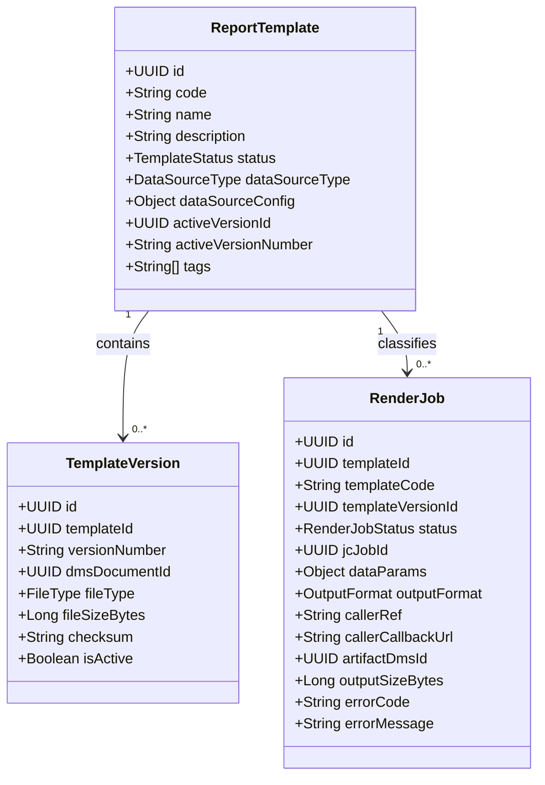
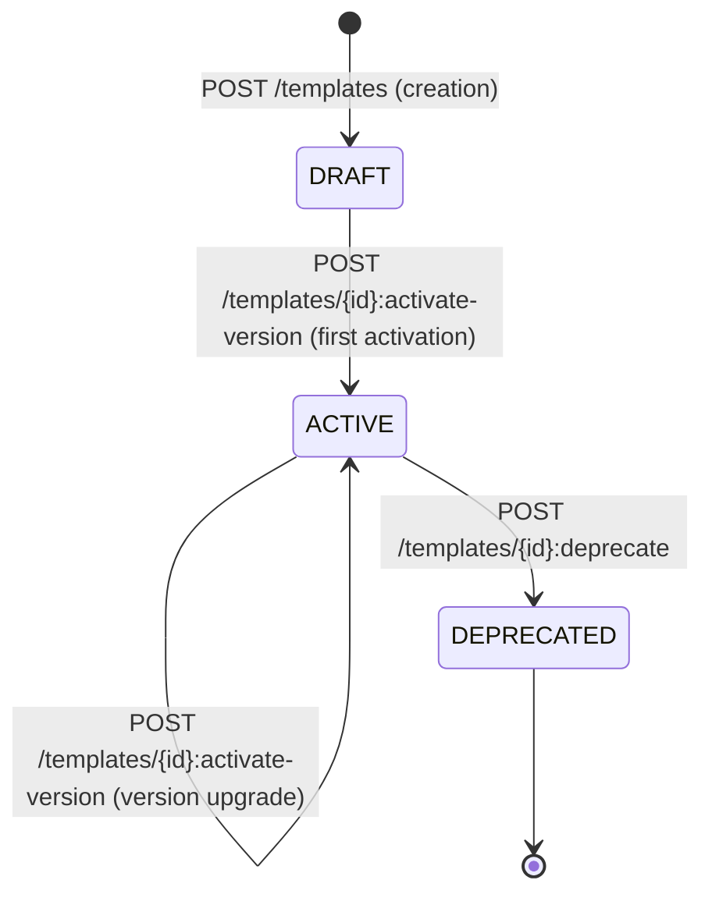
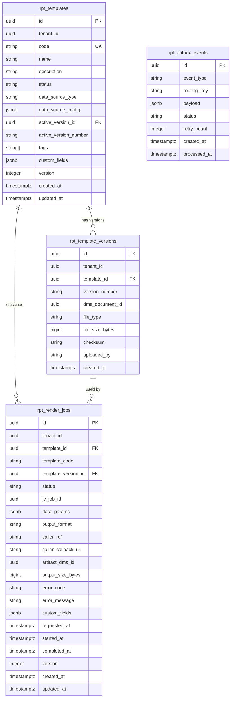

<!-- TEMPLATE COMPLIANCE: ~95%
Template: domain-service-spec.md v1.0.0
Present sections: §0–§15
Gaps: §5.3 process flow diagrams (stub), §12.7 extension API endpoints (stub)
-->

# tech.rpt — Report Generation Service Domain Specification

> **Conceptual Stack Layer:** Domain / Service
> **Space:** Platform
> **Owner:** Platform Infrastructure Team
> **Schema alignment:** `service-layer.schema.json`
> **Companion files:** `contracts/http/tech/rpt/openapi.yaml`, `contracts/events/tech/rpt/*.schema.json`
> **Referenced by:** Platform-Feature Specs (F-TECH-002-xx), BFF Contract
> **Belongs to:** Tech Suite Spec (`T1_Platform/tech/_tech_suite.md`)

> **Meta Information**
> - **Version:** 2026-04-03
> - **Template:** `domain-service-spec.md` v1.0.0
> - **Template Compliance:** ~95% — remaining gaps: §5.3 process flow diagrams (stub), §12.7 extension API endpoints (stub)
> - **Author(s):** OpenLeap Architecture Team
> - **Status:** DRAFT
> - **Suite:** `tech` (Technical Infrastructure)
> - **Domain:** `rpt` (Report Generation)
> - **Bounded Context Ref:** `bc:report-generation`
> - **Service ID:** `tech-rpt-svc`
> - **basePackage:** `io.openleap.tech.rpt`
> - **API Base Path:** `/api/tech/rpt/v1`
> - **Deprecated alias:** `/api/t1/rpt/v1` (ADR-TECH-004, 6-month transition)
> - **OpenLeap Starter Version:** `v3.0.0`
> - **Port:** `8097` (see Q-RPT-001)
> - **Repository:** `https://github.com/openleap-io/io.openleap.tech.rpt`
> - **Tags:** `tech`, `rpt`, `platform`, `report`, `jasper`, `pdf`, `rendering`
> - **Team:**
>   - Name: `team-tech`
>   - Email: `platform-infra@openleap.io`
>   - Slack: `#platform-infra`

---

## Specification Guidelines Compliance

> ### Non-Negotiables
> - Never invent facts. If required info is missing, add an **OPEN QUESTION** entry.
> - Preserve intent and decisions. Only change meaning when explicitly requested.
> - Do not remove normative constraints unless they are explicitly replaced.
> - Keep the spec **self-contained**: no "see chat", no implicit context.
>
> ### Source of Truth Priority
> When sources conflict:
> 1. Spec (explicit) wins
> 2. Starter specs (implementation constraints) next
> 3. Guidelines (best practices) last
>
> Record conflicts in the **Decisions & Conflicts** section (see Section 14).
>
> ### Style Guide
> - Prefer short sentences and lists.
> - Use MUST/SHOULD/MAY for normative statements.
> - Keep terminology consistent (Aggregate, Domain Service, Application Service, Command, Event).
> - Avoid ambiguous words ("often", "maybe") unless explicitly noting uncertainty.
> - Keep examples minimal and clearly marked as examples.
> - Do not add implementation code unless the chapter explicitly requires it.

---

## 0. Document Purpose & Scope

### 0.1 Purpose

The Report Generation Service (RPT) provides centralized Jasper-based report template management and asynchronous PDF rendering for the entire OpenLeap ERP platform. It maintains a versioned catalog of Jasper report templates (JRXML/JASPER files) stored in the Document Management Service, and accepts render requests that are dispatched asynchronously through the Job Control Service. Callers receive completed PDF artifacts as DMS document references. No business domain needs to embed a Jasper engine or manage report file storage independently.

### 0.2 Target Audience

- Platform Engineers maintaining infrastructure-level rendering services
- Platform Infrastructure Team owning this service
- Domain Service Teams (from T2–T4) that request report rendering via RPT
- Platform Administrators managing the report template catalog
- DevOps teams configuring the Jasper runner and DMS integration
- Compliance teams requiring audit trails for report generation activity

### 0.3 Scope

**In Scope:**
- ReportTemplate catalog: creation, metadata management, version uploads, activation and deprecation
- TemplateVersion management: JRXML/JASPER file upload (stored in DMS), version lifecycle
- Asynchronous render job submission, dispatch via JC, and lifecycle tracking
- Render output persistence: rendered PDF stored in DMS; artifact reference returned to caller
- Published lifecycle events: template.created, template.activated, render.requested, render.completed, render.failed
- Caller notification: optional callback URL for render completion notification
- GDPR tenant purge: delete all template and render job data on `iam.tenant.deleted`

**Out of Scope:**
- Jasper engine execution — delegated to a registered Report Runner via `tech-jc-svc`
- Binary file storage — delegated to `tech-dms-svc`
- Cron-scheduled report runs — callers own their own trigger schedules (see Q-RPT-002)
- Business-domain report data collection — each domain service provides parameters and data source credentials
- Report delivery (email, portal) — delegate to `tech-nfs-svc` or calling domain
- BI/analytics dashboards — owned by T4 Analytics suite

### 0.4 Related Documents

- `T1_Platform/tech/_tech_suite.md` — Tech Suite Architecture Specification
- `T1_Platform/iam/domain-specs/iam_tenant-spec.md` — Tenant Management (source of `iam.tenant.deleted` event)
- `T1_Platform/iam/domain-specs/iam_audit-spec.md` — Audit Service (consumes RPT events)
- `T1_Platform/tech/domain-specs/tech_dms-spec.md` — Document Management Service (template file storage + output storage)
- `T1_Platform/tech/domain-specs/tech_jc-spec.md` — Job Control Service (render job execution)
- `T1_Platform/tech/domain-specs/tech_nfs-spec.md` — News Feed Service (downstream consumer)
- `T1_Platform/tech/features/leaves/F-TECH-002-01/feature-spec.md` — Browse Report Templates
- `T1_Platform/tech/features/leaves/F-TECH-002-02/feature-spec.md` — Manage Report Templates
- `T1_Platform/tech/features/leaves/F-TECH-002-03/feature-spec.md` — Render History
- `contracts/http/tech/rpt/openapi.yaml` — REST API contract
- `contracts/events/tech/rpt/` — Event schema contracts

---

## 1. Business Context

### 1.1 Domain Purpose

The Report Generation domain solves a fragmentation problem inherent in distributed ERP systems: every domain that produces printable output (invoices, delivery notes, payslips, financial statements) needs a Jasper engine, template management, and async rendering infrastructure. Without a shared service, each domain would embed its own renderer, maintain its own template file store, and implement its own job queue — leading to dozens of incompatible rendering stacks, duplicated operational burden, and inconsistent PDF output quality.

RPT provides a single authoritative platform service that owns the Jasper template catalog and the rendering pipeline. Business domains register templates once, then submit lightweight render requests with data parameters. The platform handles execution, storage of output artifacts, and failure recovery transparently.

### 1.2 Business Value

- **Consistent output quality:** All PDFs produced on the platform use the same Jasper engine version and output pipeline — no per-domain renderer drift.
- **Centralized template governance:** Platform administrators control which template versions are active; templates cannot diverge silently across deployments.
- **Operational transparency:** Platform operators see all render activity in one admin view (F-TECH-002-03), enabling rapid diagnosis of rendering failures.
- **Caller decoupling:** Domain services submit render requests by template code; RPT resolves the active version and dispatches to the runner. Template upgrades are transparent to callers.
- **SAP parity:** Replaces SAP Adobe Document Services (ADS) / Smart Forms (`SSFCOMP`, `SSF_FUNCTION_MODULE_NAME` transactions) and SAP SAPscript form management as the platform's centralized document rendering infrastructure.
- **Runner elasticity:** The Jasper render runner is a registered JC runner — it can be scaled independently of RPT and swapped without touching business code.

### 1.3 Key Stakeholders

| Role | Responsibility | Primary Use Cases |
|------|----------------|-------------------|
| Platform Infrastructure Team | Owns and operates RPT; manages template catalog | All operational concerns |
| Platform Administrator | Uploads template versions, activates templates, reviews render history | UC-RPT-001 through UC-RPT-010 |
| Domain Service Team | Submits render jobs by template code; consumes completion events | UC-RPT-007, UC-RPT-009 |
| Report Designer | Authors JRXML templates for upload by administrator | Indirectly — via template upload workflow |
| Compliance / Audit | Reviews render audit trails for regulatory purposes | Consumes published events |

### 1.4 Strategic Positioning

The Report Generation Service is a **T1 Platform Foundation** service (ADR-001, four-tier layering). It depends only on other T1 platform services (DMS for storage, JC for job dispatch, IAM for tenant context). Business domains (T2–T4) call RPT to render documents; they do not render documents independently. RPT has no dependency on any T2–T4 service.

RPT is the platform's equivalent of SAP's centralized form and output management: SAP ADS manages form templates; RPT manages Jasper templates. SAP SAPscript/Smart Forms produce spool output; RPT produces DMS-stored PDF artifacts.

### 1.5 Service Context

| Property | Value |
|----------|-------|
| **Suite** | `tech` |
| **Domain** | `rpt` |
| **Bounded Context** | `bc:report-generation` |
| **Service ID** | `tech-rpt-svc` |
| **Base Package** | `io.openleap.tech.rpt` |

**Responsibilities:**
- Maintain a versioned catalog of Jasper report templates (JRXML/JASPER files stored in DMS)
- Accept render requests, validate template and parameter references, and submit render jobs to JC
- Track render job lifecycle from submission through completion or failure
- Emit lifecycle events for templates and render jobs
- Notify callers of render completion via optional callback URL
- Enforce per-tenant data isolation (RLS)
- Purge all tenant data on `iam.tenant.deleted`

**Authoritative Sources:**
| Source Type | Description | Access Pattern |
|-------------|-------------|----------------|
| REST API | Template catalog, template version uploads, render job submissions and history | Synchronous |
| Database | All ReportTemplate, TemplateVersion, RenderJob, and outbox records | Direct (owner) |
| Events | Template lifecycle events and render job completion/failure events | Asynchronous |

```mermaid
graph TB
    subgraph "Upstream Domains"
        IAM[iam-tenant-svc]
        DMS[tech-dms-svc]
        JC[tech-jc-svc]
    end

    subgraph "tech-rpt-svc"
        RPT[Report Generation]
    end

    subgraph "Callers"
        FI[fi-* services]
        SD[sd-* services]
        HR[hr-* services]
        BIZ[Other T2/T3 services]
    end

    subgraph "Downstream Domains"
        AUD[iam-audit-svc]
        NFS[tech-nfs-svc]
    end

    subgraph "External"
        JRUN[Jasper Report Runner]
    end

    IAM -->|iam.tenant.deleted| RPT
    RPT -->|store JRXML/JASPER files| DMS
    RPT -->|POST /jobs (pdf-render)| JC
    JC -->|dispatch callback| JRUN
    JRUN -->|fetch template from DMS| DMS
    JRUN -->|store PDF artifact in DMS| DMS
    JRUN -->|status callback| JC
    JC -->|render.completed callback| RPT
    FI -->|POST /renders| RPT
    SD -->|POST /renders| RPT
    HR -->|POST /renders| RPT
    BIZ -->|POST /renders| RPT
    RPT -->|rpt.* events| AUD
    RPT -->|rpt.* events| NFS
```

---

## 2. Service Identity

| Property | Value | Schema Field |
|----------|-------|-------------|
| **Service ID** | `tech-rpt-svc` | `metadata.id` |
| **Display Name** | `Report Generation Service` | `metadata.name` |
| **Suite** | `tech` | `metadata.suite` |
| **Domain** | `rpt` | `metadata.domain` |
| **Bounded Context** | `bc:report-generation` | `metadata.bounded_context_ref` |
| **Version** | `1.0.0` | `metadata.version` |
| **Status** | DRAFT | `metadata.status` |
| **API Base Path** | `/api/tech/rpt/v1` | `metadata.api_base_path` |
| **Repository** | `https://github.com/openleap-io/io.openleap.tech.rpt` | `metadata.repository` |
| **Tags** | `tech`, `rpt`, `platform`, `jasper`, `pdf`, `rendering` | `metadata.tags` |

**Team:**
| Property | Value |
|----------|-------|
| **Name** | `team-tech` |
| **Email** | `platform-infra@openleap.io` |
| **Slack Channel** | `#platform-infra` |

---

## 3. Domain Model

### 3.1 Conceptual Overview

The Report Generation domain has two aggregates. **ReportTemplate** represents a report definition — it holds metadata (code, name, data source binding) and owns a versioned collection of Jasper file uploads (`TemplateVersion`). At most one version is active at any time; activation is an explicit lifecycle operation. **RenderJob** represents a single PDF rendering request: a caller submits a job with a template code and data parameters; RPT resolves the active template version, dispatches the job to JC (via the `pdf-render` job type), tracks the asynchronous lifecycle, and records the output DMS reference on completion.

The two aggregates are loosely coupled: `RenderJob` holds a snapshot of the `templateId` and `templateVersionId` at submission time so that historical render jobs remain traceable even if the template is later deprecated.

### 3.2 Core Concepts



### 3.3 Aggregate Definitions

#### 3.3.1 ReportTemplate

| Property | Value |
|----------|-------|
| **Aggregate ID** | `agg:report-template` |
| **Name** | `ReportTemplate` |

**Business Purpose:**
Represents a named Jasper report definition with its full version history. Each template is identified by a unique machine-readable `code` (e.g., `invoice-de`, `delivery-note-en`). Only the `ACTIVE` version is used for new render jobs. The template holds data source binding configuration that the Jasper runner uses to populate the report with live data.

##### Aggregate Root

**Key Attributes:**
| Attribute | Type | Format | Description | Constraints | Required | Read-Only |
|-----------|------|--------|-------------|-------------|----------|-----------|
| id | string | uuid | Unique system identifier. Generated by `OlUuid.create()`. | Immutable | Yes | Yes |
| tenantId | string | uuid | Tenant ownership for RLS enforcement. | Immutable | Yes | Yes |
| code | string | — | Machine-readable unique template identifier (e.g., `invoice-de`, `payslip-en`). Used by callers to reference templates without knowing the UUID. | Pattern: `^[a-z0-9-]+$`; max 64 chars; unique per tenant | Yes | No |
| name | string | — | Human-readable display name shown in admin UI. | max 255 chars | Yes | No |
| description | string | — | Business description of what this template produces. | max 2000 chars | No | No |
| status | string | — | Current lifecycle state of the template. | enum_ref: `TemplateStatus` | Yes | Yes |
| dataSourceType | string | — | How the Jasper runner fetches report data. | enum_ref: `DataSourceType` | Yes | No |
| dataSourceConfig | object | — | Connection configuration for the data source. Structure depends on `dataSourceType`. For JDBC: `{jdbcUrl, username, password}`. For HTTP: `{baseUrl, authHeader}`. | Valid per `dataSourceType` schema | Yes | No |
| activeVersionId | string | uuid | ID of the currently active TemplateVersion. Null until first activation. | FK: TemplateVersion.id | No | Yes |
| activeVersionNumber | string | — | Denormalized version number of the active version for display without join. | max 32 chars | No | Yes |
| tags | array | — | Free-form tags for categorisation and filtering (e.g., `["finance","invoice","de"]`). | max 20 items; each max 64 chars | No | No |
| version | integer | int32 | Optimistic locking version counter. | min: 0 | Yes | Yes |
| createdAt | string | date-time | Record creation timestamp. | — | Yes | Yes |
| updatedAt | string | date-time | Record last-modification timestamp. | — | Yes | Yes |

**Lifecycle States:**

| Property | Value |
|----------|-------|
| **Initial State** | `DRAFT` |
| **Terminal States** | `DEPRECATED` |



**State Descriptions:**
| State | Description | Business Meaning |
|-------|-------------|------------------|
| `DRAFT` | Template created but no version activated yet | Cannot be used for render jobs |
| `ACTIVE` | Template has an active version | Available for render job submission |
| `DEPRECATED` | Template scheduled for removal | New render jobs rejected; historical jobs retain reference |

**Allowed Transitions:**
| From State | To State | Trigger | Guard / Business Preconditions |
|------------|----------|---------|-------------------------------|
| — | `DRAFT` | `POST /templates` | code unique per tenant |
| `DRAFT` | `ACTIVE` | `POST /templates/{id}:activate-version` | At least one TemplateVersion uploaded |
| `ACTIVE` | `ACTIVE` | `POST /templates/{id}:activate-version` | New version uploaded; previous version deactivated automatically |
| `ACTIVE` | `DEPRECATED` | `POST /templates/{id}:deprecate` | No PENDING or RUNNING render jobs for this template (see Q-RPT-003) |

**Invariants:**
| Rule ID | Description |
|---------|-------------|
| BR-RPT-001 | Template code must be unique per tenant |
| BR-RPT-002 | Only ACTIVE templates may be used for new render job submissions |
| BR-RPT-004 | At most one TemplateVersion may be active at any time per template |

**Domain Events Emitted:**
- `tech.rpt.template.created`
- `tech.rpt.template.activated`

---

##### Child Entities

###### Entity: TemplateVersion

| Property | Value |
|----------|-------|
| **Entity ID** | `ent:template-version` |
| **Name** | `TemplateVersion` |
| **Relationship to Root** | one_to_many |

**Business Purpose:**
Stores an immutable snapshot of a Jasper template file upload. Each upload creates a new version; versions are never overwritten (comparable to SAP Smart Forms version management). The platform administrator explicitly activates a version to make it the one used for new render jobs. Previous versions are retained for historical render job traceability.

**Attributes:**
| Attribute | Type | Format | Description | Constraints | Required |
|-----------|------|--------|-------------|-------------|----------|
| id | string | uuid | Unique system identifier. | Immutable | Yes |
| templateId | string | uuid | Parent template. | FK: ReportTemplate.id; Immutable | Yes |
| versionNumber | string | — | Sequential version label (e.g., `1.0`, `1.1`, `2.0`). Auto-incremented by service. | Pattern: `^[0-9]+\.[0-9]+$`; max 16 chars; unique per templateId | Yes |
| dmsDocumentId | string | uuid | Reference to the DMS document storing the JRXML/JASPER binary. | FK: tech-dms-svc Document.id; Immutable | Yes |
| fileType | string | — | Jasper file format of the uploaded template. | enum_ref: `FileType` | Yes |
| fileSizeBytes | integer | int64 | Size of the uploaded file in bytes. | min: 1 | Yes |
| checksum | string | — | SHA-256 hex digest of the uploaded file for integrity verification. | 64 hex chars | Yes |
| isActive | boolean | — | Derived flag: true if this version is the parent's `activeVersionId`. Not stored; computed on read. | — | Yes |
| uploadedBy | string | — | User ID (from IAM) who uploaded this version. | max 255 chars | Yes |
| createdAt | string | date-time | Upload timestamp. | — | Yes |

**Collection Constraints:**
- Minimum items: 0 (template starts with no versions)
- Maximum items: 100 per ReportTemplate (see Q-RPT-004)

**Invariants:**
| Rule ID | Description |
|---------|-------------|
| BR-RPT-003 | Active TemplateVersion MUST NOT be deleted |
| BR-RPT-005 | TemplateVersion.checksum MUST match the SHA-256 of the stored DMS document |

---

#### 3.3.2 RenderJob

| Property | Value |
|----------|-------|
| **Aggregate ID** | `agg:render-job` |
| **Name** | `RenderJob` |

**Business Purpose:**
Represents a single PDF rendering request submitted by a caller. RPT validates the template reference, snapshots the active version, and dispatches the job to `tech-jc-svc` via the `pdf-render` job type. The job tracks the full asynchronous lifecycle: from PENDING dispatch through runner execution to COMPLETED (with artifact reference) or FAILED (with error code). Callers may optionally provide a callback URL to receive a HTTP POST notification on completion.

##### Aggregate Root

**Key Attributes:**
| Attribute | Type | Format | Description | Constraints | Required | Read-Only |
|-----------|------|--------|-------------|-------------|----------|-----------|
| id | string | uuid | Unique system identifier. Generated by `OlUuid.create()`. | Immutable | Yes | Yes |
| tenantId | string | uuid | Tenant ownership for RLS enforcement. | Immutable | Yes | Yes |
| templateId | string | uuid | Snapshot of the ReportTemplate ID at submission time. | FK: ReportTemplate.id; Immutable | Yes | Yes |
| templateCode | string | — | Denormalized template code for display without join. | Immutable | Yes | Yes |
| templateVersionId | string | uuid | Snapshot of the active TemplateVersion ID at submission time. | FK: TemplateVersion.id; Immutable | Yes | Yes |
| status | string | — | Current lifecycle state. | enum_ref: `RenderJobStatus` | Yes | Yes |
| jcJobId | string | uuid | ID of the corresponding job in `tech-jc-svc`. Set when dispatched. | FK: tech-jc-svc Job.id | No | Yes |
| dataParams | object | — | Data parameters passed to the Jasper runner for report data population (query parameters, filter values, locale, etc.). | Valid JSON object | No | Yes |
| outputFormat | string | — | Desired output format. Currently only PDF is supported. | enum_ref: `OutputFormat`; default: `PDF` | Yes | Yes |
| callerRef | string | — | Optional opaque reference provided by the caller for correlation (e.g., invoice ID, order number). | max 255 chars | No | Yes |
| callerCallbackUrl | string | uri | Optional HTTP endpoint where RPT POSTs a completion notification when the job finishes or fails. | max 2048 chars | No | Yes |
| artifactDmsId | string | uuid | DMS document ID of the rendered PDF output. Set when status = COMPLETED. | FK: tech-dms-svc Document.id | No | Yes |
| outputSizeBytes | integer | int64 | Size of the rendered PDF in bytes. Set when status = COMPLETED. | min: 0 | No | Yes |
| errorCode | string | — | Machine-readable error code returned by the runner on FAILED. | max 64 chars | No | Yes |
| errorMessage | string | — | Human-readable error description. | max 4000 chars | No | Yes |
| requestedAt | string | date-time | Timestamp when RPT submitted the job to JC. | — | No | Yes |
| startedAt | string | date-time | Timestamp of first RUNNING status callback from runner via JC. | — | No | Yes |
| completedAt | string | date-time | Timestamp of COMPLETED, FAILED, or CANCELLED transition. | — | No | Yes |
| version | integer | int32 | Optimistic locking version counter. | min: 0 | Yes | Yes |
| createdAt | string | date-time | Record creation timestamp (when caller submitted POST /renders). | — | Yes | Yes |
| updatedAt | string | date-time | Record last-modification timestamp. | — | Yes | Yes |

**Lifecycle States:**

| Property | Value |
|----------|-------|
| **Initial State** | `PENDING` |
| **Terminal States** | `COMPLETED`, `FAILED`, `CANCELLED` |

```mermaid
stateDiagram-v2
    [*] --> PENDING : POST /renders (validation passed)
    PENDING --> RUNNING : JC callback (status=running)
    PENDING --> FAILED : JC dispatch failure / JC runner timeout
    RUNNING --> COMPLETED : JC callback (status=completed; artifactDmsId set)
    RUNNING --> FAILED : JC callback (status=failed; errorCode set)
    PENDING --> CANCELLED : POST /renders/{id}:cancel
    RUNNING --> CANCELLED : POST /renders/{id}:cancel (best-effort)
```



**State Descriptions:**
| State | Description | Business Meaning |
|-------|-------------|------------------|
| `PENDING` | Job submitted to JC; waiting for runner to pick it up | Normal waiting state |
| `RUNNING` | Runner has acknowledged and is rendering the PDF | Render in progress |
| `COMPLETED` | PDF rendered successfully; `artifactDmsId` set | Output available for download via DMS |
| `FAILED` | Rendering failed; `errorCode` and `errorMessage` set | Caller must investigate and resubmit |
| `CANCELLED` | Job cancelled by caller before completion | No output produced |

**Allowed Transitions:**
| From State | To State | Trigger | Guard / Business Preconditions |
|------------|----------|---------|-------------------------------|
| — | `PENDING` | `POST /renders` | Template ACTIVE; valid dataParams |
| `PENDING` | `RUNNING` | JC job callback (status=running) | Valid `jcJobId` |
| `PENDING` | `FAILED` | JC dispatch failure or timeout | JC returns error |
| `RUNNING` | `COMPLETED` | JC job callback (status=completed) | `artifactDmsId` present in callback payload |
| `RUNNING` | `FAILED` | JC job callback (status=failed) | `errorCode` present |
| `PENDING` or `RUNNING` | `CANCELLED` | `POST /renders/{id}:cancel` | Job not already in terminal state |

**Invariants:**
| Rule ID | Description |
|---------|-------------|
| BR-RPT-002 | RenderJob MUST reference an ACTIVE template at submission time |
| BR-RPT-006 | `dataParams`, `templateId`, `templateVersionId` are immutable after submission |
| BR-RPT-007 | COMPLETED and FAILED are terminal states; no further transitions |

**Domain Events Emitted:**
- `tech.rpt.render.requested` (on PENDING → JC dispatch)
- `tech.rpt.render.completed` (on RUNNING → COMPLETED)
- `tech.rpt.render.failed` (on PENDING/RUNNING → FAILED)

---

### 3.4 Enumerations

#### TemplateStatus

| Value | Description | Deprecated |
|-------|-------------|------------|
| `DRAFT` | Template created; no version activated yet. Cannot be used for rendering. | No |
| `ACTIVE` | Template has an active version and is ready for render job submissions. | No |
| `DEPRECATED` | Template is no longer recommended for new use. New render submissions are rejected. Historical jobs retain the reference. | No |

#### DataSourceType

| Value | Description | Deprecated |
|-------|-------------|------------|
| `JDBC` | Jasper runner connects directly to a database via JDBC to populate report data. The runner uses credentials in `dataSourceConfig.jdbcUrl`. | No |
| `HTTP` | Jasper runner calls a REST endpoint to fetch report data as JSON. The runner uses `dataSourceConfig.baseUrl` with bearer authentication. | No |

#### FileType

| Value | Description | Deprecated |
|-------|-------------|------------|
| `JRXML` | Uncompiled Jasper template in XML source format. The Jasper runner compiles on first use and caches the compiled form. | No |
| `JASPER` | Pre-compiled Jasper template binary. Faster to render; version-locked to the Jasper library version on the runner. | No |

#### RenderJobStatus

| Value | Description | Deprecated |
|-------|-------------|------------|
| `PENDING` | Job submitted to JC; awaiting runner pickup. | No |
| `RUNNING` | Runner has acknowledged and is actively rendering. | No |
| `COMPLETED` | Rendering succeeded. PDF artifact available in DMS. | No |
| `FAILED` | Rendering failed. Error details in `errorCode` / `errorMessage`. | No |
| `CANCELLED` | Cancelled by caller. No output produced. | No |

#### OutputFormat

| Value | Description | Deprecated |
|-------|-------------|------------|
| `PDF` | PDF/A-compliant output suitable for archiving and printing. The only supported format in v1.0.0. | No |

---

### 3.5 Shared Types

#### DataSourceConfig

A value object embedded in `ReportTemplate.dataSourceConfig`. Its structure varies by `DataSourceType`.

**JDBC variant:**
| Attribute | Type | Format | Description | Validation |
|-----------|------|--------|-------------|------------|
| jdbcUrl | string | uri | JDBC connection URL (e.g., `jdbc:postgresql://db:5432/erp`). | Required; max 2048 chars |
| username | string | — | Database user for read access. | Required; max 128 chars |
| password | string | — | Database password (stored encrypted at rest). | Required; max 512 chars |
| schema | string | — | Optional database schema to use. | max 128 chars |

**HTTP variant:**
| Attribute | Type | Format | Description | Validation |
|-----------|------|--------|-------------|------------|
| baseUrl | string | uri | Base URL of the data REST endpoint (e.g., `https://api.internal/...`). | Required; max 2048 chars |
| authHeader | string | — | Bearer token or Basic auth header value. Stored encrypted. | Required; max 512 chars |
| timeoutSeconds | integer | int32 | HTTP read timeout for data fetch. | min: 5; max: 300; default: 60 |

**Validation Rules:**
- The `dataSourceConfig` object MUST conform to the schema for the declared `dataSourceType`.
- JDBC credentials are stored encrypted using the platform's secrets management facility.
- HTTP `authHeader` values are redacted in API responses (returned as `"***"`).

**Used By:** `ReportTemplate`

---

## 4. Business Rules

### 4.1 Business Rules Catalog

| Rule ID | Name | Aggregates | Category |
|---------|------|------------|----------|
| BR-RPT-001 | Unique template code per tenant | ReportTemplate | Uniqueness |
| BR-RPT-002 | Only ACTIVE templates accepted for rendering | ReportTemplate, RenderJob | State |
| BR-RPT-003 | Active version MUST NOT be deleted | TemplateVersion | Integrity |
| BR-RPT-004 | At most one active version per template | ReportTemplate, TemplateVersion | Integrity |
| BR-RPT-005 | TemplateVersion checksum must match DMS content | TemplateVersion | Data integrity |
| BR-RPT-006 | RenderJob submission fields are immutable | RenderJob | Immutability |
| BR-RPT-007 | COMPLETED and FAILED are terminal states | RenderJob | State |
| BR-RPT-008 | Tenant purge: delete all data on iam.tenant.deleted | All | Compliance |

### 4.2 Detailed Rule Definitions

#### BR-RPT-001: Unique Template Code Per Tenant

**Business Context:** Template codes are used by callers to reference templates without knowing UUIDs. Duplicate codes would cause non-deterministic routing and incorrect report output.

**Rule Statement:** Within a tenant, no two `ReportTemplate` records may share the same `code` value.

**Applies To:**
- Aggregate: `ReportTemplate`
- Operations: Create, Update (code field)

**Enforcement:** Unique constraint on `(tenant_id, code)` in `rpt_templates` table; application-level pre-check returns a domain error before hitting the DB constraint.

**Validation Logic:** On `POST /templates` and `PUT /templates/{id}` (code change): query `rpt_templates WHERE tenant_id = :tenantId AND code = :code AND id != :id`. If a row exists, reject.

**Error Handling:**
- **Error Code:** `RPT_TEMPLATE_CODE_DUPLICATE`
- **Error Message:** `"Template code '{code}' is already in use within this tenant."`
- **User action:** Choose a different, unique code value.

**Examples:**
- **Valid:** Creating `invoice-de` when only `invoice-en` exists in the tenant.
- **Invalid:** Creating a second template with code `invoice-de` when one already exists.

---

#### BR-RPT-002: Only ACTIVE Templates Accepted for Rendering

**Business Context:** DRAFT templates have no verified active version. DEPRECATED templates are intentionally retired. Allowing render jobs against non-ACTIVE templates would produce unexpected or empty outputs.

**Rule Statement:** A `RenderJob` MUST NOT be created for a template in `DRAFT` or `DEPRECATED` state.

**Applies To:**
- Aggregate: `RenderJob`
- Operations: Create

**Enforcement:** Application service checks `ReportTemplate.status == ACTIVE` before creating the `RenderJob` record or dispatching to JC.

**Validation Logic:** On `POST /renders`: resolve template by `templateCode` (or `templateId`) and check `status == ACTIVE`. If not, reject.

**Error Handling:**
- **Error Code:** `RPT_TEMPLATE_NOT_ACTIVE`
- **Error Message:** `"Template '{code}' is not in ACTIVE state and cannot be used for rendering."`
- **User action:** Activate a template version before submitting render jobs, or use a different template.

**Examples:**
- **Valid:** Submitting a render job for template `invoice-de` with status `ACTIVE`.
- **Invalid:** Submitting a render job for template `invoice-de` with status `DEPRECATED`.

---

#### BR-RPT-003: Active Version MUST NOT Be Deleted

**Business Context:** Deleting the active version would leave the template in an inconsistent state — marked ACTIVE but with no renderable file.

**Rule Statement:** A `TemplateVersion` that is currently referenced by its parent's `activeVersionId` MUST NOT be deleted.

**Applies To:**
- Aggregate: `TemplateVersion`
- Operations: Delete

**Enforcement:** Application service checks `TemplateVersion.isActive == false` before allowing deletion.

**Validation Logic:** On version delete: check `rpt_templates WHERE active_version_id = :versionId`. If a row exists, reject.

**Error Handling:**
- **Error Code:** `RPT_VERSION_ACTIVE_DELETE_REJECTED`
- **Error Message:** `"Cannot delete template version '{versionNumber}' because it is the currently active version. Activate a different version first."`
- **User action:** Activate another version, then delete the old one.

---

#### BR-RPT-004: At Most One Active Version Per Template

**Business Context:** Multiple simultaneously active versions would create ambiguity about which file is used for rendering.

**Rule Statement:** When a new `TemplateVersion` is activated, any previously active version for the same template is automatically deactivated.

**Applies To:**
- Aggregate: `ReportTemplate`, `TemplateVersion`
- Operations: Activate version

**Enforcement:** The activate-version operation is executed in a single database transaction: set `rpt_templates.active_version_id = :newVersionId` and `active_version_number = :versionNumber` atomically.

---

#### BR-RPT-006: RenderJob Submission Fields Are Immutable

**Business Context:** Render jobs are dispatched asynchronously. Changing parameters mid-flight would corrupt the in-progress render and break audit traceability.

**Rule Statement:** `templateId`, `templateVersionId`, `dataParams`, `outputFormat`, `callerRef`, and `callerCallbackUrl` MUST NOT be changed after a `RenderJob` is created.

**Applies To:**
- Aggregate: `RenderJob`
- Operations: Update (any field listed above)

**Enforcement:** These fields are not exposed in any PUT/PATCH endpoint. Status updates are applied exclusively via internal callbacks from JC.

---

#### BR-RPT-007: COMPLETED and FAILED Are Terminal States

**Business Context:** A completed render job has a finalized artifact in DMS. A failed job has recorded its error. Allowing state changes after termination would corrupt audit history.

**Rule Statement:** A `RenderJob` in `COMPLETED` or `FAILED` state MUST NOT transition to any other state.

**Applies To:**
- Aggregate: `RenderJob`
- Operations: All state transition triggers (cancel, JC callback)

**Enforcement:** State machine guard in the domain layer rejects transitions from terminal states.

**Error Handling:**
- **Error Code:** `RPT_JOB_ALREADY_TERMINAL`
- **Error Message:** `"Render job '{id}' is already in terminal state '{status}' and cannot be modified."`

---

#### BR-RPT-008: Tenant Purge on iam.tenant.deleted

**Business Context:** GDPR compliance requires all personal data for a deleted tenant to be removed from the platform.

**Rule Statement:** On receipt of the `iam.tenant.deleted` event, all `rpt_templates`, `rpt_template_versions`, `rpt_render_jobs`, and `rpt_outbox_events` rows for that tenant MUST be deleted.

**Applies To:**
- Aggregate: All
- Operations: Consumed event handler

**Enforcement:** Event consumer `IamTenantDeletedHandler` executes a cascading delete within a single transaction.

---

### 4.3 Data Validation Rules

**Field-Level Validations:**

| Field | Validation Rule | Error Message |
|-------|-----------------|---------------|
| ReportTemplate.code | Required; Pattern `^[a-z0-9-]+$`; max 64 chars | `"Template code must match pattern ^[a-z0-9-]+$ and be at most 64 characters"` |
| ReportTemplate.name | Required; max 255 chars | `"Template name is required and must be at most 255 characters"` |
| ReportTemplate.dataSourceType | Required; valid enum value | `"dataSourceType must be one of: JDBC, HTTP"` |
| ReportTemplate.dataSourceConfig | Required; valid per dataSourceType schema | `"dataSourceConfig is invalid for the declared dataSourceType"` |
| TemplateVersion.fileType | Required; valid enum value | `"fileType must be one of: JRXML, JASPER"` |
| RenderJob.outputFormat | Required; valid enum value | `"outputFormat must be one of: PDF"` |
| RenderJob.callerCallbackUrl | If present: valid URI, max 2048 chars | `"callerCallbackUrl must be a valid URI and at most 2048 characters"` |
| RenderJob.callerRef | If present: max 255 chars | `"callerRef must be at most 255 characters"` |

**Cross-Field Validations:**
- If `dataSourceType == JDBC`, then `dataSourceConfig.jdbcUrl` and `dataSourceConfig.username` and `dataSourceConfig.password` MUST all be present.
- If `dataSourceType == HTTP`, then `dataSourceConfig.baseUrl` and `dataSourceConfig.authHeader` MUST both be present.
- `dataParams` must be a valid JSON object; nested depth MUST NOT exceed 5 levels to prevent resource exhaustion.

### 4.4 Reference Data Dependencies

| Catalog | Source Service | Fields Referencing | Validation |
|---------|----------------|--------------------|------------|
| DMS documents | `tech-dms-svc` | `TemplateVersion.dmsDocumentId`, `RenderJob.artifactDmsId` | Referenced documents MUST exist in DMS (no local FK — cross-service reference) |
| JC jobs | `tech-jc-svc` | `RenderJob.jcJobId` | Referenced JC jobs MUST exist (set internally after dispatch) |
| IAM tenants | `iam-tenant-svc` | `tenantId` on all aggregates | Tenant must be active at record creation time |

---

## 5. Use Cases & Business Logic

### 5.1 Business Logic Placement

| Logic Type | Placement | Examples |
|------------|-----------|----------|
| Aggregate invariants | Domain Object | Code uniqueness check, state transition guards, terminal state enforcement |
| Template version activation | Domain Service | Deactivate old version, activate new version atomically |
| Render dispatch orchestration | Application Service | Resolve template → validate → create RenderJob → dispatch to JC → publish event |
| Callback processing | Application Service | Receive JC status callback → update RenderJob state → notify caller → publish event |
| Cross-tenant data isolation | Infrastructure (RLS) | PostgreSQL row-level security on `tenant_id` column |

### 5.2 Use Cases

#### Use Case Catalog

| UC ID | Name | Type | Primary Actor | Trigger |
|-------|------|------|---------------|---------|
| UC-RPT-001 | Create Report Template | WRITE | Platform Administrator | Admin uploads new template definition |
| UC-RPT-002 | Upload Template Version | WRITE | Platform Administrator | Admin uploads JRXML/JASPER file |
| UC-RPT-003 | Activate Template Version | WRITE | Platform Administrator | Admin selects version to activate |
| UC-RPT-004 | Update Template Metadata | WRITE | Platform Administrator | Admin edits name, description, tags |
| UC-RPT-005 | Deprecate Template | WRITE | Platform Administrator | Admin retires template |
| UC-RPT-006 | Browse Report Templates | READ | Platform Administrator | Admin opens template catalog (F-TECH-002-01) |
| UC-RPT-007 | Get Template Details | READ | Platform Administrator / Domain Service | Fetch template with version list |
| UC-RPT-008 | Submit Render Job | WRITE | Domain Service | Business event triggers document generation |
| UC-RPT-009 | Cancel Render Job | WRITE | Domain Service | Caller cancels pending render |
| UC-RPT-010 | Get Render Job Status | READ | Domain Service | Caller polls for completion |
| UC-RPT-011 | Browse Render History | READ | Platform Administrator | Admin reviews render activity (F-TECH-002-03) |

---

#### UC-RPT-001: Create Report Template

**Actor:** Platform Administrator

**Preconditions:**
- Administrator is authenticated with `PLATFORM_ADMIN` role
- Template code is unique within the tenant

**Main Flow:**
1. Administrator POSTs to `/api/tech/rpt/v1/templates` with code, name, dataSourceType, dataSourceConfig
2. System validates code uniqueness (BR-RPT-001) and config schema
3. System creates `ReportTemplate` record with status `DRAFT`
4. System publishes `tech.rpt.template.created` event via outbox

**Postconditions:**
- ReportTemplate exists in `DRAFT` state
- Event enqueued in outbox

**Business Rules Applied:**
- BR-RPT-001: code uniqueness

**Alternative Flows:**
- **Alt-1:** Duplicate code → return 409 Conflict with `RPT_TEMPLATE_CODE_DUPLICATE`

**Exception Flows:**
- **Exc-1:** Invalid `dataSourceConfig` schema → return 422 Unprocessable Entity

---

#### UC-RPT-002: Upload Template Version

**Actor:** Platform Administrator

**Preconditions:**
- Template exists (any status)
- File is a valid JRXML or JASPER binary (see Q-RPT-005 for validation depth)

**Main Flow:**
1. Administrator POSTs multipart/form-data to `/api/tech/rpt/v1/templates/{id}/versions` with file and fileType
2. System computes SHA-256 checksum of uploaded file
3. System stores file in DMS via `tech-dms-svc` (returns `dmsDocumentId`)
4. System creates `TemplateVersion` record with auto-incremented `versionNumber`
5. System returns the new version record

**Postconditions:**
- TemplateVersion record exists; file stored in DMS
- Template remains in its current lifecycle state (upload does not auto-activate)

**Business Rules Applied:**
- BR-RPT-005: checksum integrity

**Alternative Flows:**
- **Alt-1:** DMS upload fails → return 503 Service Unavailable with `RPT_DMS_UPLOAD_FAILED`

---

#### UC-RPT-003: Activate Template Version

**Actor:** Platform Administrator

**Preconditions:**
- Template exists
- Target TemplateVersion exists and belongs to the template
- Template is not already DEPRECATED

**Main Flow:**
1. Administrator POSTs to `/api/tech/rpt/v1/templates/{id}:activate-version` with `{ "versionId": "..." }`
2. System atomically sets `ReportTemplate.activeVersionId = versionId`, `activeVersionNumber = version.versionNumber`
3. If template was in `DRAFT` state, system transitions it to `ACTIVE`
4. System publishes `tech.rpt.template.activated` event via outbox

**Postconditions:**
- Template is in `ACTIVE` state
- Only the specified version is marked as active

**Business Rules Applied:**
- BR-RPT-004: at most one active version

---

#### UC-RPT-008: Submit Render Job

**Actor:** Domain Service (programmatic caller)

**Preconditions:**
- Template exists with status `ACTIVE`
- `dataParams` is a valid JSON object

**Main Flow:**
1. Caller POSTs to `/api/tech/rpt/v1/renders` with `templateCode`, `dataParams`, optional `callerRef` and `callerCallbackUrl`
2. System resolves template by `templateCode` and verifies status `ACTIVE` (BR-RPT-002)
3. System snapshots `templateId` and `activeVersionId` into the new `RenderJob` record (status `PENDING`)
4. System submits a JC job via `POST /api/tech/jc/v1/jobs` with job type slug `pdf-render` and field values `{ templateVersionId, dataParams, outputFormat }`
5. System stores returned `jcJobId` on the `RenderJob`
6. System publishes `tech.rpt.render.requested` event via outbox
7. System returns the created `RenderJob` with status `PENDING`

**Postconditions:**
- RenderJob exists with status `PENDING`
- JC job dispatched to Jasper runner
- Event enqueued in outbox

**Business Rules Applied:**
- BR-RPT-002: only ACTIVE templates
- BR-RPT-006: fields immutable after creation

**Alternative Flows:**
- **Alt-1:** Template in DRAFT or DEPRECATED state → 422 with `RPT_TEMPLATE_NOT_ACTIVE`
- **Alt-2:** JC dispatch fails → RenderJob transitions to FAILED; `tech.rpt.render.failed` published

**Exception Flows:**
- **Exc-1:** JC service unavailable → return 503; do not create RenderJob record (idempotency: caller may retry)

---

#### UC-RPT-010: Get Render Job Status

**Actor:** Domain Service (polling or post-callback verification)

**Preconditions:**
- RenderJob exists and belongs to the caller's tenant

**Main Flow:**
1. Caller GETs `/api/tech/rpt/v1/renders/{id}`
2. System returns current `RenderJob` with status, `artifactDmsId` (if COMPLETED), and error details (if FAILED)

**Postconditions:**
- Caller has current status; may proceed to download artifact via DMS if COMPLETED

**Alternative Flows:**
- **Alt-1:** Job not found → 404 Not Found
- **Alt-2:** Job belongs to different tenant → 404 Not Found (RLS)

---

### 5.3 Process Flow Diagrams

> OPEN QUESTION: See Q-RPT-006 in §14.3.

*Placeholder — full sequence diagrams (render submit → JC dispatch → runner callback → completion → caller notify) to be added in a follow-up upgrade once Q-RPT-006 is resolved.*

### 5.4 Cross-Domain Workflows

| Workflow | Pattern | Participating Services | Trigger |
|----------|---------|------------------------|---------|
| PDF Render Pipeline | Orchestration (RPT orchestrates JC) | `tech-rpt-svc` → `tech-jc-svc` → Jasper Runner → `tech-dms-svc` | `POST /renders` |
| Template File Storage | Synchronous delegation | `tech-rpt-svc` → `tech-dms-svc` | `POST /templates/{id}/versions` |
| Tenant Data Purge | Choreography (event-driven) | `iam-tenant-svc` → `tech-rpt-svc` | `iam.tenant.deleted` event |
| Render Completion Notification | Orchestration (RPT calls caller callback) | `tech-rpt-svc` → caller service | JC completion callback received |

**PDF Render Pipeline — Workflow Steps:**

| Step | Actor | Action | Success | Failure |
|------|-------|--------|---------|---------|
| 1 | Caller | `POST /renders` | RenderJob PENDING; JC job submitted | 422/503 returned to caller |
| 2 | JC | Dispatch to Jasper runner | JC job RUNNING; RPT receives running callback | JC timeout → FAILED |
| 3 | Jasper Runner | Fetch template from DMS | JRXML/JASPER file received | DMS unavailable → runner error |
| 4 | Jasper Runner | Render PDF with `dataParams` | PDF binary produced | Jasper engine error → `RPT_RENDER_JASPER_ERROR` |
| 5 | Jasper Runner | Store PDF in DMS | `artifactDmsId` returned | DMS write failure → runner error |
| 6 | Jasper Runner | POST completion callback to JC | JC job COMPLETED | Callback failure → JC retry |
| 7 | RPT (internal) | Receive JC completion event/callback | RenderJob COMPLETED; `artifactDmsId` persisted; `render.completed` published | — |
| 8 | RPT (internal) | POST `callerCallbackUrl` (if set) | Caller notified of completion and `artifactDmsId` | HTTP failure → logged; not retried (fire-and-forget) |

---

## 6. REST API

### 6.1 API Overview

| Resource | Operations | Endpoint |
|----------|-----------|---------|
| Templates | List, Create, Get, Update | `GET/POST /templates`, `GET/PUT /templates/{id}` |
| Template Versions | Upload | `POST /templates/{id}/versions` |
| Template Actions | Activate version, Deprecate | `POST /templates/{id}:activate-version`, `POST /templates/{id}:deprecate` |
| Render Jobs | List, Submit, Get | `GET/POST /renders`, `GET /renders/{id}` |
| Render Job Actions | Cancel | `POST /renders/{id}:cancel` |
| Callbacks | JC status update (internal) | `POST /renders/{id}/callbacks/jc-status` |

All paths prefixed with `/api/tech/rpt/v1`. Deprecated alias: `/api/t1/rpt/v1`.

### 6.2 Resource Operations

#### 6.2.1 Templates — List

```http
GET /api/tech/rpt/v1/templates?status=ACTIVE&tag=invoice&page=0&size=25
Authorization: Bearer {token}
```

**Success Response:** `200 OK`
```json
{
  "content": [
    {
      "id": "a1b2c3d4-0001-0000-0000-000000000001",
      "code": "invoice-de",
      "name": "Invoice (German)",
      "status": "ACTIVE",
      "dataSourceType": "JDBC",
      "activeVersionNumber": "2.0",
      "tags": ["finance", "invoice", "de"],
      "createdAt": "2026-01-10T08:00:00Z",
      "updatedAt": "2026-03-15T14:30:00Z",
      "_links": { "self": { "href": "/api/tech/rpt/v1/templates/a1b2c3d4-0001-0000-0000-000000000001" } }
    }
  ],
  "page": { "number": 0, "size": 25, "totalElements": 42, "totalPages": 2 }
}
```

---

#### 6.2.2 Templates — Create

```http
POST /api/tech/rpt/v1/templates
Authorization: Bearer {token}
Content-Type: application/json
```

**Request Body:**
```json
{
  "code": "delivery-note-en",
  "name": "Delivery Note (English)",
  "description": "Standard outbound delivery note for SD documents",
  "dataSourceType": "JDBC",
  "dataSourceConfig": {
    "jdbcUrl": "jdbc:postgresql://db:5432/erp",
    "username": "rpt_reader",
    "password": "***"
  },
  "tags": ["sd", "delivery", "en"]
}
```

**Success Response:** `201 Created`
```json
{
  "id": "a1b2c3d4-0002-0000-0000-000000000002",
  "code": "delivery-note-en",
  "name": "Delivery Note (English)",
  "status": "DRAFT",
  "dataSourceType": "JDBC",
  "activeVersionId": null,
  "activeVersionNumber": null,
  "tags": ["sd", "delivery", "en"],
  "version": 0,
  "createdAt": "2026-04-03T10:00:00Z",
  "updatedAt": "2026-04-03T10:00:00Z",
  "_links": { "self": { "href": "/api/tech/rpt/v1/templates/a1b2c3d4-0002-0000-0000-000000000002" } }
}
```

**Response Headers:**
- `Location: /api/tech/rpt/v1/templates/a1b2c3d4-0002-0000-0000-000000000002`
- `ETag: "0"`

**Business Rules Checked:**
- BR-RPT-001: code uniqueness

**Events Published:**
- `tech.rpt.template.created`

**Error Responses:**
- `400 Bad Request` — Missing required fields
- `409 Conflict` — Duplicate code (`RPT_TEMPLATE_CODE_DUPLICATE`)
- `422 Unprocessable Entity` — Invalid dataSourceConfig

---

#### 6.2.3 Template Versions — Upload

```http
POST /api/tech/rpt/v1/templates/{id}/versions
Authorization: Bearer {token}
Content-Type: multipart/form-data
```

**Request Body:** `multipart/form-data` with fields:
- `file` — the JRXML or JASPER binary
- `fileType` — `JRXML` or `JASPER`

**Success Response:** `201 Created`
```json
{
  "id": "b2c3d4e5-0001-0000-0000-000000000001",
  "templateId": "a1b2c3d4-0001-0000-0000-000000000001",
  "versionNumber": "3.0",
  "dmsDocumentId": "c3d4e5f6-0001-0000-0000-000000000001",
  "fileType": "JRXML",
  "fileSizeBytes": 48290,
  "checksum": "e3b0c44298fc1c149afbf4c8996fb92427ae41e4649b934ca495991b7852b855",
  "isActive": false,
  "uploadedBy": "usr_admin_001",
  "createdAt": "2026-04-03T10:05:00Z",
  "_links": { "self": { "href": "/api/tech/rpt/v1/templates/a1b2c3d4-0001-0000-0000-000000000001/versions/b2c3d4e5-0001-0000-0000-000000000001" } }
}
```

**Response Headers:**
- `Location: /api/tech/rpt/v1/templates/{id}/versions/{versionId}`

**Business Rules Checked:**
- BR-RPT-005: checksum integrity

**Error Responses:**
- `404 Not Found` — Template does not exist
- `503 Service Unavailable` — DMS upload failed (`RPT_DMS_UPLOAD_FAILED`)

---

#### 6.2.4 Template Actions — Activate Version

```http
POST /api/tech/rpt/v1/templates/{id}:activate-version
Authorization: Bearer {token}
Content-Type: application/json
```

**Request Body:**
```json
{ "versionId": "b2c3d4e5-0001-0000-0000-000000000001" }
```

**Success Response:** `200 OK`
```json
{
  "id": "a1b2c3d4-0001-0000-0000-000000000001",
  "code": "invoice-de",
  "status": "ACTIVE",
  "activeVersionId": "b2c3d4e5-0001-0000-0000-000000000001",
  "activeVersionNumber": "3.0",
  "version": 2,
  "updatedAt": "2026-04-03T10:10:00Z",
  "_links": { "self": { "href": "/api/tech/rpt/v1/templates/a1b2c3d4-0001-0000-0000-000000000001" } }
}
```

**Business Rules Checked:**
- BR-RPT-004: at most one active version

**Events Published:**
- `tech.rpt.template.activated`

**Error Responses:**
- `404 Not Found` — Template or version does not exist
- `409 Conflict` — Template is DEPRECATED
- `412 Precondition Failed` — ETag mismatch

---

#### 6.2.5 Render Jobs — Submit

```http
POST /api/tech/rpt/v1/renders
Authorization: Bearer {token}
Content-Type: application/json
```

**Request Body:**
```json
{
  "templateCode": "invoice-de",
  "dataParams": {
    "invoiceId": "f7a8b9c0-1234-5678-abcd-ef0123456789",
    "locale": "de_DE",
    "currency": "EUR"
  },
  "outputFormat": "PDF",
  "callerRef": "INV-2026-00142",
  "callerCallbackUrl": "https://fi-acc-svc.internal/callbacks/rpt-completion"
}
```

**Success Response:** `202 Accepted`
```json
{
  "id": "d4e5f6a7-0001-0000-0000-000000000001",
  "templateId": "a1b2c3d4-0001-0000-0000-000000000001",
  "templateCode": "invoice-de",
  "templateVersionId": "b2c3d4e5-0001-0000-0000-000000000001",
  "status": "PENDING",
  "jcJobId": "e5f6a7b8-0001-0000-0000-000000000001",
  "outputFormat": "PDF",
  "callerRef": "INV-2026-00142",
  "artifactDmsId": null,
  "version": 0,
  "createdAt": "2026-04-03T11:00:00Z",
  "updatedAt": "2026-04-03T11:00:00Z",
  "_links": {
    "self": { "href": "/api/tech/rpt/v1/renders/d4e5f6a7-0001-0000-0000-000000000001" }
  }
}
```

**Response Headers:**
- `Location: /api/tech/rpt/v1/renders/d4e5f6a7-0001-0000-0000-000000000001`

**Business Rules Checked:**
- BR-RPT-002: template must be ACTIVE

**Events Published:**
- `tech.rpt.render.requested`

**Error Responses:**
- `404 Not Found` — Template code not found
- `422 Unprocessable Entity` — Template not ACTIVE (`RPT_TEMPLATE_NOT_ACTIVE`)
- `503 Service Unavailable` — JC dispatch unavailable

---

#### 6.2.6 Render Jobs — Get Status

```http
GET /api/tech/rpt/v1/renders/{id}
Authorization: Bearer {token}
```

**Success Response:** `200 OK`
```json
{
  "id": "d4e5f6a7-0001-0000-0000-000000000001",
  "templateCode": "invoice-de",
  "templateVersionId": "b2c3d4e5-0001-0000-0000-000000000001",
  "status": "COMPLETED",
  "jcJobId": "e5f6a7b8-0001-0000-0000-000000000001",
  "callerRef": "INV-2026-00142",
  "artifactDmsId": "f8a9b0c1-0001-0000-0000-000000000001",
  "outputSizeBytes": 182340,
  "requestedAt": "2026-04-03T11:00:01Z",
  "startedAt": "2026-04-03T11:00:05Z",
  "completedAt": "2026-04-03T11:00:18Z",
  "version": 2,
  "_links": {
    "self": { "href": "/api/tech/rpt/v1/renders/d4e5f6a7-0001-0000-0000-000000000001" },
    "artifact": { "href": "/api/tech/dms/v1/documents/f8a9b0c1-0001-0000-0000-000000000001" }
  }
}
```

**Error Responses:**
- `404 Not Found` — Job does not exist or belongs to a different tenant

---

### 6.3 Business Operations

| Operation | HTTP | Path | UC |
|-----------|------|------|----|
| Activate template version | POST | `/templates/{id}:activate-version` | UC-RPT-003 |
| Deprecate template | POST | `/templates/{id}:deprecate` | UC-RPT-005 |
| Cancel render job | POST | `/renders/{id}:cancel` | UC-RPT-009 |
| JC status callback (internal) | POST | `/renders/{id}/callbacks/jc-status` | Internal |

### 6.4 OpenAPI Specification

| Property | Value |
|----------|-------|
| **Location** | `T1_Platform/tech/contracts/http/tech/rpt/openapi.yaml` |
| **Version** | OpenAPI 3.1 |
| **Status** | Stub — see Q-RPT-007 |

---

## 7. Integration & Events

### 7.1 Architecture Pattern

| Property | Value |
|----------|-------|
| **Pattern** | Event-driven (async) + synchronous REST delegation |
| **Message Broker** | RabbitMQ (tech suite standard) |
| **Exchange** | `tech.rpt.events` (topic exchange) |
| **Publishing** | Transactional outbox (ADR-013) — events are written to `rpt_outbox_events` in the same DB transaction as the state change and relayed by an outbox relay process |
| **Delivery** | At-least-once (ADR-014) — consumers MUST be idempotent |
| **Event Payload** | Thin events per ADR-011: IDs + changeType, not full entity |

### 7.2 Published Events

#### Event: ReportTemplate.Created

**Routing Key:** `tech.rpt.template.created`

**Business Purpose:** Notifies downstream consumers (audit, NFS) that a new report template has been registered.

**When Published:** When a new `ReportTemplate` is successfully persisted with status `DRAFT`.

**Payload Structure:**
```json
{
  "aggregateType": "tech.rpt.ReportTemplate",
  "changeType": "created",
  "entityIds": ["a1b2c3d4-0002-0000-0000-000000000002"],
  "version": 1,
  "occurredAt": "2026-04-03T10:00:00Z"
}
```

**Event Envelope:**
```json
{
  "eventId": "uuid",
  "eventType": "tech.rpt.template.created",
  "traceId": "string",
  "tenantId": "uuid",
  "occurredAt": "2026-04-03T10:00:00Z",
  "producer": "tech-rpt-svc",
  "schemaVersion": "1.0.0",
  "schemaRef": "https://schemas.openleap.io/tech/rpt/template.created/1.0.0",
  "payload": { "templateId": "uuid", "code": "delivery-note-en", "name": "Delivery Note (English)" }
}
```

**Known Consumers:**
| Consumer Service | Handler | Purpose | Processing Type |
|-----------------|---------|---------|-----------------|
| `iam-audit-svc` | `RptTemplateCreatedAuditHandler` | Audit log entry | Async |
| `tech-nfs-svc` | `NfsEventEnrichmentHandler` | Event fan-out to subscribers | Async |

---

#### Event: ReportTemplate.Activated

**Routing Key:** `tech.rpt.template.activated`

**Business Purpose:** Notifies consumers that a template has a new active version and is ready for rendering.

**When Published:** When `POST /templates/{id}:activate-version` completes successfully.

**Payload Structure:**
```json
{
  "aggregateType": "tech.rpt.ReportTemplate",
  "changeType": "activated",
  "entityIds": ["a1b2c3d4-0001-0000-0000-000000000001"],
  "version": 1,
  "occurredAt": "2026-04-03T10:10:00Z"
}
```

**Event Envelope:**
```json
{
  "eventId": "uuid",
  "eventType": "tech.rpt.template.activated",
  "traceId": "string",
  "tenantId": "uuid",
  "occurredAt": "2026-04-03T10:10:00Z",
  "producer": "tech-rpt-svc",
  "schemaVersion": "1.0.0",
  "schemaRef": "https://schemas.openleap.io/tech/rpt/template.activated/1.0.0",
  "payload": { "templateId": "uuid", "code": "invoice-de" }
}
```

**Known Consumers:**
| Consumer Service | Handler | Purpose | Processing Type |
|-----------------|---------|---------|-----------------|
| `iam-audit-svc` | `RptTemplateActivatedAuditHandler` | Audit log entry | Async |

---

#### Event: RenderJob.Requested

**Routing Key:** `tech.rpt.render.requested`

**Business Purpose:** Signals that a render job has been dispatched to JC. Allows monitoring systems and audit to track render pipeline starts.

**When Published:** When a `RenderJob` is created and successfully dispatched to `tech-jc-svc`.

**Event Envelope:**
```json
{
  "eventId": "uuid",
  "eventType": "tech.rpt.render.requested",
  "traceId": "string",
  "tenantId": "uuid",
  "occurredAt": "2026-04-03T11:00:01Z",
  "producer": "tech-rpt-svc",
  "schemaVersion": "1.0.0",
  "schemaRef": "https://schemas.openleap.io/tech/rpt/render.requested/1.0.0",
  "payload": { "jobId": "uuid", "templateId": "uuid" }
}
```

**Known Consumers:**
| Consumer Service | Handler | Purpose | Processing Type |
|-----------------|---------|---------|-----------------|
| `iam-audit-svc` | `RptRenderRequestedAuditHandler` | Audit log entry | Async |

---

#### Event: RenderJob.Completed

**Routing Key:** `tech.rpt.render.completed`

**Business Purpose:** Notifies downstream consumers that a render job succeeded and the PDF artifact is available in DMS.

**When Published:** When a JC completion callback sets `RenderJob.status = COMPLETED` and `artifactDmsId` is persisted.

**Event Envelope:**
```json
{
  "eventId": "uuid",
  "eventType": "tech.rpt.render.completed",
  "traceId": "string",
  "tenantId": "uuid",
  "occurredAt": "2026-04-03T11:00:18Z",
  "producer": "tech-rpt-svc",
  "schemaVersion": "1.0.0",
  "schemaRef": "https://schemas.openleap.io/tech/rpt/render.completed/1.0.0",
  "payload": { "jobId": "uuid", "artifactDmsId": "uuid", "sizeBytes": 182340 }
}
```

**Known Consumers:**
| Consumer Service | Handler | Purpose | Processing Type |
|-----------------|---------|---------|-----------------|
| `iam-audit-svc` | `RptRenderCompletedAuditHandler` | Audit log | Async |
| Caller service (via `callerCallbackUrl`) | Caller-specific | Trigger downstream process (e.g., attach PDF to invoice) | Synchronous HTTP POST (fire-and-forget) |

---

#### Event: RenderJob.Failed

**Routing Key:** `tech.rpt.render.failed`

**Business Purpose:** Alerts consumers that a render job failed so that operational teams and calling services can investigate and retry.

**When Published:** When a JC failure callback (or timeout) sets `RenderJob.status = FAILED`.

**Event Envelope:**
```json
{
  "eventId": "uuid",
  "eventType": "tech.rpt.render.failed",
  "traceId": "string",
  "tenantId": "uuid",
  "occurredAt": "2026-04-03T11:02:00Z",
  "producer": "tech-rpt-svc",
  "schemaVersion": "1.0.0",
  "schemaRef": "https://schemas.openleap.io/tech/rpt/render.failed/1.0.0",
  "payload": { "jobId": "uuid", "errorCode": "RPT_RENDER_JASPER_ERROR" }
}
```

**Known Consumers:**
| Consumer Service | Handler | Purpose | Processing Type |
|-----------------|---------|---------|-----------------|
| `iam-audit-svc` | `RptRenderFailedAuditHandler` | Audit log | Async |
| Caller service (via `callerCallbackUrl`) | Caller-specific | Notify operator of failure | HTTP POST (fire-and-forget) |

---

### 7.3 Consumed Events

#### Event: iam.tenant.deleted

**Routing Key:** `iam.tenant.tenant.deleted`

**Queue:** `tech.rpt.in.iam.tenant.events`

**Handler Class:** `IamTenantDeletedHandler`

**Business Logic:**
1. Extract `tenantId` from event payload
2. Delete all `rpt_render_jobs` for tenant (cascade)
3. Delete all `rpt_template_versions` for tenant (cascade)
4. Delete all `rpt_templates` for tenant
5. Delete all `rpt_outbox_events` for tenant

**Queue Configuration:**
```
Exchange:         iam.tenant.events
Routing key:      iam.tenant.tenant.deleted
Queue:            tech.rpt.in.iam.tenant.events
Dead-letter:      tech.rpt.in.iam.tenant.events.dlq
Prefetch:         1
Max retries:      3 (exponential backoff: 5s, 25s, 125s)
```

**Failure Handling:**
- Retry 3× with exponential backoff per ADR-014.
- After 3 failures, message moves to DLQ `tech.rpt.in.iam.tenant.events.dlq`.
- Platform operator must investigate and reprocess or trigger manual purge.
- Idempotency: delete-where-tenant-id is safe to retry.

---

### 7.4 Event Flow Diagrams

> OPEN QUESTION: See Q-RPT-006 in §14.3.

### 7.5 Integration Points Summary

**Upstream Dependencies:**

| Service | Purpose | Integration Type | Criticality | Endpoints Used | Fallback |
|---------|---------|-----------------|-------------|----------------|---------|
| `iam-tenant-svc` | Tenant deletion event | Async (consumed event) | High | `iam.tenant.events` | Retry → DLQ |
| `tech-dms-svc` | Template file storage and artifact storage | Synchronous REST | Critical | `POST /api/tech/dms/v1/documents` | Return 503 to caller; no partial state |
| `tech-jc-svc` | Async render job dispatch | Synchronous REST | Critical | `POST /api/tech/jc/v1/jobs`, `GET /api/tech/jc/v1/jobs/{id}` | Return 503 to caller; do not create RenderJob |

**Downstream Consumers:**

| Service | Purpose | Integration Type | Criticality |
|---------|---------|-----------------|-------------|
| `iam-audit-svc` | Audit trail for all RPT events | Async (published events) | Medium |
| `tech-nfs-svc` | Event fan-out to external subscribers | Async (published events) | Low |
| Caller services (T2–T4) | Render completion notification | HTTP POST to `callerCallbackUrl` (fire-and-forget) | Low |

---

## 8. Data Model

### 8.1 Storage Technology

| Property | Value |
|----------|-------|
| **Database** | PostgreSQL (ADR-016) |
| **Schema** | `rpt` |
| **Multi-tenancy** | Row-level security on `tenant_id` on all aggregate tables |
| **UUID generation** | `OlUuid.create()` (ADR-021) |
| **Dual-key pattern** | UUID PK + business key UK (code on templates, versionNumber on versions) — ADR-020 |
| **Event publishing** | Transactional outbox table (ADR-013) |

### 8.2 Conceptual Data Model



### 8.3 Table Definitions

#### Table: rpt_templates

**Business Description:** Stores one row per report template definition. Owns the metadata, data source binding, and active version pointer.

**Columns:**
| Column | Type | Nullable | PK | UK | Description |
|--------|------|----------|----|----|-------------|
| id | UUID | No | Yes | — | Surrogate primary key. Generated by `OlUuid.create()`. |
| tenant_id | UUID | No | — | — | Tenant owner. RLS enforced. |
| code | VARCHAR(64) | No | — | Yes (tenant_id, code) | Machine-readable template identifier. |
| name | VARCHAR(255) | No | — | — | Human-readable display name. |
| description | TEXT | Yes | — | — | Business description of the report. |
| status | VARCHAR(16) | No | — | — | Lifecycle state: `DRAFT`, `ACTIVE`, `DEPRECATED`. |
| data_source_type | VARCHAR(16) | No | — | — | `JDBC` or `HTTP`. |
| data_source_config | JSONB | No | — | — | Connection configuration. Credentials stored encrypted. |
| active_version_id | UUID | Yes | — | — | FK to `rpt_template_versions.id`. Null until first activation. |
| active_version_number | VARCHAR(32) | Yes | — | — | Denormalized active version label. |
| tags | TEXT[] | Yes | — | — | Free-form categorisation tags. |
| custom_fields | JSONB | No | — | — | Extensible product-specific fields. Default `'{}'`. |
| version | INTEGER | No | — | — | Optimistic locking counter. |
| created_at | TIMESTAMPTZ | No | — | — | Record creation timestamp. |
| updated_at | TIMESTAMPTZ | No | — | — | Record last-modification timestamp. |

**Indexes:**
| Index Name | Columns | Unique |
|------------|---------|--------|
| `rpt_templates_pkey` | id | Yes |
| `rpt_templates_tenant_code_key` | (tenant_id, code) | Yes |
| `rpt_templates_tenant_status_idx` | (tenant_id, status) | No |
| `rpt_templates_custom_fields_gin` | custom_fields | No (GIN) |

**Relationships:**
- To `rpt_template_versions`: one_to_many via `template_id`
- To `rpt_render_jobs`: one_to_many via `template_id`

**Data Retention:**
- Soft delete: templates are deprecated (`status = DEPRECATED`), not hard-deleted, unless tenant is purged.
- Hard delete on `iam.tenant.deleted`.

---

#### Table: rpt_template_versions

**Business Description:** Stores one row per uploaded Jasper file version. Versions are immutable once created.

**Columns:**
| Column | Type | Nullable | PK | UK | Description |
|--------|------|----------|----|----|-------------|
| id | UUID | No | Yes | — | Surrogate primary key. |
| tenant_id | UUID | No | — | — | Tenant owner. RLS enforced. |
| template_id | UUID | No | — | — | FK to `rpt_templates.id`. |
| version_number | VARCHAR(16) | No | — | Yes (template_id, version_number) | Version label e.g. `1.0`, `2.1`. |
| dms_document_id | UUID | No | — | — | Cross-service reference to DMS document storing the Jasper file. |
| file_type | VARCHAR(8) | No | — | — | `JRXML` or `JASPER`. |
| file_size_bytes | BIGINT | No | — | — | Size of the uploaded file in bytes. |
| checksum | CHAR(64) | No | — | — | SHA-256 hex digest. |
| uploaded_by | VARCHAR(255) | No | — | — | IAM user ID of uploader. |
| created_at | TIMESTAMPTZ | No | — | — | Upload timestamp. |

**Indexes:**
| Index Name | Columns | Unique |
|------------|---------|--------|
| `rpt_template_versions_pkey` | id | Yes |
| `rpt_template_versions_template_version_key` | (template_id, version_number) | Yes |
| `rpt_template_versions_tenant_template_idx` | (tenant_id, template_id) | No |

**Relationships:**
- To `rpt_templates`: many_to_one via `template_id`
- To `rpt_render_jobs`: one_to_many via `template_version_id`

**Data Retention:**
- Versions are never deleted except when their parent template is purged (tenant purge).
- The active version MUST NOT be deleted (BR-RPT-003; enforced at application layer).

---

#### Table: rpt_render_jobs

**Business Description:** Stores one row per render job submission. Tracks the full async lifecycle from PENDING through COMPLETED or FAILED.

**Columns:**
| Column | Type | Nullable | PK | UK | Description |
|--------|------|----------|----|----|-------------|
| id | UUID | No | Yes | — | Surrogate primary key. |
| tenant_id | UUID | No | — | — | Tenant owner. RLS enforced. |
| template_id | UUID | No | — | — | Snapshot FK to `rpt_templates.id`. |
| template_code | VARCHAR(64) | No | — | — | Denormalized template code. |
| template_version_id | UUID | No | — | — | Snapshot FK to `rpt_template_versions.id`. |
| status | VARCHAR(16) | No | — | — | `PENDING`, `RUNNING`, `COMPLETED`, `FAILED`, `CANCELLED`. |
| jc_job_id | UUID | Yes | — | — | Cross-service reference to JC job. |
| data_params | JSONB | Yes | — | — | Data parameters passed to the Jasper runner. |
| output_format | VARCHAR(8) | No | — | — | `PDF`. |
| caller_ref | VARCHAR(255) | Yes | — | — | Caller-provided correlation reference. |
| caller_callback_url | VARCHAR(2048) | Yes | — | — | HTTP endpoint for completion notification. |
| artifact_dms_id | UUID | Yes | — | — | DMS document ID of the rendered PDF. Set on COMPLETED. |
| output_size_bytes | BIGINT | Yes | — | — | Size of rendered PDF in bytes. |
| error_code | VARCHAR(64) | Yes | — | — | Machine-readable error code on FAILED. |
| error_message | TEXT | Yes | — | — | Human-readable error on FAILED. |
| custom_fields | JSONB | No | — | — | Extensible product-specific fields. Default `'{}'`. |
| requested_at | TIMESTAMPTZ | Yes | — | — | Timestamp of JC dispatch. |
| started_at | TIMESTAMPTZ | Yes | — | — | Timestamp of first RUNNING callback. |
| completed_at | TIMESTAMPTZ | Yes | — | — | Timestamp of terminal state transition. |
| version | INTEGER | No | — | — | Optimistic locking counter. |
| created_at | TIMESTAMPTZ | No | — | — | Record creation timestamp. |
| updated_at | TIMESTAMPTZ | No | — | — | Record last-modification timestamp. |

**Indexes:**
| Index Name | Columns | Unique |
|------------|---------|--------|
| `rpt_render_jobs_pkey` | id | Yes |
| `rpt_render_jobs_tenant_status_idx` | (tenant_id, status) | No |
| `rpt_render_jobs_tenant_template_idx` | (tenant_id, template_id) | No |
| `rpt_render_jobs_caller_ref_idx` | (tenant_id, caller_ref) | No |
| `rpt_render_jobs_jc_job_id_idx` | jc_job_id | No |
| `rpt_render_jobs_custom_fields_gin` | custom_fields | No (GIN) |

**Relationships:**
- To `rpt_templates`: many_to_one via `template_id`
- To `rpt_template_versions`: many_to_one via `template_version_id`

**Data Retention:**
- Render jobs are retained for 90 days after terminal state, then purged by a scheduled background task.
- Hard delete on `iam.tenant.deleted`.

---

#### Table: rpt_outbox_events

**Business Description:** Transactional outbox table per ADR-013. Events are written in the same transaction as the triggering state change and relayed to RabbitMQ by the outbox relay process.

**Columns:**
| Column | Type | Nullable | PK | Description |
|--------|------|----------|----|-------------|
| id | UUID | No | Yes | Event record identifier. |
| event_type | VARCHAR(128) | No | — | e.g., `tech.rpt.template.created`. |
| routing_key | VARCHAR(256) | No | — | RabbitMQ routing key. |
| payload | JSONB | No | — | Full event envelope as JSON. |
| status | VARCHAR(16) | No | — | `PENDING`, `SENT`, `FAILED`. |
| retry_count | INTEGER | No | — | Number of relay attempts. Default 0. |
| created_at | TIMESTAMPTZ | No | — | Outbox record creation timestamp. |
| processed_at | TIMESTAMPTZ | Yes | — | Timestamp of successful relay. |

**Indexes:**
| Index Name | Columns | Unique |
|------------|---------|--------|
| `rpt_outbox_events_pkey` | id | Yes |
| `rpt_outbox_events_status_created_idx` | (status, created_at) | No |

**Data Retention:**
- `SENT` records purged after 7 days.
- `FAILED` records retained for 30 days for manual investigation.

---

### 8.4 Reference Data Dependencies

| Catalog | Source Service | Fields Referencing | Validation Strategy |
|---------|----------------|--------------------|---------------------|
| DMS Documents | `tech-dms-svc` | `TemplateVersion.dms_document_id`, `RenderJob.artifact_dms_id` | Cross-service reference; no DB FK; validated by application at query time |
| JC Jobs | `tech-jc-svc` | `RenderJob.jc_job_id` | Cross-service reference; set internally after dispatch; validated via JC callback |
| IAM Users | `iam-principal-svc` | `TemplateVersion.uploaded_by` | Cross-service reference; stored as opaque string; validated at query time |

---

## 9. Security

### 9.1 Data Classification

| Data Element | Classification | Rationale | Protection Measures |
|--------------|----------------|-----------|---------------------|
| `dataSourceConfig.password` / `authHeader` | **Confidential** | Database credentials / API tokens | Encrypted at rest (AES-256 via platform secrets manager); redacted (`"***"`) in API responses |
| `dataParams` | **Internal** | May contain business IDs; does not directly store PII | Tenant-isolated via RLS; audit-logged |
| `rpt_templates` metadata | **Internal** | Report template definitions are internal business assets | Tenant-isolated via RLS |
| `rpt_render_jobs` | **Internal** | Job parameters and artifact references | Tenant-isolated via RLS; 90-day retention |
| Rendered PDF artifacts | **Confidential** (varies) | PDFs may contain personal data (payslips, invoices) | Stored in DMS with DMS access controls; RPT only stores DMS ID reference |

**Overall Service Classification: Internal / Confidential** (elevated by the credential fields)

### 9.2 Access Control

**Roles & Permissions:**
| Permission | PLATFORM_ADMIN | TENANT_ADMIN | AUTHENTICATED_USER |
|-----------|---------------|--------------|-------------------|
| Browse templates | ✓ | ✓ | ✓ |
| Create / update template metadata | ✓ | ✓ | — |
| Upload template version | ✓ | — | — |
| Activate / deprecate template | ✓ | — | — |
| Submit render job | ✓ | ✓ | ✓ (programmatic API) |
| Browse render history | ✓ | ✓ | — |
| Get own render job status | ✓ | ✓ | ✓ (own jobs only) |
| Cancel render job | ✓ | ✓ | ✓ (own jobs only) |

**Data Isolation:**
- Row-level security on `tenant_id` is enforced in PostgreSQL on `rpt_templates`, `rpt_template_versions`, and `rpt_render_jobs`.
- Tenant context is extracted from the JWT bearer token by the service layer and set as the active PostgreSQL RLS variable per request.
- Cross-tenant reads return 404 (not 403) to prevent tenant enumeration.

**Credential Security:**
- `dataSourceConfig.password` and `dataSourceConfig.authHeader` are encrypted using the platform's KMS before storage.
- The decrypt key is never logged or included in events.
- API responses MUST replace these fields with `"***"`.

### 9.3 Compliance Requirements

| Regulation | Requirement | Implementation |
|------------|-------------|----------------|
| GDPR Art. 17 (Right to Erasure) | Delete all tenant data on tenant deletion | `IamTenantDeletedHandler` cascading delete (BR-RPT-008) |
| GDPR Art. 30 (Records of Processing) | Audit trail for template changes and render jobs | Events consumed by `iam-audit-svc` |
| GDPR Art. 32 (Security of Processing) | Protect credentials at rest | AES-256 encryption of `dataSourceConfig` secrets |
| Internal Data Classification | 90-day render job retention | Background purge task on `rpt_render_jobs` |

---

## 10. Quality Attributes

### 10.1 Performance

| Metric | Target | Notes |
|--------|--------|-------|
| Template list response time (p99) | < 200 ms | Indexed query with RLS |
| Render job submission response time (p99) | < 500 ms | Includes JC dispatch; excludes actual render time |
| Render job status GET response time (p99) | < 100 ms | Simple PK lookup |
| Peak template read throughput | 500 req/s | Cacheable; consider CDN for catalog listings |
| Peak render job submission throughput | 100 req/s | JC throughput is the effective bottleneck |
| Event relay latency (outbox → broker) | < 5 s p95 | Outbox relay polling interval ≤ 2 s |

**Concurrency:**
- Simultaneous template catalog reads: unlimited (read-only; RLS overhead only)
- Concurrent render job submissions: governed by JC capacity; RPT does not apply additional rate limits

### 10.2 Availability & Reliability

| Property | Target |
|----------|--------|
| RTO (Recovery Time Objective) | 5 minutes |
| RPO (Recovery Point Objective) | 0 (transactional DB; no data loss) |
| Availability target | 99.9% (per tech suite SLA) |

**Failure Scenarios:**
| Scenario | Impact | Mitigation |
|----------|--------|-----------|
| DMS unavailable during version upload | Template version creation fails; caller receives 503 | Retry at caller; no partial state persisted |
| JC unavailable during render submission | Render job not created; caller receives 503 | Retry at caller; idempotent — no record created |
| JC callback delivery failure | RenderJob stuck in PENDING | JC retries callback; RPT monitors PENDING jobs exceeding timeout (Q-RPT-008) |
| PostgreSQL unavailable | Full service degradation | Retry with circuit breaker; health endpoint returns 503 |
| Outbox relay failure | Events delayed; eventual delivery | Outbox relay is independently restartable; at-least-once guarantee |

### 10.3 Scalability

- **Horizontal scaling:** `tech-rpt-svc` is stateless (no in-memory session state); multiple instances run behind a load balancer.
- **Database read replicas:** Template catalog reads (list, get) SHOULD be routed to read replicas in high-throughput deployments.
- **Event consumer scaling:** The `iam.tenant.deleted` handler runs as a single consumer (prefetch 1) to avoid concurrent purge conflicts. Other consumers may scale horizontally.
- **Capacity planning:**
  - Template storage: ~50 KB per template metadata row; negligible.
  - Template file storage: Jasper JRXML typically 10–200 KB; stored in DMS (not in RPT DB).
  - Render job table: 90-day retention; at 100 jobs/s peak → ~777M rows/day maximum (unlikely; estimate 50K–500K jobs/day → 4.5M–45M rows in retention window).
  - Outbox table: high-throughput events; 7-day retention for SENT records.

### 10.4 Maintainability

- **API versioning:** Current version is `v1`. Breaking changes require a new `v2` path with parallel support for 6 months (ADR-TECH-005 pattern).
- **Backward compatibility:** Adding optional fields is non-breaking. Removing or renaming fields requires a major version bump.
- **Health endpoints:** `GET /api/tech/rpt/v1/actuator/health` — reports UP/DOWN with DB and JC connectivity sub-checks.
- **Metrics (Micrometer/Prometheus):**
  - `rpt.renders.submitted.count` (by tenant, templateCode)
  - `rpt.renders.completed.count` / `rpt.renders.failed.count`
  - `rpt.renders.duration.seconds` (histogram: requested_at → completed_at)
  - `rpt.outbox.pending.count` (lag indicator)
- **Alerting thresholds:**
  - `rpt.renders.failed.count` rate > 10/min → warning
  - `rpt.outbox.pending.count` > 500 → warning (relay lag)
  - P99 render submission latency > 2 s → warning

---

## 11. Feature Dependencies

### 11.1 Purpose

This section registers the platform features (from the TECH feature catalog) that depend on endpoints provided by `tech-rpt-svc`. It enables BFF developers to identify which endpoints are required per feature and supports product configuration impact analysis when individual features are enabled or disabled.

### 11.2 Feature Dependency Register

| Feature ID | Name | Node Type | Parent | Mandatory |
|------------|------|-----------|--------|-----------|
| `F-TECH-002` | Report Management | COMPOSITION | TECH Root | Yes |
| `F-TECH-002-01` | Browse Report Templates | LEAF | F-TECH-002 | Yes |
| `F-TECH-002-02` | Manage Report Templates | LEAF | F-TECH-002 | Yes |
| `F-TECH-002-03` | Render History | LEAF | F-TECH-002 | Optional |

### 11.3 Endpoints per Feature

| Feature ID | Endpoint | Method | Read/Write |
|------------|---------|--------|------------|
| F-TECH-002-01 | `/api/tech/rpt/v1/templates` | GET | Read |
| F-TECH-002-01 | `/api/tech/rpt/v1/templates/{id}` | GET | Read |
| F-TECH-002-02 | `/api/tech/rpt/v1/templates` | POST | Write |
| F-TECH-002-02 | `/api/tech/rpt/v1/templates/{id}` | PUT | Write |
| F-TECH-002-02 | `/api/tech/rpt/v1/templates/{id}/versions` | POST | Write |
| F-TECH-002-02 | `/api/tech/rpt/v1/templates/{id}:activate-version` | POST | Write |
| F-TECH-002-02 | `/api/tech/rpt/v1/templates/{id}:deprecate` | POST | Write |
| F-TECH-002-03 | `/api/tech/rpt/v1/renders` | GET | Read |
| F-TECH-002-03 | `/api/tech/rpt/v1/renders/{id}` | GET | Read |

### 11.4 BFF Aggregation Hints

- **F-TECH-002-01 (Browse):** BFF fetches `GET /templates` and enriches each item with `activeVersionNumber` (already denormalized in the response). No secondary calls required.
- **F-TECH-002-02 (Manage):** BFF orchestrates two-step version upload + activate flows as distinct user actions; they MUST NOT be combined into a single BFF call.
- **F-TECH-002-03 (History):** BFF fetches `GET /renders` with pagination. May optionally enrich with template name using `templateCode` (already denormalized). No secondary calls required for the list view; detail view requires `GET /renders/{id}`.
- **Feature gating:** When F-TECH-002-03 is EXCLUDED, BFF MUST return 404 for any `/renders` route.

### 11.5 Impact Assessment

| Feature Excluded | Endpoints Blocked | Business Impact |
|-----------------|-------------------|-----------------|
| F-TECH-002-01 | `GET /templates`, `GET /templates/{id}` | Administrators cannot browse the template catalog |
| F-TECH-002-02 | All template write endpoints | Template lifecycle management (upload, activate, deprecate) disabled |
| F-TECH-002-03 | `GET /renders`, `GET /renders/{id}` | Render history invisible to administrators; operational diagnostics impaired |

---

## 12. Extension Points

### 12.1 Purpose

This section declares the extension points through which product addons and integrators may customise `tech-rpt-svc` behaviour without modifying the platform service. The platform is **open for extension but closed for modification** (Open-Closed Principle). Extension point implementations are registered at deploy time via the `core-extension` module (`io.openleap.starter`). See ADR-067 (extensibility architecture) in `io.openleap.dev.guidelines`.

### 12.2 Custom Fields (extension-field)

#### Custom Fields: ReportTemplate

**Extensible:** Yes
**Rationale:** Report templates serve diverse business contexts (invoicing, HR, logistics). Products may need metadata beyond the platform fields — e.g., SAP form equivalent code, internal cost allocation unit, compliance certification reference.

**Storage:** `custom_fields JSONB NOT NULL DEFAULT '{}'` on `rpt_templates`

**API Contract:**
- Custom fields included in template REST responses under `customFields: { ... }`
- Custom fields accepted in `POST /templates` and `PUT /templates/{id}` request bodies under `customFields: { ... }`
- Validation failures return HTTP 422

**Field-Level Security:** Custom field definitions carry `readPermission` and `writePermission`. The BFF MUST filter custom fields based on the user's permissions.

**Event Propagation:** Custom field values are NOT included in the thin event payload (ADR-011). They are available via the REST API.

**Extension Candidates:**
- `sapFormEquivalent` — SAP Smart Form or SAPscript name this template replaces
- `outputClassification` — Internal document classification (e.g., `STATUTORY`, `INTERNAL`)
- `costCenter` — Cost allocation unit for rendering cost tracking

---

#### Custom Fields: RenderJob

**Extensible:** Yes
**Rationale:** Calling services may need to attach correlation metadata beyond `callerRef` — e.g., fiscal year, cost object, workflow instance ID — to support downstream reconciliation and reporting.

**Storage:** `custom_fields JSONB NOT NULL DEFAULT '{}'` on `rpt_render_jobs`

**API Contract:**
- Custom fields accepted in `POST /renders` under `customFields: { ... }`
- Custom fields returned in `GET /renders/{id}` under `customFields: { ... }`

**Extension Candidates:**
- `fiscalYear` — Fiscal period of the rendered document
- `costObject` — Cost center or internal order reference
- `workflowInstanceId` — Saga or workflow orchestration reference

---

#### Custom Fields: TemplateVersion

**Extensible:** No
**Rationale:** TemplateVersion is a binary content snapshot with a strict integrity contract. Custom fields on versions risk entangling business metadata with the binary content lifecycle. Version metadata is immutable by design.

---

### 12.3 Extension Events

| Extension Event | Aggregate | Lifecycle Point | Purpose |
|----------------|-----------|-----------------|---------|
| `ext.rpt.pre-render` | RenderJob | Before JC dispatch | Product-level pre-render enrichment (e.g., inject additional dataParams from a product-specific lookup) |
| `ext.rpt.post-render-completed` | RenderJob | After COMPLETED state set | Product-level post-render action (e.g., attach PDF to a business entity, trigger downstream workflow) |
| `ext.rpt.post-render-failed` | RenderJob | After FAILED state set | Product-level failure handling (e.g., alert operator, create support ticket) |
| `ext.rpt.pre-template-activate` | ReportTemplate | Before activation | Product-level pre-activate gate (e.g., require compliance review sign-off) |

Extension events use fire-and-forget semantics. A failure in an extension event handler MUST NOT roll back the platform transaction.

### 12.4 Extension Rules

| Rule Slot ID | Aggregate | Lifecycle Point | Default Behavior | Product Override |
|-------------|-----------|-----------------|-----------------|-----------------|
| `EXT-RPT-RULE-001` | ReportTemplate | Before activation | Any admin can activate | Product may require additional approval workflow |
| `EXT-RPT-RULE-002` | RenderJob | Before JC dispatch | Accept all valid render requests | Product may add rate limiting per caller or template |
| `EXT-RPT-RULE-003` | RenderJob | On dataParams validation | Accept all valid JSON | Product may add stricter schema validation for specific templates |

### 12.5 Extension Actions

| Action Zone ID | Aggregate | Surface | Description |
|---------------|-----------|---------|-------------|
| `ext.rpt.template-actions` | ReportTemplate | Template detail view | Additional admin actions (e.g., "Export to S3", "Sync to staging environment") |
| `ext.rpt.render-actions` | RenderJob | Render history row | Additional row actions (e.g., "Re-submit", "Download to local filesystem") |

These surface as extension zones in the feature spec's AUI screen contract for F-TECH-002-02 and F-TECH-002-03.

### 12.6 Aggregate Hooks

#### Pre-Create Hook: RenderJob

| Property | Value |
|----------|-------|
| **Hook ID** | `rpt.render-job.pre-create` |
| **Lifecycle Point** | Before RenderJob record is persisted and JC dispatch occurs |
| **Input** | `{ templateCode, dataParams, outputFormat, callerRef, callerCallbackUrl, customFields }` |
| **Output** | Modified `dataParams` or `customFields`; or rejection with error code |
| **Timeout** | 2 seconds |
| **Failure Mode** | If hook throws or times out: reject render submission with HTTP 422 and error code `RPT_PRE_CREATE_HOOK_FAILED` |

#### Post-Complete Hook: RenderJob

| Property | Value |
|----------|-------|
| **Hook ID** | `rpt.render-job.post-complete` |
| **Lifecycle Point** | After RenderJob transitions to COMPLETED |
| **Input** | `{ jobId, templateCode, artifactDmsId, callerRef, customFields }` |
| **Output** | No return value expected |
| **Timeout** | 5 seconds |
| **Failure Mode** | Fire-and-forget; failure is logged but does not affect the COMPLETED state |

### 12.7 Extension API Endpoints

> OPEN QUESTION: See Q-RPT-009 in §14.3.

*Extension management endpoints (register handler, extension field config) follow the platform `core-extension` module pattern. Specific RPT extension management endpoints to be documented after ADR-067 implementation guidance is published.*

### 12.8 Extension Points Summary & Guidelines

| Extension Type | Slot | Aggregate | Supported |
|---------------|------|-----------|-----------|
| extension-field | `customFields` | ReportTemplate, RenderJob | Yes |
| extension-event | `ext.rpt.pre-render`, `ext.rpt.post-render-*`, `ext.rpt.pre-template-activate` | Both | Yes |
| extension-rule | `EXT-RPT-RULE-001` through `EXT-RPT-RULE-003` | Both | Yes |
| extension-action | `ext.rpt.template-actions`, `ext.rpt.render-actions` | Both | Yes |
| aggregate-hook | `rpt.render-job.pre-create`, `rpt.render-job.post-complete` | RenderJob | Yes |

**Extension Guidelines:**
- MUST NOT use custom fields for business-critical data (e.g., do not store billing amounts in `customFields`).
- Extension event handlers MUST be idempotent (at-least-once delivery).
- Pre-create hooks that reject submissions MUST provide a human-readable error message.
- Extension rules MUST NOT duplicate or replace platform invariants (BR-RPT-001 through BR-RPT-008).
- BFF MUST filter `customFields` per the calling user's permissions before returning to the UI.

---

## 13. Migration & Evolution

### 13.1 Data Migration

**SAP Source Systems:**
- SAP Adobe Document Services (ADS): `SSFFORMS` (Smart Forms catalog), `TNAPR` (output determination)
- SAP SAPscript: `STXH` / `STXL` (text storage), `TFOR` (form catalog)
- SAP Crystal Reports / BI Publisher (non-ABAP deployments)

| Source | Target | Mapping | Data Quality Issues |
|--------|--------|---------|---------------------|
| `SSFFORMS.FORMNAME` | `rpt_templates.code` | Lowercase, hyphenate (e.g., `SMARTFORM_INVOICE` → `smartform-invoice`) | Code pattern mismatch: SAP uses uppercase with underscores |
| `SSFFORMS.DESCRIPT` | `rpt_templates.name` | Direct | Max 255 chars; truncate if needed |
| SAP ADS JRXML exports | `rpt_template_versions` (via DMS upload) | Convert / re-author in Jasper Studio | ADS forms use XFP format; MUST be re-authored in JRXML |
| SAP output type config (`TNAPR`) | `rpt_templates.data_source_config` | Map to `JDBC` or `HTTP` data source binding | Output determination logic not directly portable |
| Historical print jobs (`TBTCP` / spool) | Not migrated | Historical print jobs are not replicated to RPT | Accept data loss for historical spool entries |

### 13.2 Deprecation & Sunset

| Deprecated Item | Deprecated Since | Sunset Date | Replacement |
|----------------|-----------------|-------------|-------------|
| API base path `/api/t1/rpt/v1` | v1.0.0 | 2026-10-03 (6 months per ADR-TECH-005) | `/api/tech/rpt/v1` |

**Communication Plan:**
1. `Deprecation: true` header returned on all requests to deprecated alias.
2. Warning logged at INFO level for each request using the deprecated path.
3. Sunset date announced in platform release notes 90 days before removal.
4. After sunset: deprecated path returns `410 Gone` for 30 days, then removed.

---

## 14. Metadata & Open Questions

### 14.1 Consistency Checks

| Check | Status | Notes |
|-------|--------|-------|
| Every REST WRITE endpoint maps to exactly one WRITE use case | Pass | POST /templates → UC-RPT-001; POST /versions → UC-RPT-002; activate-version → UC-RPT-003; PUT /templates → UC-RPT-004; deprecate → UC-RPT-005; POST /renders → UC-RPT-008; cancel → UC-RPT-009 |
| Every WRITE use case maps to exactly one domain operation | Pass | Each UC dispatches one Command per ADR-006/007/008 |
| Events listed in use cases appear in §7 with schema refs | Pass | All 5 events (template.created, template.activated, render.requested, render.completed, render.failed) documented with envelopes |
| Persistence and multitenancy assumptions consistent | Pass | All tables have `tenant_id`; RLS enforced; tenant purge via consumed event |
| No chapter contradicts another | Pass | Checked §3 attribute tables against §6 request/response JSON; §7 event payloads match event schemas in `contracts/events/tech/rpt/` |
| Feature dependencies (§11) align with feature spec SS5 refs | Pass | F-TECH-002-01 maps to GET /templates; F-TECH-002-02 maps to write endpoints; F-TECH-002-03 maps to GET /renders — confirmed against feature spec §5.1 service call tables |
| Extension points (§12) do not duplicate integration events (§7) | Pass | §12.3 extension events use `ext.rpt.*` prefix; §7 uses `tech.rpt.*` — no overlap |

### 14.2 Decisions & Conflicts

**Source of Truth Priority:** Spec (explicit) wins over starter specs (implementation constraints) wins over guidelines (best practices).

| Decision | Rationale |
|----------|-----------|
| JRXML/JASPER files stored in DMS, not in RPT DB | Consistent with platform binary storage policy; DMS owns all blobs; RPT stores only metadata + DMS cross-reference |
| Render dispatch via JC (not embedded Jasper engine) | Decouples rendering compute from RPT service; Jasper runner can be scaled independently; aligns with JC's mandate as the platform's async execution backbone |
| `dataSourceConfig` credentials encrypted at service layer (not KMS) | Simpler implementation for v1.0.0; see Q-RPT-010 for KMS upgrade |
| RenderJob.callerCallbackUrl notification is fire-and-forget (not retried) | Simplifies RPT; avoids RPT becoming dependent on caller availability; callers who need reliability should poll or consume events |
| JRXML `versionNumber` auto-incremented by service (not caller-provided) | Prevents version numbering gaps and conflicts; simplifies upload flow |
| Template status transitions do not emit a dedicated `template.deprecated` event | Deprecation is an administrative act with no downstream consumers identified in v1.0.0; see Q-RPT-011 if downstream consumers emerge |

### 14.3 Open Questions

> **Q-RPT-001: Service Port Assignment**
> See `status/tech-rpt-open-questions.md` — Q-RPT-001.

> **Q-RPT-002: Scheduled / Recurring Render Jobs**
> See `status/tech-rpt-open-questions.md` — Q-RPT-002.

> **Q-RPT-003: Deprecation Guard on Active Render Jobs**
> See `status/tech-rpt-open-questions.md` — Q-RPT-003.

> **Q-RPT-004: Maximum Template Versions Per Template**
> See `status/tech-rpt-open-questions.md` — Q-RPT-004.

> **Q-RPT-005: JRXML Validation Depth at Upload**
> See `status/tech-rpt-open-questions.md` — Q-RPT-005.

> **Q-RPT-006: Process Flow Diagrams (§5.3 / §7.4)**
> See `status/tech-rpt-open-questions.md` — Q-RPT-006.

> **Q-RPT-007: OpenAPI Specification Population**
> See `status/tech-rpt-open-questions.md` — Q-RPT-007.

> **Q-RPT-008: PENDING RenderJob Timeout Monitoring**
> See `status/tech-rpt-open-questions.md` — Q-RPT-008.

> **Q-RPT-009: Extension Management API Endpoints**
> See `status/tech-rpt-open-questions.md` — Q-RPT-009.

> **Q-RPT-010: Credential Encryption Strategy (KMS vs. Service-Layer)**
> See `status/tech-rpt-open-questions.md` — Q-RPT-010.

> **Q-RPT-011: template.deprecated Event**
> See `status/tech-rpt-open-questions.md` — Q-RPT-011.

### 14.4 ADRs (Domain-Level)

No domain-specific ADRs have been raised for `tech-rpt-svc` in v1.0.0. Decisions are documented in §14.2.

### 14.5 Suite-Level ADR References

| ADR | Topic | Applies To |
|-----|-------|------------|
| ADR-TECH-004 | Suite prefix migration `t1` → `tech` | API base path (`/api/tech/rpt/v1`) |
| ADR-TECH-005 | Deprecated API path sunset policy (6 months) | `/api/t1/rpt/v1` sunset |
| ADR-001 | Four-tier layering | §1.4 strategic positioning |
| ADR-002 | CQRS | §5.1 use case type classification |
| ADR-003 | Event-driven architecture | §7 integration patterns |
| ADR-004 | Hybrid ingress (REST + messaging) | §5.2 use case triggers |
| ADR-006 | Commands as Java records | Domain operation mapping |
| ADR-007 | Separate command handlers | One handler per command |
| ADR-008 | Central command gateway | Command dispatch pattern |
| ADR-011 | Thin events | §7.2 event payloads |
| ADR-013 | Outbox publishing | §8.3 `rpt_outbox_events` |
| ADR-014 | At-least-once delivery | §7.3 consumed event failure handling |
| ADR-016 | PostgreSQL | §8.1 storage technology |
| ADR-017 | Separate read/write models | §5.1 READ use case separation |
| ADR-020 | Dual-key pattern | §8.3 UUID PK + code UK |
| ADR-021 | `OlUuid.create()` | §8.3 UUID generation |
| ADR-067 | Extensibility (JSONB custom fields) | §12 extension points |

---

## 15. Appendix

### 15.1 Glossary

| Term | Definition |
|------|------------|
| **ReportTemplate** | A named Jasper report definition with version history. Identified by a unique `code` within a tenant. |
| **TemplateVersion** | An immutable snapshot of a JRXML or JASPER binary upload. Each upload creates a new version. |
| **RenderJob** | An asynchronous rendering request. RPT dispatches it to JC; a Jasper runner produces a PDF stored in DMS. |
| **JRXML** | Jasper Report XML — the source format for Jasper report definitions. Human-readable; compiled to JASPER at render time. |
| **JASPER** | Pre-compiled Jasper report binary. Faster to render; version-locked to the Jasper library version on the runner. |
| **Active Version** | The single TemplateVersion designated for use in new render jobs. Activation is an explicit lifecycle operation. |
| **Data Source Config** | Connection parameters for the Jasper runner to fetch report data: JDBC credentials or HTTP endpoint with auth. |
| **Render Pipeline** | The full async flow: RPT → JC → Jasper Runner → DMS → RPT (completion callback). |
| **Outbox** | Transactional table (`rpt_outbox_events`) that buffers domain events for relay to RabbitMQ (ADR-013). |
| **JC Job** | A job in `tech-jc-svc` dispatched by RPT to execute the Jasper render via the `pdf-render` job type. |
| **Caller Callback URL** | Optional HTTP endpoint provided by the calling service. RPT POSTs a completion notification (fire-and-forget) when the render finishes or fails. |
| **Artifact DMS ID** | The `tech-dms-svc` document ID of the rendered PDF output. Callers use this to download the file via DMS. |
| **Thin Event** | An event containing only entity IDs and change type — not the full entity — per ADR-011. |

### 15.2 References

| Document | Location | Description |
|----------|----------|-------------|
| Tech Suite Spec | `T1_Platform/tech/_tech_suite.md` | Suite architecture and ubiquitous language |
| DMS Spec | `T1_Platform/tech/domain-specs/tech_dms-spec.md` | Document Management Service |
| JC Spec | `T1_Platform/tech/domain-specs/tech_jc-spec.md` | Job Control Service |
| NFS Spec | `T1_Platform/tech/domain-specs/tech_nfs-spec.md` | News Feed Service |
| IAM Tenant Spec | `T1_Platform/iam/domain-specs/iam_tenant-spec.md` | Tenant lifecycle events |
| Domain Service Template | `https://github.com/openleap-io/io.openleap.dev.concepts/blob/main/templates/platform/domain/domain-service-spec.md` | TPL-SVC v1.0.0 |
| Dev Guidelines ADR-011 | `io.openleap.dev.guidelines` | Thin events |
| Dev Guidelines ADR-013 | `io.openleap.dev.guidelines` | Outbox publishing |
| Dev Guidelines ADR-067 | `io.openleap.dev.guidelines` | Extensibility architecture |
| Feature: Browse Templates | `T1_Platform/tech/features/leaves/F-TECH-002-01/feature-spec.md` | UI feature spec |
| Feature: Manage Templates | `T1_Platform/tech/features/leaves/F-TECH-002-02/feature-spec.md` | UI feature spec |
| Feature: Render History | `T1_Platform/tech/features/leaves/F-TECH-002-03/feature-spec.md` | UI feature spec |
| RPT Event Schemas | `T1_Platform/tech/contracts/events/tech/rpt/` | JSON Schema for all published events |
| RPT OpenAPI Contract | `T1_Platform/tech/contracts/http/tech/rpt/openapi.yaml` | REST API contract (stub — Q-RPT-007) |

### 15.3 Status Output Requirements

This spec produces the following output artifacts for CI/CD pipeline consumption:

| Artifact | Location | Purpose |
|----------|----------|---------|
| Spec changelog | `status/tech-rpt-changelog.md` | Human-readable change summary |
| Open questions | `status/tech-rpt-open-questions.md` | Outstanding decisions requiring owner input |
| Template compliance | Preamble comment block | Machine-readable compliance score |

### 15.4 Change Log

| Date | Version | Author | Changes |
|------|---------|--------|---------|
| 2026-04-03 | 1.0.0 | OpenLeap Architecture Team | Written from scratch; full TPL-SVC v1.0.0 compliance. Source was a 14-line migration stub; all 16 sections added. Two aggregates (ReportTemplate with TemplateVersion child, RenderJob), 8 business rules, 11 use cases, 11 REST endpoints, 5 published events, 1 consumed event, 4 database tables, all 5 extension point types. |

---

**END OF SPECIFICATION**
