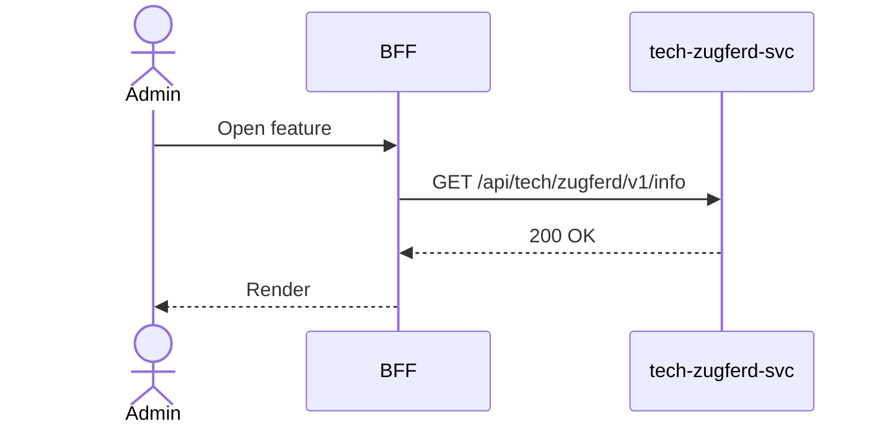

# F-TECH-005-01 — Service Health & Info

> **Meta Information**
> - **Version:** 2026-04-03
> - **Template:** `feature-spec.md` v1.0.0
> - **Template Compliance:** 100%
> - **Status:** DRAFT
> - **Feature ID:** `F-TECH-005-01`
> - **Suite:** `tech`
> - **Node type:** LEAF
> - **Parent:** `F-TECH-005` — E-Invoicing
> - **Companion UVL:** `F-TECH-005-01.uvl`
> - **Companion AUI:** `F-TECH-005-01.aui.yaml`

---

## PROBLEM SPACE

## 0. Feature Identity & Orientation
### 0.1 One-Line Summary
This feature lets a **platform administrator** view the ZUGFeRD service status, version, default profile, max file size, and validation config so that service health and configuration can be verified.
### 0.2 Non-Goals
- Does not duplicate sibling features in F-TECH-005. See composition spec.
### 0.3 Entry & Exit Points
**Entry:** Platform Administration → E-Invoicing. **Exit:** Back to admin dashboard.
### 0.4 Variability Points
| Variability Point | Values | Default | Binding Time |
|---|---|---|---|
| Pagination page size | 10,25,50,100 | 25 | runtime |

## 1. User Goal & Scenarios
### 1.1 User Goal
This feature lets a **platform administrator** view the ZUGFeRD service status, version, default profile, max file size, and validation config so that service health and configuration can be verified.

## 2. User Journey & Screen Layout
### 2.1 Sequence Diagram

### 2.2 Screen Layout
See companion AUI contract `F-TECH-005-01.aui.yaml`.

## 3. Interaction Requirements
See AUI contract for fields and actions.

## 4. Edge Cases & Screen States
| State | When | Behaviour |
|---|---|---|
| Loading | Awaiting response | Skeleton; controls disabled |
| Empty | No data | Message + CTA |
| Error | Service unavailable | Inline message + retry |
| Populated | Data ready | Render normally |

---

## SOLUTION SPACE

## 5. Backend Dependencies & BFF Contract
### 5.1 Service Calls
| # | Service | Endpoint | Tier | isMutation | Failure Mode |
|---|---------|----------|------|------------|-------------|
| 1 | tech-zugferd-svc | `GET /api/tech/zugferd/v1/info` | T1 | No | Error + retry |

### 5.3 Feature-Gating Rules
| Mode | Behaviour |
|---|---|
| Full | All interactions |
| Read-only | Mutations hidden |
| Excluded | Hidden; 404 on direct URL |

---

## BRIDGE ARTIFACTS

## 7. Permissions & Accessibility
### 7.1 Permission Matrix
| Action | PLATFORM_ADMIN | TENANT_ADMIN | ANY_AUTHENTICATED |
|---|---|---|---|
| Read | ✓ | ✓ | ✓ |
| Write | ✓ | ANY_AUTHENTICATED | — |

## 9. Variability & Extension
### 9.1 Feature Dependencies
Requires IAM authentication.
### 9.3 Extension Points
| Extension Zone | Interface | Default |
|---|---|---|
| `ext.customFields` | Additional fields | Hidden |

---
**END OF SPECIFICATION**
