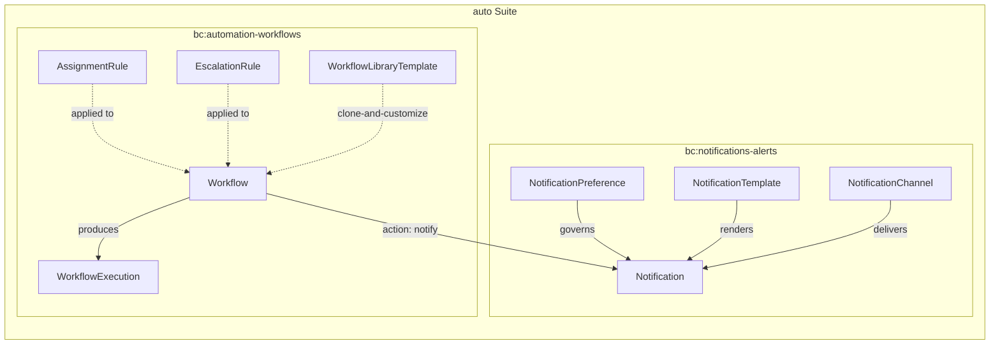
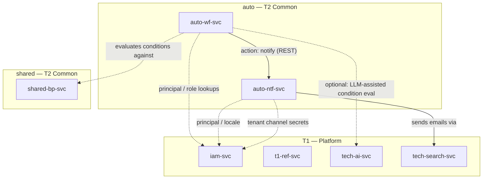
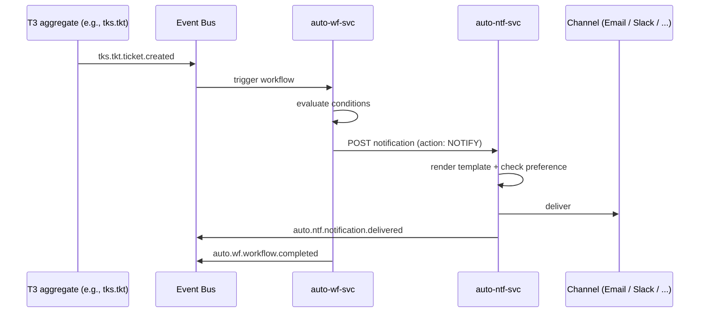

# auto — T2 Common — Cross-Suite Automation Fabric Suite Specification

> **Conceptual Stack Layer:** Suite
> **Space:** Platform
> **Owner:** Platform Shared-Business Team
> **Schema alignment:** `suite-layer.schema.json`
> **Companion files:** `auto.catalog.uvl`
> **Contains:** Domain/Service Specs, Platform-Feature Specs, Feature Catalog

> **Meta Information**
> - **Version:** 2026-04-21
> - **Template:** `suite-spec.md` v1.0.0
> - **Template Compliance:** 90% (initial draft — ADRs + detailed feature specs follow)
> - **Author(s):** OpenLeap Architecture Team
> - **Status:** DRAFT
> - **Suite ID:** `auto`
> - **Suite Name:** Automation Fabric
> - **Description:** Cross-suite automation primitives. Notification hub and workflow engine consumed by every T3 business suite.
> - **Semantic Version:** `1.0.0`
> - **Tier:** T2 — Common
> - **Team:**
>   - Name: `team-platform-shared`
>   - Email: `shared-team@openleap.io`
>   - Slack: `#shared-team`
> - **Bounded Contexts:** `bc:notifications-alerts`, `bc:automation-workflows`

---

## 0. Suite Identity & Purpose

### 0.1 Suite Identity

| Field | Value |
|-------|-------|
| id | `auto` |
| name | Automation Fabric |
| description | Cross-suite automation primitives: notification hub (multi-channel delivery) and workflow engine (rule-based automation). Consumed by every T3 operational domain. |
| version | `1.0.0` |
| status | `draft` |
| tier | T2 — Common |
| owner.team | `team-platform-shared` |
| owner.email | `shared-team@openleap.io` |
| owner.slack | `#shared-team` |
| boundedContexts | `bc:notifications-alerts`, `bc:automation-workflows` |

### 0.2 Business Purpose

Every T3 business suite needs two cross-cutting automation primitives: the ability to **notify users across channels** (email, SMS, push, in-app, Slack, Teams, webhook) and the ability to **automate reactions** to business events via declarative rules. Before this suite existed, each suite reimplemented these primitives, causing inconsistency, fragmented preferences, and brittle cross-suite automation.

The `auto` suite provides these primitives as thin, domain-agnostic platform services. The notification hub owns a single preferences model per principal and a single template registry. The workflow engine owns a single rule-engine with a shared action registry that can target any aggregate across the platform. T3 domains consume these services via events (triggers) and REST APIs (templates, rules).

### 0.3 In Scope

- Multi-channel notification delivery (in-app, email, SMS, push, Slack, Teams, webhook)
- Per-principal notification preferences, quiet hours, digest modes
- Template registry with i18n variants and per-channel-type rendering
- Declarative workflow rules (triggers, conditions, actions) across any platform aggregate
- Assignment rules (round-robin, skill-based, load-balance) for work-item aggregates
- Escalation rules tied to SLA clocks
- Template library for reusable workflows
- Cross-suite writes by workflows via REST (with audit)

### 0.4 Out of Scope

- Long-running stateful saga orchestration (future `ops.saga`)
- Domain-specific business rules (stay inside their owning domain)
- UI for designing workflows or authoring templates (see feature specs)

### 0.5 Target Users

| Role | Interest |
|------|----------|
| Tenant Admin | Configure tenant channels, workflows, escalation rules |
| Automation Designer | Build workflows from library templates, tune assignment rules |
| Platform Admin | Manage platform-default templates and workflow library |
| Tenant User | Receive notifications, view notification history, manage own preferences |
| Service Account (inter-service) | Publish trigger events; receive action invocations |

### 0.6 Business Value

- **One notification fabric** for all suites — consistent UX, single preferences model, single audit trail
- **Declarative automation** — business users configure reactions without writing code
- **Cross-suite reach** — workflow actions invoke any domain's REST API with audit
- **Compliance fit** — DORA dual-channel delivery, GDPR erasure, auditable executions

---

## 1. Ubiquitous Language

### 1.1 Glossary

| ID | Term | Aliases | Definition |
|----|------|---------|------------|
| auto:glossary:notification | Notification | Alert, Message | A delivered message envelope targeting a principal, tied to a specific event type, rendered per-channel from a template. |
| auto:glossary:notification-preference | Notification Preference | Preference | Per-principal configuration of enabled channels, digest mode, quiet hours, and severity cutoff per event type. |
| auto:glossary:notification-channel | Notification Channel | Channel | Tenant-level configuration of a delivery channel (type, credentials, rate limits). |
| auto:glossary:notification-template | Notification Template | Template | Renderable template keyed by (eventType, channelType, locale); supports placeholders and locale fallback. |
| auto:glossary:workflow | Workflow | Automation Rule | A declarative automation rule with a trigger, conditions, and ordered actions. |
| auto:glossary:workflow-execution | Workflow Execution | Run | An instance of a workflow run triggered by an event, schedule, field change, or manual invocation. |
| auto:glossary:assignment-rule | Assignment Rule | Routing Rule | A criteria-based rule that auto-assigns work-item aggregates to principals or queues. |
| auto:glossary:escalation-rule | Escalation Rule | SLA Escalation | A time-based rule that fires actions when an SLA clock threshold is breached. |
| auto:glossary:action | Action | Step | A single ordered operation inside a workflow (notify, update, create, webhook, publish-event). |
| auto:glossary:library-template | Library Template | Workflow Template | A reusable workflow blueprint with placeholders; tenants clone-and-customize. |

### 1.2 UBL Boundary Test

**auto vs. shared (T2 Common):**
In the `shared` suite, "Party" and "Calendar" are authoritative domain objects. In `auto`, "Notification" and "Workflow" are control-plane constructs about what happens when things change in *other* suites. `auto` does not own business entities — it owns rules and deliveries. Confirmed: separate suite.

**auto vs. T3 suites:**
T3 suites own their aggregates and emit events. `auto` subscribes to those events and fires rules. T3 never calls `auto` write endpoints (except service-account-published trigger events); end users configure their preferences and workflows via `auto` REST APIs. Confirmed: clean cross-suite boundary.

---

## 2. Domain Model

### 2.1 Conceptual Overview



### 2.2 Core Concepts

| Concept | Owner (Service) | Description | Glossary Ref |
|---------|----------------|-------------|-------------|
| Notification | `auto-ntf-svc` | Delivered message envelope | `auto:glossary:notification` |
| NotificationPreference | `auto-ntf-svc` | Per-principal preferences | `auto:glossary:notification-preference` |
| NotificationChannel | `auto-ntf-svc` | Tenant channel configuration | `auto:glossary:notification-channel` |
| NotificationTemplate | `auto-ntf-svc` | Per-event/channel/locale template | `auto:glossary:notification-template` |
| Workflow | `auto-wf-svc` | Automation rule | `auto:glossary:workflow` |
| WorkflowExecution | `auto-wf-svc` | Rule-run instance | `auto:glossary:workflow-execution` |
| AssignmentRule | `auto-wf-svc` | Auto-assign work items | `auto:glossary:assignment-rule` |
| EscalationRule | `auto-wf-svc` | Time-based escalation | `auto:glossary:escalation-rule` |
| WorkflowLibraryTemplate | `auto-wf-svc` | Reusable workflow blueprint | `auto:glossary:library-template` |

### 2.3 Shared Kernel

| Concept | Owner | Shared With | Mechanism |
|---------|-------|-------------|-----------|
| Notification (action target) | `auto-wf-svc` | `auto-ntf-svc` | `api` — workflow `notify` action calls NTF REST to publish notifications |

### 2.4 Bounded Context Map (Intra-Suite)

| Upstream | Downstream | Pattern | Description |
|----------|-----------|---------|-------------|
| `bc:automation-workflows` | `bc:notifications-alerts` | `customer_supplier` | WF invokes NTF via REST when a workflow action type is `NOTIFY`. |

---

## 3. Service Landscape

### 3.1 Service Catalog

| Service ID | Name | Bounded Context | Status | Responsibility | Spec |
|-----------|------|----------------|--------|----------------|------|
| `auto-ntf-svc` | Notification Hub | `bc:notifications-alerts` | `draft` | Multi-channel delivery, preferences, templates, digest | `domain-specs/auto_ntf-spec.md` |
| `auto-wf-svc` | Workflow Engine | `bc:automation-workflows` | `draft` | Triggers, conditions, actions, assignment & escalation, library | `domain-specs/auto_wf-spec.md` |

### 3.2 Service Dependency Diagram



---

## 4. Integration Patterns

### 4.1 Pattern Decision

| Field | Value |
|-------|-------|
| **Pattern** | `event_driven` + `sync_api` (hybrid) |

**Rationale:**
- `auto-wf-svc` subscribes to events from *every* suite (including cross-tier) as workflow triggers
- Workflow `notify` actions invoke `auto-ntf-svc` synchronously to publish notifications
- All T3 suites call `auto-ntf-svc` for in-app notification feed via REST
- `auto-ntf-svc` also subscribes to some events directly (e.g., iam principal deletion for GDPR purge)

### 4.2 Key Event Flows

#### Flow 1: T3 event → workflow → notification



### 4.3 Error Handling

| Scenario | Handling |
|----------|---------|
| Channel provider down | Retry with exponential backoff (1m / 5m / 30m); after 3 attempts → DLQ + `auto.ntf.notification.failed` event |
| Missing template | DLQ + log; emit `auto.ntf.notification.failed` with reason=NO_TEMPLATE |
| Workflow loop detected | Terminate after 100 iterations; emit `auto.wf.workflow.failed` reason=LOOP |
| Action-target service down | Retry per action policy; after limit → DLQ + `auto.wf.workflow.failed` |

---

## 5. Event Conventions

### 5.1 Routing Key Pattern

**Pattern:** `auto.{domain}.{aggregate}.{action}`

| Segment | Description | Examples |
|---------|-------------|---------|
| `auto` | Always `auto` | `auto` |
| `{domain}` | Domain short code | `ntf`, `wf` |
| `{aggregate}` | Aggregate root name (lowercase) | `notification`, `preference`, `channel`, `workflow`, `assignment`, `escalation` |
| `{action}` | Past-tense verb | `delivered`, `read`, `failed`, `triggered`, `completed`, `performed`, `fired` |

### 5.2 Payload Envelope

```json
{
  "eventId": "uuid",
  "eventType": "auto.{domain}.{aggregate}.{action}",
  "timestamp": "ISO-8601",
  "tenantId": "string",
  "correlationId": "uuid",
  "causationId": "uuid",
  "producer": "auto-{domain}-svc",
  "schemaVersion": "1.0.0",
  "payload": { }
}
```

### 5.3 Event Catalog

| Routing Key | Producer | Consumer(s) | Description |
|------------|----------|-------------|-------------|
| `auto.ntf.notification.delivered` | `auto-ntf-svc` | Audit, BI | Notification successfully delivered |
| `auto.ntf.notification.read` | `auto-ntf-svc` | Audit, Analytics | In-app notification marked read |
| `auto.ntf.notification.failed` | `auto-ntf-svc` | Oncall, DLQ-monitor | Delivery failed permanently |
| `auto.ntf.preference.changed` | `auto-ntf-svc` | Audit | Principal updated preferences |
| `auto.ntf.channel.created` | `auto-ntf-svc` | Audit | New tenant channel |
| `auto.ntf.channel.disabled` | `auto-ntf-svc` | Audit | Tenant channel disabled |
| `auto.wf.workflow.triggered` | `auto-wf-svc` | BI, Audit | Workflow execution started |
| `auto.wf.workflow.completed` | `auto-wf-svc` | BI, Audit | Execution finished with step log |
| `auto.wf.workflow.failed` | `auto-wf-svc` | Oncall, DLQ-monitor | Execution failed or terminated |
| `auto.wf.assignment.performed` | `auto-wf-svc` | Target aggregate owners | Assignment rule matched and executed |
| `auto.wf.escalation.fired` | `auto-wf-svc` | Target aggregate owners, notify consumers | Escalation threshold reached |

### 5.4 Legacy Bridge (Migration)

For 60 days after the promotion PR merges, both services SHALL also publish outbound events under legacy routing keys:
- `auto.ntf.*` also emitted as `crm.ntf.*` (since `auto-ntf-svc` supersedes `crm-ntf-svc`)
- `auto.wf.*` also emitted as `crm.wf.*` (since `auto-wf-svc` supersedes `crm-wf-svc`)

Bridge SHALL be removed after grace period ends. See each domain spec §13 for full migration plan.

---

## 6. Feature Catalog

The companion `auto.catalog.uvl` defines the UVL feature tree. Feature IDs use hierarchical naming `F-AUTO-{DOMAIN}-{NNN}[-{NN}]`.

### 6.1 Feature Tree (summary)

```
auto Suite (Automation Fabric)
+-- F-AUTO-NTF-001  Notification Center (in-app)                [mandatory]
+-- F-AUTO-NTF-002  Notification Preferences                     [mandatory]
+-- F-AUTO-NTF-003  Channel Configuration (admin)                [optional]
+-- F-AUTO-NTF-004  Template Management                          [optional]
+-- F-AUTO-NTF-005  Digest & Quiet Hours                         [optional]
+-- F-AUTO-WF-001   Workflow Builder                             [optional]
+-- F-AUTO-WF-002   Workflow Template Library                    [optional]
+-- F-AUTO-WF-003   Workflow Monitor & Logs                      [optional]
+-- F-AUTO-WF-004   Assignment & Escalation Rules                [optional]
```

Full feature specifications will be authored as separate leaf files under `features/leaves/F-AUTO-NTF-001/` etc. once the suite reaches ACTIVE status (target Q3 2026).

### 6.2 Cross-Suite Feature Dependencies

| This Suite Feature | Requires | From Suite | Reason |
|-------------------|----------|-----------|--------|
| `F-AUTO-NTF-*` | Principal + tenant context | `iam` (T1) | Authentication, per-principal routing |
| `F-AUTO-NTF-*` | Localization | `t1.i18n` | Locale-aware template rendering |
| `F-AUTO-NTF-003` | Tenant secrets | `iam.tenant` | Channel credentials (SMTP, Twilio, Slack webhook) |
| `F-AUTO-WF-*` | Any trigger event | `*` (all suites) | Workflow triggers on domain events |
| `F-AUTO-WF-*` | Principal lookup | `iam.principal`, `shared.bp` | Condition evaluation, action targeting |

---

## 7. Cross-Cutting Concerns

### 7.1 Compliance

| Regulation | Requirement | Implementation |
|-----------|-------------|----------------|
| GDPR | Right to erasure; notification purge on principal deletion | `iam.principal.deleted` consumer + 90-day in-app retention |
| DORA | ICT incident notifications via ≥2 independent channels | Enforced for severity=CRITICAL event types (ADR pending) |
| Audit | All workflow executions and notification deliveries | Events on `auto.*.events` exchanges |

### 7.2 Security

| Aspect | Approach |
|--------|---------|
| **Authentication** | OAuth2 / OIDC via T1 iam-svc |
| **Authorization** | RBAC with scopes `auto.ntf:read/write/admin`, `auto.wf:read/write/admin` |
| **Tenant Isolation** | RLS on `tenant_id` for every table in `auto_notification` and `auto_workflow` schemas |

### 7.3 Multi-Tenancy

Shared schema model. Every aggregate carries `tenant_id`. Workflows MUST NOT trigger on events from other tenants (enforced at subscription layer).

---

## 8. External Interfaces

### 8.1 Outbound (auto → other suites)

| Target | Interface | Description |
|-------|-----------|-------------|
| All suites | `api` | `POST` against any domain's REST API as a workflow action (with caller's tenant context) |
| All suites | `event` | `auto.*.events` consumed by BI, audit, and suite-specific reactors |

### 8.2 Inbound (other suites → auto)

| Source | Interface | Description |
|-------|-----------|-------------|
| All suites | `event` | Domain events trigger workflows; examples: `tks.tkt.*`, `sd.ord.*`, `fi.ap.*` |
| T3 frontends | `api` | `GET/POST` on `/api/auto/ntf/v1/*` and `/api/auto/wf/v1/*` |
| `iam.principal` | `event` | `iam.principal.deleted` → GDPR purge |

### 8.3 External Context Mapping

| Upstream | Downstream | Pattern | Description |
|----------|-----------|---------|-------------|
| `auto` | All T3 suites | `published_language` | `auto.*` events consumed for audit, BI, cross-suite workflow reactions |
| `iam` (T1) | `auto` | `conformist` | auto conforms to IAM authentication/authorization |
| T3 suites | `auto` | `published_language` | auto subscribes to any T3 event as a potential workflow trigger |

---

## 9. Architecture Decisions

### ADR-AUTO-001: Promote ntf + wf to T2 Common

| Field | Value |
|-------|-------|
| **ID** | `ADR-AUTO-001` |
| **Status** | `proposed` |
| **Scope** | Entire `auto` suite |

**Context:**
Notification and workflow capabilities were originally in the CRM suite (`crm.ntf`, `crm.wf`). Other T3 suites (TKS, SD, FI) need the same capabilities. Reimplementing them per-suite violates DRY; making CRM a dependency of TKS/SD/FI violates the "suite = UBL boundary" rule.

**Decision:**
Promote `crm.ntf` → `auto.ntf` and `crm.wf` → `auto.wf` as a new T2 Common suite `auto`. Keep the original CRM services running for 60 days with a routing-key bridge for backward compatibility.

**Consequences:**

| Positive | Negative |
|----------|----------|
| Single notification/workflow primitives across platform | One-time migration cost |
| Clear cross-suite semantics (T2 Common, not T3 domain) | 60-day dual-emit period |
| Tenant preferences unified across suites | Callers must update routing-key subscriptions |

### ADR-AUTO-002: Cross-Suite Writes via REST with Audit

| Field | Value |
|-------|-------|
| **ID** | `ADR-AUTO-002` |
| **Status** | `proposed` |
| **Scope** | Workflow action types |

**Context:**
Workflows may need to mutate aggregates in any suite as an action. Options: shared DB access, direct event publish, or REST.

**Decision:**
Workflow actions that mutate other aggregates MUST use REST with the caller's original tenant context, not shared DB access. Each cross-suite write is audit-logged with the workflow-execution id.

**Consequences:** Preserves bounded-context autonomy at the cost of latency and REST availability coupling.

---

## 10. Roadmap

| Phase | Timeframe | Items |
|-------|-----------|-------|
| Promotion | 2026-04 to 2026-06 | Rename services, dual-emit routing keys, migrate CRM consumers |
| Feature Depth | 2026 Q3 | Full leaf feature specs for F-AUTO-NTF-001..005 and F-AUTO-WF-001..004 |
| Platform Hardening | 2026 Q4 | Dead-letter tooling, template library, escalation UI |
| Cross-Suite Saga | 2027 Q1 | Evaluate Temporal.io adoption for long-running orchestrations (see Q-WF-001) |

---

## 11. Appendix

### 11.1 Change Log

| Date | Version | Author | Changes |
|------|---------|--------|---------|
| 2026-04-21 | 1.0.0 | OpenLeap Architecture Team | Initial suite spec — T2 Common split 2026-04-21. Promoted from CRM (routing-key bridge active 60d). |

### 11.2 Companion Files

- UVL catalog: `auto.catalog.uvl`
- Domain specs: `domain-specs/auto_ntf-spec.md`, `domain-specs/auto_wf-spec.md`
- Event schemas: `contracts/events/auto/{ntf,wf}/*.schema.json` (to be added)
- HTTP contracts: `contracts/http/auto/{ntf,wf}/openapi.yaml` (to be added)
