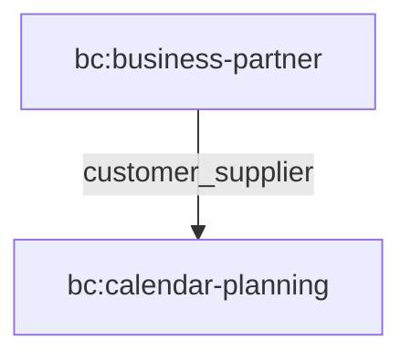
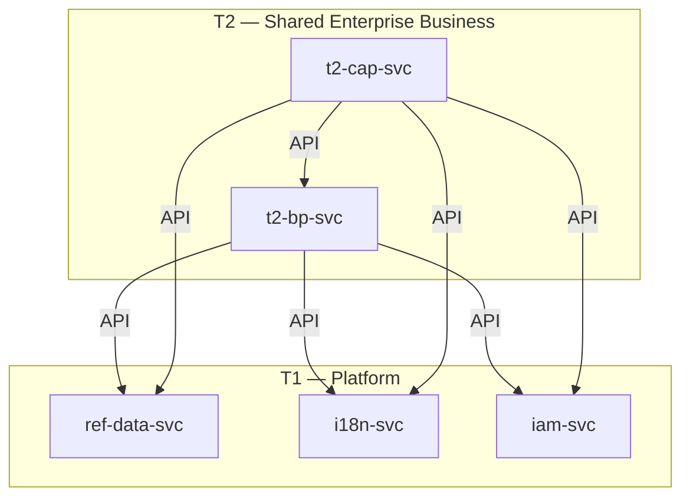
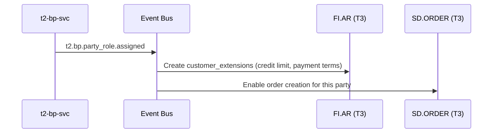
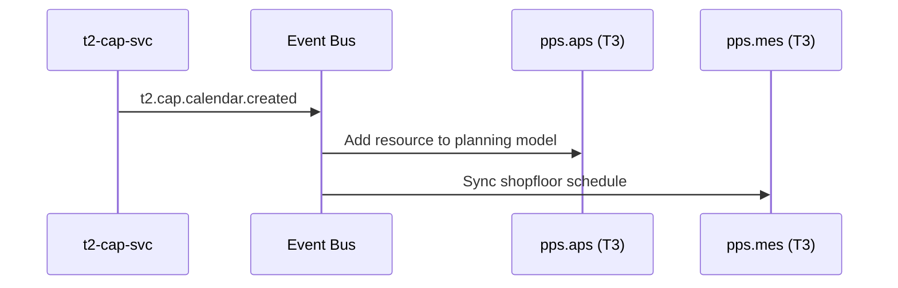
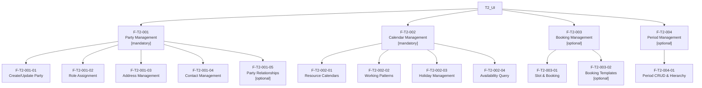
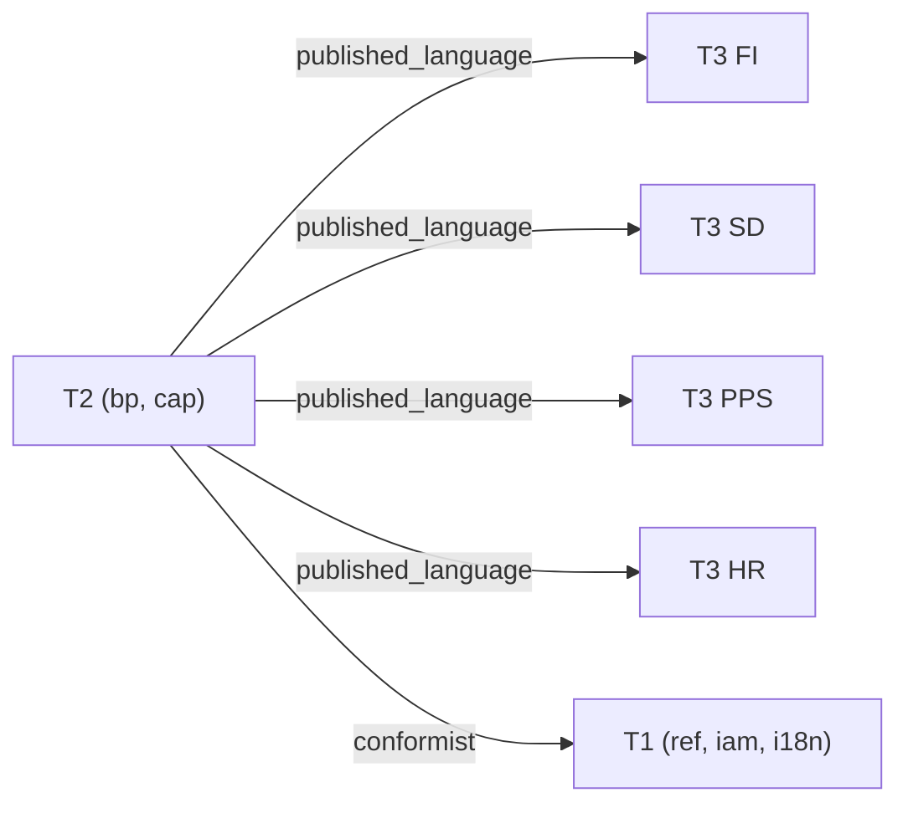

# T2 - Shared Enterprise Business Suite Specification

> **Conceptual Stack Layer:** Suite
> **Space:** Platform
> **Owner:** Domain Engineering Team
> **Schema alignment:** `suite-layer.schema.json`
> **Companion files:** `t2.catalog.uvl` (referenced in SS6)
> **Contains:** Domain/Service Specs, Platform-Feature Specs, Feature Catalog

> **Meta Information**
> - **Version:** 2026-04-03
> - **Template:** `suite-spec.md` v1.0.0
> - **Template Compliance:** 100% — fully compliant
> - **Author(s):** OpenLeap Architecture Team
> - **Status:** DRAFT
> - **Suite ID:** `t2`
> - **Suite Name:** Shared Enterprise Business
> - **Description:** Foundational shared business services providing identity, time, and planning primitives for all operational domains.
> - **Semantic Version:** `1.1.0`
> - **Team:**
>   - Name: `team-t2`
>   - Email: `t2-team@openleap.io`
>   - Slack: `#t2-team`
> - **Bounded Contexts:** `bc:business-partner`, `bc:calendar-planning`

---

## Specification Guidelines

> **This specification MUST comply with the OpenLeap specification guidelines.**
>
> ### Non-Negotiables
> - Never invent facts. If required info is missing, add an **OPEN QUESTION** entry.
> - Preserve intent and decisions. Only change meaning when explicitly requested.
> - Keep the spec **self-contained**: no "see chat", no implicit context.
>
> ### Style Guide
> - Prefer short sentences and lists.
> - Use MUST/SHOULD/MAY for normative statements.
> - Keep terminology consistent with the Ubiquitous Language defined in SS1.
> - Avoid ambiguous words ("often", "maybe") unless explicitly noting uncertainty.

---

## 0. Suite Identity & Purpose

### 0.1 Suite Identity

| Field | Value |
|-------|-------|
| id | `t2` |
| name | Shared Enterprise Business |
| description | Foundational shared business services providing identity, time, and planning primitives consumed by all T3 operational domains. |
| version | `1.1.0` |
| status | `draft` |
| owner.team | `team-t2` |
| owner.email | `t2-team@openleap.io` |
| owner.slack | `#t2-team` |
| boundedContexts | `bc:business-partner`, `bc:calendar-planning` |

### 0.2 Business Purpose

The T2 Shared Enterprise Business suite provides the two foundational business primitives that every operational domain in the platform requires: **identity** (who/where/how-to-contact) and **time** (when/how-long/how-much-capacity). Without these shared services, each T3 domain would need to independently manage party identities and calendar/availability data, leading to data duplication, inconsistency, and integration friction. T2 provides these as thin, domain-agnostic kernel services that T3 domains extend with their own business semantics.

### 0.3 In Scope

- Party identity management: Person and Organization lifecycle, generic role assignment, addresses, contact points, tax identifiers, bank accounts, party relationships
- Calendar and availability management: Resource and organizational calendars, working patterns, public holidays, capacity buckets, delivery slots, bookings, booking templates
- Period management: Fiscal, operational, and planning periods as a shared structure
- Generic extension mechanisms: JSONB metadata, domain extension tables, event-driven choreography for downstream domain enrichment

### 0.4 Out of Scope

- Domain-specific business logic on party data (credit limits -> FI, pricing -> SD, vendor rating -> PUR, salary -> HR)
- Detailed scheduling algorithms (-> PPS.APS)
- Payroll calculations (-> HR)
- Labor law enforcement (-> HR, future)
- Customer segmentation (-> CRM)
- Payment processing (-> FI.PAYMENT)

### 0.5 Target Users

| Role | Interest |
|------|----------|
| Master Data Manager | Create and maintain party records, manage duplicates |
| Production Planner | Check machine/resource availability, define working patterns |
| Warehouse Manager | Manage delivery slots, capacity buckets |
| HR Manager | Manage employee calendars, working patterns, holidays |
| Sales Representative | Look up customer contact details, book delivery windows |
| Finance Controller | Access party identifiers for invoicing, manage fiscal periods |
| Plant Manager | Configure plant calendars and operational shutdowns |
| Compliance Officer | Audit PII access, GDPR compliance |

### 0.6 Business Value

- **Single Source of Truth for Identity:** One party record referenced by all domains, eliminating data duplication
- **Unified Time Management:** Single calendar system prevents conflicts between departments
- **Domain Agnosticism:** Kernel services remain thin and reusable; domains add their own semantics
- **Data Quality:** Centralized validation and deduplication for party data
- **Compliance:** Unified PII management, GDPR controls, and audit trails
- **Operational Efficiency:** Reduces manual coordination and scheduling conflicts across the enterprise

---

## 1. Ubiquitous Language

### 1.1 Glossary

| ID | Term | Aliases | Definition |
|----|------|---------|------------|
| t2:glossary:party | Party | Entity, Partner | Generic identity concept representing a Person or Organization that can participate in business processes across the platform. |
| t2:glossary:person | Person | Individual | A Party of kind PERSON representing an individual human being with given name, family name, and optional personal attributes. |
| t2:glossary:organization | Organization | Company, Legal Entity | A Party of kind ORGANIZATION representing a legal entity such as a company, government body, or nonprofit. |
| t2:glossary:party-role | Party Role | Role, Function | Generic mechanism for assigning business roles (Customer, Supplier, Employee) to a Party. BP provides the structure; domains add the semantics. |
| t2:glossary:party-site | Party Site | Site, Location | A named physical location associated with a Party (e.g., HQ, Plant, Warehouse). Contains one or more Addresses. |
| t2:glossary:address | Address | Postal Address | Geographic location details (street, city, country) attached to a Party Site, with a purpose code (REGISTERED, BILLING, SHIPPING). |
| t2:glossary:contact-point | Contact Point | Contact, Communication Channel | A communication channel (Phone, Email, URL) attached to a Party or Party Site. |
| t2:glossary:party-relationship | Party Relationship | Relationship | A typed, directed link between two Parties (e.g., PARENT_OF, SUBSIDIARY_OF, EMPLOYEE_OF) forming a graph structure. |
| t2:glossary:calendar | Calendar | Schedule | Container for time-based events and availability rules, associated with a resource (person, machine, facility) or organization. |
| t2:glossary:event | Event | Calendar Event | A specific time block within a Calendar (working hours, downtime, meeting) with optional recurrence via RRULE. |
| t2:glossary:working-pattern | Working Pattern | Shift Pattern | Reusable template defining recurring working hours (e.g., "Mon-Fri 8:00-17:00") expressed as RFC 5545 RRULE. |
| t2:glossary:holiday | Holiday | Public Holiday | A non-working day specific to a country or subdivision, applied to calendars that inherit holidays. |
| t2:glossary:capacity-bucket | Capacity Bucket | Availability Bucket | Computed aggregate of available capacity in a time period, derived from calendar events, patterns, and holidays. |
| t2:glossary:slot | Slot | Time Slot, Appointment Window | A bookable time window within a Calendar for deliveries, services, or appointments. |
| t2:glossary:booking | Booking | Reservation | A reservation of a specific Slot, with a lifecycle (Pending -> Confirmed -> Completed/Cancelled). |
| t2:glossary:booking-template | Booking Template | Appointment Template | Reusable configuration for booking defaults (duration, buffers, advance booking rules, cancellation policy). |
| t2:glossary:period | Period | Time Period | Generic time period (fiscal month, pay period, planning bucket) owned by a Calendar, extensible via metadata. |
| t2:glossary:kernel-service | Kernel Service | Foundation Service | A service that provides generic primitives (structure and mechanism) without domain-specific business logic. Domains extend these primitives. |

### 1.2 UBL Boundary Test

**T2 vs. T3 (e.g., FI suite):**
In T2, "Party Role" means a generic mechanism for attaching a role type code to a Party with validity dates and optional metadata. In FI, the same party becomes a "Customer" with credit limits, payment terms, and dunning levels — FI adds these semantics via extension tables referencing the T2 Party Role. This confirms that T2 provides structure while T3 provides business meaning, and they belong to separate suites.

**T2 vs. T1 (ref suite):**
In T2, "Holiday" means a non-working day that affects calendar availability and capacity computation. In T1 (ref), "Country" and "Subdivision" are pure reference data codes without any business behavior. T2 consumes T1 reference data but adds the business concept of holiday-based availability, confirming separate suite boundaries.

---

## 2. Domain Model

### 2.1 Conceptual Overview

```mermaid
graph LR
    subgraph "T2 Suite"
        subgraph "bc:business-partner"
            PARTY["Party<br/>(Person, Organization)"]
            ROLE["PartyRole"]
            SITE["PartySite & Address"]
            CONTACT["ContactPoint"]
            TAXID["TaxIdentifier"]
            BANK["BankAccount"]
            REL["PartyRelationship"]
        end
        subgraph "bc:calendar-planning"
            CAL["Calendar"]
            EVT["Event"]
            WP["WorkingPattern"]
            HOL["Holiday"]
            SLOT["Slot & Booking"]
            BT["BookingTemplate"]
            CAPB["CapacityBucket"]
            PER["Period"]
        end
    end

    PARTY -- "plays" --> ROLE
    PARTY -- "has" --> SITE
    PARTY -- "has" --> CONTACT
    PARTY -- "has" --> TAXID
    PARTY -- "has" --> BANK
    PARTY -- "related to" --> REL
    CAL -- "contains" --> EVT
    CAL -- "uses" --> WP
    CAL -- "affected by" --> HOL
    CAL -- "offers" --> SLOT
    CAL -- "has" --> CAPB
    CAL -- "defines" --> PER
    SLOT -- "reserved by" --> BT
    PARTY -.."ownerRef".-> CAL
```

### 2.2 Core Concepts

| Concept | Owner (Service) | Description | Glossary Ref |
|---------|----------------|-------------|-------------|
| Party | `t2-bp-svc` | Root identity (Person or Organization) | `t2:glossary:party` |
| PartyRole | `t2-bp-svc` | Generic role assignment mechanism | `t2:glossary:party-role` |
| PartySite | `t2-bp-svc` | Physical location of a party | `t2:glossary:party-site` |
| Address | `t2-bp-svc` | Geographic location details | `t2:glossary:address` |
| ContactPoint | `t2-bp-svc` | Communication channels (Phone, Email, URL) | `t2:glossary:contact-point` |
| TaxIdentifier | `t2-bp-svc` | External tax identification numbers | `t2:glossary:party` |
| BankAccount | `t2-bp-svc` | Bank account structure | `t2:glossary:party` |
| PartyRelationship | `t2-bp-svc` | Typed directed links between parties | `t2:glossary:party-relationship` |
| Calendar | `t2-cap-svc` | Time-based schedule for a resource or organization | `t2:glossary:calendar` |
| Event | `t2-cap-svc` | Time block within a calendar | `t2:glossary:event` |
| WorkingPattern | `t2-cap-svc` | Reusable recurrence template | `t2:glossary:working-pattern` |
| Holiday | `t2-cap-svc` | Country/region non-working day | `t2:glossary:holiday` |
| Slot | `t2-cap-svc` | Bookable time window | `t2:glossary:slot` |
| Booking | `t2-cap-svc` | Reservation of a slot | `t2:glossary:booking` |
| BookingTemplate | `t2-cap-svc` | Reusable booking configuration | `t2:glossary:booking-template` |
| CapacityBucket | `t2-cap-svc` | Computed available capacity | `t2:glossary:capacity-bucket` |
| Period | `t2-cap-svc` | Generic time period | `t2:glossary:period` |

### 2.3 Shared Kernel

| Concept | Owner | Shared With | Mechanism |
|---------|-------|-------------|-----------|
| Party (ownerRef) | `t2-bp-svc` | `t2-cap-svc` | `api` — CAP validates calendar owner references against BP parties |

### 2.4 Bounded Context Map (Intra-Suite)

| Upstream | Downstream | Pattern | Description |
|----------|-----------|---------|-------------|
| `bc:business-partner` | `bc:calendar-planning` | `customer_supplier` | CAP uses BP party references as calendar owners; BP publishes party events, CAP MAY consume them for reference validation. |



---

## 3. Service Landscape

### 3.1 Service Catalog

| Service ID | Name | Bounded Context | Status | Responsibility | Spec |
|-----------|------|----------------|--------|----------------|------|
| `t2-bp-svc` | Business Partner Service | `bc:business-partner` | `development` | Authoritative party identity, roles, addresses, contacts, identifiers, relationships | `domain-specs/t2_bp-spec.md` |
| `t2-cap-svc` | Calendar & Planning Service | `bc:calendar-planning` | `planned` | Calendars, availability, working patterns, holidays, slots, bookings, periods | `domain-specs/t2_cap-spec.md` |

### 3.2 Responsibility Matrix

| Responsibility | Service |
|---------------|---------|
| Party identity (Person, Organization) | `t2-bp-svc` |
| Role assignment mechanism | `t2-bp-svc` |
| Address and site management | `t2-bp-svc` |
| Contact information (phone, email, URL) | `t2-bp-svc` |
| Tax identifiers and bank accounts | `t2-bp-svc` |
| Party relationships | `t2-bp-svc` |
| GDPR compliance (party data) | `t2-bp-svc` |
| Resource and organizational calendars | `t2-cap-svc` |
| Working patterns and recurrence rules | `t2-cap-svc` |
| Public holiday catalog | `t2-cap-svc` |
| Availability and capacity computation | `t2-cap-svc` |
| Slot and booking management | `t2-cap-svc` |
| Period management (fiscal, operational) | `t2-cap-svc` |

### 3.3 Service Dependency Diagram



---

## 4. Integration Patterns

### 4.1 Pattern Decision

| Field | Value |
|-------|-------|
| **Pattern** | `event_driven` |

**Rationale:**
- Both BP and CAP are **informational publishers**: they emit facts about party and calendar state changes
- Downstream T3 domains independently decide how to react (create extensions, update planning models, sync schedules)
- No multi-step compensating workflows are required within T2
- Choreography avoids tight coupling between the two T2 services and their many T3 consumers

### 4.2 Key Event Flows

#### Flow 1: Party Role Assignment -> Domain Extension Creation

**Trigger:** A party is assigned a role (e.g., CUSTOMER)



#### Flow 2: Calendar Created -> Planning Model Update

**Trigger:** A new resource calendar is created



### 4.3 Sync vs. Async Decisions

| Integration | Type | Reason |
|------------|------|--------|
| CAP validates ownerRef against BP | `sync` | Needed at calendar creation time for immediate validation |
| BP -> T3 domain extensions | `async` | Eventual consistency acceptable; domains create extensions asynchronously |
| CAP -> T3 planning updates | `async` | Eventual consistency acceptable; planning models refresh in background |
| BP/CAP -> REF lookups | `sync` | Reference data needed for immediate validation (with cache fallback) |

### 4.4 Error Handling

| Scenario | Handling |
|----------|---------|
| T3 event consumer fails | Dead-letter queue + manual retry; BP/CAP do not compensate |
| REF API unavailable | Use cached values (5–30 min TTL); log warning |
| BP unavailable when CAP validates ownerRef | Skip validation, log warning; accept calendar creation |

---

## 5. Event Conventions

### 5.1 Routing Key Pattern

**Pattern:** `t2.{domain}.{aggregate}.{action}`

| Segment | Description | Examples |
|---------|-------------|---------|
| `t2` | Always `t2` | `t2` |
| `{domain}` | Domain short code | `bp`, `cap` |
| `{aggregate}` | Aggregate root name (lowercase) | `party`, `party_role`, `calendar`, `booking` |
| `{action}` | Past-tense verb | `created`, `updated`, `assigned`, `confirmed`, `cancelled` |

**Examples:**
- `t2.bp.party.created`
- `t2.bp.party_role.assigned`
- `t2.cap.calendar.created`
- `t2.cap.booking.confirmed`
- `t2.cap.capacitybucket.rebuilt`

### 5.2 Payload Envelope

```json
{
  "eventId": "uuid",
  "eventType": "t2.{domain}.{aggregate}.{action}",
  "timestamp": "ISO-8601",
  "tenantId": "string",
  "correlationId": "uuid",
  "causationId": "uuid",
  "producer": "t2-{domain}-svc",
  "schemaVersion": "1.0.0",
  "payload": { }
}
```

### 5.3 Versioning Strategy

| Field | Value |
|-------|-------|
| **Strategy** | Schema evolution with backward compatibility |
| **Description** | New optional fields are additive. Removing fields requires a new major version with parallel publishing during migration. |

### 5.4 Event Catalog

| Routing Key | Producer | Consumer(s) | Description |
|------------|----------|-------------|-------------|
| `t2.bp.party.created` | `t2-bp-svc` | CRM, Analytics | New party available for role assignment |
| `t2.bp.party.updated` | `t2-bp-svc` | All T3 consumers | Party attributes changed |
| `t2.bp.party.statusChanged` | `t2-bp-svc` | All T3 consumers | Party lifecycle state changed |
| `t2.bp.party_role.assigned` | `t2-bp-svc` | FI.AR, FI.AP, PUR, SD, HR | Role assigned, domains create extensions |
| `t2.bp.party_role.deactivated` | `t2-bp-svc` | FI.AR, FI.AP, PUR, SD, HR | Role ended |
| `t2.bp.party.address.created` | `t2-bp-svc` | SD, Logistics | New address available |
| `t2.bp.party.relationship.created` | `t2-bp-svc` | FI (consolidation), Corporate | New party relationship |
| `t2.cap.calendar.created` | `t2-cap-svc` | pps.aps, pps.mes, hr.time | New calendar available for planning |
| `t2.cap.calendar.updated` | `t2-cap-svc` | pps.aps, pps.mes | Calendar settings changed |
| `t2.cap.calendar.pattern.applied` | `t2-cap-svc` | pps.aps, pps.mes | Working pattern applied, capacity rebuilt |
| `t2.cap.booking.created` | `t2-cap-svc` | pps.wm, sd.order | New booking pending |
| `t2.cap.booking.confirmed` | `t2-cap-svc` | pps.wm, sd.order | Slot reserved |
| `t2.cap.booking.cancelled` | `t2-cap-svc` | pps.wm, sd.order | Booking cancelled, capacity freed |
| `t2.cap.capacitybucket.rebuilt` | `t2-cap-svc` | pps.aps, pps.mes | Capacity recalculated |

---

## 6. Feature Catalog

The T2 feature catalog defines all user-facing capabilities provided by the suite. The companion `t2.catalog.uvl` file MUST match this tree.

### 6.1 Feature Tree

```
T2 Suite (Shared Enterprise Business)
+-- F-T2-001  Party Management                     [COMPOSITION] [mandatory]
|   +-- F-T2-001-01  Create/Update Party            [LEAF]        [mandatory]
|   +-- F-T2-001-02  Role Assignment                [LEAF]        [mandatory]
|   +-- F-T2-001-03  Address Management             [LEAF]        [mandatory]
|   +-- F-T2-001-04  Contact Management             [LEAF]        [mandatory]
|   +-- F-T2-001-05  Party Relationships            [LEAF]        [optional]
+-- F-T2-002  Calendar Management                   [COMPOSITION] [mandatory]
|   +-- F-T2-002-01  Resource Calendars             [LEAF]        [mandatory]
|   +-- F-T2-002-02  Working Patterns               [LEAF]        [mandatory]
|   +-- F-T2-002-03  Holiday Management             [LEAF]        [mandatory]
|   +-- F-T2-002-04  Availability Query             [LEAF]        [mandatory]
+-- F-T2-003  Booking Management                    [COMPOSITION] [optional]
|   +-- F-T2-003-01  Slot & Booking                 [LEAF]        [mandatory]
|   +-- F-T2-003-02  Booking Templates              [LEAF]        [optional]
+-- F-T2-004  Period Management                     [COMPOSITION] [optional]
    +-- F-T2-004-01  Period CRUD & Hierarchy         [LEAF]        [mandatory]
```



### 6.2 Mandatory Features

| Feature ID | Name | Rationale |
|-----------|------|-----------|
| `F-T2-001` | Party Management | All T3 domains require party identity primitives |
| `F-T2-001-01` | Create/Update Party | Core CRUD for party lifecycle |
| `F-T2-001-02` | Role Assignment | Every domain extends party via roles |
| `F-T2-001-03` | Address Management | Physical addresses required for logistics, invoicing, HR |
| `F-T2-001-04` | Contact Management | Communication channels needed by all operational domains |
| `F-T2-002` | Calendar Management | All operational domains require availability data |
| `F-T2-002-01` | Resource Calendars | Core container for time-based planning |
| `F-T2-002-02` | Working Patterns | Recurrence rules drive availability computation |
| `F-T2-002-03` | Holiday Management | Non-working days affect all capacity calculations |
| `F-T2-002-04` | Availability Query | Read path consumed by PPS, SD, HR for planning |

### 6.3 Cross-Suite Feature Dependencies

| This Suite Feature | Requires | From Suite | Reason |
|-------------------|----------|-----------|--------|
| `F-T2-001` | Reference Data (countries, codes) | `t1` (ref) | Country, subdivision, currency validation |
| `F-T2-001-03` | Reference Data (countries, subdivisions) | `t1` (ref) | Address country/subdivision validation |
| `F-T2-002` | Reference Data (countries) | `t1` (ref) | Holiday country/subdivision validation |
| `F-T2-002-03` | Reference Data (countries, subdivisions) | `t1` (ref) | Holiday assignment to country/region |

### 6.4 Feature Register

| Feature ID | Name | Status | Spec Reference |
|-----------|------|--------|---------------|
| `F-T2-001` | Party Management | `draft` | `features/compositions/F-T2-001.md` |
| `F-T2-001-01` | Create/Update Party | `draft` | `features/leaves/F-T2-001-01/feature-spec.md` |
| `F-T2-001-02` | Role Assignment | `draft` | `features/leaves/F-T2-001-02/feature-spec.md` |
| `F-T2-001-03` | Address Management | `draft` | `features/leaves/F-T2-001-03/feature-spec.md` |
| `F-T2-001-04` | Contact Management | `draft` | `features/leaves/F-T2-001-04/feature-spec.md` |
| `F-T2-001-05` | Party Relationships | `draft` | `features/leaves/F-T2-001-05/feature-spec.md` |
| `F-T2-002` | Calendar Management | `draft` | `features/compositions/F-T2-002.md` |
| `F-T2-002-01` | Resource Calendars | `draft` | `features/leaves/F-T2-002-01/feature-spec.md` |
| `F-T2-002-02` | Working Patterns | `draft` | `features/leaves/F-T2-002-02/feature-spec.md` |
| `F-T2-002-03` | Holiday Management | `draft` | `features/leaves/F-T2-002-03/feature-spec.md` |
| `F-T2-002-04` | Availability Query | `draft` | `features/leaves/F-T2-002-04/feature-spec.md` |
| `F-T2-003` | Booking Management | `draft` | `features/compositions/F-T2-003.md` |
| `F-T2-003-01` | Slot & Booking | `draft` | `features/leaves/F-T2-003-01/feature-spec.md` |
| `F-T2-003-02` | Booking Templates | `draft` | `features/leaves/F-T2-003-02/feature-spec.md` |
| `F-T2-004` | Period Management | `draft` | `features/compositions/F-T2-004.md` |
| `F-T2-004-01` | Period CRUD & Hierarchy | `draft` | `features/leaves/F-T2-004-01/feature-spec.md` |

### 6.5 Variability Summary

| Metric | Value |
|--------|-------|
| Total composition nodes | 4 |
| Total leaf features | 12 |
| Mandatory features | 8 |
| Optional features | 3 |
| Cross-suite `requires` | 4 |
| Attributes (total across leaves) | 42 |
| Binding times used | `compile`, `deploy`, `runtime` |

---

## 7. Cross-Cutting Concerns

### 7.1 Compliance

| Regulation | Requirement | Implementation |
|-----------|-------------|----------------|
| GDPR (EU) | Personal data protection for party and calendar data | Encryption at rest, audit trails, right to erasure endpoints, PII classification |
| CCPA (California) | Consumer privacy | Supported via same GDPR controls |

### 7.2 Security

| Aspect | Approach |
|--------|---------|
| **Authentication** | OAuth2 / OIDC via T1 iam-svc |
| **Authorization** | RBAC via T1 iam-svc, roles defined per service (BP_VIEWER/USER/ADMIN, CAP_VIEWER/USER/ADMIN) |
| **Data Classification** | Confidential — PII stored (birth dates, contact info, personal calendars); Restricted — tax IDs, bank accounts |

### 7.3 Multi-Tenancy

| Aspect | Value |
|--------|-------|
| **Model** | `shared_schema` |
| **Isolation** | Row-Level Security via `tenant_id` on all tables |
| **Tenant ID Propagation** | JWT claim `tenant_id` -> propagated in event envelope and `X-Tenant-ID` header |

**Rules:**
- All queries MUST include `tenant_id` filter
- Cross-tenant data access is forbidden at the API level
- Personal calendars require additional user = owner check

### 7.4 Audit

**Audit Requirements:**
- All state changes on aggregates MUST be audit-logged
- All access to PII (birth dates, tax IDs, bank accounts, personal calendars) MUST be audit-logged
- Audit log entries MUST include: who, when, what, old value, new value

**Retention Policies:**

| Entity / Data Class | Retention Period | Legal Basis | Action After Expiry |
|--------------------|-----------------|-------------|-------------------|
| Party data | While active + 7 years | HGB, AO | `archive` |
| Personal data (PII) | Until erasure request or active + 2 years | GDPR Art. 17 | `anonymize` |
| Calendar data | While resource active + 2 years | Internal policy | `archive` |
| Booking history | 5 years | Business requirements | `archive` |
| Audit log | 2 years | Internal policy | `delete` |

---

## 8. External Interfaces

### 8.1 Outbound Interfaces (T2 -> Other Suites)

| Target Suite | Interface Type | Interface Name | Description |
|-------------|---------------|----------------|-------------|
| All T3 suites | `event` | `t2.bp.party.created` | Notifies all domains of new party identity |
| All T3 suites | `event` | `t2.bp.party.updated` | Notifies all domains of party attribute changes |
| All T3 suites | `event` | `t2.bp.party.statusChanged` | Notifies all domains of party lifecycle state changes |
| All T3 suites | `event` | `t2.bp.party_role.assigned` | Enables domains to create role-specific extensions |
| All T3 suites | `event` | `t2.bp.party_role.deactivated` | Notifies domains of role termination |
| T3 SD, Logistics | `event` | `t2.bp.party.address.created` | New address available for shipping/logistics |
| T3 FI, Corporate | `event` | `t2.bp.party.relationship.created` | New party relationship for consolidation |
| T3 PPS, HR | `event` | `t2.cap.calendar.created` | Notifies of new calendar for planning |
| T3 PPS | `event` | `t2.cap.calendar.updated` | Calendar settings changed |
| T3 PPS | `event` | `t2.cap.calendar.pattern.applied` | Working pattern applied, capacity rebuilt |
| T3 PPS, SD | `event` | `t2.cap.booking.created` | New booking pending |
| T3 PPS, SD | `event` | `t2.cap.booking.confirmed` | Notifies of slot reservation |
| T3 PPS, SD | `event` | `t2.cap.booking.cancelled` | Booking cancelled, capacity freed |
| T3 PPS | `event` | `t2.cap.capacitybucket.rebuilt` | Capacity recalculated |
| All T3 suites | `api` | `GET /api/t2/bp/v1/parties/{id}` | Party data lookup |
| T3 PPS, SD, HR | `api` | `GET /api/t2/cap/v1/calendars/{id}/availability` | Availability query |
| T3 SD | `api` | `GET /api/t2/cap/v1/slots/search` | Slot search for booking |

### 8.2 Inbound Interfaces (Other Suites -> T2)

| Source Suite | Interface Type | Interface Name | Description |
|-------------|---------------|----------------|-------------|
| T1 ref | `api` | `GET /api/t1/ref/v1/catalogs/{catalog}` | Reference data lookup (countries, codes, currencies) |
| T1 ref | `event` | `ref.data.country.updated` | CAP refreshes holiday cache on country changes |
| T1 i18n | `api` | i18n translation lookup | Localized holiday names, display formats |
| T1 iam | `api` | Authentication and authorization | OAuth2 token validation, RBAC |

### 8.3 External Context Mapping

| Upstream | Downstream | Pattern | Description |
|----------|-----------|---------|-------------|
| `t2` | All T3 suites | `published_language` | T2 publishes party and calendar events using shared schema; T3 domains conform |
| `t1` (ref) | `t2` | `conformist` | T2 conforms to T1 reference data codes (countries, subdivisions, currencies) |
| `t1` (iam) | `t2` | `conformist` | T2 conforms to T1 IAM authentication/authorization |



---

## 9. Architecture Decisions

### ADR-T2-001: Kernel Service Pattern for T2 Services

| Field | Value |
|-------|-------|
| **ID** | `ADR-T2-001` |
| **Status** | `accepted` |
| **Scope** | All T2 services |

**Context:**
Should T2 services include domain-specific business logic (e.g., credit limits in BP, scheduling algorithms in CAP)?

**Decision:**
No. T2 services MUST remain **domain-agnostic kernel services** that provide structure and mechanism. T3 domains add semantics and business rules via extension tables, event reactions, and their own APIs.

**Rationale:**
- Keeps T2 reusable across all T3 domains without domain-specific coupling
- Each domain owns its business logic
- Clear separation of concerns: T2 = primitives, T3 = business meaning

**Consequences:**

| Positive | Negative |
|----------|----------|
| T2 services remain thin and generic | Requires more tables (kernel + extensions) |
| Clear domain boundaries | Requires domain coordination for onboarding |
| Any new domain can use T2 without changes | Slightly more complex architecture |

**Affected Services:** `t2-bp-svc`, `t2-cap-svc`

### ADR-T2-002: Event-Driven Choreography for Cross-Domain Integration

| Field | Value |
|-------|-------|
| **ID** | `ADR-T2-002` |
| **Status** | `accepted` |
| **Scope** | All T2 services |

**Context:**
How should T2 services communicate state changes to T3 domains?

**Decision:**
Use event-driven choreography. T2 services publish thin events about state changes. T3 domains independently subscribe and react.

**Rationale:**
- T2 does not need to know about downstream domain logic
- Eventual consistency is acceptable for extension creation
- Loose coupling allows new domains to subscribe without T2 changes

**Consequences:**

| Positive | Negative |
|----------|----------|
| Loose coupling | Eventual consistency (not immediate) |
| New consumers can subscribe transparently | Debugging distributed flows is harder |
| T2 services stay simple | Requires dead-letter queue handling |

**Affected Services:** `t2-bp-svc`, `t2-cap-svc`

---

## 10. Roadmap

| Phase | Timeframe | Items |
|-------|-----------|-------|
| Foundation | Q2 2026 | BP service: party CRUD, role assignment, addresses, contacts; CAP service: calendar CRUD, working patterns, holidays, availability query |
| Extension | Q3 2026 | BP: party merge/deduplication, GDPR endpoints; CAP: slot & booking management, booking templates, composite availability |
| Optimization | Q4 2026 | BP: performance optimization for large-scale party search; CAP: period management, capacity bucket optimization, time fence support |

---

## 11. Appendix

### 11.1 Change Log

| Date | Version | Author | Changes |
|------|---------|--------|---------|
| 2026-04-01 | 1.0.0 | OpenLeap Architecture Team | Initial T2 suite specification |
| 2026-04-03 | 1.1.0 | OpenLeap Architecture Team | Reworked to 100% suite package blueprint compliance: resolved all OPEN QUESTIONs, completed SS6 Feature Register, filled variability summary, added roadmap timeframes, expanded SS8 outbound interfaces to full event catalog, added authoring checklist |

### 11.2 Review & Approval

**Status:** DRAFT

**Reviewers:**

| Role | Name | Date | Status |
|------|------|------|--------|
| Suite Architect | {Name} | YYYY-MM-DD | [ ] Reviewed |
| Domain Lead (bp) | {Name} | YYYY-MM-DD | [ ] Reviewed |
| Domain Lead (cap) | {Name} | YYYY-MM-DD | [ ] Reviewed |
| Product Owner | {Name} | YYYY-MM-DD | [ ] Reviewed |

**Approval:**

| Role | Name | Date | Approved |
|------|------|------|----------|
| Suite Architect | {Name} | YYYY-MM-DD | [ ] |
| Engineering Manager | {Name} | YYYY-MM-DD | [ ] |

---

## Authoring Checklist

> Before moving to REVIEW status, verify:

- [x] Suite ID follows pattern `^[a-z]{2,4}$` (SS0)
- [x] Business purpose is at least 50 characters (SS0)
- [x] In-scope and out-of-scope are concrete and mutually exclusive (SS0)
- [x] UBL glossary has entries for every core concept (SS1)
- [x] Every glossary definition is at least 20 characters (SS1)
- [x] UBL boundary test demonstrates vocabulary distinction from at least one related suite (SS1)
- [x] Every core concept in SS2 has a glossary_ref back to SS1 (SS2)
- [x] Shared kernel types define authoritative attributes (SS2)
- [x] Bounded context map uses valid DDD patterns (SS2)
- [x] Service catalog lists all services with status and spec reference (SS3)
- [x] Integration pattern decision has rationale (SS4)
- [x] Event flows cover all major intra-suite workflows (SS4)
- [x] Routing key pattern is documented with segments and examples (SS5)
- [x] Payload envelope matches platform standard (SS5)
- [x] Event catalog lists every published event (SS5)
- [x] Feature tree is complete with mandatory/optional annotations (SS6)
- [x] Cross-suite feature dependencies are listed (SS6)
- [x] Companion `t2.catalog.uvl` is created and matches SS6 tree (SS6)
- [x] Compliance requirements list all applicable regulations (SS7)
- [x] Multi-tenancy model is specified (SS7)
- [x] Retention policies have legal basis (SS7)
- [x] External interfaces document all cross-suite communication (SS8)
- [x] External context mapping uses valid DDD patterns (SS8)
- [x] All ADRs have ID pattern `ADR-{SUITE}-NNN` (SS9)
- [x] Roadmap covers at least the next two phases (SS10)
