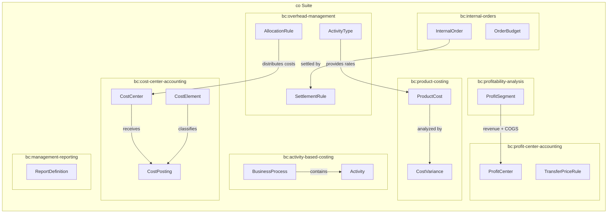
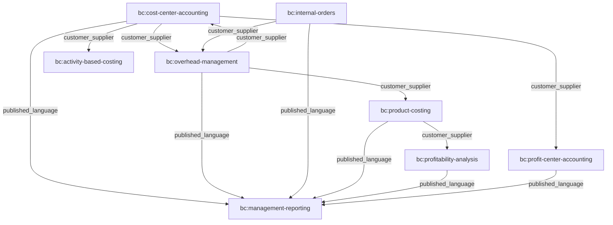
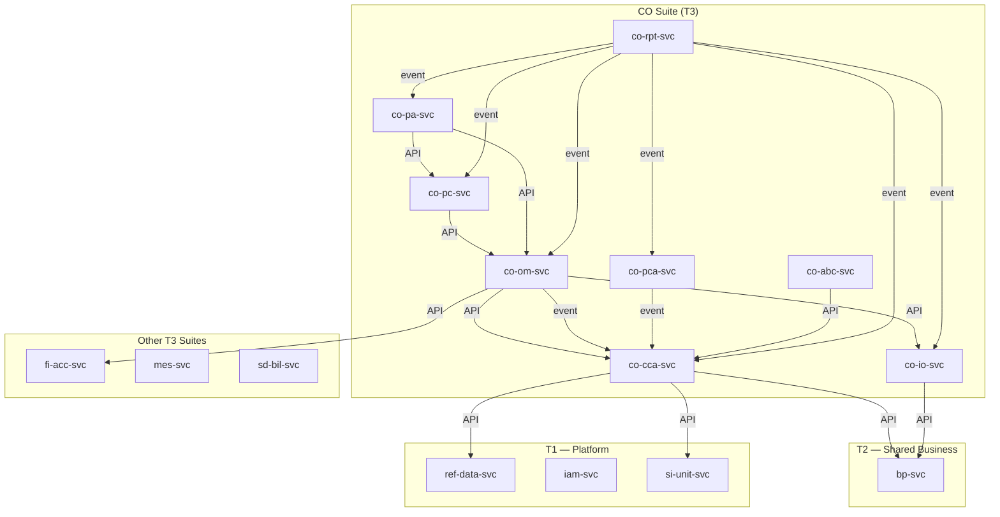
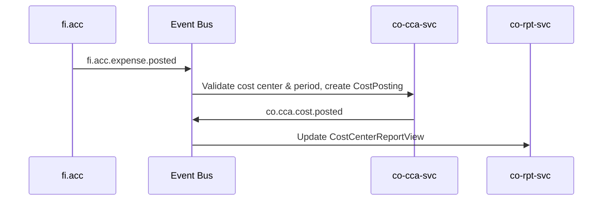
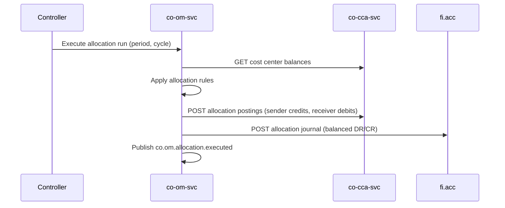
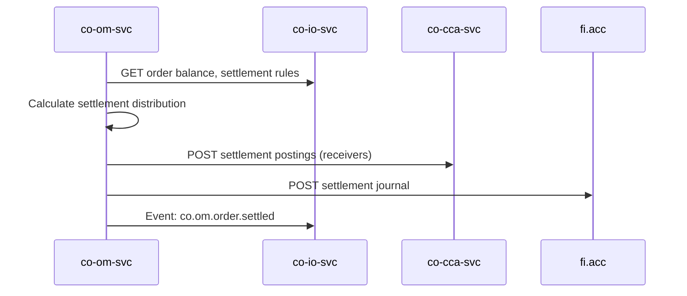
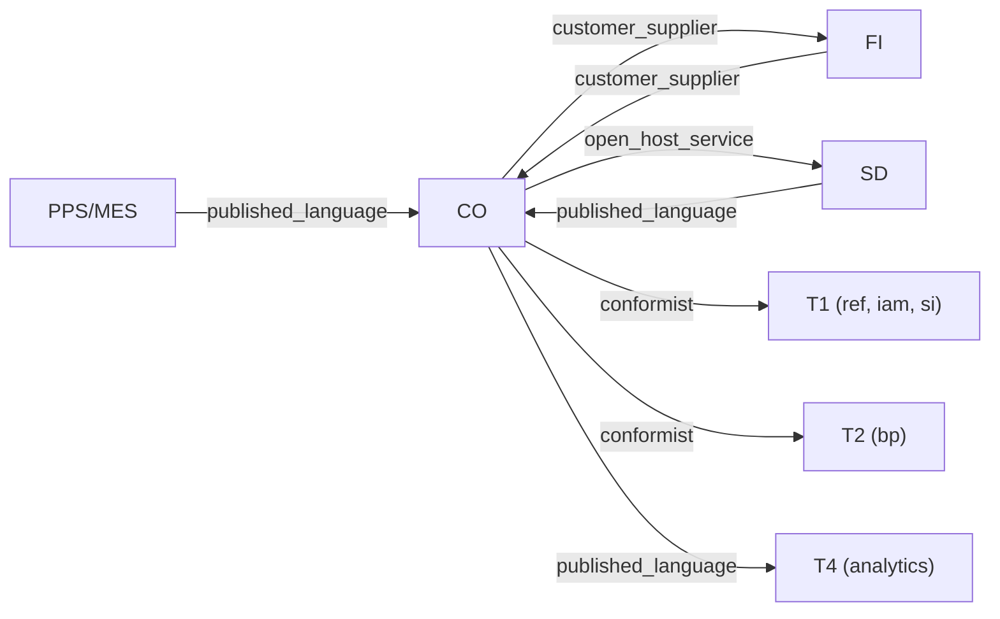

# Controlling (CO) Suite Specification

> **Conceptual Stack Layer:** Suite
> **Space:** Platform
> **Owner:** Domain Engineering Team
> **Schema alignment:** `suite-layer.schema.json`
> **Companion files:** `co.catalog.uvl` (referenced in SS6)
> **Contains:** Domain/Service Specs, Platform-Feature Specs, Feature Catalog

> **Meta Information**
> - **Version:** 2026-04-01
> - **Template:** `suite-spec.md` v1.0.0
> - **Template Compliance:** 100%
> - **Author(s):** OpenLeap Architecture Team
> - **Status:** DRAFT
> - **Suite ID:** `co`
> - **Suite Name:** Controlling
> - **Description:** Management accounting suite covering cost tracking, allocation, product costing, profitability analysis, and internal management reporting.
> - **Semantic Version:** `1.1.0`
> - **Team:**
>   - Name: `team-co`
>   - Email: `co-team@openleap.io`
>   - Slack: `#co-team`
> - **Bounded Contexts:** `bc:cost-center-accounting`, `bc:overhead-management`, `bc:internal-orders`, `bc:product-costing`, `bc:profitability-analysis`, `bc:profit-center-accounting`, `bc:activity-based-costing`, `bc:management-reporting`

---

## Specification Guidelines

> **This specification MUST comply with the OpenLeap specification guidelines.**
>
> ### Non-Negotiables
> - Never invent facts. If required info is missing, add an **OPEN QUESTION** entry.
> - Preserve intent and decisions. Only change meaning when explicitly requested.
> - Keep the spec **self-contained**: no "see chat", no implicit context.
>
> ### Style Guide
> - Prefer short sentences and lists.
> - Use MUST/SHOULD/MAY for normative statements.
> - Keep terminology consistent with the Ubiquitous Language defined in SS1.
> - Avoid ambiguous words ("often", "maybe") unless explicitly noting uncertainty.

---

<!-- ═══════════════════════════════════════════════════════════════════
     SS0  SUITE IDENTITY & PURPOSE
     ═══════════════════════════════════════════════════════════════════ -->

## 0. Suite Identity & Purpose

### 0.1 Suite Identity

| Field | Value |
|-------|-------|
| id | `co` |
| name | Controlling |
| description | Management accounting suite for internal cost tracking, allocation, product costing, profitability analysis, and management reporting |
| version | `1.1.0` |
| status | `draft` |
| owner.team | `team-co` |
| owner.email | `co-team@openleap.io` |
| owner.slack | `#co-team` |
| boundedContexts | `bc:cost-center-accounting`, `bc:overhead-management`, `bc:internal-orders`, `bc:product-costing`, `bc:profitability-analysis`, `bc:profit-center-accounting`, `bc:activity-based-costing`, `bc:management-reporting` |

### 0.2 Business Purpose

The Controlling Suite encompasses all capabilities required for **internal management accounting**, cost analysis, and profitability management to support business decisions. It tracks and analyzes costs by multiple dimensions (cost center, product, customer, project), allocates indirect costs to cost objects using various methods, calculates product costs (standard, actual, planned), analyzes profitability by customer, product, region, and sales channel, and provides internal management reports and KPIs. CO is the operational counterpart to budget planning — it executes against budgets, tracks actuals, and analyzes variances.

### 0.3 In Scope

- Cost Center Accounting: organizational cost tracking by department
- Internal Orders: project/activity cost tracking with budgets
- Activity-Based Costing: resource consumption analysis by business process
- Product Costing: standard, actual, and planned product cost calculation
- Overhead cost allocations and internal order settlements
- Profitability Analysis: multi-dimensional profit analysis (customer, product, region, channel)
- Profit Center Accounting: segment-level P&L tracking
- Management reporting: cost reports, variance analysis, drill-down
- Integration with FI: actual costs received from GL

### 0.4 Out of Scope

- General Ledger, Financial Statements (-> fi suite)
- Customer invoicing, vendor bills (-> fi suite)
- Budget Planning, forecasting (-> planning suite)
- Strategic BI, dashboards (-> T4 analytics tier)
- Production planning, scheduling (-> pps suite)
- Sales orders, pricing (-> sd suite)
- Inventory movements (-> ops suite)

### 0.5 Target Users

| Role | Interest |
|------|----------|
| Controller | Define cost structures, manage allocations, analyze variances, generate reports |
| Cost Center Manager | Monitor own cost center costs, explain budget variances |
| CFO / Finance Leadership | Review aggregated cost and profitability reports |
| Product Manager | Understand true product cost, review profitability by product |
| Sales Manager | Review customer profitability, cost-to-serve analysis |
| Operations Manager | Analyze activity efficiency and capacity utilization |

### 0.6 Business Value

- Transparent cost tracking per organizational unit, product, and customer
- Fair distribution of overhead costs using configurable allocation rules
- Accurate product costs for pricing decisions and inventory valuation
- Multi-dimensional profitability analysis for strategic decision-making
- Variance analysis identifying production inefficiencies and cost overruns
- Automated periodic allocation runs reducing manual controller effort
- Unified management reporting across all CO domains with drill-down

---

<!-- ═══════════════════════════════════════════════════════════════════
     SS1  UBIQUITOUS LANGUAGE
     ═══════════════════════════════════════════════════════════════════ -->

## 1. Ubiquitous Language

### 1.1 Glossary

| ID | Term | Aliases | Definition |
|----|------|---------|------------|
| co:glossary:cost-center | Cost Center | CC, Kostenstelle | Organizational unit to which costs are tracked, representing a department, team, or location |
| co:glossary:cost-element | Cost Element | Kostenart | Type or category of cost such as salary, materials, or utilities; primary elements map to GL accounts, secondary elements represent internal CO flows |
| co:glossary:cost-object | Cost Object | Kostentraeger | Entity to which costs are assigned — a product, internal order, or cost center |
| co:glossary:cost-posting | Cost Posting | CO Buchung | Individual cost transaction record against a cost center and cost element for a specific period |
| co:glossary:internal-order | Internal Order | Innenauftrag | Temporary cost collector for specific activities, events, projects, or capital investments with a defined start and end |
| co:glossary:activity-type | Activity Type | Leistungsart | Unit of output from a cost center (e.g., machine hours, labor hours) used for consumption-based internal charging |
| co:glossary:allocation | Allocation | Umlage, Verrechnung | Distribution of costs from a sender cost object to one or more receiver cost objects |
| co:glossary:settlement | Settlement | Abrechnung | Final assignment of accumulated costs from a temporary cost object (internal order) to permanent receivers |
| co:glossary:standard-cost | Standard Cost | Standardkosten | Predetermined cost used for planning, inventory valuation, and variance analysis |
| co:glossary:actual-cost | Actual Cost | Istkosten | Real cost incurred during a period, captured from FI postings and production data |
| co:glossary:variance | Variance | Abweichung | Difference between standard and actual cost, decomposed into categories (price, quantity, efficiency) |
| co:glossary:contribution-margin | Contribution Margin | Deckungsbeitrag | Revenue minus variable or direct costs; a measure of profitability at various levels |
| co:glossary:overhead | Overhead | Gemeinkosten | Indirect costs not directly traceable to a specific product or service |
| co:glossary:cost-driver | Cost Driver | Bezugsgröße | Measurable factor causing costs to be incurred (e.g., number of orders, machine hours) |
| co:glossary:controlling-area | Controlling Area | CO-Bereich | Organizational boundary for CO operations, typically aligned with a company or group of companies |
| co:glossary:profit-segment | Profit Segment | Ergebnisbereich | Unique combination of analysis dimensions (customer, product, region, channel) for profitability analysis |
| co:glossary:profit-center | Profit Center | Profitcenter | Organizational business segment for P&L tracking, representing a business unit, product line, or region |
| co:glossary:transfer-pricing | Transfer Pricing | Verrechnungspreis | Internal pricing for goods or services exchanged between profit centers |
| co:glossary:business-process | Business Process | Hauptprozess | Logical grouping of activities in ABC (e.g., Order-to-Cash, Procure-to-Pay) |
| co:glossary:activity | Activity | Aktivitaet, Teilprozess | Discrete unit of work within a process that consumes resources (ABC context) |
| co:glossary:resource-driver | Resource Driver | Kostentreiber (Ressource) | Metric measuring how cost center resources flow to an activity (Stage 1 in ABC) |
| co:glossary:activity-driver | Activity Driver | Kostentreiber (Prozess) | Metric measuring how activity costs flow to cost objects (Stage 2 in ABC) |
| co:glossary:unused-capacity | Unused Capacity | Leerkosten | Gap between practical capacity and actual output; reported separately in ABC |
| co:glossary:commitment | Commitment | Obligo | Anticipated cost from a purchase order that has not yet been invoiced |
| co:glossary:allocation-cycle | Allocation Cycle | Zyklus | Execution order for allocation rules; lower cycles execute first in step-down allocation |
| co:glossary:read-model | Read Model | — | Query-optimized materialized view built from events, used by co.rpt for reporting |

### 1.2 UBL Boundary Test

**CO vs. FI:**
In CO, "Cost Posting" means an internal management accounting record tracking costs by cost center and cost element for variance analysis. In FI, the same business event is recorded as a "Journal Entry" with debit/credit accounts for legal compliance. CO uses cost flow logic (sender/receiver); FI uses double-entry (DR/CR). This confirms CO and FI are separate suites.

**CO vs. Planning:**
In CO, "Budget" is an approved financial authorization for a cost object against which actuals are tracked. In Planning, the same concept is a "Plan" created top-down with strategic targets and forecasts. CO operates bottom-up and operational; Planning operates top-down and strategic. This confirms CO and Planning are separate suites.

---

<!-- ═══════════════════════════════════════════════════════════════════
     SS2  DOMAIN MODEL
     ═══════════════════════════════════════════════════════════════════ -->

## 2. Domain Model

### 2.1 Conceptual Overview



### 2.2 Core Concepts

| Concept | Owner (Service) | Description | Glossary Ref |
|---------|----------------|-------------|-------------|
| Cost Center | `co-cca-svc` | Organizational unit for tracking costs | `co:glossary:cost-center` |
| Cost Element | `co-cca-svc` | Type/category of cost | `co:glossary:cost-element` |
| Cost Posting | `co-cca-svc` | Individual cost transaction record | `co:glossary:cost-posting` |
| Allocation Rule | `co-om-svc` | Definition of how indirect costs are distributed | `co:glossary:allocation` |
| Activity Type | `co-om-svc` | Unit of cost center output for internal charging | `co:glossary:activity-type` |
| Settlement Rule | `co-om-svc` | Definition of how internal order costs flow to final receivers | `co:glossary:settlement` |
| Internal Order | `co-io-svc` | Temporary cost collector with budget | `co:glossary:internal-order` |
| Order Budget | `co-io-svc` | Financial authorization for an internal order | `co:glossary:commitment` |
| Product Cost | `co-pc-svc` | Calculated cost of a product (standard, actual, planned) | `co:glossary:standard-cost` |
| Cost Variance | `co-pc-svc` | Difference between standard and actual cost | `co:glossary:variance` |
| Profit Segment | `co-pa-svc` | Dimension combination for profitability analysis | `co:glossary:profit-segment` |
| Profit Center | `co-pca-svc` | Organizational segment for P&L tracking | `co:glossary:profit-center` |
| Business Process | `co-abc-svc` | Logical grouping of activities for ABC | `co:glossary:business-process` |
| Activity | `co-abc-svc` | Discrete unit of work consuming resources | `co:glossary:activity` |
| Report Definition | `co-rpt-svc` | Configurable template for management reports | `co:glossary:read-model` |

### 2.3 Shared Kernel

| Concept | Owner | Shared With | Mechanism |
|---------|-------|-------------|-----------|
| Cost Element | `co-cca-svc` | `co-om-svc`, `co-io-svc`, `co-pc-svc`, `co-abc-svc` | `api` |
| Cost Center | `co-cca-svc` | `co-om-svc`, `co-io-svc`, `co-abc-svc`, `co-pca-svc` | `api` |
| Controlling Area | `co-cca-svc` | All CO services | `api` |
| Activity Type | `co-om-svc` | `co-pc-svc`, `co-abc-svc` | `api` |
| Product Cost | `co-pc-svc` | `co-pa-svc`, `co-pca-svc` | `api` + `event` |

### 2.4 Bounded Context Map (Intra-Suite)

| Upstream | Downstream | Pattern | Description |
|----------|-----------|---------|-------------|
| `bc:cost-center-accounting` | `bc:overhead-management` | `customer_supplier` | OM reads CC balances for allocation calculations |
| `bc:cost-center-accounting` | `bc:profit-center-accounting` | `customer_supplier` | PCA aggregates CC costs by profit center assignment |
| `bc:cost-center-accounting` | `bc:activity-based-costing` | `customer_supplier` | ABC reads CC costs as resource pools |
| `bc:overhead-management` | `bc:cost-center-accounting` | `customer_supplier` | CCA receives allocation postings from OM |
| `bc:overhead-management` | `bc:product-costing` | `customer_supplier` | PC reads overhead rates and activity prices from OM |
| `bc:internal-orders` | `bc:overhead-management` | `customer_supplier` | OM reads IO balances for settlement |
| `bc:product-costing` | `bc:profitability-analysis` | `customer_supplier` | PA reads product costs for COGS calculation |
| `bc:cost-center-accounting` | `bc:management-reporting` | `published_language` | RPT consumes CCA events to build read models |
| `bc:overhead-management` | `bc:management-reporting` | `published_language` | RPT consumes OM events for allocation reporting |
| `bc:internal-orders` | `bc:management-reporting` | `published_language` | RPT consumes IO events for order reporting |
| `bc:product-costing` | `bc:management-reporting` | `published_language` | RPT consumes PC events for cost/variance reports |
| `bc:profitability-analysis` | `bc:management-reporting` | `published_language` | RPT consumes PA events for profitability views |
| `bc:profit-center-accounting` | `bc:management-reporting` | `published_language` | RPT consumes PCA events for segment reports |



---

<!-- ═══════════════════════════════════════════════════════════════════
     SS3  SERVICE LANDSCAPE
     ═══════════════════════════════════════════════════════════════════ -->

## 3. Service Landscape

### 3.1 Service Catalog

| Service ID | Name | Bounded Context | Status | Responsibility | Spec |
|-----------|------|----------------|--------|----------------|------|
| `co-cca-svc` | Cost Center Accounting | `bc:cost-center-accounting` | `development` | Cost center master data, cost element definitions, cost posting capture, plan data, period management | `co_cca-spec.md` |
| `co-om-svc` | Overhead Management | `bc:overhead-management` | `development` | Allocation rules, allocation run execution, activity type management, activity price calculation, settlement execution | `co_om-spec.md` |
| `co-io-svc` | Internal Orders | `bc:internal-orders` | `development` | Internal order lifecycle, budget management, cost capture, commitment tracking | `co_io-spec.md` |
| `co-pc-svc` | Product Costing | `bc:product-costing` | `development` | Standard/actual/planned product cost calculation, cost components, costing runs, variance analysis | `co_pc-spec.md` |
| `co-pa-svc` | Profitability Analysis | `bc:profitability-analysis` | `planned` | Multi-dimensional profitability analysis, profit segments, contribution margin calculation | `co_pa-spec.md` |
| `co-pca-svc` | Profit Center Accounting | `bc:profit-center-accounting` | `planned` | Profit center master data, segment P&L, transfer pricing | `co_pca-spec.md` |
| `co-abc-svc` | Activity-Based Costing | `bc:activity-based-costing` | `planned` | Business process/activity definitions, resource/activity drivers, ABC runs, cost-to-serve analysis | `co_abc-spec.md` |
| `co-rpt-svc` | Management Reporting | `bc:management-reporting` | `development` | Report definitions, report generation, read-optimized materialized views, T4 data export | `co_rpt-spec.md` |

### 3.2 Responsibility Matrix

| Responsibility | Service |
|---------------|---------|
| Organizational cost tracking (departments) | `co-cca-svc` |
| Cost element definitions (primary/secondary) | `co-cca-svc` |
| Plan vs. actual comparison at department level | `co-cca-svc` |
| Cost allocations (direct, driver-based, step-down) | `co-om-svc` |
| Activity prices (machine hour rate, labor hour rate) | `co-om-svc` |
| Internal order settlement | `co-om-svc` |
| Project/activity cost tracking with budgets | `co-io-svc` |
| Commitment tracking (PO commitments) | `co-io-svc` |
| Standard and actual product cost calculation | `co-pc-svc` |
| Cost variance analysis (price, quantity, efficiency) | `co-pc-svc` |
| Customer profitability analysis | `co-pa-svc` |
| Product profitability analysis | `co-pa-svc` |
| Segment profitability (profit centers as P&L units) | `co-pca-svc` |
| Transfer pricing between business segments | `co-pca-svc` |
| Process-oriented costing (resource/activity drivers) | `co-abc-svc` |
| Unused capacity cost analysis | `co-abc-svc` |
| Management reports (cost center, order, variance) | `co-rpt-svc` |
| Read model projections from CO domain events | `co-rpt-svc` |

### 3.3 Service Dependency Diagram



---

<!-- ═══════════════════════════════════════════════════════════════════
     SS4  INTEGRATION PATTERNS
     ═══════════════════════════════════════════════════════════════════ -->

## 4. Integration Patterns

### 4.1 Pattern Decision

| Field | Value |
|-------|-------|
| **Pattern** | `hybrid` |

**Rationale:**
- Choreography (EDA) for broadcasting facts: cost postings, status changes, period closings, profitability results
- Orchestration for multi-step coordinated workflows: allocation cycles (sequential, with compensation), costing runs, settlement execution
- OM acts as orchestrator for allocation runs; all other inter-service communication uses event choreography

### 4.2 Key Event Flows

#### Flow 1: FI Actual Costs to CO

**Trigger:** FI posts an expense journal entry



#### Flow 2: Month-End Allocation Cycle

**Trigger:** Controller initiates allocation for a period



#### Flow 3: Internal Order Settlement

**Trigger:** Controller initiates settlement



### 4.3 Sync vs. Async Decisions

| Integration | Type | Reason |
|------------|------|--------|
| FI actual costs → CCA | `async` | Eventual consistency acceptable; at-least-once delivery |
| OM reads CCA balances | `sync` | Real-time balance needed for accurate allocation calculation |
| OM sends allocation postings to CCA | `async` | Event command pattern for decoupling |
| OM posts journal to FI | `sync` | Must confirm journal acceptance before marking run Completed |
| PC reads BOM from PD/MES | `sync` | Required for costing run; data must be current |
| PA reads product cost from PC | `sync` | Needed for real-time COGS lookup during profitability run |
| RPT receives all CO events | `async` | Read model projection; eventual consistency acceptable |

### 4.4 Error Handling

| Scenario | Handling |
|----------|---------|
| FI event processing fails in CCA | Retry up to 5 times with exponential backoff; then dead-letter queue for manual investigation |
| Allocation run rule fails mid-cycle | OM marks run as Failed; no partial postings committed (atomic per run) |
| Allocation run cycle 2 fails | OM reverses cycles 1-2 (compensation) |
| Settlement fails for single order | Settlement marked Failed; other orders unaffected (batch continues) |

---

<!-- ═══════════════════════════════════════════════════════════════════
     SS5  EVENT CONVENTIONS
     ═══════════════════════════════════════════════════════════════════ -->

## 5. Event Conventions

### 5.1 Routing Key Pattern

**Pattern:** `co.{domain}.{aggregate}.{action}`

| Segment | Description | Examples |
|---------|-------------|---------|
| `co` | Always `co` | `co` |
| `{domain}` | Domain short code | cca, om, io, pc, pa, pca, abc, rpt |
| `{aggregate}` | Aggregate root name (lowercase) | costCenter, cost, allocation, order, productCost, profitability, profitCenter, process, run, report |
| `{action}` | Past-tense verb | `created`, `updated`, `posted`, `executed`, `settled`, `calculated`, `completed`, `statusChanged`, `generated` |

**Examples:**
- `co.cca.costCenter.created`
- `co.cca.cost.posted`
- `co.cca.period.closed`
- `co.om.allocation.executed`
- `co.om.order.settled`
- `co.io.order.statusChanged`
- `co.pc.productCost.activated`
- `co.pc.variance.calculated`
- `co.pa.profitability.calculated`
- `co.pca.profitCenter.calculated`
- `co.abc.run.completed`
- `co.rpt.report.generated`

### 5.2 Payload Envelope

```json
{
  "eventId": "uuid",
  "eventType": "co.{domain}.{aggregate}.{action}",
  "timestamp": "ISO-8601",
  "tenantId": "string",
  "correlationId": "uuid",
  "causationId": "uuid",
  "producer": "co-{domain}-svc",
  "schemaVersion": "{major}.{minor}.{patch}",
  "payload": { }
}
```

### 5.3 Versioning Strategy

| Field | Value |
|-------|-------|
| **Strategy** | Schema evolution with backward compatibility |
| **Description** | New optional fields are additive. Removing fields requires a new major version with parallel publishing during migration. |

### 5.4 Event Catalog

| Routing Key | Producer | Consumer(s) | Description |
|------------|----------|-------------|-------------|
| `co.cca.costCenter.created` | `co-cca-svc` | `co-om-svc`, `co-rpt-svc`, `co-pca-svc` | New cost center available |
| `co.cca.costCenter.statusChanged` | `co-cca-svc` | `co-om-svc`, `co-rpt-svc` | Cost center status transition |
| `co.cca.cost.posted` | `co-cca-svc` | `co-rpt-svc`, `co-pca-svc`, `co-abc-svc` | New cost posting recorded |
| `co.cca.period.closed` | `co-cca-svc` | `co-rpt-svc`, `co-pa-svc`, `co-abc-svc` | Fiscal period closed |
| `co.om.allocation.executed` | `co-om-svc` | `co-rpt-svc`, `co-pc-svc`, `co-pa-svc` | Allocation run completed |
| `co.om.allocation.posted` | `co-om-svc` | `co-cca-svc` | Allocation postings to record |
| `co.om.order.settled` | `co-om-svc` | `co-io-svc`, `co-cca-svc`, `co-pc-svc` | Internal order settled |
| `co.om.activityPrice.calculated` | `co-om-svc` | `co-pc-svc` | Activity prices updated |
| `co.io.order.created` | `co-io-svc` | `co-rpt-svc` | New internal order |
| `co.io.order.statusChanged` | `co-io-svc` | `co-om-svc`, `co-rpt-svc` | Order status transition |
| `co.io.order.budgetExceeded` | `co-io-svc` | `co-rpt-svc`, notification-svc | Budget threshold breached |
| `co.pc.productCost.activated` | `co-pc-svc` | `co-pa-svc`, `sd`, `fi-acc-svc`, `co-rpt-svc` | New standard cost active |
| `co.pc.actualCost.calculated` | `co-pc-svc` | `co-rpt-svc` | Actual production cost calculated |
| `co.pc.variance.calculated` | `co-pc-svc` | `co-rpt-svc`, `fi-acc-svc` | Variance analysis results |
| `co.pc.costingRun.completed` | `co-pc-svc` | `co-rpt-svc` | Costing run finished |
| `co.pa.profitability.calculated` | `co-pa-svc` | `co-rpt-svc`, T4 | Period profitability results |
| `co.pa.segment.created` | `co-pa-svc` | `co-rpt-svc` | New profit segment dimension |
| `co.pca.profitCenter.created` | `co-pca-svc` | `co-cca-svc`, `co-rpt-svc` | New profit center |
| `co.pca.profitCenter.calculated` | `co-pca-svc` | `co-rpt-svc`, `fi-acc-svc` | Segment P&L calculated |
| `co.abc.process.created` | `co-abc-svc` | `co-rpt-svc` | New business process defined |
| `co.abc.run.completed` | `co-abc-svc` | `co-pc-svc`, `co-pa-svc`, `co-rpt-svc` | ABC run results available |
| `co.abc.run.reversed` | `co-abc-svc` | `co-pc-svc`, `co-pa-svc` | ABC run reversed |
| `co.rpt.report.generated` | `co-rpt-svc` | notification-svc, dms-svc | Report ready for distribution |

---

<!-- ═══════════════════════════════════════════════════════════════════
     SS6  FEATURE CATALOG
     ═══════════════════════════════════════════════════════════════════ -->

## 6. Feature Catalog

> OPEN QUESTION: The feature catalog has not been authored yet. The feature tree, leaf features, mandatory/optional annotations, and companion `co.catalog.uvl` file MUST be defined before this specification can move to REVIEW status.

### 6.1 Feature Tree

> OPEN QUESTION: Content for this section has not been authored yet.

### 6.2 Mandatory Features

> OPEN QUESTION: Content for this section has not been authored yet.

### 6.3 Cross-Suite Feature Dependencies

> OPEN QUESTION: Content for this section has not been authored yet.

### 6.4 Feature Register

> OPEN QUESTION: Content for this section has not been authored yet.

### 6.5 Variability Summary

> OPEN QUESTION: Content for this section has not been authored yet.

---

<!-- ═══════════════════════════════════════════════════════════════════
     SS7  CROSS-CUTTING CONCERNS
     ═══════════════════════════════════════════════════════════════════ -->

## 7. Cross-Cutting Concerns

### 7.1 Compliance

| Regulation | Requirement | Implementation |
|-----------|-------------|----------------|
| SOX | Cost data integrity, audit trail for allocations and settlements | Immutable cost postings, versioned allocation rules with approval workflow, full audit log |
| GDPR (EU) | Protection of personal data linked via responsible persons | Responsible person references stored as FK to BP; no direct PII in CO; access filtered by RBAC |
| Internal Audit | All state changes and financial transactions auditable | All cost postings, allocation runs, settlements logged with who, when, what, old value, new value |
| HGB §257 | Financial record retention | Cost postings and allocation results retained for 10 years |

### 7.2 Security

| Aspect | Approach |
|--------|---------|
| **Authentication** | OAuth2 / OIDC via T1 iam-svc |
| **Authorization** | RBAC via T1 iam-svc, roles defined per service (e.g., CO_CCA_CONTROLLER, CO_OM_ADMIN) |
| **Data Classification** | Confidential — cost amounts, product costs, profitability data encrypted at rest; Restricted — unused capacity, customer profitability, transfer prices with strict RBAC |

### 7.3 Multi-Tenancy

| Aspect | Value |
|--------|-------|
| **Model** | `shared_schema` |
| **Isolation** | Row-Level Security via `tenant_id` on all tables |
| **Tenant ID Propagation** | JWT claim `tenant_id` propagated in event envelope and `X-Tenant-ID` header |

**Rules:**
- All queries MUST include `tenant_id` filter
- Cross-tenant data access is forbidden at the API level
- Controlling Area concept maps to tenant or subset of tenant

### 7.4 Audit

**Audit Requirements:**
- All state changes on aggregates MUST be audit-logged
- Audit log entries MUST include: who, when, what, old value, new value
- Cost postings are immutable; corrections via reversal postings only
- Allocation rules MUST be versioned with change history
- Standard cost changes MUST be audited
- Manual postings MUST require approval

**Retention Policies:**

| Entity / Data Class | Retention Period | Legal Basis | Action After Expiry |
|--------------------|-----------------|-------------|-------------------|
| Cost Postings | 10 years | HGB §257 | `archive` |
| Allocation Rules (versions) | 10 years | SOX compliance | `archive` |
| Allocation Run Results | 10 years | HGB §257 | `archive` |
| Standard Cost History | 10 years | HGB §257 | `archive` |
| Audit Log | 10 years | Internal policy | `archive` |
| Report Instances | 3 years | Internal policy | `delete` |

---

<!-- ═══════════════════════════════════════════════════════════════════
     SS8  EXTERNAL INTERFACES
     ═══════════════════════════════════════════════════════════════════ -->

## 8. External Interfaces

### 8.1 Outbound Interfaces (CO -> Other Suites)

| Target Suite | Interface Type | Interface Name | Description |
|-------------|---------------|----------------|-------------|
| fi | `api` | `POST /api/fi/acc/v1/journals` | Allocation and settlement journals posted to FI General Ledger |
| fi | `event` | `co.pc.productCost.activated` | New standard cost for inventory valuation |
| fi | `event` | `co.pc.variance.calculated` | Variance journals for GL posting |
| fi | `event` | `co.pca.profitCenter.calculated` | Segment data for IFRS 8 disclosure |
| sd | `api` | `GET /api/co/pc/v1/product-costs` | SD reads standard costs as pricing floor |
| T4 | `event` | `co.pa.profitability.calculated` | Profitability data for strategic analytics |
| T4 | `api` | RPT data export | Aggregated CO data for BI dashboards |

### 8.2 Inbound Interfaces (Other Suites -> CO)

| Source Suite | Interface Type | Interface Name | Description |
|-------------|---------------|----------------|-------------|
| fi | `event` | `fi.acc.expense.posted` | Actual costs from GL for cost center and order posting |
| sd | `event` | `sd.bil.invoice.posted` | Revenue data for profitability analysis |
| pps/mes | `event` | `mes.production.completed` | Actual production data (quantities, hours) for actual costing |
| pur | `event` | `pur.commitment.created` / `pur.commitment.invoiced` | PO commitments for internal order tracking |
| T1 ref | `api` | `GET /api/ref/ref/v1/catalogs/{catalog}` | Reference data: currencies, org units, fiscal calendars |
| T1 si | `api` | `GET /api/ref/si/v1/units` | Unit of measure validation |
| T2 bp | `api` | `GET /api/shared/bp/v1/parties/{id}` | Business partner lookup (responsible persons, customers) |

### 8.3 External Context Mapping

| Upstream | Downstream | Pattern | Description |
|----------|-----------|---------|-------------|
| `fi` | `co` | `customer_supplier` | FI publishes expense events; CO consumes and categorizes by CO dimensions |
| `co` | `fi` | `customer_supplier` | CO posts allocation/settlement journals to FI |
| `sd` | `co` | `published_language` | SD publishes invoice events with standard fields; CO consumes for PA |
| `pps` | `co` | `published_language` | MES publishes production events; CO consumes for actual costing |
| `co` | `sd` | `open_host_service` | CO exposes product cost API for SD pricing |
| `T1 ref` | `co` | `conformist` | CO conforms to platform reference data formats |
| `T2 bp` | `co` | `conformist` | CO conforms to BP party model |



---

<!-- ═══════════════════════════════════════════════════════════════════
     SS9  ARCHITECTURE DECISIONS
     ═══════════════════════════════════════════════════════════════════ -->

## 9. Architecture Decisions

### ADR-CO-001: Three-Layer Domain Architecture

| Field | Value |
|-------|-------|
| **ID** | `ADR-CO-001` |
| **Status** | `accepted` |
| **Scope** | All CO services |

**Context:**
CO domains have natural layering: cost collection, cost allocation/settlement, and reporting. The architecture must enforce clear data flow direction.

**Decision:**
Organize CO into three layers: Layer 1 (Cost Collection: CCA, IO, PC, PA, PCA, ABC), Layer 2 (Cost Allocation & Settlement: OM), Layer 3 (Management Reporting: RPT). Data flows upward; RPT is a pure consumer.

**Rationale:**
- Clear separation of transactional and reporting concerns
- Enforces unidirectional data flow
- Enables independent scaling of reporting layer

**Consequences:**

| Positive | Negative |
|----------|----------|
| Clear responsibility boundaries | OM becomes critical path for month-end |
| Reporting decoupled from transactions | Additional latency for report freshness |

**Affected Services:** All CO services

### ADR-CO-002: CO as Read-Only Consumer of FI

| Field | Value |
|-------|-------|
| **ID** | `ADR-CO-002` |
| **Status** | `accepted` |
| **Scope** | `co-cca-svc`, `co-io-svc`, `co-pc-svc` |

**Context:**
CO needs actual cost data from FI. Should CO read FI data or replicate it?

**Decision:**
CO subscribes to FI expense events and creates its own cost postings. CO never reads the FI database directly. Allocations generate balanced journals posted back to FI via API.

**Rationale:**
- Loose coupling; CO owns its own data
- Event-driven pattern consistent with platform architecture

**Consequences:**

| Positive | Negative |
|----------|----------|
| Decoupled from FI schema changes | Requires monthly reconciliation (CO vs. FI) |
| CO can enrich postings with CO dimensions | Event processing lag |

**Affected Services:** `co-cca-svc`, `co-io-svc`, `co-pc-svc`

### ADR-CO-003: OM as Allocation Orchestrator

| Field | Value |
|-------|-------|
| **ID** | `ADR-CO-003` |
| **Status** | `accepted` |
| **Scope** | `co-om-svc` |

**Context:**
Allocation runs require sequential cycles with compensation on failure. Pure choreography cannot enforce ordering.

**Decision:**
OM acts as the orchestrator for allocation runs. Sequential cycles require coordination, and failure handling requires compensation (reversal).

**Rationale:**
- Clear workflow control and reliable compensation
- Month-end process requires deterministic ordering

**Consequences:**

| Positive | Negative |
|----------|----------|
| Reliable multi-cycle allocation | OM availability critical during month-end |
| Explicit compensation flow | Slightly higher coupling |

**Affected Services:** `co-om-svc`, `co-cca-svc`, `fi-acc-svc`

---

<!-- ═══════════════════════════════════════════════════════════════════
     SS10  ROADMAP
     ═══════════════════════════════════════════════════════════════════ -->

## 10. Roadmap

| Phase | Timeframe | Items |
|-------|-----------|-------|
| Phase 1 — Foundation (P1) | Q2-Q3 2026 | Core CO: co.cca, co.om, co.io, co.pc, co.rpt (5 domains, 12-16 weeks) |
| Phase 2 — Extended CO (P2) | Q4 2026 | Advanced CO: co.pa, co.pca, co.abc (3 domains, 8-12 weeks) |
| Phase 3 — Optimization | Q1 2027 | Performance tuning, advanced allocation methods (reciprocal), T4 analytics integration, time-driven ABC |

---

<!-- ═══════════════════════════════════════════════════════════════════
     SS11  APPENDIX
     ═══════════════════════════════════════════════════════════════════ -->

## 11. Appendix

### 11.1 Change Log

| Date | Version | Author | Changes |
|------|---------|--------|---------|
| 2025-12-05 | 1.0.0 | OpenLeap Architecture Team | Initial suite specification |
| 2026-04-01 | 1.1.0 | OpenLeap Architecture Team | Restructured to template compliance (SS0-SS11) |

### 11.2 Review & Approval

**Status:** DRAFT

**Reviewers:**

| Role | Name | Date | Status |
|------|------|------|--------|
| Suite Architect | TBD | — | [ ] Reviewed |
| Domain Lead (cca) | TBD | — | [ ] Reviewed |
| Domain Lead (om) | TBD | — | [ ] Reviewed |
| Domain Lead (pc) | TBD | — | [ ] Reviewed |
| Product Owner | TBD | — | [ ] Reviewed |

**Approval:**

| Role | Name | Date | Approved |
|------|------|------|----------|
| Suite Architect | TBD | — | [ ] |
| Engineering Manager | TBD | — | [ ] |

---

## CO vs. Related Suites — Quick Reference

| Aspect | CO (Controlling) | FI (Financial Accounting) |
|--------|------------------|---------------------------|
| Purpose | Management decisions | Legal compliance |
| Audience | Internal (management) | External (tax, auditors) |
| Standards | Company-specific | IFRS, GAAP (mandatory) |
| Granularity | Cost object level | Account level |
| Time Focus | Forward + historical | Historical only |
| Transactions | External + Internal | External only |
| Logic | Cost flow (sender/receiver) | Double-entry (DR/CR) |
| Reconciliation | Can have variances | Must match to penny |
| Postings | Actual + Plan + Budget | Actual only |

## Acronyms

| Acronym | Full Name |
|---------|-----------|
| CO | Controlling / Management Accounting |
| CCA | Cost Center Accounting |
| OM | Overhead Management |
| IO | Internal Orders |
| PC | Product Costing |
| PA | Profitability Analysis |
| PCA | Profit Center Accounting |
| ABC | Activity-Based Costing |
| RPT | Management Reporting |
| COGS | Cost of Goods Sold |
| WIP | Work in Progress |
| FI | Financial Accounting |

## Dependencies

- FI Suite MUST be implemented first (CO consumes FI actuals)
- Reference data infrastructure (T1.REF) MUST be available
- Business Partner (T2.BP) MUST be available for responsible persons

---

## Authoring Checklist

> Before moving to REVIEW status, verify:

- [x] Suite ID follows pattern `^[a-z]{2,4}$` (SS0)
- [x] Business purpose is at least 50 characters (SS0)
- [x] In-scope and out-of-scope are concrete and mutually exclusive (SS0)
- [x] UBL glossary has entries for every core concept (SS1)
- [x] Every glossary definition is at least 20 characters (SS1)
- [x] UBL boundary test demonstrates vocabulary distinction from at least one related suite (SS1)
- [x] Every core concept in SS2 has a glossary_ref back to SS1 (SS2)
- [ ] Shared kernel types define authoritative attributes (SS2, if applicable)
- [x] Bounded context map uses valid DDD patterns (SS2)
- [x] Service catalog lists all services with status and spec reference (SS3)
- [x] Integration pattern decision has rationale (SS4)
- [x] Event flows cover all major intra-suite workflows (SS4)
- [x] Routing key pattern is documented with segments and examples (SS5)
- [x] Payload envelope matches platform standard (SS5)
- [x] Event catalog lists every published event (SS5)
- [ ] Feature tree is complete with mandatory/optional annotations (SS6)
- [ ] Cross-suite feature dependencies are listed (SS6)
- [ ] Companion `co.catalog.uvl` is created and matches SS6 tree (SS6)
- [x] Compliance requirements list all applicable regulations (SS7)
- [x] Multi-tenancy model is specified (SS7)
- [x] Retention policies have legal basis (SS7)
- [x] External interfaces document all cross-suite communication (SS8)
- [x] External context mapping uses valid DDD patterns (SS8)
- [x] All ADRs have ID pattern `ADR-CO-NNN` (SS9)
- [x] Roadmap covers at least the next two phases (SS10)
