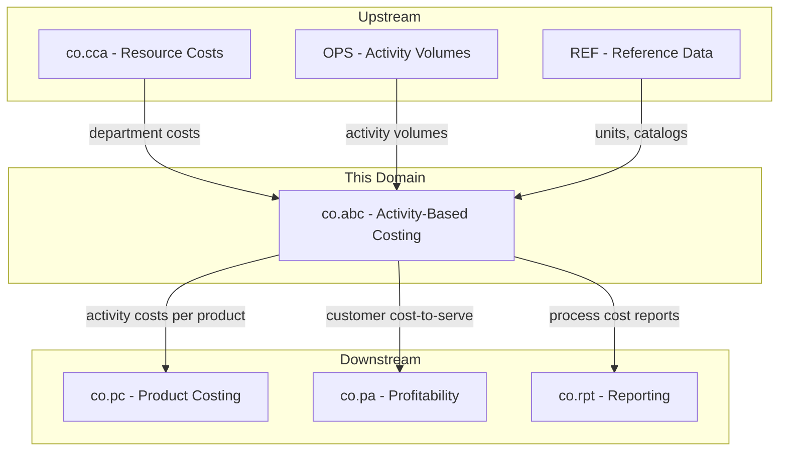
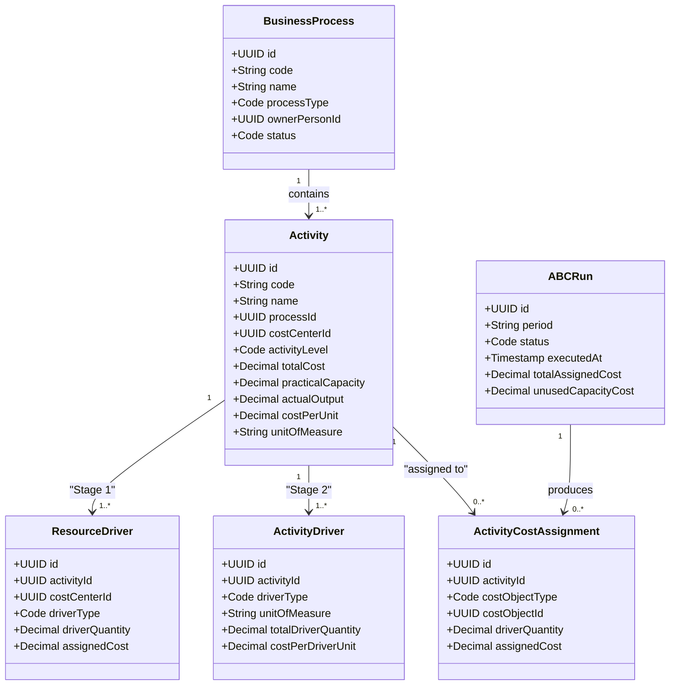
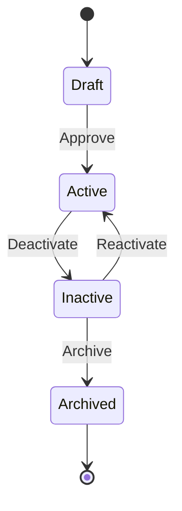
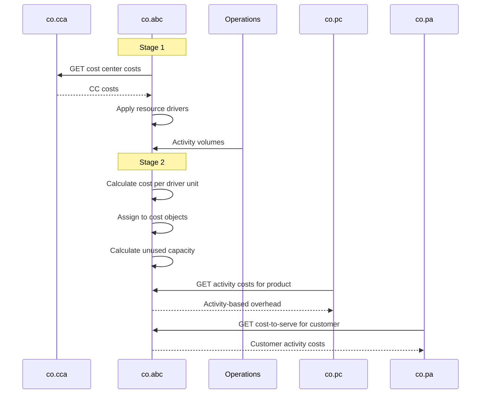
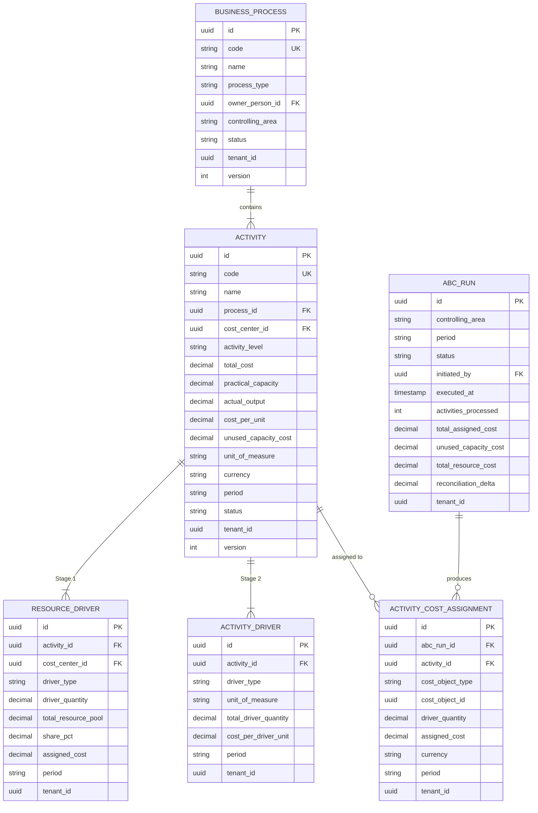

# CO - ABC Activity-Based Costing Domain / Service Specification

> **Conceptual Stack Layer:** Domain / Service
> **Space:** Platform
> **Owner:** Domain Engineering Team
> **Schema alignment:** `service-layer.schema.json`
> **Companion files:** `openapi.yaml`, `*.schema.json` (event contracts)
> **Referenced by:** Platform-Feature Spec SS5 (backend dependencies), BFF Contract
> **Belongs to:** CO Suite Spec (`_co_suite.md`)

> **Meta Information**
> - **Version:** 2026-04-01
> - **Template:** `domain-service-spec.md` v1.0.0
> - **Template Compliance:** ~85% — §11/§12 stubs, §8 no column-level table defs
> - **Author(s):** OpenLeap Architecture Team
> - **Status:** DRAFT
> - **Suite:** `co`
> - **Domain:** `abc`
> - **Bounded Context Ref:** `bc:activity-based-costing`
> - **Service ID:** `co-abc-svc`
> - **basePackage:** `io.openleap.co.abc`
> - **API Base Path:** `/api/co/abc/v1`
> - **OpenLeap Starter Version:** `v1`
> - **Port:** TBD
> - **Repository:** TBD
> - **Tags:** `controlling`, `abc`, `activity`, `process-costing`, `cost-driver`
> - **Team:**
>   - Name: `team-co`
>   - Email: `co-team@openleap.io`
>   - Slack: `#co-team`

---

## Specification Guidelines Compliance

>
> ### Non-Negotiables
> - Never invent facts. If required info is missing, add an **OPEN QUESTION** entry.
> - Preserve intent and decisions. Only change meaning when explicitly requested.
> - Do not remove normative constraints unless they are explicitly replaced.
> - Keep the spec **self-contained**: no "see chat", no implicit context.
>
> ### Style Guide
> - Prefer short sentences and lists.
> - Use MUST/SHOULD/MAY for normative statements.
> - Keep terminology consistent (Aggregate, Domain Service, Application Service, Command, Event).

---

## 0. Document Purpose & Scope

### 0.1 Purpose
This specification defines the Activity-Based Costing (ABC) domain, which provides a process-oriented view of costs. Unlike traditional cost center accounting (department-based), ABC traces costs to business processes and activities that consume resources, enabling more accurate cost assignment to products, services, and customers.

### 0.2 Target Audience
- Product Owners & Business Stakeholders
- System Architects & Technical Leads
- Integration Engineers

### 0.3 Scope
**In Scope:**
- Business process definition and modeling
- Activity driver management (cost drivers)
- Resource driver management (resource consumption by activities)
- Process cost calculation
- Activity-based cost assignment to cost objects (products, customers, orders)
- Capacity analysis (practical vs. actual, unused capacity cost)
- Process efficiency analysis

**Out of Scope:**
- Traditional cost center accounting (-> co.cca)
- Overhead allocation by simple percentages (-> co.om)
- Product standard costing (-> co.pc)
- Business process management / workflow (-> BPM tools)

### 0.4 Related Documents
- `_co_suite.md` - CO Suite overview
- `co_cca-spec.md` - Cost Center Accounting (resource pool source)
- `co_om-spec.md` - Overhead Management (traditional allocations)
- `co_pc-spec.md` - Product Costing
- `co_pa-spec.md` - Profitability Analysis
- `co_rpt-spec.md` - Management Reporting

---

## 1. Business Context

### 1.1 Domain Purpose
`co.abc` answers **"What activities consume resources and at what cost?"** Traditional cost accounting assigns costs to departments. ABC assigns costs to activities (order processing, quality inspection, customer support) and then to the cost objects that consume those activities. This reveals the true cost of complexity and process inefficiency.

### 1.2 Business Value
- Accurate costing of complex products/services
- Identification of high-cost, low-value activities
- Support for process improvement and lean initiatives
- Better cost attribution for diverse product portfolios
- Customer cost-to-serve analysis
- Unused capacity visibility and management

### 1.3 Key Stakeholders

| Role | Responsibility | Primary Use Cases |
|------|----------------|-------------------|
| Controller | Define processes, maintain drivers, run calculations | UC-001, UC-003 |
| Process Owner | Review process costs, identify improvements | UC-004 |
| Product Manager | Understand true product cost by activity | UC-005 |
| Operations Manager | Analyze activity efficiency and capacity | UC-004, UC-006 |

### 1.4 Strategic Positioning



### 1.5 Service Context

| Property | Value |
|----------|-------|
| **Suite** | `co` |
| **Domain** | `abc` |
| **Bounded Context** | `bc:activity-based-costing` |
| **Service ID** | `co-abc-svc` |
| **Base Package** | `io.openleap.co.abc` |

**Responsibilities:**
- Business process and activity definition
- Resource driver management (Stage 1: CC costs to activities)
- Activity driver management (Stage 2: activity costs to cost objects)
- ABC run execution (two-stage calculation)
- Unused capacity cost computation
- Cost-to-serve analysis queries

**Authoritative Sources:**
| Source Type | Description | Access Pattern |
|-------------|-------------|----------------|
| REST API | Processes, activities, drivers, assignments, runs | Synchronous |
| Database | All ABC entities | Direct (owner) |
| Events | Run results, process changes | Asynchronous |

---

## 2. Service Identity

| Property | Value | Schema Field |
|----------|-------|-------------|
| **Service ID** | `co-abc-svc` | `metadata.id` |
| **Display Name** | `Activity-Based Costing` | `metadata.name` |
| **Suite** | `co` | `metadata.suite` |
| **Domain** | `abc` | `metadata.domain` |
| **Bounded Context** | `bc:activity-based-costing` | `metadata.bounded_context_ref` |
| **Version** | `1.0.0` | `metadata.version` |
| **Status** | DRAFT | `metadata.status` |
| **API Base Path** | `/api/co/abc/v1` | `metadata.api_base_path` |
| **Repository** | TBD | `metadata.repository` |
| **Tags** | `controlling`, `abc`, `activity`, `process-costing` | `metadata.tags` |

**Team:**
| Property | Value |
|----------|-------|
| **Name** | `team-co` |
| **Email** | `co-team@openleap.io` |
| **Slack Channel** | `#co-team` |

---

## 3. Domain Model

### 3.1 Conceptual Overview
ABC models the organization as a set of **Business Processes** composed of **Activities**. Resources are consumed by activities, measured by **Resource Drivers**. Activities are consumed by cost objects, measured by **Activity Drivers**. **ABC Runs** calculate the cost per activity and assign costs to cost objects.

The ABC cost flow follows two stages:
1. **Stage 1 — Resource to Activity:** Cost center costs are assigned to activities using resource drivers
2. **Stage 2 — Activity to Cost Object:** Activity costs are assigned to products/customers using activity drivers

### 3.2 Core Concepts



### 3.3 Aggregate Definitions

#### 3.3.1 BusinessProcess

| Property | Value |
|----------|-------|
| **Aggregate ID** | `agg:business-process` |
| **Name** | `BusinessProcess` |

**Business Purpose:** A logical grouping of activities representing an end-to-end business process (e.g., "Order-to-Cash", "Procure-to-Pay", "Customer Support").

**Key Attributes:**
| Attribute | Type | Format | Description | Constraints | Required | Read-Only |
|-----------|------|--------|-------------|-------------|----------|-----------|
| id | string | uuid | Unique identifier | Immutable | Yes | Yes |
| code | string | — | Process code (e.g., "PROC-OTC") | unique per (tenant, area), max 20 chars | Yes | No |
| name | string | — | Descriptive name | max 255 chars | Yes | No |
| processType | string | — | Classification | enum: core, support, management | Yes | No |
| description | string | — | Process description | max 1000 chars | No | No |
| ownerPersonId | string | uuid | FK to BP (process owner) | — | No | No |
| controllingArea | string | — | CO area | — | Yes | No |
| status | string | — | Lifecycle state | enum: draft, active, inactive, archived | Yes | No |
| tenantId | string | uuid | Tenant | — | Yes | Yes |
| version | integer | int64 | Optimistic lock | — | Yes | Yes |

**Lifecycle States:**


**Invariants:**
| Rule ID | Description |
|---------|-------------|
| BR-001 | Unique code per (tenant, controlling_area) |
| BR-011 | At least one active Activity MUST exist before activation |
| BR-003 | processType immutable after activation |

#### 3.3.2 Activity

| Property | Value |
|----------|-------|
| **Aggregate ID** | `agg:activity` |
| **Name** | `Activity` |

**Business Purpose:** A discrete unit of work within a process that consumes resources. Examples: "Process Sales Order", "Perform Quality Inspection", "Handle Customer Complaint".

**Key Attributes:**
| Attribute | Type | Format | Description | Constraints | Required | Read-Only |
|-----------|------|--------|-------------|-------------|----------|-----------|
| id | string | uuid | Unique identifier | Immutable | Yes | Yes |
| code | string | — | Activity code | unique per (tenant, area), max 30 chars | Yes | No |
| name | string | — | Descriptive name | max 255 chars | Yes | No |
| processId | string | uuid | FK to BusinessProcess | — | Yes | No |
| costCenterId | string | uuid | FK to co.cca (resource pool) | — | Yes | No |
| activityLevel | string | — | Cost behavior | enum: unit_level, batch_level, product_level, facility_level | Yes | No |
| totalCost | number | decimal | Total activity cost for period | Computed from resource drivers, precision: 4 | No | Yes |
| practicalCapacity | number | decimal | Maximum output quantity per period | > 0, precision: 4 | Yes | No |
| actualOutput | number | decimal | Actual output quantity per period | precision: 4 | No | No |
| costPerUnit | number | decimal | totalCost / actualOutput | Computed, precision: 6 | No | Yes |
| unusedCapacityQty | number | decimal | practicalCapacity - actualOutput | Computed | No | Yes |
| unusedCapacityCost | number | decimal | unusedCapacityQty * costPerUnit | Computed | No | Yes |
| unitOfMeasure | string | — | Output UOM | valid UCUM | Yes | No |
| currency | string | — | ISO 4217 | 3 chars | Yes | No |
| period | string | — | Fiscal period (YYYY-MM) | — | Yes | No |
| status | string | — | State | enum: active, inactive | Yes | No |
| tenantId | string | uuid | Tenant | — | Yes | Yes |
| version | integer | int64 | Optimistic lock | — | Yes | Yes |

**Activity Level Classification:**
| Level | Description | Example | Cost Behavior |
|-------|-------------|---------|---------------|
| unit_level | Per unit produced/sold | "Pick & Pack Item" | Varies with volume |
| batch_level | Per batch/order | "Process Purchase Order" | Varies with batches |
| product_level | Per product line | "Maintain Product Specs" | Independent of volume |
| facility_level | Sustain facility | "Building Security" | Fixed, not assigned to products |

**Invariants:**
| Rule ID | Description |
|---------|-------------|
| BR-003 | Every activity MUST link to a cost center |
| BR-005 | practicalCapacity MUST be > 0 |
| BR-006 | Unused capacity cost reported separately, not assigned to products |
| BR-007 | facility_level activities MUST NOT be assigned to individual products |

#### 3.3.3 ABCRun

| Property | Value |
|----------|-------|
| **Aggregate ID** | `agg:abc-run` |
| **Name** | `ABCRun` |

**Business Purpose:** A complete execution of the two-stage ABC calculation.

**Key Attributes:**
| Attribute | Type | Format | Description | Constraints | Required | Read-Only |
|-----------|------|--------|-------------|-------------|----------|-----------|
| id | string | uuid | Unique identifier | — | Yes | Yes |
| controllingArea | string | — | CO area | — | Yes | No |
| period | string | — | YYYY-MM | — | Yes | No |
| status | string | — | State | enum: pending, executing, completed, failed, reversed | Yes | No |
| initiatedBy | string | uuid | User | — | Yes | No |
| executedAt | string | date-time | Completion | Set on completion | No | Yes |
| activitiesProcessed | integer | — | Count | Computed | No | Yes |
| totalAssignedCost | number | decimal | Sum of assignments | Computed | No | Yes |
| unusedCapacityCost | number | decimal | Unassigned capacity | Computed | No | Yes |
| totalResourceCost | number | decimal | Total from resource pools | Computed | No | Yes |
| reconciliationDelta | number | decimal | resource - assigned - unused | SHOULD be zero | No | Yes |
| tenantId | string | uuid | Tenant | — | Yes | Yes |

**Invariants:**
| Rule ID | Description |
|---------|-------------|
| BR-008 | totalResource MUST equal totalAssigned + unusedCapacity (+-0.01) |
| BR-009 | One completed run per (area, period) |
| BR-010 | Period MUST be open |

**Domain Events Emitted:**
- `co.abc.run.completed`
- `co.abc.run.reversed`

### 3.4 Enumerations

#### ActivityLevel
| Value | Description | Deprecated |
|-------|-------------|------------|
| `unit_level` | Per unit produced/sold | No |
| `batch_level` | Per batch/order | No |
| `product_level` | Per product line | No |
| `facility_level` | Sustain facility (not assigned to products) | No |

#### ResourceDriverType
| Value | Description | Deprecated |
|-------|-------------|------------|
| `time_pct` | Percentage of time spent | No |
| `headcount` | Number of people | No |
| `sqm` | Square meters | No |
| `direct_assignment` | Direct cost assignment | No |

### 3.5 Shared Types

> OPEN QUESTION: Content for this section has not been authored yet.

---

## 4. Business Rules & Constraints

### 4.1 Business Rules Catalog

| ID | Rule Name | Description | Scope | Enforcement | Error Code |
|----|-----------|-------------|-------|-------------|------------|
| BR-001 | Unique Process Code | code MUST be unique per (tenant, controlling_area) | BusinessProcess | Create, Update | `DUPLICATE_CODE` |
| BR-002 | Unique Activity Code | code MUST be unique per (tenant, controlling_area) | Activity | Create, Update | `DUPLICATE_CODE` |
| BR-003 | Activity Requires CC | Every activity MUST link to a cost center | Activity | Create | `MISSING_COST_CENTER` |
| BR-004 | Resource Driver Completeness | Drivers per CC MUST account for 100% of cost | ResourceDriver | ABC Run | `INCOMPLETE_DRIVERS` |
| BR-005 | Positive Capacity | practicalCapacity MUST be > 0 | Activity | Create, Update | `INVALID_CAPACITY` |
| BR-006 | Unused Capacity Separation | Unused capacity MUST NOT be assigned to products | ABCRun | Execute | — |
| BR-007 | Facility Level Exclusion | facility_level MUST NOT be assigned to individual products | ActivityCostAssignment | Execute | `FACILITY_LEVEL_EXCLUSION` |
| BR-008 | Reconciliation Balance | resource = assigned + unused (+-0.01) | ABCRun | Execute | `RECONCILIATION_FAILED` |
| BR-009 | One Run Per Period | One completed run per (area, period) | ABCRun | Execute | `DUPLICATE_RUN` |
| BR-010 | Open Period Required | MUST NOT run for closed period | ABCRun | Execute | `PERIOD_CLOSED` |
| BR-011 | Process Activation | MUST have at least one active Activity | BusinessProcess | Status transition | `NO_ACTIVITIES` |

### 4.2 Detailed Rule Definitions

#### BR-004: Resource Driver Completeness
**Business Context:** When multiple activities draw from the same cost center, resource driver shares MUST equal 100%.
**Rule Statement:** For each CC, sum of share_pct across activities = 100.00% (+-0.01%).
**Error Handling:** Warning if 95-100%, fail if < 95% or > 105%.

#### BR-006: Unused Capacity Separation
**Business Context:** Products SHOULD only bear cost of capacity they use. Idle capacity cost is management's responsibility.
**Rule Statement:** unusedCapacityCost = (practicalCapacity - actualOutput) * costPerUnit. Reported separately.

### 4.3 Data Validation Rules

| Field | Validation | Error Message |
|-------|-----------|---------------|
| code (process) | Required, 1-20 chars | "Process code required" |
| code (activity) | Required, 1-30 chars | "Activity code required" |
| practicalCapacity | > 0 | "Capacity must be positive" |
| sharePct | 0.01 to 100.00 | "Share must be 0.01-100.00" |
| driverQuantity | >= 0 | "Cannot be negative" |

### 4.4 Reference Data Dependencies

| Catalog | Usage | Validation |
|---------|-------|------------|
| Currencies (ISO 4217) | Amounts | Must exist and be active |
| Fiscal Calendar | Period | Must exist |
| Units of Measure (UCUM) | Activity/driver UOMs | Valid UCUM code |

---

## 5. Use Cases

### 5.1 Business Logic Placement

| Logic Type | Placement | Examples |
|------------|-----------|----------|
| Aggregate invariants | Domain Object | Code uniqueness, capacity validation |
| Cross-aggregate logic | Domain Service | Two-stage ABC calculation, reconciliation |
| Orchestration & transactions | Application Service | ABC run execution, event publishing |

### 5.2 Use Cases (Canonical Format)

#### UC-001: DefineBusinessProcessesAndActivities

| Field | Value |
|-------|-------|
| **id** | `DefineBusinessProcessesAndActivities` |
| **type** | WRITE |
| **trigger** | REST |
| **aggregate** | `BusinessProcess`, `Activity` |
| **domainOperation** | `BusinessProcess.create`, `Activity.create` |
| **inputs** | `code: String`, `name: String`, `processType: Code`, `activities: Activity[]` |
| **outputs** | `BusinessProcess` |
| **events** | `Process.created` |
| **rest** | `POST /api/co/abc/v1/processes` |
| **idempotency** | optional |
| **errors** | `DUPLICATE_CODE`, `MISSING_COST_CENTER` |

**Actor:** Controller

**Main Flow:**
1. Create BusinessProcess (code, name, type, owner)
2. Add Activities (link to cost center, set level, capacity, UOM)
3. Define Resource Drivers (how CC costs flow to activity)
4. Define Activity Drivers (how activity costs flow to cost objects)
5. Activate process
6. Publish `co.abc.process.created` event

#### UC-003: ExecuteABCRun

| Field | Value |
|-------|-------|
| **id** | `ExecuteABCRun` |
| **type** | WRITE |
| **trigger** | REST |
| **aggregate** | `ABCRun` |
| **domainOperation** | `ABCRun.execute` |
| **inputs** | `controllingArea: String`, `period: String`, `dryRun: Boolean` |
| **outputs** | `ABCRun` |
| **events** | `Run.completed` |
| **rest** | `POST /api/co/abc/v1/runs/execute` |
| **idempotency** | required |
| **errors** | `DUPLICATE_RUN`, `PERIOD_CLOSED`, `INCOMPLETE_DRIVERS`, `RECONCILIATION_FAILED` |

**Actor:** Controller

**Main Flow:**
1. Initiate run for period
2. **Stage 1:** Read CC costs, apply resource drivers, calculate activity total_cost
3. **Stage 2:** Calculate cost_per_driver_unit, assign to cost objects
4. Calculate unused capacity
5. Reconciliation check
6. Mark Completed, publish `co.abc.run.completed`

#### UC-005: ProvideActivityCostsToProductCosting

| Field | Value |
|-------|-------|
| **id** | `ProvideActivityCostsToProductCosting` |
| **type** | READ |
| **trigger** | REST |
| **aggregate** | `ActivityCostAssignment` |
| **domainOperation** | `getActivityCostsByProduct` |
| **inputs** | `costObjectType: Code`, `costObjectId: UUID`, `period: String` |
| **outputs** | `ActivityCostAssignment[]` |
| **rest** | `GET /api/co/abc/v1/assignments?costObjectType=product&costObjectId={id}&period={period}` |
| **idempotency** | none |
| **errors** | — |

**Actor:** System (API)

#### UC-006: CustomerCostToServeAnalysis

| Field | Value |
|-------|-------|
| **id** | `CustomerCostToServeAnalysis` |
| **type** | READ |
| **trigger** | REST |
| **aggregate** | `ActivityCostAssignment` |
| **domainOperation** | `getCostToServe` |
| **inputs** | `costObjectType: String`, `costObjectId: UUID`, `period: String` |
| **outputs** | `CostToServeResult` |
| **rest** | `GET /api/co/abc/v1/analysis/cost-to-serve?costObjectType=customer&costObjectId={id}&period={period}` |
| **idempotency** | none |
| **errors** | — |

**Actor:** Controller / Sales Manager

### 5.3 Process Flow Diagrams



### 5.4 Cross-Domain Workflows

**Does this domain participate in multi-service workflows?** [x] YES [ ] NO

#### Workflow: ABC-Enhanced Product Costing
**Orchestration Pattern:** [x] Choreography (EDA) [ ] Orchestration (Saga)
**Rationale:** co.pc queries co.abc for activity costs. No workflow coordination needed.

---

## 6. REST API

### 6.1 API Overview
**Base Path:** `/api/co/abc/v1`
**Authentication:** OAuth2/JWT
**Authorization:** `co.abc:read`, `co.abc:write`, `co.abc:execute`, `co.abc:admin`

### 6.2 Resource Operations

#### Business Processes
```http
POST /api/co/abc/v1/processes
GET /api/co/abc/v1/processes/{id}
PATCH /api/co/abc/v1/processes/{id}
GET /api/co/abc/v1/processes?status=ACTIVE&processType=core
```

#### Activities
```http
POST /api/co/abc/v1/activities
GET /api/co/abc/v1/activities/{id}
PATCH /api/co/abc/v1/activities/{id}
GET /api/co/abc/v1/activities?processId={id}&activityLevel=batch_level
GET /api/co/abc/v1/processes/{processId}/activities
```

#### Resource Drivers
```http
POST /api/co/abc/v1/activities/{activityId}/resource-drivers
GET /api/co/abc/v1/activities/{activityId}/resource-drivers
PATCH /api/co/abc/v1/resource-drivers/{id}
```

#### Activity Drivers
```http
POST /api/co/abc/v1/activities/{activityId}/activity-drivers
GET /api/co/abc/v1/activities/{activityId}/activity-drivers
PATCH /api/co/abc/v1/activity-drivers/{id}
```

#### Cost Assignments (read-only)
```http
GET /api/co/abc/v1/assignments?costObjectType=product&costObjectId={id}&period=2026-02
GET /api/co/abc/v1/assignments?costObjectType=customer&costObjectId={id}&period=2026-02
```

### 6.3 Business Operations

#### Activate Process
```http
POST /api/co/abc/v1/processes/{id}/activate
If-Match: "{version}"
```

#### Execute ABC Run
```http
POST /api/co/abc/v1/runs/execute
```
```json
{
  "controllingArea": "CA01",
  "period": "2026-02",
  "dryRun": false
}
```
**Response:** `202 Accepted`
```json
{
  "runId": "uuid-run-001",
  "status": "EXECUTING",
  "_links": {
    "self": { "href": "/api/co/abc/v1/runs/uuid-run-001" },
    "results": { "href": "/api/co/abc/v1/runs/uuid-run-001/results" }
  }
}
```

#### Get Run Results
```http
GET /api/co/abc/v1/runs/{runId}/results
```
```json
{
  "runId": "uuid-run-001",
  "status": "COMPLETED",
  "period": "2026-02",
  "currency": "EUR",
  "summary": {
    "totalResourceCost": 500000.00,
    "totalAssignedCost": 425000.00,
    "unusedCapacityCost": 75000.00,
    "reconciliationDelta": 0.00,
    "activitiesProcessed": 25
  }
}
```

#### Reverse Run
```http
POST /api/co/abc/v1/runs/{runId}/reverse
```

#### Cost-to-Serve Query
```http
GET /api/co/abc/v1/analysis/cost-to-serve?costObjectType=customer&costObjectId={id}&period=2026-02
```
```json
{
  "costObjectType": "customer",
  "customerName": "ABC Corp",
  "period": "2026-02",
  "totalCostToServe": 12500.00,
  "byActivity": [
    { "activityName": "Process Sales Order", "driverQuantity": 300, "cost": 6000.00 },
    { "activityName": "Handle Complaint", "driverQuantity": 15, "cost": 3750.00 },
    { "activityName": "Ship Order", "driverQuantity": 250, "cost": 2750.00 }
  ]
}
```

### 6.4 OpenAPI Specification
**Location:** `contracts/http/co/abc/openapi.yaml`

---

## 7. Events & Integration

### 7.1 Event-Driven Architecture Pattern
**Pattern Used:** [ ] Event-Driven (Choreography) [ ] Orchestration (Saga) [x] Hybrid

**Follows Suite Pattern:** [x] YES [ ] NO

**Pattern Rationale:** Orchestration for run stages, Choreography for results.

**Message Broker:** `RabbitMQ`

### 7.2 Published Events
**Exchange:** `co.abc.events` (topic)

#### Event: Process.created
**Routing Key:** `co.abc.process.created`
**Consumers:** co-rpt-svc (dimension update)

#### Event: Run.completed
**Routing Key:** `co.abc.run.completed`
**Known Consumers:**
| Consumer | Purpose | Processing |
|----------|---------|------------|
| co-pc-svc | Update activity-based overhead rates | Async/Batch |
| co-pa-svc | Update customer cost-to-serve | Async/Batch |
| co-rpt-svc | Generate process cost reports | Async/Immediate |

#### Event: Run.reversed
**Routing Key:** `co.abc.run.reversed`
**Consumers:** co-pc-svc, co-pa-svc (remove ABC data)

### 7.3 Consumed Events

#### co.cca.cost.posted
**Source:** co-cca-svc | **Purpose:** Monitor CC cost changes | **Processing:** Cache Invalidation
**Queue:** `co.abc.in.co.cca.cost`

#### co.cca.period.closed
**Source:** co-cca-svc | **Purpose:** Trigger scheduled ABC runs | **Processing:** Background Processing
**Queue:** `co.abc.in.co.cca.period`

#### ops.activity.completed (various)
**Source:** MES, SD, PUR, OPS | **Purpose:** Receive actual activity volumes | **Processing:** Update actual_output and driver quantities
**Queue:** `co.abc.in.ops.activity`
**Failure:** Retry 3x, then DLQ

---

## 8. Data Model

### 8.1 Conceptual Data Model



### 8.2 Entity Definitions

**BusinessProcess Indexes:**
- PK: `id`, Unique: `(tenant_id, controlling_area, code)`
- Query: `(tenant_id, status)`, `(tenant_id, process_type)`

**Activity Indexes:**
- PK: `id`, Unique: `(tenant_id, controlling_area, code)`
- FK: `process_id`, `cost_center_id`
- Query: `(tenant_id, process_id, status)`, `(tenant_id, cost_center_id, period)`, `(tenant_id, activity_level)`

**ActivityCostAssignment Indexes:**
- PK: `id`, FK: `abc_run_id`, `activity_id`
- Query: `(tenant_id, cost_object_type, cost_object_id, period)`, `(abc_run_id)`

**Data Retention:**
- BusinessProcess: Soft delete via ARCHIVED. Hard delete after 10 years.
- Audit trail retained indefinitely.

### 8.3 Reference Data Dependencies

**External:**
| Catalog | Source | Validation |
|---------|--------|------------|
| currencies | ref-data-svc | Must exist and be active |
| fiscal_calendars | ref-data-svc | Must exist |
| units | si-unit-svc | Must be valid UCUM code |

**Internal:**
| Catalog | Usage |
|---------|-------|
| process_type | core, support, management |
| activity_level | unit_level, batch_level, product_level, facility_level |
| resource_driver_type | time_pct, headcount, sqm, direct_assignment |
| activity_driver_type | transactions, hours, setups, orders, inspections, shipments, line_items, complaints, custom |
| cost_object_type | product, customer, sales_order, project, channel |
| run_status | pending, executing, completed, failed, reversed |

---

## 9. Security & Compliance

### 9.1 Data Classification

| Data Element | Classification | Protection |
|--------------|----------------|------------|
| Process/Activity definitions | Internal | Multi-tenancy isolation |
| Activity costs | Confidential | Encryption at rest, RBAC, audit |
| Cost-per-driver-unit | Confidential | Encryption, RBAC |
| Cost assignments | Confidential | Encryption, RBAC, audit |
| Unused capacity cost | Restricted | Encryption, strict RBAC |

### 9.2 Access Control

| Role | Read | Create/Edit | Execute Runs | Reverse | Admin |
|------|------|------------|-------------|---------|-------|
| CO_ABC_VIEWER | Yes | No | No | No | No |
| CO_ABC_USER | Yes | Yes | No | No | No |
| CO_ABC_CONTROLLER | Yes | Yes | Yes | Yes | No |
| CO_ABC_ADMIN | Yes | Yes | Yes | Yes | Yes |

### 9.3 Compliance Requirements

| Regulation | Requirement | Implementation |
|-----------|-------------|----------------|
| SOX | Cost assignment methodology documented and auditable | Versioned driver configurations, run audit trail |
| Internal Audit | All ABC runs logged | Run records with initiator, timestamp, results |

---

## 10. Quality Attributes

### 10.1 Performance Requirements

| Operation | Target (p95) |
|-----------|-------------|
| Read process/activity | < 50ms |
| Create/update activity | < 100ms |
| Cost-to-serve query | < 200ms |
| ABC run (50 activities, 500 cost objects) | < 5 min |
| ABC run (200 activities, 5000 cost objects) | < 30 min |

### 10.2 Availability & Reliability

**Availability:** 99.5% (batch operations)
**RTO:** < 30 min | **RPO:** < 15 min

### 10.3 Scalability

- Business processes per tenant: ~20-50
- Activities per tenant: ~100-500
- Cost assignments per run: ~10,000-100,000
- Storage: ~2 GB per year per tenant

### 10.4 Maintainability

- API versioning: `/v1`, `/v2` in URL path
- Backward compatibility: 12 months
- Monitoring: Run duration, reconciliation delta, unused capacity ratio
- Alerts: Run failure, reconciliation delta > 0.01, unused capacity > 40%

---

## 11. Feature Dependencies

> OPEN QUESTION: Content for this section has not been authored yet.

---

## 12. Extension Points

> OPEN QUESTION: Content for this section has not been authored yet.

---

## 13. Migration & Evolution

### 13.1 Data Migration

| Source | Target | Mapping | Issues |
|--------|--------|---------|--------|
| Legacy activity definitions | BusinessProcess + Activity | Restructure into process/activity hierarchy | May lack process grouping |
| Legacy cost driver rates | ResourceDriver + ActivityDriver | Map driver types | Different classifications |
| Legacy ABC results | ActivityCostAssignment | Historical import | Period format conversion |

**Migration Strategy:**
1. Define process and activity structure in new system
2. Configure resource and activity drivers
3. Import historical ABC results as reference data
4. Run parallel ABC calculations for 2 periods to validate
5. Cut over after reconciliation

### 13.2 Deprecation & Sunset

No deprecated features in initial version.

---

## 14. Decisions & Open Questions

### 14.1 Open Questions

| ID | Question | Impact | Decision Needed By |
|----|----------|--------|---------------------|
| Q-001 | Should activity volume feeds be automated (event-driven) or manual? | Integration complexity | Phase 2 design |
| Q-002 | Support for time-driven ABC (TDABC) as alternative? | Algorithm, data model | Phase 2 |
| Q-003 | How to handle shared activities across multiple processes? | Data model | Phase 2 design |
| Q-004 | Should ABC results automatically feed into co.pc costing runs? | Integration pattern | Phase 2 |
| Q-005 | Support for what-if / simulation scenarios? | UX, computation | Phase 2 |

### 14.2 Architectural Decision Records (ADRs)

#### ADR-ABC-001: Two-Stage Cost Assignment Model

**Status:** Accepted

**Decision:** Two-stage. Stage 1 assigns resource costs to activities via resource drivers. Stage 2 assigns activity costs to cost objects via activity drivers.

**Consequences:**
| Positive | Negative |
|----------|----------|
| Full visibility at both levels, enables process cost analysis | More complex setup (two sets of drivers) |

#### ADR-ABC-002: Unused Capacity as Separate Line

**Status:** Accepted

**Decision:** Report unused capacity separately. Products only bear the cost of capacity they consume.

**Consequences:**
| Positive | Negative |
|----------|----------|
| More accurate product costs, avoids death spiral | Product costs may appear lower than fully-absorbed |
| Unused capacity becomes visible management KPI | Management may need training |

#### ADR-ABC-003: Atomic ABC Runs

**Status:** Accepted

**Decision:** Atomic. If any stage fails, entire run fails and no assignments are persisted.

**Consequences:**
| Positive | Negative |
|----------|----------|
| Data consistency, simple reconciliation | Single activity error blocks entire run |
| — | Mitigated with dry-run preview |

---

## 15. Appendix

### 15.1 Glossary

| Term | Definition | Aliases |
|------|------------|---------|
| Activity | Discrete unit of work consuming resources | Aktivitaet, Teilprozess |
| Activity Driver | Metric for cost object consumption | Kostentreiber (Prozess) |
| Resource Driver | Metric for activity resource consumption | Kostentreiber (Ressource) |
| Business Process | Logical grouping of activities | Hauptprozess |
| Cost Object | Entity receiving activity costs | Kostentraeger |
| Unused Capacity | Gap between practical and actual capacity | Leerkosten |
| Cost-to-Serve | Total activity cost for a customer | Kundenbearbeitungskosten |
| Stage 1 | Resource to Activity assignment | Ressourcenzuordnung |
| Stage 2 | Activity to Cost Object assignment | Prozesskostenzuordnung |
| TDABC | Time-Driven Activity-Based Costing (future) | Zeitgesteuertes ABC |

### 15.2 References

- `_co_suite.md` - CO Suite Architecture Specification
- ISO 4217 (Currencies), UCUM (Units of Measure), RFC 3339 (Date/Time)
- Kaplan, R.S. & Cooper, R. (1998) - Cost & Effect
- Kaplan, R.S. & Anderson, S.R. (2007) - Time-Driven Activity-Based Costing

### 15.3 Change Log

| Date | Version | Author | Changes |
|------|---------|--------|---------|
| 2026-02-23 | 1.0 | OpenLeap Architecture Team | Initial version |
| 2026-04-01 | 1.1 | OpenLeap Architecture Team | Restructured to template compliance (sections 0-15) |

### 15.4 Review & Approval

**Status:** DRAFT
