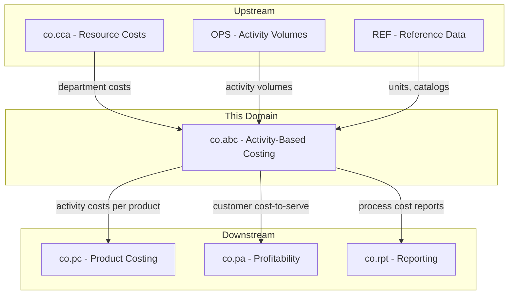
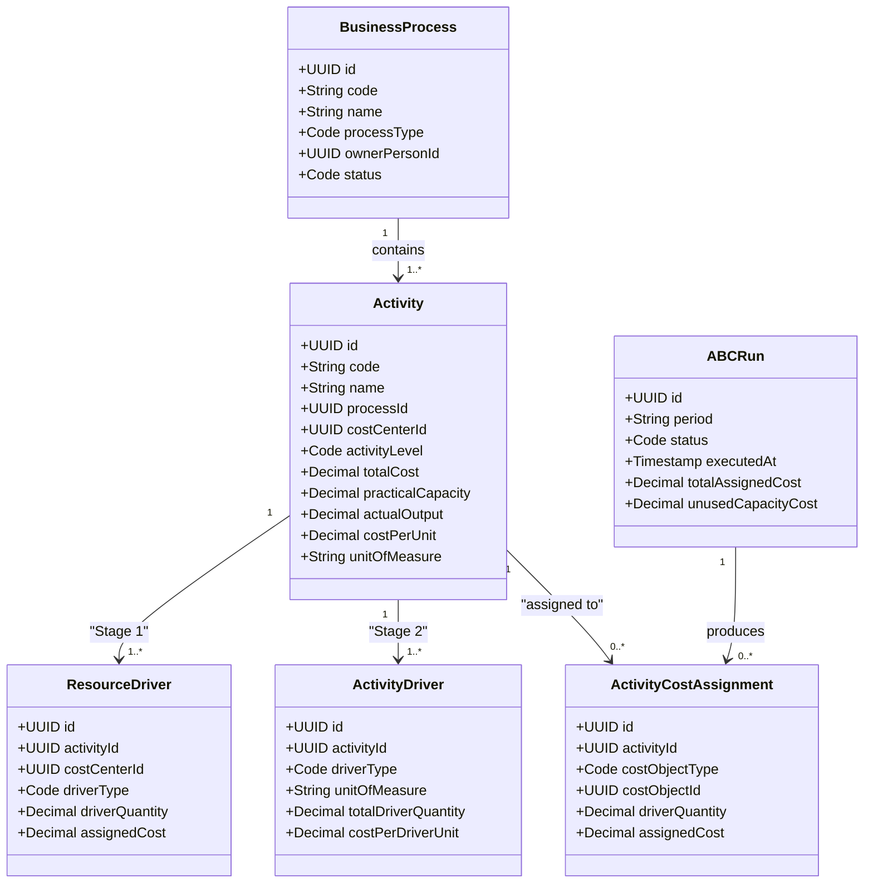
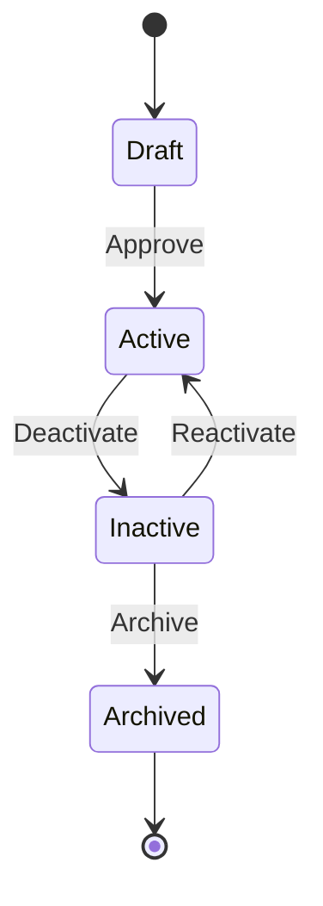
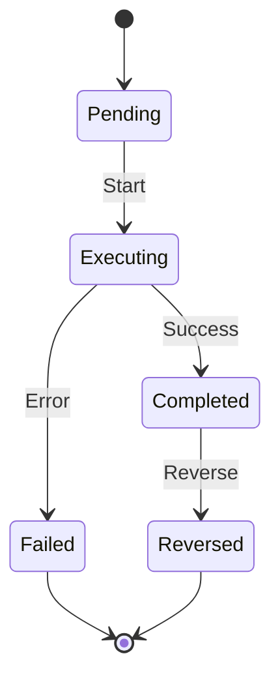
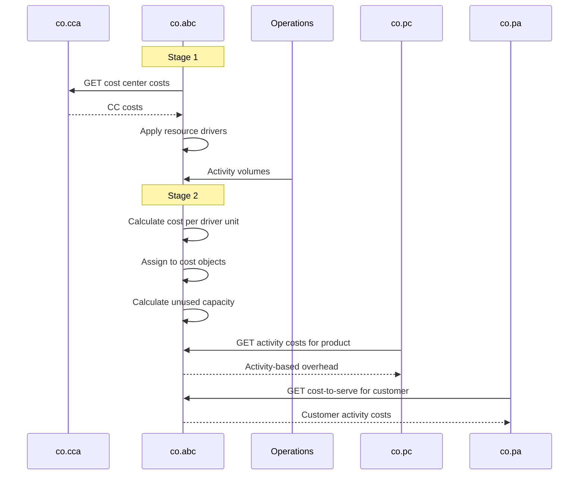
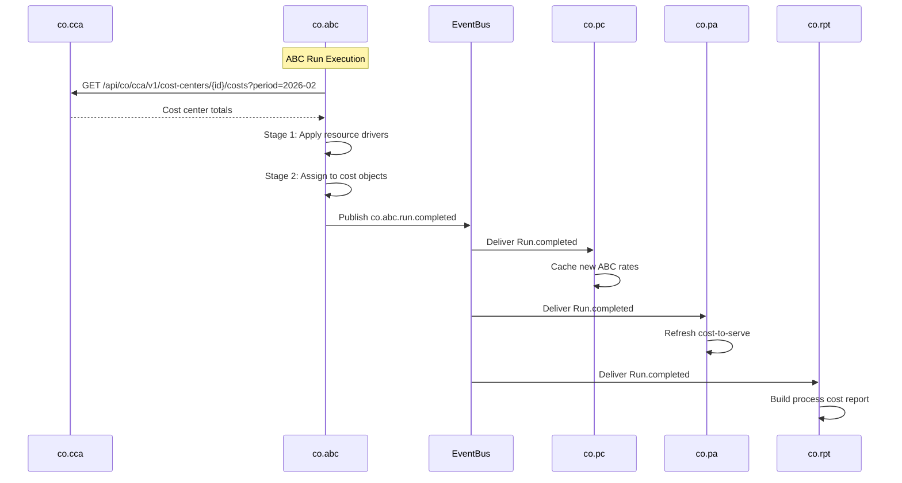
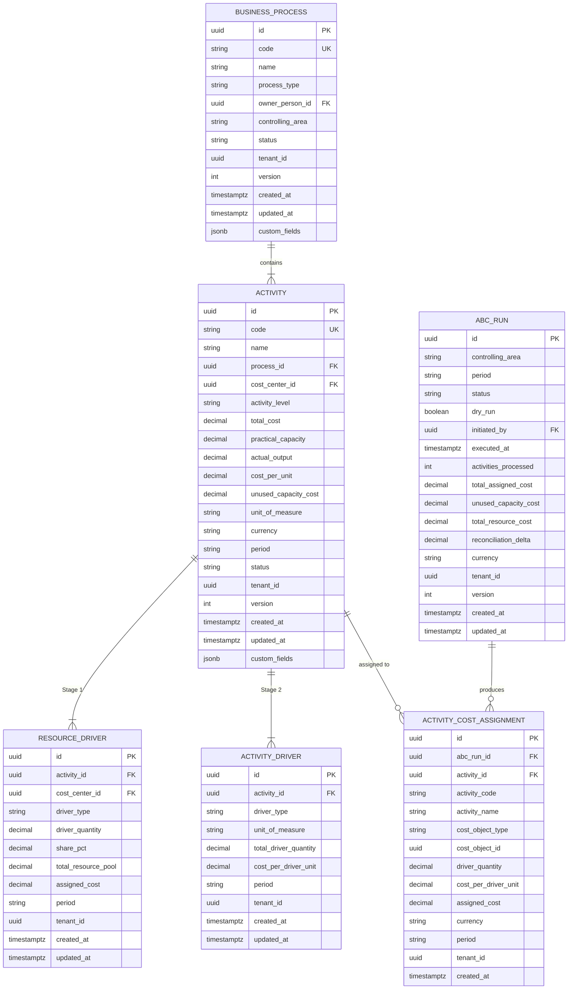

# CO - ABC Activity-Based Costing Domain / Service Specification

> **Conceptual Stack Layer:** Domain / Service
> **Space:** Platform
> **Owner:** Domain Engineering Team
> **Schema alignment:** `service-layer.schema.json`
> **Companion files:** `openapi.yaml`, `*.schema.json` (event contracts)
> **Referenced by:** Platform-Feature Spec SS5 (backend dependencies), BFF Contract
> **Belongs to:** CO Suite Spec (`_co_suite.md`)

> **Meta Information**
> - **Version:** 2026-04-04
> - **Template:** `domain-service-spec.md` v1.0.0
> - **Template Compliance:** ~95% — minor gaps in §11 feature register (feature specs not yet authored)
> - **Author(s):** OpenLeap Architecture Team
> - **Status:** DRAFT
> - **Suite:** `co`
> - **Domain:** `abc`
> - **Bounded Context Ref:** `bc:activity-based-costing`
> - **Service ID:** `co-abc-svc`
> - **basePackage:** `io.openleap.co.abc`
> - **API Base Path:** `/api/co/abc/v1`
> - **OpenLeap Starter Version:** `v1`
> - **Port:** TBD
> - **Repository:** TBD
> - **Tags:** `controlling`, `abc`, `activity`, `process-costing`, `cost-driver`
> - **Team:**
>   - Name: `team-co`
>   - Email: `co-team@openleap.io`
>   - Slack: `#co-team`

---

## Specification Guidelines Compliance

> ### Non-Negotiables
> - Never invent facts. If required info is missing, add an **OPEN QUESTION** entry.
> - Preserve intent and decisions. Only change meaning when explicitly requested.
> - Do not remove normative constraints unless they are explicitly replaced.
> - Keep the spec **self-contained**: no "see chat", no implicit context.
>
> ### Source of Truth Priority
> When sources conflict:
> 1. Spec (explicit) wins
> 2. Starter specs (implementation constraints) next
> 3. Guidelines (best practices) last
>
> Record conflicts in the **Decisions & Conflicts** section (see Section 14).
>
> ### Style Guide
> - Prefer short sentences and lists.
> - Use MUST/SHOULD/MAY for normative statements.
> - Keep terminology consistent (Aggregate, Domain Service, Application Service, Command, Event).
> - Avoid ambiguous words ("often", "maybe") unless explicitly noting uncertainty.
> - Keep examples minimal and clearly marked as examples.
> - Do not add implementation code unless the chapter explicitly requires it.

---

## 0. Document Purpose & Scope

### 0.1 Purpose
This specification defines the Activity-Based Costing (ABC) domain, which provides a process-oriented view of costs. Unlike traditional cost center accounting (department-based), ABC traces costs to business processes and activities that consume resources, enabling more accurate cost assignment to products, services, and customers.

### 0.2 Target Audience
- Product Owners & Business Stakeholders
- System Architects & Technical Leads
- Integration Engineers

### 0.3 Scope
**In Scope:**
- Business process definition and modeling
- Activity driver management (cost drivers)
- Resource driver management (resource consumption by activities)
- Process cost calculation
- Activity-based cost assignment to cost objects (products, customers, orders)
- Capacity analysis (practical vs. actual, unused capacity cost)
- Process efficiency analysis

**Out of Scope:**
- Traditional cost center accounting (-> co.cca)
- Overhead allocation by simple percentages (-> co.om)
- Product standard costing (-> co.pc)
- Business process management / workflow (-> BPM tools)

### 0.4 Related Documents
- `_co_suite.md` - CO Suite overview
- `co_cca-spec.md` - Cost Center Accounting (resource pool source)
- `co_om-spec.md` - Overhead Management (traditional allocations)
- `co_pc-spec.md` - Product Costing
- `co_pa-spec.md` - Profitability Analysis
- `co_rpt-spec.md` - Management Reporting

---

## 1. Business Context

### 1.1 Domain Purpose
`co.abc` answers **"What activities consume resources and at what cost?"** Traditional cost accounting assigns costs to departments. ABC assigns costs to activities (order processing, quality inspection, customer support) and then to the cost objects that consume those activities. This reveals the true cost of complexity and process inefficiency.

### 1.2 Business Value
- Accurate costing of complex products/services
- Identification of high-cost, low-value activities
- Support for process improvement and lean initiatives
- Better cost attribution for diverse product portfolios
- Customer cost-to-serve analysis
- Unused capacity visibility and management

### 1.3 Key Stakeholders

| Role | Responsibility | Primary Use Cases |
|------|----------------|-------------------|
| Controller | Define processes, maintain drivers, run calculations | UC-001, UC-003 |
| Process Owner | Review process costs, identify improvements | UC-004 |
| Product Manager | Understand true product cost by activity | UC-005 |
| Operations Manager | Analyze activity efficiency and capacity | UC-004, UC-006 |

### 1.4 Strategic Positioning



### 1.5 Service Context

| Property | Value |
|----------|-------|
| **Suite** | `co` |
| **Domain** | `abc` |
| **Bounded Context** | `bc:activity-based-costing` |
| **Service ID** | `co-abc-svc` |
| **Base Package** | `io.openleap.co.abc` |

**Responsibilities:**
- Business process and activity definition
- Resource driver management (Stage 1: CC costs to activities)
- Activity driver management (Stage 2: activity costs to cost objects)
- ABC run execution (two-stage calculation)
- Unused capacity cost computation
- Cost-to-serve analysis queries

**Authoritative Sources:**
| Source Type | Description | Access Pattern |
|-------------|-------------|----------------|
| REST API | Processes, activities, drivers, assignments, runs | Synchronous |
| Database | All ABC entities | Direct (owner) |
| Events | Run results, process changes | Asynchronous |

---

## 2. Service Identity

| Property | Value | Schema Field |
|----------|-------|-------------|
| **Service ID** | `co-abc-svc` | `metadata.id` |
| **Display Name** | `Activity-Based Costing` | `metadata.name` |
| **Suite** | `co` | `metadata.suite` |
| **Domain** | `abc` | `metadata.domain` |
| **Bounded Context** | `bc:activity-based-costing` | `metadata.bounded_context_ref` |
| **Version** | `1.0.0` | `metadata.version` |
| **Status** | DRAFT | `metadata.status` |
| **API Base Path** | `/api/co/abc/v1` | `metadata.api_base_path` |
| **Repository** | TBD | `metadata.repository` |
| **Tags** | `controlling`, `abc`, `activity`, `process-costing` | `metadata.tags` |

**Team:**
| Property | Value |
|----------|-------|
| **Name** | `team-co` |
| **Email** | `co-team@openleap.io` |
| **Slack Channel** | `#co-team` |

---

## 3. Domain Model

### 3.1 Conceptual Overview
ABC models the organization as a set of **Business Processes** composed of **Activities**. Resources are consumed by activities, measured by **Resource Drivers**. Activities are consumed by cost objects, measured by **Activity Drivers**. **ABC Runs** calculate the cost per activity and assign costs to cost objects.

The ABC cost flow follows two stages:
1. **Stage 1 -- Resource to Activity:** Cost center costs are assigned to activities using resource drivers
2. **Stage 2 -- Activity to Cost Object:** Activity costs are assigned to products/customers using activity drivers

### 3.2 Core Concepts



### 3.3 Aggregate Definitions

#### 3.3.1 BusinessProcess

| Property | Value |
|----------|-------|
| **Aggregate ID** | `agg:business-process` |
| **Name** | `BusinessProcess` |

**Business Purpose:** A logical grouping of activities representing an end-to-end business process (e.g., "Order-to-Cash", "Procure-to-Pay", "Customer Support").

##### Aggregate Root

**Key Attributes:**
| Attribute | Type | Format | Description | Constraints | Required | Read-Only |
|-----------|------|--------|-------------|-------------|----------|-----------|
| id | string | uuid | Unique identifier (OlUuid) | Immutable | Yes | Yes |
| code | string | -- | Process code (e.g., "PROC-OTC") | unique per (tenant, area), max 20 chars, pattern: `^[A-Z0-9\-]{1,20}$` | Yes | No |
| name | string | -- | Descriptive name | max 255 chars | Yes | No |
| processType | string | -- | Classification | enum_ref: `ProcessType` | Yes | No |
| description | string | -- | Process description | max 1000 chars | No | No |
| ownerPersonId | string | uuid | FK to BP (process owner) | -- | No | No |
| controllingArea | string | -- | CO area for organizational scoping | max 10 chars | Yes | No |
| status | string | -- | Lifecycle state | enum_ref: `ProcessStatus` | Yes | No |
| tenantId | string | uuid | Tenant identifier | -- | Yes | Yes |
| version | integer | int64 | Optimistic lock version | -- | Yes | Yes |
| createdAt | string | date-time | Creation timestamp | -- | Yes | Yes |
| updatedAt | string | date-time | Last update timestamp | -- | Yes | Yes |

**Lifecycle States:**

| Property | Value |
|----------|-------|
| **Initial State** | `draft` |
| **Terminal States** | `archived` |



**State Descriptions:**
| State | Description | Business Meaning |
|-------|-------------|------------------|
| Draft | Initial creation state | Being defined, activities not yet finalized |
| Active | Operational state | Activities are tracked and costed in ABC runs |
| Inactive | Suspended state | Temporarily excluded from ABC runs |
| Archived | Final state | Historical record, read-only, no further cost assignments |

**Allowed Transitions:**
| From State | To State | Trigger | Guard / Business Preconditions |
|------------|----------|---------|-------------------------------|
| Draft | Active | Approve | BR-011: At least one active Activity exists |
| Active | Inactive | Deactivate | No in-progress ABC run referencing this process |
| Inactive | Active | Reactivate | At least one active Activity exists |
| Inactive | Archived | Archive | No pending cost assignments |

**Invariants:**
| Rule ID | Description |
|---------|-------------|
| BR-001 | Unique code per (tenant, controlling_area) |
| BR-011 | At least one active Activity MUST exist before activation |
| BR-003 | processType immutable after activation |

**Domain Events Emitted:**
- `co.abc.process.created`
- `co.abc.process.updated`
- `co.abc.process.statusChanged`

##### Child Entities

###### Entity: Activity

| Property | Value |
|----------|-------|
| **Entity ID** | `ent:activity` |
| **Name** | `Activity` |
| **Relationship to Root** | one_to_many |

**Business Purpose:** A discrete unit of work within a process that consumes resources. Examples: "Process Sales Order", "Perform Quality Inspection", "Handle Customer Complaint". Activities are the central costing unit in ABC -- resource costs flow in via resource drivers, and activity costs flow out to cost objects via activity drivers.

**Attributes:**
| Attribute | Type | Format | Description | Constraints | Required |
|-----------|------|--------|-------------|-------------|----------|
| id | string | uuid | Unique identifier (OlUuid) | Immutable | Yes |
| code | string | -- | Activity code (e.g., "ACT-ORD-PROC") | unique per (tenant, area), max 30 chars | Yes |
| name | string | -- | Descriptive name | max 255 chars | Yes |
| processId | string | uuid | FK to parent BusinessProcess | -- | Yes |
| costCenterId | string | uuid | FK to co.cca (resource pool providing costs) | -- | Yes |
| activityLevel | string | -- | Cost hierarchy level | enum_ref: `ActivityLevel` | Yes |
| totalCost | number | decimal | Total activity cost for the period | Computed from resource drivers, precision: 4 | No |
| practicalCapacity | number | decimal | Maximum output quantity per period | > 0, precision: 4 | Yes |
| actualOutput | number | decimal | Actual output quantity for the period | >= 0, precision: 4 | No |
| costPerUnit | number | decimal | totalCost / actualOutput | Computed, precision: 6 | No |
| unusedCapacityQty | number | decimal | practicalCapacity - actualOutput | Computed | No |
| unusedCapacityCost | number | decimal | unusedCapacityQty * costPerUnit | Computed | No |
| unitOfMeasure | string | -- | Output UOM (e.g., "each", "h") | valid UCUM code | Yes |
| currency | string | -- | Currency for cost amounts | ISO 4217, 3 chars | Yes |
| period | string | -- | Fiscal period | pattern: `^\d{4}-\d{2}$` | Yes |
| status | string | -- | Activity state | enum: active, inactive | Yes |
| tenantId | string | uuid | Tenant identifier | -- | Yes |
| version | integer | int64 | Optimistic lock | -- | Yes |
| createdAt | string | date-time | Creation timestamp | -- | Yes |
| updatedAt | string | date-time | Last update timestamp | -- | Yes |

**Collection Constraints:**
- Minimum items: 1 (per BR-011, at least one for process activation)
- Maximum items: 500 (per process, soft limit)

**Activity Level Classification:**
| Level | Description | Example | Cost Behavior |
|-------|-------------|---------|---------------|
| unit_level | Per unit produced/sold | "Pick & Pack Item" | Varies with volume |
| batch_level | Per batch/order | "Process Purchase Order" | Varies with batches |
| product_level | Per product line | "Maintain Product Specs" | Independent of volume |
| facility_level | Sustain facility | "Building Security" | Fixed, not assigned to products |

**Invariants:**
| Rule ID | Description |
|---------|-------------|
| BR-002 | Unique activity code per (tenant, controlling_area) |
| BR-003 | Every activity MUST link to a cost center |
| BR-005 | practicalCapacity MUST be > 0 |
| BR-006 | Unused capacity cost reported separately, not assigned to products |
| BR-007 | facility_level activities MUST NOT be assigned to individual products |

###### Entity: ResourceDriver

| Property | Value |
|----------|-------|
| **Entity ID** | `ent:resource-driver` |
| **Name** | `ResourceDriver` |
| **Relationship to Root** | one_to_many (via Activity) |

**Business Purpose:** Measures how cost center (resource pool) costs flow to an activity in Stage 1 of ABC. For example, if a cost center has EUR 100,000 in salary costs and "Process Sales Order" consumes 30% of that center's effort, the resource driver captures that 30% share and the resulting EUR 30,000 cost assignment.

**Attributes:**
| Attribute | Type | Format | Description | Constraints | Required |
|-----------|------|--------|-------------|-------------|----------|
| id | string | uuid | Unique identifier | Immutable | Yes |
| activityId | string | uuid | FK to Activity | -- | Yes |
| costCenterId | string | uuid | FK to co.cca cost center (resource pool) | -- | Yes |
| driverType | string | -- | Type of resource consumption metric | enum_ref: `ResourceDriverType` | Yes |
| driverQuantity | number | decimal | Absolute quantity consumed | >= 0, precision: 4 | No |
| sharePct | number | decimal | Percentage share of cost center costs | 0.01 to 100.00, precision: 2 | No |
| totalResourcePool | number | decimal | Total cost center cost for the period | Read from co.cca, precision: 2 | No |
| assignedCost | number | decimal | Computed cost: totalResourcePool * sharePct / 100 | Computed, precision: 2 | No |
| period | string | -- | Fiscal period | pattern: `^\d{4}-\d{2}$` | Yes |
| tenantId | string | uuid | Tenant identifier | -- | Yes |

**Collection Constraints:**
- Minimum items: 0 (activity may not yet have resource drivers)
- Maximum items: no limit

**Invariants:**
| Rule ID | Description |
|---------|-------------|
| BR-004 | For each CC, sum of sharePct across activities MUST equal 100% (+/- 0.01%) |

###### Entity: ActivityDriver

| Property | Value |
|----------|-------|
| **Entity ID** | `ent:activity-driver` |
| **Name** | `ActivityDriver` |
| **Relationship to Root** | one_to_many (via Activity) |

**Business Purpose:** Measures how activity costs flow to cost objects (products, customers, orders) in Stage 2 of ABC. The activity driver defines the metric (e.g., number of transactions, hours, setups) and its unit cost. For example, if "Process Sales Order" costs EUR 30,000 and processes 1,500 orders, the cost per order is EUR 20.

**Attributes:**
| Attribute | Type | Format | Description | Constraints | Required |
|-----------|------|--------|-------------|-------------|----------|
| id | string | uuid | Unique identifier | Immutable | Yes |
| activityId | string | uuid | FK to Activity | -- | Yes |
| driverType | string | -- | Type of activity consumption metric | enum_ref: `ActivityDriverType` | Yes |
| unitOfMeasure | string | -- | UOM for the driver (e.g., "each", "h") | valid UCUM code | Yes |
| totalDriverQuantity | number | decimal | Total driver volume for the period | > 0, precision: 4 | Yes |
| costPerDriverUnit | number | decimal | Activity totalCost / totalDriverQuantity | Computed, precision: 6 | No |
| period | string | -- | Fiscal period | pattern: `^\d{4}-\d{2}$` | Yes |
| tenantId | string | uuid | Tenant identifier | -- | Yes |

**Collection Constraints:**
- Minimum items: 1 (each activity needs at least one driver for Stage 2)
- Maximum items: no limit

**Invariants:**
| Rule ID | Description |
|---------|-------------|
| BR-012 | totalDriverQuantity MUST be > 0 |

##### Value Objects

###### Value Object: Money

| Property | Value |
|----------|-------|
| **VO ID** | `vo:money` |
| **Name** | `Money` |

**Description:** Represents a monetary amount with its currency. Used in cost calculations throughout ABC.

**Attributes:**
| Attribute | Type | Format | Description | Constraints |
|-----------|------|--------|-------------|-------------|
| amount | number | decimal | Monetary amount | precision: 2 |
| currencyCode | string | -- | ISO 4217 currency code | 3 chars, must be valid ISO 4217 |

**Validation Rules:**
- currencyCode MUST be a valid ISO 4217 code
- amount precision MUST NOT exceed 2 decimal places for reporting

###### Value Object: CostToServeResult

| Property | Value |
|----------|-------|
| **VO ID** | `vo:cost-to-serve-result` |
| **Name** | `CostToServeResult` |

**Description:** Aggregated view of all activity costs assigned to a specific cost object (typically a customer). Used for cost-to-serve analysis queries.

**Attributes:**
| Attribute | Type | Format | Description | Constraints |
|-----------|------|--------|-------------|-------------|
| costObjectType | string | -- | Type of cost object | enum_ref: `CostObjectType` |
| costObjectId | string | uuid | ID of the cost object | -- |
| period | string | -- | Fiscal period | pattern: `^\d{4}-\d{2}$` |
| totalCostToServe | number | decimal | Sum of all assigned activity costs | precision: 2 |
| byActivity | array | -- | Breakdown by activity | -- |

**Validation Rules:**
- totalCostToServe MUST equal sum of byActivity[].cost
- period MUST reference a completed ABC run

#### 3.3.2 ABCRun

| Property | Value |
|----------|-------|
| **Aggregate ID** | `agg:abc-run` |
| **Name** | `ABCRun` |

**Business Purpose:** A complete execution of the two-stage ABC calculation for a given controlling area and fiscal period. An ABC run reads cost center costs, applies resource drivers (Stage 1), calculates activity costs per driver unit (Stage 2), and produces cost assignments to cost objects. Runs are atomic: if any stage fails, no assignments are persisted.

##### Aggregate Root

**Key Attributes:**
| Attribute | Type | Format | Description | Constraints | Required | Read-Only |
|-----------|------|--------|-------------|-------------|----------|-----------|
| id | string | uuid | Unique identifier (OlUuid) | Immutable | Yes | Yes |
| controllingArea | string | -- | CO area scope for this run | max 10 chars | Yes | No |
| period | string | -- | Fiscal period (YYYY-MM) | pattern: `^\d{4}-\d{2}$` | Yes | No |
| status | string | -- | Run lifecycle state | enum_ref: `RunStatus` | Yes | No |
| dryRun | boolean | -- | If true, calculate but do not persist assignments | -- | No | No |
| initiatedBy | string | uuid | User who started the run | -- | Yes | No |
| executedAt | string | date-time | Completion timestamp | Set on completion | No | Yes |
| activitiesProcessed | integer | -- | Number of activities included | Computed | No | Yes |
| totalAssignedCost | number | decimal | Sum of all cost assignments | Computed, precision: 2 | No | Yes |
| unusedCapacityCost | number | decimal | Total unassigned capacity cost | Computed, precision: 2 | No | Yes |
| totalResourceCost | number | decimal | Total cost read from resource pools | Computed, precision: 2 | No | Yes |
| reconciliationDelta | number | decimal | totalResourceCost - totalAssignedCost - unusedCapacityCost | SHOULD be zero, precision: 2 | No | Yes |
| currency | string | -- | Reporting currency | ISO 4217 | Yes | No |
| tenantId | string | uuid | Tenant identifier | -- | Yes | Yes |
| version | integer | int64 | Optimistic lock | -- | Yes | Yes |
| createdAt | string | date-time | Creation timestamp | -- | Yes | Yes |
| updatedAt | string | date-time | Last update timestamp | -- | Yes | Yes |

**Lifecycle States:**

| Property | Value |
|----------|-------|
| **Initial State** | `pending` |
| **Terminal States** | `completed`, `failed`, `reversed` |



**State Descriptions:**
| State | Description | Business Meaning |
|-------|-------------|------------------|
| Pending | Run created, not yet started | Awaiting execution |
| Executing | Calculation in progress | Stage 1 and Stage 2 running |
| Completed | Successfully finished | Assignments persisted, events published |
| Failed | Calculation error | No assignments persisted, review errors |
| Reversed | Previously completed run reversed | Assignments removed, downstream notified |

**Allowed Transitions:**
| From State | To State | Trigger | Guard / Business Preconditions |
|------------|----------|---------|-------------------------------|
| Pending | Executing | Start execution | BR-009: No completed run for same (area, period); BR-010: Period open |
| Executing | Completed | Calculation success | BR-008: Reconciliation balanced |
| Executing | Failed | Calculation error | -- |
| Completed | Reversed | Manual reversal | No downstream settlements referencing this run |

**Invariants:**
| Rule ID | Description |
|---------|-------------|
| BR-008 | totalResourceCost MUST equal totalAssignedCost + unusedCapacityCost (+/- 0.01) |
| BR-009 | One completed run per (area, period) |
| BR-010 | Period MUST be open |

**Domain Events Emitted:**
- `co.abc.run.completed`
- `co.abc.run.reversed`
- `co.abc.run.failed`

##### Child Entities

###### Entity: ActivityCostAssignment

| Property | Value |
|----------|-------|
| **Entity ID** | `ent:activity-cost-assignment` |
| **Name** | `ActivityCostAssignment` |
| **Relationship to Root** | one_to_many |

**Business Purpose:** A single cost assignment from an activity to a cost object, produced by an ABC run. Represents the Stage 2 output: how much of an activity's cost is attributed to a specific product, customer, or other cost object based on its driver consumption.

**Attributes:**
| Attribute | Type | Format | Description | Constraints | Required |
|-----------|------|--------|-------------|-------------|----------|
| id | string | uuid | Unique identifier | Immutable | Yes |
| abcRunId | string | uuid | FK to parent ABCRun | -- | Yes |
| activityId | string | uuid | FK to Activity | -- | Yes |
| activityCode | string | -- | Denormalized activity code for queries | max 30 chars | Yes |
| activityName | string | -- | Denormalized activity name | max 255 chars | Yes |
| costObjectType | string | -- | Type of cost receiver | enum_ref: `CostObjectType` | Yes |
| costObjectId | string | uuid | ID of cost receiver (product, customer, etc.) | -- | Yes |
| driverQuantity | number | decimal | Volume of driver consumed by this cost object | >= 0, precision: 4 | Yes |
| costPerDriverUnit | number | decimal | Rate at calculation time | precision: 6 | Yes |
| assignedCost | number | decimal | driverQuantity * costPerDriverUnit | Computed, precision: 2 | Yes |
| currency | string | -- | Currency | ISO 4217 | Yes |
| period | string | -- | Fiscal period | pattern: `^\d{4}-\d{2}$` | Yes |
| tenantId | string | uuid | Tenant identifier | -- | Yes |

**Collection Constraints:**
- Minimum items: 0 (dry run produces no persisted assignments)
- Maximum items: no limit (depends on cost objects x activities)

**Invariants:**
| Rule ID | Description |
|---------|-------------|
| BR-007 | facility_level activities MUST NOT produce assignments to individual products |

### 3.4 Enumerations

#### ProcessType

**Description:** Classification of business processes by their organizational role.

| Value | Description | Deprecated |
|-------|-------------|------------|
| `core` | Revenue-generating or customer-facing process (e.g., Order-to-Cash) | No |
| `support` | Internal process supporting core (e.g., IT Services, HR) | No |
| `management` | Governance and oversight process (e.g., Financial Reporting) | No |

#### ProcessStatus

**Description:** Lifecycle states for BusinessProcess aggregate.

| Value | Description | Deprecated |
|-------|-------------|------------|
| `draft` | Being defined, not yet operational | No |
| `active` | Included in ABC runs | No |
| `inactive` | Temporarily suspended from ABC runs | No |
| `archived` | Historical, read-only | No |

#### ActivityLevel

**Description:** Cost hierarchy classification per activity-based costing theory (Cooper & Kaplan).

| Value | Description | Deprecated |
|-------|-------------|------------|
| `unit_level` | Per unit produced/sold | No |
| `batch_level` | Per batch/order | No |
| `product_level` | Per product line | No |
| `facility_level` | Sustain facility (not assigned to products) | No |

#### ResourceDriverType

**Description:** Method for measuring resource consumption by an activity (Stage 1).

| Value | Description | Deprecated |
|-------|-------------|------------|
| `time_pct` | Percentage of time spent by cost center personnel on the activity | No |
| `headcount` | Number of people allocated to the activity | No |
| `sqm` | Square meters of space consumed | No |
| `direct_assignment` | Direct cost assignment without proportional split | No |

#### ActivityDriverType

**Description:** Method for measuring activity consumption by cost objects (Stage 2).

| Value | Description | Deprecated |
|-------|-------------|------------|
| `transactions` | Number of transactions processed (e.g., orders, invoices) | No |
| `hours` | Labor or machine hours consumed | No |
| `setups` | Number of machine or line setups | No |
| `orders` | Number of purchase or sales orders | No |
| `inspections` | Number of quality inspections performed | No |
| `shipments` | Number of shipments dispatched | No |
| `line_items` | Number of order/invoice line items | No |
| `complaints` | Number of customer complaints handled | No |
| `custom` | User-defined metric | No |

#### CostObjectType

**Description:** Classification of entities that receive activity costs.

| Value | Description | Deprecated |
|-------|-------------|------------|
| `product` | Finished good or service offered | No |
| `customer` | Customer account for cost-to-serve | No |
| `sales_order` | Individual sales order | No |
| `project` | Internal or customer project | No |
| `channel` | Distribution channel | No |

#### RunStatus

**Description:** Lifecycle states for ABCRun aggregate.

| Value | Description | Deprecated |
|-------|-------------|------------|
| `pending` | Created, not yet started | No |
| `executing` | Calculation in progress | No |
| `completed` | Successfully finished | No |
| `failed` | Calculation error, no assignments persisted | No |
| `reversed` | Previously completed run has been reversed | No |

### 3.5 Shared Types

#### Money

| Property | Value |
|----------|-------|
| **Type ID** | `type:money` |
| **Name** | `Money` |

**Description:** Standard monetary amount with currency. Used across all CO services.

**Attributes:**
| Attribute | Type | Format | Description | Constraints |
|-----------|------|--------|-------------|-------------|
| amount | number | decimal | Monetary value | precision: 2 |
| currencyCode | string | -- | ISO 4217 code | 3 chars |

**Validation Rules:**
- currencyCode MUST be a valid, active ISO 4217 code
- amount precision MUST NOT exceed 2 decimal places

**Used By:**
- `agg:business-process` (via Activity.totalCost, Activity.unusedCapacityCost)
- `agg:abc-run` (totalAssignedCost, unusedCapacityCost, totalResourceCost)

---

## 4. Business Rules & Constraints

### 4.1 Business Rules Catalog

| ID | Rule Name | Description | Scope | Enforcement | Error Code |
|----|-----------|-------------|-------|-------------|------------|
| BR-001 | Unique Process Code | code MUST be unique per (tenant, controlling_area) | BusinessProcess | Create, Update | `DUPLICATE_CODE` |
| BR-002 | Unique Activity Code | code MUST be unique per (tenant, controlling_area) | Activity | Create, Update | `DUPLICATE_CODE` |
| BR-003 | Activity Requires CC | Every activity MUST link to a cost center | Activity | Create | `MISSING_COST_CENTER` |
| BR-004 | Resource Driver Completeness | Drivers per CC MUST account for 100% of cost | ResourceDriver | ABC Run | `INCOMPLETE_DRIVERS` |
| BR-005 | Positive Capacity | practicalCapacity MUST be > 0 | Activity | Create, Update | `INVALID_CAPACITY` |
| BR-006 | Unused Capacity Separation | Unused capacity MUST NOT be assigned to products | ABCRun | Execute | -- |
| BR-007 | Facility Level Exclusion | facility_level MUST NOT be assigned to individual products | ActivityCostAssignment | Execute | `FACILITY_LEVEL_EXCLUSION` |
| BR-008 | Reconciliation Balance | resource = assigned + unused (+/- 0.01) | ABCRun | Execute | `RECONCILIATION_FAILED` |
| BR-009 | One Run Per Period | One completed run per (area, period) | ABCRun | Execute | `DUPLICATE_RUN` |
| BR-010 | Open Period Required | MUST NOT run for closed period | ABCRun | Execute | `PERIOD_CLOSED` |
| BR-011 | Process Activation | MUST have at least one active Activity | BusinessProcess | Status transition | `NO_ACTIVITIES` |
| BR-012 | Positive Driver Quantity | totalDriverQuantity MUST be > 0 | ActivityDriver | Create, Update | `INVALID_DRIVER_QUANTITY` |

### 4.2 Detailed Rule Definitions

#### BR-001: Unique Process Code

**Business Context:** Process codes serve as human-readable identifiers for controllers configuring ABC models. Duplicates would cause confusion in reporting and API lookups.

**Rule Statement:** Within a single tenant and controlling area, no two BusinessProcess entities MAY share the same code value.

**Applies To:**
- Aggregate: BusinessProcess
- Operations: Create, Update

**Enforcement:** Database unique constraint on `(tenant_id, controlling_area, code)`.

**Validation Logic:** Before persisting, check that no existing BusinessProcess with the same tenant_id, controlling_area, and code exists (excluding the current entity on update).

**Error Handling:**
- **Error Code:** `DUPLICATE_CODE`
- **Error Message:** "A business process with code '{code}' already exists in controlling area '{area}'."
- **User action:** Choose a different process code or check if the existing process should be reused.

**Examples:**
- **Valid:** Create process "PROC-OTC" in area "CA01" when no other process with that code exists.
- **Invalid:** Create process "PROC-OTC" in area "CA01" when one already exists -- returns 409 Conflict.

#### BR-004: Resource Driver Completeness

**Business Context:** When multiple activities draw from the same cost center, resource driver shares MUST equal 100%. If they do not, some cost center cost is unaccounted for (under-allocation) or over-counted (over-allocation).

**Rule Statement:** For each cost center referenced by resource drivers in a given period, the sum of `share_pct` across all activities MUST equal 100.00% (+/- 0.01%).

**Applies To:**
- Aggregate: ResourceDriver (cross-aggregate check during ABCRun)
- Operations: ABC Run execution

**Enforcement:** Checked at the start of Stage 1 during ABC run execution.

**Validation Logic:** Group resource drivers by cost_center_id and period. For each group, sum share_pct. If |sum - 100.00| > 0.01, the run fails.

**Error Handling:**
- **Error Code:** `INCOMPLETE_DRIVERS`
- **Error Message:** "Resource drivers for cost center '{ccId}' in period '{period}' sum to {sum}%, expected 100%."
- **User action:** Adjust resource driver shares so they total 100%.

**Examples:**
- **Valid:** CC "IT-100" has two activities: Activity A at 60%, Activity B at 40% = 100%.
- **Invalid:** CC "IT-100" has Activity A at 60%, Activity B at 30% = 90% -- run fails with warning.

#### BR-005: Positive Capacity

**Business Context:** Practical capacity represents the maximum realistic output of an activity. A zero or negative capacity would make cost-per-unit calculation impossible (division by zero).

**Rule Statement:** The practicalCapacity of every Activity MUST be greater than zero.

**Applies To:**
- Aggregate: Activity
- Operations: Create, Update

**Enforcement:** Domain object validation.

**Validation Logic:** Check practicalCapacity > 0.

**Error Handling:**
- **Error Code:** `INVALID_CAPACITY`
- **Error Message:** "Practical capacity must be greater than zero."
- **User action:** Provide a positive capacity value.

**Examples:**
- **Valid:** practicalCapacity = 2000 (hours).
- **Invalid:** practicalCapacity = 0 -- returns 422.

#### BR-006: Unused Capacity Separation

**Business Context:** Products SHOULD only bear the cost of capacity they use. Idle capacity cost is management's responsibility. Allocating unused capacity to products creates a "death spiral" where lower volumes increase unit costs, which further reduces demand.

**Rule Statement:** unusedCapacityCost = (practicalCapacity - actualOutput) * costPerUnit. This cost is reported separately per activity and aggregated at the run level. It MUST NOT be distributed to cost objects.

**Applies To:**
- Aggregate: ABCRun
- Operations: Execute

**Enforcement:** ABC run calculation logic.

**Validation Logic:** After Stage 2, verify that sum of all ActivityCostAssignment.assignedCost + sum of all Activity.unusedCapacityCost = totalResourceCost.

**Error Handling:**
- No user-facing error. This is a design principle enforced in the calculation algorithm.

**Examples:**
- **Valid:** Activity has capacity 2000 hrs, actual 1500 hrs, cost EUR 100,000. Assigned to products: EUR 75,000. Unused: EUR 25,000.

#### BR-007: Facility Level Exclusion

**Business Context:** Facility-sustaining activities (e.g., building security, general management) cannot be meaningfully traced to individual products. Assigning them would distort product costs.

**Rule Statement:** Activities classified as `facility_level` MUST NOT produce ActivityCostAssignment records with costObjectType = `product`.

**Applies To:**
- Aggregate: ActivityCostAssignment
- Operations: ABC Run execution

**Enforcement:** ABC run calculation skips facility_level activities for product-level assignments.

**Validation Logic:** During Stage 2, filter out facility_level activities from product assignment. They MAY be assigned to cost objects of type `channel` or reported as period costs.

**Error Handling:**
- **Error Code:** `FACILITY_LEVEL_EXCLUSION`
- **Error Message:** "Facility-level activity '{code}' cannot be assigned to individual products."
- **User action:** Change activity level or assign to a non-product cost object.

**Examples:**
- **Valid:** "Building Security" (facility_level) cost reported as period overhead.
- **Invalid:** Attempting to assign "Building Security" cost to product "Widget-A" -- blocked.

#### BR-008: Reconciliation Balance

**Business Context:** ABC runs MUST be balanced. Every euro read from resource pools must either be assigned to a cost object or reported as unused capacity. A non-zero reconciliation delta indicates a calculation error.

**Rule Statement:** totalResourceCost MUST equal totalAssignedCost + unusedCapacityCost, with a tolerance of +/- 0.01 (rounding).

**Applies To:**
- Aggregate: ABCRun
- Operations: Execute

**Enforcement:** Post-calculation reconciliation check.

**Validation Logic:** reconciliationDelta = totalResourceCost - totalAssignedCost - unusedCapacityCost. If |reconciliationDelta| > 0.01, the run fails.

**Error Handling:**
- **Error Code:** `RECONCILIATION_FAILED`
- **Error Message:** "ABC run reconciliation failed. Delta: {delta}. Expected: 0.00."
- **User action:** Review resource and activity driver configuration for the period.

**Examples:**
- **Valid:** Resource = 500,000. Assigned = 425,000. Unused = 75,000. Delta = 0.00.
- **Invalid:** Resource = 500,000. Assigned = 425,000. Unused = 74,900. Delta = 100.00 -- run fails.

#### BR-009: One Run Per Period

**Business Context:** Only one completed ABC run per controlling area and period ensures consistent cost data for downstream systems (product costing, profitability analysis).

**Rule Statement:** At most one ABCRun with status `completed` MAY exist per (controllingArea, period) combination.

**Applies To:**
- Aggregate: ABCRun
- Operations: Execute

**Enforcement:** Pre-execution check. A completed run must be reversed before re-running.

**Validation Logic:** Query for existing completed run with same controllingArea and period. If found, reject.

**Error Handling:**
- **Error Code:** `DUPLICATE_RUN`
- **Error Message:** "A completed ABC run already exists for area '{area}', period '{period}'. Reverse it first."
- **User action:** Reverse the existing run, then re-execute.

**Examples:**
- **Valid:** No completed run for CA01/2026-02 -- execute allowed.
- **Invalid:** Completed run exists for CA01/2026-02 -- returns 409.

#### BR-010: Open Period Required

**Business Context:** Closed fiscal periods are frozen for financial reporting. ABC runs MUST NOT modify closed period data.

**Rule Statement:** The fiscal period referenced by an ABC run MUST be open (not closed) in the fiscal calendar.

**Applies To:**
- Aggregate: ABCRun
- Operations: Execute

**Enforcement:** Pre-execution check against fiscal calendar (ref-data-svc or co.cca period status).

**Validation Logic:** Query period status. If status = closed, reject.

**Error Handling:**
- **Error Code:** `PERIOD_CLOSED`
- **Error Message:** "Period '{period}' is closed. Cannot execute ABC run."
- **User action:** Contact controlling to reopen the period, or use a different period.

**Examples:**
- **Valid:** Period 2026-02 is open -- run allowed.
- **Invalid:** Period 2025-12 is closed -- returns 422.

#### BR-011: Process Activation

**Business Context:** A business process without activities is meaningless for ABC. Activating an empty process would lead to zero-cost calculations.

**Rule Statement:** A BusinessProcess MAY transition from `draft` to `active` only if it has at least one Activity in `active` status.

**Applies To:**
- Aggregate: BusinessProcess
- Operations: Status transition (activate)

**Enforcement:** Domain object pre-transition guard.

**Validation Logic:** Count active activities for this process. If count = 0, reject.

**Error Handling:**
- **Error Code:** `NO_ACTIVITIES`
- **Error Message:** "Cannot activate process '{code}': no active activities defined."
- **User action:** Add and activate at least one activity first.

**Examples:**
- **Valid:** Process "PROC-OTC" has 3 active activities -- activation allowed.
- **Invalid:** Process "PROC-OTC" has 0 activities -- returns 422.

#### BR-012: Positive Driver Quantity

**Business Context:** The total driver quantity for an activity driver represents the denominator in cost-per-unit calculation. A zero or negative value would cause division by zero.

**Rule Statement:** totalDriverQuantity for an ActivityDriver MUST be greater than zero.

**Applies To:**
- Aggregate: ActivityDriver
- Operations: Create, Update

**Enforcement:** Domain object validation.

**Validation Logic:** Check totalDriverQuantity > 0.

**Error Handling:**
- **Error Code:** `INVALID_DRIVER_QUANTITY`
- **Error Message:** "Total driver quantity must be greater than zero."
- **User action:** Provide a positive driver quantity value.

**Examples:**
- **Valid:** totalDriverQuantity = 1500 transactions.
- **Invalid:** totalDriverQuantity = 0 -- returns 422.

### 4.3 Data Validation Rules

**Field-Level Validations:**
| Field | Validation Rule | Error Message |
|-------|----------------|---------------|
| code (process) | Required, 1-20 chars, pattern `^[A-Z0-9\-]{1,20}$` | "Process code is required and must be 1-20 uppercase alphanumeric characters" |
| code (activity) | Required, 1-30 chars | "Activity code is required and must be 1-30 characters" |
| name | Required, 1-255 chars | "Name is required and must not exceed 255 characters" |
| processType | Required, one of: core, support, management | "Process type is required" |
| controllingArea | Required, max 10 chars | "Controlling area is required" |
| costCenterId | Required (Activity) | "Cost center reference is required" |
| practicalCapacity | Required, > 0 | "Practical capacity must be positive" |
| unitOfMeasure | Required, valid UCUM | "Valid unit of measure is required" |
| currency | Required, 3 chars, ISO 4217 | "Valid ISO 4217 currency code is required" |
| period | Required, format YYYY-MM | "Period must be in format YYYY-MM" |
| sharePct | 0.01 to 100.00 | "Share must be between 0.01 and 100.00" |
| driverQuantity | >= 0 | "Driver quantity cannot be negative" |
| totalDriverQuantity | > 0 | "Total driver quantity must be positive" |

**Cross-Field Validations:**
- actualOutput MUST be <= practicalCapacity (warning if exceeded, not hard block)
- assignedCost = driverQuantity * costPerDriverUnit (computed, not user-provided)
- costPerUnit = totalCost / actualOutput (only valid when actualOutput > 0)
- unusedCapacityCost = (practicalCapacity - actualOutput) * costPerUnit

### 4.4 Reference Data Dependencies

**Required Reference Data:**
| Catalog | Source Service | Fields Referencing | Validation |
|---------|----------------|-------------------|------------|
| Currencies (ISO 4217) | ref-data-svc | currency | Must exist and be active |
| Fiscal Calendar | ref-data-svc / co.cca | period | Must exist, must be open for writes |
| Units of Measure (UCUM) | si-unit-svc | unitOfMeasure | Valid UCUM code |
| Cost Centers | co-cca-svc | costCenterId | Must exist and be active |
| Controlling Areas | co-cca-svc | controllingArea | Must exist |

---

## 5. Use Cases

### 5.1 Business Logic Placement

| Logic Type | Placement | Examples |
|------------|-----------|----------|
| Aggregate invariants | Domain Object | Code uniqueness, capacity validation, state transitions |
| Cross-aggregate logic | Domain Service | Two-stage ABC calculation, reconciliation check, resource driver completeness |
| Orchestration & transactions | Application Service | ABC run execution, event publishing, idempotency |

### 5.2 Use Cases (Canonical Format)

#### UC-001: DefineBusinessProcessesAndActivities

| Field | Value |
|-------|-------|
| **id** | `DefineBusinessProcessesAndActivities` |
| **type** | WRITE |
| **trigger** | REST |
| **aggregate** | `BusinessProcess`, `Activity` |
| **domainOperation** | `BusinessProcess.create`, `Activity.create` |
| **inputs** | `code: String`, `name: String`, `processType: Code`, `activities: Activity[]` |
| **outputs** | `BusinessProcess` |
| **events** | `Process.created` |
| **rest** | `POST /api/co/abc/v1/processes` |
| **idempotency** | optional |
| **errors** | `DUPLICATE_CODE`, `MISSING_COST_CENTER` |

**Actor:** Controller

**Preconditions:**
- User has `co.abc:write` permission
- Referenced cost centers exist and are active in co.cca
- Controlling area exists

**Main Flow:**
1. Controller submits process definition (code, name, type, owner, area)
2. System validates uniqueness of process code (BR-001)
3. System creates BusinessProcess in `draft` status
4. Controller adds Activities (link to cost center, set level, capacity, UOM)
5. System validates each activity (BR-002, BR-003, BR-005)
6. Controller defines Resource Drivers (how CC costs flow to activity)
7. Controller defines Activity Drivers (how activity costs flow to cost objects)
8. Controller activates process (BR-011)
9. System publishes `co.abc.process.created` event

**Postconditions:**
- BusinessProcess is in `draft` (or `active` if activated in same flow)
- Activities are linked to cost centers
- Drivers are configured

**Business Rules Applied:**
- BR-001: Unique Process Code
- BR-002: Unique Activity Code
- BR-003: Activity Requires CC
- BR-005: Positive Capacity
- BR-011: Process Activation (if activating)

**Alternative Flows:**
- **Alt-1:** If process is created without activities, it remains in `draft` status until activities are added separately.

**Exception Flows:**
- **Exc-1:** If cost center does not exist, return 422 with `MISSING_COST_CENTER`.
- **Exc-2:** If process code is duplicate, return 409 with `DUPLICATE_CODE`.

#### UC-002: UpdateProcessOrActivity

| Field | Value |
|-------|-------|
| **id** | `UpdateProcessOrActivity` |
| **type** | WRITE |
| **trigger** | REST |
| **aggregate** | `BusinessProcess`, `Activity` |
| **domainOperation** | `BusinessProcess.update`, `Activity.update` |
| **inputs** | `id: UUID`, `name: String`, `description: String`, `practicalCapacity: Decimal` |
| **outputs** | `BusinessProcess` or `Activity` |
| **events** | `Process.updated`, `Activity.updated` |
| **rest** | `PATCH /api/co/abc/v1/processes/{id}`, `PATCH /api/co/abc/v1/activities/{id}` |
| **idempotency** | optional |
| **errors** | `DUPLICATE_CODE`, `INVALID_CAPACITY` |

**Actor:** Controller

**Preconditions:**
- Entity exists
- User has `co.abc:write` permission
- ETag matches current version

**Main Flow:**
1. Controller submits partial update
2. System validates immutability rules (BR-003: processType after activation)
3. System validates field constraints (BR-005 for capacity)
4. System persists update with incremented version
5. System publishes update event

**Postconditions:**
- Entity is updated with new values
- Version is incremented

**Business Rules Applied:**
- BR-003: processType immutable after activation
- BR-005: Positive Capacity

**Alternative Flows:**
- **Alt-1:** If only metadata fields (name, description) are changed, no downstream impact.

**Exception Flows:**
- **Exc-1:** If ETag mismatch, return 412 Precondition Failed.

#### UC-003: ExecuteABCRun

| Field | Value |
|-------|-------|
| **id** | `ExecuteABCRun` |
| **type** | WRITE |
| **trigger** | REST |
| **aggregate** | `ABCRun` |
| **domainOperation** | `ABCRun.execute` |
| **inputs** | `controllingArea: String`, `period: String`, `dryRun: Boolean` |
| **outputs** | `ABCRun` |
| **events** | `Run.completed` |
| **rest** | `POST /api/co/abc/v1/runs/execute` |
| **idempotency** | required |
| **errors** | `DUPLICATE_RUN`, `PERIOD_CLOSED`, `INCOMPLETE_DRIVERS`, `RECONCILIATION_FAILED` |

**Actor:** Controller

**Preconditions:**
- User has `co.abc:execute` permission
- No completed run exists for (area, period) -- BR-009
- Period is open -- BR-010
- At least one active process with activities exists

**Main Flow:**
1. Controller initiates run for controlling area and period
2. System creates ABCRun in `pending` status, transitions to `executing`
3. **Stage 1:** System reads CC costs from co.cca, applies resource drivers, calculates activity totalCost (BR-004)
4. **Stage 2:** System calculates costPerDriverUnit per activity, assigns costs to cost objects via activity drivers (BR-007)
5. System calculates unused capacity per activity (BR-006)
6. System performs reconciliation check (BR-008)
7. System marks run as `completed`, sets executedAt
8. System publishes `co.abc.run.completed` event

**Postconditions:**
- ABCRun is in `completed` status
- ActivityCostAssignment records are persisted (unless dryRun)
- Downstream systems are notified

**Business Rules Applied:**
- BR-004: Resource Driver Completeness
- BR-006: Unused Capacity Separation
- BR-007: Facility Level Exclusion
- BR-008: Reconciliation Balance
- BR-009: One Run Per Period
- BR-010: Open Period Required

**Alternative Flows:**
- **Alt-1:** If `dryRun = true`, system calculates but does not persist assignments. Run status is `completed` with a dryRun flag. No events published.

**Exception Flows:**
- **Exc-1:** If resource drivers are incomplete for any CC, run transitions to `failed` with `INCOMPLETE_DRIVERS`.
- **Exc-2:** If reconciliation fails, run transitions to `failed` with `RECONCILIATION_FAILED`.

#### UC-004: ReverseABCRun

| Field | Value |
|-------|-------|
| **id** | `ReverseABCRun` |
| **type** | WRITE |
| **trigger** | REST |
| **aggregate** | `ABCRun` |
| **domainOperation** | `ABCRun.reverse` |
| **inputs** | `runId: UUID` |
| **outputs** | `ABCRun` |
| **events** | `Run.reversed` |
| **rest** | `POST /api/co/abc/v1/runs/{runId}/reverse` |
| **idempotency** | required |
| **errors** | `RUN_NOT_COMPLETED`, `DOWNSTREAM_DEPENDENCY` |

**Actor:** Controller

**Preconditions:**
- Run exists and is in `completed` status
- User has `co.abc:execute` permission
- No downstream settlements reference this run's assignments

**Main Flow:**
1. Controller requests reversal of a completed run
2. System verifies no downstream dependencies
3. System removes all ActivityCostAssignment records for this run
4. System transitions run to `reversed`
5. System publishes `co.abc.run.reversed` event

**Postconditions:**
- ABCRun is in `reversed` status
- All assignments are removed
- Downstream systems are notified to remove ABC data

**Business Rules Applied:**
- Run must be in `completed` status

**Exception Flows:**
- **Exc-1:** If run is not completed, return 422 with `RUN_NOT_COMPLETED`.
- **Exc-2:** If downstream settlements exist, return 409 with `DOWNSTREAM_DEPENDENCY`.

#### UC-005: ProvideActivityCostsToProductCosting

| Field | Value |
|-------|-------|
| **id** | `ProvideActivityCostsToProductCosting` |
| **type** | READ |
| **trigger** | REST |
| **aggregate** | `ActivityCostAssignment` |
| **domainOperation** | `getActivityCostsByProduct` |
| **inputs** | `costObjectType: Code`, `costObjectId: UUID`, `period: String` |
| **outputs** | `ActivityCostAssignment[]` |
| **rest** | `GET /api/co/abc/v1/assignments?costObjectType=product&costObjectId={id}&period={period}` |
| **idempotency** | none |
| **errors** | -- |

**Actor:** System (co.pc API call)

**Preconditions:**
- A completed ABC run exists for the requested period

**Main Flow:**
1. co.pc requests activity-based overhead costs for a product and period
2. System queries ActivityCostAssignment by costObjectType, costObjectId, period
3. System returns matching assignment records

**Postconditions:**
- No state change (read-only)

#### UC-006: CustomerCostToServeAnalysis

| Field | Value |
|-------|-------|
| **id** | `CustomerCostToServeAnalysis` |
| **type** | READ |
| **trigger** | REST |
| **aggregate** | `ActivityCostAssignment` |
| **domainOperation** | `getCostToServe` |
| **inputs** | `costObjectType: String`, `costObjectId: UUID`, `period: String` |
| **outputs** | `CostToServeResult` |
| **rest** | `GET /api/co/abc/v1/analysis/cost-to-serve?costObjectType=customer&costObjectId={id}&period={period}` |
| **idempotency** | none |
| **errors** | -- |

**Actor:** Controller / Sales Manager

**Preconditions:**
- A completed ABC run exists for the requested period
- User has `co.abc:read` permission

**Main Flow:**
1. User requests cost-to-serve analysis for a customer and period
2. System queries all assignments for the customer, groups by activity
3. System calculates total cost-to-serve and returns breakdown

**Postconditions:**
- No state change (read-only)

### 5.3 Process Flow Diagrams



### 5.4 Cross-Domain Workflows

**Does this domain participate in multi-service workflows?** [x] YES [ ] NO

#### Workflow: ABC-Enhanced Product Costing

**Business Purpose:** Product costing incorporates activity-based overhead rates from ABC to compute more accurate product costs than traditional percentage-based overhead allocation.

**Orchestration Pattern:** [x] Choreography (EDA) [ ] Orchestration (Saga)

**Pattern Rationale:** co.pc queries co.abc for activity costs on demand. No workflow coordination or compensation needed. The Run.completed event notifies co.pc that new rates are available, but co.pc decides independently when to recalculate.

**Participating Services:**
| Service | Role | Responsibilities |
|---------|------|------------------|
| co-abc-svc | Data provider | Executes ABC runs, publishes results, serves cost queries |
| co-pc-svc | Consumer | Queries activity costs for product costing runs |
| co-pa-svc | Consumer | Queries cost-to-serve for profitability analysis |

**Workflow Steps:**
1. **Step 1:** co-abc-svc completes an ABC run
   - Success: Publishes `co.abc.run.completed`
   - Failure: Publishes `co.abc.run.failed`

2. **Step 2:** co-pc-svc receives `co.abc.run.completed` and updates cached overhead rates
   - Success: Rates cached, next costing run will use ABC data
   - Failure: Uses previous period's rates (degraded, not failed)

3. **Step 3:** co-pa-svc receives `co.abc.run.completed` and refreshes cost-to-serve views
   - Success: Updated profitability analysis available
   - Failure: Stale data flagged in reporting

**Business Implications:**
- **Success Path:** Product costs reflect true activity consumption; profitability analysis is accurate.
- **Failure Path:** Downstream systems use stale rates; reports flagged as "pending ABC update."
- **Compensation:** Not applicable (choreography, no rollback needed).

---

## 6. REST API

### 6.1 API Overview
**Base Path:** `/api/co/abc/v1`
**Authentication:** OAuth2/JWT (Bearer token)
**Authorization:**
- Read operations: `co.abc:read`
- Write operations: `co.abc:write`
- Execute operations: `co.abc:execute`
- Admin operations: `co.abc:admin`

### 6.2 Resource Operations

#### 6.2.1 BusinessProcess - Create

```http
POST /api/co/abc/v1/processes
Authorization: Bearer {token}
Content-Type: application/json
```

**Request Body:**
```json
{
  "code": "PROC-OTC",
  "name": "Order-to-Cash",
  "processType": "core",
  "description": "End-to-end order fulfillment process",
  "ownerPersonId": "550e8400-e29b-41d4-a716-446655440001",
  "controllingArea": "CA01"
}
```

**Success Response:** `201 Created`
```json
{
  "id": "550e8400-e29b-41d4-a716-446655440000",
  "version": 1,
  "code": "PROC-OTC",
  "name": "Order-to-Cash",
  "processType": "core",
  "description": "End-to-end order fulfillment process",
  "ownerPersonId": "550e8400-e29b-41d4-a716-446655440001",
  "controllingArea": "CA01",
  "status": "draft",
  "createdAt": "2026-04-04T10:00:00Z",
  "_links": {
    "self": { "href": "/api/co/abc/v1/processes/550e8400-e29b-41d4-a716-446655440000" },
    "activities": { "href": "/api/co/abc/v1/processes/550e8400-e29b-41d4-a716-446655440000/activities" }
  }
}
```

**Response Headers:**
- `Location: /api/co/abc/v1/processes/550e8400-e29b-41d4-a716-446655440000`
- `ETag: "1"`

**Business Rules Checked:**
- BR-001: Unique Process Code

**Events Published:**
- `co.abc.process.created`

**Error Responses:**
- `400 Bad Request` -- Validation error (missing required fields)
- `409 Conflict` -- Duplicate process code (BR-001)
- `422 Unprocessable Entity` -- Business rule violation

#### 6.2.2 BusinessProcess - Retrieve

```http
GET /api/co/abc/v1/processes/{id}
Authorization: Bearer {token}
```

**Success Response:** `200 OK`
```json
{
  "id": "550e8400-e29b-41d4-a716-446655440000",
  "version": 3,
  "code": "PROC-OTC",
  "name": "Order-to-Cash",
  "processType": "core",
  "description": "End-to-end order fulfillment process",
  "ownerPersonId": "550e8400-e29b-41d4-a716-446655440001",
  "controllingArea": "CA01",
  "status": "active",
  "createdAt": "2026-04-04T10:00:00Z",
  "updatedAt": "2026-04-04T11:30:00Z",
  "_links": {
    "self": { "href": "/api/co/abc/v1/processes/550e8400-e29b-41d4-a716-446655440000" },
    "activities": { "href": "/api/co/abc/v1/processes/550e8400-e29b-41d4-a716-446655440000/activities" }
  }
}
```

**Response Headers:**
- `ETag: "3"`
- `Cache-Control: private, max-age=300`

**Error Responses:**
- `404 Not Found` -- Process does not exist

#### 6.2.3 BusinessProcess - Update

```http
PATCH /api/co/abc/v1/processes/{id}
Authorization: Bearer {token}
Content-Type: application/json
If-Match: "3"
```

**Request Body:**
```json
{
  "name": "Order-to-Cash (revised)",
  "description": "Updated process description"
}
```

**Success Response:** `200 OK`
```json
{
  "id": "550e8400-e29b-41d4-a716-446655440000",
  "version": 4,
  "code": "PROC-OTC",
  "name": "Order-to-Cash (revised)",
  "processType": "core",
  "status": "active",
  "updatedAt": "2026-04-04T12:00:00Z",
  "_links": {
    "self": { "href": "/api/co/abc/v1/processes/550e8400-e29b-41d4-a716-446655440000" }
  }
}
```

**Response Headers:**
- `ETag: "4"`

**Business Rules Checked:**
- BR-003: processType immutable after activation

**Events Published:**
- `co.abc.process.updated`

**Error Responses:**
- `412 Precondition Failed` -- ETag mismatch (concurrent modification)
- `422 Unprocessable Entity` -- Business rule violation (e.g., changing processType on active process)

#### 6.2.4 BusinessProcess - List

```http
GET /api/co/abc/v1/processes?page=0&size=50&sort=code,asc&status=active&processType=core
Authorization: Bearer {token}
```

**Query Parameters:**
| Parameter | Type | Description | Default |
|-----------|------|-------------|---------|
| page | integer | Page number (0-based) | 0 |
| size | integer | Page size (max 200) | 50 |
| sort | string | Sort field and direction | code,asc |
| status | string | Filter by lifecycle status | (all) |
| processType | string | Filter by process type | (all) |
| controllingArea | string | Filter by CO area | (all) |

**Success Response:** `200 OK`
```json
{
  "content": [
    {
      "id": "550e8400-e29b-41d4-a716-446655440000",
      "code": "PROC-OTC",
      "name": "Order-to-Cash",
      "processType": "core",
      "status": "active"
    }
  ],
  "page": {
    "size": 50,
    "totalElements": 12,
    "totalPages": 1,
    "number": 0
  },
  "_links": {
    "self": { "href": "/api/co/abc/v1/processes?page=0&size=50" }
  }
}
```

#### 6.2.5 Activity - Create

```http
POST /api/co/abc/v1/activities
Authorization: Bearer {token}
Content-Type: application/json
```

**Request Body:**
```json
{
  "code": "ACT-ORD-PROC",
  "name": "Process Sales Order",
  "processId": "550e8400-e29b-41d4-a716-446655440000",
  "costCenterId": "660e8400-e29b-41d4-a716-446655440010",
  "activityLevel": "batch_level",
  "practicalCapacity": 2000.0000,
  "unitOfMeasure": "each",
  "currency": "EUR",
  "period": "2026-02"
}
```

**Success Response:** `201 Created`
```json
{
  "id": "770e8400-e29b-41d4-a716-446655440020",
  "version": 1,
  "code": "ACT-ORD-PROC",
  "name": "Process Sales Order",
  "processId": "550e8400-e29b-41d4-a716-446655440000",
  "costCenterId": "660e8400-e29b-41d4-a716-446655440010",
  "activityLevel": "batch_level",
  "practicalCapacity": 2000.0000,
  "actualOutput": null,
  "totalCost": null,
  "costPerUnit": null,
  "unitOfMeasure": "each",
  "currency": "EUR",
  "period": "2026-02",
  "status": "active",
  "createdAt": "2026-04-04T10:15:00Z",
  "_links": {
    "self": { "href": "/api/co/abc/v1/activities/770e8400-e29b-41d4-a716-446655440020" },
    "process": { "href": "/api/co/abc/v1/processes/550e8400-e29b-41d4-a716-446655440000" },
    "resourceDrivers": { "href": "/api/co/abc/v1/activities/770e8400-e29b-41d4-a716-446655440020/resource-drivers" },
    "activityDrivers": { "href": "/api/co/abc/v1/activities/770e8400-e29b-41d4-a716-446655440020/activity-drivers" }
  }
}
```

**Response Headers:**
- `Location: /api/co/abc/v1/activities/770e8400-e29b-41d4-a716-446655440020`
- `ETag: "1"`

**Business Rules Checked:**
- BR-002: Unique Activity Code
- BR-003: Activity Requires CC
- BR-005: Positive Capacity

**Events Published:**
- `co.abc.activity.created`

**Error Responses:**
- `400 Bad Request` -- Validation error
- `409 Conflict` -- Duplicate activity code
- `422 Unprocessable Entity` -- Cost center not found or capacity invalid

#### 6.2.6 Activity - Retrieve

```http
GET /api/co/abc/v1/activities/{id}
Authorization: Bearer {token}
```

**Success Response:** `200 OK`
```json
{
  "id": "770e8400-e29b-41d4-a716-446655440020",
  "version": 2,
  "code": "ACT-ORD-PROC",
  "name": "Process Sales Order",
  "processId": "550e8400-e29b-41d4-a716-446655440000",
  "costCenterId": "660e8400-e29b-41d4-a716-446655440010",
  "activityLevel": "batch_level",
  "practicalCapacity": 2000.0000,
  "actualOutput": 1500.0000,
  "totalCost": 30000.00,
  "costPerUnit": 20.000000,
  "unusedCapacityQty": 500.0000,
  "unusedCapacityCost": 10000.00,
  "unitOfMeasure": "each",
  "currency": "EUR",
  "period": "2026-02",
  "status": "active",
  "_links": {
    "self": { "href": "/api/co/abc/v1/activities/770e8400-e29b-41d4-a716-446655440020" }
  }
}
```

**Response Headers:**
- `ETag: "2"`

**Error Responses:**
- `404 Not Found` -- Activity does not exist

#### 6.2.7 Activity - Update

```http
PATCH /api/co/abc/v1/activities/{id}
Authorization: Bearer {token}
Content-Type: application/json
If-Match: "2"
```

**Request Body:**
```json
{
  "practicalCapacity": 2500.0000,
  "actualOutput": 1800.0000
}
```

**Success Response:** `200 OK`
```json
{
  "id": "770e8400-e29b-41d4-a716-446655440020",
  "version": 3,
  "practicalCapacity": 2500.0000,
  "actualOutput": 1800.0000,
  "updatedAt": "2026-04-04T14:00:00Z"
}
```

**Business Rules Checked:**
- BR-005: Positive Capacity

**Events Published:**
- `co.abc.activity.updated`

**Error Responses:**
- `412 Precondition Failed` -- ETag mismatch
- `422 Unprocessable Entity` -- Invalid capacity

#### 6.2.8 Activity - List by Process

```http
GET /api/co/abc/v1/processes/{processId}/activities?page=0&size=50
Authorization: Bearer {token}
```

**Success Response:** `200 OK` (same page format as 6.2.4)

#### 6.2.9 ResourceDriver - Create

```http
POST /api/co/abc/v1/activities/{activityId}/resource-drivers
Authorization: Bearer {token}
Content-Type: application/json
```

**Request Body:**
```json
{
  "costCenterId": "660e8400-e29b-41d4-a716-446655440010",
  "driverType": "time_pct",
  "sharePct": 30.00,
  "period": "2026-02"
}
```

**Success Response:** `201 Created`
```json
{
  "id": "880e8400-e29b-41d4-a716-446655440030",
  "activityId": "770e8400-e29b-41d4-a716-446655440020",
  "costCenterId": "660e8400-e29b-41d4-a716-446655440010",
  "driverType": "time_pct",
  "sharePct": 30.00,
  "totalResourcePool": null,
  "assignedCost": null,
  "period": "2026-02",
  "_links": {
    "self": { "href": "/api/co/abc/v1/resource-drivers/880e8400-e29b-41d4-a716-446655440030" }
  }
}
```

**Response Headers:**
- `Location: /api/co/abc/v1/resource-drivers/880e8400-e29b-41d4-a716-446655440030`

**Events Published:**
- `co.abc.resourceDriver.created`

**Error Responses:**
- `400 Bad Request` -- Validation error
- `422 Unprocessable Entity` -- Invalid share percentage

#### 6.2.10 ResourceDriver - List

```http
GET /api/co/abc/v1/activities/{activityId}/resource-drivers
Authorization: Bearer {token}
```

**Success Response:** `200 OK` (array of resource drivers)

#### 6.2.11 ResourceDriver - Update

```http
PATCH /api/co/abc/v1/resource-drivers/{id}
Authorization: Bearer {token}
Content-Type: application/json
```

**Request Body:**
```json
{
  "sharePct": 35.00
}
```

**Success Response:** `200 OK`

#### 6.2.12 ActivityDriver - Create

```http
POST /api/co/abc/v1/activities/{activityId}/activity-drivers
Authorization: Bearer {token}
Content-Type: application/json
```

**Request Body:**
```json
{
  "driverType": "transactions",
  "unitOfMeasure": "each",
  "totalDriverQuantity": 1500.0000,
  "period": "2026-02"
}
```

**Success Response:** `201 Created`
```json
{
  "id": "990e8400-e29b-41d4-a716-446655440040",
  "activityId": "770e8400-e29b-41d4-a716-446655440020",
  "driverType": "transactions",
  "unitOfMeasure": "each",
  "totalDriverQuantity": 1500.0000,
  "costPerDriverUnit": null,
  "period": "2026-02",
  "_links": {
    "self": { "href": "/api/co/abc/v1/activity-drivers/990e8400-e29b-41d4-a716-446655440040" }
  }
}
```

**Business Rules Checked:**
- BR-012: Positive Driver Quantity

**Events Published:**
- `co.abc.activityDriver.created`

**Error Responses:**
- `422 Unprocessable Entity` -- Invalid driver quantity

#### 6.2.13 ActivityDriver - List

```http
GET /api/co/abc/v1/activities/{activityId}/activity-drivers
Authorization: Bearer {token}
```

**Success Response:** `200 OK` (array of activity drivers)

#### 6.2.14 ActivityDriver - Update

```http
PATCH /api/co/abc/v1/activity-drivers/{id}
Authorization: Bearer {token}
Content-Type: application/json
```

**Request Body:**
```json
{
  "totalDriverQuantity": 1800.0000
}
```

**Success Response:** `200 OK`

#### 6.2.15 Cost Assignments - List (Read-Only)

```http
GET /api/co/abc/v1/assignments?costObjectType=product&costObjectId={id}&period=2026-02
Authorization: Bearer {token}
```

**Success Response:** `200 OK`
```json
{
  "content": [
    {
      "id": "aa0e8400-e29b-41d4-a716-446655440050",
      "activityCode": "ACT-ORD-PROC",
      "activityName": "Process Sales Order",
      "costObjectType": "product",
      "costObjectId": "bb0e8400-e29b-41d4-a716-446655440060",
      "driverQuantity": 300.0000,
      "costPerDriverUnit": 20.000000,
      "assignedCost": 6000.00,
      "currency": "EUR",
      "period": "2026-02"
    }
  ],
  "page": {
    "size": 50,
    "totalElements": 5,
    "totalPages": 1,
    "number": 0
  }
}
```

### 6.3 Business Operations

#### Operation: Activate Process

```http
POST /api/co/abc/v1/processes/{id}/activate
Authorization: Bearer {token}
If-Match: "{version}"
```

**Business Purpose:** Transition a BusinessProcess from `draft` to `active`, making it eligible for ABC runs.

**Success Response:** `200 OK`
```json
{
  "id": "550e8400-e29b-41d4-a716-446655440000",
  "version": 4,
  "status": "active",
  "updatedAt": "2026-04-04T12:00:00Z"
}
```

**Business Rules Checked:**
- BR-011: Process Activation (at least one active activity)

**Events Published:**
- `co.abc.process.statusChanged`

**Error Responses:**
- `412 Precondition Failed` -- ETag mismatch
- `422 Unprocessable Entity` -- No active activities (BR-011)

#### Operation: Execute ABC Run

```http
POST /api/co/abc/v1/runs/execute
Authorization: Bearer {token}
Content-Type: application/json
```

**Request Body:**
```json
{
  "controllingArea": "CA01",
  "period": "2026-02",
  "dryRun": false
}
```

**Success Response:** `202 Accepted`
```json
{
  "runId": "uuid-run-001",
  "status": "executing",
  "_links": {
    "self": { "href": "/api/co/abc/v1/runs/uuid-run-001" },
    "results": { "href": "/api/co/abc/v1/runs/uuid-run-001/results" }
  }
}
```

**Business Rules Checked:**
- BR-009: One Run Per Period
- BR-010: Open Period Required
- BR-004: Resource Driver Completeness (during execution)
- BR-008: Reconciliation Balance (during execution)

**Events Published:**
- `co.abc.run.completed` (on success)
- `co.abc.run.failed` (on failure)

**Error Responses:**
- `409 Conflict` -- Duplicate run for period (BR-009)
- `422 Unprocessable Entity` -- Period closed (BR-010)

#### Operation: Get Run Results

```http
GET /api/co/abc/v1/runs/{runId}/results
Authorization: Bearer {token}
```

**Success Response:** `200 OK`
```json
{
  "runId": "uuid-run-001",
  "status": "completed",
  "period": "2026-02",
  "currency": "EUR",
  "summary": {
    "totalResourceCost": 500000.00,
    "totalAssignedCost": 425000.00,
    "unusedCapacityCost": 75000.00,
    "reconciliationDelta": 0.00,
    "activitiesProcessed": 25
  }
}
```

#### Operation: Reverse Run

```http
POST /api/co/abc/v1/runs/{runId}/reverse
Authorization: Bearer {token}
```

**Success Response:** `200 OK`
```json
{
  "runId": "uuid-run-001",
  "status": "reversed"
}
```

**Events Published:**
- `co.abc.run.reversed`

**Error Responses:**
- `422 Unprocessable Entity` -- Run not in completed status
- `409 Conflict` -- Downstream dependencies exist

#### Operation: Cost-to-Serve Query

```http
GET /api/co/abc/v1/analysis/cost-to-serve?costObjectType=customer&costObjectId={id}&period=2026-02
Authorization: Bearer {token}
```

**Success Response:** `200 OK`
```json
{
  "costObjectType": "customer",
  "costObjectId": "cc0e8400-e29b-41d4-a716-446655440070",
  "period": "2026-02",
  "totalCostToServe": 12500.00,
  "currency": "EUR",
  "byActivity": [
    { "activityCode": "ACT-ORD-PROC", "activityName": "Process Sales Order", "driverQuantity": 300, "cost": 6000.00 },
    { "activityCode": "ACT-COMPLAINT", "activityName": "Handle Complaint", "driverQuantity": 15, "cost": 3750.00 },
    { "activityCode": "ACT-SHIP", "activityName": "Ship Order", "driverQuantity": 250, "cost": 2750.00 }
  ]
}
```

### 6.4 OpenAPI Specification

**Location:** `contracts/http/co/abc/openapi.yaml`
**Version:** OpenAPI 3.1
**Documentation URL:** `https://api.openleap.io/docs/co/abc`

---

## 7. Events & Integration

### 7.1 Event-Driven Architecture Pattern

**Pattern Used:** [ ] Event-Driven (Choreography) [ ] Orchestration (Saga) [x] Hybrid

**Follows Suite Pattern:** [x] YES [ ] NO

**Pattern Rationale:** Orchestration for ABC run stages (sequential Stage 1 -> Stage 2 within a single service transaction). Choreography for publishing results to downstream consumers (co.pc, co.pa, co.rpt). No saga needed because the ABC run is atomic within a single service boundary.

**Message Broker:** `RabbitMQ`

### 7.2 Published Events

**Exchange:** `co.abc.events` (topic)

#### Event: Process.created

**Routing Key:** `co.abc.process.created`

**Business Purpose:** Communicates that a new business process definition has been created, enabling downstream systems (reporting) to update their dimension catalogs.

**When Published:**
- Emitted when: BusinessProcess is successfully created
- After: Successful transaction commit

**Payload Structure:**
```json
{
  "aggregateType": "co.abc.process",
  "changeType": "created",
  "entityIds": ["550e8400-e29b-41d4-a716-446655440000"],
  "version": 1,
  "occurredAt": "2026-04-04T10:00:00Z"
}
```

**Event Envelope:**
```json
{
  "eventId": "uuid",
  "traceId": "string",
  "tenantId": "uuid",
  "occurredAt": "2026-04-04T10:00:00Z",
  "producer": "co.abc",
  "schemaRef": "https://schemas.openleap.io/co/abc/process-created.schema.json",
  "payload": {
    "aggregateType": "co.abc.process",
    "changeType": "created",
    "entityIds": ["550e8400-e29b-41d4-a716-446655440000"],
    "version": 1,
    "occurredAt": "2026-04-04T10:00:00Z"
  }
}
```

**Known Consumers:**
| Consumer Service | Handler | Purpose | Processing Type |
|-----------------|---------|---------|-----------------|
| co-rpt-svc | ProcessDimensionUpdateHandler | Update process dimension in reporting read model | Async/Immediate |

#### Event: Process.updated

**Routing Key:** `co.abc.process.updated`

**Business Purpose:** Communicates that a process definition has been modified (name, description, etc.).

**When Published:**
- Emitted when: BusinessProcess fields are updated
- After: Successful transaction commit

**Payload Structure:**
```json
{
  "aggregateType": "co.abc.process",
  "changeType": "updated",
  "entityIds": ["550e8400-e29b-41d4-a716-446655440000"],
  "version": 4,
  "occurredAt": "2026-04-04T12:00:00Z"
}
```

**Event Envelope:**
```json
{
  "eventId": "uuid",
  "traceId": "string",
  "tenantId": "uuid",
  "occurredAt": "2026-04-04T12:00:00Z",
  "producer": "co.abc",
  "schemaRef": "https://schemas.openleap.io/co/abc/process-updated.schema.json",
  "payload": {
    "aggregateType": "co.abc.process",
    "changeType": "updated",
    "entityIds": ["550e8400-e29b-41d4-a716-446655440000"],
    "version": 4,
    "occurredAt": "2026-04-04T12:00:00Z"
  }
}
```

**Known Consumers:**
| Consumer Service | Handler | Purpose | Processing Type |
|-----------------|---------|---------|-----------------|
| co-rpt-svc | ProcessDimensionUpdateHandler | Refresh process name in reporting | Async/Immediate |

#### Event: Process.statusChanged

**Routing Key:** `co.abc.process.statusChanged`

**Business Purpose:** Communicates lifecycle transitions (activate, deactivate, archive).

**When Published:**
- Emitted when: BusinessProcess status transitions
- After: Successful transaction commit

**Payload Structure:**
```json
{
  "aggregateType": "co.abc.process",
  "changeType": "statusChanged",
  "entityIds": ["550e8400-e29b-41d4-a716-446655440000"],
  "version": 5,
  "occurredAt": "2026-04-04T13:00:00Z"
}
```

**Known Consumers:**
| Consumer Service | Handler | Purpose | Processing Type |
|-----------------|---------|---------|-----------------|
| co-rpt-svc | ProcessStatusHandler | Update process active/inactive flag in reporting | Async/Immediate |

#### Event: Run.completed

**Routing Key:** `co.abc.run.completed`

**Business Purpose:** Communicates that an ABC run has successfully completed, new activity cost rates and cost assignments are available. This is the primary integration event for downstream costing and profitability systems.

**When Published:**
- Emitted when: ABCRun transitions to `completed`
- After: All assignments persisted, reconciliation passed

**Payload Structure:**
```json
{
  "aggregateType": "co.abc.run",
  "changeType": "completed",
  "entityIds": ["uuid-run-001"],
  "version": 1,
  "occurredAt": "2026-04-04T14:30:00Z",
  "controllingArea": "CA01",
  "period": "2026-02",
  "activitiesProcessed": 25,
  "totalAssignedCost": 425000.00,
  "unusedCapacityCost": 75000.00
}
```

**Event Envelope:**
```json
{
  "eventId": "uuid",
  "traceId": "string",
  "tenantId": "uuid",
  "occurredAt": "2026-04-04T14:30:00Z",
  "producer": "co.abc",
  "schemaRef": "https://schemas.openleap.io/co/abc/run-completed.schema.json",
  "payload": {
    "aggregateType": "co.abc.run",
    "changeType": "completed",
    "entityIds": ["uuid-run-001"],
    "version": 1,
    "occurredAt": "2026-04-04T14:30:00Z",
    "controllingArea": "CA01",
    "period": "2026-02",
    "activitiesProcessed": 25,
    "totalAssignedCost": 425000.00,
    "unusedCapacityCost": 75000.00
  }
}
```

**Known Consumers:**
| Consumer Service | Handler | Purpose | Processing Type |
|-----------------|---------|---------|-----------------|
| co-pc-svc | AbcRunCompletedHandler | Update activity-based overhead rates for product costing | Async/Batch |
| co-pa-svc | AbcCostToServeHandler | Refresh customer cost-to-serve in profitability model | Async/Batch |
| co-rpt-svc | ProcessCostReportHandler | Generate process cost reports and read model updates | Async/Immediate |

#### Event: Run.reversed

**Routing Key:** `co.abc.run.reversed`

**Business Purpose:** Communicates that a previously completed ABC run has been reversed. Downstream systems MUST remove or invalidate any data derived from that run.

**When Published:**
- Emitted when: ABCRun transitions from `completed` to `reversed`
- After: All assignments deleted

**Payload Structure:**
```json
{
  "aggregateType": "co.abc.run",
  "changeType": "reversed",
  "entityIds": ["uuid-run-001"],
  "version": 2,
  "occurredAt": "2026-04-04T16:00:00Z",
  "controllingArea": "CA01",
  "period": "2026-02"
}
```

**Event Envelope:**
```json
{
  "eventId": "uuid",
  "traceId": "string",
  "tenantId": "uuid",
  "occurredAt": "2026-04-04T16:00:00Z",
  "producer": "co.abc",
  "schemaRef": "https://schemas.openleap.io/co/abc/run-reversed.schema.json",
  "payload": {
    "aggregateType": "co.abc.run",
    "changeType": "reversed",
    "entityIds": ["uuid-run-001"],
    "version": 2,
    "occurredAt": "2026-04-04T16:00:00Z",
    "controllingArea": "CA01",
    "period": "2026-02"
  }
}
```

**Known Consumers:**
| Consumer Service | Handler | Purpose | Processing Type |
|-----------------|---------|---------|-----------------|
| co-pc-svc | AbcRunReversedHandler | Remove ABC-based overhead rates | Async/Immediate |
| co-pa-svc | AbcRunReversedHandler | Invalidate cost-to-serve data | Async/Immediate |
| co-rpt-svc | AbcRunReversedHandler | Remove process cost report data | Async/Immediate |

#### Event: Run.failed

**Routing Key:** `co.abc.run.failed`

**Business Purpose:** Communicates that an ABC run has failed. Used for monitoring and alerting.

**When Published:**
- Emitted when: ABCRun transitions to `failed`
- After: Error state persisted

**Payload Structure:**
```json
{
  "aggregateType": "co.abc.run",
  "changeType": "failed",
  "entityIds": ["uuid-run-002"],
  "version": 1,
  "occurredAt": "2026-04-04T15:00:00Z",
  "controllingArea": "CA01",
  "period": "2026-03",
  "errorCode": "INCOMPLETE_DRIVERS"
}
```

**Known Consumers:**
| Consumer Service | Handler | Purpose | Processing Type |
|-----------------|---------|---------|-----------------|
| co-rpt-svc | RunFailureAlertHandler | Log failure for monitoring dashboard | Async/Immediate |

### 7.3 Consumed Events

#### Event: co.cca.cost.posted

**Source Service:** `co-cca-svc`
**Routing Key:** `co.cca.cost.posted`
**Handler:** `CostPostingCacheInvalidationHandler`

**Business Purpose:** When cost center costs change, ABC needs to know so that cached cost center totals are refreshed before the next run.

**Processing Strategy:** [x] Cache Invalidation [ ] Background Enrichment [ ] Saga Participation [ ] Read Model Update

**Business Logic:** Invalidate cached CC cost totals for the affected cost center and period. The next ABC run will fetch fresh data.

**Queue Configuration:**
- Name: `co.abc.in.co.cca.cost`
- Durable: Yes
- Auto-delete: No

**Failure Handling:**
- Retry: Up to 3 times with exponential backoff (1s, 5s, 25s)
- Dead Letter: After max retries, move to `co.abc.in.co.cca.cost.dlq` for manual intervention

#### Event: co.cca.period.closed

**Source Service:** `co-cca-svc`
**Routing Key:** `co.cca.period.closed`
**Handler:** `PeriodClosedHandler`

**Business Purpose:** When a fiscal period is closed in CCA, ABC can trigger scheduled ABC runs or mark the period as no longer available for new runs.

**Processing Strategy:** [ ] Cache Invalidation [x] Background Enrichment [ ] Saga Participation [ ] Read Model Update

**Business Logic:** Mark the period as closed in ABC's local period cache. If auto-run is configured, trigger an ABC run for the closing period before it becomes unavailable.

**Queue Configuration:**
- Name: `co.abc.in.co.cca.period`
- Durable: Yes
- Auto-delete: No

**Failure Handling:**
- Retry: Up to 3 times with exponential backoff (1s, 5s, 25s)
- Dead Letter: After max retries, move to `co.abc.in.co.cca.period.dlq` for manual intervention

#### Event: ops.activity.completed

**Source Service:** MES, SD, PUR, OPS (various operational services)
**Routing Key:** `ops.*.activity.completed`
**Handler:** `ActivityVolumeUpdateHandler`

**Business Purpose:** Receive actual activity volumes from operational systems. These update the `actualOutput` and driver quantities used in ABC calculations.

**Processing Strategy:** [ ] Cache Invalidation [x] Background Enrichment [ ] Saga Participation [ ] Read Model Update

**Business Logic:** Match the incoming activity event to an ABC Activity by type/mapping. Increment actualOutput and update driver quantities for the relevant period.

**Queue Configuration:**
- Name: `co.abc.in.ops.activity`
- Durable: Yes
- Auto-delete: No

**Failure Handling:**
- Retry: Up to 3 times with exponential backoff (1s, 5s, 25s)
- Dead Letter: After max retries, move to `co.abc.in.ops.activity.dlq` for manual intervention

### 7.4 Event Flow Diagrams



### 7.5 Integration Points Summary

**Upstream Dependencies (Services this domain calls):**
| Service | Purpose | Integration Type | Criticality | Endpoints Used | Fallback |
|---------|---------|------------------|-------------|----------------|----------|
| co-cca-svc | Read cost center costs (resource pools) | sync_api | critical | `GET /api/co/cca/v1/cost-centers/{id}/costs` | Fail run (no fallback -- data is essential) |
| ref-data-svc | Currency and calendar validation | sync_api | high | `GET /api/ref/currencies`, `GET /api/ref/fiscal-calendars` | Cached values (stale for max 1 hour) |
| si-unit-svc | UOM validation | sync_api | medium | `GET /api/si/units/{code}` | Local validation table |

**Downstream Consumers (Services that call this domain):**
| Service | Purpose | Integration Type | SLA |
|---------|---------|------------------|-----|
| co-pc-svc | Query activity costs for product costing | sync_api + async_event | < 200ms (API), < 5s (event) |
| co-pa-svc | Query cost-to-serve for profitability | sync_api + async_event | < 200ms (API), < 5s (event) |
| co-rpt-svc | Process cost reports | async_event | Best effort |

---

## 8. Data Model

### 8.1 Storage Technology

**Database:** PostgreSQL

### 8.2 Conceptual Data Model



### 8.3 Table Definitions

#### Table: co_abc_business_process

**Business Description:** Stores business process definitions that group activities for ABC analysis. Each process represents an end-to-end business capability (e.g., Order-to-Cash).

**Columns:**
| Column | Type | Nullable | PK | FK | Description |
|--------|------|----------|----|----|-------------|
| id | UUID | No | Yes | -- | Unique identifier (OlUuid.create()) |
| code | VARCHAR(20) | No | -- | -- | Human-readable process code |
| name | VARCHAR(255) | No | -- | -- | Descriptive name |
| description | VARCHAR(1000) | Yes | -- | -- | Process description |
| process_type | VARCHAR(20) | No | -- | -- | core, support, management |
| owner_person_id | UUID | Yes | -- | -- | FK to person (process owner) |
| controlling_area | VARCHAR(10) | No | -- | -- | CO organizational area |
| status | VARCHAR(20) | No | -- | -- | draft, active, inactive, archived |
| custom_fields | JSONB | No | -- | -- | Product-level custom fields (default '{}') |
| tenant_id | UUID | No | -- | -- | Tenant ownership (RLS) |
| version | INTEGER | No | -- | -- | Optimistic locking |
| created_at | TIMESTAMPTZ | No | -- | -- | Creation timestamp |
| updated_at | TIMESTAMPTZ | No | -- | -- | Last update timestamp |

**Indexes:**
| Index Name | Columns | Unique |
|------------|---------|--------|
| pk_co_abc_business_process | id | Yes |
| uk_co_abc_bp_tenant_area_code | tenant_id, controlling_area, code | Yes |
| idx_co_abc_bp_tenant_status | tenant_id, status | No |
| idx_co_abc_bp_tenant_type | tenant_id, process_type | No |
| idx_co_abc_bp_custom_fields | custom_fields (GIN) | No |

**Relationships:**
- **To co_abc_activity:** One-to-many via `process_id` FK

**Data Retention:**
- Soft delete: Status changed to `archived`
- Hard delete: After 10 years in archived state
- Audit trail: Retained indefinitely

#### Table: co_abc_activity

**Business Description:** Stores discrete work units within business processes. Each activity consumes resources (cost center costs) and provides output measured in a unit of measure.

**Columns:**
| Column | Type | Nullable | PK | FK | Description |
|--------|------|----------|----|----|-------------|
| id | UUID | No | Yes | -- | Unique identifier (OlUuid.create()) |
| code | VARCHAR(30) | No | -- | -- | Human-readable activity code |
| name | VARCHAR(255) | No | -- | -- | Descriptive name |
| process_id | UUID | No | -- | co_abc_business_process.id | Parent process |
| cost_center_id | UUID | No | -- | -- | FK to co.cca cost center |
| activity_level | VARCHAR(20) | No | -- | -- | unit_level, batch_level, product_level, facility_level |
| total_cost | NUMERIC(18,4) | Yes | -- | -- | Computed: total activity cost for period |
| practical_capacity | NUMERIC(18,4) | No | -- | -- | Max output per period |
| actual_output | NUMERIC(18,4) | Yes | -- | -- | Actual output for period |
| cost_per_unit | NUMERIC(18,6) | Yes | -- | -- | Computed: totalCost / actualOutput |
| unused_capacity_qty | NUMERIC(18,4) | Yes | -- | -- | Computed: practical - actual |
| unused_capacity_cost | NUMERIC(18,4) | Yes | -- | -- | Computed: unusedQty * costPerUnit |
| unit_of_measure | VARCHAR(20) | No | -- | -- | UCUM code |
| currency | CHAR(3) | No | -- | -- | ISO 4217 |
| period | VARCHAR(7) | No | -- | -- | Fiscal period YYYY-MM |
| status | VARCHAR(20) | No | -- | -- | active, inactive |
| custom_fields | JSONB | No | -- | -- | Product-level custom fields (default '{}') |
| tenant_id | UUID | No | -- | -- | Tenant ownership (RLS) |
| version | INTEGER | No | -- | -- | Optimistic locking |
| created_at | TIMESTAMPTZ | No | -- | -- | Creation timestamp |
| updated_at | TIMESTAMPTZ | No | -- | -- | Last update timestamp |

**Indexes:**
| Index Name | Columns | Unique |
|------------|---------|--------|
| pk_co_abc_activity | id | Yes |
| uk_co_abc_act_tenant_area_code | tenant_id, controlling_area, code | Yes |
| idx_co_abc_act_process | tenant_id, process_id, status | No |
| idx_co_abc_act_cc_period | tenant_id, cost_center_id, period | No |
| idx_co_abc_act_level | tenant_id, activity_level | No |
| idx_co_abc_act_custom_fields | custom_fields (GIN) | No |

**Relationships:**
- **To co_abc_business_process:** Many-to-one via `process_id` FK
- **To co_abc_resource_driver:** One-to-many via `activity_id` FK
- **To co_abc_activity_driver:** One-to-many via `activity_id` FK
- **To co_abc_activity_cost_assignment:** One-to-many via `activity_id` FK

**Data Retention:**
- Soft delete: Status changed to `inactive`, then archived with parent process
- Hard delete: After 10 years
- Audit trail: Retained indefinitely

#### Table: co_abc_resource_driver

**Business Description:** Stores Stage 1 driver configurations. Each record maps a portion of a cost center's costs to an activity based on a consumption metric.

**Columns:**
| Column | Type | Nullable | PK | FK | Description |
|--------|------|----------|----|----|-------------|
| id | UUID | No | Yes | -- | Unique identifier (OlUuid.create()) |
| activity_id | UUID | No | -- | co_abc_activity.id | Parent activity |
| cost_center_id | UUID | No | -- | -- | FK to co.cca cost center |
| driver_type | VARCHAR(30) | No | -- | -- | time_pct, headcount, sqm, direct_assignment |
| driver_quantity | NUMERIC(18,4) | Yes | -- | -- | Absolute quantity (if applicable) |
| share_pct | NUMERIC(5,2) | Yes | -- | -- | Percentage share of CC cost |
| total_resource_pool | NUMERIC(18,2) | Yes | -- | -- | Total CC cost (read from co.cca) |
| assigned_cost | NUMERIC(18,2) | Yes | -- | -- | Computed: pool * share / 100 |
| period | VARCHAR(7) | No | -- | -- | Fiscal period YYYY-MM |
| tenant_id | UUID | No | -- | -- | Tenant ownership (RLS) |
| created_at | TIMESTAMPTZ | No | -- | -- | Creation timestamp |
| updated_at | TIMESTAMPTZ | No | -- | -- | Last update timestamp |

**Indexes:**
| Index Name | Columns | Unique |
|------------|---------|--------|
| pk_co_abc_resource_driver | id | Yes |
| idx_co_abc_rd_activity | tenant_id, activity_id, period | No |
| idx_co_abc_rd_cc | tenant_id, cost_center_id, period | No |

**Relationships:**
- **To co_abc_activity:** Many-to-one via `activity_id` FK

**Data Retention:**
- Hard delete: When parent activity is hard-deleted
- Audit trail: Retained indefinitely

#### Table: co_abc_activity_driver

**Business Description:** Stores Stage 2 driver configurations. Each record defines how an activity's cost is distributed to cost objects based on a consumption metric.

**Columns:**
| Column | Type | Nullable | PK | FK | Description |
|--------|------|----------|----|----|-------------|
| id | UUID | No | Yes | -- | Unique identifier (OlUuid.create()) |
| activity_id | UUID | No | -- | co_abc_activity.id | Parent activity |
| driver_type | VARCHAR(30) | No | -- | -- | transactions, hours, setups, etc. |
| unit_of_measure | VARCHAR(20) | No | -- | -- | UCUM code |
| total_driver_quantity | NUMERIC(18,4) | No | -- | -- | Total driver volume for period |
| cost_per_driver_unit | NUMERIC(18,6) | Yes | -- | -- | Computed: activity cost / quantity |
| period | VARCHAR(7) | No | -- | -- | Fiscal period YYYY-MM |
| tenant_id | UUID | No | -- | -- | Tenant ownership (RLS) |
| created_at | TIMESTAMPTZ | No | -- | -- | Creation timestamp |
| updated_at | TIMESTAMPTZ | No | -- | -- | Last update timestamp |

**Indexes:**
| Index Name | Columns | Unique |
|------------|---------|--------|
| pk_co_abc_activity_driver | id | Yes |
| idx_co_abc_ad_activity | tenant_id, activity_id, period | No |

**Relationships:**
- **To co_abc_activity:** Many-to-one via `activity_id` FK

**Data Retention:**
- Hard delete: When parent activity is hard-deleted

#### Table: co_abc_activity_cost_assignment

**Business Description:** Stores Stage 2 output: individual cost assignments from activities to cost objects, produced by ABC runs.

**Columns:**
| Column | Type | Nullable | PK | FK | Description |
|--------|------|----------|----|----|-------------|
| id | UUID | No | Yes | -- | Unique identifier (OlUuid.create()) |
| abc_run_id | UUID | No | -- | co_abc_run.id | Parent ABC run |
| activity_id | UUID | No | -- | co_abc_activity.id | Source activity |
| activity_code | VARCHAR(30) | No | -- | -- | Denormalized for queries |
| activity_name | VARCHAR(255) | No | -- | -- | Denormalized for queries |
| cost_object_type | VARCHAR(20) | No | -- | -- | product, customer, sales_order, project, channel |
| cost_object_id | UUID | No | -- | -- | ID of cost receiver |
| driver_quantity | NUMERIC(18,4) | No | -- | -- | Volume consumed |
| cost_per_driver_unit | NUMERIC(18,6) | No | -- | -- | Rate at calculation time |
| assigned_cost | NUMERIC(18,2) | No | -- | -- | driverQuantity * costPerDriverUnit |
| currency | CHAR(3) | No | -- | -- | ISO 4217 |
| period | VARCHAR(7) | No | -- | -- | Fiscal period YYYY-MM |
| tenant_id | UUID | No | -- | -- | Tenant ownership (RLS) |
| created_at | TIMESTAMPTZ | No | -- | -- | Creation timestamp |

**Indexes:**
| Index Name | Columns | Unique |
|------------|---------|--------|
| pk_co_abc_assignment | id | Yes |
| idx_co_abc_asgn_run | abc_run_id | No |
| idx_co_abc_asgn_costobj | tenant_id, cost_object_type, cost_object_id, period | No |
| idx_co_abc_asgn_activity | tenant_id, activity_id, period | No |

**Relationships:**
- **To co_abc_run:** Many-to-one via `abc_run_id` FK
- **To co_abc_activity:** Many-to-one via `activity_id` FK

**Data Retention:**
- Deleted when parent ABC run is reversed
- Historical assignments retained for 10 years

#### Table: co_abc_run

**Business Description:** Stores ABC run execution records including calculation results and reconciliation data.

**Columns:**
| Column | Type | Nullable | PK | FK | Description |
|--------|------|----------|----|----|-------------|
| id | UUID | No | Yes | -- | Unique identifier (OlUuid.create()) |
| controlling_area | VARCHAR(10) | No | -- | -- | CO organizational area |
| period | VARCHAR(7) | No | -- | -- | Fiscal period YYYY-MM |
| status | VARCHAR(20) | No | -- | -- | pending, executing, completed, failed, reversed |
| dry_run | BOOLEAN | No | -- | -- | Whether this was a simulation run |
| initiated_by | UUID | No | -- | -- | FK to user |
| executed_at | TIMESTAMPTZ | Yes | -- | -- | Completion timestamp |
| activities_processed | INTEGER | Yes | -- | -- | Number of activities included |
| total_assigned_cost | NUMERIC(18,2) | Yes | -- | -- | Sum of all assignments |
| unused_capacity_cost | NUMERIC(18,2) | Yes | -- | -- | Total unused capacity |
| total_resource_cost | NUMERIC(18,2) | Yes | -- | -- | Total from resource pools |
| reconciliation_delta | NUMERIC(18,2) | Yes | -- | -- | resource - assigned - unused |
| currency | CHAR(3) | No | -- | -- | ISO 4217 |
| tenant_id | UUID | No | -- | -- | Tenant ownership (RLS) |
| version | INTEGER | No | -- | -- | Optimistic locking |
| created_at | TIMESTAMPTZ | No | -- | -- | Creation timestamp |
| updated_at | TIMESTAMPTZ | No | -- | -- | Last update timestamp |

**Indexes:**
| Index Name | Columns | Unique |
|------------|---------|--------|
| pk_co_abc_run | id | Yes |
| uk_co_abc_run_area_period | tenant_id, controlling_area, period, status | Yes (partial: where status = 'completed') |
| idx_co_abc_run_tenant_period | tenant_id, period | No |
| idx_co_abc_run_status | tenant_id, status | No |

**Relationships:**
- **To co_abc_activity_cost_assignment:** One-to-many via `abc_run_id` FK

**Data Retention:**
- Hard delete: After 10 years
- Audit trail: Retained indefinitely

#### Table: co_abc_outbox_events

**Business Description:** Outbox table for transactional event publishing per ADR-013.

**Columns:**
| Column | Type | Nullable | PK | FK | Description |
|--------|------|----------|----|----|-------------|
| id | UUID | No | Yes | -- | Event ID |
| aggregate_type | VARCHAR(100) | No | -- | -- | e.g., co.abc.run |
| aggregate_id | UUID | No | -- | -- | Aggregate instance ID |
| event_type | VARCHAR(100) | No | -- | -- | e.g., completed |
| routing_key | VARCHAR(255) | No | -- | -- | AMQP routing key |
| payload | JSONB | No | -- | -- | Thin event payload |
| tenant_id | UUID | No | -- | -- | Tenant |
| created_at | TIMESTAMPTZ | No | -- | -- | Event timestamp |
| published_at | TIMESTAMPTZ | Yes | -- | -- | When published to broker |
| status | VARCHAR(20) | No | -- | -- | pending, published, failed |

**Indexes:**
| Index Name | Columns | Unique |
|------------|---------|--------|
| pk_co_abc_outbox | id | Yes |
| idx_co_abc_outbox_pending | status, created_at (where status = 'pending') | No |

### 8.4 Reference Data Dependencies

**External Catalogs Required:**
| Catalog | Source Service | Fields Referencing | Validation |
|---------|----------------|-------------------|------------|
| currencies | ref-data-svc | currency | Must exist and be active |
| fiscal_calendars | ref-data-svc | period | Must exist |
| units | si-unit-svc | unit_of_measure | Must be valid UCUM code |
| cost_centers | co-cca-svc | cost_center_id | Must exist and be active |
| controlling_areas | co-cca-svc | controlling_area | Must exist |

**Internal Code Lists:**
| Catalog | Managed By | Usage |
|---------|-----------|-------|
| process_type | This service | core, support, management |
| activity_level | This service | unit_level, batch_level, product_level, facility_level |
| resource_driver_type | This service | time_pct, headcount, sqm, direct_assignment |
| activity_driver_type | This service | transactions, hours, setups, orders, inspections, shipments, line_items, complaints, custom |
| cost_object_type | This service | product, customer, sales_order, project, channel |
| run_status | This service | pending, executing, completed, failed, reversed |

---

## 9. Security & Compliance

### 9.1 Data Classification

**Overall Classification:** Confidential

**Sensitivity Levels:**
| Data Element | Classification | Rationale | Protection Measures |
|--------------|----------------|-----------|---------------------|
| Process/Activity IDs | Internal | Technical identifiers | Multi-tenancy isolation |
| Process/Activity definitions | Internal | Business structure | Multi-tenancy isolation |
| Activity costs | Confidential | Financial management data | Encryption at rest, RBAC, audit |
| Cost-per-driver-unit | Confidential | Sensitive cost rates | Encryption at rest, RBAC |
| Cost assignments | Confidential | Product/customer cost data | Encryption at rest, RBAC, audit |
| Unused capacity cost | Restricted | Strategic management insight | Encryption at rest, strict RBAC |

### 9.2 Access Control

**Roles & Permissions:**
| Role | Permissions | Description |
|------|------------|-------------|
| CO_ABC_VIEWER | `co.abc:read` | Read-only access to processes, activities, and run results |
| CO_ABC_USER | `co.abc:read`, `co.abc:write` | Create and edit processes, activities, and drivers |
| CO_ABC_CONTROLLER | `co.abc:read`, `co.abc:write`, `co.abc:execute` | Execute and reverse ABC runs |
| CO_ABC_ADMIN | `co.abc:read`, `co.abc:write`, `co.abc:execute`, `co.abc:admin` | Full administrative access |

**Permission Matrix (expanded):**
| Role | Read | Create/Edit | Execute Runs | Reverse | Admin |
|------|------|------------|-------------|---------|-------|
| CO_ABC_VIEWER | Y | N | N | N | N |
| CO_ABC_USER | Y | Y | N | N | N |
| CO_ABC_CONTROLLER | Y | Y | Y | Y | N |
| CO_ABC_ADMIN | Y | Y | Y | Y | Y |

**Data Isolation:**
- Multi-tenancy: Row-Level Security (RLS) via `tenant_id` on all tables
- Users can only access data within their tenant
- Admin operations restricted to system administrators

### 9.3 Compliance Requirements

**Regulations:**
- [ ] GDPR (EU) -- ABC data is organizational, not personal (minimal PII: ownerPersonId only)
- [x] SOX (Financial) -- Cost assignment methodology must be documented and auditable
- [ ] CCPA (California) -- Not applicable
- [ ] HIPAA (Healthcare) -- Not applicable

**Compliance Controls:**
1. **Data Retention:**
   - Process/activity definitions: 10 years after archival
   - ABC run records: 10 years
   - Cost assignments: 10 years

2. **Audit Trail:**
   - All ABC runs logged with initiator, timestamp, parameters, results
   - All configuration changes (driver updates) are versioned
   - Audit logs retained indefinitely
   - Includes: who, what, when, from where

3. **SOX Compliance:**
   - Driver configurations versioned and auditable
   - Run results immutable (reversal creates new record, does not delete old)
   - Reconciliation check ensures mathematical correctness
   - Separation of duties: only CO_ABC_CONTROLLER can execute runs

---

## 10. Quality Attributes

### 10.1 Performance Requirements

**Response Time (95th percentile):**
| Operation | Target (p95) |
|-----------|-------------|
| Read process/activity | < 50ms |
| Create/update activity | < 100ms |
| List operations (page 50) | < 150ms |
| Cost-to-serve query | < 200ms |
| Cost assignment query | < 200ms |

**Throughput:**
- Peak read requests: 100 req/sec
- Peak write requests: 20 req/sec
- Event processing: 50 events/sec

**Concurrency:**
- Simultaneous users: 50
- Concurrent ABC runs: 1 per controlling area (serialized by design)

**ABC Run Performance:**
| Scale | Target |
|-------|--------|
| 50 activities, 500 cost objects | < 5 min |
| 200 activities, 5,000 cost objects | < 30 min |
| 500 activities, 50,000 cost objects | < 2 hours |

### 10.2 Availability & Reliability

**Availability Target:** 99.5% (batch-oriented service, lower SLA than transactional services)

**Recovery Objectives:**
- RTO (Recovery Time Objective): < 30 min
- RPO (Recovery Point Objective): < 15 min

**Failure Scenarios:**
| Scenario | Impact | Mitigation |
|----------|--------|------------|
| Database failure | Service unavailable | Automatic failover to replica |
| Message broker outage | Event processing paused | Outbox retries when broker available (ADR-013) |
| co-cca-svc unavailable | ABC run cannot execute (Stage 1 blocked) | Circuit breaker; run retried after CCA recovers |
| Run failure mid-execution | No assignments persisted (atomic, ADR-ABC-003) | Run marked as failed; user retries after fixing root cause |

### 10.3 Scalability

**Scaling Strategy:**
- Horizontal scaling: Add API instances behind load balancer for read endpoints
- ABC run execution: Single-threaded per controlling area (consistency requirement)
- Database scaling: Read replicas for query endpoints
- Event processing: Multiple consumers on same queue for volume events

**Capacity Planning:**
- Business processes per tenant: ~20-50
- Activities per tenant: ~100-500
- Cost assignments per run: ~10,000-100,000
- Data growth: ~50,000 assignment records per month per tenant
- Storage: ~2 GB per year per tenant
- Event volume: ~100 events per day (low-volume batch service)

### 10.4 Maintainability

**Versioning Strategy:**
- API versioning: `/v1`, `/v2` in URL path
- Backward compatibility: Maintained for 12 months
- Deprecation notice: 6 months before removal

**Monitoring & Alerting:**
- Health checks: `/actuator/health` endpoint
- Metrics: Run duration, reconciliation delta, unused capacity ratio, API response times, error rates
- Alerts:
  - Run failure (immediate)
  - Reconciliation delta > 0.01 (immediate)
  - Unused capacity > 40% for any activity (warning)
  - API error rate > 5% (critical)
  - API response time p95 > 500ms (warning)

---

## 11. Feature Dependencies

### 11.1 Purpose

This section tracks all platform-features that call this service's endpoints or consume its events.
It is the inverse of the Platform-Feature Spec SS5 (Backend Dependencies & BFF Contract).

### 11.2 Feature Dependency Register

> OPEN QUESTION: See Q-ABC-006 in S14.3 -- Feature specs for the CO suite have not been authored yet. The register below lists anticipated features based on use case analysis.

| Feature ID | Feature Name | Suite | Tier | Dependency Type | Status |
|------------|-------------|-------|------|-----------------|--------|
| F-CO-ABC-001 | ABC Process Management | co | core | sync_api | planned |
| F-CO-ABC-002 | ABC Run Execution | co | core | sync_api | planned |
| F-CO-ABC-003 | Cost-to-Serve Analysis | co | supporting | sync_api | planned |
| F-CO-ABC-004 | Activity Cost Inquiry | co | supporting | sync_api | planned |

### 11.3 Endpoints Used per Feature

#### Feature: F-CO-ABC-001 -- ABC Process Management

| Endpoint | Method | Purpose | Is Mutation | Failure Mode |
|----------|--------|---------|-------------|-------------|
| `/api/co/abc/v1/processes` | POST | Create new process | Yes | Show error, allow retry |
| `/api/co/abc/v1/processes` | GET | List processes | No | Show empty state |
| `/api/co/abc/v1/processes/{id}` | GET | View process detail | No | Show 404 message |
| `/api/co/abc/v1/processes/{id}` | PATCH | Update process | Yes | Show conflict resolution |
| `/api/co/abc/v1/processes/{id}/activate` | POST | Activate process | Yes | Show BR-011 error |
| `/api/co/abc/v1/activities` | POST | Create activity | Yes | Show error, allow retry |
| `/api/co/abc/v1/activities/{activityId}/resource-drivers` | POST | Add resource driver | Yes | Show error |
| `/api/co/abc/v1/activities/{activityId}/activity-drivers` | POST | Add activity driver | Yes | Show error |

#### Feature: F-CO-ABC-002 -- ABC Run Execution

| Endpoint | Method | Purpose | Is Mutation | Failure Mode |
|----------|--------|---------|-------------|-------------|
| `/api/co/abc/v1/runs/execute` | POST | Execute ABC run | Yes | Show error, allow retry |
| `/api/co/abc/v1/runs/{runId}/results` | GET | View run results | No | Show pending/error state |
| `/api/co/abc/v1/runs/{runId}/reverse` | POST | Reverse run | Yes | Show dependency error |

**Events Consumed by Feature:**
| Event Routing Key | Purpose | Processing |
|-------------------|---------|------------|
| `co.abc.run.completed` | Refresh run status in UI | Real-time via WebSocket |
| `co.abc.run.failed` | Show failure notification | Real-time via WebSocket |

#### Feature: F-CO-ABC-003 -- Cost-to-Serve Analysis

| Endpoint | Method | Purpose | Is Mutation | Failure Mode |
|----------|--------|---------|-------------|-------------|
| `/api/co/abc/v1/analysis/cost-to-serve` | GET | Cost-to-serve query | No | Show no-data message |

### 11.4 BFF Aggregation Hints

| Feature ID | BFF View-Model Field | Source Endpoint | Caching | Notes |
|------------|---------------------|-----------------|---------|-------|
| F-CO-ABC-001 | `processList` | `GET /api/co/abc/v1/processes` | 5 min | Combine with co.cca cost center names |
| F-CO-ABC-003 | `costToServe` | `GET /api/co/abc/v1/analysis/cost-to-serve` | 15 min | Combine with CRM customer data |

### 11.5 Impact Assessment

| Endpoint / Event | Breaking Change Planned | Affected Features | Migration Plan |
|-----------------|------------------------|-------------------|----------------|
| None | No breaking changes planned in v1 | -- | -- |

---

## 12. Extension Points

### 12.1 Purpose

This section defines all hooks available for product-level customization of this service.
Products can listen to extension events, register aggregate hooks, or call extension API
endpoints to inject custom behaviour. Extension points follow the Open-Closed Principle:
the service is open for extension but closed for modification.

### 12.2 Custom Fields (extension-field)

#### Custom Fields: BusinessProcess

**Extensible:** Yes
**Rationale:** Business processes vary by customer deployment. Some organizations may need to tag processes with strategic initiative codes, compliance flags, or regional groupings.

**Storage:** `custom_fields JSONB` column on `co_abc_business_process`

**API Contract:**
- Custom fields included in aggregate REST responses under `customFields: { ... }`
- Custom fields accepted in create/update request bodies under `customFields: { ... }`
- Validation failures return HTTP 422

**Field-Level Security:** Custom field definitions carry `readPermission` and `writePermission`.
The BFF MUST filter custom fields based on the user's permissions.

**Event Propagation:** Custom field values included in event payload under `customFields`.

**Extension Candidates:**
- Strategic initiative code (e.g., "Lean2026", "DigitalTransformation")
- Compliance classification (e.g., SOX-relevant process flag)
- Regional process owner assignment

#### Custom Fields: Activity

**Extensible:** Yes
**Rationale:** Activities are the core costing unit and vary significantly across organizations. Customers may need to add environmental cost tags, sustainability metrics, or department-specific metadata.

**Storage:** `custom_fields JSONB` column on `co_abc_activity`

**API Contract:**
- Custom fields included in aggregate REST responses under `customFields: { ... }`
- Custom fields accepted in create/update request bodies under `customFields: { ... }`
- Validation failures return HTTP 422

**Field-Level Security:** Custom field definitions carry `readPermission` and `writePermission`.

**Event Propagation:** Custom field values included in event payload under `customFields`.

**Extension Candidates:**
- Environmental impact score (carbon footprint per unit)
- Automation potential rating
- Lean waste category (e.g., overprocessing, waiting, transport)

#### Custom Fields: ABCRun

**Extensible:** No
**Rationale:** ABC runs are system-generated calculation records. Custom fields would not provide meaningful business value. Run metadata is well-defined by the platform.

### 12.3 Extension Events

| Event ID | Routing Key | Trigger | Payload | Extension Purpose |
|----------|-------------|---------|---------|-------------------|
| ext-001 | `co.abc.ext.pre-run-execution` | Before Stage 1 starts | `{ runId, controllingArea, period }` | Product can validate preconditions or inject additional data |
| ext-002 | `co.abc.ext.post-run-completion` | After run completes | `{ runId, totalAssigned, unusedCapacity }` | Product can trigger custom reports or notifications |
| ext-003 | `co.abc.ext.post-process-activation` | After process activated | `{ processId, code, name }` | Product can trigger compliance workflows |
| ext-004 | `co.abc.ext.capacity-threshold-exceeded` | When unused capacity > configurable % | `{ activityId, unusedPct }` | Product can trigger capacity management alerts |

**Extension Event Contract:**
```json
{
  "eventId": "uuid",
  "extensionPoint": "pre-run-execution",
  "tenantId": "uuid",
  "occurredAt": "2026-04-04T14:00:00Z",
  "producer": "co.abc",
  "payload": {
    "aggregateId": "uuid",
    "aggregateType": "ABCRun",
    "context": {
      "controllingArea": "CA01",
      "period": "2026-02"
    }
  }
}
```

**Design Rules:**
- Extension events MUST be fire-and-forget (no blocking the core flow)
- Extension events SHOULD include enough context for the consumer to act without callbacks
- Extension events MUST NOT carry sensitive data beyond what the consumer role can access

### 12.4 Extension Rules

| Rule Slot ID | Aggregate | Lifecycle Point | Default Behavior | Product Override |
|-------------|-----------|----------------|-----------------|-----------------|
| rule-001 | BusinessProcess | pre-activate | No additional validation | Custom activation checklist (e.g., require process documentation attached) |
| rule-002 | ABCRun | pre-execute | Standard BR-004, BR-009, BR-010 checks | Custom period validation rules (e.g., block runs during audit freeze) |
| rule-003 | ActivityCostAssignment | post-calculate | No post-processing | Custom rounding rules or allocation caps per cost object |

### 12.5 Extension Actions

| Action ID | Aggregate | Description | UI Extension Zone |
|-----------|-----------|-------------|-------------------|
| action-001 | ABCRun | Export run results to legacy cost accounting system | Run detail view toolbar |
| action-002 | BusinessProcess | Generate process documentation PDF | Process detail view toolbar |
| action-003 | Activity | Run what-if simulation for this activity | Activity detail view actions |

### 12.6 Aggregate Hooks

| Hook ID | Aggregate | Lifecycle Point | Hook Type | Description |
|---------|-----------|----------------|-----------|-------------|
| hook-001 | BusinessProcess | pre-create | validation | Validate process code against naming convention |
| hook-002 | BusinessProcess | post-create | enrichment | Enrich with default activities from template |
| hook-003 | BusinessProcess | pre-transition | validation | Custom activation gate (e.g., require approval workflow) |
| hook-004 | Activity | pre-create | enrichment | Auto-populate capacity from historical data |
| hook-005 | ABCRun | post-complete | notification | Send completion notification to process owners |

**Hook Contract:**

```
Hook ID:       hook-001
Aggregate:     BusinessProcess
Trigger:       pre-create
Input:         BusinessProcess command data (code, name, processType, controllingArea)
Output:        Validation errors (list) or empty (pass)
Timeout:       500ms
Failure Mode:  fail-open (log warning, proceed with creation)
```

```
Hook ID:       hook-003
Aggregate:     BusinessProcess
Trigger:       pre-transition (activate)
Input:         BusinessProcess current state, target state
Output:        Validation errors (list) or empty (pass)
Timeout:       1000ms
Failure Mode:  fail-closed (abort activation if hook fails)
```

```
Hook ID:       hook-005
Aggregate:     ABCRun
Trigger:       post-complete
Input:         ABCRun result summary (runId, period, totals)
Output:        void
Timeout:       2000ms
Failure Mode:  fail-open (log warning, run completion not affected)
```

**Design Rules:**
- Hooks MUST have a bounded timeout to prevent degrading core service performance
- `fail-open` hooks: failure is logged but does not block the operation
- `fail-closed` hooks: failure aborts the operation and returns an error
- Hooks MUST NOT modify aggregate state directly; they return instructions to the core

### 12.7 Extension API Endpoints

| Endpoint | Method | Purpose | Auth Scope | Notes |
|----------|--------|---------|------------|-------|
| `/api/co/abc/v1/extensions/{hook-name}` | POST | Register extension handler | `co.abc:admin` | Product registers its callback URL |
| `/api/co/abc/v1/extensions/{hook-name}/config` | GET | Read extension configuration | `co.abc:admin` | Per-tenant extension settings |
| `/api/co/abc/v1/extensions/{hook-name}/config` | PUT | Update extension configuration | `co.abc:admin` | Enable/disable, set timeout |

### 12.8 Extension Points Summary & Guidelines

| ID | Type | Aggregate | Lifecycle Point | Fail Mode | Timeout |
|----|------|-----------|----------------|-----------|---------|
| ext-001 | event | ABCRun | pre-execute | fire-and-forget | N/A |
| ext-002 | event | ABCRun | post-complete | fire-and-forget | N/A |
| ext-003 | event | BusinessProcess | post-activate | fire-and-forget | N/A |
| ext-004 | event | Activity | threshold | fire-and-forget | N/A |
| hook-001 | hook | BusinessProcess | pre-create | fail-open | 500ms |
| hook-002 | hook | BusinessProcess | post-create | fail-open | 500ms |
| hook-003 | hook | BusinessProcess | pre-transition | fail-closed | 1000ms |
| hook-004 | hook | Activity | pre-create | fail-open | 500ms |
| hook-005 | hook | ABCRun | post-complete | fail-open | 2000ms |
| rule-001 | rule | BusinessProcess | pre-activate | fail-closed | 500ms |
| rule-002 | rule | ABCRun | pre-execute | fail-closed | 500ms |
| rule-003 | rule | ActivityCostAssignment | post-calculate | fail-open | 1000ms |

**Guidelines for Product Teams:**
1. **Prefer extension events** for asynchronous reactions that do not need to influence the core operation result.
2. **Use aggregate hooks** when the product needs to validate, enrich, or gate a core operation.
3. **Register via extension API** to enable/disable extensions per tenant at runtime.
4. **Test extensions in isolation** using the extension event contracts and hook contracts defined above.
5. **Version your extensions** -- when the core service publishes a new extension event schema version, adapt accordingly.
6. **Do not store business-critical data in custom fields** -- they are for product-specific additions only.

---

## 13. Migration & Evolution

### 13.1 Data Migration

**From Legacy System (SAP CO-OM-ABC):**
| Source | Target | Mapping | Data Quality Issues |
|--------|--------|---------|---------------------|
| CSKB (Activity Type master) | BusinessProcess + Activity | Map SAP activity types to process/activity hierarchy | SAP lacks explicit process grouping; must derive from statistical key figures |
| CSKS (Cost Center master) | costCenterId reference | Direct FK mapping | Cost center codes may differ |
| CKHS (Activity Price) | ResourceDriver + ActivityDriver | Map plan prices to driver rates | SAP uses plan/actual prices; OpenLeap uses share percentages |
| COBK/COEP (CO Line Items) | ActivityCostAssignment | Map CO document items to assignments | Period format differs (SAP: YYYYMMM vs. YYYY-MM) |
| TKA01 (Controlling Area) | controllingArea | Direct mapping | -- |

**Migration Strategy:**
1. Define process and activity structure in new system (manual mapping from SAP statistical key figures)
2. Configure resource drivers using SAP activity price relationships
3. Configure activity drivers using SAP cost driver definitions
4. Import historical ABC results as reference data (read-only)
5. Run parallel ABC calculations for 2 periods to validate alignment
6. Cut over after reconciliation (< 1% variance threshold)

**Rollback Plan:**
- Keep legacy system available for 6 months after cutover
- Ability to revert to legacy if reconciliation variance exceeds 5%

### 13.2 Deprecation & Sunset

**Deprecated Features:**
| Feature | Deprecated Date | Removal Date | Alternative |
|---------|----------------|--------------|-------------|
| (none) | -- | -- | -- |

No deprecated features in initial version.

**Communication Plan:**
- 12 months notice to consumers for any future API changes
- Quarterly reminders
- Migration guide provided

---

## 14. Decisions & Open Questions

### 14.1 Consistency Checks

| Check | Status | Notes |
|-------|--------|-------|
| Every REST WRITE endpoint maps to exactly one WRITE use case | Pass | POST processes -> UC-001, PATCH -> UC-002, POST runs/execute -> UC-003, POST reverse -> UC-004 |
| Every WRITE use case maps to exactly one domain operation | Pass | UC-001 -> BusinessProcess.create/Activity.create, UC-002 -> update, UC-003 -> ABCRun.execute, UC-004 -> ABCRun.reverse |
| Events listed in use cases appear in S7 with schema refs | Pass | Process.created, Run.completed, Run.reversed all documented in S7.2 |
| Persistence and multitenancy assumptions consistent | Pass | All tables have tenant_id, RLS documented in S9.2, dual-key per ADR-020 |
| No chapter contradicts another | Pass | Hybrid pattern consistent across S5.4, S7.1, and suite spec S4 |
| Feature dependencies (S11) align with Platform-Feature Spec SS5 references | Pass | Feature specs not yet authored; S11 populated with anticipated features (see Q-ABC-006) |
| Extension points (S12) do not duplicate integration events (S7) | Pass | ext-001/002 are extension hooks (fire-and-forget, product-level); S7 events are integration facts |

### 14.2 Decisions & Conflicts

> Source priority: 1) Spec (explicit) -> 2) Starter specs -> 3) Guidelines

| ID | Conflict Description | Resolution | Rationale |
|----|---------------------|------------|-----------|
| DC-001 | Activity modeled as child entity vs. separate aggregate | Modeled as child entity of BusinessProcess | Activities are always managed within the context of a process. Cross-process activities (Q-ABC-003) deferred to Phase 2. |
| DC-002 | ABC run as synchronous vs. asynchronous operation | Asynchronous (202 Accepted) | Large-scale runs can take minutes; blocking REST calls would time out. Polling via GET runs/{id} for status. |
| DC-003 | Run.completed event payload: thin vs. including summary | Thin + summary fields (controllingArea, period, totals) | Per ADR-011, events should be thin. However, downstream consumers need period/area to decide whether to act. Summary totals are metadata, not full entity. |

### 14.3 Open Questions

| ID | Question | Why It Matters | Suggested Options | Owner |
|----|----------|----------------|-------------------|-------|
| Q-ABC-001 | Should activity volume feeds be automated (event-driven) or manual? | Determines integration complexity with OPS services | A) Automated via ops.activity.completed events, B) Manual entry via API, C) Hybrid (both) | TBD |
| Q-ABC-002 | Support for time-driven ABC (TDABC) as alternative calculation method? | TDABC uses capacity cost rates instead of activity drivers; simpler but less granular | A) Support both traditional ABC and TDABC, B) Traditional ABC only in v1, TDABC in v2 | TBD |
| Q-ABC-003 | How to handle shared activities across multiple processes? | Currently an activity belongs to exactly one process. Some activities (e.g., "IT Support") span processes. | A) Allow many-to-many, B) Clone activity per process, C) Create "shared" process | TBD |
| Q-ABC-004 | Should ABC results automatically feed into co.pc costing runs? | Determines integration pattern between ABC and product costing | A) co.pc queries ABC on demand (current), B) ABC pushes rates to co.pc via event, C) Both | TBD |
| Q-ABC-005 | Support for what-if / simulation scenarios? | Enables controllers to test different driver configurations before committing | A) dryRun flag (current), B) Full simulation workspace, C) Phase 2 | TBD |
| Q-ABC-006 | Which product features depend on this service's endpoints? | Feature specs for CO suite not yet authored; S11 is populated with anticipated features | Author CO feature specs | TBD |
| Q-ABC-007 | Should resource drivers support both percentage-based and absolute quantity allocation? | Current model supports both via driverQuantity and sharePct; need to clarify which takes precedence | A) sharePct primary, driverQuantity informational, B) Either/or per driver | TBD |
| Q-ABC-008 | Should the activity table include a controlling_area column for the unique key? | Currently unique key is (tenant_id, controlling_area, code) but activity table does not have controlling_area -- it inherits from process | A) Add controlling_area to activity table (denormalize), B) Unique key via process join | TBD |

### 14.4 Architectural Decision Records (ADRs)

#### ADR-ABC-001: Two-Stage Cost Assignment Model

**Status:** Accepted

**Context:** ABC theory defines two approaches: single-stage (direct to cost objects) and two-stage (resources -> activities -> cost objects). Two-stage provides visibility into process costs.

**Decision:** Two-stage. Stage 1 assigns resource costs to activities via resource drivers. Stage 2 assigns activity costs to cost objects via activity drivers.

**Rationale:** Two-stage model provides full visibility at both the activity level (process cost analysis) and the cost object level (product/customer costing). It aligns with Kaplan & Cooper's ABC framework.

**Consequences:**
- **Positive:**
  - Full visibility at both activity and cost object levels
  - Enables process cost analysis and improvement initiatives
  - Supports unused capacity reporting
- **Negative:**
  - More complex setup (two sets of drivers per activity)
  - Mitigated by providing templates and guided setup

**Alternatives Considered:**
1. Single-stage ABC (direct resource to cost object) -- Rejected because it loses process cost visibility
2. TDABC (time-driven) -- Deferred to Phase 2 (see Q-ABC-002)

#### ADR-ABC-002: Unused Capacity as Separate Line

**Status:** Accepted

**Context:** Traditional ABC allocates all costs to products, including idle capacity. This creates a "death spiral" where decreasing volume increases unit costs, which further reduces demand.

**Decision:** Report unused capacity separately. Products only bear the cost of capacity they consume.

**Rationale:** Accurate product costs; management visibility into idle capacity; avoids death spiral pricing.

**Consequences:**
- **Positive:**
  - More accurate product costs
  - Avoids death spiral
  - Unused capacity becomes visible management KPI
- **Negative:**
  - Product costs may appear lower than fully-absorbed costing
  - Management may need training on interpreting unused capacity

#### ADR-ABC-003: Atomic ABC Runs

**Status:** Accepted

**Context:** Should a partially failed ABC run persist the successful assignments, or should the entire run be atomic?

**Decision:** Atomic. If any stage fails, the entire run fails and no assignments are persisted.

**Rationale:** Ensures data consistency and simplifies reconciliation. Partial assignments would create incomplete cost views.

**Consequences:**
- **Positive:**
  - Data consistency guaranteed
  - Simple reconciliation (all or nothing)
- **Negative:**
  - Single activity error blocks entire run
  - Mitigated with dry-run preview to catch issues before actual execution

### 14.5 Suite-Level ADR References

| Suite ADR | Title | Relevance to This Service |
|-----------|-------|---------------------------|
| ADR-CO-001 | Hybrid Integration Pattern | ABC uses choreography for result broadcasting, aligning with suite pattern |
| ADR-CO-002 | Shared Cost Element Model | ABC references cost elements from co.cca via API |

---

## 15. Appendix

### 15.1 Glossary

| Term | Definition | Aliases |
|------|------------|---------|
| Activity | Discrete unit of work consuming resources | Aktivitaet, Teilprozess |
| Activity Driver | Metric measuring how activity costs flow to cost objects (Stage 2) | Kostentreiber (Prozess) |
| Resource Driver | Metric measuring how cost center resources flow to activities (Stage 1) | Kostentreiber (Ressource) |
| Business Process | Logical grouping of activities representing an end-to-end capability | Hauptprozess |
| Cost Object | Entity receiving activity costs (product, customer, order, project) | Kostentraeger |
| Unused Capacity | Gap between practical capacity and actual output | Leerkosten |
| Cost-to-Serve | Total activity cost attributed to serving a specific customer | Kundenbearbeitungskosten |
| Stage 1 | Resource-to-Activity cost assignment using resource drivers | Ressourcenzuordnung |
| Stage 2 | Activity-to-Cost Object assignment using activity drivers | Prozesskostenzuordnung |
| TDABC | Time-Driven Activity-Based Costing (future, see Q-ABC-002) | Zeitgesteuertes ABC |
| ABC Run | Complete execution of two-stage cost calculation for a period | Prozesskostenrechnung-Lauf |
| Reconciliation | Verification that resource costs = assigned costs + unused capacity | Abstimmung |

### 15.2 References

**Business Documents:**
- `_co_suite.md` -- CO Suite Architecture Specification

**Technical Standards:**
- `EVENT_STANDARDS.md` -- Event envelope and routing conventions
- `microservice-developer-guideline.md` -- Implementation guidelines

**External Standards:**
- ISO 4217 (Currencies)
- UCUM (Units of Measure)
- RFC 3339 (Date/Time format)

**Academic References:**
- Kaplan, R.S. & Cooper, R. (1998) -- Cost & Effect: Using Integrated Cost Systems to Drive Profitability and Performance
- Kaplan, R.S. & Anderson, S.R. (2007) -- Time-Driven Activity-Based Costing: A Simpler and More Powerful Path to Higher Profits

**Schema:**
- `service-layer.schema.json` -- Telos service layer schema

**Companion Files:**
- `contracts/http/co/abc/openapi.yaml` -- OpenAPI contract
- `contracts/events/co/abc/*.schema.json` -- Event contracts

### 15.3 Status Output Requirements

**Required Output Files:**
| File | Purpose | When Required |
|------|---------|---------------|
| Updated spec file | The modified specification | Always |
| `status/co_abc-spec-changelog.md` | Structured change log | Always |
| `status/co_abc-spec-open-questions.md` | Open questions list | If any open questions exist |

### 15.4 Change Log

| Date | Version | Author | Changes |
|------|---------|--------|---------|
| 2026-02-23 | 1.0 | OpenLeap Architecture Team | Initial version |
| 2026-04-01 | 1.1 | OpenLeap Architecture Team | Restructured to template compliance (sections 0-15) |
| 2026-04-04 | 1.2 | OpenLeap Architecture Team | Upgraded to full TPL-SVC v1.0.0 compliance |

### 15.5 Review & Approval

**Status:** DRAFT
