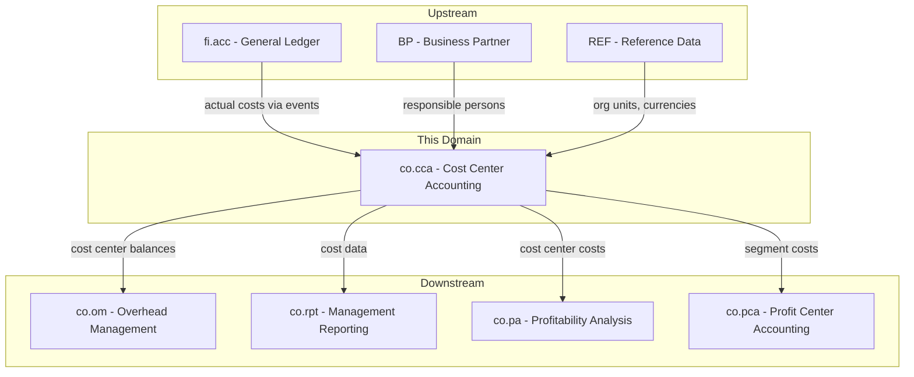
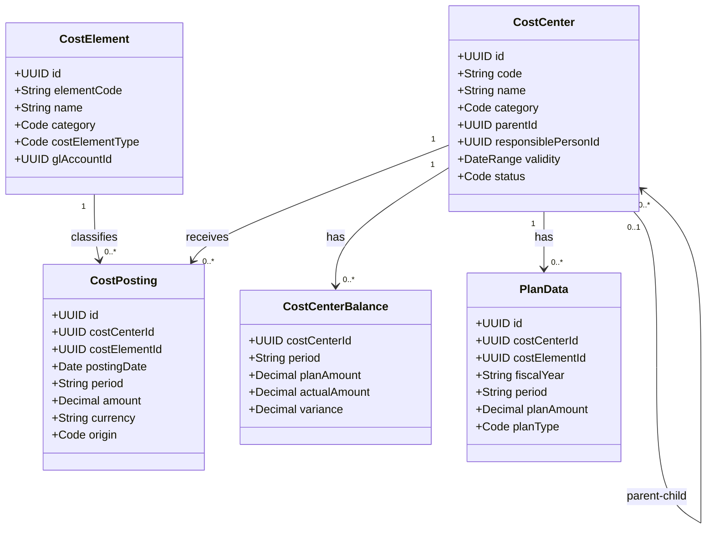
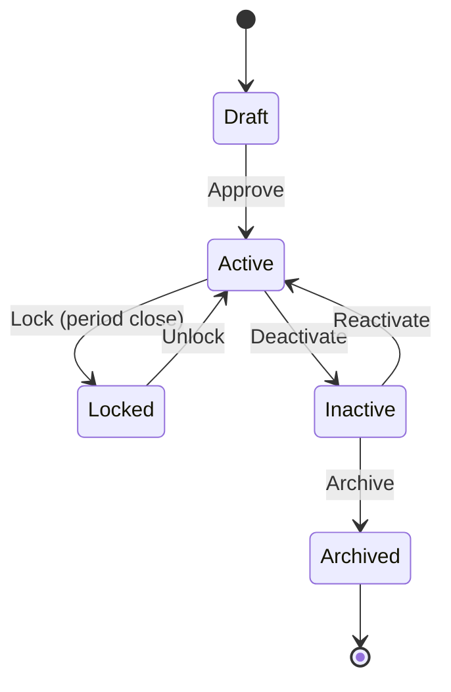
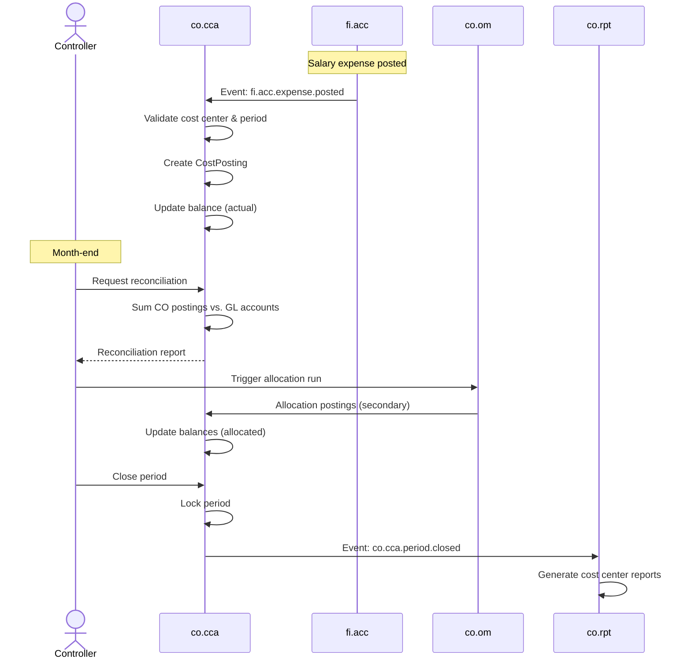
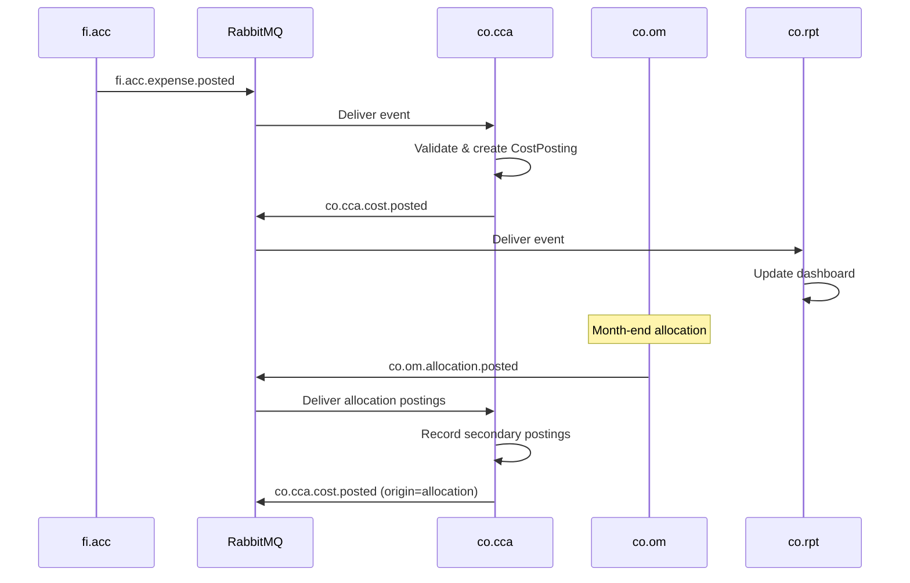
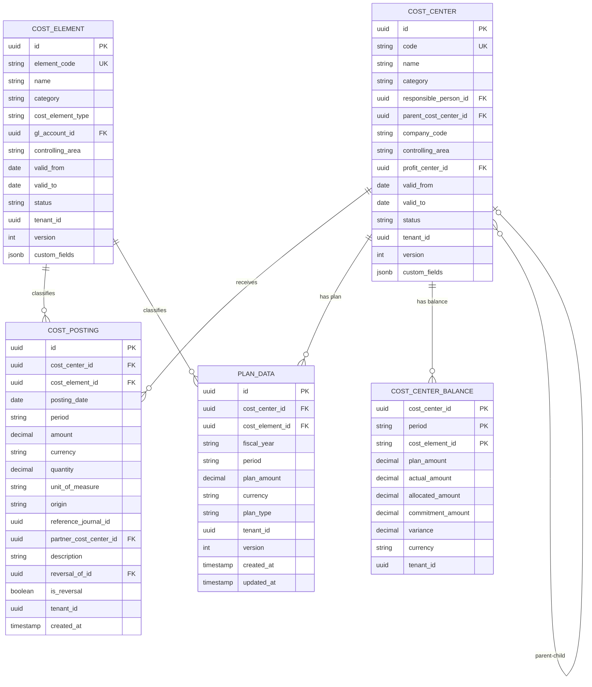

# CO - CCA Cost Center Accounting Domain / Service Specification

> **Conceptual Stack Layer:** Domain / Service
> **Space:** Platform
> **Owner:** Domain Engineering Team
> **Schema alignment:** `service-layer.schema.json`
> **Companion files:** `openapi.yaml`, `*.schema.json` (event contracts)
> **Referenced by:** Platform-Feature Spec SS5 (backend dependencies), BFF Contract
> **Belongs to:** CO Suite Spec (`_co_suite.md`)

> **Meta Information**
> - **Version:** 2026-04-04
> - **Template:** `domain-service-spec.md` v1.0.0
> - **Template Compliance:** ~95% — minor gaps in §11 feature dependency register (pending feature catalog), §3.5 shared types minimal
> - **Author(s):** OpenLeap Architecture Team
> - **Status:** DRAFT
> - **Suite:** `co`
> - **Domain:** `cca`
> - **Bounded Context Ref:** `bc:cost-center-accounting`
> - **Service ID:** `co-cca-svc`
> - **basePackage:** `io.openleap.co.cca`
> - **API Base Path:** `/api/co/cca/v1`
> - **OpenLeap Starter Version:** `v1`
> - **Port:** TBD
> - **Repository:** TBD
> - **Tags:** `controlling`, `cost-center`, `cost-element`, `cost-posting`
> - **Team:**
>   - Name: `team-co`
>   - Email: `co-team@openleap.io`
>   - Slack: `#co-team`

---

## Specification Guidelines Compliance

> ### Non-Negotiables
> - Never invent facts. If required info is missing, add an **OPEN QUESTION** entry.
> - Preserve intent and decisions. Only change meaning when explicitly requested.
> - Do not remove normative constraints unless they are explicitly replaced.
> - Keep the spec **self-contained**: no "see chat", no implicit context.
>
> ### Source of Truth Priority
> When sources conflict:
> 1. Spec (explicit) wins
> 2. Starter specs (implementation constraints) next
> 3. Guidelines (best practices) last
>
> Record conflicts in the **Decisions & Conflicts** section (see Section 14).
>
> ### Style Guide
> - Prefer short sentences and lists.
> - Use MUST/SHOULD/MAY for normative statements.
> - Keep terminology consistent (Aggregate, Domain Service, Application Service, Command, Event).
> - Avoid ambiguous words ("often", "maybe") unless explicitly noting uncertainty.
> - Keep examples minimal and clearly marked as examples.
> - Do not add implementation code unless the chapter explicitly requires it.

---

## 0. Document Purpose & Scope

### 0.1 Purpose
This specification defines the Cost Center Accounting (CCA) domain, which captures, categorizes, and tracks costs by organizational unit (cost center). CCA is the foundational cost collection layer within the Controlling Suite, receiving actual costs from FI and providing the basis for overhead allocations and management reporting.

### 0.2 Target Audience
- Product Owners & Business Stakeholders
- System Architects & Technical Leads
- Integration Engineers

### 0.3 Scope
**In Scope:**
- Cost center master data management (hierarchy, lifecycle)
- Cost element definitions (primary/secondary)
- Cost posting capture from FI events
- Plan data import and plan vs. actual tracking
- Cost center balance queries and period management
- Reconciliation with FI General Ledger

**Out of Scope:**
- Cost allocations and settlements (-> co.om)
- Internal order cost tracking (-> co.io)
- Product costing (-> co.pc)
- Management reporting generation (-> co.rpt)
- General Ledger postings (-> fi.acc)

### 0.4 Related Documents
- `_co_suite.md` - CO Suite overview and architecture
- `co_om-spec.md` - Overhead Management (allocations)
- `co_io-spec.md` - Internal Orders
- `co_rpt-spec.md` - Management Reporting
- `fi_acc_core_spec_complete.md` - Financial Accounting
- `BP_business_partner.md` - Business Partner (responsible persons)
- `REF_reference_data.md` - Reference data catalogs

---

## 1. Business Context

### 1.1 Domain Purpose
`co.cca` tracks **where costs occur** within the organization. Every cost center represents an organizational unit (department, team, location) to which costs are assigned. CCA receives actual costs from FI postings, allows plan data import, and provides cost center balances for allocation processing and management reporting.

### 1.2 Business Value
- Transparent cost tracking per organizational unit
- Foundation for overhead cost allocation
- Plan vs. actual comparison at departmental level
- Basis for responsibility accounting (cost center managers own their budgets)
- Reconciliation anchor between CO and FI

### 1.3 Key Stakeholders

| Role | Responsibility | Primary Use Cases |
|------|----------------|-------------------|
| Cost Center Manager | Monitor own cost center costs, explain variances | UC-004, UC-005 |
| Controller | Manage cost centers, cost elements, period operations | UC-001, UC-002, UC-006 |
| CFO | Review aggregated cost center reports | UC-005 |
| IT Admin | Configure cost center hierarchies | UC-001 |

### 1.4 Strategic Positioning



### 1.5 Service Context

| Property | Value |
|----------|-------|
| **Suite** | `co` |
| **Domain** | `cca` |
| **Bounded Context** | `bc:cost-center-accounting` |
| **Service ID** | `co-cca-svc` |
| **Base Package** | `io.openleap.co.cca` |

**Responsibilities:**
- Cost center master data lifecycle management
- Cost element definitions (primary and secondary)
- Cost posting capture from FI events
- Plan data import and management
- Cost center balance computation and queries
- Period open/close management
- Reconciliation with FI GL

**Authoritative Sources:**
| Source Type | Description | Access Pattern |
|-------------|-------------|----------------|
| REST API | Cost center master data, balances, cost elements | Synchronous |
| Database | Cost centers, cost elements, cost postings, plan data, balances | Direct (owner) |
| Events | Cost postings, status changes, period closings | Asynchronous |

---

## 2. Service Identity

| Property | Value | Schema Field |
|----------|-------|-------------|
| **Service ID** | `co-cca-svc` | `metadata.id` |
| **Display Name** | `Cost Center Accounting` | `metadata.name` |
| **Suite** | `co` | `metadata.suite` |
| **Domain** | `cca` | `metadata.domain` |
| **Bounded Context** | `bc:cost-center-accounting` | `metadata.bounded_context_ref` |
| **Version** | `1.0.0` | `metadata.version` |
| **Status** | DRAFT | `metadata.status` |
| **API Base Path** | `/api/co/cca/v1` | `metadata.api_base_path` |
| **Repository** | TBD | `metadata.repository` |
| **Tags** | `controlling`, `cost-center`, `cost-element` | `metadata.tags` |

**Team:**
| Property | Value |
|----------|-------|
| **Name** | `team-co` |
| **Email** | `co-team@openleap.io` |
| **Slack Channel** | `#co-team` |

---

## 3. Domain Model

### 3.1 Conceptual Overview
CCA manages three core concepts: **Cost Centers** (where costs are tracked), **Cost Elements** (what type of cost), and **Cost Postings** (individual cost transactions). Cost centers are organized in hierarchies reflecting the organizational structure. Cost elements map to GL accounts for primary costs and to internal CO activities for secondary costs.

### 3.2 Core Concepts



### 3.3 Aggregate Definitions

#### 3.3.1 CostCenter

| Property | Value |
|----------|-------|
| **Aggregate ID** | `agg:cost-center` |
| **Name** | `CostCenter` |

**Business Purpose:**
Represents an organizational unit to which costs are assigned. Cost centers form a hierarchy reflecting the company structure and serve as the primary dimension for tracking overhead costs.

##### Aggregate Root

**Key Attributes:**
| Attribute | Type | Format | Description | Constraints | Required | Read-Only |
|-----------|------|--------|-------------|-------------|----------|-----------|
| id | string | uuid | Unique identifier | Immutable | Yes | Yes |
| code | string | -- | Cost center code (e.g., "CC-IT-001") | max 20 chars, unique per (tenant_id, controlling_area) | Yes | No |
| name | string | -- | Descriptive name | max 255 chars | Yes | No |
| category | string | -- | Functional classification | enum_ref: `CostCenterCategory` | Yes | No |
| responsiblePersonId | string | uuid | FK to Business Partner | -- | Yes | No |
| parentCostCenterId | string | uuid | FK to parent cost center | null = root | No | No |
| companyCode | string | -- | Company assignment | max 10 chars | Yes | No |
| controllingArea | string | -- | CO area assignment | max 10 chars | Yes | No |
| profitCenterId | string | uuid | FK to co.pca profit center | -- | No | No |
| validFrom | string | date | Effective start date | -- | Yes | No |
| validTo | string | date | Effective end date | minimum: validFrom | No | No |
| status | string | -- | Current lifecycle state | enum_ref: `CostCenterStatus` | Yes | No |
| customFields | object | json | Product-specific extension fields | JSONB, max 10 KB | No | No |
| version | integer | int64 | Optimistic locking version | -- | Yes | Yes |
| tenantId | string | uuid | Tenant ownership | -- | Yes | Yes |
| createdAt | string | date-time | Creation timestamp | Auto-generated | Yes | Yes |
| updatedAt | string | date-time | Last update timestamp | Auto-generated | Yes | Yes |

**Lifecycle States:**

| Property | Value |
|----------|-------|
| **Initial State** | `Draft` |
| **Terminal States** | `Archived` |



**State Descriptions:**
| State | Description | Business Meaning |
|-------|-------------|------------------|
| Draft | Initial creation | Being set up, cannot receive postings |
| Active | Operational | Can receive cost postings |
| Locked | Period-locked | No new postings, used during period close |
| Inactive | Suspended | No new postings, pending archival |
| Archived | Historical | Read-only, retained for reporting |

**Allowed Transitions:**
| From State | To State | Trigger | Guard / Business Preconditions |
|------------|----------|---------|-------------------------------|
| Draft | Active | Controller approval | All mandatory fields filled, responsible person assigned |
| Active | Locked | Period close initiated | Active period exists |
| Locked | Active | Period reopened | Controller authorization |
| Active | Inactive | Manual deactivation | No open internal orders referencing this center |
| Inactive | Active | Manual reactivation | Responsible person still active |
| Inactive | Archived | Retention policy | Inactive > 2 fiscal years, no open balances |

**Invariants:**
| Rule ID | Description |
|---------|-------------|
| BR-001 | Unique code per (tenant_id, controlling_area) |
| BR-002 | Hierarchy acyclicity -- cannot be own ancestor |
| BR-003 | Active parent required -- parent must be Active or Locked |
| BR-005 | Only Active cost centers can receive postings |

**Domain Events Emitted:**
- `co.cca.costCenter.created`
- `co.cca.costCenter.updated`
- `co.cca.costCenter.statusChanged`

##### Value Objects

###### Value Object: DateRange

| Property | Value |
|----------|-------|
| **VO ID** | `vo:date-range` |
| **Name** | `DateRange` |

**Description:** Validity period for a cost center.

**Attributes:**
| Attribute | Type | Format | Description | Constraints |
|-----------|------|--------|-------------|-------------|
| validFrom | string | date | Effective start | Required |
| validTo | string | date | Effective end | >= validFrom if set |

**Validation Rules:**
- validFrom MUST NOT be null
- validTo, if set, MUST be >= validFrom
- Date format MUST be ISO 8601 (YYYY-MM-DD)

#### 3.3.2 CostElement

| Property | Value |
|----------|-------|
| **Aggregate ID** | `agg:cost-element` |
| **Name** | `CostElement` |

**Business Purpose:**
Defines the type/category of cost. Primary cost elements map to GL accounts (e.g., salary, materials). Secondary cost elements represent internal CO flows (allocations, activity charges) with no GL counterpart.

##### Aggregate Root

**Key Attributes:**
| Attribute | Type | Format | Description | Constraints | Required | Read-Only |
|-----------|------|--------|-------------|-------------|----------|-----------|
| id | string | uuid | Unique identifier | Immutable | Yes | Yes |
| elementCode | string | -- | Cost element code (e.g., "CE-5100") | unique per controlling area, max 20 chars | Yes | No |
| name | string | -- | Descriptive name | max 255 chars | Yes | No |
| category | string | -- | Primary or secondary | enum: primary, secondary | Yes | No |
| costElementType | string | -- | Functional type | enum_ref: `CostElementType` | Yes | No |
| glAccountId | string | uuid | FK to fi.acc account | Required if primary, null if secondary | Conditional | No |
| controllingArea | string | -- | CO area assignment | max 10 chars | Yes | No |
| validFrom | string | date | Effective start | -- | Yes | No |
| validTo | string | date | Effective end | >= validFrom if set | No | No |
| status | string | -- | Lifecycle state | enum: active, inactive | Yes | No |
| customFields | object | json | Product-specific extension fields | JSONB, max 10 KB | No | No |
| tenantId | string | uuid | Tenant ownership | -- | Yes | Yes |
| version | integer | int64 | Optimistic locking | -- | Yes | Yes |
| createdAt | string | date-time | Creation timestamp | Auto-generated | Yes | Yes |
| updatedAt | string | date-time | Last update timestamp | Auto-generated | Yes | Yes |

**Lifecycle States:**

| Property | Value |
|----------|-------|
| **Initial State** | `Active` |
| **Terminal States** | `Inactive` |

**State Descriptions:**
| State | Description | Business Meaning |
|-------|-------------|------------------|
| Active | Operational | Can be used in postings and allocations |
| Inactive | Deactivated | Cannot be used in new postings; retained for historical queries |

**Allowed Transitions:**
| From State | To State | Trigger | Guard / Business Preconditions |
|------------|----------|---------|-------------------------------|
| Active | Inactive | Manual deactivation by Controller | No open plan data referencing this element for future periods |

**Invariants:**
| Rule ID | Description |
|---------|-------------|
| BR-007 | Primary cost elements MUST reference a GL account |
| BR-008 | Cost elements can only be deactivated, never deleted |

**Domain Events Emitted:**
- `co.cca.costElement.created`
- `co.cca.costElement.updated`

#### 3.3.3 CostPosting

| Property | Value |
|----------|-------|
| **Aggregate ID** | `agg:cost-posting` |
| **Name** | `CostPosting` |

**Business Purpose:**
Records an individual cost transaction against a cost center. Postings originate from FI events (primary), manual entries, or CO allocations (secondary).

##### Aggregate Root

**Key Attributes:**
| Attribute | Type | Format | Description | Constraints | Required | Read-Only |
|-----------|------|--------|-------------|-------------|----------|-----------|
| id | string | uuid | Unique identifier | Immutable | Yes | Yes |
| costCenterId | string | uuid | FK to CostCenter | -- | Yes | No |
| costElementId | string | uuid | FK to CostElement | -- | Yes | No |
| postingDate | string | date | Business date of posting | -- | Yes | No |
| period | string | -- | Fiscal period (e.g., "2025-12") | pattern: YYYY-MM | Yes | No |
| amount | number | decimal | Cost amount | precision: 4, can be negative | Yes | No |
| currency | string | -- | ISO 4217 currency code | 3 chars | Yes | No |
| quantity | number | decimal | Statistical quantity | precision: 4 | No | No |
| unitOfMeasure | string | -- | Unit for quantity | Required if quantity provided | Conditional | No |
| origin | string | -- | Source of posting | enum: fi_actual, manual, allocation, settlement, plan | Yes | No |
| referenceJournalId | string | uuid | FK to FI journal if from FI | Required if origin = fi_actual | Conditional | No |
| partnerCostCenterId | string | uuid | FK to partner CC (allocations) | -- | No | No |
| description | string | -- | Posting text | max 500 chars | No | No |
| reversalOfId | string | uuid | FK to original posting being reversed | -- | No | No |
| isReversal | boolean | -- | Indicates this posting is a reversal entry | default: false | No | Yes |
| tenantId | string | uuid | Tenant ownership | -- | Yes | Yes |
| createdAt | string | date-time | Creation timestamp | Auto-generated | Yes | Yes |

**Invariants:**
| Rule ID | Description |
|---------|-------------|
| BR-004 | Period MUST be open for postings |
| BR-005 | Cost center MUST be Active |
| BR-006 | Idempotency on FI events via reference_journal_id |

**Domain Events Emitted:**
- `co.cca.cost.posted`

#### 3.3.4 PlanData

| Property | Value |
|----------|-------|
| **Aggregate ID** | `agg:plan-data` |
| **Name** | `PlanData` |

**Business Purpose:**
Stores planned cost amounts per cost center, cost element, fiscal year, and period. Plan data is imported from external planning systems or entered manually by controllers. It serves as the baseline for plan vs. actual variance analysis.

##### Aggregate Root

**Key Attributes:**
| Attribute | Type | Format | Description | Constraints | Required | Read-Only |
|-----------|------|--------|-------------|-------------|----------|-----------|
| id | string | uuid | Unique identifier | Immutable | Yes | Yes |
| costCenterId | string | uuid | FK to CostCenter | -- | Yes | No |
| costElementId | string | uuid | FK to CostElement | -- | Yes | No |
| fiscalYear | string | -- | Fiscal year (e.g., "2026") | pattern: YYYY | Yes | No |
| period | string | -- | Fiscal period (e.g., "2026-03") | pattern: YYYY-MM | Yes | No |
| planAmount | number | decimal | Planned cost amount | precision: 4, >= 0 | Yes | No |
| currency | string | -- | ISO 4217 currency code | 3 chars | Yes | No |
| planType | string | -- | Type of plan data | enum_ref: `PlanType` | Yes | No |
| tenantId | string | uuid | Tenant ownership | -- | Yes | Yes |
| version | integer | int64 | Optimistic locking | -- | Yes | Yes |
| createdAt | string | date-time | Creation timestamp | Auto-generated | Yes | Yes |
| updatedAt | string | date-time | Last update timestamp | Auto-generated | Yes | Yes |

**Invariants:**
| Rule ID | Description |
|---------|-------------|
| BR-011 | Unique plan entry per (tenant_id, cost_center_id, cost_element_id, fiscal_year, period, plan_type) |
| BR-012 | Plan amount MUST be non-negative |
| BR-013 | Referenced cost center and cost element MUST exist and be Active |

**Domain Events Emitted:**
- `co.cca.planData.imported`
- `co.cca.planData.updated`

#### 3.3.5 CostCenterBalance

| Property | Value |
|----------|-------|
| **Aggregate ID** | `agg:cost-center-balance` |
| **Name** | `CostCenterBalance` |

**Business Purpose:**
Materialized aggregate that tracks plan, actual, allocated, and commitment amounts per cost center, cost element, and period. Updated transactionally with each posting. Provides sub-50ms balance queries without scanning all postings (see ADR-CCA-002).

##### Aggregate Root

**Key Attributes:**
| Attribute | Type | Format | Description | Constraints | Required | Read-Only |
|-----------|------|--------|-------------|-------------|----------|-----------|
| costCenterId | string | uuid | FK to CostCenter (composite PK) | -- | Yes | Yes |
| period | string | -- | Fiscal period (composite PK) | pattern: YYYY-MM | Yes | Yes |
| costElementId | string | uuid | FK to CostElement (composite PK) | -- | Yes | Yes |
| planAmount | number | decimal | Total planned amount | precision: 4 | Yes | No |
| actualAmount | number | decimal | Total actual amount (from FI + manual) | precision: 4 | Yes | No |
| allocatedAmount | number | decimal | Total allocated amount (secondary) | precision: 4 | Yes | No |
| commitmentAmount | number | decimal | Committed but not yet invoiced | precision: 4 | Yes | No |
| variance | number | decimal | actualAmount + allocatedAmount - planAmount | precision: 4, computed | Yes | Yes |
| currency | string | -- | ISO 4217 currency code | 3 chars | Yes | No |
| tenantId | string | uuid | Tenant ownership | -- | Yes | Yes |

**Invariants:**
| Rule ID | Description |
|---------|-------------|
| BR-014 | variance MUST equal (actualAmount + allocatedAmount - planAmount) |

**Domain Events Emitted:**
- None (internal materialized view, consumed via query endpoints)

### 3.4 Enumerations

#### CostCenterCategory

**Description:** Functional classification of a cost center.

| Value | Description | Deprecated |
|-------|-------------|------------|
| `production` | Manufacturing/production department | No |
| `administration` | Administrative/support department | No |
| `sales` | Sales and distribution department | No |
| `service` | Internal service department | No |
| `management` | Executive/management | No |

#### CostCenterStatus

**Description:** Lifecycle state of a cost center.

| Value | Description | Deprecated |
|-------|-------------|------------|
| `DRAFT` | Initial creation state | No |
| `ACTIVE` | Operational, can receive postings | No |
| `LOCKED` | Period-locked, no new postings | No |
| `INACTIVE` | Suspended | No |
| `ARCHIVED` | Historical, read-only | No |

#### CostElementType

**Description:** Functional type of a cost element.

| Value | Description | Deprecated |
|-------|-------------|------------|
| `material` | Material costs (raw materials, consumables, packaging) | No |
| `labor` | Labor/salary costs (wages, salaries, social contributions) | No |
| `overhead` | Overhead costs (rent, utilities, insurance) | No |
| `depreciation` | Depreciation costs (asset depreciation, amortization) | No |
| `revenue` | Revenue elements (internal revenue credits) | No |
| `allocation` | Internal allocation flows (assessment, distribution) | No |
| `settlement` | Settlement flows (internal order settlement) | No |
| `activity` | Activity-based charges (activity allocation) | No |

#### PlanType

**Description:** Type of plan data distinguishing different planning versions.

| Value | Description | Deprecated |
|-------|-------------|------------|
| `budget` | Approved budget (authorization ceiling) | No |
| `forecast` | Rolling forecast (updated quarterly) | No |
| `standard` | Standard cost plan (for variance analysis) | No |

#### PostingOrigin

**Description:** Source of a cost posting.

| Value | Description | Deprecated |
|-------|-------------|------------|
| `fi_actual` | Originated from FI General Ledger journal entry | No |
| `manual` | Manually entered by controller | No |
| `allocation` | Generated by CO allocation run (assessment/distribution) | No |
| `settlement` | Generated by internal order settlement | No |
| `plan` | Plan posting for budget/forecast loading | No |

### 3.5 Shared Types

#### Money

| Property | Value |
|----------|-------|
| **Type ID** | `type:money` |
| **Name** | `Money` |

**Description:** Represents a monetary amount with currency. Used wherever financial amounts appear.

**Attributes:**
| Attribute | Type | Format | Description | Constraints |
|-----------|------|--------|-------------|-------------|
| amount | number | decimal | Monetary amount | precision: 4 |
| currency | string | -- | ISO 4217 currency code | 3 chars, must be active in ref-data-svc |

**Validation Rules:**
- currency MUST be a valid ISO 4217 code
- currency MUST be active in ref-data-svc

**Used By:**
- `agg:cost-posting` (amount + currency)
- `agg:plan-data` (planAmount + currency)
- `agg:cost-center-balance` (planAmount/actualAmount/allocatedAmount/commitmentAmount + currency)

#### FiscalPeriod

| Property | Value |
|----------|-------|
| **Type ID** | `type:fiscal-period` |
| **Name** | `FiscalPeriod` |

**Description:** Represents a fiscal period identifier. Validated against the fiscal calendar in ref-data-svc.

**Attributes:**
| Attribute | Type | Format | Description | Constraints |
|-----------|------|--------|-------------|-------------|
| period | string | -- | Fiscal period | pattern: YYYY-MM |

**Validation Rules:**
- MUST match pattern `YYYY-MM`
- MUST exist in the fiscal calendar for the given controlling area

**Used By:**
- `agg:cost-posting` (period)
- `agg:plan-data` (period)
- `agg:cost-center-balance` (period)

---

## 4. Business Rules & Constraints

### 4.1 Business Rules Catalog

| ID | Rule Name | Description | Scope | Enforcement | Error Code |
|----|-----------|-------------|-------|-------------|------------|
| BR-001 | Unique Cost Center Code | Code MUST be unique per (tenant_id, controlling_area) | CostCenter | Create, Update | `DUPLICATE_CODE` |
| BR-002 | Hierarchy Acyclicity | Cost center MUST NOT be its own ancestor | CostCenter | Update (parent change) | `CIRCULAR_HIERARCHY` |
| BR-003 | Active Parent | Parent cost center MUST be Active or Locked | CostCenter | Create, Update | `INACTIVE_PARENT` |
| BR-004 | Posting Period Open | Cost postings MUST only be in open periods | CostPosting | Create | `PERIOD_CLOSED` |
| BR-005 | Active Target | Postings MUST only target Active cost centers | CostPosting | Create | `INACTIVE_COST_CENTER` |
| BR-006 | FI Idempotency | No duplicate postings from same FI journal | CostPosting | Create | -- (silent dedup) |
| BR-007 | Primary GL Link | Primary cost elements MUST reference a GL account | CostElement | Create, Update | `MISSING_GL_LINK` |
| BR-008 | No Cost Element Deletion | Cost elements MUST only be deactivated | CostElement | Delete | `DELETE_FORBIDDEN` |
| BR-009 | Reconciliation Tolerance | CO actuals MUST match FI GL within +/-0.01% | CostCenterBalance | Period close | `RECONCILIATION_FAILED` |
| BR-010 | Archive Precondition | Cost center MUST be Inactive > 2 fiscal years with zero balance | CostCenter | Archive | `ARCHIVE_PRECONDITION_FAILED` |
| BR-011 | Unique Plan Entry | Plan entry MUST be unique per (tenant, CC, CE, year, period, type) | PlanData | Create | `DUPLICATE_PLAN_ENTRY` |
| BR-012 | Non-negative Plan | Plan amount MUST be non-negative | PlanData | Create, Update | `INVALID_PLAN_AMOUNT` |
| BR-013 | Active References for Plan | Referenced cost center and cost element MUST be Active | PlanData | Create | `INACTIVE_REFERENCE` |
| BR-014 | Variance Computation | Variance MUST equal (actual + allocated - plan) | CostCenterBalance | Internal | -- (computed) |

### 4.2 Detailed Rule Definitions

#### BR-001: Unique Cost Center Code

**Business Context:**
Cost center codes serve as human-readable identifiers used in reports, allocations, and cross-system interfaces. Uniqueness within a controlling area prevents confusion and data integrity issues.

**Rule Statement:**
No two cost centers within the same tenant and controlling area MAY share the same code.

**Applies To:**
- Aggregate: CostCenter
- Operations: Create, Update

**Enforcement:**
Database unique constraint on `(tenant_id, controlling_area, code)`.

**Validation Logic:**
Before insert or update, check that no other CostCenter record with the same tenant_id, controlling_area, and code exists.

**Error Handling:**
- **Error Code:** `DUPLICATE_CODE`
- **Error Message:** "Cost center code '{code}' already exists in controlling area '{area}'"
- **User action:** Choose a different code or verify the correct controlling area

**Examples:**
- **Valid:** Creating CC-IT-001 in CA01 when no such code exists
- **Invalid:** Creating CC-IT-001 in CA01 when another cost center already has that code

#### BR-002: Hierarchy Acyclicity

**Business Context:**
Cost centers form a tree hierarchy for organizational reporting. Circular references would break hierarchy traversal and aggregate reporting.

**Rule Statement:**
A cost center MUST NOT be assigned as its own ancestor at any depth in the parent chain.

**Applies To:**
- Aggregate: CostCenter
- Operations: Update (parent change)

**Enforcement:**
Traverse the parent chain from the proposed parent up to the root. If the current cost center ID appears, reject.

**Validation Logic:**
Walk the ancestor chain from `parentCostCenterId` upward. If `id` is found in the chain, reject.

**Error Handling:**
- **Error Code:** `CIRCULAR_HIERARCHY`
- **Error Message:** "Assigning parent '{parentId}' would create a circular hierarchy"
- **User action:** Select a different parent cost center

**Examples:**
- **Valid:** CC-A -> CC-B -> CC-C (linear chain)
- **Invalid:** CC-A -> CC-B -> CC-A (cycle)

#### BR-003: Active Parent

**Business Context:**
Child cost centers MUST NOT reference inactive or archived parents to ensure the hierarchy is operationally valid.

**Rule Statement:**
When a cost center specifies a parent, that parent MUST be in status Active or Locked.

**Applies To:**
- Aggregate: CostCenter
- Operations: Create, Update

**Enforcement:**
Check parent cost center status before persisting.

**Validation Logic:**
If `parentCostCenterId` is not null, load parent and verify `status IN ('ACTIVE', 'LOCKED')`.

**Error Handling:**
- **Error Code:** `INACTIVE_PARENT`
- **Error Message:** "Parent cost center '{parentId}' is not active"
- **User action:** Activate the parent first or choose an active parent

**Examples:**
- **Valid:** Parent is Active, child created under it
- **Invalid:** Parent is Archived, child references it

#### BR-004: Posting Period Open

**Business Context:**
Financial controls require that cost postings are only allowed in open periods. Closed periods are final for reporting purposes.

**Rule Statement:**
A cost posting MUST only be created against a period that is currently open in the fiscal calendar for the given controlling area.

**Applies To:**
- Aggregate: CostPosting
- Operations: Create

**Enforcement:**
Check period status in the fiscal calendar before creating a posting.

**Validation Logic:**
Query fiscal calendar for `(controlling_area, period)`. Period status MUST be OPEN.

**Error Handling:**
- **Error Code:** `PERIOD_CLOSED`
- **Error Message:** "Period '{period}' is closed for postings in controlling area '{area}'"
- **User action:** Contact controller to reopen period if correction is needed

**Examples:**
- **Valid:** Posting to period 2026-03 when it is open
- **Invalid:** Posting to period 2025-12 after period close

#### BR-005: Active Target

**Business Context:**
Only operational cost centers should accumulate costs. Inactive or archived centers cannot accept new charges.

**Rule Statement:**
A cost posting MUST only target a cost center in Active status.

**Applies To:**
- Aggregate: CostPosting
- Operations: Create

**Enforcement:**
Check cost center status before creating posting.

**Validation Logic:**
Load target cost center. Verify `status = 'ACTIVE'`.

**Error Handling:**
- **Error Code:** `INACTIVE_COST_CENTER`
- **Error Message:** "Cost center '{id}' is not active and cannot receive postings"
- **User action:** Activate the cost center or use a different target

**Examples:**
- **Valid:** Posting to an Active cost center
- **Invalid:** Posting to a Locked or Inactive cost center

#### BR-006: FI Idempotency

**Business Context:**
FI events MAY be delivered more than once (at-least-once delivery). CCA MUST NOT create duplicate cost postings.

**Rule Statement:**
For each `fi.acc.expense.posted` event, the system MUST check whether a CostPosting with the same `reference_journal_id` already exists. If so, the event is acknowledged but no new posting is created.

**Applies To:**
- Aggregate: CostPosting
- Operations: Create (from FI event)

**Validation Logic:**
Check uniqueness of (tenant_id, reference_journal_id) before insert.

**Error Handling:**
- **If duplicate detected:** Log info message, acknowledge event, skip creation
- **User action:** None required (automatic deduplication)

**Examples:**
- **Valid:** First delivery of FI event creates a posting
- **Invalid:** Second delivery of same FI event -- silently deduplicated

#### BR-007: Primary GL Link

**Business Context:**
Primary cost elements represent external costs that must reconcile with FI. Each primary element MUST map to a GL account for cross-suite consistency.

**Rule Statement:**
A cost element with category = `primary` MUST have a non-null `glAccountId` referencing a valid FI GL account.

**Applies To:**
- Aggregate: CostElement
- Operations: Create, Update

**Enforcement:**
Validate `glAccountId` is present and references an active GL account.

**Validation Logic:**
If `category = 'primary'`, then `glAccountId MUST NOT be null` and must reference a valid account in fi.acc.

**Error Handling:**
- **Error Code:** `MISSING_GL_LINK`
- **Error Message:** "Primary cost element '{code}' requires a GL account reference"
- **User action:** Provide a valid GL account ID

**Examples:**
- **Valid:** Primary element CE-5100 (Salaries) linked to GL account 5100
- **Invalid:** Primary element CE-5100 with null glAccountId

#### BR-008: No Cost Element Deletion

**Business Context:**
Cost elements are referenced by historical postings. Deleting them would break referential integrity and audit trails.

**Rule Statement:**
Cost elements MUST NOT be hard-deleted. They MAY only be deactivated (status = inactive).

**Applies To:**
- Aggregate: CostElement
- Operations: Delete

**Enforcement:**
DELETE operation is forbidden. Only status change to inactive is allowed.

**Validation Logic:**
Reject any DELETE request. Only PATCH with status = inactive is permitted.

**Error Handling:**
- **Error Code:** `DELETE_FORBIDDEN`
- **Error Message:** "Cost elements cannot be deleted; deactivate instead"
- **User action:** Use the deactivation endpoint instead

#### BR-009: Reconciliation Tolerance

**Business Context:**
CO actual costs MUST reconcile with FI GL expense accounts to ensure data integrity across suites. Minor rounding differences are acceptable.

**Rule Statement:**
At period close, the sum of all CostPostings with origin = fi_actual for a given period MUST equal the corresponding FI GL expense account balances, with a tolerance of +/-0.01%.

**Applies To:**
- Process: Period Close (UC-006)

**Validation Logic:**
Query sum of CO postings by cost element (mapped to GL account). Compare with FI GL balances. Flag differences exceeding tolerance.

**Error Handling:**
- **Error Code:** `RECONCILIATION_FAILED`
- **Error Message:** "CO-FI reconciliation failed: delta exceeds 0.01% tolerance"
- **If violated:** Period close blocked; reconciliation report generated listing discrepancies
- **User action:** Controller investigates and resolves (missing postings, double postings)

**Examples:**
- **Valid:** CO sum = 1,000,000.00, FI sum = 1,000,000.05 (delta 0.000005%)
- **Invalid:** CO sum = 1,000,000.00, FI sum = 1,001,500.00 (delta 0.15%)

#### BR-010: Archive Precondition

**Business Context:**
Archiving a cost center permanently freezes it. Premature archiving could prevent legitimate corrections.

**Rule Statement:**
A cost center MAY only transition to Archived status if it has been Inactive for more than 2 fiscal years and has zero open balances.

**Applies To:**
- Aggregate: CostCenter
- Operations: Archive (status transition)

**Enforcement:**
Check Inactive duration and balance totals before allowing transition.

**Validation Logic:**
Verify `status = 'INACTIVE'` for > 2 fiscal years. Verify sum of all balance amounts = 0.

**Error Handling:**
- **Error Code:** `ARCHIVE_PRECONDITION_FAILED`
- **Error Message:** "Cost center cannot be archived: inactive period too short or open balances exist"
- **User action:** Wait for required inactive period or clear remaining balances

### 4.3 Data Validation Rules

**Field-Level Validations:**
| Field | Validation Rule | Error Message |
|-------|----------------|---------------|
| code | Required, 1-20 chars, alphanumeric + hyphens | "Cost center code is required (max 20 chars, alphanumeric)" |
| name | Required, 1-255 chars | "Cost center name is required" |
| category | Required, must be in allowed values | "Invalid cost center category" |
| responsiblePersonId | Required, valid UUID | "Responsible person is required" |
| companyCode | Required, max 10 chars | "Company code is required" |
| controllingArea | Required, max 10 chars | "Controlling area is required" |
| validFrom | Required, ISO 8601 date | "Valid from date is required" |
| amount (posting) | Required, max 15 integer + 4 decimal digits | "Amount must be a valid decimal" |
| currency | Required, ISO 4217, 3 chars | "Invalid currency code" |
| period | Required, format YYYY-MM | "Period must be in YYYY-MM format" |
| elementCode | Required, 1-20 chars, unique per controlling area | "Cost element code is required" |
| planAmount | Required, >= 0, max 15 integer + 4 decimal digits | "Plan amount must be non-negative" |

**Cross-Field Validations:**
- validFrom MUST be before validTo (if validTo is set)
- quantity requires unitOfMeasure and vice versa
- referenceJournalId MUST be present when origin = fi_actual
- glAccountId MUST be present when category = primary (cost elements)
- planType + costCenterId + costElementId + fiscalYear + period MUST be unique per tenant

### 4.4 Reference Data Dependencies

**Required Reference Data:**
| Catalog | Source Service | Fields Referencing | Validation |
|---------|----------------|-------------------|------------|
| Currencies (ISO 4217) | ref-data-svc | currency | Must exist and be active |
| Organizational Units | ref-data-svc | company_code, controlling_area | Must exist |
| Fiscal Calendar | ref-data-svc | period | Period must exist and be valid |
| Units of Measure (UCUM) | si-unit-svc | unit_of_measure | Must be valid UCUM code |
| GL Accounts | fi-acc-svc | glAccountId (CostElement) | Must exist and be active |
| Business Partners | bp-svc | responsiblePersonId | Must exist and be active |

---

## 5. Use Cases

### 5.1 Business Logic Placement

| Logic Type | Placement | Examples |
|------------|-----------|----------|
| Aggregate invariants | Domain Object | Hierarchy acyclicity, code uniqueness, status transitions |
| Cross-aggregate logic | Domain Service | Reconciliation, period management |
| Orchestration & transactions | Application Service | FI event processing, balance update, event publishing |

### 5.2 Use Cases (Canonical Format)

#### UC-001: CreateCostCenter

| Field | Value |
|-------|-------|
| **id** | `CreateCostCenter` |
| **type** | WRITE |
| **trigger** | REST |
| **aggregate** | `CostCenter` |
| **domainOperation** | `CostCenter.create` |
| **inputs** | `code: String`, `name: String`, `category: CostCenterCategory`, `responsiblePersonId: UUID`, `parentCostCenterId: UUID?`, `companyCode: String`, `controllingArea: String`, `validFrom: Date` |
| **outputs** | `CostCenter` |
| **events** | `CostCenter.created` |
| **rest** | `POST /api/co/cca/v1/cost-centers` |
| **idempotency** | optional |
| **errors** | `DUPLICATE_CODE`: Code already exists, `INACTIVE_PARENT`: Parent not active |

**Actor:** Controller

**Preconditions:**
- Controlling area exists
- Responsible person exists in BP
- Parent cost center (if any) is Active

**Main Flow:**
1. Controller submits cost center data (code, name, category, responsible person, parent)
2. System validates uniqueness of code within controlling area
3. System validates parent hierarchy (no circular reference)
4. System creates cost center in Draft status
5. System publishes `co.cca.costCenter.created` event

**Postconditions:**
- Cost center exists in Draft status
- Downstream systems notified

**Business Rules Applied:**
- BR-001: Unique code per tenant
- BR-003: Active parent required

**Alternative Flows:**
- **Alt-1:** If parentCostCenterId is null, cost center is created as root node

**Exception Flows:**
- **Exc-1:** If code is duplicate, return `409 Conflict` with `DUPLICATE_CODE`
- **Exc-2:** If parent is not active, return `422 Unprocessable Entity` with `INACTIVE_PARENT`

#### UC-002: MaintainCostElements

| Field | Value |
|-------|-------|
| **id** | `MaintainCostElements` |
| **type** | WRITE |
| **trigger** | REST |
| **aggregate** | `CostElement` |
| **domainOperation** | `CostElement.create` |
| **inputs** | `elementCode: String`, `name: String`, `category: String`, `costElementType: String`, `glAccountId: UUID?`, `controllingArea: String` |
| **outputs** | `CostElement` |
| **events** | `CostElement.created` |
| **rest** | `POST /api/co/cca/v1/cost-elements` |
| **idempotency** | optional |
| **errors** | `MISSING_GL_LINK`: Primary element without GL account |

**Actor:** Controller

**Preconditions:**
- Controlling area exists in ref-data-svc
- GL account (if primary) exists in fi.acc

**Main Flow:**
1. Controller submits cost element data (code, name, category, type, GL link)
2. System validates category/GL consistency (BR-007)
3. System validates uniqueness of elementCode within controlling area
4. System creates cost element in Active status
5. System publishes `co.cca.costElement.created` event

**Postconditions:**
- Cost element exists in Active status
- Available for use in cost postings

**Business Rules Applied:**
- BR-007: Primary requires GL link
- Unique code per controlling area

**Alternative Flows:**
- **Alt-1:** If category = secondary, glAccountId is ignored even if provided

**Exception Flows:**
- **Exc-1:** If primary element lacks GL link, return `422 Unprocessable Entity` with `MISSING_GL_LINK`

#### UC-003: ReceiveActualCostFromFI

| Field | Value |
|-------|-------|
| **id** | `ReceiveActualCostFromFI` |
| **type** | WRITE |
| **trigger** | Message |
| **aggregate** | `CostPosting` |
| **domainOperation** | `CostPosting.createFromFI` |
| **inputs** | `costCenterId: UUID`, `costElementId: UUID`, `amount: Decimal`, `currency: String`, `period: String`, `referenceJournalId: UUID` |
| **outputs** | `CostPosting` |
| **events** | `Cost.posted` |
| **rest** | -- (event-driven) |
| **idempotency** | required |
| **errors** | `PERIOD_CLOSED`, `INACTIVE_COST_CENTER` |

**Actor:** System (event-driven)

**Preconditions:**
- FI journal entry has been posted
- Cost center exists and is Active
- Period is open

**Main Flow:**
1. System receives FI expense event
2. System extracts cost center, cost element, amount, period
3. System validates cost center is Active and period is Open
4. System creates CostPosting with origin = fi_actual
5. System updates cost center balance (actual amount)
6. System publishes `co.cca.cost.posted` event

**Postconditions:**
- CostPosting recorded with origin = fi_actual
- Cost center balance updated
- Downstream systems notified

**Alternative Flows:**
- **Alt-1:** If cost center not found, post to default/unassigned cost center and flag for review
- **Alt-2:** If period is closed, reject and route to dead letter queue

**Business Rules Applied:**
- BR-004: Period must be open
- BR-005: Active target
- BR-006: FI Idempotency

**Exception Flows:**
- **Exc-1:** If duplicate referenceJournalId detected, acknowledge event silently (BR-006)
- **Exc-2:** If cost element not found, route to DLQ for manual mapping

#### UC-004: QueryCostCenterBalance

| Field | Value |
|-------|-------|
| **id** | `QueryCostCenterBalance` |
| **type** | READ |
| **trigger** | REST |
| **aggregate** | `CostCenterBalance` |
| **domainOperation** | `getCostCenterBalance` |
| **inputs** | `costCenterId: UUID`, `period: String`, `costElementType: String?` |
| **outputs** | `CostCenterBalanceDTO` |
| **rest** | `GET /api/co/cca/v1/cost-centers/{id}/balances` |
| **idempotency** | none |
| **errors** | -- |

**Actor:** Cost Center Manager / Controller

**Preconditions:**
- Cost center exists
- User has read permission for the cost center

**Main Flow:**
1. Actor requests balance for a cost center and period
2. System retrieves materialized balance data
3. System aggregates by cost element (optionally filtered by type)
4. System returns plan, actual, allocated, commitment, and variance amounts

**Postconditions:**
- No state change (read-only)

#### UC-005: PlanVsActualComparison

| Field | Value |
|-------|-------|
| **id** | `PlanVsActualComparison` |
| **type** | READ |
| **trigger** | REST |
| **aggregate** | `CostCenterBalance` |
| **domainOperation** | `getPlanVsActual` |
| **inputs** | `costCenterIds: UUID[]`, `periods: String[]` |
| **outputs** | `PlanVsActualReport` |
| **rest** | `GET /api/co/cca/v1/cost-centers/{id}/balances?period={period}` |
| **idempotency** | none |
| **errors** | -- |

**Actor:** Controller / Cost Center Manager

**Preconditions:**
- Referenced cost centers exist
- Periods exist in fiscal calendar

**Main Flow:**
1. Actor requests plan vs. actual comparison for one or more cost centers and periods
2. System retrieves balance data for each combination
3. System computes variance and variance percentage
4. System returns structured comparison report

**Postconditions:**
- No state change (read-only)

#### UC-006: ClosePeriod

| Field | Value |
|-------|-------|
| **id** | `ClosePeriod` |
| **type** | WRITE |
| **trigger** | REST |
| **aggregate** | `CostCenter` (multiple) |
| **domainOperation** | `Period.close` |
| **inputs** | `period: String`, `controllingArea: String`, `reconciliationOverride: Boolean` |
| **outputs** | `PeriodCloseResult` |
| **events** | `Period.closed` |
| **rest** | `POST /api/co/cca/v1/periods/{period}/close` |
| **idempotency** | required |
| **errors** | `RECONCILIATION_FAILED` |

**Actor:** Controller

**Preconditions:**
- Period exists and is currently open
- User has CO_CCA_CONTROLLER or CO_CCA_ADMIN role

**Main Flow:**
1. Controller opens a new period for postings
2. At period end, controller initiates close:
   a. System validates all expected FI postings received (reconciliation)
   b. Controller triggers allocation run via co.om
   c. After allocations complete, controller locks the period
3. System prevents further postings to locked period
4. System publishes `co.cca.period.closed` event

**Postconditions:**
- Period is locked
- No further postings accepted for this period
- Downstream reporting systems notified

**Business Rules Applied:**
- BR-009: Reconciliation tolerance

**Alternative Flows:**
- **Alt-1:** If reconciliationOverride = true and user has ADMIN role, skip reconciliation check

**Exception Flows:**
- **Exc-1:** If reconciliation fails and override is false, return `422 Unprocessable Entity` with `RECONCILIATION_FAILED` and reconciliation report

#### UC-007: ImportPlanData

| Field | Value |
|-------|-------|
| **id** | `ImportPlanData` |
| **type** | WRITE |
| **trigger** | REST |
| **aggregate** | `PlanData` |
| **domainOperation** | `PlanData.import` |
| **inputs** | `costCenterId: UUID`, `costElementId: UUID`, `fiscalYear: String`, `period: String`, `planAmount: Decimal`, `currency: String`, `planType: PlanType` |
| **outputs** | `PlanData` |
| **events** | `PlanData.imported` |
| **rest** | `POST /api/co/cca/v1/plan-data` |
| **idempotency** | optional |
| **errors** | `DUPLICATE_PLAN_ENTRY`, `INACTIVE_REFERENCE`, `INVALID_PLAN_AMOUNT` |

**Actor:** Controller

**Preconditions:**
- Cost center exists and is Active
- Cost element exists and is Active
- Fiscal year/period exists in fiscal calendar

**Main Flow:**
1. Controller submits plan data (cost center, cost element, year, period, amount, type)
2. System validates referenced cost center and cost element are active (BR-013)
3. System validates plan amount is non-negative (BR-012)
4. System validates uniqueness of plan entry (BR-011)
5. System creates PlanData record
6. System updates CostCenterBalance plan amount
7. System publishes `co.cca.planData.imported` event

**Postconditions:**
- Plan data recorded
- Balance plan column updated

**Business Rules Applied:**
- BR-011: Unique plan entry
- BR-012: Non-negative plan amount
- BR-013: Active references

**Exception Flows:**
- **Exc-1:** If duplicate entry exists, return `409 Conflict` with `DUPLICATE_PLAN_ENTRY`

### 5.3 Process Flow Diagrams



### 5.4 Cross-Domain Workflows

**Does this domain participate in multi-service workflows?** [x] YES [ ] NO

#### Workflow: Month-End Cost Allocation

**Business Purpose:** Distribute indirect costs from service cost centers to production/operating cost centers.

**Orchestration Pattern:** [ ] Choreography (EDA) [x] Orchestration (Saga)

**Pattern Rationale:**
CCA acts as a passive participant. co.om drives the allocation logic and sends allocation postings to CCA. CCA reacts to events and updates balances. co.om coordinates the overall workflow.

**Participating Services:**
| Service | Role | Responsibilities |
|---------|------|------------------|
| co.cca | Data provider & receiver | Provides balances, receives allocation postings |
| co.om | Driver / Orchestrator | Calculates and executes allocations |
| fi.acc | Final recorder | Receives allocation journals |

**Workflow Steps:**
1. co.om reads cost center balances from co.cca
   - Success: Balances returned
   - Failure: co.om retries or aborts run
2. co.om applies allocation rules and calculates amounts
   - Success: Allocation amounts computed
   - Failure: Allocation run marked as failed, no postings created
3. co.om sends allocation postings to co.cca (sender gets credit, receivers get debit)
   - Success: CCA records postings and publishes `co.cca.cost.posted`
   - Failure: co.om compensates by reversing already-posted allocations
4. co.cca records postings and updates balances
5. co.om sends allocation journal to fi.acc

**Business Implications:**
- **Success Path:** All indirect costs are fairly distributed to operating cost centers
- **Failure Path:** Allocation run is rolled back; cost center balances remain at pre-allocation state
- **Compensation:** Reversal postings generated for any partially completed allocations

---

## 6. REST API

### 6.1 API Overview

**Base Path:** `/api/co/cca/v1`

**Authentication:** OAuth2/JWT (Bearer token)

**Authorization:**
- Read operations: Requires scope `co.cca:read`
- Write operations: Requires scope `co.cca:write`
- Admin operations: Requires scope `co.cca:admin`

### 6.2 Resource Operations

#### 6.2.1 Cost Centers - Create

```http
POST /api/co/cca/v1/cost-centers
Authorization: Bearer {token}
Content-Type: application/json
```

**Request Body:**
```json
{
  "code": "CC-IT-001",
  "name": "IT Department",
  "category": "administration",
  "responsiblePersonId": "uuid-bp-001",
  "parentCostCenterId": "uuid-cc-admin",
  "companyCode": "1000",
  "controllingArea": "CA01",
  "profitCenterId": "uuid-pca-001",
  "validFrom": "2026-01-01",
  "validTo": null
}
```

**Success Response:** `201 Created`
```json
{
  "id": "uuid-cc-it-001",
  "version": 1,
  "code": "CC-IT-001",
  "name": "IT Department",
  "category": "administration",
  "responsiblePersonId": "uuid-bp-001",
  "parentCostCenterId": "uuid-cc-admin",
  "companyCode": "1000",
  "controllingArea": "CA01",
  "status": "DRAFT",
  "validFrom": "2026-01-01",
  "createdAt": "2026-02-23T10:00:00Z",
  "customFields": {},
  "_links": {
    "self": { "href": "/api/co/cca/v1/cost-centers/uuid-cc-it-001" },
    "parent": { "href": "/api/co/cca/v1/cost-centers/uuid-cc-admin" },
    "children": { "href": "/api/co/cca/v1/cost-centers/uuid-cc-it-001/children" },
    "balances": { "href": "/api/co/cca/v1/cost-centers/uuid-cc-it-001/balances" }
  }
}
```

**Response Headers:**
- `Location: /api/co/cca/v1/cost-centers/uuid-cc-it-001`
- `ETag: "1"`

**Business Rules Checked:**
- BR-001: Unique code
- BR-003: Active parent

**Events Published:**
- `co.cca.costCenter.created`

**Error Responses:**
- `400 Bad Request` - Validation error
- `409 Conflict` - Duplicate code
- `422 Unprocessable Entity` - Business rule violation (e.g., circular hierarchy)

#### 6.2.2 Cost Centers - Retrieve

```http
GET /api/co/cca/v1/cost-centers/{id}
Authorization: Bearer {token}
```

**Success Response:** `200 OK`
```json
{
  "id": "uuid-cc-it-001",
  "version": 2,
  "code": "CC-IT-001",
  "name": "IT & Digital Services",
  "category": "administration",
  "responsiblePersonId": "uuid-bp-002",
  "parentCostCenterId": "uuid-cc-admin",
  "companyCode": "1000",
  "controllingArea": "CA01",
  "profitCenterId": "uuid-pca-001",
  "status": "ACTIVE",
  "validFrom": "2026-01-01",
  "validTo": null,
  "createdAt": "2026-02-23T10:00:00Z",
  "updatedAt": "2026-03-01T14:30:00Z",
  "customFields": {},
  "_links": {
    "self": { "href": "/api/co/cca/v1/cost-centers/uuid-cc-it-001" },
    "parent": { "href": "/api/co/cca/v1/cost-centers/uuid-cc-admin" },
    "children": { "href": "/api/co/cca/v1/cost-centers/uuid-cc-it-001/children" },
    "balances": { "href": "/api/co/cca/v1/cost-centers/uuid-cc-it-001/balances" }
  }
}
```

**Response Headers:**
- `ETag: "2"`
- `Cache-Control: private, max-age=300`

**Error Responses:**
- `404 Not Found` - Resource does not exist

#### 6.2.3 Cost Centers - Update

```http
PATCH /api/co/cca/v1/cost-centers/{id}
Authorization: Bearer {token}
Content-Type: application/json
If-Match: "{version}"
```

**Request Body:**
```json
{
  "name": "IT & Digital Services",
  "responsiblePersonId": "uuid-bp-002"
}
```

**Success Response:** `200 OK`

**Response Headers:**
- `ETag: "{version+1}"`

**Business Rules Checked:**
- BR-001: Unique code (if code is changed)
- BR-002: Hierarchy acyclicity (if parent is changed)
- BR-003: Active parent (if parent is changed)

**Events Published:**
- `co.cca.costCenter.updated`

**Error Responses:**
- `412 Precondition Failed` - ETag mismatch
- `422 Unprocessable Entity` - Invalid state transition or business rule violation

#### 6.2.4 Cost Centers - List

```http
GET /api/co/cca/v1/cost-centers?page=0&size=50&sort=code,asc&status=ACTIVE&category=administration
Authorization: Bearer {token}
```

**Query Parameters:**
| Parameter | Type | Description | Default |
|-----------|------|-------------|---------|
| page | integer | Page number (0-based) | 0 |
| size | integer | Page size (max 200) | 50 |
| sort | string | Sort field and direction | code,asc |
| status | string | Filter by status | (all) |
| category | string | Filter by category | (all) |
| parentId | UUID | Filter by parent | (all) |
| controllingArea | string | Filter by CO area | (all) |
| validOn | date | Filter by validity date | (today) |

**Success Response:** `200 OK`
```json
{
  "content": [
    {
      "id": "uuid-cc-it-001",
      "code": "CC-IT-001",
      "name": "IT Department",
      "category": "administration",
      "status": "ACTIVE",
      "controllingArea": "CA01"
    }
  ],
  "page": { "number": 0, "size": 50, "totalElements": 1, "totalPages": 1 }
}
```

#### 6.2.5 Cost Centers - Hierarchy

```http
GET /api/co/cca/v1/cost-centers/{id}/hierarchy
Authorization: Bearer {token}
```

**Success Response:** `200 OK`
```json
{
  "id": "uuid-cc-root",
  "code": "CC-ROOT",
  "name": "Company Root",
  "children": [
    {
      "id": "uuid-cc-admin",
      "code": "CC-ADMIN",
      "name": "Administration",
      "children": [
        {
          "id": "uuid-cc-it-001",
          "code": "CC-IT-001",
          "name": "IT Department",
          "children": []
        }
      ]
    }
  ]
}
```

#### 6.2.6 Cost Elements - Create

```http
POST /api/co/cca/v1/cost-elements
Authorization: Bearer {token}
Content-Type: application/json
```

**Request Body:**
```json
{
  "elementCode": "CE-5100",
  "name": "Salary Costs",
  "category": "primary",
  "costElementType": "labor",
  "glAccountId": "uuid-gl-5100",
  "controllingArea": "CA01",
  "validFrom": "2026-01-01"
}
```

**Success Response:** `201 Created`
```json
{
  "id": "uuid-ce-5100",
  "version": 1,
  "elementCode": "CE-5100",
  "name": "Salary Costs",
  "category": "primary",
  "costElementType": "labor",
  "glAccountId": "uuid-gl-5100",
  "controllingArea": "CA01",
  "status": "active",
  "validFrom": "2026-01-01",
  "createdAt": "2026-02-23T10:00:00Z",
  "customFields": {},
  "_links": {
    "self": { "href": "/api/co/cca/v1/cost-elements/uuid-ce-5100" }
  }
}
```

**Response Headers:**
- `Location: /api/co/cca/v1/cost-elements/uuid-ce-5100`
- `ETag: "1"`

**Business Rules Checked:**
- BR-007: Primary GL link
- Unique elementCode per controlling area

**Events Published:**
- `co.cca.costElement.created`

**Error Responses:**
- `400 Bad Request` - Validation error
- `409 Conflict` - Duplicate element code
- `422 Unprocessable Entity` - Primary element without GL link

#### 6.2.7 Cost Elements - List

```http
GET /api/co/cca/v1/cost-elements?page=0&size=50&category=primary&costElementType=labor
Authorization: Bearer {token}
```

**Query Parameters:**
| Parameter | Type | Description | Default |
|-----------|------|-------------|---------|
| page | integer | Page number (0-based) | 0 |
| size | integer | Page size (max 200) | 50 |
| category | string | Filter by primary/secondary | (all) |
| costElementType | string | Filter by functional type | (all) |
| controllingArea | string | Filter by CO area | (all) |
| status | string | Filter by status | (all) |

#### 6.2.8 Plan Data - Import

```http
POST /api/co/cca/v1/plan-data
Authorization: Bearer {token}
Content-Type: application/json
```

**Request Body:**
```json
{
  "costCenterId": "uuid-cc-it-001",
  "costElementId": "uuid-ce-5100",
  "fiscalYear": "2026",
  "period": "2026-03",
  "planAmount": 50000.00,
  "currency": "EUR",
  "planType": "budget"
}
```

**Success Response:** `201 Created`
```json
{
  "id": "uuid-plan-001",
  "version": 1,
  "costCenterId": "uuid-cc-it-001",
  "costElementId": "uuid-ce-5100",
  "fiscalYear": "2026",
  "period": "2026-03",
  "planAmount": 50000.00,
  "currency": "EUR",
  "planType": "budget",
  "createdAt": "2026-02-23T10:00:00Z",
  "_links": {
    "self": { "href": "/api/co/cca/v1/plan-data/uuid-plan-001" }
  }
}
```

**Response Headers:**
- `Location: /api/co/cca/v1/plan-data/uuid-plan-001`
- `ETag: "1"`

**Business Rules Checked:**
- BR-011: Unique plan entry
- BR-012: Non-negative plan amount
- BR-013: Active references

**Events Published:**
- `co.cca.planData.imported`

**Error Responses:**
- `400 Bad Request` - Validation error
- `409 Conflict` - Duplicate plan entry
- `422 Unprocessable Entity` - Inactive reference or negative amount

### 6.3 Business Operations

#### Operation: Activate Cost Center

```http
POST /api/co/cca/v1/cost-centers/{id}:activate
Authorization: Bearer {token}
Content-Type: application/json
If-Match: "{version}"
```

**Business Purpose:** Transition cost center from Draft to Active, enabling it to receive cost postings.

**Business Rules Checked:**
- All mandatory fields filled
- Responsible person is active in BP
- Parent cost center (if set) is Active

**Events Published:**
- `co.cca.costCenter.statusChanged`

**Error Responses:**
- `412 Precondition Failed` - ETag mismatch
- `422 Unprocessable Entity` - Preconditions not met

#### Operation: Deactivate Cost Center

```http
POST /api/co/cca/v1/cost-centers/{id}:deactivate
Authorization: Bearer {token}
Content-Type: application/json
If-Match: "{version}"
```

**Business Purpose:** Transition cost center from Active to Inactive. Prevents new postings while retaining data.

**Business Rules Checked:**
- No open internal orders referencing this cost center

**Events Published:**
- `co.cca.costCenter.statusChanged`

**Error Responses:**
- `412 Precondition Failed` - ETag mismatch
- `422 Unprocessable Entity` - Open internal orders exist

#### Operation: Close Period

```http
POST /api/co/cca/v1/periods/{period}:close
Authorization: Bearer {token}
Content-Type: application/json
```

**Request Body:**
```json
{
  "controllingArea": "CA01",
  "reconciliationOverride": false
}
```

**Business Purpose:** Close a fiscal period for cost postings after allocations are complete.

**Business Rules Checked:**
- BR-009: Reconciliation tolerance met (unless override by admin)
- All allocation runs for the period are complete

**Events Published:**
- `co.cca.period.closed`

**Error Responses:**
- `422 Unprocessable Entity` - Reconciliation failed

#### Operation: Query Balance

```http
GET /api/co/cca/v1/cost-centers/{id}/balances?period=2025-12&costElementType=labor
Authorization: Bearer {token}
```

**Success Response:** `200 OK`
```json
{
  "costCenterId": "uuid-cc-it-001",
  "period": "2025-12",
  "currency": "EUR",
  "summary": {
    "planAmount": 50000.00,
    "actualAmount": 52300.00,
    "allocatedAmount": 3200.00,
    "variance": 5500.00,
    "variancePct": 11.00,
    "commitmentAmount": 1500.00
  },
  "byElement": [
    {
      "costElementId": "uuid-ce-5100",
      "costElementCode": "CE-5100",
      "costElementName": "Salary Costs",
      "planAmount": 40000.00,
      "actualAmount": 41500.00,
      "allocatedAmount": 0.00,
      "variance": 1500.00
    }
  ]
}
```

### 6.4 OpenAPI Specification

**Location:** `contracts/http/co/cca/openapi.yaml`

**Version:** OpenAPI 3.1

**Documentation URL:** `https://api.openleap.io/docs/co/cca`

---

## 7. Events & Integration

### 7.1 Event-Driven Architecture Pattern

**Pattern Used:** [x] Event-Driven (Choreography) [ ] Orchestration (Saga) [ ] Hybrid

**Follows Suite Pattern:** [x] YES [ ] NO

**Pattern Rationale:**
CCA broadcasts facts about cost postings and period state changes. Consumers (co.om, co.rpt, co.pa) independently decide how to react. No workflow coordination needed for cost posting capture. Month-end close uses a lightweight choreography where co.om drives allocations and CCA passively receives postings.

**Message Broker:** `RabbitMQ`

### 7.2 Published Events

**Exchange:** `co.cca.events` (topic)

#### Event: CostCenter.created

**Routing Key:** `co.cca.costCenter.created`

**Business Purpose:** Notifies downstream systems that a new cost center is available.

**When Published:** A new CostCenter aggregate is persisted in Draft status.

**Payload Structure:**
```json
{
  "aggregateType": "co.cca.costCenter",
  "changeType": "created",
  "entityIds": ["uuid-cc-it-001"],
  "version": 1,
  "occurredAt": "2026-02-23T10:00:00Z",
  "data": {
    "code": "CC-IT-001",
    "name": "IT Department",
    "category": "administration",
    "controllingArea": "CA01",
    "status": "DRAFT"
  }
}
```

**Event Envelope:**
```json
{
  "eventId": "uuid-evt-001",
  "traceId": "trace-abc-123",
  "tenantId": "uuid-tenant-001",
  "occurredAt": "2026-02-23T10:00:00Z",
  "producer": "co.cca",
  "schemaRef": "https://schemas.openleap.io/co/cca/costCenter.created/v1",
  "payload": {
    "aggregateType": "co.cca.costCenter",
    "changeType": "created",
    "entityIds": ["uuid-cc-it-001"],
    "version": 1,
    "occurredAt": "2026-02-23T10:00:00Z"
  }
}
```

**Known Consumers:**
| Consumer Service | Handler | Purpose | Processing Type |
|-----------------|---------|---------|-----------------|
| co-om-svc | CostCenterCreatedHandler | Register as potential allocation sender/receiver | Async/Immediate |
| co-rpt-svc | CostCenterDimensionHandler | Update cost center dimension | Async/Immediate |
| co-pca-svc | CostCenterProfitCenterLinker | Link to profit center if assigned | Async/Immediate |

#### Event: CostCenter.statusChanged

**Routing Key:** `co.cca.costCenter.statusChanged`

**Business Purpose:** Notifies status transitions (Draft->Active, Active->Locked, etc.)

**When Published:** CostCenter status field changes (any transition in the lifecycle state machine).

**Payload Structure:**
```json
{
  "aggregateType": "co.cca.costCenter",
  "changeType": "statusChanged",
  "entityIds": ["uuid-cc-it-001"],
  "version": 2,
  "occurredAt": "2026-02-23T11:00:00Z",
  "data": {
    "previousStatus": "DRAFT",
    "newStatus": "ACTIVE"
  }
}
```

**Event Envelope:**
```json
{
  "eventId": "uuid-evt-002",
  "traceId": "trace-abc-124",
  "tenantId": "uuid-tenant-001",
  "occurredAt": "2026-02-23T11:00:00Z",
  "producer": "co.cca",
  "schemaRef": "https://schemas.openleap.io/co/cca/costCenter.statusChanged/v1",
  "payload": {
    "aggregateType": "co.cca.costCenter",
    "changeType": "statusChanged",
    "entityIds": ["uuid-cc-it-001"],
    "version": 2,
    "occurredAt": "2026-02-23T11:00:00Z"
  }
}
```

**Known Consumers:**
| Consumer Service | Handler | Purpose | Processing Type |
|-----------------|---------|---------|-----------------|
| co-om-svc | CostCenterStatusHandler | Enable/disable as allocation target | Async/Immediate |
| co-rpt-svc | CostCenterDimensionHandler | Update reporting dimensions | Async/Immediate |

#### Event: Cost.posted

**Routing Key:** `co.cca.cost.posted`

**Business Purpose:** Notifies that a new cost posting has been recorded against a cost center.

**When Published:** A new CostPosting aggregate is persisted (any origin: fi_actual, manual, allocation, settlement).

**Payload Structure:**
```json
{
  "aggregateType": "co.cca.costPosting",
  "changeType": "created",
  "entityIds": ["uuid-posting-001"],
  "version": 1,
  "occurredAt": "2026-02-23T10:30:00Z",
  "data": {
    "costCenterId": "uuid-cc-it-001",
    "costElementId": "uuid-ce-5100",
    "period": "2026-02",
    "amount": 50000.00,
    "currency": "EUR",
    "origin": "fi_actual"
  }
}
```

**Event Envelope:**
```json
{
  "eventId": "uuid-evt-003",
  "traceId": "trace-abc-125",
  "tenantId": "uuid-tenant-001",
  "occurredAt": "2026-02-23T10:30:00Z",
  "producer": "co.cca",
  "schemaRef": "https://schemas.openleap.io/co/cca/cost.posted/v1",
  "payload": {
    "aggregateType": "co.cca.costPosting",
    "changeType": "created",
    "entityIds": ["uuid-posting-001"],
    "version": 1,
    "occurredAt": "2026-02-23T10:30:00Z"
  }
}
```

**Known Consumers:**
| Consumer Service | Handler | Purpose | Processing Type |
|-----------------|---------|---------|-----------------|
| co-rpt-svc | CostPostingHandler | Update real-time cost center dashboards | Async/Immediate |
| co-pca-svc | CostPostingProfitCenterHandler | Update profit center cost aggregation | Async/Batch |

#### Event: Period.closed

**Routing Key:** `co.cca.period.closed`

**Business Purpose:** Signals that a period is closed and final for reporting.

**When Published:** Controller successfully closes a period (UC-006 completes).

**Payload Structure:**
```json
{
  "aggregateType": "co.cca.period",
  "changeType": "closed",
  "entityIds": [],
  "version": 1,
  "occurredAt": "2026-03-05T18:00:00Z",
  "data": {
    "period": "2026-02",
    "controllingArea": "CA01"
  }
}
```

**Event Envelope:**
```json
{
  "eventId": "uuid-evt-004",
  "traceId": "trace-abc-126",
  "tenantId": "uuid-tenant-001",
  "occurredAt": "2026-03-05T18:00:00Z",
  "producer": "co.cca",
  "schemaRef": "https://schemas.openleap.io/co/cca/period.closed/v1",
  "payload": {
    "aggregateType": "co.cca.period",
    "changeType": "closed",
    "entityIds": [],
    "version": 1,
    "occurredAt": "2026-03-05T18:00:00Z"
  }
}
```

**Known Consumers:**
| Consumer Service | Handler | Purpose | Processing Type |
|-----------------|---------|---------|-----------------|
| co-rpt-svc | PeriodClosedHandler | Generate final period reports | Async/Immediate |
| co-pa-svc | PeriodClosedHandler | Finalize profitability for period | Async/Immediate |

#### Event: PlanData.imported

**Routing Key:** `co.cca.planData.imported`

**Business Purpose:** Notifies that plan data has been loaded for a cost center and period.

**When Published:** PlanData aggregate is created via import (UC-007).

**Payload Structure:**
```json
{
  "aggregateType": "co.cca.planData",
  "changeType": "imported",
  "entityIds": ["uuid-plan-001"],
  "version": 1,
  "occurredAt": "2026-02-20T09:00:00Z",
  "data": {
    "costCenterId": "uuid-cc-it-001",
    "fiscalYear": "2026",
    "period": "2026-03",
    "planType": "budget"
  }
}
```

**Known Consumers:**
| Consumer Service | Handler | Purpose | Processing Type |
|-----------------|---------|---------|-----------------|
| co-rpt-svc | PlanDataHandler | Update plan vs. actual dashboards | Async/Immediate |

### 7.3 Consumed Events

#### Event: fi.acc.expense.posted

**Source Service:** `fi-acc-svc`
**Routing Key:** `fi.acc.journal.posted` (filtered for expense-type accounts)
**Handler Class:** `FiExpensePostedHandler`
**Business Purpose:** Receive actual costs from FI General Ledger to create CO cost postings.

**Business Logic:**
1. Extract CO-relevant fields (cost center, cost element mapping, amount, period)
2. Validate cost center exists and is Active
3. Validate period is open
4. Create CostPosting with origin = fi_actual
5. Update cost center balance

**Queue Configuration:**
- Name: `co.cca.in.fi.acc.expense`
- Durable: Yes
- Auto-delete: No
- Prefetch count: 50

**Failure Handling:**
- Retry: Up to 5 times with exponential backoff (1s, 2s, 4s, 8s, 16s)
- Dead Letter: After max retries, move to DLQ `co.cca.dlq.fi.acc.expense`
- DLQ monitoring: Alert if DLQ depth > 100

#### Event: co.om.allocation.posted

**Source Service:** `co-om-svc`
**Routing Key:** `co.om.allocation.posted`
**Handler Class:** `AllocationPostedHandler`
**Business Purpose:** Receive allocation postings (secondary costs) from Overhead Management.

**Business Logic:**
1. Create CostPosting with origin = allocation
2. Sender cost center gets credit (negative amount)
3. Receiver cost centers get debit (positive amounts)
4. Update affected cost center balances

**Queue Configuration:**
- Name: `co.cca.in.co.om.allocation`
- Durable: Yes
- Auto-delete: No
- Prefetch count: 100

**Failure Handling:**
- Retry: Up to 3 times with exponential backoff (1s, 2s, 4s)
- Dead Letter: `co.cca.dlq.co.om.allocation`
- DLQ monitoring: Alert if DLQ depth > 10 (allocation failures are critical)

### 7.4 Event Flow Diagrams



### 7.5 Integration Points Summary

**Upstream Dependencies:**
| Service | Purpose | Integration Type | Criticality | Endpoints Used | Fallback |
|---------|---------|-----------------|-------------|----------------|----------|
| fi-acc-svc | Actual cost postings | Event (consumed) | High | `fi.acc.journal.posted` | DLQ + retry on recovery |
| co-om-svc | Allocation postings | Event (consumed) | High | `co.om.allocation.posted` | DLQ + retry on recovery |
| bp-svc | Responsible person validation | REST (sync) | Medium | `GET /api/bp/v1/partners/{id}` | Cached lookups, deferred validation |
| ref-data-svc | Currency, org units, fiscal calendar | REST (sync) | High | `GET /api/ref/v1/currencies`, `GET /api/ref/v1/org-units` | Local cache with 1h TTL |
| si-unit-svc | Unit of measure validation | REST (sync) | Low | `GET /api/si/v1/units/{code}` | Local cache |

**Downstream Consumers:**
| Service | Purpose | Integration Type | Criticality | Events Consumed | Fallback |
|---------|---------|-----------------|-------------|-----------------|----------|
| co-om-svc | Allocation targets, balance reads | Event + REST | High | `costCenter.created`, `costCenter.statusChanged` | Cached balances |
| co-rpt-svc | Reporting dimensions, balances | Event | Medium | All published events | Eventual consistency |
| co-pa-svc | Profitability analysis | Event | Medium | `cost.posted`, `period.closed` | Batch catch-up |
| co-pca-svc | Profit center aggregation | Event | Medium | `costCenter.created`, `cost.posted` | Batch catch-up |

---

## 8. Data Model

### 8.1 Storage Technology

- **Database:** PostgreSQL (per ADR-016)
- **Schema:** `co_cca`
- **UUID Generation:** `OlUuid.create()` (per ADR-021)
- **Multi-tenancy:** Row-Level Security via `tenant_id` column on every table
- **Event Publishing:** Transactional outbox pattern (per ADR-013)

### 8.2 Conceptual Data Model



### 8.3 Table Definitions

#### Table: co_cca_cost_center

**Business Description:** Master data for cost centers (organizational units to which costs are tracked).

**Columns:**
| Column | Type | Nullable | PK | FK | Description |
|--------|------|----------|----|----|-------------|
| id | UUID | No | Yes | -- | Primary key, generated via OlUuid.create() |
| tenant_id | UUID | No | -- | -- | Tenant identifier for RLS |
| code | VARCHAR(20) | No | -- | -- | Human-readable cost center code |
| name | VARCHAR(255) | No | -- | -- | Descriptive name |
| category | VARCHAR(30) | No | -- | -- | Functional classification (enum: CostCenterCategory) |
| responsible_person_id | UUID | No | -- | bp.partner.id | FK to Business Partner |
| parent_cost_center_id | UUID | Yes | -- | co_cca_cost_center.id | FK to parent (null = root) |
| company_code | VARCHAR(10) | No | -- | -- | Company assignment |
| controlling_area | VARCHAR(10) | No | -- | -- | Controlling area |
| profit_center_id | UUID | Yes | -- | co_pca.profit_center.id | FK to profit center |
| valid_from | DATE | No | -- | -- | Effective start date |
| valid_to | DATE | Yes | -- | -- | Effective end date |
| status | VARCHAR(20) | No | -- | -- | Lifecycle state (enum: CostCenterStatus) |
| custom_fields | JSONB | No | -- | -- | Product-specific extension fields, DEFAULT '{}' |
| version | INTEGER | No | -- | -- | Optimistic locking version |
| created_at | TIMESTAMPTZ | No | -- | -- | Creation timestamp |
| updated_at | TIMESTAMPTZ | No | -- | -- | Last update timestamp |

**Indexes:**
| Index Name | Columns | Unique |
|------------|---------|--------|
| pk_cost_center | id | Yes |
| uk_cost_center_code | (tenant_id, controlling_area, code) | Yes |
| idx_cost_center_status | (tenant_id, status) | No |
| idx_cost_center_category | (tenant_id, controlling_area, category) | No |
| idx_cost_center_parent | (parent_cost_center_id) | No |
| idx_cost_center_custom_fields | (custom_fields) using GIN | No |

**Relationships:**
- To co_cca_cost_center: Self-referential (parent_cost_center_id) for hierarchy
- To co_cca_cost_posting: One-to-many via cost_center_id
- To co_cca_plan_data: One-to-many via cost_center_id
- To co_cca_cost_center_balance: One-to-many via cost_center_id

**Data Retention:**
- Soft delete via ARCHIVED status
- Hard delete after 10 years in ARCHIVED state
- Audit trail retained indefinitely

#### Table: co_cca_cost_element

**Business Description:** Master data for cost element definitions (cost type categories).

**Columns:**
| Column | Type | Nullable | PK | FK | Description |
|--------|------|----------|----|----|-------------|
| id | UUID | No | Yes | -- | Primary key, generated via OlUuid.create() |
| tenant_id | UUID | No | -- | -- | Tenant identifier for RLS |
| element_code | VARCHAR(20) | No | -- | -- | Human-readable cost element code |
| name | VARCHAR(255) | No | -- | -- | Descriptive name |
| category | VARCHAR(20) | No | -- | -- | Primary or secondary |
| cost_element_type | VARCHAR(30) | No | -- | -- | Functional type (enum: CostElementType) |
| gl_account_id | UUID | Yes | -- | fi.acc.account.id | FK to GL account (required if primary) |
| controlling_area | VARCHAR(10) | No | -- | -- | Controlling area |
| valid_from | DATE | No | -- | -- | Effective start date |
| valid_to | DATE | Yes | -- | -- | Effective end date |
| status | VARCHAR(20) | No | -- | -- | active or inactive |
| custom_fields | JSONB | No | -- | -- | Product-specific extension fields, DEFAULT '{}' |
| version | INTEGER | No | -- | -- | Optimistic locking version |
| created_at | TIMESTAMPTZ | No | -- | -- | Creation timestamp |
| updated_at | TIMESTAMPTZ | No | -- | -- | Last update timestamp |

**Indexes:**
| Index Name | Columns | Unique |
|------------|---------|--------|
| pk_cost_element | id | Yes |
| uk_cost_element_code | (tenant_id, controlling_area, element_code) | Yes |
| idx_cost_element_type | (tenant_id, cost_element_type) | No |
| idx_cost_element_category | (tenant_id, category) | No |
| idx_cost_element_custom_fields | (custom_fields) using GIN | No |

**Relationships:**
- To co_cca_cost_posting: One-to-many via cost_element_id
- To co_cca_plan_data: One-to-many via cost_element_id

**Data Retention:**
- Soft delete via inactive status (BR-008: no hard delete)
- Retained indefinitely for historical reference

#### Table: co_cca_cost_posting

**Business Description:** Individual cost transaction records against cost centers.

**Columns:**
| Column | Type | Nullable | PK | FK | Description |
|--------|------|----------|----|----|-------------|
| id | UUID | No | Yes | -- | Primary key, generated via OlUuid.create() |
| tenant_id | UUID | No | -- | -- | Tenant identifier for RLS |
| cost_center_id | UUID | No | -- | co_cca_cost_center.id | FK to target cost center |
| cost_element_id | UUID | No | -- | co_cca_cost_element.id | FK to cost element |
| posting_date | DATE | No | -- | -- | Business date of the posting |
| period | VARCHAR(7) | No | -- | -- | Fiscal period (YYYY-MM) |
| amount | NUMERIC(19,4) | No | -- | -- | Cost amount (can be negative for credits) |
| currency | VARCHAR(3) | No | -- | -- | ISO 4217 currency code |
| quantity | NUMERIC(19,4) | Yes | -- | -- | Statistical quantity |
| unit_of_measure | VARCHAR(10) | Yes | -- | -- | UCUM unit code |
| origin | VARCHAR(20) | No | -- | -- | Posting origin (enum: PostingOrigin) |
| reference_journal_id | UUID | Yes | -- | fi.acc.journal.id | FK to FI journal (if fi_actual) |
| partner_cost_center_id | UUID | Yes | -- | co_cca_cost_center.id | Partner CC for allocations |
| description | VARCHAR(500) | Yes | -- | -- | Posting text |
| reversal_of_id | UUID | Yes | -- | co_cca_cost_posting.id | FK to original posting if reversal |
| is_reversal | BOOLEAN | No | -- | -- | Reversal indicator, DEFAULT false |
| created_at | TIMESTAMPTZ | No | -- | -- | Creation timestamp |

**Indexes:**
| Index Name | Columns | Unique |
|------------|---------|--------|
| pk_cost_posting | id | Yes |
| uk_cost_posting_fi_ref | (tenant_id, reference_journal_id) WHERE origin = 'fi_actual' | Yes (partial) |
| idx_cost_posting_cc_period | (tenant_id, cost_center_id, period) | No |
| idx_cost_posting_period_origin | (tenant_id, period, origin) | No |
| idx_cost_posting_element | (tenant_id, cost_element_id) | No |

**Relationships:**
- To co_cca_cost_center: Many-to-one via cost_center_id
- To co_cca_cost_element: Many-to-one via cost_element_id
- To co_cca_cost_posting: Self-referential via reversal_of_id

**Data Retention:**
- Immutable records (ADR-CCA-001). Corrections via reversal postings only.
- Hard delete after 10 years (per HGB 257 requirement)

#### Table: co_cca_plan_data

**Business Description:** Planned cost amounts per cost center, cost element, and period.

**Columns:**
| Column | Type | Nullable | PK | FK | Description |
|--------|------|----------|----|----|-------------|
| id | UUID | No | Yes | -- | Primary key, generated via OlUuid.create() |
| tenant_id | UUID | No | -- | -- | Tenant identifier for RLS |
| cost_center_id | UUID | No | -- | co_cca_cost_center.id | FK to cost center |
| cost_element_id | UUID | No | -- | co_cca_cost_element.id | FK to cost element |
| fiscal_year | VARCHAR(4) | No | -- | -- | Fiscal year (YYYY) |
| period | VARCHAR(7) | No | -- | -- | Fiscal period (YYYY-MM) |
| plan_amount | NUMERIC(19,4) | No | -- | -- | Planned cost amount (>= 0) |
| currency | VARCHAR(3) | No | -- | -- | ISO 4217 currency code |
| plan_type | VARCHAR(20) | No | -- | -- | Plan type (enum: PlanType) |
| version | INTEGER | No | -- | -- | Optimistic locking version |
| created_at | TIMESTAMPTZ | No | -- | -- | Creation timestamp |
| updated_at | TIMESTAMPTZ | No | -- | -- | Last update timestamp |

**Indexes:**
| Index Name | Columns | Unique |
|------------|---------|--------|
| pk_plan_data | id | Yes |
| uk_plan_data_entry | (tenant_id, cost_center_id, cost_element_id, fiscal_year, period, plan_type) | Yes |
| idx_plan_data_cc | (tenant_id, cost_center_id, fiscal_year) | No |

**Relationships:**
- To co_cca_cost_center: Many-to-one via cost_center_id
- To co_cca_cost_element: Many-to-one via cost_element_id

**Data Retention:**
- Retained for the duration of the fiscal year plus 10 years
- Can be overwritten during planning phase (before period close)

#### Table: co_cca_cost_center_balance

**Business Description:** Materialized aggregate of plan, actual, allocated, and commitment amounts per cost center, cost element, and period. Updated transactionally with each posting.

**Columns:**
| Column | Type | Nullable | PK | FK | Description |
|--------|------|----------|----|----|-------------|
| cost_center_id | UUID | No | Yes | co_cca_cost_center.id | FK to cost center (composite PK) |
| period | VARCHAR(7) | No | Yes | -- | Fiscal period (composite PK) |
| cost_element_id | UUID | No | Yes | co_cca_cost_element.id | FK to cost element (composite PK) |
| tenant_id | UUID | No | -- | -- | Tenant identifier for RLS |
| plan_amount | NUMERIC(19,4) | No | -- | -- | Total planned amount, DEFAULT 0 |
| actual_amount | NUMERIC(19,4) | No | -- | -- | Total actual amount, DEFAULT 0 |
| allocated_amount | NUMERIC(19,4) | No | -- | -- | Total allocated amount, DEFAULT 0 |
| commitment_amount | NUMERIC(19,4) | No | -- | -- | Committed amount, DEFAULT 0 |
| variance | NUMERIC(19,4) | No | -- | -- | Computed: actual + allocated - plan |
| currency | VARCHAR(3) | No | -- | -- | ISO 4217 currency code |

**Indexes:**
| Index Name | Columns | Unique |
|------------|---------|--------|
| pk_cost_center_balance | (cost_center_id, period, cost_element_id) | Yes |
| idx_balance_tenant_period | (tenant_id, period) | No |
| idx_balance_cc | (tenant_id, cost_center_id) | No |

**Relationships:**
- To co_cca_cost_center: Many-to-one via cost_center_id
- To co_cca_cost_element: Many-to-one via cost_element_id

**Data Retention:**
- Retained as long as the corresponding cost center exists
- Archived balances retained for 10 years

#### Table: co_cca_outbox_events

**Business Description:** Transactional outbox for event publishing (per ADR-013).

**Columns:**
| Column | Type | Nullable | PK | FK | Description |
|--------|------|----------|----|----|-------------|
| id | UUID | No | Yes | -- | Primary key |
| tenant_id | UUID | No | -- | -- | Tenant identifier |
| aggregate_type | VARCHAR(100) | No | -- | -- | e.g., co.cca.costCenter |
| aggregate_id | UUID | No | -- | -- | ID of the aggregate |
| event_type | VARCHAR(100) | No | -- | -- | e.g., created, statusChanged |
| payload | JSONB | No | -- | -- | Event payload |
| created_at | TIMESTAMPTZ | No | -- | -- | When the event was created |
| published_at | TIMESTAMPTZ | Yes | -- | -- | When the event was published (null = pending) |

**Indexes:**
| Index Name | Columns | Unique |
|------------|---------|--------|
| pk_outbox_events | id | Yes |
| idx_outbox_unpublished | (published_at) WHERE published_at IS NULL | No (partial) |

**Data Retention:**
- Published events deleted after 7 days
- Unpublished events retained until published (alert if > 1 hour old)

### 8.4 Reference Data Dependencies

**External Catalogs Required:**
| Catalog | Source Service | Fields Referencing | Validation |
|---------|----------------|-------------------|------------|
| currencies | ref-data-svc | currency | Must exist and be active |
| org_units | ref-data-svc | company_code, controlling_area | Must exist |
| fiscal_calendars | ref-data-svc | period | Period must exist in fiscal calendar |
| units | si-unit-svc | unit_of_measure | Must be valid UCUM code |

**Internal Code Lists:**
| Catalog | Managed By | Usage |
|---------|-----------|-------|
| cost_center_status | This service | Draft, Active, Locked, Inactive, Archived |
| cost_center_category | This service | production, administration, sales, service, management |
| cost_element_category | This service | primary, secondary |
| cost_element_type | This service | material, labor, overhead, depreciation, revenue, allocation, settlement, activity |
| posting_origin | This service | fi_actual, manual, allocation, settlement, plan |
| plan_type | This service | budget, forecast, standard |

---

## 9. Security & Compliance

### 9.1 Data Classification

**Overall Classification:** Confidential (financial management data)

| Data Element | Classification | Rationale | Protection Measures |
|--------------|----------------|-----------|---------------------|
| Cost Center ID/Code | Internal | Business identifier | Multi-tenancy isolation |
| Cost Center Name | Internal | Organizational info | Multi-tenancy isolation |
| Cost Amounts | Confidential | Financial data | Encryption at rest, RBAC, audit |
| Responsible Person | Confidential | Links to personal data | PII protection, limited access |
| Plan/Budget Data | Restricted | Strategic financial data | Encryption, strict RBAC |

### 9.2 Access Control

**Roles & Permissions:**
| Role | Description |
|------|-------------|
| CO_CCA_VIEWER | Read-only access to own cost center(s) |
| CO_CCA_CC_MANAGER | Read own cost center data, view balances |
| CO_CCA_USER | Read/write access to cost centers and elements |
| CO_CCA_CONTROLLER | Full operational access including period close |
| CO_CCA_ADMIN | Full access including reconciliation override and configuration |

**Permission Matrix:**
| Role | Read Own CC | Read All CC | Create | Update | Close Period | Admin |
|------|------------|------------|--------|--------|-------------|-------|
| CO_CCA_VIEWER | Yes | No | No | No | No | No |
| CO_CCA_CC_MANAGER | Yes | No | No | No | No | No |
| CO_CCA_USER | Yes | Yes | Yes | Yes | No | No |
| CO_CCA_CONTROLLER | Yes | Yes | Yes | Yes | Yes | No |
| CO_CCA_ADMIN | Yes | Yes | Yes | Yes | Yes | Yes |

**Data Isolation:**
- Multi-tenancy: Row-Level Security (RLS) via `tenant_id` on all tables
- Cost center managers: Filtered by `responsible_person_id` mapping
- Cross-controlling-area access: Requires explicit authorization

### 9.3 Compliance Requirements

| Regulation | Requirement | Implementation |
|-----------|-------------|----------------|
| SOX | Cost data integrity, audit trail | Immutable postings, full audit log |
| GDPR (EU) | Responsible person data protection | FK to BP, no direct PII in CO, RBAC |
| HGB 257 | Financial record retention (10 years) | Cost postings and balances retained 10 years |
| GoBS | Orderly data processing | Immutable postings, reconciliation checks |

**Compliance Controls:**
- **Data Retention:** Cost postings and balances retained 10 years per HGB 257
- **Right to Erasure (GDPR Art. 17):** CCA stores only FK references to BP. Erasure handled by BP service; CCA retains anonymized FK.
- **Audit Trail:** All mutations logged with user, timestamp, and before/after state
- **Data Portability:** Cost center and posting data exportable via REST API (JSON)

---

## 10. Quality Attributes

### 10.1 Performance Requirements

**Response Time (95th percentile):**
| Operation | Target |
|-----------|--------|
| Read operations (single cost center) | < 50ms |
| Write operations (cost posting) | < 100ms |
| Balance queries | < 100ms |
| List operations (page size 50) | < 200ms |
| Hierarchy query (full tree) | < 500ms |

**Throughput:**
- Peak read requests: 5000 req/sec
- Peak write requests (cost postings): 2000 req/sec
- Event processing (FI events): 1000 events/sec

**Concurrency:**
- Simultaneous users: 500
- Concurrent write transactions: 200

### 10.2 Availability & Reliability

**Availability Target:** 99.9% (excludes planned maintenance)

**Recovery Objectives:**
- RTO: < 15 minutes
- RPO: < 5 minutes

**Failure Scenarios:**
| Scenario | Impact | Mitigation |
|----------|--------|------------|
| Database failure | Service unavailable | Automatic failover to replica |
| Message broker outage | FI event processing paused | Transactional outbox, retry on recovery |
| FI service unavailable | Reconciliation delayed | Cached FI balances, reconcile on recovery |
| co.om service unavailable | Allocation postings delayed | Allocations queued, processed on recovery |
| ref-data-svc unavailable | Validation degraded | Local cache with 1h TTL for currencies/org units |

### 10.3 Scalability

**Scaling Strategy:**
- Horizontal scaling: Multiple service instances behind load balancer
- Database: Read replicas for balance queries
- Event processing: Multiple consumers on FI event queue (partitioned by controlling_area)

**Capacity Planning:**
- Cost centers: ~10,000 per tenant (max)
- Cost postings: ~500,000 per month per tenant
- Plan data entries: ~120,000 per year per tenant (10,000 CC x 12 months)
- Storage: ~5 GB per year per tenant
- Event volume: ~600,000 events/month per tenant

### 10.4 Maintainability

**Versioning Strategy:**
- API versioning: `/v1`, `/v2` in URL path
- Backward compatibility: 12 months
- Deprecation notice: 6 months

**Monitoring & Alerting:**
- Health checks: `/actuator/health`
- Key metrics: Posting throughput, reconciliation delta, event processing lag, balance computation time
- Alerts:
  - Error rate > 5% (P1)
  - FI event lag > 60s (P2)
  - Reconciliation delta > 0.01% (P1)
  - DLQ depth > 10 (P2)
  - Balance drift detected (P1)

---

## 11. Feature Dependencies

### 11.1 Purpose

This section maps domain service endpoints and events to platform features, enabling traceability from product feature selections to backend service requirements. Products select features via their `product-config.uvl`; the BFF layer exposes only the endpoints required by selected features.

### 11.2 Feature Dependency Register

> OPEN QUESTION: See Q-CCA-004 in 14.3. The CO feature catalog (SS6 in suite spec) has not yet been authored. The following is an anticipated mapping based on likely feature decomposition.

| Feature ID | Feature Name | Service Endpoints Used | Events Required |
|-----------|-------------|----------------------|-----------------|
| F-CO-CCA-001 | Cost Center Management | POST/GET/PATCH cost-centers, GET hierarchy | costCenter.created, costCenter.statusChanged |
| F-CO-CCA-002 | Cost Element Management | POST/GET cost-elements | costElement.created |
| F-CO-CCA-003 | Cost Posting Capture | (event-driven: fi.acc.expense.posted) | cost.posted |
| F-CO-CCA-004 | Plan Data Import | POST plan-data | planData.imported |
| F-CO-CCA-005 | Balance Inquiry | GET balances | -- |
| F-CO-CCA-006 | Period Management | POST periods/{period}:close | period.closed |

### 11.3 Endpoints per Feature

| Endpoint | F-CO-CCA-001 | F-CO-CCA-002 | F-CO-CCA-003 | F-CO-CCA-004 | F-CO-CCA-005 | F-CO-CCA-006 |
|----------|:---:|:---:|:---:|:---:|:---:|:---:|
| POST /cost-centers | x | | | | | |
| GET /cost-centers/{id} | x | | | | | |
| PATCH /cost-centers/{id} | x | | | | | |
| GET /cost-centers | x | | | | | |
| GET /cost-centers/{id}/hierarchy | x | | | | | |
| POST /cost-centers/{id}:activate | x | | | | | |
| POST /cost-centers/{id}:deactivate | x | | | | | |
| POST /cost-elements | | x | | | | |
| GET /cost-elements | | x | | | | |
| POST /plan-data | | | | x | | |
| GET /cost-centers/{id}/balances | | | | | x | |
| POST /periods/{period}:close | | | | | | x |

### 11.4 BFF Aggregation Hints

| BFF Use Case | Backend Calls | Aggregation Logic |
|-------------|--------------|-------------------|
| Cost Center Detail View | GET cost-center + GET balances + GET hierarchy (parent path) | Combine master data with current period balance and breadcrumb path |
| Plan vs. Actual Dashboard | GET balances (multiple periods) + GET plan-data | Merge plan and actual data into comparison table |
| Cost Center List with Balances | GET cost-centers (paginated) + GET balances (batch) | Enrich list items with summary balance |

### 11.5 Impact Assessment

| Change Scenario | Affected Features | Risk |
|----------------|-------------------|------|
| New cost center category added | F-CO-CCA-001 | Low -- additive enum change |
| New cost element type added | F-CO-CCA-002 | Low -- additive enum change |
| Balance computation logic changed | F-CO-CCA-005 | Medium -- verify BFF transformation |
| Period close process changed | F-CO-CCA-006 | High -- verify downstream event consumers |

---

## 12. Extension Points

### 12.1 Purpose

This section defines how products can extend CCA functionality without modifying the platform code. Extensions follow the Open-Closed Principle: the platform is open for extension but closed for modification. All extension types are declared here; products fill them in their product spec (17.5).

### 12.2 Custom Fields

#### Custom Fields: CostCenter

**Extensible:** Yes
**Rationale:** Cost centers are customer-facing organizational entities with high variance across deployments. Different industries track different attributes (e.g., ISO certification status, building/floor assignment, project association).

**Storage:** `custom_fields JSONB` column on `co_cca_cost_center`

**API Contract:**
- Custom fields included in aggregate REST responses under `customFields: { ... }`
- Custom fields accepted in create/update request bodies under `customFields: { ... }`
- Validation failures return HTTP 422

**Field-Level Security:** Custom field definitions carry `readPermission` and `writePermission`.
The BFF MUST filter custom fields based on the user's permissions.

**Event Propagation:** Custom field values included in event payload under `customFields`.

**Extension Candidates:**
- ISO certification level (manufacturing)
- Building/floor/room assignment (facility management)
- Project association code (project-based organizations)
- Environmental cost tracking flag (sustainability reporting)

#### Custom Fields: CostElement

**Extensible:** Yes
**Rationale:** Cost elements may need product-specific classification attributes (e.g., tax category, sustainability category, reporting group).

**Storage:** `custom_fields JSONB` column on `co_cca_cost_element`

**API Contract:**
- Same contract as CostCenter custom fields

**Extension Candidates:**
- Tax deductibility category
- Sustainability/ESG reporting category
- Custom reporting group code

#### Custom Fields: CostPosting

**Extensible:** No
**Rationale:** Cost postings are high-volume, immutable transaction records. Adding custom fields would increase storage cost significantly and complicate the immutability guarantee. Extensions SHOULD use the description field or custom extension events instead.

### 12.3 Extension Events

Extension events differ from integration events in 7 -- they exist for product-level customization and follow fire-and-forget semantics.

| Extension Event | Aggregate | Lifecycle Point | Payload |
|----------------|-----------|----------------|---------|
| ext.co.cca.costCenter.postCreate | CostCenter | After creation | CostCenter ID, status, customFields |
| ext.co.cca.costCenter.postStatusChange | CostCenter | After status transition | CostCenter ID, old/new status |
| ext.co.cca.cost.postPosted | CostPosting | After posting recorded | Posting ID, costCenterId, amount, origin |
| ext.co.cca.period.postClosed | Period | After period closed | Period, controllingArea |

### 12.4 Extension Rules

| Rule Slot ID | Aggregate | Lifecycle Point | Default Behavior | Product Override |
|-------------|-----------|----------------|-----------------|-----------------|
| ext-rule-cc-validate | CostCenter | Pre-create / Pre-update | No additional validation | Custom validation (e.g., cost center naming convention per business unit) |
| ext-rule-cc-approve | CostCenter | Pre-activate | Automatic approval | Custom approval workflow (e.g., require manager sign-off) |
| ext-rule-posting-validate | CostPosting | Pre-create | Standard validation (BR-004, BR-005) | Additional posting rules (e.g., maximum posting amount per user role) |
| ext-rule-period-close | Period | Pre-close | Reconciliation check only | Additional close checks (e.g., all manual postings reviewed) |

### 12.5 Extension Actions

| Action Slot ID | Aggregate | Context | Default | Product Override |
|---------------|-----------|---------|---------|-----------------|
| ext-action-cc-export | CostCenter | Detail view | None | "Export to Legacy System" button |
| ext-action-cc-report | CostCenter | Detail view | None | "Generate Cost Center Report" (custom format) |
| ext-action-balance-export | CostCenterBalance | Balance view | None | "Export to Excel" with custom template |

### 12.6 Aggregate Hooks

#### Hook: CostCenter Pre-Create

| Property | Value |
|----------|-------|
| **Hook ID** | `hook:cost-center-pre-create` |
| **Aggregate** | CostCenter |
| **Lifecycle Point** | Before persistence |
| **Input** | CreateCostCenter command |
| **Output** | Modified command (enrichment) or rejection |
| **Timeout** | 5000ms |
| **Failure Mode** | Reject creation if hook fails |

#### Hook: CostCenter Post-StatusChange

| Property | Value |
|----------|-------|
| **Hook ID** | `hook:cost-center-post-status-change` |
| **Aggregate** | CostCenter |
| **Lifecycle Point** | After status transition committed |
| **Input** | CostCenter ID, old status, new status |
| **Output** | None (fire-and-forget) |
| **Timeout** | 10000ms |
| **Failure Mode** | Log and continue (non-blocking) |

#### Hook: CostPosting Pre-Create

| Property | Value |
|----------|-------|
| **Hook ID** | `hook:cost-posting-pre-create` |
| **Aggregate** | CostPosting |
| **Lifecycle Point** | Before persistence |
| **Input** | CreateCostPosting command |
| **Output** | Modified command or rejection |
| **Timeout** | 3000ms |
| **Failure Mode** | Reject posting if hook fails |

### 12.7 Extension API Endpoints

```http
POST /api/co/cca/v1/extensions/handlers
Authorization: Bearer {token}
Content-Type: application/json
```

**Purpose:** Register a product-level extension handler for a hook or rule slot.

```http
GET /api/co/cca/v1/extensions/config
Authorization: Bearer {token}
```

**Purpose:** Retrieve current extension configuration for the tenant.

### 12.8 Extension Points Summary & Guidelines

| Extension Type | Count | Aggregates |
|---------------|-------|-----------|
| Custom Fields | 2 | CostCenter, CostElement |
| Extension Events | 4 | CostCenter, CostPosting, Period |
| Extension Rules | 4 | CostCenter, CostPosting, Period |
| Extension Actions | 3 | CostCenter, CostCenterBalance |
| Aggregate Hooks | 3 | CostCenter, CostPosting |

**Guidelines:**
- Custom fields MUST NOT store business-critical data
- Extension events are fire-and-forget; do not rely on them for transactional consistency
- Extension rules MUST complete within the specified timeout or the default behavior applies
- Extension actions surface as UI buttons/menu items in the BFF layer
- Aggregate hooks run synchronously within the command handler pipeline

---

## 13. Migration & Evolution

### 13.1 Data Migration

**From Legacy System (SAP CO-CCA equivalent):**
| Source (SAP) | Target (OpenLeap) | Mapping | Data Quality Issues |
|-------------|-------------------|---------|---------------------|
| CSKS (Cost Center Master) | co_cca_cost_center | KOSTL -> code, KTEXT -> name, KOSAR -> category | Missing hierarchy links, category mapping needed |
| CSKB (Cost Element Master) | co_cca_cost_element | KSTAR -> elementCode, KATYP -> category | GL account ID mapping from SAKNR |
| COEP (CO Line Items) | co_cca_cost_posting | WKGBTR -> amount, GJAHR+PERIO -> period | Amount sign conventions differ, currency conversion |
| COSP/COSS (CO Totals) | co_cca_cost_center_balance | Planned/Actual totals | Reconcile with line items |
| PLKO (Plan Header) | co_cca_plan_data | Plan amounts per period | Plan version mapping to planType |

**Migration Strategy:**
1. Export cost center master data from legacy (CSKS)
2. Build hierarchy relationships from CSKS-HKOSTL
3. Import cost centers (Draft -> Active)
4. Export cost element master data (CSKB)
5. Map GL accounts (SAKNR -> glAccountId)
6. Migrate historical postings in batches by period (COEP)
7. Import plan data (PLKO/PLKP)
8. Build balance aggregates from migrated postings
9. Reconciliation: Legacy balances (COSP/COSS) vs. new system balances

### 13.2 Deprecation & Sunset

**Deprecated Features:**
| Feature | Deprecated Since | Sunset Date | Replacement |
|---------|-----------------|-------------|-------------|
| (none in initial version) | -- | -- | -- |

**Communication Plan:**
- Deprecation notice: 6 months before sunset via API response header `Deprecation`
- Migration guide: Published in developer documentation
- Sunset: Endpoint returns `410 Gone` after sunset date

---

## 14. Decisions & Open Questions

### 14.1 Consistency Checks

| Check | Status | Notes |
|-------|--------|-------|
| Every REST WRITE endpoint maps to exactly one WRITE use case | Pass | UC-001 -> POST cost-centers, UC-002 -> POST cost-elements, UC-006 -> POST periods/:close, UC-007 -> POST plan-data |
| Every WRITE use case maps to exactly one domain operation | Pass | Each UC maps to a single aggregate operation |
| Events listed in use cases appear in 7 with schema refs | Pass | All events from UCs documented in 7.2 with payload structures |
| Persistence and multitenancy assumptions consistent | Pass | All tables have tenant_id, RLS documented in 9.2 |
| No chapter contradicts another | Pass | Reviewed cross-references |
| Feature dependencies (11) align with feature spec SS5 refs | N/A | Feature catalog not yet authored (Q-CCA-004) |
| Extension points (12) do not duplicate integration events (7) | Pass | Extension events use `ext.` prefix, distinct from integration events |

### 14.2 Decisions & Conflicts

**Source Priority:** When sources conflict: (1) This spec, (2) Starter specs, (3) Guidelines.

#### Decision: D-CCA-001 -- Business Operations URL Pattern

**Context:** The template recommends `POST /resource/{id}:{action}` for business operations, but existing spec used `POST /resource/{id}/activate`. Both are valid REST patterns.

**Decision:** Adopt the colon-separated pattern (`POST /resource/{id}:activate`) per template convention for new operations. Existing consumers SHOULD migrate within 12 months.

### 14.3 Open Questions

| ID | Question | Impact | Decision Needed By |
|----|----------|--------|---------------------|
| Q-CCA-001 | Should statistical key figures (headcount, sqm) be managed in CCA or a separate service? | Affects allocation driver data source | Phase 1 design |
| Q-CCA-002 | Should cost center hierarchies support multiple alternative hierarchies? | Affects data model complexity | Phase 1 design |
| Q-CCA-003 | How to handle retroactive FI corrections to closed CO periods? | Period management complexity | Phase 1 design |
| Q-CCA-004 | Which product features depend on this service's endpoints? Feature catalog (SS6) not yet authored. | Feature dependency register (11.2) is provisional | Before product spec authoring |
| Q-CCA-005 | Should PlanData support bulk import via batch endpoint or only single-record creation? | API design, throughput for initial plan loading | Phase 1 design |
| Q-CCA-006 | Should the commitment amount in CostCenterBalance be updated from purchase order events (ops/sd suite)? | Integration scope, consumed events list | Phase 1 design |
| Q-CCA-007 | Should CostPosting support manual creation via REST in addition to event-driven creation? | API surface, RBAC implications | Phase 1 design |

### 14.4 Architectural Decision Records (ADRs)

#### ADR-CCA-001: Immutable Cost Postings

**Status:** Accepted

**Context:**
Should cost postings be mutable (update/delete) or immutable (reversal only)?

**Decision:**
Cost postings are immutable. Corrections are handled by creating offsetting reversal postings.

**Consequences:**
| Positive | Negative |
|----------|----------|
| Complete audit trail, no lost data | Higher storage for corrections (two records instead of one) |
| Consistent with FI pattern | -- |

#### ADR-CCA-002: Materialized Balance View

**Status:** Accepted

**Context:**
Should cost center balances be computed on-the-fly from postings or maintained as a materialized aggregate?

**Decision:**
Maintain CostCenterBalance as a materialized aggregate, updated on each posting. This provides fast balance queries without scanning all postings.

**Consequences:**
| Positive | Negative |
|----------|----------|
| Sub-50ms balance queries, supports real-time dashboards | Must keep balances in sync with postings |
| -- | Balance drift risk mitigated with transactional write |

### 14.5 Suite-Level ADR References

| ADR | Topic | Impact on CCA |
|-----|-------|---------------|
| ADR-002 | CQRS | Separate read/write models for balance queries vs. posting commands |
| ADR-003 | Event-driven architecture | CCA consumes FI events, publishes cost posting events |
| ADR-011 | Thin events | Event payloads contain IDs + changeType, not full entities |
| ADR-013 | Outbox publishing | co_cca_outbox_events table for reliable event delivery |
| ADR-014 | At-least-once delivery | FI idempotency (BR-006), DLQ handling |
| ADR-016 | PostgreSQL | All tables in PostgreSQL with RLS |
| ADR-020 | Dual-key pattern | UUID PK + business key UK on cost_center and cost_element |
| ADR-021 | OlUuid.create() | All UUID PKs generated via OlUuid.create() |
| ADR-029 | Saga orchestration | Month-end allocation workflow orchestrated by co.om |
| ADR-067 | Extensibility (JSONB) | custom_fields column on CostCenter and CostElement |

---

## 15. Appendix

### 15.1 Glossary

| Term | Definition | Aliases |
|------|------------|---------|
| Cost Center | Organizational unit to which costs are tracked | CC, Kostenstelle |
| Cost Element | Type/category of cost (salary, materials, etc.) | Kostenart |
| Cost Posting | Individual cost transaction record | CO Buchung |
| Controlling Area | Organizational boundary for CO operations | CO-Bereich |
| Primary Cost Element | Maps to GL account (external costs) | Primaere Kostenart |
| Secondary Cost Element | Internal CO flows (allocations, settlements) | Sekundaere Kostenart |
| Plan Data | Budgeted or forecasted cost amounts per period | Plandaten |
| Materialized Balance | Pre-computed aggregate of plan/actual/allocated amounts | -- |
| Reconciliation | Cross-suite validation that CO actuals match FI GL | Abstimmung |

### 15.2 References

- `_co_suite.md` - CO Suite Architecture Specification
- `SYSTEM_OVERVIEW.md` - Platform architecture
- ISO 4217 (Currencies)
- UCUM (Units of Measure)
- RFC 3339 (Date/Time format)
- SAP CO-CCA (Cost Center Accounting) -- domain reference for business processes
- HGB 257 -- German commercial code, record retention requirements

### 15.3 Status Output Requirements

**Changelog File:** `status/co_cca-spec-changelog.md`
**Open Questions File:** `status/co_cca-spec-open-questions.md`

### 15.4 Change Log

| Date | Version | Author | Changes |
|------|---------|--------|---------|
| 2026-02-23 | 1.0 | OpenLeap Architecture Team | Initial version |
| 2026-04-01 | 1.1 | OpenLeap Architecture Team | Restructured to template compliance (sections 0-15) |
| 2026-04-04 | 1.2 | OpenLeap Architecture Team | Upgraded to full TPL-SVC v1.0.0 compliance |

### 15.5 Review & Approval

**Status:** DRAFT

**Reviewers:**
| Role | Name | Date | Status |
|------|------|------|--------|
| Product Owner | TBD | -- | [ ] Reviewed |
| System Architect | TBD | -- | [ ] Reviewed |
| Technical Lead | TBD | -- | [ ] Reviewed |

**Approval:**
| Role | Name | Date | Approved |
|------|------|------|----------|
| Product Owner | TBD | -- | [ ] |
| CTO/VP Engineering | TBD | -- | [ ] |
