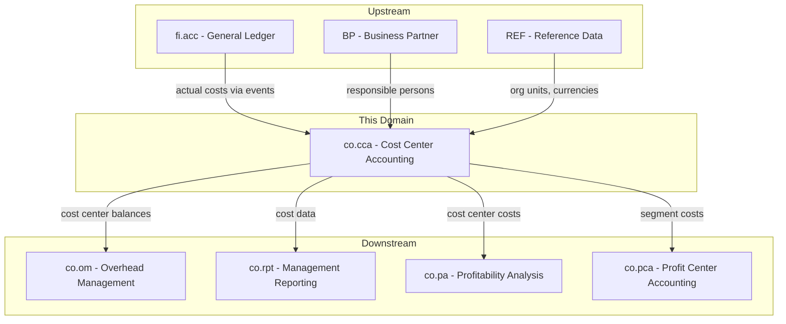
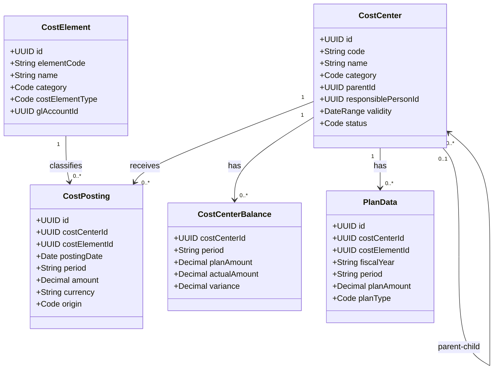
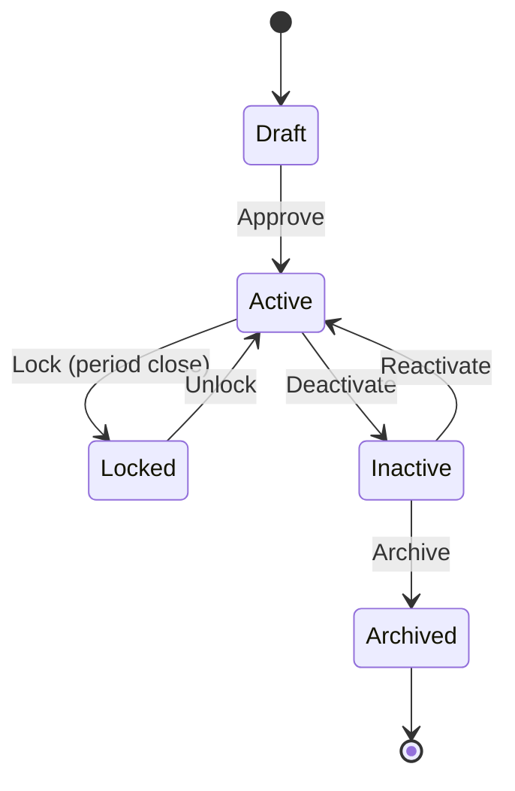
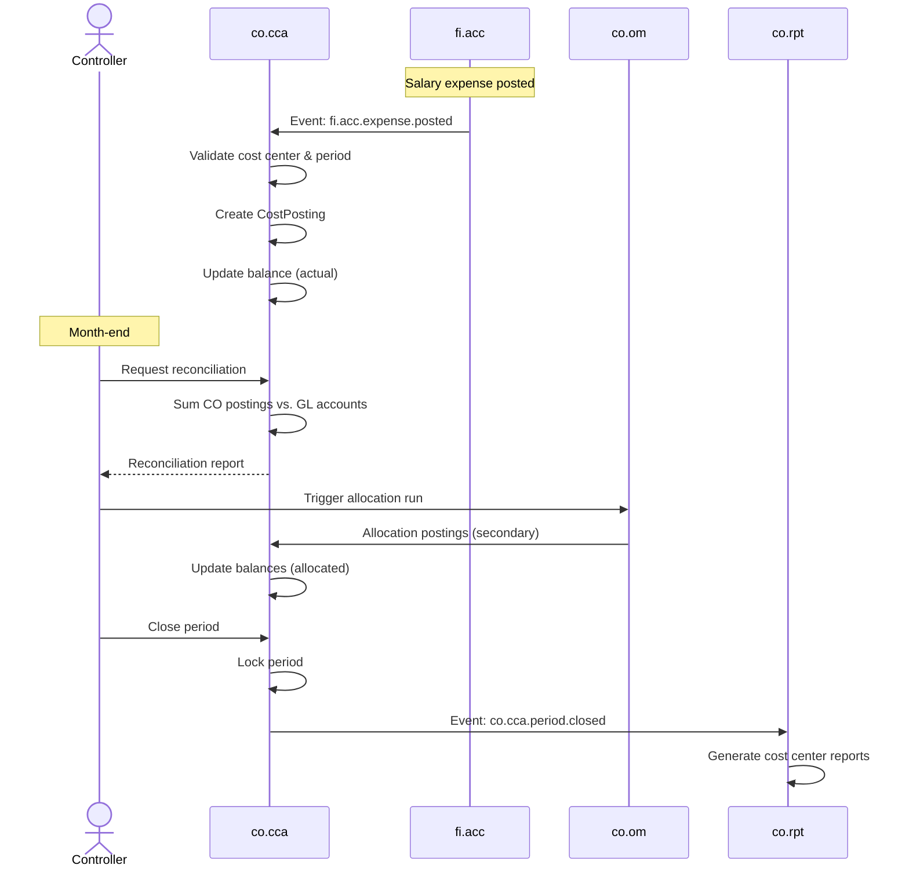
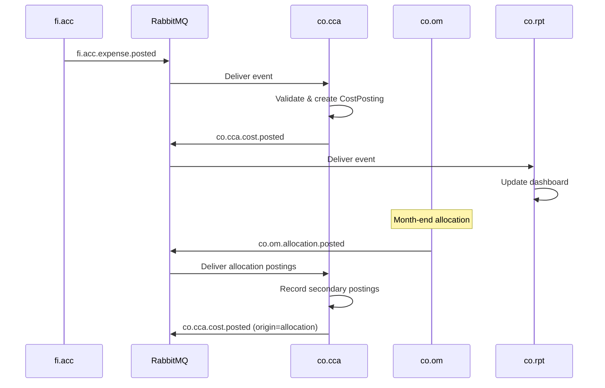
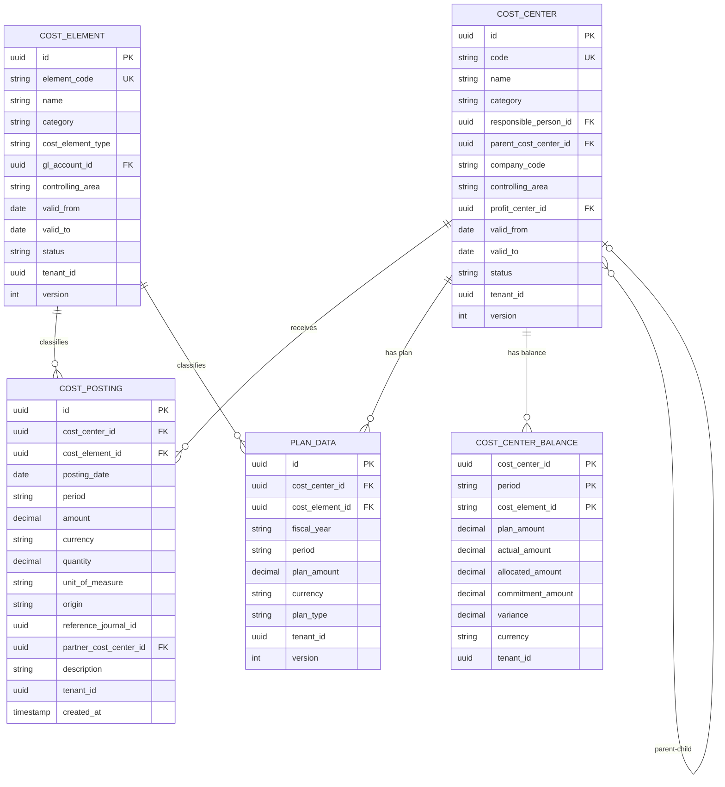

# CO - CCA Cost Center Accounting Domain / Service Specification

> **Conceptual Stack Layer:** Domain / Service
> **Space:** Platform
> **Owner:** Domain Engineering Team
> **Schema alignment:** `service-layer.schema.json`
> **Companion files:** `openapi.yaml`, `*.schema.json` (event contracts)
> **Referenced by:** Platform-Feature Spec SS5 (backend dependencies), BFF Contract
> **Belongs to:** CO Suite Spec (`_co_suite.md`)

> **Meta Information**
> - **Version:** 2026-04-01
> - **Template:** `domain-service-spec.md` v1.0.0
> - **Template Compliance:** ~87% — §11/§12 stubs, §8 no column-level table defs
> - **Author(s):** OpenLeap Architecture Team
> - **Status:** DRAFT
> - **Suite:** `co`
> - **Domain:** `cca`
> - **Bounded Context Ref:** `bc:cost-center-accounting`
> - **Service ID:** `co-cca-svc`
> - **basePackage:** `io.openleap.co.cca`
> - **API Base Path:** `/api/co/cca/v1`
> - **OpenLeap Starter Version:** `v1`
> - **Port:** TBD
> - **Repository:** TBD
> - **Tags:** `controlling`, `cost-center`, `cost-element`, `cost-posting`
> - **Team:**
>   - Name: `team-co`
>   - Email: `co-team@openleap.io`
>   - Slack: `#co-team`

---

## Specification Guidelines Compliance

>
> ### Non-Negotiables
> - Never invent facts. If required info is missing, add an **OPEN QUESTION** entry.
> - Preserve intent and decisions. Only change meaning when explicitly requested.
> - Do not remove normative constraints unless they are explicitly replaced.
> - Keep the spec **self-contained**: no "see chat", no implicit context.
>
> ### Style Guide
> - Prefer short sentences and lists.
> - Use MUST/SHOULD/MAY for normative statements.
> - Keep terminology consistent (Aggregate, Domain Service, Application Service, Command, Event).
> - Avoid ambiguous words ("often", "maybe") unless explicitly noting uncertainty.

---

## 0. Document Purpose & Scope

### 0.1 Purpose
This specification defines the Cost Center Accounting (CCA) domain, which captures, categorizes, and tracks costs by organizational unit (cost center). CCA is the foundational cost collection layer within the Controlling Suite, receiving actual costs from FI and providing the basis for overhead allocations and management reporting.

### 0.2 Target Audience
- Product Owners & Business Stakeholders
- System Architects & Technical Leads
- Integration Engineers

### 0.3 Scope
**In Scope:**
- Cost center master data management (hierarchy, lifecycle)
- Cost element definitions (primary/secondary)
- Cost posting capture from FI events
- Plan data import and plan vs. actual tracking
- Cost center balance queries and period management
- Reconciliation with FI General Ledger

**Out of Scope:**
- Cost allocations and settlements (-> co.om)
- Internal order cost tracking (-> co.io)
- Product costing (-> co.pc)
- Management reporting generation (-> co.rpt)
- General Ledger postings (-> fi.acc)

### 0.4 Related Documents
- `_co_suite.md` - CO Suite overview and architecture
- `co_om-spec.md` - Overhead Management (allocations)
- `co_io-spec.md` - Internal Orders
- `co_rpt-spec.md` - Management Reporting
- `fi_acc_core_spec_complete.md` - Financial Accounting
- `BP_business_partner.md` - Business Partner (responsible persons)
- `REF_reference_data.md` - Reference data catalogs

---

## 1. Business Context

### 1.1 Domain Purpose
`co.cca` tracks **where costs occur** within the organization. Every cost center represents an organizational unit (department, team, location) to which costs are assigned. CCA receives actual costs from FI postings, allows plan data import, and provides cost center balances for allocation processing and management reporting.

### 1.2 Business Value
- Transparent cost tracking per organizational unit
- Foundation for overhead cost allocation
- Plan vs. actual comparison at departmental level
- Basis for responsibility accounting (cost center managers own their budgets)
- Reconciliation anchor between CO and FI

### 1.3 Key Stakeholders

| Role | Responsibility | Primary Use Cases |
|------|----------------|-------------------|
| Cost Center Manager | Monitor own cost center costs, explain variances | UC-004, UC-005 |
| Controller | Manage cost centers, cost elements, period operations | UC-001, UC-002, UC-006 |
| CFO | Review aggregated cost center reports | UC-005 |
| IT Admin | Configure cost center hierarchies | UC-001 |

### 1.4 Strategic Positioning



### 1.5 Service Context

| Property | Value |
|----------|-------|
| **Suite** | `co` |
| **Domain** | `cca` |
| **Bounded Context** | `bc:cost-center-accounting` |
| **Service ID** | `co-cca-svc` |
| **Base Package** | `io.openleap.co.cca` |

**Responsibilities:**
- Cost center master data lifecycle management
- Cost element definitions (primary and secondary)
- Cost posting capture from FI events
- Plan data import and management
- Cost center balance computation and queries
- Period open/close management
- Reconciliation with FI GL

**Authoritative Sources:**
| Source Type | Description | Access Pattern |
|-------------|-------------|----------------|
| REST API | Cost center master data, balances, cost elements | Synchronous |
| Database | Cost centers, cost elements, cost postings, plan data, balances | Direct (owner) |
| Events | Cost postings, status changes, period closings | Asynchronous |

---

## 2. Service Identity

| Property | Value | Schema Field |
|----------|-------|-------------|
| **Service ID** | `co-cca-svc` | `metadata.id` |
| **Display Name** | `Cost Center Accounting` | `metadata.name` |
| **Suite** | `co` | `metadata.suite` |
| **Domain** | `cca` | `metadata.domain` |
| **Bounded Context** | `bc:cost-center-accounting` | `metadata.bounded_context_ref` |
| **Version** | `1.0.0` | `metadata.version` |
| **Status** | DRAFT | `metadata.status` |
| **API Base Path** | `/api/co/cca/v1` | `metadata.api_base_path` |
| **Repository** | TBD | `metadata.repository` |
| **Tags** | `controlling`, `cost-center`, `cost-element` | `metadata.tags` |

**Team:**
| Property | Value |
|----------|-------|
| **Name** | `team-co` |
| **Email** | `co-team@openleap.io` |
| **Slack Channel** | `#co-team` |

---

## 3. Domain Model

### 3.1 Conceptual Overview
CCA manages three core concepts: **Cost Centers** (where costs are tracked), **Cost Elements** (what type of cost), and **Cost Postings** (individual cost transactions). Cost centers are organized in hierarchies reflecting the organizational structure. Cost elements map to GL accounts for primary costs and to internal CO activities for secondary costs.

### 3.2 Core Concepts



### 3.3 Aggregate Definitions

#### 3.3.1 CostCenter

| Property | Value |
|----------|-------|
| **Aggregate ID** | `agg:cost-center` |
| **Name** | `CostCenter` |

**Business Purpose:**
Represents an organizational unit to which costs are assigned. Cost centers form a hierarchy reflecting the company structure and serve as the primary dimension for tracking overhead costs.

##### Aggregate Root

**Key Attributes:**
| Attribute | Type | Format | Description | Constraints | Required | Read-Only |
|-----------|------|--------|-------------|-------------|----------|-----------|
| id | string | uuid | Unique identifier | Immutable | Yes | Yes |
| code | string | — | Cost center code (e.g., "CC-IT-001") | max 20 chars, unique per (tenant_id, controlling_area) | Yes | No |
| name | string | — | Descriptive name | max 255 chars | Yes | No |
| category | string | — | Functional classification | enum_ref: `CostCenterCategory` | Yes | No |
| responsiblePersonId | string | uuid | FK to Business Partner | — | Yes | No |
| parentCostCenterId | string | uuid | FK to parent cost center | null = root | No | No |
| companyCode | string | — | Company assignment | max 10 chars | Yes | No |
| controllingArea | string | — | CO area assignment | max 10 chars | Yes | No |
| profitCenterId | string | uuid | FK to co.pca profit center | — | No | No |
| validFrom | string | date | Effective start date | — | Yes | No |
| validTo | string | date | Effective end date | minimum: validFrom | No | No |
| status | string | — | Current lifecycle state | enum_ref: `CostCenterStatus` | Yes | No |
| version | integer | int64 | Optimistic locking version | — | Yes | Yes |
| tenantId | string | uuid | Tenant ownership | — | Yes | Yes |

**Lifecycle States:**

| Property | Value |
|----------|-------|
| **Initial State** | `Draft` |
| **Terminal States** | `Archived` |



**State Descriptions:**
| State | Description | Business Meaning |
|-------|-------------|------------------|
| Draft | Initial creation | Being set up, cannot receive postings |
| Active | Operational | Can receive cost postings |
| Locked | Period-locked | No new postings, used during period close |
| Inactive | Suspended | No new postings, pending archival |
| Archived | Historical | Read-only, retained for reporting |

**Allowed Transitions:**
| From State | To State | Trigger | Guard / Business Preconditions |
|------------|----------|---------|-------------------------------|
| Draft | Active | Controller approval | All mandatory fields filled, responsible person assigned |
| Active | Locked | Period close initiated | Active period exists |
| Locked | Active | Period reopened | Controller authorization |
| Active | Inactive | Manual deactivation | No open internal orders referencing this center |
| Inactive | Active | Manual reactivation | Responsible person still active |
| Inactive | Archived | Retention policy | Inactive > 2 fiscal years, no open balances |

**Invariants:**
| Rule ID | Description |
|---------|-------------|
| BR-001 | Unique code per (tenant_id, controlling_area) |
| BR-002 | Hierarchy acyclicity — cannot be own ancestor |
| BR-003 | Active parent required — parent must be Active or Locked |
| BR-005 | Only Active cost centers can receive postings |

**Domain Events Emitted:**
- `co.cca.costCenter.created`
- `co.cca.costCenter.statusChanged`

##### Value Objects

###### Value Object: DateRange

| Property | Value |
|----------|-------|
| **VO ID** | `vo:date-range` |
| **Name** | `DateRange` |

**Description:** Validity period for a cost center.

**Attributes:**
| Attribute | Type | Format | Description | Constraints |
|-----------|------|--------|-------------|-------------|
| validFrom | string | date | Effective start | Required |
| validTo | string | date | Effective end | >= validFrom if set |

#### 3.3.2 CostElement

| Property | Value |
|----------|-------|
| **Aggregate ID** | `agg:cost-element` |
| **Name** | `CostElement` |

**Business Purpose:**
Defines the type/category of cost. Primary cost elements map to GL accounts (e.g., salary, materials). Secondary cost elements represent internal CO flows (allocations, activity charges) with no GL counterpart.

**Key Attributes:**
| Attribute | Type | Format | Description | Constraints | Required | Read-Only |
|-----------|------|--------|-------------|-------------|----------|-----------|
| id | string | uuid | Unique identifier | Immutable | Yes | Yes |
| elementCode | string | — | Cost element code (e.g., "CE-5100") | unique per controlling area | Yes | No |
| name | string | — | Descriptive name | max 255 chars | Yes | No |
| category | string | — | Primary or secondary | enum: primary, secondary | Yes | No |
| costElementType | string | — | Functional type | enum_ref: `CostElementType` | Yes | No |
| glAccountId | string | uuid | FK to fi.acc account | Required if primary, null if secondary | Conditional | No |
| controllingArea | string | — | CO area assignment | — | Yes | No |
| validFrom | string | date | Effective start | — | Yes | No |
| validTo | string | date | Effective end | — | No | No |
| status | string | — | Lifecycle state | enum: active, inactive | Yes | No |
| tenantId | string | uuid | Tenant ownership | — | Yes | Yes |
| version | integer | int64 | Optimistic locking | — | Yes | Yes |

**Invariants:**
| Rule ID | Description |
|---------|-------------|
| BR-007 | Primary cost elements MUST reference a GL account |
| BR-008 | Cost elements can only be deactivated, never deleted |

**Domain Events Emitted:**
- `co.cca.costElement.created`

#### 3.3.3 CostPosting

| Property | Value |
|----------|-------|
| **Aggregate ID** | `agg:cost-posting` |
| **Name** | `CostPosting` |

**Business Purpose:**
Records an individual cost transaction against a cost center. Postings originate from FI events (primary), manual entries, or CO allocations (secondary).

**Key Attributes:**
| Attribute | Type | Format | Description | Constraints | Required | Read-Only |
|-----------|------|--------|-------------|-------------|----------|-----------|
| id | string | uuid | Unique identifier | Immutable | Yes | Yes |
| costCenterId | string | uuid | FK to CostCenter | — | Yes | No |
| costElementId | string | uuid | FK to CostElement | — | Yes | No |
| postingDate | string | date | Business date of posting | — | Yes | No |
| period | string | — | Fiscal period (e.g., "2025-12") | pattern: YYYY-MM | Yes | No |
| amount | number | decimal | Cost amount | precision: 4, can be negative | Yes | No |
| currency | string | — | ISO 4217 currency code | 3 chars | Yes | No |
| quantity | number | decimal | Statistical quantity | precision: 4 | No | No |
| unitOfMeasure | string | — | Unit for quantity | Required if quantity provided | Conditional | No |
| origin | string | — | Source of posting | enum: fi_actual, manual, allocation, settlement, plan | Yes | No |
| referenceJournalId | string | uuid | FK to FI journal if from FI | Required if origin = fi_actual | Conditional | No |
| partnerCostCenterId | string | uuid | FK to partner CC (allocations) | — | No | No |
| description | string | — | Posting text | max 500 chars | No | No |
| tenantId | string | uuid | Tenant ownership | — | Yes | Yes |
| createdAt | string | date-time | Creation timestamp | Auto-generated | Yes | Yes |

**Invariants:**
| Rule ID | Description |
|---------|-------------|
| BR-004 | Period MUST be open for postings |
| BR-005 | Cost center MUST be Active |
| BR-006 | Idempotency on FI events via reference_journal_id |

**Domain Events Emitted:**
- `co.cca.cost.posted`

### 3.4 Enumerations

#### CostCenterCategory

**Description:** Functional classification of a cost center.

| Value | Description | Deprecated |
|-------|-------------|------------|
| `production` | Manufacturing/production department | No |
| `administration` | Administrative/support department | No |
| `sales` | Sales and distribution department | No |
| `service` | Internal service department | No |
| `management` | Executive/management | No |

#### CostCenterStatus

**Description:** Lifecycle state of a cost center.

| Value | Description | Deprecated |
|-------|-------------|------------|
| `DRAFT` | Initial creation state | No |
| `ACTIVE` | Operational, can receive postings | No |
| `LOCKED` | Period-locked, no new postings | No |
| `INACTIVE` | Suspended | No |
| `ARCHIVED` | Historical, read-only | No |

#### CostElementType

**Description:** Functional type of a cost element.

| Value | Description | Deprecated |
|-------|-------------|------------|
| `material` | Material costs | No |
| `labor` | Labor/salary costs | No |
| `overhead` | Overhead costs | No |
| `depreciation` | Depreciation costs | No |
| `revenue` | Revenue elements | No |
| `allocation` | Internal allocation flows | No |
| `settlement` | Settlement flows | No |
| `activity` | Activity-based charges | No |

### 3.5 Shared Types

> OPEN QUESTION: Content for this section has not been authored yet.

---

## 4. Business Rules & Constraints

### 4.1 Business Rules Catalog

| ID | Rule Name | Description | Scope | Enforcement | Error Code |
|----|-----------|-------------|-------|-------------|------------|
| BR-001 | Unique Cost Center Code | Code MUST be unique per (tenant_id, controlling_area) | CostCenter | Create, Update | `DUPLICATE_CODE` |
| BR-002 | Hierarchy Acyclicity | Cost center MUST NOT be its own ancestor | CostCenter | Update (parent change) | `CIRCULAR_HIERARCHY` |
| BR-003 | Active Parent | Parent cost center MUST be Active or Locked | CostCenter | Create, Update | `INACTIVE_PARENT` |
| BR-004 | Posting Period Open | Cost postings MUST only be in open periods | CostPosting | Create | `PERIOD_CLOSED` |
| BR-005 | Active Target | Postings MUST only target Active cost centers | CostPosting | Create | `INACTIVE_COST_CENTER` |
| BR-006 | FI Idempotency | No duplicate postings from same FI journal | CostPosting | Create | — (silent dedup) |
| BR-007 | Primary GL Link | Primary cost elements MUST reference a GL account | CostElement | Create, Update | `MISSING_GL_LINK` |
| BR-008 | No Cost Element Deletion | Cost elements MUST only be deactivated | CostElement | Delete | `DELETE_FORBIDDEN` |
| BR-009 | Reconciliation Tolerance | CO actuals MUST match FI GL within ±0.01% | CostCenterBalance | Period close | `RECONCILIATION_FAILED` |
| BR-010 | Archive Precondition | Cost center MUST be Inactive > 2 fiscal years with zero balance | CostCenter | Archive | `ARCHIVE_PRECONDITION_FAILED` |

### 4.2 Detailed Rule Definitions

#### BR-006: FI Idempotency

**Business Context:**
FI events MAY be delivered more than once (at-least-once delivery). CCA MUST NOT create duplicate cost postings.

**Rule Statement:**
For each `fi.acc.expense.posted` event, the system MUST check whether a CostPosting with the same `reference_journal_id` already exists. If so, the event is acknowledged but no new posting is created.

**Applies To:**
- Aggregate: CostPosting
- Operations: Create (from FI event)

**Validation Logic:**
Check uniqueness of (tenant_id, reference_journal_id) before insert.

**Error Handling:**
- **If duplicate detected:** Log info message, acknowledge event, skip creation
- **User action:** None required (automatic deduplication)

#### BR-009: Reconciliation Tolerance

**Business Context:**
CO actual costs MUST reconcile with FI GL expense accounts to ensure data integrity across suites. Minor rounding differences are acceptable.

**Rule Statement:**
At period close, the sum of all CostPostings with origin = fi_actual for a given period MUST equal the corresponding FI GL expense account balances, with a tolerance of ±0.01%.

**Applies To:**
- Process: Period Close (UC-006)

**Validation Logic:**
Query sum of CO postings by cost element (mapped to GL account). Compare with FI GL balances. Flag differences exceeding tolerance.

**Error Handling:**
- **Error Code:** `RECONCILIATION_FAILED`
- **Error Message:** "CO-FI reconciliation failed: delta exceeds 0.01% tolerance"
- **If violated:** Period close blocked; reconciliation report generated listing discrepancies
- **User action:** Controller investigates and resolves (missing postings, double postings)

### 4.3 Data Validation Rules

**Field-Level Validations:**
| Field | Validation Rule | Error Message |
|-------|----------------|---------------|
| code | Required, 1-20 chars, alphanumeric + hyphens | "Cost center code is required (max 20 chars, alphanumeric)" |
| name | Required, 1-255 chars | "Cost center name is required" |
| category | Required, must be in allowed values | "Invalid cost center category" |
| amount (posting) | Required, max 15 integer + 4 decimal digits | "Amount must be a valid decimal" |
| currency | Required, ISO 4217 | "Invalid currency code" |
| period | Required, format YYYY-MM | "Period must be in YYYY-MM format" |

**Cross-Field Validations:**
- validFrom MUST be before validTo (if validTo is set)
- quantity requires unitOfMeasure and vice versa
- referenceJournalId MUST be present when origin = fi_actual

### 4.4 Reference Data Dependencies

**Required Reference Data:**
| Catalog | Usage | Validation |
|---------|-------|------------|
| Currencies (ISO 4217) | Amount currency | Must exist and be active in ref-data-svc |
| Organizational Units | Company code, controlling area | Must exist in ref-data-svc |
| Fiscal Calendar | Period validation | Period must exist and be valid |
| Units of Measure (UCUM) | Statistical quantities | Must be valid UCUM code via si-unit-svc |

---

## 5. Use Cases

### 5.1 Business Logic Placement

| Logic Type | Placement | Examples |
|------------|-----------|----------|
| Aggregate invariants | Domain Object | Hierarchy acyclicity, code uniqueness, status transitions |
| Cross-aggregate logic | Domain Service | Reconciliation, period management |
| Orchestration & transactions | Application Service | FI event processing, balance update, event publishing |

### 5.2 Use Cases (Canonical Format)

#### UC-001: CreateCostCenter

| Field | Value |
|-------|-------|
| **id** | `CreateCostCenter` |
| **type** | WRITE |
| **trigger** | REST |
| **aggregate** | `CostCenter` |
| **domainOperation** | `CostCenter.create` |
| **inputs** | `code: String`, `name: String`, `category: CostCenterCategory`, `responsiblePersonId: UUID`, `parentCostCenterId: UUID?`, `companyCode: String`, `controllingArea: String`, `validFrom: Date` |
| **outputs** | `CostCenter` |
| **events** | `CostCenter.created` |
| **rest** | `POST /api/co/cca/v1/cost-centers` |
| **idempotency** | optional |
| **errors** | `DUPLICATE_CODE`: Code already exists, `INACTIVE_PARENT`: Parent not active |

**Actor:** Controller

**Preconditions:**
- Controlling area exists
- Responsible person exists in BP
- Parent cost center (if any) is Active

**Main Flow:**
1. Controller submits cost center data (code, name, category, responsible person, parent)
2. System validates uniqueness of code within controlling area
3. System validates parent hierarchy (no circular reference)
4. System creates cost center in Draft status
5. System publishes `co.cca.costCenter.created` event

**Postconditions:**
- Cost center exists in Draft status
- Downstream systems notified

**Business Rules Applied:**
- BR-001: Unique code per tenant
- BR-003: Active parent required

#### UC-002: MaintainCostElements

| Field | Value |
|-------|-------|
| **id** | `MaintainCostElements` |
| **type** | WRITE |
| **trigger** | REST |
| **aggregate** | `CostElement` |
| **domainOperation** | `CostElement.create` |
| **inputs** | `elementCode: String`, `name: String`, `category: String`, `costElementType: String`, `glAccountId: UUID?`, `controllingArea: String` |
| **outputs** | `CostElement` |
| **events** | `CostElement.created` |
| **rest** | `POST /api/co/cca/v1/cost-elements` |
| **idempotency** | optional |
| **errors** | `MISSING_GL_LINK`: Primary element without GL account |

**Actor:** Controller

**Business Rules Applied:**
- BR-007: Primary requires GL link
- Unique code per controlling area

#### UC-003: ReceiveActualCostFromFI

| Field | Value |
|-------|-------|
| **id** | `ReceiveActualCostFromFI` |
| **type** | WRITE |
| **trigger** | Message |
| **aggregate** | `CostPosting` |
| **domainOperation** | `CostPosting.createFromFI` |
| **inputs** | `costCenterId: UUID`, `costElementId: UUID`, `amount: Decimal`, `currency: String`, `period: String`, `referenceJournalId: UUID` |
| **outputs** | `CostPosting` |
| **events** | `Cost.posted` |
| **rest** | — (event-driven) |
| **idempotency** | required |
| **errors** | `PERIOD_CLOSED`, `INACTIVE_COST_CENTER` |

**Actor:** System (event-driven)

**Main Flow:**
1. System receives FI expense event
2. System extracts cost center, cost element, amount, period
3. System validates cost center is Active and period is Open
4. System creates CostPosting with origin = fi_actual
5. System updates cost center balance (actual amount)
6. System publishes `co.cca.cost.posted` event

**Alternative Flows:**
- **Alt-1:** If cost center not found, post to default/unassigned cost center and flag for review
- **Alt-2:** If period is closed, reject and route to dead letter queue

**Business Rules Applied:**
- BR-004: Period must be open
- BR-005: Active target
- BR-006: FI Idempotency

#### UC-004: QueryCostCenterBalance

| Field | Value |
|-------|-------|
| **id** | `QueryCostCenterBalance` |
| **type** | READ |
| **trigger** | REST |
| **aggregate** | `CostCenterBalance` |
| **domainOperation** | `getCostCenterBalance` |
| **inputs** | `costCenterId: UUID`, `period: String`, `costElementType: String?` |
| **outputs** | `CostCenterBalanceDTO` |
| **rest** | `GET /api/co/cca/v1/cost-centers/{id}/balances` |
| **idempotency** | none |
| **errors** | — |

**Actor:** Cost Center Manager / Controller

#### UC-005: PlanVsActualComparison

| Field | Value |
|-------|-------|
| **id** | `PlanVsActualComparison` |
| **type** | READ |
| **trigger** | REST |
| **aggregate** | `CostCenterBalance` |
| **domainOperation** | `getPlanVsActual` |
| **inputs** | `costCenterIds: UUID[]`, `periods: String[]` |
| **outputs** | `PlanVsActualReport` |
| **rest** | `GET /api/co/cca/v1/cost-centers/{id}/balances?period={period}` |
| **idempotency** | none |
| **errors** | — |

**Actor:** Controller / Cost Center Manager

#### UC-006: ClosePeriod

| Field | Value |
|-------|-------|
| **id** | `ClosePeriod` |
| **type** | WRITE |
| **trigger** | REST |
| **aggregate** | `CostCenter` (multiple) |
| **domainOperation** | `Period.close` |
| **inputs** | `period: String`, `controllingArea: String`, `reconciliationOverride: Boolean` |
| **outputs** | `PeriodCloseResult` |
| **events** | `Period.closed` |
| **rest** | `POST /api/co/cca/v1/periods/{period}/close` |
| **idempotency** | required |
| **errors** | `RECONCILIATION_FAILED` |

**Actor:** Controller

**Main Flow:**
1. Controller opens a new period for postings
2. At period end, controller initiates close:
   a. System validates all expected FI postings received (reconciliation)
   b. Controller triggers allocation run via co.om
   c. After allocations complete, controller locks the period
3. System prevents further postings to locked period
4. System publishes `co.cca.period.closed` event

**Business Rules Applied:**
- BR-009: Reconciliation tolerance

### 5.3 Process Flow Diagrams



### 5.4 Cross-Domain Workflows

**Does this domain participate in multi-service workflows?** [x] YES [ ] NO

#### Workflow: Month-End Cost Allocation

**Business Purpose:** Distribute indirect costs from service cost centers to production/operating cost centers.

**Orchestration Pattern:** [ ] Choreography (EDA) [x] Orchestration (Saga)

**Pattern Rationale:**
CCA acts as a passive participant. co.om drives the allocation logic and sends allocation postings to CCA. CCA reacts to events and updates balances. co.om coordinates the overall workflow.

**Participating Services:**
| Service | Role | Responsibilities |
|---------|------|------------------|
| co.cca | Data provider & receiver | Provides balances, receives allocation postings |
| co.om | Driver / Orchestrator | Calculates and executes allocations |
| fi.acc | Final recorder | Receives allocation journals |

**Workflow Steps:**
1. co.om reads cost center balances from co.cca
2. co.om applies allocation rules and calculates amounts
3. co.om sends allocation postings to co.cca (sender gets credit, receivers get debit)
4. co.cca records postings and updates balances
5. co.om sends allocation journal to fi.acc

---

## 6. REST API

### 6.1 API Overview

**Base Path:** `/api/co/cca/v1`

**Authentication:** OAuth2/JWT (Bearer token)

**Authorization:**
- Read operations: Requires scope `co.cca:read`
- Write operations: Requires scope `co.cca:write`
- Admin operations: Requires scope `co.cca:admin`

### 6.2 Resource Operations

#### 6.2.1 Cost Centers - Create

```http
POST /api/co/cca/v1/cost-centers
Authorization: Bearer {token}
Content-Type: application/json
```

**Request Body:**
```json
{
  "code": "CC-IT-001",
  "name": "IT Department",
  "category": "administration",
  "responsiblePersonId": "uuid-bp-001",
  "parentCostCenterId": "uuid-cc-admin",
  "companyCode": "1000",
  "controllingArea": "CA01",
  "profitCenterId": "uuid-pca-001",
  "validFrom": "2026-01-01",
  "validTo": null
}
```

**Success Response:** `201 Created`
```json
{
  "id": "uuid-cc-it-001",
  "version": 1,
  "code": "CC-IT-001",
  "name": "IT Department",
  "category": "administration",
  "responsiblePersonId": "uuid-bp-001",
  "parentCostCenterId": "uuid-cc-admin",
  "companyCode": "1000",
  "controllingArea": "CA01",
  "status": "DRAFT",
  "validFrom": "2026-01-01",
  "createdAt": "2026-02-23T10:00:00Z",
  "_links": {
    "self": { "href": "/api/co/cca/v1/cost-centers/uuid-cc-it-001" },
    "parent": { "href": "/api/co/cca/v1/cost-centers/uuid-cc-admin" },
    "children": { "href": "/api/co/cca/v1/cost-centers/uuid-cc-it-001/children" },
    "balances": { "href": "/api/co/cca/v1/cost-centers/uuid-cc-it-001/balances" }
  }
}
```

**Response Headers:**
- `Location: /api/co/cca/v1/cost-centers/uuid-cc-it-001`
- `ETag: "1"`

**Business Rules Checked:**
- BR-001: Unique code
- BR-003: Active parent

**Events Published:**
- `co.cca.costCenter.created`

**Error Responses:**
- `400 Bad Request` - Validation error
- `409 Conflict` - Duplicate code
- `422 Unprocessable Entity` - Business rule violation (e.g., circular hierarchy)

#### 6.2.2 Cost Centers - Retrieve

```http
GET /api/co/cca/v1/cost-centers/{id}
Authorization: Bearer {token}
```

**Success Response:** `200 OK`

**Response Headers:**
- `ETag: "{version}"`
- `Cache-Control: private, max-age=300`

**Error Responses:**
- `404 Not Found` - Resource does not exist

#### 6.2.3 Cost Centers - Update

```http
PATCH /api/co/cca/v1/cost-centers/{id}
Authorization: Bearer {token}
Content-Type: application/json
If-Match: "{version}"
```

**Request Body:**
```json
{
  "name": "IT & Digital Services",
  "responsiblePersonId": "uuid-bp-002"
}
```

**Success Response:** `200 OK`

**Error Responses:**
- `412 Precondition Failed` - ETag mismatch
- `422 Unprocessable Entity` - Invalid state transition or business rule violation

#### 6.2.4 Cost Centers - List

```http
GET /api/co/cca/v1/cost-centers?page=0&size=50&sort=code,asc&status=ACTIVE&category=administration
Authorization: Bearer {token}
```

**Query Parameters:**
| Parameter | Type | Description | Default |
|-----------|------|-------------|---------|
| page | integer | Page number (0-based) | 0 |
| size | integer | Page size (max 200) | 50 |
| sort | string | Sort field and direction | code,asc |
| status | string | Filter by status | (all) |
| category | string | Filter by category | (all) |
| parentId | UUID | Filter by parent | (all) |
| controllingArea | string | Filter by CO area | (all) |
| validOn | date | Filter by validity date | (today) |

#### 6.2.5 Cost Centers - Hierarchy

```http
GET /api/co/cca/v1/cost-centers/{id}/hierarchy
Authorization: Bearer {token}
```

**Success Response:** `200 OK`
```json
{
  "id": "uuid-cc-root",
  "code": "CC-ROOT",
  "name": "Company Root",
  "children": [
    {
      "id": "uuid-cc-admin",
      "code": "CC-ADMIN",
      "name": "Administration",
      "children": [
        {
          "id": "uuid-cc-it-001",
          "code": "CC-IT-001",
          "name": "IT Department",
          "children": []
        }
      ]
    }
  ]
}
```

### 6.3 Business Operations

#### Operation: Activate Cost Center

```http
POST /api/co/cca/v1/cost-centers/{id}/activate
Authorization: Bearer {token}
Content-Type: application/json
If-Match: "{version}"
```

**Business Purpose:** Transition cost center from Draft to Active, enabling it to receive cost postings.

**Business Rules Checked:**
- All mandatory fields filled
- Responsible person is active in BP
- Parent cost center (if set) is Active

**Events Published:**
- `co.cca.costCenter.statusChanged`

#### Operation: Close Period

```http
POST /api/co/cca/v1/periods/{period}/close
Authorization: Bearer {token}
Content-Type: application/json
```

**Request Body:**
```json
{
  "controllingArea": "CA01",
  "reconciliationOverride": false
}
```

**Business Purpose:** Close a fiscal period for cost postings after allocations are complete.

**Business Rules Checked:**
- BR-009: Reconciliation tolerance met (unless override by admin)
- All allocation runs for the period are complete

**Events Published:**
- `co.cca.period.closed`

#### Operation: Query Balance

```http
GET /api/co/cca/v1/cost-centers/{id}/balances?period=2025-12&costElementType=labor
Authorization: Bearer {token}
```

**Success Response:** `200 OK`
```json
{
  "costCenterId": "uuid-cc-it-001",
  "period": "2025-12",
  "currency": "EUR",
  "summary": {
    "planAmount": 50000.00,
    "actualAmount": 52300.00,
    "variance": 2300.00,
    "variancePct": 4.60,
    "commitmentAmount": 1500.00
  },
  "byElement": [
    {
      "costElementId": "uuid-ce-5100",
      "costElementCode": "CE-5100",
      "costElementName": "Salary Costs",
      "planAmount": 40000.00,
      "actualAmount": 41500.00,
      "variance": 1500.00
    }
  ]
}
```

### 6.4 OpenAPI Specification

**Location:** `contracts/http/co/cca/openapi.yaml`

**Version:** OpenAPI 3.1

**Documentation URL:** `https://api.openleap.io/docs/co/cca`

---

## 7. Events & Integration

### 7.1 Event-Driven Architecture Pattern

**Pattern Used:** [x] Event-Driven (Choreography) [ ] Orchestration (Saga) [ ] Hybrid

**Follows Suite Pattern:** [x] YES [ ] NO

**Pattern Rationale:**
CCA broadcasts facts about cost postings and period state changes. Consumers (co.om, co.rpt, co.pa) independently decide how to react. No workflow coordination needed for cost posting capture. Month-end close uses a lightweight choreography where co.om drives allocations and CCA passively receives postings.

**Message Broker:** `RabbitMQ`

### 7.2 Published Events

**Exchange:** `co.cca.events` (topic)

#### Event: CostCenter.created

**Routing Key:** `co.cca.costCenter.created`

**Business Purpose:** Notifies downstream systems that a new cost center is available.

**Payload Structure:**
```json
{
  "aggregateType": "co.cca.costCenter",
  "changeType": "created",
  "entityIds": ["uuid-cc-it-001"],
  "version": 1,
  "occurredAt": "2026-02-23T10:00:00Z",
  "data": {
    "code": "CC-IT-001",
    "name": "IT Department",
    "category": "administration",
    "controllingArea": "CA01",
    "status": "DRAFT"
  }
}
```

**Known Consumers:**
| Consumer Service | Purpose | Processing Type |
|-----------------|---------|-----------------|
| co-om-svc | Register as potential allocation sender/receiver | Async/Immediate |
| co-rpt-svc | Update cost center dimension | Async/Immediate |
| co-pca-svc | Link to profit center if assigned | Async/Immediate |

#### Event: CostCenter.statusChanged

**Routing Key:** `co.cca.costCenter.statusChanged`

**Business Purpose:** Notifies status transitions (Draft->Active, Active->Locked, etc.)

**Known Consumers:**
| Consumer Service | Purpose | Processing Type |
|-----------------|---------|-----------------|
| co-om-svc | Enable/disable as allocation target | Async/Immediate |
| co-rpt-svc | Update reporting dimensions | Async/Immediate |

#### Event: Cost.posted

**Routing Key:** `co.cca.cost.posted`

**Business Purpose:** Notifies that a new cost posting has been recorded against a cost center.

**Payload Structure:**
```json
{
  "aggregateType": "co.cca.costPosting",
  "changeType": "created",
  "entityIds": ["uuid-posting-001"],
  "version": 1,
  "occurredAt": "2026-02-23T10:30:00Z",
  "data": {
    "costCenterId": "uuid-cc-it-001",
    "costElementId": "uuid-ce-5100",
    "period": "2026-02",
    "amount": 50000.00,
    "currency": "EUR",
    "origin": "fi_actual"
  }
}
```

**Known Consumers:**
| Consumer Service | Purpose | Processing Type |
|-----------------|---------|-----------------|
| co-rpt-svc | Update real-time cost center dashboards | Async/Immediate |
| co-pca-svc | Update profit center cost aggregation | Async/Batch |

#### Event: Period.closed

**Routing Key:** `co.cca.period.closed`

**Business Purpose:** Signals that a period is closed and final for reporting.

**Known Consumers:**
| Consumer Service | Purpose | Processing Type |
|-----------------|---------|-----------------|
| co-rpt-svc | Generate final period reports | Async/Immediate |
| co-pa-svc | Finalize profitability for period | Async/Immediate |

### 7.3 Consumed Events

#### Event: fi.acc.expense.posted

**Source Service:** `fi-acc-svc`
**Routing Key:** `fi.acc.journal.posted` (filtered for expense-type accounts)
**Business Purpose:** Receive actual costs from FI General Ledger to create CO cost postings.

**Business Logic:**
1. Extract CO-relevant fields (cost center, cost element mapping, amount, period)
2. Validate cost center exists and is Active
3. Validate period is open
4. Create CostPosting with origin = fi_actual
5. Update cost center balance

**Queue Configuration:**
- Name: `co.cca.in.fi.acc.expense`
- Durable: Yes
- Auto-delete: No

**Failure Handling:**
- Retry: Up to 5 times with exponential backoff (1s, 2s, 4s, 8s, 16s)
- Dead Letter: After max retries, move to DLQ `co.cca.dlq.fi.acc.expense`

#### Event: co.om.allocation.posted

**Source Service:** `co-om-svc`
**Routing Key:** `co.om.allocation.posted`
**Business Purpose:** Receive allocation postings (secondary costs) from Overhead Management.

**Business Logic:**
1. Create CostPosting with origin = allocation
2. Sender cost center gets credit (negative amount)
3. Receiver cost centers get debit (positive amounts)
4. Update affected cost center balances

**Queue Configuration:**
- Name: `co.cca.in.co.om.allocation`
- Durable: Yes
- Auto-delete: No

**Failure Handling:**
- Retry: Up to 3 times with exponential backoff
- Dead Letter: `co.cca.dlq.co.om.allocation`

### 7.4 Event Flow Diagrams



---

## 8. Data Model

### 8.1 Conceptual Data Model



### 8.2 Entity Definitions

**CostCenter Indexes:**
- Primary Key: `id`
- Unique: `(tenant_id, controlling_area, code)`
- Foreign Keys: `parent_cost_center_id`, `responsible_person_id`, `profit_center_id`
- Query Optimization: `(tenant_id, status)`, `(tenant_id, controlling_area, category)`, `(parent_cost_center_id)`

**CostPosting Indexes:**
- Primary Key: `id`
- Unique: `(tenant_id, reference_journal_id)` WHERE origin = 'fi_actual'
- Foreign Keys: `cost_center_id`, `cost_element_id`
- Query Optimization: `(tenant_id, cost_center_id, period)`, `(tenant_id, period, origin)`

**Data Retention:**
- Cost postings: Immutable; reversals only. Hard delete after 10 years.
- Cost centers: Soft delete via ARCHIVED status. Hard delete after 10 years in ARCHIVED.
- Audit trail: Retained indefinitely.

### 8.3 Reference Data Dependencies

**External Catalogs Required:**
| Catalog | Source Service | Fields Referencing | Validation |
|---------|----------------|-------------------|------------|
| currencies | ref-data-svc | currency | Must exist and be active |
| org_units | ref-data-svc | company_code, controlling_area | Must exist |
| fiscal_calendars | ref-data-svc | period | Period must exist in fiscal calendar |
| units | si-unit-svc | unit_of_measure | Must be valid UCUM code |

**Internal Code Lists:**
| Catalog | Managed By | Usage |
|---------|-----------|-------|
| cost_center_status | This service | Draft, Active, Locked, Inactive, Archived |
| cost_center_category | This service | production, administration, sales, service, management |
| cost_element_category | This service | primary, secondary |
| cost_element_type | This service | material, labor, overhead, depreciation, revenue, allocation, settlement, activity |
| posting_origin | This service | fi_actual, manual, allocation, settlement, plan |

---

## 9. Security & Compliance

### 9.1 Data Classification

| Data Element | Classification | Rationale | Protection Measures |
|--------------|----------------|-----------|---------------------|
| Cost Center ID/Code | Internal | Business identifier | Multi-tenancy isolation |
| Cost Center Name | Internal | Organizational info | Multi-tenancy isolation |
| Cost Amounts | Confidential | Financial data | Encryption at rest, RBAC, audit |
| Responsible Person | Confidential | Links to personal data | PII protection, limited access |
| Plan/Budget Data | Restricted | Strategic financial data | Encryption, strict RBAC |

### 9.2 Access Control

**Roles & Permissions:**
| Role | Read Own CC | Read All CC | Create | Update | Close Period | Admin |
|------|------------|------------|--------|--------|-------------|-------|
| CO_CCA_VIEWER | Yes | No | No | No | No | No |
| CO_CCA_CC_MANAGER | Yes | No | No | No | No | No |
| CO_CCA_USER | Yes | Yes | Yes | Yes | No | No |
| CO_CCA_CONTROLLER | Yes | Yes | Yes | Yes | Yes | No |
| CO_CCA_ADMIN | Yes | Yes | Yes | Yes | Yes | Yes |

**Data Isolation:**
- Multi-tenancy: Row-Level Security (RLS) via `tenant_id`
- Cost center managers: Filtered by `responsible_person_id` mapping
- Cross-controlling-area access: Requires explicit authorization

### 9.3 Compliance Requirements

| Regulation | Requirement | Implementation |
|-----------|-------------|----------------|
| SOX | Cost data integrity, audit trail | Immutable postings, full audit log |
| GDPR (EU) | Responsible person data protection | FK to BP, no direct PII in CO, RBAC |
| HGB §257 | Financial record retention (10 years) | Cost postings and balances retained 10 years |

---

## 10. Quality Attributes

### 10.1 Performance Requirements

**Response Time (95th percentile):**
| Operation | Target |
|-----------|--------|
| Read operations (single cost center) | < 50ms |
| Write operations (cost posting) | < 100ms |
| Balance queries | < 100ms |
| List operations (page size 50) | < 200ms |
| Hierarchy query (full tree) | < 500ms |

**Throughput:**
- Peak read requests: 5000 req/sec
- Peak write requests (cost postings): 2000 req/sec
- Event processing (FI events): 1000 events/sec

### 10.2 Availability & Reliability

**Availability Target:** 99.9% (excludes planned maintenance)

**Recovery Objectives:**
- RTO: < 15 minutes
- RPO: < 5 minutes

**Failure Scenarios:**
| Scenario | Impact | Mitigation |
|----------|--------|------------|
| Database failure | Service unavailable | Automatic failover to replica |
| Message broker outage | FI event processing paused | Transactional outbox, retry on recovery |
| FI service unavailable | Reconciliation delayed | Cached FI balances, reconcile on recovery |

### 10.3 Scalability

**Scaling Strategy:**
- Horizontal scaling: Multiple service instances behind load balancer
- Database: Read replicas for balance queries
- Event processing: Multiple consumers on FI event queue

**Capacity Planning:**
- Cost centers: ~10,000 per tenant (max)
- Cost postings: ~500,000 per month per tenant
- Storage: ~5 GB per year per tenant

### 10.4 Maintainability

**Versioning Strategy:**
- API versioning: `/v1`, `/v2` in URL path
- Backward compatibility: 12 months
- Deprecation notice: 6 months

**Monitoring & Alerting:**
- Health checks: `/actuator/health`
- Key metrics: Posting throughput, reconciliation delta, event processing lag
- Alerts: Error rate > 5%, FI event lag > 60s, reconciliation delta > 0.01%

---

## 11. Feature Dependencies

> OPEN QUESTION: Content for this section has not been authored yet. Feature dependencies and platform-feature references MUST be defined when the CO feature catalog (SS6 in suite spec) is authored.

---

## 12. Extension Points

> OPEN QUESTION: Content for this section has not been authored yet. Extension points for custom cost center categories, additional cost element types, and custom posting origins SHOULD be documented.

---

## 13. Migration & Evolution

### 13.1 Data Migration

**From Legacy System:**
| Source | Target | Mapping | Data Quality Issues |
|--------|--------|---------|---------------------|
| Legacy cost center table | CostCenter | Code mapping, category normalization | Missing hierarchy links |
| Legacy cost postings | CostPosting | Amount sign conventions, period format | Currency conversion needed |

**Migration Strategy:**
1. Export cost center master data from legacy
2. Build hierarchy relationships
3. Import cost centers (Draft -> Active)
4. Migrate historical postings in batches by period
5. Reconciliation: Legacy balances vs. new system balances

### 13.2 Deprecation & Sunset

No deprecated features in initial version.

---

## 14. Decisions & Open Questions

### 14.1 Open Questions

| ID | Question | Impact | Decision Needed By |
|----|----------|--------|---------------------|
| Q-001 | Should statistical key figures (headcount, sqm) be managed in CCA or a separate service? | Affects allocation driver data source | Phase 1 design |
| Q-002 | Should cost center hierarchies support multiple alternative hierarchies? | Affects data model complexity | Phase 1 design |
| Q-003 | How to handle retroactive FI corrections to closed CO periods? | Period management complexity | Phase 1 design |

### 14.2 Architectural Decision Records (ADRs)

#### ADR-CCA-001: Immutable Cost Postings

**Status:** Accepted

**Context:**
Should cost postings be mutable (update/delete) or immutable (reversal only)?

**Decision:**
Cost postings are immutable. Corrections are handled by creating offsetting reversal postings.

**Consequences:**
| Positive | Negative |
|----------|----------|
| Complete audit trail, no lost data | Higher storage for corrections (two records instead of one) |
| Consistent with FI pattern | — |

#### ADR-CCA-002: Materialized Balance View

**Status:** Accepted

**Context:**
Should cost center balances be computed on-the-fly from postings or maintained as a materialized aggregate?

**Decision:**
Maintain CostCenterBalance as a materialized aggregate, updated on each posting. This provides fast balance queries without scanning all postings.

**Consequences:**
| Positive | Negative |
|----------|----------|
| Sub-50ms balance queries, supports real-time dashboards | Must keep balances in sync with postings |
| — | Balance drift risk mitigated with transactional write |

---

## 15. Appendix

### 15.1 Glossary

| Term | Definition | Aliases |
|------|------------|---------|
| Cost Center | Organizational unit to which costs are tracked | CC, Kostenstelle |
| Cost Element | Type/category of cost (salary, materials, etc.) | Kostenart |
| Cost Posting | Individual cost transaction record | CO Buchung |
| Controlling Area | Organizational boundary for CO operations | CO-Bereich |
| Primary Cost Element | Maps to GL account (external costs) | Primaere Kostenart |
| Secondary Cost Element | Internal CO flows (allocations, settlements) | Sekundaere Kostenart |

### 15.2 References

- `_co_suite.md` - CO Suite Architecture Specification
- `SYSTEM_OVERVIEW.md` - Platform architecture
- ISO 4217 (Currencies)
- UCUM (Units of Measure)
- RFC 3339 (Date/Time format)

### 15.3 Change Log

| Date | Version | Author | Changes |
|------|---------|--------|---------|
| 2026-02-23 | 1.0 | OpenLeap Architecture Team | Initial version |
| 2026-04-01 | 1.1 | OpenLeap Architecture Team | Restructured to template compliance (sections 0-15) |

### 15.4 Review & Approval

**Status:** DRAFT

**Reviewers:**
| Role | Name | Date | Status |
|------|------|------|--------|
| Product Owner | TBD | — | [ ] Reviewed |
| System Architect | TBD | — | [ ] Reviewed |
| Technical Lead | TBD | — | [ ] Reviewed |

**Approval:**
| Role | Name | Date | Approved |
|------|------|------|----------|
| Product Owner | TBD | — | [ ] |
| CTO/VP Engineering | TBD | — | [ ] |
