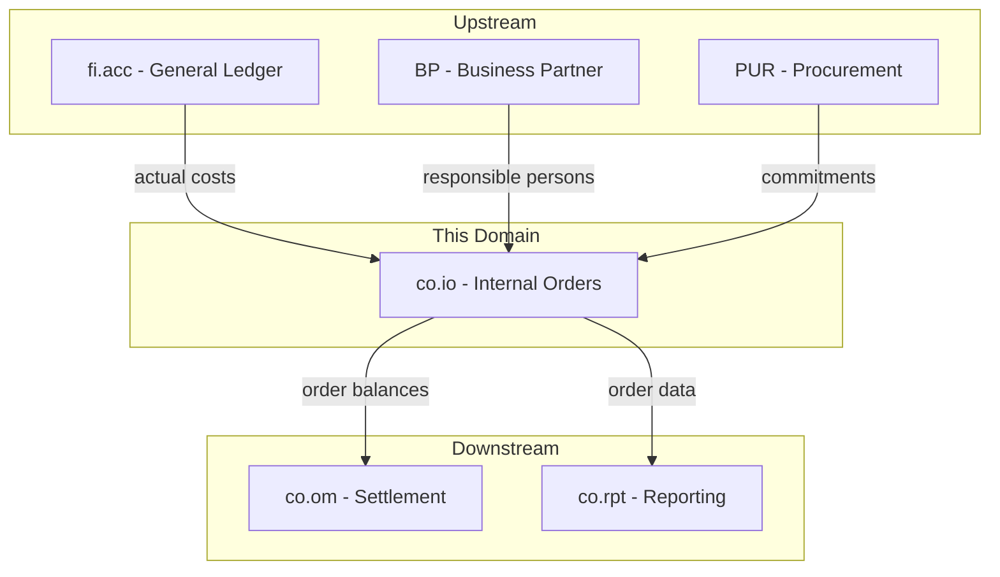
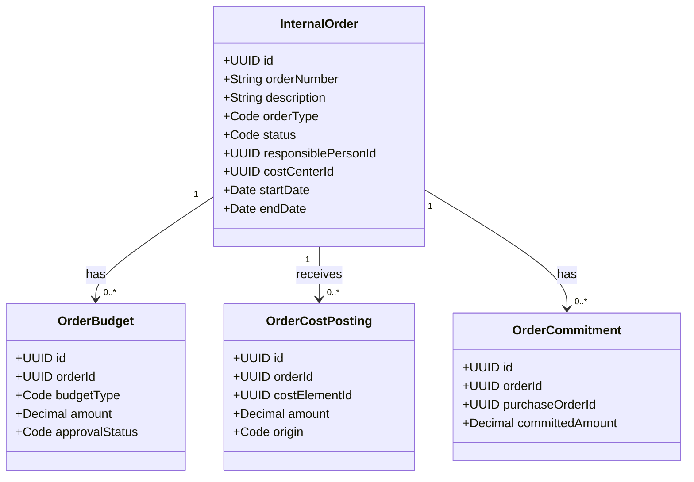
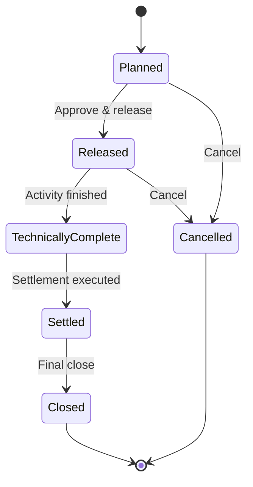
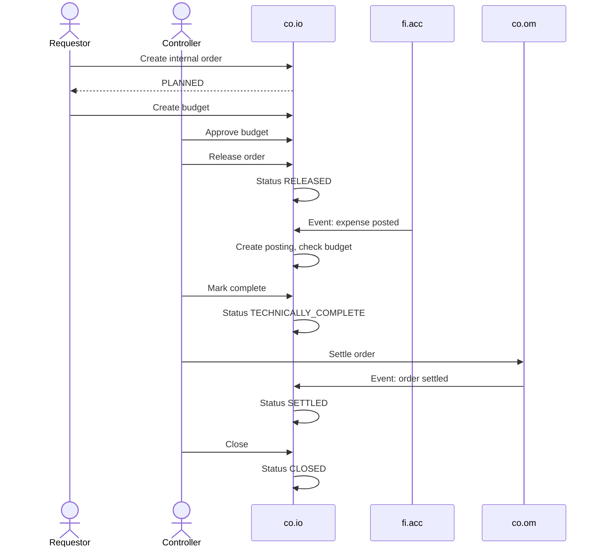
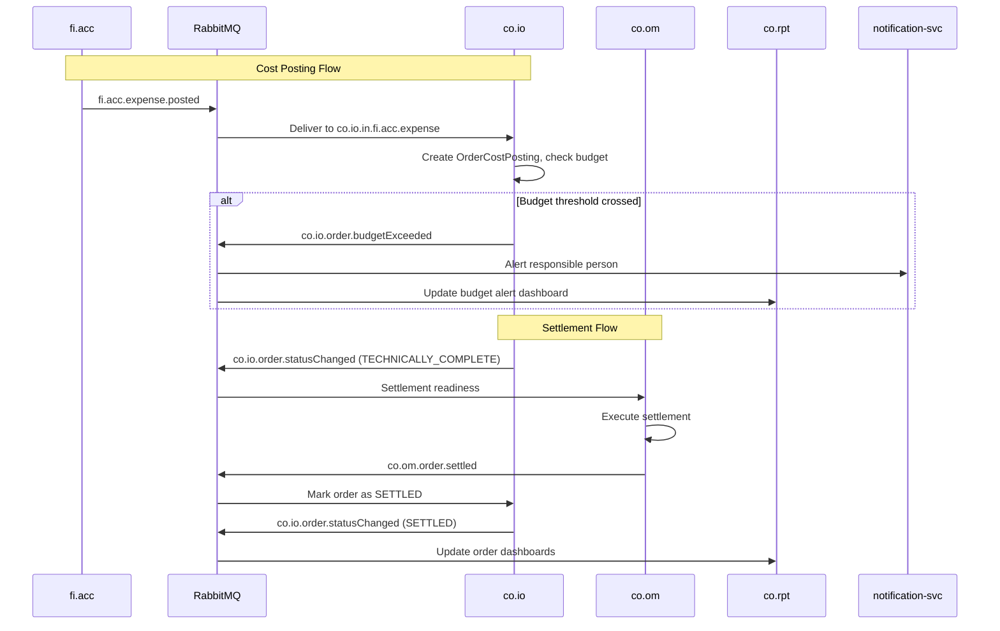
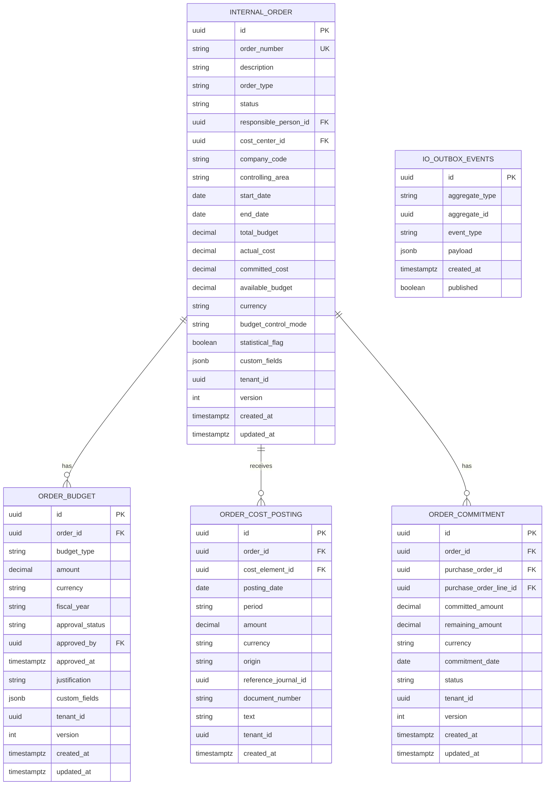

# CO - IO Internal Orders Domain / Service Specification

> **Conceptual Stack Layer:** Domain / Service
> **Space:** Platform
> **Owner:** Domain Engineering Team
> **Schema alignment:** `service-layer.schema.json`
> **Companion files:** `openapi.yaml`, `*.schema.json` (event contracts)
> **Referenced by:** Platform-Feature Spec SS5 (backend dependencies), BFF Contract
> **Belongs to:** CO Suite Spec (`_co_suite.md`)

> **Meta Information**
> - **Version:** 2026-04-04
> - **Template:** `domain-service-spec.md` v1.0.0
> - **Template Compliance:** ~95% — minor gaps in §11 feature register (pending feature specs)
> - **Author(s):** OpenLeap Architecture Team
> - **Status:** DRAFT
> - **Suite:** `co`
> - **Domain:** `io`
> - **Bounded Context Ref:** `bc:internal-orders`
> - **Service ID:** `co-io-svc`
> - **basePackage:** `io.openleap.co.io`
> - **API Base Path:** `/api/co/io/v1`
> - **OpenLeap Starter Version:** `v1`
> - **Port:** TBD
> - **Repository:** TBD
> - **Tags:** `controlling`, `internal-order`, `budget`, `commitment`
> - **Team:**
>   - Name: `team-co`
>   - Email: `co-team@openleap.io`
>   - Slack: `#co-team`

---

## Specification Guidelines Compliance

> ### Non-Negotiables
> - Never invent facts. If required info is missing, add an **OPEN QUESTION** entry.
> - Preserve intent and decisions. Only change meaning when explicitly requested.
> - Do not remove normative constraints unless they are explicitly replaced.
> - Keep the spec **self-contained**: no "see chat", no implicit context.
>
> ### Source of Truth Priority
> When sources conflict:
> 1. Spec (explicit) wins
> 2. Starter specs (implementation constraints) next
> 3. Guidelines (best practices) last
>
> Record conflicts in the **Decisions & Conflicts** section (see Section 14).
>
> ### Style Guide
> - Prefer short sentences and lists.
> - Use MUST/SHOULD/MAY for normative statements.
> - Keep terminology consistent (Aggregate, Domain Service, Application Service, Command, Event).
> - Avoid ambiguous words ("often", "maybe") unless explicitly noting uncertainty.
> - Keep examples minimal and clearly marked as examples.
> - Do not add implementation code unless the chapter explicitly requires it.

---

## 0. Document Purpose & Scope

### 0.1 Purpose
This specification defines the Internal Orders (IO) domain, which manages temporary cost collectors for specific activities, events, projects, or capital investments. Internal orders accumulate costs over their lifetime and are eventually settled to permanent cost objects.

### 0.2 Target Audience
- Product Owners & Business Stakeholders
- System Architects & Technical Leads
- Integration Engineers

### 0.3 Scope
**In Scope:**
- Internal order master data management (lifecycle, types, budgets)
- Cost capture on orders from FI events
- Budget management (original, supplement, return, commitment)
- Order balance tracking and budget utilization
- Order completion and readiness for settlement

**Out of Scope:**
- Settlement execution (-> co.om)
- Cost center master data (-> co.cca)
- Product costing (-> co.pc)
- Project management (-> PS module)

### 0.4 Related Documents
- `_co_suite.md` - CO Suite overview
- `co_om-spec.md` - Overhead Management (settlement)
- `co_cca-spec.md` - Cost Center Accounting
- `fi_acc_core_spec_complete.md` - Financial Accounting
- `BP_business_partner.md` - Business Partner

---

## 1. Business Context

### 1.1 Domain Purpose
`co.io` provides **temporary cost collection** for defined activities. Unlike cost centers (permanent), internal orders have a defined start and end. They collect costs during their lifetime and are settled to permanent cost objects when complete. Examples: trade shows, IT projects, marketing campaigns, capital investments.

### 1.2 Business Value
- Precise cost tracking for specific activities and events
- Budget control with warnings and hard stops
- Commitment tracking (PO commitments before actual costs)
- Clear settlement trail from temporary to permanent objects

### 1.3 Key Stakeholders

| Role | Responsibility | Primary Use Cases |
|------|----------------|-------------------|
| Order Requestor | Request new internal orders | UC-001 |
| Cost Center Manager | Approve orders, monitor budget | UC-002, UC-004 |
| Controller | Manage lifecycle, trigger settlement | UC-003, UC-005 |
| Procurement | Create commitments against orders | UC-006 |

### 1.4 Strategic Positioning



### 1.5 Service Context

| Property | Value |
|----------|-------|
| **Suite** | `co` |
| **Domain** | `io` |
| **Bounded Context** | `bc:internal-orders` |
| **Service ID** | `co-io-svc` |
| **Base Package** | `io.openleap.co.io` |

**Responsibilities:**
- Internal order lifecycle management
- Budget management and approval workflow
- Cost posting capture from FI events
- Commitment tracking from procurement events
- Balance computation (budget, actual, committed, available)

**Authoritative Sources:**
| Source Type | Description | Access Pattern |
|-------------|-------------|----------------|
| REST API | Order master data, budgets, balances | Synchronous |
| Database | Internal orders, budgets, postings, commitments | Direct (owner) |
| Events | Order status changes, budget alerts | Asynchronous |

---

## 2. Service Identity

| Property | Value | Schema Field |
|----------|-------|-------------|
| **Service ID** | `co-io-svc` | `metadata.id` |
| **Display Name** | `Internal Orders` | `metadata.name` |
| **Suite** | `co` | `metadata.suite` |
| **Domain** | `io` | `metadata.domain` |
| **Bounded Context** | `bc:internal-orders` | `metadata.bounded_context_ref` |
| **Version** | `1.0.0` | `metadata.version` |
| **Status** | DRAFT | `metadata.status` |
| **API Base Path** | `/api/co/io/v1` | `metadata.api_base_path` |
| **Repository** | TBD | `metadata.repository` |
| **Tags** | `controlling`, `internal-order`, `budget` | `metadata.tags` |

**Team:**
| Property | Value |
|----------|-------|
| **Name** | `team-co` |
| **Email** | `co-team@openleap.io` |
| **Slack Channel** | `#co-team` |

---

## 3. Domain Model

### 3.1 Conceptual Overview
IO manages **Internal Orders** as cost collectors with defined budgets, **Order Budgets** for financial control, **Order Cost Postings** for actual costs, and **Commitments** for anticipated costs from purchase orders.

### 3.2 Core Concepts



### 3.3 Aggregate Definitions

#### 3.3.1 InternalOrder

| Property | Value |
|----------|-------|
| **Aggregate ID** | `agg:internal-order` |
| **Name** | `InternalOrder` |

**Business Purpose:** Temporary cost collector for a specific activity with defined start/end dates and a budget. Analogous to SAP CO-OM-OPA internal orders (transaction KO01). Orders track actual costs, committed costs from purchase orders, and budget utilization.

##### Aggregate Root

**Key Attributes:**
| Attribute | Type | Format | Description | Constraints | Required | Read-Only |
|-----------|------|--------|-------------|-------------|----------|-----------|
| id | string | uuid | Unique identifier (OlUuid) | Immutable | Yes | Yes |
| orderNumber | string | — | Human-readable order number (e.g., "IO-2026-001") | unique per tenant, max 20 chars | Yes | Yes |
| description | string | — | Business purpose of the internal order | max 500 chars | Yes | No |
| orderType | string | — | Functional classification of the order | enum_ref: `OrderType` | Yes | No |
| status | string | — | Lifecycle state of the order | enum_ref: `OrderStatus` | Yes | No |
| responsiblePersonId | string | uuid | FK to Business Partner responsible for the order | — | Yes | No |
| costCenterId | string | uuid | Default settlement receiver cost center (FK to co.cca) | — | Yes | No |
| companyCode | string | — | Company code the order belongs to | max 10 chars | Yes | No |
| controllingArea | string | — | Controlling area for CO operations | max 10 chars | Yes | No |
| startDate | string | date | Planned start date of the activity | — | Yes | No |
| endDate | string | date | Planned end date of the activity | >= startDate (BR-009) | Yes | No |
| totalBudget | number | decimal | Sum of all approved budget line items | Computed, precision: 4 | Yes | Yes |
| actualCost | number | decimal | Sum of all actual cost postings | Computed, precision: 4 | Yes | Yes |
| committedCost | number | decimal | Sum of all open commitments from POs | Computed, precision: 4 | Yes | Yes |
| availableBudget | number | decimal | totalBudget - actualCost - committedCost | Computed, precision: 4 | Yes | Yes |
| currency | string | — | ISO 4217 currency code for all monetary values | pattern: `^[A-Z]{3}$` | Yes | No |
| budgetControlMode | string | — | How budget overruns are handled | enum_ref: `BudgetControlMode` | Yes | No |
| statisticalFlag | boolean | — | If true, order is statistical (informational, no budget enforcement) | — | No | No |
| createdAt | string | date-time | Creation timestamp | — | Yes | Yes |
| updatedAt | string | date-time | Last modification timestamp | — | Yes | Yes |
| tenantId | string | uuid | Tenant identifier for RLS | — | Yes | Yes |
| version | integer | int64 | Optimistic locking version | — | Yes | Yes |

**Lifecycle States:**

| Property | Value |
|----------|-------|
| **Initial State** | `Planned` |
| **Terminal States** | `Closed`, `Cancelled` |



**State Descriptions:**
| State | Description | Business Meaning |
|-------|-------------|------------------|
| Planned | Created, not released | Budget requested, no postings allowed |
| Released | Active for postings | Activity ongoing, costs can be posted |
| TechnicallyComplete | Activity finished | No new postings, ready for settlement |
| Settled | Costs distributed | Balance distributed via co.om |
| Closed | Fully closed | Historical, read-only |
| Cancelled | Order cancelled | No further activity |

**Allowed Transitions:**
| From State | To State | Trigger | Guard / Business Preconditions |
|------------|----------|---------|-------------------------------|
| Planned | Released | Controller approves release | At least one approved OrderBudget exists (BR-002) |
| Released | TechnicallyComplete | Controller marks complete | No pending commitments awaiting goods receipt |
| TechnicallyComplete | Settled | co.om settlement event received | Settlement executed by co.om, balance distributed |
| Settled | Closed | Controller closes order | Balance MUST be zero (BR-008) |
| Planned | Cancelled | Requestor or Controller cancels | No actual costs exist (BR-007) |
| Released | Cancelled | Controller cancels | No actual costs exist; all commitments reversed (BR-007) |

**Invariants:**
| Rule ID | Description |
|---------|-------------|
| BR-001 | orderNumber MUST be unique per tenant |
| BR-002 | At least one approved OrderBudget MUST exist before Released |
| BR-003 | If budgetControlMode = hard_stop, reject postings exceeding availableBudget |
| BR-005 | No new postings after TechnicallyComplete |
| BR-007 | Cannot cancel if actual costs exist (reversal first) |
| BR-008 | Balance MUST be zero (settled) to close |
| BR-009 | endDate MUST be >= startDate |

**Domain Events Emitted:**
- `co.io.order.created`
- `co.io.order.statusChanged`
- `co.io.order.budgetExceeded`

##### Child Entities

###### Entity: OrderBudget

| Property | Value |
|----------|-------|
| **Entity ID** | `ent:order-budget` |
| **Name** | `OrderBudget` |
| **Relationship to Root** | one_to_many |

**Business Purpose:** Financial authorization for an internal order. Each budget line represents an approved monetary allocation (original, supplement, or return). Budgets require approval before they contribute to the order's totalBudget. Analogous to SAP CO budget profile with original/supplement/return line items.

**Attributes:**
| Attribute | Type | Format | Description | Constraints | Required |
|-----------|------|--------|-------------|-------------|----------|
| id | string | uuid | Unique identifier (OlUuid) | Immutable | Yes |
| orderId | string | uuid | FK to parent InternalOrder | — | Yes |
| budgetType | string | — | Classification of the budget action | enum_ref: `BudgetType` | Yes |
| amount | number | decimal | Budget amount (positive for original/supplement, positive for return but reduces total) | precision: 4 | Yes |
| currency | string | — | Must match parent order currency | pattern: `^[A-Z]{3}$` | Yes |
| fiscalYear | string | — | Fiscal year this budget applies to | pattern: `^\d{4}$` | Yes |
| approvalStatus | string | — | Current approval state | enum_ref: `ApprovalStatus` | Yes |
| approvedBy | string | uuid | BP ID of the approver | Required when approvalStatus = approved | Conditional |
| approvedAt | string | date-time | Timestamp of approval | Required when approvalStatus = approved | Conditional |
| justification | string | — | Business reason for supplement or return | max 500 chars | No |
| tenantId | string | uuid | Tenant identifier for RLS | — | Yes |
| version | integer | int64 | Optimistic locking version | — | Yes |

**Collection Constraints:**
- Minimum items: 0 (order can exist in Planned status without budgets)
- Maximum items: No hard limit (practical limit ~100 budget lines per order per fiscal year)

**Invariants:**
| Rule ID | Description |
|---------|-------------|
| BR-006 | Return MUST NOT make totalBudget negative |

###### Entity: OrderCostPosting

| Property | Value |
|----------|-------|
| **Entity ID** | `ent:order-cost-posting` |
| **Name** | `OrderCostPosting` |
| **Relationship to Root** | one_to_many |

**Business Purpose:** Records an actual cost incurred against the internal order. Created when FI posts an expense with an order reference or when inter-company cost allocations target this order. Postings are immutable (no updates, only reversals). Analogous to SAP CO-OM line items in table COEP.

**Attributes:**
| Attribute | Type | Format | Description | Constraints | Required |
|-----------|------|--------|-------------|-------------|----------|
| id | string | uuid | Unique identifier (OlUuid) | Immutable | Yes |
| orderId | string | uuid | FK to parent InternalOrder | — | Yes |
| costElementId | string | uuid | FK to cost element (co.cca) | — | Yes |
| postingDate | string | date | Date the cost was posted in FI | — | Yes |
| period | string | — | Fiscal period (e.g., "2026-04") | pattern: `^\d{4}-\d{2}$` | Yes |
| amount | number | decimal | Cost amount (positive = debit, negative = credit/reversal) | precision: 4 | Yes |
| currency | string | — | Must match parent order currency | pattern: `^[A-Z]{3}$` | Yes |
| origin | string | — | Source of the posting | enum_ref: `PostingOrigin` | Yes |
| referenceJournalId | string | uuid | FK to originating FI journal entry | — | No |
| documentNumber | string | — | Reference document number from source | max 20 chars | No |
| text | string | — | Posting description text | max 200 chars | No |
| tenantId | string | uuid | Tenant identifier for RLS | — | Yes |

**Collection Constraints:**
- Minimum items: 0
- Maximum items: No hard limit (high-volume orders may accumulate thousands of postings)

**Invariants:**
| Rule ID | Description |
|---------|-------------|
| BR-003 | If budgetControlMode = hard_stop, posting MUST NOT cause budget overrun |
| BR-005 | No new postings after status = TechnicallyComplete |

###### Entity: OrderCommitment

| Property | Value |
|----------|-------|
| **Entity ID** | `ent:order-commitment` |
| **Name** | `OrderCommitment` |
| **Relationship to Root** | one_to_many |

**Business Purpose:** Tracks anticipated costs from purchase orders before actual invoice receipt. Commitments reduce available budget to prevent over-commitment. When the PO is invoiced, the commitment is reduced/closed and an actual cost posting is created instead. Analogous to SAP commitment management (Obligo) in CO.

**Attributes:**
| Attribute | Type | Format | Description | Constraints | Required |
|-----------|------|--------|-------------|-------------|----------|
| id | string | uuid | Unique identifier (OlUuid) | Immutable | Yes |
| orderId | string | uuid | FK to parent InternalOrder | — | Yes |
| purchaseOrderId | string | uuid | FK to originating purchase order in PUR | — | Yes |
| purchaseOrderLineId | string | uuid | FK to specific PO line item | — | No |
| committedAmount | number | decimal | Original committed amount | precision: 4, > 0 | Yes |
| remainingAmount | number | decimal | Amount not yet invoiced | precision: 4, >= 0 | Yes |
| currency | string | — | Must match parent order currency | pattern: `^[A-Z]{3}$` | Yes |
| commitmentDate | string | date | Date the commitment was created | — | Yes |
| status | string | — | Current state of the commitment | enum_ref: `CommitmentStatus` | Yes |
| tenantId | string | uuid | Tenant identifier for RLS | — | Yes |

**Collection Constraints:**
- Minimum items: 0
- Maximum items: No hard limit

**Invariants:**
| Rule ID | Description |
|---------|-------------|
| BR-003 | If budgetControlMode = hard_stop, new commitment MUST NOT cause budget overrun |

##### Value Objects

###### Value Object: Money

| Property | Value |
|----------|-------|
| **VO ID** | `vo:money` |
| **Name** | `Money` |

**Description:** Represents a monetary amount with currency. Used internally for budget calculations and balance computations.

**Attributes:**
| Attribute | Type | Format | Description | Constraints |
|-----------|------|--------|-------------|-------------|
| amount | number | decimal | Monetary value | precision: 4 |
| currencyCode | string | — | ISO 4217 currency code | pattern: `^[A-Z]{3}$` |

**Validation Rules:**
- currencyCode MUST be a valid ISO 4217 code
- All Money values within a single InternalOrder aggregate MUST share the same currencyCode

###### Value Object: DateRange

| Property | Value |
|----------|-------|
| **VO ID** | `vo:date-range` |
| **Name** | `DateRange` |

**Description:** Represents the planned validity period of an internal order.

**Attributes:**
| Attribute | Type | Format | Description | Constraints |
|-----------|------|--------|-------------|-------------|
| startDate | string | date | Start of the range | — |
| endDate | string | date | End of the range | >= startDate |

**Validation Rules:**
- endDate MUST be on or after startDate (BR-009)
- Both dates MUST be provided

### 3.4 Enumerations

#### OrderStatus

**Description:** Lifecycle states for an internal order.

| Value | Description | Deprecated |
|-------|-------------|------------|
| `PLANNED` | Created, not yet released for cost postings | No |
| `RELEASED` | Active for cost postings and commitment tracking | No |
| `TECHNICALLY_COMPLETE` | Activity finished, no new postings allowed, ready for settlement | No |
| `SETTLED` | Costs distributed to settlement receivers by co.om | No |
| `CLOSED` | Final state, historical record, read-only | No |
| `CANCELLED` | Order cancelled before completion | No |

#### OrderType

**Description:** Functional classification of internal orders. Determines available features and settlement rules. Analogous to SAP order types (transaction KOT2).

| Value | Description | Deprecated |
|-------|-------------|------------|
| `OVERHEAD` | Collects overhead costs for a specific activity (e.g., trade show, training event) | No |
| `INVESTMENT` | Collects capitalized costs for asset acquisition; settles to fixed assets | No |
| `REVENUE` | Tracks revenue-bearing activities; allows both cost and revenue postings | No |
| `ACCRUAL` | Accrual order for period-end accrual calculations | No |

#### BudgetType

**Description:** Classification of budget line items affecting the order's total budget.

| Value | Description | Deprecated |
|-------|-------------|------------|
| `ORIGINAL` | Initial budget allocation for the order | No |
| `SUPPLEMENT` | Additional budget added after the original allocation | No |
| `RETURN` | Budget returned (reduced) from the order | No |

#### BudgetControlMode

**Description:** Determines how budget overruns are handled during cost posting and commitment creation.

| Value | Description | Deprecated |
|-------|-------------|------------|
| `NONE` | No budget checking; costs posted without limit | No |
| `WARNING` | Budget utilization warnings at 80% and 90% thresholds; postings still allowed | No |
| `HARD_STOP` | Postings and commitments exceeding available budget are rejected (BR-003) | No |

#### ApprovalStatus

**Description:** Approval workflow states for budget line items.

| Value | Description | Deprecated |
|-------|-------------|------------|
| `DRAFT` | Budget created but not yet submitted for approval | No |
| `SUBMITTED` | Budget submitted for managerial approval | No |
| `APPROVED` | Budget approved by authorized person; contributes to totalBudget | No |
| `REJECTED` | Budget request rejected; does not contribute to totalBudget | No |

#### PostingOrigin

**Description:** Source system or process that created a cost posting.

| Value | Description | Deprecated |
|-------|-------------|------------|
| `FI_ACTUAL` | Actual cost from FI journal entry (expense posted event) | No |
| `ALLOCATION` | Cost allocated from another CO object (e.g., overhead allocation from co.om) | No |
| `REVERSAL` | Reversal of a previous posting | No |
| `MANUAL` | Manual adjustment posting by controller | No |

#### CommitmentStatus

**Description:** Lifecycle states for purchase order commitments.

| Value | Description | Deprecated |
|-------|-------------|------------|
| `OPEN` | Commitment active; PO not yet fully invoiced | No |
| `PARTIALLY_INVOICED` | Part of the committed amount has been invoiced (actual cost posted) | No |
| `CLOSED` | Commitment fully invoiced or cancelled; remainingAmount = 0 | No |
| `CANCELLED` | Commitment cancelled (PO cancelled) | No |

### 3.5 Shared Types

#### Money

| Property | Value |
|----------|-------|
| **Type ID** | `type:money` |
| **Name** | `Money` |

**Description:** Monetary amount with currency. Used across all aggregates for budget amounts, posting amounts, and commitment amounts.

**Attributes:**
| Attribute | Type | Format | Description | Constraints |
|-----------|------|--------|-------------|-------------|
| amount | number | decimal | Monetary value | precision: 4 |
| currencyCode | string | — | ISO 4217 currency code | pattern: `^[A-Z]{3}$` |

**Validation Rules:**
- currencyCode MUST be a valid, active ISO 4217 code in ref-data-svc
- All monetary values within a single InternalOrder aggregate MUST use the same currencyCode

**Used By:**
- `agg:internal-order` (totalBudget, actualCost, committedCost, availableBudget)
- `ent:order-budget` (amount)
- `ent:order-cost-posting` (amount)
- `ent:order-commitment` (committedAmount, remainingAmount)

---

## 4. Business Rules & Constraints

### 4.1 Business Rules Catalog

| ID | Rule Name | Description | Scope | Enforcement | Error Code |
|----|-----------|-------------|-------|-------------|------------|
| BR-001 | Unique Order Number | orderNumber MUST be unique per tenant | InternalOrder | Create | `DUPLICATE_ORDER_NUMBER` |
| BR-002 | Budget for Release | Approved budget MUST exist before release | InternalOrder | Status transition | `NO_APPROVED_BUDGET` |
| BR-003 | Budget Hard Stop | Reject postings exceeding budget if mode = hard_stop | OrderCostPosting, OrderCommitment | Create | `BUDGET_EXCEEDED` |
| BR-004 | Budget Warning | Warn at 80%/90% utilization | OrderCostPosting | Create | — (warning) |
| BR-005 | No Post After Complete | Block postings after TechnicallyComplete | OrderCostPosting | Create | `ORDER_COMPLETE` |
| BR-006 | Return Limit | Return MUST NOT make totalBudget negative | OrderBudget | Create | `NEGATIVE_BUDGET` |
| BR-007 | Cancel Precondition | No actual costs for cancel | InternalOrder | Cancel | `ACTUAL_COSTS_EXIST` |
| BR-008 | Close Precondition | Zero balance for close | InternalOrder | Close | `NONZERO_BALANCE` |
| BR-009 | Date Validity | endDate MUST be >= startDate | InternalOrder | Create, Update | `INVALID_DATE_RANGE` |
| BR-010 | Currency Consistency | Budget, posting, and commitment currency MUST match order currency | OrderBudget, OrderCostPosting, OrderCommitment | Create | `CURRENCY_MISMATCH` |
| BR-011 | Posting Immutability | Cost postings MUST NOT be updated; corrections via reversal postings only | OrderCostPosting | Update | `POSTING_IMMUTABLE` |

### 4.2 Detailed Rule Definitions

#### BR-001: Unique Order Number

**Business Context:** Internal orders need a human-readable identifier for reporting, communication, and SAP legacy reference. Uniqueness per tenant prevents confusion and duplicate tracking.

**Rule Statement:** The `orderNumber` field MUST be unique within a tenant. The system generates order numbers automatically using a sequential pattern (e.g., "IO-2026-001").

**Applies To:**
- Aggregate: InternalOrder
- Operations: Create

**Enforcement:** Database unique constraint on `(tenant_id, order_number)`.

**Validation Logic:** Before persisting, check that no other InternalOrder with the same tenant_id and order_number exists.

**Error Handling:**
- **Error Code:** `DUPLICATE_ORDER_NUMBER`
- **Error Message:** "Order number '{orderNumber}' already exists"
- **User action:** This is a system-generated field; if collision occurs, retry (system generates next sequence)

**Examples:**
- **Valid:** First order in tenant creates "IO-2026-001"
- **Invalid:** Concurrent creation attempts produce same sequence number (mitigated by DB unique constraint)

#### BR-002: Budget for Release

**Business Context:** Releasing an order without approved budget would allow uncontrolled spending. This enforces financial governance before cost collection begins.

**Rule Statement:** An InternalOrder MUST have at least one OrderBudget with `approvalStatus = APPROVED` before the status can transition from `PLANNED` to `RELEASED`.

**Applies To:**
- Aggregate: InternalOrder
- Operations: Release (status transition)

**Enforcement:** Checked during the release command handler.

**Validation Logic:** Count OrderBudget children where approvalStatus = APPROVED. Count MUST be >= 1.

**Error Handling:**
- **Error Code:** `NO_APPROVED_BUDGET`
- **Error Message:** "Cannot release order: no approved budget exists"
- **User action:** Create and approve at least one budget line item before releasing

**Examples:**
- **Valid:** Order has one APPROVED budget of EUR 50,000; release succeeds
- **Invalid:** Order has two DRAFT budgets; release fails with NO_APPROVED_BUDGET

#### BR-003: Budget Hard Stop

**Business Context:** Some orders have strict budget limits (e.g., investment orders, externally funded projects). Exceeding budget requires explicit supplement approval.

**Rule Statement:** If `budgetControlMode = 'hard_stop'` and `(actualCost + committedCost + posting.amount) > totalBudget`, the posting MUST be rejected.

**Applies To:**
- Aggregate: InternalOrder (via OrderCostPosting and OrderCommitment creation)
- Operations: Create posting, Create commitment

**Enforcement:** Checked in the domain service before persisting the posting or commitment.

**Validation Logic:** Calculate `availableBudget = totalBudget - actualCost - committedCost`. If `posting.amount > availableBudget`, reject.

**Error Handling:**
- **Error Code:** `BUDGET_EXCEEDED`
- **Error Message:** "Budget exceeded: available {available}, requested {amount}"
- **User action:** Request budget supplement or reduce scope

**Examples:**
- **Valid:** Budget = 100,000; actual = 60,000; committed = 20,000; new posting = 15,000 (within 20,000 available)
- **Invalid:** Budget = 100,000; actual = 80,000; committed = 15,000; new posting = 10,000 (exceeds 5,000 available)

#### BR-004: Budget Warning

**Business Context:** Early warning at budget utilization thresholds allows controllers to take proactive action before budget is exhausted.

**Rule Statement:** When a cost posting causes budget utilization to cross 80% or 90%, a `budgetExceeded` event SHOULD be published with the utilization level.

**Applies To:**
- Aggregate: InternalOrder (via OrderCostPosting creation)
- Operations: Create posting

**Enforcement:** Checked after posting creation in the application service.

**Validation Logic:** Calculate utilization = `(actualCost + committedCost) / totalBudget * 100`. If crosses 80% or 90% threshold, publish warning event.

**Error Handling:**
- No error code (posting succeeds)
- Warning published as `co.io.order.budgetExceeded` event

**Examples:**
- **Valid:** Utilization at 79%, new posting brings it to 82% -> warning event at 80% threshold
- **Valid:** Utilization at 85%, new posting brings it to 88% -> no new warning (already past 80%, not yet at 90%)

#### BR-005: No Post After Complete

**Business Context:** Once an order is technically complete, no further costs should be accumulated. This ensures settlement covers all costs.

**Rule Statement:** Cost postings MUST NOT be created on an InternalOrder with status `TECHNICALLY_COMPLETE`, `SETTLED`, `CLOSED`, or `CANCELLED`.

**Applies To:**
- Aggregate: InternalOrder (via OrderCostPosting)
- Operations: Create posting

**Enforcement:** Checked in the domain object during posting creation.

**Validation Logic:** If order.status NOT IN (`PLANNED`, `RELEASED`), reject posting. Note: Planned orders also cannot receive postings (only Released).

**Error Handling:**
- **Error Code:** `ORDER_COMPLETE`
- **Error Message:** "Cannot post costs: order is in status '{status}'"
- **User action:** If costs must be posted, reopen the order (requires reversal of settlement if settled)

**Examples:**
- **Valid:** Order in RELEASED status; posting accepted
- **Invalid:** Order in TECHNICALLY_COMPLETE status; posting rejected

#### BR-006: Return Limit

**Business Context:** A budget return reduces the total budget. The total budget cannot become negative, which would represent a meaningless financial state.

**Rule Statement:** When creating a budget of type `RETURN`, the return amount MUST NOT cause `totalBudget` to become negative.

**Applies To:**
- Aggregate: InternalOrder (via OrderBudget)
- Operations: Create budget of type RETURN

**Enforcement:** Checked in the domain service during budget creation.

**Validation Logic:** `currentTotalBudget - returnAmount >= 0`

**Error Handling:**
- **Error Code:** `NEGATIVE_BUDGET`
- **Error Message:** "Budget return of {amount} would result in negative total budget (current: {totalBudget})"
- **User action:** Reduce return amount to at most the current totalBudget

**Examples:**
- **Valid:** Total budget = 50,000; return = 10,000; new total = 40,000
- **Invalid:** Total budget = 50,000; return = 60,000; would result in -10,000

#### BR-007: Cancel Precondition

**Business Context:** Cancelling an order with actual costs would orphan those costs. Costs must be reversed first so they are reassigned elsewhere.

**Rule Statement:** An InternalOrder MUST NOT be cancelled if any OrderCostPosting with origin != `REVERSAL` exists and net amount > 0.

**Applies To:**
- Aggregate: InternalOrder
- Operations: Cancel (status transition)

**Enforcement:** Checked during the cancel command handler.

**Validation Logic:** Sum all posting amounts. If net sum != 0, reject cancellation.

**Error Handling:**
- **Error Code:** `ACTUAL_COSTS_EXIST`
- **Error Message:** "Cannot cancel: order has actual costs of {amount}. Reverse costs first."
- **User action:** Create reversal postings to zero out costs, then cancel

**Examples:**
- **Valid:** Order has no postings; cancel succeeds
- **Invalid:** Order has EUR 5,000 in postings; cancel fails

#### BR-008: Close Precondition

**Business Context:** Closing an order is the final step after settlement. A non-zero balance indicates incomplete settlement.

**Rule Statement:** An InternalOrder MUST have `availableBudget = 0` and `actualCost = 0` (fully settled) to transition to `CLOSED`.

**Applies To:**
- Aggregate: InternalOrder
- Operations: Close (status transition)

**Enforcement:** Checked during the close command handler.

**Validation Logic:** Verify `actualCost = 0` (all costs settled to receivers) and all commitments are CLOSED or CANCELLED.

**Error Handling:**
- **Error Code:** `NONZERO_BALANCE`
- **Error Message:** "Cannot close: order has unsettled balance of {amount}"
- **User action:** Complete settlement via co.om before closing

**Examples:**
- **Valid:** Order settled, actualCost = 0, all commitments closed -> close succeeds
- **Invalid:** Order has actualCost = 5,000 remaining -> close fails

#### BR-009: Date Validity

**Business Context:** The end date defines the planned completion of the activity. An end date before the start date is logically invalid.

**Rule Statement:** `endDate` MUST be on or after `startDate`.

**Applies To:**
- Aggregate: InternalOrder
- Operations: Create, Update

**Enforcement:** Checked in the domain object constructor and update methods.

**Validation Logic:** `endDate >= startDate`

**Error Handling:**
- **Error Code:** `INVALID_DATE_RANGE`
- **Error Message:** "End date ({endDate}) must be on or after start date ({startDate})"
- **User action:** Correct the dates

**Examples:**
- **Valid:** startDate = 2026-04-01, endDate = 2026-06-30
- **Invalid:** startDate = 2026-06-30, endDate = 2026-04-01

#### BR-010: Currency Consistency

**Business Context:** All monetary amounts within an order must use the same currency to enable correct budget calculations without currency conversion complexity.

**Rule Statement:** The `currency` field on OrderBudget, OrderCostPosting, and OrderCommitment MUST match the parent InternalOrder's `currency`.

**Applies To:**
- Aggregate: InternalOrder (via child entities)
- Operations: Create budget, Create posting, Create commitment

**Enforcement:** Checked in the domain service before persisting child entities.

**Validation Logic:** `childEntity.currency == parentOrder.currency`

**Error Handling:**
- **Error Code:** `CURRENCY_MISMATCH`
- **Error Message:** "Currency '{childCurrency}' does not match order currency '{orderCurrency}'"
- **User action:** Ensure the source system converts to the order's currency before posting

**Examples:**
- **Valid:** Order currency = EUR, posting currency = EUR
- **Invalid:** Order currency = EUR, posting currency = USD

#### BR-011: Posting Immutability

**Business Context:** Cost postings are part of the audit trail. They MUST NOT be modified after creation. Corrections are handled via reversal postings (negative amount, origin = REVERSAL).

**Rule Statement:** Once an OrderCostPosting is created, it MUST NOT be updated or deleted. Corrections MUST be made by creating a new posting with origin = `REVERSAL`.

**Applies To:**
- Aggregate: OrderCostPosting
- Operations: Update, Delete

**Enforcement:** Domain object does not expose update/delete methods for postings.

**Validation Logic:** Any attempt to update or delete a posting is rejected.

**Error Handling:**
- **Error Code:** `POSTING_IMMUTABLE`
- **Error Message:** "Cost postings cannot be modified. Create a reversal posting instead."
- **User action:** Create a reversal posting with origin = REVERSAL and negative amount

### 4.3 Data Validation Rules

**Field-Level Validations:**
| Field | Validation Rule | Error Message |
|-------|----------------|---------------|
| description | Required, 1-500 chars | "Description is required and cannot exceed 500 characters" |
| orderType | Required, must be valid OrderType enum value | "Invalid order type" |
| startDate | Required, valid date format | "Start date is required" |
| endDate | Required, valid date format, >= startDate | "End date must be on or after start date" |
| currency | Required, 3 uppercase letters, valid ISO 4217 | "Currency must be a valid ISO 4217 code" |
| budgetControlMode | Required, must be valid BudgetControlMode enum value | "Invalid budget control mode" |
| responsiblePersonId | Required, must reference an existing BP | "Responsible person must be a valid Business Partner" |
| costCenterId | Required, must reference an existing cost center | "Cost center must exist in co.cca" |
| companyCode | Required, max 10 chars | "Company code is required" |
| controllingArea | Required, max 10 chars | "Controlling area is required" |
| budget.amount | Required, > 0 for original/supplement | "Budget amount must be positive" |
| budget.fiscalYear | Required, 4-digit year | "Fiscal year must be a 4-digit year" |
| commitment.committedAmount | Required, > 0 | "Committed amount must be positive" |

**Cross-Field Validations:**
- endDate MUST be >= startDate (BR-009)
- Budget, posting, and commitment currency MUST match order currency (BR-010)
- approvedBy MUST be present when approvalStatus = APPROVED
- remainingAmount MUST be <= committedAmount on OrderCommitment
- Statistical orders (statisticalFlag = true) SHOULD have budgetControlMode = NONE

### 4.4 Reference Data Dependencies

**Required Reference Data:**
| Catalog | Source Service | Fields Referencing | Validation |
|---------|----------------|-------------------|------------|
| Currencies (ISO 4217) | ref-data-svc | currency (all entities) | Must exist and be active |
| Fiscal Calendar | ref-data-svc | fiscalYear, period | Period must exist for the controlling area |
| Business Partners | bp-svc | responsiblePersonId, approvedBy | Must exist |
| Cost Centers | co-cca-svc | costCenterId | Must exist and be active in same controlling area |
| Cost Elements | co-cca-svc | costElementId (postings) | Must exist and be active |

**Internal Code Lists:**
| Catalog | Managed By | Usage |
|---------|-----------|-------|
| order_status | This service | Lifecycle states (OrderStatus enum) |
| order_type | This service | Order classification (OrderType enum) |
| budget_type | This service | Budget line classification (BudgetType enum) |
| budget_control_mode | This service | Budget enforcement mode (BudgetControlMode enum) |
| approval_status | This service | Budget approval workflow (ApprovalStatus enum) |
| posting_origin | This service | Cost posting source (PostingOrigin enum) |
| commitment_status | This service | Commitment lifecycle (CommitmentStatus enum) |

---

## 5. Use Cases

### 5.1 Business Logic Placement

| Logic Type | Placement | Examples |
|------------|-----------|----------|
| Aggregate invariants | Domain Object | Budget check, status transitions, date validation |
| Cross-aggregate logic | Domain Service | Balance computation, commitment reconciliation |
| Orchestration & transactions | Application Service | FI event processing, budget approval workflow |

### 5.2 Use Cases (Canonical Format)

#### UC-001: CreateInternalOrder

| Field | Value |
|-------|-------|
| **id** | `CreateInternalOrder` |
| **type** | WRITE |
| **trigger** | REST |
| **aggregate** | `InternalOrder` |
| **domainOperation** | `InternalOrder.create` |
| **inputs** | `description: String`, `orderType: Code`, `responsiblePersonId: UUID`, `costCenterId: UUID`, `companyCode: String`, `controllingArea: String`, `startDate: Date`, `endDate: Date`, `currency: String`, `budgetControlMode: Code` |
| **outputs** | `InternalOrder` |
| **events** | `Order.created` |
| **rest** | `POST /api/co/io/v1/orders` |
| **idempotency** | optional |
| **errors** | `DUPLICATE_ORDER_NUMBER`, `INVALID_DATE_RANGE` |

**Actor:** Order Requestor

**Preconditions:**
- User has `co.io:write` permission
- Referenced responsiblePersonId exists in BP service
- Referenced costCenterId exists in co.cca and is active

**Main Flow:**
1. Requestor submits order creation request with required fields
2. System validates field-level constraints (description length, date range, currency format)
3. System validates external references (BP, cost center, currency)
4. System generates unique orderNumber
5. System creates InternalOrder in `PLANNED` status with zero balances
6. System publishes `co.io.order.created` event
7. System returns created order with Location header

**Postconditions:**
- InternalOrder is in `PLANNED` status
- orderNumber is assigned and unique
- All balance fields are zero

**Business Rules Applied:**
- BR-001: Unique Order Number (guaranteed by auto-generation + DB constraint)
- BR-009: Date Validity (endDate >= startDate)
- BR-010: Currency Consistency (validated against ref-data)

**Alternative Flows:**
- **Alt-1:** If statisticalFlag = true, budgetControlMode is set to NONE regardless of input

**Exception Flows:**
- **Exc-1:** If responsiblePersonId not found in BP service, return 422 with "Responsible person not found"
- **Exc-2:** If costCenterId not found or inactive in co.cca, return 422 with "Cost center not found or inactive"

#### UC-002: ApproveBudget

| Field | Value |
|-------|-------|
| **id** | `ApproveBudget` |
| **type** | WRITE |
| **trigger** | REST |
| **aggregate** | `OrderBudget` |
| **domainOperation** | `OrderBudget.approve` |
| **inputs** | `orderId: UUID`, `budgetId: UUID` |
| **outputs** | `OrderBudget` |
| **events** | — |
| **rest** | `POST /api/co/io/v1/orders/{orderId}/budgets/{budgetId}/approve` |
| **idempotency** | required |
| **errors** | `BUDGET_NOT_FOUND`, `INVALID_APPROVAL_STATE` |

**Actor:** Cost Center Manager / Controller

**Preconditions:**
- User has `co.io:write` permission and approval authority
- Budget exists and is in `SUBMITTED` status
- Parent order exists

**Main Flow:**
1. Approver submits budget approval request
2. System validates budget exists and is in SUBMITTED state
3. System sets approvalStatus to APPROVED, records approvedBy and approvedAt
4. System recalculates parent order's totalBudget
5. System returns updated budget

**Postconditions:**
- Budget approvalStatus = APPROVED
- Parent order totalBudget includes approved amount
- Parent order availableBudget recalculated

**Business Rules Applied:**
- BR-006: Return Limit (if budget is a return, validate totalBudget stays non-negative)

**Alternative Flows:**
- **Alt-1:** If budget is already APPROVED, return idempotent success (no state change)

**Exception Flows:**
- **Exc-1:** If budget is in DRAFT status, return 422 with "Budget must be submitted before approval"
- **Exc-2:** If budget is REJECTED, return 422 with "Cannot approve a rejected budget"

#### UC-003: ReleaseOrder

| Field | Value |
|-------|-------|
| **id** | `ReleaseOrder` |
| **type** | WRITE |
| **trigger** | REST |
| **aggregate** | `InternalOrder` |
| **domainOperation** | `InternalOrder.release` |
| **inputs** | `orderId: UUID` |
| **outputs** | `InternalOrder` |
| **events** | `Order.statusChanged` |
| **rest** | `POST /api/co/io/v1/orders/{id}/release` |
| **idempotency** | required |
| **errors** | `NO_APPROVED_BUDGET` |

**Actor:** Controller

**Preconditions:**
- User has `co.io:write` permission
- Order exists and is in `PLANNED` status
- At least one approved budget exists (BR-002)

**Main Flow:**
1. Controller submits release request
2. System validates order is in PLANNED status
3. System checks at least one APPROVED budget exists
4. System transitions status to RELEASED
5. System publishes `co.io.order.statusChanged` event
6. System returns updated order

**Postconditions:**
- Order status = RELEASED
- Order is now eligible to receive cost postings and commitments

**Business Rules Applied:**
- BR-002: Budget for Release

**Alternative Flows:**
- **Alt-1:** If order is already RELEASED, return idempotent success

**Exception Flows:**
- **Exc-1:** If no approved budget exists, return 422 with NO_APPROVED_BUDGET
- **Exc-2:** If order is not in PLANNED status, return 409 with "Invalid status transition"

#### UC-004: MonitorBudgetUtilization

| Field | Value |
|-------|-------|
| **id** | `MonitorBudgetUtilization` |
| **type** | READ |
| **trigger** | REST |
| **aggregate** | `InternalOrder` |
| **domainOperation** | `getOrderBalance` |
| **inputs** | `orderId: UUID` |
| **outputs** | `OrderBalanceDTO` |
| **rest** | `GET /api/co/io/v1/orders/{id}` |
| **idempotency** | none |
| **errors** | — |

**Actor:** Cost Center Manager

**Preconditions:**
- User has `co.io:read` permission
- Order exists

**Main Flow:**
1. Manager requests order details
2. System retrieves order with computed balance fields
3. System returns order with totalBudget, actualCost, committedCost, availableBudget, and utilization percentage

**Postconditions:**
- Read-only operation; no state changes

**Business Rules Applied:**
- None (read operation)

#### UC-005: CompleteAndPrepareForSettlement

| Field | Value |
|-------|-------|
| **id** | `CompleteAndPrepareForSettlement` |
| **type** | WRITE |
| **trigger** | REST |
| **aggregate** | `InternalOrder` |
| **domainOperation** | `InternalOrder.complete` |
| **inputs** | `orderId: UUID` |
| **outputs** | `InternalOrder` |
| **events** | `Order.statusChanged` |
| **rest** | `POST /api/co/io/v1/orders/{id}/complete` |
| **idempotency** | required |
| **errors** | `OPEN_COMMITMENTS_EXIST` |

**Actor:** Controller

**Preconditions:**
- User has `co.io:write` permission
- Order exists and is in `RELEASED` status

**Main Flow:**
1. Controller submits completion request
2. System validates order is in RELEASED status
3. System checks for open commitments (warning, not blocking)
4. System transitions status to TECHNICALLY_COMPLETE
5. System publishes `co.io.order.statusChanged` event (consumers: co.om for settlement readiness)
6. System returns updated order

**Postconditions:**
- Order status = TECHNICALLY_COMPLETE
- No further cost postings or commitments allowed (BR-005)
- co.om notified of settlement readiness

**Business Rules Applied:**
- BR-005: No Post After Complete (enforced prospectively)

**Alternative Flows:**
- **Alt-1:** If open commitments exist, include warning in response but proceed with completion

**Exception Flows:**
- **Exc-1:** If order is not in RELEASED status, return 409 with "Invalid status transition"

#### UC-006: RecordCommitment

| Field | Value |
|-------|-------|
| **id** | `RecordCommitment` |
| **type** | WRITE |
| **trigger** | Message |
| **aggregate** | `OrderCommitment` |
| **domainOperation** | `OrderCommitment.create` |
| **inputs** | `orderId: UUID`, `purchaseOrderId: UUID`, `committedAmount: Decimal`, `currency: String` |
| **outputs** | `OrderCommitment` |
| **events** | — |
| **rest** | — (event-driven) |
| **idempotency** | required |
| **errors** | `BUDGET_EXCEEDED` (if hard_stop) |

**Actor:** System (PUR event)

**Preconditions:**
- Order exists and is in RELEASED status
- Purchase order references this internal order

**Main Flow:**
1. System receives `pur.commitment.created` event
2. System validates order exists and is RELEASED
3. System validates currency matches order (BR-010)
4. System checks budget availability if budgetControlMode = hard_stop (BR-003)
5. System creates OrderCommitment with status OPEN
6. System recalculates order committedCost and availableBudget
7. If budget threshold crossed, publishes `co.io.order.budgetExceeded` event (BR-004)

**Postconditions:**
- OrderCommitment created with status OPEN
- Order committedCost updated
- Available budget reduced

**Business Rules Applied:**
- BR-003: Budget Hard Stop (if applicable)
- BR-004: Budget Warning (if threshold crossed)
- BR-010: Currency Consistency

**Alternative Flows:**
- **Alt-1:** If `pur.commitment.invoiced` event received, reduce remainingAmount and transition commitment to PARTIALLY_INVOICED or CLOSED

**Exception Flows:**
- **Exc-1:** If order not in RELEASED status, send to DLQ with reason
- **Exc-2:** If budget exceeded in hard_stop mode, log rejection and notify via event

#### UC-007: CreateBudget

| Field | Value |
|-------|-------|
| **id** | `CreateBudget` |
| **type** | WRITE |
| **trigger** | REST |
| **aggregate** | `OrderBudget` |
| **domainOperation** | `OrderBudget.create` |
| **inputs** | `orderId: UUID`, `budgetType: Code`, `amount: Decimal`, `currency: String`, `fiscalYear: String`, `justification: String` |
| **outputs** | `OrderBudget` |
| **events** | — |
| **rest** | `POST /api/co/io/v1/orders/{orderId}/budgets` |
| **idempotency** | optional |
| **errors** | `NEGATIVE_BUDGET`, `CURRENCY_MISMATCH` |

**Actor:** Order Requestor / Controller

**Preconditions:**
- User has `co.io:write` permission
- Parent order exists
- Currency matches order currency (BR-010)

**Main Flow:**
1. User submits budget creation request
2. System validates amount > 0 for original/supplement
3. System validates currency matches order (BR-010)
4. If type = RETURN, validate totalBudget stays non-negative (BR-006)
5. System creates budget in DRAFT status
6. System returns created budget

**Postconditions:**
- OrderBudget created in DRAFT status
- totalBudget not yet affected (only APPROVED budgets contribute)

**Business Rules Applied:**
- BR-006: Return Limit
- BR-010: Currency Consistency

**Alternative Flows:**
- **Alt-1:** If user has approval authority, MAY submit directly (status = SUBMITTED)

**Exception Flows:**
- **Exc-1:** If return amount exceeds totalBudget, return 422 with NEGATIVE_BUDGET

#### UC-008: CancelOrder

| Field | Value |
|-------|-------|
| **id** | `CancelOrder` |
| **type** | WRITE |
| **trigger** | REST |
| **aggregate** | `InternalOrder` |
| **domainOperation** | `InternalOrder.cancel` |
| **inputs** | `orderId: UUID` |
| **outputs** | `InternalOrder` |
| **events** | `Order.statusChanged` |
| **rest** | `POST /api/co/io/v1/orders/{id}/cancel` |
| **idempotency** | required |
| **errors** | `ACTUAL_COSTS_EXIST` |

**Actor:** Controller

**Preconditions:**
- User has `co.io:write` permission
- Order is in PLANNED or RELEASED status
- No actual costs exist (BR-007)

**Main Flow:**
1. Controller submits cancellation request
2. System validates no actual costs exist (net posting amount = 0)
3. System transitions status to CANCELLED
4. System cancels any open commitments
5. System publishes `co.io.order.statusChanged` event
6. System returns updated order

**Postconditions:**
- Order status = CANCELLED
- All open commitments cancelled

**Business Rules Applied:**
- BR-007: Cancel Precondition

**Exception Flows:**
- **Exc-1:** If actual costs exist, return 422 with ACTUAL_COSTS_EXIST

#### UC-009: CloseOrder

| Field | Value |
|-------|-------|
| **id** | `CloseOrder` |
| **type** | WRITE |
| **trigger** | REST |
| **aggregate** | `InternalOrder` |
| **domainOperation** | `InternalOrder.close` |
| **inputs** | `orderId: UUID` |
| **outputs** | `InternalOrder` |
| **events** | `Order.statusChanged` |
| **rest** | `POST /api/co/io/v1/orders/{id}/close` |
| **idempotency** | required |
| **errors** | `NONZERO_BALANCE` |

**Actor:** Controller

**Preconditions:**
- User has `co.io:admin` permission
- Order is in SETTLED status
- Balance is zero (BR-008)

**Main Flow:**
1. Controller submits close request
2. System validates order is in SETTLED status
3. System validates balance is zero and all commitments are closed
4. System transitions status to CLOSED
5. System publishes `co.io.order.statusChanged` event
6. System returns updated order

**Postconditions:**
- Order status = CLOSED (terminal, read-only)

**Business Rules Applied:**
- BR-008: Close Precondition

**Exception Flows:**
- **Exc-1:** If balance is non-zero, return 422 with NONZERO_BALANCE

### 5.3 Process Flow Diagrams



### 5.4 Cross-Domain Workflows

**Does this domain participate in multi-service workflows?** [x] YES [ ] NO

#### Workflow: Internal Order Settlement

**Business Purpose:** Distribute accumulated order costs to permanent receivers (cost centers, fixed assets, etc.).

**Orchestration Pattern:** [x] Choreography (EDA) [ ] Orchestration (Saga)

**Pattern Rationale:** co.om drives settlement. co.io passively provides data and reacts to completion. No multi-step compensation is needed; if settlement fails, co.om handles retry internally.

**Participating Services:**
| Service | Role | Responsibilities |
|---------|------|------------------|
| co.io | Participant | Provides order data, reacts to settlement completion |
| co.om | Orchestrator | Executes settlement rules, distributes costs to receivers |
| fi.acc | Participant | Receives settlement posting entries |

**Workflow Steps:**
1. **Step 1:** Controller marks order as TECHNICALLY_COMPLETE in co.io
   - Success: co.io publishes `co.io.order.statusChanged` (newStatus = TECHNICALLY_COMPLETE)
   - Failure: Order remains in RELEASED status

2. **Step 2:** co.om reacts to statusChanged event and executes settlement
   - Success: co.om publishes `co.om.order.settled`
   - Failure: co.om logs error, retries, or escalates to DLQ

3. **Step 3:** co.io reacts to `co.om.order.settled` and transitions to SETTLED
   - Success: Order status = SETTLED
   - Failure: DLQ retry

**Business Implications:**
- **Success Path:** Order costs are distributed; order ready for close
- **Failure Path:** Settlement fails; order remains TECHNICALLY_COMPLETE; controller investigates
- **Compensation:** Not required (settlement is idempotent in co.om)

#### Workflow: Cost Posting from FI

**Business Purpose:** Capture actual costs posted in FI that reference an internal order.

**Orchestration Pattern:** [x] Choreography (EDA) [ ] Orchestration (Saga)

**Pattern Rationale:** FI publishes expense events; co.io reacts independently. No coordination or compensation needed.

**Participating Services:**
| Service | Role | Responsibilities |
|---------|------|------------------|
| fi.acc | Producer | Posts expense and publishes event |
| co.io | Consumer | Creates OrderCostPosting, updates balance, checks budget |

**Workflow Steps:**
1. **Step 1:** FI posts an expense with internal order reference
   - Success: Publishes `fi.acc.expense.posted`

2. **Step 2:** co.io consumes event and creates OrderCostPosting
   - Success: Balance updated, budget checked
   - Failure: DLQ retry (at-least-once with idempotency via referenceJournalId)

**Business Implications:**
- **Success Path:** Actual cost recorded; budget utilization updated
- **Failure Path:** Event retried from DLQ; no data loss due to outbox pattern in FI

---

## 6. REST API

### 6.1 API Overview
**Base Path:** `/api/co/io/v1`
**Authentication:** OAuth2/JWT (Bearer token)
**Authorization:**
- Read operations: `co.io:read`
- Write operations: `co.io:write`
- Admin operations: `co.io:admin`

### 6.2 Resource Operations

#### 6.2.1 Internal Orders - Create

```http
POST /api/co/io/v1/orders
Authorization: Bearer {token}
Content-Type: application/json
```

**Request Body:**
```json
{
  "description": "Marketing Campaign Q2 2026",
  "orderType": "overhead",
  "responsiblePersonId": "uuid-bp-001",
  "costCenterId": "uuid-cc-mkt",
  "companyCode": "1000",
  "controllingArea": "CA01",
  "startDate": "2026-04-01",
  "endDate": "2026-06-30",
  "currency": "EUR",
  "budgetControlMode": "warning"
}
```

**Success Response:** `201 Created`
```json
{
  "id": "uuid-io-001",
  "orderNumber": "IO-2026-001",
  "description": "Marketing Campaign Q2 2026",
  "orderType": "overhead",
  "status": "PLANNED",
  "responsiblePersonId": "uuid-bp-001",
  "costCenterId": "uuid-cc-mkt",
  "companyCode": "1000",
  "controllingArea": "CA01",
  "startDate": "2026-04-01",
  "endDate": "2026-06-30",
  "totalBudget": 0.00,
  "actualCost": 0.00,
  "committedCost": 0.00,
  "availableBudget": 0.00,
  "currency": "EUR",
  "budgetControlMode": "warning",
  "version": 1,
  "createdAt": "2026-04-04T10:00:00Z",
  "_links": {
    "self": { "href": "/api/co/io/v1/orders/uuid-io-001" },
    "budgets": { "href": "/api/co/io/v1/orders/uuid-io-001/budgets" },
    "postings": { "href": "/api/co/io/v1/orders/uuid-io-001/postings" }
  }
}
```

**Response Headers:**
- `Location: /api/co/io/v1/orders/uuid-io-001`
- `ETag: "1"`

**Business Rules Checked:**
- BR-001: Unique Order Number
- BR-009: Date Validity

**Events Published:**
- `co.io.order.created`

**Error Responses:**
- `400 Bad Request` — Validation error (missing required fields, invalid format)
- `409 Conflict` — Duplicate order number
- `422 Unprocessable Entity` — Business rule violation (invalid date range, reference not found)

#### 6.2.2 Internal Orders - Retrieve

```http
GET /api/co/io/v1/orders/{id}
Authorization: Bearer {token}
```

**Success Response:** `200 OK`
```json
{
  "id": "uuid-io-001",
  "orderNumber": "IO-2026-001",
  "description": "Marketing Campaign Q2 2026",
  "orderType": "overhead",
  "status": "RELEASED",
  "responsiblePersonId": "uuid-bp-001",
  "costCenterId": "uuid-cc-mkt",
  "companyCode": "1000",
  "controllingArea": "CA01",
  "startDate": "2026-04-01",
  "endDate": "2026-06-30",
  "totalBudget": 50000.00,
  "actualCost": 12500.00,
  "committedCost": 8000.00,
  "availableBudget": 29500.00,
  "currency": "EUR",
  "budgetControlMode": "warning",
  "version": 5,
  "createdAt": "2026-04-01T09:00:00Z",
  "updatedAt": "2026-04-04T14:30:00Z",
  "_links": {
    "self": { "href": "/api/co/io/v1/orders/uuid-io-001" },
    "budgets": { "href": "/api/co/io/v1/orders/uuid-io-001/budgets" },
    "postings": { "href": "/api/co/io/v1/orders/uuid-io-001/postings" },
    "commitments": { "href": "/api/co/io/v1/orders/uuid-io-001/commitments" }
  }
}
```

**Response Headers:**
- `ETag: "5"`
- `Cache-Control: private, max-age=60`

**Error Responses:**
- `404 Not Found` — Order does not exist

#### 6.2.3 Internal Orders - Update

```http
PATCH /api/co/io/v1/orders/{id}
Authorization: Bearer {token}
Content-Type: application/json
If-Match: "5"
```

**Request Body:**
```json
{
  "description": "Marketing Campaign Q2-Q3 2026",
  "endDate": "2026-09-30"
}
```

**Success Response:** `200 OK`
```json
{
  "id": "uuid-io-001",
  "orderNumber": "IO-2026-001",
  "description": "Marketing Campaign Q2-Q3 2026",
  "endDate": "2026-09-30",
  "version": 6,
  "updatedAt": "2026-04-04T15:00:00Z",
  "_links": {
    "self": { "href": "/api/co/io/v1/orders/uuid-io-001" }
  }
}
```

**Response Headers:**
- `ETag: "6"`

**Business Rules Checked:**
- BR-009: Date Validity

**Events Published:**
- `co.io.order.updated`

**Error Responses:**
- `404 Not Found` — Order does not exist
- `412 Precondition Failed` — ETag mismatch (concurrent modification)
- `422 Unprocessable Entity` — Business rule violation

#### 6.2.4 Internal Orders - List

```http
GET /api/co/io/v1/orders?page=0&size=50&sort=createdAt,desc&status=RELEASED&orderType=overhead
Authorization: Bearer {token}
```

**Query Parameters:**
| Parameter | Type | Description | Default |
|-----------|------|-------------|---------|
| page | integer | Page number (0-based) | 0 |
| size | integer | Page size (max 200) | 50 |
| sort | string | Sort field and direction | createdAt,desc |
| status | string | Filter by order status | (all) |
| orderType | string | Filter by order type | (all) |
| responsiblePersonId | string | Filter by responsible person | (all) |
| costCenterId | string | Filter by cost center | (all) |
| controllingArea | string | Filter by controlling area | (all) |

**Success Response:** `200 OK`
```json
{
  "content": [
    {
      "id": "uuid-io-001",
      "orderNumber": "IO-2026-001",
      "description": "Marketing Campaign Q2 2026",
      "orderType": "overhead",
      "status": "RELEASED",
      "totalBudget": 50000.00,
      "actualCost": 12500.00,
      "availableBudget": 29500.00,
      "currency": "EUR"
    }
  ],
  "page": {
    "size": 50,
    "totalElements": 235,
    "totalPages": 5,
    "number": 0
  },
  "_links": {
    "first": { "href": "/api/co/io/v1/orders?page=0&size=50" },
    "self": { "href": "/api/co/io/v1/orders?page=0&size=50" },
    "next": { "href": "/api/co/io/v1/orders?page=1&size=50" },
    "last": { "href": "/api/co/io/v1/orders?page=4&size=50" }
  }
}
```

#### 6.2.5 Order Budgets - Create

```http
POST /api/co/io/v1/orders/{orderId}/budgets
Authorization: Bearer {token}
Content-Type: application/json
```

**Request Body:**
```json
{
  "budgetType": "original",
  "amount": 50000.00,
  "currency": "EUR",
  "fiscalYear": "2026",
  "justification": "Initial budget for Q2 marketing campaign"
}
```

**Success Response:** `201 Created`
```json
{
  "id": "uuid-bud-001",
  "orderId": "uuid-io-001",
  "budgetType": "original",
  "amount": 50000.00,
  "currency": "EUR",
  "fiscalYear": "2026",
  "approvalStatus": "DRAFT",
  "justification": "Initial budget for Q2 marketing campaign",
  "version": 1,
  "_links": {
    "self": { "href": "/api/co/io/v1/orders/uuid-io-001/budgets/uuid-bud-001" },
    "approve": { "href": "/api/co/io/v1/orders/uuid-io-001/budgets/uuid-bud-001/approve" },
    "order": { "href": "/api/co/io/v1/orders/uuid-io-001" }
  }
}
```

**Response Headers:**
- `Location: /api/co/io/v1/orders/uuid-io-001/budgets/uuid-bud-001`
- `ETag: "1"`

**Business Rules Checked:**
- BR-006: Return Limit (if type = RETURN)
- BR-010: Currency Consistency

**Error Responses:**
- `404 Not Found` — Parent order does not exist
- `422 Unprocessable Entity` — NEGATIVE_BUDGET, CURRENCY_MISMATCH

#### 6.2.6 Order Budgets - List

```http
GET /api/co/io/v1/orders/{orderId}/budgets
Authorization: Bearer {token}
```

**Success Response:** `200 OK`
```json
{
  "content": [
    {
      "id": "uuid-bud-001",
      "budgetType": "original",
      "amount": 50000.00,
      "currency": "EUR",
      "fiscalYear": "2026",
      "approvalStatus": "APPROVED",
      "approvedBy": "uuid-bp-controller"
    }
  ],
  "_links": {
    "self": { "href": "/api/co/io/v1/orders/uuid-io-001/budgets" }
  }
}
```

#### 6.2.7 Order Postings - List (Read-Only)

```http
GET /api/co/io/v1/orders/{orderId}/postings?period=2026-04&page=0&size=50
Authorization: Bearer {token}
```

**Query Parameters:**
| Parameter | Type | Description | Default |
|-----------|------|-------------|---------|
| period | string | Filter by fiscal period (YYYY-MM) | (all) |
| origin | string | Filter by posting origin | (all) |
| page | integer | Page number (0-based) | 0 |
| size | integer | Page size (max 200) | 50 |

**Success Response:** `200 OK`
```json
{
  "content": [
    {
      "id": "uuid-post-001",
      "orderId": "uuid-io-001",
      "costElementId": "uuid-ce-travel",
      "postingDate": "2026-04-15",
      "period": "2026-04",
      "amount": 2500.00,
      "currency": "EUR",
      "origin": "FI_ACTUAL",
      "referenceJournalId": "uuid-journal-001",
      "text": "Travel expenses - trade show Berlin"
    }
  ],
  "page": {
    "size": 50,
    "totalElements": 12,
    "totalPages": 1,
    "number": 0
  }
}
```

#### 6.2.8 Order Commitments - List

```http
GET /api/co/io/v1/orders/{orderId}/commitments?status=OPEN
Authorization: Bearer {token}
```

**Success Response:** `200 OK`
```json
{
  "content": [
    {
      "id": "uuid-commit-001",
      "orderId": "uuid-io-001",
      "purchaseOrderId": "uuid-po-001",
      "committedAmount": 8000.00,
      "remainingAmount": 5000.00,
      "currency": "EUR",
      "commitmentDate": "2026-04-10",
      "status": "PARTIALLY_INVOICED"
    }
  ]
}
```

### 6.3 Business Operations

#### Operation: Release Order

```http
POST /api/co/io/v1/orders/{id}/release
Authorization: Bearer {token}
If-Match: "{version}"
```

**Business Purpose:** Transition an order from PLANNED to RELEASED, enabling cost postings and commitment tracking.

**Success Response:** `200 OK`
```json
{
  "id": "uuid-io-001",
  "status": "RELEASED",
  "version": 3,
  "_links": { "self": { "href": "/api/co/io/v1/orders/uuid-io-001" } }
}
```

**Business Rules Checked:**
- BR-002: Budget for Release

**Events Published:**
- `co.io.order.statusChanged`

**Error Responses:**
- `404 Not Found` — Order does not exist
- `409 Conflict` — Invalid status transition
- `412 Precondition Failed` — ETag mismatch
- `422 Unprocessable Entity` — NO_APPROVED_BUDGET

#### Operation: Complete Order

```http
POST /api/co/io/v1/orders/{id}/complete
Authorization: Bearer {token}
If-Match: "{version}"
```

**Business Purpose:** Mark order as technically complete, blocking further postings and signaling readiness for settlement.

**Success Response:** `200 OK`

**Business Rules Checked:**
- BR-005: No Post After Complete (enforced prospectively)

**Events Published:**
- `co.io.order.statusChanged`

**Error Responses:**
- `409 Conflict` — Invalid status transition (not in RELEASED)
- `412 Precondition Failed` — ETag mismatch

#### Operation: Cancel Order

```http
POST /api/co/io/v1/orders/{id}/cancel
Authorization: Bearer {token}
If-Match: "{version}"
```

**Business Purpose:** Cancel an order that is no longer needed. Only allowed if no actual costs have been posted.

**Success Response:** `200 OK`

**Business Rules Checked:**
- BR-007: Cancel Precondition

**Events Published:**
- `co.io.order.statusChanged`

**Error Responses:**
- `409 Conflict` — Invalid status transition
- `412 Precondition Failed` — ETag mismatch
- `422 Unprocessable Entity` — ACTUAL_COSTS_EXIST

#### Operation: Close Order

```http
POST /api/co/io/v1/orders/{id}/close
Authorization: Bearer {token}
If-Match: "{version}"
```

**Business Purpose:** Permanently close a settled order, making it read-only historical record.

**Success Response:** `200 OK`

**Business Rules Checked:**
- BR-008: Close Precondition

**Events Published:**
- `co.io.order.statusChanged`

**Error Responses:**
- `409 Conflict` — Invalid status transition (not in SETTLED)
- `412 Precondition Failed` — ETag mismatch
- `422 Unprocessable Entity` — NONZERO_BALANCE

#### Operation: Approve Budget

```http
POST /api/co/io/v1/orders/{orderId}/budgets/{budgetId}/approve
Authorization: Bearer {token}
```

**Business Purpose:** Approve a submitted budget, making it contribute to the order's totalBudget.

**Success Response:** `200 OK`
```json
{
  "id": "uuid-bud-001",
  "approvalStatus": "APPROVED",
  "approvedBy": "uuid-current-user",
  "approvedAt": "2026-04-04T10:30:00Z",
  "version": 2
}
```

**Events Published:**
- None (budget approval is internal to the order aggregate)

**Error Responses:**
- `404 Not Found` — Budget or order does not exist
- `422 Unprocessable Entity` — Budget not in SUBMITTED status

#### Operation: Reject Budget

```http
POST /api/co/io/v1/orders/{orderId}/budgets/{budgetId}/reject
Authorization: Bearer {token}
Content-Type: application/json
```

**Request Body:**
```json
{
  "reason": "Amount exceeds department quarterly limit"
}
```

**Business Purpose:** Reject a submitted budget request.

**Success Response:** `200 OK`

**Error Responses:**
- `404 Not Found` — Budget or order does not exist
- `422 Unprocessable Entity` — Budget not in SUBMITTED status

#### Operation: Submit Budget

```http
POST /api/co/io/v1/orders/{orderId}/budgets/{budgetId}/submit
Authorization: Bearer {token}
```

**Business Purpose:** Submit a draft budget for approval.

**Success Response:** `200 OK`

**Error Responses:**
- `404 Not Found` — Budget or order does not exist
- `422 Unprocessable Entity` — Budget not in DRAFT status

### 6.4 OpenAPI Specification

**Location:** `contracts/http/co/io/openapi.yaml`

**Version:** OpenAPI 3.1

**Documentation URL:** `https://api.openleap.io/docs/co/io`

---

## 7. Events & Integration

### 7.1 Event-Driven Architecture Pattern
**Pattern Used:** [x] Event-Driven (Choreography) [ ] Orchestration (Saga) [ ] Hybrid

**Follows Suite Pattern:** [x] YES [ ] NO

**Pattern Rationale:** The CO suite uses choreography for cross-domain communication. co.io publishes domain events (status changes, budget alerts) and reacts to events from fi.acc, pur, and co.om. No centralized orchestrator is needed because each service processes events independently.

**Message Broker:** `RabbitMQ`

### 7.2 Published Events
**Exchange:** `co.io.events` (topic)

#### Event: Order.created

**Routing Key:** `co.io.order.created`

**Business Purpose:** Communicates that a new internal order has been created and is available for budget allocation.

**When Published:** After successful creation of an InternalOrder in PLANNED status.

**Payload Structure:**
```json
{
  "aggregateType": "co.io.order",
  "changeType": "created",
  "entityIds": ["uuid-io-001"],
  "version": 1,
  "occurredAt": "2026-04-04T10:00:00Z"
}
```

**Event Envelope:**
```json
{
  "eventId": "uuid-event-001",
  "traceId": "trace-abc-123",
  "tenantId": "uuid-tenant-001",
  "occurredAt": "2026-04-04T10:00:00Z",
  "producer": "co.io",
  "schemaRef": "https://schemas.openleap.io/co/io/order-created.schema.json",
  "payload": {
    "aggregateType": "co.io.order",
    "changeType": "created",
    "entityIds": ["uuid-io-001"],
    "version": 1,
    "occurredAt": "2026-04-04T10:00:00Z"
  }
}
```

**Known Consumers:**
| Consumer Service | Handler | Purpose | Processing Type |
|-----------------|---------|---------|-----------------|
| co-rpt-svc | OrderCreatedHandler | Add to order reports/dashboards | Async/Immediate |

#### Event: Order.statusChanged

**Routing Key:** `co.io.order.statusChanged`

**Business Purpose:** Communicates a lifecycle state transition, enabling downstream services to react (e.g., co.om starts settlement when TECHNICALLY_COMPLETE).

**When Published:** After successful status transition of an InternalOrder.

**Payload Structure:**
```json
{
  "aggregateType": "co.io.order",
  "changeType": "statusChanged",
  "entityIds": ["uuid-io-001"],
  "data": {
    "orderNumber": "IO-2026-001",
    "previousStatus": "RELEASED",
    "newStatus": "TECHNICALLY_COMPLETE"
  },
  "version": 5,
  "occurredAt": "2026-04-04T14:00:00Z"
}
```

**Event Envelope:**
```json
{
  "eventId": "uuid-event-002",
  "traceId": "trace-def-456",
  "tenantId": "uuid-tenant-001",
  "occurredAt": "2026-04-04T14:00:00Z",
  "producer": "co.io",
  "schemaRef": "https://schemas.openleap.io/co/io/order-statusChanged.schema.json",
  "payload": {
    "aggregateType": "co.io.order",
    "changeType": "statusChanged",
    "entityIds": ["uuid-io-001"],
    "data": {
      "orderNumber": "IO-2026-001",
      "previousStatus": "RELEASED",
      "newStatus": "TECHNICALLY_COMPLETE"
    },
    "version": 5,
    "occurredAt": "2026-04-04T14:00:00Z"
  }
}
```

**Known Consumers:**
| Consumer Service | Handler | Purpose | Processing Type |
|-----------------|---------|---------|-----------------|
| co-om-svc | OrderStatusChangedHandler | Settlement readiness (TECHNICALLY_COMPLETE) | Async/Immediate |
| co-rpt-svc | OrderStatusChangedHandler | Update order dashboards | Async/Immediate |

#### Event: Order.budgetExceeded

**Routing Key:** `co.io.order.budgetExceeded`

**Business Purpose:** Alerts downstream systems that budget utilization has crossed a warning threshold (80% or 90%).

**When Published:** After a cost posting or commitment causes budget utilization to cross a threshold.

**Payload Structure:**
```json
{
  "aggregateType": "co.io.order",
  "changeType": "budgetExceeded",
  "entityIds": ["uuid-io-001"],
  "data": {
    "orderNumber": "IO-2026-001",
    "threshold": 80,
    "utilizationPercent": 82.5,
    "totalBudget": 50000.00,
    "actualCost": 33250.00,
    "committedCost": 8000.00,
    "availableBudget": 8750.00
  },
  "version": 8,
  "occurredAt": "2026-04-04T15:30:00Z"
}
```

**Event Envelope:**
```json
{
  "eventId": "uuid-event-003",
  "traceId": "trace-ghi-789",
  "tenantId": "uuid-tenant-001",
  "occurredAt": "2026-04-04T15:30:00Z",
  "producer": "co.io",
  "schemaRef": "https://schemas.openleap.io/co/io/order-budgetExceeded.schema.json",
  "payload": {
    "aggregateType": "co.io.order",
    "changeType": "budgetExceeded",
    "entityIds": ["uuid-io-001"],
    "data": {
      "orderNumber": "IO-2026-001",
      "threshold": 80,
      "utilizationPercent": 82.5,
      "totalBudget": 50000.00,
      "actualCost": 33250.00,
      "committedCost": 8000.00,
      "availableBudget": 8750.00
    },
    "version": 8,
    "occurredAt": "2026-04-04T15:30:00Z"
  }
}
```

**Known Consumers:**
| Consumer Service | Handler | Purpose | Processing Type |
|-----------------|---------|---------|-----------------|
| co-rpt-svc | BudgetAlertHandler | Budget alert reports | Async/Immediate |
| notification-svc | BudgetAlertHandler | Alert responsible person via email/notification | Async/Immediate |

### 7.3 Consumed Events

#### Event: fi.acc.expense.posted

**Source Service:** `fi.acc`

**Routing Key:** `fi.acc.expense.posted`

**Handler:** `ExpensePostedEventHandler`

**Business Purpose:** Receive actual costs assigned to internal orders from FI journal entries. Each FI posting with an order reference triggers a cost posting in co.io.

**Processing Strategy:** [x] Background Enrichment [ ] Cache Invalidation [ ] Saga Participation [ ] Read Model Update

**Business Logic:**
1. Extract order reference from event payload
2. Validate order exists and is in RELEASED status
3. Create OrderCostPosting with origin = FI_ACTUAL
4. Recalculate order balance (actualCost, availableBudget)
5. Check budget thresholds (BR-003, BR-004)
6. If budget exceeded in hard_stop mode, log rejection (posting in FI already committed; co.io records a blocked posting for reconciliation)

**Queue Configuration:**
- Name: `co.io.in.fi.acc.expense`
- Durable: Yes
- Auto-delete: No

**Failure Handling:**
- Retry: Up to 3 times with exponential backoff (1s, 4s, 16s)
- Dead Letter: After max retries, move to `co.io.in.fi.acc.expense.dlq` for manual intervention
- Idempotency: Deduplicate via `(tenant_id, reference_journal_id)` unique constraint

#### Event: pur.commitment.created

**Source Service:** `pur`

**Routing Key:** `pur.commitment.created`

**Handler:** `CommitmentCreatedEventHandler`

**Business Purpose:** Track purchase order commitments against internal orders. Commitments reduce available budget before actual invoicing.

**Processing Strategy:** [x] Background Enrichment [ ] Cache Invalidation [ ] Saga Participation [ ] Read Model Update

**Business Logic:**
1. Extract order reference and commitment amount from event
2. Validate order exists and is in RELEASED status
3. Check budget availability if hard_stop (BR-003)
4. Create OrderCommitment with status OPEN
5. Recalculate order committedCost and availableBudget

**Queue Configuration:**
- Name: `co.io.in.pur.commitment`
- Durable: Yes
- Auto-delete: No

**Failure Handling:**
- Retry: Up to 3 times with exponential backoff (1s, 4s, 16s)
- Dead Letter: After max retries, move to `co.io.in.pur.commitment.dlq`
- Idempotency: Deduplicate via `(tenant_id, purchase_order_id, purchase_order_line_id)`

#### Event: pur.commitment.invoiced

**Source Service:** `pur`

**Routing Key:** `pur.commitment.invoiced`

**Handler:** `CommitmentInvoicedEventHandler`

**Business Purpose:** Reduce commitment amount when a PO line is invoiced. The actual cost comes via fi.acc.expense.posted; the commitment is correspondingly reduced.

**Processing Strategy:** [x] Background Enrichment [ ] Cache Invalidation [ ] Saga Participation [ ] Read Model Update

**Business Logic:**
1. Find OrderCommitment by purchaseOrderId and purchaseOrderLineId
2. Reduce remainingAmount by invoiced amount
3. If remainingAmount = 0, transition commitment status to CLOSED
4. If remainingAmount > 0, transition to PARTIALLY_INVOICED
5. Recalculate order committedCost and availableBudget

**Queue Configuration:**
- Name: `co.io.in.pur.commitment`
- Durable: Yes
- Auto-delete: No

**Failure Handling:**
- Retry: Up to 3 times with exponential backoff
- Dead Letter: After max retries, move to DLQ

#### Event: co.om.order.settled

**Source Service:** `co-om-svc`

**Routing Key:** `co.om.order.settled`

**Handler:** `OrderSettledEventHandler`

**Business Purpose:** Mark an internal order as settled after co.om has distributed its costs to receivers.

**Processing Strategy:** [ ] Background Enrichment [ ] Cache Invalidation [ ] Saga Participation [x] Read Model Update

**Business Logic:**
1. Find InternalOrder by ID from event payload
2. Validate order is in TECHNICALLY_COMPLETE status
3. Transition status to SETTLED
4. Publish `co.io.order.statusChanged` event

**Queue Configuration:**
- Name: `co.io.in.co.om.settlement`
- Durable: Yes
- Auto-delete: No

**Failure Handling:**
- Retry: Up to 3 times with exponential backoff
- Dead Letter: After max retries, move to `co.io.in.co.om.settlement.dlq`
- Idempotency: Status transition is idempotent (SETTLED -> SETTLED = no-op)

### 7.4 Event Flow Diagrams



### 7.5 Integration Points Summary

**Upstream Dependencies (Services this domain calls):**
| Service | Purpose | Integration Type | Criticality | Endpoints Used | Fallback |
|---------|---------|------------------|-------------|----------------|----------|
| fi.acc | Actual costs | async_event | high | — (event: fi.acc.expense.posted) | DLQ retry |
| pur | Commitments | async_event | medium | — (events: pur.commitment.created/invoiced) | DLQ retry |
| bp-svc | Responsible person validation | sync_api | medium | `GET /api/bp/v1/partners/{id}` | Cached values, 5 min TTL |
| co-cca-svc | Cost center validation | sync_api | medium | `GET /api/co/cca/v1/cost-centers/{id}` | Cached values, 5 min TTL |
| ref-data-svc | Currency validation | sync_api | low | `GET /api/ref/v1/currencies/{code}` | Cached values, 24h TTL |

**Downstream Consumers (Services that call this domain):**
| Service | Purpose | Integration Type | SLA |
|---------|---------|------------------|-----|
| co-om-svc | Order balances for settlement | sync_api (REST) | < 100ms |
| co-rpt-svc | Order reports and dashboards | async_event | Best effort |
| notification-svc | Budget alert notifications | async_event | Best effort |

---

## 8. Data Model

### 8.1 Storage Technology

**Database:** PostgreSQL (per ADR-016)

### 8.2 Conceptual Data Model



### 8.3 Table Definitions

#### Table: internal_order

**Business Description:** Master data for internal orders, the primary cost collector aggregate. Each row represents one internal order with its lifecycle state and computed balance fields.

**Columns:**
| Column | Type | Nullable | PK | FK | Description |
|--------|------|----------|----|----|-------------|
| id | UUID | No | Yes | — | Unique identifier (OlUuid.create()) |
| order_number | VARCHAR(20) | No | — | — | Human-readable order number |
| description | VARCHAR(500) | No | — | — | Business purpose description |
| order_type | VARCHAR(20) | No | — | — | Order type (overhead, investment, revenue, accrual) |
| status | VARCHAR(30) | No | — | — | Current lifecycle state |
| responsible_person_id | UUID | No | — | FK(bp) | FK to Business Partner |
| cost_center_id | UUID | No | — | FK(co.cca) | Default settlement receiver |
| company_code | VARCHAR(10) | No | — | — | Company code |
| controlling_area | VARCHAR(10) | No | — | — | Controlling area |
| start_date | DATE | No | — | — | Planned start date |
| end_date | DATE | No | — | — | Planned end date |
| total_budget | NUMERIC(19,4) | No | — | — | Sum of approved budgets (denormalized) |
| actual_cost | NUMERIC(19,4) | No | — | — | Sum of actual postings (denormalized) |
| committed_cost | NUMERIC(19,4) | No | — | — | Sum of open commitments (denormalized) |
| available_budget | NUMERIC(19,4) | No | — | — | totalBudget - actualCost - committedCost (denormalized) |
| currency | VARCHAR(3) | No | — | — | ISO 4217 currency code |
| budget_control_mode | VARCHAR(20) | No | — | — | Budget enforcement mode |
| statistical_flag | BOOLEAN | No | — | — | True if statistical order (default: false) |
| custom_fields | JSONB | No | — | — | Product-specific extension fields (default: '{}') |
| tenant_id | UUID | No | — | — | Tenant ownership (RLS) |
| version | INTEGER | No | — | — | Optimistic locking version |
| created_at | TIMESTAMPTZ | No | — | — | Creation timestamp |
| updated_at | TIMESTAMPTZ | No | — | — | Last update timestamp |

**Indexes:**
| Index Name | Columns | Unique |
|------------|---------|--------|
| pk_internal_order | id | Yes |
| uk_internal_order_tenant_number | tenant_id, order_number | Yes |
| idx_internal_order_tenant_status | tenant_id, status | No |
| idx_internal_order_tenant_type | tenant_id, order_type | No |
| idx_internal_order_tenant_responsible | tenant_id, responsible_person_id | No |
| idx_internal_order_tenant_cc | tenant_id, cost_center_id | No |
| idx_internal_order_dates | start_date, end_date | No |
| idx_internal_order_custom_fields | custom_fields | No (GIN) |

**Relationships:**
- **To order_budget:** One-to-many via order_budget.order_id FK
- **To order_cost_posting:** One-to-many via order_cost_posting.order_id FK
- **To order_commitment:** One-to-many via order_commitment.order_id FK

**Data Retention:**
- Soft delete: Status changed to CLOSED or CANCELLED (terminal states)
- Hard delete: Not permitted (financial audit trail)
- Retention period: 10 years minimum (SOX compliance)

#### Table: order_budget

**Business Description:** Budget line items for internal orders. Each row represents one budget allocation (original, supplement, or return) with its approval state.

**Columns:**
| Column | Type | Nullable | PK | FK | Description |
|--------|------|----------|----|----|-------------|
| id | UUID | No | Yes | — | Unique identifier (OlUuid.create()) |
| order_id | UUID | No | — | FK(internal_order.id) | Parent internal order |
| budget_type | VARCHAR(20) | No | — | — | Budget type (original, supplement, return) |
| amount | NUMERIC(19,4) | No | — | — | Budget amount |
| currency | VARCHAR(3) | No | — | — | Currency (must match order) |
| fiscal_year | VARCHAR(4) | No | — | — | Fiscal year |
| approval_status | VARCHAR(20) | No | — | — | Approval state |
| approved_by | UUID | Yes | — | FK(bp) | Approver BP ID |
| approved_at | TIMESTAMPTZ | Yes | — | — | Approval timestamp |
| justification | VARCHAR(500) | Yes | — | — | Business justification |
| custom_fields | JSONB | No | — | — | Product-specific extension fields (default: '{}') |
| tenant_id | UUID | No | — | — | Tenant ownership (RLS) |
| version | INTEGER | No | — | — | Optimistic locking version |
| created_at | TIMESTAMPTZ | No | — | — | Creation timestamp |
| updated_at | TIMESTAMPTZ | No | — | — | Last update timestamp |

**Indexes:**
| Index Name | Columns | Unique |
|------------|---------|--------|
| pk_order_budget | id | Yes |
| idx_order_budget_order | order_id | No |
| idx_order_budget_tenant_order | tenant_id, order_id | No |
| idx_order_budget_approval | tenant_id, approval_status | No |
| idx_order_budget_custom_fields | custom_fields | No (GIN) |

**Relationships:**
- **To internal_order:** Many-to-one via order_id FK (CASCADE on delete: No)

**Data Retention:**
- Soft delete: Not applicable (budgets are part of the audit trail)
- Hard delete: Not permitted
- Retention period: Same as parent order (10 years)

#### Table: order_cost_posting

**Business Description:** Immutable record of actual costs posted to an internal order. Each row represents one cost line item from FI, allocation, reversal, or manual entry.

**Columns:**
| Column | Type | Nullable | PK | FK | Description |
|--------|------|----------|----|----|-------------|
| id | UUID | No | Yes | — | Unique identifier (OlUuid.create()) |
| order_id | UUID | No | — | FK(internal_order.id) | Parent internal order |
| cost_element_id | UUID | No | — | FK(co.cca) | Cost element reference |
| posting_date | DATE | No | — | — | Date the cost was posted in FI |
| period | VARCHAR(7) | No | — | — | Fiscal period (YYYY-MM) |
| amount | NUMERIC(19,4) | No | — | — | Cost amount (positive = debit, negative = reversal) |
| currency | VARCHAR(3) | No | — | — | Currency (must match order) |
| origin | VARCHAR(20) | No | — | — | Posting source (FI_ACTUAL, ALLOCATION, REVERSAL, MANUAL) |
| reference_journal_id | UUID | Yes | — | FK(fi.acc) | Originating FI journal entry |
| document_number | VARCHAR(20) | Yes | — | — | Reference document number |
| text | VARCHAR(200) | Yes | — | — | Posting description |
| tenant_id | UUID | No | — | — | Tenant ownership (RLS) |
| created_at | TIMESTAMPTZ | No | — | — | Creation timestamp |

**Indexes:**
| Index Name | Columns | Unique |
|------------|---------|--------|
| pk_order_cost_posting | id | Yes |
| idx_ocp_order | order_id | No |
| idx_ocp_tenant_order | tenant_id, order_id | No |
| idx_ocp_tenant_period | tenant_id, period | No |
| uk_ocp_tenant_journal | tenant_id, reference_journal_id | Yes (WHERE origin = 'FI_ACTUAL') |

**Relationships:**
- **To internal_order:** Many-to-one via order_id FK

**Data Retention:**
- Soft delete: Not applicable (postings are immutable, BR-011)
- Hard delete: Not permitted
- Retention period: Same as parent order (10 years)

#### Table: order_commitment

**Business Description:** Tracks anticipated costs from purchase orders before invoice receipt. Each row represents one PO commitment against an internal order.

**Columns:**
| Column | Type | Nullable | PK | FK | Description |
|--------|------|----------|----|----|-------------|
| id | UUID | No | Yes | — | Unique identifier (OlUuid.create()) |
| order_id | UUID | No | — | FK(internal_order.id) | Parent internal order |
| purchase_order_id | UUID | No | — | FK(pur) | Originating purchase order |
| purchase_order_line_id | UUID | Yes | — | FK(pur) | Specific PO line item |
| committed_amount | NUMERIC(19,4) | No | — | — | Original committed amount |
| remaining_amount | NUMERIC(19,4) | No | — | — | Amount not yet invoiced |
| currency | VARCHAR(3) | No | — | — | Currency (must match order) |
| commitment_date | DATE | No | — | — | Date commitment was created |
| status | VARCHAR(30) | No | — | — | Commitment state (OPEN, PARTIALLY_INVOICED, CLOSED, CANCELLED) |
| tenant_id | UUID | No | — | — | Tenant ownership (RLS) |
| version | INTEGER | No | — | — | Optimistic locking version |
| created_at | TIMESTAMPTZ | No | — | — | Creation timestamp |
| updated_at | TIMESTAMPTZ | No | — | — | Last update timestamp |

**Indexes:**
| Index Name | Columns | Unique |
|------------|---------|--------|
| pk_order_commitment | id | Yes |
| idx_oc_order | order_id | No |
| idx_oc_tenant_order | tenant_id, order_id | No |
| idx_oc_tenant_status | tenant_id, status | No |
| uk_oc_tenant_po_line | tenant_id, purchase_order_id, purchase_order_line_id | Yes |

**Relationships:**
- **To internal_order:** Many-to-one via order_id FK

**Data Retention:**
- Soft delete: Status transitions to CLOSED or CANCELLED
- Hard delete: Not permitted
- Retention period: Same as parent order (10 years)

#### Table: io_outbox_events

**Business Description:** Outbox table for reliable event publishing per ADR-013. Events are written transactionally with the aggregate change and published asynchronously by the outbox poller.

**Columns:**
| Column | Type | Nullable | PK | FK | Description |
|--------|------|----------|----|----|-------------|
| id | UUID | No | Yes | — | Event identifier |
| aggregate_type | VARCHAR(100) | No | — | — | Aggregate type (e.g., "co.io.order") |
| aggregate_id | UUID | No | — | — | Aggregate instance ID |
| event_type | VARCHAR(100) | No | — | — | Event routing key |
| payload | JSONB | No | — | — | Event payload (thin event per ADR-011) |
| created_at | TIMESTAMPTZ | No | — | — | Event creation timestamp |
| published | BOOLEAN | No | — | — | Whether event has been published to broker |

**Indexes:**
| Index Name | Columns | Unique |
|------------|---------|--------|
| pk_io_outbox_events | id | Yes |
| idx_io_outbox_unpublished | published, created_at | No (WHERE published = false) |

**Data Retention:**
- Published events: Deleted after 7 days
- Unpublished events: Retained until published or manually resolved

### 8.4 Reference Data Dependencies

**External Catalogs Required:**
| Catalog | Source Service | Fields Referencing | Validation |
|---------|----------------|-------------------|------------|
| currencies | ref-data-svc | currency (all tables) | Must exist and be active |
| fiscal_calendars | ref-data-svc | fiscal_year, period | Period must exist for controlling area |
| business_partners | bp-svc | responsible_person_id, approved_by | Must exist |
| cost_centers | co-cca-svc | cost_center_id | Must exist and be active |
| cost_elements | co-cca-svc | cost_element_id | Must exist and be active |

**Internal Code Lists:**
| Catalog | Managed By | Usage |
|---------|-----------|-------|
| order_status | This service | Lifecycle states (OrderStatus enum) |
| order_type | This service | Order classification (OrderType enum) |
| budget_type | This service | Budget line classification (BudgetType enum) |
| budget_control_mode | This service | Budget enforcement mode (BudgetControlMode enum) |

---

## 9. Security & Compliance

### 9.1 Data Classification

**Overall Classification:** Confidential

**Sensitivity Levels:**
| Data Element | Classification | Rationale | Protection Measures |
|--------------|----------------|-----------|---------------------|
| Order ID, Order Number | Internal | Technical/business identifiers | Multi-tenancy isolation (RLS) |
| Order Amounts (budget, actual, committed) | Confidential | Financial data revealing spending | Encryption at rest, RBAC, audit trail |
| Budget Data (amounts, approvals) | Confidential | Financial authorization data | Encryption at rest, RBAC, approval workflow |
| Responsible Person ID | Confidential | Personal data (indirect PII) | PII protection, RBAC |
| Cost Posting Details | Confidential | Detailed financial transactions | Immutable records, encryption, audit |

### 9.2 Access Control

**Roles & Permissions:**
| Role | Permissions | Description |
|------|------------|-------------|
| CO_IO_VIEWER | `read` | Read-only access to orders, budgets, postings |
| CO_IO_REQUESTOR | `read`, `create` | Create orders and budgets |
| CO_IO_CONTROLLER | `read`, `create`, `update`, `release`, `complete` | Full operational control |
| CO_IO_ADMIN | `read`, `create`, `update`, `delete`, `admin` | Full administrative access |

**Permission Matrix (expanded):**
| Role | Read Own | Read All | Create | Release | Complete | Cancel | Close | Admin |
|------|---------|---------|--------|---------|----------|--------|-------|-------|
| CO_IO_VIEWER | Yes | No | No | No | No | No | No | No |
| CO_IO_REQUESTOR | Yes | No | Yes | No | No | No | No | No |
| CO_IO_CONTROLLER | Yes | Yes | Yes | Yes | Yes | Yes | No | No |
| CO_IO_ADMIN | Yes | Yes | Yes | Yes | Yes | Yes | Yes | Yes |

**Data Isolation:**
- Multi-tenancy: Row-Level Security (RLS) via `tenant_id` column on all tables
- Users can only access data within their tenant
- Admin operations restricted to system administrators
- Cost center managers see only orders assigned to their cost center (application-level filtering)

### 9.3 Compliance Requirements

**Regulations:**
- [ ] GDPR (EU) — Limited applicability: responsiblePersonId is indirect PII
- [x] SOX (Financial) — Budget approvals and cost postings require full audit trail
- [ ] CCPA (California) — Not directly applicable
- [ ] HIPAA (Healthcare) — Not applicable

**Suite Compliance References:**
- CO Suite compliance policy (SOX audit trail requirements for all CO domains)

**Compliance Controls:**
1. **Data Retention:**
   - Financial data: 10 years per SOX and German HGB §257 requirements
   - Audit logs: Retained indefinitely

2. **Audit Trail:**
   - All status transitions logged with who, what, when
   - Budget approvals logged with approver, timestamp, justification
   - Cost postings are immutable (BR-011)
   - All access to confidential data logged

3. **Right to Erasure (GDPR Article 17):**
   - responsiblePersonId can be anonymized upon request
   - Financial records (orders, postings) MUST be retained per SOX (legal basis for retention)
   - Anonymization replaces person references with placeholder UUIDs

4. **Segregation of Duties:**
   - Order requestor SHOULD NOT be the budget approver
   - Budget creator SHOULD NOT approve their own budgets

---

## 10. Quality Attributes

### 10.1 Performance Requirements

**Response Time (95th percentile):**
| Operation | Target (p95) |
|-----------|-------------|
| Read order | < 50ms |
| Create order | < 100ms |
| Budget check | < 30ms |
| List orders (page of 50) | < 200ms |
| Create budget | < 100ms |

**Throughput:**
- Peak read requests: 500 req/sec
- Peak write requests: 100 req/sec
- Event processing: 200 events/sec

**Concurrency:**
- Simultaneous users: 200
- Concurrent transactions: 50

### 10.2 Availability & Reliability

**Availability Target:** 99.9% (excludes planned maintenance)

**Recovery Objectives:**
- RTO (Recovery Time Objective): < 15 min
- RPO (Recovery Point Objective): < 5 min

**Failure Scenarios:**
| Scenario | Impact | Mitigation |
|----------|--------|------------|
| Database failure | Service unavailable | Automatic failover to read replica; outbox retains unpublished events |
| Message broker outage | Event processing paused; no new postings from FI events | Outbox pattern ensures no event loss; events published when broker recovers |
| bp-svc unavailable | Cannot validate responsible person on create | Cached BP data (5 min TTL); reject creates if cache miss |
| co-cca-svc unavailable | Cannot validate cost center on create | Cached cost center data (5 min TTL); reject creates if cache miss |
| co-om-svc unavailable | No impact on co.io (co.om consumes co.io events, not vice versa) | N/A |

### 10.3 Scalability

**Scaling Strategy:**
- Horizontal scaling: Add instances behind load balancer
- Database scaling: Read replicas for query endpoints (list orders, postings)
- Event processing: Multiple consumers on same queue (competing consumers pattern)

**Capacity Planning:**
- Active orders per tenant: ~50,000
- Postings per month per tenant: ~100,000
- Data growth: ~500,000 postings per year per tenant
- Storage: ~5 GB per year per tenant (postings dominate)
- Event volume: ~10,000 events per day per tenant

### 10.4 Maintainability

**Versioning Strategy:**
- API versioning: `/v1`, `/v2` in URL path
- Backward compatibility: Maintained for 12 months after new version release
- Deprecation notice: 6 months before removal

**Monitoring & Alerting:**
- Health checks: `/actuator/health` endpoint (database, broker connectivity)
- Metrics: Response times, error rates, queue depths, budget utilization distribution
- Alerts:
  - Error rate > 5% for 5 minutes
  - Response time p95 > 500ms for 5 minutes
  - DLQ depth > 0 (immediate alert for manual intervention)
  - Outbox backlog > 1000 unpublished events

---

## 11. Feature Dependencies

### 11.1 Purpose

This section tracks all platform-features that call this service's endpoints or consume its events.
It is the inverse of the Platform-Feature Spec SS5 (Backend Dependencies & BFF Contract).

### 11.2 Feature Dependency Register

> OPEN QUESTION: See Q-IO-003 in §14.3 — Feature specs for the CO suite have not been authored yet. The following is a provisional register based on expected feature coverage.

| Feature ID | Feature Name | Suite | Tier | Dependency Type | Status |
|------------|-------------|-------|------|-----------------|--------|
| F-CO-IO-001 | Internal Order Management | co | core | sync_api | planned |
| F-CO-IO-002 | Budget Approval Workflow | co | core | sync_api | planned |
| F-CO-IO-003 | Order Budget Monitoring | co | supporting | sync_api | planned |

### 11.3 Endpoints Used per Feature

#### Feature: F-CO-IO-001 — Internal Order Management (provisional)

| Endpoint | Method | Purpose | Is Mutation | Failure Mode |
|----------|--------|---------|-------------|-------------|
| `/api/co/io/v1/orders` | POST | Create new internal order | Yes | Show error, allow retry |
| `/api/co/io/v1/orders/{id}` | GET | View order details and balance | No | Show empty state |
| `/api/co/io/v1/orders/{id}` | PATCH | Update order details | Yes | Show conflict resolution |
| `/api/co/io/v1/orders` | GET | List orders with filters | No | Show empty state |
| `/api/co/io/v1/orders/{id}/release` | POST | Release order | Yes | Show error, allow retry |
| `/api/co/io/v1/orders/{id}/complete` | POST | Mark order complete | Yes | Show error, allow retry |
| `/api/co/io/v1/orders/{id}/cancel` | POST | Cancel order | Yes | Show error, allow retry |
| `/api/co/io/v1/orders/{id}/close` | POST | Close order | Yes | Show error, allow retry |

**Events Consumed by Feature:**
| Event Routing Key | Purpose | Processing |
|-------------------|---------|------------|
| `co.io.order.statusChanged` | Refresh order detail view | Real-time via WebSocket |
| `co.io.order.budgetExceeded` | Show budget alert banner | Real-time via WebSocket |

#### Feature: F-CO-IO-002 — Budget Approval Workflow (provisional)

| Endpoint | Method | Purpose | Is Mutation | Failure Mode |
|----------|--------|---------|-------------|-------------|
| `/api/co/io/v1/orders/{orderId}/budgets` | POST | Create budget request | Yes | Show error, allow retry |
| `/api/co/io/v1/orders/{orderId}/budgets` | GET | List budgets for order | No | Show empty state |
| `/api/co/io/v1/orders/{orderId}/budgets/{budgetId}/submit` | POST | Submit for approval | Yes | Show error |
| `/api/co/io/v1/orders/{orderId}/budgets/{budgetId}/approve` | POST | Approve budget | Yes | Show error |
| `/api/co/io/v1/orders/{orderId}/budgets/{budgetId}/reject` | POST | Reject budget | Yes | Show error |

### 11.4 BFF Aggregation Hints

| Feature ID | BFF View-Model Field | Source Endpoint | Caching | Notes |
|------------|---------------------|-----------------|---------|-------|
| F-CO-IO-001 | `orderDetail` | `GET /api/co/io/v1/orders/{id}` | 1 min | Combine with BP name from bp-svc |
| F-CO-IO-001 | `responsiblePersonName` | `GET /api/bp/v1/partners/{id}` | 5 min | Resolve BP ID to display name |
| F-CO-IO-001 | `costCenterName` | `GET /api/co/cca/v1/cost-centers/{id}` | 5 min | Resolve CC ID to display name |
| F-CO-IO-003 | `budgetUtilization` | `GET /api/co/io/v1/orders/{id}` | 30 sec | Real-time budget monitoring |

### 11.5 Impact Assessment

| Endpoint / Event | Breaking Change Planned | Affected Features | Migration Plan |
|-----------------|------------------------|-------------------|----------------|
| — | No breaking changes planned | — | — |

---

## 12. Extension Points

### 12.1 Purpose

This section defines all hooks available for product-level customization of this service.
Products can listen to extension events, register aggregate hooks, or call extension API
endpoints to inject custom behaviour. The Open-Closed Principle applies: the service is open
for extension but closed for modification.

### 12.2 Custom Fields

#### Custom Fields: InternalOrder

**Extensible:** Yes

**Rationale:** Internal orders are customer-facing cost collectors with significant variance across deployments. Different industries require additional fields (e.g., project codes, grant numbers, cost allocation tags, external reference IDs).

**Storage:** `custom_fields JSONB` column on `internal_order`

**API Contract:**
- Custom fields included in aggregate REST responses under `customFields: { ... }`
- Custom fields accepted in create/update request bodies under `customFields: { ... }`
- Validation failures return HTTP 422

**Field-Level Security:** Custom field definitions carry `readPermission` and `writePermission`.
The BFF MUST filter custom fields based on the user's permissions.

**Event Propagation:** Custom field values included in event payload under `customFields`.

**Extension Candidates:**
- `projectCode` — External project management system reference
- `grantNumber` — Government or institutional grant identifier
- `departmentTag` — Additional departmental classification beyond cost center
- `externalReference` — Customer-specific external system reference ID
- `priorityLevel` — Custom priority classification for order processing

#### Custom Fields: OrderBudget

**Extensible:** Yes

**Rationale:** Budget approval workflows may require additional fields for justification, approver hierarchy, or external funding source tracking.

**Storage:** `custom_fields JSONB` column on `order_budget`

**API Contract:**
- Custom fields included in budget REST responses under `customFields: { ... }`
- Validation failures return HTTP 422

**Extension Candidates:**
- `fundingSource` — External funding source classification
- `approvalLevel` — Required approval hierarchy level
- `costAllocationCode` — Additional cost allocation reference

#### Custom Fields: OrderCostPosting

**Extensible:** No

**Rationale:** Cost postings are immutable audit records created by system events (FI, allocation). Adding custom fields would complicate the event-driven creation flow and break immutability guarantees.

#### Custom Fields: OrderCommitment

**Extensible:** No

**Rationale:** Commitments are created and managed by system events from PUR. Custom fields would not be populated by the automated flow.

### 12.3 Extension Events

| Event ID | Routing Key | Trigger | Payload | Extension Purpose |
|----------|-------------|---------|---------|-------------------|
| ext-001 | `co.io.ext.pre-release` | Before order release | `{ orderId, orderType, totalBudget }` | Product can validate additional release criteria |
| ext-002 | `co.io.ext.post-budget-approved` | After budget approval | `{ orderId, budgetId, amount, approvedBy }` | Product can trigger downstream notifications or workflows |
| ext-003 | `co.io.ext.post-complete` | After order marked complete | `{ orderId, totalBudget, actualCost, committedCost }` | Product can trigger custom settlement preparation |
| ext-004 | `co.io.ext.budget-threshold-crossed` | When custom budget threshold crossed | `{ orderId, threshold, utilization }` | Product can define custom threshold levels beyond 80%/90% |

**Extension Event Contract:**
```json
{
  "eventId": "uuid",
  "extensionPoint": "pre-release",
  "tenantId": "uuid",
  "occurredAt": "2026-04-04T10:30:00Z",
  "producer": "co.io",
  "payload": {
    "aggregateId": "uuid",
    "aggregateType": "InternalOrder",
    "context": { }
  }
}
```

**Design Rules:**
- Extension events MUST be fire-and-forget (no blocking the core flow)
- Extension events SHOULD include enough context for the consumer to act without callbacks
- Extension events MUST NOT carry sensitive data beyond what the consumer role can access

### 12.4 Extension Rules

| Rule Slot ID | Aggregate | Lifecycle Point | Default Behavior | Product Override |
|-------------|-----------|----------------|-----------------|-----------------|
| ext-rule-001 | InternalOrder | pre-release | Only check BR-002 (approved budget) | Product can add custom release validation (e.g., require specific approvals) |
| ext-rule-002 | InternalOrder | pre-complete | No additional checks | Product can require all commitments be closed before completion |
| ext-rule-003 | OrderBudget | pre-approve | No additional checks | Product can enforce approval amount limits per role |
| ext-rule-004 | InternalOrder | post-create | No additional action | Product can enforce naming conventions or mandatory custom fields |

### 12.5 Extension Actions

| Action ID | Aggregate | Action Name | Description | UI Extension Zone |
|-----------|-----------|-------------|-------------|-------------------|
| ext-act-001 | InternalOrder | Export to Legacy | Export order data to legacy CO system | Order detail action bar |
| ext-act-002 | InternalOrder | Generate Report | Generate custom PDF report for the order | Order detail action bar |
| ext-act-003 | OrderBudget | Escalate Approval | Escalate budget approval to next hierarchy level | Budget detail action |

### 12.6 Aggregate Hooks

| Hook ID | Aggregate | Lifecycle Point | Hook Type | Description |
|---------|-----------|----------------|-----------|-------------|
| hook-001 | InternalOrder | pre-create | validation | Validate additional creation criteria (e.g., naming convention, mandatory custom fields) |
| hook-002 | InternalOrder | post-create | enrichment | Enrich order with product-specific defaults (e.g., auto-assign custom fields) |
| hook-003 | InternalOrder | pre-transition | validation | Gate status transitions with product-specific business rules |
| hook-004 | OrderBudget | pre-approve | validation | Validate approval authority based on product-specific hierarchy |
| hook-005 | InternalOrder | post-complete | notification | Notify product-specific stakeholders when order is complete |

**Hook Contract:**

```
Hook ID:       hook-001
Aggregate:     InternalOrder
Trigger:       pre-create
Input:         CreateInternalOrderCommand (full request body)
Output:        ValidationResult (list of errors, or empty for success)
Timeout:       500ms
Failure Mode:  fail-closed (creation blocked if hook fails)
```

```
Hook ID:       hook-002
Aggregate:     InternalOrder
Trigger:       post-create
Input:         InternalOrder (created entity)
Output:        void
Timeout:       500ms
Failure Mode:  fail-open (failure logged, order creation succeeds)
```

```
Hook ID:       hook-003
Aggregate:     InternalOrder
Trigger:       pre-transition
Input:         { orderId, currentStatus, targetStatus }
Output:        ValidationResult
Timeout:       500ms
Failure Mode:  fail-closed (transition blocked if hook fails)
```

**Design Rules:**
- Hooks MUST have a bounded timeout to prevent degrading core service performance
- `fail-open` hooks: failure is logged but does not block the operation
- `fail-closed` hooks: failure aborts the operation and returns an error
- Hooks MUST NOT modify aggregate state directly; they return instructions to the core

### 12.7 Extension API Endpoints

| Endpoint | Method | Purpose | Auth Scope | Notes |
|----------|--------|---------|------------|-------|
| `/api/co/io/v1/extensions/{hook-name}` | POST | Register extension handler | `co.io:admin` | Product registers its callback |
| `/api/co/io/v1/extensions/{hook-name}/config` | GET/PUT | Extension configuration | `co.io:admin` | Per-tenant extension settings |

### 12.8 Extension Points Summary & Guidelines

| ID | Type | Aggregate | Lifecycle Point | Fail Mode | Timeout |
|----|------|-----------|----------------|-----------|---------|
| ext-001 | event | InternalOrder | pre-release | fire-and-forget | N/A |
| ext-002 | event | OrderBudget | post-approve | fire-and-forget | N/A |
| ext-003 | event | InternalOrder | post-complete | fire-and-forget | N/A |
| ext-004 | event | InternalOrder | budget-threshold | fire-and-forget | N/A |
| ext-rule-001 | rule | InternalOrder | pre-release | fail-closed | 500ms |
| ext-rule-002 | rule | InternalOrder | pre-complete | fail-closed | 500ms |
| ext-rule-003 | rule | OrderBudget | pre-approve | fail-closed | 500ms |
| ext-rule-004 | rule | InternalOrder | post-create | fail-open | 500ms |
| hook-001 | hook | InternalOrder | pre-create | fail-closed | 500ms |
| hook-002 | hook | InternalOrder | post-create | fail-open | 500ms |
| hook-003 | hook | InternalOrder | pre-transition | fail-closed | 500ms |
| hook-004 | hook | OrderBudget | pre-approve | fail-closed | 500ms |
| hook-005 | hook | InternalOrder | post-complete | fail-open | 500ms |
| ext-act-001 | action | InternalOrder | — | — | — |
| ext-act-002 | action | InternalOrder | — | — | — |
| ext-act-003 | action | OrderBudget | — | — | — |

**Guidelines for Product Teams:**
1. **Prefer extension events** for asynchronous reactions that do not need to influence the core operation result.
2. **Use aggregate hooks** when the product needs to validate, enrich, or gate a core operation.
3. **Use extension rules** when the product needs custom validation logic at specific lifecycle points.
4. **Register via extension API** to enable/disable extensions per tenant at runtime.
5. **Test extensions in isolation** using the extension event contracts and hook contracts defined above.
6. **Version your extensions** — when the core service publishes a new extension event schema version, adapt accordingly.

---

## 13. Migration & Evolution

### 13.1 Data Migration

**From Legacy System (SAP CO-OM-OPA):**
| Source | Target | Mapping | Data Quality Issues |
|--------|--------|---------|---------------------|
| AUFK (Order Master) | InternalOrder | AUFNR -> orderNumber, AUART -> orderType, AUTYP for status mapping | Status mapping from SAP status profile to 6-state lifecycle; statistical indicator field |
| COBRB (Settlement Rules) | N/A (settlement in co.om) | Reference for cost center mapping | Settlement rules migrate to co.om, not co.io |
| COEP (CO Line Items) | OrderCostPosting | WKGBTR -> amount, KSTAR -> costElementId, GJAHR+MONAT -> period | Period format conversion; cost element ID mapping |
| COBK (CO Document Headers) | OrderCostPosting (via referenceJournalId) | BELNR -> documentNumber | Document number format differences |
| EKKN (PO Account Assignment) | OrderCommitment | AUFNR -> orderId, EBELN -> purchaseOrderId, NETWR -> committedAmount | Commitment reconstruction from PO lines |
| Legacy budgets | OrderBudget | Budget profile values -> amount, type mapping | Reconstruct original/supplement/return from change history |

**Migration Strategy:**
1. Export master data from SAP (AUFK, budget profiles)
2. Map SAP order types and status profiles to OpenLeap enums
3. Import orders in batches with validation (referential integrity checks)
4. Import historical postings (COEP) as immutable records
5. Reconstruct commitment state from current PO status
6. Reconciliation report: compare SAP balances vs. imported balances

**Rollback Plan:**
- Keep SAP CO available for 6 months post-migration
- Ability to revert to SAP if critical issues found
- Dual-run period where both systems track costs (recommended 1 month)

### 13.2 Deprecation & Sunset

**Deprecated Features:**
| Feature | Deprecated Date | Removal Date | Alternative |
|---------|----------------|--------------|-------------|
| — | — | — | No deprecated features in initial release |

**Communication Plan:**
- 12 months notice to consumers before any API breaking change
- Quarterly reminders via #co-team Slack channel
- Migration guide provided for all breaking changes

**Future Evolution:**
- Statistical orders support (Q-IO-001)
- PS module integration for project orders (Q-IO-002)
- Multi-currency budget support (future phase)

---

## 14. Decisions & Open Questions

### 14.1 Consistency Checks

| Check | Status | Notes |
|-------|--------|-------|
| Every REST WRITE endpoint maps to exactly one WRITE use case | Pass | POST orders -> UC-001, POST budgets -> UC-007, POST release/complete/cancel/close -> UC-003/005/008/009, POST approve -> UC-002 |
| Every WRITE use case maps to exactly one domain operation | Pass | Each UC maps to one aggregate method or domain service call |
| Events listed in use cases appear in §7 with schema refs | Pass | Order.created, Order.statusChanged, Order.budgetExceeded all documented in §7.2 |
| Persistence and multitenancy assumptions consistent | Pass | All tables have tenant_id, RLS documented in §9.2 |
| No chapter contradicts another | Pass | Choreography pattern consistent across §5.4 and §7.1 |
| Feature dependencies (§11) align with feature spec SS5 references | N/A | Feature specs not yet authored (Q-IO-003) |
| Extension points (§12) do not duplicate integration events (§7) | Pass | Extension events (ext-*) are separate from domain events (co.io.order.*) |

### 14.2 Decisions & Conflicts

> Source priority: 1) Spec (explicit) -> 2) Starter specs -> 3) Guidelines

| ID | Conflict Description | Resolution | Rationale |
|----|---------------------|------------|-----------|
| DC-001 | Computed vs. calculated balance fields | Stored denormalized on InternalOrder | See ADR-IO-001: Fast budget checks (<30ms) outweigh drift risk |
| DC-002 | Posting immutability vs. correction need | Corrections via reversal postings only (BR-011) | Aligns with SOX audit trail requirements and SAP CO posting model |
| DC-003 | Budget hard_stop and FI posting already committed | co.io records blocked posting for reconciliation; does not reverse FI entry | FI posting is committed in a separate transaction; co.io can only flag the overrun |

### 14.3 Open Questions

| ID | Question | Why It Matters | Suggested Options | Owner |
|----|----------|----------------|-------------------|-------|
| Q-IO-001 | Support statistical orders (no budget enforcement)? | Data model impact: statisticalFlag added provisionally; affects budget check logic | A) Full support with statisticalFlag, B) Separate order type | TBD |
| Q-IO-002 | PS module integration for project-linked orders? | Scope: project orders may need bi-directional sync with PS | A) Consume PS events, B) Shared aggregate, C) Defer to Phase 2 | TBD |
| Q-IO-003 | Which product features depend on this service's endpoints? | Feature specs for CO suite not yet authored; §11 is provisional | Author CO feature specs | TBD |
| Q-IO-004 | Should orderNumber generation be configurable per tenant? | Different tenants may have different numbering conventions | A) Fixed pattern "IO-{year}-{seq}", B) Configurable pattern template | TBD |
| Q-IO-005 | How should co.io handle hard_stop rejection for FI-originated postings? | FI posting is already committed when co.io receives event; rejecting creates inconsistency | A) Record blocked posting + alert, B) Accept and over-budget with alert, C) Compensating FI reversal | TBD |
| Q-IO-006 | Multi-currency budget support in future? | Some organizations budget in group currency but post in local currency | A) Single currency per order (current), B) Multi-currency with conversion | TBD |
| Q-IO-007 | Should the service support order hierarchies (parent/child orders)? | SAP supports order groups; complex budgeting scenarios may need hierarchies | A) Flat orders only (current), B) Order hierarchy with cascading budgets | TBD |

### 14.4 Architectural Decision Records (ADRs)

#### ADR-IO-001: Computed Balance Fields

**Status:** Accepted

**Context:** Budget utilization (totalBudget, actualCost, committedCost, availableBudget) is queried frequently (every order detail view, budget checks on posting). Computing from child entities on every read would be expensive.

**Decision:** totalBudget, actualCost, committedCost, and availableBudget are stored denormalized on InternalOrder and updated transactionally when child entities change.

**Rationale:** Performance requirement of <30ms for budget checks cannot be met with on-the-fly aggregation over potentially thousands of postings.

**Consequences:**
- **Positive:**
  - Fast budget checks (<30ms)
  - Simple read model for API responses
- **Negative:**
  - Drift risk mitigated by periodic reconciliation job
  - Slightly more complex write logic (must update parent on every child change)

**Alternatives Considered:**
1. On-the-fly calculation — Rejected: too slow for high-volume orders with thousands of postings
2. Materialized view — Rejected: adds infrastructure complexity without significant benefit over denormalized columns

#### ADR-IO-002: Posting Immutability

**Status:** Accepted

**Context:** Cost postings are financial records. Allowing updates or deletes would compromise audit trail integrity required by SOX compliance.

**Decision:** OrderCostPosting entities are immutable after creation. Corrections are handled by creating reversal postings (negative amount, origin = REVERSAL).

**Rationale:** Aligns with SAP CO posting model and SOX audit trail requirements. Every financial transaction has a permanent record.

**Consequences:**
- **Positive:**
  - Complete audit trail
  - SOX compliance
  - Simple conflict resolution (no concurrent updates on postings)
- **Negative:**
  - Correction requires two records (original + reversal) instead of one update
  - Storage grows faster (reversals add rows)

### 14.5 Suite-Level ADR References

| Suite ADR | Title | Relevance to This Service |
|-----------|-------|---------------------------|
| ADR-CO-001 | Choreography for inter-domain communication | co.io uses events for FI integration and settlement coordination |
| ADR-CO-002 | Shared cost element reference | co.io references cost elements managed by co.cca |

---

## 15. Appendix

### 15.1 Glossary

| Term | Definition | Aliases |
|------|------------|---------|
| Internal Order | Temporary cost collector for a specific activity with defined start/end | Innenauftrag |
| Commitment | Anticipated cost from a purchase order not yet invoiced | Obligo |
| Settlement | Distribution of accumulated costs from temporary to permanent cost objects | Abrechnung |
| Budget Control Mode | Configuration determining how budget overruns are handled (none, warning, hard_stop) | Budgetkontrollmodus |
| Statistical Order | Informational order without budget enforcement; tracks costs for reporting only | Statistischer Auftrag |
| Cost Element | Category or type of cost (e.g., travel, materials, salaries) | Kostenart |
| Controlling Area | Organizational boundary for CO operations | CO-Bereich |
| Fiscal Period | Accounting period within a fiscal year (typically monthly) | Buchungsperiode |

### 15.2 References

**Business Documents:**
- SAP CO-OM-OPA Internal Orders documentation (domain inspiration)
- SAP Transaction codes: KO01 (Create), KO02 (Change), KO03 (Display), KOB1 (Line Items)

**Technical Standards:**
- `TECHNICAL_STANDARDS.md` — Cross-cutting technical conventions
- `EVENT_STANDARDS.md` — Event structure and routing
- `microservice-developer-guideline.md` — Implementation guidelines
- `orchestration.md` — Orchestration patterns

**External Standards:**
- ISO 4217 (Currencies)
- RFC 3339 (Date/Time format)

**Schema:**
- `service-layer.schema.json` — Telos service layer schema

**Companion Files:**
- `contracts/http/co/io/openapi.yaml` — OpenAPI contract
- `contracts/events/co/io/*.schema.json` — Event contracts

### 15.3 Status Output Requirements

**Required Output Files:**
| File | Purpose | When Required |
|------|---------|---------------|
| Updated spec file | The modified specification | Always |
| `status/co_io-spec-changelog.md` | Structured change log | Always |
| `status/co_io-spec-open-questions.md` | Open questions list | If any open questions exist |

### 15.4 Change Log

| Date | Version | Author | Changes |
|------|---------|--------|---------|
| 2026-02-23 | 1.0 | OpenLeap Architecture Team | Initial version |
| 2026-04-01 | 1.1 | OpenLeap Architecture Team | Restructured to template compliance (sections 0-15) |
| 2026-04-04 | 1.2 | OpenLeap Architecture Team | Upgraded to full TPL-SVC v1.0.0 compliance |

### 15.5 Review & Approval

**Status:** DRAFT
