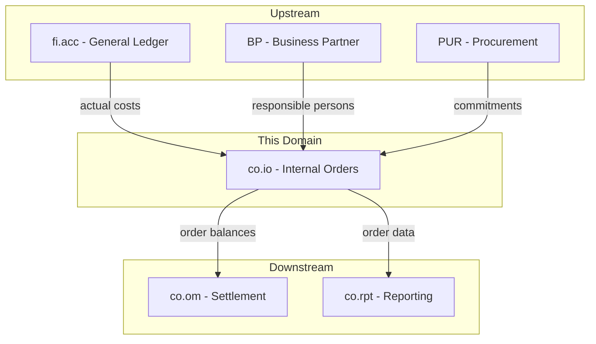
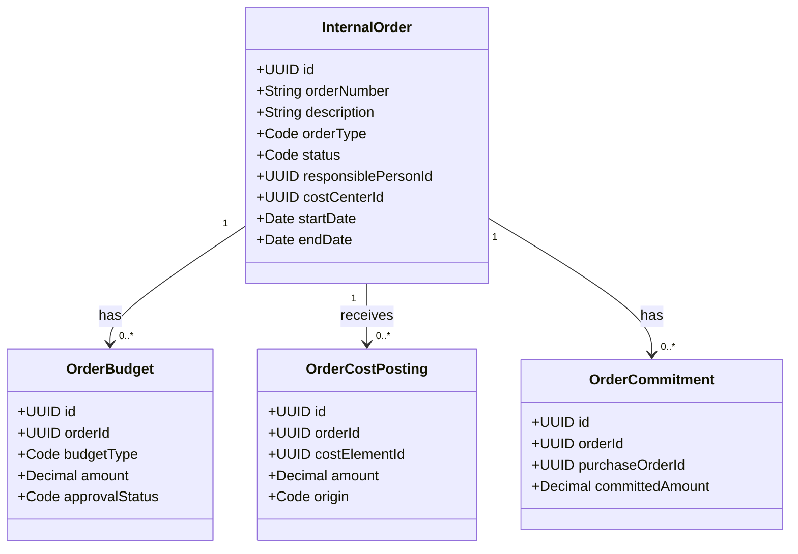
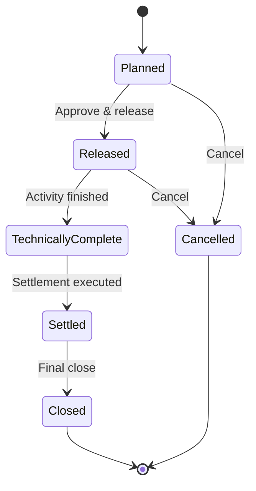
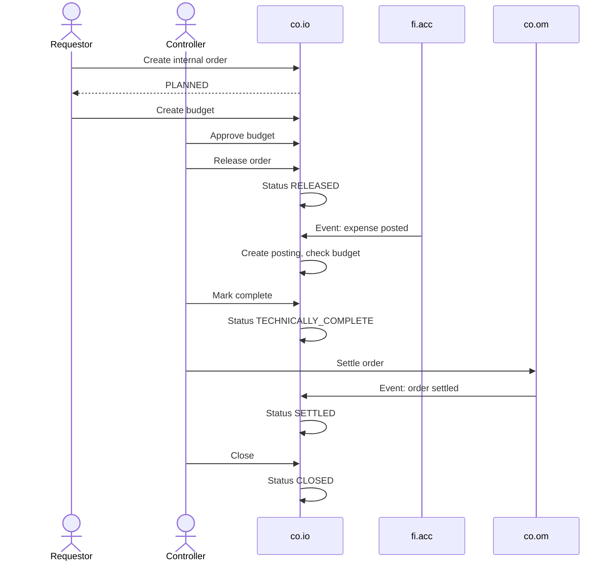
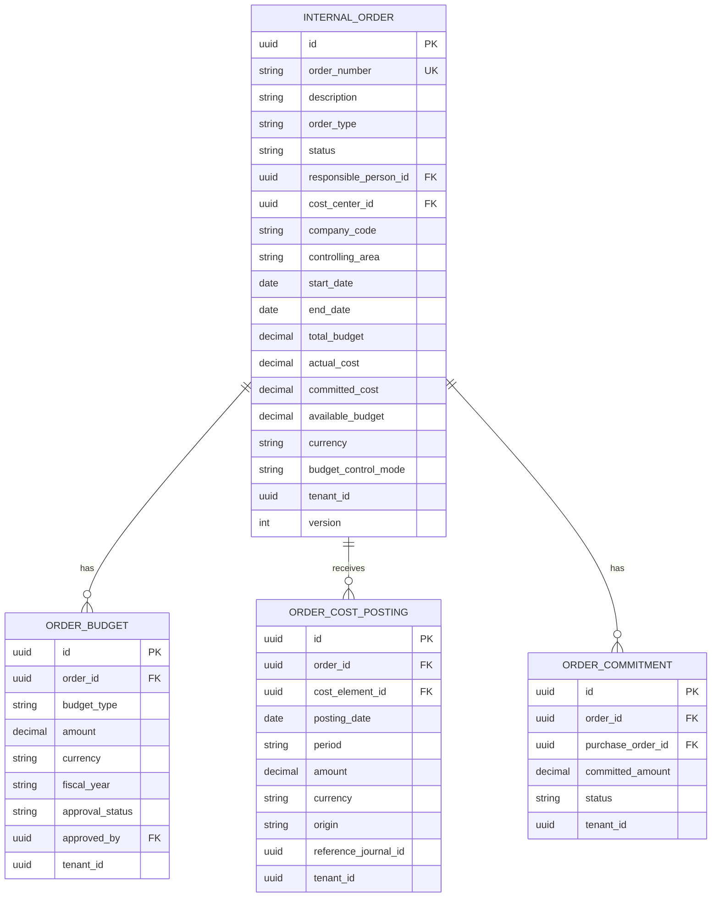

# CO - IO Internal Orders Domain / Service Specification

> **Conceptual Stack Layer:** Domain / Service
> **Space:** Platform
> **Owner:** Domain Engineering Team
> **Schema alignment:** `service-layer.schema.json`
> **Companion files:** `openapi.yaml`, `*.schema.json` (event contracts)
> **Referenced by:** Platform-Feature Spec SS5 (backend dependencies), BFF Contract
> **Belongs to:** CO Suite Spec (`_co_suite.md`)

> **Meta Information**
> - **Version:** 2026-04-01
> - **Template:** `domain-service-spec.md` v1.0.0
> - **Template Compliance:** ~82% — §11/§12/§13 stubs, §8 no column-level table defs
> - **Author(s):** OpenLeap Architecture Team
> - **Status:** DRAFT
> - **Suite:** `co`
> - **Domain:** `io`
> - **Bounded Context Ref:** `bc:internal-orders`
> - **Service ID:** `co-io-svc`
> - **basePackage:** `io.openleap.co.io`
> - **API Base Path:** `/api/co/io/v1`
> - **OpenLeap Starter Version:** `v1`
> - **Port:** TBD
> - **Repository:** TBD
> - **Tags:** `controlling`, `internal-order`, `budget`, `commitment`
> - **Team:**
>   - Name: `team-co`
>   - Email: `co-team@openleap.io`
>   - Slack: `#co-team`

---

## Specification Guidelines Compliance

>
> ### Non-Negotiables
> - Never invent facts. If required info is missing, add an **OPEN QUESTION** entry.
> - Preserve intent and decisions. Only change meaning when explicitly requested.
> - Do not remove normative constraints unless they are explicitly replaced.
> - Keep the spec **self-contained**: no "see chat", no implicit context.
>
> ### Style Guide
> - Prefer short sentences and lists.
> - Use MUST/SHOULD/MAY for normative statements.
> - Keep terminology consistent (Aggregate, Domain Service, Application Service, Command, Event).

---

## 0. Document Purpose & Scope

### 0.1 Purpose
This specification defines the Internal Orders (IO) domain, which manages temporary cost collectors for specific activities, events, projects, or capital investments. Internal orders accumulate costs over their lifetime and are eventually settled to permanent cost objects.

### 0.2 Target Audience
- Product Owners & Business Stakeholders
- System Architects & Technical Leads
- Integration Engineers

### 0.3 Scope
**In Scope:**
- Internal order master data management (lifecycle, types, budgets)
- Cost capture on orders from FI events
- Budget management (original, supplement, return, commitment)
- Order balance tracking and budget utilization
- Order completion and readiness for settlement

**Out of Scope:**
- Settlement execution (-> co.om)
- Cost center master data (-> co.cca)
- Product costing (-> co.pc)
- Project management (-> PS module)

### 0.4 Related Documents
- `_co_suite.md` - CO Suite overview
- `co_om-spec.md` - Overhead Management (settlement)
- `co_cca-spec.md` - Cost Center Accounting
- `fi_acc_core_spec_complete.md` - Financial Accounting
- `BP_business_partner.md` - Business Partner

---

## 1. Business Context

### 1.1 Domain Purpose
`co.io` provides **temporary cost collection** for defined activities. Unlike cost centers (permanent), internal orders have a defined start and end. They collect costs during their lifetime and are settled to permanent cost objects when complete. Examples: trade shows, IT projects, marketing campaigns, capital investments.

### 1.2 Business Value
- Precise cost tracking for specific activities and events
- Budget control with warnings and hard stops
- Commitment tracking (PO commitments before actual costs)
- Clear settlement trail from temporary to permanent objects

### 1.3 Key Stakeholders

| Role | Responsibility | Primary Use Cases |
|------|----------------|-------------------|
| Order Requestor | Request new internal orders | UC-001 |
| Cost Center Manager | Approve orders, monitor budget | UC-002, UC-004 |
| Controller | Manage lifecycle, trigger settlement | UC-003, UC-005 |
| Procurement | Create commitments against orders | UC-006 |

### 1.4 Strategic Positioning



### 1.5 Service Context

| Property | Value |
|----------|-------|
| **Suite** | `co` |
| **Domain** | `io` |
| **Bounded Context** | `bc:internal-orders` |
| **Service ID** | `co-io-svc` |
| **Base Package** | `io.openleap.co.io` |

**Responsibilities:**
- Internal order lifecycle management
- Budget management and approval workflow
- Cost posting capture from FI events
- Commitment tracking from procurement events
- Balance computation (budget, actual, committed, available)

**Authoritative Sources:**
| Source Type | Description | Access Pattern |
|-------------|-------------|----------------|
| REST API | Order master data, budgets, balances | Synchronous |
| Database | Internal orders, budgets, postings, commitments | Direct (owner) |
| Events | Order status changes, budget alerts | Asynchronous |

---

## 2. Service Identity

| Property | Value | Schema Field |
|----------|-------|-------------|
| **Service ID** | `co-io-svc` | `metadata.id` |
| **Display Name** | `Internal Orders` | `metadata.name` |
| **Suite** | `co` | `metadata.suite` |
| **Domain** | `io` | `metadata.domain` |
| **Bounded Context** | `bc:internal-orders` | `metadata.bounded_context_ref` |
| **Version** | `1.0.0` | `metadata.version` |
| **Status** | DRAFT | `metadata.status` |
| **API Base Path** | `/api/co/io/v1` | `metadata.api_base_path` |
| **Repository** | TBD | `metadata.repository` |
| **Tags** | `controlling`, `internal-order`, `budget` | `metadata.tags` |

**Team:**
| Property | Value |
|----------|-------|
| **Name** | `team-co` |
| **Email** | `co-team@openleap.io` |
| **Slack Channel** | `#co-team` |

---

## 3. Domain Model

### 3.1 Conceptual Overview
IO manages **Internal Orders** as cost collectors with defined budgets, **Order Budgets** for financial control, **Order Cost Postings** for actual costs, and **Commitments** for anticipated costs from purchase orders.

### 3.2 Core Concepts



### 3.3 Aggregate Definitions

#### 3.3.1 InternalOrder

| Property | Value |
|----------|-------|
| **Aggregate ID** | `agg:internal-order` |
| **Name** | `InternalOrder` |

**Business Purpose:** Temporary cost collector for a specific activity with defined start/end dates and a budget.

##### Aggregate Root

**Key Attributes:**
| Attribute | Type | Format | Description | Constraints | Required | Read-Only |
|-----------|------|--------|-------------|-------------|----------|-----------|
| id | string | uuid | Unique identifier | Immutable | Yes | Yes |
| orderNumber | string | — | Human-readable (e.g., "IO-2026-001") | unique per tenant | Yes | Yes |
| description | string | — | Purpose | max 500 chars | Yes | No |
| orderType | string | — | Functional type | enum: overhead, investment, revenue, accrual | Yes | No |
| status | string | — | Lifecycle state | enum_ref: `OrderStatus` | Yes | No |
| responsiblePersonId | string | uuid | FK to BP | — | Yes | No |
| costCenterId | string | uuid | Default settlement receiver | FK to co.cca | Yes | No |
| companyCode | string | — | Company | — | Yes | No |
| controllingArea | string | — | CO area | — | Yes | No |
| startDate | string | date | Planned start | — | Yes | No |
| endDate | string | date | Planned end | >= startDate | Yes | No |
| totalBudget | number | decimal | Sum of approved budgets | Computed, precision: 4 | Yes | Yes |
| actualCost | number | decimal | Sum of actual postings | Computed, precision: 4 | Yes | Yes |
| committedCost | number | decimal | Sum of open commitments | Computed, precision: 4 | Yes | Yes |
| availableBudget | number | decimal | totalBudget - actual - committed | Computed, precision: 4 | Yes | Yes |
| currency | string | — | ISO 4217 | 3 chars | Yes | No |
| budgetControlMode | string | — | Enforcement mode | enum: warning, hard_stop, none | Yes | No |
| tenantId | string | uuid | Tenant | — | Yes | Yes |
| version | integer | int64 | Optimistic lock | — | Yes | Yes |

**Lifecycle States:**

| Property | Value |
|----------|-------|
| **Initial State** | `Planned` |
| **Terminal States** | `Closed`, `Cancelled` |



**State Descriptions:**
| State | Description | Business Meaning |
|-------|-------------|------------------|
| Planned | Created, not released | Budget requested, no postings allowed |
| Released | Active for postings | Activity ongoing, costs can be posted |
| TechnicallyComplete | Activity finished | No new postings, ready for settlement |
| Settled | Costs distributed | Balance distributed via co.om |
| Closed | Fully closed | Historical, read-only |
| Cancelled | Order cancelled | No further activity |

**Invariants:**
| Rule ID | Description |
|---------|-------------|
| BR-001 | orderNumber MUST be unique per tenant |
| BR-002 | At least one approved OrderBudget MUST exist before Released |
| BR-003 | If budgetControlMode = hard_stop, reject postings exceeding availableBudget |
| BR-005 | No new postings after TechnicallyComplete |
| BR-007 | Cannot cancel if actual costs exist (reversal first) |
| BR-008 | Balance MUST be zero (settled) to close |
| BR-009 | endDate MUST be >= startDate |

**Domain Events Emitted:**
- `co.io.order.created`
- `co.io.order.statusChanged`
- `co.io.order.budgetExceeded`

#### 3.3.2 OrderBudget

| Property | Value |
|----------|-------|
| **Aggregate ID** | `agg:order-budget` |
| **Name** | `OrderBudget` |

**Business Purpose:** Financial authorization for an internal order.

**Key Attributes:**
| Attribute | Type | Format | Description | Constraints | Required | Read-Only |
|-----------|------|--------|-------------|-------------|----------|-----------|
| id | string | uuid | Unique identifier | — | Yes | Yes |
| orderId | string | uuid | FK to InternalOrder | — | Yes | No |
| budgetType | string | — | Type | enum: original, supplement, return | Yes | No |
| amount | number | decimal | Budget amount | precision: 4 | Yes | No |
| currency | string | — | Must match order | 3 chars | Yes | No |
| fiscalYear | string | — | Year | — | Yes | No |
| approvalStatus | string | — | State | enum: draft, submitted, approved, rejected | Yes | No |
| approvedBy | string | uuid | Approver | Required when approved | Conditional | No |
| tenantId | string | uuid | Tenant | — | Yes | Yes |

**Invariants:**
| Rule ID | Description |
|---------|-------------|
| BR-006 | Return MUST NOT make totalBudget negative |

### 3.4 Enumerations

#### OrderStatus

| Value | Description | Deprecated |
|-------|-------------|------------|
| `PLANNED` | Created, not yet released | No |
| `RELEASED` | Active for cost postings | No |
| `TECHNICALLY_COMPLETE` | Activity finished, no new postings | No |
| `SETTLED` | Costs distributed to receivers | No |
| `CLOSED` | Final, read-only | No |
| `CANCELLED` | Order cancelled | No |

### 3.5 Shared Types

> OPEN QUESTION: Content for this section has not been authored yet.

---

## 4. Business Rules & Constraints

### 4.1 Business Rules Catalog

| ID | Rule Name | Description | Scope | Enforcement | Error Code |
|----|-----------|-------------|-------|-------------|------------|
| BR-001 | Unique Order Number | orderNumber MUST be unique per tenant | InternalOrder | Create | `DUPLICATE_ORDER_NUMBER` |
| BR-002 | Budget for Release | Approved budget MUST exist before release | InternalOrder | Status transition | `NO_APPROVED_BUDGET` |
| BR-003 | Budget Hard Stop | Reject postings exceeding budget if mode = hard_stop | OrderCostPosting | Create | `BUDGET_EXCEEDED` |
| BR-004 | Budget Warning | Warn at 80%/90% utilization | OrderCostPosting | Create | — (warning) |
| BR-005 | No Post After Complete | Block postings after TechnicallyComplete | OrderCostPosting | Create | `ORDER_COMPLETE` |
| BR-006 | Return Limit | Return MUST NOT make totalBudget negative | OrderBudget | Create | `NEGATIVE_BUDGET` |
| BR-007 | Cancel Precondition | No actual costs for cancel | InternalOrder | Cancel | `ACTUAL_COSTS_EXIST` |
| BR-008 | Close Precondition | Zero balance for close | InternalOrder | Close | `NONZERO_BALANCE` |
| BR-009 | Date Validity | endDate MUST be >= startDate | InternalOrder | Create, Update | `INVALID_DATE_RANGE` |

### 4.2 Detailed Rule Definitions

#### BR-003: Budget Hard Stop

**Business Context:** Some orders have strict budget limits.

**Rule Statement:** If budgetControlMode = 'hard_stop' and (actualCost + committedCost + posting.amount) > totalBudget, the posting MUST be rejected.

**Error Handling:**
- **Error Code:** `BUDGET_EXCEEDED`
- **Error Message:** "Budget exceeded: available {available}, requested {amount}"
- **User action:** Request budget supplement or reduce scope

### 4.3 Data Validation Rules

| Field | Validation | Error Message |
|-------|-----------|---------------|
| description | Required, 1-500 chars | "Description is required" |
| orderType | Must be in allowed values | "Invalid order type" |
| startDate | Required | "Start date is required" |
| endDate | Required, >= startDate | "End date must be on or after start date" |
| budget amount | > 0 for original/supplement | "Budget amount must be positive" |

### 4.4 Reference Data Dependencies

| Catalog | Usage | Validation |
|---------|-------|------------|
| Currencies (ISO 4217) | Order/budget currency | Must exist and be active |
| Fiscal Calendar | Period for postings | Period must exist |

---

## 5. Use Cases

### 5.1 Business Logic Placement

| Logic Type | Placement | Examples |
|------------|-----------|----------|
| Aggregate invariants | Domain Object | Budget check, status transitions, date validation |
| Cross-aggregate logic | Domain Service | Balance computation, commitment reconciliation |
| Orchestration & transactions | Application Service | FI event processing, budget approval workflow |

### 5.2 Use Cases (Canonical Format)

#### UC-001: CreateInternalOrder

| Field | Value |
|-------|-------|
| **id** | `CreateInternalOrder` |
| **type** | WRITE |
| **trigger** | REST |
| **aggregate** | `InternalOrder` |
| **domainOperation** | `InternalOrder.create` |
| **inputs** | `description: String`, `orderType: Code`, `responsiblePersonId: UUID`, `costCenterId: UUID`, `companyCode: String`, `controllingArea: String`, `startDate: Date`, `endDate: Date`, `currency: String`, `budgetControlMode: Code` |
| **outputs** | `InternalOrder` |
| **events** | `Order.created` |
| **rest** | `POST /api/co/io/v1/orders` |
| **idempotency** | optional |
| **errors** | `DUPLICATE_ORDER_NUMBER`, `INVALID_DATE_RANGE` |

**Actor:** Order Requestor

**Main Flow:**
1. Submit order data
2. Validate references
3. Create in Planned status
4. Generate orderNumber
5. Publish event

#### UC-002: ApproveBudget

| Field | Value |
|-------|-------|
| **id** | `ApproveBudget` |
| **type** | WRITE |
| **trigger** | REST |
| **aggregate** | `OrderBudget` |
| **domainOperation** | `OrderBudget.approve` |
| **inputs** | `orderId: UUID`, `budgetId: UUID` |
| **outputs** | `OrderBudget` |
| **events** | — |
| **rest** | `POST /api/co/io/v1/orders/{orderId}/budgets/{budgetId}/approve` |
| **idempotency** | required |
| **errors** | `NO_APPROVED_BUDGET` |

**Actor:** Cost Center Manager / Controller

#### UC-003: ReleaseOrder

| Field | Value |
|-------|-------|
| **id** | `ReleaseOrder` |
| **type** | WRITE |
| **trigger** | REST |
| **aggregate** | `InternalOrder` |
| **domainOperation** | `InternalOrder.release` |
| **inputs** | `orderId: UUID` |
| **outputs** | `InternalOrder` |
| **events** | `Order.statusChanged` |
| **rest** | `POST /api/co/io/v1/orders/{id}/release` |
| **idempotency** | required |
| **errors** | `NO_APPROVED_BUDGET` |

**Actor:** Controller

#### UC-004: MonitorBudgetUtilization

| Field | Value |
|-------|-------|
| **id** | `MonitorBudgetUtilization` |
| **type** | READ |
| **trigger** | REST |
| **aggregate** | `InternalOrder` |
| **domainOperation** | `getOrderBalance` |
| **inputs** | `orderId: UUID` |
| **outputs** | `OrderBalanceDTO` |
| **rest** | `GET /api/co/io/v1/orders/{id}` |
| **idempotency** | none |
| **errors** | — |

**Actor:** Cost Center Manager

#### UC-005: CompleteAndPrepareForSettlement

| Field | Value |
|-------|-------|
| **id** | `CompleteAndPrepareForSettlement` |
| **type** | WRITE |
| **trigger** | REST |
| **aggregate** | `InternalOrder` |
| **domainOperation** | `InternalOrder.complete` |
| **inputs** | `orderId: UUID` |
| **outputs** | `InternalOrder` |
| **events** | `Order.statusChanged` |
| **rest** | `POST /api/co/io/v1/orders/{id}/complete` |
| **idempotency** | required |
| **errors** | — |

**Actor:** Controller

#### UC-006: RecordCommitment

| Field | Value |
|-------|-------|
| **id** | `RecordCommitment` |
| **type** | WRITE |
| **trigger** | Message |
| **aggregate** | `OrderCommitment` |
| **domainOperation** | `OrderCommitment.create` |
| **inputs** | `orderId: UUID`, `purchaseOrderId: UUID`, `committedAmount: Decimal` |
| **outputs** | `OrderCommitment` |
| **events** | — |
| **rest** | — (event-driven) |
| **idempotency** | required |
| **errors** | `BUDGET_EXCEEDED` (if hard_stop) |

**Actor:** System (PUR event)

### 5.3 Process Flow Diagrams



### 5.4 Cross-Domain Workflows

**Does this domain participate in multi-service workflows?** [x] YES [ ] NO

#### Workflow: Internal Order Settlement

**Business Purpose:** Distribute accumulated order costs to permanent receivers.

**Orchestration Pattern:** [x] Choreography (EDA) [ ] Orchestration (Saga)

**Pattern Rationale:** co.om drives settlement. co.io passively provides data and reacts to completion.

---

## 6. REST API

### 6.1 API Overview
**Base Path:** `/api/co/io/v1`
**Authentication:** OAuth2/JWT
**Authorization:** `co.io:read`, `co.io:write`, `co.io:admin`

### 6.2 Resource Operations

#### 6.2.1 Internal Orders - CRUD

```http
POST /api/co/io/v1/orders
GET /api/co/io/v1/orders/{id}
PATCH /api/co/io/v1/orders/{id}
GET /api/co/io/v1/orders?page=0&size=50&status=RELEASED&orderType=overhead
```

**Create Request:**
```json
{
  "description": "Marketing Campaign Q2 2026",
  "orderType": "overhead",
  "responsiblePersonId": "uuid-bp-001",
  "costCenterId": "uuid-cc-mkt",
  "companyCode": "1000",
  "controllingArea": "CA01",
  "startDate": "2026-04-01",
  "endDate": "2026-06-30",
  "currency": "EUR",
  "budgetControlMode": "warning"
}
```

**Create Response:** `201 Created`
```json
{
  "id": "uuid-io-001",
  "orderNumber": "IO-2026-001",
  "status": "PLANNED",
  "totalBudget": 0.00,
  "actualCost": 0.00,
  "committedCost": 0.00,
  "availableBudget": 0.00,
  "_links": {
    "self": { "href": "/api/co/io/v1/orders/uuid-io-001" },
    "budgets": { "href": "/api/co/io/v1/orders/uuid-io-001/budgets" },
    "postings": { "href": "/api/co/io/v1/orders/uuid-io-001/postings" }
  }
}
```

#### 6.2.2 Order Budgets

```http
POST /api/co/io/v1/orders/{orderId}/budgets
GET /api/co/io/v1/orders/{orderId}/budgets
```

#### 6.2.3 Order Postings (read-only)

```http
GET /api/co/io/v1/orders/{orderId}/postings?period=2026-02
```

### 6.3 Business Operations

#### Release Order
```http
POST /api/co/io/v1/orders/{id}/release
If-Match: "{version}"
```

#### Complete Order
```http
POST /api/co/io/v1/orders/{id}/complete
If-Match: "{version}"
```

#### Cancel Order
```http
POST /api/co/io/v1/orders/{id}/cancel
If-Match: "{version}"
```

#### Close Order
```http
POST /api/co/io/v1/orders/{id}/close
If-Match: "{version}"
```

#### Approve Budget
```http
POST /api/co/io/v1/orders/{orderId}/budgets/{budgetId}/approve
```

### 6.4 OpenAPI Specification
**Location:** `contracts/http/co/io/openapi.yaml`

---

## 7. Events & Integration

### 7.1 Event-Driven Architecture Pattern
**Pattern Used:** [x] Event-Driven (Choreography) [ ] Orchestration (Saga) [ ] Hybrid

**Follows Suite Pattern:** [x] YES [ ] NO

**Message Broker:** `RabbitMQ`

### 7.2 Published Events
**Exchange:** `co.io.events` (topic)

#### Event: Order.created
**Routing Key:** `co.io.order.created`

#### Event: Order.statusChanged
**Routing Key:** `co.io.order.statusChanged`
**Payload:**
```json
{
  "aggregateType": "co.io.order",
  "changeType": "statusChanged",
  "entityIds": ["uuid-io-001"],
  "data": {
    "orderNumber": "IO-2026-001",
    "previousStatus": "RELEASED",
    "newStatus": "TECHNICALLY_COMPLETE"
  }
}
```
**Known Consumers:**
| Consumer | Purpose | Processing |
|----------|---------|------------|
| co-om-svc | Settlement readiness | Async/Immediate |
| co-rpt-svc | Order dashboards | Async/Immediate |

#### Event: Order.budgetExceeded
**Routing Key:** `co.io.order.budgetExceeded`
**Known Consumers:**
| Consumer | Purpose |
|----------|---------|
| co-rpt-svc | Budget alert reports |
| notification-svc | Alert responsible person |

### 7.3 Consumed Events

#### fi.acc.expense.posted (with order reference)
**Source:** `fi-acc-svc`
**Purpose:** Receive actual costs assigned to internal orders
**Queue:** `co.io.in.fi.acc.expense`

#### pur.commitment.created / pur.commitment.invoiced
**Source:** `pur`
**Purpose:** Track PO commitments
**Queue:** `co.io.in.pur.commitment`

#### co.om.order.settled
**Source:** `co-om-svc`
**Purpose:** Mark order as settled
**Queue:** `co.io.in.co.om.settlement`

### 7.4 Integration Points Summary

**Upstream:**
| Service | Purpose | Type | Fallback |
|---------|---------|------|----------|
| fi.acc | Actual costs | Events | DLQ retry |
| pur | Commitments | Events | DLQ retry |
| BP | Responsible persons | REST + Cache | Cached |

**Downstream:**
| Service | Purpose | Type | SLA |
|---------|---------|------|-----|
| co.om | Order balances | REST API | < 100ms |
| co.rpt | Order reports | Events | Best effort |

---

## 8. Data Model

### 8.1 Conceptual Data Model



### 8.2 Entity Definitions

**Indexes:**
- InternalOrder PK: `id`, Unique: `(tenant_id, order_number)`
- OrderCostPosting: Unique `(tenant_id, reference_journal_id)` WHERE origin='fi_actual'

### 8.3 Reference Data Dependencies

**External:** currencies, fiscal_calendars (ref-data-svc)
**Internal:** order_type, order_status, budget_type, budget_control_mode

---

## 9. Security & Compliance

### 9.1 Data Classification

| Data Element | Classification | Protection |
|--------------|----------------|------------|
| Order Amounts | Confidential | Encryption, RBAC, audit |
| Budget Data | Confidential | Encryption, RBAC |
| Responsible Person | Confidential | PII protection |

### 9.2 Access Control

| Role | Read Own | Read All | Create | Release | Admin |
|------|---------|---------|--------|---------|-------|
| CO_IO_VIEWER | Yes | No | No | No | No |
| CO_IO_REQUESTOR | Yes | No | Yes | No | No |
| CO_IO_CONTROLLER | Yes | Yes | Yes | Yes | No |
| CO_IO_ADMIN | Yes | Yes | Yes | Yes | Yes |

### 9.3 Compliance Requirements

| Regulation | Requirement | Implementation |
|-----------|-------------|----------------|
| SOX | Budget approvals audited, postings immutable | Full audit trail on approvals and postings |
| Internal Audit | Full lifecycle audit trail | All status changes logged |

---

## 10. Quality Attributes

### 10.1 Performance Requirements

| Operation | Target (p95) |
|-----------|-------------|
| Read order | < 50ms |
| Create order | < 100ms |
| Budget check | < 30ms |
| List orders | < 200ms |

### 10.2 Availability & Reliability

**Availability:** 99.9% | **RTO:** < 15 min | **RPO:** < 5 min

### 10.3 Scalability

- Active orders per tenant: ~50,000
- Postings per month: ~100,000

---

## 11. Feature Dependencies

> OPEN QUESTION: Content for this section has not been authored yet.

---

## 12. Extension Points

> OPEN QUESTION: Content for this section has not been authored yet.

---

## 13. Migration & Evolution

| Source | Target | Issues |
|--------|--------|--------|
| Legacy orders | InternalOrder | Status mapping, budget reconstruction |
| Legacy costs | OrderCostPosting | Period format, element mapping |

---

## 14. Decisions & Open Questions

### 14.1 Open Questions

| ID | Question | Impact | Needed By |
|----|----------|--------|-----------|
| Q-001 | Support statistical orders (no budget)? | Data model | Phase 1 |
| Q-002 | PS integration for project orders? | Scope | Phase 2 |

### 14.2 Architectural Decision Records (ADRs)

#### ADR-IO-001: Computed Balance Fields

**Status:** Accepted

**Decision:** totalBudget, actualCost, committedCost are stored denormalized on InternalOrder, updated transactionally.

**Consequences:**
| Positive | Negative |
|----------|----------|
| Fast budget checks (<30ms) | Drift risk mitigated by periodic reconciliation |

---

## 15. Appendix

### 15.1 Glossary

| Term | Definition | Aliases |
|------|------------|---------|
| Internal Order | Temporary cost collector | Innenauftrag |
| Commitment | Anticipated cost from PO | Obligo |
| Settlement | Cost distribution to receivers | Abrechnung |

### 15.2 Change Log

| Date | Version | Author | Changes |
|------|---------|--------|---------|
| 2026-02-23 | 1.0 | OpenLeap Architecture Team | Initial version |
| 2026-04-01 | 1.1 | OpenLeap Architecture Team | Restructured to template compliance (sections 0-15) |

### 15.3 Review & Approval

**Status:** DRAFT
