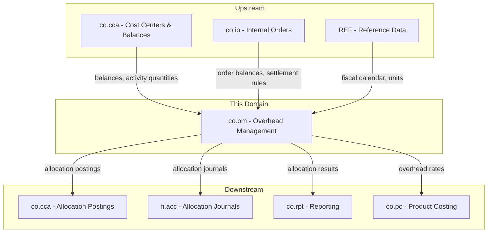
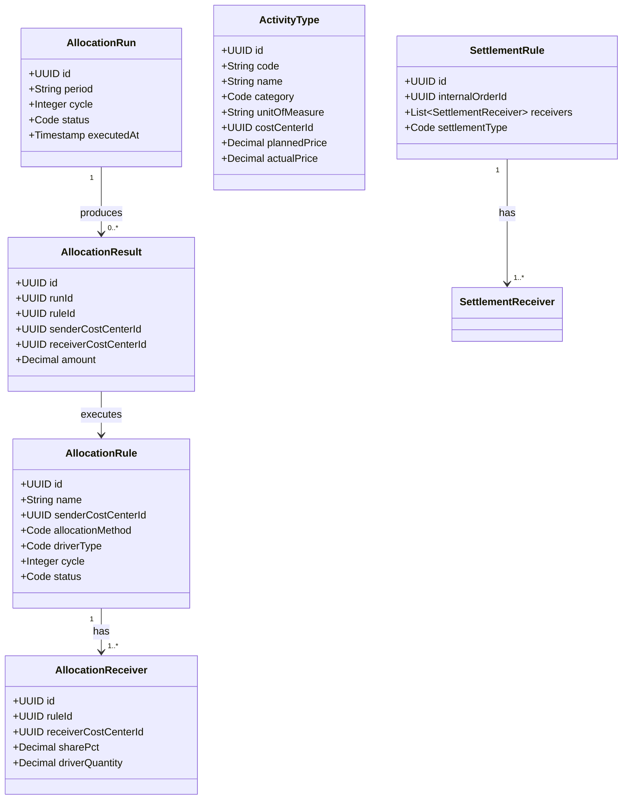
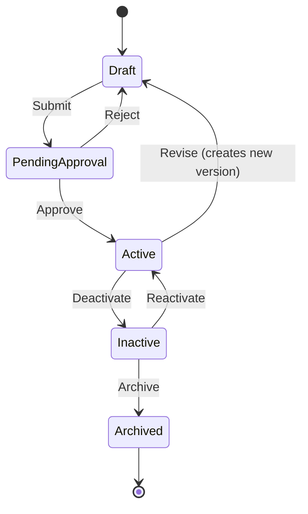
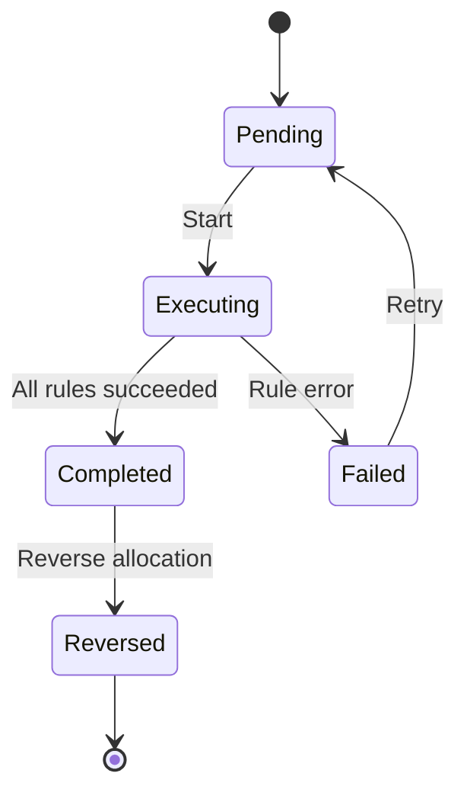
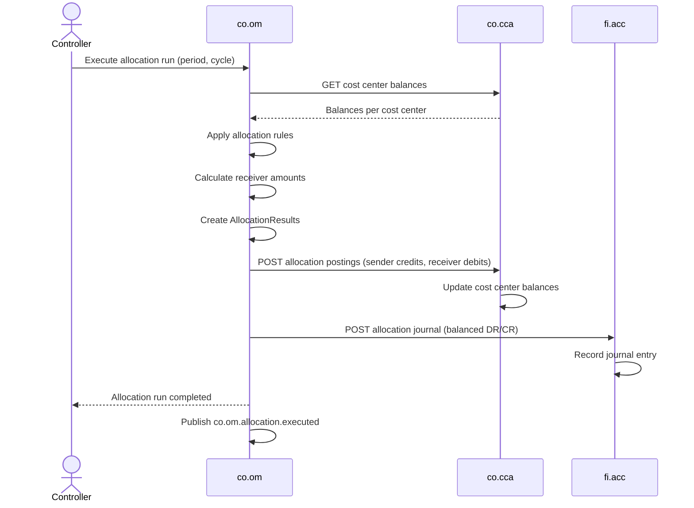
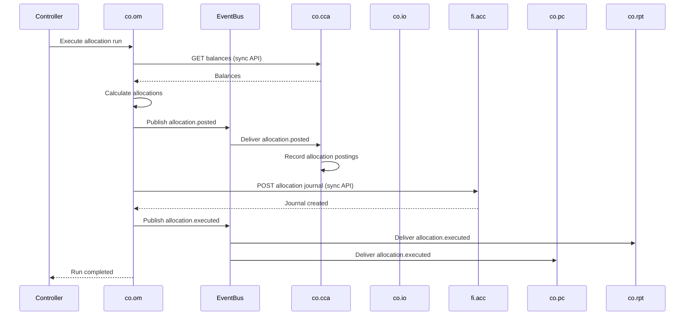
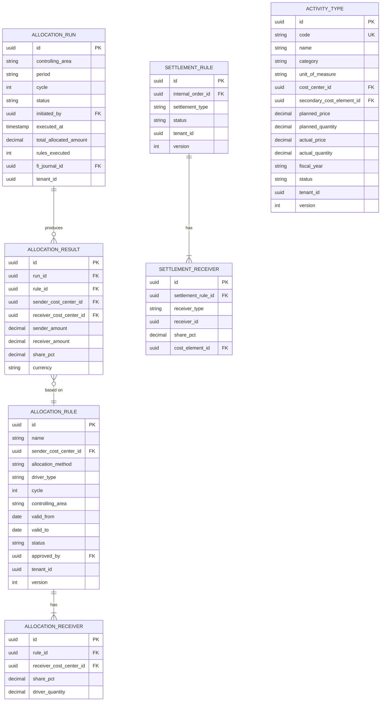

# CO - OM Overhead Management Domain / Service Specification

> **Conceptual Stack Layer:** Domain / Service
> **Space:** Platform
> **Owner:** Domain Engineering Team
> **Schema alignment:** `service-layer.schema.json`
> **Companion files:** `openapi.yaml`, `*.schema.json` (event contracts)
> **Referenced by:** Platform-Feature Spec SS5 (backend dependencies), BFF Contract
> **Belongs to:** CO Suite Spec (`_co_suite.md`)

> **Meta Information**
> - **Version:** 2026-04-04
> - **Template:** `domain-service-spec.md` v1.0.0
> - **Template Compliance:** ~95% — §11 feature register pending feature specs, §12 extension candidates are indicative
> - **Author(s):** OpenLeap Architecture Team
> - **Status:** DRAFT
> - **Suite:** `co`
> - **Domain:** `om`
> - **Bounded Context Ref:** `bc:overhead-management`
> - **Service ID:** `co-om-svc`
> - **basePackage:** `io.openleap.co.om`
> - **API Base Path:** `/api/co/om/v1`
> - **OpenLeap Starter Version:** `v1`
> - **Port:** TBD
> - **Repository:** TBD
> - **Tags:** `controlling`, `allocation`, `settlement`, `activity-type`
> - **Team:**
>   - Name: `team-co`
>   - Email: `co-team@openleap.io`
>   - Slack: `#co-team`

---

## Specification Guidelines Compliance

> ### Non-Negotiables
> - Never invent facts. If required info is missing, add an **OPEN QUESTION** entry.
> - Preserve intent and decisions. Only change meaning when explicitly requested.
> - Do not remove normative constraints unless they are explicitly replaced.
> - Keep the spec **self-contained**: no "see chat", no implicit context.
>
> ### Source of Truth Priority
> When sources conflict:
> 1. Spec (explicit) wins
> 2. Starter specs (implementation constraints) next
> 3. Guidelines (best practices) last
>
> Record conflicts in the **Decisions & Conflicts** section (see Section 14).
>
> ### Style Guide
> - Prefer short sentences and lists.
> - Use MUST/SHOULD/MAY for normative statements.
> - Keep terminology consistent (Aggregate, Domain Service, Application Service, Command, Event).
> - Avoid ambiguous words ("often", "maybe") unless explicitly noting uncertainty.
> - Keep examples minimal and clearly marked as examples.
> - Do not add implementation code unless the chapter explicitly requires it.

---

## 0. Document Purpose & Scope

### 0.1 Purpose
This specification defines the Overhead Management (OM) domain, which handles cost allocations, activity type management, activity price calculation, and internal order settlements. OM is the central processing engine within the CO Suite that distributes indirect costs from service cost centers to consuming cost objects.

### 0.2 Target Audience
- Product Owners & Business Stakeholders
- System Architects & Technical Leads
- Integration Engineers

### 0.3 Scope
**In Scope:**
- Allocation rule management (direct, driver-based, step-down, reciprocal)
- Allocation cycle execution (periodic runs)
- Activity type definitions and activity price calculation
- Internal order settlement execution
- Allocation journal creation and posting to FI
- Allocation reversal

**Out of Scope:**
- Cost center master data (-> co.cca)
- Internal order master data (-> co.io)
- Product cost calculation (-> co.pc)
- Management report generation (-> co.rpt)
- GL posting logic (-> fi.acc)

### 0.4 Related Documents
- `_co_suite.md` - CO Suite overview
- `co_cca-spec.md` - Cost Center Accounting
- `co_io-spec.md` - Internal Orders
- `co_pc-spec.md` - Product Costing
- `fi_acc_core_spec_complete.md` - Financial Accounting

---

## 1. Business Context

### 1.1 Domain Purpose
`co.om` is the **cost distribution engine** of the CO Suite. It takes indirect costs collected on service cost centers and distributes them to the cost objects that consumed those resources. It also manages activity types (machine hours, labor hours) to enable consumption-based charging between cost centers, and settles temporary cost collectors (internal orders) to their final receivers.

### 1.2 Business Value
- Fair distribution of overhead costs using configurable rules
- Activity-based charging for transparent internal service pricing
- Automated periodic allocation runs (reduce manual effort)
- Settlement of project/event costs to appropriate receivers
- Balanced allocation journals posted to FI for reconciliation

### 1.3 Key Stakeholders

| Role | Responsibility | Primary Use Cases |
|------|----------------|-------------------|
| Controller | Define allocation rules, execute allocation runs | UC-001, UC-003, UC-005 |
| Cost Center Manager | Review allocation results, validate activity prices | UC-004 |
| CFO | Approve allocation methodology | UC-001 |
| FI Accountant | Verify allocation journals in GL | UC-006 |

### 1.4 Strategic Positioning



### 1.5 Service Context

| Property | Value |
|----------|-------|
| **Suite** | `co` |
| **Domain** | `om` |
| **Bounded Context** | `bc:overhead-management` |
| **Service ID** | `co-om-svc` |
| **Base Package** | `io.openleap.co.om` |

**Responsibilities:**
- Allocation rule lifecycle management with approval workflow
- Periodic allocation run execution (sequential cycles)
- Activity type and activity price management
- Internal order settlement execution
- Allocation journal creation for FI
- Allocation reversal (compensation)

**Authoritative Sources:**
| Source Type | Description | Access Pattern |
|-------------|-------------|----------------|
| REST API | Allocation rules, activity types, run results | Synchronous |
| Database | Rules, runs, results, activity types, settlement rules | Direct (owner) |
| Events | Allocation executed, order settled, activity prices | Asynchronous |

---

## 2. Service Identity

| Property | Value | Schema Field |
|----------|-------|-------------|
| **Service ID** | `co-om-svc` | `metadata.id` |
| **Display Name** | `Overhead Management` | `metadata.name` |
| **Suite** | `co` | `metadata.suite` |
| **Domain** | `om` | `metadata.domain` |
| **Bounded Context** | `bc:overhead-management` | `metadata.bounded_context_ref` |
| **Version** | `1.0.0` | `metadata.version` |
| **Status** | DRAFT | `metadata.status` |
| **API Base Path** | `/api/co/om/v1` | `metadata.api_base_path` |
| **Repository** | TBD | `metadata.repository` |
| **Tags** | `controlling`, `allocation`, `settlement` | `metadata.tags` |

**Team:**
| Property | Value |
|----------|-------|
| **Name** | `team-co` |
| **Email** | `co-team@openleap.io` |
| **Slack Channel** | `#co-team` |

---

## 3. Domain Model

### 3.1 Conceptual Overview
OM manages four core concepts: **Allocation Rules** define how to distribute costs, **Allocation Runs** execute those rules for a period, **Activity Types** define internal service outputs with calculated prices, and **Settlement Rules** define how internal order costs flow to final receivers.

### 3.2 Core Concepts



### 3.3 Aggregate Definitions

#### 3.3.1 AllocationRule

| Property | Value |
|----------|-------|
| **Aggregate ID** | `agg:allocation-rule` |
| **Name** | `AllocationRule` |

**Business Purpose:** Defines how indirect costs from a sender cost center are distributed to one or more receiver cost objects. Rules are versioned and effective-dated.

##### Aggregate Root

**Key Attributes:**
| Attribute | Type | Format | Description | Constraints | Required | Read-Only |
|-----------|------|--------|-------------|-------------|----------|-----------|
| id | string | uuid | Unique identifier | Immutable | Yes | Yes |
| name | string | — | Descriptive rule name (e.g., "IT Cost Allocation Q1") | max 255 chars | Yes | No |
| senderCostCenterId | string | uuid | FK to co.cca cost center that provides costs | Must be active CC | Yes | No |
| allocationMethod | string | — | How costs are distributed among receivers | enum_ref: `AllocationMethod` | Yes | No |
| driverType | string | — | Measurable factor used to split costs when method is driver_based | enum_ref: `DriverType` | Conditional | No |
| costElementFilter | array | uuid[] | Restrict allocation to specific cost elements; empty means all | — | No | No |
| cycle | integer | int32 | Execution order within a period; lower cycles run first in step-down allocation | minimum: 1 | Yes | No |
| controllingArea | string | — | Organizational boundary for CO operations | max 10 chars | Yes | No |
| validFrom | string | date | Effective start date of this rule | — | Yes | No |
| validTo | string | date | Effective end date; null means open-ended | minimum: validFrom | No | No |
| status | string | — | Current lifecycle state | enum_ref: `RuleStatus` | Yes | No |
| approvedBy | string | uuid | Business partner ID of the approver | Required when status = active | Conditional | No |
| approvedAt | string | date-time | Timestamp of approval | Set on approval | No | Yes |
| tenantId | string | uuid | Tenant ownership for RLS | — | Yes | Yes |
| version | integer | int64 | Optimistic locking version | — | Yes | Yes |
| createdAt | string | date-time | Creation timestamp | — | Yes | Yes |
| updatedAt | string | date-time | Last modification timestamp | — | Yes | Yes |

**Lifecycle States:**



**State Descriptions:**
| State | Description | Business Meaning |
|-------|-------------|------------------|
| Draft | Initial creation or revision state | Rule is being defined; not eligible for execution |
| PendingApproval | Submitted for review | Awaiting CFO or authorized controller approval per SOX requirements |
| Active | Approved and operational | Eligible for inclusion in allocation runs |
| Inactive | Temporarily suspended | Excluded from allocation runs but can be reactivated |
| Archived | Terminal state | Historical record; read-only, cannot be reactivated |

**Allowed Transitions:**
| From State | To State | Trigger | Guard / Business Preconditions |
|------------|----------|---------|-------------------------------|
| Draft | PendingApproval | Submit for approval | All mandatory fields filled, receivers defined, BR-001 satisfied |
| PendingApproval | Active | Approve | Approver has CO_OM_ADMIN or CFO role |
| PendingApproval | Draft | Reject | Rejection reason provided |
| Active | Inactive | Deactivate | No in-progress allocation runs reference this rule |
| Active | Draft | Revise | Creates a new version; original remains active until new version is approved |
| Inactive | Active | Reactivate | Original preconditions still valid, rule not expired |
| Inactive | Archived | Archive | Inactive for > 90 days or manual archive |

**Invariants:**
| Rule ID | Description |
|---------|-------------|
| BR-001 | Receiver shares MUST sum to 100% |
| BR-002 | Sender MUST NOT appear as receiver |
| BR-007 | Rules MUST be approved before execution |

**Domain Events Emitted:**
- `co.om.allocationRule.created`
- `co.om.allocationRule.updated`
- `co.om.allocationRule.statusChanged`

##### Child Entities

###### Entity: AllocationReceiver

| Property | Value |
|----------|-------|
| **Entity ID** | `ent:allocation-receiver` |
| **Name** | `AllocationReceiver` |
| **Relationship to Root** | one_to_many |

**Business Purpose:** Defines a single receiver cost center (or cost object) and its share within an allocation rule. Each rule distributes costs to one or more receivers based on percentage or driver quantity.

**Attributes:**
| Attribute | Type | Format | Description | Constraints | Required |
|-----------|------|--------|-------------|-------------|----------|
| id | string | uuid | Unique identifier | — | Yes |
| ruleId | string | uuid | FK to parent AllocationRule | — | Yes |
| receiverCostCenterId | string | uuid | FK to co.cca receiving cost center | Must be active CC | Yes |
| sharePct | number | decimal | Percentage share of allocation (when method = direct_percentage) | precision: 4, range: 0.01–100.00 | Conditional |
| driverQuantity | number | decimal | Driver quantity for this receiver (when method = driver_based) | precision: 4, >= 0 | Conditional |

**Collection Constraints:**
- Minimum items: 1
- Maximum items: 100

**Invariants:**
| Rule ID | Description |
|---------|-------------|
| BR-001 | All receiver sharePct values MUST sum to 100.00 |
| BR-002 | receiverCostCenterId MUST NOT equal the parent rule's senderCostCenterId |

##### Value Objects

###### Value Object: Money

| Property | Value |
|----------|-------|
| **VO ID** | `vo:money` |
| **Name** | `Money` |

**Description:** Represents a monetary amount with currency, used for allocation amounts, activity prices, and settlement amounts.

**Attributes:**
| Attribute | Type | Format | Description | Constraints |
|-----------|------|--------|-------------|-------------|
| amount | number | decimal | Monetary value | precision: 4 |
| currencyCode | string | — | ISO 4217 currency code | pattern: `^[A-Z]{3}$` |

**Validation Rules:**
- amount MUST be non-negative for allocation results
- currencyCode MUST be a valid, active ISO 4217 code

#### 3.3.2 AllocationRun

| Property | Value |
|----------|-------|
| **Aggregate ID** | `agg:allocation-run` |
| **Name** | `AllocationRun` |

**Business Purpose:** A single execution of allocation rules for a given period and cycle. Tracks the overall result and links to individual allocation results and the posted FI journal.

##### Aggregate Root

**Key Attributes:**
| Attribute | Type | Format | Description | Constraints | Required | Read-Only |
|-----------|------|--------|-------------|-------------|----------|-----------|
| id | string | uuid | Unique identifier | Immutable | Yes | Yes |
| controllingArea | string | — | CO area boundary | max 10 chars | Yes | No |
| period | string | — | Fiscal period in format YYYY-MM | pattern: `^\d{4}-\d{2}$` | Yes | No |
| cycle | integer | int32 | Which allocation cycle within the period | minimum: 1 | Yes | No |
| status | string | — | Run lifecycle state | enum_ref: `RunStatus` | Yes | No |
| initiatedBy | string | uuid | User who started the run | — | Yes | No |
| executedAt | string | date-time | Timestamp when execution completed | Set on completion | No | Yes |
| totalAllocatedAmount | number | decimal | Sum of all allocation amounts in base currency | Computed | No | Yes |
| rulesExecuted | integer | int32 | Number of rules processed in this run | Computed | No | Yes |
| fiJournalId | string | uuid | FK to fi.acc journal entry created for this run | Set after FI posting | No | Yes |
| dryRun | boolean | — | Whether this was a simulation run (no postings) | — | Yes | No |
| tenantId | string | uuid | Tenant ownership for RLS | — | Yes | Yes |
| version | integer | int64 | Optimistic locking version | — | Yes | Yes |
| createdAt | string | date-time | Creation timestamp | — | Yes | Yes |
| updatedAt | string | date-time | Last modification timestamp | — | Yes | Yes |

**Lifecycle States:**



**State Descriptions:**
| State | Description | Business Meaning |
|-------|-------------|------------------|
| Pending | Run created, awaiting execution | Queued for processing |
| Executing | Currently processing allocation rules | System is calculating and distributing costs |
| Completed | All rules processed successfully | Allocation postings created, FI journal posted |
| Failed | One or more rules encountered errors | No postings created; safe to retry |
| Reversed | Previously completed run has been reversed | Compensation postings created; original postings negated |

**Allowed Transitions:**
| From State | To State | Trigger | Guard / Business Preconditions |
|------------|----------|---------|-------------------------------|
| Pending | Executing | Start execution | BR-003 (previous cycle completed), BR-004 (period open), BR-005 (no duplicate) |
| Executing | Completed | All rules succeed | BR-006 (balanced allocation) |
| Executing | Failed | Rule error | Error logged with details |
| Failed | Pending | Retry | Error condition resolved |
| Completed | Reversed | Reverse command | BR-004 (period still open), reversal reason provided |

**Invariants:**
| Rule ID | Description |
|---------|-------------|
| BR-003 | Cycle N MUST NOT execute until cycle N-1 is Completed |
| BR-004 | Period MUST be open |
| BR-005 | Only one completed run per (area, period, cycle) |
| BR-006 | Sum of receiver amounts MUST equal sender amount |

**Domain Events Emitted:**
- `co.om.allocation.executed`
- `co.om.allocation.posted`
- `co.om.allocation.reversed`

##### Child Entities

###### Entity: AllocationResult

| Property | Value |
|----------|-------|
| **Entity ID** | `ent:allocation-result` |
| **Name** | `AllocationResult` |
| **Relationship to Root** | one_to_many |

**Business Purpose:** Records the outcome of applying a single allocation rule within a run. Captures the sender amount, each receiver's share, and the currency.

**Attributes:**
| Attribute | Type | Format | Description | Constraints | Required |
|-----------|------|--------|-------------|-------------|----------|
| id | string | uuid | Unique identifier | — | Yes |
| runId | string | uuid | FK to parent AllocationRun | — | Yes |
| ruleId | string | uuid | FK to AllocationRule that was executed | — | Yes |
| senderCostCenterId | string | uuid | Cost center that provided costs | — | Yes |
| receiverCostCenterId | string | uuid | Cost center that received costs | — | Yes |
| senderAmount | number | decimal | Total amount taken from sender for this rule | precision: 4 | Yes |
| receiverAmount | number | decimal | Amount credited to this receiver | precision: 4 | Yes |
| sharePct | number | decimal | Effective percentage applied | precision: 4 | Yes |
| currency | string | — | ISO 4217 currency code | pattern: `^[A-Z]{3}$` | Yes |

**Collection Constraints:**
- Minimum items: 0 (run may have no results if all sender balances are zero)
- Maximum items: unbounded

**Invariants:**
| Rule ID | Description |
|---------|-------------|
| BR-006 | Sum of receiverAmount across all results for one rule MUST equal senderAmount |
| BR-010 | Last receiver absorbs rounding difference |

#### 3.3.3 ActivityType

| Property | Value |
|----------|-------|
| **Aggregate ID** | `agg:activity-type` |
| **Name** | `ActivityType` |

**Business Purpose:** Defines a unit of output from a cost center (e.g., machine hours, labor hours). Enables consumption-based internal charging between cost centers. The planned price is set manually; the actual price is computed as total cost center cost divided by actual output quantity.

##### Aggregate Root

**Key Attributes:**
| Attribute | Type | Format | Description | Constraints | Required | Read-Only |
|-----------|------|--------|-------------|-------------|----------|-----------|
| id | string | uuid | Unique identifier | Immutable | Yes | Yes |
| code | string | — | Activity code (e.g., "ACT-MH-001") | unique per controlling area, max 20 chars | Yes | No |
| name | string | — | Descriptive name (e.g., "CNC Machine Hours") | max 255 chars | Yes | No |
| category | string | — | Type of activity output | enum_ref: `ActivityCategory` | Yes | No |
| unitOfMeasure | string | — | Output unit (e.g., "h", "km", "pcs") | valid UCUM code | Yes | No |
| costCenterId | string | uuid | FK to co.cca providing cost center | Must be active CC | Yes | No |
| secondaryCostElementId | string | uuid | Secondary cost element used for internal charges | Must be secondary type | Yes | No |
| plannedPrice | number | decimal | Planned rate per unit for the fiscal year | precision: 4, >= 0 | Yes | No |
| plannedQuantity | number | decimal | Planned output quantity for the fiscal year | precision: 4, > 0 | Yes | No |
| actualPrice | number | decimal | Computed actual rate (total CC cost / actual quantity) | Computed, precision: 4 | No | Yes |
| actualQuantity | number | decimal | Actual output quantity reported during the period | precision: 4, >= 0 | No | No |
| fiscalYear | string | — | Year for which prices are calculated | pattern: `^\d{4}$` | Yes | No |
| controllingArea | string | — | CO area boundary | max 10 chars | Yes | No |
| status | string | — | Lifecycle state | enum_ref: `ActivityTypeStatus` | Yes | No |
| tenantId | string | uuid | Tenant ownership for RLS | — | Yes | Yes |
| version | integer | int64 | Optimistic locking version | — | Yes | Yes |
| createdAt | string | date-time | Creation timestamp | — | Yes | Yes |
| updatedAt | string | date-time | Last modification timestamp | — | Yes | Yes |

**State Descriptions:**
| State | Description | Business Meaning |
|-------|-------------|------------------|
| Active | Activity type is operational | Available for consumption reporting and price calculation |
| Inactive | Activity type is suspended | Not available for new consumption; historical data retained |

**Allowed Transitions:**
| From State | To State | Trigger | Guard / Business Preconditions |
|------------|----------|---------|-------------------------------|
| Active | Inactive | Deactivate | No open allocation runs reference this activity type |
| Inactive | Active | Reactivate | Cost center is still active |

**Invariants:**
| Rule ID | Description |
|---------|-------------|
| BR-011 | Activity code MUST be unique within controlling area |
| BR-012 | secondaryCostElementId MUST reference a secondary cost element (not primary) |

**Domain Events Emitted:**
- `co.om.activityType.created`
- `co.om.activityType.updated`
- `co.om.activityPrice.calculated`

#### 3.3.4 SettlementRule

| Property | Value |
|----------|-------|
| **Aggregate ID** | `agg:settlement-rule` |
| **Name** | `SettlementRule` |

**Business Purpose:** Defines how accumulated costs on an internal order are distributed to final receivers (cost centers, products, fixed assets, or GL accounts).

##### Aggregate Root

**Key Attributes:**
| Attribute | Type | Format | Description | Constraints | Required | Read-Only |
|-----------|------|--------|-------------|-------------|----------|-----------|
| id | string | uuid | Unique identifier | Immutable | Yes | Yes |
| internalOrderId | string | uuid | FK to co.io internal order | — | Yes | No |
| settlementType | string | — | Full (all costs) or periodic (period costs only) | enum_ref: `SettlementType` | Yes | No |
| status | string | — | Lifecycle state | enum_ref: `SettlementRuleStatus` | Yes | No |
| tenantId | string | uuid | Tenant ownership for RLS | — | Yes | Yes |
| version | integer | int64 | Optimistic locking version | — | Yes | Yes |
| createdAt | string | date-time | Creation timestamp | — | Yes | Yes |
| updatedAt | string | date-time | Last modification timestamp | — | Yes | Yes |

**State Descriptions:**
| State | Description | Business Meaning |
|-------|-------------|------------------|
| Active | Settlement rule is defined and ready | Can be executed during settlement runs |
| Executed | Full settlement has been completed | Order balance is zero; rule cannot be re-executed |

**Allowed Transitions:**
| From State | To State | Trigger | Guard / Business Preconditions |
|------------|----------|---------|-------------------------------|
| Active | Executed | Full settlement execution | BR-009 (order balance is zero after settlement) |

**Invariants:**
| Rule ID | Description |
|---------|-------------|
| BR-008 | Settlement receiver shares MUST sum to 100% |
| BR-009 | After full settlement, order balance MUST be zero |

**Domain Events Emitted:**
- `co.om.order.settled`

##### Child Entities

###### Entity: SettlementReceiver

| Property | Value |
|----------|-------|
| **Entity ID** | `ent:settlement-receiver` |
| **Name** | `SettlementReceiver` |
| **Relationship to Root** | one_to_many |

**Business Purpose:** Defines a single receiver and its share within a settlement rule. Receivers can be cost centers, products, fixed assets, or GL accounts.

**Attributes:**
| Attribute | Type | Format | Description | Constraints | Required |
|-----------|------|--------|-------------|-------------|----------|
| id | string | uuid | Unique identifier | — | Yes |
| settlementRuleId | string | uuid | FK to parent SettlementRule | — | Yes |
| receiverType | string | — | Type of target entity | enum_ref: `ReceiverType` | Yes |
| receiverId | string | uuid | FK to target entity | Must exist in target service | Yes |
| sharePct | number | decimal | Percentage share of settlement | precision: 4, range: 0.01–100.00 | Yes |
| costElementId | string | uuid | Secondary cost element for the settlement posting | Must be secondary type | Yes |

**Collection Constraints:**
- Minimum items: 1
- Maximum items: 50

**Invariants:**
| Rule ID | Description |
|---------|-------------|
| BR-008 | All receiver sharePct values MUST sum to 100.00 |

### 3.4 Enumerations

#### AllocationMethod

**Description:** Defines how costs are split among receivers.

| Value | Description | Deprecated |
|-------|-------------|------------|
| `direct_percentage` | Fixed percentage split defined on each receiver | No |
| `driver_based` | Split proportional to a measurable cost driver (headcount, revenue, etc.) | No |
| `activity_based` | Split based on activity type consumption quantities | No |

#### DriverType

**Description:** Measurable cost driver used when allocation method is `driver_based`.

| Value | Description | Deprecated |
|-------|-------------|------------|
| `headcount` | Number of employees in the receiving cost center | No |
| `revenue` | Revenue generated by the receiving cost center | No |
| `space_sqm` | Floor space in square meters occupied by the receiver | No |
| `usage_hours` | Hours of service consumed by the receiver | No |
| `custom` | Customer-defined driver with quantity provided per receiver | No |

#### RuleStatus

**Description:** Lifecycle states for allocation rules.

| Value | Description | Deprecated |
|-------|-------------|------------|
| `draft` | Rule is being defined or revised | No |
| `pending_approval` | Submitted for approval | No |
| `active` | Approved and eligible for allocation runs | No |
| `inactive` | Temporarily suspended | No |
| `archived` | Terminal state; read-only | No |

#### RunStatus

**Description:** Lifecycle states for allocation runs.

| Value | Description | Deprecated |
|-------|-------------|------------|
| `pending` | Run created, awaiting execution | No |
| `executing` | Currently processing rules | No |
| `completed` | All rules processed successfully | No |
| `failed` | Execution encountered an error | No |
| `reversed` | Completed run has been reversed | No |

#### ActivityCategory

**Description:** Classification of activity types by nature of output.

| Value | Description | Deprecated |
|-------|-------------|------------|
| `labor` | Human labor hours (e.g., assembly, consulting) | No |
| `machine` | Machine operating hours (e.g., CNC, pressing) | No |
| `transport` | Transportation units (e.g., km, trips) | No |
| `service` | General service units (e.g., support tickets, inspections) | No |

#### ActivityTypeStatus

**Description:** Lifecycle states for activity types.

| Value | Description | Deprecated |
|-------|-------------|------------|
| `active` | Available for consumption reporting and price calculation | No |
| `inactive` | Suspended; not available for new consumption | No |

#### SettlementType

**Description:** Scope of settlement execution.

| Value | Description | Deprecated |
|-------|-------------|------------|
| `full` | Settle entire accumulated balance; order balance becomes zero | No |
| `periodic` | Settle only costs incurred in the current period | No |

#### SettlementRuleStatus

**Description:** Lifecycle states for settlement rules.

| Value | Description | Deprecated |
|-------|-------------|------------|
| `active` | Rule is defined and ready for execution | No |
| `executed` | Full settlement completed; order balance is zero | No |

#### ReceiverType

**Description:** Types of entities that can receive settlement costs.

| Value | Description | Deprecated |
|-------|-------------|------------|
| `cost_center` | Costs settled to a cost center (co.cca) | No |
| `product` | Costs settled to a product cost object (co.pc) | No |
| `fixed_asset` | Costs settled to a fixed asset (fi.fa) | No |
| `gl_account` | Costs settled directly to a GL account (fi.acc) | No |

### 3.5 Shared Types

#### Money

| Property | Value |
|----------|-------|
| **Type ID** | `type:money` |
| **Name** | `Money` |

**Description:** Represents a monetary amount with currency. Used across all aggregates for cost amounts, prices, and settlement values.

**Attributes:**
| Attribute | Type | Format | Description | Constraints |
|-----------|------|--------|-------------|-------------|
| amount | number | decimal | Monetary value | precision: 4 |
| currencyCode | string | — | ISO 4217 currency code | pattern: `^[A-Z]{3}$` |

**Validation Rules:**
- amount MUST be non-negative for allocation results and settlement amounts
- currencyCode MUST be a valid, active ISO 4217 code from ref-data-svc

**Used By:**
- `agg:allocation-run` (totalAllocatedAmount)
- `ent:allocation-result` (senderAmount, receiverAmount)
- `agg:activity-type` (plannedPrice, actualPrice)

---

## 4. Business Rules & Constraints

### 4.1 Business Rules Catalog

| ID | Rule Name | Description | Scope | Enforcement | Error Code |
|----|-----------|-------------|-------|-------------|------------|
| BR-001 | Receiver Shares 100% | All receiver share_pct MUST sum to 100.00 | AllocationRule | Create, Update | `SHARES_NOT_100` |
| BR-002 | No Self-Allocation | Sender MUST NOT appear as receiver | AllocationRule | Create, Update | `SELF_ALLOCATION` |
| BR-003 | Sequential Cycles | Cycle N requires Cycle N-1 completed | AllocationRun | Execute | `PREVIOUS_CYCLE_INCOMPLETE` |
| BR-004 | Open Period Required | Allocations only to open periods | AllocationRun | Execute | `PERIOD_CLOSED` |
| BR-005 | One Run Per Cycle-Period | Only one completed run per (area, period, cycle) | AllocationRun | Execute | `DUPLICATE_RUN` |
| BR-006 | Balanced Allocation | Sum of receiver amounts MUST equal sender amount | AllocationRun | Execute | `UNBALANCED_ALLOCATION` |
| BR-007 | Approval Required | Rules MUST be approved before execution | AllocationRule | Status transition | `NOT_APPROVED` |
| BR-008 | Settlement Shares 100% | Settlement receiver shares MUST sum to 100 | SettlementRule | Create, Update | `SHARES_NOT_100` |
| BR-009 | Full Settlement Zero Balance | After full settlement, order balance MUST be zero | Settlement | Execute | `NONZERO_BALANCE` |
| BR-010 | Rounding Handling | Last receiver absorbs rounding difference | AllocationRun | Execute | — |
| BR-011 | Unique Activity Code | Activity code MUST be unique within controlling area | ActivityType | Create, Update | `DUPLICATE_ACTIVITY_CODE` |
| BR-012 | Secondary Cost Element | Activity type MUST reference a secondary cost element | ActivityType | Create, Update | `NOT_SECONDARY_ELEMENT` |

### 4.2 Detailed Rule Definitions

#### BR-001: Receiver Shares 100%

**Business Context:** Cost allocation is a zero-sum redistribution. Every unit of cost removed from the sender MUST be assigned to receivers. If shares do not sum to 100%, costs would be created or destroyed.

**Rule Statement:** The sum of `sharePct` across all AllocationReceiver entities within a single AllocationRule MUST equal exactly 100.00.

**Applies To:**
- Aggregate: AllocationRule
- Operations: Create, Update

**Enforcement:** Domain object invariant validated on every receiver collection mutation.

**Validation Logic:** `SUM(receivers[].sharePct) == 100.00`

**Error Handling:**
- **Error Code:** `SHARES_NOT_100`
- **Error Message:** "Receiver share percentages must sum to 100.00, currently {sum}"
- **User action:** Adjust individual receiver percentages until they total 100.00

**Examples:**
- **Valid:** Three receivers with 40%, 30%, 30% = 100%
- **Invalid:** Two receivers with 50%, 40% = 90%

#### BR-002: No Self-Allocation

**Business Context:** Allocating costs from a cost center to itself would create a circular loop with no economic meaning and would inflate reported costs.

**Rule Statement:** The `senderCostCenterId` of an AllocationRule MUST NOT appear as the `receiverCostCenterId` of any of its AllocationReceiver entities.

**Applies To:**
- Aggregate: AllocationRule
- Operations: Create, Update

**Enforcement:** Domain object invariant validated on receiver add/update.

**Validation Logic:** `rule.senderCostCenterId NOT IN receivers[].receiverCostCenterId`

**Error Handling:**
- **Error Code:** `SELF_ALLOCATION`
- **Error Message:** "Sender cost center {id} cannot appear as a receiver"
- **User action:** Remove the sender from the receiver list or choose a different sender

**Examples:**
- **Valid:** Sender CC-IT allocates to CC-Marketing, CC-Sales
- **Invalid:** Sender CC-IT allocates to CC-IT, CC-Marketing

#### BR-003: Sequential Cycles

**Business Context:** In step-down allocation, cycle order matters. Earlier cycles distribute service department costs; later cycles distribute those combined costs to production. Executing out of order produces incorrect results.

**Rule Statement:** An allocation run for cycle N MUST NOT begin execution until a Completed run exists for cycle N-1 in the same controlling area and period.

**Applies To:**
- Aggregate: AllocationRun
- Operations: Execute

**Enforcement:** Application service checks before starting execution.

**Validation Logic:** `EXISTS(AllocationRun WHERE area=same AND period=same AND cycle=N-1 AND status=COMPLETED)` or `cycle == 1`

**Error Handling:**
- **Error Code:** `PREVIOUS_CYCLE_INCOMPLETE`
- **Error Message:** "Cycle {N-1} must be completed before cycle {N} can execute"
- **User action:** Execute or complete the previous cycle first

**Examples:**
- **Valid:** Cycle 1 is Completed; now execute cycle 2
- **Invalid:** Cycle 1 is Failed; attempting to execute cycle 2

#### BR-004: Open Period Required

**Business Context:** Closed fiscal periods are locked for reporting and audit purposes. Allowing allocations to closed periods would compromise financial statement integrity.

**Rule Statement:** Allocation runs and settlement executions MUST only target open fiscal periods as defined by the fiscal calendar in ref-data-svc.

**Applies To:**
- Aggregate: AllocationRun, SettlementRule
- Operations: Execute, Reverse

**Enforcement:** Application service validates period status via ref-data-svc API.

**Validation Logic:** `fiscalCalendar.getPeriodStatus(period) == OPEN`

**Error Handling:**
- **Error Code:** `PERIOD_CLOSED`
- **Error Message:** "Period {period} is closed and cannot accept allocations"
- **User action:** Contact FI to reopen the period, or select a different period

**Examples:**
- **Valid:** Executing allocation for 2026-03 while 2026-03 is open
- **Invalid:** Executing allocation for 2026-01 after period close

#### BR-005: One Run Per Cycle-Period

**Business Context:** Duplicate completed runs for the same cycle and period would double-count cost allocations, causing material misstatement.

**Rule Statement:** At most one AllocationRun with status Completed MAY exist per unique combination of (controllingArea, period, cycle).

**Applies To:**
- Aggregate: AllocationRun
- Operations: Execute

**Enforcement:** Unique partial index on database; application service pre-check.

**Validation Logic:** `NOT EXISTS(AllocationRun WHERE area=same AND period=same AND cycle=same AND status=COMPLETED)`

**Error Handling:**
- **Error Code:** `DUPLICATE_RUN`
- **Error Message:** "A completed allocation run already exists for area {area}, period {period}, cycle {cycle}"
- **User action:** Reverse the existing run before re-executing, or verify the correct cycle

**Examples:**
- **Valid:** First completed run for CA01, 2026-02, cycle 1
- **Invalid:** Second completed run for CA01, 2026-02, cycle 1 (first not reversed)

#### BR-006: Balanced Allocation

**Business Context:** Cost allocation is a zero-sum operation. The total amount debited from receivers MUST equal the amount credited from the sender, ensuring no costs are created or lost.

**Rule Statement:** For each allocation rule execution: sum(receiver_amounts) MUST equal sender_balance. Rounding difference of <= 0.01 in base currency is assigned to last receiver.

**Applies To:**
- Aggregate: AllocationRun
- Operations: Execute

**Enforcement:** Domain service validates after calculating receiver amounts.

**Validation Logic:** `ABS(senderAmount - SUM(receiverAmounts)) <= 0.01`

**Error Handling:**
- **Error Code:** `UNBALANCED_ALLOCATION`
- **Error Message:** "Allocation imbalance: delta {delta} exceeds tolerance 0.01"
- **User action:** Review rule percentages and driver quantities

**Examples:**
- **Valid:** Sender 100,000.00; receivers 40,000.00 + 30,000.00 + 30,000.00 = 100,000.00
- **Invalid:** Sender 100,000.00; receivers 40,000.00 + 30,000.00 + 29,000.00 = 99,000.00

#### BR-007: Approval Required

**Business Context:** SOX compliance and internal controls require that allocation rules be reviewed and approved by an authorized person before they can affect financial data.

**Rule Statement:** An AllocationRule MUST have status Active (which requires prior approval) before it is eligible for inclusion in an allocation run.

**Applies To:**
- Aggregate: AllocationRule
- Operations: Status transition

**Enforcement:** Allocation run execution only loads rules with status = Active.

**Validation Logic:** `rule.status == ACTIVE`

**Error Handling:**
- **Error Code:** `NOT_APPROVED`
- **Error Message:** "Rule {id} is not approved (current status: {status})"
- **User action:** Submit the rule for approval and obtain authorization

**Examples:**
- **Valid:** Rule in Active status included in allocation run
- **Invalid:** Rule in Draft status; system skips or rejects

#### BR-008: Settlement Shares 100%

**Business Context:** Settlement distributes the full balance of an internal order. If receiver shares do not sum to 100%, costs would be partially stranded on the order.

**Rule Statement:** The sum of `sharePct` across all SettlementReceiver entities within a single SettlementRule MUST equal exactly 100.00.

**Applies To:**
- Aggregate: SettlementRule
- Operations: Create, Update

**Enforcement:** Domain object invariant validated on every receiver collection mutation.

**Validation Logic:** `SUM(receivers[].sharePct) == 100.00`

**Error Handling:**
- **Error Code:** `SHARES_NOT_100`
- **Error Message:** "Settlement receiver share percentages must sum to 100.00, currently {sum}"
- **User action:** Adjust individual receiver percentages

**Examples:**
- **Valid:** Two receivers: 70% to cost center, 30% to product = 100%
- **Invalid:** One receiver: 80% (remaining 20% unassigned)

#### BR-009: Full Settlement Zero Balance

**Business Context:** A full settlement closes an internal order by distributing all accumulated costs. If any balance remains, the order is not properly closed and costs are orphaned.

**Rule Statement:** After a full settlement execution, the internal order's remaining balance MUST be zero.

**Applies To:**
- Aggregate: SettlementRule
- Operations: Execute (full settlement)

**Enforcement:** Application service validates post-settlement balance via co.io API.

**Validation Logic:** `co.io.getOrderBalance(orderId) == 0 AFTER settlement`

**Error Handling:**
- **Error Code:** `NONZERO_BALANCE`
- **Error Message:** "Internal order {id} has remaining balance {balance} after full settlement"
- **User action:** Check for unposted costs or adjust settlement rule percentages

**Examples:**
- **Valid:** Order balance 50,000; settled 50,000 across receivers; remainder 0
- **Invalid:** Order balance 50,000; settled 49,000; remainder 1,000

#### BR-010: Rounding Handling

**Business Context:** When distributing monetary amounts by percentage, rounding can produce small discrepancies. A deterministic rounding rule ensures balanced allocations.

**Rule Statement:** When the sum of individually rounded receiver amounts differs from the sender amount by <= 0.01 in base currency, the difference is added to or subtracted from the last receiver in the list.

**Applies To:**
- Aggregate: AllocationRun
- Operations: Execute

**Enforcement:** Domain service applies rounding adjustment to last receiver.

**Validation Logic:** `lastReceiver.amount += (senderAmount - SUM(otherReceiverAmounts) - lastReceiver.amount)`

**Error Handling:**
- No error code; this is automatic adjustment

**Examples:**
- **Valid:** Sender 100.00; receivers 33.33, 33.33, 33.34 (last absorbs +0.01)

#### BR-011: Unique Activity Code

**Business Context:** Activity codes serve as human-readable business keys for lookups and reports. Duplicate codes within a controlling area would cause ambiguity.

**Rule Statement:** The `code` attribute of an ActivityType MUST be unique within the same `controllingArea` and `tenantId`.

**Applies To:**
- Aggregate: ActivityType
- Operations: Create, Update

**Enforcement:** Unique database constraint; application service pre-check.

**Validation Logic:** `NOT EXISTS(ActivityType WHERE controllingArea=same AND code=same AND tenantId=same AND id!=this.id)`

**Error Handling:**
- **Error Code:** `DUPLICATE_ACTIVITY_CODE`
- **Error Message:** "Activity code {code} already exists in controlling area {area}"
- **User action:** Choose a different code

**Examples:**
- **Valid:** Code "ACT-MH-001" in CA01 (no duplicate)
- **Invalid:** Code "ACT-MH-001" in CA01 when another active activity type has the same code

#### BR-012: Secondary Cost Element

**Business Context:** Activity-based charges between cost centers use secondary cost elements (internal CO flows) rather than primary cost elements (which represent external expenses from GL).

**Rule Statement:** The `secondaryCostElementId` on an ActivityType MUST reference a cost element with type "secondary" in co.cca.

**Applies To:**
- Aggregate: ActivityType
- Operations: Create, Update

**Enforcement:** Application service validates via co.cca API.

**Validation Logic:** `co.cca.getCostElement(secondaryCostElementId).type == SECONDARY`

**Error Handling:**
- **Error Code:** `NOT_SECONDARY_ELEMENT`
- **Error Message:** "Cost element {id} is not a secondary cost element"
- **User action:** Select a secondary cost element for internal charges

**Examples:**
- **Valid:** Cost element "610000 - Internal Machine Hours" (secondary)
- **Invalid:** Cost element "400000 - Material Costs" (primary)

### 4.3 Data Validation Rules

**Field-Level Validations:**
| Field | Validation Rule | Error Message |
|-------|----------------|---------------|
| name (AllocationRule) | Required, max 255 chars | "Rule name is required and cannot exceed 255 characters" |
| senderCostCenterId | Required, valid UUID | "Sender cost center ID is required" |
| allocationMethod | Required, one of enum values | "Allocation method must be one of: direct_percentage, driver_based, activity_based" |
| driverType | Required when allocationMethod = driver_based | "Driver type is required for driver-based allocation" |
| cycle | Required, integer >= 1 | "Cycle must be a positive integer" |
| controllingArea | Required, max 10 chars | "Controlling area is required" |
| validFrom | Required, valid date | "Valid-from date is required" |
| sharePct (receiver) | Range 0.01 to 100.00, precision 4 | "Share percentage must be between 0.01 and 100.00" |
| code (ActivityType) | Required, max 20 chars, unique per area | "Activity code is required and must be unique within the controlling area" |
| name (ActivityType) | Required, max 255 chars | "Activity type name is required" |
| unitOfMeasure | Required, valid UCUM code | "Unit of measure must be a valid UCUM code" |
| plannedPrice | Required, >= 0 | "Planned price must be non-negative" |
| plannedQuantity | Required, > 0 | "Planned quantity must be positive" |
| period (AllocationRun) | Required, format YYYY-MM | "Period must be in format YYYY-MM" |

**Cross-Field Validations:**
- `validTo` MUST be >= `validFrom` when `validTo` is provided
- `driverType` is required when `allocationMethod` = `driver_based`; ignored otherwise
- `approvedBy` is required when `status` transitions to `active`
- `sharePct` is used for `direct_percentage`; `driverQuantity` is used for `driver_based`

### 4.4 Reference Data Dependencies

**Required Reference Data:**
| Catalog | Source Service | Fields Referencing | Validation |
|---------|----------------|-------------------|------------|
| Fiscal Calendar | ref-data-svc | period (AllocationRun) | Must exist and be open |
| Units of Measure (UCUM) | si-unit-svc | unitOfMeasure (ActivityType) | Must be valid UCUM code |
| Currencies (ISO 4217) | ref-data-svc | currency (AllocationResult) | Must exist and be active |
| Cost Centers | co-cca-svc | senderCostCenterId, receiverCostCenterId | Must exist and be active |
| Cost Elements | co-cca-svc | costElementFilter, secondaryCostElementId | Must exist; secondary elements for charges |
| Internal Orders | co-io-svc | internalOrderId (SettlementRule) | Must exist and not be closed |

**Internal Code Lists:**
| Catalog | Managed By | Usage |
|---------|-----------|-------|
| allocation_method | This service | direct_percentage, driver_based, activity_based |
| driver_type | This service | headcount, revenue, space_sqm, usage_hours, custom |
| activity_category | This service | labor, machine, transport, service |
| settlement_type | This service | full, periodic |
| receiver_type | This service | cost_center, product, fixed_asset, gl_account |

---

## 5. Use Cases

### 5.1 Business Logic Placement

| Logic Type | Placement | Examples |
|------------|-----------|----------|
| Aggregate invariants | Domain Object | Share percentage validation, cycle ordering |
| Cross-aggregate logic | Domain Service | Allocation calculation, settlement distribution |
| Orchestration & transactions | Application Service | Multi-step allocation run, journal posting |

### 5.2 Use Cases (Canonical Format)

#### UC-001: DefineAllocationRule

| Field | Value |
|-------|-------|
| **id** | `DefineAllocationRule` |
| **type** | WRITE |
| **trigger** | REST |
| **aggregate** | `AllocationRule` |
| **domainOperation** | `AllocationRule.create` |
| **inputs** | `name: String`, `senderCostCenterId: UUID`, `allocationMethod: Code`, `driverType: Code?`, `cycle: Integer`, `receivers: AllocationReceiver[]` |
| **outputs** | `AllocationRule` |
| **events** | `AllocationRule.created` |
| **rest** | `POST /api/co/om/v1/allocation-rules` |
| **idempotency** | optional |
| **errors** | `SHARES_NOT_100`, `SELF_ALLOCATION` |

**Actor:** Controller

**Preconditions:**
- User has `co.om:write` permission
- Sender cost center exists and is active in co.cca
- All receiver cost centers exist and are active in co.cca

**Main Flow:**
1. Controller submits allocation rule definition via REST
2. System validates sender cost center exists via co.cca API
3. System validates all receiver cost centers exist
4. System validates BR-001 (shares sum to 100%) and BR-002 (no self-allocation)
5. System creates AllocationRule in Draft status
6. System publishes `co.om.allocationRule.created`

**Postconditions:**
- AllocationRule is in Draft state
- Downstream consumers notified via event

**Business Rules Applied:**
- BR-001: Receiver Shares 100%
- BR-002: No Self-Allocation

**Alternative Flows:**
- **Alt-1:** If driverType provided but method is direct_percentage, system ignores driverType

**Exception Flows:**
- **Exc-1:** If sender cost center not found, return 422 with `SENDER_NOT_FOUND`
- **Exc-2:** If receiver cost center not found, return 422 with `RECEIVER_NOT_FOUND`

#### UC-002: UpdateAllocationRule

| Field | Value |
|-------|-------|
| **id** | `UpdateAllocationRule` |
| **type** | WRITE |
| **trigger** | REST |
| **aggregate** | `AllocationRule` |
| **domainOperation** | `AllocationRule.update` |
| **inputs** | `ruleId: UUID`, `name: String?`, `receivers: AllocationReceiver[]?`, `driverType: Code?`, `validTo: Date?` |
| **outputs** | `AllocationRule` |
| **events** | `AllocationRule.updated` |
| **rest** | `PATCH /api/co/om/v1/allocation-rules/{id}` |
| **idempotency** | optional |
| **errors** | `SHARES_NOT_100`, `SELF_ALLOCATION`, `INVALID_STATE_TRANSITION` |

**Actor:** Controller

**Preconditions:**
- User has `co.om:write` permission
- Rule exists and is in Draft or Inactive state

**Main Flow:**
1. Controller submits partial update via REST with If-Match ETag
2. System loads existing rule and verifies ETag
3. System applies updates and re-validates BR-001, BR-002
4. System persists changes
5. System publishes `co.om.allocationRule.updated`

**Postconditions:**
- AllocationRule is updated with new values
- Version incremented

**Business Rules Applied:**
- BR-001: Receiver Shares 100%
- BR-002: No Self-Allocation

**Exception Flows:**
- **Exc-1:** If ETag mismatch, return 412 Precondition Failed
- **Exc-2:** If rule is Active, return 422 (must revise to create new draft version)

#### UC-003: ExecuteAllocationRun

| Field | Value |
|-------|-------|
| **id** | `ExecuteAllocationRun` |
| **type** | WRITE |
| **trigger** | REST |
| **aggregate** | `AllocationRun` |
| **domainOperation** | `AllocationRun.execute` |
| **inputs** | `controllingArea: String`, `period: String`, `cycle: Integer`, `dryRun: Boolean` |
| **outputs** | `AllocationRun` |
| **events** | `Allocation.executed`, `Allocation.posted` |
| **rest** | `POST /api/co/om/v1/allocation-runs/execute` |
| **idempotency** | required |
| **errors** | `PREVIOUS_CYCLE_INCOMPLETE`, `PERIOD_CLOSED`, `DUPLICATE_RUN`, `UNBALANCED_ALLOCATION` |

**Actor:** Controller

**Preconditions:**
- User has `co.om:execute` permission
- Period is open (BR-004)
- Previous cycle is completed if cycle > 1 (BR-003)
- No completed run exists for this (area, period, cycle) (BR-005)

**Main Flow:**
1. Controller initiates allocation run for period and cycle
2. System loads all Active rules for the cycle
3. For each rule: read sender balance from co.cca, apply allocation method, create AllocationResult records
4. Validate balanced allocation (sum receivers = sender)
5. Create allocation postings: sender credit, receivers debit
6. Send allocation postings to co.cca
7. Create balanced allocation journal for fi.acc
8. Mark run as Completed
9. Publish `co.om.allocation.executed` event

**Postconditions:**
- AllocationRun is in Completed state
- AllocationResult records created
- Cost center balances updated in co.cca
- FI journal entry created

**Business Rules Applied:**
- BR-003: Sequential Cycles
- BR-004: Open Period Required
- BR-005: One Run Per Cycle-Period
- BR-006: Balanced Allocation
- BR-007: Approval Required (only active rules loaded)
- BR-010: Rounding Handling

**Alternative Flows:**
- **Alt-1:** If sender balance is zero, skip rule
- **Alt-2:** Last receiver absorbs rounding difference
- **Alt-3:** If dryRun=true, calculate results but do not post to co.cca or fi.acc

**Exception Flows:**
- **Exc-1:** If receiver cost center is not Active, fail the run

#### UC-004: CalculateActivityPrices

| Field | Value |
|-------|-------|
| **id** | `CalculateActivityPrices` |
| **type** | WRITE |
| **trigger** | REST |
| **aggregate** | `ActivityType` |
| **domainOperation** | `ActivityType.calculatePrice` |
| **inputs** | `controllingArea: String`, `period: String` |
| **outputs** | `ActivityType[]` |
| **events** | `ActivityPrice.calculated` |
| **rest** | `POST /api/co/om/v1/activity-types/calculate-prices` |
| **idempotency** | required |
| **errors** | `PERIOD_CLOSED`, `NO_ACTIVITY_TYPES` |

**Actor:** Controller

**Preconditions:**
- User has `co.om:execute` permission
- Period is open
- At least one active ActivityType exists for the controlling area

**Main Flow:**
1. Controller initiates price calculation for controlling area and period
2. System loads all active ActivityTypes for the controlling area
3. For each activity type: read total cost center costs from co.cca for the period
4. Compute actual price = total CC costs / actual quantity
5. Update actualPrice on each ActivityType
6. Publish `co.om.activityPrice.calculated` for each updated activity type

**Postconditions:**
- ActivityType.actualPrice updated for each active activity type
- co.pc notified of new activity prices

**Business Rules Applied:**
- BR-004: Open Period Required

**Alternative Flows:**
- **Alt-1:** If actualQuantity is zero, set actualPrice to plannedPrice and flag warning

**Exception Flows:**
- **Exc-1:** If cost center data unavailable from co.cca, fail with service unavailable

#### UC-005: SettleInternalOrders

| Field | Value |
|-------|-------|
| **id** | `SettleInternalOrders` |
| **type** | WRITE |
| **trigger** | REST |
| **aggregate** | `SettlementRule` |
| **domainOperation** | `SettlementRule.execute` |
| **inputs** | `internalOrderId: UUID`, `settlementType: Code`, `period: String` |
| **outputs** | `SettlementResult` |
| **events** | `Order.settled` |
| **rest** | `POST /api/co/om/v1/settlements/execute` |
| **idempotency** | required |
| **errors** | `NONZERO_BALANCE`, `SHARES_NOT_100` |

**Actor:** Controller

**Preconditions:**
- User has `co.om:execute` permission
- Internal order exists and has a defined settlement rule
- Period is open (BR-004)
- Order has a positive balance to settle

**Main Flow:**
1. Controller initiates settlement for an internal order
2. System loads SettlementRule for the order
3. System reads order balance from co.io
4. For each receiver: calculate settlement amount based on sharePct
5. Create settlement postings to receiver entities
6. If full settlement: verify order balance is zero (BR-009)
7. Update SettlementRule status to Executed (if full)
8. Publish `co.om.order.settled`

**Postconditions:**
- Settlement postings created for all receivers
- If full settlement: order balance is zero, SettlementRule status is Executed
- co.io, co.cca, and co.pc notified via event

**Business Rules Applied:**
- BR-004: Open Period Required
- BR-008: Settlement Shares 100%
- BR-009: Full Settlement Zero Balance

**Alternative Flows:**
- **Alt-1:** If settlementType = periodic, settle only current period costs; order remains open

**Exception Flows:**
- **Exc-1:** If order balance is zero, return 422 "Nothing to settle"
- **Exc-2:** If settlement rule not found, return 404

#### UC-006: ReverseAllocationRun

| Field | Value |
|-------|-------|
| **id** | `ReverseAllocationRun` |
| **type** | WRITE |
| **trigger** | REST |
| **aggregate** | `AllocationRun` |
| **domainOperation** | `AllocationRun.reverse` |
| **inputs** | `runId: UUID` |
| **outputs** | `AllocationRun` |
| **events** | `Allocation.reversed` |
| **rest** | `POST /api/co/om/v1/allocation-runs/{runId}/reverse` |
| **idempotency** | required |
| **errors** | `PERIOD_CLOSED`, `RUN_NOT_COMPLETED` |

**Actor:** Controller (admin)

**Preconditions:**
- User has `co.om:admin` permission
- AllocationRun exists and is in Completed state
- Period is still open (BR-004)

**Main Flow:**
1. Controller initiates reversal of a completed allocation run
2. System loads the original AllocationRun and all AllocationResults
3. System creates compensation postings (negate all original postings)
4. System sends compensation postings to co.cca
5. System creates reversal journal entry in fi.acc
6. System marks AllocationRun status as Reversed
7. System publishes `co.om.allocation.reversed`

**Postconditions:**
- AllocationRun is in Reversed state
- Cost center balances restored to pre-allocation state
- Reversal journal entry created in FI

**Business Rules Applied:**
- BR-004: Open Period Required

**Alternative Flows:**
- **Alt-1:** If subsequent cycles have been completed, warn that those must be reversed first

**Exception Flows:**
- **Exc-1:** If run is not in Completed state, return 422 `RUN_NOT_COMPLETED`

#### UC-007: GetAllocationRunResults (READ)

| Field | Value |
|-------|-------|
| **id** | `GetAllocationRunResults` |
| **type** | READ |
| **trigger** | REST |
| **aggregate** | `AllocationRun` |
| **domainOperation** | `AllocationRunReadModel.getResults` |
| **inputs** | `runId: UUID`, `page: Integer`, `size: Integer` |
| **outputs** | `Page<AllocationResult>` |
| **events** | — |
| **rest** | `GET /api/co/om/v1/allocation-runs/{runId}/results` |
| **idempotency** | none |
| **errors** | `RUN_NOT_FOUND` |

**Actor:** Controller, Cost Center Manager

**Preconditions:**
- User has `co.om:read` permission
- AllocationRun exists

**Main Flow:**
1. User requests results for a specific allocation run
2. System loads paginated AllocationResult records for the run
3. System returns results with sender/receiver amounts, rule references

**Postconditions:**
- No state change

#### UC-008: ListAllocationRules (READ)

| Field | Value |
|-------|-------|
| **id** | `ListAllocationRules` |
| **type** | READ |
| **trigger** | REST |
| **aggregate** | `AllocationRule` |
| **domainOperation** | `AllocationRuleReadModel.list` |
| **inputs** | `controllingArea: String?`, `cycle: Integer?`, `status: Code?`, `page: Integer`, `size: Integer` |
| **outputs** | `Page<AllocationRule>` |
| **events** | — |
| **rest** | `GET /api/co/om/v1/allocation-rules` |
| **idempotency** | none |
| **errors** | — |

**Actor:** Controller, Cost Center Manager

**Preconditions:**
- User has `co.om:read` permission

**Main Flow:**
1. User queries allocation rules with optional filters
2. System returns paginated list

**Postconditions:**
- No state change

#### UC-009: ListActivityTypes (READ)

| Field | Value |
|-------|-------|
| **id** | `ListActivityTypes` |
| **type** | READ |
| **trigger** | REST |
| **aggregate** | `ActivityType` |
| **domainOperation** | `ActivityTypeReadModel.list` |
| **inputs** | `costCenterId: UUID?`, `category: Code?`, `page: Integer`, `size: Integer` |
| **outputs** | `Page<ActivityType>` |
| **events** | — |
| **rest** | `GET /api/co/om/v1/activity-types` |
| **idempotency** | none |
| **errors** | — |

**Actor:** Controller, Cost Center Manager

**Preconditions:**
- User has `co.om:read` permission

**Main Flow:**
1. User queries activity types with optional filters
2. System returns paginated list with planned and actual prices

**Postconditions:**
- No state change

### 5.3 Process Flow Diagrams



### 5.4 Cross-Domain Workflows

**Does this domain participate in multi-service workflows?** [x] YES [ ] NO

#### Workflow: Month-End Allocation Cycle

**Business Purpose:** Distribute all indirect costs for the period through sequential allocation cycles.

**Orchestration Pattern:** [ ] Choreography (EDA) [x] Orchestration (Saga)

**Pattern Rationale:**
The allocation process is a multi-step coordinated workflow: cycles MUST execute sequentially, each step MUST succeed before the next, and failure requires compensation (reversal). OM coordinates the entire flow.

**Participating Services:**
| Service | Role | Responsibilities |
|---------|------|------------------|
| co.om | Orchestrator | Execute rules, coordinate steps, handle failures |
| co.cca | Data provider & receiver | Provide balances, receive postings |
| co.io | Data provider | Provide internal order balances |
| fi.acc | Journal receiver | Record allocation journals |

**Workflow Steps:**
1. **Cycle 1:** OM allocates service CC -> other service CCs. Failure: Reverse Cycle 1.
2. **Cycle 2:** OM allocates service CCs -> production CCs. Failure: Reverse Cycles 1-2.
3. **Cycle 3:** OM allocates production CCs -> products. Failure: Reverse Cycles 1-3.
4. **Settlement:** OM settles internal orders. Failure: Reverse settlement, leave cycles.

**Business Implications:**
- **Success Path:** All indirect costs distributed, cost centers reflect true costs, FI journals balanced
- **Failure Path:** Partial allocation reversed via compensation postings; controller notified for manual intervention
- **Compensation:** Each completed cycle is reversed in reverse order (last cycle first)

---

## 6. REST API

### 6.1 API Overview

**Base Path:** `/api/co/om/v1`
**Authentication:** OAuth2/JWT (Bearer token)
**Authorization:**
- Read: `co.om:read`
- Write: `co.om:write`
- Execute: `co.om:execute`
- Admin: `co.om:admin`

### 6.2 Resource Operations

#### 6.2.1 Allocation Rules - Create

```http
POST /api/co/om/v1/allocation-rules
Authorization: Bearer {token}
Content-Type: application/json
```

**Request Body:**
```json
{
  "name": "IT Cost Allocation Q1 2026",
  "senderCostCenterId": "550e8400-e29b-41d4-a716-446655440001",
  "allocationMethod": "direct_percentage",
  "cycle": 1,
  "controllingArea": "CA01",
  "validFrom": "2026-01-01",
  "receivers": [
    { "receiverCostCenterId": "550e8400-e29b-41d4-a716-446655440002", "sharePct": 40.00 },
    { "receiverCostCenterId": "550e8400-e29b-41d4-a716-446655440003", "sharePct": 30.00 },
    { "receiverCostCenterId": "550e8400-e29b-41d4-a716-446655440004", "sharePct": 30.00 }
  ]
}
```

**Success Response:** `201 Created`
```json
{
  "id": "550e8400-e29b-41d4-a716-446655440010",
  "version": 1,
  "name": "IT Cost Allocation Q1 2026",
  "senderCostCenterId": "550e8400-e29b-41d4-a716-446655440001",
  "allocationMethod": "direct_percentage",
  "cycle": 1,
  "controllingArea": "CA01",
  "validFrom": "2026-01-01",
  "status": "DRAFT",
  "receivers": [
    { "id": "uuid-recv-1", "receiverCostCenterId": "550e8400-e29b-41d4-a716-446655440002", "sharePct": 40.00 },
    { "id": "uuid-recv-2", "receiverCostCenterId": "550e8400-e29b-41d4-a716-446655440003", "sharePct": 30.00 },
    { "id": "uuid-recv-3", "receiverCostCenterId": "550e8400-e29b-41d4-a716-446655440004", "sharePct": 30.00 }
  ],
  "createdAt": "2026-04-04T10:30:00Z",
  "_links": {
    "self": { "href": "/api/co/om/v1/allocation-rules/550e8400-e29b-41d4-a716-446655440010" }
  }
}
```

**Response Headers:**
- `Location: /api/co/om/v1/allocation-rules/550e8400-e29b-41d4-a716-446655440010`
- `ETag: "1"`

**Business Rules Checked:**
- BR-001: Receiver Shares 100%
- BR-002: No Self-Allocation

**Events Published:**
- `co.om.allocationRule.created`

**Error Responses:**
- `400 Bad Request` — Validation error (missing fields, invalid format)
- `409 Conflict` — Duplicate rule name within controlling area and valid_from
- `422 Unprocessable Entity` — Business rule violation (SHARES_NOT_100, SELF_ALLOCATION)

#### 6.2.2 Allocation Rules - Retrieve

```http
GET /api/co/om/v1/allocation-rules/{id}
Authorization: Bearer {token}
```

**Success Response:** `200 OK`
```json
{
  "id": "550e8400-e29b-41d4-a716-446655440010",
  "version": 3,
  "name": "IT Cost Allocation Q1 2026",
  "senderCostCenterId": "550e8400-e29b-41d4-a716-446655440001",
  "allocationMethod": "direct_percentage",
  "cycle": 1,
  "controllingArea": "CA01",
  "validFrom": "2026-01-01",
  "validTo": null,
  "status": "ACTIVE",
  "approvedBy": "uuid-approver",
  "approvedAt": "2026-01-15T09:00:00Z",
  "receivers": [ ... ],
  "createdAt": "2026-01-10T10:30:00Z",
  "updatedAt": "2026-01-15T09:00:00Z",
  "_links": {
    "self": { "href": "/api/co/om/v1/allocation-rules/550e8400-e29b-41d4-a716-446655440010" }
  }
}
```

**Response Headers:**
- `ETag: "3"`
- `Cache-Control: private, max-age=300`

**Error Responses:**
- `404 Not Found` — Rule does not exist

#### 6.2.3 Allocation Rules - Update

```http
PATCH /api/co/om/v1/allocation-rules/{id}
Authorization: Bearer {token}
Content-Type: application/json
If-Match: "3"
```

**Request Body:**
```json
{
  "name": "IT Cost Allocation Q1 2026 (revised)",
  "receivers": [
    { "receiverCostCenterId": "uuid-cc-mkt", "sharePct": 50.00 },
    { "receiverCostCenterId": "uuid-cc-sales", "sharePct": 50.00 }
  ]
}
```

**Success Response:** `200 OK`

**Business Rules Checked:**
- BR-001: Receiver Shares 100%
- BR-002: No Self-Allocation

**Events Published:**
- `co.om.allocationRule.updated`

**Error Responses:**
- `412 Precondition Failed` — ETag mismatch
- `422 Unprocessable Entity` — Business rule violation or invalid state (rule must be in Draft/Inactive)

#### 6.2.4 Allocation Rules - List

```http
GET /api/co/om/v1/allocation-rules?page=0&size=50&cycle=1&status=ACTIVE&controllingArea=CA01
Authorization: Bearer {token}
```

**Query Parameters:**
| Parameter | Type | Description | Default |
|-----------|------|-------------|---------|
| page | integer | Page number (0-based) | 0 |
| size | integer | Page size (max 200) | 50 |
| sort | string | Sort field and direction | createdAt,desc |
| status | string | Filter by status | (all) |
| cycle | integer | Filter by cycle number | (all) |
| controllingArea | string | Filter by CO area | (all) |
| validOn | date | Filter rules effective on this date | (no filter) |

**Success Response:** `200 OK`
```json
{
  "content": [ ... ],
  "page": {
    "size": 50,
    "totalElements": 42,
    "totalPages": 1,
    "number": 0
  },
  "_links": { "self": { "href": "..." } }
}
```

#### 6.2.5 Allocation Rules - Delete

```http
DELETE /api/co/om/v1/allocation-rules/{id}
Authorization: Bearer {token}
```

**Success Response:** `204 No Content`

**Business Rules Checked:**
- Rule MUST be in Draft or Archived state; active rules cannot be deleted

**Events Published:**
- `co.om.allocationRule.deleted`

**Error Responses:**
- `409 Conflict` — Cannot delete active or in-use rule

#### 6.2.6 Activity Types - Create

```http
POST /api/co/om/v1/activity-types
Authorization: Bearer {token}
Content-Type: application/json
```

**Request Body:**
```json
{
  "code": "ACT-MH-001",
  "name": "CNC Machine Hours",
  "category": "machine",
  "unitOfMeasure": "h",
  "costCenterId": "uuid-cc-production",
  "secondaryCostElementId": "uuid-ce-610000",
  "plannedPrice": 85.50,
  "plannedQuantity": 2000.00,
  "fiscalYear": "2026",
  "controllingArea": "CA01"
}
```

**Success Response:** `201 Created`
```json
{
  "id": "uuid-at-001",
  "version": 1,
  "code": "ACT-MH-001",
  "name": "CNC Machine Hours",
  "category": "machine",
  "unitOfMeasure": "h",
  "costCenterId": "uuid-cc-production",
  "secondaryCostElementId": "uuid-ce-610000",
  "plannedPrice": 85.50,
  "plannedQuantity": 2000.00,
  "actualPrice": null,
  "actualQuantity": null,
  "fiscalYear": "2026",
  "controllingArea": "CA01",
  "status": "ACTIVE",
  "createdAt": "2026-04-04T10:30:00Z",
  "_links": {
    "self": { "href": "/api/co/om/v1/activity-types/uuid-at-001" }
  }
}
```

**Response Headers:**
- `Location: /api/co/om/v1/activity-types/uuid-at-001`
- `ETag: "1"`

**Business Rules Checked:**
- BR-011: Unique Activity Code
- BR-012: Secondary Cost Element

**Events Published:**
- `co.om.activityType.created`

**Error Responses:**
- `400 Bad Request` — Validation error
- `409 Conflict` — Duplicate activity code (DUPLICATE_ACTIVITY_CODE)
- `422 Unprocessable Entity` — NOT_SECONDARY_ELEMENT

#### 6.2.7 Activity Types - Retrieve

```http
GET /api/co/om/v1/activity-types/{id}
Authorization: Bearer {token}
```

**Success Response:** `200 OK` (same structure as create response)

**Error Responses:**
- `404 Not Found` — Activity type does not exist

#### 6.2.8 Activity Types - Update

```http
PATCH /api/co/om/v1/activity-types/{id}
Authorization: Bearer {token}
Content-Type: application/json
If-Match: "1"
```

**Request Body:**
```json
{
  "plannedPrice": 90.00,
  "plannedQuantity": 2200.00
}
```

**Success Response:** `200 OK`

**Events Published:**
- `co.om.activityType.updated`

**Error Responses:**
- `412 Precondition Failed` — ETag mismatch

#### 6.2.9 Activity Types - List

```http
GET /api/co/om/v1/activity-types?costCenterId={id}&category=machine&page=0&size=50
Authorization: Bearer {token}
```

**Success Response:** `200 OK` (paginated list)

#### 6.2.10 Settlement Rules - Create

```http
POST /api/co/om/v1/settlement-rules
Authorization: Bearer {token}
Content-Type: application/json
```

**Request Body:**
```json
{
  "internalOrderId": "uuid-io-001",
  "settlementType": "full",
  "receivers": [
    { "receiverType": "cost_center", "receiverId": "uuid-cc-prod", "sharePct": 70.00, "costElementId": "uuid-ce-620000" },
    { "receiverType": "product", "receiverId": "uuid-prod-001", "sharePct": 30.00, "costElementId": "uuid-ce-630000" }
  ]
}
```

**Success Response:** `201 Created`
```json
{
  "id": "uuid-sr-001",
  "version": 1,
  "internalOrderId": "uuid-io-001",
  "settlementType": "full",
  "status": "ACTIVE",
  "receivers": [ ... ],
  "createdAt": "2026-04-04T10:30:00Z",
  "_links": {
    "self": { "href": "/api/co/om/v1/settlement-rules/uuid-sr-001" }
  }
}
```

**Business Rules Checked:**
- BR-008: Settlement Shares 100%

**Events Published:**
- `co.om.settlementRule.created`

**Error Responses:**
- `422 Unprocessable Entity` — SHARES_NOT_100

#### 6.2.11 Settlement Rules - Retrieve

```http
GET /api/co/om/v1/settlement-rules/{id}
Authorization: Bearer {token}
```

**Success Response:** `200 OK`

#### 6.2.12 Settlement Rules - Update

```http
PATCH /api/co/om/v1/settlement-rules/{id}
Authorization: Bearer {token}
Content-Type: application/json
If-Match: "1"
```

**Success Response:** `200 OK`

**Business Rules Checked:**
- BR-008: Settlement Shares 100%

#### 6.2.13 Settlement Rules - List

```http
GET /api/co/om/v1/settlement-rules?internalOrderId={id}&page=0&size=50
Authorization: Bearer {token}
```

**Success Response:** `200 OK` (paginated list)

### 6.3 Business Operations

#### 6.3.1 Execute Allocation Run

```http
POST /api/co/om/v1/allocation-runs/execute
Authorization: Bearer {token}
Content-Type: application/json
```

**Business Purpose:** Execute all active allocation rules for a specific period and cycle, distributing indirect costs from sender cost centers to receivers.

**Request Body:**
```json
{
  "controllingArea": "CA01",
  "period": "2026-02",
  "cycle": 1,
  "dryRun": false
}
```

**Success Response:** `202 Accepted`
```json
{
  "runId": "uuid-run-001",
  "status": "EXECUTING",
  "_links": {
    "self": { "href": "/api/co/om/v1/allocation-runs/uuid-run-001" },
    "results": { "href": "/api/co/om/v1/allocation-runs/uuid-run-001/results" }
  }
}
```

**Business Rules Checked:**
- BR-003: Sequential Cycles
- BR-004: Open Period Required
- BR-005: One Run Per Cycle-Period
- BR-006: Balanced Allocation
- BR-007: Approval Required

**Events Published:**
- `co.om.allocation.executed`
- `co.om.allocation.posted`

**Error Responses:**
- `400 Bad Request` — Invalid period format
- `422 Unprocessable Entity` — PREVIOUS_CYCLE_INCOMPLETE, PERIOD_CLOSED, DUPLICATE_RUN

#### 6.3.2 Settle Internal Order

```http
POST /api/co/om/v1/settlements/execute
Authorization: Bearer {token}
Content-Type: application/json
```

**Business Purpose:** Distribute accumulated costs from an internal order to its final receivers per the settlement rule.

**Request Body:**
```json
{
  "internalOrderId": "uuid-io-001",
  "settlementType": "full",
  "period": "2026-02"
}
```

**Success Response:** `202 Accepted`
```json
{
  "settlementId": "uuid-settlement-001",
  "internalOrderId": "uuid-io-001",
  "totalSettledAmount": 50000.00,
  "currency": "EUR",
  "status": "COMPLETED",
  "receivers": [
    { "receiverType": "cost_center", "receiverId": "uuid-cc-prod", "amount": 35000.00, "sharePct": 70.00 },
    { "receiverType": "product", "receiverId": "uuid-prod-001", "amount": 15000.00, "sharePct": 30.00 }
  ]
}
```

**Business Rules Checked:**
- BR-004: Open Period Required
- BR-008: Settlement Shares 100%
- BR-009: Full Settlement Zero Balance

**Events Published:**
- `co.om.order.settled`

**Error Responses:**
- `404 Not Found` — Settlement rule not found for order
- `422 Unprocessable Entity` — NONZERO_BALANCE, SHARES_NOT_100, PERIOD_CLOSED

#### 6.3.3 Reverse Allocation Run

```http
POST /api/co/om/v1/allocation-runs/{runId}/reverse
Authorization: Bearer {token}
```

**Business Purpose:** Reverse a previously completed allocation run by creating compensation postings that negate the original allocations.

**Success Response:** `200 OK`
```json
{
  "runId": "uuid-run-001",
  "status": "REVERSED",
  "reversedAt": "2026-04-04T14:00:00Z"
}
```

**Business Rules Checked:**
- BR-004: Open Period Required

**Events Published:**
- `co.om.allocation.reversed`

**Error Responses:**
- `404 Not Found` — Run does not exist
- `422 Unprocessable Entity` — PERIOD_CLOSED, RUN_NOT_COMPLETED

#### 6.3.4 Calculate Activity Prices

```http
POST /api/co/om/v1/activity-types/calculate-prices
Authorization: Bearer {token}
Content-Type: application/json
```

**Business Purpose:** Compute actual activity prices by dividing total cost center costs by actual output quantities for all active activity types.

**Request Body:**
```json
{
  "controllingArea": "CA01",
  "period": "2026-02"
}
```

**Success Response:** `200 OK`
```json
{
  "controllingArea": "CA01",
  "period": "2026-02",
  "activityTypesUpdated": 12,
  "results": [
    { "activityTypeId": "uuid-at-001", "code": "ACT-MH-001", "plannedPrice": 85.50, "actualPrice": 88.25 },
    { "activityTypeId": "uuid-at-002", "code": "ACT-LH-001", "plannedPrice": 45.00, "actualPrice": 43.80 }
  ]
}
```

**Events Published:**
- `co.om.activityPrice.calculated`

#### 6.3.5 Get Allocation Run Results

```http
GET /api/co/om/v1/allocation-runs/{runId}/results?page=0&size=50
Authorization: Bearer {token}
```

**Success Response:** `200 OK`
```json
{
  "runId": "uuid-run-001",
  "status": "COMPLETED",
  "totalAllocatedAmount": 150000.00,
  "currency": "EUR",
  "rulesExecuted": 5,
  "content": [
    {
      "ruleId": "uuid-rule-001",
      "ruleName": "IT Cost Allocation",
      "senderCostCenterId": "uuid-cc-it",
      "senderAmount": 100000.00,
      "receivers": [
        { "costCenterId": "uuid-cc-mkt", "amount": 40000.00, "sharePct": 40.00 },
        { "costCenterId": "uuid-cc-sales", "amount": 30000.00, "sharePct": 30.00 },
        { "costCenterId": "uuid-cc-ops", "amount": 30000.00, "sharePct": 30.00 }
      ]
    }
  ]
}
```

### 6.4 OpenAPI Specification

**Location:** `contracts/http/co/om/openapi.yaml`
**Version:** OpenAPI 3.1
**Documentation URL:** `https://api.openleap.io/docs/co/om`

---

## 7. Events & Integration

### 7.1 Event-Driven Architecture Pattern
**Pattern Used:** [ ] Event-Driven (Choreography) [ ] Orchestration (Saga) [x] Hybrid

**Follows Suite Pattern:** [x] YES [ ] NO

**Pattern Rationale:** OM uses orchestration for allocation run workflow (sequential cycles, compensation on failure) and choreography for broadcasting results. This aligns with the CO suite's hybrid pattern decision (SS4).

**Message Broker:** `RabbitMQ`

### 7.2 Published Events
**Exchange:** `co.om.events` (topic)

#### Event: AllocationRule.created

**Routing Key:** `co.om.allocationRule.created`

**Business Purpose:** Signals that a new allocation rule has been defined.

**When Published:** After successful creation of an AllocationRule aggregate.

**Payload Structure:**
```json
{
  "aggregateType": "co.om.allocationRule",
  "changeType": "created",
  "entityIds": ["uuid-rule-001"],
  "version": 1,
  "occurredAt": "2026-04-04T10:30:00Z"
}
```

**Event Envelope:**
```json
{
  "eventId": "uuid-event-001",
  "traceId": "trace-001",
  "tenantId": "uuid-tenant",
  "occurredAt": "2026-04-04T10:30:00Z",
  "producer": "co.om",
  "schemaRef": "https://schemas.openleap.io/co/om/allocationRule-created.schema.json",
  "payload": { "aggregateType": "co.om.allocationRule", "changeType": "created", "entityIds": ["uuid-rule-001"], "version": 1 }
}
```

**Known Consumers:**
| Consumer Service | Handler | Purpose | Processing Type |
|-----------------|---------|---------|-----------------|
| co-rpt-svc | AllocationRuleCreatedHandler | Update rule catalog read model | Async/Immediate |

#### Event: Allocation.executed

**Routing Key:** `co.om.allocation.executed`

**Business Purpose:** Signals that an allocation run has completed successfully. Contains the run ID and summary metrics.

**When Published:** After all rules in a cycle are processed, results created, and postings sent.

**Payload Structure:**
```json
{
  "aggregateType": "co.om.allocationRun",
  "changeType": "executed",
  "entityIds": ["uuid-run-001"],
  "runId": "uuid-run-001",
  "controllingArea": "CA01",
  "period": "2026-02",
  "cycle": 1,
  "rulesExecuted": 5,
  "totalAllocatedAmount": 150000.00,
  "version": 1,
  "occurredAt": "2026-04-04T10:30:00Z"
}
```

**Event Envelope:**
```json
{
  "eventId": "uuid-event-002",
  "traceId": "trace-002",
  "tenantId": "uuid-tenant",
  "occurredAt": "2026-04-04T10:30:00Z",
  "producer": "co.om",
  "schemaRef": "https://schemas.openleap.io/co/om/allocation-executed.schema.json",
  "payload": { ... }
}
```

**Known Consumers:**
| Consumer Service | Handler | Purpose | Processing Type |
|-----------------|---------|---------|-----------------|
| co-rpt-svc | AllocationExecutedHandler | Generate allocation reports | Async/Immediate |
| co-pc-svc | AllocationExecutedHandler | Update overhead rates | Async/Batch |

#### Event: Allocation.posted

**Routing Key:** `co.om.allocation.posted`

**Business Purpose:** Detailed allocation postings for CCA to record as cost postings on affected cost centers.

**When Published:** After allocation results are calculated, before FI journal posting.

**Payload Structure:**
```json
{
  "aggregateType": "co.om.allocationRun",
  "changeType": "posted",
  "entityIds": ["uuid-run-001"],
  "runId": "uuid-run-001",
  "postingCount": 15,
  "version": 1,
  "occurredAt": "2026-04-04T10:30:00Z"
}
```

**Event Envelope:**
```json
{
  "eventId": "uuid-event-003",
  "traceId": "trace-002",
  "tenantId": "uuid-tenant",
  "occurredAt": "2026-04-04T10:30:00Z",
  "producer": "co.om",
  "schemaRef": "https://schemas.openleap.io/co/om/allocation-posted.schema.json",
  "payload": { ... }
}
```

**Known Consumers:**
| Consumer Service | Handler | Purpose | Processing Type |
|-----------------|---------|---------|-----------------|
| co-cca-svc | AllocationPostedHandler | Record allocation cost postings | Async/Immediate |

#### Event: Allocation.reversed

**Routing Key:** `co.om.allocation.reversed`

**Business Purpose:** Signals that a completed allocation run has been reversed with compensation postings.

**When Published:** After reversal postings are created and sent.

**Payload Structure:**
```json
{
  "aggregateType": "co.om.allocationRun",
  "changeType": "reversed",
  "entityIds": ["uuid-run-001"],
  "runId": "uuid-run-001",
  "version": 1,
  "occurredAt": "2026-04-04T14:00:00Z"
}
```

**Event Envelope:**
```json
{
  "eventId": "uuid-event-004",
  "traceId": "trace-003",
  "tenantId": "uuid-tenant",
  "occurredAt": "2026-04-04T14:00:00Z",
  "producer": "co.om",
  "schemaRef": "https://schemas.openleap.io/co/om/allocation-reversed.schema.json",
  "payload": { ... }
}
```

**Known Consumers:**
| Consumer Service | Handler | Purpose | Processing Type |
|-----------------|---------|---------|-----------------|
| co-cca-svc | AllocationReversedHandler | Reverse allocation cost postings | Async/Immediate |
| co-rpt-svc | AllocationReversedHandler | Update allocation reports | Async/Immediate |

#### Event: Order.settled

**Routing Key:** `co.om.order.settled`

**Business Purpose:** Signals that an internal order has been settled (fully or periodically) to its receivers.

**When Published:** After settlement postings are created.

**Payload Structure:**
```json
{
  "aggregateType": "co.om.settlementRule",
  "changeType": "settled",
  "entityIds": ["uuid-sr-001"],
  "internalOrderId": "uuid-io-001",
  "settlementType": "full",
  "totalSettledAmount": 50000.00,
  "version": 1,
  "occurredAt": "2026-04-04T10:30:00Z"
}
```

**Event Envelope:**
```json
{
  "eventId": "uuid-event-005",
  "traceId": "trace-004",
  "tenantId": "uuid-tenant",
  "occurredAt": "2026-04-04T10:30:00Z",
  "producer": "co.om",
  "schemaRef": "https://schemas.openleap.io/co/om/order-settled.schema.json",
  "payload": { ... }
}
```

**Known Consumers:**
| Consumer Service | Handler | Purpose | Processing Type |
|-----------------|---------|---------|-----------------|
| co-io-svc | OrderSettledHandler | Update order status to Settled | Async/Immediate |
| co-cca-svc | OrderSettledHandler | Record settlement postings (CC receivers) | Async/Immediate |
| co-pc-svc | OrderSettledHandler | Record settlement postings (product receivers) | Async/Immediate |

#### Event: ActivityPrice.calculated

**Routing Key:** `co.om.activityPrice.calculated`

**Business Purpose:** Signals that actual activity prices have been recalculated for a period.

**When Published:** After activity price calculation completes.

**Payload Structure:**
```json
{
  "aggregateType": "co.om.activityType",
  "changeType": "priceCalculated",
  "entityIds": ["uuid-at-001", "uuid-at-002"],
  "controllingArea": "CA01",
  "period": "2026-02",
  "activityTypesUpdated": 12,
  "version": 1,
  "occurredAt": "2026-04-04T10:30:00Z"
}
```

**Event Envelope:**
```json
{
  "eventId": "uuid-event-006",
  "traceId": "trace-005",
  "tenantId": "uuid-tenant",
  "occurredAt": "2026-04-04T10:30:00Z",
  "producer": "co.om",
  "schemaRef": "https://schemas.openleap.io/co/om/activityPrice-calculated.schema.json",
  "payload": { ... }
}
```

**Known Consumers:**
| Consumer Service | Handler | Purpose | Processing Type |
|-----------------|---------|---------|-----------------|
| co-pc-svc | ActivityPriceCalculatedHandler | Update overhead rates in product costing | Async/Batch |

### 7.3 Consumed Events

#### Event: co.cca.cost.posted

**Source Service:** `co-cca-svc`

**Routing Key:** `co.cca.costPosting.created`

**Handler:** `CostPostingCreatedHandler`

**Business Purpose:** Monitor cost center balance changes to keep cached balance data fresh for allocation calculations.

**Processing Strategy:** [x] Cache Invalidation [ ] Background Enrichment [ ] Saga Participation [ ] Read Model Update

**Business Logic:** Invalidate cached cost center balance for the affected cost center and period.

**Queue Configuration:**
- Name: `co.om.in.co.cca.costPosting.created`
- Durable: Yes
- Auto-delete: No

**Failure Handling:**
- Retry: Up to 3 times with exponential backoff (1s, 2s, 4s)
- Dead Letter: After max retries, move to `co.om.dlq.co.cca.costPosting.created` for manual intervention

#### Event: co.io.order.statusChanged

**Source Service:** `co-io-svc`

**Routing Key:** `co.io.internalOrder.statusChanged`

**Handler:** `OrderStatusChangedHandler`

**Business Purpose:** Know when internal orders are ready for settlement (status changed to "ready_for_settlement" or "closed").

**Processing Strategy:** [ ] Cache Invalidation [x] Background Enrichment [ ] Saga Participation [ ] Read Model Update

**Business Logic:** Update local cache of order statuses. When an order transitions to "ready_for_settlement", flag it in the settlement queue for controller attention.

**Queue Configuration:**
- Name: `co.om.in.co.io.internalOrder.statusChanged`
- Durable: Yes
- Auto-delete: No

**Failure Handling:**
- Retry: Up to 3 times with exponential backoff (1s, 2s, 4s)
- Dead Letter: After max retries, move to `co.om.dlq.co.io.internalOrder.statusChanged` for manual intervention

### 7.4 Event Flow Diagrams



### 7.5 Integration Points Summary

**Upstream Dependencies (Services this domain calls):**
| Service | Purpose | Integration Type | Criticality | Endpoints Used | Fallback |
|---------|---------|------------------|-------------|----------------|----------|
| co-cca-svc | Cost center balances, cost elements | sync_api | critical | `GET /api/co/cca/v1/cost-centers/{id}/balance`, `GET /api/co/cca/v1/cost-elements/{id}` | Cached values (stale for max 5 min) |
| co-io-svc | Internal order balances | sync_api | high | `GET /api/co/io/v1/internal-orders/{id}/balance` | Fail settlement if unavailable |
| fi-acc-svc | Post allocation journals | sync_api | critical | `POST /api/fi/acc/v1/journals` | Queue journal for retry |
| ref-data-svc | Fiscal calendar, currencies | sync_api | high | `GET /api/ref/v1/fiscal-calendars/{period}`, `GET /api/ref/v1/currencies/{code}` | Cached values |
| si-unit-svc | Unit of measure validation | sync_api | medium | `GET /api/si/v1/units/{code}` | Local validation table |

**Downstream Consumers (Services that call this domain):**
| Service | Purpose | Integration Type | SLA |
|---------|---------|------------------|-----|
| co-pc-svc | Read activity prices and overhead rates | sync_api + async_event | < 5 seconds |
| co-rpt-svc | Consume allocation events for reporting | async_event | Best effort |
| co-pa-svc | Read overhead rates for profitability analysis | sync_api | < 5 seconds |

---

## 8. Data Model

### 8.1 Storage Technology

**Database:** PostgreSQL

### 8.2 Conceptual Data Model



### 8.3 Table Definitions

#### Table: om_allocation_rule

**Business Description:** Stores allocation rule definitions that specify how indirect costs are distributed from sender cost centers to receivers.

**Columns:**
| Column | Type | Nullable | PK | FK | Description |
|--------|------|----------|----|----|-------------|
| id | UUID | No | Yes | — | Unique identifier (OlUuid.create()) |
| name | VARCHAR(255) | No | — | — | Descriptive rule name |
| sender_cost_center_id | UUID | No | — | co.cca.cost_center.id | Source cost center |
| allocation_method | VARCHAR(30) | No | — | — | Allocation method enum |
| driver_type | VARCHAR(30) | Yes | — | — | Cost driver type (null if method != driver_based) |
| cost_element_filter | UUID[] | Yes | — | — | Optional filter for specific cost elements |
| cycle | INTEGER | No | — | — | Execution order within period |
| controlling_area | VARCHAR(10) | No | — | — | CO area boundary |
| valid_from | DATE | No | — | — | Effective start date |
| valid_to | DATE | Yes | — | — | Effective end date |
| status | VARCHAR(20) | No | — | — | Lifecycle state |
| approved_by | UUID | Yes | — | — | Approver business partner ID |
| approved_at | TIMESTAMPTZ | Yes | — | — | Approval timestamp |
| custom_fields | JSONB | No | — | — | Extension fields (default '{}') |
| tenant_id | UUID | No | — | — | Tenant ownership (RLS) |
| version | INTEGER | No | — | — | Optimistic locking |
| created_at | TIMESTAMPTZ | No | — | — | Creation timestamp |
| updated_at | TIMESTAMPTZ | No | — | — | Last update timestamp |

**Indexes:**
| Index Name | Columns | Unique |
|------------|---------|--------|
| pk_om_allocation_rule | id | Yes |
| uk_om_rule_tenant_area_name_valid | tenant_id, controlling_area, name, valid_from | Yes |
| idx_om_rule_tenant_area_cycle_status | tenant_id, controlling_area, cycle, status | No |
| idx_om_rule_custom_fields | custom_fields (GIN) | No |

**Relationships:**
- **To om_allocation_receiver:** One-to-many via rule_id FK

**Data Retention:**
- Soft delete: Status changed to ARCHIVED
- Hard delete: After 10 years in ARCHIVED state (per SOX retention)
- Audit trail: Retained indefinitely

#### Table: om_allocation_receiver

**Business Description:** Stores individual receiver definitions within allocation rules, specifying target cost centers and their share percentages or driver quantities.

**Columns:**
| Column | Type | Nullable | PK | FK | Description |
|--------|------|----------|----|----|-------------|
| id | UUID | No | Yes | — | Unique identifier (OlUuid.create()) |
| rule_id | UUID | No | — | om_allocation_rule.id | Parent allocation rule |
| receiver_cost_center_id | UUID | No | — | co.cca.cost_center.id | Target cost center |
| share_pct | DECIMAL(7,4) | Yes | — | — | Percentage share (direct_percentage method) |
| driver_quantity | DECIMAL(15,4) | Yes | — | — | Driver quantity (driver_based method) |
| tenant_id | UUID | No | — | — | Tenant ownership (RLS) |
| created_at | TIMESTAMPTZ | No | — | — | Creation timestamp |
| updated_at | TIMESTAMPTZ | No | — | — | Last update timestamp |

**Indexes:**
| Index Name | Columns | Unique |
|------------|---------|--------|
| pk_om_allocation_receiver | id | Yes |
| idx_om_receiver_rule | rule_id | No |
| uk_om_receiver_rule_cc | rule_id, receiver_cost_center_id | Yes |

**Relationships:**
- **To om_allocation_rule:** Many-to-one via rule_id

#### Table: om_allocation_run

**Business Description:** Stores allocation run execution records, tracking the period, cycle, status, and summary metrics for each run.

**Columns:**
| Column | Type | Nullable | PK | FK | Description |
|--------|------|----------|----|----|-------------|
| id | UUID | No | Yes | — | Unique identifier (OlUuid.create()) |
| controlling_area | VARCHAR(10) | No | — | — | CO area boundary |
| period | VARCHAR(7) | No | — | — | Fiscal period (YYYY-MM) |
| cycle | INTEGER | No | — | — | Allocation cycle number |
| status | VARCHAR(20) | No | — | — | Run lifecycle state |
| initiated_by | UUID | No | — | — | User who initiated the run |
| executed_at | TIMESTAMPTZ | Yes | — | — | Completion timestamp |
| total_allocated_amount | DECIMAL(18,4) | Yes | — | — | Sum of all allocations |
| rules_executed | INTEGER | Yes | — | — | Number of rules processed |
| fi_journal_id | UUID | Yes | — | fi.acc.journal.id | FI journal entry reference |
| dry_run | BOOLEAN | No | — | — | Whether this was a simulation |
| tenant_id | UUID | No | — | — | Tenant ownership (RLS) |
| version | INTEGER | No | — | — | Optimistic locking |
| created_at | TIMESTAMPTZ | No | — | — | Creation timestamp |
| updated_at | TIMESTAMPTZ | No | — | — | Last update timestamp |

**Indexes:**
| Index Name | Columns | Unique |
|------------|---------|--------|
| pk_om_allocation_run | id | Yes |
| uk_om_run_completed | tenant_id, controlling_area, period, cycle (WHERE status = 'COMPLETED') | Yes (partial) |
| idx_om_run_tenant_period_status | tenant_id, period, status | No |

**Relationships:**
- **To om_allocation_result:** One-to-many via run_id FK

**Data Retention:**
- Soft delete: Not applicable (runs are immutable records)
- Hard delete: After 10 years (per SOX retention)
- Audit trail: Retained indefinitely

#### Table: om_allocation_result

**Business Description:** Stores individual allocation results linking a rule execution to specific sender/receiver amounts within a run.

**Columns:**
| Column | Type | Nullable | PK | FK | Description |
|--------|------|----------|----|----|-------------|
| id | UUID | No | Yes | — | Unique identifier (OlUuid.create()) |
| run_id | UUID | No | — | om_allocation_run.id | Parent allocation run |
| rule_id | UUID | No | — | om_allocation_rule.id | Executed rule reference |
| sender_cost_center_id | UUID | No | — | co.cca.cost_center.id | Sender cost center |
| receiver_cost_center_id | UUID | No | — | co.cca.cost_center.id | Receiver cost center |
| sender_amount | DECIMAL(18,4) | No | — | — | Total sender amount for this rule |
| receiver_amount | DECIMAL(18,4) | No | — | — | Amount allocated to this receiver |
| share_pct | DECIMAL(7,4) | No | — | — | Effective share percentage |
| currency | VARCHAR(3) | No | — | — | ISO 4217 currency code |
| tenant_id | UUID | No | — | — | Tenant ownership (RLS) |
| created_at | TIMESTAMPTZ | No | — | — | Creation timestamp |

**Indexes:**
| Index Name | Columns | Unique |
|------------|---------|--------|
| pk_om_allocation_result | id | Yes |
| idx_om_result_run | run_id | No |
| idx_om_result_rule | rule_id | No |
| idx_om_result_sender | tenant_id, sender_cost_center_id | No |
| idx_om_result_receiver | tenant_id, receiver_cost_center_id | No |

**Relationships:**
- **To om_allocation_run:** Many-to-one via run_id
- **To om_allocation_rule:** Many-to-one via rule_id

#### Table: om_activity_type

**Business Description:** Stores activity type definitions with planned and actual prices for consumption-based internal charging between cost centers.

**Columns:**
| Column | Type | Nullable | PK | FK | Description |
|--------|------|----------|----|----|-------------|
| id | UUID | No | Yes | — | Unique identifier (OlUuid.create()) |
| code | VARCHAR(20) | No | — | — | Activity code (business key) |
| name | VARCHAR(255) | No | — | — | Descriptive name |
| category | VARCHAR(20) | No | — | — | Activity category enum |
| unit_of_measure | VARCHAR(20) | No | — | — | UCUM unit code |
| cost_center_id | UUID | No | — | co.cca.cost_center.id | Providing cost center |
| secondary_cost_element_id | UUID | No | — | co.cca.cost_element.id | Secondary cost element for charges |
| planned_price | DECIMAL(15,4) | No | — | — | Planned rate per unit |
| planned_quantity | DECIMAL(15,4) | No | — | — | Planned output quantity |
| actual_price | DECIMAL(15,4) | Yes | — | — | Computed actual rate |
| actual_quantity | DECIMAL(15,4) | Yes | — | — | Actual output quantity |
| fiscal_year | VARCHAR(4) | No | — | — | Year for price calculation |
| controlling_area | VARCHAR(10) | No | — | — | CO area boundary |
| status | VARCHAR(20) | No | — | — | Lifecycle state |
| custom_fields | JSONB | No | — | — | Extension fields (default '{}') |
| tenant_id | UUID | No | — | — | Tenant ownership (RLS) |
| version | INTEGER | No | — | — | Optimistic locking |
| created_at | TIMESTAMPTZ | No | — | — | Creation timestamp |
| updated_at | TIMESTAMPTZ | No | — | — | Last update timestamp |

**Indexes:**
| Index Name | Columns | Unique |
|------------|---------|--------|
| pk_om_activity_type | id | Yes |
| uk_om_activity_tenant_area_code | tenant_id, controlling_area, code | Yes |
| idx_om_activity_cc_year | tenant_id, cost_center_id, fiscal_year | No |
| idx_om_activity_custom_fields | custom_fields (GIN) | No |

**Relationships:**
- **To co.cca.cost_center:** Many-to-one via cost_center_id
- **To co.cca.cost_element:** Many-to-one via secondary_cost_element_id

**Data Retention:**
- Soft delete: Status changed to INACTIVE
- Hard delete: After 10 years in INACTIVE state
- Audit trail: Retained indefinitely

#### Table: om_settlement_rule

**Business Description:** Stores settlement rules that define how accumulated costs on internal orders are distributed to final receivers.

**Columns:**
| Column | Type | Nullable | PK | FK | Description |
|--------|------|----------|----|----|-------------|
| id | UUID | No | Yes | — | Unique identifier (OlUuid.create()) |
| internal_order_id | UUID | No | — | co.io.internal_order.id | Internal order being settled |
| settlement_type | VARCHAR(20) | No | — | — | Full or periodic settlement |
| status | VARCHAR(20) | No | — | — | Lifecycle state |
| custom_fields | JSONB | No | — | — | Extension fields (default '{}') |
| tenant_id | UUID | No | — | — | Tenant ownership (RLS) |
| version | INTEGER | No | — | — | Optimistic locking |
| created_at | TIMESTAMPTZ | No | — | — | Creation timestamp |
| updated_at | TIMESTAMPTZ | No | — | — | Last update timestamp |

**Indexes:**
| Index Name | Columns | Unique |
|------------|---------|--------|
| pk_om_settlement_rule | id | Yes |
| uk_om_settlement_order | tenant_id, internal_order_id | Yes |

**Relationships:**
- **To om_settlement_receiver:** One-to-many via settlement_rule_id FK

**Data Retention:**
- Soft delete: Status changed to EXECUTED (for full settlement)
- Hard delete: After 10 years
- Audit trail: Retained indefinitely

#### Table: om_settlement_receiver

**Business Description:** Stores individual receiver definitions within settlement rules, specifying target entities (cost centers, products, fixed assets, GL accounts) and their share percentages.

**Columns:**
| Column | Type | Nullable | PK | FK | Description |
|--------|------|----------|----|----|-------------|
| id | UUID | No | Yes | — | Unique identifier (OlUuid.create()) |
| settlement_rule_id | UUID | No | — | om_settlement_rule.id | Parent settlement rule |
| receiver_type | VARCHAR(20) | No | — | — | Target entity type enum |
| receiver_id | UUID | No | — | — | FK to target entity |
| share_pct | DECIMAL(7,4) | No | — | — | Percentage share |
| cost_element_id | UUID | No | — | co.cca.cost_element.id | Secondary cost element for posting |
| tenant_id | UUID | No | — | — | Tenant ownership (RLS) |
| created_at | TIMESTAMPTZ | No | — | — | Creation timestamp |
| updated_at | TIMESTAMPTZ | No | — | — | Last update timestamp |

**Indexes:**
| Index Name | Columns | Unique |
|------------|---------|--------|
| pk_om_settlement_receiver | id | Yes |
| idx_om_settlement_recv_rule | settlement_rule_id | No |

**Relationships:**
- **To om_settlement_rule:** Many-to-one via settlement_rule_id

#### Table: om_outbox_events

**Business Description:** Outbox table for reliable event publishing per ADR-013. Events are written transactionally with domain changes and published by a polling publisher.

**Columns:**
| Column | Type | Nullable | PK | FK | Description |
|--------|------|----------|----|----|-------------|
| id | UUID | No | Yes | — | Event identifier |
| aggregate_type | VARCHAR(100) | No | — | — | Aggregate type (e.g., co.om.allocationRun) |
| aggregate_id | UUID | No | — | — | Aggregate instance ID |
| event_type | VARCHAR(100) | No | — | — | Event type (e.g., allocation.executed) |
| routing_key | VARCHAR(200) | No | — | — | AMQP routing key |
| payload | JSONB | No | — | — | Event payload |
| tenant_id | UUID | No | — | — | Tenant ownership |
| trace_id | VARCHAR(100) | Yes | — | — | Distributed trace ID |
| created_at | TIMESTAMPTZ | No | — | — | Event creation timestamp |
| published_at | TIMESTAMPTZ | Yes | — | — | When event was published to broker |
| status | VARCHAR(20) | No | — | — | PENDING, PUBLISHED, FAILED |

**Indexes:**
| Index Name | Columns | Unique |
|------------|---------|--------|
| pk_om_outbox_events | id | Yes |
| idx_om_outbox_status_created | status, created_at (WHERE status = 'PENDING') | No |

**Data Retention:**
- Published events: Purged after 7 days
- Failed events: Retained for manual review

### 8.4 Reference Data Dependencies

**External Catalogs Required:**
| Catalog | Source Service | Fields Referencing | Validation |
|---------|----------------|-------------------|------------|
| currencies | ref-data-svc | currency (AllocationResult) | Must exist and be active |
| fiscal_calendars | ref-data-svc | period (AllocationRun) | Must be valid fiscal period |
| units | si-unit-svc | unit_of_measure (ActivityType) | Must be valid UCUM code |

**Internal Code Lists:**
| Catalog | Managed By | Usage |
|---------|-----------|-------|
| allocation_method | This service | direct_percentage, driver_based, activity_based |
| driver_type | This service | headcount, revenue, space_sqm, usage_hours, custom |
| activity_category | This service | labor, machine, transport, service |
| settlement_type | This service | full, periodic |
| receiver_type | This service | cost_center, product, fixed_asset, gl_account |

---

## 9. Security & Compliance

### 9.1 Data Classification

**Overall Classification:** Confidential

**Sensitivity Levels:**
| Data Element | Classification | Rationale | Protection Measures |
|--------------|----------------|-----------|---------------------|
| Allocation Rule IDs | Internal | Technical identifier | Multi-tenancy isolation |
| Allocation Rules (config) | Confidential | Business methodology | Encryption, RBAC |
| Allocation Results (amounts) | Confidential | Financial data | Encryption, RBAC, audit trail |
| Activity Prices | Confidential | Internal pricing data | Encryption, RBAC |
| Settlement Amounts | Confidential | Financial data | Encryption, RBAC, audit trail |

### 9.2 Access Control

**Roles & Permissions:**
| Role | Permissions | Description |
|------|------------|-------------|
| CO_OM_VIEWER | `co.om:read` | Read-only access to rules, runs, results, activity types |
| CO_OM_USER | `co.om:read`, `co.om:write` | Create and update rules, activity types, settlement rules |
| CO_OM_CONTROLLER | `co.om:read`, `co.om:write`, `co.om:execute` | Execute allocation runs, settlements, calculate prices |
| CO_OM_ADMIN | `co.om:read`, `co.om:write`, `co.om:execute`, `co.om:admin` | Reverse runs, delete rules, manage extensions |

**Permission Matrix (expanded):**
| Role | Read | Create Rules | Update Rules | Execute Runs | Settle | Reverse | Delete | Admin |
|------|------|-------------|-------------|-------------|--------|---------|--------|-------|
| CO_OM_VIEWER | Yes | No | No | No | No | No | No | No |
| CO_OM_USER | Yes | Yes | Yes | No | No | No | No | No |
| CO_OM_CONTROLLER | Yes | Yes | Yes | Yes | Yes | Yes | No | No |
| CO_OM_ADMIN | Yes | Yes | Yes | Yes | Yes | Yes | Yes | Yes |

**Data Isolation:**
- Multi-tenancy: Row-Level Security (RLS) via `tenant_id` on all tables
- Users can only access data within their tenant
- Admin operations restricted to CO_OM_ADMIN role

### 9.3 Compliance Requirements

**Regulations:**
- [ ] GDPR (EU) — OM does not store personal data directly (cost center IDs, not employee names)
- [x] SOX (Financial) — Allocation rules require approval workflow; full audit trail of runs and results
- [ ] CCPA (California) — Not applicable
- [ ] HIPAA (Healthcare) — Not applicable

**Suite Compliance References:**
- CO Suite SOX compliance policy: allocation methodology changes require CFO approval

**Compliance Controls:**
1. **Data Retention:**
   - Allocation rules and results: 10 years per SOX requirements
   - Audit trail: Retained indefinitely

2. **Audit Trail:**
   - All allocation runs logged with initiator, timestamp, rules executed, amounts
   - All rule approvals logged with approver identity and timestamp
   - All reversals logged with reason and authorizing user
   - Logs retained for 10 years minimum

3. **Segregation of Duties:**
   - Rule creator SHOULD NOT be the approver (enforced by business process, not technically)
   - Reversal requires CO_OM_ADMIN role (separate from CO_OM_CONTROLLER who executes)

---

## 10. Quality Attributes

### 10.1 Performance Requirements

**Response Time (95th percentile):**
| Operation | Target (p95) |
|-----------|-------------|
| Read allocation rule | < 50ms |
| List allocation rules (page 50) | < 100ms |
| Execute allocation run (100 rules, 500 CCs) | < 5 min |
| Settlement execution (single order) | < 30 sec |
| Batch settlement (500 orders) | < 10 min |
| Activity price calculation (all types in area) | < 2 min |

**Throughput:**
- Peak read requests: 200 req/sec
- Peak write requests: 50 req/sec
- Event processing: 100 events/sec

**Concurrency:**
- Simultaneous users: 50
- Concurrent allocation runs: 1 per controlling area (sequential by design)

### 10.2 Availability & Reliability

**Availability Target:** 99.9% (excludes planned maintenance)

**Recovery Objectives:**
- RTO (Recovery Time Objective): < 30 min
- RPO (Recovery Point Objective): < 5 min

**Failure Scenarios:**
| Scenario | Impact | Mitigation |
|----------|--------|------------|
| Database failure | Service unavailable | Automatic failover to replica; outbox events replayed on recovery |
| Message broker outage | Event publishing paused | Outbox table retains events; polling publisher retries when broker available |
| co.cca unavailable | Cannot read balances for allocation | Circuit breaker; allocation run fails gracefully, retry when available |
| fi.acc unavailable | Cannot post allocation journal | Queue journal for async retry; run marked as pending_journal |
| ref-data-svc unavailable | Cannot validate periods/currencies | Cached fiscal calendar and currency data (stale for max 1 hour) |

### 10.3 Scalability

**Scaling Strategy:**
- Horizontal scaling: Add instances behind load balancer for API reads
- Allocation runs: Parallelizable within a single cycle (rules with no dependencies)
- Settlement: Batch parallelizable across independent orders
- Database scaling: Read replicas for query endpoints
- Event processing: Multiple consumers on same queue (competing consumers)

**Capacity Planning:**
- Data growth: ~10,000 allocation results per month per tenant
- Storage: ~500 MB per year per tenant
- Event volume: ~1,000 events per day per tenant
- Peak: Month-end allocation runs (all cycles in rapid succession)

### 10.4 Maintainability

**Versioning Strategy:**
- API versioning: `/v1`, `/v2` in URL path
- Backward compatibility: Maintained for 12 months after deprecation notice
- Deprecation notice: 6 months before removal

**Monitoring & Alerting:**
- Health checks: `/actuator/health` endpoint
- Metrics: Response times, error rates, queue depths, allocation run durations
- Alerts:
  - Error rate > 5% for 5 minutes
  - Allocation run duration > 10 min
  - Outbox queue depth > 100 events pending
  - DLQ message count > 0

---

## 11. Feature Dependencies

### 11.1 Purpose

This section tracks all platform-features that call this service's endpoints or consume its events.
It is the inverse of the Platform-Feature Spec SS5 (Backend Dependencies & BFF Contract).

### 11.2 Feature Dependency Register

> OPEN QUESTION: See Q-OM-004 in §14.3 — Which product features depend on this service's endpoints?

| Feature ID | Feature Name | Suite | Tier | Dependency Type | Status |
|------------|-------------|-------|------|-----------------|--------|
| TBD | Allocation Rule Management | co | core | sync_api | planned |
| TBD | Allocation Run Execution | co | core | sync_api | planned |
| TBD | Activity Price Management | co | supporting | sync_api | planned |
| TBD | Settlement Management | co | core | sync_api | planned |

### 11.3 Endpoints Used per Feature

> OPEN QUESTION: See Q-OM-004 in §14.3 — Feature specs not yet authored for CO suite.

#### Feature: Allocation Rule Management (indicative)

| Endpoint | Method | Purpose | Is Mutation | Failure Mode |
|----------|--------|---------|-------------|-------------|
| `/api/co/om/v1/allocation-rules` | GET | List rules for management view | No | Show empty state |
| `/api/co/om/v1/allocation-rules` | POST | Create new allocation rule | Yes | Show error, allow retry |
| `/api/co/om/v1/allocation-rules/{id}` | PATCH | Update rule definition | Yes | Show conflict resolution |
| `/api/co/om/v1/allocation-rules/{id}` | GET | Load rule detail | No | Show error |

#### Feature: Allocation Run Execution (indicative)

| Endpoint | Method | Purpose | Is Mutation | Failure Mode |
|----------|--------|---------|-------------|-------------|
| `/api/co/om/v1/allocation-runs/execute` | POST | Execute allocation run | Yes | Show error, allow retry |
| `/api/co/om/v1/allocation-runs/{runId}/results` | GET | View run results | No | Show empty state |
| `/api/co/om/v1/allocation-runs/{runId}/reverse` | POST | Reverse a run | Yes | Show error, confirm action |

### 11.4 BFF Aggregation Hints

| Feature ID | BFF View-Model Field | Source Endpoint | Caching | Notes |
|------------|---------------------|-----------------|---------|-------|
| TBD | `allocationRules` | `GET /api/co/om/v1/allocation-rules` | 5 min | Combine with cost center names from co.cca |
| TBD | `runResults` | `GET /api/co/om/v1/allocation-runs/{runId}/results` | No cache | Combine with cost center names from co.cca |

### 11.5 Impact Assessment

| Endpoint / Event | Breaking Change Planned | Affected Features | Migration Plan |
|-----------------|------------------------|-------------------|----------------|
| None currently planned | — | — | — |

---

## 12. Extension Points

### 12.1 Purpose

This section defines all hooks available for product-level customization of the co.om service.
Products can listen to extension events, register aggregate hooks, or call extension API
endpoints to inject custom behaviour. Extension points follow the Open-Closed Principle:
the service is open for extension but closed for modification.

### 12.2 Custom Fields

#### Custom Fields: AllocationRule

**Extensible:** Yes
**Rationale:** Allocation rules vary significantly across customer deployments. Customers may need to tag rules with internal project codes, cost center groups, or regulatory references.

**Storage:** `custom_fields JSONB` column on `om_allocation_rule`

**API Contract:**
- Custom fields included in aggregate REST responses under `customFields: { ... }`
- Custom fields accepted in create/update request bodies under `customFields: { ... }`
- Validation failures return HTTP 422

**Field-Level Security:** Custom field definitions carry `readPermission` and `writePermission`.
The BFF MUST filter custom fields based on the user's permissions.

**Event Propagation:** Custom field values included in event payload under `customFields`.

**Extension Candidates:**
- Internal project code for cross-referencing with project management
- Regulatory reference code (e.g., IFRS allocation category)
- Cost center group identifier for batch operations

#### Custom Fields: ActivityType

**Extensible:** Yes
**Rationale:** Activity types may need customer-specific classification codes, capacity metrics, or integration references for legacy system mapping.

**Storage:** `custom_fields JSONB` column on `om_activity_type`

**API Contract:**
- Same pattern as AllocationRule custom fields

**Extension Candidates:**
- Legacy system activity code for migration mapping
- Capacity utilization threshold percentage
- Department-specific billing code

#### Custom Fields: SettlementRule

**Extensible:** Yes
**Rationale:** Settlement rules may need additional customer-specific attributes for approval workflows or regulatory compliance.

**Storage:** `custom_fields JSONB` column on `om_settlement_rule`

**API Contract:**
- Same pattern as AllocationRule custom fields

**Extension Candidates:**
- Approval workflow reference ID
- Settlement justification code
- External audit reference number

#### Custom Fields: AllocationRun

**Extensible:** No
**Rationale:** Allocation runs are system-generated execution records. Adding custom fields would compromise audit integrity.

#### Custom Fields: AllocationResult

**Extensible:** No
**Rationale:** Allocation results are computed output. Custom fields on results would be misleading as they are not user-editable.

### 12.3 Extension Events

| Event ID | Routing Key | Trigger | Payload | Extension Purpose |
|----------|-------------|---------|---------|-------------------|
| ext-001 | `co.om.ext.pre-allocation-execution` | Before allocation run starts | runId, controllingArea, period, cycle | Product can inject custom validation or pre-processing |
| ext-002 | `co.om.ext.post-allocation-execution` | After allocation run completes | runId, totalAllocatedAmount, rulesExecuted | Product can trigger custom reporting or notifications |
| ext-003 | `co.om.ext.pre-settlement-execution` | Before settlement starts | internalOrderId, settlementType | Product can validate settlement eligibility |
| ext-004 | `co.om.ext.post-settlement-execution` | After settlement completes | internalOrderId, totalSettledAmount | Product can trigger follow-up workflows |
| ext-005 | `co.om.ext.post-price-calculation` | After activity prices calculated | controllingArea, period, activityTypesUpdated | Product can trigger price review workflows |

**Extension Event Contract:**
```json
{
  "eventId": "uuid",
  "extensionPoint": "pre-allocation-execution",
  "tenantId": "uuid",
  "occurredAt": "2026-04-04T10:30:00Z",
  "producer": "co.om",
  "payload": {
    "aggregateId": "uuid",
    "aggregateType": "AllocationRun",
    "context": { "controllingArea": "CA01", "period": "2026-02", "cycle": 1 }
  }
}
```

**Design Rules:**
- Extension events MUST be fire-and-forget (no blocking the core flow)
- Extension events SHOULD include enough context for the consumer to act without callbacks
- Extension events MUST NOT carry sensitive data beyond what the consumer role can access

### 12.4 Extension Rules

| Rule Slot ID | Aggregate | Lifecycle Point | Default Behavior | Product Override |
|-------------|-----------|----------------|-----------------|-----------------|
| ext-rule-001 | AllocationRule | pre-approval | No additional validation | Custom approval eligibility check (e.g., budget availability) |
| ext-rule-002 | AllocationRun | pre-execution | Standard cycle/period validation | Custom execution prerequisites (e.g., data quality gate) |
| ext-rule-003 | SettlementRule | pre-execution | Standard balance check | Custom settlement authorization check |

### 12.5 Extension Actions

| Action ID | Aggregate | Action Name | Description | UI Placement |
|-----------|-----------|-------------|-------------|-------------|
| ext-act-001 | AllocationRule | Export to Legacy | Export rule definition to legacy allocation system | Rule detail toolbar |
| ext-act-002 | AllocationRun | Generate Custom Report | Create a customer-specific allocation report | Run results toolbar |
| ext-act-003 | ActivityType | Sync to External System | Push activity prices to external ERP | Activity type detail toolbar |

### 12.6 Aggregate Hooks

| Hook ID | Aggregate | Lifecycle Point | Hook Type | Description |
|---------|-----------|----------------|-----------|-------------|
| hook-001 | AllocationRule | pre-create | validation | Custom validation before rule creation |
| hook-002 | AllocationRule | post-create | notification | Notify external systems of new rule |
| hook-003 | AllocationRule | pre-transition | validation | Custom gate for status transitions (e.g., approval routing) |
| hook-004 | AllocationRun | post-create | enrichment | Enrich run with custom metadata before execution |
| hook-005 | SettlementRule | pre-create | validation | Custom settlement rule validation |

**Hook Contract:**

```
Hook ID:       hook-001
Aggregate:     AllocationRule
Trigger:       pre-create
Input:         AllocationRule creation request (name, sender, receivers, method, etc.)
Output:        Validation errors list (empty = pass) or enriched request
Timeout:       500ms
Failure Mode:  fail-open (log warning, continue creation)
```

```
Hook ID:       hook-003
Aggregate:     AllocationRule
Trigger:       pre-transition
Input:         AllocationRule ID, current state, target state, triggering user
Output:        Approval/rejection decision
Timeout:       1000ms
Failure Mode:  fail-closed (block transition, return error)
```

**Design Rules:**
- Hooks MUST have a bounded timeout to prevent degrading core service performance
- `fail-open` hooks: failure is logged but does not block the operation
- `fail-closed` hooks: failure aborts the operation and returns an error
- Hooks MUST NOT modify aggregate state directly; they return instructions to the core

### 12.7 Extension API Endpoints

| Endpoint | Method | Purpose | Auth Scope | Notes |
|----------|--------|---------|------------|-------|
| `/api/co/om/v1/extensions/{hook-name}` | POST | Register extension handler | `co.om:admin` | Product registers its callback |
| `/api/co/om/v1/extensions/{hook-name}/config` | GET/PUT | Extension configuration | `co.om:admin` | Per-tenant extension settings |

### 12.8 Extension Points Summary & Guidelines

| ID | Type | Aggregate | Lifecycle Point | Fail Mode | Timeout |
|----|------|-----------|----------------|-----------|---------|
| ext-001 | event | AllocationRun | pre-execution | fire-and-forget | N/A |
| ext-002 | event | AllocationRun | post-execution | fire-and-forget | N/A |
| ext-003 | event | SettlementRule | pre-execution | fire-and-forget | N/A |
| ext-004 | event | SettlementRule | post-execution | fire-and-forget | N/A |
| ext-005 | event | ActivityType | post-price-calculation | fire-and-forget | N/A |
| ext-rule-001 | rule | AllocationRule | pre-approval | fail-open | 500ms |
| ext-rule-002 | rule | AllocationRun | pre-execution | fail-open | 500ms |
| ext-rule-003 | rule | SettlementRule | pre-execution | fail-open | 500ms |
| ext-act-001 | action | AllocationRule | user-triggered | N/A | N/A |
| ext-act-002 | action | AllocationRun | user-triggered | N/A | N/A |
| ext-act-003 | action | ActivityType | user-triggered | N/A | N/A |
| hook-001 | hook | AllocationRule | pre-create | fail-open | 500ms |
| hook-002 | hook | AllocationRule | post-create | fail-open | 500ms |
| hook-003 | hook | AllocationRule | pre-transition | fail-closed | 1000ms |
| hook-004 | hook | AllocationRun | post-create | fail-open | 500ms |
| hook-005 | hook | SettlementRule | pre-create | fail-open | 500ms |

**Guidelines for Product Teams:**
1. **Prefer extension events** for asynchronous reactions that do not need to influence the core operation result.
2. **Use aggregate hooks** when the product needs to validate, enrich, or gate a core operation.
3. **Register via extension API** to enable/disable extensions per tenant at runtime.
4. **Test extensions in isolation** using the extension event contracts and hook contracts defined above.
5. **Version your extensions** — when the core service publishes a new extension event schema version, adapt accordingly.

---

## 13. Migration & Evolution

### 13.1 Data Migration

**From Legacy System (SAP CO-OM / KS*, KP*, KSV*):**
| Source | Target | Mapping | Data Quality Issues |
|--------|--------|---------|---------------------|
| CSKA / CSKB (Cost Element Master) | Referenced via co.cca | Cost element mapping by number range | Primary/secondary classification must be preserved |
| KA03 / KSMLAI (Distribution/Assessment Cycles) | AllocationRule + AllocationReceiver | Cycle definition with sender/receiver mapping | SAP cycle variants need flattening to simpler rule model |
| AUAK / AUFK (Settlement Rules) | SettlementRule + SettlementReceiver | Settlement receiver assignment by percentage | SAP equivalence number conversion to percentages |
| LSTAR / CSKB (Activity Types) | ActivityType | Activity type with planned price and quantity | Unit of measure mapping from SAP to UCUM |
| KSU5 / KSUB (Assessment/Distribution History) | AllocationRun + AllocationResult | Historical allocation run import | Period format conversion (SAP period to YYYY-MM) |

**Migration Strategy:**
1. Export allocation rules and cycles from legacy system
2. Map allocation methods (SAP distribution = direct_percentage, assessment = driver_based)
3. Convert receiver percentages and validate BR-001 (sum to 100%)
4. Import activity types with planned prices; actual prices recalculated
5. Import historical runs for audit trail (read-only records)
6. Reconciliation report comparing legacy and OpenLeap allocation results

**Rollback Plan:**
- Keep legacy system available for 6 months post-migration
- Parallel run for 2 periods (both systems execute allocations; results compared)
- Ability to revert to legacy if allocation differences exceed 1% threshold

### 13.2 Deprecation & Sunset

**Deprecated Features:**
| Feature | Deprecated Date | Removal Date | Alternative |
|---------|----------------|--------------|-------------|
| None currently | — | — | — |

**Communication Plan:**
- 12 months notice to consumers before API breaking changes
- Quarterly reminders via release notes
- Migration guide provided for major version changes

---

## 14. Decisions & Open Questions

### 14.1 Consistency Checks

| Check | Status | Notes |
|-------|--------|-------|
| Every REST WRITE endpoint maps to exactly one WRITE use case | [x] Pass | POST rules -> UC-001, PATCH rules -> UC-002, execute run -> UC-003, calculate prices -> UC-004, settle -> UC-005, reverse -> UC-006 |
| Every WRITE use case maps to exactly one domain operation or one domain service + domain operation | [x] Pass | Each UC maps to a single aggregate operation or domain service method |
| Events listed in use cases appear in §7 with schema refs | [x] Pass | All events (allocationRule.created, allocation.executed, allocation.posted, allocation.reversed, order.settled, activityPrice.calculated) have §7 entries |
| Persistence and multitenancy assumptions consistent | [x] Pass | All tables have tenant_id, RLS documented in §9.2 |
| No chapter contradicts another | [x] Pass | Hybrid pattern consistent between §5.4, §7.1, and suite spec SS4 |
| Feature dependencies (§11) align with Platform-Feature Spec SS5 references | [ ] Fail | Feature specs not yet authored for CO suite (Q-OM-004) |
| Extension points (§12) do not duplicate integration events (§7) | [x] Pass | Extension events (ext-*) are distinct from integration events; ext events are fire-and-forget hooks, §7 events are business facts |

### 14.2 Decisions & Conflicts

> Source priority: 1) Spec (explicit) -> 2) Starter specs -> 3) Guidelines

| ID | Conflict Description | Resolution | Rationale |
|----|---------------------|------------|-----------|
| DC-001 | OM as orchestrator vs pure EDA for allocation runs | OM acts as orchestrator (ADR-OM-001) | Sequential cycles require coordination; compensation on failure requires central control |
| DC-002 | Allocation postings via sync API vs async event to co.cca | Hybrid: sync API for balance reads, async event for posting results | Balance reads need immediate consistency; posting results can be eventually consistent |

### 14.3 Open Questions

| ID | Question | Why It Matters | Suggested Options | Owner |
|----|----------|----------------|-------------------|-------|
| Q-OM-001 | Should reciprocal allocation (iterative) be supported in Phase 1? | Algorithm complexity: reciprocal requires iterative matrix solving vs simple step-down | A) Phase 1 with iterative solver, B) Phase 2, C) Never (use activity-based instead) | TBD |
| Q-OM-002 | Should allocation dry-run generate a preview report without posting? | UX improvement: controllers want to see results before committing | A) Full preview with PDF/Excel, B) JSON preview only, C) Deferred to Phase 2 | TBD |
| Q-OM-003 | How to handle partial settlements (settle only specific cost elements)? | Settlement flexibility: some customers need element-level settlement | A) Add costElementFilter to SettlementRule, B) Create separate partial settlement endpoint, C) Phase 2 | TBD |
| Q-OM-004 | Which product features depend on this service's endpoints? | Feature dependency register (§11) cannot be completed without feature specs | A) Author CO feature specs, B) Mark as TBD until product spec authored | TBD |
| Q-OM-005 | Should the service support multi-currency allocations within a single run? | Some organizations have cost centers in different currencies | A) Single currency per run (convert upfront), B) Multi-currency with auto-conversion | TBD |
| Q-OM-006 | What is the exact port assignment for co-om-svc? | Needed for service registry and deployment configuration | Consult platform team for port range allocation | TBD |
| Q-OM-007 | Should AllocationRule support effective-dated versioning (multiple active versions for different periods)? | Currently a rule can be revised but only one version is active at a time | A) Single active version, B) Period-based version overlap allowed | TBD |

### 14.4 Architectural Decision Records (ADRs)

#### ADR-OM-001: OM as Allocation Orchestrator

**Status:** Accepted

**Context:** Should allocation runs be orchestrated centrally or use pure choreography?

**Decision:** OM acts as the orchestrator for allocation runs. Sequential cycles require coordination, and failure handling requires compensation (reversal).

**Rationale:** Step-down allocation inherently requires sequential processing: cycle N depends on cycle N-1 results. Pure choreography would require complex coordination logic distributed across multiple services. Central orchestration in OM provides clear workflow control and reliable compensation.

**Consequences:**
- **Positive:**
  - Clear workflow control with explicit step ordering
  - Reliable compensation (reversal) on failure
  - Single point of monitoring for allocation progress
- **Negative:**
  - OM becomes a coordinator, slightly higher coupling
  - OM availability critical during month-end processing

**Alternatives Considered:**
1. Pure choreography — Rejected because sequential cycle dependencies cannot be expressed reliably in fire-and-forget events
2. External workflow engine (Temporal) — Rejected as over-engineering for a single coordinated workflow within one service

### 14.5 Suite-Level ADR References

| Suite ADR | Title | Relevance to This Service |
|-----------|-------|---------------------------|
| ADR-CO-001 | Hybrid integration pattern | OM follows the suite hybrid pattern: orchestration for allocation runs, choreography for result broadcasting |
| ADR-CO-002 | CO event naming convention | All OM events follow `co.om.{aggregate}.{changeType}` pattern |

---

## 15. Appendix

### 15.1 Glossary

| Term | Definition | Aliases |
|------|------------|---------|
| Allocation | Distribution of costs from sender to receivers | Umlage, Verrechnung |
| Activity Type | Unit of output from a cost center | Leistungsart |
| Settlement | Final cost distribution from temporary to permanent cost objects | Abrechnung |
| Cycle | Execution order for allocation rules | Zyklus |
| Driver | Measurable factor used to distribute costs | Bezugsgroesse |
| Step-Down Allocation | Sequential allocation where earlier cycles feed into later ones | Stufenumlageverfahren |
| Reciprocal Allocation | Iterative allocation that handles mutual service exchanges | Gleichungsverfahren |
| Overhead Rate | Computed rate for applying indirect costs to cost objects | Gemeinkostenzuschlag |

### 15.2 References

**Business Documents:**
- SAP CO-OM (Overhead Cost Controlling) — Reference domain model for allocation types and settlement
- SAP Transactions: KSU5 (Assessment), KSV5 (Distribution), KO88 (Settlement), KSPI (Activity Price Calculation)

**Technical Standards:**
- `TECHNICAL_STANDARDS.md` — Cross-cutting technical conventions
- `EVENT_STANDARDS.md` — Event envelope and routing conventions
- `microservice-developer-guideline.md` — Implementation guidelines

**External Standards:**
- ISO 4217 (Currencies)
- UCUM (Units of Measure)
- RFC 3339 (Date/Time format)

**Schema:**
- `service-layer.schema.json` — Telos service layer schema (this template aligns to it)

**Companion Files:**
- `contracts/http/co/om/openapi.yaml` — OpenAPI contract (see §6)
- `contracts/events/co/om/*.schema.json` — Event contracts (see §7)

### 15.3 Status Output Requirements

> When this spec is updated, the following artifacts MUST be produced:

**Required Output Files:**
| File | Purpose | When Required |
|------|---------|---------------|
| Updated spec file | The modified specification | Always |
| `status/co_om-spec-changelog.md` | Structured change log | Always |
| `status/co_om-spec-open-questions.md` | Open questions list | If any open questions exist |

### 15.4 Change Log

| Date | Version | Author | Changes |
|------|---------|--------|---------|
| 2026-02-23 | 1.0 | OpenLeap Architecture Team | Initial version |
| 2026-04-01 | 1.1 | OpenLeap Architecture Team | Restructured to template compliance (sections 0-15) |
| 2026-04-04 | 1.2 | OpenLeap Architecture Team | Upgraded to full TPL-SVC v1.0.0 compliance |

---

## Document Review & Approval

**Status:** DRAFT

**Review Schedule:** Quarterly or on major changes

**Reviewers:**
- Product Owner: TBD
- System Architect: TBD
- Technical Lead: TBD

**Approval:**
- Product Owner: TBD - [ ] Approved
- CTO/VP Engineering: TBD - [ ] Approved
