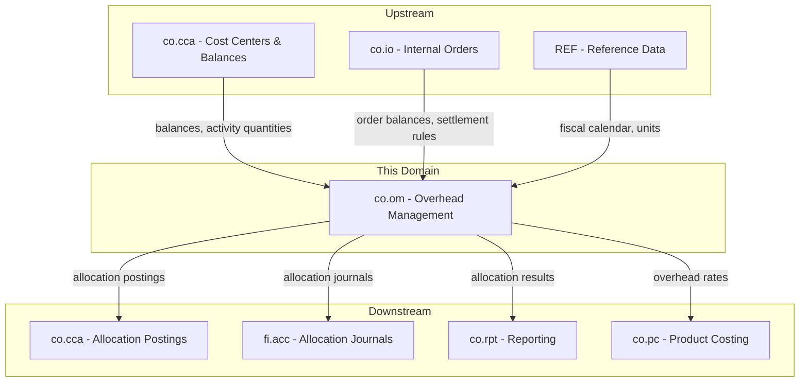
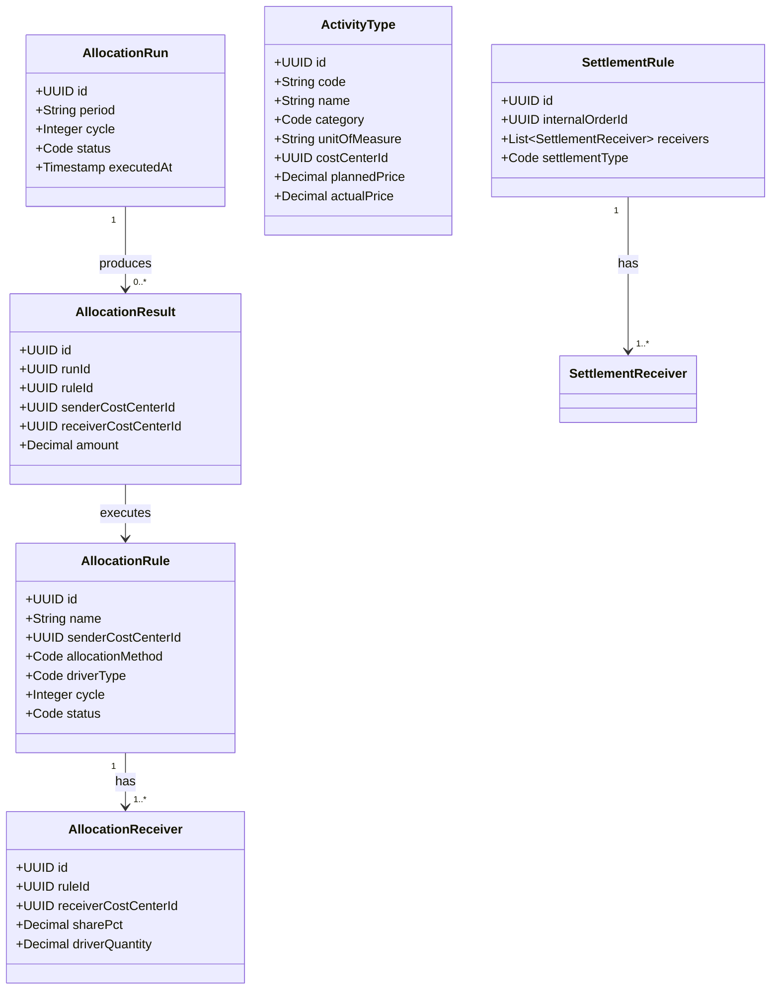
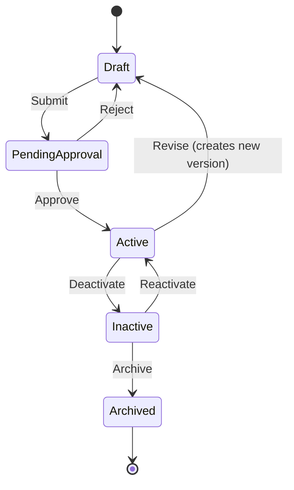
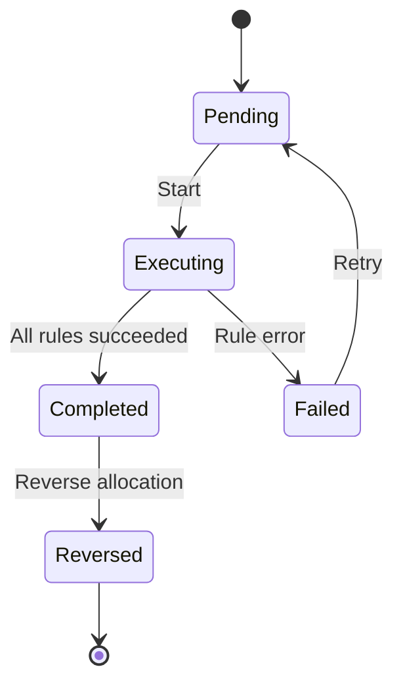
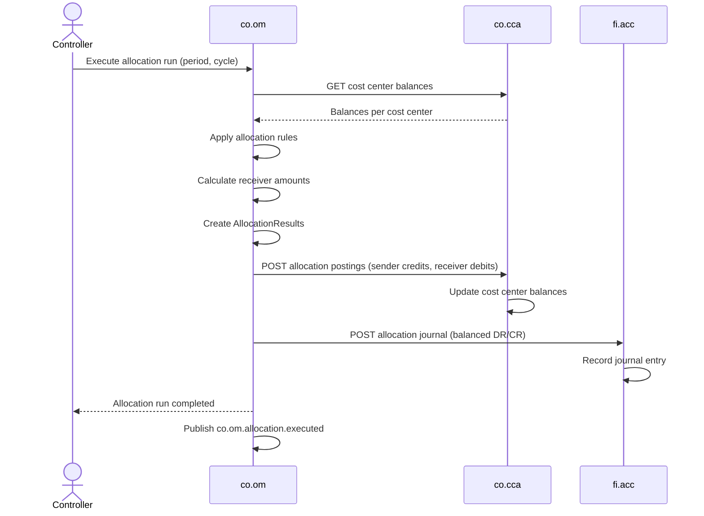
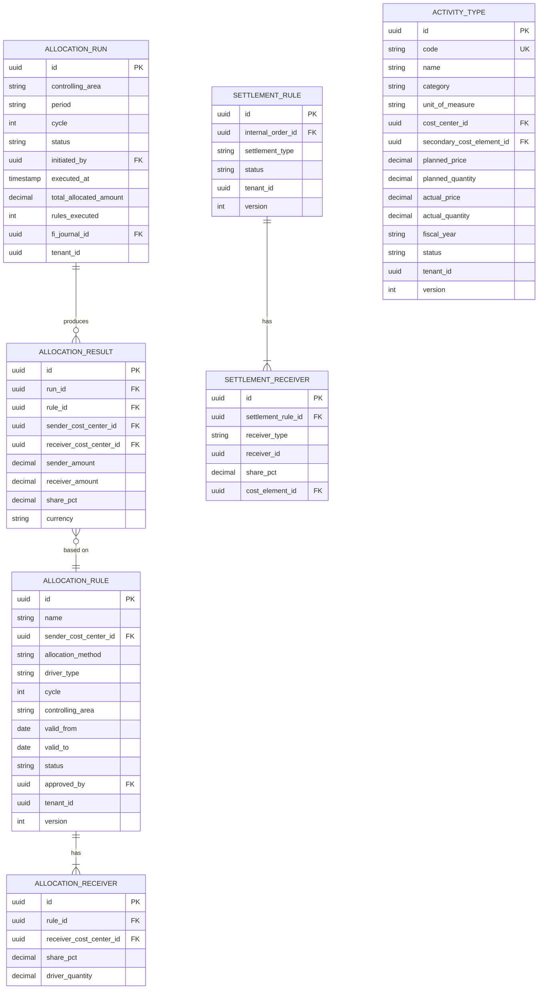

# CO - OM Overhead Management Domain / Service Specification

> **Conceptual Stack Layer:** Domain / Service
> **Space:** Platform
> **Owner:** Domain Engineering Team
> **Schema alignment:** `service-layer.schema.json`
> **Companion files:** `openapi.yaml`, `*.schema.json` (event contracts)
> **Referenced by:** Platform-Feature Spec SS5 (backend dependencies), BFF Contract
> **Belongs to:** CO Suite Spec (`_co_suite.md`)

> **Meta Information**
> - **Version:** 2026-04-01
> - **Template:** `domain-service-spec.md` v1.0.0
> - **Template Compliance:** ~83% — §11/§12/§13 stubs, §8 no column-level table defs
> - **Author(s):** OpenLeap Architecture Team
> - **Status:** DRAFT
> - **Suite:** `co`
> - **Domain:** `om`
> - **Bounded Context Ref:** `bc:overhead-management`
> - **Service ID:** `co-om-svc`
> - **basePackage:** `io.openleap.co.om`
> - **API Base Path:** `/api/co/om/v1`
> - **OpenLeap Starter Version:** `v1`
> - **Port:** TBD
> - **Repository:** TBD
> - **Tags:** `controlling`, `allocation`, `settlement`, `activity-type`
> - **Team:**
>   - Name: `team-co`
>   - Email: `co-team@openleap.io`
>   - Slack: `#co-team`

---

## Specification Guidelines Compliance

>
> ### Non-Negotiables
> - Never invent facts. If required info is missing, add an **OPEN QUESTION** entry.
> - Preserve intent and decisions. Only change meaning when explicitly requested.
> - Do not remove normative constraints unless they are explicitly replaced.
> - Keep the spec **self-contained**: no "see chat", no implicit context.
>
> ### Style Guide
> - Prefer short sentences and lists.
> - Use MUST/SHOULD/MAY for normative statements.
> - Keep terminology consistent (Aggregate, Domain Service, Application Service, Command, Event).

---

## 0. Document Purpose & Scope

### 0.1 Purpose
This specification defines the Overhead Management (OM) domain, which handles cost allocations, activity type management, activity price calculation, and internal order settlements. OM is the central processing engine within the CO Suite that distributes indirect costs from service cost centers to consuming cost objects.

### 0.2 Target Audience
- Product Owners & Business Stakeholders
- System Architects & Technical Leads
- Integration Engineers

### 0.3 Scope
**In Scope:**
- Allocation rule management (direct, driver-based, step-down, reciprocal)
- Allocation cycle execution (periodic runs)
- Activity type definitions and activity price calculation
- Internal order settlement execution
- Allocation journal creation and posting to FI
- Allocation reversal

**Out of Scope:**
- Cost center master data (-> co.cca)
- Internal order master data (-> co.io)
- Product cost calculation (-> co.pc)
- Management report generation (-> co.rpt)
- GL posting logic (-> fi.acc)

### 0.4 Related Documents
- `_co_suite.md` - CO Suite overview
- `co_cca-spec.md` - Cost Center Accounting
- `co_io-spec.md` - Internal Orders
- `co_pc-spec.md` - Product Costing
- `fi_acc_core_spec_complete.md` - Financial Accounting

---

## 1. Business Context

### 1.1 Domain Purpose
`co.om` is the **cost distribution engine** of the CO Suite. It takes indirect costs collected on service cost centers and distributes them to the cost objects that consumed those resources. It also manages activity types (machine hours, labor hours) to enable consumption-based charging between cost centers, and settles temporary cost collectors (internal orders) to their final receivers.

### 1.2 Business Value
- Fair distribution of overhead costs using configurable rules
- Activity-based charging for transparent internal service pricing
- Automated periodic allocation runs (reduce manual effort)
- Settlement of project/event costs to appropriate receivers
- Balanced allocation journals posted to FI for reconciliation

### 1.3 Key Stakeholders

| Role | Responsibility | Primary Use Cases |
|------|----------------|-------------------|
| Controller | Define allocation rules, execute allocation runs | UC-001, UC-003, UC-005 |
| Cost Center Manager | Review allocation results, validate activity prices | UC-004 |
| CFO | Approve allocation methodology | UC-001 |
| FI Accountant | Verify allocation journals in GL | UC-006 |

### 1.4 Strategic Positioning



### 1.5 Service Context

| Property | Value |
|----------|-------|
| **Suite** | `co` |
| **Domain** | `om` |
| **Bounded Context** | `bc:overhead-management` |
| **Service ID** | `co-om-svc` |
| **Base Package** | `io.openleap.co.om` |

**Responsibilities:**
- Allocation rule lifecycle management with approval workflow
- Periodic allocation run execution (sequential cycles)
- Activity type and activity price management
- Internal order settlement execution
- Allocation journal creation for FI
- Allocation reversal (compensation)

**Authoritative Sources:**
| Source Type | Description | Access Pattern |
|-------------|-------------|----------------|
| REST API | Allocation rules, activity types, run results | Synchronous |
| Database | Rules, runs, results, activity types, settlement rules | Direct (owner) |
| Events | Allocation executed, order settled, activity prices | Asynchronous |

---

## 2. Service Identity

| Property | Value | Schema Field |
|----------|-------|-------------|
| **Service ID** | `co-om-svc` | `metadata.id` |
| **Display Name** | `Overhead Management` | `metadata.name` |
| **Suite** | `co` | `metadata.suite` |
| **Domain** | `om` | `metadata.domain` |
| **Bounded Context** | `bc:overhead-management` | `metadata.bounded_context_ref` |
| **Version** | `1.0.0` | `metadata.version` |
| **Status** | DRAFT | `metadata.status` |
| **API Base Path** | `/api/co/om/v1` | `metadata.api_base_path` |
| **Repository** | TBD | `metadata.repository` |
| **Tags** | `controlling`, `allocation`, `settlement` | `metadata.tags` |

**Team:**
| Property | Value |
|----------|-------|
| **Name** | `team-co` |
| **Email** | `co-team@openleap.io` |
| **Slack Channel** | `#co-team` |

---

## 3. Domain Model

### 3.1 Conceptual Overview
OM manages four core concepts: **Allocation Rules** define how to distribute costs, **Allocation Runs** execute those rules for a period, **Activity Types** define internal service outputs with calculated prices, and **Settlement Rules** define how internal order costs flow to final receivers.

### 3.2 Core Concepts



### 3.3 Aggregate Definitions

#### 3.3.1 AllocationRule

| Property | Value |
|----------|-------|
| **Aggregate ID** | `agg:allocation-rule` |
| **Name** | `AllocationRule` |

**Business Purpose:** Defines how indirect costs from a sender cost center are distributed to one or more receiver cost objects. Rules are versioned and effective-dated.

**Key Attributes:**
| Attribute | Type | Format | Description | Constraints | Required | Read-Only |
|-----------|------|--------|-------------|-------------|----------|-----------|
| id | string | uuid | Unique identifier | Immutable | Yes | Yes |
| name | string | — | Rule name | max 255 chars | Yes | No |
| senderCostCenterId | string | uuid | FK to co.cca (source) | — | Yes | No |
| allocationMethod | string | — | How to allocate | enum: direct_percentage, driver_based, activity_based | Yes | No |
| driverType | string | — | Allocation driver | enum: headcount, revenue, space_sqm, usage_hours, custom | Conditional | No |
| costElementFilter | array | uuid[] | Only allocate specific elements | — | No | No |
| cycle | integer | — | Execution order | >= 1 | Yes | No |
| controllingArea | string | — | CO area | — | Yes | No |
| validFrom | string | date | Effective start | — | Yes | No |
| validTo | string | date | Effective end | — | No | No |
| status | string | — | Lifecycle state | enum: draft, pending_approval, active, inactive, archived | Yes | No |
| approvedBy | string | uuid | Approver BP ID | Required for Active | Conditional | No |
| tenantId | string | uuid | Tenant | — | Yes | Yes |
| version | integer | int64 | Optimistic lock | — | Yes | Yes |

**Lifecycle States:**



**Invariants:**
| Rule ID | Description |
|---------|-------------|
| BR-001 | Receiver shares MUST sum to 100% |
| BR-002 | Sender MUST NOT appear as receiver |
| BR-007 | Rules MUST be approved before execution |

**Domain Events Emitted:**
- `co.om.allocationRule.created`

#### 3.3.2 AllocationRun

| Property | Value |
|----------|-------|
| **Aggregate ID** | `agg:allocation-run` |
| **Name** | `AllocationRun` |

**Business Purpose:** A single execution of allocation rules for a given period and cycle.

**Key Attributes:**
| Attribute | Type | Format | Description | Constraints | Required | Read-Only |
|-----------|------|--------|-------------|-------------|----------|-----------|
| id | string | uuid | Unique identifier | Immutable | Yes | Yes |
| controllingArea | string | — | CO area | — | Yes | No |
| period | string | — | Fiscal period (YYYY-MM) | — | Yes | No |
| cycle | integer | — | Which cycle | — | Yes | No |
| status | string | — | Run status | enum: pending, executing, completed, failed, reversed | Yes | No |
| initiatedBy | string | uuid | User | — | Yes | No |
| executedAt | string | date-time | Execution timestamp | Set on completion | No | Yes |
| totalAllocatedAmount | number | decimal | Sum of allocations | Computed | No | Yes |
| rulesExecuted | integer | — | Count | Computed | No | Yes |
| fiJournalId | string | uuid | FK to FI journal | Set after posting | No | Yes |
| tenantId | string | uuid | Tenant | — | Yes | Yes |

**Lifecycle States:**



**Invariants:**
| Rule ID | Description |
|---------|-------------|
| BR-003 | Cycle N MUST NOT execute until cycle N-1 is Completed |
| BR-004 | Period MUST be open |
| BR-005 | Only one completed run per (area, period, cycle) |
| BR-006 | Sum of receiver amounts MUST equal sender amount |

**Domain Events Emitted:**
- `co.om.allocation.executed`
- `co.om.allocation.posted`
- `co.om.allocation.reversed`

#### 3.3.3 ActivityType

| Property | Value |
|----------|-------|
| **Aggregate ID** | `agg:activity-type` |
| **Name** | `ActivityType` |

**Business Purpose:** Defines a unit of output from a cost center (e.g., machine hours, labor hours). Enables consumption-based internal charging.

**Key Attributes:**
| Attribute | Type | Format | Description | Constraints | Required | Read-Only |
|-----------|------|--------|-------------|-------------|----------|-----------|
| id | string | uuid | Unique identifier | Immutable | Yes | Yes |
| code | string | — | Activity code (e.g., "ACT-MH-001") | unique per controlling area | Yes | No |
| name | string | — | Descriptive name | max 255 chars | Yes | No |
| category | string | — | Type of activity | enum: labor, machine, transport, service | Yes | No |
| unitOfMeasure | string | — | Output unit | valid UCUM | Yes | No |
| costCenterId | string | uuid | Providing cost center | FK to co.cca | Yes | No |
| secondaryCostElementId | string | uuid | Cost element for charges | Must be secondary | Yes | No |
| plannedPrice | number | decimal | Planned rate per unit | precision: 4 | Yes | No |
| plannedQuantity | number | decimal | Planned output quantity | > 0, precision: 4 | Yes | No |
| actualPrice | number | decimal | Computed actual rate | Computed | No | Yes |
| actualQuantity | number | decimal | Actual output reported | precision: 4 | No | No |
| fiscalYear | string | — | Year for price calculation | — | Yes | No |
| status | string | — | Lifecycle state | enum: active, inactive | Yes | No |
| tenantId | string | uuid | Tenant | — | Yes | Yes |
| version | integer | int64 | Optimistic lock | — | Yes | Yes |

**Domain Events Emitted:**
- `co.om.activityPrice.calculated`

#### 3.3.4 SettlementRule

| Property | Value |
|----------|-------|
| **Aggregate ID** | `agg:settlement-rule` |
| **Name** | `SettlementRule` |

**Business Purpose:** Defines how accumulated costs on an internal order are distributed to final receivers.

**Key Attributes:**
| Attribute | Type | Format | Description | Constraints | Required | Read-Only |
|-----------|------|--------|-------------|-------------|----------|-----------|
| id | string | uuid | Unique identifier | Immutable | Yes | Yes |
| internalOrderId | string | uuid | FK to co.io | — | Yes | No |
| settlementType | string | — | Full or periodic | enum: full, periodic | Yes | No |
| status | string | — | Lifecycle state | enum: active, executed | Yes | No |
| tenantId | string | uuid | Tenant | — | Yes | Yes |
| version | integer | int64 | Optimistic lock | — | Yes | Yes |

**Settlement Receiver (embedded):**
| Attribute | Type | Description | Constraints |
|-----------|------|-------------|-------------|
| receiverType | string | Target type | enum: cost_center, product, fixed_asset, gl_account |
| receiverId | string | Target entity ID | Required |
| sharePct | number | Percentage share | All MUST sum to 100 |
| costElementId | string | Settlement cost element | Must be secondary |

**Invariants:**
| Rule ID | Description |
|---------|-------------|
| BR-008 | Settlement receiver shares MUST sum to 100% |
| BR-009 | After full settlement, order balance MUST be zero |

**Domain Events Emitted:**
- `co.om.order.settled`

### 3.4 Enumerations

#### AllocationMethod

| Value | Description | Deprecated |
|-------|-------------|------------|
| `direct_percentage` | Fixed percentage split | No |
| `driver_based` | Split based on measurable driver | No |
| `activity_based` | Split based on activity consumption | No |

### 3.5 Shared Types

> OPEN QUESTION: Content for this section has not been authored yet.

---

## 4. Business Rules & Constraints

### 4.1 Business Rules Catalog

| ID | Rule Name | Description | Scope | Enforcement | Error Code |
|----|-----------|-------------|-------|-------------|------------|
| BR-001 | Receiver Shares 100% | All receiver share_pct MUST sum to 100.00 | AllocationRule | Create, Update | `SHARES_NOT_100` |
| BR-002 | No Self-Allocation | Sender MUST NOT appear as receiver | AllocationRule | Create, Update | `SELF_ALLOCATION` |
| BR-003 | Sequential Cycles | Cycle N requires Cycle N-1 completed | AllocationRun | Execute | `PREVIOUS_CYCLE_INCOMPLETE` |
| BR-004 | Open Period Required | Allocations only to open periods | AllocationRun | Execute | `PERIOD_CLOSED` |
| BR-005 | One Run Per Cycle-Period | Only one completed run per (area, period, cycle) | AllocationRun | Execute | `DUPLICATE_RUN` |
| BR-006 | Balanced Allocation | Sum of receiver amounts MUST equal sender amount | AllocationRun | Execute | `UNBALANCED_ALLOCATION` |
| BR-007 | Approval Required | Rules MUST be approved before execution | AllocationRule | Status transition | `NOT_APPROVED` |
| BR-008 | Settlement Shares 100% | Settlement receiver shares MUST sum to 100 | SettlementRule | Create, Update | `SHARES_NOT_100` |
| BR-009 | Full Settlement Zero Balance | After full settlement, order balance MUST be zero | Settlement | Execute | `NONZERO_BALANCE` |
| BR-010 | Rounding Handling | Last receiver absorbs rounding difference | AllocationRun | Execute | — |

### 4.2 Detailed Rule Definitions

#### BR-006: Balanced Allocation

**Business Context:** Cost allocation is a zero-sum operation.

**Rule Statement:** For each allocation rule execution: sum(receiver_amounts) MUST equal sender_balance. Rounding difference of <= 0.01 in base currency is assigned to last receiver.

**Error Handling:**
- **Error Code:** `UNBALANCED_ALLOCATION`
- **Error Message:** "Allocation imbalance: delta {delta} exceeds tolerance 0.01"
- **User action:** Review rule percentages and driver quantities

### 4.3 Data Validation Rules

| Field | Validation Rule | Error Message |
|-------|----------------|---------------|
| name (rule) | Required, max 255 chars | "Rule name is required" |
| sharePct | 0.01 to 100.00 | "Share percentage must be between 0.01 and 100.00" |
| cycle | >= 1, integer | "Cycle must be a positive integer" |
| plannedPrice | >= 0 | "Planned price must be non-negative" |
| plannedQuantity | > 0 | "Planned quantity must be positive" |

### 4.4 Reference Data Dependencies

| Catalog | Usage | Validation |
|---------|-------|------------|
| Fiscal Calendar | Period validation | Must exist and be open |
| Units of Measure (UCUM) | Activity type units | Must be valid UCUM code |
| Currencies (ISO 4217) | Allocation amounts | Must exist and be active |

---

## 5. Use Cases

### 5.1 Business Logic Placement

| Logic Type | Placement | Examples |
|------------|-----------|----------|
| Aggregate invariants | Domain Object | Share percentage validation, cycle ordering |
| Cross-aggregate logic | Domain Service | Allocation calculation, settlement distribution |
| Orchestration & transactions | Application Service | Multi-step allocation run, journal posting |

### 5.2 Use Cases (Canonical Format)

#### UC-001: DefineAllocationRule

| Field | Value |
|-------|-------|
| **id** | `DefineAllocationRule` |
| **type** | WRITE |
| **trigger** | REST |
| **aggregate** | `AllocationRule` |
| **domainOperation** | `AllocationRule.create` |
| **inputs** | `name: String`, `senderCostCenterId: UUID`, `allocationMethod: Code`, `driverType: Code?`, `cycle: Integer`, `receivers: AllocationReceiver[]` |
| **outputs** | `AllocationRule` |
| **events** | `AllocationRule.created` |
| **rest** | `POST /api/co/om/v1/allocation-rules` |
| **idempotency** | optional |
| **errors** | `SHARES_NOT_100`, `SELF_ALLOCATION` |

**Actor:** Controller

#### UC-003: ExecuteAllocationRun

| Field | Value |
|-------|-------|
| **id** | `ExecuteAllocationRun` |
| **type** | WRITE |
| **trigger** | REST |
| **aggregate** | `AllocationRun` |
| **domainOperation** | `AllocationRun.execute` |
| **inputs** | `controllingArea: String`, `period: String`, `cycle: Integer`, `dryRun: Boolean` |
| **outputs** | `AllocationRun` |
| **events** | `Allocation.executed`, `Allocation.posted` |
| **rest** | `POST /api/co/om/v1/allocation-runs/execute` |
| **idempotency** | required |
| **errors** | `PREVIOUS_CYCLE_INCOMPLETE`, `PERIOD_CLOSED`, `DUPLICATE_RUN`, `UNBALANCED_ALLOCATION` |

**Actor:** Controller

**Main Flow:**
1. Controller initiates allocation run for period and cycle
2. System loads all Active rules for the cycle
3. For each rule: read sender balance from co.cca, apply allocation method, create AllocationResult records
4. Validate balanced allocation (sum receivers = sender)
5. Create allocation postings: sender credit, receivers debit
6. Send allocation postings to co.cca
7. Create balanced allocation journal for fi.acc
8. Mark run as Completed
9. Publish `co.om.allocation.executed` event

**Alternative Flows:**
- **Alt-1:** If sender balance is zero, skip rule
- **Alt-2:** Last receiver absorbs rounding difference

**Exception Flows:**
- **Exc-1:** If receiver cost center is not Active, fail the run

#### UC-004: CalculateActivityPrices

| Field | Value |
|-------|-------|
| **id** | `CalculateActivityPrices` |
| **type** | WRITE |
| **trigger** | REST |
| **aggregate** | `ActivityType` |
| **domainOperation** | `ActivityType.calculatePrice` |
| **inputs** | `controllingArea: String`, `period: String` |
| **outputs** | `ActivityType[]` |
| **events** | `ActivityPrice.calculated` |
| **rest** | `POST /api/co/om/v1/activity-types/calculate-prices` |
| **idempotency** | required |
| **errors** | — |

**Actor:** Controller

#### UC-005: SettleInternalOrders

| Field | Value |
|-------|-------|
| **id** | `SettleInternalOrders` |
| **type** | WRITE |
| **trigger** | REST |
| **aggregate** | `SettlementRule` |
| **domainOperation** | `SettlementRule.execute` |
| **inputs** | `internalOrderId: UUID`, `settlementType: Code`, `period: String` |
| **outputs** | `SettlementResult` |
| **events** | `Order.settled` |
| **rest** | `POST /api/co/om/v1/settlements/execute` |
| **idempotency** | required |
| **errors** | `NONZERO_BALANCE`, `SHARES_NOT_100` |

**Actor:** Controller

#### UC-006: ReverseAllocationRun

| Field | Value |
|-------|-------|
| **id** | `ReverseAllocationRun` |
| **type** | WRITE |
| **trigger** | REST |
| **aggregate** | `AllocationRun` |
| **domainOperation** | `AllocationRun.reverse` |
| **inputs** | `runId: UUID` |
| **outputs** | `AllocationRun` |
| **events** | `Allocation.reversed` |
| **rest** | `POST /api/co/om/v1/allocation-runs/{runId}/reverse` |
| **idempotency** | required |
| **errors** | `PERIOD_CLOSED` |

**Actor:** Controller (admin)

### 5.3 Process Flow Diagrams



### 5.4 Cross-Domain Workflows

**Does this domain participate in multi-service workflows?** [x] YES [ ] NO

#### Workflow: Month-End Allocation Cycle

**Business Purpose:** Distribute all indirect costs for the period through sequential allocation cycles.

**Orchestration Pattern:** [ ] Choreography (EDA) [x] Orchestration (Saga)

**Pattern Rationale:**
The allocation process is a multi-step coordinated workflow: cycles MUST execute sequentially, each step MUST succeed before the next, and failure requires compensation (reversal). OM coordinates the entire flow.

**Participating Services:**
| Service | Role | Responsibilities |
|---------|------|------------------|
| co.om | Orchestrator | Execute rules, coordinate steps, handle failures |
| co.cca | Data provider & receiver | Provide balances, receive postings |
| co.io | Data provider | Provide internal order balances |
| fi.acc | Journal receiver | Record allocation journals |

**Workflow Steps:**
1. **Cycle 1:** OM allocates service CC -> other service CCs. Failure: Reverse Cycle 1.
2. **Cycle 2:** OM allocates service CCs -> production CCs. Failure: Reverse Cycles 1-2.
3. **Cycle 3:** OM allocates production CCs -> products. Failure: Reverse Cycles 1-3.
4. **Settlement:** OM settles internal orders. Failure: Reverse settlement, leave cycles.

---

## 6. REST API

### 6.1 API Overview

**Base Path:** `/api/co/om/v1`
**Authentication:** OAuth2/JWT (Bearer token)
**Authorization:**
- Read: `co.om:read`
- Write: `co.om:write`
- Execute: `co.om:execute`
- Admin: `co.om:admin`

### 6.2 Resource Operations

#### 6.2.1 Allocation Rules - CRUD
```http
POST /api/co/om/v1/allocation-rules
GET /api/co/om/v1/allocation-rules/{id}
PATCH /api/co/om/v1/allocation-rules/{id}
GET /api/co/om/v1/allocation-rules?page=0&size=50&cycle=1&status=ACTIVE
DELETE /api/co/om/v1/allocation-rules/{id}
```

#### 6.2.2 Activity Types - CRUD
```http
POST /api/co/om/v1/activity-types
GET /api/co/om/v1/activity-types/{id}
PATCH /api/co/om/v1/activity-types/{id}
GET /api/co/om/v1/activity-types?costCenterId={id}&category=machine
```

#### 6.2.3 Settlement Rules - CRUD
```http
POST /api/co/om/v1/settlement-rules
GET /api/co/om/v1/settlement-rules/{id}
PATCH /api/co/om/v1/settlement-rules/{id}
GET /api/co/om/v1/settlement-rules?internalOrderId={id}
```

### 6.3 Business Operations

#### Execute Allocation Run
```http
POST /api/co/om/v1/allocation-runs/execute
Content-Type: application/json
```
```json
{
  "controllingArea": "CA01",
  "period": "2026-02",
  "cycle": 1,
  "dryRun": false
}
```
**Response:** `202 Accepted`
```json
{
  "runId": "uuid-run-001",
  "status": "EXECUTING",
  "_links": {
    "self": { "href": "/api/co/om/v1/allocation-runs/uuid-run-001" },
    "results": { "href": "/api/co/om/v1/allocation-runs/uuid-run-001/results" }
  }
}
```

#### Settle Internal Order
```http
POST /api/co/om/v1/settlements/execute
Content-Type: application/json
```
```json
{
  "internalOrderId": "uuid-io-001",
  "settlementType": "full",
  "period": "2026-02"
}
```
**Response:** `202 Accepted`

#### Reverse Allocation Run
```http
POST /api/co/om/v1/allocation-runs/{runId}/reverse
```

#### Calculate Activity Prices
```http
POST /api/co/om/v1/activity-types/calculate-prices
Content-Type: application/json
```
```json
{
  "controllingArea": "CA01",
  "period": "2026-02"
}
```

#### Get Allocation Run Results
```http
GET /api/co/om/v1/allocation-runs/{runId}/results?page=0&size=50
```
**Response:** `200 OK`
```json
{
  "runId": "uuid-run-001",
  "status": "COMPLETED",
  "totalAllocatedAmount": 150000.00,
  "currency": "EUR",
  "rulesExecuted": 5,
  "content": [
    {
      "ruleId": "uuid-rule-001",
      "ruleName": "IT Cost Allocation",
      "senderCostCenterId": "uuid-cc-it",
      "senderAmount": 100000.00,
      "receivers": [
        { "costCenterId": "uuid-cc-mkt", "amount": 40000.00, "sharePct": 40.00 },
        { "costCenterId": "uuid-cc-sales", "amount": 30000.00, "sharePct": 30.00 },
        { "costCenterId": "uuid-cc-ops", "amount": 30000.00, "sharePct": 30.00 }
      ]
    }
  ]
}
```

### 6.4 OpenAPI Specification

**Location:** `contracts/http/co/om/openapi.yaml`
**Version:** OpenAPI 3.1

---

## 7. Events & Integration

### 7.1 Event-Driven Architecture Pattern
**Pattern Used:** [ ] Event-Driven (Choreography) [ ] Orchestration (Saga) [x] Hybrid

**Follows Suite Pattern:** [x] YES [ ] NO

**Pattern Rationale:** OM uses orchestration for allocation run workflow (sequential cycles, compensation on failure) and choreography for broadcasting results.

**Message Broker:** `RabbitMQ`

### 7.2 Published Events
**Exchange:** `co.om.events` (topic)

#### Event: Allocation.executed
**Routing Key:** `co.om.allocation.executed`
**Business Purpose:** Signals that an allocation run has completed.
**Known Consumers:**
| Consumer | Purpose | Processing |
|----------|---------|------------|
| co-rpt-svc | Generate allocation reports | Async/Immediate |
| co-pc-svc | Update overhead rates | Async/Batch |

#### Event: Allocation.posted
**Routing Key:** `co.om.allocation.posted`
**Business Purpose:** Detailed allocation postings for CCA to record.
**Known Consumers:**
| Consumer | Purpose | Processing |
|----------|---------|------------|
| co-cca-svc | Record allocation cost postings | Async/Immediate |

#### Event: Order.settled
**Routing Key:** `co.om.order.settled`
**Known Consumers:**
| Consumer | Purpose | Processing |
|----------|---------|------------|
| co-io-svc | Update order status to Settled | Async/Immediate |
| co-cca-svc | Record settlement postings (CC receivers) | Async/Immediate |
| co-pc-svc | Record settlement postings (product receivers) | Async/Immediate |

#### Event: ActivityPrice.calculated
**Routing Key:** `co.om.activityPrice.calculated`
**Known Consumers:**
| Consumer | Purpose | Processing |
|----------|---------|------------|
| co-pc-svc | Update overhead rates in product costing | Async/Batch |

### 7.3 Consumed Events

#### co.cca.cost.posted
**Source:** `co-cca-svc`
**Purpose:** Monitor cost center balance changes
**Processing:** Cache Invalidation

#### co.io.order.statusChanged
**Source:** `co-io-svc`
**Purpose:** Know when orders are ready for settlement
**Processing:** Background Enrichment
**Queue:** `co.om.in.co.io.order.statusChanged`

---

## 8. Data Model

### 8.1 Conceptual Data Model



### 8.2 Entity Definitions

**AllocationRule Indexes:**
- PK: `id`
- Unique: `(tenant_id, controlling_area, name, valid_from)`
- Query: `(tenant_id, controlling_area, cycle, status)`

**AllocationRun Indexes:**
- PK: `id`
- Unique: `(tenant_id, controlling_area, period, cycle)` WHERE status = 'COMPLETED'
- Query: `(tenant_id, period, status)`

**ActivityType Indexes:**
- PK: `id`
- Unique: `(tenant_id, controlling_area, code)`
- Query: `(tenant_id, cost_center_id, fiscal_year)`

### 8.3 Reference Data Dependencies

**External:**
| Catalog | Source | Validation |
|---------|--------|------------|
| currencies | ref-data-svc | Must exist and be active |
| fiscal_calendars | ref-data-svc | Must be valid fiscal period |
| units | si-unit-svc | Must be valid UCUM code |

**Internal:**
| Catalog | Usage |
|---------|-------|
| allocation_method | direct_percentage, driver_based, activity_based |
| driver_type | headcount, revenue, space_sqm, usage_hours, custom |
| activity_category | labor, machine, transport, service |
| settlement_type | full, periodic |
| receiver_type | cost_center, product, fixed_asset, gl_account |

---

## 9. Security & Compliance

### 9.1 Data Classification

| Data Element | Classification | Protection |
|--------------|----------------|------------|
| Allocation Rules | Confidential | Encryption, RBAC |
| Allocation Results | Confidential | Encryption, RBAC, audit |
| Activity Prices | Confidential | Encryption, RBAC |
| Settlement Amounts | Confidential | Encryption, RBAC, audit |

### 9.2 Access Control

| Role | Read | Create Rules | Execute Runs | Reverse | Admin |
|------|------|-------------|-------------|---------|-------|
| CO_OM_VIEWER | Yes | No | No | No | No |
| CO_OM_USER | Yes | Yes | No | No | No |
| CO_OM_CONTROLLER | Yes | Yes | Yes | Yes | No |
| CO_OM_ADMIN | Yes | Yes | Yes | Yes | Yes |

### 9.3 Compliance Requirements

| Regulation | Requirement | Implementation |
|-----------|-------------|----------------|
| SOX | Allocation rules versioned and approved | Approval workflow, version history |
| Internal Audit | All allocation runs logged | Full audit trail with initiator, timestamp, results |

---

## 10. Quality Attributes

### 10.1 Performance Requirements

| Operation | Target (p95) |
|-----------|-------------|
| Read allocation rule | < 50ms |
| Execute allocation run (100 rules, 500 CCs) | < 5 min |
| Settlement execution (single order) | < 30 sec |
| Batch settlement (500 orders) | < 10 min |
| Activity price calculation | < 2 min |

### 10.2 Availability & Reliability

**Availability:** 99.9% | **RTO:** < 30 min | **RPO:** < 5 min

### 10.3 Scalability

- Allocation runs: Parallelizable within a cycle
- Settlement: Batch parallelizable across orders
- Data growth: ~10,000 allocation results per month per tenant

---

## 11. Feature Dependencies

> OPEN QUESTION: Content for this section has not been authored yet.

---

## 12. Extension Points

> OPEN QUESTION: Content for this section has not been authored yet.

---

## 13. Migration & Evolution

| Source | Target | Mapping |
|--------|--------|---------|
| Legacy allocation rules | AllocationRule | Method mapping, receiver reconfiguration |
| Legacy allocation history | AllocationRun + AllocationResult | Historical run import |

---

## 14. Decisions & Open Questions

### 14.1 Open Questions

| ID | Question | Impact | Decision Needed By |
|----|----------|--------|---------------------|
| Q-001 | Should reciprocal allocation (iterative) be supported in Phase 1? | Algorithm complexity | Phase 1 design |
| Q-002 | Should allocation dry-run generate a preview report without posting? | UX improvement | Phase 1 design |
| Q-003 | How to handle partial settlements (settle only specific cost elements)? | Settlement flexibility | Phase 2 |

### 14.2 Architectural Decision Records (ADRs)

#### ADR-OM-001: OM as Allocation Orchestrator

**Status:** Accepted

**Context:** Should allocation runs be orchestrated centrally or use pure choreography?

**Decision:** OM acts as the orchestrator for allocation runs. Sequential cycles require coordination, and failure handling requires compensation (reversal).

**Consequences:**
| Positive | Negative |
|----------|----------|
| Clear workflow control, reliable compensation | OM becomes a coordinator, slightly higher coupling |
| — | OM availability critical during month-end |

---

## 15. Appendix

### 15.1 Glossary

| Term | Definition | Aliases |
|------|------------|---------|
| Allocation | Distribution of costs from sender to receivers | Umlage, Verrechnung |
| Activity Type | Unit of output from a cost center | Leistungsart |
| Settlement | Final cost distribution from temporary to permanent cost objects | Abrechnung |
| Cycle | Execution order for allocation rules | Zyklus |
| Driver | Measurable factor used to distribute costs | Bezugsgroesse |

### 15.2 Change Log

| Date | Version | Author | Changes |
|------|---------|--------|---------|
| 2026-02-23 | 1.0 | OpenLeap Architecture Team | Initial version |
| 2026-04-01 | 1.1 | OpenLeap Architecture Team | Restructured to template compliance (sections 0-15) |

### 15.3 Review & Approval

**Status:** DRAFT
