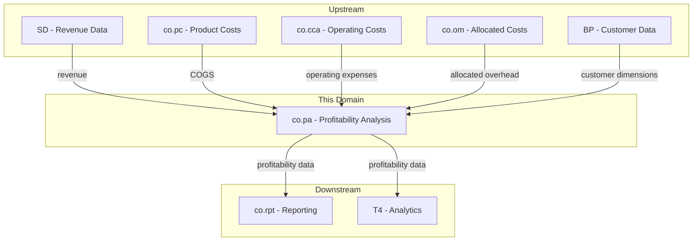
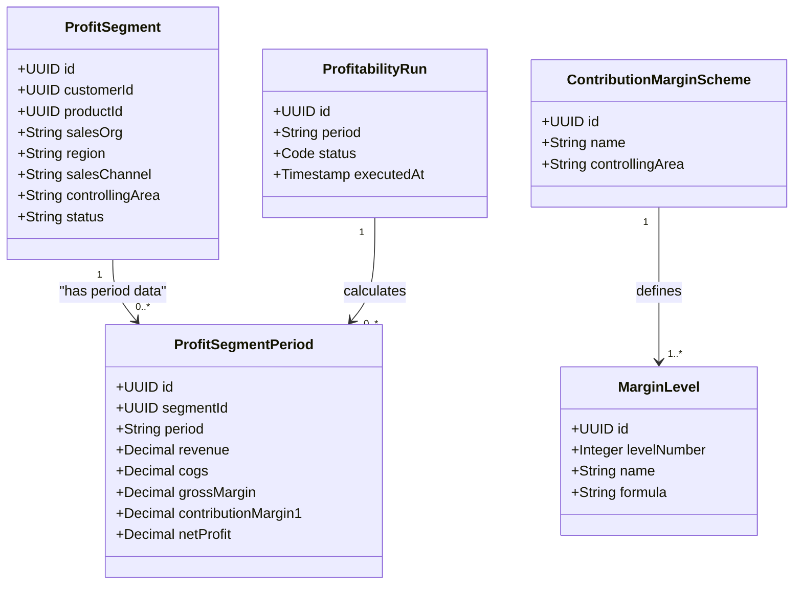
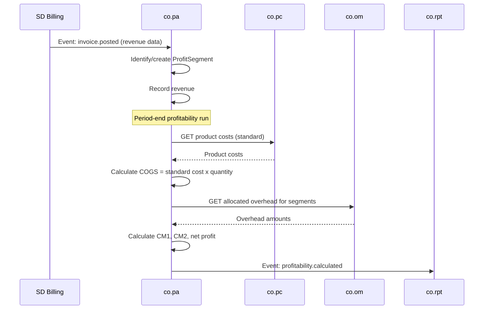
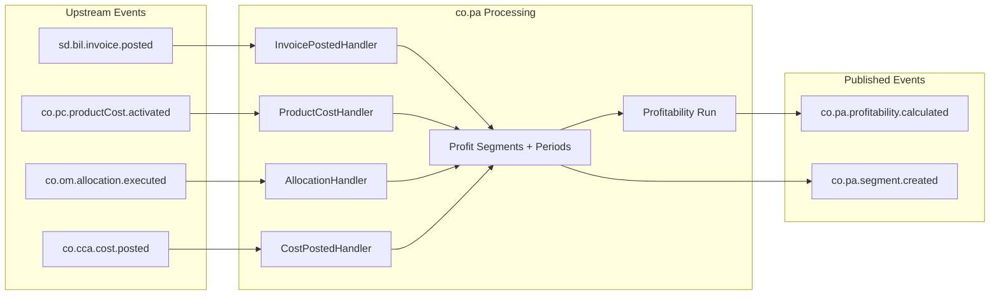
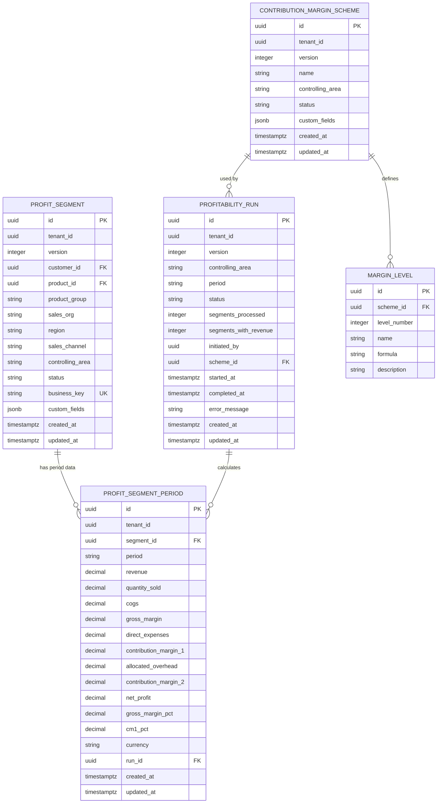

# CO - PA Profitability Analysis Domain / Service Specification

> **Conceptual Stack Layer:** Domain / Service
> **Space:** Platform
> **Owner:** Domain Engineering Team
> **Schema alignment:** `service-layer.schema.json`
> **Companion files:** `openapi.yaml`, `*.schema.json` (event contracts)
> **Referenced by:** Platform-Feature Spec SS5 (backend dependencies), BFF Contract
> **Belongs to:** CO Suite Spec (`_co_suite.md`)

> **Meta Information**
> - **Version:** 2026-04-04
> - **Template:** `domain-service-spec.md` v1.0.0
> - **Template Compliance:** ~95% — §11 feature register pending product feature specs
> - **Author(s):** OpenLeap Architecture Team
> - **Status:** DRAFT
> - **Suite:** `co`
> - **Domain:** `pa`
> - **Bounded Context Ref:** `bc:profitability-analysis`
> - **Service ID:** `co-pa-svc`
> - **basePackage:** `io.openleap.co.pa`
> - **API Base Path:** `/api/co/pa/v1`
> - **OpenLeap Starter Version:** `v1`
> - **Port:** TBD
> - **Repository:** TBD
> - **Tags:** `controlling`, `profitability`, `contribution-margin`, `profit-segment`
> - **Team:**
>   - Name: `team-co`
>   - Email: `co-team@openleap.io`
>   - Slack: `#co-team`

---

## Specification Guidelines Compliance

> ### Non-Negotiables
> - Never invent facts. If required info is missing, add an **OPEN QUESTION** entry.
> - Preserve intent and decisions. Only change meaning when explicitly requested.
> - Do not remove normative constraints unless they are explicitly replaced.
> - Keep the spec **self-contained**: no "see chat", no implicit context.
>
> ### Source of Truth Priority
> When sources conflict:
> 1. Spec (explicit) wins
> 2. Starter specs (implementation constraints) next
> 3. Guidelines (best practices) last
>
> Record conflicts in the **Decisions & Conflicts** section (see Section 14).
>
> ### Style Guide
> - Prefer short sentences and lists.
> - Use MUST/SHOULD/MAY for normative statements.
> - Keep terminology consistent (Aggregate, Domain Service, Application Service, Command, Event).
> - Avoid ambiguous words ("often", "maybe") unless explicitly noting uncertainty.
> - Keep examples minimal and clearly marked as examples.
> - Do not add implementation code unless the chapter explicitly requires it.

---

## 0. Document Purpose & Scope

### 0.1 Purpose
This specification defines the Profitability Analysis (PA) domain, which calculates and analyzes profitability by multiple dimensions: customer, product, region, sales channel, and any custom dimension. PA combines revenue data (from SD) with cost data (from co.pc, co.cca) to compute contribution margins and net profitability.

### 0.2 Target Audience
- Product Owners & Business Stakeholders
- System Architects & Technical Leads
- Integration Engineers

### 0.3 Scope
**In Scope:**
- Multi-dimensional profitability analysis (costing-based and account-based)
- Profit segment management (dimension combinations)
- Revenue capture from SD events
- COGS lookup from co.pc
- Operating expense allocation from co.cca/co.om
- Contribution margin calculation (multiple levels)
- Period-end profitability computation
- Top-down distribution of high-level plan values to profit segments

**Out of Scope:**
- Revenue recognition and invoicing (-> SD / fi.acc)
- Product cost calculation (-> co.pc)
- Cost allocations (-> co.om)
- Profit center accounting (-> co.pca)
- Strategic BI dashboards (-> T4 Analytics)

### 0.4 Related Documents
- `_co_suite.md` - CO Suite overview
- `co_pc-spec.md` - Product Costing (COGS source)
- `co_cca-spec.md` - Cost Center Accounting
- `co_om-spec.md` - Overhead Management
- `sd_bil-spec.md` - SD Billing (revenue source)

---

## 1. Business Context

### 1.1 Domain Purpose
`co.pa` answers **"Where do we make money?"** It combines revenue and costs across multiple dimensions to reveal which customers, products, regions, and channels are profitable and which are not.

### 1.2 Business Value
- Identify profitable and unprofitable customers/products
- Support pricing decisions with actual margin data
- Analyze profitability trends over time
- Support strategic portfolio decisions (invest/divest)
- Contribution margin analysis at multiple levels
- Enable top-down distribution of plan values for variance-to-plan analysis

### 1.3 Key Stakeholders

| Role | Responsibility | Primary Use Cases |
|------|----------------|-------------------|
| Controller | Configure dimensions, run profitability | UC-001, UC-003 |
| Sales Manager | Review customer profitability | UC-004 |
| Product Manager | Review product profitability | UC-004 |
| CFO | Strategic profitability overview | UC-005 |

### 1.4 Strategic Positioning



### 1.5 Service Context

| Property | Value |
|----------|-------|
| **Suite** | `co` |
| **Domain** | `pa` |
| **Bounded Context** | `bc:profitability-analysis` |
| **Service ID** | `co-pa-svc` |
| **Base Package** | `io.openleap.co.pa` |

**Responsibilities:**
- Manage profit segment definitions (dimension combinations)
- Capture revenue and cost postings per profit segment per period
- Execute profitability runs computing multi-level contribution margins
- Provide dimension-based profitability analysis (by customer, product, region, channel)
- Support top-down distribution of plan values to segments

**Authoritative Sources:**
| Source Type | Description | Access Pattern |
|-------------|-------------|----------------|
| REST API | Profit segments, period data, analysis views | Synchronous |
| Database | Profit segments, period records, run history | Direct (owner) |
| Events | Profitability calculated, segment created | Asynchronous |

---

## 2. Service Identity

| Property | Value | Schema Field |
|----------|-------|-------------|
| **Service ID** | `co-pa-svc` | `metadata.id` |
| **Display Name** | `Profitability Analysis` | `metadata.name` |
| **Suite** | `co` | `metadata.suite` |
| **Domain** | `pa` | `metadata.domain` |
| **Bounded Context** | `bc:profitability-analysis` | `metadata.bounded_context_ref` |
| **Version** | `1.0.0` | `metadata.version` |
| **Status** | DRAFT | `metadata.status` |
| **API Base Path** | `/api/co/pa/v1` | `metadata.api_base_path` |
| **Repository** | TBD | `metadata.repository` |
| **Tags** | `controlling`, `profitability`, `contribution-margin` | `metadata.tags` |

**Team:**
| Property | Value |
|----------|-------|
| **Name** | `team-co` |
| **Email** | `co-team@openleap.io` |
| **Slack Channel** | `#co-team` |

---

## 3. Domain Model

### 3.1 Conceptual Overview
PA manages **Profit Segments** — unique combinations of analysis dimensions (customer x product x region x channel). Each segment accumulates revenue and cost data per period. **Profitability Runs** compute contribution margins across all segments for a period. A contribution margin scheme defines the calculation levels (revenue, COGS, gross margin, direct expenses, CM1, allocated overhead, CM2, net profit).

### 3.2 Core Concepts



### 3.3 Aggregate Definitions

#### 3.3.1 ProfitSegment

| Property | Value |
|----------|-------|
| **Aggregate ID** | `agg:profit-segment` |
| **Name** | `ProfitSegment` |

**Business Purpose:** A unique combination of analysis dimensions representing a profitability unit. In SAP CO-PA terminology, this corresponds to a "profitability segment" defined by characteristic values within an operating concern.

##### Aggregate Root

| Attribute | Type | Format | Description | Constraints | Required | Read-Only |
|-----------|------|--------|-------------|-------------|----------|-----------|
| id | string | uuid | Unique identifier generated via OlUuid.create() | — | Yes | Yes |
| version | integer | int32 | Optimistic locking version | >= 0 | Yes | Yes |
| tenantId | string | uuid | Tenant identifier for RLS | — | Yes | Yes |
| customerId | string | uuid | FK to BP (customer). Null means all customers. | — | No | No |
| productId | string | uuid | FK to product catalog entry | — | No | No |
| productGroup | string | — | Product group code for higher-level aggregation | maxLength: 20 | No | No |
| salesOrg | string | — | Sales organization code | maxLength: 10 | No | No |
| region | string | — | Geographic region code (ISO 3166-2 or custom) | maxLength: 20 | No | No |
| salesChannel | string | — | Distribution channel | enum_ref: SalesChannel | No | No |
| controllingArea | string | — | Controlling area for organizational scope | maxLength: 10 | Yes | No |
| status | string | — | Segment lifecycle status | enum_ref: SegmentStatus | Yes | No |
| businessKey | string | — | Composite key: hash of dimension values | unique per tenant | Yes | Yes |
| createdAt | string | date-time | Creation timestamp | — | Yes | Yes |
| updatedAt | string | date-time | Last update timestamp | — | Yes | Yes |

**State Descriptions:**

| State | Description | Business Meaning |
|-------|-------------|------------------|
| `active` | Segment is available for postings and analysis | Normal operational state |
| `inactive` | Segment is excluded from new postings | Deprecated dimension combination, historical data preserved |

**Allowed Transitions:**

| From State | To State | Trigger | Guard |
|------------|----------|---------|-------|
| `active` | `inactive` | DeactivateSegment command | No open profitability runs referencing this segment |
| `inactive` | `active` | ReactivateSegment command | — |

**Invariants:**
| Rule ID | Description |
|---------|-------------|
| BR-001 | No duplicate dimension combinations per tenant (enforced via businessKey unique constraint) |
| BR-003 | At least one dimension attribute (customerId, productId, productGroup, salesOrg, region, salesChannel) MUST be set |

**Domain Events Emitted:**
- `co.pa.segment.created` — when a new segment is created
- `co.pa.segment.deactivated` — when a segment is deactivated
- `co.pa.segment.reactivated` — when a segment is reactivated

##### Child Entities

###### ProfitSegmentPeriod

**Business Purpose:** Period-level profitability data for a segment. Each record holds revenue, costs, and computed margins for one fiscal period. Corresponds to a value field row in SAP CO-PA.

**Collection Constraints:** Zero or more periods per segment. One record per (segmentId, period) combination.

| Attribute | Type | Format | Description | Constraints | Required |
|-----------|------|--------|-------------|-------------|----------|
| id | string | uuid | Unique identifier | — | Yes |
| segmentId | string | uuid | FK to ProfitSegment | — | Yes |
| period | string | — | Fiscal period in YYYY-MM format | pattern: `^\d{4}-(0[1-9]\|1[0-2])$` | Yes |
| revenue | number | decimal | Total revenue for the segment in this period | >= 0, precision: 15, scale: 4 | Yes |
| quantitySold | number | decimal | Total quantity of units sold | >= 0, precision: 15, scale: 4 | No |
| cogs | number | decimal | Cost of goods sold (standard cost x quantity) | >= 0, precision: 15, scale: 4 | Yes |
| grossMargin | number | decimal | Computed: revenue - cogs | Computed | Yes |
| directExpenses | number | decimal | Direct operating expenses allocated to this segment | >= 0, precision: 15, scale: 4 | No |
| contributionMargin1 | number | decimal | Computed: grossMargin - directExpenses | Computed | Yes |
| allocatedOverhead | number | decimal | Overhead allocated from co.om | >= 0, precision: 15, scale: 4 | No |
| contributionMargin2 | number | decimal | Computed: CM1 - allocatedOverhead | Computed | Yes |
| netProfit | number | decimal | Final profit after all deductions | Computed | Yes |
| grossMarginPct | number | decimal | Computed: (grossMargin / revenue) x 100 | Computed, 0 if revenue = 0 | Yes |
| cm1Pct | number | decimal | Computed: (CM1 / revenue) x 100 | Computed, 0 if revenue = 0 | Yes |
| currency | string | — | ISO 4217 currency code | pattern: `^[A-Z]{3}$` | Yes |
| runId | string | uuid | FK to ProfitabilityRun that last computed this record | Set on profitability run | No |
| tenantId | string | uuid | Tenant identifier | — | Yes |

**Invariants:**
| Rule ID | Description |
|---------|-------------|
| BR-004 | grossMargin MUST equal revenue - cogs |
| BR-005 | Revenue and costs MUST be for the same period |

#### 3.3.2 ProfitabilityRun

| Property | Value |
|----------|-------|
| **Aggregate ID** | `agg:profitability-run` |
| **Name** | `ProfitabilityRun` |

**Business Purpose:** Represents an execution of the profitability calculation for a controlling area and period. Collects revenue data, looks up COGS, applies overhead allocations, and computes contribution margins across all active segments.

##### Aggregate Root

| Attribute | Type | Format | Description | Constraints | Required | Read-Only |
|-----------|------|--------|-------------|-------------|----------|-----------|
| id | string | uuid | Unique identifier generated via OlUuid.create() | — | Yes | Yes |
| version | integer | int32 | Optimistic locking version | >= 0 | Yes | Yes |
| tenantId | string | uuid | Tenant identifier for RLS | — | Yes | Yes |
| controllingArea | string | — | Controlling area scope | maxLength: 10 | Yes | No |
| period | string | — | Fiscal period | pattern: `^\d{4}-(0[1-9]\|1[0-2])$` | Yes | No |
| status | string | — | Run lifecycle status | enum_ref: RunStatus | Yes | No |
| segmentsProcessed | integer | int32 | Number of segments included in the run | >= 0 | No | Yes |
| segmentsWithRevenue | integer | int32 | Number of segments that had revenue | >= 0 | No | Yes |
| initiatedBy | string | uuid | User ID of the initiator | — | Yes | Yes |
| startedAt | string | date-time | When the run began | — | No | Yes |
| completedAt | string | date-time | When the run finished | — | No | Yes |
| errorMessage | string | — | Error details if run failed | maxLength: 2000 | No | Yes |
| createdAt | string | date-time | Creation timestamp | — | Yes | Yes |
| updatedAt | string | date-time | Last update timestamp | — | Yes | Yes |

**State Descriptions:**

| State | Description | Business Meaning |
|-------|-------------|------------------|
| `pending` | Run created but not yet started | Awaiting execution |
| `running` | Profitability calculation in progress | Processing segments |
| `completed` | Run finished successfully | Results available for analysis |
| `failed` | Run encountered an error | Partial or no results |
| `cancelled` | Run was cancelled by user | No results persisted |

**Allowed Transitions:**

| From State | To State | Trigger | Guard |
|------------|----------|---------|-------|
| `pending` | `running` | StartRun internal event | — |
| `running` | `completed` | All segments processed | — |
| `running` | `failed` | Unrecoverable error | — |
| `running` | `cancelled` | CancelRun command | — |
| `pending` | `cancelled` | CancelRun command | — |

**Invariants:**
| Rule ID | Description |
|---------|-------------|
| BR-006 | Only one completed run per (controllingArea, period, tenant) |
| BR-002 | Only segments with revenue data are included in the calculation |

**Domain Events Emitted:**
- `co.pa.profitability.calculated` — when a run completes successfully
- `co.pa.run.failed` — when a run fails

#### 3.3.3 ContributionMarginScheme

| Property | Value |
|----------|-------|
| **Aggregate ID** | `agg:contribution-margin-scheme` |
| **Name** | `ContributionMarginScheme` |

**Business Purpose:** Defines the multi-level margin calculation structure for a controlling area. In SAP CO-PA, this corresponds to the contribution margin scheme (Ergebnisschema) that defines which value fields appear at each level.

##### Aggregate Root

| Attribute | Type | Format | Description | Constraints | Required | Read-Only |
|-----------|------|--------|-------------|-------------|----------|-----------|
| id | string | uuid | Unique identifier generated via OlUuid.create() | — | Yes | Yes |
| version | integer | int32 | Optimistic locking version | >= 0 | Yes | Yes |
| tenantId | string | uuid | Tenant identifier for RLS | — | Yes | Yes |
| name | string | — | Human-readable scheme name | maxLength: 100 | Yes | No |
| controllingArea | string | — | Controlling area this scheme applies to | maxLength: 10 | Yes | No |
| status | string | — | Scheme lifecycle status | enum_ref: SchemeStatus | Yes | No |
| createdAt | string | date-time | Creation timestamp | — | Yes | Yes |
| updatedAt | string | date-time | Last update timestamp | — | Yes | Yes |

**State Descriptions:**

| State | Description | Business Meaning |
|-------|-------------|------------------|
| `draft` | Scheme is being configured | Not yet usable for runs |
| `active` | Scheme is available for profitability runs | Normal operational state |
| `inactive` | Scheme is no longer used for new runs | Historical data preserved |

**Allowed Transitions:**

| From State | To State | Trigger | Guard |
|------------|----------|---------|-------|
| `draft` | `active` | ActivateScheme command | At least one margin level defined |
| `active` | `inactive` | DeactivateScheme command | No pending profitability runs using this scheme |
| `inactive` | `active` | ReactivateScheme command | — |

**Invariants:**
| Rule ID | Description |
|---------|-------------|
| BR-007 | One active scheme per controlling area per tenant |
| BR-008 | Margin levels MUST have consecutive level numbers starting at 1 |

**Domain Events Emitted:**
- `co.pa.scheme.activated` — when a scheme is activated
- `co.pa.scheme.deactivated` — when a scheme is deactivated

##### Child Entities

###### MarginLevel

**Business Purpose:** A single level in the contribution margin calculation. Defines what cost/revenue components are summed or subtracted at each level.

**Collection Constraints:** At least 1, typically 4-8 levels per scheme.

| Attribute | Type | Format | Description | Constraints | Required |
|-----------|------|--------|-------------|-------------|----------|
| id | string | uuid | Unique identifier | — | Yes |
| levelNumber | integer | int32 | Ordinal position in the scheme | >= 1, unique within scheme | Yes |
| name | string | — | Level name (e.g., "Gross Margin", "CM1") | maxLength: 100 | Yes |
| formula | string | — | Calculation formula in terms of prior levels and value fields | maxLength: 500 | Yes |
| description | string | — | Business explanation of this margin level | maxLength: 500 | No |

##### Value Objects

###### Money

| Attribute | Type | Format | Description | Constraints |
|-----------|------|--------|-------------|-------------|
| amount | number | decimal | Monetary amount | precision: 15, scale: 4 |
| currencyCode | string | — | ISO 4217 currency code | pattern: `^[A-Z]{3}$` |

**Validation Rules:**
- currencyCode MUST be a valid ISO 4217 code
- amount precision MUST NOT exceed 15 digits total with 4 decimal places

###### DimensionSet

| Attribute | Type | Format | Description | Constraints |
|-----------|------|--------|-------------|-------------|
| customerId | string | uuid | Customer dimension | — |
| productId | string | uuid | Product dimension | — |
| productGroup | string | — | Product group dimension | maxLength: 20 |
| salesOrg | string | — | Sales org dimension | maxLength: 10 |
| region | string | — | Region dimension | maxLength: 20 |
| salesChannel | string | — | Channel dimension | enum_ref: SalesChannel |

**Validation Rules:**
- At least one dimension MUST be non-null (BR-003)
- Used to compute the businessKey hash for uniqueness enforcement

### 3.4 Enumerations

#### SegmentStatus

| Value | Description | Deprecated |
|-------|-------------|------------|
| `active` | Segment is available for revenue/cost postings and analysis | No |
| `inactive` | Segment is excluded from new postings; historical data preserved | No |

#### RunStatus

| Value | Description | Deprecated |
|-------|-------------|------------|
| `pending` | Run created, awaiting execution | No |
| `running` | Profitability calculation in progress | No |
| `completed` | Run finished successfully, results available | No |
| `failed` | Run encountered an error during processing | No |
| `cancelled` | Run was cancelled before completion | No |

#### SalesChannel

| Value | Description | Deprecated |
|-------|-------------|------------|
| `direct` | Direct sales to end customer | No |
| `online` | E-commerce / web sales | No |
| `distributor` | Sales through a distributor or wholesaler | No |
| `retail` | Sales through retail outlets | No |

#### SchemeStatus

| Value | Description | Deprecated |
|-------|-------------|------------|
| `draft` | Scheme is being configured, not yet usable | No |
| `active` | Scheme is available for profitability runs | No |
| `inactive` | Scheme is retired from active use | No |

### 3.5 Shared Types

#### Money

| Attribute | Type | Format | Description | Constraints |
|-----------|------|--------|-------------|-------------|
| amount | number | decimal | Monetary amount | precision: 15, scale: 4 |
| currencyCode | string | — | ISO 4217 currency code | pattern: `^[A-Z]{3}$` |

**Validation Rules:**
- currencyCode MUST be a valid ISO 4217 code
- amount precision MUST NOT exceed 15 digits total with 4 decimal places

**Used By:**
- ProfitSegmentPeriod (revenue, cogs, grossMargin, all margin fields implicitly carry currency)
- Analysis response payloads

---

## 4. Business Rules & Constraints

### 4.1 Business Rules Catalog

| ID | Rule Name | Description | Scope | Enforcement | Error Code |
|----|-----------|-------------|-------|-------------|------------|
| BR-001 | Unique Segment | No duplicate dimension combinations per tenant | ProfitSegment | Create | `DUPLICATE_SEGMENT` |
| BR-002 | Revenue First | Profitability only calculated for segments with revenue | ProfitabilityRun | Execute | — |
| BR-003 | Dimension Required | At least one dimension attribute MUST be set | ProfitSegment | Create/Update | `NO_DIMENSION_SET` |
| BR-004 | Margin Consistency | grossMargin MUST equal revenue - cogs | ProfitSegmentPeriod | Computation | — |
| BR-005 | Period Alignment | Revenue and costs MUST be for the same period | ProfitabilityRun | Execute | `PERIOD_MISMATCH` |
| BR-006 | One Run Per Period | Only one completed run per (controllingArea, period) | ProfitabilityRun | Execute | `DUPLICATE_RUN` |
| BR-007 | One Active Scheme | Only one active contribution margin scheme per controlling area per tenant | ContributionMarginScheme | Activate | `DUPLICATE_ACTIVE_SCHEME` |
| BR-008 | Consecutive Levels | Margin levels MUST have consecutive level numbers starting at 1 | ContributionMarginScheme | Create/Update | `NON_CONSECUTIVE_LEVELS` |

### 4.2 Detailed Rule Definitions

#### BR-001: Unique Segment

**Business Context:** Profitability analysis requires that each dimension combination is unique so that revenue and costs are not double-counted.

**Rule Statement:** A ProfitSegment's dimension combination (customerId, productId, productGroup, salesOrg, region, salesChannel) MUST be unique within a controlling area and tenant.

**Applies To:**
- Aggregate: ProfitSegment
- Operations: Create

**Enforcement:** Database unique constraint on businessKey column (hash of dimension values + controllingArea + tenantId).

**Validation Logic:** Before creating a segment, compute the businessKey from dimensions. If a segment with the same businessKey exists in the same tenant, reject.

**Error Handling:**
- **Error Code:** `DUPLICATE_SEGMENT`
- **Error Message:** "A profit segment with this dimension combination already exists."
- **User action:** Use the existing segment or modify the dimensions.

**Examples:**
- **Valid:** Creating a segment for (Customer=ABC, Product=Widget, Region=EMEA) when no such combination exists.
- **Invalid:** Creating a segment for (Customer=ABC, Product=Widget, Region=EMEA) when one already exists.

#### BR-002: Revenue First

**Business Context:** Computing profitability for segments with zero revenue produces meaningless results and wastes processing time.

**Rule Statement:** The profitability run MUST only process segments that have at least one revenue posting in the target period.

**Applies To:**
- Aggregate: ProfitabilityRun
- Operations: Execute

**Enforcement:** Application Service filters segments during run execution.

**Validation Logic:** Query segments where revenue > 0 for the target period. Skip segments with zero revenue.

**Error Handling:**
- No error code — segments without revenue are silently excluded.
- Run metadata records segmentsProcessed vs. segmentsWithRevenue for transparency.

**Examples:**
- **Valid:** A run processes 500 segments that have revenue data, skipping 200 with no revenue.
- **Invalid:** N/A — this is a filter rule, not a rejection rule.

#### BR-003: Dimension Required

**Business Context:** A profit segment with no dimensions set is meaningless — it would represent the entire business, which defeats the purpose of dimensional analysis.

**Rule Statement:** At least one of the six standard dimensions (customerId, productId, productGroup, salesOrg, region, salesChannel) MUST be non-null.

**Applies To:**
- Aggregate: ProfitSegment
- Operations: Create, Update

**Enforcement:** Domain Object validation.

**Validation Logic:** Check that at least one dimension field is non-null.

**Error Handling:**
- **Error Code:** `NO_DIMENSION_SET`
- **Error Message:** "At least one analysis dimension must be specified."
- **User action:** Set at least one dimension (customer, product, region, etc.).

**Examples:**
- **Valid:** Segment with customerId set, all other dimensions null.
- **Invalid:** Segment with all six dimensions null.

#### BR-004: Margin Consistency

**Business Context:** Computed margin fields MUST be arithmetically consistent with their inputs to prevent reporting errors.

**Rule Statement:** grossMargin MUST equal (revenue - cogs). contributionMargin1 MUST equal (grossMargin - directExpenses). contributionMargin2 MUST equal (contributionMargin1 - allocatedOverhead). Percentage fields MUST use revenue as denominator (0 if revenue = 0).

**Applies To:**
- Aggregate: ProfitSegmentPeriod
- Operations: Computation during profitability run

**Enforcement:** Domain Service computation logic.

**Validation Logic:** All margin fields are computed, never directly set. The computation service calculates them from revenue, cogs, and expense inputs.

**Error Handling:**
- Computation errors are logged and the segment period is flagged for review.

**Examples:**
- **Valid:** revenue=10000, cogs=4000, grossMargin=6000, directExpenses=1000, CM1=5000.
- **Invalid:** revenue=10000, cogs=4000, grossMargin=5000 (arithmetic mismatch).

#### BR-005: Period Alignment

**Business Context:** Comparing revenue from one period with costs from another period produces invalid profitability figures.

**Rule Statement:** Revenue and cost data aggregated into a ProfitSegmentPeriod MUST originate from the same fiscal period.

**Applies To:**
- Aggregate: ProfitabilityRun
- Operations: Execute

**Enforcement:** Application Service verifies period alignment during data collection.

**Validation Logic:** All revenue events and cost lookups are filtered by the run's target period.

**Error Handling:**
- **Error Code:** `PERIOD_MISMATCH`
- **Error Message:** "Revenue and cost data periods do not align for segment {segmentId}."
- **User action:** Ensure all upstream postings for the period are complete before running.

**Examples:**
- **Valid:** Run for 2026-02 collects revenue posted in 2026-02 and COGS for 2026-02.
- **Invalid:** Run for 2026-02 picks up revenue from 2026-01.

#### BR-006: One Run Per Period

**Business Context:** Multiple completed runs for the same period and area would create conflicting profitability data.

**Rule Statement:** Only one ProfitabilityRun with status=completed MAY exist per (controllingArea, period, tenant) combination. A new run for the same period MUST replace the previous completed run.

**Applies To:**
- Aggregate: ProfitabilityRun
- Operations: Execute

**Enforcement:** Application Service checks for existing completed run. If found, the previous run is archived and the new run replaces it.

**Validation Logic:** Query for existing completed run with same (controllingArea, period, tenant). If found, mark previous as superseded.

**Error Handling:**
- **Error Code:** `DUPLICATE_RUN`
- **Error Message:** "A completed profitability run already exists for {controllingArea}/{period}. It will be superseded."
- **User action:** Confirm re-run to supersede existing results.

**Examples:**
- **Valid:** First run for CA01/2026-02 completes.
- **Invalid:** Second run for CA01/2026-02 without superseding the first.

#### BR-007: One Active Scheme

**Business Context:** Each controlling area needs exactly one active contribution margin scheme to ensure consistent profitability calculations.

**Rule Statement:** Only one ContributionMarginScheme with status=active MAY exist per (controllingArea, tenant) combination.

**Applies To:**
- Aggregate: ContributionMarginScheme
- Operations: Activate

**Enforcement:** Application Service deactivates previously active scheme before activating new one.

**Validation Logic:** Query for existing active scheme. If found, deactivate it first.

**Error Handling:**
- **Error Code:** `DUPLICATE_ACTIVE_SCHEME`
- **Error Message:** "An active scheme already exists for controlling area {controllingArea}. It will be deactivated."
- **User action:** Confirm activation to replace the current scheme.

**Examples:**
- **Valid:** Activating scheme "Standard CM" when no active scheme exists for the area.
- **Invalid:** Two active schemes for the same controlling area.

#### BR-008: Consecutive Levels

**Business Context:** Margin levels must be in order for the calculation chain to work correctly (each level depends on the previous).

**Rule Statement:** MarginLevel.levelNumber values within a scheme MUST be consecutive integers starting at 1.

**Applies To:**
- Aggregate: ContributionMarginScheme
- Operations: Create, Update levels

**Enforcement:** Domain Object validation.

**Validation Logic:** After adding/removing levels, verify that level numbers form the sequence 1, 2, 3, ..., N.

**Error Handling:**
- **Error Code:** `NON_CONSECUTIVE_LEVELS`
- **Error Message:** "Margin levels must be numbered consecutively starting at 1."
- **User action:** Renumber levels to be consecutive.

**Examples:**
- **Valid:** Levels numbered 1, 2, 3, 4.
- **Invalid:** Levels numbered 1, 2, 5 (gap at 3-4).

### 4.3 Data Validation Rules

**Field-Level Validations:**

| Field | Validation Rule | Error Message |
|-------|----------------|---------------|
| ProfitSegment.controllingArea | Required, maxLength: 10 | "Controlling area is required." |
| ProfitSegment.status | Required, enum: active, inactive | "Status must be 'active' or 'inactive'." |
| ProfitSegment.salesChannel | If set, enum: direct, online, distributor, retail | "Invalid sales channel." |
| ProfitSegmentPeriod.period | Required, pattern: YYYY-MM | "Period must be in YYYY-MM format." |
| ProfitSegmentPeriod.revenue | Required, >= 0 | "Revenue must be non-negative." |
| ProfitSegmentPeriod.cogs | Required, >= 0 | "COGS must be non-negative." |
| ProfitSegmentPeriod.currency | Required, pattern: 3 uppercase letters | "Currency must be a valid ISO 4217 code." |
| ProfitabilityRun.controllingArea | Required, maxLength: 10 | "Controlling area is required." |
| ProfitabilityRun.period | Required, pattern: YYYY-MM | "Period must be in YYYY-MM format." |
| ContributionMarginScheme.name | Required, maxLength: 100 | "Scheme name is required." |
| MarginLevel.levelNumber | Required, >= 1 | "Level number must be at least 1." |
| MarginLevel.name | Required, maxLength: 100 | "Level name is required." |
| MarginLevel.formula | Required, maxLength: 500 | "Formula is required." |

**Cross-Field Validations:**
- At least one dimension in ProfitSegment MUST be non-null (BR-003)
- grossMargin = revenue - cogs (BR-004)
- contributionMargin1 = grossMargin - directExpenses (BR-004)
- contributionMargin2 = contributionMargin1 - allocatedOverhead (BR-004)
- Percentage fields = 0 when revenue = 0 (BR-004)

### 4.4 Reference Data Dependencies

| Catalog | Source Service | Fields Referencing | Validation |
|---------|----------------|-------------------|------------|
| Customers | bp-svc (Business Partner) | ProfitSegment.customerId | Existence check on create |
| Products | cat-svc (Product Catalog) | ProfitSegment.productId | Existence check on create |
| Currencies | ref-data-svc | ProfitSegmentPeriod.currency | ISO 4217 validation |
| Controlling Areas | co-cfg (CO Configuration) | ProfitSegment.controllingArea, ProfitabilityRun.controllingArea | Existence check |
| Sales Organizations | sd-cfg (SD Configuration) | ProfitSegment.salesOrg | Existence check on create |

---

## 5. Use Cases

### 5.1 Business Logic Placement

| Logic Type | Placement | Examples |
|------------|-----------|----------|
| Aggregate invariants | Domain Object | Segment uniqueness, dimension validation |
| Cross-aggregate logic | Domain Service | Profitability calculation, COGS lookup |
| Orchestration & transactions | Application Service | Profitability run, event publishing |

### 5.2 Use Cases (Canonical Format)

#### UC-001: ConfigureAnalysisDimensions

| Field | Value |
|-------|-------|
| **id** | `ConfigureAnalysisDimensions` |
| **type** | WRITE |
| **trigger** | REST |
| **aggregate** | `ProfitSegment` |
| **domainOperation** | `ProfitSegment.create` |
| **inputs** | `dimensions: DimensionSet, controllingArea: String` |
| **outputs** | `ProfitSegment` |
| **rest** | `POST /api/co/pa/v1/segments` |
| **idempotency** | optional |

**Actor:** Controller

**Preconditions:**
- User has `co.pa:write` permission
- Controlling area exists
- Dimension values reference valid master data (customer, product)

**Main Flow:**
1. Controller submits a new profit segment with dimension values
2. System validates that at least one dimension is set (BR-003)
3. System computes businessKey from dimension values
4. System checks uniqueness of businessKey per tenant (BR-001)
5. System creates ProfitSegment with status=active
6. System publishes `co.pa.segment.created` event

**Postconditions:**
- ProfitSegment exists in status=active
- Segment is available for revenue/cost postings

**Business Rules Applied:**
- BR-001: Unique Segment
- BR-003: Dimension Required

**Alternative Flows:**
- **Alt-1:** If segment with same dimensions exists, return 409 Conflict with existing segment reference.

**Exception Flows:**
- **Exc-1:** If controlling area does not exist, return 422 with `INVALID_CONTROLLING_AREA`.
- **Exc-2:** If customerId references a non-existent BP, return 422 with `INVALID_CUSTOMER`.

#### UC-002: CreateContributionMarginScheme

| Field | Value |
|-------|-------|
| **id** | `CreateContributionMarginScheme` |
| **type** | WRITE |
| **trigger** | REST |
| **aggregate** | `ContributionMarginScheme` |
| **domainOperation** | `ContributionMarginScheme.create` |
| **inputs** | `name: String, controllingArea: String, levels: MarginLevel[]` |
| **outputs** | `ContributionMarginScheme` |
| **rest** | `POST /api/co/pa/v1/schemes` |
| **idempotency** | optional |

**Actor:** Controller

**Preconditions:**
- User has `co.pa:admin` permission
- Controlling area exists

**Main Flow:**
1. Controller submits a new contribution margin scheme with levels
2. System validates level numbers are consecutive starting at 1 (BR-008)
3. System creates scheme with status=draft
4. System returns created scheme

**Postconditions:**
- ContributionMarginScheme exists in status=draft

**Business Rules Applied:**
- BR-008: Consecutive Levels

**Alternative Flows:**
- **Alt-1:** If levels are empty, create scheme with no levels (must add levels before activation).

**Exception Flows:**
- **Exc-1:** If level numbers are not consecutive, return 422 with `NON_CONSECUTIVE_LEVELS`.

#### UC-003: ExecuteProfitabilityRun

| Field | Value |
|-------|-------|
| **id** | `ExecuteProfitabilityRun` |
| **type** | WRITE |
| **trigger** | REST |
| **aggregate** | `ProfitabilityRun` |
| **domainOperation** | `ProfitabilityRun.execute` |
| **inputs** | `controllingArea: String, period: String` |
| **outputs** | `ProfitabilityRun` |
| **events** | `co.pa.profitability.calculated` |
| **rest** | `POST /api/co/pa/v1/runs/execute` |
| **idempotency** | required |
| **errors** | `DUPLICATE_RUN`, `PERIOD_MISMATCH` |

**Actor:** Controller

**Preconditions:**
- User has `co.pa:execute` permission
- An active ContributionMarginScheme exists for the controlling area (BR-007)
- Revenue data for the target period has been posted
- COGS data is available from co.pc

**Main Flow:**
1. Controller triggers profitability run for a controlling area and period
2. System creates ProfitabilityRun with status=pending
3. System transitions to running
4. For each active segment with revenue data (BR-002):
   a. Look up COGS from co.pc (standard cost x quantity)
   b. Look up direct expenses from co.cca
   c. Look up allocated overhead from co.om
   d. Calculate gross margin, CM1, CM2, net profit per the active scheme (BR-004)
5. Store ProfitSegmentPeriod records with run reference
6. Transition run to completed
7. Publish `co.pa.profitability.calculated` event

**Postconditions:**
- ProfitabilityRun is in status=completed
- ProfitSegmentPeriod records are created/updated for all segments with revenue
- Downstream consumers (co.rpt, T4) are notified

**Business Rules Applied:**
- BR-002: Revenue First
- BR-004: Margin Consistency
- BR-005: Period Alignment
- BR-006: One Run Per Period

**Alternative Flows:**
- **Alt-1:** If a completed run for the same period exists (BR-006), supersede it and proceed.
- **Alt-2:** If no segments have revenue for the period, complete with segmentsProcessed=0.

**Exception Flows:**
- **Exc-1:** If COGS data is unavailable from co.pc, use last known standard cost and log a warning.
- **Exc-2:** If an unrecoverable error occurs, transition to failed and record errorMessage.

#### UC-004: QueryProfitabilityByDimension

| Field | Value |
|-------|-------|
| **id** | `QueryProfitabilityByDimension` |
| **type** | READ |
| **trigger** | REST |
| **aggregate** | `ProfitSegmentPeriod` (read model) |
| **inputs** | `dimension: String, period: String, filters: Map, sort: String, limit: Integer` |
| **outputs** | `ProfitabilityAnalysisResult[]` |
| **rest** | `GET /api/co/pa/v1/analysis/by-{dimension}` |

**Actor:** Sales Manager, Product Manager, Controller

**Preconditions:**
- User has `co.pa:read` permission
- A completed profitability run exists for the requested period

**Main Flow:**
1. User requests profitability analysis for a specific dimension and period
2. System queries the read model, aggregating margin data by the requested dimension
3. System returns ranked list of dimension values with revenue, costs, and margins

**Postconditions:**
- No state change (read-only operation)

**Business Rules Applied:**
- None (read-only)

**Alternative Flows:**
- **Alt-1:** If no data exists for the period, return empty result set with a note.

#### UC-005: ViewProfitabilitySummary

| Field | Value |
|-------|-------|
| **id** | `ViewProfitabilitySummary` |
| **type** | READ |
| **trigger** | REST |
| **aggregate** | `ProfitSegmentPeriod` (read model) |
| **inputs** | `controllingArea: String, period: String` |
| **outputs** | `ProfitabilitySummary` |
| **rest** | `GET /api/co/pa/v1/analysis/summary` |

**Actor:** CFO

**Preconditions:**
- User has `co.pa:read` permission
- A completed profitability run exists for the requested period

**Main Flow:**
1. CFO requests overall profitability summary for a controlling area and period
2. System aggregates all segment margins into a single summary
3. System returns total revenue, total COGS, overall gross margin, CM1, CM2, net profit

**Postconditions:**
- No state change (read-only operation)

#### UC-006: TopDownDistribution

| Field | Value |
|-------|-------|
| **id** | `TopDownDistribution` |
| **type** | WRITE |
| **trigger** | REST |
| **aggregate** | `ProfitSegmentPeriod` |
| **domainOperation** | `ProfitSegmentPeriod.distribute` |
| **inputs** | `controllingArea: String, period: String, amount: Decimal, valueField: String, distributionKey: String` |
| **outputs** | `DistributionResult` |
| **rest** | `POST /api/co/pa/v1/distributions/execute` |
| **idempotency** | required |

**Actor:** Controller

**Preconditions:**
- User has `co.pa:execute` permission
- Target segments exist and have period data

**Main Flow:**
1. Controller specifies an amount to distribute, the target value field, and the distribution key (proportional to revenue, quantity, or equal)
2. System identifies all active segments for the controlling area and period
3. System distributes the amount according to the chosen key
4. System updates ProfitSegmentPeriod records with distributed values
5. System recalculates derived margin fields

**Postconditions:**
- ProfitSegmentPeriod records are updated with distributed amounts
- Margin fields are recalculated

**Business Rules Applied:**
- BR-004: Margin Consistency (recalculation after distribution)

**Alternative Flows:**
- **Alt-1:** If no segments exist for the period, return 422 with explanation.

### 5.3 Process Flow Diagrams



### 5.4 Cross-Domain Workflows

**Does this domain participate in multi-service workflows?** [x] YES [ ] NO

#### Workflow: Period-End Profitability Calculation

**Pattern:** Choreography (per ADR-003)

**Participating Services:**

| Service | Role | Events |
|---------|------|--------|
| sd-bil-svc | Revenue source | Publishes `sd.bil.invoice.posted` |
| co-pc-svc | COGS source | Publishes `co.pc.productCost.activated` |
| co-om-svc | Overhead source | Publishes `co.om.allocation.executed` |
| co-cca-svc | Direct expense source | Publishes `co.cca.cost.posted` |
| co-pa-svc | Profitability calculator | Consumes all above; publishes `co.pa.profitability.calculated` |
| co-rpt-svc | Reporting consumer | Consumes `co.pa.profitability.calculated` |

**Workflow Steps:**
1. Throughout the period, co.pa receives revenue events from SD and cost events from co.cca, accumulating data per segment.
2. At period end, a controller triggers the profitability run (UC-003).
3. co.pa queries co.pc for standard costs and co.om for overhead allocations.
4. co.pa computes margins per the active contribution margin scheme.
5. co.pa publishes `co.pa.profitability.calculated`.
6. co.rpt materializes reporting read models from the profitability data.

**Success Path:** All upstream data is available; run completes with full margin calculations.

**Failure Path:** If co.pc data is unavailable, co.pa uses last known standard cost and flags affected segments. If co.om data is unavailable, overhead fields are set to zero and flagged.

**Business Implications:** Period-end profitability is a critical management accounting deliverable. Delays in upstream postings delay the profitability run.

---

## 6. REST API

### 6.1 API Overview
**Base Path:** `/api/co/pa/v1`
**Authorization:** `co.pa:read`, `co.pa:write`, `co.pa:execute`, `co.pa:admin`

### 6.2 Resource Operations

#### 6.2.1 Profit Segments - Create

```http
POST /api/co/pa/v1/segments
Authorization: Bearer {token}
Content-Type: application/json
```

**Request Body:**
```json
{
  "customerId": "uuid-cust-001",
  "productId": "uuid-prod-001",
  "productGroup": "ELECTRONICS",
  "salesOrg": "SO01",
  "region": "EMEA",
  "salesChannel": "direct",
  "controllingArea": "CA01"
}
```

**Success Response:** `201 Created`
```json
{
  "id": "uuid-seg-001",
  "version": 0,
  "customerId": "uuid-cust-001",
  "productId": "uuid-prod-001",
  "productGroup": "ELECTRONICS",
  "salesOrg": "SO01",
  "region": "EMEA",
  "salesChannel": "direct",
  "controllingArea": "CA01",
  "status": "active",
  "businessKey": "hash-abc123",
  "createdAt": "2026-04-04T10:00:00Z",
  "updatedAt": "2026-04-04T10:00:00Z",
  "_links": {
    "self": { "href": "/api/co/pa/v1/segments/uuid-seg-001" },
    "periods": { "href": "/api/co/pa/v1/segments/uuid-seg-001/periods" }
  }
}
```

**Response Headers:**
- `Location: /api/co/pa/v1/segments/uuid-seg-001`
- `ETag: "0"`

**Business Rules Checked:**
- BR-001: Unique Segment
- BR-003: Dimension Required

**Events Published:**
- `co.pa.segment.created`

**Error Responses:**
- `400 Bad Request` — Validation error (missing required fields)
- `409 Conflict` — Duplicate business key (BR-001)
- `422 Unprocessable Entity` — No dimension set (BR-003), invalid reference data

#### 6.2.2 Profit Segments - List

```http
GET /api/co/pa/v1/segments?customerId={id}&region={region}&controllingArea={area}&status={status}&page={page}&size={size}
Authorization: Bearer {token}
```

**Success Response:** `200 OK`
```json
{
  "content": [
    {
      "id": "uuid-seg-001",
      "customerId": "uuid-cust-001",
      "productId": "uuid-prod-001",
      "productGroup": "ELECTRONICS",
      "salesOrg": "SO01",
      "region": "EMEA",
      "salesChannel": "direct",
      "controllingArea": "CA01",
      "status": "active",
      "_links": {
        "self": { "href": "/api/co/pa/v1/segments/uuid-seg-001" }
      }
    }
  ],
  "page": { "size": 20, "totalElements": 1, "totalPages": 1, "number": 0 }
}
```

**Error Responses:**
- `400 Bad Request` — Invalid query parameters

#### 6.2.3 Profit Segments - Get by ID

```http
GET /api/co/pa/v1/segments/{id}
Authorization: Bearer {token}
```

**Success Response:** `200 OK`
```json
{
  "id": "uuid-seg-001",
  "version": 0,
  "customerId": "uuid-cust-001",
  "productId": "uuid-prod-001",
  "productGroup": "ELECTRONICS",
  "salesOrg": "SO01",
  "region": "EMEA",
  "salesChannel": "direct",
  "controllingArea": "CA01",
  "status": "active",
  "createdAt": "2026-04-04T10:00:00Z",
  "updatedAt": "2026-04-04T10:00:00Z",
  "_links": {
    "self": { "href": "/api/co/pa/v1/segments/uuid-seg-001" },
    "periods": { "href": "/api/co/pa/v1/segments/uuid-seg-001/periods" }
  }
}
```

**Response Headers:**
- `ETag: "0"`

**Error Responses:**
- `404 Not Found` — Segment does not exist

#### 6.2.4 Profit Segment Periods - List

```http
GET /api/co/pa/v1/segments/{id}/periods?from={YYYY-MM}&to={YYYY-MM}
Authorization: Bearer {token}
```

**Success Response:** `200 OK`
```json
{
  "content": [
    {
      "id": "uuid-period-001",
      "segmentId": "uuid-seg-001",
      "period": "2026-02",
      "revenue": 9000.00,
      "quantitySold": 150.0,
      "cogs": 3500.00,
      "grossMargin": 5500.00,
      "directExpenses": 650.00,
      "contributionMargin1": 4850.00,
      "allocatedOverhead": 800.00,
      "contributionMargin2": 4050.00,
      "netProfit": 4050.00,
      "grossMarginPct": 61.11,
      "cm1Pct": 53.89,
      "currency": "EUR",
      "runId": "uuid-run-001"
    }
  ],
  "page": { "size": 20, "totalElements": 1, "totalPages": 1, "number": 0 }
}
```

**Error Responses:**
- `404 Not Found` — Segment does not exist
- `400 Bad Request` — Invalid period format

#### 6.2.5 Contribution Margin Schemes - Create

```http
POST /api/co/pa/v1/schemes
Authorization: Bearer {token}
Content-Type: application/json
```

**Request Body:**
```json
{
  "name": "Standard 4-Level CM Scheme",
  "controllingArea": "CA01",
  "levels": [
    { "levelNumber": 1, "name": "Gross Margin", "formula": "revenue - cogs", "description": "Revenue minus cost of goods sold" },
    { "levelNumber": 2, "name": "Contribution Margin 1", "formula": "grossMargin - directExpenses", "description": "Gross margin minus direct selling expenses" },
    { "levelNumber": 3, "name": "Contribution Margin 2", "formula": "contributionMargin1 - allocatedOverhead", "description": "CM1 minus allocated overhead costs" },
    { "levelNumber": 4, "name": "Net Profit", "formula": "contributionMargin2 - specialItems", "description": "Final profit after all deductions" }
  ]
}
```

**Success Response:** `201 Created`
```json
{
  "id": "uuid-scheme-001",
  "version": 0,
  "name": "Standard 4-Level CM Scheme",
  "controllingArea": "CA01",
  "status": "draft",
  "levels": [
    { "id": "uuid-level-001", "levelNumber": 1, "name": "Gross Margin", "formula": "revenue - cogs" },
    { "id": "uuid-level-002", "levelNumber": 2, "name": "Contribution Margin 1", "formula": "grossMargin - directExpenses" },
    { "id": "uuid-level-003", "levelNumber": 3, "name": "Contribution Margin 2", "formula": "contributionMargin1 - allocatedOverhead" },
    { "id": "uuid-level-004", "levelNumber": 4, "name": "Net Profit", "formula": "contributionMargin2 - specialItems" }
  ],
  "createdAt": "2026-04-04T10:00:00Z",
  "_links": {
    "self": { "href": "/api/co/pa/v1/schemes/uuid-scheme-001" }
  }
}
```

**Response Headers:**
- `Location: /api/co/pa/v1/schemes/uuid-scheme-001`
- `ETag: "0"`

**Business Rules Checked:**
- BR-008: Consecutive Levels

**Error Responses:**
- `400 Bad Request` — Validation error
- `422 Unprocessable Entity` — Non-consecutive levels (BR-008)

#### 6.2.6 Contribution Margin Schemes - Activate

```http
POST /api/co/pa/v1/schemes/{id}:activate
Authorization: Bearer {token}
```

**Success Response:** `200 OK`
```json
{
  "id": "uuid-scheme-001",
  "version": 1,
  "status": "active",
  "_links": {
    "self": { "href": "/api/co/pa/v1/schemes/uuid-scheme-001" }
  }
}
```

**Business Rules Checked:**
- BR-007: One Active Scheme (previous active scheme deactivated)

**Events Published:**
- `co.pa.scheme.activated`

**Error Responses:**
- `404 Not Found` — Scheme does not exist
- `422 Unprocessable Entity` — No margin levels defined

### 6.3 Business Operations

#### 6.3.1 Execute Profitability Run

```http
POST /api/co/pa/v1/runs/execute
Authorization: Bearer {token}
Content-Type: application/json
```

**Request Body:**
```json
{
  "controllingArea": "CA01",
  "period": "2026-02"
}
```

**Success Response:** `202 Accepted`
```json
{
  "id": "uuid-run-001",
  "controllingArea": "CA01",
  "period": "2026-02",
  "status": "pending",
  "initiatedBy": "uuid-user-001",
  "createdAt": "2026-04-04T10:00:00Z",
  "_links": {
    "self": { "href": "/api/co/pa/v1/runs/uuid-run-001" },
    "status": { "href": "/api/co/pa/v1/runs/uuid-run-001/status" }
  }
}
```

**Response Headers:**
- `Location: /api/co/pa/v1/runs/uuid-run-001`

**Business Rules Checked:**
- BR-002: Revenue First
- BR-005: Period Alignment
- BR-006: One Run Per Period

**Events Published:**
- `co.pa.profitability.calculated` (on completion)
- `co.pa.run.failed` (on failure)

**Error Responses:**
- `400 Bad Request` — Invalid period format
- `422 Unprocessable Entity` — No active scheme for controlling area

#### 6.3.2 Profitability by Dimension

```http
GET /api/co/pa/v1/analysis/by-customer?period=2026-02&controllingArea=CA01&sort=cm1,desc&limit=20
Authorization: Bearer {token}
```

**Success Response:** `200 OK`
```json
{
  "period": "2026-02",
  "dimension": "customer",
  "controllingArea": "CA01",
  "currency": "EUR",
  "content": [
    {
      "customerId": "uuid-cust-001",
      "customerName": "ABC Corp",
      "revenue": 9000.00,
      "cogs": 3500.00,
      "grossMargin": 5500.00,
      "grossMarginPct": 61.11,
      "directExpenses": 650.00,
      "contributionMargin1": 4850.00,
      "cm1Pct": 53.89,
      "allocatedOverhead": 800.00,
      "contributionMargin2": 4050.00,
      "netProfit": 4050.00
    }
  ],
  "page": { "size": 20, "totalElements": 1, "totalPages": 1, "number": 0 }
}
```

**Error Responses:**
- `400 Bad Request` — Invalid dimension or period

Additional dimension endpoints follow the same pattern:
- `GET /api/co/pa/v1/analysis/by-product?period={period}&controllingArea={area}`
- `GET /api/co/pa/v1/analysis/by-region?period={period}&controllingArea={area}`
- `GET /api/co/pa/v1/analysis/by-channel?period={period}&controllingArea={area}`
- `GET /api/co/pa/v1/analysis/summary?period={period}&controllingArea={area}`

#### 6.3.3 Execute Top-Down Distribution

```http
POST /api/co/pa/v1/distributions/execute
Authorization: Bearer {token}
Content-Type: application/json
```

**Request Body:**
```json
{
  "controllingArea": "CA01",
  "period": "2026-02",
  "amount": 50000.00,
  "currency": "EUR",
  "valueField": "allocatedOverhead",
  "distributionKey": "proportional_to_revenue"
}
```

**Success Response:** `200 OK`
```json
{
  "controllingArea": "CA01",
  "period": "2026-02",
  "totalDistributed": 50000.00,
  "segmentsAffected": 42,
  "distributionKey": "proportional_to_revenue",
  "_links": {
    "analysis": { "href": "/api/co/pa/v1/analysis/summary?period=2026-02&controllingArea=CA01" }
  }
}
```

**Business Rules Checked:**
- BR-004: Margin Consistency (recalculation after distribution)

**Error Responses:**
- `400 Bad Request` — Invalid parameters
- `422 Unprocessable Entity` — No segments for the period

### 6.4 OpenAPI Specification

| Property | Value |
|----------|-------|
| **Location** | `contracts/http/co/pa/openapi.yaml` |
| **Version** | OpenAPI 3.1 |
| **Documentation** | `/api/co/pa/v1/docs` |

---

## 7. Events & Integration

### 7.1 Architecture Pattern

**Pattern Used:** [x] Event-Driven (Choreography) [ ] Orchestration (Saga) [ ] Hybrid

**Follows Suite Pattern:** [x] YES [ ] NO

**Message Broker:** `RabbitMQ`

**Rationale:** PA is primarily an event consumer that aggregates data from multiple upstream domains. It publishes profitability results as events for downstream reporting. The choreography pattern is appropriate because there is no complex multi-step transaction requiring orchestration — PA is the terminal calculation step in the period-end flow.

### 7.2 Published Events

#### Event: Profitability.Calculated

**Routing Key:** `co.pa.profitability.calculated`

**Business Purpose:** Signals that profitability margins have been computed for all segments in a controlling area and period. Downstream reporting and analytics services use this to refresh their views.

**When Published:** When a ProfitabilityRun transitions to status=completed.

**Payload Structure:**
```json
{
  "aggregateType": "co.pa.profitabilityRun",
  "changeType": "calculated",
  "entityIds": ["uuid-run-001"],
  "controllingArea": "CA01",
  "period": "2026-02",
  "segmentsProcessed": 500,
  "segmentsWithRevenue": 420,
  "version": 1,
  "occurredAt": "2026-04-04T10:30:00Z"
}
```

**Event Envelope:**
```json
{
  "eventId": "uuid-evt-001",
  "traceId": "trace-abc-123",
  "tenantId": "uuid-tenant-001",
  "occurredAt": "2026-04-04T10:30:00Z",
  "producer": "co.pa",
  "schemaRef": "https://schemas.openleap.io/co/pa/profitability.calculated/v1",
  "payload": {
    "aggregateType": "co.pa.profitabilityRun",
    "changeType": "calculated",
    "entityIds": ["uuid-run-001"],
    "controllingArea": "CA01",
    "period": "2026-02",
    "segmentsProcessed": 500,
    "segmentsWithRevenue": 420
  }
}
```

**Known Consumers:**
| Consumer Service | Handler | Purpose | Processing Type |
|-----------------|---------|---------|-----------------|
| co-rpt-svc | ProfitabilityCalculatedHandler | Materialize profitability reports | Async |
| T4 Analytics | ProfitabilityETLHandler | Load profitability data into BI warehouse | Async |

#### Event: Segment.Created

**Routing Key:** `co.pa.segment.created`

**Business Purpose:** Signals that a new profit segment (dimension combination) has been created. Reporting services may need to update dimension master data.

**When Published:** When a new ProfitSegment is created.

**Payload Structure:**
```json
{
  "aggregateType": "co.pa.segment",
  "changeType": "created",
  "entityIds": ["uuid-seg-001"],
  "version": 1,
  "occurredAt": "2026-04-04T10:00:00Z"
}
```

**Event Envelope:**
```json
{
  "eventId": "uuid-evt-002",
  "traceId": "trace-def-456",
  "tenantId": "uuid-tenant-001",
  "occurredAt": "2026-04-04T10:00:00Z",
  "producer": "co.pa",
  "schemaRef": "https://schemas.openleap.io/co/pa/segment.created/v1",
  "payload": {
    "aggregateType": "co.pa.segment",
    "changeType": "created",
    "entityIds": ["uuid-seg-001"]
  }
}
```

**Known Consumers:**
| Consumer Service | Handler | Purpose | Processing Type |
|-----------------|---------|---------|-----------------|
| co-rpt-svc | SegmentCreatedHandler | Update segment dimension catalog | Async |

#### Event: Segment.Deactivated

**Routing Key:** `co.pa.segment.deactivated`

**Business Purpose:** Signals that a profit segment has been deactivated and will no longer receive new postings.

**When Published:** When a ProfitSegment transitions to status=inactive.

**Payload Structure:**
```json
{
  "aggregateType": "co.pa.segment",
  "changeType": "deactivated",
  "entityIds": ["uuid-seg-001"],
  "version": 1,
  "occurredAt": "2026-04-04T11:00:00Z"
}
```

**Event Envelope:**
```json
{
  "eventId": "uuid-evt-003",
  "traceId": "trace-ghi-789",
  "tenantId": "uuid-tenant-001",
  "occurredAt": "2026-04-04T11:00:00Z",
  "producer": "co.pa",
  "schemaRef": "https://schemas.openleap.io/co/pa/segment.deactivated/v1",
  "payload": {
    "aggregateType": "co.pa.segment",
    "changeType": "deactivated",
    "entityIds": ["uuid-seg-001"]
  }
}
```

**Known Consumers:**
| Consumer Service | Handler | Purpose | Processing Type |
|-----------------|---------|---------|-----------------|
| co-rpt-svc | SegmentDeactivatedHandler | Mark segment as inactive in reports | Async |

#### Event: Run.Failed

**Routing Key:** `co.pa.run.failed`

**Business Purpose:** Signals that a profitability run has failed, enabling alerting and operational response.

**When Published:** When a ProfitabilityRun transitions to status=failed.

**Payload Structure:**
```json
{
  "aggregateType": "co.pa.profitabilityRun",
  "changeType": "failed",
  "entityIds": ["uuid-run-002"],
  "errorMessage": "Unable to retrieve COGS for 15 segments",
  "version": 1,
  "occurredAt": "2026-04-04T10:35:00Z"
}
```

**Event Envelope:**
```json
{
  "eventId": "uuid-evt-004",
  "traceId": "trace-jkl-012",
  "tenantId": "uuid-tenant-001",
  "occurredAt": "2026-04-04T10:35:00Z",
  "producer": "co.pa",
  "schemaRef": "https://schemas.openleap.io/co/pa/run.failed/v1",
  "payload": {
    "aggregateType": "co.pa.profitabilityRun",
    "changeType": "failed",
    "entityIds": ["uuid-run-002"],
    "errorMessage": "Unable to retrieve COGS for 15 segments"
  }
}
```

**Known Consumers:**
| Consumer Service | Handler | Purpose | Processing Type |
|-----------------|---------|---------|-----------------|
| Monitoring / Alerting | RunFailedAlertHandler | Trigger operational alerts | Async |

### 7.3 Consumed Events

#### Event: sd.bil.invoice.posted

**Source:** sd-bil-svc (SD Billing)

**Business Purpose:** Captures revenue data from invoiced sales. Each invoice line item contributes revenue to the corresponding profit segment.

**Handler:** `InvoicePostedEventHandler`

**Business Logic:**
1. Extract customer, product, sales org, region, and channel from the event
2. Find or create the matching ProfitSegment based on dimension values
3. Add the invoice line revenue to the ProfitSegmentPeriod for the invoice period

**Queue Configuration:** `co.pa.in.sd.bil.invoice-posted`

**Failure Handling:**
- Retry: 3x with exponential backoff (1s, 4s, 16s) per ADR-014
- DLQ: `co.pa.in.sd.bil.invoice-posted.dlq`
- Manual intervention: Controller reviews DLQ entries and replays after fix

#### Event: co.pc.productCost.activated

**Source:** co-pc-svc (Product Costing)

**Business Purpose:** Provides updated standard cost rates for products. PA caches the latest standard cost per product for use during profitability runs.

**Handler:** `ProductCostActivatedEventHandler`

**Business Logic:**
1. Extract product ID and standard cost from the event
2. Update the local standard cost cache for the product
3. The cached value is used during profitability runs for COGS calculation

**Queue Configuration:** `co.pa.in.co.pc.product-cost-activated`

**Failure Handling:**
- Retry: 3x with exponential backoff (1s, 4s, 16s) per ADR-014
- DLQ: `co.pa.in.co.pc.product-cost-activated.dlq`

#### Event: co.om.allocation.executed

**Source:** co-om-svc (Overhead Management)

**Business Purpose:** Receives overhead allocation results. When co.om executes an allocation cycle, allocated amounts are distributed to profit segments.

**Handler:** `AllocationExecutedEventHandler`

**Business Logic:**
1. Extract allocation results (receiver segments and amounts) from the event
2. Update the allocatedOverhead field in ProfitSegmentPeriod for affected segments

**Queue Configuration:** `co.pa.in.co.om.allocation-executed`

**Failure Handling:**
- Retry: 3x with exponential backoff (1s, 4s, 16s) per ADR-014
- DLQ: `co.pa.in.co.om.allocation-executed.dlq`

#### Event: co.cca.cost.posted

**Source:** co-cca-svc (Cost Center Accounting)

**Business Purpose:** Receives direct expense postings that can be attributed to profit segments. Used for direct selling expenses, distribution costs, etc.

**Handler:** `CostPostedEventHandler`

**Business Logic:**
1. Extract cost posting details (cost element, amount, cost center)
2. Map cost center to profit segments via configuration
3. Update directExpenses in ProfitSegmentPeriod for affected segments

**Queue Configuration:** `co.pa.in.co.cca.cost-posted`

**Failure Handling:**
- Retry: 3x with exponential backoff (1s, 4s, 16s) per ADR-014
- DLQ: `co.pa.in.co.cca.cost-posted.dlq`

### 7.4 Event Flow Diagrams



### 7.5 Integration Points Summary

**Upstream Dependencies:**

| Service | Purpose | Integration Type | Criticality | Endpoints Used | Fallback |
|---------|---------|-----------------|-------------|----------------|----------|
| sd-bil-svc | Revenue data | Event (async) | High | Event: invoice.posted | Manual revenue entry |
| co-pc-svc | Standard costs | Event (async) + REST (sync) | High | Event: productCost.activated, GET /api/co/pc/v1/costs | Use last known cost |
| co-om-svc | Overhead allocations | Event (async) + REST (sync) | Medium | Event: allocation.executed, GET /api/co/om/v1/allocations | Set overhead to zero, flag |
| co-cca-svc | Direct expenses | Event (async) | Medium | Event: cost.posted | Set direct expenses to zero, flag |
| bp-svc | Customer master data | REST (sync) | Low | GET /api/bp/v1/partners/{id} | Use cached name |

**Downstream Consumers:**

| Service | Purpose | Integration Type | Criticality | Events Consumed |
|---------|---------|-----------------|-------------|-----------------|
| co-rpt-svc | Profitability reports | Event (async) | High | profitability.calculated, segment.created |
| T4 Analytics | BI data warehouse | Event (async) | Medium | profitability.calculated |

---

## 8. Data Model

### 8.1 Storage Technology

| Property | Value |
|----------|-------|
| **Database** | PostgreSQL (per ADR-016) |
| **Schema** | `co_pa` |
| **UUID Strategy** | OlUuid.create() (per ADR-021) |
| **Key Pattern** | Dual-key: UUID PK + business key UK (per ADR-020) |
| **Multi-tenancy** | Row-Level Security via tenant_id |

### 8.2 Conceptual Data Model



### 8.3 Table Definitions

#### Table: co_pa_profit_segment

**Business Description:** Stores profit segment definitions — unique dimension combinations for profitability analysis.

**Columns:**
| Column | Type | Nullable | PK | FK | Description |
|--------|------|----------|----|----|-------------|
| id | UUID | No | Yes | — | Primary key, generated via OlUuid.create() |
| tenant_id | UUID | No | — | — | Tenant identifier for RLS |
| version | INTEGER | No | — | — | Optimistic locking version |
| customer_id | UUID | Yes | — | bp.partner.id | FK to Business Partner (customer) |
| product_id | UUID | Yes | — | cat.product.id | FK to Product Catalog |
| product_group | VARCHAR(20) | Yes | — | — | Product group code |
| sales_org | VARCHAR(10) | Yes | — | — | Sales organization code |
| region | VARCHAR(20) | Yes | — | — | Geographic region code |
| sales_channel | VARCHAR(20) | Yes | — | — | Distribution channel |
| controlling_area | VARCHAR(10) | No | — | — | Controlling area |
| status | VARCHAR(20) | No | — | — | Segment status (active/inactive) |
| business_key | VARCHAR(128) | No | — | — | Hash of dimension values for uniqueness |
| custom_fields | JSONB | No | — | — | Extension fields (default '{}') |
| created_at | TIMESTAMPTZ | No | — | — | Creation timestamp |
| updated_at | TIMESTAMPTZ | No | — | — | Last update timestamp |

**Indexes:**
| Index Name | Columns | Unique |
|------------|---------|--------|
| pk_profit_segment | id | Yes |
| uk_profit_segment_bk | tenant_id, business_key | Yes |
| ix_profit_segment_customer | tenant_id, customer_id | No |
| ix_profit_segment_product | tenant_id, product_id | No |
| ix_profit_segment_area | tenant_id, controlling_area | No |
| ix_profit_segment_custom_fields | custom_fields (GIN) | No |

**Relationships:**
- To co_pa_profit_segment_period: one-to-many via segment_id

**Data Retention:**
- Soft delete via status=inactive
- Retention period: indefinite (historical analysis required)

#### Table: co_pa_profit_segment_period

**Business Description:** Stores period-level profitability data for each segment — revenue, costs, and computed contribution margins.

**Columns:**
| Column | Type | Nullable | PK | FK | Description |
|--------|------|----------|----|----|-------------|
| id | UUID | No | Yes | — | Primary key, generated via OlUuid.create() |
| tenant_id | UUID | No | — | — | Tenant identifier for RLS |
| segment_id | UUID | No | — | co_pa_profit_segment.id | FK to parent segment |
| period | VARCHAR(7) | No | — | — | Fiscal period (YYYY-MM) |
| revenue | NUMERIC(15,4) | No | — | — | Total revenue |
| quantity_sold | NUMERIC(15,4) | Yes | — | — | Units sold |
| cogs | NUMERIC(15,4) | No | — | — | Cost of goods sold |
| gross_margin | NUMERIC(15,4) | No | — | — | Computed: revenue - cogs |
| direct_expenses | NUMERIC(15,4) | Yes | — | — | Direct operating expenses |
| contribution_margin_1 | NUMERIC(15,4) | No | — | — | Computed: gross_margin - direct_expenses |
| allocated_overhead | NUMERIC(15,4) | Yes | — | — | Allocated overhead from co.om |
| contribution_margin_2 | NUMERIC(15,4) | No | — | — | Computed: CM1 - allocated_overhead |
| net_profit | NUMERIC(15,4) | No | — | — | Final profit |
| gross_margin_pct | NUMERIC(7,2) | No | — | — | Gross margin percentage |
| cm1_pct | NUMERIC(7,2) | No | — | — | CM1 percentage |
| currency | VARCHAR(3) | No | — | — | ISO 4217 currency code |
| run_id | UUID | Yes | — | co_pa_profitability_run.id | FK to profitability run |
| created_at | TIMESTAMPTZ | No | — | — | Creation timestamp |
| updated_at | TIMESTAMPTZ | No | — | — | Last update timestamp |

**Indexes:**
| Index Name | Columns | Unique |
|------------|---------|--------|
| pk_profit_segment_period | id | Yes |
| uk_segment_period | tenant_id, segment_id, period | Yes |
| ix_segment_period_run | tenant_id, run_id | No |
| ix_segment_period_period | tenant_id, period | No |

**Relationships:**
- To co_pa_profit_segment: many-to-one via segment_id
- To co_pa_profitability_run: many-to-one via run_id

**Data Retention:**
- Hard delete not permitted — historical profitability data is retained indefinitely
- Archival: periods older than 7 years MAY be archived to cold storage

#### Table: co_pa_profitability_run

**Business Description:** Records profitability run executions — metadata about each period-end calculation.

**Columns:**
| Column | Type | Nullable | PK | FK | Description |
|--------|------|----------|----|----|-------------|
| id | UUID | No | Yes | — | Primary key, generated via OlUuid.create() |
| tenant_id | UUID | No | — | — | Tenant identifier for RLS |
| version | INTEGER | No | — | — | Optimistic locking version |
| controlling_area | VARCHAR(10) | No | — | — | Controlling area scope |
| period | VARCHAR(7) | No | — | — | Fiscal period (YYYY-MM) |
| status | VARCHAR(20) | No | — | — | Run status |
| segments_processed | INTEGER | Yes | — | — | Number of segments processed |
| segments_with_revenue | INTEGER | Yes | — | — | Number of segments with revenue |
| initiated_by | UUID | No | — | — | User who initiated the run |
| scheme_id | UUID | Yes | — | co_pa_contribution_margin_scheme.id | CM scheme used |
| started_at | TIMESTAMPTZ | Yes | — | — | Run start time |
| completed_at | TIMESTAMPTZ | Yes | — | — | Run completion time |
| error_message | VARCHAR(2000) | Yes | — | — | Error details if failed |
| created_at | TIMESTAMPTZ | No | — | — | Creation timestamp |
| updated_at | TIMESTAMPTZ | No | — | — | Last update timestamp |

**Indexes:**
| Index Name | Columns | Unique |
|------------|---------|--------|
| pk_profitability_run | id | Yes |
| uk_run_area_period | tenant_id, controlling_area, period, status | No |
| ix_run_period | tenant_id, period | No |

**Relationships:**
- To co_pa_profit_segment_period: one-to-many via run_id
- To co_pa_contribution_margin_scheme: many-to-one via scheme_id

**Data Retention:**
- Retain all run records indefinitely for audit trail
- Failed/cancelled runs MAY be purged after 1 year

#### Table: co_pa_contribution_margin_scheme

**Business Description:** Stores contribution margin scheme definitions that control the multi-level margin calculation structure.

**Columns:**
| Column | Type | Nullable | PK | FK | Description |
|--------|------|----------|----|----|-------------|
| id | UUID | No | Yes | — | Primary key, generated via OlUuid.create() |
| tenant_id | UUID | No | — | — | Tenant identifier for RLS |
| version | INTEGER | No | — | — | Optimistic locking version |
| name | VARCHAR(100) | No | — | — | Human-readable scheme name |
| controlling_area | VARCHAR(10) | No | — | — | Controlling area |
| status | VARCHAR(20) | No | — | — | Scheme status (draft/active/inactive) |
| custom_fields | JSONB | No | — | — | Extension fields (default '{}') |
| created_at | TIMESTAMPTZ | No | — | — | Creation timestamp |
| updated_at | TIMESTAMPTZ | No | — | — | Last update timestamp |

**Indexes:**
| Index Name | Columns | Unique |
|------------|---------|--------|
| pk_contribution_margin_scheme | id | Yes |
| uk_scheme_area_active | tenant_id, controlling_area (WHERE status='active') | Yes |
| ix_scheme_custom_fields | custom_fields (GIN) | No |

**Relationships:**
- To co_pa_margin_level: one-to-many via scheme_id

**Data Retention:**
- Soft delete via status=inactive
- Retain indefinitely for historical reference

#### Table: co_pa_margin_level

**Business Description:** Individual levels within a contribution margin scheme, defining the calculation steps.

**Columns:**
| Column | Type | Nullable | PK | FK | Description |
|--------|------|----------|----|----|-------------|
| id | UUID | No | Yes | — | Primary key, generated via OlUuid.create() |
| scheme_id | UUID | No | — | co_pa_contribution_margin_scheme.id | FK to parent scheme |
| level_number | INTEGER | No | — | — | Ordinal position (1-based, consecutive) |
| name | VARCHAR(100) | No | — | — | Level name |
| formula | VARCHAR(500) | No | — | — | Calculation formula |
| description | VARCHAR(500) | Yes | — | — | Business explanation |

**Indexes:**
| Index Name | Columns | Unique |
|------------|---------|--------|
| pk_margin_level | id | Yes |
| uk_margin_level_order | scheme_id, level_number | Yes |

**Relationships:**
- To co_pa_contribution_margin_scheme: many-to-one via scheme_id

**Data Retention:**
- Cascade with parent scheme

#### Table: co_pa_standard_cost_cache

**Business Description:** Local cache of standard cost rates received from co.pc via events. Used during profitability runs for COGS calculation.

**Columns:**
| Column | Type | Nullable | PK | FK | Description |
|--------|------|----------|----|----|-------------|
| id | UUID | No | Yes | — | Primary key |
| tenant_id | UUID | No | — | — | Tenant identifier for RLS |
| product_id | UUID | No | — | — | Product identifier |
| standard_cost | NUMERIC(15,4) | No | — | — | Standard cost per unit |
| currency | VARCHAR(3) | No | — | — | ISO 4217 currency code |
| effective_from | DATE | No | — | — | Date this cost became effective |
| received_at | TIMESTAMPTZ | No | — | — | When the cost event was received |

**Indexes:**
| Index Name | Columns | Unique |
|------------|---------|--------|
| pk_standard_cost_cache | id | Yes |
| uk_cost_cache_product | tenant_id, product_id, effective_from | Yes |

**Relationships:**
- None (local cache, not FK-constrained)

**Data Retention:**
- Keep current and previous cost rate per product
- Purge older entries after 2 years

#### Table: co_pa_outbox_events

**Business Description:** Outbox table for reliable event publishing per ADR-013.

**Columns:**
| Column | Type | Nullable | PK | FK | Description |
|--------|------|----------|----|----|-------------|
| id | UUID | No | Yes | — | Event ID |
| aggregate_type | VARCHAR(100) | No | — | — | Aggregate type identifier |
| aggregate_id | UUID | No | — | — | Aggregate instance ID |
| event_type | VARCHAR(100) | No | — | — | Event type (routing key) |
| payload | JSONB | No | — | — | Serialized event payload |
| created_at | TIMESTAMPTZ | No | — | — | When the event was created |
| published_at | TIMESTAMPTZ | Yes | — | — | When the event was published (null = pending) |

**Indexes:**
| Index Name | Columns | Unique |
|------------|---------|--------|
| pk_outbox_events | id | Yes |
| ix_outbox_unpublished | published_at (WHERE published_at IS NULL) | No |

**Data Retention:**
- Published events purged after 7 days
- Unpublished events retained until published or manually resolved

### 8.4 Reference Data Dependencies

| Catalog | Source Service | Tables Referencing | Validation |
|---------|----------------|-------------------|------------|
| Business Partners | bp-svc | co_pa_profit_segment.customer_id | Existence check via REST |
| Product Catalog | cat-svc | co_pa_profit_segment.product_id | Existence check via REST |
| Currencies | ref-data-svc | co_pa_profit_segment_period.currency | ISO 4217 validation |
| Controlling Areas | co-cfg | co_pa_profit_segment.controlling_area | Existence check |
| Standard Costs | co-pc-svc | co_pa_standard_cost_cache | Event-driven updates |

---

## 9. Security & Compliance

### 9.1 Data Classification

**Overall Classification:** Confidential

| Data Element | Classification | Rationale | Protection Measures |
|--------------|----------------|-----------|---------------------|
| Customer Profitability | Restricted | Reveals customer-level financial performance | Encryption at rest, strict RBAC, audit logging |
| Product Margins | Confidential | Competitive intelligence — reveals cost structure | Encryption at rest, RBAC |
| Revenue Data | Confidential | Financial data subject to regulatory requirements | RBAC, audit logging |
| Contribution Margin Schemes | Internal | Configuration data, not customer-specific | RBAC |
| Run Metadata | Internal | Operational data | Standard access controls |

### 9.2 Access Control

**Roles & Permissions:**

| Role | Permissions | Description |
|------|------------|-------------|
| CO_PA_VIEWER | `co.pa:read` (own region) | View profitability data for assigned region |
| CO_PA_ANALYST | `co.pa:read` (all) | View all profitability data across regions |
| CO_PA_CONTROLLER | `co.pa:read`, `co.pa:write`, `co.pa:execute` | Full operational access including runs |
| CO_PA_ADMIN | `co.pa:read`, `co.pa:write`, `co.pa:execute`, `co.pa:admin` | Full access including scheme configuration |

**Permission Matrix:**

| Operation | CO_PA_VIEWER | CO_PA_ANALYST | CO_PA_CONTROLLER | CO_PA_ADMIN |
|-----------|-------------|---------------|-----------------|-------------|
| View own region profitability | Yes | Yes | Yes | Yes |
| View all profitability | No | Yes | Yes | Yes |
| Create/modify segments | No | No | Yes | Yes |
| Execute profitability runs | No | No | Yes | Yes |
| Execute top-down distribution | No | No | Yes | Yes |
| Configure CM schemes | No | No | No | Yes |
| Manage extension fields | No | No | No | Yes |

**Data Isolation:**
- Multi-tenancy enforced via Row-Level Security (RLS) on tenant_id
- All queries MUST include tenant_id filter
- Region-based filtering for CO_PA_VIEWER role via application-level security

### 9.3 Compliance Requirements

| Regulation | Applicability | Compliance Controls |
|------------|---------------|---------------------|
| SOX (Sarbanes-Oxley) | High — profitability data informs financial reporting | Audit trail for all run executions, immutable run history, access logging |
| GDPR | Medium — customer dimension links to personal data | Customer ID is a pseudonymized reference (UUID), no PII stored directly; right to erasure handled by anonymizing customer dimension |
| GoBD (German fiscal code) | High — management accounting records | Immutable period data, 10-year retention, audit-proof archival |

**Compliance Controls:**
- **Data Retention:** Profitability data retained for minimum 10 years per GoBD requirements
- **Audit Trail:** All profitability runs logged with initiator, timestamp, and parameters
- **Right to Erasure:** Customer profitability data can be anonymized by replacing customerId with a tombstone UUID; aggregate data is retained
- **Data Portability:** Profitability data exportable via REST API in JSON format

---

## 10. Quality Attributes

### 10.1 Performance

| Operation | Target (p95) | Target (p99) |
|-----------|-------------|-------------|
| Profitability query by dimension | < 200ms | < 500ms |
| Profitability run (10,000 segments) | < 10 min | < 15 min |
| Revenue event processing | < 500ms | < 1s |
| Segment creation | < 100ms | < 200ms |
| Scheme configuration | < 100ms | < 200ms |

**Throughput:**
| Metric | Target |
|--------|--------|
| Read requests (peak) | 500 req/sec |
| Write requests (peak) | 50 req/sec |
| Event processing (peak) | 200 events/sec |

**Concurrency:**
| Metric | Target |
|--------|--------|
| Simultaneous analysis users | 50 |
| Concurrent profitability runs | 1 per controlling area (serialized) |

### 10.2 Availability & Reliability

**Availability:** 99.5%
**RTO:** < 30 min
**RPO:** < 15 min

**Failure Scenarios:**

| Scenario | Impact | Mitigation |
|----------|--------|------------|
| Database failure | No reads or writes | Automatic failover to replica; RTO < 5 min |
| RabbitMQ broker outage | No event consumption/publishing | Outbox table ensures no event loss; events published after recovery |
| co.pc unavailable | Cannot calculate COGS | Use cached standard costs from co_pa_standard_cost_cache |
| co.om unavailable | Cannot retrieve overhead allocations | Set overhead to zero, flag segments for reprocessing |
| Profitability run failure | Incomplete period data | Run is idempotent — re-run after fixing the issue |

### 10.3 Scalability

**Horizontal Scaling Strategy:**
- Stateless application service instances behind a load balancer
- Profitability runs are single-threaded per controlling area but parallelizable across areas
- Event consumers scale via additional consumer instances (competing consumers)

**Database Scaling:**
- Read replicas for analysis queries (dimension-based reads)
- Write primary for segment/period updates and run executions
- Partitioning: co_pa_profit_segment_period partitioned by period (monthly) for query performance

**Capacity Planning:**

| Metric | Year 1 | Year 3 | Year 5 |
|--------|--------|--------|--------|
| Profit segments | 10,000 | 50,000 | 200,000 |
| Period records | 120,000 | 600,000 | 2,400,000 |
| Profitability runs | 120 | 600 | 1,200 |
| Storage (estimated) | 5 GB | 25 GB | 100 GB |
| Event volume (monthly) | 50,000 | 250,000 | 1,000,000 |

### 10.4 Maintainability

**API Versioning:** URL-based versioning (`/v1`, `/v2`). Backward-compatible changes within the same version.

**Backward Compatibility Policy:**
- New fields added to responses without version bump
- New required request fields require a new API version
- Deprecated endpoints supported for minimum 12 months

**Monitoring:**
- Health check: `GET /api/co/pa/v1/actuator/health`
- Metrics: Micrometer + Prometheus
  - `co_pa_run_duration_seconds` — profitability run duration histogram
  - `co_pa_segments_processed_total` — total segments processed counter
  - `co_pa_events_consumed_total` — consumed events counter by type
  - `co_pa_events_published_total` — published events counter by type

**Alerting:**

| Alert | Threshold | Severity |
|-------|-----------|----------|
| Run duration exceeds 30 min | > 30 min | Warning |
| Run failure | status=failed | Critical |
| Event processing lag | > 5 min | Warning |
| DLQ message count | > 0 | Warning |
| Error rate (5xx) | > 1% over 5 min | Critical |
| p95 response time | > 500ms over 5 min | Warning |

---

## 11. Feature Dependencies

### 11.1 Purpose
This section maps platform features (defined in feature specs) to the domain service endpoints they depend on. It enables impact analysis when modifying endpoints and guides BFF aggregation.

### 11.2 Feature Dependency Register

> OPEN QUESTION: See Q-PA-010 in §14.3. Product feature specs for CO-PA have not yet been created. The following is an estimated mapping based on anticipated features.

| Feature ID | Feature Name | Depends On (Use Cases) | Criticality |
|------------|-------------|------------------------|-------------|
| F-CO-PA-001 | Profit Segment Management | UC-001 | High |
| F-CO-PA-002 | Contribution Margin Scheme Config | UC-002 | High |
| F-CO-PA-003 | Profitability Run Execution | UC-003 | High |
| F-CO-PA-004 | Profitability Analysis Dashboard | UC-004, UC-005 | High |
| F-CO-PA-005 | Top-Down Distribution | UC-006 | Medium |

### 11.3 Endpoints per Feature

| Feature ID | Endpoints |
|------------|-----------|
| F-CO-PA-001 | POST /segments, GET /segments, GET /segments/{id}, GET /segments/{id}/periods |
| F-CO-PA-002 | POST /schemes, POST /schemes/{id}:activate, GET /schemes/{id} |
| F-CO-PA-003 | POST /runs/execute, GET /runs/{id} |
| F-CO-PA-004 | GET /analysis/by-customer, GET /analysis/by-product, GET /analysis/by-region, GET /analysis/by-channel, GET /analysis/summary |
| F-CO-PA-005 | POST /distributions/execute |

### 11.4 BFF Aggregation Hints

| BFF Endpoint | Backend Calls | Aggregation Logic |
|-------------|---------------|-------------------|
| GET /bff/co/pa/dashboard | GET /analysis/summary + GET /analysis/by-customer (top 10) + GET /analysis/by-product (top 10) | Combine summary with top performers |
| GET /bff/co/pa/segment-detail/{id} | GET /segments/{id} + GET /segments/{id}/periods | Combine segment master with period history |

### 11.5 Impact Assessment

| Endpoint | Features Affected | Change Risk |
|----------|-------------------|-------------|
| POST /runs/execute | F-CO-PA-003, F-CO-PA-004 | High — affects both execution and downstream analysis |
| GET /analysis/by-* | F-CO-PA-004 | Medium — read model changes affect dashboard |
| POST /segments | F-CO-PA-001 | Low — isolated create operation |

---

## 12. Extension Points

### 12.1 Purpose

Extension points allow products to customize co.pa behavior without modifying the platform service. Following the Open-Closed Principle, the platform is open for extension but closed for modification. Products declare which extension points they use in their product spec (§17.5).

### 12.2 Custom Fields

#### Custom Fields: ProfitSegment

**Extensible:** Yes
**Rationale:** Profit segments are customer-facing analysis units. Different deployments may need additional dimension attributes beyond the standard six (e.g., sales territory, industry vertical, project code).

**Storage:** `custom_fields JSONB` column on `co_pa_profit_segment`

**API Contract:**
- Custom fields included in aggregate REST responses under `customFields: { ... }`
- Custom fields accepted in create/update request bodies under `customFields: { ... }`
- Validation failures return HTTP 422

**Field-Level Security:** Custom field definitions carry `readPermission` and `writePermission`. The BFF MUST filter custom fields based on the user's permissions.

**Event Propagation:** Custom field values included in event payload under `customFields`.

**Extension Candidates:**
- Sales territory code (for regional analysis beyond standard region)
- Industry vertical (NAICS/SIC code for sector profitability)
- Project code (for project-based profitability)
- Distribution center (for logistics cost analysis)

#### Custom Fields: ContributionMarginScheme

**Extensible:** Yes
**Rationale:** Contribution margin schemes may need product-specific metadata (e.g., regulatory classification, reporting framework reference).

**Storage:** `custom_fields JSONB` column on `co_pa_contribution_margin_scheme`

**API Contract:**
- Custom fields included in scheme REST responses under `customFields: { ... }`
- Custom fields accepted in create/update request bodies under `customFields: { ... }`
- Validation failures return HTTP 422

**Field-Level Security:** Custom field definitions carry `readPermission` and `writePermission`.

**Event Propagation:** Custom field values included in event payload under `customFields`.

**Extension Candidates:**
- Regulatory framework reference (e.g., IFRS, US GAAP mapping)
- Reporting hierarchy code

#### Custom Fields: ProfitabilityRun

**Extensible:** No
**Rationale:** Profitability runs are internal execution records. They do not benefit from product-level customization.

### 12.3 Extension Events

| Event Hook ID | Aggregate | Lifecycle Point | Description |
|--------------|-----------|----------------|-------------|
| ext.pre-profitability-run | ProfitabilityRun | Before run execution | Allows product-level pre-processing (e.g., custom data enrichment before calculation) |
| ext.post-profitability-calculated | ProfitabilityRun | After run completes | Allows product-level post-processing (e.g., custom notifications, legacy system sync) |
| ext.post-segment-created | ProfitSegment | After segment creation | Allows product-level enrichment of new segments |
| ext.post-distribution-executed | ProfitSegmentPeriod | After top-down distribution | Allows product-level post-distribution processing |

### 12.4 Extension Rules

| Rule Slot ID | Aggregate | Lifecycle Point | Default Behavior | Product Override |
|-------------|-----------|----------------|-----------------|-----------------|
| ext-rule.segment-validation | ProfitSegment | Pre-create | Standard dimension validation (BR-003) | Add product-specific dimension requirements |
| ext-rule.run-eligibility | ProfitabilityRun | Pre-execute | Standard eligibility checks | Add product-specific precondition checks |
| ext-rule.distribution-validation | ProfitSegmentPeriod | Pre-distribute | Standard distribution key validation | Add product-specific distribution constraints |

### 12.5 Extension Actions

| Action ID | Aggregate | Description | Surface |
|-----------|-----------|-------------|---------|
| ext-action.export-to-legacy | ProfitabilityRun | Export profitability results to a legacy controlling system | Button on run detail screen |
| ext-action.generate-report | ProfitabilityRun | Generate a custom profitability report in a product-specific format | Button on run detail screen |
| ext-action.notify-stakeholders | ProfitabilityRun | Send profitability summary to configured stakeholders | Automated post-run action |

### 12.6 Aggregate Hooks

#### Hooks: ProfitSegment

| Hook | Input | Output | Timeout | Failure Mode |
|------|-------|--------|---------|--------------|
| pre-create | ProfitSegment (draft) | ProfitSegment (enriched) | 5s | Reject creation |
| post-create | ProfitSegment (created) | void | 10s | Log and continue |
| pre-deactivate | ProfitSegment | Boolean (allow/deny) | 5s | Reject deactivation |

#### Hooks: ProfitabilityRun

| Hook | Input | Output | Timeout | Failure Mode |
|------|-------|--------|---------|--------------|
| pre-execute | ProfitabilityRun (pending) | ProfitabilityRun (enriched) | 10s | Reject execution |
| post-complete | ProfitabilityRun (completed) | void | 30s | Log and continue |

### 12.7 Extension API Endpoints

```http
POST /api/co/pa/v1/extensions/handlers
```
Register a custom extension handler for a specific hook.

```http
GET /api/co/pa/v1/extensions/config
```
Retrieve extension configuration for the current tenant.

### 12.8 Extension Points Summary & Guidelines

| Extension Type | Count | Aggregates |
|---------------|-------|------------|
| Custom Fields | 2 | ProfitSegment, ContributionMarginScheme |
| Extension Events | 4 | ProfitabilityRun, ProfitSegment, ProfitSegmentPeriod |
| Extension Rules | 3 | ProfitSegment, ProfitabilityRun, ProfitSegmentPeriod |
| Extension Actions | 3 | ProfitabilityRun |
| Aggregate Hooks | 5 | ProfitSegment (3), ProfitabilityRun (2) |

**Guidelines:**
- Extension points MUST NOT alter platform business rules (§4)
- Custom fields MUST NOT store business-critical data
- Extension events follow fire-and-forget semantics
- Extension rules MUST return within the specified timeout or be skipped
- Aggregate hooks MUST be idempotent
- All extension points are optional — the platform MUST function without any extensions registered

---

## 13. Migration & Evolution

### 13.1 Data Migration

**Legacy System Mapping:**

PA data typically originates from SAP CO-PA (tables CE1xxxx for actual data, CE2xxxx for plan data, CE3xxxx for operating concern). The following mapping guides migration:

| Source (SAP CO-PA) | Target (OpenLeap co.pa) | Mapping Notes | Data Quality Issues |
|-------------------|------------------------|---------------|---------------------|
| CE1xxxx (Actual line items) | co_pa_profit_segment_period | Map characteristic values to dimensions; map value fields to margin columns | Custom characteristics may not map 1:1 |
| CE2xxxx (Plan data) | co_pa_profit_segment_period (plan variant) | Same structure as actuals with plan flag | Plan versions need to be flattened |
| CE4xxxx (Segment characteristics) | co_pa_profit_segment | Map operating concern characteristics to standard dimensions | Custom characteristics become custom_fields |
| T247 (Fiscal periods) | period field (YYYY-MM) | SAP period format (NNN/YYYY) to ISO format | Special periods (13-16) need handling |
| TKA01 (Controlling areas) | controlling_area field | Direct mapping | — |

**Migration Strategy:**
1. Export operating concern configuration and map characteristics to standard/custom dimensions
2. Migrate segment master data (characteristic combinations) to co_pa_profit_segment
3. Migrate actual line items per period to co_pa_profit_segment_period
4. Validate margin calculations match SAP reports
5. Run reconciliation reports comparing SAP CE1xxxx totals to OpenLeap period totals

### 13.2 Deprecation & Sunset

**Deprecated Features:**

| Feature | Deprecated Since | Sunset Date | Replacement |
|---------|-----------------|-------------|-------------|
| — | — | — | — |

**Communication Plan:**
- Deprecation notices published in release notes 6 months before sunset
- API deprecation headers (`Sunset`, `Deprecation`) added to affected endpoints
- Migration guides provided for each deprecated feature

**Roadmap:**
- Phase 2: Account-based PA (actual GL postings mapped to profit segments) — see ADR-PA-001
- Phase 2: Custom analysis dimensions beyond the standard six (see Q-PA-001)
- Phase 3: Transfer pricing for inter-company segments (see Q-PA-003)

---

## 14. Decisions & Open Questions

### 14.1 Consistency Checks

| Check | Status | Notes |
|-------|--------|-------|
| Every REST WRITE endpoint maps to exactly one WRITE use case | Pass | POST /segments -> UC-001, POST /schemes -> UC-002, POST /runs/execute -> UC-003, POST /distributions/execute -> UC-006, POST /schemes/{id}:activate -> UC-002 (activate sub-flow) |
| Every WRITE use case maps to exactly one domain operation | Pass | UC-001 -> ProfitSegment.create, UC-002 -> ContributionMarginScheme.create, UC-003 -> ProfitabilityRun.execute, UC-006 -> ProfitSegmentPeriod.distribute |
| Events listed in use cases appear in §7 with schema refs | Pass | co.pa.profitability.calculated, co.pa.segment.created both defined in §7.2 |
| Persistence and multitenancy assumptions consistent | Pass | All tables include tenant_id; RLS documented in §9.2 |
| No chapter contradicts another | Pass | Cross-checked §3 attributes against §8 columns; §5 use cases against §6 endpoints |
| Feature dependencies (§11) align with feature spec SS5 refs | Partial | Feature specs not yet created — estimated mapping in §11.2 |
| Extension points (§12) do not duplicate integration events (§7) | Pass | Extension events (ext.*) are distinct from integration events (co.pa.*) |

### 14.2 Decisions & Conflicts

**Source Priority:** When this spec conflicts with other sources, the priority is: (1) This spec, (2) Starter specs, (3) Guidelines.

#### ADR-PA-001: Costing-Based PA First

**Status:** Accepted

**Decision:** Phase 1 implements costing-based PA (standard cost x quantity for COGS). Account-based PA (actual GL postings) deferred to Phase 2.

**Consequences:**
| Positive | Negative |
|----------|----------|
| Simpler initial implementation | Cannot reconcile to GL directly |
| Faster time-to-value | Account-based deferred |

#### ADR-PA-002: Profitability Run as Batch Operation

**Status:** Accepted

**Decision:** The profitability run (UC-003) is a batch operation triggered by a controller, not a real-time calculation. This matches SAP CO-PA's period-end run paradigm.

**Consequences:**
| Positive | Negative |
|----------|----------|
| Consistent point-in-time results | Results not real-time |
| Can handle large segment volumes | Requires explicit trigger |

#### ADR-PA-003: Standard Cost Cache

**Status:** Accepted

**Decision:** co.pa maintains a local cache of standard costs received via events from co.pc, rather than querying co.pc synchronously during every run.

**Consequences:**
| Positive | Negative |
|----------|----------|
| Run performance not dependent on co.pc availability | Cache may be slightly stale |
| Reduced inter-service coupling | Requires cache invalidation logic |

### 14.3 Open Questions

| ID | Question | Impact | Needed By |
|----|----------|--------|-----------|
| Q-PA-001 | Support custom dimensions beyond the standard six? | Data model — would require dynamic dimension schema | Phase 2 |
| Q-PA-002 | Costing-based vs. account-based PA — support both in Phase 2? | Algorithm complexity, data model extensions | Phase 2 |
| Q-PA-003 | How to handle transfer pricing for inter-company segments? | Pricing logic, profit center integration | Phase 2 |
| Q-PA-004 | Should top-down distribution support multiple distribution keys simultaneously (e.g., revenue for CM1, headcount for overhead)? | UC-006 complexity | Phase 1 |
| Q-PA-005 | Should profitability run support incremental recalculation (only changed segments) vs. full recalculation? | Performance at scale | Phase 2 |
| Q-PA-006 | What is the exact queue naming for consumed events? Current spec assumes `co.pa.in.{source}.{topic}` pattern. | Integration setup | Phase 1 |
| Q-PA-007 | Should co.pa store plan data (budgeted profitability) alongside actuals for variance-to-plan analysis? | Data model, storage | Phase 2 |
| Q-PA-008 | How should currency conversion be handled for multi-currency segments? Convert at posting time or at run time? | Algorithm, accuracy | Phase 1 |
| Q-PA-009 | Should the contribution margin scheme support conditional formulas (e.g., different formulas for different product groups)? | Scheme complexity | Phase 2 |
| Q-PA-010 | Which product features depend on this service's endpoints? Feature specs for CO-PA not yet created. | §11 Feature Dependencies | Phase 1 |

### 14.4 ADRs

Domain-level ADRs are documented in §14.2 above. Key decisions:
- ADR-PA-001: Costing-Based PA First
- ADR-PA-002: Profitability Run as Batch Operation
- ADR-PA-003: Standard Cost Cache

### 14.5 Suite-Level ADR References

| ADR | Decision | Impact on co.pa |
|-----|----------|-----------------|
| ADR-002 (CQRS) | Separate read/write models | Analysis queries (UC-004, UC-005) use read models; write operations use command-shaped requests |
| ADR-003 (Event-driven) | Choreography-first | Revenue/cost data received via events; profitability results published as events |
| ADR-011 (Thin events) | Event payload = IDs + changeType | Published events carry run ID and segment IDs, not full margin data |
| ADR-013 (Outbox publishing) | Reliable event publishing | co_pa_outbox_events table ensures no event loss |
| ADR-014 (At-least-once delivery) | Retry + DLQ | All consumed events retried 3x with exponential backoff, then DLQ |
| ADR-016 (PostgreSQL) | Database choice | All tables in PostgreSQL with standard column types |
| ADR-020 (Dual-key) | UUID PK + business key UK | ProfitSegment uses business_key UK for dimension uniqueness |
| ADR-067 (Extensibility) | JSONB custom fields | ProfitSegment and ContributionMarginScheme support custom_fields |

---

## 15. Appendix

### 15.1 Glossary

| Term | Definition | Aliases |
|------|------------|---------|
| Profit Segment | Unique dimension combination for analysis | Ergebnisbereich, Profitability Segment |
| Contribution Margin | Revenue minus variable/direct costs at a given level | Deckungsbeitrag |
| COGS | Cost of Goods Sold — standard cost x quantity | Herstellkosten des Umsatzes |
| Contribution Margin Scheme | Definition of multi-level margin calculation steps | Ergebnisschema |
| Operating Concern | SAP CO-PA organizational unit (mapped to controlling area + scheme in OpenLeap) | Ergebnisbereich (SAP) |
| Value Field | A monetary or quantity field in a profitability segment (e.g., revenue, COGS, CM1) | Wertfeld |
| Characteristic Value | A dimension value in a profitability segment (e.g., customer=ABC, region=EMEA) | Merkmal |
| Top-Down Distribution | Allocation of a lump-sum amount to profit segments based on a distribution key | Top-Down-Verteilung |

### 15.2 References

- SAP CO-PA Documentation: Profitability Analysis (CO-PA)
- SAP Operating Concern Configuration (KE01, KE02)
- OpenLeap CO Suite Spec: `_co_suite.md`
- OpenLeap Dev Guidelines: ADR-002, ADR-003, ADR-011, ADR-013, ADR-014, ADR-016, ADR-020, ADR-067

### 15.3 Status Output Requirements

Output artifacts for this spec upgrade:
- Updated spec file: `co_pa-spec.md`
- Changelog: `status/co_pa-spec-changelog.md`
- Open questions: `status/co_pa-spec-open-questions.md`

### 15.4 Change Log

| Date | Version | Author | Changes |
|------|---------|--------|---------|
| 2026-02-23 | 1.0 | OpenLeap Architecture Team | Initial version |
| 2026-04-01 | 1.1 | OpenLeap Architecture Team | Restructured to template compliance (sections 0-15) |
| 2026-04-04 | 2.0 | OpenLeap Architecture Team | Upgraded to full TPL-SVC v1.0.0 compliance |

### 15.5 Review & Approval
**Status:** DRAFT
