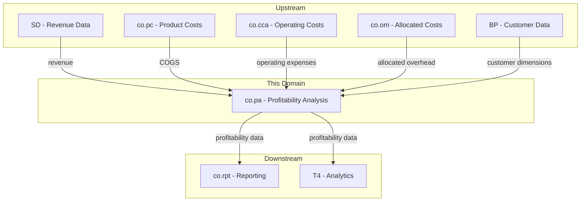
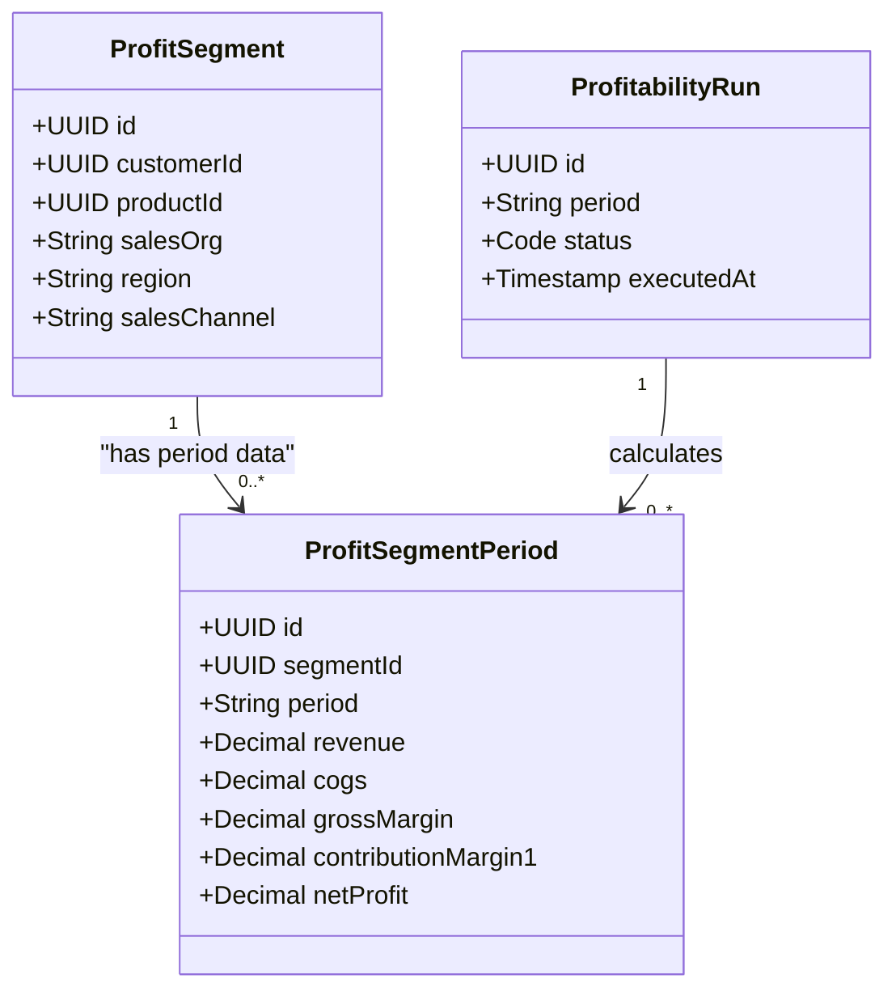
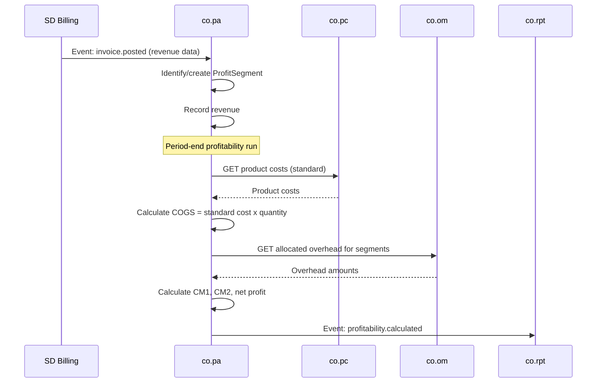
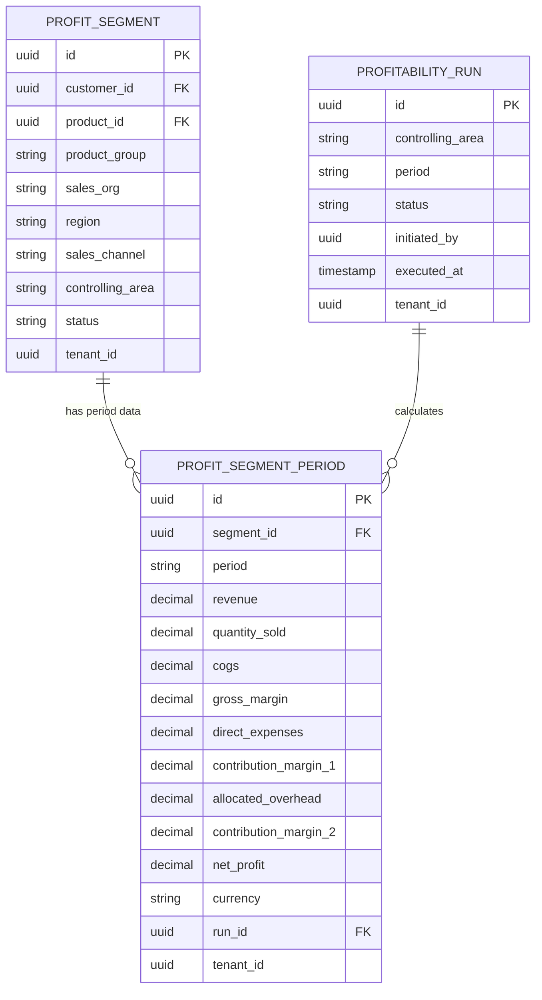

# CO - PA Profitability Analysis Domain / Service Specification

> **Conceptual Stack Layer:** Domain / Service
> **Space:** Platform
> **Owner:** Domain Engineering Team
> **Schema alignment:** `service-layer.schema.json`
> **Companion files:** `openapi.yaml`, `*.schema.json` (event contracts)
> **Referenced by:** Platform-Feature Spec SS5 (backend dependencies), BFF Contract
> **Belongs to:** CO Suite Spec (`_co_suite.md`)

> **Meta Information**
> - **Version:** 2026-04-01
> - **Template:** `domain-service-spec.md` v1.0.0
> - **Template Compliance:** ~78% — §3/§4/§5/§6/§7 thinner, §11/§12/§13 stubs, §8 no column-level table defs
> - **Author(s):** OpenLeap Architecture Team
> - **Status:** DRAFT
> - **Suite:** `co`
> - **Domain:** `pa`
> - **Bounded Context Ref:** `bc:profitability-analysis`
> - **Service ID:** `co-pa-svc`
> - **basePackage:** `io.openleap.co.pa`
> - **API Base Path:** `/api/co/pa/v1`
> - **OpenLeap Starter Version:** `v1`
> - **Port:** TBD
> - **Repository:** TBD
> - **Tags:** `controlling`, `profitability`, `contribution-margin`, `profit-segment`
> - **Team:**
>   - Name: `team-co`
>   - Email: `co-team@openleap.io`
>   - Slack: `#co-team`

---

## Specification Guidelines Compliance

>
> ### Non-Negotiables
> - Never invent facts. If required info is missing, add an **OPEN QUESTION** entry.
> - Preserve intent and decisions. Only change meaning when explicitly requested.
> - Keep the spec **self-contained**: no "see chat", no implicit context.
>
> ### Style Guide
> - Use MUST/SHOULD/MAY for normative statements.

---

## 0. Document Purpose & Scope

### 0.1 Purpose
This specification defines the Profitability Analysis (PA) domain, which calculates and analyzes profitability by multiple dimensions: customer, product, region, sales channel, and any custom dimension. PA combines revenue data (from SD) with cost data (from co.pc, co.cca) to compute contribution margins and net profitability.

### 0.2 Target Audience
- Product Owners & Business Stakeholders
- System Architects & Technical Leads
- Integration Engineers

### 0.3 Scope
**In Scope:**
- Multi-dimensional profitability analysis (costing-based and account-based)
- Profit segment management (dimension combinations)
- Revenue capture from SD events
- COGS lookup from co.pc
- Operating expense allocation from co.cca/co.om
- Contribution margin calculation (multiple levels)
- Period-end profitability computation

**Out of Scope:**
- Revenue recognition and invoicing (-> SD / fi.acc)
- Product cost calculation (-> co.pc)
- Cost allocations (-> co.om)
- Profit center accounting (-> co.pca)
- Strategic BI dashboards (-> T4 Analytics)

### 0.4 Related Documents
- `_co_suite.md` - CO Suite overview
- `co_pc-spec.md` - Product Costing (COGS source)
- `co_cca-spec.md` - Cost Center Accounting
- `co_om-spec.md` - Overhead Management
- `sd_bil-spec.md` - SD Billing (revenue source)

---

## 1. Business Context

### 1.1 Domain Purpose
`co.pa` answers **"Where do we make money?"** It combines revenue and costs across multiple dimensions to reveal which customers, products, regions, and channels are profitable and which are not.

### 1.2 Business Value
- Identify profitable and unprofitable customers/products
- Support pricing decisions with actual margin data
- Analyze profitability trends over time
- Support strategic portfolio decisions (invest/divest)
- Contribution margin analysis at multiple levels

### 1.3 Key Stakeholders

| Role | Responsibility | Primary Use Cases |
|------|----------------|-------------------|
| Controller | Configure dimensions, run profitability | UC-001, UC-003 |
| Sales Manager | Review customer profitability | UC-004 |
| Product Manager | Review product profitability | UC-004 |
| CFO | Strategic profitability overview | UC-005 |

### 1.4 Strategic Positioning



### 1.5 Service Context

| Property | Value |
|----------|-------|
| **Suite** | `co` |
| **Domain** | `pa` |
| **Bounded Context** | `bc:profitability-analysis` |
| **Service ID** | `co-pa-svc` |
| **Base Package** | `io.openleap.co.pa` |

---

## 2. Service Identity

| Property | Value | Schema Field |
|----------|-------|-------------|
| **Service ID** | `co-pa-svc` | `metadata.id` |
| **Display Name** | `Profitability Analysis` | `metadata.name` |
| **Suite** | `co` | `metadata.suite` |
| **Domain** | `pa` | `metadata.domain` |
| **Bounded Context** | `bc:profitability-analysis` | `metadata.bounded_context_ref` |
| **Version** | `1.0.0` | `metadata.version` |
| **Status** | DRAFT | `metadata.status` |
| **API Base Path** | `/api/co/pa/v1` | `metadata.api_base_path` |
| **Repository** | TBD | `metadata.repository` |
| **Tags** | `controlling`, `profitability`, `contribution-margin` | `metadata.tags` |

**Team:**
| Property | Value |
|----------|-------|
| **Name** | `team-co` |
| **Email** | `co-team@openleap.io` |
| **Slack Channel** | `#co-team` |

---

## 3. Domain Model

### 3.1 Conceptual Overview
PA manages **Profit Segments** — unique combinations of analysis dimensions (customer x product x region x channel). Each segment accumulates revenue and cost data per period. **Profitability Runs** compute contribution margins across all segments for a period.

### 3.2 Core Concepts



### 3.3 Aggregate Definitions

#### 3.3.1 ProfitSegment

| Property | Value |
|----------|-------|
| **Aggregate ID** | `agg:profit-segment` |
| **Name** | `ProfitSegment` |

**Business Purpose:** A unique combination of analysis dimensions representing a profitability unit.

**Key Attributes:**
| Attribute | Type | Format | Description | Constraints | Required | Read-Only |
|-----------|------|--------|-------------|-------------|----------|-----------|
| id | string | uuid | Unique identifier | — | Yes | Yes |
| customerId | string | uuid | FK to BP (customer) | null = all customers | No | No |
| productId | string | uuid | FK to CAT (product) | null = all products | No | No |
| productGroup | string | — | Product group code | — | No | No |
| salesOrg | string | — | Sales organization | — | No | No |
| region | string | — | Geographic region | — | No | No |
| salesChannel | string | — | Channel | enum: direct, online, distributor, retail | No | No |
| controllingArea | string | — | CO area | — | Yes | No |
| status | string | — | State | enum: active, inactive | Yes | No |
| tenantId | string | uuid | Tenant | — | Yes | Yes |

**Invariants:**
| Rule ID | Description |
|---------|-------------|
| BR-001 | No duplicate dimension combinations per tenant |
| BR-003 | At least one dimension MUST be set |

#### 3.3.2 ProfitSegmentPeriod

**Business Purpose:** Period-level profitability data for a segment.

**Key Attributes:**
| Attribute | Type | Format | Description | Constraints | Required |
|-----------|------|--------|-------------|-------------|----------|
| id | string | uuid | Unique identifier | — | Yes |
| segmentId | string | uuid | FK to ProfitSegment | — | Yes |
| period | string | — | YYYY-MM | — | Yes |
| revenue | number | decimal | Total revenue | >= 0, precision: 4 | Yes |
| quantitySold | number | decimal | Units sold | >= 0 | No |
| cogs | number | decimal | Cost of goods sold | >= 0 | Yes |
| grossMargin | number | decimal | revenue - cogs | Computed | Yes |
| directExpenses | number | decimal | Direct operating expenses | >= 0 | No |
| contributionMargin1 | number | decimal | grossMargin - directExpenses | Computed | Yes |
| allocatedOverhead | number | decimal | Overhead allocated | >= 0 | No |
| contributionMargin2 | number | decimal | CM1 - allocatedOverhead | Computed | Yes |
| netProfit | number | decimal | Final profit | Computed | Yes |
| grossMarginPct | number | decimal | GM % | Computed | Yes |
| cm1Pct | number | decimal | CM1 % | Computed | Yes |
| currency | string | — | ISO 4217 | — | Yes |
| runId | string | uuid | FK to ProfitabilityRun | Set on run | No |
| tenantId | string | uuid | Tenant | — | Yes |

### 3.4 Enumerations

> OPEN QUESTION: Content for this section has not been authored yet.

### 3.5 Shared Types

> OPEN QUESTION: Content for this section has not been authored yet.

---

## 4. Business Rules & Constraints

### 4.1 Business Rules Catalog

| ID | Rule Name | Description | Scope | Enforcement | Error Code |
|----|-----------|-------------|-------|-------------|------------|
| BR-001 | Unique Segment | No duplicate dimension combinations | ProfitSegment | Create | `DUPLICATE_SEGMENT` |
| BR-002 | Revenue First | Profitability only calculated for segments with revenue | ProfitabilityRun | Execute | — |
| BR-003 | Standard COGS | Use active standard cost for COGS (not actual, unless configured) | ProfitabilityRun | Execute | — |
| BR-004 | Margin Consistency | grossMargin MUST equal revenue - cogs | ProfitSegmentPeriod | Computation | — |
| BR-005 | Period Alignment | Revenue and costs MUST be for the same period | ProfitabilityRun | Execute | `PERIOD_MISMATCH` |
| BR-006 | One Run Per Period | Only one completed run per (area, period) | ProfitabilityRun | Execute | `DUPLICATE_RUN` |

### 4.3 Data Validation Rules

> OPEN QUESTION: Detailed field-level validations have not been authored yet.

### 4.4 Reference Data Dependencies

> OPEN QUESTION: Content for this section has not been authored yet.

---

## 5. Use Cases

### 5.1 Business Logic Placement

| Logic Type | Placement | Examples |
|------------|-----------|----------|
| Aggregate invariants | Domain Object | Segment uniqueness, dimension validation |
| Cross-aggregate logic | Domain Service | Profitability calculation, COGS lookup |
| Orchestration & transactions | Application Service | Profitability run, event publishing |

### 5.2 Use Cases (Canonical Format)

#### UC-001: ConfigureAnalysisDimensions

| Field | Value |
|-------|-------|
| **id** | `ConfigureAnalysisDimensions` |
| **type** | WRITE |
| **trigger** | REST |
| **aggregate** | `AnalysisDimension` |
| **domainOperation** | `AnalysisDimension.configure` |
| **inputs** | `dimensions: AnalysisDimension[]` |
| **outputs** | `AnalysisDimension[]` |
| **rest** | `POST /api/co/pa/v1/dimensions` |
| **idempotency** | optional |

**Actor:** Controller

#### UC-003: ExecuteProfitabilityRun

| Field | Value |
|-------|-------|
| **id** | `ExecuteProfitabilityRun` |
| **type** | WRITE |
| **trigger** | REST |
| **aggregate** | `ProfitabilityRun` |
| **domainOperation** | `ProfitabilityRun.execute` |
| **inputs** | `controllingArea: String`, `period: String` |
| **outputs** | `ProfitabilityRun` |
| **events** | `Profitability.calculated` |
| **rest** | `POST /api/co/pa/v1/runs/execute` |
| **idempotency** | required |
| **errors** | `DUPLICATE_RUN` |

**Actor:** Controller

**Main Flow:**
1. Trigger profitability run for period
2. For each segment with revenue data: look up COGS from co.pc, calculate gross margin, apply overhead from co.om, calculate CM1/CM2/net profit
3. Store ProfitSegmentPeriod records
4. Publish `co.pa.profitability.calculated` event

### 5.3 Process Flow Diagrams



### 5.4 Cross-Domain Workflows

**Does this domain participate in multi-service workflows?** [ ] YES [x] NO

---

## 6. REST API

### 6.1 API Overview
**Base Path:** `/api/co/pa/v1`
**Authorization:** `co.pa:read`, `co.pa:write`, `co.pa:execute`, `co.pa:admin`

### 6.2 Resource Operations

#### Profit Segments
```http
GET /api/co/pa/v1/segments?customerId={id}&region=EMEA
GET /api/co/pa/v1/segments/{id}
GET /api/co/pa/v1/segments/{id}/periods?from=2026-01&to=2026-06
```

### 6.3 Business Operations

#### Execute Profitability Run
```http
POST /api/co/pa/v1/runs/execute
```
```json
{ "controllingArea": "CA01", "period": "2026-02" }
```

#### Profitability by Dimension
```http
GET /api/co/pa/v1/analysis/by-customer?period=2026-02&sort=cm1,desc&limit=20
GET /api/co/pa/v1/analysis/by-product?period=2026-02
GET /api/co/pa/v1/analysis/by-region?period=2026-02
```

**Response:**
```json
{
  "period": "2026-02",
  "dimension": "customer",
  "currency": "EUR",
  "content": [
    {
      "customerId": "uuid-cust-001",
      "customerName": "ABC Corp",
      "revenue": 9000.00,
      "cogs": 3500.00,
      "grossMargin": 5500.00,
      "grossMarginPct": 61.11,
      "contributionMargin1": 4850.00,
      "cm1Pct": 53.89,
      "netProfit": 4050.00
    }
  ]
}
```

### 6.4 OpenAPI Specification
**Location:** `contracts/http/co/pa/openapi.yaml`

---

## 7. Events & Integration

### 7.1 Event-Driven Architecture Pattern
**Pattern Used:** [x] Event-Driven (Choreography) [ ] Orchestration (Saga) [ ] Hybrid

**Follows Suite Pattern:** [x] YES [ ] NO

**Message Broker:** `RabbitMQ`

### 7.2 Published Events

| Routing Key | Consumers | Description |
|------------|-----------|-------------|
| `co.pa.profitability.calculated` | co-rpt-svc, T4 | Period profitability results |
| `co.pa.segment.created` | co-rpt-svc | New dimension values |

### 7.3 Consumed Events

| Event | Source | Purpose |
|-------|--------|---------|
| sd.bil.invoice.posted | SD Billing | Revenue data |
| co.pc.productCost.activated | co-pc-svc | Updated COGS rates |
| co.om.allocation.executed | co-om-svc | Overhead allocation to segments |
| co.cca.cost.posted | co-cca-svc | Direct expense tracking |

---

## 8. Data Model

### 8.1 Conceptual Data Model



---

## 9. Security & Compliance

### 9.1 Data Classification

| Data Element | Classification | Protection |
|--------------|----------------|------------|
| Customer Profitability | Restricted | Encryption, strict RBAC |
| Product Margins | Confidential | Encryption, RBAC (competitive) |
| Revenue Data | Confidential | RBAC |

### 9.2 Access Control

| Role | View Own Region | View All | Execute Runs | Admin |
|------|----------------|---------|-------------|-------|
| CO_PA_VIEWER | Yes | No | No | No |
| CO_PA_ANALYST | Yes | Yes | No | No |
| CO_PA_CONTROLLER | Yes | Yes | Yes | No |
| CO_PA_ADMIN | Yes | Yes | Yes | Yes |

---

## 10. Quality Attributes

| Operation | Target (p95) |
|-----------|-------------|
| Profitability query by dimension | < 200ms |
| Profitability run (10,000 segments) | < 10 min |
| Revenue event processing | < 500ms |

**Availability:** 99.5% | **RTO:** < 30 min | **RPO:** < 15 min

---

## 11. Feature Dependencies

> OPEN QUESTION: Content for this section has not been authored yet.

---

## 12. Extension Points

> OPEN QUESTION: Content for this section has not been authored yet.

---

## 13. Migration & Evolution

> OPEN QUESTION: Migration strategy for profitability analysis data has not been authored yet.

---

## 14. Decisions & Open Questions

### 14.1 Open Questions

| ID | Question | Impact | Needed By |
|----|----------|--------|-----------|
| Q-001 | Support custom dimensions beyond the standard set? | Data model | Phase 2 |
| Q-002 | Costing-based vs. account-based PA — support both? | Algorithm | Phase 2 |
| Q-003 | How to handle transfer pricing for inter-company segments? | Pricing | Phase 2 |

### 14.2 Architectural Decision Records (ADRs)

#### ADR-PA-001: Costing-Based PA First

**Status:** Accepted

**Decision:** Phase 1 implements costing-based PA (standard cost x quantity for COGS). Account-based PA (actual GL postings) deferred to Phase 2.

**Consequences:**
| Positive | Negative |
|----------|----------|
| Simpler initial implementation | Cannot reconcile to GL directly |
| Faster time-to-value | Account-based deferred |

---

## 15. Appendix

### 15.1 Glossary

| Term | Definition | Aliases |
|------|------------|---------|
| Profit Segment | Unique dimension combination for analysis | Ergebnisbereich |
| Contribution Margin | Revenue minus variable/direct costs | Deckungsbeitrag |
| COGS | Cost of Goods Sold | Herstellkosten des Umsatzes |

### 15.2 Change Log

| Date | Version | Author | Changes |
|------|---------|--------|---------|
| 2026-02-23 | 1.0 | OpenLeap Architecture Team | Initial version |
| 2026-04-01 | 1.1 | OpenLeap Architecture Team | Restructured to template compliance (sections 0-15) |

### 15.3 Review & Approval
**Status:** DRAFT
