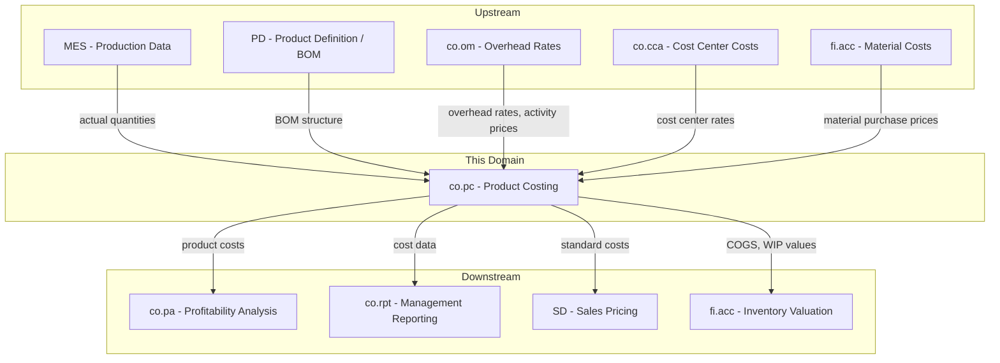
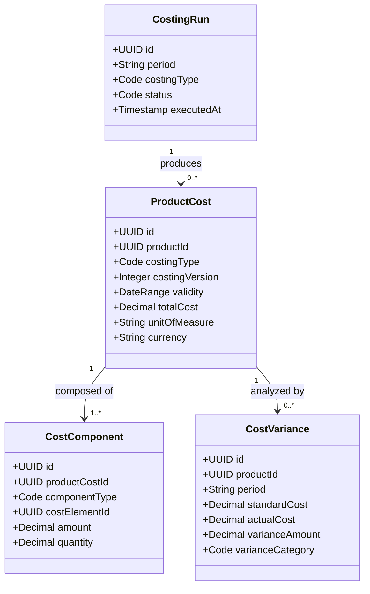
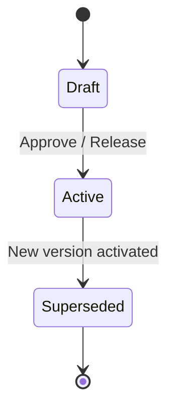
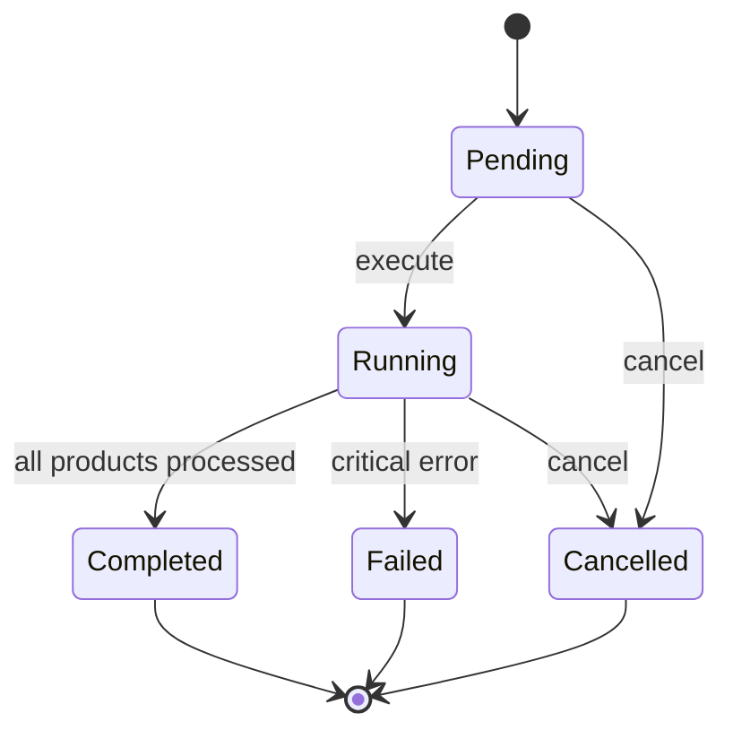
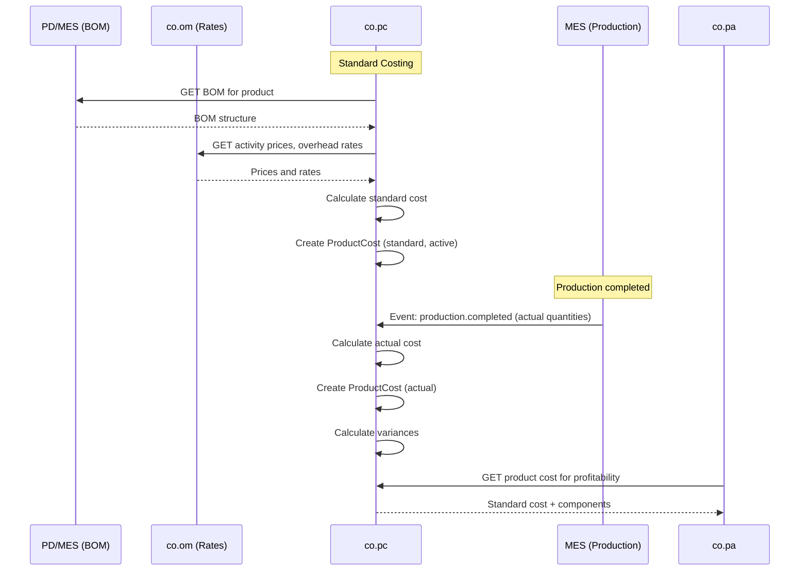
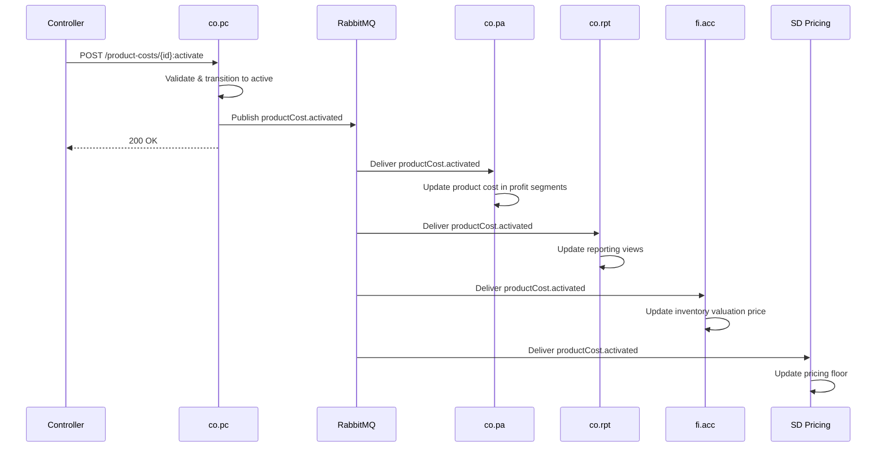
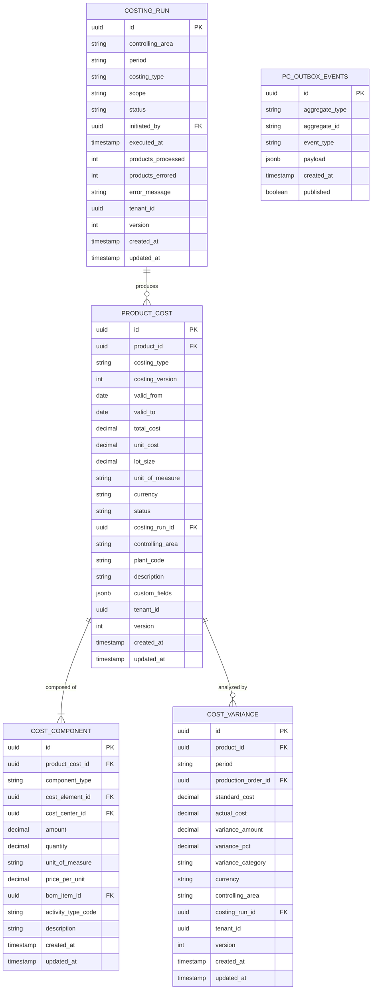

# CO - PC Product Costing Domain / Service Specification

> **Conceptual Stack Layer:** Domain / Service
> **Space:** Platform
> **Owner:** Domain Engineering Team
> **Schema alignment:** `service-layer.schema.json`
> **Companion files:** `openapi.yaml`, `*.schema.json` (event contracts)
> **Referenced by:** Platform-Feature Spec SS5 (backend dependencies), BFF Contract
> **Belongs to:** CO Suite Spec (`_co_suite.md`)

> **Meta Information**
> - **Version:** 2026-04-04
> - **Template:** `domain-service-spec.md` v1.0.0
> - **Template Compliance:** ~95% — §11 feature register TBD, §12.7 extension API endpoints thin
> - **Author(s):** OpenLeap Architecture Team
> - **Status:** DRAFT
> - **Suite:** `co`
> - **Domain:** `pc`
> - **Bounded Context Ref:** `bc:product-costing`
> - **Service ID:** `co-pc-svc`
> - **basePackage:** `io.openleap.co.pc`
> - **API Base Path:** `/api/co/pc/v1`
> - **OpenLeap Starter Version:** `v1`
> - **Port:** TBD
> - **Repository:** TBD
> - **Tags:** `controlling`, `product-costing`, `standard-cost`, `variance`
> - **Team:**
>   - Name: `team-co`
>   - Email: `co-team@openleap.io`
>   - Slack: `#co-team`

---

## Specification Guidelines Compliance

> ### Non-Negotiables
> - Never invent facts. If required info is missing, add an **OPEN QUESTION** entry.
> - Preserve intent and decisions. Only change meaning when explicitly requested.
> - Do not remove normative constraints unless they are explicitly replaced.
> - Keep the spec **self-contained**: no "see chat", no implicit context.
>
> ### Source of Truth Priority
> When sources conflict:
> 1. Spec (explicit) wins
> 2. Starter specs (implementation constraints) next
> 3. Guidelines (best practices) last
>
> Record conflicts in the **Decisions & Conflicts** section (see Section 14).
>
> ### Style Guide
> - Prefer short sentences and lists.
> - Use MUST/SHOULD/MAY for normative statements.
> - Keep terminology consistent (Aggregate, Domain Service, Application Service, Command, Event).
> - Avoid ambiguous words ("often", "maybe") unless explicitly noting uncertainty.
> - Keep examples minimal and clearly marked as examples.
> - Do not add implementation code unless the chapter explicitly requires it.

---

## 0. Document Purpose & Scope

### 0.1 Purpose
This specification defines the Product Costing (PC) domain, which calculates and tracks the cost of manufactured and purchased products. PC manages standard cost definitions, captures actual production costs, and performs variance analysis between standard and actual costs.

### 0.2 Target Audience
- Product Owners & Business Stakeholders
- System Architects & Technical Leads
- Integration Engineers

### 0.3 Scope
**In Scope:**
- Standard cost definition (BOM-based cost rollup)
- Cost component management (material, labor, overhead, subcontracting)
- Actual cost capture from production (MES events)
- Variance analysis (price, quantity, mix, volume)
- Costing versions and effective dating
- WIP (Work-in-Progress) valuation support

**Out of Scope:**
- Bill of Materials management (-> Product Definition / MES)
- Production execution and scheduling (-> MES)
- Cost allocations (-> co.om)
- Profitability analysis (-> co.pa)
- Inventory valuation accounting (-> fi.acc)

### 0.4 Related Documents
- `_co_suite.md` - CO Suite overview
- `co_om-spec.md` - Overhead Management (overhead rates)
- `co_cca-spec.md` - Cost Center Accounting
- `MES_execution.md` - Manufacturing Execution
- `PD_product_definition.md` - Product Definition
- `fi_acc_core_spec_complete.md` - Financial Accounting

---

## 1. Business Context

### 1.1 Domain Purpose
`co.pc` answers the question **"What does it cost to make a product?"** It maintains standard costs for planning and valuation, captures actual production costs, and identifies cost variances that highlight inefficiencies or price changes.

### 1.2 Business Value
- Accurate product costs for pricing decisions
- Standard costs for inventory valuation and COGS
- Variance analysis to identify production inefficiencies
- Cost component transparency (material, labor, overhead breakdown)
- Support for make-or-buy decisions

### 1.3 Key Stakeholders

| Role | Responsibility | Primary Use Cases |
|------|----------------|-------------------|
| Cost Accountant | Define and maintain standard costs | UC-001, UC-002 |
| Controller | Analyze variances, approve standard cost changes | UC-004 |
| Production Manager | Review actual vs. standard costs | UC-003, UC-004 |
| Procurement | Provide material price inputs | UC-001 |
| Sales / Pricing | Use standard costs as pricing floor | UC-005 |

### 1.4 Strategic Positioning



### 1.5 Service Context

| Property | Value |
|----------|-------|
| **Suite** | `co` |
| **Domain** | `pc` |
| **Bounded Context** | `bc:product-costing` |
| **Service ID** | `co-pc-svc` |
| **Base Package** | `io.openleap.co.pc` |

**Responsibilities:**
- Calculate standard product costs by exploding the BOM and applying material prices, activity prices, and overhead rates
- Capture actual production costs from MES completion events
- Perform variance analysis decomposing differences into price, quantity, efficiency, and volume categories
- Manage costing versions with effective dating for period-specific cost snapshots
- Provide cost data to downstream consumers (profitability analysis, sales pricing, inventory valuation)

**Authoritative Sources:**
| Source Type | Description | Access Pattern |
|-------------|-------------|----------------|
| REST API | Product cost queries, variance reports, costing run status | Synchronous |
| Database | Product costs, cost components, variances, costing runs | Direct (owner) |
| Events | Cost activation, actual cost calculation, variance results, costing run completion | Asynchronous |

---

## 2. Service Identity

| Property | Value | Schema Field |
|----------|-------|-------------|
| **Service ID** | `co-pc-svc` | `metadata.id` |
| **Display Name** | `Product Costing` | `metadata.name` |
| **Suite** | `co` | `metadata.suite` |
| **Domain** | `pc` | `metadata.domain` |
| **Bounded Context** | `bc:product-costing` | `metadata.bounded_context_ref` |
| **Version** | `1.0.0` | `metadata.version` |
| **Status** | DRAFT | `metadata.status` |
| **API Base Path** | `/api/co/pc/v1` | `metadata.api_base_path` |
| **Repository** | TBD | `metadata.repository` |
| **Tags** | `controlling`, `product-costing`, `variance` | `metadata.tags` |

**Team:**
| Property | Value |
|----------|-------|
| **Name** | `team-co` |
| **Email** | `co-team@openleap.io` |
| **Slack Channel** | `#co-team` |

---

## 3. Domain Model

### 3.1 Conceptual Overview
PC manages **Product Costs** (standard, actual, planned per product), composed of **Cost Components** (material, labor, overhead, subcontracting). **Costing Runs** calculate or recalculate costs for a set of products. **Cost Variances** record differences between standard and actual at the component level.

### 3.2 Core Concepts



### 3.3 Aggregate Definitions

#### 3.3.1 ProductCost

| Property | Value |
|----------|-------|
| **Aggregate ID** | `agg:product-cost` |
| **Name** | `ProductCost` |

**Business Purpose:** The calculated cost of a product for a specific costing type and version. A ProductCost record captures the full cost breakdown for one product at a given lot size, expressed through its child CostComponent items. Standard costs serve as the basis for inventory valuation and COGS; actual costs capture realized production expenditure.

##### Aggregate Root

**Key Attributes:**
| Attribute | Type | Format | Description | Constraints | Required | Read-Only |
|-----------|------|--------|-------------|-------------|----------|-----------|
| id | string | uuid | Unique identifier (OlUuid) | Immutable | Yes | Yes |
| productId | string | uuid | FK to product catalog; identifies the material or finished good being costed | — | Yes | No |
| costingType | string | — | Classification of this cost record | enum_ref: `CostingType` | Yes | No |
| costingVersion | integer | int32 | Monotonically increasing version number within the same product and costing type | >= 1 | Yes | No |
| validFrom | string | date | Effective start date of this cost version | — | Yes | No |
| validTo | string | date | Effective end date; null means open-ended | minimum: validFrom | No | No |
| totalCost | number | decimal | Sum of all cost components for the lot size | Computed, precision: 4 | Yes | Yes |
| unitOfMeasure | string | — | Base unit of measure for the product (e.g., EA, KG) | — | Yes | No |
| currency | string | — | ISO 4217 currency code | pattern: `^[A-Z]{3}$` | Yes | No |
| lotSize | number | decimal | Quantity basis used for the costing calculation (e.g., 1000 units) | > 0, precision: 4 | Yes | No |
| unitCost | number | decimal | Cost per single unit, derived as totalCost / lotSize | Computed, precision: 6 | Yes | Yes |
| status | string | — | Current lifecycle state | enum_ref: `ProductCostStatus` | Yes | No |
| costingRunId | string | uuid | FK to the CostingRun that produced this record; null if manually created | — | No | No |
| controllingArea | string | — | Controlling area code grouping organizational units for CO | max_length: 10 | Yes | No |
| plantCode | string | — | Production plant code where this cost applies | max_length: 10 | No | No |
| description | string | — | Free-text description or label for this cost version | max_length: 255 | No | No |
| tenantId | string | uuid | Tenant ownership for RLS | — | Yes | Yes |
| version | integer | int64 | Optimistic locking version | — | Yes | Yes |
| createdAt | string | date-time | Record creation timestamp | — | Yes | Yes |
| updatedAt | string | date-time | Last modification timestamp | — | Yes | Yes |

**Lifecycle States:**

| Property | Value |
|----------|-------|
| **Initial State** | `draft` |
| **Terminal States** | `superseded` |



**State Descriptions:**
| State | Description | Business Meaning |
|-------|-------------|------------------|
| Draft | Initial creation state | Cost estimate is being prepared, components may be incomplete; not yet usable for valuation |
| Active | Operational state | This is the current effective cost for the product; used for inventory valuation, COGS, and pricing |
| Superseded | Terminal state | Replaced by a newer active version; retained for historical analysis and audit trail |

**Allowed Transitions:**
| From State | To State | Trigger | Guard / Business Preconditions |
|------------|----------|---------|-------------------------------|
| Draft | Active | `activate` command | BR-001 (no other active standard for product), BR-002 (components sum to totalCost), BR-006 (cost > 0) |
| Active | Superseded | New version activated for same product + costingType | System-triggered when a new ProductCost for the same product and type reaches Active |

**Invariants:**
| Rule ID | Description |
|---------|-------------|
| BR-001 | Only one active standard cost per product per controlling area |
| BR-002 | Components MUST sum to totalCost |
| BR-003 | All components calculated for same lotSize |
| BR-004 | Active ProductCost MUST NOT be modified (create new version) |
| BR-006 | Standard cost MUST be > 0 (except free items) |

**Domain Events Emitted:**
- `co.pc.productCost.created`
- `co.pc.productCost.activated`
- `co.pc.productCost.superseded`
- `co.pc.actualCost.calculated`

##### Child Entities

###### Entity: CostComponent

| Property | Value |
|----------|-------|
| **Entity ID** | `ent:cost-component` |
| **Name** | `CostComponent` |
| **Relationship to Root** | one_to_many |

**Business Purpose:** Represents a single cost element within a product cost breakdown. Each component captures one type of cost (raw material, labor, machine time, overhead, subcontracting, freight, packaging) with its quantity, unit price, and total amount. Components provide the transparency needed for variance analysis and cost optimization.

**Attributes:**
| Attribute | Type | Format | Description | Constraints | Required |
|-----------|------|--------|-------------|-------------|----------|
| id | string | uuid | Unique identifier (OlUuid) | Immutable | Yes |
| productCostId | string | uuid | FK to parent ProductCost | — | Yes |
| componentType | string | — | Type of cost component | enum_ref: `ComponentType` | Yes |
| costElementId | string | uuid | FK to CO cost element (Kostenart) for GL mapping | — | Yes |
| costCenterId | string | uuid | FK to cost center where the cost originates | — | No |
| amount | number | decimal | Total cost amount for this component at lot size | precision: 4 | Yes |
| quantity | number | decimal | Quantity consumed (e.g., kg of material, hours of labor) | precision: 4 | Yes |
| unitOfMeasure | string | — | Unit for the quantity field | — | Yes |
| pricePerUnit | number | decimal | Unit price used in calculation (amount / quantity) | precision: 6 | Yes |
| bomItemId | string | uuid | FK to BOM line item (for material components) | — | No |
| activityTypeCode | string | — | Activity type code from co.om (for labor/machine components) | max_length: 20 | No |
| description | string | — | Descriptive label for this component line | max_length: 255 | No |

**Collection Constraints:**
- Minimum items: 1 (a ProductCost MUST have at least one component)
- Maximum items: 500 (practical limit for complex BOMs)

**Invariants:**
| Rule ID | Description |
|---------|-------------|
| BR-002 | Sum of all component amounts MUST equal parent totalCost |
| BR-003 | All components MUST use the same lotSize as the parent |

##### Value Objects

###### Value Object: Money

| Property | Value |
|----------|-------|
| **VO ID** | `vo:money` |
| **Name** | `Money` |

**Description:** Represents a monetary amount with its currency. Used for cost values throughout the domain.

**Attributes:**
| Attribute | Type | Format | Description | Constraints |
|-----------|------|--------|-------------|-------------|
| amount | number | decimal | Monetary amount | precision: 4 |
| currencyCode | string | — | ISO 4217 currency code | pattern: `^[A-Z]{3}$` |

**Validation Rules:**
- amount MUST NOT be null
- currencyCode MUST be a valid ISO 4217 code
- Arithmetic operations MUST only be performed between Money objects with the same currencyCode

###### Value Object: DateRange

| Property | Value |
|----------|-------|
| **VO ID** | `vo:date-range` |
| **Name** | `DateRange` |

**Description:** Represents a time validity period with a mandatory start and optional end.

**Attributes:**
| Attribute | Type | Format | Description | Constraints |
|-----------|------|--------|-------------|-------------|
| validFrom | string | date | Start of validity | — |
| validTo | string | date | End of validity (null = open-ended) | minimum: validFrom |

**Validation Rules:**
- validFrom MUST NOT be null
- If validTo is provided, it MUST be >= validFrom

---

#### 3.3.2 CostVariance

| Property | Value |
|----------|-------|
| **Aggregate ID** | `agg:cost-variance` |
| **Name** | `CostVariance` |

**Business Purpose:** Records the difference between standard and actual cost for a product in a fiscal period. Variances are decomposed into categories (material price, material quantity, labor rate, labor efficiency, overhead, volume, mix) following SAP CO-PC variance analysis methodology. This enables controllers to pinpoint root causes of cost deviations.

##### Aggregate Root

**Key Attributes:**
| Attribute | Type | Format | Description | Constraints | Required | Read-Only |
|-----------|------|--------|-------------|-------------|----------|-----------|
| id | string | uuid | Unique identifier (OlUuid) | Immutable | Yes | Yes |
| productId | string | uuid | FK to the product being analyzed | — | Yes | No |
| period | string | — | Fiscal period in YYYY-MM format | pattern: `^\d{4}-\d{2}$` | Yes | No |
| productionOrderId | string | uuid | FK to MES production order; null for aggregate period variances | — | No | No |
| standardCost | number | decimal | Expected cost based on active standard | precision: 4 | Yes | No |
| actualCost | number | decimal | Realized cost from actual production data | precision: 4 | Yes | No |
| varianceAmount | number | decimal | Absolute variance (actualCost - standardCost) | Computed, precision: 4 | Yes | Yes |
| variancePct | number | decimal | Percentage variance ((actual - standard) / standard * 100) | Computed, precision: 2 | Yes | Yes |
| varianceCategory | string | — | Type of variance | enum_ref: `VarianceCategory` | Yes | No |
| currency | string | — | ISO 4217 currency code | pattern: `^[A-Z]{3}$` | Yes | No |
| controllingArea | string | — | Controlling area | max_length: 10 | Yes | No |
| costingRunId | string | uuid | FK to CostingRun that produced this variance | — | No | No |
| tenantId | string | uuid | Tenant ownership for RLS | — | Yes | Yes |
| version | integer | int64 | Optimistic locking version | — | Yes | Yes |
| createdAt | string | date-time | Record creation timestamp | — | Yes | Yes |
| updatedAt | string | date-time | Last modification timestamp | — | Yes | Yes |

**Domain Events Emitted:**
- `co.pc.variance.calculated`

---

#### 3.3.3 CostingRun

| Property | Value |
|----------|-------|
| **Aggregate ID** | `agg:costing-run` |
| **Name** | `CostingRun` |

**Business Purpose:** Represents a batch execution that calculates or recalculates product costs for a defined scope of products. Analogous to SAP transaction CK11N/CK40N. A costing run gathers current prices and rates, explodes BOMs, and produces ProductCost records. It also triggers variance analysis when comparing against actual costs.

##### Aggregate Root

**Key Attributes:**
| Attribute | Type | Format | Description | Constraints | Required | Read-Only |
|-----------|------|--------|-------------|-------------|----------|-----------|
| id | string | uuid | Unique identifier (OlUuid) | Immutable | Yes | Yes |
| controllingArea | string | — | Controlling area code | max_length: 10 | Yes | No |
| period | string | — | Fiscal period targeted (YYYY-MM) | pattern: `^\d{4}-\d{2}$` | Yes | No |
| costingType | string | — | Type of costs being calculated | enum_ref: `CostingType` | Yes | No |
| scope | string | — | Scope of the run | enum_ref: `CostingScope` | Yes | No |
| status | string | — | Current execution state | enum_ref: `CostingRunStatus` | Yes | No |
| initiatedBy | string | uuid | User who triggered the run | — | Yes | Yes |
| executedAt | string | date-time | Timestamp when execution completed | — | No | Yes |
| productsProcessed | integer | int32 | Count of products processed | >= 0 | No | Yes |
| productsErrored | integer | int32 | Count of products that failed costing | >= 0 | No | Yes |
| errorMessage | string | — | Summary error if the run failed | max_length: 2000 | No | Yes |
| tenantId | string | uuid | Tenant ownership for RLS | — | Yes | Yes |
| version | integer | int64 | Optimistic locking version | — | Yes | Yes |
| createdAt | string | date-time | Record creation timestamp | — | Yes | Yes |
| updatedAt | string | date-time | Last modification timestamp | — | Yes | Yes |

**Lifecycle States:**

| Property | Value |
|----------|-------|
| **Initial State** | `pending` |
| **Terminal States** | `completed`, `failed`, `cancelled` |



**State Descriptions:**
| State | Description | Business Meaning |
|-------|-------------|------------------|
| Pending | Run created but not yet started | Awaiting execution; parameters validated |
| Running | Calculation in progress | System is processing BOM explosions and cost calculations |
| Completed | All products processed successfully | Results are available; ProductCost records created |
| Failed | Run terminated due to critical error | Partial results may exist; requires investigation |
| Cancelled | Run was cancelled before completion | No results produced or partial results discarded |

**Allowed Transitions:**
| From State | To State | Trigger | Guard / Business Preconditions |
|------------|----------|---------|-------------------------------|
| Pending | Running | `execute` command | No other run in Running state for same controllingArea |
| Running | Completed | All products processed | productsProcessed > 0 |
| Running | Failed | Unrecoverable error | — |
| Pending | Cancelled | `cancel` command | — |
| Running | Cancelled | `cancel` command | — |

**Domain Events Emitted:**
- `co.pc.costingRun.started`
- `co.pc.costingRun.completed`
- `co.pc.costingRun.failed`

### 3.4 Enumerations

#### CostingType

**Description:** Classifies the purpose and method of a product cost calculation.

| Value | Description | Deprecated |
|-------|-------------|------------|
| `standard` | Predetermined cost for planning and inventory valuation (SAP: Standard Price) | No |
| `actual` | Realized cost based on actual production quantities and prices | No |
| `planned` | Forward-looking estimate for budgeting and what-if analysis | No |
| `simulated` | Temporary calculation for scenario modeling; not persisted as active | No |

#### ProductCostStatus

**Description:** Lifecycle state of a ProductCost record.

| Value | Description | Deprecated |
|-------|-------------|------------|
| `draft` | Being prepared; components may be incomplete | No |
| `active` | Current effective cost; used for valuation and pricing | No |
| `superseded` | Replaced by newer active version; retained for audit | No |

#### CostingRunStatus

**Description:** Execution state of a costing run.

| Value | Description | Deprecated |
|-------|-------------|------------|
| `pending` | Created, awaiting execution | No |
| `running` | Calculation in progress | No |
| `completed` | Finished successfully | No |
| `failed` | Terminated due to error | No |
| `cancelled` | Cancelled by user | No |

#### CostingScope

**Description:** Defines the product scope for a costing run.

| Value | Description | Deprecated |
|-------|-------------|------------|
| `all_products` | All active products in the controlling area | No |
| `product_group` | A specific product group or hierarchy node | No |
| `single_product` | A single product | No |
| `changed_only` | Only products with BOM or price changes since last run | No |

#### ComponentType

**Description:** Classifies the type of cost in a cost component line.

| Value | Description | Deprecated |
|-------|-------------|------------|
| `raw_material` | Raw material costs (direct materials from BOM) | No |
| `packaging` | Packaging materials | No |
| `direct_labor` | Direct labor costs (work center activity) | No |
| `machine_time` | Machine time / equipment costs | No |
| `overhead` | Overhead costs applied via surcharge rates | No |
| `subcontracting` | External subcontracting operations | No |
| `freight` | Freight and logistics costs | No |

#### VarianceCategory

**Description:** Classification of cost variance types following standard cost accounting methodology (SAP CO-PC variance categories).

| Value | Description | Deprecated |
|-------|-------------|------------|
| `material_price` | Difference due to material purchase price deviations from planned price | No |
| `material_quantity` | Difference due to material usage quantity deviations from BOM standard | No |
| `labor_rate` | Difference due to labor rate deviations from planned activity price | No |
| `labor_efficiency` | Difference due to labor hours worked vs. standard hours allowed | No |
| `overhead_rate` | Difference due to overhead rate changes from planned surcharge rates | No |
| `overhead_efficiency` | Difference due to overhead base (activity) deviations affecting applied overhead | No |
| `volume` | Difference due to production volume deviating from planned capacity | No |
| `mix` | Difference due to product mix changes affecting weighted average costs | No |

### 3.5 Shared Types

#### Money

| Property | Value |
|----------|-------|
| **Type ID** | `type:money` |
| **Name** | `Money` |

**Description:** Represents a monetary value with its currency. Used for all cost amounts.

**Attributes:**
| Attribute | Type | Format | Description | Constraints |
|-----------|------|--------|-------------|-------------|
| amount | number | decimal | Monetary amount | precision: 4 |
| currencyCode | string | — | ISO 4217 currency code | pattern: `^[A-Z]{3}$` |

**Validation Rules:**
- amount MUST NOT be null
- currencyCode MUST be a valid ISO 4217 code

**Used By:**
- `agg:product-cost` (totalCost, unitCost)
- `agg:cost-variance` (standardCost, actualCost, varianceAmount)
- `ent:cost-component` (amount, pricePerUnit)

---

## 4. Business Rules & Constraints

### 4.1 Business Rules Catalog

| ID | Rule Name | Description | Scope | Enforcement | Error Code |
|----|-----------|-------------|-------|-------------|------------|
| BR-001 | One Active Standard | Only one active standard cost per product per controlling area | ProductCost | Activate | `DUPLICATE_ACTIVE` |
| BR-002 | Component Sum | Components MUST sum to totalCost | ProductCost | Create, Update | `COMPONENT_MISMATCH` |
| BR-003 | Lot Size Consistency | All components for same lotSize | CostComponent | Create | `LOT_SIZE_MISMATCH` |
| BR-004 | Version Immutability | Active ProductCost MUST NOT be edited | ProductCost | Update | `IMMUTABLE_ACTIVE` |
| BR-005 | Variance Completeness | Variance analysis required before period close | CostVariance | Period close | `VARIANCE_INCOMPLETE` |
| BR-006 | Positive Standard | Standard cost MUST be > 0 (except free items) | ProductCost | Activate | `ZERO_COST` |
| BR-007 | Material Price Source | Material costs MUST use latest planned purchase price | CostComponent | Costing run | — |
| BR-008 | Component Minimum | A ProductCost MUST have at least one CostComponent | ProductCost | Create | `NO_COMPONENTS` |
| BR-009 | Single Running Run | Only one costing run may be in Running state per controlling area | CostingRun | Execute | `RUN_IN_PROGRESS` |
| BR-010 | Currency Consistency | All components MUST use the same currency as the parent ProductCost | CostComponent | Create | `CURRENCY_MISMATCH` |

### 4.2 Detailed Rule Definitions

#### BR-001: One Active Standard

**Business Context:** Inventory valuation and COGS require a single unambiguous standard cost per product. Multiple active standards would create conflicting valuations in downstream financial postings.

**Rule Statement:** At most one ProductCost record with costingType = `standard` and status = `active` MAY exist for a given combination of (tenantId, productId, controllingArea).

**Applies To:**
- Aggregate: ProductCost
- Operations: Activate

**Enforcement:** When activating a standard ProductCost, the system checks for an existing active standard for the same product and controlling area. If found, the existing record is transitioned to `superseded` before the new one is activated.

**Validation Logic:** `SELECT COUNT(*) FROM product_cost WHERE tenant_id = :tenantId AND product_id = :productId AND controlling_area = :controllingArea AND costing_type = 'standard' AND status = 'active'` MUST return 0 or the existing record is superseded atomically.

**Error Handling:**
- **Error Code:** `DUPLICATE_ACTIVE`
- **Error Message:** "Cannot activate: another active standard cost already exists for this product and could not be superseded"
- **User action:** Check existing active cost version; supersede it manually if automatic supersession failed

**Examples:**
- **Valid:** Product P-100 has one active standard cost v3; activating v4 supersedes v3
- **Invalid:** System failure during activation leaves two active standards (must be repaired)

#### BR-002: Component Sum

**Business Context:** The totalCost field is a summary figure that MUST be mathematically consistent with its detail components to maintain data integrity for financial reporting.

**Rule Statement:** The sum of all CostComponent.amount values for a ProductCost MUST equal ProductCost.totalCost, within a tolerance of 0.01 (rounding).

**Applies To:**
- Aggregate: ProductCost
- Operations: Create, Update

**Enforcement:** Domain object recalculates totalCost from components on every mutation. If manually provided totalCost differs from computed sum by more than tolerance, the operation is rejected.

**Validation Logic:** `|SUM(components.amount) - totalCost| <= 0.01`

**Error Handling:**
- **Error Code:** `COMPONENT_MISMATCH`
- **Error Message:** "Total cost {totalCost} does not match component sum {componentSum}"
- **User action:** Verify component amounts and recalculate

**Examples:**
- **Valid:** Components: material 50.00, labor 30.00, overhead 20.00 -> totalCost = 100.00
- **Invalid:** Components sum to 95.00 but totalCost states 100.00

#### BR-003: Lot Size Consistency

**Business Context:** All cost components MUST be calculated for the same lot size to ensure unit cost comparability. Mixing lot sizes would produce nonsensical cost totals.

**Rule Statement:** Every CostComponent within a ProductCost MUST be calculated based on the same lotSize as the parent ProductCost.

**Applies To:**
- Aggregate: CostComponent
- Operations: Create

**Enforcement:** The costing calculation normalizes all component quantities to the parent lot size before persisting.

**Validation Logic:** Component quantities are scaled to match parent.lotSize during calculation.

**Error Handling:**
- **Error Code:** `LOT_SIZE_MISMATCH`
- **Error Message:** "Component lot size basis does not match parent lot size {lotSize}"
- **User action:** Recalculate component for the correct lot size

**Examples:**
- **Valid:** Parent lotSize = 1000, all component quantities expressed for 1000 units
- **Invalid:** Material component calculated for lot of 500 while parent expects 1000

#### BR-004: Version Immutability

**Business Context:** Once a ProductCost is active, it is used for inventory valuation and financial postings. Changing it retroactively would corrupt financial data. Corrections MUST be made by creating a new version.

**Rule Statement:** A ProductCost with status = `active` MUST NOT be modified. To change costs, create a new version (costingVersion + 1).

**Applies To:**
- Aggregate: ProductCost
- Operations: Update

**Enforcement:** Update operations on active records are rejected at the domain level.

**Validation Logic:** `IF status == 'active' THEN reject update`

**Error Handling:**
- **Error Code:** `IMMUTABLE_ACTIVE`
- **Error Message:** "Active product cost cannot be modified. Create a new version instead."
- **User action:** Create a new ProductCost record with incremented costingVersion

**Examples:**
- **Valid:** Creating v4 as a new record based on v3 values with adjustments
- **Invalid:** Attempting PATCH on an active v3 record

#### BR-005: Variance Completeness

**Business Context:** Period-end closing in controlling requires that all products with actual production have been analyzed for variances. Incomplete variance analysis would produce incomplete management reports.

**Rule Statement:** Before a fiscal period can be closed, variance analysis MUST have been executed for all products with actual costs in that period.

**Applies To:**
- Aggregate: CostVariance
- Operations: Period close

**Enforcement:** Period close check queries for products with actual costs but no corresponding variance records.

**Validation Logic:** For all products with costingType = 'actual' in the period, a CostVariance record MUST exist.

**Error Handling:**
- **Error Code:** `VARIANCE_INCOMPLETE`
- **Error Message:** "Period {period} has {count} products without variance analysis"
- **User action:** Execute variance analysis for the outstanding products

**Examples:**
- **Valid:** 500 products with actuals, 500 variance records exist
- **Invalid:** 500 products with actuals, only 480 variance records

#### BR-006: Positive Standard

**Business Context:** A standard cost of zero or negative would produce invalid inventory valuations and COGS.

**Rule Statement:** A ProductCost with costingType = `standard` MUST have totalCost > 0, unless the product is explicitly flagged as a free item (unitCost = 0 is valid only for free samples/promotional items).

**Applies To:**
- Aggregate: ProductCost
- Operations: Activate

**Enforcement:** Checked during activation.

**Validation Logic:** `IF costingType == 'standard' AND totalCost <= 0 THEN reject`

**Error Handling:**
- **Error Code:** `ZERO_COST`
- **Error Message:** "Standard cost must be greater than zero"
- **User action:** Review cost components and ensure all cost types are populated

**Examples:**
- **Valid:** Standard cost of 42.50 for product P-100
- **Invalid:** Standard cost of 0.00 for a regular product

#### BR-007: Material Price Source

**Business Context:** Consistent material pricing ensures comparability across products and periods. Using ad-hoc prices would undermine cost analysis.

**Rule Statement:** Material cost components in a standard costing run MUST use the latest planned purchase price from the procurement/FI system.

**Applies To:**
- Aggregate: CostComponent
- Operations: Costing run

**Enforcement:** The costing run application service fetches current planned prices from fi.acc before calculating material components.

**Validation Logic:** Price source is validated during costing run execution.

**Error Handling:**
- No specific error code; prices are sourced automatically during costing runs
- If a price is unavailable, an OPEN QUESTION is raised in the costing run log

**Examples:**
- **Valid:** Material M-200 uses planned price of 5.20 EUR/kg from latest price update
- **Invalid:** Material M-200 uses a manually overridden price of 4.00 EUR/kg without justification

### 4.3 Data Validation Rules

**Field-Level Validations:**

| Field | Validation Rule | Error Message |
|-------|----------------|---------------|
| productId | Required, must exist in product catalog | "Product not found" |
| costingType | Required, must be valid enum value | "Invalid costing type" |
| costingVersion | Required, >= 1 | "Costing version must be at least 1" |
| validFrom | Required, valid date | "Valid-from date is required" |
| lotSize | Required, > 0 | "Lot size must be positive" |
| totalCost | Required, >= 0 | "Total cost cannot be negative" |
| currency | Required, 3 uppercase letters | "Invalid currency code" |
| unitOfMeasure | Required | "Unit of measure is required" |
| controllingArea | Required, max 10 chars | "Controlling area is required" |
| varianceCategory | Required, must be valid enum | "Invalid variance category" |
| period | Required, YYYY-MM format | "Period must be in YYYY-MM format" |
| componentType | Required, must be valid enum | "Invalid component type" |
| amount (CostComponent) | Required, precision 4 | "Amount is required" |
| quantity (CostComponent) | Required, precision 4 | "Quantity is required" |
| pricePerUnit (CostComponent) | Required, precision 6 | "Price per unit is required" |

**Cross-Field Validations:**
- validTo MUST be >= validFrom when provided
- totalCost MUST equal SUM(components.amount) (BR-002)
- unitCost MUST equal totalCost / lotSize
- varianceAmount MUST equal actualCost - standardCost
- variancePct MUST equal (actualCost - standardCost) / standardCost * 100

### 4.4 Reference Data Dependencies

| Catalog | Source Service | Fields Referencing | Validation |
|---------|----------------|-------------------|------------|
| Products | CAT service (product catalog) | productId | Must exist and be active |
| Currencies | ref-data-svc | currency | Must exist and be active ISO 4217 |
| Units of Measure | si-unit-svc | unitOfMeasure | Must be valid UCUM code |
| Cost Elements | co-cca-svc | costElementId | Must exist in cost element master |
| Cost Centers | co-cca-svc | costCenterId | Must exist and be active |
| Activity Types | co-om-svc | activityTypeCode | Must exist with valid price |
| Controlling Areas | co-cca-svc | controllingArea | Must exist and be active |

---

## 5. Use Cases

### 5.1 Business Logic Placement

| Logic Type | Placement | Examples |
|------------|-----------|----------|
| Aggregate invariants | Domain Object | One active standard, component sum, immutability |
| Cross-aggregate logic | Domain Service | BOM cost rollup, variance decomposition |
| Orchestration & transactions | Application Service | Costing run, MES event processing |

### 5.2 Use Cases (Canonical Format)

#### UC-001: DefineStandardCost

| Field | Value |
|-------|-------|
| **id** | `DefineStandardCost` |
| **type** | WRITE |
| **trigger** | REST |
| **aggregate** | `ProductCost` |
| **domainOperation** | `ProductCost.create` |
| **inputs** | `productId: UUID`, `components: CostComponent[]`, `lotSize: Decimal`, `validFrom: Date`, `controllingArea: String`, `currency: String`, `unitOfMeasure: String` |
| **outputs** | `ProductCost` |
| **events** | `ProductCost.created` |
| **rest** | `POST /api/co/pc/v1/product-costs` |
| **idempotency** | optional |
| **errors** | `DUPLICATE_ACTIVE`, `COMPONENT_MISMATCH`, `NO_COMPONENTS` |

**Actor:** Cost Accountant

**Preconditions:**
- User has `co.pc:write` permission
- Product exists in catalog and is active
- Cost element and cost center references are valid

**Main Flow:**
1. Cost Accountant submits product cost definition with components
2. System validates product existence, reference data, and component completeness
3. System creates ProductCost in `draft` status with computed totalCost and unitCost
4. System publishes `co.pc.productCost.created` event

**Postconditions:**
- ProductCost record exists in `draft` status
- Components are persisted with correct amounts

**Business Rules Applied:**
- BR-002: Component Sum
- BR-003: Lot Size Consistency
- BR-008: Component Minimum
- BR-010: Currency Consistency

**Alternative Flows:**
- **Alt-1:** If components are provided without explicit amounts, system calculates amounts from quantity * pricePerUnit

**Exception Flows:**
- **Exc-1:** If product does not exist in catalog, return 404
- **Exc-2:** If components fail validation, return 422 with detail per component

---

#### UC-001a: ActivateProductCost

| Field | Value |
|-------|-------|
| **id** | `ActivateProductCost` |
| **type** | WRITE |
| **trigger** | REST |
| **aggregate** | `ProductCost` |
| **domainOperation** | `ProductCost.activate` |
| **inputs** | `productCostId: UUID` |
| **outputs** | `ProductCost` |
| **events** | `ProductCost.activated`, `ProductCost.superseded` (if predecessor exists) |
| **rest** | `POST /api/co/pc/v1/product-costs/{id}:activate` |
| **idempotency** | required |
| **errors** | `DUPLICATE_ACTIVE`, `ZERO_COST`, `IMMUTABLE_ACTIVE` |

**Actor:** Controller

**Preconditions:**
- ProductCost is in `draft` status
- User has `co.pc:write` permission

**Main Flow:**
1. Controller requests activation of a draft ProductCost
2. System validates BR-001 (one active standard), BR-006 (positive cost)
3. If another active standard exists for same product, system transitions it to `superseded`
4. System transitions the target ProductCost to `active`
5. System publishes `co.pc.productCost.activated` event
6. If predecessor was superseded, system publishes `co.pc.productCost.superseded` event

**Postconditions:**
- ProductCost is in `active` status
- Previous active version (if any) is in `superseded` status
- Downstream consumers notified via events

**Business Rules Applied:**
- BR-001: One Active Standard
- BR-006: Positive Standard

**Exception Flows:**
- **Exc-1:** If ProductCost is already active, return 409

---

#### UC-002: ExecuteCostingRun

| Field | Value |
|-------|-------|
| **id** | `ExecuteCostingRun` |
| **type** | WRITE |
| **trigger** | REST |
| **aggregate** | `CostingRun` |
| **domainOperation** | `CostingRun.execute` |
| **inputs** | `controllingArea: String`, `costingType: Code`, `scope: Code`, `period: String`, `validFrom: Date` |
| **outputs** | `CostingRun` |
| **events** | `CostingRun.started`, `CostingRun.completed` |
| **rest** | `POST /api/co/pc/v1/costing-runs:execute` |
| **idempotency** | required |
| **errors** | `RUN_IN_PROGRESS` |

**Actor:** Controller

**Preconditions:**
- User has `co.pc:execute` permission
- No other costing run is in `running` state for this controlling area (BR-009)

**Main Flow:**
1. Controller initiates costing run with scope and parameters
2. System creates CostingRun in `pending` state
3. System transitions to `running` and begins processing
4. For each product in scope:
   a. Retrieve BOM from PD/MES
   b. Look up material planned prices from fi.acc
   c. Look up activity prices from co.om
   d. Apply overhead rates from co.om
   e. Calculate cost components and total cost
   f. Create ProductCost record (draft or auto-activate per configuration)
5. System updates productsProcessed count
6. System transitions CostingRun to `completed`
7. System publishes `co.pc.costingRun.completed` event

**Postconditions:**
- CostingRun is in `completed` status
- ProductCost records created for all products in scope

**Business Rules Applied:**
- BR-007: Material Price Source
- BR-009: Single Running Run

**Alternative Flows:**
- **Alt-1:** If scope is `changed_only`, only products with BOM or price changes since last run are processed

**Exception Flows:**
- **Exc-1:** If a product fails costing (e.g., missing BOM), increment productsErrored and continue
- **Exc-2:** If critical infrastructure failure, transition to `failed`

---

#### UC-003: CaptureActualProductionCost

| Field | Value |
|-------|-------|
| **id** | `CaptureActualProductionCost` |
| **type** | WRITE |
| **trigger** | Message |
| **aggregate** | `ProductCost` |
| **domainOperation** | `ProductCost.createActual` |
| **inputs** | `productId: UUID`, `productionOrderId: UUID`, `actualComponents: CostComponent[]`, `period: String` |
| **outputs** | `ProductCost` |
| **events** | `ActualCost.calculated` |
| **rest** | — (event-driven) |
| **idempotency** | required |
| **errors** | — |

**Actor:** System (MES event)

**Preconditions:**
- MES production completion event received
- Product exists in catalog

**Main Flow:**
1. MES publishes `mes.production.completed` event with actual quantities consumed
2. co.pc event handler receives the event
3. System maps actual quantities to cost components using current prices
4. System creates ProductCost with costingType = `actual` and the actual components
5. System publishes `co.pc.actualCost.calculated` event

**Postconditions:**
- Actual ProductCost record exists for the production order
- Downstream reporting notified

**Business Rules Applied:**
- BR-002: Component Sum (applied to actual cost record)

**Exception Flows:**
- **Exc-1:** If product not found, log error and send to DLQ
- **Exc-2:** If price lookup fails, use last known price and flag for review

---

#### UC-004: PerformVarianceAnalysis

| Field | Value |
|-------|-------|
| **id** | `PerformVarianceAnalysis` |
| **type** | WRITE |
| **trigger** | REST |
| **aggregate** | `CostVariance` |
| **domainOperation** | `CostVariance.calculate` |
| **inputs** | `controllingArea: String`, `period: String`, `scope: Code` |
| **outputs** | `CostVariance[]` |
| **events** | `Variance.calculated` |
| **rest** | `POST /api/co/pc/v1/variances:calculate` |
| **idempotency** | required |
| **errors** | `VARIANCE_INCOMPLETE` |

**Actor:** Controller

**Preconditions:**
- User has `co.pc:execute` permission
- Active standard costs exist for products in scope
- Actual costs exist for the period

**Main Flow:**
1. Controller initiates variance analysis for a period
2. System retrieves all products with actual costs in the period
3. For each product:
   a. Look up active standard cost
   b. Compare standard vs. actual at the component level
   c. Decompose total variance into categories (price, quantity, efficiency, volume, mix)
   d. Create CostVariance records per category
4. System publishes `co.pc.variance.calculated` event

**Postconditions:**
- CostVariance records exist for all products with actuals in the period
- Reporting systems notified

**Business Rules Applied:**
- BR-005: Variance Completeness

**Alternative Flows:**
- **Alt-1:** If scope = `single_product`, analyze only the specified product

**Exception Flows:**
- **Exc-1:** If no standard cost exists for a product, create variance with category `material_price` and full amount as variance

---

#### UC-005: QueryProductCost

| Field | Value |
|-------|-------|
| **id** | `QueryProductCost` |
| **type** | READ |
| **trigger** | REST |
| **aggregate** | `ProductCost` |
| **domainOperation** | `ProductCost.findByProductAndType` |
| **inputs** | `productId: UUID`, `costingType: Code`, `status: Code` |
| **outputs** | `ProductCost` with components |
| **events** | — |
| **rest** | `GET /api/co/pc/v1/product-costs?productId={id}&costingType=standard&status=active` |
| **idempotency** | none |
| **errors** | — |

**Actor:** Sales / Pricing, Controller, Cost Accountant

**Preconditions:**
- User has `co.pc:read` permission

**Main Flow:**
1. Actor queries for product costs with filters
2. System returns matching ProductCost records with embedded components

**Postconditions:**
- Read-only response returned

---

#### UC-006: QueryVarianceSummary

| Field | Value |
|-------|-------|
| **id** | `QueryVarianceSummary` |
| **type** | READ |
| **trigger** | REST |
| **aggregate** | `CostVariance` |
| **domainOperation** | `CostVariance.summarizeByPeriod` |
| **inputs** | `period: String`, `controllingArea: String` |
| **outputs** | `VarianceSummary` |
| **events** | — |
| **rest** | `GET /api/co/pc/v1/variances/summary?period=2026-02` |
| **idempotency** | none |
| **errors** | — |

**Actor:** Controller, Production Manager

**Preconditions:**
- User has `co.pc:read` permission

**Main Flow:**
1. Actor requests variance summary for a period
2. System aggregates variances by category and returns summary

**Postconditions:**
- Read-only summary returned

### 5.3 Process Flow Diagrams



### 5.4 Cross-Domain Workflows

**Does this domain participate in multi-service workflows?** [x] YES [ ] NO

#### Workflow: Standard Cost Rollup

**Business Purpose:** Calculate comprehensive product costs by gathering data from multiple upstream systems (BOM, material prices, activity prices, overhead rates) and producing a unified cost structure.

**Orchestration Pattern:** [ ] Choreography (EDA) [x] Orchestration (by co.pc)
**Rationale:** Multi-step calculation requiring data from multiple sources (BOM, activity prices, material prices). co.pc coordinates the data gathering and calculation. Per ADR-029, orchestration is preferred when the workflow requires coordination across multiple services with a defined sequence.

**Participating Services:**
| Service | Role | Responsibilities |
|---------|------|------------------|
| co-pc-svc | Orchestrator | Coordinates BOM explosion, price lookup, cost calculation |
| PD / MES | Participant | Provides BOM structure |
| co-om-svc | Participant | Provides activity prices and overhead rates |
| fi-acc-svc | Participant | Provides material planned purchase prices |
| co-cca-svc | Participant | Provides cost center rates |

**Workflow Steps:**
1. **Step 1:** co.pc retrieves BOM for product from PD
   - Success: BOM structure received
   - Failure: Mark product as error in costing run, continue to next product

2. **Step 2:** co.pc retrieves activity prices and overhead rates from co.om
   - Success: Prices and rates received
   - Failure: Use last known prices (cached), flag for review

3. **Step 3:** co.pc retrieves material planned prices from fi.acc
   - Success: Prices received
   - Failure: Use last known prices (cached), flag for review

4. **Step 4:** co.pc calculates cost components and creates ProductCost
   - Success: ProductCost created
   - Failure: Log error, increment productsErrored

**Business Implications:**
- **Success Path:** All products have up-to-date standard costs; downstream pricing and valuation use fresh data
- **Failure Path:** Partial run results; products that failed are flagged for manual review
- **Compensation:** No compensation needed (read-only data gathering + local writes)

#### Workflow: Actual Cost Capture and Variance Analysis

**Business Purpose:** Capture realized production costs from MES completion events and automatically trigger variance analysis for controlling reporting.

**Orchestration Pattern:** [x] Choreography (EDA) [ ] Orchestration (Saga)
**Rationale:** MES publishes a completion event; co.pc reacts independently by calculating actual costs and variances. No coordination or compensation needed.

**Participating Services:**
| Service | Role | Responsibilities |
|---------|------|------------------|
| MES | Publisher | Emits production.completed event with actual quantities |
| co-pc-svc | Consumer | Calculates actual cost, creates variance records |
| co-rpt-svc | Consumer | Materializes cost and variance data into reporting views |

**Workflow Steps:**
1. **Step 1:** MES publishes `mes.production.completed` with actual material and labor quantities
2. **Step 2:** co.pc consumes event, maps quantities to cost components at current prices
3. **Step 3:** co.pc creates actual ProductCost record
4. **Step 4:** co.pc compares against active standard and creates CostVariance records
5. **Step 5:** co.pc publishes `co.pc.actualCost.calculated` and `co.pc.variance.calculated`
6. **Step 6:** co.rpt consumes events and updates reporting materialized views

**Business Implications:**
- **Success Path:** Actual costs and variances are available for period-end reporting within minutes of production completion
- **Failure Path:** Events go to DLQ; manual reprocessing required

---

## 6. REST API

### 6.1 API Overview
**Base Path:** `/api/co/pc/v1`
**Authentication:** OAuth2/JWT (Bearer token)
**Authorization:**
- Read operations: `co.pc:read`
- Write operations: `co.pc:write`
- Execute operations (costing runs, variance calc): `co.pc:execute`
- Admin operations: `co.pc:admin`

### 6.2 Resource Operations

#### 6.2.1 Product Cost - Create

```http
POST /api/co/pc/v1/product-costs
Authorization: Bearer {token}
Content-Type: application/json
```

**Request Body:**
```json
{
  "productId": "550e8400-e29b-41d4-a716-446655440000",
  "costingType": "standard",
  "costingVersion": 4,
  "validFrom": "2026-07-01",
  "lotSize": 1000,
  "unitOfMeasure": "EA",
  "currency": "EUR",
  "controllingArea": "CA01",
  "components": [
    {
      "componentType": "raw_material",
      "costElementId": "ce-mat-001",
      "quantity": 2.5,
      "unitOfMeasure": "KG",
      "pricePerUnit": 12.0000,
      "amount": 30000.0000,
      "bomItemId": "bom-item-001"
    },
    {
      "componentType": "direct_labor",
      "costElementId": "ce-lab-001",
      "costCenterId": "cc-prod-01",
      "quantity": 0.5,
      "unitOfMeasure": "HR",
      "pricePerUnit": 45.0000,
      "amount": 22500.0000,
      "activityTypeCode": "LABOR_STD"
    },
    {
      "componentType": "overhead",
      "costElementId": "ce-oh-001",
      "quantity": 1,
      "unitOfMeasure": "EA",
      "pricePerUnit": 15.0000,
      "amount": 15000.0000
    }
  ]
}
```

**Success Response:** `201 Created`
```json
{
  "id": "a1b2c3d4-e5f6-7890-abcd-ef1234567890",
  "version": 1,
  "productId": "550e8400-e29b-41d4-a716-446655440000",
  "costingType": "standard",
  "costingVersion": 4,
  "validFrom": "2026-07-01",
  "validTo": null,
  "lotSize": 1000,
  "totalCost": 67500.0000,
  "unitCost": 67.500000,
  "unitOfMeasure": "EA",
  "currency": "EUR",
  "status": "draft",
  "controllingArea": "CA01",
  "createdAt": "2026-04-04T10:30:00Z",
  "_links": {
    "self": { "href": "/api/co/pc/v1/product-costs/a1b2c3d4-e5f6-7890-abcd-ef1234567890" },
    "components": { "href": "/api/co/pc/v1/product-costs/a1b2c3d4-e5f6-7890-abcd-ef1234567890/components" }
  }
}
```

**Response Headers:**
- `Location: /api/co/pc/v1/product-costs/a1b2c3d4-e5f6-7890-abcd-ef1234567890`
- `ETag: "1"`

**Business Rules Checked:**
- BR-002: Component Sum
- BR-003: Lot Size Consistency
- BR-008: Component Minimum
- BR-010: Currency Consistency

**Events Published:**
- `co.pc.productCost.created`

**Error Responses:**
- `400 Bad Request` — Validation error (missing required fields)
- `404 Not Found` — Referenced product does not exist
- `409 Conflict` — Duplicate (productId, costingType, costingVersion, controllingArea)
- `422 Unprocessable Entity` — Business rule violation (COMPONENT_MISMATCH, NO_COMPONENTS)

#### 6.2.2 Product Cost - Retrieve

```http
GET /api/co/pc/v1/product-costs/{id}
Authorization: Bearer {token}
```

**Success Response:** `200 OK`
```json
{
  "id": "a1b2c3d4-e5f6-7890-abcd-ef1234567890",
  "version": 1,
  "productId": "550e8400-e29b-41d4-a716-446655440000",
  "costingType": "standard",
  "costingVersion": 4,
  "validFrom": "2026-07-01",
  "validTo": null,
  "lotSize": 1000,
  "totalCost": 67500.0000,
  "unitCost": 67.500000,
  "unitOfMeasure": "EA",
  "currency": "EUR",
  "status": "active",
  "controllingArea": "CA01",
  "costingRunId": null,
  "createdAt": "2026-04-04T10:30:00Z",
  "updatedAt": "2026-04-04T11:00:00Z",
  "_links": {
    "self": { "href": "/api/co/pc/v1/product-costs/a1b2c3d4-e5f6-7890-abcd-ef1234567890" },
    "components": { "href": "/api/co/pc/v1/product-costs/a1b2c3d4-e5f6-7890-abcd-ef1234567890/components" }
  }
}
```

**Response Headers:**
- `ETag: "1"`
- `Cache-Control: private, max-age=300`

**Error Responses:**
- `404 Not Found` — Resource does not exist

#### 6.2.3 Product Cost - List

```http
GET /api/co/pc/v1/product-costs?productId={id}&costingType=standard&status=active&page=0&size=50
Authorization: Bearer {token}
```

**Query Parameters:**
| Parameter | Type | Description | Default |
|-----------|------|-------------|---------|
| page | integer | Page number (0-based) | 0 |
| size | integer | Page size (max 200) | 50 |
| sort | string | Sort field and direction | createdAt,desc |
| productId | string (uuid) | Filter by product | (all) |
| costingType | string | Filter by costing type | (all) |
| status | string | Filter by status | (all) |
| controllingArea | string | Filter by controlling area | (all) |
| validOn | date | Filter by validity date | (all) |

**Success Response:** `200 OK`
```json
{
  "content": [
    {
      "id": "a1b2c3d4-e5f6-7890-abcd-ef1234567890",
      "productId": "550e8400-e29b-41d4-a716-446655440000",
      "costingType": "standard",
      "costingVersion": 4,
      "totalCost": 67500.0000,
      "unitCost": 67.500000,
      "currency": "EUR",
      "status": "active",
      "validFrom": "2026-07-01"
    }
  ],
  "page": {
    "size": 50,
    "totalElements": 1,
    "totalPages": 1,
    "number": 0
  },
  "_links": {
    "self": { "href": "/api/co/pc/v1/product-costs?productId=...&page=0&size=50" }
  }
}
```

#### 6.2.4 Product Cost - Get Components

```http
GET /api/co/pc/v1/product-costs/{id}/components
Authorization: Bearer {token}
```

**Success Response:** `200 OK`
```json
{
  "content": [
    {
      "id": "comp-001",
      "componentType": "raw_material",
      "costElementId": "ce-mat-001",
      "quantity": 2.5,
      "unitOfMeasure": "KG",
      "pricePerUnit": 12.0000,
      "amount": 30000.0000,
      "bomItemId": "bom-item-001"
    },
    {
      "id": "comp-002",
      "componentType": "direct_labor",
      "costElementId": "ce-lab-001",
      "costCenterId": "cc-prod-01",
      "quantity": 0.5,
      "unitOfMeasure": "HR",
      "pricePerUnit": 45.0000,
      "amount": 22500.0000,
      "activityTypeCode": "LABOR_STD"
    }
  ]
}
```

**Error Responses:**
- `404 Not Found` — Product cost does not exist

### 6.3 Business Operations

#### Operation: Activate Product Cost

```http
POST /api/co/pc/v1/product-costs/{id}:activate
Authorization: Bearer {token}
If-Match: "{version}"
```

**Business Purpose:** Transitions a draft product cost to active status, making it the current standard cost for inventory valuation, COGS, and pricing. Automatically supersedes any existing active standard for the same product.

**Request Body:** None

**Success Response:** `200 OK`
```json
{
  "id": "a1b2c3d4-e5f6-7890-abcd-ef1234567890",
  "version": 2,
  "status": "active",
  "updatedAt": "2026-04-04T11:00:00Z",
  "_links": {
    "self": { "href": "/api/co/pc/v1/product-costs/a1b2c3d4-e5f6-7890-abcd-ef1234567890" }
  }
}
```

**Response Headers:**
- `ETag: "2"`

**Business Rules Checked:**
- BR-001: One Active Standard
- BR-006: Positive Standard

**Events Published:**
- `co.pc.productCost.activated`
- `co.pc.productCost.superseded` (if predecessor existed)

**Error Responses:**
- `404 Not Found` — Product cost does not exist
- `409 Conflict` — Already active
- `412 Precondition Failed` — ETag mismatch
- `422 Unprocessable Entity` — ZERO_COST, not in draft status

#### Operation: Execute Costing Run

```http
POST /api/co/pc/v1/costing-runs:execute
Authorization: Bearer {token}
Content-Type: application/json
```

**Business Purpose:** Initiates a batch calculation of product costs for a defined scope. Gathers BOM, prices, and rates from upstream systems and produces ProductCost records.

**Request Body:**
```json
{
  "controllingArea": "CA01",
  "costingType": "standard",
  "scope": "all_products",
  "period": "2026-07",
  "validFrom": "2026-07-01"
}
```

**Success Response:** `202 Accepted`
```json
{
  "id": "run-001",
  "version": 1,
  "status": "pending",
  "controllingArea": "CA01",
  "costingType": "standard",
  "scope": "all_products",
  "createdAt": "2026-04-04T10:30:00Z",
  "_links": {
    "self": { "href": "/api/co/pc/v1/costing-runs/run-001" },
    "results": { "href": "/api/co/pc/v1/costing-runs/run-001/results" }
  }
}
```

**Response Headers:**
- `Location: /api/co/pc/v1/costing-runs/run-001`

**Business Rules Checked:**
- BR-009: Single Running Run

**Events Published:**
- `co.pc.costingRun.started`
- `co.pc.costingRun.completed` (async, upon completion)

**Error Responses:**
- `409 Conflict` — Another run is already in progress (RUN_IN_PROGRESS)
- `422 Unprocessable Entity` — Invalid scope or controlling area

#### Operation: Calculate Variances

```http
POST /api/co/pc/v1/variances:calculate
Authorization: Bearer {token}
Content-Type: application/json
```

**Business Purpose:** Performs variance analysis comparing standard costs against actual production costs for a fiscal period. Decomposes variances into categories for management reporting.

**Request Body:**
```json
{
  "controllingArea": "CA01",
  "period": "2026-02",
  "scope": "all_products"
}
```

**Success Response:** `202 Accepted`
```json
{
  "status": "processing",
  "period": "2026-02",
  "controllingArea": "CA01",
  "_links": {
    "results": { "href": "/api/co/pc/v1/variances?period=2026-02&controllingArea=CA01" }
  }
}
```

**Business Rules Checked:**
- BR-005: Variance Completeness

**Events Published:**
- `co.pc.variance.calculated`

**Error Responses:**
- `422 Unprocessable Entity` — No actual costs found for the period

#### Query: Variance Summary

```http
GET /api/co/pc/v1/variances/summary?period=2026-02&controllingArea=CA01
Authorization: Bearer {token}
```

**Success Response:** `200 OK`
```json
{
  "period": "2026-02",
  "controllingArea": "CA01",
  "totalVariance": -12500.00,
  "byCategory": [
    { "category": "material_price", "amount": -5000.00, "count": 42 },
    { "category": "material_quantity", "amount": -3500.00, "count": 38 },
    { "category": "labor_efficiency", "amount": -2000.00, "count": 25 },
    { "category": "overhead_rate", "amount": -2000.00, "count": 50 }
  ],
  "productsAnalyzed": 150,
  "_links": {
    "details": { "href": "/api/co/pc/v1/variances?period=2026-02&controllingArea=CA01" }
  }
}
```

#### Query: Costing Run Status

```http
GET /api/co/pc/v1/costing-runs/{id}
Authorization: Bearer {token}
```

**Success Response:** `200 OK`
```json
{
  "id": "run-001",
  "version": 3,
  "status": "completed",
  "controllingArea": "CA01",
  "costingType": "standard",
  "scope": "all_products",
  "period": "2026-07",
  "productsProcessed": 1250,
  "productsErrored": 3,
  "executedAt": "2026-04-04T10:45:00Z",
  "_links": {
    "self": { "href": "/api/co/pc/v1/costing-runs/run-001" },
    "results": { "href": "/api/co/pc/v1/costing-runs/run-001/results" }
  }
}
```

### 6.4 OpenAPI Specification

**Location:** `contracts/http/co/pc/openapi.yaml`

**Version:** OpenAPI 3.1

**Documentation URL:** `https://api.openleap.io/docs/co/pc`

---

## 7. Events & Integration

### 7.1 Event-Driven Architecture Pattern

**Pattern Used:** [ ] Event-Driven (Choreography) [ ] Orchestration (Saga) [x] Hybrid

**Follows Suite Pattern:** [x] YES [ ] NO

**Pattern Rationale:**
- **Choreography (EDA):** Used for broadcasting cost facts (productCost.activated, variance.calculated) to downstream consumers (co.pa, co.rpt, SD, fi.acc) who react independently
- **Orchestration:** Used for costing run execution where co.pc coordinates data gathering from multiple upstream services (PD, co.om, fi.acc)

**Message Broker:** `RabbitMQ`

### 7.2 Published Events

**Exchange:** `co.pc.events` (topic)

#### Event: ProductCost.Created

**Routing Key:** `co.pc.productCost.created`

**Business Purpose:** Announces that a new product cost record has been created in draft status.

**When Published:**
- Emitted when: A new ProductCost is created via REST or costing run
- After: Successful transaction commit

**Payload Structure:**
```json
{
  "aggregateType": "co.pc.productCost",
  "changeType": "created",
  "entityIds": ["a1b2c3d4-e5f6-7890-abcd-ef1234567890"],
  "version": 1,
  "occurredAt": "2026-04-04T10:30:00Z"
}
```

**Event Envelope:**
```json
{
  "eventId": "evt-001",
  "traceId": "trace-001",
  "tenantId": "tenant-001",
  "occurredAt": "2026-04-04T10:30:00Z",
  "producer": "co.pc",
  "schemaRef": "https://schemas.openleap.io/co/pc/productCost-created.schema.json",
  "payload": {
    "aggregateType": "co.pc.productCost",
    "changeType": "created",
    "entityIds": ["a1b2c3d4-e5f6-7890-abcd-ef1234567890"],
    "version": 1,
    "occurredAt": "2026-04-04T10:30:00Z"
  }
}
```

**Known Consumers:**
| Consumer Service | Handler | Purpose | Processing Type |
|-----------------|---------|---------|-----------------|
| co-rpt-svc | CostCreatedHandler | Update cost reporting views | Async/Immediate |

#### Event: ProductCost.Activated

**Routing Key:** `co.pc.productCost.activated`

**Business Purpose:** Announces that a product cost has been activated and is now the current effective standard cost. This is the primary event for downstream pricing and valuation.

**When Published:**
- Emitted when: A ProductCost transitions from `draft` to `active`
- After: Successful transaction commit

**Payload Structure:**
```json
{
  "aggregateType": "co.pc.productCost",
  "changeType": "activated",
  "entityIds": ["a1b2c3d4-e5f6-7890-abcd-ef1234567890"],
  "productId": "550e8400-e29b-41d4-a716-446655440000",
  "costingType": "standard",
  "version": 2,
  "occurredAt": "2026-04-04T11:00:00Z"
}
```

**Event Envelope:**
```json
{
  "eventId": "evt-002",
  "traceId": "trace-002",
  "tenantId": "tenant-001",
  "occurredAt": "2026-04-04T11:00:00Z",
  "producer": "co.pc",
  "schemaRef": "https://schemas.openleap.io/co/pc/productCost-activated.schema.json",
  "payload": {
    "aggregateType": "co.pc.productCost",
    "changeType": "activated",
    "entityIds": ["a1b2c3d4-e5f6-7890-abcd-ef1234567890"],
    "productId": "550e8400-e29b-41d4-a716-446655440000",
    "costingType": "standard",
    "version": 2,
    "occurredAt": "2026-04-04T11:00:00Z"
  }
}
```

**Known Consumers:**
| Consumer Service | Handler | Purpose | Processing Type |
|-----------------|---------|---------|-----------------|
| co-pa-svc | ProductCostActivatedHandler | Update product cost in profitability segments | Async/Immediate |
| sd-pricing-svc | StandardCostUpdatedHandler | Update pricing floor based on new standard cost | Async/Immediate |
| fi-acc-svc | InventoryValuationHandler | Update standard price for inventory valuation | Async/Immediate |
| co-rpt-svc | CostActivatedHandler | Update cost reporting materialized views | Async/Immediate |

#### Event: ActualCost.Calculated

**Routing Key:** `co.pc.actualCost.calculated`

**Business Purpose:** Announces that actual production costs have been calculated for a completed production order.

**When Published:**
- Emitted when: Actual cost components are mapped and persisted after MES production completion
- After: Successful transaction commit

**Payload Structure:**
```json
{
  "aggregateType": "co.pc.productCost",
  "changeType": "actualCalculated",
  "entityIds": ["actual-cost-id"],
  "productId": "product-id",
  "productionOrderId": "order-id",
  "period": "2026-02",
  "version": 1,
  "occurredAt": "2026-04-04T12:00:00Z"
}
```

**Event Envelope:**
```json
{
  "eventId": "evt-003",
  "traceId": "trace-003",
  "tenantId": "tenant-001",
  "occurredAt": "2026-04-04T12:00:00Z",
  "producer": "co.pc",
  "schemaRef": "https://schemas.openleap.io/co/pc/actualCost-calculated.schema.json",
  "payload": {
    "aggregateType": "co.pc.productCost",
    "changeType": "actualCalculated",
    "entityIds": ["actual-cost-id"],
    "productId": "product-id",
    "productionOrderId": "order-id",
    "period": "2026-02",
    "version": 1,
    "occurredAt": "2026-04-04T12:00:00Z"
  }
}
```

**Known Consumers:**
| Consumer Service | Handler | Purpose | Processing Type |
|-----------------|---------|---------|-----------------|
| co-rpt-svc | ActualCostHandler | Update actual cost reporting views | Async/Immediate |

#### Event: Variance.Calculated

**Routing Key:** `co.pc.variance.calculated`

**Business Purpose:** Announces that variance analysis has been completed for a period, with variance records decomposed by category.

**When Published:**
- Emitted when: Variance analysis completes for a product or batch of products
- After: Successful transaction commit

**Payload Structure:**
```json
{
  "aggregateType": "co.pc.variance",
  "changeType": "calculated",
  "entityIds": ["variance-id-1", "variance-id-2"],
  "period": "2026-02",
  "controllingArea": "CA01",
  "version": 1,
  "occurredAt": "2026-04-04T14:00:00Z"
}
```

**Event Envelope:**
```json
{
  "eventId": "evt-004",
  "traceId": "trace-004",
  "tenantId": "tenant-001",
  "occurredAt": "2026-04-04T14:00:00Z",
  "producer": "co.pc",
  "schemaRef": "https://schemas.openleap.io/co/pc/variance-calculated.schema.json",
  "payload": {
    "aggregateType": "co.pc.variance",
    "changeType": "calculated",
    "entityIds": ["variance-id-1", "variance-id-2"],
    "period": "2026-02",
    "controllingArea": "CA01",
    "version": 1,
    "occurredAt": "2026-04-04T14:00:00Z"
  }
}
```

**Known Consumers:**
| Consumer Service | Handler | Purpose | Processing Type |
|-----------------|---------|---------|-----------------|
| co-rpt-svc | VarianceCalculatedHandler | Update variance reporting views | Async/Immediate |
| fi-acc-svc | VariancePostingHandler | Post variance amounts to GL accounts | Async/Batch |

#### Event: CostingRun.Completed

**Routing Key:** `co.pc.costingRun.completed`

**Business Purpose:** Announces that a costing run has finished processing all products in scope.

**When Published:**
- Emitted when: CostingRun transitions to `completed` status
- After: Successful transaction commit

**Payload Structure:**
```json
{
  "aggregateType": "co.pc.costingRun",
  "changeType": "completed",
  "entityIds": ["run-001"],
  "productsProcessed": 1250,
  "productsErrored": 3,
  "version": 3,
  "occurredAt": "2026-04-04T10:45:00Z"
}
```

**Event Envelope:**
```json
{
  "eventId": "evt-005",
  "traceId": "trace-005",
  "tenantId": "tenant-001",
  "occurredAt": "2026-04-04T10:45:00Z",
  "producer": "co.pc",
  "schemaRef": "https://schemas.openleap.io/co/pc/costingRun-completed.schema.json",
  "payload": {
    "aggregateType": "co.pc.costingRun",
    "changeType": "completed",
    "entityIds": ["run-001"],
    "productsProcessed": 1250,
    "productsErrored": 3,
    "version": 3,
    "occurredAt": "2026-04-04T10:45:00Z"
  }
}
```

**Known Consumers:**
| Consumer Service | Handler | Purpose | Processing Type |
|-----------------|---------|---------|-----------------|
| co-rpt-svc | CostingRunCompletedHandler | Update run status dashboard | Async/Immediate |

### 7.3 Consumed Events

#### Event: mes.production.completed

**Source Service:** MES (Manufacturing Execution System)

**Routing Key:** `mes.production.completed`

**Handler:** `ProductionCompletedEventHandler`

**Business Purpose:** Receive actual production quantities (material consumed, labor hours, machine hours) to calculate actual product costs.

**Processing Strategy:** [x] Background Enrichment [ ] Cache Invalidation [ ] Saga Participation [ ] Read Model Update

**Business Logic:**
1. Extract actual material quantities and labor/machine hours from event payload
2. Look up current prices for materials and activity types
3. Calculate actual cost components
4. Create ProductCost (costingType = actual) with components
5. Publish `co.pc.actualCost.calculated`

**Queue Configuration:**
- Name: `co.pc.in.mes.production`
- Durable: Yes
- Auto-delete: No

**Failure Handling:**
- Retry: Up to 3 times with exponential backoff (1s, 4s, 16s)
- Dead Letter: After max retries, move to `co.pc.in.mes.production.dlq` for manual intervention

#### Event: co.om.activityPrice.calculated

**Source Service:** `co-om-svc`

**Routing Key:** `co.om.activityPrice.calculated`

**Handler:** `ActivityPriceUpdatedEventHandler`

**Business Purpose:** Receive updated activity prices (labor rates, machine rates) to be used in future costing calculations.

**Processing Strategy:** [x] Cache Invalidation [ ] Background Enrichment [ ] Saga Participation [ ] Read Model Update

**Business Logic:**
1. Update local cache of activity prices
2. Flag affected products for recalculation in next costing run

**Queue Configuration:**
- Name: `co.pc.in.co.om.activityPrice`
- Durable: Yes
- Auto-delete: No

**Failure Handling:**
- Retry: Up to 3 times with exponential backoff (1s, 4s, 16s)
- Dead Letter: After max retries, move to `co.pc.in.co.om.activityPrice.dlq` for manual intervention

#### Event: co.om.allocation.executed

**Source Service:** `co-om-svc`

**Routing Key:** `co.om.allocation.executed`

**Handler:** `AllocationExecutedEventHandler`

**Business Purpose:** Receive updated overhead rates after an allocation cycle has been executed.

**Processing Strategy:** [x] Cache Invalidation [ ] Background Enrichment [ ] Saga Participation [ ] Read Model Update

**Business Logic:**
1. Update local cache of overhead rates
2. Flag affected products for recalculation in next costing run

**Queue Configuration:**
- Name: `co.pc.in.co.om.allocation`
- Durable: Yes
- Auto-delete: No

**Failure Handling:**
- Retry: Up to 3 times with exponential backoff (1s, 4s, 16s)
- Dead Letter: After max retries, move to `co.pc.in.co.om.allocation.dlq` for manual intervention

### 7.4 Event Flow Diagrams



### 7.5 Integration Points Summary

**Upstream Dependencies (Services this domain calls):**
| Service | Purpose | Integration Type | Criticality | Endpoints Used | Fallback |
|---------|---------|------------------|-------------|----------------|----------|
| PD / MES | BOM structure for cost rollup | sync_api | critical | `GET /api/pps/pd/v1/boms/{productId}` | Cached BOM |
| co-om-svc | Activity prices, overhead rates | sync_api + async_event | critical | `GET /api/co/om/v1/activity-prices`, events | Cached rates |
| fi-acc-svc | Material planned purchase prices | sync_api | high | `GET /api/fi/acc/v1/material-prices/{productId}` | Last known price |
| co-cca-svc | Cost center rates, cost element master | sync_api | medium | `GET /api/co/cca/v1/cost-centers`, `GET /api/co/cca/v1/cost-elements` | Cached data |
| ref-data-svc | Currency, UoM validation | sync_api | medium | `GET /api/ref/currencies`, `GET /api/ref/units` | Cached values |
| CAT service | Product existence validation | sync_api | high | `GET /api/cat/products/{id}` | Cached product data |

**Downstream Consumers (Services that call this domain):**
| Service | Purpose | Integration Type | SLA |
|---------|---------|------------------|-----|
| co-pa-svc | Product cost data for profitability analysis | async_event | < 5 seconds |
| co-rpt-svc | Cost and variance data for management reporting | async_event | < 10 seconds |
| sd-pricing-svc | Standard cost as pricing floor | async_event | < 5 seconds |
| fi-acc-svc | Standard cost for inventory valuation, variance postings | async_event | < 30 seconds |

---

## 8. Data Model

### 8.1 Storage Technology

**Database:** PostgreSQL

### 8.2 Conceptual Data Model



### 8.3 Table Definitions

#### Table: product_cost

**Business Description:** Stores calculated product costs for all costing types (standard, actual, planned, simulated). Each record represents one cost version for one product at a specific lot size. Active standard costs are used for inventory valuation and COGS.

**Columns:**
| Column | Type | Nullable | PK | FK | Description |
|--------|------|----------|----|----|-------------|
| id | UUID | No | Yes | — | Unique identifier (OlUuid.create()) |
| product_id | UUID | No | — | — | FK to product catalog |
| costing_type | VARCHAR(20) | No | — | — | standard, actual, planned, simulated |
| costing_version | INTEGER | No | — | — | Version number within product + type |
| valid_from | DATE | No | — | — | Effective start date |
| valid_to | DATE | Yes | — | — | Effective end date (null = open) |
| total_cost | NUMERIC(18,4) | No | — | — | Sum of all components at lot size |
| unit_cost | NUMERIC(18,6) | No | — | — | Cost per single unit |
| lot_size | NUMERIC(18,4) | No | — | — | Quantity basis for costing |
| unit_of_measure | VARCHAR(10) | No | — | — | Base UoM (UCUM) |
| currency | CHAR(3) | No | — | — | ISO 4217 currency code |
| status | VARCHAR(20) | No | — | — | draft, active, superseded |
| costing_run_id | UUID | Yes | — | costing_run.id | FK to costing run (null if manual) |
| controlling_area | VARCHAR(10) | No | — | — | Controlling area code |
| plant_code | VARCHAR(10) | Yes | — | — | Production plant code |
| description | VARCHAR(255) | Yes | — | — | Free-text label |
| custom_fields | JSONB | No | — | — | Extension fields (default '{}') |
| tenant_id | UUID | No | — | — | Tenant ownership (RLS) |
| version | INTEGER | No | — | — | Optimistic locking |
| created_at | TIMESTAMPTZ | No | — | — | Creation timestamp |
| updated_at | TIMESTAMPTZ | No | — | — | Last update timestamp |

**Indexes:**
| Index Name | Columns | Unique |
|------------|---------|--------|
| pk_product_cost | id | Yes |
| uk_product_cost_version | tenant_id, product_id, costing_type, costing_version, controlling_area | Yes |
| idx_product_cost_active | tenant_id, product_id, costing_type, status | No |
| idx_product_cost_run | costing_run_id | No |
| idx_product_cost_validity | valid_from, valid_to | No |
| idx_product_cost_custom_fields | custom_fields (GIN) | No |

**Relationships:**
- **To cost_component:** One-to-many via product_cost_id FK
- **To cost_variance:** One-to-many via product_id (logical, not FK)
- **To costing_run:** Many-to-one via costing_run_id FK

**Data Retention:**
- Soft delete: Status changed to `superseded` (not physically deleted)
- Hard delete: After 10 years in `superseded` state per financial record retention
- Audit trail: Retained indefinitely via outbox events

---

#### Table: cost_component

**Business Description:** Stores individual cost breakdown lines within a product cost. Each row represents one type of cost (material, labor, machine, overhead, etc.) with its quantity, unit price, and total amount.

**Columns:**
| Column | Type | Nullable | PK | FK | Description |
|--------|------|----------|----|----|-------------|
| id | UUID | No | Yes | — | Unique identifier (OlUuid.create()) |
| product_cost_id | UUID | No | — | product_cost.id | FK to parent product cost |
| component_type | VARCHAR(20) | No | — | — | raw_material, packaging, direct_labor, etc. |
| cost_element_id | UUID | No | — | — | FK to CO cost element |
| cost_center_id | UUID | Yes | — | — | FK to cost center |
| amount | NUMERIC(18,4) | No | — | — | Total amount at lot size |
| quantity | NUMERIC(18,4) | No | — | — | Quantity consumed |
| unit_of_measure | VARCHAR(10) | No | — | — | Unit for quantity |
| price_per_unit | NUMERIC(18,6) | No | — | — | Unit price used in calculation |
| bom_item_id | UUID | Yes | — | — | FK to BOM line item |
| activity_type_code | VARCHAR(20) | Yes | — | — | Activity type from co.om |
| description | VARCHAR(255) | Yes | — | — | Descriptive label |
| created_at | TIMESTAMPTZ | No | — | — | Creation timestamp |
| updated_at | TIMESTAMPTZ | No | — | — | Last update timestamp |

**Indexes:**
| Index Name | Columns | Unique |
|------------|---------|--------|
| pk_cost_component | id | Yes |
| idx_cost_component_parent | product_cost_id | No |
| idx_cost_component_type | product_cost_id, component_type | No |

**Relationships:**
- **To product_cost:** Many-to-one via product_cost_id FK (CASCADE DELETE)

**Data Retention:**
- Follows parent product_cost retention policy
- Deleted when parent is hard-deleted

---

#### Table: cost_variance

**Business Description:** Stores variance analysis results comparing standard costs against actual production costs. Each row represents one variance category for one product in one fiscal period.

**Columns:**
| Column | Type | Nullable | PK | FK | Description |
|--------|------|----------|----|----|-------------|
| id | UUID | No | Yes | — | Unique identifier (OlUuid.create()) |
| product_id | UUID | No | — | — | FK to product catalog |
| period | VARCHAR(7) | No | — | — | Fiscal period (YYYY-MM) |
| production_order_id | UUID | Yes | — | — | FK to MES production order |
| standard_cost | NUMERIC(18,4) | No | — | — | Expected cost |
| actual_cost | NUMERIC(18,4) | No | — | — | Realized cost |
| variance_amount | NUMERIC(18,4) | No | — | — | actual - standard |
| variance_pct | NUMERIC(8,2) | No | — | — | Percentage variance |
| variance_category | VARCHAR(30) | No | — | — | Variance type classification |
| currency | CHAR(3) | No | — | — | ISO 4217 currency code |
| controlling_area | VARCHAR(10) | No | — | — | Controlling area code |
| costing_run_id | UUID | Yes | — | — | FK to costing run that produced this |
| tenant_id | UUID | No | — | — | Tenant ownership (RLS) |
| version | INTEGER | No | — | — | Optimistic locking |
| created_at | TIMESTAMPTZ | No | — | — | Creation timestamp |
| updated_at | TIMESTAMPTZ | No | — | — | Last update timestamp |

**Indexes:**
| Index Name | Columns | Unique |
|------------|---------|--------|
| pk_cost_variance | id | Yes |
| idx_cost_variance_product_period | tenant_id, product_id, period | No |
| idx_cost_variance_period_category | tenant_id, period, variance_category | No |
| idx_cost_variance_controlling | tenant_id, controlling_area, period | No |

**Relationships:**
- **To product_cost:** Logical relationship via product_id (not FK — different aggregates)

**Data Retention:**
- Retained for 10 years per financial record retention requirements
- Hard delete after retention period

---

#### Table: costing_run

**Business Description:** Stores metadata and status for batch costing run executions. Tracks which products were processed, how many succeeded or failed, and the execution timeline.

**Columns:**
| Column | Type | Nullable | PK | FK | Description |
|--------|------|----------|----|----|-------------|
| id | UUID | No | Yes | — | Unique identifier (OlUuid.create()) |
| controlling_area | VARCHAR(10) | No | — | — | Controlling area code |
| period | VARCHAR(7) | No | — | — | Target fiscal period |
| costing_type | VARCHAR(20) | No | — | — | standard, actual, planned |
| scope | VARCHAR(30) | No | — | — | all_products, product_group, etc. |
| status | VARCHAR(20) | No | — | — | pending, running, completed, failed, cancelled |
| initiated_by | UUID | No | — | — | User who triggered the run |
| executed_at | TIMESTAMPTZ | Yes | — | — | Completion timestamp |
| products_processed | INTEGER | Yes | — | — | Count of products processed |
| products_errored | INTEGER | Yes | — | — | Count of products that failed |
| error_message | VARCHAR(2000) | Yes | — | — | Summary error message |
| tenant_id | UUID | No | — | — | Tenant ownership (RLS) |
| version | INTEGER | No | — | — | Optimistic locking |
| created_at | TIMESTAMPTZ | No | — | — | Creation timestamp |
| updated_at | TIMESTAMPTZ | No | — | — | Last update timestamp |

**Indexes:**
| Index Name | Columns | Unique |
|------------|---------|--------|
| pk_costing_run | id | Yes |
| idx_costing_run_tenant_status | tenant_id, status | No |
| idx_costing_run_period | tenant_id, controlling_area, period | No |

**Relationships:**
- **To product_cost:** One-to-many via costing_run_id FK

**Data Retention:**
- Retained for 5 years
- Hard delete after retention period

---

#### Table: pc_outbox_events

**Business Description:** Outbox table for transactional event publishing per ADR-013. Events are written in the same transaction as the aggregate mutation and published asynchronously by the outbox poller.

**Columns:**
| Column | Type | Nullable | PK | FK | Description |
|--------|------|----------|----|----|-------------|
| id | UUID | No | Yes | — | Event identifier |
| aggregate_type | VARCHAR(100) | No | — | — | e.g., co.pc.productCost |
| aggregate_id | VARCHAR(36) | No | — | — | Aggregate instance ID |
| event_type | VARCHAR(100) | No | — | — | e.g., activated, calculated |
| payload | JSONB | No | — | — | Thin event payload (IDs + changeType) |
| created_at | TIMESTAMPTZ | No | — | — | Event creation timestamp |
| published | BOOLEAN | No | — | — | Whether event has been published to broker |

**Indexes:**
| Index Name | Columns | Unique |
|------------|---------|--------|
| pk_pc_outbox | id | Yes |
| idx_pc_outbox_unpublished | published, created_at | No |

**Data Retention:**
- Published events deleted after 7 days
- Unpublished events retained until manually resolved

### 8.4 Reference Data Dependencies

**External Catalogs Required:**
| Catalog | Source Service | Fields Referencing | Validation |
|---------|----------------|-------------------|------------|
| Products | CAT service | product_id | Must exist and be active |
| Currencies | ref-data-svc | currency | Must exist and be active ISO 4217 |
| Units of Measure | si-unit-svc | unit_of_measure | Must be valid UCUM code |
| Cost Elements | co-cca-svc | cost_element_id | Must exist in cost element master |
| Cost Centers | co-cca-svc | cost_center_id | Must exist and be active |
| Activity Types | co-om-svc | activity_type_code | Must exist with valid price |

**Internal Code Lists:**
| Catalog | Managed By | Usage |
|---------|-----------|-------|
| costing_type | This service | ProductCost classification |
| product_cost_status | This service | ProductCost lifecycle |
| costing_run_status | This service | CostingRun lifecycle |
| component_type | This service | CostComponent classification |
| variance_category | This service | CostVariance classification |
| costing_scope | This service | CostingRun scope |

---

## 9. Security & Compliance

### 9.1 Data Classification

**Overall Classification:** Confidential

**Sensitivity Levels:**
| Data Element | Classification | Rationale | Protection Measures |
|--------------|----------------|-----------|---------------------|
| Product Cost ID | Internal | Technical identifier | Multi-tenancy isolation |
| Standard Costs | Confidential | Competitive pricing intelligence; reveals cost structure | Encryption at rest, RBAC, audit trail |
| Actual Costs | Confidential | Reveals production efficiency and supplier pricing | Encryption at rest, RBAC, audit trail |
| Cost Components | Confidential | Detailed cost breakdown is sensitive competitive data | Encryption at rest, RBAC |
| Variances | Confidential | Reveals production inefficiencies | RBAC |
| Costing Run metadata | Internal | Operational execution data | Multi-tenancy isolation |

### 9.2 Access Control

**Roles & Permissions:**
| Role | Permissions | Description |
|------|------------|-------------|
| CO_PC_VIEWER | `co.pc:read` | Read-only access to product costs and variances |
| CO_PC_ACCOUNTANT | `co.pc:read`, `co.pc:write` | Create and manage product cost records |
| CO_PC_CONTROLLER | `co.pc:read`, `co.pc:write`, `co.pc:execute` | Full operational access including costing runs and variance analysis |
| CO_PC_ADMIN | `co.pc:read`, `co.pc:write`, `co.pc:execute`, `co.pc:admin` | Full administrative access including configuration |

**Permission Matrix (expanded):**
| Role | Read | Create Costs | Execute Runs | Activate | Admin |
|------|------|-------------|-------------|----------|-------|
| CO_PC_VIEWER | Yes | No | No | No | No |
| CO_PC_ACCOUNTANT | Yes | Yes | Yes | No | No |
| CO_PC_CONTROLLER | Yes | Yes | Yes | Yes | No |
| CO_PC_ADMIN | Yes | Yes | Yes | Yes | Yes |

**Data Isolation:**
- Multi-tenancy: Row-Level Security (RLS) via `tenant_id` on all tables
- Users can only access data within their tenant
- Controlling area further scopes visibility within a tenant

### 9.3 Compliance Requirements

**Regulations:**
- [ ] GDPR (EU) — Product costing data contains no personal data; not directly applicable
- [x] SOX (Financial) — Standard costs feed inventory valuation and COGS; changes must be auditable
- [ ] CCPA (California) — Not applicable (no consumer personal data)
- [ ] HIPAA (Healthcare) — Not applicable

**Suite Compliance References:**
- CO Suite compliance policy: All cost data changes MUST be auditable per SOX requirements

**Compliance Controls:**
1. **Data Retention:**
   - Product cost and variance data: 10 years per financial record retention
   - Costing run metadata: 5 years

2. **Audit Trail:**
   - All cost activations logged with user, timestamp, and before/after state
   - Costing run initiator and parameters recorded
   - Outbox events provide an immutable event log
   - Logs retained for 10 years

3. **Change Control:**
   - Active product costs are immutable (BR-004); changes require new versions
   - Activation requires Controller role (separation of duties from creation)

---

## 10. Quality Attributes

### 10.1 Performance Requirements

**Response Time (95th percentile):**
| Operation | Target (p95) |
|-----------|-------------|
| Query product cost | < 50ms |
| Query variance summary | < 100ms |
| List product costs (page) | < 200ms |
| Create product cost | < 200ms |
| Activate product cost | < 200ms |

**Throughput:**
- Peak read requests: 200 req/sec
- Peak write requests: 50 req/sec
- Event processing: 100 events/sec

**Concurrency:**
- Simultaneous users: 50
- Concurrent costing runs: 1 per controlling area (BR-009)

**Batch Performance:**
| Operation | Target |
|-----------|--------|
| Costing run (100 products) | < 2 min |
| Costing run (10,000 products) | < 30 min |
| Variance calculation (full period) | < 5 min |

### 10.2 Availability & Reliability

**Availability Target:** 99.9% (excludes planned maintenance)

**Recovery Objectives:**
- RTO (Recovery Time Objective): < 15 min
- RPO (Recovery Point Objective): < 5 min

**Failure Scenarios:**
| Scenario | Impact | Mitigation |
|----------|--------|------------|
| Database failure | Service unavailable | Automatic failover to replica |
| RabbitMQ outage | Event publishing paused | Outbox retries when broker available (ADR-013) |
| co.om unavailable | Cannot fetch activity prices | Use cached rates; flag products for recalculation |
| PD/MES unavailable | Cannot fetch BOM | Use cached BOM; mark products as errored in costing run |
| fi.acc unavailable | Cannot fetch material prices | Use last known prices; flag for review |

### 10.3 Scalability

**Scaling Strategy:**
- Horizontal scaling: Multiple service instances behind load balancer for REST traffic
- Database scaling: Read replicas for query-heavy operations (variance reports, cost lookups)
- Event processing: Single consumer per queue (ordered processing within partition)
- Costing runs: Parallelized within a run across product batches

**Capacity Planning:**
- Products per tenant: ~100,000
- Cost versions per product: ~10 (active + historical)
- Variances per month: ~50,000
- Data growth: ~200,000 product_cost rows per year per tenant
- Storage: ~5 GB per year per tenant (including components)
- Event volume: ~10,000 events per day during month-end

### 10.4 Maintainability

**Versioning Strategy:**
- API versioning: `/v1`, `/v2` in URL path
- Backward compatibility: Maintained for 12 months after new version release
- Deprecation notice: 6 months before removal

**Monitoring & Alerting:**
- Health checks: `/actuator/health` endpoint
- Metrics: Response times, error rates, queue depths, costing run duration
- Alerts:
  - Error rate > 5%
  - Response time (p95) > 500ms
  - Costing run duration > 2x expected
  - DLQ message count > 0

---

## 11. Feature Dependencies

### 11.1 Purpose

This section tracks all platform-features that call this service's endpoints or consume its events.
It is the inverse of the Platform-Feature Spec SS5 (Backend Dependencies & BFF Contract).

### 11.2 Feature Dependency Register

> OPEN QUESTION: See Q-PC-004 in §14.3 — Which product features depend on this service's endpoints?

| Feature ID | Feature Name | Suite | Tier | Dependency Type | Status |
|------------|-------------|-------|------|-----------------|--------|
| F-CO-xxx | Product Cost Management | co | core | sync_api | planned |
| F-CO-xxx | Variance Analysis Dashboard | co | supporting | sync_api | planned |
| F-SD-xxx | Pricing Floor Integration | sd | supporting | async_event | planned |

### 11.3 Endpoints Used per Feature

> OPEN QUESTION: See Q-PC-004 in §14.3 — Feature IDs are TBD pending feature spec authoring.

#### Feature: Product Cost Management (F-CO-xxx)

| Endpoint | Method | Purpose | Is Mutation | Failure Mode |
|----------|--------|---------|-------------|-------------|
| `/api/co/pc/v1/product-costs` | GET | List product costs with filters | No | Show empty state |
| `/api/co/pc/v1/product-costs` | POST | Create new product cost | Yes | Show error, allow retry |
| `/api/co/pc/v1/product-costs/{id}` | GET | Retrieve product cost detail | No | Show error |
| `/api/co/pc/v1/product-costs/{id}/components` | GET | View cost breakdown | No | Show empty state |
| `/api/co/pc/v1/product-costs/{id}:activate` | POST | Activate product cost | Yes | Show error, allow retry |
| `/api/co/pc/v1/costing-runs:execute` | POST | Execute costing run | Yes | Show error, allow retry |
| `/api/co/pc/v1/costing-runs/{id}` | GET | Check run status | No | Show loading |

#### Feature: Variance Analysis Dashboard (F-CO-xxx)

| Endpoint | Method | Purpose | Is Mutation | Failure Mode |
|----------|--------|---------|-------------|-------------|
| `/api/co/pc/v1/variances` | GET | List variances by period | No | Show empty state |
| `/api/co/pc/v1/variances/summary` | GET | Aggregated variance overview | No | Show empty state |
| `/api/co/pc/v1/variances:calculate` | POST | Trigger variance calculation | Yes | Show error, allow retry |

### 11.4 BFF Aggregation Hints

| Feature ID | BFF View-Model Field | Source Endpoint | Caching | Notes |
|------------|---------------------|-----------------|---------|-------|
| F-CO-xxx | `productCost` | `GET /api/co/pc/v1/product-costs/{id}` | 5 min | Combine with product name from CAT |
| F-CO-xxx | `costComponents` | `GET /api/co/pc/v1/product-costs/{id}/components` | 5 min | Enrich with cost element names from co.cca |
| F-CO-xxx | `varianceSummary` | `GET /api/co/pc/v1/variances/summary` | 1 min | Combine with product names from CAT |

### 11.5 Impact Assessment

| Endpoint / Event | Breaking Change Planned | Affected Features | Migration Plan |
|-----------------|------------------------|-------------------|----------------|
| `productCost.activated` event | No | SD Pricing, fi.acc, co.pa | — |
| `GET /api/co/pc/v1/product-costs` | No | Product Cost Management | — |

---

## 12. Extension Points

### 12.1 Purpose

This section defines all hooks available for product-level customization of this service.
Products can listen to extension events, register aggregate hooks, or call extension API
endpoints to inject custom behaviour. Extension points follow the Open-Closed Principle:
the service is open for extension but closed for modification.

### 12.2 Custom Fields

#### Custom Fields: ProductCost

**Extensible:** Yes
**Rationale:** Product costs are customer-facing and vary across deployments. Different industries may need additional classification or tracking fields (e.g., customs tariff codes, internal project codes, cost category overrides).

**Storage:** `custom_fields JSONB` column on `product_cost`

**API Contract:**
- Custom fields included in aggregate REST responses under `customFields: { ... }`
- Custom fields accepted in create/update request bodies under `customFields: { ... }`
- Validation failures return HTTP 422

**Field-Level Security:** Custom field definitions carry `readPermission` and `writePermission`.
The BFF MUST filter custom fields based on the user's permissions.

**Event Propagation:** Custom field values included in event payload under `customFields`.

**Extension Candidates:**
- Customs tariff classification code
- Internal project code for cost allocation
- Customer-specific cost markup percentage
- Regulatory classification code
- Environmental cost surcharge category

#### Custom Fields: CostVariance

**Extensible:** Yes
**Rationale:** Variance analysis results may need product-specific annotations or custom categorization beyond the standard variance categories.

**Storage:** Not applicable (CostVariance does not currently have custom_fields column)

> OPEN QUESTION: See Q-PC-005 in §14.3 — Should CostVariance support custom fields, or is annotation via external notes sufficient?

#### Custom Fields: CostingRun

**Extensible:** No
**Rationale:** Costing runs are internal batch execution records with no customer-facing variance. Custom fields are not needed.

### 12.3 Extension Events

| Event ID | Routing Key | Trigger | Payload | Extension Purpose |
|----------|-------------|---------|---------|-------------------|
| ext-001 | `co.pc.ext.pre-cost-activation` | Before ProductCost transitions to active | `{ productCostId, productId, costingType, totalCost }` | Product can validate cost against custom business rules before activation |
| ext-002 | `co.pc.ext.post-cost-activation` | After ProductCost becomes active | `{ productCostId, productId, costingType, totalCost, supersededId }` | Product can trigger custom downstream actions (e.g., update legacy system, notify stakeholders) |
| ext-003 | `co.pc.ext.post-variance-calculated` | After variance analysis completes for a product | `{ varianceIds, productId, period, totalVariance }` | Product can trigger custom alerts (e.g., notify production manager if variance > threshold) |
| ext-004 | `co.pc.ext.post-costing-run-completed` | After costing run completes | `{ costingRunId, productsProcessed, productsErrored }` | Product can trigger custom reporting or export actions |

**Extension Event Contract:**
```json
{
  "eventId": "uuid",
  "extensionPoint": "pre-cost-activation",
  "tenantId": "uuid",
  "occurredAt": "2026-04-04T11:00:00Z",
  "producer": "co.pc",
  "payload": {
    "aggregateId": "uuid",
    "aggregateType": "ProductCost",
    "context": {
      "productId": "uuid",
      "costingType": "standard",
      "totalCost": 67500.0000
    }
  }
}
```

**Design Rules:**
- Extension events MUST be fire-and-forget (no blocking the core flow)
- Extension events SHOULD include enough context for the consumer to act without callbacks
- Extension events MUST NOT carry sensitive data beyond what the consumer role can access

### 12.4 Extension Rules

| Rule Slot ID | Aggregate | Lifecycle Point | Default Behavior | Product Override |
|-------------|-----------|----------------|-----------------|-----------------|
| rule-001 | ProductCost | pre-activate validation | Platform rules BR-001, BR-006 only | Product can add custom validation (e.g., minimum margin check, approval workflow gate) |
| rule-002 | CostComponent | component calculation | Standard price lookup | Product can provide custom price source or markup logic |
| rule-003 | CostVariance | variance threshold check | No threshold enforcement | Product can define variance tolerance thresholds that trigger alerts |

### 12.5 Extension Actions

| Action ID | Aggregate | Context | Default Behavior | Product Override |
|-----------|-----------|---------|-----------------|-----------------|
| action-001 | ProductCost | Cost detail view | No additional actions | "Export to Legacy ERP" button for migration scenarios |
| action-002 | ProductCost | Cost detail view | No additional actions | "Request Approval" action for custom approval workflows |
| action-003 | CostVariance | Variance detail view | No additional actions | "Create Corrective Action" button to trigger quality management |

### 12.6 Aggregate Hooks

| Hook ID | Aggregate | Lifecycle Point | Hook Type | Description |
|---------|-----------|----------------|-----------|-------------|
| hook-001 | ProductCost | pre-create | validation | Validate product cost before creation (e.g., check budget availability) |
| hook-002 | ProductCost | post-create | enrichment | Enrich product cost with custom fields or external data |
| hook-003 | ProductCost | pre-activate | validation | Custom pre-activation gate (e.g., approval check, margin validation) |
| hook-004 | ProductCost | post-activate | notification | Custom notification after activation (e.g., email to pricing team) |
| hook-005 | CostingRun | post-complete | notification | Custom notification or export after costing run completion |

**Hook Contract:**

```
Hook ID:       hook-003
Aggregate:     ProductCost
Trigger:       pre-activate
Input:         ProductCost (full aggregate with components)
Output:        ValidationResult (errors[], warnings[])
Timeout:       500ms
Failure Mode:  fail-closed (activation blocked if hook fails)
```

```
Hook ID:       hook-004
Aggregate:     ProductCost
Trigger:       post-activate
Input:         ProductCost (activated state), supersededId (if any)
Output:        void
Timeout:       2000ms
Failure Mode:  fail-open (activation succeeds even if hook fails)
```

**Design Rules:**
- Hooks MUST have a bounded timeout to prevent degrading core service performance
- `fail-open` hooks: failure is logged but does not block the operation
- `fail-closed` hooks: failure aborts the operation and returns an error
- Hooks MUST NOT modify aggregate state directly; they return instructions to the core

### 12.7 Extension API Endpoints

| Endpoint | Method | Purpose | Auth Scope | Notes |
|----------|--------|---------|------------|-------|
| `/api/co/pc/v1/extensions/{hook-name}` | POST | Register extension handler | `co.pc:admin` | Product registers its callback |
| `/api/co/pc/v1/extensions/{hook-name}/config` | GET/PUT | Extension configuration | `co.pc:admin` | Per-tenant extension settings |

### 12.8 Extension Points Summary & Guidelines

| ID | Type | Aggregate | Lifecycle Point | Fail Mode | Timeout |
|----|------|-----------|----------------|-----------|---------|
| ext-001 | event | ProductCost | pre-activate | fire-and-forget | N/A |
| ext-002 | event | ProductCost | post-activate | fire-and-forget | N/A |
| ext-003 | event | CostVariance | post-calculate | fire-and-forget | N/A |
| ext-004 | event | CostingRun | post-complete | fire-and-forget | N/A |
| rule-001 | rule | ProductCost | pre-activate | fail-closed | 500ms |
| rule-002 | rule | CostComponent | calculation | fail-open | 1000ms |
| rule-003 | rule | CostVariance | threshold-check | fail-open | 500ms |
| hook-001 | hook | ProductCost | pre-create | fail-closed | 500ms |
| hook-002 | hook | ProductCost | post-create | fail-open | 2000ms |
| hook-003 | hook | ProductCost | pre-activate | fail-closed | 500ms |
| hook-004 | hook | ProductCost | post-activate | fail-open | 2000ms |
| hook-005 | hook | CostingRun | post-complete | fail-open | 2000ms |

**Guidelines for Product Teams:**
1. **Prefer extension events** for asynchronous reactions that do not need to influence the core operation result.
2. **Use aggregate hooks** when the product needs to validate, enrich, or gate a core operation.
3. **Register via extension API** to enable/disable extensions per tenant at runtime.
4. **Test extensions in isolation** using the extension event contracts and hook contracts defined above.
5. **Version your extensions** — when the core service publishes a new extension event schema version, adapt accordingly.

---

## 13. Migration & Evolution

### 13.1 Data Migration

**From Legacy System (SAP CO-PC):**

| Source (SAP) | Target (OpenLeap) | Mapping | Data Quality Issues |
|-------------|-------------------|---------|---------------------|
| KEKO (Cost Estimate Header) | product_cost | KALNR -> id, MATNR -> product_id, KLVAR -> costing_type | Costing variant mapping to simplified type enum |
| KEPH (Cost Component Split) | cost_component | KSTAR -> cost_element_id, WRT001..WRTnnn -> amount | Multiple currency columns to single currency model |
| CK11N/CK40N run logs | costing_run | Run metadata | No direct equivalent; reconstruct from KEKO timestamps |
| Variance reports (S_ALR_87013127) | cost_variance | Period/product/category decomposition | Legacy variance categories may not map 1:1 |

**Migration Strategy:**
1. Export cost estimate headers (KEKO) and component splits (KEPH) from SAP
2. Map costing variants (KLVAR) to OpenLeap CostingType enum
3. Transform component splits from multi-column format to row-per-component
4. Normalize lot sizes and unit costs
5. Import in batches with validation (BR-002 component sum check)
6. Reconciliation report: compare total cost per product between legacy and new system

**Rollback Plan:**
- Keep SAP CO-PC module available for 12 months post-migration
- Ability to revert to SAP if critical cost calculation discrepancies found

### 13.2 Deprecation & Sunset

**Deprecated Features:**
| Feature | Deprecated Date | Removal Date | Alternative |
|---------|----------------|--------------|-------------|
| — | — | — | No deprecated features at this time |

**Communication Plan:**
- 12 months notice to consumers before any API endpoint removal
- Quarterly reminders via release notes
- Migration guide provided for breaking changes

---

## 14. Decisions & Open Questions

### 14.1 Consistency Checks

| Check | Status | Notes |
|-------|--------|-------|
| Every REST WRITE endpoint maps to exactly one WRITE use case | Pass | POST product-costs -> UC-001, POST :activate -> UC-001a, POST costing-runs:execute -> UC-002, POST variances:calculate -> UC-004 |
| Every WRITE use case maps to exactly one domain operation | Pass | UC-001 -> ProductCost.create, UC-001a -> ProductCost.activate, UC-002 -> CostingRun.execute, UC-003 -> ProductCost.createActual, UC-004 -> CostVariance.calculate |
| Events listed in use cases appear in §7 with schema refs | Pass | All 4 published events documented with envelope and payload |
| Persistence and multitenancy assumptions consistent | Pass | All tables have tenant_id, version, created_at, updated_at per ADR-016/020 |
| No chapter contradicts another | Pass | Hybrid pattern consistent across §5.4 and §7.1 |
| Feature dependencies (§11) align with Platform-Feature Spec SS5 references | Fail | Feature IDs are TBD (Q-PC-004) |
| Extension points (§12) do not duplicate integration events (§7) | Pass | Extension events use `ext.` prefix and serve different purpose |

### 14.2 Decisions & Conflicts

> Source priority: 1) Spec (explicit) -> 2) Starter specs -> 3) Guidelines

| ID | Conflict Description | Resolution | Rationale |
|----|---------------------|------------|-----------|
| DC-001 | Costing run as separate aggregate vs. part of ProductCost | Separate aggregate | CostingRun has its own lifecycle (pending -> running -> completed) and is not subordinate to any single ProductCost |
| DC-002 | CostVariance as child of ProductCost vs. separate aggregate | Separate aggregate | Variances span across standard and actual costs; they have independent query patterns and lifecycle |

### 14.3 Open Questions

| ID | Question | Why It Matters | Suggested Options | Owner |
|----|----------|----------------|-------------------|-------|
| Q-PC-001 | Support multi-level BOM cost rollup (semi-finished -> finished)? | Data model: recursive cost aggregation for multi-level BOMs | A) Flat rollup only, B) Recursive rollup with caching, C) Deferred to PD service | TBD |
| Q-PC-002 | How to handle joint/by-product costing? | Algorithm: co-products from same process need cost allocation | A) Proportional by weight, B) Net realizable value method, C) Out of scope for Phase 1 | TBD |
| Q-PC-003 | Integration pattern with PD for BOM: API call or cached copy? | Performance: costing runs process thousands of products; API calls may be slow | A) Sync API per product, B) Cached BOM snapshot, C) Bulk BOM fetch endpoint | TBD |
| Q-PC-004 | Which product features depend on this service's endpoints? | Feature dependency register (§11) needs concrete feature IDs | Pending feature spec authoring for CO suite | TBD |
| Q-PC-005 | Should CostVariance support custom fields? | Extension model: determines if variance records need JSONB custom_fields column | A) Yes, add custom_fields, B) No, use external annotation service | TBD |
| Q-PC-006 | WIP valuation: should co.pc calculate WIP values or delegate to fi.acc? | Scope boundary: WIP is listed as in-scope but calculation method is undefined | A) co.pc calculates WIP, B) co.pc provides data, fi.acc calculates, C) Separate co.wip domain | TBD |
| Q-PC-007 | Should costing runs support auto-activation of calculated costs? | UX: controllers may want calculated costs to automatically become active | A) Always manual activation, B) Configurable per run, C) Auto-activate with approval workflow | TBD |
| Q-PC-008 | Material ledger / actual costing run: should co.pc support periodic actual cost revaluation? | SAP ML equivalent: adjusts standard to actual at period end | A) Out of scope, B) Phase 2, C) Separate domain | TBD |

### 14.4 Architectural Decision Records (ADRs)

#### ADR-PC-001: Separate Actual from Standard

**Status:** Accepted

**Context:** The system needs to track both standard (planned) and actual (realized) product costs. The question is whether to overwrite the standard with actual or maintain separate records.

**Decision:** Actual product costs are separate ProductCost records (costingType=actual) rather than overwriting standard. This preserves standard for valuation and enables variance analysis.

**Rationale:** Standard costs serve a different purpose (valuation, pricing) than actual costs (analysis, reporting). Mixing them would corrupt inventory valuation. SAP also maintains separate standard and actual cost estimates.

**Consequences:**
| Positive | Negative |
|----------|----------|
| Preserves standard for valuation | Higher storage requirements |
| Enables variance analysis | More complex queries (must filter by costingType) |
| Full audit trail of cost changes | — |

**Alternatives Considered:**
1. Overwrite standard with actual - Rejected because it would lose the planning baseline needed for variance analysis and inventory valuation

#### ADR-PC-002: CostingRun as Separate Aggregate

**Status:** Accepted

**Context:** Costing runs orchestrate the calculation of costs for multiple products. They could be modeled as a property of ProductCost or as a separate aggregate.

**Decision:** CostingRun is a separate aggregate with its own lifecycle (pending -> running -> completed/failed/cancelled).

**Rationale:** A costing run has its own identity, lifecycle, and query patterns independent of individual product costs. It represents a batch operation, not a property of a single cost record.

**Consequences:**
- **Positive:** Clean separation of concerns; independent lifecycle management; clear audit trail for batch operations
- **Negative:** Additional aggregate and table; need to maintain FK relationship

### 14.5 Suite-Level ADR References

| Suite ADR | Title | Relevance to This Service |
|-----------|-------|---------------------------|
| ADR-CO-001 | Hybrid integration pattern | co.pc follows suite-level hybrid pattern: orchestration for costing runs, choreography for event broadcasting |
| ADR-CO-002 | Controlling area as organizational scope | co.pc uses controllingArea as a primary scoping dimension for all aggregates |

---

## 15. Appendix

### 15.1 Glossary

| Term | Definition | Aliases |
|------|------------|---------|
| Standard Cost | Predetermined cost for planning and inventory valuation, calculated from BOM, activity prices, and overhead rates | Standardkosten, Plankalkulation |
| Actual Cost | Realized cost captured from actual production data (material consumed, labor hours worked) | Istkosten |
| Variance | Difference between standard and actual cost, decomposed into categories for analysis | Abweichung |
| Cost Rollup | Calculation of total product cost by exploding the BOM and summing material, labor, and overhead costs | Kalkulation, Stücklisten-Kalkulation |
| Lot Size | Quantity basis for costing calculation (e.g., cost per 1000 units) | Losgröße, Kalkulationslosgröße |
| WIP | Work-in-Progress: partially completed products whose costs need valuation | Ware in Arbeit, Halbfabrikate |
| Cost Component | A single line in a cost breakdown (material, labor, overhead, etc.) | Kostenbestandteil |
| Costing Run | Batch execution that calculates costs for a scope of products | Kalkulationslauf |
| Activity Price | Rate per unit of activity (e.g., EUR/machine hour, EUR/labor hour) from co.om | Leistungspreis, Verrechnungssatz |
| Overhead Rate | Surcharge percentage applied to direct costs to distribute indirect costs | Gemeinkostenzuschlag |
| BOM Explosion | Process of recursively expanding a Bill of Materials to determine all required components | Stücklistenauflösung |
| Cost Element | Classification of cost types (e.g., raw materials, direct labor) mapped to GL accounts | Kostenart |

### 15.2 References

**Business Documents:**
- SAP CO-PC Product Costing documentation (functional reference)
- SAP S/4HANA Material Ledger and Actual Costing documentation

**Technical Standards:**
- `TECHNICAL_STANDARDS.md` - Cross-cutting technical conventions
- `EVENT_STANDARDS.md` - Event structure and routing
- `microservice-developer-guideline.md` - Implementation guidelines
- `orchestration.md` - Orchestration patterns

**External Standards:**
- ISO 4217 (Currencies)
- UCUM (Units of Measure)
- RFC 3339 (Date/Time format)

**Schema:**
- `service-layer.schema.json` - Telos service layer schema (this template aligns to it)

**Companion Files:**
- `contracts/http/co/pc/openapi.yaml` - OpenAPI contract (see §6)
- `contracts/events/co/pc/*.schema.json` - Event contracts (see §7)

### 15.3 Status Output Requirements

> When this spec is updated, the following artifacts MUST be produced:

**Required Output Files:**
| File | Purpose | When Required |
|------|---------|---------------|
| Updated spec file | The modified specification | Always |
| `status/spec-changelog.md` | Structured change log | Always |
| `status/spec-open-questions.md` | Open questions list | If any open questions exist |

### 15.4 Change Log

| Date | Version | Author | Changes |
|------|---------|--------|---------|
| 2026-02-23 | 1.0 | OpenLeap Architecture Team | Initial version |
| 2026-04-01 | 1.1 | OpenLeap Architecture Team | Restructured to template compliance (sections 0-15) |
| 2026-04-04 | 2.0 | OpenLeap Architecture Team | Upgraded to full TPL-SVC v1.0.0 compliance |

### 15.5 Review & Approval
**Status:** DRAFT
