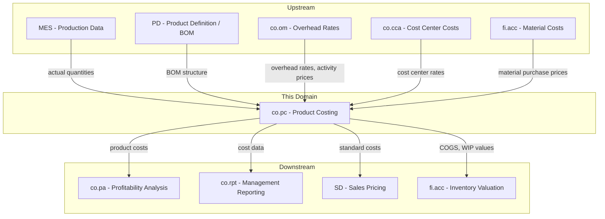
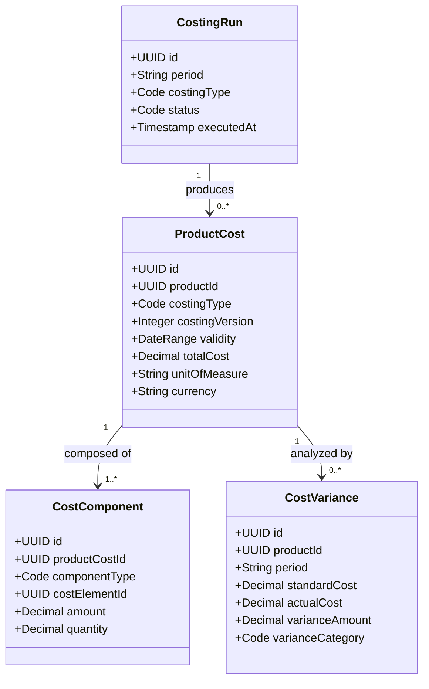
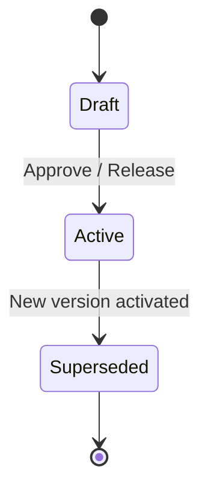
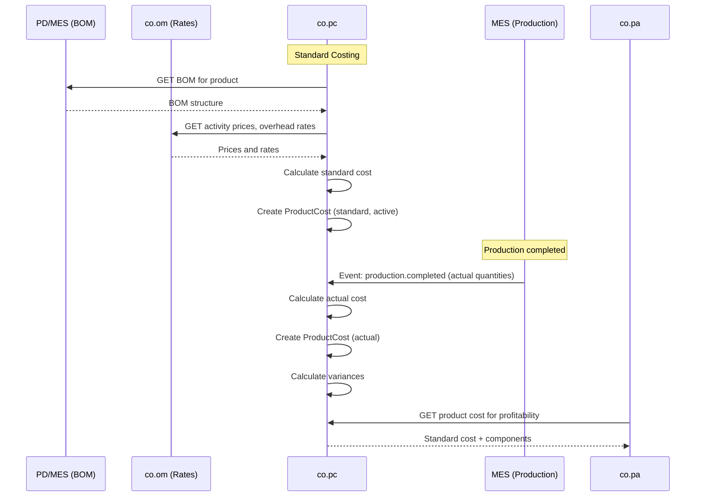
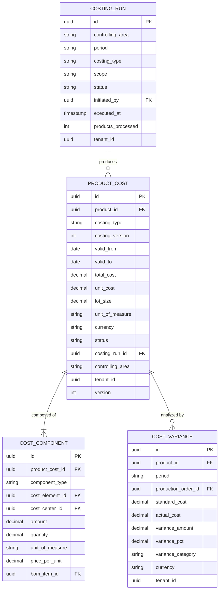

# CO - PC Product Costing Domain / Service Specification

> **Conceptual Stack Layer:** Domain / Service
> **Space:** Platform
> **Owner:** Domain Engineering Team
> **Schema alignment:** `service-layer.schema.json`
> **Companion files:** `openapi.yaml`, `*.schema.json` (event contracts)
> **Referenced by:** Platform-Feature Spec SS5 (backend dependencies), BFF Contract
> **Belongs to:** CO Suite Spec (`_co_suite.md`)

> **Meta Information**
> - **Version:** 2026-04-01
> - **Template:** `domain-service-spec.md` v1.0.0
> - **Template Compliance:** ~80% — §11/§12 stubs, §9/§10 thin, §8 no column-level table defs
> - **Author(s):** OpenLeap Architecture Team
> - **Status:** DRAFT
> - **Suite:** `co`
> - **Domain:** `pc`
> - **Bounded Context Ref:** `bc:product-costing`
> - **Service ID:** `co-pc-svc`
> - **basePackage:** `io.openleap.co.pc`
> - **API Base Path:** `/api/co/pc/v1`
> - **OpenLeap Starter Version:** `v1`
> - **Port:** TBD
> - **Repository:** TBD
> - **Tags:** `controlling`, `product-costing`, `standard-cost`, `variance`
> - **Team:**
>   - Name: `team-co`
>   - Email: `co-team@openleap.io`
>   - Slack: `#co-team`

---

## Specification Guidelines Compliance

>
> ### Non-Negotiables
> - Never invent facts. If required info is missing, add an **OPEN QUESTION** entry.
> - Preserve intent and decisions. Only change meaning when explicitly requested.
> - Keep the spec **self-contained**: no "see chat", no implicit context.
>
> ### Style Guide
> - Use MUST/SHOULD/MAY for normative statements.

---

## 0. Document Purpose & Scope

### 0.1 Purpose
This specification defines the Product Costing (PC) domain, which calculates and tracks the cost of manufactured and purchased products. PC manages standard cost definitions, captures actual production costs, and performs variance analysis between standard and actual costs.

### 0.2 Target Audience
- Product Owners & Business Stakeholders
- System Architects & Technical Leads
- Integration Engineers

### 0.3 Scope
**In Scope:**
- Standard cost definition (BOM-based cost rollup)
- Cost component management (material, labor, overhead, subcontracting)
- Actual cost capture from production (MES events)
- Variance analysis (price, quantity, mix, volume)
- Costing versions and effective dating
- WIP (Work-in-Progress) valuation support

**Out of Scope:**
- Bill of Materials management (-> Product Definition / MES)
- Production execution and scheduling (-> MES)
- Cost allocations (-> co.om)
- Profitability analysis (-> co.pa)
- Inventory valuation accounting (-> fi.acc)

### 0.4 Related Documents
- `_co_suite.md` - CO Suite overview
- `co_om-spec.md` - Overhead Management (overhead rates)
- `co_cca-spec.md` - Cost Center Accounting
- `MES_execution.md` - Manufacturing Execution
- `PD_product_definition.md` - Product Definition
- `fi_acc_core_spec_complete.md` - Financial Accounting

---

## 1. Business Context

### 1.1 Domain Purpose
`co.pc` answers the question **"What does it cost to make a product?"** It maintains standard costs for planning and valuation, captures actual production costs, and identifies cost variances that highlight inefficiencies or price changes.

### 1.2 Business Value
- Accurate product costs for pricing decisions
- Standard costs for inventory valuation and COGS
- Variance analysis to identify production inefficiencies
- Cost component transparency (material, labor, overhead breakdown)
- Support for make-or-buy decisions

### 1.3 Key Stakeholders

| Role | Responsibility | Primary Use Cases |
|------|----------------|-------------------|
| Cost Accountant | Define and maintain standard costs | UC-001, UC-002 |
| Controller | Analyze variances, approve standard cost changes | UC-004 |
| Production Manager | Review actual vs. standard costs | UC-003, UC-004 |
| Procurement | Provide material price inputs | UC-001 |
| Sales / Pricing | Use standard costs as pricing floor | UC-005 |

### 1.4 Strategic Positioning



### 1.5 Service Context

| Property | Value |
|----------|-------|
| **Suite** | `co` |
| **Domain** | `pc` |
| **Bounded Context** | `bc:product-costing` |
| **Service ID** | `co-pc-svc` |
| **Base Package** | `io.openleap.co.pc` |

---

## 2. Service Identity

| Property | Value | Schema Field |
|----------|-------|-------------|
| **Service ID** | `co-pc-svc` | `metadata.id` |
| **Display Name** | `Product Costing` | `metadata.name` |
| **Suite** | `co` | `metadata.suite` |
| **Domain** | `pc` | `metadata.domain` |
| **Bounded Context** | `bc:product-costing` | `metadata.bounded_context_ref` |
| **Version** | `1.0.0` | `metadata.version` |
| **Status** | DRAFT | `metadata.status` |
| **API Base Path** | `/api/co/pc/v1` | `metadata.api_base_path` |
| **Repository** | TBD | `metadata.repository` |
| **Tags** | `controlling`, `product-costing`, `variance` | `metadata.tags` |

**Team:**
| Property | Value |
|----------|-------|
| **Name** | `team-co` |
| **Email** | `co-team@openleap.io` |
| **Slack Channel** | `#co-team` |

---

## 3. Domain Model

### 3.1 Conceptual Overview
PC manages **Product Costs** (standard, actual, planned per product), composed of **Cost Components** (material, labor, overhead, subcontracting). **Costing Runs** calculate or recalculate costs for a set of products. **Cost Variances** record differences between standard and actual at the component level.

### 3.2 Core Concepts



### 3.3 Aggregate Definitions

#### 3.3.1 ProductCost

| Property | Value |
|----------|-------|
| **Aggregate ID** | `agg:product-cost` |
| **Name** | `ProductCost` |

**Business Purpose:** The calculated cost of a product for a specific costing type and version.

**Key Attributes:**
| Attribute | Type | Format | Description | Constraints | Required | Read-Only |
|-----------|------|--------|-------------|-------------|----------|-----------|
| id | string | uuid | Unique identifier | Immutable | Yes | Yes |
| productId | string | uuid | FK to CAT product | — | Yes | No |
| costingType | string | — | Type of cost | enum: standard, actual, planned, simulated | Yes | No |
| costingVersion | integer | — | Version number | >= 1 | Yes | No |
| validFrom | string | date | Effective start | — | Yes | No |
| validTo | string | date | Effective end | — | No | No |
| totalCost | number | decimal | Sum of all components | Computed, precision: 4 | Yes | Yes |
| unitOfMeasure | string | — | Cost per UOM | — | Yes | No |
| currency | string | — | ISO 4217 | 3 chars | Yes | No |
| lotSize | number | decimal | Costing lot size | > 0, precision: 4 | Yes | No |
| unitCost | number | decimal | totalCost / lotSize | Computed, precision: 4 | Yes | Yes |
| status | string | — | State | enum: draft, active, superseded | Yes | No |
| costingRunId | string | uuid | FK to CostingRun | — | No | No |
| controllingArea | string | — | CO area | — | Yes | No |
| tenantId | string | uuid | Tenant | — | Yes | Yes |
| version | integer | int64 | Optimistic lock | — | Yes | Yes |

**Lifecycle States:**


**Invariants:**
| Rule ID | Description |
|---------|-------------|
| BR-001 | Only one active standard cost per product |
| BR-002 | Components MUST sum to totalCost |
| BR-003 | All components calculated for same lotSize |
| BR-004 | Active ProductCost MUST NOT be modified (create new version) |

**Domain Events Emitted:**
- `co.pc.productCost.activated`
- `co.pc.actualCost.calculated`
- `co.pc.costingRun.completed`
- `co.pc.variance.calculated`

#### 3.3.2 CostVariance

| Property | Value |
|----------|-------|
| **Aggregate ID** | `agg:cost-variance` |
| **Name** | `CostVariance` |

**Business Purpose:** Records the difference between standard and actual cost for a product in a period.

**Key Attributes:**
| Attribute | Type | Format | Description | Constraints | Required | Read-Only |
|-----------|------|--------|-------------|-------------|----------|-----------|
| id | string | uuid | Unique identifier | — | Yes | Yes |
| productId | string | uuid | FK to product | — | Yes | No |
| period | string | — | Fiscal period | — | Yes | No |
| productionOrderId | string | uuid | FK to MES order | — | No | No |
| standardCost | number | decimal | Expected cost | — | Yes | No |
| actualCost | number | decimal | Realized cost | — | Yes | No |
| varianceAmount | number | decimal | actual - standard | Computed | Yes | Yes |
| variancePct | number | decimal | Percentage | Computed | Yes | Yes |
| varianceCategory | string | — | Type | enum: material_price, material_quantity, labor_rate, labor_efficiency, overhead_rate, overhead_efficiency, volume, mix | Yes | No |
| currency | string | — | ISO 4217 | — | Yes | No |
| tenantId | string | uuid | Tenant | — | Yes | Yes |

### 3.4 Enumerations

#### ComponentType
| Value | Description | Deprecated |
|-------|-------------|------------|
| `raw_material` | Raw material costs | No |
| `packaging` | Packaging materials | No |
| `direct_labor` | Direct labor | No |
| `machine_time` | Machine time costs | No |
| `overhead` | Overhead applied | No |
| `subcontracting` | External subcontracting | No |
| `freight` | Freight/logistics | No |

### 3.5 Shared Types

> OPEN QUESTION: Content for this section has not been authored yet.

---

## 4. Business Rules & Constraints

### 4.1 Business Rules Catalog

| ID | Rule Name | Description | Scope | Enforcement | Error Code |
|----|-----------|-------------|-------|-------------|------------|
| BR-001 | One Active Standard | Only one active standard cost per product | ProductCost | Activate | `DUPLICATE_ACTIVE` |
| BR-002 | Component Sum | Components MUST sum to totalCost | ProductCost | Create, Update | `COMPONENT_MISMATCH` |
| BR-003 | Lot Size Consistency | All components for same lotSize | CostComponent | Create | `LOT_SIZE_MISMATCH` |
| BR-004 | Version Immutability | Active ProductCost MUST NOT be edited | ProductCost | Update | `IMMUTABLE_ACTIVE` |
| BR-005 | Variance Completeness | Variance analysis required before period close | CostVariance | Period close | `VARIANCE_INCOMPLETE` |
| BR-006 | Positive Standard | Standard cost MUST be > 0 (except free items) | ProductCost | Activate | `ZERO_COST` |
| BR-007 | Material Price Source | Material costs MUST use latest planned purchase price | CostComponent | Costing run | — |

### 4.3 Data Validation Rules

| Field | Validation | Error Message |
|-------|-----------|---------------|
| productId | Must exist in catalog | "Product not found" |
| lotSize | > 0 | "Lot size must be positive" |
| totalCost | >= 0 | "Total cost cannot be negative" |
| varianceCategory | Must be in allowed values | "Invalid variance category" |

### 4.4 Reference Data Dependencies

| Catalog | Source | Validation |
|---------|--------|------------|
| Products | CAT service | Must exist and be active |
| Currencies | ref-data-svc | Must exist |
| Units of Measure | si-unit-svc | Must be valid UCUM |

---

## 5. Use Cases

### 5.1 Business Logic Placement

| Logic Type | Placement | Examples |
|------------|-----------|----------|
| Aggregate invariants | Domain Object | One active standard, component sum, immutability |
| Cross-aggregate logic | Domain Service | BOM cost rollup, variance decomposition |
| Orchestration & transactions | Application Service | Costing run, MES event processing |

### 5.2 Use Cases (Canonical Format)

#### UC-001: DefineStandardCost

| Field | Value |
|-------|-------|
| **id** | `DefineStandardCost` |
| **type** | WRITE |
| **trigger** | REST |
| **aggregate** | `ProductCost` |
| **domainOperation** | `ProductCost.create` |
| **inputs** | `productId: UUID`, `components: CostComponent[]`, `lotSize: Decimal`, `validFrom: Date` |
| **outputs** | `ProductCost` |
| **events** | `ProductCost.activated` |
| **rest** | `POST /api/co/pc/v1/product-costs` |
| **idempotency** | optional |
| **errors** | `DUPLICATE_ACTIVE`, `COMPONENT_MISMATCH` |

**Actor:** Cost Accountant

**Main Flow:**
1. Retrieve BOM for product from PD/MES
2. For each BOM material: look up planned purchase price -> material cost component
3. For each work step: look up activity price from co.om -> labor/machine cost component
4. Apply overhead rates from co.om -> overhead cost component
5. Sum components -> total standard cost
6. Create ProductCost (draft) -> approve -> active
7. Publish `co.pc.productCost.activated` event

#### UC-002: ExecuteCostingRun

| Field | Value |
|-------|-------|
| **id** | `ExecuteCostingRun` |
| **type** | WRITE |
| **trigger** | REST |
| **aggregate** | `CostingRun` |
| **domainOperation** | `CostingRun.execute` |
| **inputs** | `controllingArea: String`, `costingType: Code`, `scope: Code`, `validFrom: Date` |
| **outputs** | `CostingRun` |
| **events** | `CostingRun.completed` |
| **rest** | `POST /api/co/pc/v1/costing-runs/execute` |
| **idempotency** | required |
| **errors** | — |

**Actor:** Controller

#### UC-003: CaptureActualProductionCost

| Field | Value |
|-------|-------|
| **id** | `CaptureActualProductionCost` |
| **type** | WRITE |
| **trigger** | Message |
| **aggregate** | `ProductCost` |
| **domainOperation** | `ProductCost.createActual` |
| **inputs** | `productId: UUID`, `productionOrderId: UUID`, `actualComponents: CostComponent[]` |
| **outputs** | `ProductCost` |
| **events** | `ActualCost.calculated` |
| **rest** | — (event-driven) |
| **idempotency** | required |
| **errors** | — |

**Actor:** System (MES event)

#### UC-004: PerformVarianceAnalysis

| Field | Value |
|-------|-------|
| **id** | `PerformVarianceAnalysis` |
| **type** | WRITE |
| **trigger** | REST |
| **aggregate** | `CostVariance` |
| **domainOperation** | `CostVariance.calculate` |
| **inputs** | `controllingArea: String`, `period: String`, `scope: Code` |
| **outputs** | `CostVariance[]` |
| **events** | `Variance.calculated` |
| **rest** | `POST /api/co/pc/v1/variances/calculate` |
| **idempotency** | required |
| **errors** | — |

**Actor:** Controller

### 5.3 Process Flow Diagrams



### 5.4 Cross-Domain Workflows

**Does this domain participate in multi-service workflows?** [x] YES [ ] NO

#### Workflow: Standard Cost Rollup
**Orchestration Pattern:** [ ] Choreography (EDA) [x] Orchestration (by co.pc)
**Rationale:** Multi-step calculation requiring data from multiple sources (BOM, activity prices, material prices). co.pc coordinates the data gathering and calculation.

---

## 6. REST API

### 6.1 API Overview
**Base Path:** `/api/co/pc/v1`
**Authentication:** OAuth2/JWT
**Authorization:** `co.pc:read`, `co.pc:write`, `co.pc:execute`, `co.pc:admin`

### 6.2 Resource Operations

#### Product Costs
```http
GET /api/co/pc/v1/product-costs?productId={id}&costingType=standard&status=active
GET /api/co/pc/v1/product-costs/{id}
GET /api/co/pc/v1/product-costs/{id}/components
```

#### Costing Runs
```http
POST /api/co/pc/v1/costing-runs/execute
GET /api/co/pc/v1/costing-runs/{id}
GET /api/co/pc/v1/costing-runs/{id}/results
```

**Execute Request:**
```json
{
  "controllingArea": "CA01",
  "costingType": "standard",
  "scope": "all_products",
  "validFrom": "2026-07-01"
}
```

#### Variances
```http
GET /api/co/pc/v1/variances?productId={id}&period=2026-02
GET /api/co/pc/v1/variances/summary?period=2026-02
```

### 6.3 Business Operations

#### Activate Product Cost
```http
POST /api/co/pc/v1/product-costs/{id}/activate
If-Match: "{version}"
```

#### Calculate Variances
```http
POST /api/co/pc/v1/variances/calculate
```
```json
{
  "controllingArea": "CA01",
  "period": "2026-02",
  "scope": "all_products"
}
```

### 6.4 OpenAPI Specification
**Location:** `contracts/http/co/pc/openapi.yaml`

---

## 7. Events & Integration

### 7.1 Event-Driven Architecture Pattern
**Pattern Used:** [ ] Event-Driven (Choreography) [ ] Orchestration (Saga) [x] Hybrid

**Follows Suite Pattern:** [x] YES [ ] NO

**Message Broker:** `RabbitMQ`

### 7.2 Published Events
**Exchange:** `co.pc.events` (topic)

| Routing Key | Consumers | Description |
|------------|-----------|-------------|
| `co.pc.productCost.activated` | co-pa-svc, SD, fi-acc-svc, co-rpt-svc | New standard cost active |
| `co.pc.actualCost.calculated` | co-rpt-svc | Actual production cost |
| `co.pc.variance.calculated` | co-rpt-svc, fi-acc-svc | Variance analysis results |
| `co.pc.costingRun.completed` | co-rpt-svc | Costing run finished |

### 7.3 Consumed Events

| Event | Source | Purpose | Queue |
|-------|--------|---------|-------|
| mes.production.completed | MES | Actual production data | `co.pc.in.mes.production` |
| co.om.activityPrice.calculated | co-om-svc | Update activity prices | `co.pc.in.co.om.activityPrice` |
| co.om.allocation.executed | co-om-svc | Update overhead rates | `co.pc.in.co.om.allocation` |

---

## 8. Data Model

### 8.1 Conceptual Data Model



### 8.2 Entity Definitions

- ProductCost: PK `id`, Unique `(tenant_id, product_id, costing_type, costing_version)`
- Query: `(tenant_id, product_id, costing_type, status)`
- CostVariance: Query `(tenant_id, product_id, period)`, `(tenant_id, period, variance_category)`

---

## 9. Security & Compliance

### 9.1 Data Classification
| Data Element | Classification | Protection |
|--------------|----------------|------------|
| Standard Costs | Confidential | Encryption, RBAC (competitive info) |
| Actual Costs | Confidential | Encryption, RBAC |
| Variances | Confidential | RBAC |

### 9.2 Access Control
| Role | Read | Create Costs | Execute Runs | Activate | Admin |
|------|------|-------------|-------------|----------|-------|
| CO_PC_VIEWER | Yes | No | No | No | No |
| CO_PC_ACCOUNTANT | Yes | Yes | Yes | No | No |
| CO_PC_CONTROLLER | Yes | Yes | Yes | Yes | No |
| CO_PC_ADMIN | Yes | Yes | Yes | Yes | Yes |

---

## 10. Quality Attributes

### 10.1 Performance
| Operation | Target (p95) |
|-----------|-------------|
| Query product cost | < 50ms |
| Costing run (100 products) | < 2 min |
| Costing run (10,000 products) | < 30 min |
| Variance calculation | < 5 min |

### 10.2 Availability
**Availability:** 99.9% | **RTO:** < 15 min | **RPO:** < 5 min

### 10.3 Scalability
- Products: ~100,000 per tenant
- Cost versions per product: ~10 (active + historical)
- Variances per month: ~50,000

---

## 11. Feature Dependencies

> OPEN QUESTION: Content for this section has not been authored yet.

---

## 12. Extension Points

> OPEN QUESTION: Content for this section has not been authored yet.

---

## 13. Migration & Evolution

| Source | Target | Issues |
|--------|--------|--------|
| Legacy standard costs | ProductCost | Component mapping, lot size normalization |
| Legacy variances | CostVariance | Category mapping |

---

## 14. Decisions & Open Questions

### 14.1 Open Questions

| ID | Question | Impact | Needed By |
|----|----------|--------|-----------|
| Q-001 | Support multi-level BOM cost rollup (semi-finished -> finished)? | Data model | Phase 1 |
| Q-002 | How to handle joint/by-product costing? | Algorithm | Phase 2 |
| Q-003 | Integration pattern with PD for BOM: API call or cached copy? | Performance | Phase 1 |

### 14.2 Architectural Decision Records (ADRs)

#### ADR-PC-001: Separate Actual from Standard

**Status:** Accepted

**Decision:** Actual product costs are separate ProductCost records (costingType=actual) rather than overwriting standard. This preserves standard for valuation and enables variance analysis.

**Consequences:**
| Positive | Negative |
|----------|----------|
| Preserves standard for valuation | Higher storage |
| Enables variance analysis | — |

---

## 15. Appendix

### 15.1 Glossary
| Term | Definition | Aliases |
|------|------------|---------|
| Standard Cost | Predetermined cost for planning/valuation | Standardkosten |
| Variance | Difference between standard and actual | Abweichung |
| Cost Rollup | Calculation of total cost from BOM | Kalkulation |
| Lot Size | Quantity basis for costing | Losgroesse |
| WIP | Work-in-Progress valuation | Ware in Arbeit |

### 15.2 Change Log
| Date | Version | Author | Changes |
|------|---------|--------|---------|
| 2026-02-23 | 1.0 | OpenLeap Architecture Team | Initial version |
| 2026-04-01 | 1.1 | OpenLeap Architecture Team | Restructured to template compliance (sections 0-15) |

### 15.3 Review & Approval
**Status:** DRAFT
