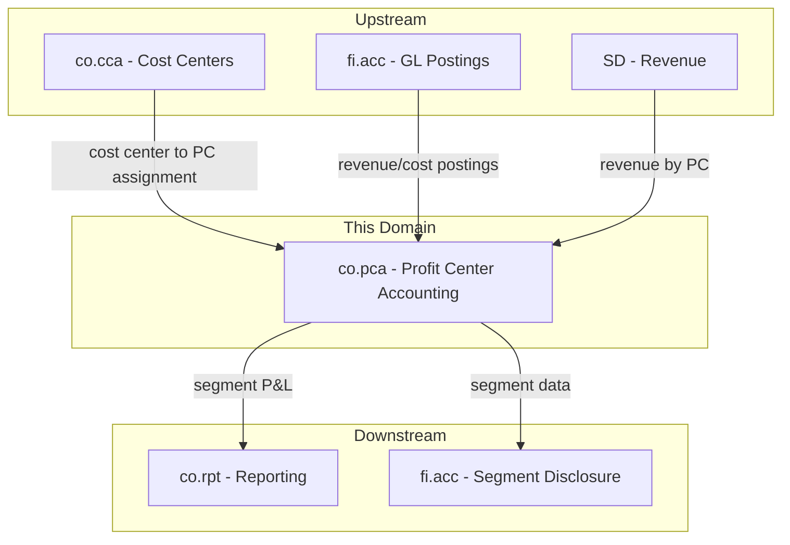
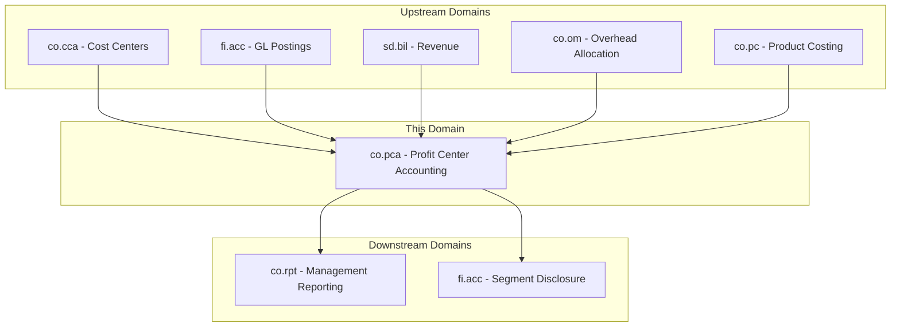
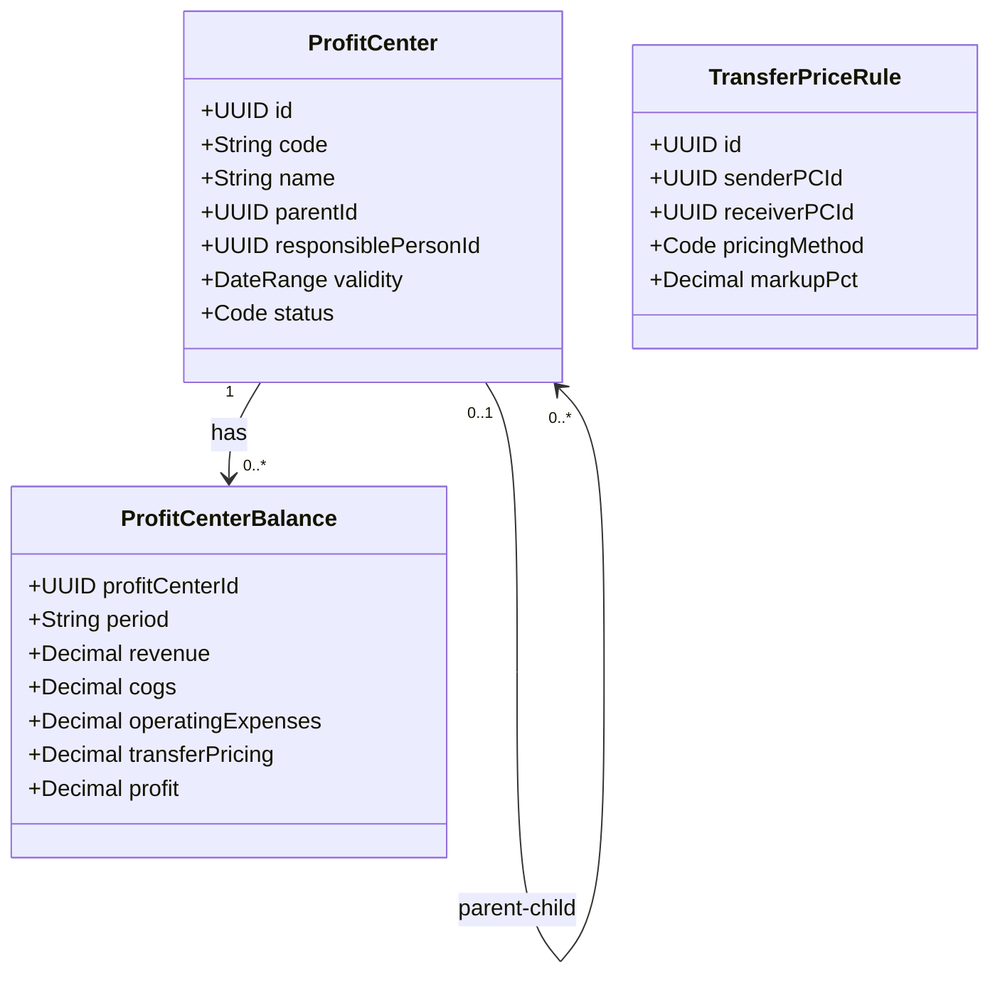
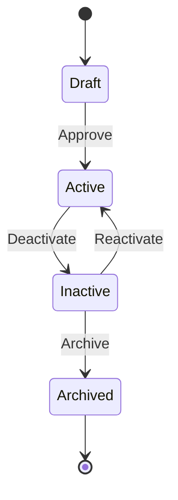
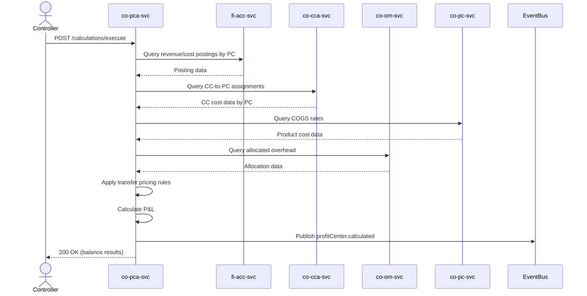
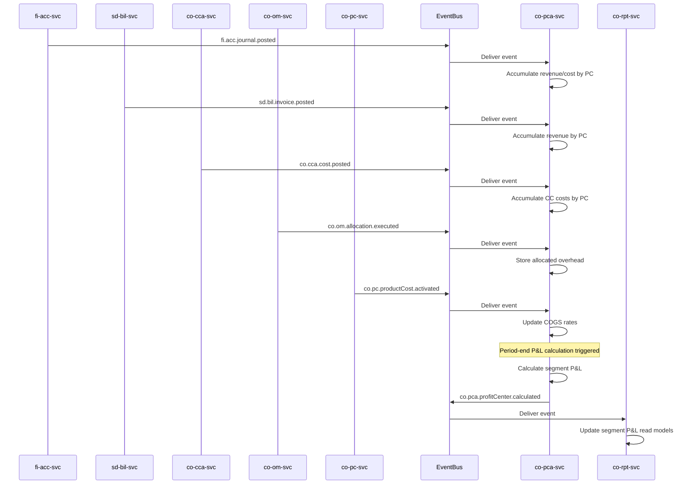
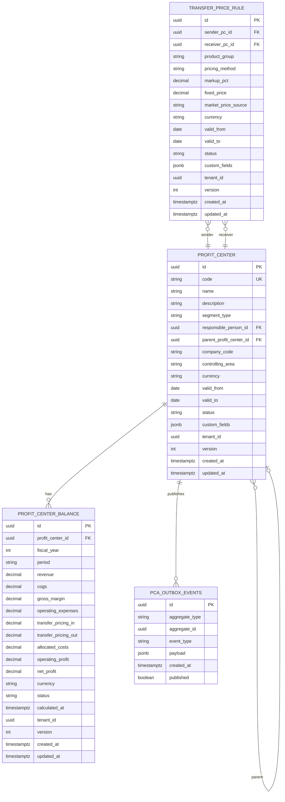

# CO - PCA Profit Center Accounting Domain / Service Specification

> **Conceptual Stack Layer:** Domain / Service
> **Space:** Platform
> **Owner:** Domain Engineering Team
> **Schema alignment:** `service-layer.schema.json`
> **Companion files:** `openapi.yaml`, `*.schema.json` (event contracts)
> **Referenced by:** Platform-Feature Spec SS5 (backend dependencies), BFF Contract
> **Belongs to:** CO Suite Spec (`_co_suite.md`)

> **Meta Information**
> - **Version:** 2026-04-04
> - **Template:** `domain-service-spec.md` v1.0.0
> - **Template Compliance:** ~95% -- all 16 sections present with substantive content; minor gaps in §11 feature IDs (pending feature specs)
> - **Author(s):** OpenLeap Architecture Team
> - **Status:** DRAFT
> - **Suite:** `co`
> - **Domain:** `pca`
> - **Bounded Context Ref:** `bc:profit-center-accounting`
> - **Service ID:** `co-pca-svc`
> - **basePackage:** `io.openleap.co.pca`
> - **API Base Path:** `/api/co/pca/v1`
> - **OpenLeap Starter Version:** `v1`
> - **Port:** TBD
> - **Repository:** TBD
> - **Tags:** `controlling`, `profit-center`, `segment`, `transfer-pricing`
> - **Team:**
>   - Name: `team-co`
>   - Email: `co-team@openleap.io`
>   - Slack: `#co-team`

---

## Specification Guidelines Compliance

> ### Non-Negotiables
> - Never invent facts. If required info is missing, add an **OPEN QUESTION** entry.
> - Preserve intent and decisions. Only change meaning when explicitly requested.
> - Do not remove normative constraints unless they are explicitly replaced.
> - Keep the spec **self-contained**: no "see chat", no implicit context.
>
> ### Source of Truth Priority
> When sources conflict:
> 1. Spec (explicit) wins
> 2. Starter specs (implementation constraints) next
> 3. Guidelines (best practices) last
>
> Record conflicts in the **Decisions & Conflicts** section (see Section 14).
>
> ### Style Guide
> - Prefer short sentences and lists.
> - Use MUST/SHOULD/MAY for normative statements.
> - Keep terminology consistent (Aggregate, Domain Service, Application Service, Command, Event).
> - Avoid ambiguous words ("often", "maybe") unless explicitly noting uncertainty.
> - Keep examples minimal and clearly marked as examples.
> - Do not add implementation code unless the chapter explicitly requires it.

---

## 0. Document Purpose & Scope

### 0.1 Purpose
This specification defines the Profit Center Accounting (PCA) domain, which tracks profitability by organizational business segments (profit centers). Unlike co.pa (multi-dimensional analysis), PCA aligns with the organizational structure to provide segment-level P&L reporting for internal management and external segment disclosure.

### 0.2 Target Audience
- Product Owners & Business Stakeholders
- System Architects & Technical Leads
- Integration Engineers

### 0.3 Scope
**In Scope:**
- Profit center master data management (hierarchy, lifecycle)
- Revenue and cost aggregation by profit center
- Segment P&L calculation (revenue, COGS, operating expenses, profit)
- Transfer pricing between profit centers
- Profit center balance reporting

**Out of Scope:**
- Multi-dimensional profitability analysis (-> co.pa)
- Cost center management (-> co.cca)
- Cost allocations (-> co.om)
- External segment reporting (-> fi.acc / IFRS 8)

### 0.4 Related Documents
- `_co_suite.md` - CO Suite overview
- `co_cca-spec.md` - Cost Center Accounting
- `co_pa-spec.md` - Profitability Analysis
- `fi_acc_core_spec_complete.md` - Financial Accounting

---

## 1. Business Context

### 1.1 Domain Purpose
`co.pca` answers **"How profitable is each business segment?"** Profit centers represent business units, product lines, or regions as organizational entities. Every cost center, revenue posting, and asset is assigned to a profit center, enabling a segment-level profit and loss statement.

### 1.2 Business Value
- Segment-level P&L for management accountability
- Support for IFRS 8 segment reporting (data source)
- Internal transfer pricing between business units
- Investment and divestment decision support
- Management incentive alignment with profit center results

### 1.3 Key Stakeholders

| Role | Responsibility | Primary Use Cases |
|------|----------------|-------------------|
| Profit Center Manager | Own segment results, manage P&L | UC-003 |
| Controller | Configure profit centers, run calculations | UC-001, UC-002 |
| CFO | Review segment profitability | UC-003, UC-004 |

### 1.4 Strategic Positioning



### 1.5 Service Context

| Property | Value |
|----------|-------|
| **Suite** | `co` |
| **Domain** | `pca` |
| **Bounded Context** | `bc:profit-center-accounting` |
| **Service ID** | `co-pca-svc` |
| **Base Package** | `io.openleap.co.pca` |

**Responsibilities:**
- Manage profit center master data (create, update, deactivate, archive)
- Maintain profit center hierarchies (parent-child relationships, segment trees)
- Define and apply transfer pricing rules between profit centers
- Calculate segment P&L balances by aggregating revenue, COGS, operating expenses, and allocated costs
- Publish profit center events for downstream reporting and segment disclosure

**Authoritative Sources:**
| Source Type | Description | Access Pattern |
|-------------|-------------|----------------|
| REST API | Profit center master data, balances, transfer price rules | Synchronous |
| Database | Profit centers, balances, transfer pricing rules | Direct (owner) |
| Events | Profit center lifecycle events, calculation results | Asynchronous |



---

## 2. Service Identity

| Property | Value | Schema Field |
|----------|-------|-------------|
| **Service ID** | `co-pca-svc` | `metadata.id` |
| **Display Name** | `Profit Center Accounting` | `metadata.name` |
| **Suite** | `co` | `metadata.suite` |
| **Domain** | `pca` | `metadata.domain` |
| **Bounded Context** | `bc:profit-center-accounting` | `metadata.bounded_context_ref` |
| **Version** | `1.0.0` | `metadata.version` |
| **Status** | DRAFT | `metadata.status` |
| **API Base Path** | `/api/co/pca/v1` | `metadata.api_base_path` |
| **Repository** | TBD | `metadata.repository` |
| **Tags** | `controlling`, `profit-center`, `segment` | `metadata.tags` |

**Team:**
| Property | Value |
|----------|-------|
| **Name** | `team-co` |
| **Email** | `co-team@openleap.io` |
| **Slack Channel** | `#co-team` |

---

## 3. Domain Model

### 3.1 Conceptual Overview

Profit Center Accounting models an organization's internal segment structure for profitability tracking. A **ProfitCenter** represents a business segment (business unit, product line, or region) organized in a hierarchy. **ProfitCenterBalance** records capture period-by-period P&L results for each profit center by aggregating revenue, COGS, operating expenses, allocated overhead, and transfer pricing adjustments. **TransferPriceRule** defines the internal pricing method for goods and services exchanged between profit centers.

The domain follows SAP CO-PCA concepts: profit centers are organizational units within a controlling area; each cost center is assigned to exactly one profit center; revenue and cost postings flow into the profit center via FI/CO integration; transfer prices adjust inter-segment transactions.

### 3.2 Core Concepts



### 3.3 Aggregate Definitions

#### 3.3.1 ProfitCenter

| Property | Value |
|----------|-------|
| **Aggregate ID** | `agg:profit-center` |
| **Name** | `ProfitCenter` |

**Business Purpose:** An organizational business segment for P&L tracking. Cost centers are assigned to profit centers, creating the link between departmental costs and segment profitability.

##### Aggregate Root

**Key Attributes:**
| Attribute | Type | Format | Description | Constraints | Required | Read-Only |
|-----------|------|--------|-------------|-------------|----------|-----------|
| id | string | uuid | Unique identifier (OlUuid) | Immutable | Yes | Yes |
| code | string | -- | Profit center code (e.g., "PC-EMEA-01") | unique per (tenant_id, controlling_area), max 20 chars, pattern: `^[A-Z0-9-]{3,20}$` | Yes | No |
| name | string | -- | Descriptive name | max 255 chars | Yes | No |
| description | string | -- | Detailed description of the profit center's business scope | max 2000 chars | No | No |
| segmentType | string | -- | Type of business segment | enum_ref: `SegmentType` | Yes | No |
| responsiblePersonId | string | uuid | FK to business partner (responsible manager) | Must exist in bp-svc | Yes | No |
| parentProfitCenterId | string | uuid | Hierarchy parent profit center | Must reference existing active or draft PC | No | No |
| companyCode | string | -- | Company code assignment | max 10 chars | Yes | No |
| controllingArea | string | -- | Controlling area assignment | max 10 chars | Yes | No |
| currency | string | -- | Local currency for the profit center | ISO 4217, 3 chars | Yes | No |
| validFrom | string | date | Effective start date | -- | Yes | No |
| validTo | string | date | Effective end date | Must be >= validFrom if set | No | No |
| status | string | -- | Lifecycle state | enum_ref: `ProfitCenterStatus` | Yes | No |
| tenantId | string | uuid | Tenant ownership | -- | Yes | Yes |
| version | integer | int64 | Optimistic locking version | -- | Yes | Yes |
| createdAt | string | date-time | Creation timestamp | -- | Yes | Yes |
| updatedAt | string | date-time | Last update timestamp | -- | Yes | Yes |

**Lifecycle States:**

| Property | Value |
|----------|-------|
| **Initial State** | `draft` |
| **Terminal States** | `archived` |



**State Descriptions:**
| State | Description | Business Meaning |
|-------|-------------|------------------|
| Draft | Initial creation state | Being prepared, not yet accepting postings |
| Active | Operational state | Accepting postings, included in P&L calculations |
| Inactive | Suspended state | No new postings accepted; existing balances retained |
| Archived | Final state | Historical record, read-only; excluded from calculations |

**Allowed Transitions:**
| From State | To State | Trigger | Guard / Business Preconditions |
|------------|----------|---------|-------------------------------|
| Draft | Active | Approval by controller | All mandatory fields filled; responsible person assigned; controlling area valid |
| Active | Inactive | Manual deactivation | No open transfer pricing transactions pending |
| Inactive | Active | Manual reactivation | Controlling area still active; responsible person still valid |
| Inactive | Archived | Archive action | Inactive for > 90 days; all balances closed; no dependent cost center assignments |

**Invariants:**
| Rule ID | Description |
|---------|-------------|
| BR-001 | code MUST be unique per (tenant_id, controlling_area) |
| BR-004 | No circular references in hierarchy |
| BR-005 | Each cost center SHOULD be assigned to exactly one active PC |
| BR-006 | validTo MUST be >= validFrom when validTo is set |

**Domain Events Emitted:**
- `co.pca.profitCenter.created`
- `co.pca.profitCenter.updated`
- `co.pca.profitCenter.statusChanged`
- `co.pca.profitCenter.calculated`

##### Child Entities

###### Entity: ProfitCenterBalance

| Property | Value |
|----------|-------|
| **Entity ID** | `ent:profit-center-balance` |
| **Name** | `ProfitCenterBalance` |
| **Relationship to Root** | one_to_many |

**Business Purpose:** Stores the period-by-period segment P&L for a profit center. Each balance record captures revenue, COGS, operating expenses, transfer pricing adjustments, allocated overhead, and the resulting profit figures for one fiscal period.

**Attributes:**
| Attribute | Type | Format | Description | Constraints | Required |
|-----------|------|--------|-------------|-------------|----------|
| id | string | uuid | Unique identifier | -- | Yes |
| profitCenterId | string | uuid | FK to parent ProfitCenter | -- | Yes |
| fiscalYear | integer | int32 | Fiscal year | min: 2000, max: 2099 | Yes |
| period | string | -- | Fiscal period (e.g., "2026-02") | pattern: `^\d{4}-\d{2}$` | Yes |
| revenue | number | decimal | Total revenue posted to this PC | precision: 18,2 | Yes |
| cogs | number | decimal | Cost of goods sold | precision: 18,2 | Yes |
| grossMargin | number | decimal | Revenue minus COGS (calculated) | precision: 18,2 | Yes |
| operatingExpenses | number | decimal | SG&A and other operating costs | precision: 18,2 | Yes |
| transferPricingIn | number | decimal | Incoming transfer pricing credits | precision: 18,2 | Yes |
| transferPricingOut | number | decimal | Outgoing transfer pricing charges | precision: 18,2 | Yes |
| allocatedCosts | number | decimal | Overhead allocated from co.om | precision: 18,2 | Yes |
| operatingProfit | number | decimal | Gross margin minus opex minus allocations plus TP net (calculated) | precision: 18,2 | Yes |
| netProfit | number | decimal | Final bottom-line profit for the segment | precision: 18,2 | Yes |
| currency | string | -- | Currency of the balance | ISO 4217 | Yes |
| status | string | -- | Calculation status | enum_ref: `BalanceStatus` | Yes |
| calculatedAt | string | date-time | Timestamp of last calculation | -- | No |
| tenantId | string | uuid | Tenant ownership | -- | Yes |

**Collection Constraints:**
- Minimum items: 0 (new profit center with no calculations yet)
- Maximum items: unbounded (one per fiscal period per profit center)
- Unique constraint: (profitCenterId, period, tenantId)

**Invariants:**
| Rule ID | Description |
|---------|-------------|
| BR-003 | Transfer pricing in (buyer) MUST equal out (seller) across all PCs in the same period and controlling area |
| BR-007 | grossMargin MUST equal revenue minus cogs |
| BR-008 | operatingProfit MUST equal grossMargin minus operatingExpenses minus allocatedCosts plus (transferPricingIn minus transferPricingOut) |

##### Value Objects

###### Value Object: DateRange

| Property | Value |
|----------|-------|
| **VO ID** | `vo:date-range` |
| **Name** | `DateRange` |

**Description:** Represents a validity period with a start and optional end date.

**Attributes:**
| Attribute | Type | Format | Description | Constraints |
|-----------|------|--------|-------------|-------------|
| validFrom | string | date | Start of validity | Required |
| validTo | string | date | End of validity | Must be >= validFrom if present |

**Validation Rules:**
- validFrom MUST NOT be null
- validTo, if present, MUST be >= validFrom

---

#### 3.3.2 TransferPriceRule

| Property | Value |
|----------|-------|
| **Aggregate ID** | `agg:transfer-price-rule` |
| **Name** | `TransferPriceRule` |

**Business Purpose:** Defines internal pricing for goods/services exchanged between profit centers. Transfer pricing ensures that inter-segment transactions are recorded at arm's-length or agreed-upon rates, supporting both management accountability and compliance with transfer pricing regulations.

##### Aggregate Root

**Key Attributes:**
| Attribute | Type | Format | Description | Constraints | Required | Read-Only |
|-----------|------|--------|-------------|-------------|----------|-----------|
| id | string | uuid | Unique identifier (OlUuid) | Immutable | Yes | Yes |
| senderPcId | string | uuid | Selling (sender) profit center | Must reference active ProfitCenter | Yes | No |
| receiverPcId | string | uuid | Buying (receiver) profit center | Must reference active ProfitCenter | Yes | No |
| productGroup | string | -- | Product group filter for selective rules | max 50 chars | No | No |
| pricingMethod | string | -- | Transfer pricing method | enum_ref: `PricingMethod` | Yes | No |
| markupPct | number | decimal | Markup percentage for cost_plus method | precision: 5,2; min: 0, max: 100 | Conditional | No |
| fixedPrice | number | decimal | Fixed unit price for negotiated method | precision: 18,2; min: 0 | Conditional | No |
| marketPriceSource | string | -- | External source for market_price method | max 255 chars | Conditional | No |
| currency | string | -- | Currency for fixedPrice | ISO 4217 | Conditional | No |
| validFrom | string | date | Effective start date | -- | Yes | No |
| validTo | string | date | Effective end date | Must be >= validFrom if set | No | No |
| status | string | -- | Rule state | enum_ref: `TransferPriceRuleStatus` | Yes | No |
| tenantId | string | uuid | Tenant ownership | -- | Yes | Yes |
| version | integer | int64 | Optimistic locking version | -- | Yes | Yes |
| createdAt | string | date-time | Creation timestamp | -- | Yes | Yes |
| updatedAt | string | date-time | Last update timestamp | -- | Yes | Yes |

**Lifecycle States:**

| Property | Value |
|----------|-------|
| **Initial State** | `active` |
| **Terminal States** | `inactive` |

**State Descriptions:**
| State | Description | Business Meaning |
|-------|-------------|------------------|
| Active | Rule is in effect | Applied during P&L calculation for the validity period |
| Inactive | Rule is suspended | Not applied; historical record preserved |

**Allowed Transitions:**
| From State | To State | Trigger | Guard / Business Preconditions |
|------------|----------|---------|-------------------------------|
| Active | Inactive | Manual deactivation | -- |
| Inactive | Active | Manual reactivation | No conflicting active rule for same sender/receiver/product group in overlapping validity |

**Invariants:**
| Rule ID | Description |
|---------|-------------|
| BR-009 | senderPcId MUST NOT equal receiverPcId |
| BR-010 | markupPct MUST be provided when pricingMethod is cost_plus |
| BR-011 | fixedPrice and currency MUST be provided when pricingMethod is negotiated |
| BR-012 | marketPriceSource MUST be provided when pricingMethod is market_price |
| BR-013 | No two active rules for the same (senderPcId, receiverPcId, productGroup) with overlapping validity |

**Domain Events Emitted:**
- `co.pca.transferPriceRule.created`
- `co.pca.transferPriceRule.updated`
- `co.pca.transferPriceRule.statusChanged`

##### Value Objects

###### Value Object: Money

| Property | Value |
|----------|-------|
| **VO ID** | `vo:money` |
| **Name** | `Money` |

**Description:** Represents a monetary amount with currency.

**Attributes:**
| Attribute | Type | Format | Description | Constraints |
|-----------|------|--------|-------------|-------------|
| amount | number | decimal | Monetary value | precision: 18,2 |
| currencyCode | string | -- | ISO 4217 currency code | 3 chars, must be valid ISO 4217 |

**Validation Rules:**
- currencyCode MUST be a valid ISO 4217 code
- amount precision MUST NOT exceed 18 digits total and 2 decimal places

---

### 3.4 Enumerations

#### SegmentType

**Description:** Classifies the organizational nature of a profit center.

| Value | Description | Deprecated |
|-------|-------------|------------|
| `business_unit` | A self-contained business division (e.g., "Consumer Electronics Division") | No |
| `product_line` | A product family or brand (e.g., "Premium Product Line") | No |
| `region` | A geographic market or territory (e.g., "EMEA", "APAC") | No |
| `custom` | Customer-defined segment type not covered by standard categories | No |

#### ProfitCenterStatus

**Description:** Lifecycle states for a profit center.

| Value | Description | Deprecated |
|-------|-------------|------------|
| `draft` | Initial state; profit center is being configured | No |
| `active` | Operational; accepts postings and is included in calculations | No |
| `inactive` | Suspended; no new postings; balances retained | No |
| `archived` | Closed; read-only historical record | No |

#### PricingMethod

**Description:** Transfer pricing methodology between profit centers.

| Value | Description | Deprecated |
|-------|-------------|------------|
| `cost_plus` | Sender's cost plus a configurable markup percentage | No |
| `market_price` | External market reference price for the transferred good/service | No |
| `negotiated` | Fixed price agreed between sender and receiver profit centers | No |

#### BalanceStatus

**Description:** Calculation status for a profit center balance record.

| Value | Description | Deprecated |
|-------|-------------|------------|
| `preliminary` | Initial calculation; subject to adjustments | No |
| `final` | Period closed; balance is frozen and auditable | No |
| `adjusted` | Post-close correction applied (with audit trail) | No |

#### TransferPriceRuleStatus

**Description:** Lifecycle states for a transfer price rule.

| Value | Description | Deprecated |
|-------|-------------|------------|
| `active` | Rule is in effect and applied during calculations | No |
| `inactive` | Rule is suspended; not applied | No |

### 3.5 Shared Types

#### Money

| Property | Value |
|----------|-------|
| **Type ID** | `type:money` |
| **Name** | `Money` |

**Description:** Represents a monetary value with currency. Used across aggregates for financial amounts.

**Attributes:**
| Attribute | Type | Format | Description | Constraints |
|-----------|------|--------|-------------|-------------|
| amount | number | decimal | Monetary value | precision: 18,2 |
| currencyCode | string | -- | ISO 4217 currency code | 3 chars |

**Validation Rules:**
- currencyCode MUST be a valid ISO 4217 code
- amount precision MUST NOT exceed 18,2

**Used By:**
- `agg:profit-center` (currency field)
- `ent:profit-center-balance` (all financial columns)
- `agg:transfer-price-rule` (fixedPrice)

#### DateRange

| Property | Value |
|----------|-------|
| **Type ID** | `type:date-range` |
| **Name** | `DateRange` |

**Description:** Represents a validity period with inclusive start and optional end date.

**Attributes:**
| Attribute | Type | Format | Description | Constraints |
|-----------|------|--------|-------------|-------------|
| validFrom | string | date | Start of validity | Required |
| validTo | string | date | End of validity | >= validFrom if present |

**Validation Rules:**
- validFrom MUST NOT be null
- If validTo is present, it MUST be >= validFrom

**Used By:**
- `agg:profit-center`
- `agg:transfer-price-rule`

---

## 4. Business Rules & Constraints

### 4.1 Business Rules Catalog

| ID | Rule Name | Description | Scope | Enforcement | Error Code |
|----|-----------|-------------|-------|-------------|------------|
| BR-001 | Unique Code | PC code MUST be unique per (tenant, controlling_area) | ProfitCenter | Create | `DUPLICATE_CODE` |
| BR-002 | Assignment Check | Warn if cost centers exist without PC assignment | ProfitCenter | Period close | -- (warning) |
| BR-003 | Transfer Balance | Transfer pricing in (buyer) MUST equal out (seller) | ProfitCenterBalance | Calculation | `TRANSFER_IMBALANCE` |
| BR-004 | Hierarchy Acyclicity | No circular references | ProfitCenter | Update | `CIRCULAR_HIERARCHY` |
| BR-005 | One Active PC per CC | Each cost center SHOULD be assigned to exactly one active PC | CostCenter | co.cca validation | -- (warning) |
| BR-006 | Validity Range | validTo MUST be >= validFrom when set | ProfitCenter, TransferPriceRule | Create, Update | `INVALID_VALIDITY_RANGE` |
| BR-007 | Gross Margin Calculation | grossMargin MUST equal revenue minus cogs | ProfitCenterBalance | Calculation | `CALCULATION_ERROR` |
| BR-008 | Operating Profit Calculation | operatingProfit MUST equal grossMargin minus opex minus allocations plus TP net | ProfitCenterBalance | Calculation | `CALCULATION_ERROR` |
| BR-009 | No Self-Transfer | senderPcId MUST NOT equal receiverPcId | TransferPriceRule | Create, Update | `SELF_TRANSFER` |
| BR-010 | Cost Plus Markup Required | markupPct MUST be provided when pricingMethod is cost_plus | TransferPriceRule | Create, Update | `MISSING_MARKUP` |
| BR-011 | Negotiated Price Required | fixedPrice and currency MUST be provided when pricingMethod is negotiated | TransferPriceRule | Create, Update | `MISSING_FIXED_PRICE` |
| BR-012 | Market Price Source Required | marketPriceSource MUST be provided when pricingMethod is market_price | TransferPriceRule | Create, Update | `MISSING_MARKET_SOURCE` |
| BR-013 | No Overlapping Rules | No two active rules for the same (sender, receiver, productGroup) with overlapping validity | TransferPriceRule | Create, Update | `OVERLAPPING_RULE` |

### 4.2 Detailed Rule Definitions

#### BR-001: Unique Code

**Business Context:** Profit center codes serve as the human-readable business key used in reporting, cost assignments, and external interfaces. Duplicate codes within the same controlling area would cause ambiguity in all downstream processes.

**Rule Statement:** The profit center code MUST be unique within the combination of tenant and controlling area.

**Applies To:**
- Aggregate: ProfitCenter
- Operations: Create, Update

**Enforcement:** Database unique constraint on (tenant_id, controlling_area, code).

**Validation Logic:** Before persisting, check that no other ProfitCenter with the same code exists for the given tenant_id and controlling_area.

**Error Handling:**
- **Error Code:** `DUPLICATE_CODE`
- **Error Message:** "A profit center with code '{code}' already exists in controlling area '{controllingArea}'."
- **User action:** Choose a different code or verify the controlling area.

**Examples:**
- **Valid:** Creating PC code "PC-EMEA-01" in controlling area "CA01" when no other PC has that code in CA01.
- **Invalid:** Creating PC code "PC-EMEA-01" in controlling area "CA01" when another active PC already uses that code in CA01.

#### BR-003: Transfer Balance

**Business Context:** In double-entry internal accounting, every transfer pricing charge to one profit center (sender) must have a matching credit to the receiver. An imbalance indicates a data integrity issue that would distort segment P&L results.

**Rule Statement:** The sum of all transfer pricing outflows (charges) MUST equal the sum of all transfer pricing inflows (credits) within the same controlling area and fiscal period.

**Applies To:**
- Aggregate: ProfitCenterBalance
- Operations: Calculation

**Enforcement:** Post-calculation validation during P&L calculation run.

**Validation Logic:** After calculating all balances for a period, verify: SUM(transferPricingOut) = SUM(transferPricingIn) across all profit centers in the controlling area.

**Error Handling:**
- **Error Code:** `TRANSFER_IMBALANCE`
- **Error Message:** "Transfer pricing imbalance of {delta} {currency} detected in controlling area '{controllingArea}' for period '{period}'."
- **User action:** Review transfer price rules and recalculate. Check for missing or inactive rules.

**Examples:**
- **Valid:** PC-A charges 10,000 EUR to PC-B; PC-B receives 10,000 EUR credit. Sum out = Sum in = 10,000.
- **Invalid:** PC-A charges 10,000 EUR but PC-B receives only 8,000 EUR credit (missing rule or partial application).

#### BR-004: Hierarchy Acyclicity

**Business Context:** Profit centers form a tree hierarchy for roll-up reporting. Circular references would cause infinite loops during aggregation and hierarchy queries.

**Rule Statement:** Setting a parentProfitCenterId MUST NOT create a cycle in the profit center hierarchy.

**Applies To:**
- Aggregate: ProfitCenter
- Operations: Update

**Enforcement:** Graph traversal check before persisting parent assignment.

**Validation Logic:** Starting from the proposed parent, traverse up the hierarchy. If the current profit center's ID is encountered, the assignment would create a cycle.

**Error Handling:**
- **Error Code:** `CIRCULAR_HIERARCHY`
- **Error Message:** "Setting parent to '{parentCode}' would create a circular reference in the profit center hierarchy."
- **User action:** Choose a different parent or restructure the hierarchy.

**Examples:**
- **Valid:** PC-C sets parent to PC-B, where PC-B's parent is PC-A (root). No cycle.
- **Invalid:** PC-A sets parent to PC-C, but PC-C's parent is PC-B and PC-B's parent is PC-A. Cycle detected: A -> C -> B -> A.

#### BR-009: No Self-Transfer

**Business Context:** Transfer pricing represents inter-segment transactions. A profit center cannot charge itself.

**Rule Statement:** The senderPcId and receiverPcId on a TransferPriceRule MUST be different.

**Applies To:**
- Aggregate: TransferPriceRule
- Operations: Create, Update

**Enforcement:** Validation in command handler.

**Validation Logic:** Check senderPcId != receiverPcId.

**Error Handling:**
- **Error Code:** `SELF_TRANSFER`
- **Error Message:** "Sender and receiver profit center must be different."
- **User action:** Select a different sender or receiver profit center.

**Examples:**
- **Valid:** senderPcId = PC-A, receiverPcId = PC-B.
- **Invalid:** senderPcId = PC-A, receiverPcId = PC-A.

#### BR-013: No Overlapping Rules

**Business Context:** Only one transfer pricing rule should be effective at a time for a given sender/receiver/product group combination. Overlapping rules would cause ambiguity in which price to apply during calculation.

**Rule Statement:** No two active transfer price rules for the same (senderPcId, receiverPcId, productGroup) combination MAY have overlapping validity periods.

**Applies To:**
- Aggregate: TransferPriceRule
- Operations: Create, Update

**Enforcement:** Overlap check in command handler.

**Validation Logic:** Query for any active rule with the same (senderPcId, receiverPcId, productGroup) whose validity overlaps with the new/updated rule's validity range.

**Error Handling:**
- **Error Code:** `OVERLAPPING_RULE`
- **Error Message:** "An active transfer price rule already exists for this sender/receiver/product group combination in the specified validity period."
- **User action:** Deactivate the conflicting rule or adjust validity dates.

**Examples:**
- **Valid:** Rule A valid 2026-01-01 to 2026-06-30; Rule B valid 2026-07-01 to 2026-12-31. No overlap.
- **Invalid:** Rule A valid 2026-01-01 to 2026-06-30; Rule B valid 2026-03-01 to 2026-12-31. Overlap from March to June.

### 4.3 Data Validation Rules

**Field-Level Validations:**
| Field | Validation Rule | Error Message |
|-------|----------------|---------------|
| ProfitCenter.code | Required, max 20 chars, pattern `^[A-Z0-9-]{3,20}$` | "Code is required and must be 3-20 alphanumeric/dash characters" |
| ProfitCenter.name | Required, max 255 chars | "Name is required and cannot exceed 255 characters" |
| ProfitCenter.segmentType | Required, must be valid SegmentType value | "Segment type is required and must be one of: business_unit, product_line, region, custom" |
| ProfitCenter.companyCode | Required, max 10 chars | "Company code is required" |
| ProfitCenter.controllingArea | Required, max 10 chars | "Controlling area is required" |
| ProfitCenter.currency | Required, ISO 4217 | "Currency must be a valid ISO 4217 code" |
| ProfitCenter.validFrom | Required, date format | "Valid-from date is required" |
| TransferPriceRule.markupPct | Min 0, max 100, precision 5,2 | "Markup percentage must be between 0 and 100" |
| TransferPriceRule.fixedPrice | Min 0, precision 18,2 | "Fixed price must be non-negative" |
| ProfitCenterBalance.period | Required, pattern `^\d{4}-\d{2}$` | "Period must follow YYYY-MM format" |

**Cross-Field Validations:**
- ProfitCenter: validTo MUST be >= validFrom when validTo is present (BR-006)
- TransferPriceRule: markupPct required when pricingMethod = cost_plus (BR-010)
- TransferPriceRule: fixedPrice and currency required when pricingMethod = negotiated (BR-011)
- TransferPriceRule: marketPriceSource required when pricingMethod = market_price (BR-012)
- TransferPriceRule: senderPcId MUST NOT equal receiverPcId (BR-009)

### 4.4 Reference Data Dependencies

**Required Reference Data:**
| Catalog | Source Service | Fields Referencing | Validation |
|---------|----------------|-------------------|------------|
| Currencies (ISO 4217) | ref-data-svc | ProfitCenter.currency, TransferPriceRule.currency | Must exist and be active |
| Controlling Areas | co-cca-svc | ProfitCenter.controllingArea | Must exist in co-cca-svc |
| Company Codes | ref-data-svc | ProfitCenter.companyCode | Must exist and be active |
| Business Partners | bp-svc | ProfitCenter.responsiblePersonId | Must exist and be active |
| Cost Centers | co-cca-svc | Assignment lookups | Used during P&L calculation |

---

## 5. Use Cases

### 5.1 Business Logic Placement

| Logic Type | Placement | Examples |
|------------|-----------|----------|
| Aggregate invariants | Domain Object | Code uniqueness, hierarchy integrity, validity range |
| Cross-aggregate logic | Domain Service | P&L calculation, transfer pricing application |
| Orchestration & transactions | Application Service | Calculation run, event aggregation, period closing |

### 5.2 Use Cases (Canonical Format)

#### UC-001: MaintainProfitCenters

| Field | Value |
|-------|-------|
| **id** | `MaintainProfitCenters` |
| **type** | WRITE |
| **trigger** | REST |
| **aggregate** | `ProfitCenter` |
| **domainOperation** | `ProfitCenter.create` |
| **inputs** | `code: String`, `name: String`, `segmentType: Code`, `responsiblePersonId: UUID`, `companyCode: String`, `controllingArea: String`, `currency: String`, `validFrom: Date` |
| **outputs** | `ProfitCenter` |
| **events** | `ProfitCenter.created` |
| **rest** | `POST /api/co/pca/v1/profit-centers` |
| **idempotency** | optional |
| **errors** | `DUPLICATE_CODE`, `CIRCULAR_HIERARCHY` |

**Actor:** Controller

**Preconditions:**
- User has `co.pca:write` permission
- Controlling area exists in co-cca-svc
- Responsible person exists in bp-svc

**Main Flow:**
1. Controller submits profit center creation request
2. System validates code uniqueness within (tenant, controllingArea)
3. System validates responsible person reference via bp-svc
4. System creates ProfitCenter in DRAFT status
5. System publishes `co.pca.profitCenter.created` event

**Postconditions:**
- ProfitCenter exists in DRAFT status
- Downstream services (co-cca-svc, co-rpt-svc) are notified

**Business Rules Applied:**
- BR-001: Unique Code
- BR-006: Validity Range

**Alternative Flows:**
- **Alt-1:** If parentProfitCenterId is provided, validate hierarchy acyclicity (BR-004)

**Exception Flows:**
- **Exc-1:** If code is duplicate, return 409 Conflict with `DUPLICATE_CODE`
- **Exc-2:** If responsible person not found, return 422 with `INVALID_REFERENCE`

---

#### UC-001b: UpdateProfitCenter

| Field | Value |
|-------|-------|
| **id** | `UpdateProfitCenter` |
| **type** | WRITE |
| **trigger** | REST |
| **aggregate** | `ProfitCenter` |
| **domainOperation** | `ProfitCenter.update` |
| **inputs** | `id: UUID`, `name: String?`, `parentProfitCenterId: UUID?`, `responsiblePersonId: UUID?`, `validTo: Date?` |
| **outputs** | `ProfitCenter` |
| **events** | `ProfitCenter.updated` |
| **rest** | `PATCH /api/co/pca/v1/profit-centers/{id}` |
| **idempotency** | optional |
| **errors** | `CIRCULAR_HIERARCHY`, `INVALID_VALIDITY_RANGE` |

**Actor:** Controller

**Preconditions:**
- ProfitCenter exists and is not archived
- User has `co.pca:write` permission

**Main Flow:**
1. Controller submits update request with ETag
2. System validates optimistic lock (version match)
3. System applies field updates
4. If parentProfitCenterId changed, system validates hierarchy acyclicity (BR-004)
5. System publishes `co.pca.profitCenter.updated` event

**Postconditions:**
- ProfitCenter is updated with new version
- Downstream services notified

**Business Rules Applied:**
- BR-004: Hierarchy Acyclicity
- BR-006: Validity Range

**Exception Flows:**
- **Exc-1:** If ETag mismatch, return 412 Precondition Failed
- **Exc-2:** If circular hierarchy detected, return 422 with `CIRCULAR_HIERARCHY`

---

#### UC-001c: ChangeProfitCenterStatus

| Field | Value |
|-------|-------|
| **id** | `ChangeProfitCenterStatus` |
| **type** | WRITE |
| **trigger** | REST |
| **aggregate** | `ProfitCenter` |
| **domainOperation** | `ProfitCenter.changeStatus` |
| **inputs** | `id: UUID`, `targetStatus: ProfitCenterStatus` |
| **outputs** | `ProfitCenter` |
| **events** | `ProfitCenter.statusChanged` |
| **rest** | `POST /api/co/pca/v1/profit-centers/{id}:changeStatus` |
| **idempotency** | optional |
| **errors** | `INVALID_STATUS_TRANSITION` |

**Actor:** Controller

**Preconditions:**
- ProfitCenter exists
- Transition is allowed per lifecycle state machine

**Main Flow:**
1. Controller requests status change
2. System validates transition is allowed
3. System validates guard conditions (e.g., no open transactions for deactivation)
4. System updates status
5. System publishes `co.pca.profitCenter.statusChanged` event

**Postconditions:**
- ProfitCenter is in the new status
- Downstream services notified

**Business Rules Applied:**
- Lifecycle state machine transitions and guards

**Exception Flows:**
- **Exc-1:** If transition not allowed, return 422 with `INVALID_STATUS_TRANSITION`

---

#### UC-002: CalculateProfitCenterPL

| Field | Value |
|-------|-------|
| **id** | `CalculateProfitCenterPL` |
| **type** | WRITE |
| **trigger** | REST |
| **aggregate** | `ProfitCenterBalance` |
| **domainOperation** | `ProfitCenterBalance.calculate` |
| **inputs** | `controllingArea: String`, `period: String` |
| **outputs** | `ProfitCenterBalance[]` |
| **events** | `ProfitCenter.calculated` |
| **rest** | `POST /api/co/pca/v1/calculations/execute` |
| **idempotency** | required |
| **errors** | `TRANSFER_IMBALANCE` |

**Actor:** Controller (period-end)

**Preconditions:**
- At least one active profit center exists in the controlling area
- Period is valid and not yet closed in the upstream systems
- User has `co.pca:write` permission

**Main Flow:**
1. Aggregate revenue from FI/SD events tagged with profit center
2. Aggregate COGS from co.pc for products sold by this segment
3. Aggregate operating expenses from co.cca (cost centers assigned to this PC)
4. Apply transfer pricing rules for inter-segment transactions
5. Apply allocated overhead from co.om
6. Calculate gross margin, operating profit, net profit
7. Store ProfitCenterBalance
8. Publish `co.pca.profitCenter.calculated` event

**Postconditions:**
- ProfitCenterBalance records created/updated for all active PCs in the controlling area
- Balance status is `preliminary`
- Downstream services (co-rpt-svc, fi-acc-svc) notified

**Business Rules Applied:**
- BR-003: Transfer Balance
- BR-007: Gross Margin Calculation
- BR-008: Operating Profit Calculation

**Alternative Flows:**
- **Alt-1:** If no cost data available for a PC, create balance with zero values

**Exception Flows:**
- **Exc-1:** If transfer pricing imbalance detected (BR-003), return 422 with `TRANSFER_IMBALANCE` and details

---

#### UC-003: ReviewSegmentPL

| Field | Value |
|-------|-------|
| **id** | `ReviewSegmentPL` |
| **type** | READ |
| **trigger** | REST |
| **aggregate** | `ProfitCenterBalance` |
| **domainOperation** | `getProfitCenterBalance` |
| **inputs** | `profitCenterId: UUID`, `period: String` |
| **outputs** | `ProfitCenterBalanceDTO` |
| **rest** | `GET /api/co/pca/v1/profit-centers/{id}/balances?period={period}` |
| **idempotency** | none |

**Actor:** Profit Center Manager / CFO

**Preconditions:**
- ProfitCenter exists
- User has `co.pca:read` permission
- User has access to the requested profit center (RBAC: PC managers see own segment only)

**Main Flow:**
1. Actor requests balance for a profit center and period
2. System retrieves ProfitCenterBalance read model
3. System returns balance DTO with all P&L line items

**Postconditions:**
- No state change (read operation)

---

#### UC-004: ManageTransferPriceRules

| Field | Value |
|-------|-------|
| **id** | `ManageTransferPriceRules` |
| **type** | WRITE |
| **trigger** | REST |
| **aggregate** | `TransferPriceRule` |
| **domainOperation** | `TransferPriceRule.create` |
| **inputs** | `senderPcId: UUID`, `receiverPcId: UUID`, `pricingMethod: Code`, `markupPct: Decimal?`, `fixedPrice: Decimal?`, `validFrom: Date` |
| **outputs** | `TransferPriceRule` |
| **events** | `TransferPriceRule.created` |
| **rest** | `POST /api/co/pca/v1/transfer-price-rules` |
| **idempotency** | optional |
| **errors** | `SELF_TRANSFER`, `MISSING_MARKUP`, `MISSING_FIXED_PRICE`, `OVERLAPPING_RULE` |

**Actor:** Controller

**Preconditions:**
- Both sender and receiver profit centers exist and are active
- User has `co.pca:write` permission

**Main Flow:**
1. Controller submits transfer price rule creation request
2. System validates sender != receiver (BR-009)
3. System validates pricing method-specific fields (BR-010, BR-011, BR-012)
4. System checks for overlapping active rules (BR-013)
5. System creates TransferPriceRule
6. System publishes `co.pca.transferPriceRule.created` event

**Postconditions:**
- TransferPriceRule exists in active status
- Rule will be applied in next P&L calculation run

**Business Rules Applied:**
- BR-009: No Self-Transfer
- BR-010: Cost Plus Markup Required
- BR-011: Negotiated Price Required
- BR-012: Market Price Source Required
- BR-013: No Overlapping Rules

**Exception Flows:**
- **Exc-1:** If sender equals receiver, return 422 with `SELF_TRANSFER`
- **Exc-2:** If overlapping rule exists, return 409 with `OVERLAPPING_RULE`

### 5.3 Process Flow Diagrams



### 5.4 Cross-Domain Workflows

**Does this domain participate in multi-service workflows?** [x] YES [ ] NO

#### Workflow: Period-End P&L Calculation

**Business Purpose:** Calculate segment profitability for all profit centers at period end by aggregating data from multiple upstream domains.

**Orchestration Pattern:** [ ] Choreography (EDA) [x] Orchestration (Saga)

**Pattern Rationale:** The P&L calculation requires sequential data aggregation from multiple upstream services (FI, CCA, OM, PC) and must complete atomically. Orchestration ensures all inputs are gathered before calculation and provides compensation if any step fails.

**Participating Services:**
| Service | Role | Responsibilities |
|---------|------|------------------|
| co-pca-svc | Orchestrator | Coordinates data gathering and calculation |
| fi-acc-svc | Participant | Provides revenue and cost postings tagged to profit centers |
| co-cca-svc | Participant | Provides cost center to profit center assignments and cost data |
| co-om-svc | Participant | Provides allocated overhead costs by profit center |
| co-pc-svc | Participant | Provides COGS rates for products |

**Workflow Steps:**
1. **Step 1:** co-pca-svc queries fi-acc-svc for revenue/cost postings for the period
   - Success: Revenue and cost data received
   - Failure: Calculation aborted, return error

2. **Step 2:** co-pca-svc queries co-cca-svc for cost center assignments and aggregated costs
   - Success: Cost data by profit center available
   - Failure: Calculation aborted, return error

3. **Step 3:** co-pca-svc queries co-om-svc for allocated overhead
   - Success: Allocation data received
   - Failure: Calculate without allocations (degraded mode, flagged in balance)

4. **Step 4:** co-pca-svc applies transfer pricing rules and calculates P&L
   - Success: Publishes `co.pca.profitCenter.calculated`
   - Failure: Roll back balance records for this period

**Business Implications:**
- **Success Path:** All profit center balances updated; reporting can proceed
- **Failure Path:** Balance records not updated; previous period's data remains current
- **Compensation:** Delete any partial balance records created during the failed run

---

## 6. REST API

### 6.1 API Overview
**Base Path:** `/api/co/pca/v1`

**Authentication:** OAuth2/JWT (Bearer token)

**Authorization:**
- Read operations: Requires scope `co.pca:read`
- Write operations: Requires scope `co.pca:write`
- Admin operations: Requires scope `co.pca:admin`

### 6.2 Resource Operations

#### 6.2.1 Profit Centers - Create

```http
POST /api/co/pca/v1/profit-centers
Authorization: Bearer {token}
Content-Type: application/json
```

**Request Body:**
```json
{
  "code": "PC-EMEA-01",
  "name": "EMEA Consumer Division",
  "description": "European consumer electronics business unit",
  "segmentType": "business_unit",
  "responsiblePersonId": "550e8400-e29b-41d4-a716-446655440001",
  "parentProfitCenterId": null,
  "companyCode": "1000",
  "controllingArea": "CA01",
  "currency": "EUR",
  "validFrom": "2026-01-01",
  "validTo": null
}
```

**Success Response:** `201 Created`
```json
{
  "id": "550e8400-e29b-41d4-a716-446655440000",
  "version": 1,
  "code": "PC-EMEA-01",
  "name": "EMEA Consumer Division",
  "description": "European consumer electronics business unit",
  "segmentType": "business_unit",
  "responsiblePersonId": "550e8400-e29b-41d4-a716-446655440001",
  "parentProfitCenterId": null,
  "companyCode": "1000",
  "controllingArea": "CA01",
  "currency": "EUR",
  "validFrom": "2026-01-01",
  "validTo": null,
  "status": "draft",
  "tenantId": "tenant-uuid",
  "createdAt": "2026-04-04T10:30:00Z",
  "updatedAt": "2026-04-04T10:30:00Z",
  "_links": {
    "self": { "href": "/api/co/pca/v1/profit-centers/550e8400-e29b-41d4-a716-446655440000" },
    "hierarchy": { "href": "/api/co/pca/v1/profit-centers/550e8400-e29b-41d4-a716-446655440000/hierarchy" },
    "balances": { "href": "/api/co/pca/v1/profit-centers/550e8400-e29b-41d4-a716-446655440000/balances" }
  }
}
```

**Response Headers:**
- `Location: /api/co/pca/v1/profit-centers/550e8400-e29b-41d4-a716-446655440000`
- `ETag: "1"`

**Business Rules Checked:**
- BR-001: Unique Code
- BR-004: Hierarchy Acyclicity (if parentProfitCenterId provided)
- BR-006: Validity Range

**Events Published:**
- `co.pca.profitCenter.created`

**Error Responses:**
- `400 Bad Request` -- Validation error (missing required fields, invalid format)
- `409 Conflict` -- Duplicate code (BR-001)
- `422 Unprocessable Entity` -- Business rule violation (BR-004, BR-006)

#### 6.2.2 Profit Centers - Retrieve

```http
GET /api/co/pca/v1/profit-centers/{id}
Authorization: Bearer {token}
```

**Success Response:** `200 OK`
```json
{
  "id": "550e8400-e29b-41d4-a716-446655440000",
  "version": 3,
  "code": "PC-EMEA-01",
  "name": "EMEA Consumer Division",
  "segmentType": "business_unit",
  "responsiblePersonId": "550e8400-e29b-41d4-a716-446655440001",
  "parentProfitCenterId": null,
  "companyCode": "1000",
  "controllingArea": "CA01",
  "currency": "EUR",
  "validFrom": "2026-01-01",
  "validTo": null,
  "status": "active",
  "tenantId": "tenant-uuid",
  "createdAt": "2026-04-04T10:30:00Z",
  "updatedAt": "2026-04-04T12:00:00Z",
  "_links": {
    "self": { "href": "/api/co/pca/v1/profit-centers/550e8400-e29b-41d4-a716-446655440000" },
    "hierarchy": { "href": "/api/co/pca/v1/profit-centers/550e8400-e29b-41d4-a716-446655440000/hierarchy" },
    "balances": { "href": "/api/co/pca/v1/profit-centers/550e8400-e29b-41d4-a716-446655440000/balances" }
  }
}
```

**Response Headers:**
- `ETag: "3"`
- `Cache-Control: private, max-age=300`

**Error Responses:**
- `404 Not Found` -- Profit center does not exist

#### 6.2.3 Profit Centers - Update

```http
PATCH /api/co/pca/v1/profit-centers/{id}
Authorization: Bearer {token}
Content-Type: application/json
If-Match: "3"
```

**Request Body:**
```json
{
  "name": "EMEA Consumer Electronics Division",
  "parentProfitCenterId": "550e8400-e29b-41d4-a716-446655440002"
}
```

**Success Response:** `200 OK`
```json
{
  "id": "550e8400-e29b-41d4-a716-446655440000",
  "version": 4,
  "code": "PC-EMEA-01",
  "name": "EMEA Consumer Electronics Division",
  "parentProfitCenterId": "550e8400-e29b-41d4-a716-446655440002",
  "status": "active",
  "updatedAt": "2026-04-04T14:00:00Z"
}
```

**Response Headers:**
- `ETag: "4"`

**Business Rules Checked:**
- BR-004: Hierarchy Acyclicity
- BR-006: Validity Range

**Events Published:**
- `co.pca.profitCenter.updated`

**Error Responses:**
- `404 Not Found` -- Profit center does not exist
- `412 Precondition Failed` -- ETag mismatch (concurrent modification)
- `422 Unprocessable Entity` -- Business rule violation (BR-004, BR-006)

#### 6.2.4 Profit Centers - List

```http
GET /api/co/pca/v1/profit-centers?page=0&size=50&sort=code,asc&status=active&controllingArea=CA01
Authorization: Bearer {token}
```

**Query Parameters:**
| Parameter | Type | Description | Default |
|-----------|------|-------------|---------|
| page | integer | Page number (0-based) | 0 |
| size | integer | Page size (max 200) | 50 |
| sort | string | Sort field and direction | code,asc |
| status | string | Filter by status | (all) |
| controllingArea | string | Filter by controlling area | (all) |
| segmentType | string | Filter by segment type | (all) |
| validOn | date | Filter by validity date | (today) |

**Success Response:** `200 OK`
```json
{
  "content": [
    { "id": "uuid1", "code": "PC-EMEA-01", "name": "EMEA Consumer", "status": "active", "segmentType": "business_unit" },
    { "id": "uuid2", "code": "PC-EMEA-02", "name": "EMEA Enterprise", "status": "active", "segmentType": "business_unit" }
  ],
  "page": {
    "size": 50,
    "totalElements": 42,
    "totalPages": 1,
    "number": 0
  },
  "_links": {
    "self": { "href": "/api/co/pca/v1/profit-centers?page=0&size=50&status=active" }
  }
}
```

#### 6.2.5 Profit Centers - Hierarchy

```http
GET /api/co/pca/v1/profit-centers/{id}/hierarchy
Authorization: Bearer {token}
```

**Success Response:** `200 OK`
```json
{
  "id": "uuid-root",
  "code": "PC-GLOBAL",
  "name": "Global",
  "children": [
    {
      "id": "uuid-emea",
      "code": "PC-EMEA",
      "name": "EMEA",
      "children": [
        { "id": "uuid-emea-01", "code": "PC-EMEA-01", "name": "EMEA Consumer", "children": [] }
      ]
    }
  ]
}
```

**Error Responses:**
- `404 Not Found` -- Profit center does not exist

#### 6.2.6 Profit Centers - Change Status

```http
POST /api/co/pca/v1/profit-centers/{id}:changeStatus
Authorization: Bearer {token}
Content-Type: application/json
```

**Request Body:**
```json
{
  "targetStatus": "active"
}
```

**Success Response:** `200 OK`
```json
{
  "id": "550e8400-e29b-41d4-a716-446655440000",
  "version": 5,
  "status": "active",
  "updatedAt": "2026-04-04T15:00:00Z"
}
```

**Business Rules Checked:**
- Lifecycle state machine transitions and guards

**Events Published:**
- `co.pca.profitCenter.statusChanged`

**Error Responses:**
- `422 Unprocessable Entity` -- Invalid status transition

#### 6.2.7 Profit Center Balances - Retrieve

```http
GET /api/co/pca/v1/profit-centers/{id}/balances?period=2026-02
Authorization: Bearer {token}
```

**Success Response:** `200 OK`
```json
{
  "profitCenterId": "550e8400-e29b-41d4-a716-446655440000",
  "period": "2026-02",
  "fiscalYear": 2026,
  "revenue": 1250000.00,
  "cogs": 750000.00,
  "grossMargin": 500000.00,
  "operatingExpenses": 200000.00,
  "transferPricingIn": 50000.00,
  "transferPricingOut": 30000.00,
  "allocatedCosts": 80000.00,
  "operatingProfit": 240000.00,
  "netProfit": 240000.00,
  "currency": "EUR",
  "status": "preliminary",
  "calculatedAt": "2026-03-05T08:00:00Z",
  "_links": {
    "profitCenter": { "href": "/api/co/pca/v1/profit-centers/550e8400-e29b-41d4-a716-446655440000" }
  }
}
```

**Error Responses:**
- `404 Not Found` -- Profit center or balance for period does not exist

#### 6.2.8 Balances - Summary

```http
GET /api/co/pca/v1/balances/summary?period=2026-02&controllingArea=CA01
Authorization: Bearer {token}
```

**Success Response:** `200 OK`
```json
{
  "period": "2026-02",
  "controllingArea": "CA01",
  "profitCenterBalances": [
    {
      "profitCenterId": "uuid1",
      "profitCenterCode": "PC-EMEA-01",
      "revenue": 1250000.00,
      "netProfit": 240000.00,
      "currency": "EUR"
    }
  ],
  "consolidated": {
    "totalRevenue": 5000000.00,
    "totalNetProfit": 900000.00,
    "currency": "EUR"
  }
}
```

#### 6.2.9 Transfer Price Rules - Create

```http
POST /api/co/pca/v1/transfer-price-rules
Authorization: Bearer {token}
Content-Type: application/json
```

**Request Body:**
```json
{
  "senderPcId": "550e8400-e29b-41d4-a716-446655440000",
  "receiverPcId": "550e8400-e29b-41d4-a716-446655440003",
  "productGroup": "ELECTRONICS",
  "pricingMethod": "cost_plus",
  "markupPct": 15.00,
  "validFrom": "2026-01-01",
  "validTo": "2026-12-31"
}
```

**Success Response:** `201 Created`
```json
{
  "id": "550e8400-e29b-41d4-a716-446655440010",
  "version": 1,
  "senderPcId": "550e8400-e29b-41d4-a716-446655440000",
  "receiverPcId": "550e8400-e29b-41d4-a716-446655440003",
  "productGroup": "ELECTRONICS",
  "pricingMethod": "cost_plus",
  "markupPct": 15.00,
  "fixedPrice": null,
  "validFrom": "2026-01-01",
  "validTo": "2026-12-31",
  "status": "active",
  "createdAt": "2026-04-04T10:00:00Z",
  "_links": {
    "self": { "href": "/api/co/pca/v1/transfer-price-rules/550e8400-e29b-41d4-a716-446655440010" },
    "sender": { "href": "/api/co/pca/v1/profit-centers/550e8400-e29b-41d4-a716-446655440000" },
    "receiver": { "href": "/api/co/pca/v1/profit-centers/550e8400-e29b-41d4-a716-446655440003" }
  }
}
```

**Response Headers:**
- `Location: /api/co/pca/v1/transfer-price-rules/550e8400-e29b-41d4-a716-446655440010`
- `ETag: "1"`

**Business Rules Checked:**
- BR-009: No Self-Transfer
- BR-010: Cost Plus Markup Required
- BR-013: No Overlapping Rules

**Events Published:**
- `co.pca.transferPriceRule.created`

**Error Responses:**
- `400 Bad Request` -- Validation error
- `409 Conflict` -- Overlapping rule (BR-013)
- `422 Unprocessable Entity` -- Business rule violation (BR-009, BR-010, BR-011, BR-012)

#### 6.2.10 Transfer Price Rules - List

```http
GET /api/co/pca/v1/transfer-price-rules?senderPcId={id}&status=active
Authorization: Bearer {token}
```

**Success Response:** `200 OK`
```json
{
  "content": [
    {
      "id": "uuid1",
      "senderPcId": "uuid-sender",
      "receiverPcId": "uuid-receiver",
      "pricingMethod": "cost_plus",
      "markupPct": 15.00,
      "status": "active"
    }
  ],
  "page": { "size": 50, "totalElements": 3, "totalPages": 1, "number": 0 }
}
```

### 6.3 Business Operations

#### Operation: Calculate P&L

```http
POST /api/co/pca/v1/calculations/execute
Authorization: Bearer {token}
Content-Type: application/json
```

**Business Purpose:** Execute the segment P&L calculation for all active profit centers in a controlling area for a given fiscal period.

**Request Body:**
```json
{
  "controllingArea": "CA01",
  "period": "2026-02"
}
```

**Success Response:** `200 OK`
```json
{
  "controllingArea": "CA01",
  "period": "2026-02",
  "profitCentersCalculated": 42,
  "status": "completed",
  "transferPricingBalanced": true,
  "calculatedAt": "2026-04-04T08:00:00Z"
}
```

**Business Rules Checked:**
- BR-003: Transfer Balance
- BR-007: Gross Margin Calculation
- BR-008: Operating Profit Calculation

**Events Published:**
- `co.pca.profitCenter.calculated` (one per profit center)

**Side Effects:**
- Creates or updates ProfitCenterBalance records for all active PCs
- Triggers downstream reporting refresh in co-rpt-svc
- Provides segment data to fi-acc-svc for IFRS 8 disclosure

**Error Responses:**
- `422 Unprocessable Entity` -- Transfer pricing imbalance (BR-003)
- `404 Not Found` -- Controlling area does not exist

### 6.4 OpenAPI Specification

**Location:** `contracts/http/co/pca/openapi.yaml`

**Version:** OpenAPI 3.1

**Documentation URL:** `https://api.openleap.io/docs/co/pca`

---

## 7. Events & Integration

### 7.1 Event-Driven Architecture Pattern
**Pattern Used:** [x] Event-Driven (Choreography) [ ] Orchestration (Saga) [ ] Hybrid

**Follows Suite Pattern:** [x] YES [ ] NO

**Pattern Rationale:** The CO suite uses a hybrid pattern (choreography for facts, orchestration for allocation cycles). PCA uses choreography for publishing profit center lifecycle and calculation events. The P&L calculation workflow itself orchestrates data gathering from upstream services via synchronous API calls, but publishes results as events.

**Message Broker:** `RabbitMQ`

**Exchange:** `co.pca.events` (topic)

### 7.2 Published Events

#### Event: ProfitCenter.Created

**Routing Key:** `co.pca.profitCenter.created`

**Business Purpose:** Communicates that a new profit center has been created and is available for cost center assignment.

**When Published:** After successful creation of a ProfitCenter aggregate.

**Payload Structure:**
```json
{
  "aggregateType": "co.pca.profitCenter",
  "changeType": "created",
  "entityIds": ["550e8400-e29b-41d4-a716-446655440000"],
  "version": 1,
  "occurredAt": "2026-04-04T10:30:00Z"
}
```

**Event Envelope:**
```json
{
  "eventId": "uuid",
  "traceId": "string",
  "tenantId": "uuid",
  "occurredAt": "2026-04-04T10:30:00Z",
  "producer": "co.pca",
  "schemaRef": "https://schemas.openleap.io/co/pca/profitCenter-created.schema.json",
  "payload": {
    "aggregateType": "co.pca.profitCenter",
    "changeType": "created",
    "entityIds": ["550e8400-e29b-41d4-a716-446655440000"],
    "version": 1,
    "occurredAt": "2026-04-04T10:30:00Z"
  }
}
```

**Known Consumers:**
| Consumer Service | Handler | Purpose | Processing Type |
|-----------------|---------|---------|-----------------|
| co-cca-svc | ProfitCenterCreatedHandler | Update PC assignment options for cost centers | Async/Immediate |
| co-rpt-svc | ProfitCenterCreatedHandler | Add to reporting read model | Async/Immediate |

#### Event: ProfitCenter.Updated

**Routing Key:** `co.pca.profitCenter.updated`

**Business Purpose:** Communicates that a profit center's attributes have changed (name, hierarchy, responsible person).

**When Published:** After successful update of a ProfitCenter aggregate.

**Payload Structure:**
```json
{
  "aggregateType": "co.pca.profitCenter",
  "changeType": "updated",
  "entityIds": ["550e8400-e29b-41d4-a716-446655440000"],
  "version": 4,
  "occurredAt": "2026-04-04T14:00:00Z"
}
```

**Event Envelope:**
```json
{
  "eventId": "uuid",
  "traceId": "string",
  "tenantId": "uuid",
  "occurredAt": "2026-04-04T14:00:00Z",
  "producer": "co.pca",
  "schemaRef": "https://schemas.openleap.io/co/pca/profitCenter-updated.schema.json",
  "payload": {
    "aggregateType": "co.pca.profitCenter",
    "changeType": "updated",
    "entityIds": ["550e8400-e29b-41d4-a716-446655440000"],
    "version": 4,
    "occurredAt": "2026-04-04T14:00:00Z"
  }
}
```

**Known Consumers:**
| Consumer Service | Handler | Purpose | Processing Type |
|-----------------|---------|---------|-----------------|
| co-cca-svc | ProfitCenterUpdatedHandler | Refresh PC reference data | Async/Immediate |
| co-rpt-svc | ProfitCenterUpdatedHandler | Update reporting read model | Async/Immediate |

#### Event: ProfitCenter.Calculated

**Routing Key:** `co.pca.profitCenter.calculated`

**Business Purpose:** Communicates that a profit center's segment P&L has been recalculated for a fiscal period. Downstream systems can now retrieve updated balance data.

**When Published:** After successful P&L calculation run (UC-002).

**Payload Structure:**
```json
{
  "aggregateType": "co.pca.profitCenter",
  "changeType": "calculated",
  "entityIds": ["550e8400-e29b-41d4-a716-446655440000"],
  "version": 1,
  "occurredAt": "2026-04-04T08:00:00Z",
  "controllingArea": "CA01",
  "period": "2026-02"
}
```

**Event Envelope:**
```json
{
  "eventId": "uuid",
  "traceId": "string",
  "tenantId": "uuid",
  "occurredAt": "2026-04-04T08:00:00Z",
  "producer": "co.pca",
  "schemaRef": "https://schemas.openleap.io/co/pca/profitCenter-calculated.schema.json",
  "payload": {
    "aggregateType": "co.pca.profitCenter",
    "changeType": "calculated",
    "entityIds": ["550e8400-e29b-41d4-a716-446655440000"],
    "version": 1,
    "occurredAt": "2026-04-04T08:00:00Z",
    "controllingArea": "CA01",
    "period": "2026-02"
  }
}
```

**Known Consumers:**
| Consumer Service | Handler | Purpose | Processing Type |
|-----------------|---------|---------|-----------------|
| co-rpt-svc | SegmentPLCalculatedHandler | Update segment P&L read models for reporting | Async/Immediate |
| fi-acc-svc | SegmentDataHandler | Incorporate segment data for IFRS 8 disclosure | Async/Batch |

### 7.3 Consumed Events

#### Event: fi.acc.journal.posted

**Source Service:** `fi.acc`

**Routing Key:** `fi.acc.journal.posted`

**Handler:** `JournalPostedHandler`

**Business Purpose:** Receive revenue and cost postings that are tagged with a profit center. These postings feed into the P&L calculation for the respective profit center.

**Processing Strategy:** [x] Read Model Update [ ] Cache Invalidation [ ] Background Enrichment [ ] Saga Participation

**Business Logic:** Extract profit center assignment from the posting. Accumulate revenue and cost amounts for the next P&L calculation run.

**Queue Configuration:**
- Name: `co.pca.in.fi.acc.journal`
- Durable: Yes
- Auto-delete: No

**Failure Handling:**
- Retry: Up to 3 times with exponential backoff
- Dead Letter: After max retries, move to DLQ for manual intervention

#### Event: co.cca.cost.posted

**Source Service:** `co.cca`

**Routing Key:** `co.cca.cost.posted`

**Handler:** `CostCenterCostPostedHandler`

**Business Purpose:** Receive cost center costs for aggregation by profit center. Cost centers are assigned to profit centers, and their costs flow into the operating expenses line of the segment P&L.

**Processing Strategy:** [x] Read Model Update [ ] Cache Invalidation [ ] Background Enrichment [ ] Saga Participation

**Business Logic:** Look up profit center assignment for the cost center. Accumulate the cost for the next P&L calculation run.

**Queue Configuration:**
- Name: `co.pca.in.co.cca.cost`
- Durable: Yes
- Auto-delete: No

**Failure Handling:**
- Retry: Up to 3 times with exponential backoff
- Dead Letter: After max retries, move to DLQ for manual intervention

#### Event: co.om.allocation.executed

**Source Service:** `co.om`

**Routing Key:** `co.om.allocation.executed`

**Handler:** `AllocationExecutedHandler`

**Business Purpose:** Receive allocated overhead costs by profit center from the overhead management allocation cycle.

**Processing Strategy:** [x] Read Model Update [ ] Cache Invalidation [ ] Background Enrichment [ ] Saga Participation

**Business Logic:** Store allocated cost amounts per profit center for inclusion in the next P&L calculation run.

**Queue Configuration:**
- Name: `co.pca.in.co.om.allocation`
- Durable: Yes
- Auto-delete: No

**Failure Handling:**
- Retry: Up to 3 times with exponential backoff
- Dead Letter: After max retries, move to DLQ for manual intervention

#### Event: sd.bil.invoice.posted

**Source Service:** `sd.bil`

**Routing Key:** `sd.bil.invoice.posted`

**Handler:** `InvoicePostedHandler`

**Business Purpose:** Receive revenue postings from sales invoicing, tagged with a profit center, for inclusion in segment revenue.

**Processing Strategy:** [x] Read Model Update [ ] Cache Invalidation [ ] Background Enrichment [ ] Saga Participation

**Business Logic:** Extract profit center assignment from the invoice. Accumulate revenue amount for the next P&L calculation run.

**Queue Configuration:**
- Name: `co.pca.in.sd.bil.invoice`
- Durable: Yes
- Auto-delete: No

**Failure Handling:**
- Retry: Up to 3 times with exponential backoff
- Dead Letter: After max retries, move to DLQ for manual intervention

#### Event: co.pc.productCost.activated

**Source Service:** `co.pc`

**Routing Key:** `co.pc.productCost.activated`

**Handler:** `ProductCostActivatedHandler`

**Business Purpose:** Receive activated product cost rates for COGS calculation by profit center.

**Processing Strategy:** [x] Read Model Update [ ] Cache Invalidation [ ] Background Enrichment [ ] Saga Participation

**Business Logic:** Store the activated product cost rates. During P&L calculation, multiply by quantities sold per profit center to derive COGS.

**Queue Configuration:**
- Name: `co.pca.in.co.pc.productCost`
- Durable: Yes
- Auto-delete: No

**Failure Handling:**
- Retry: Up to 3 times with exponential backoff
- Dead Letter: After max retries, move to DLQ for manual intervention

### 7.4 Event Flow Diagrams



### 7.5 Integration Points Summary

**Upstream Dependencies (Services this domain calls):**
| Service | Purpose | Integration Type | Criticality | Endpoints Used | Fallback |
|---------|---------|------------------|-------------|----------------|----------|
| fi-acc-svc | Revenue/cost postings tagged to profit centers | async_event | critical | Event: fi.acc.journal.posted | Use last known data |
| co-cca-svc | Cost center to profit center assignments, CC costs | async_event + sync_api | critical | Event: co.cca.cost.posted; GET /api/co/cca/v1/cost-centers | Cached assignments |
| co-om-svc | Allocated overhead costs by profit center | async_event | high | Event: co.om.allocation.executed | Calculate without allocations (flagged) |
| co-pc-svc | Product cost rates for COGS | async_event | high | Event: co.pc.productCost.activated | Use last activated rates |
| sd-bil-svc | Revenue by profit center from invoicing | async_event | high | Event: sd.bil.invoice.posted | Use FI revenue data only |
| ref-data-svc | Currency, company code validation | sync_api | medium | GET /api/ref/v1/currencies | Cached values |
| bp-svc | Responsible person validation | sync_api | medium | GET /api/bp/v1/partners/{id} | Accept without validation (degraded) |

**Downstream Consumers (Services that call this domain):**
| Service | Purpose | Integration Type | SLA |
|---------|---------|------------------|-----|
| co-rpt-svc | Segment P&L reporting, read model projections | async_event | < 5 seconds |
| fi-acc-svc | IFRS 8 segment disclosure data | async_event | Best effort |
| co-cca-svc | Profit center reference data for CC assignment | async_event | < 5 seconds |

---

## 8. Data Model

### 8.1 Storage Technology

**Database:** PostgreSQL

### 8.2 Conceptual Data Model



### 8.3 Table Definitions

#### Table: profit_center

**Business Description:** Stores profit center master data representing organizational business segments for P&L tracking.

**Columns:**
| Column | Type | Nullable | PK | FK | Description |
|--------|------|----------|----|----|-------------|
| id | UUID | No | Yes | -- | Unique identifier (OlUuid) |
| code | VARCHAR(20) | No | -- | -- | Human-readable business key |
| name | VARCHAR(255) | No | -- | -- | Descriptive name |
| description | VARCHAR(2000) | Yes | -- | -- | Detailed description |
| segment_type | VARCHAR(20) | No | -- | -- | Segment classification (SegmentType enum) |
| responsible_person_id | UUID | No | -- | FK bp.id | Responsible manager |
| parent_profit_center_id | UUID | Yes | -- | FK profit_center.id | Hierarchy parent |
| company_code | VARCHAR(10) | No | -- | -- | Company code assignment |
| controlling_area | VARCHAR(10) | No | -- | -- | Controlling area |
| currency | VARCHAR(3) | No | -- | -- | Local currency (ISO 4217) |
| valid_from | DATE | No | -- | -- | Effective start date |
| valid_to | DATE | Yes | -- | -- | Effective end date |
| status | VARCHAR(20) | No | -- | -- | Lifecycle state (ProfitCenterStatus enum) |
| custom_fields | JSONB | No | -- | -- | Extensible custom fields (default '{}') |
| tenant_id | UUID | No | -- | -- | Tenant ownership (RLS) |
| version | INTEGER | No | -- | -- | Optimistic locking |
| created_at | TIMESTAMPTZ | No | -- | -- | Creation timestamp |
| updated_at | TIMESTAMPTZ | No | -- | -- | Last update timestamp |

**Indexes:**
| Index Name | Columns | Unique |
|------------|---------|--------|
| pk_profit_center | id | Yes |
| uk_profit_center_tenant_area_code | tenant_id, controlling_area, code | Yes |
| idx_profit_center_tenant_status | tenant_id, status | No |
| idx_profit_center_parent | parent_profit_center_id | No |
| idx_profit_center_validity | valid_from, valid_to | No |
| idx_profit_center_custom_fields | custom_fields (GIN) | No |

**Relationships:**
- **To profit_center (self):** Many-to-one via `parent_profit_center_id` FK (hierarchy)
- **To profit_center_balance:** One-to-many via `profit_center_id` FK

**Data Retention:**
- Soft delete: Status changed to ARCHIVED
- Hard delete: After 10 years in ARCHIVED state (financial data retention)
- Audit trail: Retained indefinitely

#### Table: profit_center_balance

**Business Description:** Stores period-by-period segment P&L results for each profit center.

**Columns:**
| Column | Type | Nullable | PK | FK | Description |
|--------|------|----------|----|----|-------------|
| id | UUID | No | Yes | -- | Unique identifier (OlUuid) |
| profit_center_id | UUID | No | -- | FK profit_center.id | Parent profit center |
| fiscal_year | INTEGER | No | -- | -- | Fiscal year |
| period | VARCHAR(7) | No | -- | -- | Fiscal period (YYYY-MM) |
| revenue | NUMERIC(18,2) | No | -- | -- | Total revenue |
| cogs | NUMERIC(18,2) | No | -- | -- | Cost of goods sold |
| gross_margin | NUMERIC(18,2) | No | -- | -- | Revenue minus COGS |
| operating_expenses | NUMERIC(18,2) | No | -- | -- | Operating expenses |
| transfer_pricing_in | NUMERIC(18,2) | No | -- | -- | Incoming TP credits |
| transfer_pricing_out | NUMERIC(18,2) | No | -- | -- | Outgoing TP charges |
| allocated_costs | NUMERIC(18,2) | No | -- | -- | Overhead from co.om |
| operating_profit | NUMERIC(18,2) | No | -- | -- | Operating profit |
| net_profit | NUMERIC(18,2) | No | -- | -- | Net profit |
| currency | VARCHAR(3) | No | -- | -- | Currency (ISO 4217) |
| status | VARCHAR(20) | No | -- | -- | Calculation status (BalanceStatus enum) |
| calculated_at | TIMESTAMPTZ | Yes | -- | -- | Timestamp of last calculation |
| tenant_id | UUID | No | -- | -- | Tenant ownership (RLS) |
| version | INTEGER | No | -- | -- | Optimistic locking |
| created_at | TIMESTAMPTZ | No | -- | -- | Creation timestamp |
| updated_at | TIMESTAMPTZ | No | -- | -- | Last update timestamp |

**Indexes:**
| Index Name | Columns | Unique |
|------------|---------|--------|
| pk_profit_center_balance | id | Yes |
| uk_pcb_tenant_pc_period | tenant_id, profit_center_id, period | Yes |
| idx_pcb_tenant_period | tenant_id, period | No |
| idx_pcb_fiscal_year | fiscal_year | No |

**Relationships:**
- **To profit_center:** Many-to-one via `profit_center_id` FK

**Data Retention:**
- No soft delete; balance records are immutable once final
- Hard delete: After 10 years (financial data retention per regulatory requirements)
- Audit trail: Retained indefinitely

#### Table: transfer_price_rule

**Business Description:** Stores transfer pricing rules defining internal prices for inter-segment transactions.

**Columns:**
| Column | Type | Nullable | PK | FK | Description |
|--------|------|----------|----|----|-------------|
| id | UUID | No | Yes | -- | Unique identifier (OlUuid) |
| sender_pc_id | UUID | No | -- | FK profit_center.id | Selling profit center |
| receiver_pc_id | UUID | No | -- | FK profit_center.id | Buying profit center |
| product_group | VARCHAR(50) | Yes | -- | -- | Product group filter |
| pricing_method | VARCHAR(20) | No | -- | -- | Pricing method (PricingMethod enum) |
| markup_pct | NUMERIC(5,2) | Yes | -- | -- | Markup percentage (cost_plus) |
| fixed_price | NUMERIC(18,2) | Yes | -- | -- | Fixed unit price (negotiated) |
| market_price_source | VARCHAR(255) | Yes | -- | -- | Market price reference (market_price) |
| currency | VARCHAR(3) | Yes | -- | -- | Currency for fixed price |
| valid_from | DATE | No | -- | -- | Effective start date |
| valid_to | DATE | Yes | -- | -- | Effective end date |
| status | VARCHAR(20) | No | -- | -- | Rule state (TransferPriceRuleStatus enum) |
| custom_fields | JSONB | No | -- | -- | Extensible custom fields (default '{}') |
| tenant_id | UUID | No | -- | -- | Tenant ownership (RLS) |
| version | INTEGER | No | -- | -- | Optimistic locking |
| created_at | TIMESTAMPTZ | No | -- | -- | Creation timestamp |
| updated_at | TIMESTAMPTZ | No | -- | -- | Last update timestamp |

**Indexes:**
| Index Name | Columns | Unique |
|------------|---------|--------|
| pk_transfer_price_rule | id | Yes |
| idx_tpr_sender | sender_pc_id | No |
| idx_tpr_receiver | receiver_pc_id | No |
| idx_tpr_tenant_status | tenant_id, status | No |
| idx_tpr_validity | valid_from, valid_to | No |
| idx_tpr_custom_fields | custom_fields (GIN) | No |

**Relationships:**
- **To profit_center (sender):** Many-to-one via `sender_pc_id` FK
- **To profit_center (receiver):** Many-to-one via `receiver_pc_id` FK

**Data Retention:**
- Soft delete: Status changed to inactive
- Hard delete: After 7 years in inactive state
- Audit trail: Retained indefinitely

#### Table: pca_outbox_events

**Business Description:** Transactional outbox table for reliable event publishing per ADR-013.

**Columns:**
| Column | Type | Nullable | PK | FK | Description |
|--------|------|----------|----|----|-------------|
| id | UUID | No | Yes | -- | Event ID |
| aggregate_type | VARCHAR(100) | No | -- | -- | Aggregate type (e.g., "co.pca.profitCenter") |
| aggregate_id | UUID | No | -- | -- | ID of the aggregate that produced the event |
| event_type | VARCHAR(100) | No | -- | -- | Event type (e.g., "created", "calculated") |
| payload | JSONB | No | -- | -- | Event payload |
| created_at | TIMESTAMPTZ | No | -- | -- | Event creation timestamp |
| published | BOOLEAN | No | -- | -- | Whether the event has been published to the broker |

**Indexes:**
| Index Name | Columns | Unique |
|------------|---------|--------|
| pk_pca_outbox | id | Yes |
| idx_pca_outbox_unpublished | published, created_at | No |

**Data Retention:**
- Published events: Purged after 7 days
- Unpublished events: Retained until successfully published or manually resolved

### 8.4 Reference Data Dependencies

**External Catalogs Required:**
| Catalog | Source Service | Fields Referencing | Validation |
|---------|----------------|-------------------|------------|
| Currencies | ref-data-svc | profit_center.currency, transfer_price_rule.currency | Must exist and be active |
| Company Codes | ref-data-svc | profit_center.company_code | Must exist |
| Controlling Areas | co-cca-svc | profit_center.controlling_area | Must exist in co-cca-svc |
| Business Partners | bp-svc | profit_center.responsible_person_id | Must exist and be active |

**Internal Code Lists:**
| Catalog | Managed By | Usage |
|---------|-----------|-------|
| ProfitCenterStatus | This service | Lifecycle states for profit centers |
| PricingMethod | This service | Transfer pricing methods |
| BalanceStatus | This service | Calculation status for balances |
| SegmentType | This service | Profit center classification |

---

## 9. Security & Compliance

### 9.1 Data Classification

**Overall Classification:** Restricted

**Sensitivity Levels:**
| Data Element | Classification | Rationale | Protection Measures |
|--------------|----------------|-----------|---------------------|
| Profit Center ID/Code | Internal | Technical/business identifier | Multi-tenancy isolation |
| Profit Center Name | Internal | Business name | Multi-tenancy isolation |
| Segment P&L (revenue, profit) | Restricted | Sensitive financial performance data | Encryption at rest, strict RBAC, audit trail |
| Transfer Prices | Confidential | Commercially sensitive internal pricing | Encryption at rest, RBAC, audit trail |
| Responsible Person ID | Confidential | Personal data reference | GDPR controls, audit trail |

### 9.2 Access Control

**Roles & Permissions:**
| Role | Permissions | Description |
|------|------------|-------------|
| PCA_VIEWER | `read` | Read-only access to profit centers and balances |
| PCA_USER | `read`, `create`, `update` | Standard controller operations |
| PCA_ADMIN | `read`, `create`, `update`, `delete`, `admin` | Full administrative access including archive |
| PCA_PC_MANAGER | `read` (own segment only) | Profit center manager -- restricted to assigned segments |

**Permission Matrix (expanded):**
| Role | Read All PCs | Read Own PC | Create PC | Update PC | Change Status | Calculate P&L | Manage TP Rules | Admin |
|------|-------------|------------|-----------|-----------|---------------|---------------|-----------------|-------|
| PCA_VIEWER | Y | Y | N | N | N | N | N | N |
| PCA_USER | Y | Y | Y | Y | Y | Y | Y | N |
| PCA_ADMIN | Y | Y | Y | Y | Y | Y | Y | Y |
| PCA_PC_MANAGER | N | Y | N | N | N | N | N | N |

**Data Isolation:**
- Multi-tenancy: Row-Level Security (RLS) via `tenant_id` on all tables
- Users can only access data within their tenant
- PC managers see only their assigned profit center and its children
- Admin operations restricted to PCA_ADMIN role

### 9.3 Compliance Requirements

**Regulations:**
- [ ] GDPR (EU) -- Responsible person ID is a personal data reference
- [x] SOX (Financial) -- Segment P&L data is subject to financial reporting integrity controls
- [ ] HIPAA -- Not applicable

**Suite Compliance References:**
- CO Suite data retention policy: 10 years for financial data
- CO Suite audit trail requirements: all write operations logged

**Compliance Controls:**
1. **Data Retention:**
   - Financial data (balances, transfer prices): 10 years per SOX/GoBD requirements
   - Personal data references (responsiblePersonId): Until GDPR erasure request

2. **Right to Erasure (GDPR Article 17):**
   - responsiblePersonId can be anonymized upon request
   - Balance and transfer pricing data retained (financial obligation)
   - Endpoint: Handled by cross-cutting IAM GDPR export feature (F-IAM-005-01)

3. **Audit Trail:**
   - All access to restricted P&L data logged
   - All write operations logged with who, what, when, from where
   - Logs retained for 10 years

---

## 10. Quality Attributes

### 10.1 Performance Requirements

**Response Time (95th percentile):**
| Operation | Target (p95) |
|-----------|-------------|
| Query PC balance | < 100ms |
| P&L calculation run | < 5 min |
| PC hierarchy query | < 200ms |
| Create/update PC | < 200ms |
| List PCs (page) | < 300ms |

**Throughput:**
- Peak read requests: 200 req/sec
- Peak write requests: 50 req/sec
- Event processing: 500 events/sec

**Concurrency:**
- Simultaneous users: 100
- Concurrent P&L calculations: 1 per controlling area (serialized to avoid conflicts)

### 10.2 Availability & Reliability

**Availability Target:** 99.5% (excludes planned maintenance)

**Recovery Objectives:**
- RTO (Recovery Time Objective): < 30 min
- RPO (Recovery Point Objective): < 15 min

**Failure Scenarios:**
| Scenario | Impact | Mitigation |
|----------|--------|------------|
| Database failure | Service unavailable | Automatic failover to replica |
| Message broker outage | Event processing paused; P&L calculation may use stale data | Outbox retries when broker available (ADR-013) |
| fi-acc-svc unavailable | Cannot receive new revenue/cost postings | Use last known accumulated data; flag balances as incomplete |
| co-cca-svc unavailable | Cannot look up CC-to-PC assignments | Use cached assignments; degrade gracefully |

### 10.3 Scalability

**Scaling Strategy:**
- Horizontal scaling: Add instances behind load balancer for REST API
- Database scaling: Read replicas for balance queries
- Event processing: Multiple consumers on same queue (competing consumers)
- P&L calculation: Parallelizable per profit center within a controlling area

**Capacity Planning:**
- Data growth: ~100 profit centers per tenant; ~1,200 balance records per year (100 PCs x 12 periods)
- Storage: ~500 MB per year per tenant (including indexes and outbox)
- Event volume: ~5,000 events per day during period-end peaks

### 10.4 Maintainability

**Versioning Strategy:**
- API versioning: `/v1`, `/v2` in URL path
- Backward compatibility: Maintained for 12 months after new version
- Deprecation notice: 6 months before removal

**Monitoring & Alerting:**
- Health checks: `/actuator/health` endpoint
- Metrics: Response times, error rates, queue depths, calculation duration
- Alerts:
  - Error rate > 5% for 5 minutes
  - P&L calculation duration > 10 minutes
  - Response time p95 > 500ms
  - DLQ message count > 0

---

## 11. Feature Dependencies

### 11.1 Purpose

This section tracks all platform-features that call this service's endpoints or consume its events.
It is the inverse of the Platform-Feature Spec SS5 (Backend Dependencies & BFF Contract).

### 11.2 Feature Dependency Register

> OPEN QUESTION: See Q-PCA-003 in S14.3. Feature specs for the CO suite have not yet been authored. The following is a preliminary mapping based on expected feature coverage.

| Feature ID | Feature Name | Suite | Tier | Dependency Type | Status |
|------------|-------------|-------|------|-----------------|--------|
| F-CO-PCA-001 | Profit Center Management | co | core | sync_api | planned |
| F-CO-PCA-002 | Segment P&L Calculation | co | core | sync_api | planned |
| F-CO-PCA-003 | Transfer Price Configuration | co | supporting | sync_api | planned |
| F-CO-PCA-004 | Segment P&L Reporting | co | core | async_event | planned |

### 11.3 Endpoints Used per Feature

#### Feature: F-CO-PCA-001 -- Profit Center Management

| Endpoint | Method | Purpose | Is Mutation | Failure Mode |
|----------|--------|---------|-------------|-------------|
| `/api/co/pca/v1/profit-centers` | POST | Create profit center | Yes | Show error, allow retry |
| `/api/co/pca/v1/profit-centers/{id}` | GET | View profit center detail | No | Show empty state |
| `/api/co/pca/v1/profit-centers/{id}` | PATCH | Update profit center | Yes | Show conflict resolution |
| `/api/co/pca/v1/profit-centers` | GET | List profit centers | No | Show empty state |
| `/api/co/pca/v1/profit-centers/{id}/hierarchy` | GET | View hierarchy | No | Show flat list |
| `/api/co/pca/v1/profit-centers/{id}:changeStatus` | POST | Change status | Yes | Show error |

#### Feature: F-CO-PCA-002 -- Segment P&L Calculation

| Endpoint | Method | Purpose | Is Mutation | Failure Mode |
|----------|--------|---------|-------------|-------------|
| `/api/co/pca/v1/calculations/execute` | POST | Trigger P&L calculation | Yes | Show error, allow retry |
| `/api/co/pca/v1/profit-centers/{id}/balances` | GET | View balance results | No | Show no data |
| `/api/co/pca/v1/balances/summary` | GET | View consolidated summary | No | Show no data |

### 11.4 BFF Aggregation Hints

| Feature ID | BFF View-Model Field | Source Endpoint | Caching | Notes |
|------------|---------------------|-----------------|---------|-------|
| F-CO-PCA-001 | `profitCenterDetail` | `GET /api/co/pca/v1/profit-centers/{id}` | 5 min | Combine with bp-svc for responsible person name |
| F-CO-PCA-002 | `segmentPL` | `GET /api/co/pca/v1/profit-centers/{id}/balances` | 1 min | May combine with co-rpt-svc for trend data |

### 11.5 Impact Assessment

| Endpoint / Event | Breaking Change Planned | Affected Features | Migration Plan |
|-----------------|------------------------|-------------------|----------------|
| None currently planned | -- | -- | -- |

---

## 12. Extension Points

### 12.1 Purpose

This section defines all hooks available for product-level customization of this service.
Products can listen to extension events, register aggregate hooks, or call extension API
endpoints to inject custom behaviour. Extension points follow the Open-Closed Principle:
the platform is open for extension but closed for modification.

### 12.2 Custom Fields (extension-field)

#### Custom Fields: ProfitCenter

**Extensible:** Yes
**Rationale:** Profit centers vary significantly across customer deployments. Different industries need different classification fields (e.g., cost center grouping, legal entity mapping, customer-specific segment codes).

**Storage:** `custom_fields JSONB` column on `profit_center`

**API Contract:**
- Custom fields included in aggregate REST responses under `customFields: { ... }`
- Custom fields accepted in create/update request bodies under `customFields: { ... }`
- Validation failures return HTTP 422

**Field-Level Security:** Custom field definitions carry `readPermission` and `writePermission`.
The BFF MUST filter custom fields based on the user's permissions.

**Event Propagation:** Custom field values included in event payload under `customFields`.

**Extension Candidates:**
- Legal entity code (for multi-entity reporting)
- External segment code (for IFRS 8 mapping)
- Regional classification code
- Industry-specific profit center attributes

#### Custom Fields: TransferPriceRule

**Extensible:** Yes
**Rationale:** Transfer pricing rules may need customer-specific metadata such as regulatory reference codes, approval identifiers, or industry-specific pricing parameters.

**Storage:** `custom_fields JSONB` column on `transfer_price_rule`

**API Contract:**
- Custom fields included in aggregate REST responses under `customFields: { ... }`
- Custom fields accepted in create/update request bodies under `customFields: { ... }`
- Validation failures return HTTP 422

**Field-Level Security:** Custom field definitions carry `readPermission` and `writePermission`.

**Event Propagation:** Custom field values included in event payload under `customFields`.

**Extension Candidates:**
- Regulatory reference number (for transfer pricing documentation)
- Approval workflow ID
- Custom pricing adjustment factors

#### Custom Fields: ProfitCenterBalance

**Extensible:** No
**Rationale:** Balance records are calculation outputs. They MUST NOT be extended with custom fields because their values are derived from upstream data and calculation logic. Custom P&L line items should be modeled as separate extension events or calculation hooks.

### 12.3 Extension Events (extension-event)

| Event ID | Routing Key | Trigger | Payload | Extension Purpose |
|----------|-------------|---------|---------|-------------------|
| ext-001 | `co.pca.ext.pre-calculation` | Before P&L calculation starts | `{ controllingArea, period, profitCenterIds }` | Products can inject custom data sources or adjustments before calculation |
| ext-002 | `co.pca.ext.post-calculation` | After P&L calculation completes | `{ controllingArea, period, profitCenterIds, calculationId }` | Products can trigger custom post-processing (e.g., export to legacy, custom reporting) |
| ext-003 | `co.pca.ext.post-status-change` | After profit center status changes | `{ profitCenterId, oldStatus, newStatus }` | Products can react to status changes (e.g., notify external systems, trigger audits) |

**Extension Event Contract:**
```json
{
  "eventId": "uuid",
  "extensionPoint": "pre-calculation",
  "tenantId": "uuid",
  "occurredAt": "2026-04-04T08:00:00Z",
  "producer": "co.pca",
  "payload": {
    "aggregateId": "uuid",
    "aggregateType": "ProfitCenter",
    "context": {
      "controllingArea": "CA01",
      "period": "2026-02"
    }
  }
}
```

**Design Rules:**
- Extension events MUST be fire-and-forget (no blocking the core flow)
- Extension events SHOULD include enough context for the consumer to act without callbacks
- Extension events MUST NOT carry sensitive data beyond what the consumer role can access

### 12.4 Extension Rules (extension-rule)

| Rule Slot ID | Aggregate | Lifecycle Point | Default Behavior | Product Override |
|-------------|-----------|----------------|-----------------|-----------------|
| rule-001 | ProfitCenter | pre-create validation | Standard BR-001 through BR-006 | Products can add custom validation (e.g., mandatory custom fields, naming conventions) |
| rule-002 | TransferPriceRule | pre-create validation | Standard BR-009 through BR-013 | Products can add custom pricing validation (e.g., markup limits, approval requirements) |
| rule-003 | ProfitCenterBalance | post-calculation validation | Standard BR-003, BR-007, BR-008 | Products can add custom P&L validation rules (e.g., margin thresholds, alert triggers) |

### 12.5 Extension Actions (extension-action)

| Action ID | Aggregate | Label | Description | Trigger |
|-----------|-----------|-------|-------------|---------|
| action-001 | ProfitCenter | Export to Legacy | Export profit center data to an external legacy system | User-initiated from PC detail screen |
| action-002 | ProfitCenterBalance | Generate Custom Report | Trigger a product-specific report for the segment P&L | User-initiated from balance view |

### 12.6 Aggregate Hooks (aggregate-hook)

| Hook ID | Aggregate | Lifecycle Point | Hook Type | Description |
|---------|-----------|----------------|-----------|-------------|
| hook-001 | ProfitCenter | pre-create | validation | Validate custom fields and product-specific constraints before creation |
| hook-002 | ProfitCenter | post-create | enrichment | Enrich profit center with product-specific default values or external references |
| hook-003 | ProfitCenter | pre-transition | validation | Gate status transitions with product-specific approval logic |
| hook-004 | ProfitCenter | post-transition | notification | Notify product-specific systems after status change |
| hook-005 | TransferPriceRule | pre-create | validation | Validate product-specific transfer pricing constraints |

**Hook Contract:**

```
Hook ID:       hook-001
Aggregate:     ProfitCenter
Trigger:       pre-create
Input:         ProfitCenter command payload (all fields)
Output:        List of validation errors (empty = pass)
Timeout:       500ms
Failure Mode:  fail-closed (creation aborted on hook failure)
```

```
Hook ID:       hook-002
Aggregate:     ProfitCenter
Trigger:       post-create
Input:         Created ProfitCenter aggregate
Output:        Enrichment instructions (additional custom field values)
Timeout:       1000ms
Failure Mode:  fail-open (enrichment skipped, logged)
```

```
Hook ID:       hook-003
Aggregate:     ProfitCenter
Trigger:       pre-transition
Input:         ProfitCenter ID, current status, target status
Output:        Approval decision (approve/reject with reason)
Timeout:       500ms
Failure Mode:  fail-closed (transition blocked on hook failure)
```

**Design Rules:**
- Hooks MUST have a bounded timeout to prevent degrading core service performance
- `fail-open` hooks: failure is logged but does not block the operation
- `fail-closed` hooks: failure aborts the operation and returns an error
- Hooks MUST NOT modify aggregate state directly; they return instructions to the core

### 12.7 Extension API Endpoints

| Endpoint | Method | Purpose | Auth Scope | Notes |
|----------|--------|---------|------------|-------|
| `/api/co/pca/v1/extensions/{hook-name}` | POST | Register extension handler | `co.pca:admin` | Product registers its callback |
| `/api/co/pca/v1/extensions/{hook-name}/config` | GET/PUT | Extension configuration | `co.pca:admin` | Per-tenant extension settings |

### 12.8 Extension Points Summary & Guidelines

| ID | Type | Aggregate | Lifecycle Point | Fail Mode | Timeout |
|----|------|-----------|----------------|-----------|---------|
| ext-001 | event | ProfitCenter | pre-calculation | fire-and-forget | N/A |
| ext-002 | event | ProfitCenter | post-calculation | fire-and-forget | N/A |
| ext-003 | event | ProfitCenter | post-status-change | fire-and-forget | N/A |
| hook-001 | hook | ProfitCenter | pre-create | fail-closed | 500ms |
| hook-002 | hook | ProfitCenter | post-create | fail-open | 1000ms |
| hook-003 | hook | ProfitCenter | pre-transition | fail-closed | 500ms |
| hook-004 | hook | ProfitCenter | post-transition | fail-open | 500ms |
| hook-005 | hook | TransferPriceRule | pre-create | fail-closed | 500ms |

**Guidelines for Product Teams:**
1. **Prefer extension events** for asynchronous reactions that do not need to influence the core operation result.
2. **Use aggregate hooks** when the product needs to validate, enrich, or gate a core operation.
3. **Register via extension API** to enable/disable extensions per tenant at runtime.
4. **Test extensions in isolation** using the extension event contracts and hook contracts defined above.
5. **Version your extensions** -- when the core service publishes a new extension event schema version, adapt accordingly.

---

## 13. Migration & Evolution

### 13.1 Data Migration

**From Legacy System (SAP CO-PCA):**
| Source | Target | Mapping | Data Quality Issues |
|--------|--------|---------|---------------------|
| CEPC (Profit Center Master) | profit_center | PRCTR -> code, KTEXT -> name, DATAB/DATBI -> valid_from/valid_to, VERAK -> responsible_person_id (lookup) | Company code mapping; controlling area alignment |
| GLT0 (Totals by Profit Center) | profit_center_balance | RPMAX -> period, revenue/cost lines by account type | Account-to-P&L-line mapping; currency conversion |
| TKA01 (Controlling Areas) | Controlling area reference | KOKRS -> controlling_area | Direct mapping |
| Transfer pricing configuration | transfer_price_rule | Custom extraction from SAP CO-PA / TM | May require manual reconciliation |

**Migration Strategy:**
1. Export profit center master data from SAP CEPC table
2. Map SAP organizational structure (controlling area, company code) to OpenLeap
3. Transform and validate profit center hierarchy (parent-child relationships)
4. Import transfer pricing rules from existing configuration
5. Optionally migrate historical balances for reporting continuity
6. Reconciliation report comparing SAP totals to imported OpenLeap balances

**Rollback Plan:**
- Keep SAP CO-PCA available for 12 months post-migration
- Dual-run P&L calculations in parallel for 3 periods
- Ability to revert to SAP if critical discrepancies found

### 13.2 Deprecation & Sunset

**Deprecated Features:**
| Feature | Deprecated Date | Removal Date | Alternative |
|---------|----------------|--------------|-------------|
| None currently | -- | -- | -- |

**Communication Plan:**
- 12 months notice to consumers before any API breaking change
- Quarterly reminders via team-co Slack channel
- Migration guide provided for all breaking changes

---

## 14. Decisions & Open Questions

### 14.1 Consistency Checks

| Check | Status | Notes |
|-------|--------|-------|
| Every REST WRITE endpoint maps to exactly one WRITE use case | [x] Pass | POST profit-centers -> UC-001; PATCH profit-centers/{id} -> UC-001b; POST :changeStatus -> UC-001c; POST calculations/execute -> UC-002; POST transfer-price-rules -> UC-004 |
| Every WRITE use case maps to exactly one domain operation | [x] Pass | Each UC maps to a single aggregate command |
| Events listed in use cases appear in SS7 with schema refs | [x] Pass | profitCenter.created, .updated, .statusChanged, .calculated; transferPriceRule.created all documented in SS7 |
| Persistence and multitenancy assumptions consistent | [x] Pass | All tables have tenant_id, RLS documented in SS9 |
| No chapter contradicts another | [x] Pass | SS5.4 uses orchestration for calculation (sync API calls) but publishes results as events -- consistent with hybrid pattern |
| Feature dependencies (SS11) align with Platform-Feature Spec SS5 refs | [ ] Fail | Feature specs not yet authored (Q-PCA-003) |
| Extension points (SS12) do not duplicate integration events (SS7) | [x] Pass | ext-001/002/003 are hook-style events distinct from integration events |

### 14.2 Decisions & Conflicts

> Source priority: 1) Spec (explicit) -> 2) Starter specs -> 3) Guidelines

| ID | Conflict Description | Resolution | Rationale |
|----|---------------------|------------|-----------|
| DC-001 | SS5.4 marks cross-domain workflow as YES but SS7.1 marks pattern as Choreography | Kept choreography as primary pattern; calculation workflow uses sync API calls (not saga orchestration) | The P&L calculation gathers data via REST calls, not via saga commands. The result is published as an event. This is an orchestrating service call pattern, not a saga per ADR-029. |
| DC-002 | ProfitCenterBalance is modeled as child entity but has its own unique key (profitCenterId + period) | Kept as child entity of ProfitCenter | Balances are always accessed and managed in the context of a profit center. They do not have independent lifecycle. |

### 14.3 Open Questions

| ID | Question | Why It Matters | Suggested Options | Owner |
|----|----------|----------------|-------------------|-------|
| Q-PCA-001 | Support statistical profit centers (cost allocation only, no revenue)? | Data model: may need a flag or separate segment type | A) Add `statistical` boolean; B) Add `statistical` to SegmentType enum | TBD |
| Q-PCA-002 | IFRS 8 segment mapping -- automated or manual? | Integration with fi-acc-svc for external reporting | A) Automated mapping via config; B) Manual mapping in fi.acc | TBD |
| Q-PCA-003 | Which product features depend on this service's endpoints? | Feature dependency register (SS11) requires feature spec IDs | Wait for CO feature specs to be authored | TBD |
| Q-PCA-004 | Should balance records be immutable once status is `final`, or allow `adjusted` status for corrections? | Audit trail and financial integrity; post-close adjustments are common in practice | A) Immutable final; B) Allow adjusted with full audit trail (current design) | TBD |
| Q-PCA-005 | Port assignment for co-pca-svc | Deployment configuration | Coordinate with platform team for port allocation | TBD |
| Q-PCA-006 | Repository URI for co-pca-svc | Metadata completeness | Depends on GitHub organization setup | TBD |
| Q-PCA-007 | Should the P&L calculation support incremental updates or always recalculate from scratch? | Performance: full recalculation may be slow for large datasets | A) Always full recalculation (simpler, current design); B) Incremental delta (faster, more complex) | TBD |
| Q-PCA-008 | Currency conversion for consolidated balance summary across profit centers with different currencies? | The balance summary endpoint needs a common currency for consolidation | A) Use controlling area currency; B) Accept target currency as query parameter | TBD |

### 14.4 Architectural Decision Records (ADRs)

> No domain-level ADRs recorded yet. Domain follows suite and platform-level ADR decisions.

### 14.5 Suite-Level ADR References

| Suite ADR | Title | Relevance to This Service |
|-----------|-------|---------------------------|
| ADR-CO-001 | Hybrid integration pattern | PCA uses choreography for events; sync API for calculation data gathering |
| ADR-CO-002 | Shared cost element reference | PCA references cost elements indirectly via CCA and OM cost data |

---

## 15. Appendix

### 15.1 Glossary

| Term | Definition | Aliases |
|------|------------|---------|
| Profit Center | Organizational segment for P&L tracking, representing a business unit, product line, or region | Profitcenter |
| Transfer Pricing | Internal pricing for goods or services exchanged between profit centers | Verrechnungspreis |
| Segment P&L | Profit and loss statement for a business segment (profit center) | Spartenergebnis |
| Controlling Area | Organizational boundary for CO operations, typically aligned with a company or group | CO-Bereich |
| COGS | Cost of Goods Sold -- direct costs attributable to goods sold by the segment | Herstellungskosten |
| Gross Margin | Revenue minus COGS | Rohertrag |
| Operating Profit | Gross margin minus operating expenses and allocated costs, plus/minus transfer pricing | Betriebsergebnis |
| IFRS 8 | International Financial Reporting Standard for segment reporting | -- |

### 15.2 References

**Business Documents:**
- SAP CO-PCA documentation (profit center accounting concepts)
- IFRS 8 Operating Segments standard

**Technical Standards:**
- `TECHNICAL_STANDARDS.md` - Cross-cutting technical conventions
- `EVENT_STANDARDS.md` - Event structure and routing
- `microservice-developer-guideline.md` - Implementation guidelines

**External Standards:**
- ISO 4217 (Currencies)
- IFRS 8 (Operating Segments)
- RFC 3339 (Date/Time format)
- OECD Transfer Pricing Guidelines

**Schema:**
- `service-layer.schema.json` - Telos service layer schema (this template aligns to it)

**Companion Files:**
- `contracts/http/co/pca/openapi.yaml` - OpenAPI contract
- `contracts/events/co/pca/*.schema.json` - Event contracts

### 15.3 Status Output Requirements

**Required Output Files:**
| File | Purpose | When Required |
|------|---------|---------------|
| Updated spec file | The modified specification | Always |
| `status/spec-changelog.md` | Structured change log | Always |
| `status/spec-open-questions.md` | Open questions list | If any open questions exist |

### 15.4 Change Log

| Date | Version | Author | Changes |
|------|---------|--------|---------|
| 2026-02-23 | 1.0 | OpenLeap Architecture Team | Initial version |
| 2026-04-01 | 1.1 | OpenLeap Architecture Team | Restructured to template compliance (sections 0-15) |
| 2026-04-04 | 1.2 | OpenLeap Architecture Team | Upgraded to full TPL-SVC v1.0.0 compliance |

### 15.5 Review & Approval
**Status:** DRAFT
