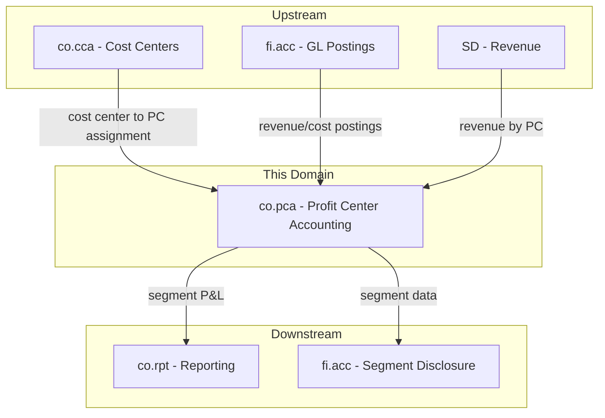
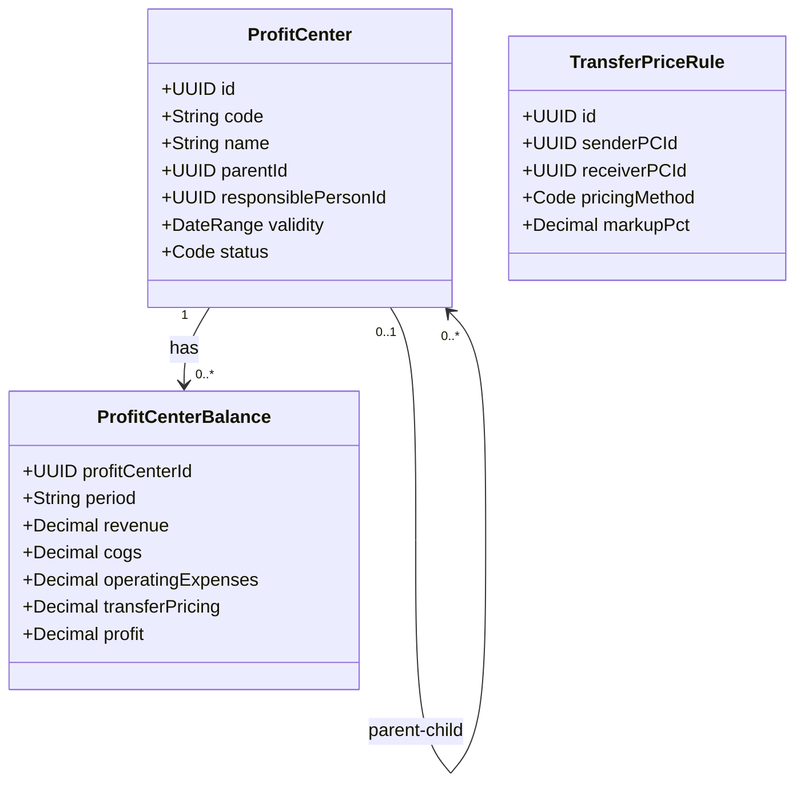
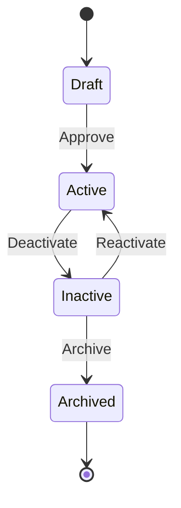
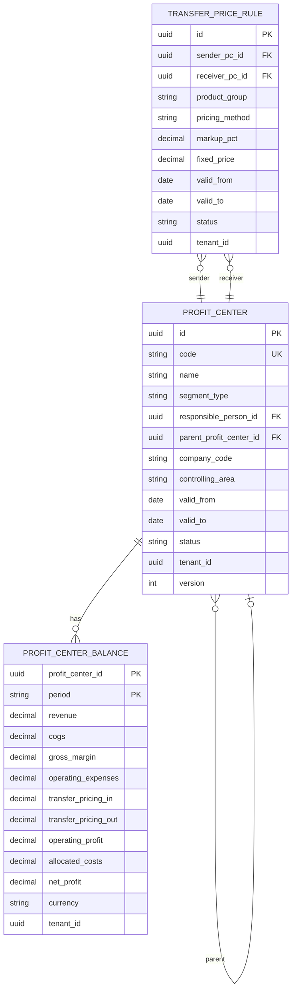

# CO - PCA Profit Center Accounting Domain / Service Specification

> **Conceptual Stack Layer:** Domain / Service
> **Space:** Platform
> **Owner:** Domain Engineering Team
> **Schema alignment:** `service-layer.schema.json`
> **Companion files:** `openapi.yaml`, `*.schema.json` (event contracts)
> **Referenced by:** Platform-Feature Spec SS5 (backend dependencies), BFF Contract
> **Belongs to:** CO Suite Spec (`_co_suite.md`)

> **Meta Information**
> - **Version:** 2026-04-01
> - **Template:** `domain-service-spec.md` v1.0.0
> - **Template Compliance:** ~75% — §11/§12/§13 stubs, §9/§10 very thin, §14 thin, §8 no column-level table defs
> - **Author(s):** OpenLeap Architecture Team
> - **Status:** DRAFT
> - **Suite:** `co`
> - **Domain:** `pca`
> - **Bounded Context Ref:** `bc:profit-center-accounting`
> - **Service ID:** `co-pca-svc`
> - **basePackage:** `io.openleap.co.pca`
> - **API Base Path:** `/api/co/pca/v1`
> - **OpenLeap Starter Version:** `v1`
> - **Port:** TBD
> - **Repository:** TBD
> - **Tags:** `controlling`, `profit-center`, `segment`, `transfer-pricing`
> - **Team:**
>   - Name: `team-co`
>   - Email: `co-team@openleap.io`
>   - Slack: `#co-team`

---

## Specification Guidelines Compliance

>
> ### Non-Negotiables
> - Never invent facts. If required info is missing, add an **OPEN QUESTION** entry.
> - Preserve intent and decisions. Only change meaning when explicitly requested.
> - Keep the spec **self-contained**: no "see chat", no implicit context.
>
> ### Style Guide
> - Use MUST/SHOULD/MAY for normative statements.

---

## 0. Document Purpose & Scope

### 0.1 Purpose
This specification defines the Profit Center Accounting (PCA) domain, which tracks profitability by organizational business segments (profit centers). Unlike co.pa (multi-dimensional analysis), PCA aligns with the organizational structure to provide segment-level P&L reporting for internal management and external segment disclosure.

### 0.2 Target Audience
- Product Owners & Business Stakeholders
- System Architects & Technical Leads
- Integration Engineers

### 0.3 Scope
**In Scope:**
- Profit center master data management (hierarchy, lifecycle)
- Revenue and cost aggregation by profit center
- Segment P&L calculation (revenue, COGS, operating expenses, profit)
- Transfer pricing between profit centers
- Profit center balance reporting

**Out of Scope:**
- Multi-dimensional profitability analysis (-> co.pa)
- Cost center management (-> co.cca)
- Cost allocations (-> co.om)
- External segment reporting (-> fi.acc / IFRS 8)

### 0.4 Related Documents
- `_co_suite.md` - CO Suite overview
- `co_cca-spec.md` - Cost Center Accounting
- `co_pa-spec.md` - Profitability Analysis
- `fi_acc_core_spec_complete.md` - Financial Accounting

---

## 1. Business Context

### 1.1 Domain Purpose
`co.pca` answers **"How profitable is each business segment?"** Profit centers represent business units, product lines, or regions as organizational entities. Every cost center, revenue posting, and asset is assigned to a profit center, enabling a segment-level profit and loss statement.

### 1.2 Business Value
- Segment-level P&L for management accountability
- Support for IFRS 8 segment reporting (data source)
- Internal transfer pricing between business units
- Investment and divestment decision support
- Management incentive alignment with profit center results

### 1.3 Key Stakeholders

| Role | Responsibility | Primary Use Cases |
|------|----------------|-------------------|
| Profit Center Manager | Own segment results, manage P&L | UC-003 |
| Controller | Configure profit centers, run calculations | UC-001, UC-002 |
| CFO | Review segment profitability | UC-003, UC-004 |

### 1.4 Strategic Positioning



### 1.5 Service Context

| Property | Value |
|----------|-------|
| **Suite** | `co` |
| **Domain** | `pca` |
| **Bounded Context** | `bc:profit-center-accounting` |
| **Service ID** | `co-pca-svc` |
| **Base Package** | `io.openleap.co.pca` |

---

## 2. Service Identity

| Property | Value | Schema Field |
|----------|-------|-------------|
| **Service ID** | `co-pca-svc` | `metadata.id` |
| **Display Name** | `Profit Center Accounting` | `metadata.name` |
| **Suite** | `co` | `metadata.suite` |
| **Domain** | `pca` | `metadata.domain` |
| **Bounded Context** | `bc:profit-center-accounting` | `metadata.bounded_context_ref` |
| **Version** | `1.0.0` | `metadata.version` |
| **Status** | DRAFT | `metadata.status` |
| **API Base Path** | `/api/co/pca/v1` | `metadata.api_base_path` |
| **Repository** | TBD | `metadata.repository` |
| **Tags** | `controlling`, `profit-center`, `segment` | `metadata.tags` |

**Team:**
| Property | Value |
|----------|-------|
| **Name** | `team-co` |
| **Email** | `co-team@openleap.io` |
| **Slack Channel** | `#co-team` |

---

## 3. Domain Model

### 3.1 Conceptual Overview

> OPEN QUESTION: A detailed conceptual overview narrative has not been authored yet.

### 3.2 Core Concepts



### 3.3 Aggregate Definitions

#### 3.3.1 ProfitCenter

| Property | Value |
|----------|-------|
| **Aggregate ID** | `agg:profit-center` |
| **Name** | `ProfitCenter` |

**Business Purpose:** An organizational business segment for P&L tracking. Cost centers are assigned to profit centers, creating the link between departmental costs and segment profitability.

**Key Attributes:**
| Attribute | Type | Format | Description | Constraints | Required | Read-Only |
|-----------|------|--------|-------------|-------------|----------|-----------|
| id | string | uuid | Unique identifier | — | Yes | Yes |
| code | string | — | Profit center code (e.g., "PC-EMEA-01") | unique per tenant | Yes | No |
| name | string | — | Descriptive name | max 255 chars | Yes | No |
| segmentType | string | — | Type | enum: business_unit, product_line, region, custom | Yes | No |
| responsiblePersonId | string | uuid | FK to BP | — | Yes | No |
| parentProfitCenterId | string | uuid | Hierarchy parent | — | No | No |
| companyCode | string | — | Company assignment | — | Yes | No |
| controllingArea | string | — | CO area | — | Yes | No |
| validFrom | string | date | Effective start | — | Yes | No |
| validTo | string | date | Effective end | — | No | No |
| status | string | — | Lifecycle | enum: draft, active, inactive, archived | Yes | No |
| tenantId | string | uuid | Tenant | — | Yes | Yes |
| version | integer | int64 | Optimistic lock | — | Yes | Yes |

**Lifecycle States:**


**Invariants:**
| Rule ID | Description |
|---------|-------------|
| BR-001 | code MUST be unique per (tenant_id, controlling_area) |
| BR-004 | No circular references in hierarchy |
| BR-005 | Each cost center SHOULD be assigned to exactly one active PC |

#### 3.3.2 TransferPriceRule

| Property | Value |
|----------|-------|
| **Aggregate ID** | `agg:transfer-price-rule` |
| **Name** | `TransferPriceRule` |

**Business Purpose:** Defines internal pricing for goods/services exchanged between profit centers.

**Key Attributes:**
| Attribute | Type | Format | Description | Constraints | Required | Read-Only |
|-----------|------|--------|-------------|-------------|----------|-----------|
| id | string | uuid | Unique identifier | — | Yes | Yes |
| senderPcId | string | uuid | Selling profit center | — | Yes | No |
| receiverPcId | string | uuid | Buying profit center | — | Yes | No |
| productGroup | string | — | Product group filter | — | No | No |
| pricingMethod | string | — | Method | enum: cost_plus, market_price, negotiated | Yes | No |
| markupPct | number | decimal | Markup for cost_plus | Required if cost_plus | Conditional | No |
| fixedPrice | number | decimal | Fixed unit price | Required if negotiated | Conditional | No |
| validFrom | string | date | Effective start | — | Yes | No |
| validTo | string | date | Effective end | — | No | No |
| status | string | — | State | enum: active, inactive | Yes | No |
| tenantId | string | uuid | Tenant | — | Yes | Yes |

### 3.4 Enumerations

> OPEN QUESTION: Content for this section has not been authored yet.

### 3.5 Shared Types

> OPEN QUESTION: Content for this section has not been authored yet.

---

## 4. Business Rules & Constraints

### 4.1 Business Rules Catalog

| ID | Rule Name | Description | Scope | Enforcement | Error Code |
|----|-----------|-------------|-------|-------------|------------|
| BR-001 | Unique Code | PC code MUST be unique per (tenant, controlling_area) | ProfitCenter | Create | `DUPLICATE_CODE` |
| BR-002 | Assignment Check | Warn if cost centers exist without PC assignment | ProfitCenter | Period close | — (warning) |
| BR-003 | Transfer Balance | Transfer pricing in (buyer) MUST equal out (seller) | ProfitCenterBalance | Calculation | `TRANSFER_IMBALANCE` |
| BR-004 | Hierarchy Acyclicity | No circular references | ProfitCenter | Update | `CIRCULAR_HIERARCHY` |
| BR-005 | One Active PC per CC | Each cost center SHOULD be assigned to exactly one active PC | CostCenter | co.cca validation | — (warning) |

### 4.3 Data Validation Rules

> OPEN QUESTION: Detailed field-level validations have not been authored yet.

### 4.4 Reference Data Dependencies

> OPEN QUESTION: Content for this section has not been authored yet.

---

## 5. Use Cases

### 5.1 Business Logic Placement

| Logic Type | Placement | Examples |
|------------|-----------|----------|
| Aggregate invariants | Domain Object | Code uniqueness, hierarchy integrity |
| Cross-aggregate logic | Domain Service | P&L calculation, transfer pricing |
| Orchestration & transactions | Application Service | Calculation run, event aggregation |

### 5.2 Use Cases (Canonical Format)

#### UC-001: MaintainProfitCenters

| Field | Value |
|-------|-------|
| **id** | `MaintainProfitCenters` |
| **type** | WRITE |
| **trigger** | REST |
| **aggregate** | `ProfitCenter` |
| **domainOperation** | `ProfitCenter.create` |
| **inputs** | `code: String`, `name: String`, `segmentType: Code`, `responsiblePersonId: UUID` |
| **outputs** | `ProfitCenter` |
| **events** | `ProfitCenter.created` |
| **rest** | `POST /api/co/pca/v1/profit-centers` |
| **idempotency** | optional |
| **errors** | `DUPLICATE_CODE`, `CIRCULAR_HIERARCHY` |

**Actor:** Controller

#### UC-002: CalculateProfitCenterPL

| Field | Value |
|-------|-------|
| **id** | `CalculateProfitCenterPL` |
| **type** | WRITE |
| **trigger** | REST |
| **aggregate** | `ProfitCenterBalance` |
| **domainOperation** | `ProfitCenterBalance.calculate` |
| **inputs** | `controllingArea: String`, `period: String` |
| **outputs** | `ProfitCenterBalance[]` |
| **events** | `ProfitCenter.calculated` |
| **rest** | `POST /api/co/pca/v1/calculations/execute` |
| **idempotency** | required |
| **errors** | `TRANSFER_IMBALANCE` |

**Actor:** Controller (period-end)

**Main Flow:**
1. Aggregate revenue from FI/SD events tagged with profit center
2. Aggregate COGS from co.pc for products sold by this segment
3. Aggregate operating expenses from co.cca (cost centers assigned to this PC)
4. Apply transfer pricing rules for inter-segment transactions
5. Apply allocated overhead from co.om
6. Calculate gross margin, operating profit, net profit
7. Store ProfitCenterBalance
8. Publish `co.pca.profitCenter.calculated` event

#### UC-003: ReviewSegmentPL

| Field | Value |
|-------|-------|
| **id** | `ReviewSegmentPL` |
| **type** | READ |
| **trigger** | REST |
| **aggregate** | `ProfitCenterBalance` |
| **domainOperation** | `getProfitCenterBalance` |
| **inputs** | `profitCenterId: UUID`, `period: String` |
| **outputs** | `ProfitCenterBalanceDTO` |
| **rest** | `GET /api/co/pca/v1/profit-centers/{id}/balances?period={period}` |
| **idempotency** | none |

**Actor:** Profit Center Manager / CFO

### 5.3 Process Flow Diagrams

> OPEN QUESTION: Detailed process flow diagrams have not been authored yet.

### 5.4 Cross-Domain Workflows

**Does this domain participate in multi-service workflows?** [ ] YES [x] NO

---

## 6. REST API

### 6.1 API Overview
**Base Path:** `/api/co/pca/v1`

### 6.2 Resource Operations

#### Profit Centers
```http
POST /api/co/pca/v1/profit-centers
GET /api/co/pca/v1/profit-centers/{id}
PATCH /api/co/pca/v1/profit-centers/{id}
GET /api/co/pca/v1/profit-centers?status=ACTIVE
GET /api/co/pca/v1/profit-centers/{id}/hierarchy
```

#### Profit Center Balances
```http
GET /api/co/pca/v1/profit-centers/{id}/balances?period=2026-02
GET /api/co/pca/v1/balances/summary?period=2026-02&controllingArea=CA01
```

#### Transfer Price Rules
```http
POST /api/co/pca/v1/transfer-price-rules
GET /api/co/pca/v1/transfer-price-rules?senderPcId={id}
```

### 6.3 Business Operations

#### Calculate P&L
```http
POST /api/co/pca/v1/calculations/execute
```
```json
{ "controllingArea": "CA01", "period": "2026-02" }
```

### 6.4 OpenAPI Specification
**Location:** `contracts/http/co/pca/openapi.yaml`

---

## 7. Events & Integration

### 7.1 Event-Driven Architecture Pattern
**Pattern Used:** [x] Event-Driven (Choreography) [ ] Orchestration (Saga) [ ] Hybrid

**Follows Suite Pattern:** [x] YES [ ] NO

**Message Broker:** `RabbitMQ`

### 7.2 Published Events

| Routing Key | Consumers | Description |
|------------|-----------|-------------|
| `co.pca.profitCenter.created` | co-cca-svc, co-rpt-svc | New profit center |
| `co.pca.profitCenter.updated` | co-cca-svc, co-rpt-svc | Profit center changed |
| `co.pca.profitCenter.calculated` | co-rpt-svc, fi-acc-svc | Segment P&L calculated |

### 7.3 Consumed Events

| Event | Source | Purpose |
|-------|--------|---------|
| fi.acc.journal.posted | fi-acc-svc | Revenue/cost with PC tag |
| co.cca.cost.posted | co-cca-svc | CC costs for PC aggregation |
| co.om.allocation.executed | co-om-svc | Allocated overhead by PC |
| sd.bil.invoice.posted | SD | Revenue by PC |
| co.pc.productCost.activated | co-pc-svc | COGS rates |

---

## 8. Data Model



---

## 9. Security & Compliance

| Data Element | Classification | Protection |
|--------------|----------------|------------|
| Segment P&L | Restricted | Encryption, strict RBAC |
| Transfer Prices | Confidential | Encryption, RBAC |

**Access:** PC managers see own segment; controllers see all; CFO sees consolidated.

---

## 10. Quality Attributes

| Operation | Target (p95) |
|-----------|-------------|
| Query PC balance | < 100ms |
| P&L calculation run | < 5 min |
| PC hierarchy query | < 200ms |

**Availability:** 99.5% | **RTO:** < 30 min | **RPO:** < 15 min

---

## 11. Feature Dependencies

> OPEN QUESTION: Content for this section has not been authored yet.

---

## 12. Extension Points

> OPEN QUESTION: Content for this section has not been authored yet.

---

## 13. Migration & Evolution

> OPEN QUESTION: Migration strategy for profit center accounting data has not been authored yet.

---

## 14. Decisions & Open Questions

### 14.1 Open Questions

| ID | Question | Impact | Needed By |
|----|----------|--------|-----------|
| Q-001 | Support statistical profit centers (cost allocation only, no revenue)? | Data model | Phase 2 |
| Q-002 | IFRS 8 segment mapping — automated or manual? | Integration | Phase 2 |

---

## 15. Appendix

### 15.1 Glossary

| Term | Definition | Aliases |
|------|------------|---------|
| Profit Center | Organizational segment for P&L | Profitcenter |
| Transfer Pricing | Internal pricing between segments | Verrechnungspreis |
| Segment P&L | Profit and loss by business segment | Spartenergebnis |

### 15.2 Change Log

| Date | Version | Author | Changes |
|------|---------|--------|---------|
| 2026-02-23 | 1.0 | OpenLeap Architecture Team | Initial version |
| 2026-04-01 | 1.1 | OpenLeap Architecture Team | Restructured to template compliance (sections 0-15) |

### 15.3 Review & Approval
**Status:** DRAFT
