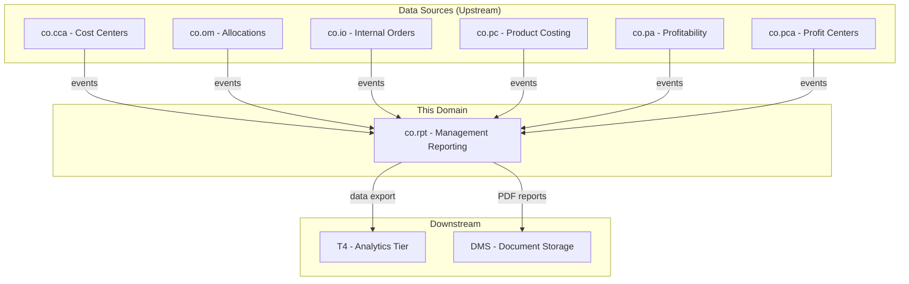
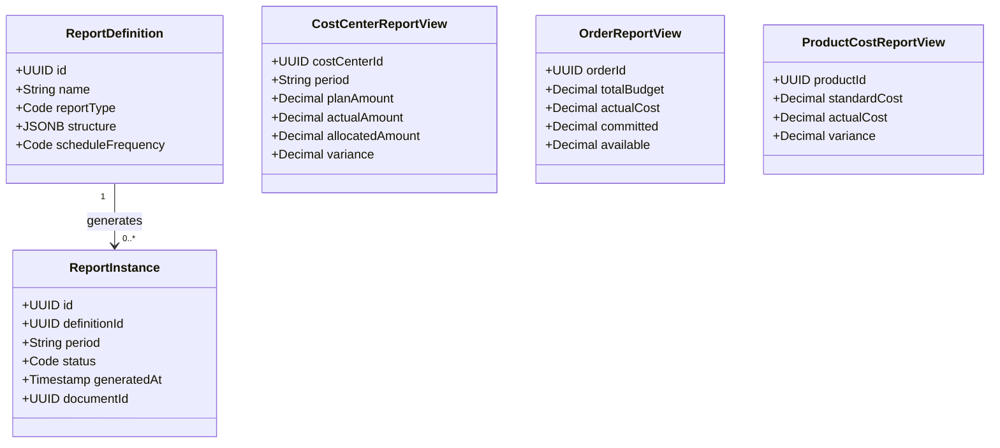
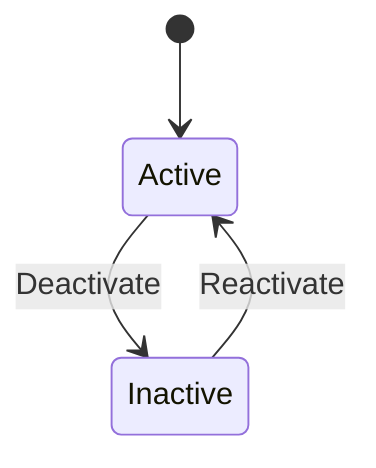
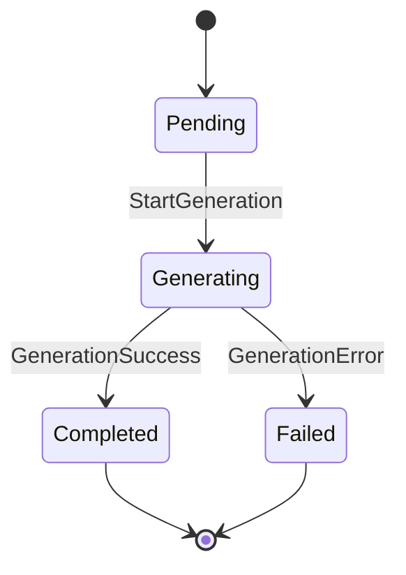
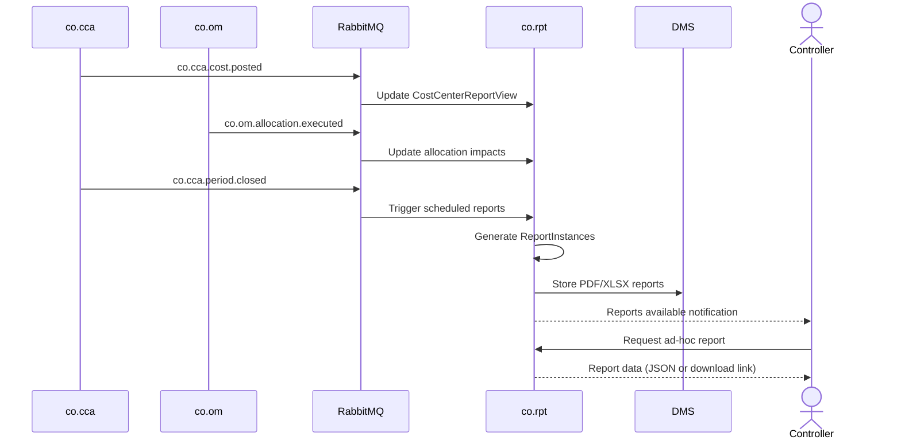
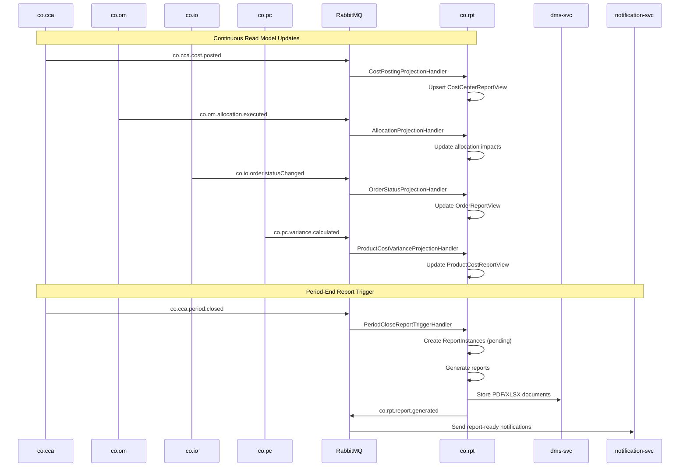
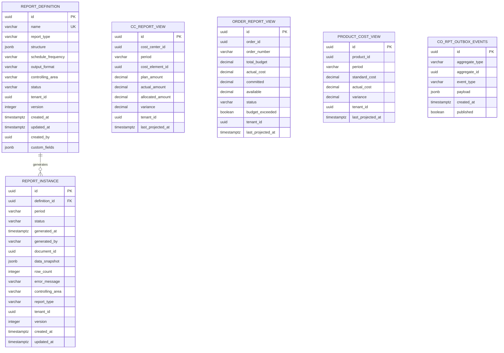

# CO - RPT Management Reporting Domain / Service Specification

> **Conceptual Stack Layer:** Domain / Service
> **Space:** Platform
> **Owner:** Domain Engineering Team
> **Schema alignment:** `service-layer.schema.json`
> **Companion files:** `openapi.yaml`, `*.schema.json` (event contracts)
> **Referenced by:** Platform-Feature Spec SS5 (backend dependencies), BFF Contract
> **Belongs to:** CO Suite Spec (`_co_suite.md`)

> **Meta Information**
> - **Version:** 2026-04-04
> - **Template:** `domain-service-spec.md` v1.0.0
> - **Template Compliance:** ~95% — minor gaps in §11 feature IDs (pending feature spec authoring)
> - **Author(s):** OpenLeap Architecture Team
> - **Status:** DRAFT
> - **Suite:** `co`
> - **Domain:** `rpt`
> - **Bounded Context Ref:** `bc:management-reporting`
> - **Service ID:** `co-rpt-svc`
> - **basePackage:** `io.openleap.co.rpt`
> - **API Base Path:** `/api/co/rpt/v1`
> - **OpenLeap Starter Version:** `v1`
> - **Port:** TBD
> - **Repository:** TBD
> - **Tags:** `controlling`, `reporting`, `read-model`, `cqrs`
> - **Team:**
>   - Name: `team-co`
>   - Email: `co-team@openleap.io`
>   - Slack: `#co-team`

---

## Specification Guidelines Compliance

> ### Non-Negotiables
> - Never invent facts. If required info is missing, add an **OPEN QUESTION** entry.
> - Preserve intent and decisions. Only change meaning when explicitly requested.
> - Do not remove normative constraints unless they are explicitly replaced.
> - Keep the spec **self-contained**: no "see chat", no implicit context.
>
> ### Source of Truth Priority
> When sources conflict:
> 1. Spec (explicit) wins
> 2. Starter specs (implementation constraints) next
> 3. Guidelines (best practices) last
>
> Record conflicts in the **Decisions & Conflicts** section (see Section 14).
>
> ### Style Guide
> - Prefer short sentences and lists.
> - Use MUST/SHOULD/MAY for normative statements.
> - Keep terminology consistent (Aggregate, Domain Service, Application Service, Command, Event).
> - Avoid ambiguous words ("often", "maybe") unless explicitly noting uncertainty.
> - Keep examples minimal and clearly marked as examples.
> - Do not add implementation code unless the chapter explicitly requires it.

---

## 0. Document Purpose & Scope

### 0.1 Purpose
This specification defines the Management Reporting (RPT) domain, which generates internal management reports from CO data. RPT consumes data from all other CO domains and produces cost center reports, product cost analysis, profitability summaries, and variance analysis reports for management decision-making.

### 0.2 Target Audience
- Product Owners & Business Stakeholders
- System Architects & Technical Leads
- Integration Engineers

### 0.3 Scope
**In Scope:**
- Cost center reports (plan vs. actual, budget utilization)
- Internal order reports (budget vs. actual, commitment)
- Product cost reports (standard vs. actual, variances)
- Consolidated CO reports (company-wide overhead analysis)
- Report definitions and scheduling
- Drill-down navigation from summary to detail
- Export to T4 Analytics for advanced analysis

**Out of Scope:**
- Profitability analysis reports (-> co.pa own reporting)
- External financial statements (-> fi.acc / T1 reporting tier)
- Strategic BI dashboards (-> T4 Analytics)
- Data collection and cost calculations (-> other CO domains)

### 0.4 Related Documents
- `_co_suite.md` - CO Suite overview
- `co_cca-spec.md` - Cost Center Accounting
- `co_om-spec.md` - Overhead Management
- `co_io-spec.md` - Internal Orders
- `co_pc-spec.md` - Product Costing

---

## 1. Business Context

### 1.1 Domain Purpose
`co.rpt` is the **reporting and analysis layer** of the CO Suite. It does not own transactional data — instead, it maintains read-optimized views (materialized aggregates) built from events published by other CO domains. It provides structured reports with drill-down capabilities for controllers and management.

### 1.2 Business Value
- Unified management reporting across all CO domains
- Real-time and period-end cost analysis
- Drill-down from company-level to individual postings
- Scheduled report generation for management reviews
- Pre-computed aggregates for fast query performance

### 1.3 Key Stakeholders

| Role | Responsibility | Primary Use Cases |
|------|----------------|-------------------|
| Controller | Review and distribute cost reports | UC-001 through UC-004 |
| Cost Center Manager | View own cost center reports | UC-001 |
| CFO / Management | Review consolidated reports | UC-004, UC-005 |
| Business Analyst | Configure report definitions | UC-006 |

### 1.4 Strategic Positioning



### 1.5 Service Context

| Property | Value |
|----------|-------|
| **Suite** | `co` |
| **Domain** | `rpt` |
| **Bounded Context** | `bc:management-reporting` |
| **Service ID** | `co-rpt-svc` |
| **Base Package** | `io.openleap.co.rpt` |

**Responsibilities:**
- Maintain read-optimized materialized views from CO domain events
- Generate structured management reports (cost center, order, product cost, variance, consolidated)
- Manage report definitions and scheduling
- Export report data to T4 Analytics and DMS

**Authoritative Sources:**
| Source Type | Description | Access Pattern |
|-------------|-------------|----------------|
| REST API | Report definitions, report instances, read model views | Synchronous |
| Database | Read-optimized projections, report definitions, generated snapshots | Direct (owner) |
| Events | `co.rpt.report.generated` — report completion notification | Asynchronous |

---

## 2. Service Identity

| Property | Value | Schema Field |
|----------|-------|-------------|
| **Service ID** | `co-rpt-svc` | `metadata.id` |
| **Display Name** | `Management Reporting` | `metadata.name` |
| **Suite** | `co` | `metadata.suite` |
| **Domain** | `rpt` | `metadata.domain` |
| **Bounded Context** | `bc:management-reporting` | `metadata.bounded_context_ref` |
| **Version** | `1.0.0` | `metadata.version` |
| **Status** | DRAFT | `metadata.status` |
| **API Base Path** | `/api/co/rpt/v1` | `metadata.api_base_path` |
| **Repository** | TBD | `metadata.repository` |
| **Tags** | `controlling`, `reporting`, `read-model`, `cqrs` | `metadata.tags` |

**Team:**
| Property | Value |
|----------|-------|
| **Name** | `team-co` |
| **Email** | `co-team@openleap.io` |
| **Slack Channel** | `#co-team` |

---

## 3. Domain Model

### 3.1 Conceptual Overview
RPT manages **Report Definitions** (templates defining structure and data sources), **Report Instances** (generated snapshots), and **Read Models** (materialized aggregates optimized for queries). RPT follows a CQRS pattern: it consumes events from transactional CO domains and builds query-optimized projections.

### 3.2 Core Concepts



### 3.3 Aggregate Definitions

#### 3.3.1 ReportDefinition

| Property | Value |
|----------|-------|
| **Aggregate ID** | `agg:report-definition` |
| **Name** | `ReportDefinition` |

**Business Purpose:** Configurable template for a management report. Defines what data to pull, how to structure it, and when to generate it. Analogous to SAP CO report layouts (transaction S_ALR_63013611 and related).

##### Aggregate Root

**Key Attributes:**
| Attribute | Type | Format | Description | Constraints | Required | Read-Only |
|-----------|------|--------|-------------|-------------|----------|-----------|
| id | string | uuid | Unique identifier generated via `OlUuid.create()` | Immutable | Yes | Yes |
| name | string | — | Human-readable report name (e.g., "Monthly Cost Center Report") | max_length: 255, min_length: 3 | Yes | No |
| reportType | string | — | Category of report | enum_ref: `ReportType` | Yes | No |
| description | string | — | Purpose and usage notes for this report | max_length: 2000 | No | No |
| structure | object | jsonb | Column definitions, filters, grouping, sort order, subtotals | — | Yes | No |
| dataSources | array | — | Which CO domains to query (e.g., ["co.cca", "co.om"]) | min_items: 1 | Yes | No |
| scheduleFrequency | string | — | Auto-generation schedule | enum_ref: `ScheduleFrequency` | No | No |
| outputFormat | string | — | Delivery format for generated reports | enum_ref: `OutputFormat` | Yes | No |
| recipients | array | uuid[] | User IDs or role IDs to receive generated reports | — | No | No |
| controllingArea | string | — | Controlling area scope for this report | max_length: 10 | Yes | No |
| status | string | — | Current lifecycle state | enum_ref: `DefinitionStatus` | Yes | No |
| tenantId | string | uuid | Tenant ownership | — | Yes | Yes |
| version | integer | int64 | Optimistic locking version | — | Yes | Yes |
| createdAt | string | date-time | Creation timestamp | — | Yes | Yes |
| updatedAt | string | date-time | Last modification timestamp | — | Yes | Yes |
| createdBy | string | uuid | User who created the definition | — | Yes | Yes |

**Lifecycle States:**

| Property | Value |
|----------|-------|
| **Initial State** | `active` |
| **Terminal States** | — (inactive can be reactivated) |



**State Descriptions:**
| State | Description | Business Meaning |
|-------|-------------|------------------|
| Active | Report definition is usable for generation | Available for scheduled and ad-hoc report generation |
| Inactive | Report definition is disabled | No scheduled generation; ad-hoc generation blocked |

**Allowed Transitions:**
| From State | To State | Trigger | Guard / Business Preconditions |
|------------|----------|---------|-------------------------------|
| Active | Inactive | Manual deactivation | None |
| Inactive | Active | Manual reactivation | Structure and data sources still valid |

**Invariants:**
| Rule ID | Description |
|---------|-------------|
| BR-006 | Name MUST be unique per tenant and controlling area |

**Domain Events Emitted:**
- `co.rpt.reportDefinition.created`
- `co.rpt.reportDefinition.updated`
- `co.rpt.reportDefinition.statusChanged`

##### Child Entities

_None. ReportDefinition is a flat aggregate. Structure, dataSources, and recipients are embedded value collections._

##### Value Objects

###### Value Object: ReportStructure

| Property | Value |
|----------|-------|
| **VO ID** | `vo:report-structure` |
| **Name** | `ReportStructure` |

**Description:** Defines the layout of a report: which columns to include, filters applied, grouping hierarchy, sort order, and subtotal levels. Stored as JSONB in the `structure` column.

**Attributes:**
| Attribute | Type | Format | Description | Constraints |
|-----------|------|--------|-------------|-------------|
| columns | array | — | Ordered list of column definitions (field, label, width, format) | min_items: 1 |
| filters | array | — | Data filters (field, operator, value) | — |
| groupBy | array | — | Hierarchical grouping fields (e.g., cost center, cost element) | — |
| sortBy | array | — | Sort definitions (field, direction) | — |
| subtotalLevels | array | — | Levels at which subtotals are calculated | — |

**Validation Rules:**
- columns array MUST contain at least one column definition
- Each column.field MUST reference a valid field from the data source schema
- groupBy fields MUST be a subset of columns

---

#### 3.3.2 ReportInstance

| Property | Value |
|----------|-------|
| **Aggregate ID** | `agg:report-instance` |
| **Name** | `ReportInstance` |

**Business Purpose:** A generated snapshot of a report for a specific period. Once generated, it is immutable — serving as a historical record of what the data looked like at generation time. Analogous to SAP spool output for CO reports.

##### Aggregate Root

**Key Attributes:**
| Attribute | Type | Format | Description | Constraints | Required | Read-Only |
|-----------|------|--------|-------------|-------------|----------|-----------|
| id | string | uuid | Unique identifier generated via `OlUuid.create()` | Immutable | Yes | Yes |
| definitionId | string | uuid | FK to ReportDefinition that was used | — | Yes | Yes |
| period | string | — | Fiscal period for which the report was generated | pattern: `^\d{4}-(0[1-9]\|1[0-2])$` | Yes | Yes |
| status | string | — | Current generation state | enum_ref: `InstanceStatus` | Yes | No |
| generatedAt | string | date-time | Timestamp when generation completed | Set on completion | No | Yes |
| generatedBy | string | — | How this instance was triggered | enum_ref: `GeneratedBy` | Yes | Yes |
| documentId | string | uuid | FK to DMS document for PDF/XLSX output | — | No | Yes |
| dataSnapshot | object | jsonb | Report data rows (for JSON format reports) | — | No | Yes |
| rowCount | integer | int32 | Number of data rows in the report | Computed on generation | No | Yes |
| errorMessage | string | — | Error details if generation failed | max_length: 4000 | No | Yes |
| controllingArea | string | — | Controlling area (denormalized from definition) | max_length: 10 | Yes | Yes |
| reportType | string | — | Report type (denormalized from definition) | enum_ref: `ReportType` | Yes | Yes |
| tenantId | string | uuid | Tenant ownership | — | Yes | Yes |
| version | integer | int64 | Optimistic locking version | — | Yes | Yes |
| createdAt | string | date-time | Creation timestamp | — | Yes | Yes |
| updatedAt | string | date-time | Last update timestamp | — | Yes | Yes |

**Lifecycle States:**

| Property | Value |
|----------|-------|
| **Initial State** | `pending` |
| **Terminal States** | `completed`, `failed` |



**State Descriptions:**
| State | Description | Business Meaning |
|-------|-------------|------------------|
| Pending | Instance created, generation not yet started | Queued for processing |
| Generating | Report data is being assembled | Background worker is building the report |
| Completed | Report successfully generated | Data snapshot and/or document available |
| Failed | Generation encountered an error | Error message available; can be retried by creating a new instance |

**Allowed Transitions:**
| From State | To State | Trigger | Guard / Business Preconditions |
|------------|----------|---------|-------------------------------|
| Pending | Generating | Worker picks up the job | Worker available |
| Generating | Completed | All data assembled successfully | rowCount > 0 or empty report allowed |
| Generating | Failed | Error during assembly | — |

**Invariants:**
| Rule ID | Description |
|---------|-------------|
| BR-005 | Completed or failed ReportInstances MUST NOT be modified |

**Domain Events Emitted:**
- `co.rpt.report.generated` (on transition to Completed)

##### Child Entities

_None. Report data is stored as JSONB snapshot within the aggregate._

##### Value Objects

_None beyond the embedded dataSnapshot JSONB._

### 3.4 Enumerations

#### ReportType

**Description:** Category of management report, determining which read model views are queried.

| Value | Description | Deprecated |
|-------|-------------|------------|
| `cost_center` | Cost center plan vs. actual report — compares planned and actual costs per cost center and cost element | No |
| `internal_order` | Internal order budget vs. actual report — shows budget utilization, commitments, and available funds | No |
| `product_cost` | Product cost variance report — compares standard and actual costs with decomposed variances | No |
| `variance` | Cross-domain variance analysis summary — aggregates variances from CC, IO, and PC domains | No |
| `consolidated` | Company-wide consolidated overhead analysis — aggregates all cost centers across the controlling area | No |
| `custom` | User-defined report structure with custom column selection and grouping | No |

#### ScheduleFrequency

**Description:** Defines how often a report is automatically generated.

| Value | Description | Deprecated |
|-------|-------------|------------|
| `none` | No automatic generation; report is generated on demand only | No |
| `daily` | Generated once per day (overnight batch) | No |
| `weekly` | Generated every Monday morning | No |
| `monthly` | Generated on the first business day of each month | No |
| `on_period_close` | Generated when `co.cca.period.closed` event is received for the period | No |

#### OutputFormat

**Description:** Delivery format for generated report instances.

| Value | Description | Deprecated |
|-------|-------------|------------|
| `json` | JSON data returned inline or stored as dataSnapshot — suitable for UI rendering | No |
| `pdf` | PDF document generated and stored in DMS — suitable for distribution | No |
| `xlsx` | Excel spreadsheet generated and stored in DMS — suitable for further analysis | No |

#### DefinitionStatus

**Description:** Lifecycle state of a ReportDefinition.

| Value | Description | Deprecated |
|-------|-------------|------------|
| `active` | Definition is usable for report generation | No |
| `inactive` | Definition is disabled; no generation allowed | No |

#### InstanceStatus

**Description:** Lifecycle state of a ReportInstance.

| Value | Description | Deprecated |
|-------|-------------|------------|
| `pending` | Instance created, generation queued | No |
| `generating` | Report data is being assembled | No |
| `completed` | Report generated successfully | No |
| `failed` | Generation encountered an error | No |

#### GeneratedBy

**Description:** Trigger source for report instance creation.

| Value | Description | Deprecated |
|-------|-------------|------------|
| `scheduled` | Triggered by the scheduling engine based on definition frequency | No |
| `manual` | Triggered by a user via REST API or UI | No |
| `event` | Triggered by a domain event (e.g., period close) | No |

### 3.5 Shared Types

#### Money

| Property | Value |
|----------|-------|
| **Type ID** | `type:money` |
| **Name** | `Money` |

**Description:** Monetary amount with currency, used across read model views for plan, actual, variance amounts.

**Attributes:**
| Attribute | Type | Format | Description | Constraints |
|-----------|------|--------|-------------|-------------|
| amount | number | decimal | Monetary value | precision: 2 |
| currencyCode | string | — | ISO 4217 currency code | pattern: `^[A-Z]{3}$` |

**Validation Rules:**
- currencyCode MUST be a valid ISO 4217 code
- amount precision MUST NOT exceed 2 decimal places

**Used By:**
- `CostCenterReportView` (plan, actual, allocated, variance amounts)
- `OrderReportView` (budget, actual, committed, available amounts)
- `ProductCostReportView` (standard, actual, variance amounts)

---

## 4. Business Rules & Constraints

### 4.1 Business Rules Catalog

| ID | Rule Name | Description | Scope | Enforcement | Error Code |
|----|-----------|-------------|-------|-------------|------------|
| BR-001 | Report After Close | Period-end reports MUST only be generated after co.cca.period.closed | ReportInstance | Generation | `PERIOD_NOT_CLOSED` |
| BR-002 | Data Freshness | Read models MUST be updated within 60 seconds of source events | Read Models | Event processing | — |
| BR-003 | Drill-Down Consistency | Report totals MUST equal sum of detail rows | ReportInstance | Generation | `TOTAL_MISMATCH` |
| BR-004 | Access Filtering | Cost center managers MUST only see own cost center data | All reports | Query | `ACCESS_DENIED` |
| BR-005 | Immutable Reports | Generated ReportInstances MUST NOT be modified | ReportInstance | Update | `IMMUTABLE_REPORT` |
| BR-006 | Unique Definition Name | Report definition name MUST be unique per tenant and controlling area | ReportDefinition | Create/Update | `DUPLICATE_NAME` |
| BR-007 | Valid Data Sources | dataSources array MUST reference valid CO domain identifiers | ReportDefinition | Create/Update | `INVALID_DATA_SOURCE` |
| BR-008 | Period Format | Period MUST follow YYYY-MM format and be a valid calendar month | ReportInstance | Create | `INVALID_PERIOD` |

### 4.2 Detailed Rule Definitions

#### BR-001: Report After Close

**Business Context:** Period-end management reports (especially cost center and variance reports) MUST reflect finalized data. Generating before period close would produce misleading figures as late postings and allocations may still occur.

**Rule Statement:** A ReportInstance with scheduleFrequency `on_period_close` or reportType `consolidated` MUST NOT be generated for a period unless a `co.cca.period.closed` event has been received for that period and controlling area.

**Applies To:**
- Aggregate: ReportInstance
- Operations: Create (generation trigger)

**Enforcement:** Application Service checks period close status before initiating generation.

**Validation Logic:** Query internal period-close tracking table to confirm that the requested period + controlling area combination has a closed status.

**Error Handling:**
- **Error Code:** `PERIOD_NOT_CLOSED`
- **Error Message:** "Cannot generate period-end report: period {period} is not yet closed for controlling area {controllingArea}"
- **User action:** Wait for period close process to complete or generate an interim report instead.

**Examples:**
- **Valid:** Generate cost center report for 2026-01 after co.cca.period.closed event received for 2026-01/CA01.
- **Invalid:** Generate consolidated report for 2026-03 when period 2026-03 is still open.

#### BR-002: Data Freshness

**Business Context:** Controllers rely on near-real-time data for ad-hoc queries. Stale read models reduce trust in the reporting system.

**Rule Statement:** Event projections MUST process source events and update read model views within 60 seconds of event publication under normal load.

**Applies To:**
- Aggregate: All read model views
- Operations: Event processing

**Enforcement:** Event consumer monitoring and alerting.

**Validation Logic:** Measure lag between event `occurredAt` timestamp and read model `lastProjectedAt` timestamp.

**Error Handling:**
- **Error Code:** N/A (operational metric, not user-facing)
- **Error Message:** N/A
- **User action:** N/A — system self-monitors and alerts operations team.

**Examples:**
- **Valid:** Cost posting event at 10:00:00 reflected in CostCenterReportView by 10:00:45.
- **Invalid:** Cost posting event at 10:00:00 not reflected until 10:05:00 (5 min lag).

#### BR-003: Drill-Down Consistency

**Business Context:** Management relies on reports where summary totals match detail rows. Any discrepancy undermines trust in the entire reporting system (analogous to SAP totals records in cost center reports).

**Rule Statement:** For every generated ReportInstance, the sum of detail row amounts MUST equal the corresponding subtotal and grand total amounts within rounding tolerance (0.01 currency units).

**Applies To:**
- Aggregate: ReportInstance
- Operations: Generation (post-generation validation)

**Enforcement:** Post-generation checksum validation in the Application Service.

**Validation Logic:** After assembling report data, sum all detail rows per grouping level and compare against computed subtotals. If any discrepancy exceeds 0.01, fail the generation.

**Error Handling:**
- **Error Code:** `TOTAL_MISMATCH`
- **Error Message:** "Report generation failed: total mismatch detected in group {groupKey}. Expected {expected}, got {actual}"
- **User action:** Report the issue to the CO team for investigation — likely indicates an event processing gap.

**Examples:**
- **Valid:** Cost center 1000 detail rows sum to 50,000.00; subtotal shows 50,000.00.
- **Invalid:** Cost center 1000 detail rows sum to 49,998.50 but subtotal shows 50,000.00.

#### BR-004: Access Filtering

**Business Context:** Cost center managers SHOULD only see data for their assigned cost centers. Controllers and CFO have broader access. This enforces the principle of least privilege for management accounting data.

**Rule Statement:** When a user with role `CO_RPT_VIEWER` queries reports or read model views, the system MUST filter results to only include cost centers assigned to that user.

**Applies To:**
- Aggregate: All reports and read model views
- Operations: Query (read)

**Enforcement:** Query-time filter applied in the Application Service based on user's cost center assignments from IAM.

**Validation Logic:** Retrieve user's assigned cost center IDs from IAM context. Apply as WHERE clause filter on all read model queries.

**Error Handling:**
- **Error Code:** `ACCESS_DENIED`
- **Error Message:** "You do not have access to cost center {costCenterId}"
- **User action:** Request access from your manager or contact the CO administrator.

**Examples:**
- **Valid:** Cost center manager for CC-1000 queries and receives only CC-1000 data.
- **Invalid:** Cost center manager for CC-1000 receives data for CC-2000.

#### BR-005: Immutable Reports

**Business Context:** Generated reports serve as historical records of the data at a point in time. Modification would compromise auditability. If updated data is needed, a new report instance MUST be generated.

**Rule Statement:** A ReportInstance in status `completed` or `failed` MUST NOT be modified. Any attempt to update or delete a terminal-state instance MUST be rejected.

**Applies To:**
- Aggregate: ReportInstance
- Operations: Update, Delete

**Enforcement:** Domain Object rejects state mutations when status is terminal.

**Validation Logic:** Check `status` field. If `completed` or `failed`, reject the operation.

**Error Handling:**
- **Error Code:** `IMMUTABLE_REPORT`
- **Error Message:** "Report instance {id} is in terminal state '{status}' and cannot be modified. Generate a new report instead."
- **User action:** Create a new report instance for the same definition and period.

**Examples:**
- **Valid:** Generating a new ReportInstance for the same definition and period.
- **Invalid:** Attempting to PATCH a completed ReportInstance's dataSnapshot.

#### BR-006: Unique Definition Name

**Business Context:** Report definition names are used in UI listings and recipient notifications. Duplicates cause confusion.

**Rule Statement:** The `name` field of a ReportDefinition MUST be unique within the combination of `tenantId` and `controllingArea`.

**Applies To:**
- Aggregate: ReportDefinition
- Operations: Create, Update

**Enforcement:** Database unique constraint on (tenant_id, controlling_area, name).

**Validation Logic:** Check uniqueness before persisting. Exclude the current entity on update.

**Error Handling:**
- **Error Code:** `DUPLICATE_NAME`
- **Error Message:** "A report definition with name '{name}' already exists for controlling area {controllingArea}"
- **User action:** Choose a different name.

**Examples:**
- **Valid:** Creating "Monthly Cost Center Report" when no other definition has that name for the same controlling area.
- **Invalid:** Creating "Monthly Cost Center Report" when one already exists in the same controlling area.

#### BR-007: Valid Data Sources

**Business Context:** Report definitions reference CO domains as data sources. Invalid references would cause generation failures.

**Rule Statement:** Every entry in `dataSources` MUST be a recognized CO domain identifier (co.cca, co.om, co.io, co.pc, co.pa, co.pca).

**Applies To:**
- Aggregate: ReportDefinition
- Operations: Create, Update

**Enforcement:** Application Service validation against allowed domain list.

**Validation Logic:** Compare each data source entry against the known CO domain registry.

**Error Handling:**
- **Error Code:** `INVALID_DATA_SOURCE`
- **Error Message:** "Data source '{source}' is not a recognized CO domain"
- **User action:** Use one of the valid CO domain identifiers.

**Examples:**
- **Valid:** dataSources: ["co.cca", "co.om"]
- **Invalid:** dataSources: ["co.cca", "fi.gl"]

#### BR-008: Period Format

**Business Context:** Reports are generated for specific fiscal periods. The period format MUST be consistent for querying and display.

**Rule Statement:** The `period` field MUST match the pattern YYYY-MM and represent a valid calendar month.

**Applies To:**
- Aggregate: ReportInstance
- Operations: Create

**Enforcement:** Validation in Application Service.

**Validation Logic:** Regex match `^\d{4}-(0[1-9]|1[0-2])$` and verify month validity.

**Error Handling:**
- **Error Code:** `INVALID_PERIOD`
- **Error Message:** "Period '{period}' is not a valid YYYY-MM format"
- **User action:** Provide a valid period in YYYY-MM format.

**Examples:**
- **Valid:** "2026-02"
- **Invalid:** "2026-13", "26-02"

### 4.3 Data Validation Rules

**Field-Level Validations:**
| Field | Validation Rule | Error Message |
|-------|----------------|---------------|
| name | Required, min 3 chars, max 255 chars | "Report name is required and must be between 3 and 255 characters" |
| reportType | Required, must be in ReportType enum | "Invalid report type" |
| period | Required, YYYY-MM format | "Invalid period format" |
| outputFormat | Required, must be in OutputFormat enum | "Unsupported output format" |
| controllingArea | Required, max 10 chars | "Controlling area is required" |
| dataSources | Required, min 1 item | "At least one data source is required" |
| structure | Required, must be valid JSON | "Report structure is required and must be valid JSON" |
| scheduleFrequency | Optional, must be in ScheduleFrequency enum | "Invalid schedule frequency" |
| recipients | Optional, each must be valid UUID | "Invalid recipient ID format" |

**Cross-Field Validations:**
- If `scheduleFrequency` is `on_period_close`, `reportType` SHOULD be `cost_center`, `variance`, or `consolidated`
- If `outputFormat` is `pdf` or `xlsx`, recipients SHOULD be specified for distribution
- `dataSources` MUST be consistent with `reportType` (e.g., `cost_center` type requires `co.cca` in dataSources)

### 4.4 Reference Data Dependencies

**Required Reference Data:**
| Catalog | Source Service | Fields Referencing | Validation |
|---------|----------------|-------------------|------------|
| Controlling Areas | co-cca-svc | controllingArea | Must exist and be active |
| Cost Centers | co-cca-svc | CostCenterReportView.costCenterId | Must exist in controlling area |
| Cost Elements | co-cca-svc | CostCenterReportView.costElementId | Must exist and be active |
| Internal Orders | co-io-svc | OrderReportView.orderId | Must exist |
| Currencies | ref-data-svc | Money.currencyCode | Must exist and be active |

---

## 5. Use Cases

### 5.1 Business Logic Placement

| Logic Type | Placement | Examples |
|------------|-----------|----------|
| Aggregate invariants | Domain Object | Report immutability, format validation |
| Cross-aggregate logic | Domain Service | Read model projection, report generation |
| Orchestration & transactions | Application Service | Scheduled report generation, DMS storage |

### 5.2 Use Cases (Canonical Format)

#### UC-001: GenerateCostCenterReport

| Field | Value |
|-------|-------|
| **id** | `GenerateCostCenterReport` |
| **type** | READ |
| **trigger** | REST |
| **aggregate** | `CostCenterReportView` |
| **domainOperation** | `getCostCenterReport` |
| **inputs** | `controllingArea: String`, `period: String`, `costCenterIds: UUID[]`, `outputFormat: Code` |
| **outputs** | `ReportInstance` or `CostCenterReport` |
| **rest** | `POST /api/co/rpt/v1/reports/generate` |
| **idempotency** | none |
| **errors** | `PERIOD_NOT_CLOSED` |

**Actor:** Controller

**Preconditions:**
- User has `co.rpt:read` permission
- Requested period exists in the system
- For period-end reports, period MUST be closed (BR-001)

**Main Flow:**
1. Controller requests cost center report for period(s) and cost center(s)
2. System validates period format (BR-008) and user access (BR-004)
3. System queries CostCenterReportView (materialized from co.cca events)
4. System formats report with plan, actual, allocated, variance columns
5. System validates drill-down consistency (BR-003)
6. System returns report data or creates ReportInstance
7. If PDF/XLSX requested, system generates document and stores in DMS

**Postconditions:**
- Report data returned to user (JSON) or ReportInstance created (PDF/XLSX)
- If ReportInstance created, `co.rpt.report.generated` event published

**Business Rules Applied:**
- BR-001: Report After Close (for period-end reports)
- BR-003: Drill-Down Consistency
- BR-004: Access Filtering

**Alternative Flows:**
- **Alt-1:** If outputFormat is `json`, return report data synchronously without creating a ReportInstance
- **Alt-2:** If multiple periods requested, system generates a multi-period comparison report

**Exception Flows:**
- **Exc-1:** If period is not closed, return `422` with `PERIOD_NOT_CLOSED`
- **Exc-2:** If no data exists for the requested cost centers, return empty report with zero rows

#### UC-002: GenerateInternalOrderReport

| Field | Value |
|-------|-------|
| **id** | `GenerateInternalOrderReport` |
| **type** | READ |
| **trigger** | REST |
| **aggregate** | `OrderReportView` |
| **domainOperation** | `getInternalOrderReport` |
| **inputs** | `controllingArea: String`, `orderIds: UUID[]`, `status: Code`, `outputFormat: Code` |
| **outputs** | `ReportInstance` or `OrderBudgetReport` |
| **rest** | `POST /api/co/rpt/v1/reports/generate` |
| **idempotency** | none |
| **errors** | — |

**Actor:** Controller

**Preconditions:**
- User has `co.rpt:read` permission
- Requested internal orders exist

**Main Flow:**
1. Controller requests internal order budget report
2. System validates user access
3. System queries OrderReportView for requested orders (budget, actual, committed, available)
4. System formats report showing budget utilization percentage and RAG status
5. System returns report data or creates ReportInstance

**Postconditions:**
- Report data returned to user or ReportInstance created

**Business Rules Applied:**
- BR-004: Access Filtering

**Alternative Flows:**
- **Alt-1:** If no orderIds specified, return all orders for the controlling area filtered by status

**Exception Flows:**
- **Exc-1:** If no matching orders found, return empty report

#### UC-003: GenerateProductCostReport

| Field | Value |
|-------|-------|
| **id** | `GenerateProductCostReport` |
| **type** | READ |
| **trigger** | REST |
| **aggregate** | `ProductCostReportView` |
| **domainOperation** | `getProductCostReport` |
| **inputs** | `controllingArea: String`, `period: String`, `productIds: UUID[]`, `outputFormat: Code` |
| **outputs** | `ReportInstance` or `ProductCostReport` |
| **rest** | `POST /api/co/rpt/v1/reports/generate` |
| **idempotency** | none |
| **errors** | `PERIOD_NOT_CLOSED` |

**Actor:** Controller

**Preconditions:**
- User has `co.rpt:read` permission
- Period data available in ProductCostReportView

**Main Flow:**
1. Controller requests product cost variance report for a period
2. System validates period format and user access
3. System queries ProductCostReportView for standard cost, actual cost, and computed variance
4. System formats report with variance decomposition columns (price, quantity, efficiency)
5. System returns report data or creates ReportInstance

**Postconditions:**
- Report data returned to user or ReportInstance created

**Business Rules Applied:**
- BR-001: Report After Close (for period-end variance analysis)
- BR-003: Drill-Down Consistency

**Alternative Flows:**
- **Alt-1:** If productIds is empty, return all products in the controlling area

**Exception Flows:**
- **Exc-1:** If variance data not yet calculated (co.pc.variance.calculated not received), return partial report with warning

#### UC-004: GenerateConsolidatedReport

| Field | Value |
|-------|-------|
| **id** | `GenerateConsolidatedReport` |
| **type** | READ |
| **trigger** | REST |
| **aggregate** | `CostCenterReportView`, `OrderReportView`, `ProductCostReportView` |
| **domainOperation** | `getConsolidatedReport` |
| **inputs** | `controllingArea: String`, `period: String`, `outputFormat: Code` |
| **outputs** | `ReportInstance` |
| **rest** | `POST /api/co/rpt/v1/reports/generate` |
| **idempotency** | none |
| **errors** | `PERIOD_NOT_CLOSED` |

**Actor:** CFO / Management

**Preconditions:**
- User has `co.rpt:read` permission
- Period MUST be closed (BR-001)

**Main Flow:**
1. Management requests company-wide consolidated overhead analysis
2. System validates period is closed and user has access
3. System queries all read model views for the period and controlling area
4. System aggregates cost center totals, order utilization, and product cost variances
5. System generates consolidated summary with KPIs (total overhead, budget utilization %, variance %)
6. System creates ReportInstance and stores document in DMS

**Postconditions:**
- ReportInstance in `completed` status
- PDF/XLSX stored in DMS
- `co.rpt.report.generated` event published

**Business Rules Applied:**
- BR-001: Report After Close
- BR-003: Drill-Down Consistency

**Alternative Flows:**
- **Alt-1:** If outputFormat is `json`, return data without DMS storage

**Exception Flows:**
- **Exc-1:** If period not closed, return `422` with `PERIOD_NOT_CLOSED`

#### UC-005: ScheduleAutomatedReports

| Field | Value |
|-------|-------|
| **id** | `ScheduleAutomatedReports` |
| **type** | WRITE |
| **trigger** | REST |
| **aggregate** | `ReportDefinition` |
| **domainOperation** | `ReportDefinition.create` |
| **inputs** | `name: String`, `reportType: Code`, `structure: JSONB`, `scheduleFrequency: Code`, `outputFormat: Code`, `recipients: UUID[]`, `controllingArea: String`, `dataSources: String[]` |
| **outputs** | `ReportDefinition` |
| **events** | `co.rpt.reportDefinition.created` |
| **rest** | `POST /api/co/rpt/v1/definitions` |
| **idempotency** | optional |
| **errors** | `DUPLICATE_NAME`, `INVALID_DATA_SOURCE` |

**Actor:** Business Analyst

**Preconditions:**
- User has `co.rpt:write` permission
- Controlling area exists
- Data sources are valid CO domains

**Main Flow:**
1. Business Analyst submits report definition with structure, schedule, and recipients
2. System validates name uniqueness (BR-006) and data sources (BR-007)
3. System creates ReportDefinition in `active` status
4. System publishes `co.rpt.reportDefinition.created` event
5. If schedule is not `none`, system registers definition with the scheduling engine

**Postconditions:**
- ReportDefinition persisted in `active` status
- If scheduled, reports will be auto-generated per the frequency

**Business Rules Applied:**
- BR-006: Unique Definition Name
- BR-007: Valid Data Sources

**Alternative Flows:**
- **Alt-1:** If scheduleFrequency is `none`, no scheduling is registered

**Exception Flows:**
- **Exc-1:** If name is duplicate, return `409` with `DUPLICATE_NAME`
- **Exc-2:** If data source is invalid, return `422` with `INVALID_DATA_SOURCE`

#### UC-006: UpdateReportDefinition

| Field | Value |
|-------|-------|
| **id** | `UpdateReportDefinition` |
| **type** | WRITE |
| **trigger** | REST |
| **aggregate** | `ReportDefinition` |
| **domainOperation** | `ReportDefinition.update` |
| **inputs** | `id: UUID`, `name: String?`, `structure: JSONB?`, `scheduleFrequency: Code?`, `outputFormat: Code?`, `recipients: UUID[]?` |
| **outputs** | `ReportDefinition` |
| **events** | `co.rpt.reportDefinition.updated` |
| **rest** | `PATCH /api/co/rpt/v1/definitions/{id}` |
| **idempotency** | required (ETag) |
| **errors** | `DUPLICATE_NAME`, `IMMUTABLE_REPORT` |

**Actor:** Business Analyst

**Preconditions:**
- User has `co.rpt:write` permission
- Definition exists and is in `active` status

**Main Flow:**
1. Business Analyst submits partial update for a report definition
2. System validates ETag for optimistic concurrency
3. System validates updated fields (name uniqueness, data source validity)
4. System applies changes and increments version
5. System publishes `co.rpt.reportDefinition.updated` event
6. If schedule frequency changed, system updates scheduling engine

**Postconditions:**
- ReportDefinition updated with new version
- Scheduling adjusted if frequency changed

**Business Rules Applied:**
- BR-006: Unique Definition Name
- BR-007: Valid Data Sources

**Alternative Flows:**
- **Alt-1:** If only recipients changed, no scheduling update needed

**Exception Flows:**
- **Exc-1:** If ETag mismatch, return `412 Precondition Failed`
- **Exc-2:** If definition is inactive, return `422` — reactivate first

### 5.3 Process Flow Diagrams



### 5.4 Cross-Domain Workflows

**Does this domain participate in multi-service workflows?** [x] YES [ ] NO

#### Workflow: Period-End Report Generation

**Business Purpose:** Automatically generate all scheduled period-end reports once a controlling period is closed.

**Orchestration Pattern:** [x] Choreography (EDA) [ ] Orchestration (Saga)

**Pattern Rationale:** RPT reacts to period.closed events from co.cca. No coordination needed — RPT independently determines which report definitions have `on_period_close` frequency and generates them.

**Participating Services:**
| Service | Role | Responsibilities |
|---------|------|------------------|
| co-cca-svc | Event Publisher | Publishes `co.cca.period.closed` when a controlling period is finalized |
| co-rpt-svc | Event Consumer | Identifies scheduled definitions, generates ReportInstances, stores documents |
| dms-svc | Document Store | Stores generated PDF/XLSX documents |
| notification-svc | Notifier | Delivers report-ready notifications to recipients |

**Workflow Steps:**
1. **Step 1:** co-cca-svc closes a period and publishes `co.cca.period.closed`
   - Success: Event published to exchange
   - Failure: Period close is transactional within co-cca-svc; no RPT involvement

2. **Step 2:** co-rpt-svc consumes event, queries definitions with `on_period_close` frequency for the controlling area
   - Success: Creates ReportInstance(s) in `pending` status
   - Failure: Logs error, retries per DLQ policy

3. **Step 3:** co-rpt-svc generates each report, stores in DMS, publishes `co.rpt.report.generated`
   - Success: ReportInstance transitions to `completed`
   - Failure: ReportInstance transitions to `failed` with error message

**Business Implications:**
- **Success Path:** All period-end reports available for controller review within minutes of period close
- **Failure Path:** Failed reports are flagged; controller can regenerate manually
- **Compensation:** No compensation needed — failed generation does not affect source data

---

## 6. REST API

### 6.1 API Overview
**Base Path:** `/api/co/rpt/v1`
**Authentication:** OAuth2/JWT (Bearer token)
**Authorization:**
- Read operations: Requires scope `co.rpt:read`
- Write operations: Requires scope `co.rpt:write`
- Admin operations: Requires scope `co.rpt:admin`

### 6.2 Resource Operations

#### 6.2.1 Report Definitions - Create

```http
POST /api/co/rpt/v1/definitions
Authorization: Bearer {token}
Content-Type: application/json
```

**Request Body:**
```json
{
  "name": "Monthly Cost Center Report",
  "reportType": "cost_center",
  "description": "Monthly plan vs. actual cost report for all cost centers",
  "structure": {
    "columns": [
      {"field": "costCenterCode", "label": "Cost Center", "width": 120},
      {"field": "costElementCode", "label": "Cost Element", "width": 120},
      {"field": "planAmount", "label": "Plan", "width": 100, "format": "currency"},
      {"field": "actualAmount", "label": "Actual", "width": 100, "format": "currency"},
      {"field": "variance", "label": "Variance", "width": 100, "format": "currency"},
      {"field": "variancePercent", "label": "Var %", "width": 80, "format": "percent"}
    ],
    "groupBy": ["costCenterCode"],
    "sortBy": [{"field": "costCenterCode", "direction": "asc"}],
    "subtotalLevels": ["costCenterCode"]
  },
  "dataSources": ["co.cca"],
  "scheduleFrequency": "on_period_close",
  "outputFormat": "pdf",
  "recipients": ["550e8400-e29b-41d4-a716-446655440000"],
  "controllingArea": "CA01"
}
```

**Success Response:** `201 Created`
```json
{
  "id": "a1b2c3d4-e5f6-7890-abcd-ef1234567890",
  "version": 1,
  "name": "Monthly Cost Center Report",
  "reportType": "cost_center",
  "description": "Monthly plan vs. actual cost report for all cost centers",
  "structure": { "..." : "..." },
  "dataSources": ["co.cca"],
  "scheduleFrequency": "on_period_close",
  "outputFormat": "pdf",
  "recipients": ["550e8400-e29b-41d4-a716-446655440000"],
  "controllingArea": "CA01",
  "status": "active",
  "createdAt": "2026-04-04T10:30:00Z",
  "updatedAt": "2026-04-04T10:30:00Z",
  "_links": {
    "self": { "href": "/api/co/rpt/v1/definitions/a1b2c3d4-e5f6-7890-abcd-ef1234567890" }
  }
}
```

**Response Headers:**
- `Location: /api/co/rpt/v1/definitions/a1b2c3d4-e5f6-7890-abcd-ef1234567890`
- `ETag: "1"`

**Business Rules Checked:**
- BR-006: Unique Definition Name
- BR-007: Valid Data Sources

**Events Published:**
- `co.rpt.reportDefinition.created`

**Error Responses:**
- `400 Bad Request` — Validation error (missing required fields)
- `409 Conflict` — Duplicate name for controlling area (BR-006)
- `422 Unprocessable Entity` — Invalid data source (BR-007)

#### 6.2.2 Report Definitions - List

```http
GET /api/co/rpt/v1/definitions?page=0&size=50&sort=name,asc&controllingArea=CA01&reportType=cost_center&status=active
Authorization: Bearer {token}
```

**Query Parameters:**
| Parameter | Type | Description | Default |
|-----------|------|-------------|---------|
| page | integer | Page number (0-based) | 0 |
| size | integer | Page size (max 200) | 50 |
| sort | string | Sort field and direction | name,asc |
| controllingArea | string | Filter by controlling area | (all) |
| reportType | string | Filter by report type | (all) |
| status | string | Filter by status | (all) |

**Success Response:** `200 OK`
```json
{
  "content": [
    {
      "id": "a1b2c3d4-e5f6-7890-abcd-ef1234567890",
      "name": "Monthly Cost Center Report",
      "reportType": "cost_center",
      "scheduleFrequency": "on_period_close",
      "outputFormat": "pdf",
      "controllingArea": "CA01",
      "status": "active"
    }
  ],
  "page": {
    "size": 50,
    "totalElements": 12,
    "totalPages": 1,
    "number": 0
  },
  "_links": {
    "self": { "href": "/api/co/rpt/v1/definitions?page=0&size=50" }
  }
}
```

#### 6.2.3 Report Definitions - Retrieve

```http
GET /api/co/rpt/v1/definitions/{id}
Authorization: Bearer {token}
```

**Success Response:** `200 OK`
```json
{
  "id": "a1b2c3d4-e5f6-7890-abcd-ef1234567890",
  "version": 1,
  "name": "Monthly Cost Center Report",
  "reportType": "cost_center",
  "description": "Monthly plan vs. actual cost report for all cost centers",
  "structure": { "..." : "..." },
  "dataSources": ["co.cca"],
  "scheduleFrequency": "on_period_close",
  "outputFormat": "pdf",
  "recipients": ["550e8400-e29b-41d4-a716-446655440000"],
  "controllingArea": "CA01",
  "status": "active",
  "createdAt": "2026-04-04T10:30:00Z",
  "updatedAt": "2026-04-04T10:30:00Z",
  "_links": {
    "self": { "href": "/api/co/rpt/v1/definitions/a1b2c3d4-e5f6-7890-abcd-ef1234567890" }
  }
}
```

**Response Headers:**
- `ETag: "1"`
- `Cache-Control: private, max-age=300`

**Error Responses:**
- `404 Not Found` — Definition does not exist

#### 6.2.4 Report Definitions - Update

```http
PATCH /api/co/rpt/v1/definitions/{id}
Authorization: Bearer {token}
Content-Type: application/json
If-Match: "1"
```

**Request Body:**
```json
{
  "name": "Monthly Cost Center Report v2",
  "scheduleFrequency": "monthly",
  "recipients": ["550e8400-e29b-41d4-a716-446655440000", "660f9500-f30c-52e5-bcde-fg2345678901"]
}
```

**Success Response:** `200 OK`
```json
{
  "id": "a1b2c3d4-e5f6-7890-abcd-ef1234567890",
  "version": 2,
  "name": "Monthly Cost Center Report v2",
  "scheduleFrequency": "monthly",
  "updatedAt": "2026-04-04T11:00:00Z",
  "_links": {
    "self": { "href": "/api/co/rpt/v1/definitions/a1b2c3d4-e5f6-7890-abcd-ef1234567890" }
  }
}
```

**Response Headers:**
- `ETag: "2"`

**Business Rules Checked:**
- BR-006: Unique Definition Name
- BR-007: Valid Data Sources

**Events Published:**
- `co.rpt.reportDefinition.updated`

**Error Responses:**
- `404 Not Found` — Definition does not exist
- `409 Conflict` — Duplicate name (BR-006)
- `412 Precondition Failed` — ETag mismatch
- `422 Unprocessable Entity` — Business rule violation

#### 6.2.5 Report Instances - List

```http
GET /api/co/rpt/v1/instances?definitionId={id}&period=2026-02&status=completed&page=0&size=50
Authorization: Bearer {token}
```

**Query Parameters:**
| Parameter | Type | Description | Default |
|-----------|------|-------------|---------|
| page | integer | Page number (0-based) | 0 |
| size | integer | Page size (max 200) | 50 |
| definitionId | string/uuid | Filter by definition | (all) |
| period | string | Filter by period (YYYY-MM) | (all) |
| status | string | Filter by status | (all) |
| controllingArea | string | Filter by controlling area | (all) |

**Success Response:** `200 OK`
```json
{
  "content": [
    {
      "id": "b2c3d4e5-f6a7-8901-bcde-fg2345678901",
      "definitionId": "a1b2c3d4-e5f6-7890-abcd-ef1234567890",
      "period": "2026-02",
      "status": "completed",
      "generatedAt": "2026-03-01T06:15:00Z",
      "generatedBy": "scheduled",
      "rowCount": 245,
      "reportType": "cost_center",
      "controllingArea": "CA01"
    }
  ],
  "page": {
    "size": 50,
    "totalElements": 3,
    "totalPages": 1,
    "number": 0
  }
}
```

#### 6.2.6 Report Instances - Retrieve

```http
GET /api/co/rpt/v1/instances/{id}
Authorization: Bearer {token}
```

**Success Response:** `200 OK`
```json
{
  "id": "b2c3d4e5-f6a7-8901-bcde-fg2345678901",
  "version": 1,
  "definitionId": "a1b2c3d4-e5f6-7890-abcd-ef1234567890",
  "period": "2026-02",
  "status": "completed",
  "generatedAt": "2026-03-01T06:15:00Z",
  "generatedBy": "scheduled",
  "documentId": "c3d4e5f6-a7b8-9012-cdef-gh3456789012",
  "rowCount": 245,
  "reportType": "cost_center",
  "controllingArea": "CA01",
  "createdAt": "2026-03-01T06:00:00Z",
  "_links": {
    "self": { "href": "/api/co/rpt/v1/instances/b2c3d4e5-f6a7-8901-bcde-fg2345678901" },
    "download": { "href": "/api/co/rpt/v1/instances/b2c3d4e5-f6a7-8901-bcde-fg2345678901/download" },
    "definition": { "href": "/api/co/rpt/v1/definitions/a1b2c3d4-e5f6-7890-abcd-ef1234567890" }
  }
}
```

**Error Responses:**
- `404 Not Found` — Instance does not exist

#### 6.2.7 Report Instances - Download

```http
GET /api/co/rpt/v1/instances/{id}/download
Authorization: Bearer {token}
```

**Success Response:** `200 OK` with `Content-Type: application/pdf` or `application/vnd.openxmlformats-officedocument.spreadsheetml.sheet`

**Response Headers:**
- `Content-Disposition: attachment; filename="cost-center-report-2026-02.pdf"`

**Error Responses:**
- `404 Not Found` — Instance does not exist or has no document
- `409 Conflict` — Instance is not in `completed` status

### 6.3 Business Operations

#### Operation: Generate Report (Ad-hoc)

```http
POST /api/co/rpt/v1/reports/generate
Authorization: Bearer {token}
Content-Type: application/json
```

**Business Purpose:** Generate an ad-hoc report without a saved definition. Supports all report types with inline structure specification.

**Request Body:**
```json
{
  "reportType": "cost_center",
  "controllingArea": "CA01",
  "period": "2026-02",
  "costCenterIds": ["uuid-cc-001", "uuid-cc-002"],
  "includeAllocations": true,
  "outputFormat": "json"
}
```

**Success Response:** `200 OK` (sync for JSON)
```json
{
  "reportType": "cost_center",
  "period": "2026-02",
  "controllingArea": "CA01",
  "generatedAt": "2026-04-04T14:30:00Z",
  "rowCount": 48,
  "data": [
    {
      "costCenterId": "uuid-cc-001",
      "costCenterCode": "1000",
      "costCenterName": "Production",
      "costElementCode": "400000",
      "costElementName": "Salaries",
      "planAmount": 50000.00,
      "actualAmount": 48500.00,
      "allocatedAmount": 2000.00,
      "variance": -1500.00,
      "variancePercent": -3.0
    }
  ],
  "totals": {
    "planAmount": 250000.00,
    "actualAmount": 242500.00,
    "allocatedAmount": 15000.00,
    "variance": -7500.00,
    "variancePercent": -3.0
  }
}
```

**Success Response:** `202 Accepted` (async for PDF/XLSX)
```json
{
  "instanceId": "b2c3d4e5-f6a7-8901-bcde-fg2345678901",
  "status": "pending",
  "message": "Report generation started. Check instance status for completion.",
  "_links": {
    "status": { "href": "/api/co/rpt/v1/instances/b2c3d4e5-f6a7-8901-bcde-fg2345678901" }
  }
}
```

**Business Rules Checked:**
- BR-001: Report After Close (for period-end reports)
- BR-003: Drill-Down Consistency
- BR-004: Access Filtering
- BR-008: Period Format

**Events Published:**
- `co.rpt.report.generated` (on completion, for async generation)

**Error Responses:**
- `400 Bad Request` — Invalid request body
- `422 Unprocessable Entity` — Period not closed (`PERIOD_NOT_CLOSED`), invalid period (`INVALID_PERIOD`)

#### Operation: Cost Center Balance Query (Read Model)

```http
GET /api/co/rpt/v1/views/cost-center-balances?period=2026-02&controllingArea=CA01&costCenterId=uuid-cc-001&page=0&size=50
Authorization: Bearer {token}
```

**Business Purpose:** Direct query against the CostCenterReportView read model for fast, interactive drill-down from summary to detail.

**Success Response:** `200 OK`
```json
{
  "content": [
    {
      "costCenterId": "uuid-cc-001",
      "costCenterCode": "1000",
      "period": "2026-02",
      "costElementCode": "400000",
      "planAmount": 50000.00,
      "actualAmount": 48500.00,
      "allocatedAmount": 2000.00,
      "variance": -1500.00,
      "lastProjectedAt": "2026-04-04T14:29:55Z"
    }
  ],
  "page": { "size": 50, "totalElements": 15, "totalPages": 1, "number": 0 }
}
```

**Business Rules Checked:**
- BR-004: Access Filtering

#### Operation: Order Budget Overview (Read Model)

```http
GET /api/co/rpt/v1/views/order-budgets?status=RELEASED&controllingArea=CA01&page=0&size=50
Authorization: Bearer {token}
```

**Business Purpose:** Direct query against the OrderReportView read model showing budget utilization for internal orders.

**Success Response:** `200 OK`
```json
{
  "content": [
    {
      "orderId": "uuid-order-001",
      "orderNumber": "IO-2026-0001",
      "orderName": "Office Renovation",
      "totalBudget": 100000.00,
      "actualCost": 45000.00,
      "committed": 20000.00,
      "available": 35000.00,
      "utilizationPercent": 65.0,
      "status": "RELEASED"
    }
  ],
  "page": { "size": 50, "totalElements": 8, "totalPages": 1, "number": 0 }
}
```

#### Operation: Variance Summary (Read Model)

```http
GET /api/co/rpt/v1/views/variance-summary?period=2026-02&controllingArea=CA01&page=0&size=50
Authorization: Bearer {token}
```

**Business Purpose:** Direct query against the ProductCostReportView read model showing cost variances per product.

**Success Response:** `200 OK`
```json
{
  "content": [
    {
      "productId": "uuid-product-001",
      "productCode": "FG-1000",
      "period": "2026-02",
      "standardCost": 150.00,
      "actualCost": 162.50,
      "variance": 12.50,
      "variancePercent": 8.33
    }
  ],
  "page": { "size": 50, "totalElements": 25, "totalPages": 1, "number": 0 }
}
```

### 6.4 OpenAPI Specification

**Location:** `contracts/http/co/rpt/openapi.yaml`

**Version:** OpenAPI 3.1

**Documentation URL:** `https://api.openleap.io/docs/co/rpt`

---

## 7. Events & Integration

### 7.1 Event-Driven Architecture Pattern

**Pattern Used:** [x] Event-Driven (Choreography) [ ] Orchestration (Saga) [ ] Hybrid

**Follows Suite Pattern:** [x] YES [ ] NO

**Pattern Rationale:** RPT is a pure consumer/projector. It reacts to events and builds read models. It publishes a single event (`report.generated`) as a fact notification. No coordination or compensation logic is needed — aligning with the CO Suite's hybrid pattern where RPT specifically uses choreography.

**Message Broker:** `RabbitMQ`

### 7.2 Published Events

**Exchange:** `co.rpt.events` (topic)

#### Event: Report.Generated

**Routing Key:** `co.rpt.report.generated`

**Business Purpose:** Notifies downstream systems that a report instance has been successfully generated and is available for retrieval or distribution.

**When Published:**
- Emitted when: ReportInstance transitions from `generating` to `completed`
- After: Successful transaction commit and (if applicable) DMS document storage

**Payload Structure:**
```json
{
  "aggregateType": "co.rpt.report",
  "changeType": "generated",
  "entityIds": ["b2c3d4e5-f6a7-8901-bcde-fg2345678901"],
  "version": 1,
  "occurredAt": "2026-03-01T06:15:00Z",
  "definitionId": "a1b2c3d4-e5f6-7890-abcd-ef1234567890",
  "reportType": "cost_center",
  "period": "2026-02",
  "controllingArea": "CA01",
  "outputFormat": "pdf",
  "documentId": "c3d4e5f6-a7b8-9012-cdef-gh3456789012"
}
```

**Event Envelope:**
```json
{
  "eventId": "d4e5f6a7-b8c9-0123-defg-hi4567890123",
  "traceId": "trace-abc-123",
  "tenantId": "e5f6a7b8-c9d0-1234-efgh-ij5678901234",
  "occurredAt": "2026-03-01T06:15:00Z",
  "producer": "co.rpt",
  "schemaRef": "https://schemas.openleap.io/co/rpt/report-generated.schema.json",
  "payload": { "..." : "..." }
}
```

**Known Consumers:**
| Consumer Service | Handler | Purpose | Processing Type |
|-----------------|---------|---------|-----------------|
| notification-svc | ReportReadyNotificationHandler | Send report-ready notification to recipients | Async/Immediate |
| dms-svc | ReportDocumentIndexHandler | Index the report document for search | Async/Immediate |

#### Event: ReportDefinition.Created

**Routing Key:** `co.rpt.reportDefinition.created`

**Business Purpose:** Notifies that a new report definition has been created.

**When Published:**
- Emitted when: ReportDefinition is persisted
- After: Successful transaction commit

**Payload Structure:**
```json
{
  "aggregateType": "co.rpt.reportDefinition",
  "changeType": "created",
  "entityIds": ["a1b2c3d4-e5f6-7890-abcd-ef1234567890"],
  "version": 1,
  "occurredAt": "2026-04-04T10:30:00Z"
}
```

**Event Envelope:**
```json
{
  "eventId": "uuid",
  "traceId": "string",
  "tenantId": "uuid",
  "occurredAt": "2026-04-04T10:30:00Z",
  "producer": "co.rpt",
  "schemaRef": "https://schemas.openleap.io/co/rpt/reportDefinition-created.schema.json",
  "payload": { "..." : "..." }
}
```

**Known Consumers:**
| Consumer Service | Handler | Purpose | Processing Type |
|-----------------|---------|---------|-----------------|
| — | — | No known consumers yet | — |

#### Event: ReportDefinition.Updated

**Routing Key:** `co.rpt.reportDefinition.updated`

**Business Purpose:** Notifies that a report definition has been modified (structure, schedule, recipients).

**When Published:**
- Emitted when: ReportDefinition is updated
- After: Successful transaction commit

**Payload Structure:**
```json
{
  "aggregateType": "co.rpt.reportDefinition",
  "changeType": "updated",
  "entityIds": ["a1b2c3d4-e5f6-7890-abcd-ef1234567890"],
  "version": 2,
  "occurredAt": "2026-04-04T11:00:00Z"
}
```

**Event Envelope:**
```json
{
  "eventId": "uuid",
  "traceId": "string",
  "tenantId": "uuid",
  "occurredAt": "2026-04-04T11:00:00Z",
  "producer": "co.rpt",
  "schemaRef": "https://schemas.openleap.io/co/rpt/reportDefinition-updated.schema.json",
  "payload": { "..." : "..." }
}
```

**Known Consumers:**
| Consumer Service | Handler | Purpose | Processing Type |
|-----------------|---------|---------|-----------------|
| — | — | No known consumers yet | — |

#### Event: ReportDefinition.StatusChanged

**Routing Key:** `co.rpt.reportDefinition.statusChanged`

**Business Purpose:** Notifies that a report definition has been activated or deactivated.

**When Published:**
- Emitted when: ReportDefinition status transitions (active -> inactive or inactive -> active)
- After: Successful transaction commit

**Payload Structure:**
```json
{
  "aggregateType": "co.rpt.reportDefinition",
  "changeType": "statusChanged",
  "entityIds": ["a1b2c3d4-e5f6-7890-abcd-ef1234567890"],
  "version": 3,
  "occurredAt": "2026-04-04T12:00:00Z",
  "previousStatus": "active",
  "newStatus": "inactive"
}
```

**Known Consumers:**
| Consumer Service | Handler | Purpose | Processing Type |
|-----------------|---------|---------|-----------------|
| — | — | No known consumers yet | — |

### 7.3 Consumed Events

RPT consumes events from **all other CO domains**:

#### Event: co.cca.cost.posted

**Source Service:** `co.cca`

**Routing Key:** `co.cca.cost.posted`

**Handler:** `CostPostingProjectionHandler`

**Business Purpose:** Update CostCenterReportView with new cost posting data (plan or actual amounts per cost center and cost element).

**Processing Strategy:** [x] Read Model Update

**Business Logic:**
1. Extract cost center ID, cost element ID, period, amount, and posting type from payload
2. Upsert CostCenterReportView row: increment planAmount or actualAmount based on posting type
3. Recalculate variance (actualAmount - planAmount)

**Queue Configuration:**
- Name: `co.rpt.in.co.cca.cost-posted`
- Durable: Yes
- Auto-delete: No

**Failure Handling:**
- Retry: Up to 3 times with exponential backoff (1s, 2s, 4s)
- Dead Letter: After max retries, move to `co.rpt.dlq.co.cca.cost-posted` for manual intervention

#### Event: co.cca.costCenter.created / co.cca.costCenter.updated

**Source Service:** `co.cca`

**Routing Key:** `co.cca.costCenter.created`, `co.cca.costCenter.updated`

**Handler:** `CostCenterDimensionHandler`

**Business Purpose:** Maintain cost center dimension data (code, name, hierarchy) used for report labels and grouping.

**Processing Strategy:** [x] Cache Invalidation

**Business Logic:**
1. Upsert cost center reference data in local dimension cache
2. Invalidate any cached report views referencing this cost center

**Queue Configuration:**
- Name: `co.rpt.in.co.cca.cost-center`
- Durable: Yes
- Auto-delete: No

**Failure Handling:**
- Retry: Up to 3 times with exponential backoff
- Dead Letter: `co.rpt.dlq.co.cca.cost-center`

#### Event: co.cca.period.closed

**Source Service:** `co.cca`

**Routing Key:** `co.cca.period.closed`

**Handler:** `PeriodCloseReportTriggerHandler`

**Business Purpose:** Trigger scheduled report generation for all definitions with `on_period_close` frequency for the closed period and controlling area.

**Processing Strategy:** [x] Background Processing

**Business Logic:**
1. Query ReportDefinitions where scheduleFrequency = `on_period_close` and controllingArea matches
2. For each matching definition, create a ReportInstance in `pending` status
3. Submit each instance to the report generation worker pool

**Queue Configuration:**
- Name: `co.rpt.in.co.cca.period-closed`
- Durable: Yes
- Auto-delete: No

**Failure Handling:**
- Retry: Up to 3 times with exponential backoff
- Dead Letter: `co.rpt.dlq.co.cca.period-closed`

#### Event: co.om.allocation.executed

**Source Service:** `co.om`

**Routing Key:** `co.om.allocation.executed`

**Handler:** `AllocationProjectionHandler`

**Business Purpose:** Update CostCenterReportView with allocation impacts (allocated amounts from sender to receiver cost centers).

**Processing Strategy:** [x] Read Model Update

**Business Logic:**
1. Extract allocation sender, receiver, amount, and period from payload
2. Update CostCenterReportView: increment allocatedAmount for receiver, decrement for sender
3. Recalculate variance

**Queue Configuration:**
- Name: `co.rpt.in.co.om.allocation-executed`
- Durable: Yes
- Auto-delete: No

**Failure Handling:**
- Retry: Up to 3 times with exponential backoff
- Dead Letter: `co.rpt.dlq.co.om.allocation-executed`

#### Event: co.io.order.statusChanged

**Source Service:** `co.io`

**Routing Key:** `co.io.order.statusChanged`

**Handler:** `OrderStatusProjectionHandler`

**Business Purpose:** Update OrderReportView with order status changes (created, released, closed, settled).

**Processing Strategy:** [x] Read Model Update

**Business Logic:**
1. Update order status in OrderReportView
2. If order is settled, mark as final

**Queue Configuration:**
- Name: `co.rpt.in.co.io.order-status`
- Durable: Yes
- Auto-delete: No

**Failure Handling:**
- Retry: Up to 3 times with exponential backoff
- Dead Letter: `co.rpt.dlq.co.io.order-status`

#### Event: co.io.order.budgetExceeded

**Source Service:** `co.io`

**Routing Key:** `co.io.order.budgetExceeded`

**Handler:** `OrderBudgetExceededHandler`

**Business Purpose:** Flag internal orders that have exceeded their budget in the OrderReportView for highlighting in reports.

**Processing Strategy:** [x] Read Model Update

**Business Logic:**
1. Set `budgetExceeded = true` flag on the OrderReportView row
2. Record budget overage amount

**Queue Configuration:**
- Name: `co.rpt.in.co.io.budget-exceeded`
- Durable: Yes
- Auto-delete: No

**Failure Handling:**
- Retry: Up to 3 times with exponential backoff
- Dead Letter: `co.rpt.dlq.co.io.budget-exceeded`

#### Event: co.pc.variance.calculated

**Source Service:** `co.pc`

**Routing Key:** `co.pc.variance.calculated`

**Handler:** `ProductCostVarianceProjectionHandler`

**Business Purpose:** Update ProductCostReportView with calculated variance data (standard vs. actual, decomposed into price/quantity/efficiency).

**Processing Strategy:** [x] Read Model Update

**Business Logic:**
1. Upsert ProductCostReportView row with standard cost, actual cost, and variance
2. Store variance decomposition components if available

**Queue Configuration:**
- Name: `co.rpt.in.co.pc.variance-calculated`
- Durable: Yes
- Auto-delete: No

**Failure Handling:**
- Retry: Up to 3 times with exponential backoff
- Dead Letter: `co.rpt.dlq.co.pc.variance-calculated`

#### Event: co.pc.productCost.activated

**Source Service:** `co.pc`

**Routing Key:** `co.pc.productCost.activated`

**Handler:** `ProductCostActivatedHandler`

**Business Purpose:** Update standard cost reference in ProductCostReportView when a new standard cost estimate is activated.

**Processing Strategy:** [x] Cache Invalidation

**Business Logic:**
1. Update standard cost reference for the product in ProductCostReportView
2. Recalculate variance for affected periods

**Queue Configuration:**
- Name: `co.rpt.in.co.pc.product-cost-activated`
- Durable: Yes
- Auto-delete: No

**Failure Handling:**
- Retry: Up to 3 times with exponential backoff
- Dead Letter: `co.rpt.dlq.co.pc.product-cost-activated`

#### Event: co.pa.profitability.calculated

**Source Service:** `co.pa`

**Routing Key:** `co.pa.profitability.calculated`

**Handler:** `ProfitabilityProjectionHandler`

**Business Purpose:** Update profitability summary views with calculated contribution margins per profit segment.

**Processing Strategy:** [x] Read Model Update

**Business Logic:**
1. Upsert profitability data into a profitability read model view
2. Data is used for consolidated reports that include profitability dimensions

**Queue Configuration:**
- Name: `co.rpt.in.co.pa.profitability-calculated`
- Durable: Yes
- Auto-delete: No

**Failure Handling:**
- Retry: Up to 3 times with exponential backoff
- Dead Letter: `co.rpt.dlq.co.pa.profitability-calculated`

#### Event: co.pca.profitCenter.updated

**Source Service:** `co.pca`

**Routing Key:** `co.pca.profitCenter.updated`

**Handler:** `ProfitCenterDimensionHandler`

**Business Purpose:** Maintain profit center dimension data used for segment-level reporting grouping.

**Processing Strategy:** [x] Cache Invalidation

**Business Logic:**
1. Upsert profit center reference data in local dimension cache

**Queue Configuration:**
- Name: `co.rpt.in.co.pca.profit-center`
- Durable: Yes
- Auto-delete: No

**Failure Handling:**
- Retry: Up to 3 times with exponential backoff
- Dead Letter: `co.rpt.dlq.co.pca.profit-center`

### 7.4 Event Flow Diagrams



### 7.5 Integration Points Summary

**Upstream Dependencies (Services this domain consumes from):**
| Service | Purpose | Integration Type | Criticality | Events Consumed | Fallback |
|---------|---------|------------------|-------------|-----------------|----------|
| co-cca-svc | Cost center data, cost postings, period close | async_event | critical | cost.posted, costCenter.created/updated, period.closed | Stale read models; reports delayed |
| co-om-svc | Allocation results | async_event | high | allocation.executed | Reports show pre-allocation figures |
| co-io-svc | Internal order status, budget events | async_event | high | order.statusChanged, order.budgetExceeded | Order reports show stale status |
| co-pc-svc | Product cost and variance data | async_event | high | variance.calculated, productCost.activated | Variance reports unavailable |
| co-pa-svc | Profitability calculation results | async_event | medium | profitability.calculated | Profitability sections empty in consolidated reports |
| co-pca-svc | Profit center dimension data | async_event | low | profitCenter.updated | Stale profit center labels |
| dms-svc | Document storage for PDF/XLSX reports | sync_api | medium | — | Queue documents for later upload |

**Downstream Consumers (Services that consume from this domain):**
| Service | Purpose | Integration Type | SLA |
|---------|---------|------------------|-----|
| notification-svc | Deliver report-ready notifications | async_event | Best effort |
| dms-svc | Index report documents | async_event | Best effort |
| T4 Analytics | Data export for dashboards | sync_api (batch) | Nightly batch |

---

## 8. Data Model

### 8.1 Storage Technology

**Database:** PostgreSQL

RPT uses **read-optimized materialized views** rather than normalized transactional tables. The write side (ReportDefinition, ReportInstance) follows standard relational patterns. The read side (report views) uses denormalized tables optimized for query performance.

### 8.2 Conceptual Data Model



### 8.3 Table Definitions

#### Table: report_definition

**Business Description:** Stores configurable report templates that define structure, data sources, scheduling, and distribution for management reports.

**Columns:**
| Column | Type | Nullable | PK | FK | Description |
|--------|------|----------|----|----|-------------|
| id | UUID | No | Yes | — | Unique identifier (OlUuid.create()) |
| name | VARCHAR(255) | No | — | — | Human-readable report name |
| report_type | VARCHAR(30) | No | — | — | Report category (ReportType enum) |
| description | VARCHAR(2000) | Yes | — | — | Purpose and usage notes |
| structure | JSONB | No | — | — | Column definitions, filters, grouping, sort |
| data_sources | JSONB | No | — | — | Array of CO domain identifiers |
| schedule_frequency | VARCHAR(20) | Yes | — | — | Auto-generation schedule (ScheduleFrequency enum) |
| output_format | VARCHAR(10) | No | — | — | Delivery format (OutputFormat enum) |
| recipients | JSONB | Yes | — | — | Array of user/role UUIDs for distribution |
| controlling_area | VARCHAR(10) | No | — | — | Controlling area scope |
| status | VARCHAR(20) | No | — | — | Lifecycle state (DefinitionStatus enum) |
| tenant_id | UUID | No | — | — | Tenant ownership (RLS) |
| version | INTEGER | No | — | — | Optimistic locking |
| created_at | TIMESTAMPTZ | No | — | — | Creation timestamp |
| updated_at | TIMESTAMPTZ | No | — | — | Last modification timestamp |
| created_by | UUID | No | — | — | Creating user ID |
| custom_fields | JSONB | No | — | — | Product-specific extension fields (default '{}') |

**Indexes:**
| Index Name | Columns | Unique |
|------------|---------|--------|
| pk_report_definition | id | Yes |
| uk_report_definition_tenant_area_name | tenant_id, controlling_area, name | Yes |
| idx_report_definition_tenant_status | tenant_id, status | No |
| idx_report_definition_tenant_type | tenant_id, report_type | No |
| idx_report_definition_schedule | tenant_id, schedule_frequency | No |
| idx_report_definition_custom_fields | custom_fields (GIN) | No |

**Relationships:**
- **To report_instance:** One-to-many via report_instance.definition_id FK

**Data Retention:**
- Soft delete: Status changed to `inactive`
- Hard delete: Not supported — definitions are deactivated
- Audit trail: Retained indefinitely via event log

#### Table: report_instance

**Business Description:** Stores generated report snapshots with metadata about generation time, status, and data content or DMS document reference.

**Columns:**
| Column | Type | Nullable | PK | FK | Description |
|--------|------|----------|----|----|-------------|
| id | UUID | No | Yes | — | Unique identifier (OlUuid.create()) |
| definition_id | UUID | No | — | report_definition.id | FK to source definition |
| period | VARCHAR(7) | No | — | — | Fiscal period (YYYY-MM) |
| status | VARCHAR(20) | No | — | — | Generation state (InstanceStatus enum) |
| generated_at | TIMESTAMPTZ | Yes | — | — | Completion timestamp |
| generated_by | VARCHAR(20) | No | — | — | Trigger source (GeneratedBy enum) |
| document_id | UUID | Yes | — | — | FK to DMS document (PDF/XLSX) |
| data_snapshot | JSONB | Yes | — | — | Report data rows (JSON format) |
| row_count | INTEGER | Yes | — | — | Number of data rows |
| error_message | VARCHAR(4000) | Yes | — | — | Error details if generation failed |
| controlling_area | VARCHAR(10) | No | — | — | Controlling area (denormalized) |
| report_type | VARCHAR(30) | No | — | — | Report type (denormalized) |
| tenant_id | UUID | No | — | — | Tenant ownership (RLS) |
| version | INTEGER | No | — | — | Optimistic locking |
| created_at | TIMESTAMPTZ | No | — | — | Creation timestamp |
| updated_at | TIMESTAMPTZ | No | — | — | Last update timestamp |

**Indexes:**
| Index Name | Columns | Unique |
|------------|---------|--------|
| pk_report_instance | id | Yes |
| idx_report_instance_definition_period | tenant_id, definition_id, period | No |
| idx_report_instance_tenant_status | tenant_id, status | No |
| idx_report_instance_tenant_period | tenant_id, period | No |
| idx_report_instance_generated_at | generated_at | No |

**Relationships:**
- **To report_definition:** Many-to-one via definition_id FK

**Data Retention:**
- Soft delete: Not applicable — instances are immutable records
- Hard delete: After retention period (see Q-RPT-003)
- Audit trail: Retained indefinitely

#### Table: cc_report_view

**Business Description:** Read-optimized materialized view of cost center balances per period and cost element. Built from co.cca and co.om events. Analogous to SAP COSS/COSP tables.

**Columns:**
| Column | Type | Nullable | PK | FK | Description |
|--------|------|----------|----|----|-------------|
| id | UUID | No | Yes | — | Surrogate PK (OlUuid.create()) |
| cost_center_id | UUID | No | — | — | Cost center reference (from co.cca) |
| cost_center_code | VARCHAR(20) | No | — | — | Cost center code (denormalized for display) |
| period | VARCHAR(7) | No | — | — | Fiscal period (YYYY-MM) |
| cost_element_id | UUID | No | — | — | Cost element reference (from co.cca) |
| cost_element_code | VARCHAR(20) | No | — | — | Cost element code (denormalized) |
| plan_amount | DECIMAL(18,2) | No | — | — | Planned cost amount |
| actual_amount | DECIMAL(18,2) | No | — | — | Actual cost amount |
| allocated_amount | DECIMAL(18,2) | No | — | — | Amount from allocations |
| variance | DECIMAL(18,2) | No | — | — | Computed: actual - plan |
| currency_code | VARCHAR(3) | No | — | — | Currency (ISO 4217) |
| tenant_id | UUID | No | — | — | Tenant ownership (RLS) |
| last_projected_at | TIMESTAMPTZ | No | — | — | Last event projection timestamp |

**Indexes:**
| Index Name | Columns | Unique |
|------------|---------|--------|
| pk_cc_report_view | id | Yes |
| uk_cc_report_view_natural | tenant_id, cost_center_id, period, cost_element_id | Yes |
| idx_cc_report_view_tenant_period | tenant_id, period | No |
| idx_cc_report_view_cost_center | tenant_id, cost_center_id | No |

**Relationships:**
- None (denormalized read model — references resolved via IDs)

**Data Retention:**
- Data retained for current + 5 prior fiscal years
- Older data archived to T4 Analytics before deletion

#### Table: order_report_view

**Business Description:** Read-optimized materialized view of internal order budget utilization. Built from co.io events.

**Columns:**
| Column | Type | Nullable | PK | FK | Description |
|--------|------|----------|----|----|-------------|
| id | UUID | No | Yes | — | Surrogate PK (OlUuid.create()) |
| order_id | UUID | No | — | — | Internal order reference (from co.io) |
| order_number | VARCHAR(30) | No | — | — | Order number (denormalized) |
| order_name | VARCHAR(255) | Yes | — | — | Order description (denormalized) |
| total_budget | DECIMAL(18,2) | No | — | — | Approved budget amount |
| actual_cost | DECIMAL(18,2) | No | — | — | Costs incurred to date |
| committed | DECIMAL(18,2) | No | — | — | Committed (obligated) amounts from POs |
| available | DECIMAL(18,2) | No | — | — | Computed: budget - actual - committed |
| status | VARCHAR(20) | No | — | — | Order status (denormalized) |
| budget_exceeded | BOOLEAN | No | — | — | Flag if budget exceeded |
| controlling_area | VARCHAR(10) | No | — | — | Controlling area |
| currency_code | VARCHAR(3) | No | — | — | Currency (ISO 4217) |
| tenant_id | UUID | No | — | — | Tenant ownership (RLS) |
| last_projected_at | TIMESTAMPTZ | No | — | — | Last event projection timestamp |

**Indexes:**
| Index Name | Columns | Unique |
|------------|---------|--------|
| pk_order_report_view | id | Yes |
| uk_order_report_view_order | tenant_id, order_id | Yes |
| idx_order_report_view_tenant_status | tenant_id, status | No |
| idx_order_report_view_controlling_area | tenant_id, controlling_area | No |

**Relationships:**
- None (denormalized read model)

**Data Retention:**
- Data retained while internal order is active or closed within last 3 years
- Settled orders archived after 3 years

#### Table: product_cost_view

**Business Description:** Read-optimized materialized view of product cost variances per period. Built from co.pc events.

**Columns:**
| Column | Type | Nullable | PK | FK | Description |
|--------|------|----------|----|----|-------------|
| id | UUID | No | Yes | — | Surrogate PK (OlUuid.create()) |
| product_id | UUID | No | — | — | Product reference (from co.pc) |
| product_code | VARCHAR(30) | No | — | — | Product code (denormalized) |
| period | VARCHAR(7) | No | — | — | Fiscal period (YYYY-MM) |
| standard_cost | DECIMAL(18,2) | No | — | — | Standard (planned) cost per unit |
| actual_cost | DECIMAL(18,2) | No | — | — | Actual cost per unit |
| variance | DECIMAL(18,2) | No | — | — | Computed: actual - standard |
| currency_code | VARCHAR(3) | No | — | — | Currency (ISO 4217) |
| tenant_id | UUID | No | — | — | Tenant ownership (RLS) |
| last_projected_at | TIMESTAMPTZ | No | — | — | Last event projection timestamp |

**Indexes:**
| Index Name | Columns | Unique |
|------------|---------|--------|
| pk_product_cost_view | id | Yes |
| uk_product_cost_view_natural | tenant_id, product_id, period | Yes |
| idx_product_cost_view_tenant_period | tenant_id, period | No |

**Relationships:**
- None (denormalized read model)

**Data Retention:**
- Data retained for current + 5 prior fiscal years
- Older data archived to T4 Analytics

#### Table: co_rpt_outbox_events

**Business Description:** Outbox table for reliable event publishing per ADR-013. Stores domain events before they are published to the message broker.

**Columns:**
| Column | Type | Nullable | PK | FK | Description |
|--------|------|----------|----|----|-------------|
| id | UUID | No | Yes | — | Event ID (OlUuid.create()) |
| aggregate_type | VARCHAR(100) | No | — | — | Aggregate type (e.g., co.rpt.report) |
| aggregate_id | UUID | No | — | — | ID of the aggregate that produced the event |
| event_type | VARCHAR(100) | No | — | — | Event type (e.g., generated, created) |
| payload | JSONB | No | — | — | Full event payload |
| created_at | TIMESTAMPTZ | No | — | — | Event creation timestamp |
| published | BOOLEAN | No | — | — | Whether event has been published to broker |
| published_at | TIMESTAMPTZ | Yes | — | — | When event was published |

**Indexes:**
| Index Name | Columns | Unique |
|------------|---------|--------|
| pk_co_rpt_outbox | id | Yes |
| idx_co_rpt_outbox_unpublished | published, created_at | No |

**Relationships:**
- None (standalone outbox pattern)

**Data Retention:**
- Published events: Deleted after 7 days
- Unpublished events: Retained until published or manually resolved

#### Table: period_close_status

**Business Description:** Tracks which controlling periods have been closed, used by BR-001 to validate period-end report generation eligibility.

**Columns:**
| Column | Type | Nullable | PK | FK | Description |
|--------|------|----------|----|----|-------------|
| id | UUID | No | Yes | — | Surrogate PK |
| controlling_area | VARCHAR(10) | No | — | — | Controlling area |
| period | VARCHAR(7) | No | — | — | Fiscal period (YYYY-MM) |
| closed_at | TIMESTAMPTZ | No | — | — | When period was closed |
| tenant_id | UUID | No | — | — | Tenant ownership (RLS) |

**Indexes:**
| Index Name | Columns | Unique |
|------------|---------|--------|
| pk_period_close_status | id | Yes |
| uk_period_close_status | tenant_id, controlling_area, period | Yes |

**Relationships:**
- None (populated from co.cca.period.closed events)

**Data Retention:**
- Retained indefinitely (small table, needed for validation)

### 8.4 Reference Data Dependencies

**External Catalogs Required:**
| Catalog | Source Service | Fields Referencing | Validation |
|---------|----------------|-------------------|------------|
| Controlling Areas | co-cca-svc | controlling_area | Must exist and be active |
| Cost Centers | co-cca-svc | cc_report_view.cost_center_id | Resolved via events |
| Cost Elements | co-cca-svc | cc_report_view.cost_element_id | Resolved via events |
| Internal Orders | co-io-svc | order_report_view.order_id | Resolved via events |
| Products | co-pc-svc | product_cost_view.product_id | Resolved via events |
| Currencies | ref-data-svc | currency_code | Must be valid ISO 4217 |

**Internal Code Lists:**
| Catalog | Managed By | Usage |
|---------|-----------|-------|
| ReportType | This service | Report category classification |
| ScheduleFrequency | This service | Scheduling options |
| OutputFormat | This service | Delivery format options |
| DefinitionStatus | This service | Definition lifecycle states |
| InstanceStatus | This service | Instance lifecycle states |

---

## 9. Security & Compliance

### 9.1 Data Classification

**Overall Classification:** Confidential

**Sensitivity Levels:**
| Data Element | Classification | Rationale | Protection Measures |
|--------------|----------------|-----------|---------------------|
| Report Definition IDs | Internal | Technical identifier | Multi-tenancy isolation |
| Report Definition Names | Internal | Business metadata | Multi-tenancy isolation |
| Report Data (cost figures) | Confidential | Internal financial data | Encryption at rest, RBAC, RLS |
| Generated Documents (PDF/XLSX) | Confidential | Management accounting reports | DMS access control, encryption |
| Cost Center Balances | Confidential | Budget and actual cost data | RBAC, row-level cost center filtering |
| Order Budget Data | Confidential | Internal budget allocations | RBAC, multi-tenancy |

### 9.2 Access Control

**Roles & Permissions:**
| Role | Permissions | Description |
|------|------------|-------------|
| CO_RPT_VIEWER | `read` (own cost centers only) | Cost center managers — filtered view |
| CO_RPT_USER | `read` (all), `generate` | Controllers — full read, can generate ad-hoc reports |
| CO_RPT_CONTROLLER | `read`, `generate`, `create`, `update` | Senior controllers — can manage definitions |
| CO_RPT_ADMIN | `read`, `generate`, `create`, `update`, `delete`, `admin` | Full administrative access |

**Permission Matrix (expanded):**
| Role | View Reports | Create Definitions | Generate | Manage Schedule | Admin |
|------|-------------|-------------------|----------|-----------------|-------|
| CO_RPT_VIEWER | Own CC only | No | No | No | No |
| CO_RPT_USER | All | No | Yes | No | No |
| CO_RPT_CONTROLLER | All | Yes | Yes | Yes | No |
| CO_RPT_ADMIN | All | Yes | Yes | Yes | Yes |

**Data Isolation:**
- Multi-tenancy: Row-Level Security (RLS) via `tenant_id` on all tables
- Cost center-level filtering: CO_RPT_VIEWER role filtered by assigned cost centers from IAM
- Users can only access data within their tenant
- Admin operations restricted to CO_RPT_ADMIN role

### 9.3 Compliance Requirements

**Regulations:**
- [x] SOX (Financial) — Management accounting reports serve as supporting documentation for financial audits
- [ ] GDPR (EU) — Report data does not contain personal data directly; cost center names MAY reference individuals
- [ ] CCPA (California) — Not applicable
- [ ] HIPAA (Healthcare) — Not applicable

**Suite Compliance References:**
- CO Suite audit trail requirements for all cost-related data access

**Compliance Controls:**
1. **Data Retention:**
   - Report instances: Retention period TBD (see Q-RPT-003)
   - Read model views: Current + 5 prior fiscal years
   - Financial data: Minimum 7 years per SOX requirements

2. **Audit Trail:**
   - All report generation actions are logged
   - All definition create/update actions are logged
   - Report data access (especially ad-hoc queries) is logged
   - Logs retained for 7 years per SOX
   - Includes: who, what, when, from where

3. **Immutability:**
   - Generated report instances are immutable (BR-005)
   - Provides point-in-time evidence of reported figures

---

## 10. Quality Attributes

### 10.1 Performance

**Response Time (95th percentile):**
| Operation | Target (p95) |
|-----------|-------------|
| Read model query | < 100ms |
| Ad-hoc report (JSON) | < 3 sec |
| PDF/XLSX generation | < 30 sec |
| Event projection update | < 1 sec |
| Definition CRUD | < 200ms |
| Instance list query | < 300ms |

**Throughput:**
- Peak read requests: 200 req/sec (read model queries dominate)
- Peak write requests: 20 req/sec (report generation requests)
- Event processing: 500 events/sec (during period-end batch processing)

**Concurrency:**
- Simultaneous users: 100 (controllers and managers viewing reports)
- Concurrent report generations: 10 (background worker pool)

### 10.2 Availability & Reliability

**Availability Target:** 99.5% (lower than transactional services — RPT is a read/reporting service)

**Recovery Objectives:**
- RTO (Recovery Time Objective): < 30 min
- RPO (Recovery Point Objective): < 15 min

**Failure Scenarios:**
| Scenario | Impact | Mitigation |
|----------|--------|------------|
| Database failure | Read models and definitions unavailable | Automatic failover to replica; read replicas for queries |
| Message broker outage | Event processing paused; read models become stale | Outbox retries when broker recovers; stale data indicator on UI |
| co-cca-svc unavailable | No new cost postings projected | Read models show last-known data; staleness indicator |
| DMS unavailable | PDF/XLSX storage fails | Report generation completes; document upload queued for retry |
| Report generation worker failure | Pending reports stuck | Worker restart; health check detects stuck instances |

### 10.3 Scalability

**Scaling Strategy:**
- Horizontal scaling: Add co-rpt-svc instances behind load balancer
- Database scaling: Read replicas for read model queries (high query volume)
- Event processing: Multiple consumers on same queue (partition by controlling area)
- Report generation: Worker pool scales independently from API instances

**Capacity Planning:**
- Read model data growth: ~10,000 rows/month per tenant (cost center view)
- Report instances: ~500/month per tenant (scheduled + ad-hoc)
- Storage: ~5 GB/year per tenant (including JSONB snapshots)
- Event volume: ~50,000 events/day per tenant (from all CO domains)

### 10.4 Maintainability

**Versioning Strategy:**
- API versioning: `/v1`, `/v2` in URL path
- Backward compatibility: Maintained for 12 months
- Deprecation notice: 6 months before removal

**Monitoring & Alerting:**
- Health checks: `/actuator/health` endpoint
- Metrics: Response times, error rates, queue depths, event processing lag
- Alerts:
  - Error rate > 5% for 5 minutes
  - Response time > 500ms (p95) for 5 minutes
  - Event processing lag > 60 seconds (BR-002 breach)
  - Report generation failure rate > 10%
  - DLQ depth > 0 (requires manual attention)

---

## 11. Feature Dependencies

### 11.1 Purpose

This section tracks all platform-features that call this service's endpoints or consume its events.
It is the inverse of the Platform-Feature Spec SS5 (Backend Dependencies & BFF Contract).

### 11.2 Feature Dependency Register

> OPEN QUESTION: See Q-RPT-004 in Section 14.3.

| Feature ID | Feature Name | Suite | Tier | Dependency Type | Status |
|------------|-------------|-------|------|-----------------|--------|
| F-CO-RPT-001 | Cost Center Reporting | co | core | sync_api | planned |
| F-CO-RPT-002 | Internal Order Reporting | co | core | sync_api | planned |
| F-CO-RPT-003 | Product Cost Reporting | co | core | sync_api | planned |
| F-CO-RPT-004 | Report Definition Management | co | supporting | sync_api | planned |
| F-CO-RPT-005 | Consolidated Reporting | co | core | sync_api | planned |

### 11.3 Endpoints Used per Feature

#### Feature: F-CO-RPT-001 — Cost Center Reporting

| Endpoint | Method | Purpose | Is Mutation | Failure Mode |
|----------|--------|---------|-------------|-------------|
| `/api/co/rpt/v1/views/cost-center-balances` | GET | Query cost center balances | No | Show empty state |
| `/api/co/rpt/v1/reports/generate` | POST | Generate cost center report | Yes | Show error, allow retry |
| `/api/co/rpt/v1/instances/{id}` | GET | Check generation status | No | Show loading state |
| `/api/co/rpt/v1/instances/{id}/download` | GET | Download generated report | No | Show retry option |

#### Feature: F-CO-RPT-004 — Report Definition Management

| Endpoint | Method | Purpose | Is Mutation | Failure Mode |
|----------|--------|---------|-------------|-------------|
| `/api/co/rpt/v1/definitions` | GET | List definitions | No | Show empty state |
| `/api/co/rpt/v1/definitions` | POST | Create definition | Yes | Show error, allow retry |
| `/api/co/rpt/v1/definitions/{id}` | GET | View definition detail | No | Show 404 message |
| `/api/co/rpt/v1/definitions/{id}` | PATCH | Update definition | Yes | Show conflict resolution |

### 11.4 BFF Aggregation Hints

| Feature ID | BFF View-Model Field | Source Endpoint | Caching | Notes |
|------------|---------------------|-----------------|---------|-------|
| F-CO-RPT-001 | `costCenterBalances` | `GET /api/co/rpt/v1/views/cost-center-balances` | 1 min | Combine with cost center names from co-cca-svc |
| F-CO-RPT-002 | `orderBudgets` | `GET /api/co/rpt/v1/views/order-budgets` | 1 min | Combine with order details from co-io-svc |
| F-CO-RPT-004 | `definitions` | `GET /api/co/rpt/v1/definitions` | 5 min | Standalone view |

### 11.5 Impact Assessment

| Endpoint / Event | Breaking Change Planned | Affected Features | Migration Plan |
|-----------------|------------------------|-------------------|----------------|
| `GET /api/co/rpt/v1/views/cost-center-balances` | None planned | F-CO-RPT-001, F-CO-RPT-005 | — |
| `POST /api/co/rpt/v1/reports/generate` | None planned | F-CO-RPT-001 through F-CO-RPT-003, F-CO-RPT-005 | — |

---

## 12. Extension Points

### 12.1 Purpose

This section defines all hooks available for product-level customization of the co-rpt-svc.
Products can listen to extension events, register aggregate hooks, or call extension API
endpoints to inject custom behaviour. Extension points follow the Open-Closed Principle:
the platform service is open for extension but closed for modification.

### 12.2 Custom Fields

#### Custom Fields: ReportDefinition

**Extensible:** Yes
**Rationale:** Report definitions are customer-facing configuration objects. Different deployments may need additional metadata (e.g., department tags, regulatory references, approval workflow flags).

**Storage:** `custom_fields JSONB` column on `report_definition`

**API Contract:**
- Custom fields included in ReportDefinition REST responses under `customFields: { ... }`
- Custom fields accepted in create/update request bodies under `customFields: { ... }`
- Validation failures return HTTP 422

**Field-Level Security:** Custom field definitions carry `readPermission` and `writePermission`.
The BFF MUST filter custom fields based on the user's permissions.

**Event Propagation:** Custom field values included in event payload under `customFields`.

**Extension Candidates:**
- Internal department code for organizational tagging
- Regulatory reference ID (e.g., SOX control number)
- Approval required flag for reports above certain thresholds
- Custom distribution list beyond standard recipients

#### Custom Fields: ReportInstance

**Extensible:** No
**Rationale:** Report instances are generated artifacts that MUST remain immutable (BR-005). Custom fields would violate immutability and complicate the snapshot model.

### 12.3 Extension Events

| Event ID | Routing Key | Trigger | Payload | Extension Purpose |
|----------|-------------|---------|---------|-------------------|
| ext-001 | `co.rpt.ext.pre-report-generation` | Before report generation starts | `{ definitionId, period, controllingArea, reportType }` | Product can enrich report parameters, add custom filters |
| ext-002 | `co.rpt.ext.post-report-generated` | After report instance completed | `{ instanceId, definitionId, period, rowCount, outputFormat }` | Product can trigger custom post-processing (e.g., email to legacy system, archive copy) |
| ext-003 | `co.rpt.ext.post-definition-created` | After definition saved | `{ definitionId, reportType, controllingArea }` | Product can register custom validation or approval workflow |

**Extension Event Contract:**
```json
{
  "eventId": "uuid",
  "extensionPoint": "pre-report-generation",
  "tenantId": "uuid",
  "occurredAt": "2026-04-04T10:30:00Z",
  "producer": "co.rpt",
  "payload": {
    "aggregateId": "uuid",
    "aggregateType": "ReportInstance",
    "context": { }
  }
}
```

**Design Rules:**
- Extension events MUST be fire-and-forget (no blocking the core flow)
- Extension events SHOULD include enough context for the consumer to act without callbacks
- Extension events MUST NOT carry sensitive data beyond what the consumer role can access

### 12.4 Extension Rules

| Rule Slot ID | Aggregate | Lifecycle Point | Default Behavior | Product Override |
|-------------|-----------|----------------|-----------------|-----------------|
| rule-001 | ReportDefinition | pre-create validation | Standard field validation | Custom validation (e.g., naming conventions, mandatory custom fields) |
| rule-002 | ReportInstance | pre-generation | Standard period close check | Custom generation eligibility rules (e.g., approval required for specific report types) |

### 12.5 Extension Actions

| Action ID | Aggregate | Description | UI Surface | Prerequisites |
|-----------|-----------|-------------|-----------|---------------|
| action-001 | ReportInstance | Export to legacy reporting system | Button on report instance detail | Legacy integration configured |
| action-002 | ReportDefinition | Submit for approval | Button on definition edit screen | Approval workflow product addon installed |

### 12.6 Aggregate Hooks

| Hook ID | Aggregate | Lifecycle Point | Hook Type | Description |
|---------|-----------|----------------|-----------|-------------|
| hook-001 | ReportDefinition | pre-create | validation | Validate custom fields and product-specific business rules before definition creation |
| hook-002 | ReportDefinition | post-create | notification | Notify product-specific systems when a new definition is created |
| hook-003 | ReportInstance | pre-generation | enrichment | Enrich report generation parameters (e.g., add custom filters from product config) |
| hook-004 | ReportInstance | post-generation | notification | Trigger product-specific post-processing after report completion |

**Hook Contract:**

```
Hook ID:       hook-001
Aggregate:     ReportDefinition
Trigger:       pre-create
Input:         ReportDefinition command payload (name, reportType, structure, etc.)
Output:        Validation errors list (empty = pass)
Timeout:       500ms
Failure Mode:  fail-open (log warning, proceed with creation)
```

```
Hook ID:       hook-003
Aggregate:     ReportInstance
Trigger:       pre-generation
Input:         Generation context (definitionId, period, controllingArea, reportType)
Output:        Enriched context with additional filters or parameters
Timeout:       1000ms
Failure Mode:  fail-open (proceed with standard generation parameters)
```

**Design Rules:**
- Hooks MUST have a bounded timeout to prevent degrading core service performance
- `fail-open` hooks: failure is logged but does not block the operation
- `fail-closed` hooks: failure aborts the operation and returns an error
- Hooks MUST NOT modify aggregate state directly; they return instructions to the core

### 12.7 Extension API Endpoints

| Endpoint | Method | Purpose | Auth Scope | Notes |
|----------|--------|---------|------------|-------|
| `/api/co/rpt/v1/extensions/{hook-name}` | POST | Register extension handler | `co.rpt:admin` | Product registers its callback |
| `/api/co/rpt/v1/extensions/{hook-name}/config` | GET/PUT | Extension configuration | `co.rpt:admin` | Per-tenant extension settings |

### 12.8 Extension Points Summary & Guidelines

| ID | Type | Aggregate | Lifecycle Point | Fail Mode | Timeout |
|----|------|-----------|----------------|-----------|---------|
| ext-001 | event | ReportInstance | pre-generation | fire-and-forget | N/A |
| ext-002 | event | ReportInstance | post-generation | fire-and-forget | N/A |
| ext-003 | event | ReportDefinition | post-create | fire-and-forget | N/A |
| rule-001 | rule | ReportDefinition | pre-create | fail-open | 500ms |
| rule-002 | rule | ReportInstance | pre-generation | fail-open | 500ms |
| hook-001 | hook | ReportDefinition | pre-create | fail-open | 500ms |
| hook-002 | hook | ReportDefinition | post-create | fail-open | 500ms |
| hook-003 | hook | ReportInstance | pre-generation | fail-open | 1000ms |
| hook-004 | hook | ReportInstance | post-generation | fail-open | 1000ms |

**Guidelines for Product Teams:**
1. **Prefer extension events** for asynchronous reactions that do not need to influence the core operation result.
2. **Use aggregate hooks** when the product needs to validate, enrich, or gate a core operation.
3. **Register via extension API** to enable/disable extensions per tenant at runtime.
4. **Test extensions in isolation** using the extension event contracts and hook contracts defined above.
5. **Version your extensions** — when the core service publishes a new extension event schema version, adapt accordingly.

---

## 13. Migration & Evolution

### 13.1 Data Migration

**From Legacy System:**
| Source | Target | Mapping | Data Quality Issues |
|--------|--------|---------|---------------------|
| SAP S_ALR_63013611 (CC Reports) | ReportDefinition | Map report layout/variants to definition structure | Layout complexity may not map 1:1 |
| SAP COSS/COSP (Totals Records) | cc_report_view | Map cost center, cost element, period, amounts | Currency conversion if multi-currency |
| SAP AUFK/AUFM (Order Master/Items) | order_report_view | Map order, budget, actual, committed | Status mapping required |
| SAP KEKO/KEPH (Product Cost Estimates) | product_cost_view | Map standard cost, actual cost, variance | Costing variant mapping |

**Migration Strategy:**
1. Export historical report data from legacy CO tables for read model seeding
2. No ReportDefinition migration needed — definitions are created fresh in the new system
3. Seed read model views with historical period data (last 5 years)
4. Validate migrated totals against legacy system reports
5. Run parallel reporting for 2 periods before cutover

**Rollback Plan:**
- Keep legacy reporting system available for 6 months post-migration
- Ability to revert to legacy if critical discrepancies found

Initial deployment — no legacy migration required for reporting definitions. Historical data populated from initial load of CO transactional domains.

### 13.2 Deprecation & Sunset

**Deprecated Features:**
| Feature | Deprecated Date | Removal Date | Alternative |
|---------|----------------|--------------|-------------|
| — | — | — | No deprecated features at initial release |

**Communication Plan:**
- 12 months notice to consumers
- Quarterly reminders
- Migration guide provided

---

## 14. Decisions & Open Questions

### 14.1 Consistency Checks

| Check | Status | Notes |
|-------|--------|-------|
| Every REST WRITE endpoint maps to exactly one WRITE use case | Pass | POST definitions -> UC-005, PATCH definitions -> UC-006 |
| Every WRITE use case maps to exactly one domain operation | Pass | UC-005 -> ReportDefinition.create, UC-006 -> ReportDefinition.update |
| Events listed in use cases appear in §7 with schema refs | Pass | report.generated, reportDefinition.created/updated all in §7.2 |
| Persistence and multitenancy assumptions consistent | Pass | All tables have tenant_id, RLS documented in §9.2 |
| No chapter contradicts another | Pass | Choreography pattern consistent across §5.4 and §7.1 |
| Feature dependencies (§11) align with feature spec SS5 refs | Fail | Feature specs not yet authored; feature IDs are provisional (Q-RPT-004) |
| Extension points (§12) do not duplicate integration events (§7) | Pass | Extension events (ext-001/002/003) are hooks; integration events (report.generated) are facts |

### 14.2 Decisions & Conflicts

> Source priority: 1) Spec (explicit) -> 2) Starter specs -> 3) Guidelines

| ID | Conflict Description | Resolution | Rationale |
|----|---------------------|------------|-----------|
| DC-001 | Report generation is both READ (query data) and WRITE (create instance) | UC-001/002/003/004 are READ use cases for data queries; UC-005/006 are WRITE use cases for definitions. Ad-hoc JSON generation is a READ operation; async PDF/XLSX generation creates a WRITE (ReportInstance) | CQRS distinction: querying read models is READ; persisting instances is WRITE |
| DC-002 | ReportInstance is technically a write aggregate but serves a read purpose | ReportInstance classified as a proper aggregate with lifecycle states because it has state transitions and persistence | Aligns with ADR-002 CQRS — even reporting has write-side concerns |

### 14.3 Open Questions

| ID | Question | Why It Matters | Suggested Options | Owner |
|----|----------|----------------|-------------------|-------|
| Q-RPT-001 | Should RPT support ad-hoc user-defined report columns? | UX complexity; determines whether `custom` report type needs a full column designer or just predefined templates | A) Full column designer, B) Predefined templates only, C) Phase 2 feature | TBD |
| Q-RPT-002 | Boundary between co.rpt and T4 Analytics — where do dashboards live? | Architecture; determines whether co.rpt exposes dashboard-oriented APIs or only structured reports | A) co.rpt handles structured reports only; T4 handles all dashboards, B) co.rpt provides simple KPI dashboard API | TBD |
| Q-RPT-003 | Report data retention — how long to keep ReportInstances? | Storage costs; compliance requirements for keeping historical reports | A) 2 years, B) 5 years, C) Configurable per tenant | TBD |
| Q-RPT-004 | Which product features depend on this service's endpoints? | Feature dependency register (§11) needs concrete feature IDs | Wait for feature spec authoring in CO suite | TBD |
| Q-RPT-005 | Should read model views support cross-controlling-area queries? | Multi-entity groups may need consolidated views across controlling areas | A) Single controlling area per query, B) Multi-controlling-area with aggregation | TBD |
| Q-RPT-006 | What is the maximum report size (rows) before async generation is forced? | Performance; large JSON responses may cause timeouts | A) 1000 rows, B) 5000 rows, C) Configurable | TBD |
| Q-RPT-007 | Should RPT store variance decomposition (price, quantity, efficiency) in ProductCostReportView? | Report detail level; co.pc may or may not publish decomposed variances | Depends on co.pc event payload design | TBD |

### 14.4 Architectural Decision Records (ADRs)

#### ADR-RPT-001: CQRS Read Models

**Status:** Accepted

**Context:** RPT needs access to data from all other CO domains for reporting. Two approaches: direct API calls to each domain at query time, or maintaining local read model projections from events.

**Decision:** RPT maintains its own read-optimized projections built from events. It MUST NOT query transactional databases of other CO services directly.

**Rationale:** Event-driven projections provide decoupled, fast queries without putting load on transactional services. Eventual consistency is acceptable for reporting (most reports are period-end snapshots).

**Consequences:**
- **Positive:**
  - Decoupled from source service availability
  - Fast query performance (pre-aggregated data)
  - No cross-service database access
- **Negative:**
  - Eventual consistency — read models may lag behind source
  - Event processing infrastructure required
  - Schema evolution must be coordinated with source domains

**Alternatives Considered:**
1. Direct API calls at query time — Rejected because it couples RPT to all CO service availability and creates N+1 query patterns
2. Shared database views — Rejected because it violates service boundaries (ADR-001 four-tier layering)

### 14.5 Suite-Level ADR References

| Suite ADR | Title | Relevance to This Service |
|-----------|-------|---------------------------|
| ADR-CO-001 | Hybrid Integration Pattern | RPT uses choreography sub-pattern; reacts to events from all CO domains |
| ADR-CO-002 | Controlling Area as Organizational Boundary | RPT scopes all queries and reports by controlling area |

---

## 15. Appendix

### 15.1 Glossary

| Term | Definition | Aliases |
|------|------------|---------|
| Read Model | Query-optimized materialized view built from events | Projection, View |
| Report Definition | Configurable template for generating management reports | Report Layout |
| Report Instance | Generated snapshot of a report for a specific period | Report Output, Snapshot |
| Materialized View | Denormalized table maintained by event projections | Projection Table |
| Drill-Down | Navigation from summary totals to underlying detail rows | — |
| Controlling Area | Organizational boundary for CO operations | CO-Bereich |
| Cost Center | Organizational unit to which costs are tracked | CC, Kostenstelle |
| Cost Element | Type or category of cost | Kostenart |
| Variance | Difference between standard/planned and actual cost | Abweichung |

### 15.2 References

**Business Documents:**
- CO Suite Specification: `_co_suite.md`
- CO Domain Specifications: `co_cca-spec.md`, `co_om-spec.md`, `co_io-spec.md`, `co_pc-spec.md`

**Technical Standards:**
- `TECHNICAL_STANDARDS.md` — Cross-cutting technical conventions
- `EVENT_STANDARDS.md` — Event structure and routing
- `microservice-developer-guideline.md` — Implementation guidelines
- `orchestration.md` — Orchestration patterns

**External Standards:**
- ISO 4217 (Currencies)
- RFC 3339 (Date/Time format)

**Schema:**
- `service-layer.schema.json` — Telos service layer schema (this template aligns to it)

**Companion Files:**
- `contracts/http/co/rpt/openapi.yaml` — OpenAPI contract (see §6)
- `contracts/events/co/rpt/*.schema.json` — Event contracts (see §7)

### 15.3 Status Output Requirements

**Required Output Files:**
| File | Purpose | When Required |
|------|---------|---------------|
| Updated spec file | The modified specification | Always |
| `status/spec-changelog.md` | Structured change log | Always |
| `status/spec-open-questions.md` | Open questions list | If any open questions exist |

### 15.4 Change Log

| Date | Version | Author | Changes |
|------|---------|--------|---------|
| 2026-02-23 | 1.0 | OpenLeap Architecture Team | Initial version |
| 2026-04-01 | 1.1 | OpenLeap Architecture Team | Restructured to template compliance (sections 0-15) |
| 2026-04-04 | 2.0 | OpenLeap Architecture Team | Upgraded to full TPL-SVC v1.0.0 compliance |

### 15.5 Review & Approval
**Status:** DRAFT
