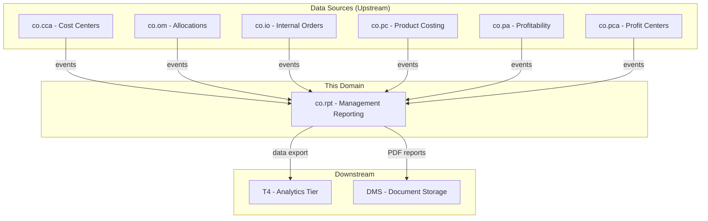
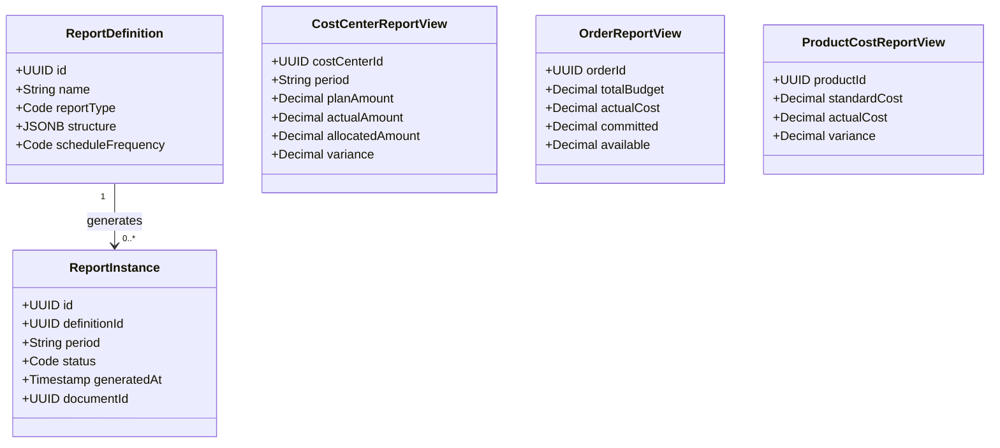
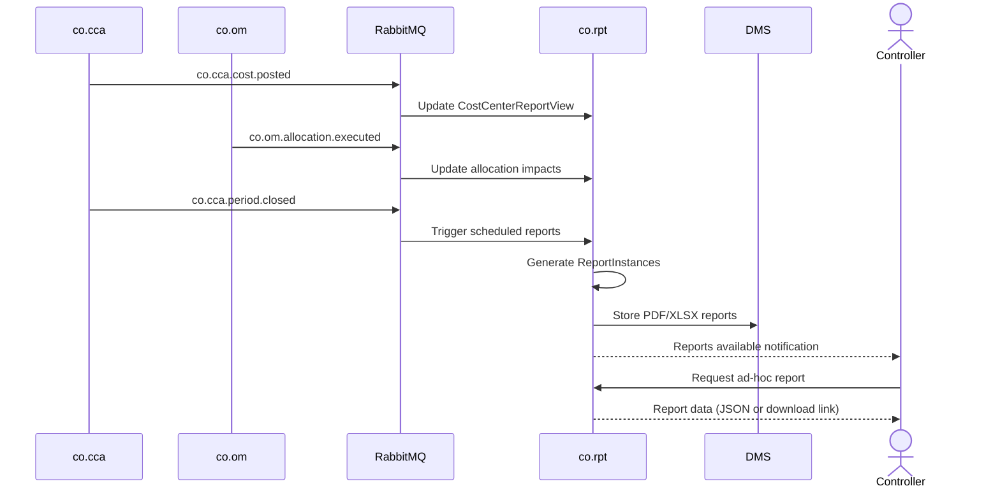
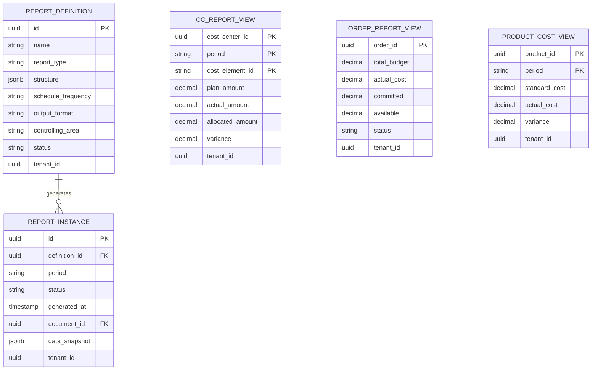

# CO - RPT Management Reporting Domain / Service Specification

> **Conceptual Stack Layer:** Domain / Service
> **Space:** Platform
> **Owner:** Domain Engineering Team
> **Schema alignment:** `service-layer.schema.json`
> **Companion files:** `openapi.yaml`, `*.schema.json` (event contracts)
> **Referenced by:** Platform-Feature Spec SS5 (backend dependencies), BFF Contract
> **Belongs to:** CO Suite Spec (`_co_suite.md`)

> **Meta Information**
> - **Version:** 2026-04-01
> - **Template:** `domain-service-spec.md` v1.0.0
> - **Template Compliance:** ~78% — §11/§12/§13 stubs, §8 no column-level table defs
> - **Author(s):** OpenLeap Architecture Team
> - **Status:** DRAFT
> - **Suite:** `co`
> - **Domain:** `rpt`
> - **Bounded Context Ref:** `bc:management-reporting`
> - **Service ID:** `co-rpt-svc`
> - **basePackage:** `io.openleap.co.rpt`
> - **API Base Path:** `/api/co/rpt/v1`
> - **OpenLeap Starter Version:** `v1`
> - **Port:** TBD
> - **Repository:** TBD
> - **Tags:** `controlling`, `reporting`, `read-model`, `cqrs`
> - **Team:**
>   - Name: `team-co`
>   - Email: `co-team@openleap.io`
>   - Slack: `#co-team`

---

## Specification Guidelines Compliance

>
> ### Non-Negotiables
> - Never invent facts. If required info is missing, add an **OPEN QUESTION** entry.
> - Preserve intent and decisions. Only change meaning when explicitly requested.
> - Keep the spec **self-contained**: no "see chat", no implicit context.
>
> ### Style Guide
> - Use MUST/SHOULD/MAY for normative statements.

---

## 0. Document Purpose & Scope

### 0.1 Purpose
This specification defines the Management Reporting (RPT) domain, which generates internal management reports from CO data. RPT consumes data from all other CO domains and produces cost center reports, product cost analysis, profitability summaries, and variance analysis reports for management decision-making.

### 0.2 Target Audience
- Product Owners & Business Stakeholders
- System Architects & Technical Leads
- Integration Engineers

### 0.3 Scope
**In Scope:**
- Cost center reports (plan vs. actual, budget utilization)
- Internal order reports (budget vs. actual, commitment)
- Product cost reports (standard vs. actual, variances)
- Consolidated CO reports (company-wide overhead analysis)
- Report definitions and scheduling
- Drill-down navigation from summary to detail
- Export to T4 Analytics for advanced analysis

**Out of Scope:**
- Profitability analysis reports (-> co.pa own reporting)
- External financial statements (-> fi.acc / T1 reporting tier)
- Strategic BI dashboards (-> T4 Analytics)
- Data collection and cost calculations (-> other CO domains)

### 0.4 Related Documents
- `_co_suite.md` - CO Suite overview
- `co_cca-spec.md` - Cost Center Accounting
- `co_om-spec.md` - Overhead Management
- `co_io-spec.md` - Internal Orders
- `co_pc-spec.md` - Product Costing

---

## 1. Business Context

### 1.1 Domain Purpose
`co.rpt` is the **reporting and analysis layer** of the CO Suite. It does not own transactional data — instead, it maintains read-optimized views (materialized aggregates) built from events published by other CO domains. It provides structured reports with drill-down capabilities for controllers and management.

### 1.2 Business Value
- Unified management reporting across all CO domains
- Real-time and period-end cost analysis
- Drill-down from company-level to individual postings
- Scheduled report generation for management reviews
- Pre-computed aggregates for fast query performance

### 1.3 Key Stakeholders

| Role | Responsibility | Primary Use Cases |
|------|----------------|-------------------|
| Controller | Review and distribute cost reports | UC-001 through UC-004 |
| Cost Center Manager | View own cost center reports | UC-001 |
| CFO / Management | Review consolidated reports | UC-004, UC-005 |
| Business Analyst | Configure report definitions | UC-006 |

### 1.4 Strategic Positioning



### 1.5 Service Context

| Property | Value |
|----------|-------|
| **Suite** | `co` |
| **Domain** | `rpt` |
| **Bounded Context** | `bc:management-reporting` |
| **Service ID** | `co-rpt-svc` |
| **Base Package** | `io.openleap.co.rpt` |

---

## 2. Service Identity

| Property | Value | Schema Field |
|----------|-------|-------------|
| **Service ID** | `co-rpt-svc` | `metadata.id` |
| **Display Name** | `Management Reporting` | `metadata.name` |
| **Suite** | `co` | `metadata.suite` |
| **Domain** | `rpt` | `metadata.domain` |
| **Bounded Context** | `bc:management-reporting` | `metadata.bounded_context_ref` |
| **Version** | `1.0.0` | `metadata.version` |
| **Status** | DRAFT | `metadata.status` |
| **API Base Path** | `/api/co/rpt/v1` | `metadata.api_base_path` |
| **Repository** | TBD | `metadata.repository` |
| **Tags** | `controlling`, `reporting`, `read-model`, `cqrs` | `metadata.tags` |

**Team:**
| Property | Value |
|----------|-------|
| **Name** | `team-co` |
| **Email** | `co-team@openleap.io` |
| **Slack Channel** | `#co-team` |

---

## 3. Domain Model

### 3.1 Conceptual Overview
RPT manages **Report Definitions** (templates defining structure and data sources), **Report Instances** (generated snapshots), and **Read Models** (materialized aggregates optimized for queries). RPT follows a CQRS pattern: it consumes events from transactional CO domains and builds query-optimized projections.

### 3.2 Core Concepts



### 3.3 Aggregate Definitions

#### 3.3.1 ReportDefinition

| Property | Value |
|----------|-------|
| **Aggregate ID** | `agg:report-definition` |
| **Name** | `ReportDefinition` |

**Business Purpose:** Configurable template for a management report.

**Key Attributes:**
| Attribute | Type | Format | Description | Constraints | Required | Read-Only |
|-----------|------|--------|-------------|-------------|----------|-----------|
| id | string | uuid | Unique identifier | — | Yes | Yes |
| name | string | — | Report name | max 255 chars | Yes | No |
| reportType | string | — | Type of report | enum: cost_center, internal_order, product_cost, variance, consolidated, custom | Yes | No |
| description | string | — | Purpose | — | No | No |
| structure | object | jsonb | Column definitions, filters, grouping | — | Yes | No |
| dataSources | array | — | Which CO domains to query | — | Yes | No |
| scheduleFrequency | string | — | Auto-generation schedule | enum: none, daily, weekly, monthly, on_period_close | No | No |
| outputFormat | string | — | Delivery format | enum: json, pdf, xlsx | Yes | No |
| recipients | array | uuid[] | Users/roles to receive | — | No | No |
| controllingArea | string | — | CO area | — | Yes | No |
| status | string | — | State | enum: active, inactive | Yes | No |
| tenantId | string | uuid | Tenant | — | Yes | Yes |
| version | integer | int64 | Optimistic lock | — | Yes | Yes |

#### 3.3.2 ReportInstance

| Property | Value |
|----------|-------|
| **Aggregate ID** | `agg:report-instance` |
| **Name** | `ReportInstance` |

**Business Purpose:** A generated snapshot of a report for a specific period.

**Key Attributes:**
| Attribute | Type | Format | Description | Constraints | Required | Read-Only |
|-----------|------|--------|-------------|-------------|----------|-----------|
| id | string | uuid | Unique identifier | — | Yes | Yes |
| definitionId | string | uuid | FK to ReportDefinition | — | Yes | No |
| period | string | — | Fiscal period (YYYY-MM) | — | Yes | No |
| status | string | — | State | enum: pending, generating, completed, failed | Yes | No |
| generatedAt | string | date-time | Completion time | Set on completion | No | Yes |
| generatedBy | string | — | Trigger | enum: scheduled, manual, event | Yes | No |
| documentId | string | uuid | FK to DMS document (if PDF/XLSX) | — | No | No |
| dataSnapshot | object | jsonb | Report data (if JSON format) | — | No | No |
| rowCount | integer | — | Number of data rows | Computed | No | Yes |
| tenantId | string | uuid | Tenant | — | Yes | Yes |

**Invariants:**
| Rule ID | Description |
|---------|-------------|
| BR-005 | Generated ReportInstances MUST NOT be modified (regenerate instead) |

**Domain Events Emitted:**
- `co.rpt.report.generated`

### 3.4 Enumerations

#### ReportType
| Value | Description | Deprecated |
|-------|-------------|------------|
| `cost_center` | Cost center plan vs. actual | No |
| `internal_order` | Order budget vs. actual | No |
| `product_cost` | Standard vs. actual costs | No |
| `variance` | Variance analysis summary | No |
| `consolidated` | Company-wide overhead | No |
| `custom` | User-defined structure | No |

### 3.5 Shared Types

> OPEN QUESTION: Content for this section has not been authored yet.

---

## 4. Business Rules & Constraints

### 4.1 Business Rules Catalog

| ID | Rule Name | Description | Scope | Enforcement | Error Code |
|----|-----------|-------------|-------|-------------|------------|
| BR-001 | Report After Close | Period-end reports MUST only be generated after co.cca.period.closed | ReportInstance | Generation | `PERIOD_NOT_CLOSED` |
| BR-002 | Data Freshness | Read models MUST be updated within 60 seconds of source events | Read Models | Event processing | — |
| BR-003 | Drill-Down Consistency | Report totals MUST equal sum of detail rows | ReportInstance | Generation | `TOTAL_MISMATCH` |
| BR-004 | Access Filtering | Cost center managers MUST only see own cost center data | All reports | Query | `ACCESS_DENIED` |
| BR-005 | Immutable Reports | Generated ReportInstances MUST NOT be modified | ReportInstance | Update | `IMMUTABLE_REPORT` |

### 4.3 Data Validation Rules

| Field | Validation | Error Message |
|-------|-----------|---------------|
| reportType | Must be in allowed values | "Invalid report type" |
| period | YYYY-MM format | "Invalid period format" |
| outputFormat | json, pdf, xlsx | "Unsupported output format" |

---

## 5. Use Cases

### 5.1 Business Logic Placement

| Logic Type | Placement | Examples |
|------------|-----------|----------|
| Aggregate invariants | Domain Object | Report immutability, format validation |
| Cross-aggregate logic | Domain Service | Read model projection, report generation |
| Orchestration & transactions | Application Service | Scheduled report generation, DMS storage |

### 5.2 Use Cases (Canonical Format)

#### UC-001: GenerateCostCenterReport

| Field | Value |
|-------|-------|
| **id** | `GenerateCostCenterReport` |
| **type** | READ |
| **trigger** | REST |
| **aggregate** | `CostCenterReportView` |
| **domainOperation** | `getCostCenterReport` |
| **inputs** | `controllingArea: String`, `period: String`, `costCenterIds: UUID[]`, `outputFormat: Code` |
| **outputs** | `ReportInstance` or `CostCenterReport` |
| **rest** | `POST /api/co/rpt/v1/reports/generate` |
| **idempotency** | none |
| **errors** | `PERIOD_NOT_CLOSED` |

**Actor:** Controller

**Main Flow:**
1. Controller requests cost center report for period(s) and cost center(s)
2. System queries CostCenterReportView (materialized from co.cca events)
3. System formats report with plan, actual, allocated, variance columns
4. System returns report or creates ReportInstance
5. If PDF/XLSX requested, system generates document and stores in DMS

#### UC-005: ScheduleAutomatedReports

| Field | Value |
|-------|-------|
| **id** | `ScheduleAutomatedReports` |
| **type** | WRITE |
| **trigger** | REST |
| **aggregate** | `ReportDefinition` |
| **domainOperation** | `ReportDefinition.create` |
| **inputs** | `name: String`, `reportType: Code`, `structure: JSONB`, `scheduleFrequency: Code`, `outputFormat: Code`, `recipients: UUID[]` |
| **outputs** | `ReportDefinition` |
| **rest** | `POST /api/co/rpt/v1/definitions` |
| **idempotency** | optional |

**Actor:** Business Analyst

### 5.3 Process Flow Diagrams



### 5.4 Cross-Domain Workflows

**Does this domain participate in multi-service workflows?** [x] YES [ ] NO

#### Workflow: Period-End Report Generation
**Orchestration Pattern:** [x] Choreography (EDA) [ ] Orchestration (Saga)
**Rationale:** RPT reacts to period.closed events from co.cca. No coordination needed.

---

## 6. REST API

### 6.1 API Overview
**Base Path:** `/api/co/rpt/v1`
**Authentication:** OAuth2/JWT
**Authorization:** `co.rpt:read`, `co.rpt:write`, `co.rpt:admin`

### 6.2 Resource Operations

#### Report Definitions
```http
POST /api/co/rpt/v1/definitions
GET /api/co/rpt/v1/definitions
GET /api/co/rpt/v1/definitions/{id}
PATCH /api/co/rpt/v1/definitions/{id}
```

#### Report Instances
```http
GET /api/co/rpt/v1/instances?definitionId={id}&period=2026-02
GET /api/co/rpt/v1/instances/{id}
GET /api/co/rpt/v1/instances/{id}/download
```

### 6.3 Business Operations

#### Generate Report (Ad-hoc)
```http
POST /api/co/rpt/v1/reports/generate
Content-Type: application/json
```
```json
{
  "reportType": "cost_center",
  "controllingArea": "CA01",
  "period": "2026-02",
  "costCenterIds": ["uuid-cc-001", "uuid-cc-002"],
  "includeAllocations": true,
  "outputFormat": "json"
}
```
**Response:** `200 OK` (sync for JSON) or `202 Accepted` (async for PDF/XLSX)

#### Cost Center Balance Query (Read Model)
```http
GET /api/co/rpt/v1/views/cost-center-balances?period=2026-02&controllingArea=CA01
```

#### Order Budget Overview (Read Model)
```http
GET /api/co/rpt/v1/views/order-budgets?status=RELEASED&controllingArea=CA01
```

#### Variance Summary (Read Model)
```http
GET /api/co/rpt/v1/views/variance-summary?period=2026-02
```

### 6.4 OpenAPI Specification
**Location:** `contracts/http/co/rpt/openapi.yaml`

---

## 7. Events & Integration

### 7.1 Event-Driven Architecture Pattern
**Pattern Used:** [x] Event-Driven (Choreography) [ ] Orchestration (Saga) [ ] Hybrid

**Follows Suite Pattern:** [x] YES [ ] NO

**Pattern Rationale:** RPT is a pure consumer/projector. It reacts to events and builds read models.

**Message Broker:** `RabbitMQ`

### 7.2 Published Events
**Exchange:** `co.rpt.events` (topic)

| Routing Key | Consumers | Description |
|------------|-----------|-------------|
| `co.rpt.report.generated` | notification-svc, dms-svc | Report ready for distribution |

### 7.3 Consumed Events

RPT consumes events from **all other CO domains**:

| Event | Source | Purpose | Processing |
|-------|--------|---------|------------|
| co.cca.cost.posted | co-cca-svc | Update CostCenterReportView | Read Model Update |
| co.cca.costCenter.created/updated | co-cca-svc | Update dimension data | Cache Invalidation |
| co.cca.period.closed | co-cca-svc | Trigger scheduled reports | Background Processing |
| co.om.allocation.executed | co-om-svc | Update allocation impact views | Read Model Update |
| co.io.order.statusChanged | co-io-svc | Update OrderReportView | Read Model Update |
| co.io.order.budgetExceeded | co-io-svc | Flag in order reports | Read Model Update |
| co.pc.variance.calculated | co-pc-svc | Update ProductCostReportView | Read Model Update |
| co.pc.productCost.activated | co-pc-svc | Update standard cost references | Cache Invalidation |
| co.pa.profitability.calculated | co-pa-svc | Update profitability views | Read Model Update |
| co.pca.profitCenter.updated | co-pca-svc | Update profit center views | Read Model Update |

**Queue Naming:** `co.rpt.in.{source-suite}.{source-domain}.{topic}`

---

## 8. Data Model

### 8.1 Conceptual Data Model

RPT uses **read-optimized materialized views** rather than normalized transactional tables.



---

## 9. Security & Compliance

### 9.1 Data Classification

| Data Element | Classification | Protection |
|--------------|----------------|------------|
| Report Definitions | Internal | Multi-tenancy |
| Report Data | Confidential | Encryption, RBAC |
| Generated Documents | Confidential | DMS access control |

### 9.2 Access Control

| Role | View Reports | Create Definitions | Generate | Admin |
|------|-------------|-------------------|----------|-------|
| CO_RPT_VIEWER | Own CC only | No | No | No |
| CO_RPT_USER | All | No | Yes | No |
| CO_RPT_CONTROLLER | All | Yes | Yes | No |
| CO_RPT_ADMIN | All | Yes | Yes | Yes |

**Key constraint:** Cost center managers MUST be filtered by their assigned cost centers.

---

## 10. Quality Attributes

### 10.1 Performance

| Operation | Target (p95) |
|-----------|-------------|
| Read model query | < 100ms |
| Ad-hoc report (JSON) | < 3 sec |
| PDF/XLSX generation | < 30 sec |
| Event projection update | < 1 sec |

### 10.2 Availability

**Availability:** 99.5% (lower than transactional services)
**RTO:** < 30 min | **RPO:** < 15 min

### 10.3 Scalability

- Read models: Pre-aggregated, horizontally queryable
- Report generation: Parallelizable across product groups / cost centers

---

## 11. Feature Dependencies

> OPEN QUESTION: Content for this section has not been authored yet.

---

## 12. Extension Points

> OPEN QUESTION: Content for this section has not been authored yet.

---

## 13. Migration & Evolution

Initial deployment — no legacy migration required for reporting definitions. Historical data populated from initial load of CO transactional domains.

---

## 14. Decisions & Open Questions

### 14.1 Open Questions

| ID | Question | Impact | Needed By |
|----|----------|--------|-----------|
| Q-001 | Should RPT support ad-hoc user-defined report columns? | UX complexity | Phase 1 |
| Q-002 | Boundary between co.rpt and T4 Analytics — where do dashboards live? | Architecture | Phase 1 |
| Q-003 | Report data retention — how long to keep ReportInstances? | Storage | Phase 1 |

### 14.2 Architectural Decision Records (ADRs)

#### ADR-RPT-001: CQRS Read Models

**Status:** Accepted

**Decision:** RPT maintains its own read-optimized projections built from events. It MUST NOT query transactional databases of other CO services directly.

**Consequences:**
| Positive | Negative |
|----------|----------|
| Decoupled, fast queries, no cross-service DB access | Eventual consistency, event processing lag |

---

## 15. Appendix

### 15.1 Glossary

| Term | Definition |
|------|------------|
| Read Model | Query-optimized materialized view built from events |
| Report Definition | Template for generating reports |
| Report Instance | Generated snapshot of a report |

### 15.2 Change Log

| Date | Version | Author | Changes |
|------|---------|--------|---------|
| 2026-02-23 | 1.0 | OpenLeap Architecture Team | Initial version |
| 2026-04-01 | 1.1 | OpenLeap Architecture Team | Restructured to template compliance (sections 0-15) |

### 15.3 Review & Approval
**Status:** DRAFT
