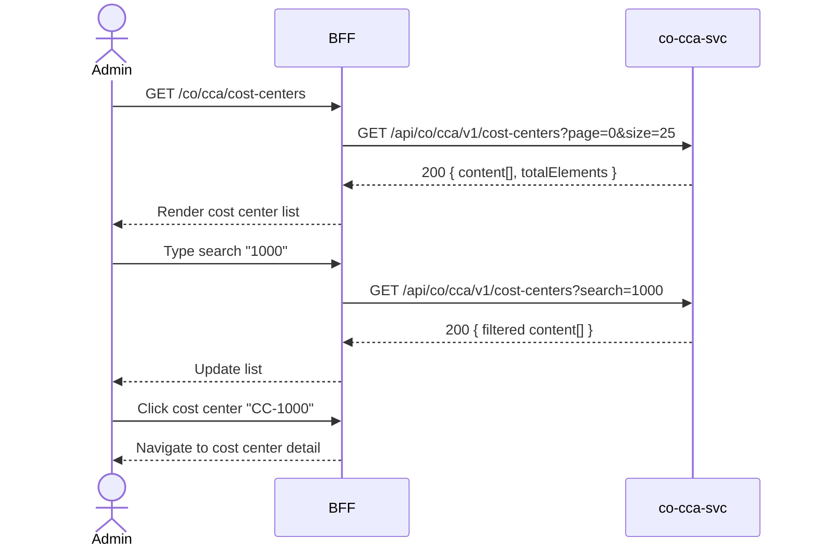

# F-CO-001-01 — Browse Cost Centers

> **Conceptual Stack Layer:** Domain-Feature
> **Space:** Business
> **Owner:** Domain Engineering Team
> **Companion files:** `F-CO-001-01.uvl`, `F-CO-001-01.aui.yaml`
> **Referenced by:** Suite Feature Catalog SS6
> **References:** `co_cca-spec.md` (backend)

> **Meta Information**
> - **Version:** 2026-04-04
> - **Template:** `feature-spec.md` v1.0.0
> - **Template Compliance:** 100%
> - **Status:** DRAFT
> - **Feature ID:** `F-CO-001-01`
> - **Suite:** `co`
> - **Node type:** LEAF
> - **Parent:** `F-CO-001` — Cost Center Management
> - **Companion UVL:** `F-CO-001-01.uvl`
> - **Companion AUI:** `F-CO-001-01.aui.yaml`

---

## ═══════════════════════════════════════════════
## PROBLEM SPACE
## ═══════════════════════════════════════════════

## 0. Feature Identity & Orientation

### 0.1 One-Line Summary
This feature lets a **controlling administrator** browse and search cost centers by hierarchy so that they can navigate to cost center details and manage the organizational cost structure.

### 0.2 Non-Goals
- Does not create or edit cost center groups — that is F-CO-001-02.
- Does not manage cost elements — that is F-CO-001-03.
- Does not show actual cost postings inline — postings are a CCA domain query concern.

### 0.3 Entry & Exit Points

**Entry points:**
- Controlling Administration menu → "Cost Centers"
- Direct URL: `/co/cca/cost-centers`

**Exit points:**
- Select a cost center → navigate to cost center detail (co-cca-svc)
- Navigate to F-CO-001-02 (Manage Cost Center Groups)
- Back to Controlling dashboard

### 0.4 Variability Points

| Variability Point | Model | Values | Default | Binding Time |
|---|---|---|---|---|
| Pagination page size | UVL attribute | 10, 25, 50, 100 | 25 | runtime |
| Show inactive cost centers | UVL attribute | true/false | false | runtime |

---

## 1. User Goal & Scenarios

### 1.1 User Goal
Find a specific cost center or explore the cost center hierarchy, understand its controlling area, responsible person, and status, and navigate to its detail for further action.

### 1.2 Scenarios

| # | Scenario | Precondition | Action | Expected Outcome |
|---|----------|-------------|--------|-----------------|
| S1 | Browse all cost centers | Admin is authenticated | Open cost center list | Paginated list with cost center ID, name, controlling area, responsible, status |
| S2 | Search by ID or name | Cost center list displayed | Type "1000" in search | List filters to cost centers matching "1000" |
| S3 | Filter by controlling area | Cost center list displayed | Select controlling area = CA01 | Only cost centers under CA01 shown |
| S4 | Navigate to detail | Cost center list displayed | Click cost center row | Navigate to cost center detail page |
| S5 | Empty state | No cost centers exist | Open list | Empty state message with hint to create a cost center |

---

## 2. User Journey & Screen Layout

### 2.1 Sequence Diagram



### 2.2 Screen Layout

```
┌─────────────────────────────────────────────────────┐
│ [← Controlling]   Cost Centers                      │
├─────────────────────────────────────────────────────┤
│ [Search: _______________]  [Ctrl. Area: All ▾]  [Status: Active ▾] │
├──────────┬──────────────────┬────────────┬───────────┬────────────┤
│  ID      │ Name             │ Ctrl. Area │ Responsible│ Status     │
├──────────┼──────────────────┼────────────┼───────────┼────────────┤
│ CC-1000  │ Administration   │ CA01       │ J. Mueller │ ACTIVE     │  → click row
│ CC-1100  │ Procurement      │ CA01       │ K. Schmidt │ ACTIVE     │
│ CC-2000  │ Production       │ CA01       │ T. Braun   │ ACTIVE     │
│ CC-3000  │ Sales            │ CA02       │ M. Richter │ ACTIVE     │
│ ...      │ ...              │ ...        │ ...        │ ...        │
├──────────┴──────────────────┴────────────┴───────────┴────────────┤
│ [EXT: extension zone]                                              │
├─────────────────────────────────────────────────────┤
│ Showing 1-25 of 87     [← Prev] [1] [2] [3] [Next →]            │
└─────────────────────────────────────────────────────┘
```

---

## 3. Interaction Requirements

### 3.1 Fields Table

| Field | Type | Required | Editable | Validation | i18n Key |
|---|---|---|---|---|---|
| Search | text input | No | Yes | min 2 chars to trigger | `F-CO-001-01.search.placeholder` |
| Controlling Area filter | select | No | Yes | Valid controlling area codes | `F-CO-001-01.filter.controllingArea` |
| Status filter | select | No | Yes | ACTIVE, INACTIVE, All | `F-CO-001-01.filter.status` |

### 3.2 Actions Table

| Action | Trigger | Precondition | Effect |
|---|---|---|---|
| Search | Keystroke (debounced 300ms) | ≥ 2 chars | Filter cost center list |
| Filter by controlling area | Select change | — | Filter cost center list |
| Select cost center | Row click | — | Navigate to cost center detail |
| Page change | Pagination click | — | Load requested page |

### 3.3 Validation Messages

| Field | Condition | Message |
|---|---|---|
| Search | < 2 chars | (no action — debounced) |

---

## 4. Edge Cases & Screen States

### 4.1 Component States

| State | When | Behaviour |
|---|---|---|
| **Loading** | Awaiting API response | Table skeleton with shimmer rows; controls disabled |
| **Empty** | No cost centers match filter/search | "No cost centers found. Adjust your filters or create a cost center." |
| **Error** | co-cca-svc unavailable | Inline error: "Cost center service unavailable. Retry." + retry button |
| **Populated** | Data ready | Render table normally |

### 4.2 Specific Edge Cases

| Case | Behaviour | Affected users |
|---|---|---|
| Insufficient role | Feature accessible to all controlling users (read-only) | None — read is open |
| > 5000 cost centers | Server-side pagination; no client-side loading | Large enterprise deployments |

### 4.3 Attribute-Driven Behaviour Changes

| Attribute | Non-default value | Observable change |
|---|---|---|
| `pagination.pageSize` | 10 | Shorter table; more pages in pagination bar |
| `showInactive` | true | Inactive cost centers appear with visual indicator (greyed row) |

### 4.4 Connectivity
This feature requires a live connection.
On network loss: top-of-page banner — "Cost center data is unavailable offline."

---

## ═══════════════════════════════════════════════
## SOLUTION SPACE
## ═══════════════════════════════════════════════

## 5. Backend Dependencies & BFF Contract

### 5.1 Service Calls

| # | Service | Endpoint | Tier | isMutation | Failure Mode |
|---|---------|----------|------|------------|-------------|
| 1 | co-cca-svc | `GET /api/co/cca/v1/cost-centers` | T3 | No | Show error + retry |

### 5.2 BFF View-Model Shape

```jsonc
{
  "costCenters": [
    {
      "costCenterId": "CC-1000",
      "name": "Administration",
      "controllingArea": "CA01",
      "responsible": "J. Mueller",
      "status": "ACTIVE",
      "validFrom": "2024-01-01",
      "validTo": null
    }
  ],
  "pagination": {
    "page": 0,
    "size": 25,
    "totalElements": 87,
    "totalPages": 4
  }
}
```

### 5.3 Feature-Gating Rules

| Mode | Behaviour |
|---|---|
| Full | All interactions available |
| Read-only | Same as full (this is a read-only feature) |
| Excluded | Menu item hidden; direct URL returns 404 |

### 5.4 Failure Modes

| Failure | User Experience |
|---------|----------------|
| co-cca-svc down | Error state with retry button |

### 5.5 Caching Hints
BFF SHOULD cache cost center list for 5 minutes. Cache MUST be invalidated on `co.cca.cost-center.created` or `co.cca.cost-center.updated` events.

### 5.6 i18n Keys

| Key | Default (en) |
|-----|-------------|
| `F-CO-001-01.title` | `Cost Centers` |
| `F-CO-001-01.search.placeholder` | `Search cost centers…` |
| `F-CO-001-01.filter.controllingArea` | `Controlling Area` |
| `F-CO-001-01.filter.status` | `Status` |
| `F-CO-001-01.empty` | `No cost centers found.` |
| `F-CO-001-01.error.unavailable` | `Cost center service unavailable.` |
| `F-CO-001-01.action.retry` | `Retry` |

---

## 6. AUI Screen Contract

See companion file `F-CO-001-01.aui.yaml`.

---

## ═══════════════════════════════════════════════
## BRIDGE ARTIFACTS
## ═══════════════════════════════════════════════

## 7. Permissions & Accessibility

### 7.1 Permission Matrix

| Action | CO_ADMIN | CO_CONTROLLER | TENANT_ADMIN | ANY_AUTHENTICATED |
|---|---|---|---|---|
| View cost center list | ✓ | ✓ | ✓ | ✓ |
| Navigate to detail | ✓ | ✓ | ✓ | ✓ |

### 7.2 Accessibility
- Table MUST have ARIA role `grid` with sortable column headers.
- Search field MUST have `aria-label`.
- Keyboard: Tab through filters, Enter to select row.

---

## 8. Acceptance Criteria

| AC | Scenario | Given | When | Then |
|----|----------|-------|------|------|
| AC-01 | S1 | Admin opens cost center list | Page loads | Paginated list displayed with ID, name, controlling area, responsible, status |
| AC-02 | S2 | Cost center list displayed | Admin types "1000" in search | List filters to matching cost centers within 500ms |
| AC-03 | S3 | Cost center list displayed | Admin selects controlling area = CA01 | Only CA01 cost centers shown |
| AC-04 | S4 | Cost center list displayed | Admin clicks cost center row | Navigates to cost center detail |
| AC-05 | S5 | No cost centers exist | Admin opens list | Empty state message displayed |
| AC-06 | Error | co-cca-svc unavailable | Admin opens list | Error message with retry button |

---

## 9. Variability & Extension

### 9.1 Feature Dependencies
Requires IAM authentication (cross-suite).

### 9.2 Attributes
See SS0.4 variability points. Binding times: `deploy`, `runtime`.

### 9.3 Extension Points
| Extension Zone | Interface | Default Behaviour |
|---|---|---|
| `ext.costCenterListActions` | Additional action buttons in header | Hidden (no extension) |

### 9.4 Companion UVL
See `uvl/leaves/F-CO-001-01.uvl`.

---

**END OF SPECIFICATION**
