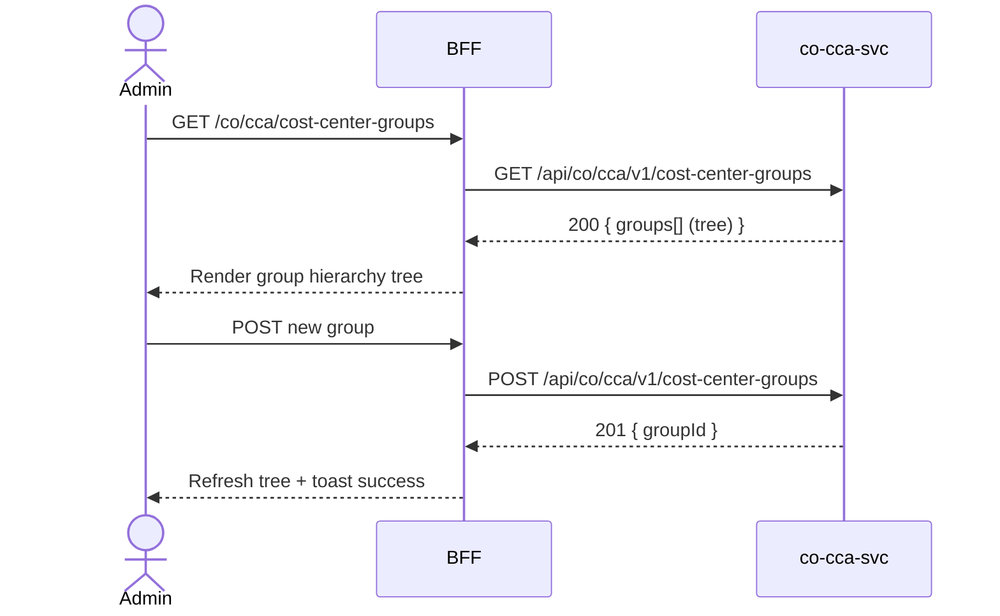

# F-CO-001-02 — Manage Cost Center Groups

> **Conceptual Stack Layer:** Domain-Feature
> **Space:** Business
> **Owner:** Domain Engineering Team
> **Companion files:** `F-CO-001-02.uvl`, `F-CO-001-02.aui.yaml`
> **Referenced by:** Suite Feature Catalog SS6
> **References:** `co_cca-spec.md` (backend)

> **Meta Information**
> - **Version:** 2026-04-04
> - **Template:** `feature-spec.md` v1.0.0
> - **Template Compliance:** 100%
> - **Status:** DRAFT
> - **Feature ID:** `F-CO-001-02`
> - **Suite:** `co`
> - **Node type:** LEAF
> - **Parent:** `F-CO-001` — Cost Center Management
> - **Companion UVL:** `F-CO-001-02.uvl`
> - **Companion AUI:** `F-CO-001-02.aui.yaml`

---

## ═══════════════════════════════════════════════
## PROBLEM SPACE
## ═══════════════════════════════════════════════

## 0. Feature Identity & Orientation

### 0.1 One-Line Summary
This feature lets a **controlling administrator** create, edit, and delete cost center hierarchy groups so that cost centers can be organized into reporting and allocation structures.

### 0.2 Non-Goals
- Does not browse individual cost centers — that is F-CO-001-01.
- Does not manage cost elements — that is F-CO-001-03.
- Does not execute allocations — that is F-CO-002.

### 0.3 Entry & Exit Points

**Entry points:**
- Controlling Administration menu → "Cost Center Groups"
- Direct URL: `/co/cca/cost-center-groups`

**Exit points:**
- Back to Cost Centers list (F-CO-001-01)
- Back to Controlling dashboard

### 0.4 Variability Points

| Variability Point | Model | Values | Default | Binding Time |
|---|---|---|---|---|
| Max hierarchy depth | UVL attribute | 3, 5, 10 | 5 | deploy |
| Allow group delete with children | UVL attribute | true/false | false | deploy |

---

## 1. User Goal & Scenarios

### 1.1 User Goal
Organize cost centers into hierarchical groups for reporting, overhead allocation, and planning. Create new groups, assign parent groups, rename, and remove obsolete groups while maintaining referential integrity.

### 1.2 Scenarios

| # | Scenario | Precondition | Action | Expected Outcome |
|---|----------|-------------|--------|-----------------|
| S1 | View group hierarchy | Admin is authenticated | Open cost center groups | Tree view of all groups with member count |
| S2 | Create new group | Admin has write role | Click Add Group, fill form, submit | New group created under selected parent |
| S3 | Edit group name | Group exists | Click edit icon, update name, save | Group renamed; event published |
| S4 | Delete empty group | Group has no children or members | Click delete, confirm | Group deleted |
| S5 | Delete non-empty group | Group has members | Click delete | Error: "Cannot delete group with assigned cost centers." |

---

## 2. User Journey & Screen Layout

### 2.1 Sequence Diagram



### 2.2 Screen Layout

```
┌─────────────────────────────────────────────────────┐
│ [← Cost Centers]   Cost Center Groups      [+ Add]  │
├─────────────────────────────────────────────────────┤
│ ▾ PRODUCTION (CA01)                  [✎] [🗑]       │
│   ▾ Manufacturing                    [✎] [🗑]       │
│       Assembly Line A                [✎] [🗑]       │
│       Assembly Line B                [✎] [🗑]       │
│   ▸ Maintenance                      [✎] [🗑]       │
│ ▾ OVERHEAD (CA01)                    [✎] [🗑]       │
│   Administration                     [✎] [🗑]       │
│   IT Services                        [✎] [🗑]       │
├─────────────────────────────────────────────────────┤
│ [EXT: extension zone]                               │
└─────────────────────────────────────────────────────┘
```

---

## 3. Interaction Requirements

### 3.1 Fields Table

| Field | Type | Required | Editable | Validation | i18n Key |
|---|---|---|---|---|---|
| Group ID | text input | Yes | No (after create) | max 20 chars, unique per controlling area | `F-CO-001-02.field.groupId` |
| Group Name | text input | Yes | Yes | max 100 chars | `F-CO-001-02.field.groupName` |
| Parent Group | select/tree | No | Yes | Must be an existing group | `F-CO-001-02.field.parentGroup` |
| Controlling Area | select | Yes | No (after create) | Valid controlling area | `F-CO-001-02.field.controllingArea` |

### 3.2 Actions Table

| Action | Trigger | Precondition | Effect |
|---|---|---|---|
| Add Group | Button click | Admin has write role | Open create form |
| Save | Form submit | Form valid | Create/update group |
| Delete | Action button | Group has no children/members | Delete group; event published |
| Cancel | Button click | — | Discard changes |

### 3.3 Validation Messages

| Field | Condition | Message |
|---|---|---|
| Required fields | Empty on submit | "{Label} is required." |
| Group ID | Duplicate | "Group ID already exists in this controlling area." |
| Delete | Non-empty group | "Cannot delete group with assigned cost centers." |

---

## 4. Edge Cases & Screen States

### 4.1 Component States

| State | When | Behaviour |
|---|---|---|
| **Loading** | Awaiting API response | Tree skeleton; controls disabled |
| **Empty** | No groups exist | Empty state: "No cost center groups defined. Add your first group." |
| **Error** | co-cca-svc unavailable | Inline error with retry button |
| **Populated** | Data ready | Render tree normally |

### 4.2 Specific Edge Cases

| Case | Behaviour | Affected users |
|---|---|---|
| Insufficient role | Add/edit/delete actions absent from DOM | Read-only users |
| Max depth reached | Add child button disabled at max depth; tooltip explains limit | Admins at depth limit |

### 4.3 Attribute-Driven Behaviour Changes

| Attribute | Non-default value | Observable change |
|---|---|---|
| `maxHierarchyDepth` | 3 | Tree limited to 3 levels; add child disabled at level 3 |
| `allowDeleteWithChildren` | true | Delete allowed on non-empty groups (with strong confirmation dialog) |

### 4.4 Connectivity
This feature requires a live connection for all mutations. Reads may be served from BFF cache.

---

## ═══════════════════════════════════════════════
## SOLUTION SPACE
## ═══════════════════════════════════════════════

## 5. Backend Dependencies & BFF Contract

### 5.1 Service Calls

| # | Service | Endpoint | Tier | isMutation | Failure Mode |
|---|---------|----------|------|------------|-------------|
| 1 | co-cca-svc | `GET /api/co/cca/v1/cost-center-groups` | T3 | No | Show error + retry |
| 2 | co-cca-svc | `POST /api/co/cca/v1/cost-center-groups` | T3 | Yes | Show error |
| 3 | co-cca-svc | `PUT /api/co/cca/v1/cost-center-groups/{id}` | T3 | Yes | Show error |
| 4 | co-cca-svc | `DELETE /api/co/cca/v1/cost-center-groups/{id}` | T3 | Yes | Show error |

### 5.2 BFF View-Model Shape

```jsonc
{
  "groups": [
    {
      "groupId": "PROD-CA01",
      "groupName": "PRODUCTION",
      "controllingArea": "CA01",
      "parentGroupId": null,
      "memberCount": 12,
      "children": [ { "groupId": "MFG-CA01", "groupName": "Manufacturing", "children": [] } ]
    }
  ]
}
```

### 5.3 Feature-Gating Rules

| Mode | Behaviour |
|---|---|
| Full | All interactions available |
| Read-only | Mutation actions hidden |
| Excluded | Menu item hidden; direct URL returns 404 |

### 5.4 Failure Modes

| Failure | User Experience |
|---------|----------------|
| co-cca-svc down | Error state with retry button |
| 409 Conflict (duplicate ID) | Inline form error |
| 422 Delete non-empty | Toast error with explanation |

### 5.5 Caching Hints
BFF SHOULD cache group tree for 10 minutes. Cache MUST be invalidated on `co.cca.cost-center-group.created`, `updated`, or `deleted` events.

### 5.6 i18n Keys

| Key | Default (en) |
|-----|-------------|
| `F-CO-001-02.title` | `Cost Center Groups` |
| `F-CO-001-02.action.add` | `Add Group` |
| `F-CO-001-02.action.save` | `Save` |
| `F-CO-001-02.action.delete` | `Delete` |
| `F-CO-001-02.error.nonEmpty` | `Cannot delete group with assigned cost centers.` |
| `F-CO-001-02.empty` | `No cost center groups defined.` |

---

## 6. AUI Screen Contract

See companion file `F-CO-001-02.aui.yaml`.

---

## ═══════════════════════════════════════════════
## BRIDGE ARTIFACTS
## ═══════════════════════════════════════════════

## 7. Permissions & Accessibility

### 7.1 Permission Matrix

| Action | CO_ADMIN | CO_CONTROLLER | TENANT_ADMIN | ANY_AUTHENTICATED |
|---|---|---|---|---|
| View group tree | ✓ | ✓ | ✓ | ✓ |
| Create group | ✓ | — | — | — |
| Edit group | ✓ | — | — | — |
| Delete group | ✓ | — | — | — |

### 7.2 Accessibility
- Tree component MUST have ARIA role `tree` with `treeitem` nodes.
- All interactive elements MUST be keyboard-accessible.
- Confirmation dialogs MUST trap focus.

---

## 8. Acceptance Criteria

| AC | Scenario | Given | When | Then |
|----|----------|-------|------|------|
| AC-01 | S1 | Admin opens group list | Page loads | Hierarchical tree displayed with all groups |
| AC-02 | S2 | Admin clicks Add Group | Fills form, submits | New group created under selected parent; tree refreshed |
| AC-03 | S3 | Admin edits group name | Changes name, saves | Group renamed; event published |
| AC-04 | S4 | Admin deletes empty group | Confirms deletion | Group deleted; tree refreshed |
| AC-05 | S5 | Admin tries to delete non-empty group | Clicks delete | Error message shown; group not deleted |

---

## 9. Variability & Extension

### 9.1 Feature Dependencies
Requires IAM authentication (cross-suite). Depends on F-CO-001-01 being included (cross-node constraint).

### 9.2 Attributes
See SS0.4 variability points. Binding times: `deploy`.

### 9.3 Extension Points
| Extension Zone | Interface | Default Behaviour |
|---|---|---|
| `ext.groupTreeActions` | Additional actions in tree item context menu | Hidden |

### 9.4 Companion UVL
See `uvl/leaves/F-CO-001-02.uvl`.

---

**END OF SPECIFICATION**
