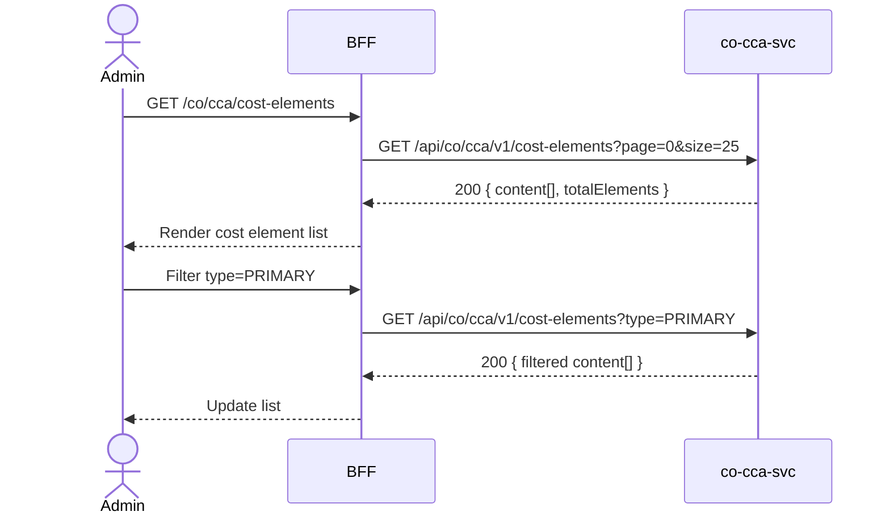

# F-CO-001-03 — Cost Element Catalog

> **Conceptual Stack Layer:** Domain-Feature
> **Space:** Business
> **Owner:** Domain Engineering Team
> **Companion files:** `F-CO-001-03.uvl`, `F-CO-001-03.aui.yaml`
> **Referenced by:** Suite Feature Catalog SS6
> **References:** `co_cca-spec.md` (backend)

> **Meta Information**
> - **Version:** 2026-04-04
> - **Template:** `feature-spec.md` v1.0.0
> - **Template Compliance:** 100%
> - **Status:** DRAFT
> - **Feature ID:** `F-CO-001-03`
> - **Suite:** `co`
> - **Node type:** LEAF
> - **Parent:** `F-CO-001` — Cost Center Management
> - **Companion UVL:** `F-CO-001-03.uvl`
> - **Companion AUI:** `F-CO-001-03.aui.yaml`

---

## ═══════════════════════════════════════════════
## PROBLEM SPACE
## ═══════════════════════════════════════════════

## 0. Feature Identity & Orientation

### 0.1 One-Line Summary
This feature lets a **controlling administrator** browse primary and secondary cost elements by type so that the controlling team can configure the cost element catalog used by posting rules and overhead allocation.

### 0.2 Non-Goals
- Does not post costs — that is co-cca-svc internal logic.
- Does not manage cost center groups — that is F-CO-001-02.
- Does not execute allocation cycles — that is F-CO-002.

### 0.3 Entry & Exit Points

**Entry points:**
- Controlling Administration menu → "Cost Element Catalog"
- Direct URL: `/co/cca/cost-elements`

**Exit points:**
- Navigate to cost element detail
- Back to Controlling dashboard

### 0.4 Variability Points

| Variability Point | Model | Values | Default | Binding Time |
|---|---|---|---|---|
| Pagination page size | UVL attribute | 10, 25, 50, 100 | 25 | runtime |
| Show secondary cost elements | UVL attribute | true/false | true | runtime |

---

## 1. User Goal & Scenarios

### 1.1 User Goal
Browse the catalog of primary and secondary cost elements, filter by element type, and understand which GL accounts are mapped to each primary cost element.

### 1.2 Scenarios

| # | Scenario | Precondition | Action | Expected Outcome |
|---|----------|-------------|--------|-----------------|
| S1 | Browse all cost elements | Admin is authenticated | Open cost element catalog | Paginated list with element ID, name, type, GL account |
| S2 | Filter by element type | Cost element list displayed | Select type = PRIMARY | Only primary cost elements shown |
| S3 | Search by ID or name | Cost element list displayed | Type "430" in search | List filters to matching cost elements |
| S4 | View element detail | Cost element list displayed | Click element row | Detail view with full element properties |
| S5 | Empty state | No cost elements defined | Open catalog | Empty state: "No cost elements defined. Seed from chart of accounts." |

---

## 2. User Journey & Screen Layout

### 2.1 Sequence Diagram



### 2.2 Screen Layout

```
┌─────────────────────────────────────────────────────┐
│ [← Controlling]   Cost Element Catalog              │
├─────────────────────────────────────────────────────┤
│ [Search: _______________]  [Type: All ▾]  [Status: Active ▾] │
├──────────┬──────────────────────┬─────────┬──────────┤
│ Element  │ Name                 │ Type    │ GL Acct  │
├──────────┼──────────────────────┼─────────┼──────────┤
│ 430000   │ Personnel Costs      │ PRIMARY │ 430000   │
│ 470000   │ Depreciation         │ PRIMARY │ 470000   │
│ 610000   │ Overhead Allocation  │ SECONDARY│ —       │
│ 620000   │ Internal Activity    │ SECONDARY│ —       │
│ ...      │ ...                  │ ...     │ ...      │
├──────────┴──────────────────────┴─────────┴──────────┤
│ [EXT: extension zone]                                │
├─────────────────────────────────────────────────────┤
│ Showing 1-25 of 63     [← Prev] [1] [2] [3] [Next →]│
└─────────────────────────────────────────────────────┘
```

---

## 3. Interaction Requirements

### 3.1 Fields Table

| Field | Type | Required | Editable | Validation | i18n Key |
|---|---|---|---|---|---|
| Search | text input | No | Yes | min 2 chars to trigger | `F-CO-001-03.search.placeholder` |
| Type filter | select | No | Yes | PRIMARY, SECONDARY, All | `F-CO-001-03.filter.type` |
| Status filter | select | No | Yes | ACTIVE, INACTIVE, All | `F-CO-001-03.filter.status` |

### 3.2 Actions Table

| Action | Trigger | Precondition | Effect |
|---|---|---|---|
| Search | Keystroke (debounced 300ms) | ≥ 2 chars | Filter cost element list |
| Filter by type | Select change | — | Filter cost element list |
| Select element | Row click | — | Navigate to element detail |
| Page change | Pagination click | — | Load requested page |

### 3.3 Validation Messages

| Field | Condition | Message |
|---|---|---|
| Search | < 2 chars | (no action — debounced) |

---

## 4. Edge Cases & Screen States

### 4.1 Component States

| State | When | Behaviour |
|---|---|---|
| **Loading** | Awaiting API response | Table skeleton; controls disabled |
| **Empty** | No elements match filter | "No cost elements found. Adjust your filters." |
| **Error** | co-cca-svc unavailable | Inline error with retry button |
| **Populated** | Data ready | Render table normally |

### 4.2 Specific Edge Cases

| Case | Behaviour | Affected users |
|---|---|---|
| Secondary element with no GL account | GL Acct column shows "—" | All users |
| Cost element used in active allocation key | Detail shows badge "In use" | Admins planning to deactivate |

### 4.3 Attribute-Driven Behaviour Changes

| Attribute | Non-default value | Observable change |
|---|---|---|
| `pagination.pageSize` | 10 | Shorter table; more pages |
| `showSecondary` | false | Secondary cost elements hidden from default view |

### 4.4 Connectivity
This feature requires a live connection.
On network loss: top-of-page banner — "Cost element data is unavailable offline."

---

## ═══════════════════════════════════════════════
## SOLUTION SPACE
## ═══════════════════════════════════════════════

## 5. Backend Dependencies & BFF Contract

### 5.1 Service Calls

| # | Service | Endpoint | Tier | isMutation | Failure Mode |
|---|---------|----------|------|------------|-------------|
| 1 | co-cca-svc | `GET /api/co/cca/v1/cost-elements` | T3 | No | Show error + retry |

### 5.2 BFF View-Model Shape

```jsonc
{
  "costElements": [
    {
      "elementId": "430000",
      "name": "Personnel Costs",
      "type": "PRIMARY",
      "glAccount": "430000",
      "status": "ACTIVE",
      "validFrom": "2024-01-01"
    }
  ],
  "pagination": {
    "page": 0,
    "size": 25,
    "totalElements": 63,
    "totalPages": 3
  }
}
```

### 5.3 Feature-Gating Rules

| Mode | Behaviour |
|---|---|
| Full | All interactions available |
| Read-only | Same as full (read-only feature) |
| Excluded | Menu item hidden; direct URL returns 404 |

### 5.4 Failure Modes

| Failure | User Experience |
|---------|----------------|
| co-cca-svc down | Error state with retry button |

### 5.5 Caching Hints
BFF SHOULD cache cost element catalog for 15 minutes. Cache MUST be invalidated on `co.cca.cost-allocation.posted` events or any cost element configuration change.

### 5.6 i18n Keys

| Key | Default (en) |
|-----|-------------|
| `F-CO-001-03.title` | `Cost Element Catalog` |
| `F-CO-001-03.search.placeholder` | `Search cost elements…` |
| `F-CO-001-03.filter.type` | `Type` |
| `F-CO-001-03.filter.status` | `Status` |
| `F-CO-001-03.empty` | `No cost elements found.` |
| `F-CO-001-03.error.unavailable` | `Cost element service unavailable.` |

---

## 6. AUI Screen Contract

See companion file `F-CO-001-03.aui.yaml`.

---

## ═══════════════════════════════════════════════
## BRIDGE ARTIFACTS
## ═══════════════════════════════════════════════

## 7. Permissions & Accessibility

### 7.1 Permission Matrix

| Action | CO_ADMIN | CO_CONTROLLER | TENANT_ADMIN | ANY_AUTHENTICATED |
|---|---|---|---|---|
| View cost element catalog | ✓ | ✓ | ✓ | ✓ |
| Navigate to detail | ✓ | ✓ | ✓ | ✓ |

### 7.2 Accessibility
- Table MUST have ARIA role `grid`.
- Filter controls MUST have `aria-label` attributes.
- Keyboard: Tab through filters, Enter to select row.

---

## 8. Acceptance Criteria

| AC | Scenario | Given | When | Then |
|----|----------|-------|------|------|
| AC-01 | S1 | Admin opens catalog | Page loads | All cost elements listed with ID, name, type, GL account |
| AC-02 | S2 | Cost element list displayed | Admin selects type = PRIMARY | Only PRIMARY elements shown |
| AC-03 | S3 | Cost element list displayed | Admin types "430" in search | Matching elements shown within 500ms |
| AC-04 | S4 | Admin clicks element row | — | Element detail view displayed |
| AC-05 | S5 | No elements defined | Admin opens catalog | Empty state message displayed |

---

## 9. Variability & Extension

### 9.1 Feature Dependencies
Requires IAM authentication (cross-suite). Requires F-CO-001-01 to be included (intra-node constraint).

### 9.2 Attributes
See SS0.4. Binding times: `deploy`, `runtime`.

### 9.3 Extension Points
| Extension Zone | Interface | Default Behaviour |
|---|---|---|
| `ext.costElementActions` | Additional actions in element row | Hidden |

### 9.4 Companion UVL
See `uvl/leaves/F-CO-001-03.uvl`.

---

**END OF SPECIFICATION**
