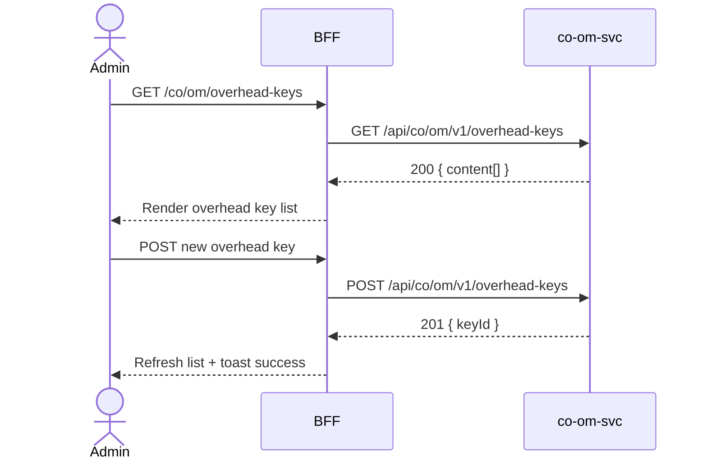

# F-CO-002-01 — Define Overhead Keys

> **Conceptual Stack Layer:** Domain-Feature
> **Space:** Business
> **Owner:** Domain Engineering Team
> **Companion files:** `F-CO-002-01.uvl`, `F-CO-002-01.aui.yaml`
> **Referenced by:** Suite Feature Catalog SS6
> **References:** `co_om-spec.md` (backend)

> **Meta Information**
> - **Version:** 2026-04-04
> - **Template:** `feature-spec.md` v1.0.0
> - **Template Compliance:** 100%
> - **Status:** DRAFT
> - **Feature ID:** `F-CO-002-01`
> - **Suite:** `co`
> - **Node type:** LEAF
> - **Parent:** `F-CO-002` — Overhead & Allocation Management
> - **Companion UVL:** `F-CO-002-01.uvl`
> - **Companion AUI:** `F-CO-002-01.aui.yaml`

---

## ═══════════════════════════════════════════════
## PROBLEM SPACE
## ═══════════════════════════════════════════════

## 0. Feature Identity & Orientation

### 0.1 One-Line Summary
This feature lets a **cost accountant** define overhead rate keys and their percentage rates so that overhead costs from cost centers can be systematically distributed to cost objects during allocation cycles.

### 0.2 Non-Goals
- Does not execute the allocation cycle — that is F-CO-002-02.
- Does not simulate allocations — that is F-CO-002-03.
- Does not define cost elements — that is F-CO-001-03.

### 0.3 Entry & Exit Points

**Entry points:**
- Overhead Management menu → "Overhead Keys"
- Direct URL: `/co/om/overhead-keys`

**Exit points:**
- Navigate to Run Allocation Cycle (F-CO-002-02)
- Back to Overhead Management dashboard

### 0.4 Variability Points

| Variability Point | Model | Values | Default | Binding Time |
|---|---|---|---|---|
| Rate entry precision (decimal places) | UVL attribute | 2, 4 | 2 | deploy |
| Allow percentage > 100% | UVL attribute | true/false | false | deploy |

---

## 1. User Goal & Scenarios

### 1.1 User Goal
Define overhead keys with base cost elements and percentage rates so that the allocation engine can calculate overhead surcharges during period-end processing.

### 1.2 Scenarios

| # | Scenario | Precondition | Action | Expected Outcome |
|---|----------|-------------|--------|-----------------|
| S1 | View all overhead keys | Admin is authenticated | Open overhead keys list | Paginated list with key ID, name, base element, rate |
| S2 | Create new key | Admin has write role | Click Add Key, fill form, submit | New overhead key created |
| S3 | Edit rate | Key exists | Click edit, update rate, save | Rate updated; event published |
| S4 | Deactivate key | Key is ACTIVE | Click deactivate | Key set to INACTIVE |
| S5 | Duplicate key ID | Admin submits duplicate | Submit | 422 error: key ID already exists |

---

## 2. User Journey & Screen Layout

### 2.1 Sequence Diagram



### 2.2 Screen Layout

```
┌─────────────────────────────────────────────────────┐
│ [← Overhead Mgmt]   Overhead Keys          [+ Add]  │
├─────────────────────────────────────────────────────┤
│ [Search: _______________]  [Status: Active ▾]       │
├──────────┬──────────────┬──────────────┬────────┬───┤
│ Key ID   │ Name         │ Base Element │ Rate % │ St │
├──────────┼──────────────┼──────────────┼────────┼───┤
│ OVHD-001 │ Mfg Overhead │ 430000       │ 15.00  │ A │
│ OVHD-002 │ Admin OH     │ 430000       │  8.50  │ A │
│ OVHD-003 │ R&D Overhead │ 470000       │  5.00  │ I │
├──────────┴──────────────┴──────────────┴────────┴───┤
│ [EXT: extension zone]                               │
├─────────────────────────────────────────────────────┤
│ Showing 1-25 of 12     [← Prev] [1] [Next →]        │
└─────────────────────────────────────────────────────┘
```

---

## 3. Interaction Requirements

### 3.1 Fields Table

| Field | Type | Required | Editable | Validation | i18n Key |
|---|---|---|---|---|---|
| Key ID | text input | Yes | No (after create) | max 20 chars, unique | `F-CO-002-01.field.keyId` |
| Key Name | text input | Yes | Yes | max 100 chars | `F-CO-002-01.field.keyName` |
| Base Cost Element | select | Yes | Yes | Must be a valid PRIMARY cost element | `F-CO-002-01.field.baseElement` |
| Overhead Rate (%) | decimal input | Yes | Yes | > 0; default max 100 | `F-CO-002-01.field.rate` |
| Valid From | date | Yes | Yes | — | `F-CO-002-01.field.validFrom` |
| Valid To | date | No | Yes | Must be after Valid From | `F-CO-002-01.field.validTo` |

### 3.2 Actions Table

| Action | Trigger | Precondition | Effect |
|---|---|---|---|
| Add Key | Button click | Admin has write role | Open create form |
| Save | Form submit | Form valid | Create/update overhead key |
| Deactivate | Action button | Key is ACTIVE | Set key to INACTIVE |
| Cancel | Button click | — | Discard changes |

### 3.3 Validation Messages

| Field | Condition | Message |
|---|---|---|
| Required fields | Empty on submit | "{Label} is required." |
| Key ID | Duplicate | "Overhead key ID already exists." |
| Rate | > 100 (when restricted) | "Rate cannot exceed 100%." |

---

## 4. Edge Cases & Screen States

### 4.1 Component States

| State | When | Behaviour |
|---|---|---|
| **Loading** | Awaiting API response | Table skeleton; controls disabled |
| **Empty** | No keys defined | "No overhead keys defined. Create your first key." |
| **Error** | co-om-svc unavailable | Inline error + retry |
| **Populated** | Data ready | Render table normally |

### 4.2 Specific Edge Cases

| Case | Behaviour | Affected users |
|---|---|---|
| Key used in posted allocation | Edit rate disabled; badge "Posted" | Cost accountants |
| Expired validity date | Key shown with EXPIRED badge | Admins |

### 4.3 Attribute-Driven Behaviour Changes

| Attribute | Non-default value | Observable change |
|---|---|---|
| `ratePrecision` | 4 | Rate input shows 4 decimal places |
| `allowRateOver100` | true | Rate field accepts values > 100% |

### 4.4 Connectivity
This feature requires a live connection for mutations.

---

## ═══════════════════════════════════════════════
## SOLUTION SPACE
## ═══════════════════════════════════════════════

## 5. Backend Dependencies & BFF Contract

### 5.1 Service Calls

| # | Service | Endpoint | Tier | isMutation | Failure Mode |
|---|---------|----------|------|------------|-------------|
| 1 | co-om-svc | `GET /api/co/om/v1/overhead-keys` | T3 | No | Show error + retry |
| 2 | co-om-svc | `POST /api/co/om/v1/overhead-keys` | T3 | Yes | Show error |
| 3 | co-om-svc | `PUT /api/co/om/v1/overhead-keys/{id}` | T3 | Yes | Show error |

### 5.2 BFF View-Model Shape

```jsonc
{
  "overheadKeys": [
    {
      "keyId": "OVHD-001",
      "keyName": "Mfg Overhead",
      "baseElement": "430000",
      "ratePercent": 15.00,
      "status": "ACTIVE",
      "validFrom": "2026-01-01",
      "validTo": null
    }
  ],
  "pagination": {
    "page": 0,
    "size": 25,
    "totalElements": 12,
    "totalPages": 1
  }
}
```

### 5.3 Feature-Gating Rules

| Mode | Behaviour |
|---|---|
| Full | All interactions available |
| Read-only | Mutation actions hidden |
| Excluded | Menu item hidden; direct URL returns 404 |

### 5.4 Failure Modes

| Failure | User Experience |
|---------|----------------|
| co-om-svc down | Error state with retry button |
| 422 Duplicate key | Inline form validation error |

### 5.5 Caching Hints
BFF SHOULD cache overhead key list for 5 minutes. Cache invalidated on any overhead key change event.

### 5.6 i18n Keys

| Key | Default (en) |
|-----|-------------|
| `F-CO-002-01.title` | `Overhead Keys` |
| `F-CO-002-01.action.add` | `Add Key` |
| `F-CO-002-01.action.save` | `Save` |
| `F-CO-002-01.action.deactivate` | `Deactivate` |
| `F-CO-002-01.error.duplicate` | `Overhead key ID already exists.` |
| `F-CO-002-01.empty` | `No overhead keys defined.` |

---

## 6. AUI Screen Contract

See companion file `F-CO-002-01.aui.yaml`.

---

## ═══════════════════════════════════════════════
## BRIDGE ARTIFACTS
## ═══════════════════════════════════════════════

## 7. Permissions & Accessibility

### 7.1 Permission Matrix

| Action | CO_ADMIN | CO_CONTROLLER | TENANT_ADMIN | ANY_AUTHENTICATED |
|---|---|---|---|---|
| View overhead keys | ✓ | ✓ | ✓ | ✓ |
| Create/Edit | ✓ | ✓ (own period) | — | — |
| Deactivate | ✓ | — | — | — |

### 7.2 Accessibility
- Table MUST have ARIA role `grid`.
- All form fields MUST have `aria-label` or `aria-labelledby`.
- Confirmation for deactivation MUST trap focus.

---

## 8. Acceptance Criteria

| AC | Scenario | Given | When | Then |
|----|----------|-------|------|------|
| AC-01 | S1 | Admin opens overhead keys | Page loads | All keys shown with ID, name, base element, rate, status |
| AC-02 | S2 | Admin clicks Add Key | Fills form, submits | Key created; list refreshed |
| AC-03 | S3 | Admin edits rate | Changes rate, saves | Rate updated; event published |
| AC-04 | S4 | Admin deactivates key | Clicks deactivate | Key marked INACTIVE |
| AC-05 | S5 | Duplicate key ID submitted | — | 422 error shown inline |

---

## 9. Variability & Extension

### 9.1 Feature Dependencies
Requires IAM authentication. Requires F-CO-001-01 (browse cost centers) per cross-node constraint.

### 9.2 Attributes
See SS0.4. Binding times: `deploy`.

### 9.3 Extension Points
| Extension Zone | Interface | Default Behaviour |
|---|---|---|
| `ext.overheadKeyActions` | Additional row actions | Hidden |

### 9.4 Companion UVL
See `uvl/leaves/F-CO-002-01.uvl`.

---

**END OF SPECIFICATION**
