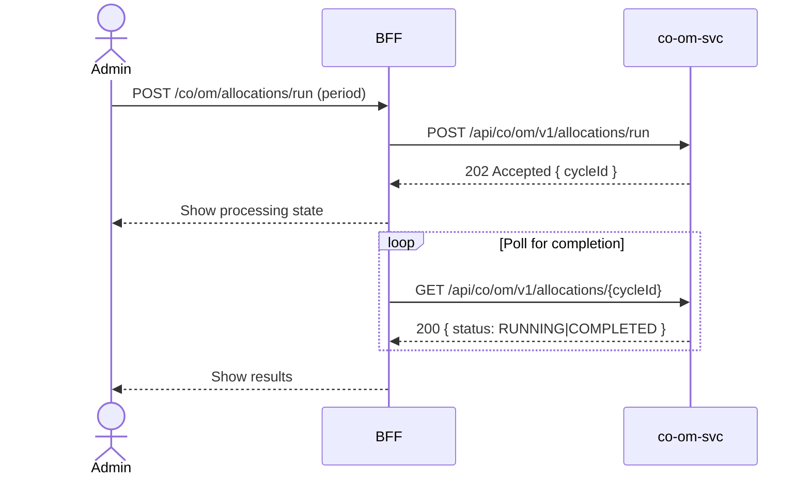

# F-CO-002-02 — Run Allocation Cycle

> **Conceptual Stack Layer:** Domain-Feature
> **Space:** Business
> **Owner:** Domain Engineering Team
> **Companion files:** `F-CO-002-02.uvl`, `F-CO-002-02.aui.yaml`
> **Referenced by:** Suite Feature Catalog SS6
> **References:** `co_om-spec.md` (backend)

> **Meta Information**
> - **Version:** 2026-04-04
> - **Template:** `feature-spec.md` v1.0.0
> - **Template Compliance:** 100%
> - **Status:** DRAFT
> - **Feature ID:** `F-CO-002-02`
> - **Suite:** `co`
> - **Node type:** LEAF
> - **Parent:** `F-CO-002` — Overhead & Allocation Management
> - **Companion UVL:** `F-CO-002-02.uvl`
> - **Companion AUI:** `F-CO-002-02.aui.yaml`

---

## ═══════════════════════════════════════════════
## PROBLEM SPACE
## ═══════════════════════════════════════════════

## 0. Feature Identity & Orientation

### 0.1 One-Line Summary
This feature lets a **cost accountant** execute a periodic overhead allocation cycle so that overhead costs are distributed from cost centers to cost objects based on defined overhead keys.

### 0.2 Non-Goals
- Does not define overhead keys — that is F-CO-002-01.
- Does not simulate allocations before execution — that is F-CO-002-03.
- Does not generate management reports — that is co-rpt-svc.

### 0.3 Entry & Exit Points

**Entry points:**
- Overhead Management menu → "Run Allocation Cycle"
- Direct URL: `/co/om/allocation-cycles`

**Exit points:**
- View allocation results (cost center debit/credit postings)
- Back to Overhead Management dashboard

### 0.4 Variability Points

| Variability Point | Model | Values | Default | Binding Time |
|---|---|---|---|---|
| Allow reverse allocation | UVL attribute | true/false | true | deploy |
| Results display row limit | UVL attribute | 100, 500, 1000 | 500 | runtime |

---

## 1. User Goal & Scenarios

### 1.1 User Goal
Execute a period-end overhead allocation cycle, monitor its progress, and review the resulting debit/credit postings to confirm costs have been correctly distributed.

### 1.2 Scenarios

| # | Scenario | Precondition | Action | Expected Outcome |
|---|----------|-------------|--------|-----------------|
| S1 | View recent cycles | Admin is authenticated | Open allocation cycles | List of recent cycles with status, period, run date |
| S2 | Run new cycle | Overhead keys defined | Click Run, enter period, confirm | Cycle executes; status = RUNNING → COMPLETED |
| S3 | View results | Cycle COMPLETED | Click cycle row | Detail view with all debit/credit postings |
| S4 | Reverse cycle | Cycle is COMPLETED | Click Reverse, confirm | Reverse postings created; cycle status = REVERSED |
| S5 | Cycle already run | Cycle for period exists | Attempt to run again | Warning: "Cycle already posted for this period." |

---

## 2. User Journey & Screen Layout

### 2.1 Sequence Diagram



### 2.2 Screen Layout

```
┌─────────────────────────────────────────────────────┐
│ [← Overhead Mgmt]   Allocation Cycles      [▶ Run]  │
├─────────────────────────────────────────────────────┤
│ [Filter Period: ___]  [Status: All ▾]               │
├──────────────┬────────┬─────────────┬───────────────┤
│ Cycle ID     │ Period │ Run Date    │ Status        │
├──────────────┼────────┼─────────────┼───────────────┤
│ CYC-2026-03  │ 03/26  │ 2026-03-31  │ COMPLETED     │  → click for detail
│ CYC-2026-02  │ 02/26  │ 2026-02-28  │ COMPLETED     │
│ CYC-2026-01  │ 01/26  │ 2026-01-31  │ REVERSED      │
├──────────────┴────────┴─────────────┴───────────────┤
│ [EXT: extension zone]                               │
└─────────────────────────────────────────────────────┘
```

---

## 3. Interaction Requirements

### 3.1 Fields Table

| Field | Type | Required | Editable | Validation | i18n Key |
|---|---|---|---|---|---|
| Period | month/year selector | Yes | Yes | Must be current or prior open period | `F-CO-002-02.field.period` |
| Cycle Type | select | Yes | Yes | ACTUAL, PLAN | `F-CO-002-02.field.cycleType` |

### 3.2 Actions Table

| Action | Trigger | Precondition | Effect |
|---|---|---|---|
| Run Cycle | Button click | Admin has execute role; no active cycle for period | Submit cycle run |
| View Results | Row click | Cycle COMPLETED | Open cycle detail |
| Reverse | Action button | Cycle COMPLETED and reversal enabled | Execute reverse postings |

### 3.3 Validation Messages

| Field | Condition | Message |
|---|---|---|
| Period | Already posted | "Cycle already posted for this period." |
| Run | No overhead keys defined | "No active overhead keys. Define keys in F-CO-002-01 first." |

---

## 4. Edge Cases & Screen States

### 4.1 Component States

| State | When | Behaviour |
|---|---|---|
| **Loading** | Awaiting API response | Skeleton list |
| **Running** | Cycle in progress | Spinner on cycle row; Run button disabled |
| **Empty** | No cycles run yet | "No allocation cycles yet. Run your first cycle." |
| **Error** | co-om-svc unavailable | Inline error + retry |
| **Populated** | Data ready | Render list normally |

### 4.2 Specific Edge Cases

| Case | Behaviour | Affected users |
|---|---|---|
| Period not yet closed in FI | Warning shown before run; user must confirm | Cost accountants |
| Very large allocation (>10k postings) | Async processing; user notified by event | All users |

### 4.3 Attribute-Driven Behaviour Changes

| Attribute | Non-default value | Observable change |
|---|---|---|
| `allowReversal` | false | Reverse button absent from UI |
| `resultsDisplayLimit` | 1000 | Up to 1000 posting rows shown in detail view |

### 4.4 Connectivity
This feature requires a live connection. Long-running cycles use server-sent events or polling for status updates.

---

## ═══════════════════════════════════════════════
## SOLUTION SPACE
## ═══════════════════════════════════════════════

## 5. Backend Dependencies & BFF Contract

### 5.1 Service Calls

| # | Service | Endpoint | Tier | isMutation | Failure Mode |
|---|---------|----------|------|------------|-------------|
| 1 | co-om-svc | `GET /api/co/om/v1/allocations` | T3 | No | Show error + retry |
| 2 | co-om-svc | `POST /api/co/om/v1/allocations/run` | T3 | Yes | Show error |
| 3 | co-om-svc | `GET /api/co/om/v1/allocations/{cycleId}` | T3 | No | Show error |
| 4 | co-om-svc | `POST /api/co/om/v1/allocations/{cycleId}/reverse` | T3 | Yes | Show error |

### 5.2 BFF View-Model Shape

```jsonc
{
  "cycles": [
    {
      "cycleId": "CYC-2026-03",
      "period": "2026-03",
      "cycleType": "ACTUAL",
      "runDate": "2026-03-31T22:00:00Z",
      "status": "COMPLETED",
      "postingCount": 342,
      "totalDebited": 128450.00
    }
  ]
}
```

### 5.3 Feature-Gating Rules

| Mode | Behaviour |
|---|---|
| Full | All interactions available |
| Read-only | Run and Reverse actions hidden |
| Excluded | Menu item hidden; direct URL returns 404 |

### 5.4 Failure Modes

| Failure | User Experience |
|---------|----------------|
| co-om-svc down | Error state with retry |
| Cycle fails mid-run | Status = FAILED; error details shown; rollback triggered |

### 5.5 Caching Hints
BFF MUST NOT cache run or reverse mutations. Cycle list SHOULD be refreshed on `co.om.overhead-allocation.completed` events.

### 5.6 i18n Keys

| Key | Default (en) |
|-----|-------------|
| `F-CO-002-02.title` | `Allocation Cycles` |
| `F-CO-002-02.action.run` | `Run Cycle` |
| `F-CO-002-02.action.reverse` | `Reverse` |
| `F-CO-002-02.error.alreadyPosted` | `Cycle already posted for this period.` |
| `F-CO-002-02.empty` | `No allocation cycles yet.` |

---

## 6. AUI Screen Contract

See companion file `F-CO-002-02.aui.yaml`.

---

## ═══════════════════════════════════════════════
## BRIDGE ARTIFACTS
## ═══════════════════════════════════════════════

## 7. Permissions & Accessibility

### 7.1 Permission Matrix

| Action | CO_ADMIN | CO_CONTROLLER | TENANT_ADMIN | ANY_AUTHENTICATED |
|---|---|---|---|---|
| View cycles | ✓ | ✓ | ✓ | ✓ |
| Run cycle | ✓ | ✓ | — | — |
| Reverse cycle | ✓ | — | — | — |

### 7.2 Accessibility
- Run cycle confirmation dialog MUST trap focus.
- Status badges MUST have accessible text (not color-only indicators).

---

## 8. Acceptance Criteria

| AC | Scenario | Given | When | Then |
|----|----------|-------|------|------|
| AC-01 | S1 | Admin opens allocation cycles | Page loads | List of cycles with period, run date, status |
| AC-02 | S2 | Admin runs new cycle | Selects period, confirms | Cycle executes; status RUNNING → COMPLETED |
| AC-03 | S3 | Cycle is COMPLETED | Admin clicks cycle row | Detail view with all postings |
| AC-04 | S4 | Cycle is COMPLETED | Admin reverses cycle | Reverse postings created; status = REVERSED |
| AC-05 | S5 | Cycle already posted | Admin tries to run again | Warning shown; cycle not run |

---

## 9. Variability & Extension

### 9.1 Feature Dependencies
Requires IAM authentication. Requires F-CO-002-01 (overhead keys defined) per cross-node constraint.

### 9.2 Attributes
See SS0.4. Binding times: `deploy`, `runtime`.

### 9.3 Extension Points
| Extension Zone | Interface | Default Behaviour |
|---|---|---|
| `ext.cycleActions` | Additional actions on completed cycle | Hidden |

### 9.4 Companion UVL
See `uvl/leaves/F-CO-002-02.uvl`.

---

**END OF SPECIFICATION**
