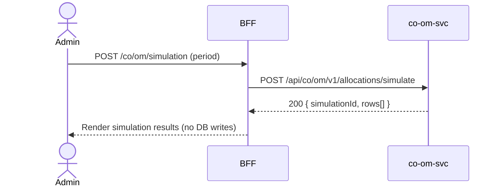

# F-CO-002-03 — Allocation Simulation

> **Conceptual Stack Layer:** Domain-Feature
> **Space:** Business
> **Owner:** Domain Engineering Team
> **Companion files:** `F-CO-002-03.uvl`, `F-CO-002-03.aui.yaml`
> **Referenced by:** Suite Feature Catalog SS6
> **References:** `co_om-spec.md` (backend)

> **Meta Information**
> - **Version:** 2026-04-04
> - **Template:** `feature-spec.md` v1.0.0
> - **Template Compliance:** 100%
> - **Status:** DRAFT
> - **Feature ID:** `F-CO-002-03`
> - **Suite:** `co`
> - **Node type:** LEAF
> - **Parent:** `F-CO-002` — Overhead & Allocation Management
> - **Companion UVL:** `F-CO-002-03.uvl`
> - **Companion AUI:** `F-CO-002-03.aui.yaml`

---

## ═══════════════════════════════════════════════
## PROBLEM SPACE
## ═══════════════════════════════════════════════

## 0. Feature Identity & Orientation

### 0.1 One-Line Summary
This feature lets a **cost accountant** simulate an overhead allocation cycle before actual execution so that results can be reviewed and validated without posting any permanent accounting entries.

### 0.2 Non-Goals
- Does not create permanent postings — that is F-CO-002-02.
- Does not define overhead keys — that is F-CO-002-01.
- Simulation results are ephemeral and NOT persisted beyond the session.

### 0.3 Entry & Exit Points

**Entry points:**
- Overhead Management menu → "Allocation Simulation"
- Direct URL: `/co/om/simulation`

**Exit points:**
- Proceed to Run Allocation Cycle (F-CO-002-02)
- Back to Overhead Management dashboard

### 0.4 Variability Points

| Variability Point | Model | Values | Default | Binding Time |
|---|---|---|---|---|
| Simulation result export | UVL attribute | true/false | false | deploy |
| Max simulation rows returned | UVL attribute | 500, 1000, 5000 | 1000 | deploy |

---

## 1. User Goal & Scenarios

### 1.1 User Goal
Preview the overhead postings that would result from a real allocation cycle for a given period, without modifying any accounting data, to detect errors in overhead key configuration before period-end close.

### 1.2 Scenarios

| # | Scenario | Precondition | Action | Expected Outcome |
|---|----------|-------------|--------|-----------------|
| S1 | Run simulation | Overhead keys defined | Enter period, click Simulate | Simulated postings displayed; no DB writes |
| S2 | Review results | Simulation completed | Browse result table | Debit/credit rows per cost object and key |
| S3 | Export results | Export enabled | Click Export | CSV of simulated postings downloaded |
| S4 | Proceed to actual | Simulation reviewed | Click "Run Actual Cycle" | Navigate to F-CO-002-02 with period pre-filled |
| S5 | No keys defined | No active overhead keys | Click Simulate | Error: "No active overhead keys for this period." |

---

## 2. User Journey & Screen Layout

### 2.1 Sequence Diagram



### 2.2 Screen Layout

```
┌─────────────────────────────────────────────────────┐
│ [← Overhead Mgmt]   Allocation Simulation           │
├─────────────────────────────────────────────────────┤
│ Period: [03/2026 ▾]  [▶ Simulate]  [Export CSV]     │
├───────────────────────────────────────────────────  ┤
│ ⚠ Simulation only — no postings will be created     │
├──────────┬────────────┬──────────┬────────┬──────── ┤
│ Key      │ Sender CC  │ Receiver │ Debit  │ Credit  │
├──────────┼────────────┼──────────┼────────┼──────── ┤
│ OVHD-001 │ CC-2000    │ ORD-0045 │ 1250.00│         │
│ OVHD-001 │ CC-2000    │ ORD-0046 │  875.00│         │
│ OVHD-001 │ CC-2000    │ CC-2000  │        │ 2125.00 │
│ ...      │ ...        │ ...      │ ...    │ ...     │
├──────────┴────────────┴──────────┴────────┴──────── ┤
│ [Run Actual Cycle →]                 Total: 342 rows │
└─────────────────────────────────────────────────────┘
```

---

## 3. Interaction Requirements

### 3.1 Fields Table

| Field | Type | Required | Editable | Validation | i18n Key |
|---|---|---|---|---|---|
| Period | month/year selector | Yes | Yes | Must be an open period | `F-CO-002-03.field.period` |

### 3.2 Actions Table

| Action | Trigger | Precondition | Effect |
|---|---|---|---|
| Simulate | Button click | Period selected; overhead keys exist | Run simulation; render results |
| Export CSV | Button click | Simulation completed; export enabled | Download CSV of results |
| Run Actual Cycle | Button click | Simulation reviewed | Navigate to F-CO-002-02 |

### 3.3 Validation Messages

| Field | Condition | Message |
|---|---|---|
| Period | No active overhead keys | "No active overhead keys for this period." |
| Period | Closed period | "Cannot simulate for a closed period." |

---

## 4. Edge Cases & Screen States

### 4.1 Component States

| State | When | Behaviour |
|---|---|---|
| **Idle** | Page first loaded | Period selector visible; results area empty |
| **Running** | Simulation in progress | Spinner; controls disabled |
| **Populated** | Simulation complete | Results table visible; export enabled |
| **Error** | co-om-svc unavailable | Inline error + retry |
| **Empty** | No keys for period | Error message; link to F-CO-002-01 |

### 4.2 Specific Edge Cases

| Case | Behaviour | Affected users |
|---|---|---|
| Results exceed max rows | Warning: "Showing first {max} rows. Export for full results." | Cost accountants |
| Session expires mid-review | Results cleared; user must re-simulate | All users |

### 4.3 Attribute-Driven Behaviour Changes

| Attribute | Non-default value | Observable change |
|---|---|---|
| `simulationExport` | true | Export CSV button visible |
| `maxSimulationRows` | 5000 | Up to 5000 rows shown in results table |

### 4.4 Connectivity
This feature requires a live connection. Simulation results are not cached or persisted.

---

## ═══════════════════════════════════════════════
## SOLUTION SPACE
## ═══════════════════════════════════════════════

## 5. Backend Dependencies & BFF Contract

### 5.1 Service Calls

| # | Service | Endpoint | Tier | isMutation | Failure Mode |
|---|---------|----------|------|------------|-------------|
| 1 | co-om-svc | `POST /api/co/om/v1/allocations/simulate` | T3 | No (no DB write) | Show error + retry |

### 5.2 BFF View-Model Shape

```jsonc
{
  "simulationId": "SIM-20260404-001",
  "period": "2026-03",
  "rowCount": 342,
  "rows": [
    {
      "overheadKey": "OVHD-001",
      "senderCostCenter": "CC-2000",
      "receiver": "ORD-0045",
      "receiverType": "ORDER",
      "debitAmount": 1250.00,
      "creditAmount": null,
      "currency": "EUR"
    }
  ]
}
```

### 5.3 Feature-Gating Rules

| Mode | Behaviour |
|---|---|
| Full | All interactions available |
| Read-only | Same as full (simulation is non-mutating) |
| Excluded | Menu item hidden; direct URL returns 404 |

### 5.4 Failure Modes

| Failure | User Experience |
|---------|----------------|
| co-om-svc down | Error state with retry |
| No overhead keys | Informational error with link to F-CO-002-01 |

### 5.5 Caching Hints
Simulation results MUST NOT be cached by BFF. Each simulate call is a fresh computation.

### 5.6 i18n Keys

| Key | Default (en) |
|-----|-------------|
| `F-CO-002-03.title` | `Allocation Simulation` |
| `F-CO-002-03.action.simulate` | `Simulate` |
| `F-CO-002-03.action.export` | `Export CSV` |
| `F-CO-002-03.action.runActual` | `Run Actual Cycle` |
| `F-CO-002-03.warning.noPostings` | `Simulation only — no postings will be created` |
| `F-CO-002-03.error.noKeys` | `No active overhead keys for this period.` |

---

## 6. AUI Screen Contract

See companion file `F-CO-002-03.aui.yaml`.

---

## ═══════════════════════════════════════════════
## BRIDGE ARTIFACTS
## ═══════════════════════════════════════════════

## 7. Permissions & Accessibility

### 7.1 Permission Matrix

| Action | CO_ADMIN | CO_CONTROLLER | TENANT_ADMIN | ANY_AUTHENTICATED |
|---|---|---|---|---|
| Run simulation | ✓ | ✓ | — | — |
| Export results | ✓ | ✓ | — | — |
| Navigate to actual run | ✓ | ✓ | — | — |

### 7.2 Accessibility
- Results table MUST have ARIA role `grid`.
- Warning banner MUST have ARIA role `alert`.
- Keyboard: Tab through controls, Enter to execute simulation.

---

## 8. Acceptance Criteria

| AC | Scenario | Given | When | Then |
|----|----------|-------|------|------|
| AC-01 | S1 | Overhead keys defined | Admin selects period, clicks Simulate | Simulated postings displayed; no DB writes verified |
| AC-02 | S2 | Simulation complete | Admin reviews results | Debit/credit rows visible per cost object and key |
| AC-03 | S3 | Export enabled | Admin clicks Export | CSV downloaded with all simulation rows |
| AC-04 | S4 | Simulation reviewed | Admin clicks Run Actual Cycle | Navigates to F-CO-002-02 with period pre-filled |
| AC-05 | S5 | No overhead keys | Admin clicks Simulate | Error shown with link to define keys |

---

## 9. Variability & Extension

### 9.1 Feature Dependencies
Requires IAM authentication. Requires F-CO-002-02 to be included per intra-node constraint.

### 9.2 Attributes
See SS0.4. Binding times: `deploy`.

### 9.3 Extension Points
| Extension Zone | Interface | Default Behaviour |
|---|---|---|
| `ext.simulationActions` | Additional export formats or result actions | Hidden |

### 9.4 Companion UVL
See `uvl/leaves/F-CO-002-03.uvl`.

---

**END OF SPECIFICATION**
