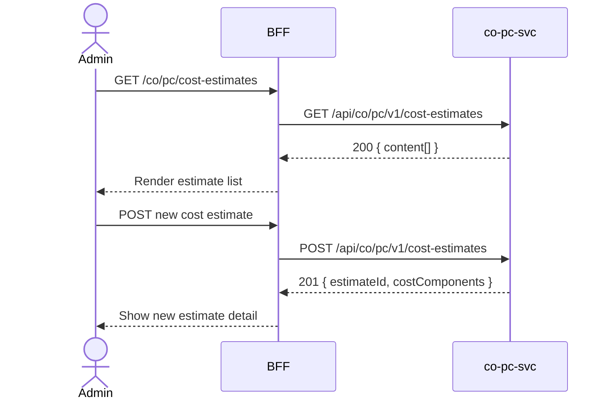

# F-CO-003-01 — Maintain Cost Estimates

> **Conceptual Stack Layer:** Domain-Feature
> **Space:** Business
> **Owner:** Domain Engineering Team
> **Companion files:** `F-CO-003-01.uvl`, `F-CO-003-01.aui.yaml`
> **Referenced by:** Suite Feature Catalog SS6
> **References:** `co_pc-spec.md` (backend)

> **Meta Information**
> - **Version:** 2026-04-04
> - **Template:** `feature-spec.md` v1.0.0
> - **Template Compliance:** 100%
> - **Status:** DRAFT
> - **Feature ID:** `F-CO-003-01`
> - **Suite:** `co`
> - **Node type:** LEAF
> - **Parent:** `F-CO-003` — Product Costing
> - **Companion UVL:** `F-CO-003-01.uvl`
> - **Companion AUI:** `F-CO-003-01.aui.yaml`

---

## ═══════════════════════════════════════════════
## PROBLEM SPACE
## ═══════════════════════════════════════════════

## 0. Feature Identity & Orientation

### 0.1 One-Line Summary
This feature lets a **cost accountant** create and edit cost estimates for materials so that standard costs can be calculated, reviewed, and prepared for release as the basis for inventory valuation and variance analysis.

### 0.2 Non-Goals
- Does not mark or release cost estimates — that is F-CO-003-02.
- Does not analyze variances — that is F-CO-003-03.
- Does not manage overhead keys — that is F-CO-002-01.

### 0.3 Entry & Exit Points

**Entry points:**
- Product Costing menu → "Cost Estimates"
- Direct URL: `/co/pc/cost-estimates`

**Exit points:**
- Navigate to Mark & Release (F-CO-003-02)
- Back to Product Costing dashboard

### 0.4 Variability Points

| Variability Point | Model | Values | Default | Binding Time |
|---|---|---|---|---|
| Costing variant editable | UVL attribute | true/false | false | deploy |
| BOM explosion depth | UVL attribute | 1, 3, 5, unlimited | 5 | deploy |

---

## 1. User Goal & Scenarios

### 1.1 User Goal
Create and maintain cost estimates for manufactured or purchased materials, specifying costing variant, lot size, and cost components (material, labor, overhead), so that a complete standard cost can be calculated and reviewed before release.

### 1.2 Scenarios

| # | Scenario | Precondition | Action | Expected Outcome |
|---|----------|-------------|--------|-----------------|
| S1 | View cost estimates | Admin is authenticated | Open cost estimates list | Paginated list with material, costing variant, valid from, status |
| S2 | Create new estimate | Admin has write role | Click New Estimate, fill fields, save | Cost estimate created in PRELIMINARY status |
| S3 | Edit estimate | Estimate in PRELIMINARY | Click edit, update lot size, save | Estimate recalculated; total updated |
| S4 | View cost components | Estimate exists | Click estimate row | Detail with material, labor, overhead breakdown |
| S5 | Duplicate estimate | Estimate exists | Click Copy, adjust dates | New estimate created with same cost components |

---

## 2. User Journey & Screen Layout

### 2.1 Sequence Diagram



### 2.2 Screen Layout

```
┌─────────────────────────────────────────────────────┐
│ [← Product Costing]   Cost Estimates       [+ New]  │
├─────────────────────────────────────────────────────┤
│ [Search Material: ___]  [Status: All ▾]  [Year: 2026▾] │
├────────────┬──────────┬──────────┬─────────┬────────┤
│ Material   │ Variant  │ Valid From│ Std Cost│ Status │
├────────────┼──────────┼──────────┼─────────┼────────┤
│ MAT-10001  │ PPC1     │ 2026-01  │ 125.80  │ MARKED │
│ MAT-10002  │ PPC1     │ 2026-01  │  48.20  │ PRELIM │
│ MAT-20001  │ PPC1     │ 2026-01  │ 890.00  │ MARKED │
├────────────┴──────────┴──────────┴─────────┴────────┤
│ [EXT: extension zone]                               │
├─────────────────────────────────────────────────────┤
│ Showing 1-25 of 148    [← Prev] [1] [2] ... [Next →]│
└─────────────────────────────────────────────────────┘
```

---

## 3. Interaction Requirements

### 3.1 Fields Table

| Field | Type | Required | Editable | Validation | i18n Key |
|---|---|---|---|---|---|
| Material | reference select | Yes | No (after create) | Must be valid material master | `F-CO-003-01.field.material` |
| Costing Variant | select | Yes | Configurable | Standard list of costing variants | `F-CO-003-01.field.costingVariant` |
| Valid From | date | Yes | Yes | Must be in open fiscal year | `F-CO-003-01.field.validFrom` |
| Lot Size | decimal | Yes | Yes | > 0 | `F-CO-003-01.field.lotSize` |
| Unit of Measure | select | Yes | No | Must match material UoM | `F-CO-003-01.field.uom` |

### 3.2 Actions Table

| Action | Trigger | Precondition | Effect |
|---|---|---|---|
| New Estimate | Button click | Admin has write role | Open create form |
| Save | Form submit | Form valid | Create cost estimate; trigger BOM explosion |
| Edit | Row action | Estimate in PRELIMINARY | Open edit form |
| Copy | Row action | — | Create duplicate with new date |

### 3.3 Validation Messages

| Field | Condition | Message |
|---|---|---|
| Material | Not found | "Material not found in material master." |
| Valid From | Closed fiscal year | "Valid From must be within an open fiscal year." |
| Lot Size | Zero or negative | "Lot size must be greater than zero." |

---

## 4. Edge Cases & Screen States

### 4.1 Component States

| State | When | Behaviour |
|---|---|---|
| **Loading** | Awaiting API response | Table skeleton; controls disabled |
| **Empty** | No estimates | "No cost estimates found. Create your first estimate." |
| **Error** | co-pc-svc unavailable | Inline error + retry |
| **Populated** | Data ready | Render table normally |

### 4.2 Specific Edge Cases

| Case | Behaviour | Affected users |
|---|---|---|
| Estimate already MARKED | Edit disabled; badge "Marked" | Cost accountants |
| BOM explosion fails | Error shown with missing component detail | Cost accountants |

### 4.3 Attribute-Driven Behaviour Changes

| Attribute | Non-default value | Observable change |
|---|---|---|
| `costingVariantEditable` | true | Costing variant field enabled for edit |
| `bomExplosionDepth` | 3 | BOM exploded only 3 levels deep |

### 4.4 Connectivity
This feature requires a live connection for BOM explosion and cost component calculation.

---

## ═══════════════════════════════════════════════
## SOLUTION SPACE
## ═══════════════════════════════════════════════

## 5. Backend Dependencies & BFF Contract

### 5.1 Service Calls

| # | Service | Endpoint | Tier | isMutation | Failure Mode |
|---|---------|----------|------|------------|-------------|
| 1 | co-pc-svc | `GET /api/co/pc/v1/cost-estimates` | T3 | No | Show error + retry |
| 2 | co-pc-svc | `POST /api/co/pc/v1/cost-estimates` | T3 | Yes | Show error |
| 3 | co-pc-svc | `PUT /api/co/pc/v1/cost-estimates/{id}` | T3 | Yes | Show error |

### 5.2 BFF View-Model Shape

```jsonc
{
  "costEstimates": [
    {
      "estimateId": "CE-2026-001",
      "materialId": "MAT-10001",
      "costingVariant": "PPC1",
      "validFrom": "2026-01-01",
      "lotSize": 100,
      "uom": "EA",
      "standardCost": 125.80,
      "status": "MARKED",
      "costComponents": {
        "material": 85.20,
        "labor": 22.50,
        "overhead": 18.10
      }
    }
  ]
}
```

### 5.3 Feature-Gating Rules

| Mode | Behaviour |
|---|---|
| Full | All interactions available |
| Read-only | Create/edit actions hidden |
| Excluded | Menu item hidden; direct URL returns 404 |

### 5.4 Failure Modes

| Failure | User Experience |
|---------|----------------|
| co-pc-svc down | Error state with retry |
| BOM explosion timeout | Error: "BOM explosion timed out. Try with smaller lot size." |

### 5.5 Caching Hints
BFF SHOULD cache cost estimate list for 5 minutes. Cache invalidated on `co.pc.cost-estimate.released` or any estimate change event.

### 5.6 i18n Keys

| Key | Default (en) |
|-----|-------------|
| `F-CO-003-01.title` | `Cost Estimates` |
| `F-CO-003-01.action.new` | `New Estimate` |
| `F-CO-003-01.action.save` | `Save` |
| `F-CO-003-01.action.copy` | `Copy` |
| `F-CO-003-01.error.materialNotFound` | `Material not found in material master.` |
| `F-CO-003-01.empty` | `No cost estimates found.` |

---

## 6. AUI Screen Contract

See companion file `F-CO-003-01.aui.yaml`.

---

## ═══════════════════════════════════════════════
## BRIDGE ARTIFACTS
## ═══════════════════════════════════════════════

## 7. Permissions & Accessibility

### 7.1 Permission Matrix

| Action | CO_ADMIN | CO_CONTROLLER | TENANT_ADMIN | ANY_AUTHENTICATED |
|---|---|---|---|---|
| View estimates | ✓ | ✓ | ✓ | ✓ |
| Create/Edit | ✓ | ✓ | — | — |
| Copy | ✓ | ✓ | — | — |

### 7.2 Accessibility
- Table MUST have ARIA role `grid`.
- All form fields MUST have proper labels.
- Material reference select MUST support keyboard search.

---

## 8. Acceptance Criteria

| AC | Scenario | Given | When | Then |
|----|----------|-------|------|------|
| AC-01 | S1 | Admin opens cost estimates | Page loads | List with material, variant, valid from, standard cost, status |
| AC-02 | S2 | Admin creates new estimate | Fills form, submits | Estimate created in PRELIMINARY; BOM exploded |
| AC-03 | S3 | Admin edits lot size | Updates lot size, saves | Estimate recalculated; total updated |
| AC-04 | S4 | Admin views detail | Clicks estimate row | Cost component breakdown shown |
| AC-05 | S5 | Admin copies estimate | Clicks Copy | New estimate created with same components |

---

## 9. Variability & Extension

### 9.1 Feature Dependencies
Requires IAM authentication. Requires F-CO-001-01 (cost centers) per cross-node constraint.

### 9.2 Attributes
See SS0.4. Binding times: `deploy`.

### 9.3 Extension Points
| Extension Zone | Interface | Default Behaviour |
|---|---|---|
| `ext.costEstimateActions` | Additional actions on estimate row | Hidden |

### 9.4 Companion UVL
See `uvl/leaves/F-CO-003-01.uvl`.

---

**END OF SPECIFICATION**
