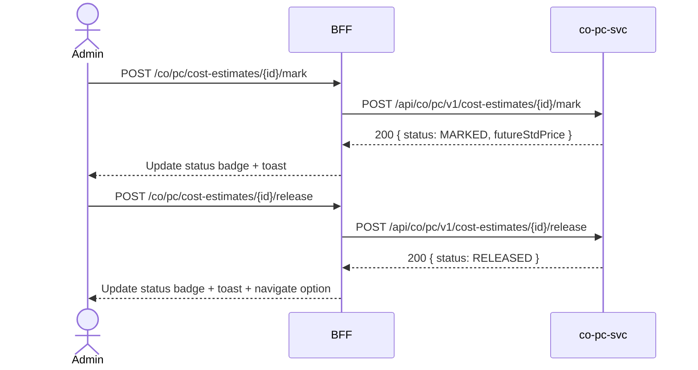

# F-CO-003-02 — Mark & Release Cost Estimates

> **Conceptual Stack Layer:** Domain-Feature
> **Space:** Business
> **Owner:** Domain Engineering Team
> **Companion files:** `F-CO-003-02.uvl`, `F-CO-003-02.aui.yaml`
> **Referenced by:** Suite Feature Catalog SS6
> **References:** `co_pc-spec.md` (backend)

> **Meta Information**
> - **Version:** 2026-04-04
> - **Template:** `feature-spec.md` v1.0.0
> - **Template Compliance:** 100%
> - **Status:** DRAFT
> - **Feature ID:** `F-CO-003-02`
> - **Suite:** `co`
> - **Node type:** LEAF
> - **Parent:** `F-CO-003` — Product Costing
> - **Companion UVL:** `F-CO-003-02.uvl`
> - **Companion AUI:** `F-CO-003-02.aui.yaml`

---

## ═══════════════════════════════════════════════
## PROBLEM SPACE
## ═══════════════════════════════════════════════

## 0. Feature Identity & Orientation

### 0.1 One-Line Summary
This feature lets a **cost accountant** mark a preliminary cost estimate as the future standard price and then release it so that the standard price becomes active for inventory valuation and profitability analysis.

### 0.2 Non-Goals
- Does not create cost estimates — that is F-CO-003-01.
- Does not analyze variances — that is F-CO-003-03.
- Does not post inventory revaluation differences — that is fi.acc.

### 0.3 Entry & Exit Points

**Entry points:**
- Product Costing menu → cost estimate row → "Mark" or "Release"
- Direct URL: `/co/pc/cost-estimates/{id}`

**Exit points:**
- Back to cost estimate list (F-CO-003-01)
- Navigate to Variance Analysis (F-CO-003-03)

### 0.4 Variability Points

| Variability Point | Model | Values | Default | Binding Time |
|---|---|---|---|---|
| Require approval before release | UVL attribute | true/false | false | deploy |
| Allow release without prior mark | UVL attribute | true/false | false | deploy |

---

## 1. User Goal & Scenarios

### 1.1 User Goal
Promote a completed cost estimate through the mark → release workflow so that the standard price activates for inventory valuation and triggers a `co.pc.cost-estimate.released` event consumed by co-pa-svc and fi-acc-svc.

### 1.2 Scenarios

| # | Scenario | Precondition | Action | Expected Outcome |
|---|----------|-------------|--------|-----------------|
| S1 | Mark estimate | Estimate in PRELIMINARY | Click Mark | Status → MARKED; future standard price set |
| S2 | Release estimate | Estimate in MARKED | Click Release | Status → RELEASED; event published; standard price active |
| S3 | View mark history | Estimate exists | View detail | Mark date, marked by, release date shown |
| S4 | Approval flow | Approval required | Submit for approval | Estimate → PENDING_APPROVAL; approver notified |
| S5 | Already released | Estimate RELEASED | Attempt to mark | Error: "Estimate already released." |

---

## 2. User Journey & Screen Layout

### 2.1 Sequence Diagram



### 2.2 Screen Layout

```
┌─────────────────────────────────────────────────────┐
│ [← Cost Estimates]   Cost Estimate — MAT-10001      │
├─────────────────────────────────────────────────────┤
│ Material:  MAT-10001   Variant: PPC1   Status: MARKED│
│ Valid From: 2026-01-01  Lot Size: 100 EA             │
├─────────────────────────────────────────────────────┤
│ Cost Components                                     │
│  Material:  85.20 EUR                               │
│  Labor:     22.50 EUR                               │
│  Overhead:  18.10 EUR                               │
│  ─────────────────                                  │
│  Total:    125.80 EUR                               │
├─────────────────────────────────────────────────────┤
│ Mark History                                        │
│  Marked: 2026-03-28 by J. Mueller                   │
├─────────────────────────────────────────────────────┤
│ [EXT: extension zone]                               │
├─────────────────────────────────────────────────────┤
│                          [Mark ✓]  [Release ▶]      │
└─────────────────────────────────────────────────────┘
```

---

## 3. Interaction Requirements

### 3.1 Fields Table

| Field | Type | Required | Editable | Validation | i18n Key |
|---|---|---|---|---|---|
| Mark Date | date | Auto | No | Set by system | — |
| Release Date | date | Auto | No | Set by system | — |

### 3.2 Actions Table

| Action | Trigger | Precondition | Effect |
|---|---|---|---|
| Mark | Button click | Estimate in PRELIMINARY | Status → MARKED; future std price calculated |
| Release | Button click | Estimate in MARKED (or PRELIMINARY if configured) | Status → RELEASED; event published |
| Submit for Approval | Button click | Approval enabled | Status → PENDING_APPROVAL |

### 3.3 Validation Messages

| Field | Condition | Message |
|---|---|---|
| Mark | Already MARKED/RELEASED | "Estimate already marked or released." |
| Release | Not yet MARKED (if configured) | "Estimate must be marked before release." |

---

## 4. Edge Cases & Screen States

### 4.1 Component States

| State | When | Behaviour |
|---|---|---|
| **PRELIMINARY** | After creation | Mark button visible; Release hidden |
| **MARKED** | After mark | Release button visible; Mark disabled |
| **RELEASED** | After release | Both buttons disabled; read-only |
| **Error** | co-pc-svc unavailable | Error + retry |

### 4.2 Specific Edge Cases

| Case | Behaviour | Affected users |
|---|---|---|
| Prior standard price exists | Warning: "This will replace existing standard price {price}." | Cost accountants |
| FI period already closed | Release blocked; error: "Fiscal period is closed." | Cost accountants |

### 4.3 Attribute-Driven Behaviour Changes

| Attribute | Non-default value | Observable change |
|---|---|---|
| `requireApproval` | true | Release replaced by "Submit for Approval" |
| `allowReleaseWithoutMark` | true | Release available from PRELIMINARY status |

### 4.4 Connectivity
This feature requires a live connection for all state transitions.

---

## ═══════════════════════════════════════════════
## SOLUTION SPACE
## ═══════════════════════════════════════════════

## 5. Backend Dependencies & BFF Contract

### 5.1 Service Calls

| # | Service | Endpoint | Tier | isMutation | Failure Mode |
|---|---------|----------|------|------------|-------------|
| 1 | co-pc-svc | `GET /api/co/pc/v1/cost-estimates/{id}` | T3 | No | Show error + retry |
| 2 | co-pc-svc | `POST /api/co/pc/v1/cost-estimates/{id}/mark` | T3 | Yes | Show error |
| 3 | co-pc-svc | `POST /api/co/pc/v1/cost-estimates/{id}/release` | T3 | Yes | Show error |

### 5.2 BFF View-Model Shape

```jsonc
{
  "estimateId": "CE-2026-001",
  "materialId": "MAT-10001",
  "costingVariant": "PPC1",
  "status": "MARKED",
  "standardCost": 125.80,
  "futureStandardCost": 125.80,
  "markedAt": "2026-03-28T14:30:00Z",
  "markedBy": "J. Mueller",
  "releasedAt": null,
  "costComponents": {
    "material": 85.20,
    "labor": 22.50,
    "overhead": 18.10
  }
}
```

### 5.3 Feature-Gating Rules

| Mode | Behaviour |
|---|---|
| Full | All interactions available |
| Read-only | Mark/Release actions hidden |
| Excluded | Menu item hidden; direct URL returns 404 |

### 5.4 Failure Modes

| Failure | User Experience |
|---------|----------------|
| co-pc-svc down | Error state with retry |
| 409 State conflict | Inline error: "Estimate state changed by another user. Reload." |

### 5.5 Caching Hints
BFF MUST NOT cache mark/release results. Invalidate estimate detail cache on `co.pc.cost-estimate.released`.

### 5.6 i18n Keys

| Key | Default (en) |
|-----|-------------|
| `F-CO-003-02.action.mark` | `Mark` |
| `F-CO-003-02.action.release` | `Release` |
| `F-CO-003-02.action.submitApproval` | `Submit for Approval` |
| `F-CO-003-02.warning.replaceStdPrice` | `This will replace the existing standard price.` |
| `F-CO-003-02.error.alreadyReleased` | `Estimate already released.` |

---

## 6. AUI Screen Contract

See companion file `F-CO-003-02.aui.yaml`.

---

## ═══════════════════════════════════════════════
## BRIDGE ARTIFACTS
## ═══════════════════════════════════════════════

## 7. Permissions & Accessibility

### 7.1 Permission Matrix

| Action | CO_ADMIN | CO_CONTROLLER | TENANT_ADMIN | ANY_AUTHENTICATED |
|---|---|---|---|---|
| View estimate | ✓ | ✓ | ✓ | ✓ |
| Mark | ✓ | ✓ | — | — |
| Release | ✓ | — | — | — |

### 7.2 Accessibility
- Action buttons MUST have descriptive `aria-label` including current state.
- State transitions MUST announce via `aria-live` region.

---

## 8. Acceptance Criteria

| AC | Scenario | Given | When | Then |
|----|----------|-------|------|------|
| AC-01 | S1 | Estimate in PRELIMINARY | Admin clicks Mark | Status → MARKED; future standard price set |
| AC-02 | S2 | Estimate in MARKED | Admin clicks Release | Status → RELEASED; `co.pc.cost-estimate.released` event published |
| AC-03 | S3 | Estimate exists | Admin views detail | Mark date, marked by, release date shown |
| AC-04 | S5 | Estimate RELEASED | Admin attempts to mark | Error shown; no state change |

---

## 9. Variability & Extension

### 9.1 Feature Dependencies
Requires IAM authentication. Requires F-CO-003-01 per intra-node constraint.

### 9.2 Attributes
See SS0.4. Binding times: `deploy`.

### 9.3 Extension Points
| Extension Zone | Interface | Default Behaviour |
|---|---|---|
| `ext.releaseActions` | Post-release actions (e.g. notify team) | Hidden |

### 9.4 Companion UVL
See `uvl/leaves/F-CO-003-02.uvl`.

---

**END OF SPECIFICATION**
