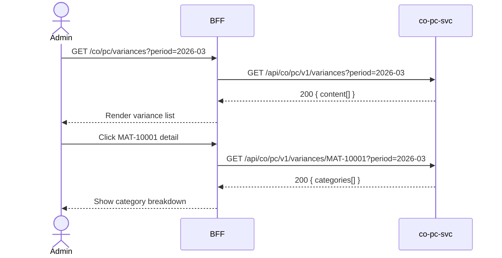

# F-CO-003-03 — Variance Analysis

> **Conceptual Stack Layer:** Domain-Feature
> **Space:** Business
> **Owner:** Domain Engineering Team
> **Companion files:** `F-CO-003-03.uvl`, `F-CO-003-03.aui.yaml`
> **Referenced by:** Suite Feature Catalog SS6
> **References:** `co_pc-spec.md` (backend)

> **Meta Information**
> - **Version:** 2026-04-04
> - **Template:** `feature-spec.md` v1.0.0
> - **Template Compliance:** 100%
> - **Status:** DRAFT
> - **Feature ID:** `F-CO-003-03`
> - **Suite:** `co`
> - **Node type:** LEAF
> - **Parent:** `F-CO-003` — Product Costing
> - **Companion UVL:** `F-CO-003-03.uvl`
> - **Companion AUI:** `F-CO-003-03.aui.yaml`

---

## ═══════════════════════════════════════════════
## PROBLEM SPACE
## ═══════════════════════════════════════════════

## 0. Feature Identity & Orientation

### 0.1 One-Line Summary
This feature lets a **cost accountant** analyze variances between actual production costs and standard costs so that deviations can be identified, categorized, and used to improve costing accuracy.

### 0.2 Non-Goals
- Does not create or maintain cost estimates — that is F-CO-003-01.
- Does not release standard prices — that is F-CO-003-02.
- Does not execute overhead allocations — that is F-CO-002.

### 0.3 Entry & Exit Points

**Entry points:**
- Product Costing menu → "Variance Analysis"
- Direct URL: `/co/pc/variances`

**Exit points:**
- Drill-through to production order detail (OPS)
- Back to Product Costing dashboard

### 0.4 Variability Points

| Variability Point | Model | Values | Default | Binding Time |
|---|---|---|---|---|
| Variance category breakdown | UVL attribute | true/false | true | deploy |
| Drill-through to OPS orders | UVL attribute | true/false | false | deploy |

---

## 1. User Goal & Scenarios

### 1.1 User Goal
Compare actual production costs against released standard costs to identify variance categories (price variance, quantity variance, overhead variance) and determine corrective actions.

### 1.2 Scenarios

| # | Scenario | Precondition | Action | Expected Outcome |
|---|----------|-------------|--------|-----------------|
| S1 | View variances | Period-end data available | Open variance analysis | List of materials with standard cost, actual cost, variance |
| S2 | Filter by material | Variance list displayed | Search for material MAT-10001 | Only variances for MAT-10001 shown |
| S3 | View variance categories | Variance list displayed | Click material row | Breakdown: price, quantity, overhead, scrap variances |
| S4 | Filter by variance threshold | Variance list displayed | Set minimum variance > 100 EUR | Only significant variances shown |
| S5 | Drill-through to order | OPS drill-through enabled | Click production order link | Navigate to OPS production order |

---

## 2. User Journey & Screen Layout

### 2.1 Sequence Diagram



### 2.2 Screen Layout

```
┌─────────────────────────────────────────────────────┐
│ [← Product Costing]   Variance Analysis             │
├─────────────────────────────────────────────────────┤
│ Period: [03/2026 ▾]  [Min Variance: ___ EUR]  [Filter] │
├────────────┬─────────┬────────┬──────────┬──────────┤
│ Material   │ Std Cost│ Actual │ Variance │ Var %    │
├────────────┼─────────┼────────┼──────────┼──────────┤
│ MAT-10001  │  125.80 │ 131.45 │ +5.65    │ +4.5%    │  → click
│ MAT-10002  │   48.20 │  46.80 │ -1.40    │ -2.9%    │
│ MAT-20001  │  890.00 │ 912.30 │ +22.30   │ +2.5%    │
├────────────┴─────────┴────────┴──────────┴──────────┤
│ [EXT: extension zone]                               │
├─────────────────────────────────────────────────────┤
│ Showing 1-25 of 78     [← Prev] [1] [2] [3] [Next →]│
└─────────────────────────────────────────────────────┘
```

---

## 3. Interaction Requirements

### 3.1 Fields Table

| Field | Type | Required | Editable | Validation | i18n Key |
|---|---|---|---|---|---|
| Period | month/year selector | Yes | Yes | Must have closed period data | `F-CO-003-03.field.period` |
| Minimum Variance | decimal | No | Yes | ≥ 0 | `F-CO-003-03.field.minVariance` |
| Search Material | text input | No | Yes | min 2 chars | `F-CO-003-03.search.placeholder` |

### 3.2 Actions Table

| Action | Trigger | Precondition | Effect |
|---|---|---|---|
| Filter | Button click / field change | — | Apply variance and material filters |
| View detail | Row click | — | Show variance category breakdown |
| Drill to OPS | Link click | OPS drill-through enabled | Navigate to OPS production order |

### 3.3 Validation Messages

| Field | Condition | Message |
|---|---|---|
| Period | No data available | "No variance data available for this period." |

---

## 4. Edge Cases & Screen States

### 4.1 Component States

| State | When | Behaviour |
|---|---|---|
| **Loading** | Awaiting API response | Table skeleton |
| **Empty** | No variances in period | "No variances found for this period." |
| **Error** | co-pc-svc unavailable | Inline error + retry |
| **Populated** | Data ready | Render table with variance colouring |

### 4.2 Specific Edge Cases

| Case | Behaviour | Affected users |
|---|---|---|
| No released standard price | Row shows "No standard cost" | Cost accountants |
| Very large variance (outlier) | Row highlighted in red; tooltip explains | All users |

### 4.3 Attribute-Driven Behaviour Changes

| Attribute | Non-default value | Observable change |
|---|---|---|
| `varianceCategoryBreakdown` | false | Category breakdown not shown in detail |
| `drillThroughToOPS` | true | Production order links active in detail view |

### 4.4 Connectivity
This feature requires a live connection.

---

## ═══════════════════════════════════════════════
## SOLUTION SPACE
## ═══════════════════════════════════════════════

## 5. Backend Dependencies & BFF Contract

### 5.1 Service Calls

| # | Service | Endpoint | Tier | isMutation | Failure Mode |
|---|---------|----------|------|------------|-------------|
| 1 | co-pc-svc | `GET /api/co/pc/v1/variances` | T3 | No | Show error + retry |
| 2 | co-pc-svc | `GET /api/co/pc/v1/variances/{materialId}` | T3 | No | Show error + retry |

### 5.2 BFF View-Model Shape

```jsonc
{
  "variances": [
    {
      "materialId": "MAT-10001",
      "period": "2026-03",
      "standardCost": 125.80,
      "actualCost": 131.45,
      "variance": 5.65,
      "variancePercent": 4.5,
      "currency": "EUR",
      "categories": {
        "priceVariance": 2.10,
        "quantityVariance": 1.80,
        "overheadVariance": 1.75
      }
    }
  ]
}
```

### 5.3 Feature-Gating Rules

| Mode | Behaviour |
|---|---|
| Full | All interactions available |
| Read-only | Same as full (read-only feature) |
| Excluded | Menu item hidden; direct URL returns 404 |

### 5.4 Failure Modes

| Failure | User Experience |
|---------|----------------|
| co-pc-svc down | Error state with retry |
| No period-end data | Informational message |

### 5.5 Caching Hints
BFF SHOULD cache variance data for 15 minutes per period. Cache invalidated on period-end close events.

### 5.6 i18n Keys

| Key | Default (en) |
|-----|-------------|
| `F-CO-003-03.title` | `Variance Analysis` |
| `F-CO-003-03.search.placeholder` | `Search material…` |
| `F-CO-003-03.field.period` | `Period` |
| `F-CO-003-03.field.minVariance` | `Min. Variance (EUR)` |
| `F-CO-003-03.empty` | `No variances found for this period.` |

---

## 6. AUI Screen Contract

See companion file `F-CO-003-03.aui.yaml`.

---

## ═══════════════════════════════════════════════
## BRIDGE ARTIFACTS
## ═══════════════════════════════════════════════

## 7. Permissions & Accessibility

### 7.1 Permission Matrix

| Action | CO_ADMIN | CO_CONTROLLER | TENANT_ADMIN | ANY_AUTHENTICATED |
|---|---|---|---|---|
| View variance analysis | ✓ | ✓ | ✓ | ✓ |
| View category breakdown | ✓ | ✓ | ✓ | ✓ |

### 7.2 Accessibility
- Variance values MUST use color AND text/icon for positive/negative (not color alone).
- Table MUST have ARIA role `grid`.

---

## 8. Acceptance Criteria

| AC | Scenario | Given | When | Then |
|----|----------|-------|------|------|
| AC-01 | S1 | Period-end data available | Admin opens variance analysis | Materials listed with std cost, actual, variance, % |
| AC-02 | S2 | Variance list displayed | Admin searches MAT-10001 | Only MAT-10001 variances shown |
| AC-03 | S3 | Admin clicks material row | — | Variance category breakdown displayed |
| AC-04 | S4 | Admin sets min variance filter | Enters 100 EUR | Only variances > 100 EUR shown |

---

## 9. Variability & Extension

### 9.1 Feature Dependencies
Requires IAM authentication. Requires F-CO-003-02 (released standard costs) per intra-node constraint.

### 9.2 Attributes
See SS0.4. Binding times: `deploy`.

### 9.3 Extension Points
| Extension Zone | Interface | Default Behaviour |
|---|---|---|
| `ext.varianceActions` | Additional analysis or export actions | Hidden |

### 9.4 Companion UVL
See `uvl/leaves/F-CO-003-03.uvl`.

---

**END OF SPECIFICATION**
