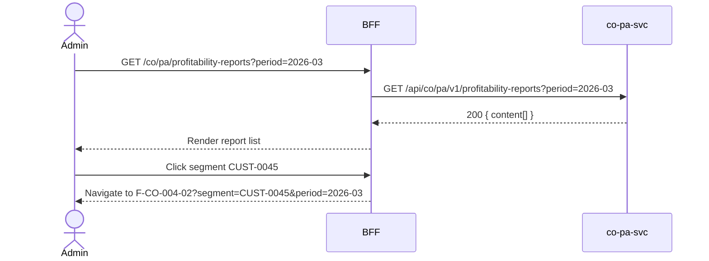

# F-CO-004-01 — Profitability Report Browser

> **Conceptual Stack Layer:** Domain-Feature
> **Space:** Business
> **Owner:** Domain Engineering Team
> **Companion files:** `F-CO-004-01.uvl`, `F-CO-004-01.aui.yaml`
> **Referenced by:** Suite Feature Catalog SS6
> **References:** `co_pa-spec.md` (backend)

> **Meta Information**
> - **Version:** 2026-04-04
> - **Template:** `feature-spec.md` v1.0.0
> - **Template Compliance:** 100%
> - **Status:** DRAFT
> - **Feature ID:** `F-CO-004-01`
> - **Suite:** `co`
> - **Node type:** LEAF
> - **Parent:** `F-CO-004` — Profitability Analysis
> - **Companion UVL:** `F-CO-004-01.uvl`
> - **Companion AUI:** `F-CO-004-01.aui.yaml`

---

## ═══════════════════════════════════════════════
## PROBLEM SPACE
## ═══════════════════════════════════════════════

## 0. Feature Identity & Orientation

### 0.1 One-Line Summary
This feature lets a **management accountant** browse profitability reports by segment so that period profitability can be reviewed at company, division, customer, and product level.

### 0.2 Non-Goals
- Does not drill into contribution margin detail — that is F-CO-004-02.
- Does not assign profit centers — that is F-CO-004-03.
- Does not generate BI dashboards — that is T4 Analytics.

### 0.3 Entry & Exit Points

**Entry points:**
- Profitability Analysis menu → "Profitability Reports"
- Direct URL: `/co/pa/profitability-reports`

**Exit points:**
- Navigate to Contribution Margin Analysis (F-CO-004-02)
- Back to Controlling dashboard

### 0.4 Variability Points

| Variability Point | Model | Values | Default | Binding Time |
|---|---|---|---|---|
| Default report dimension | UVL attribute | COMPANY, DIVISION, CUSTOMER, PRODUCT | COMPANY | deploy |
| Pagination page size | UVL attribute | 10, 25, 50, 100 | 25 | runtime |

---

## 1. User Goal & Scenarios

### 1.1 User Goal
Browse available profitability reports for a given period and segment dimension, understand revenue, cost, and contribution at a glance, and navigate to detailed margin analysis.

### 1.2 Scenarios

| # | Scenario | Precondition | Action | Expected Outcome |
|---|----------|-------------|--------|-----------------|
| S1 | Browse reports | Admin is authenticated | Open profitability reports | List of segment reports for current period |
| S2 | Filter by period | Report list displayed | Select period 03/2026 | Reports for 03/2026 shown |
| S3 | Filter by dimension | Report list displayed | Select dimension = CUSTOMER | Customer-level profitability rows |
| S4 | Navigate to detail | Report list displayed | Click segment row | Navigate to F-CO-004-02 with segment pre-selected |
| S5 | Empty state | No data for period | Open list | "No profitability data available for this period." |

---

## 2. User Journey & Screen Layout

### 2.1 Sequence Diagram



### 2.2 Screen Layout

```
┌─────────────────────────────────────────────────────┐
│ [← Controlling]   Profitability Reports             │
├─────────────────────────────────────────────────────┤
│ Period: [03/2026 ▾]  Dimension: [CUSTOMER ▾]        │
├──────────────┬──────────┬──────────┬────────────────┤
│ Segment      │ Revenue  │ COGS     │ Contribution   │
├──────────────┼──────────┼──────────┼────────────────┤
│ CUST-0045    │ 85,000   │ 52,000   │ 33,000 (38.8%) │  → click
│ CUST-0046    │ 120,000  │ 78,000   │ 42,000 (35.0%) │
│ CUST-0047    │  18,500  │ 14,200   │  4,300 (23.2%) │
├──────────────┴──────────┴──────────┴────────────────┤
│ [EXT: extension zone]                               │
├─────────────────────────────────────────────────────┤
│ Showing 1-25 of 63     [← Prev] [1] [2] [3] [Next →]│
└─────────────────────────────────────────────────────┘
```

---

## 3. Interaction Requirements

### 3.1 Fields Table

| Field | Type | Required | Editable | Validation | i18n Key |
|---|---|---|---|---|---|
| Period | month/year selector | Yes | Yes | Must have period-end data | `F-CO-004-01.field.period` |
| Dimension | select | Yes | Yes | COMPANY, DIVISION, CUSTOMER, PRODUCT | `F-CO-004-01.filter.dimension` |

### 3.2 Actions Table

| Action | Trigger | Precondition | Effect |
|---|---|---|---|
| Filter | Selector change | — | Reload report list with new parameters |
| View detail | Row click | — | Navigate to F-CO-004-02 with segment context |
| Page change | Pagination click | — | Load requested page |

### 3.3 Validation Messages

| Field | Condition | Message |
|---|---|---|
| Period | No data | "No profitability data available for this period." |

---

## 4. Edge Cases & Screen States

### 4.1 Component States

| State | When | Behaviour |
|---|---|---|
| **Loading** | Awaiting API response | Table skeleton |
| **Empty** | No data for period | "No profitability data available for this period." |
| **Error** | co-pa-svc unavailable | Inline error + retry |
| **Populated** | Data ready | Render table normally |

### 4.2 Specific Edge Cases

| Case | Behaviour | Affected users |
|---|---|---|
| Negative contribution margin | Row highlighted; margin shown in red | All users |
| Period not yet closed | Data shown with "Preliminary" badge | All users |

### 4.3 Attribute-Driven Behaviour Changes

| Attribute | Non-default value | Observable change |
|---|---|---|
| `defaultDimension` | PRODUCT | Page opens with PRODUCT dimension pre-selected |
| `pagination.pageSize` | 50 | More rows per page |

### 4.4 Connectivity
This feature requires a live connection.

---

## ═══════════════════════════════════════════════
## SOLUTION SPACE
## ═══════════════════════════════════════════════

## 5. Backend Dependencies & BFF Contract

### 5.1 Service Calls

| # | Service | Endpoint | Tier | isMutation | Failure Mode |
|---|---------|----------|------|------------|-------------|
| 1 | co-pa-svc | `GET /api/co/pa/v1/profitability-reports` | T3 | No | Show error + retry |

### 5.2 BFF View-Model Shape

```jsonc
{
  "reports": [
    {
      "segmentId": "CUST-0045",
      "segmentType": "CUSTOMER",
      "period": "2026-03",
      "revenue": 85000.00,
      "cogs": 52000.00,
      "contributionMargin": 33000.00,
      "contributionMarginPercent": 38.8,
      "currency": "EUR",
      "isPreliminary": false
    }
  ],
  "pagination": {
    "page": 0,
    "size": 25,
    "totalElements": 63,
    "totalPages": 3
  }
}
```

### 5.3 Feature-Gating Rules

| Mode | Behaviour |
|---|---|
| Full | All interactions available |
| Read-only | Same as full (read-only feature) |
| Excluded | Menu item hidden; direct URL returns 404 |

### 5.4 Failure Modes

| Failure | User Experience |
|---------|----------------|
| co-pa-svc down | Error state with retry |

### 5.5 Caching Hints
BFF SHOULD cache report list for 10 minutes per period+dimension. Cache invalidated on `co.pa.profitability-segment.updated`.

### 5.6 i18n Keys

| Key | Default (en) |
|-----|-------------|
| `F-CO-004-01.title` | `Profitability Reports` |
| `F-CO-004-01.field.period` | `Period` |
| `F-CO-004-01.filter.dimension` | `Dimension` |
| `F-CO-004-01.empty` | `No profitability data available for this period.` |
| `F-CO-004-01.badge.preliminary` | `Preliminary` |

---

## 6. AUI Screen Contract

See companion file `F-CO-004-01.aui.yaml`.

---

## ═══════════════════════════════════════════════
## BRIDGE ARTIFACTS
## ═══════════════════════════════════════════════

## 7. Permissions & Accessibility

### 7.1 Permission Matrix

| Action | CO_ADMIN | CO_CONTROLLER | TENANT_ADMIN | ANY_AUTHENTICATED |
|---|---|---|---|---|
| View profitability reports | ✓ | ✓ | ✓ | ✓ |
| Navigate to detail | ✓ | ✓ | ✓ | ✓ |

### 7.2 Accessibility
- Contribution margin values MUST use color AND text indicator for negative values.
- Table MUST have ARIA role `grid`.

---

## 8. Acceptance Criteria

| AC | Scenario | Given | When | Then |
|----|----------|-------|------|------|
| AC-01 | S1 | Admin opens reports | Page loads | Segment reports for current period displayed |
| AC-02 | S2 | Admin selects period | Selects 03/2026 | Reports for 03/2026 shown |
| AC-03 | S3 | Admin selects CUSTOMER dimension | — | Customer-level profitability rows shown |
| AC-04 | S4 | Admin clicks segment row | — | Navigate to F-CO-004-02 with segment context |
| AC-05 | S5 | No data for period | Admin opens reports | Empty state message shown |

---

## 9. Variability & Extension

### 9.1 Feature Dependencies
Requires IAM authentication. Requires F-CO-003-02 (released standard costs) per cross-node constraint.

### 9.2 Attributes
See SS0.4. Binding times: `deploy`, `runtime`.

### 9.3 Extension Points
| Extension Zone | Interface | Default Behaviour |
|---|---|---|
| `ext.reportActions` | Additional report export or drill actions | Hidden |

### 9.4 Companion UVL
See `uvl/leaves/F-CO-004-01.uvl`.

---

**END OF SPECIFICATION**
