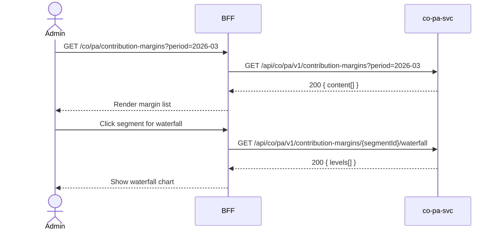

# F-CO-004-02 — Contribution Margin Analysis

> **Conceptual Stack Layer:** Domain-Feature
> **Space:** Business
> **Owner:** Domain Engineering Team
> **Companion files:** `F-CO-004-02.uvl`, `F-CO-004-02.aui.yaml`
> **Referenced by:** Suite Feature Catalog SS6
> **References:** `co_pa-spec.md` (backend)

> **Meta Information**
> - **Version:** 2026-04-04
> - **Template:** `feature-spec.md` v1.0.0
> - **Template Compliance:** 100%
> - **Status:** DRAFT
> - **Feature ID:** `F-CO-004-02`
> - **Suite:** `co`
> - **Node type:** LEAF
> - **Parent:** `F-CO-004` — Profitability Analysis
> - **Companion UVL:** `F-CO-004-02.uvl`
> - **Companion AUI:** `F-CO-004-02.aui.yaml`

---

## ═══════════════════════════════════════════════
## PROBLEM SPACE
## ═══════════════════════════════════════════════

## 0. Feature Identity & Orientation

### 0.1 One-Line Summary
This feature lets a **management accountant** drill into contribution margins per product and customer so that the revenue and cost drivers behind profitability can be analyzed at multiple contribution levels (CM I, CM II, CM III).

### 0.2 Non-Goals
- Does not browse overview profitability reports — that is F-CO-004-01.
- Does not assign profit centers — that is F-CO-004-03.
- Does not show T4 BI dashboards — that is T4 Analytics.

### 0.3 Entry & Exit Points

**Entry points:**
- Profitability Analysis menu → "Contribution Margin Analysis"
- Navigated from F-CO-004-01 with segment context
- Direct URL: `/co/pa/contribution-margins`

**Exit points:**
- Back to Profitability Report Browser (F-CO-004-01)
- Back to Controlling dashboard

### 0.4 Variability Points

| Variability Point | Model | Values | Default | Binding Time |
|---|---|---|---|---|
| Contribution margin levels | UVL attribute | 2, 3, 5 | 3 | deploy |
| Show allocated overhead in CM | UVL attribute | true/false | true | deploy |

---

## 1. User Goal & Scenarios

### 1.1 User Goal
Analyze the contribution margin waterfall for a selected product/customer combination across multiple levels (CM I = revenue - variable COGS; CM II = CM I - fixed overhead; CM III = CM II - allocated admin), to identify which segments are loss-making and what the primary cost drivers are.

### 1.2 Scenarios

| # | Scenario | Precondition | Action | Expected Outcome |
|---|----------|-------------|--------|-----------------|
| S1 | Browse margins | Admin is authenticated | Open contribution margin analysis | List of product/customer combinations with CM I/II/III |
| S2 | Drill by product | Margin list displayed | Filter product = MAT-10001 | All customer segments for MAT-10001 shown |
| S3 | Drill by customer | Margin list displayed | Filter customer = CUST-0045 | All products sold to CUST-0045 |
| S4 | View margin waterfall | Segment selected | Click segment | CM waterfall: revenue → deductions → CM I → CM II → CM III |
| S5 | Period comparison | Two periods selected | Select prior period | Side-by-side current vs. prior period margins |

---

## 2. User Journey & Screen Layout

### 2.1 Sequence Diagram



### 2.2 Screen Layout

```
┌─────────────────────────────────────────────────────┐
│ [← PA Reports]   Contribution Margin Analysis       │
├─────────────────────────────────────────────────────┤
│ Period: [03/2026 ▾]  Product: [All ▾]  Customer: [All ▾] │
├──────────┬────────────┬──────────┬──────────┬───────┤
│ Product  │ Customer   │ CM I     │ CM II    │ CM III│
├──────────┼────────────┼──────────┼──────────┼───────┤
│ MAT-10001│ CUST-0045  │ 33,000   │ 28,500   │ 26,200│  → click
│ MAT-10001│ CUST-0046  │ 18,400   │ 15,200   │ 13,800│
│ MAT-20001│ CUST-0045  │  5,200   │  3,800   │  3,200│
├──────────┴────────────┴──────────┴──────────┴───────┤
│ [EXT: extension zone]                               │
├─────────────────────────────────────────────────────┤
│ Showing 1-25 of 97     [← Prev] [1] [2] [4] [Next →]│
└─────────────────────────────────────────────────────┘
```

---

## 3. Interaction Requirements

### 3.1 Fields Table

| Field | Type | Required | Editable | Validation | i18n Key |
|---|---|---|---|---|---|
| Period | month/year selector | Yes | Yes | Must have PA data | `F-CO-004-02.field.period` |
| Product filter | reference select | No | Yes | Valid material IDs | `F-CO-004-02.filter.product` |
| Customer filter | reference select | No | Yes | Valid customer IDs | `F-CO-004-02.filter.customer` |

### 3.2 Actions Table

| Action | Trigger | Precondition | Effect |
|---|---|---|---|
| Filter | Selector change | — | Reload margins |
| View waterfall | Row click | — | Show CM waterfall for segment |
| Prior period compare | Toggle | — | Load prior period alongside current |

### 3.3 Validation Messages

| Field | Condition | Message |
|---|---|---|
| Period | No PA data | "No contribution margin data available for this period." |

---

## 4. Edge Cases & Screen States

### 4.1 Component States

| State | When | Behaviour |
|---|---|---|
| **Loading** | Awaiting API response | Table skeleton |
| **Empty** | No data for filters | "No contribution margin data for the selected filters." |
| **Error** | co-pa-svc unavailable | Inline error + retry |
| **Populated** | Data ready | Render table with waterfall option |

### 4.2 Specific Edge Cases

| Case | Behaviour | Affected users |
|---|---|---|
| Negative CM at any level | Level shown in red | All users |
| Unassigned overhead | Displayed as "Unallocated" line in waterfall | Cost accountants |

### 4.3 Attribute-Driven Behaviour Changes

| Attribute | Non-default value | Observable change |
|---|---|---|
| `cmLevels` | 2 | Only CM I and CM II columns shown |
| `showAllocatedOverhead` | false | Overhead rows omitted from waterfall |

### 4.4 Connectivity
This feature requires a live connection.

---

## ═══════════════════════════════════════════════
## SOLUTION SPACE
## ═══════════════════════════════════════════════

## 5. Backend Dependencies & BFF Contract

### 5.1 Service Calls

| # | Service | Endpoint | Tier | isMutation | Failure Mode |
|---|---------|----------|------|------------|-------------|
| 1 | co-pa-svc | `GET /api/co/pa/v1/contribution-margins` | T3 | No | Show error + retry |
| 2 | co-pa-svc | `GET /api/co/pa/v1/contribution-margins/{segmentId}/waterfall` | T3 | No | Show error + retry |

### 5.2 BFF View-Model Shape

```jsonc
{
  "margins": [
    {
      "productId": "MAT-10001",
      "customerId": "CUST-0045",
      "period": "2026-03",
      "revenue": 85000.00,
      "cm1": 33000.00,
      "cm2": 28500.00,
      "cm3": 26200.00,
      "currency": "EUR"
    }
  ]
}
```

### 5.3 Feature-Gating Rules

| Mode | Behaviour |
|---|---|
| Full | All interactions available |
| Read-only | Same as full (read-only feature) |
| Excluded | Menu item hidden; direct URL returns 404 |

### 5.4 Failure Modes

| Failure | User Experience |
|---------|----------------|
| co-pa-svc down | Error state with retry |

### 5.5 Caching Hints
BFF SHOULD cache margin data for 10 minutes per period+filters. Invalidated on `co.pa.profitability-segment.updated`.

### 5.6 i18n Keys

| Key | Default (en) |
|-----|-------------|
| `F-CO-004-02.title` | `Contribution Margin Analysis` |
| `F-CO-004-02.field.period` | `Period` |
| `F-CO-004-02.filter.product` | `Product` |
| `F-CO-004-02.filter.customer` | `Customer` |
| `F-CO-004-02.empty` | `No contribution margin data for the selected filters.` |

---

## 6. AUI Screen Contract

See companion file `F-CO-004-02.aui.yaml`.

---

## ═══════════════════════════════════════════════
## BRIDGE ARTIFACTS
## ═══════════════════════════════════════════════

## 7. Permissions & Accessibility

### 7.1 Permission Matrix

| Action | CO_ADMIN | CO_CONTROLLER | TENANT_ADMIN | ANY_AUTHENTICATED |
|---|---|---|---|---|
| View contribution margins | ✓ | ✓ | ✓ | ✓ |
| View waterfall | ✓ | ✓ | ✓ | ✓ |

### 7.2 Accessibility
- Negative values MUST be indicated by text, not color alone.
- Waterfall chart MUST have a data table alternative for screen readers.

---

## 8. Acceptance Criteria

| AC | Scenario | Given | When | Then |
|----|----------|-------|------|------|
| AC-01 | S1 | Admin opens contribution margins | Page loads | Product/customer combinations with CM I/II/III |
| AC-02 | S2 | Admin filters by product | Selects MAT-10001 | Only MAT-10001 segments shown |
| AC-03 | S3 | Admin filters by customer | Selects CUST-0045 | All products for CUST-0045 shown |
| AC-04 | S4 | Admin clicks segment | — | CM waterfall displayed |
| AC-05 | S5 | Admin enables prior period | Toggles comparison | Prior period column added |

---

## 9. Variability & Extension

### 9.1 Feature Dependencies
Requires IAM authentication. Requires F-CO-002-02 (allocation cycle completed) per cross-node constraint.

### 9.2 Attributes
See SS0.4. Binding times: `deploy`.

### 9.3 Extension Points
| Extension Zone | Interface | Default Behaviour |
|---|---|---|
| `ext.marginActions` | Additional export or annotation actions | Hidden |

### 9.4 Companion UVL
See `uvl/leaves/F-CO-004-02.uvl`.

---

**END OF SPECIFICATION**
