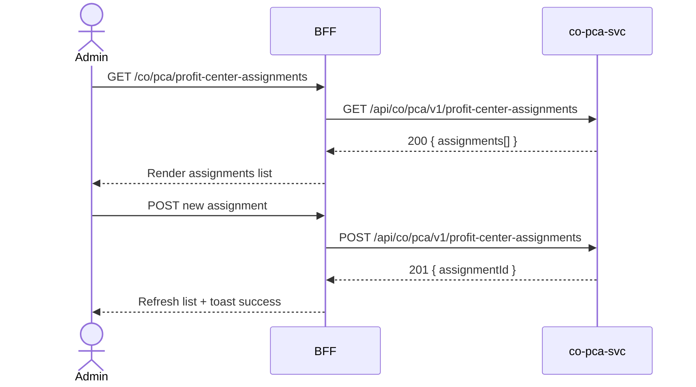

# F-CO-004-03 — Profit Center Assignment

> **Conceptual Stack Layer:** Domain-Feature
> **Space:** Business
> **Owner:** Domain Engineering Team
> **Companion files:** `F-CO-004-03.uvl`, `F-CO-004-03.aui.yaml`
> **Referenced by:** Suite Feature Catalog SS6
> **References:** `co_pca-spec.md` (backend)

> **Meta Information**
> - **Version:** 2026-04-04
> - **Template:** `feature-spec.md` v1.0.0
> - **Template Compliance:** 100%
> - **Status:** DRAFT
> - **Feature ID:** `F-CO-004-03`
> - **Suite:** `co`
> - **Node type:** LEAF
> - **Parent:** `F-CO-004` — Profitability Analysis
> - **Companion UVL:** `F-CO-004-03.uvl`
> - **Companion AUI:** `F-CO-004-03.aui.yaml`

---

## ═══════════════════════════════════════════════
## PROBLEM SPACE
## ═══════════════════════════════════════════════

## 0. Feature Identity & Orientation

### 0.1 One-Line Summary
This feature lets a **controlling administrator** assign profit centers to cost objects (cost centers, internal orders, WBS elements) so that all postings are automatically categorized by profit center for internal segment reporting.

### 0.2 Non-Goals
- Does not define profit center master data — that is co-pca-svc internal configuration.
- Does not browse profitability reports — that is F-CO-004-01.
- Does not calculate contribution margins — that is F-CO-004-02.

### 0.3 Entry & Exit Points

**Entry points:**
- Profitability Analysis menu → "Profit Center Assignments"
- Direct URL: `/co/pca/profit-center-assignments`

**Exit points:**
- Back to Profitability Analysis dashboard

### 0.4 Variability Points

| Variability Point | Model | Values | Default | Binding Time |
|---|---|---|---|---|
| Allow multiple profit centers per cost object | UVL attribute | true/false | false | deploy |
| Require profit center for all cost objects | UVL attribute | true/false | false | deploy |

---

## 1. User Goal & Scenarios

### 1.1 User Goal
Assign and maintain profit center mappings for cost objects so that all financial postings are correctly attributed to the right profit center for internal segment reporting and profitability analysis.

### 1.2 Scenarios

| # | Scenario | Precondition | Action | Expected Outcome |
|---|----------|-------------|--------|-----------------|
| S1 | View assignments | Admin is authenticated | Open profit center assignments | List of cost objects with their assigned profit centers |
| S2 | Create assignment | Admin has write role | Select cost object, select profit center, save | Assignment created; event published |
| S3 | Edit assignment | Assignment exists | Click edit, change profit center, save | Assignment updated; affected postings re-attributed |
| S4 | Remove assignment | Assignment exists | Click remove, confirm | Assignment deleted; cost object unassigned |
| S5 | Bulk assign | Multiple cost objects | Select multiple, assign profit center | All selected objects assigned to profit center |

---

## 2. User Journey & Screen Layout

### 2.1 Sequence Diagram



### 2.2 Screen Layout

```
┌─────────────────────────────────────────────────────┐
│ [← PA]   Profit Center Assignments         [+ Assign]│
├─────────────────────────────────────────────────────┤
│ [Search Cost Object: ___]  [Type: All ▾]  [PC: All ▾]│
├──────────────┬────────────┬──────────────┬──────────┤
│ Cost Object  │ Type       │ Profit Center│ Valid    │
├──────────────┼────────────┼──────────────┼──────────┤
│ CC-1000      │ COST_CENTER│ PC-100       │ Active   │
│ CC-1100      │ COST_CENTER│ PC-100       │ Active   │
│ IO-20001     │ INT_ORDER  │ PC-200       │ Active   │
│ CC-3000      │ COST_CENTER│ (unassigned) │ —        │
├──────────────┴────────────┴──────────────┴──────────┤
│ [EXT: extension zone]                               │
├─────────────────────────────────────────────────────┤
│ Showing 1-25 of 42     [← Prev] [1] [2] [Next →]    │
└─────────────────────────────────────────────────────┘
```

---

## 3. Interaction Requirements

### 3.1 Fields Table

| Field | Type | Required | Editable | Validation | i18n Key |
|---|---|---|---|---|---|
| Cost Object | reference select | Yes | No (after create) | Must be valid cost object | `F-CO-004-03.field.costObject` |
| Cost Object Type | auto | Yes | No | COST_CENTER, INT_ORDER, WBS | `F-CO-004-03.field.costObjectType` |
| Profit Center | reference select | Yes | Yes | Must be valid profit center | `F-CO-004-03.field.profitCenter` |
| Valid From | date | Yes | Yes | — | `F-CO-004-03.field.validFrom` |
| Valid To | date | No | Yes | Must be after Valid From | `F-CO-004-03.field.validTo` |

### 3.2 Actions Table

| Action | Trigger | Precondition | Effect |
|---|---|---|---|
| Assign | Button click | Admin has write role | Open assignment form |
| Save | Form submit | Form valid | Create/update assignment |
| Remove | Action button | Assignment exists | Delete assignment; event published |
| Bulk Assign | Multi-select + action | Multiple objects selected | Assign same PC to all selected |

### 3.3 Validation Messages

| Field | Condition | Message |
|---|---|---|
| Cost Object | Already assigned (single-PC mode) | "Cost object already has a profit center assignment." |
| Profit Center | Not found | "Profit center not found." |

---

## 4. Edge Cases & Screen States

### 4.1 Component States

| State | When | Behaviour |
|---|---|---|
| **Loading** | Awaiting API response | Table skeleton |
| **Empty** | No assignments | "No profit center assignments. Create your first assignment." |
| **Error** | co-pca-svc unavailable | Inline error + retry |
| **Populated** | Data ready | Render table normally |

### 4.2 Specific Edge Cases

| Case | Behaviour | Affected users |
|---|---|---|
| Unassigned cost objects | Shown in list with "(unassigned)" indicator | Admins |
| Assignment with historical postings | Warning: "Changing PC will re-attribute past postings. Confirm?" | Admins |

### 4.3 Attribute-Driven Behaviour Changes

| Attribute | Non-default value | Observable change |
|---|---|---|
| `allowMultiplePCs` | true | Multiple profit center assignments allowed per cost object |
| `requirePCForAll` | true | Unassigned cost objects shown with warning badge |

### 4.4 Connectivity
This feature requires a live connection for all mutations.

---

## ═══════════════════════════════════════════════
## SOLUTION SPACE
## ═══════════════════════════════════════════════

## 5. Backend Dependencies & BFF Contract

### 5.1 Service Calls

| # | Service | Endpoint | Tier | isMutation | Failure Mode |
|---|---------|----------|------|------------|-------------|
| 1 | co-pca-svc | `GET /api/co/pca/v1/profit-center-assignments` | T3 | No | Show error + retry |
| 2 | co-pca-svc | `POST /api/co/pca/v1/profit-center-assignments` | T3 | Yes | Show error |
| 3 | co-pca-svc | `PUT /api/co/pca/v1/profit-center-assignments/{id}` | T3 | Yes | Show error |
| 4 | co-pca-svc | `DELETE /api/co/pca/v1/profit-center-assignments/{id}` | T3 | Yes | Show error |

### 5.2 BFF View-Model Shape

```jsonc
{
  "assignments": [
    {
      "assignmentId": "PCA-001",
      "costObjectId": "CC-1000",
      "costObjectType": "COST_CENTER",
      "profitCenterId": "PC-100",
      "profitCenterName": "Domestic Sales",
      "validFrom": "2026-01-01",
      "validTo": null,
      "status": "ACTIVE"
    }
  ]
}
```

### 5.3 Feature-Gating Rules

| Mode | Behaviour |
|---|---|
| Full | All interactions available |
| Read-only | Create/edit/delete actions hidden |
| Excluded | Menu item hidden; direct URL returns 404 |

### 5.4 Failure Modes

| Failure | User Experience |
|---------|----------------|
| co-pca-svc down | Error state with retry |
| 409 Duplicate assignment | Inline form error |

### 5.5 Caching Hints
BFF SHOULD cache assignment list for 5 minutes. Cache invalidated on `co.pca.profit-center-assignment.changed`.

### 5.6 i18n Keys

| Key | Default (en) |
|-----|-------------|
| `F-CO-004-03.title` | `Profit Center Assignments` |
| `F-CO-004-03.action.assign` | `Assign` |
| `F-CO-004-03.action.remove` | `Remove` |
| `F-CO-004-03.action.bulkAssign` | `Bulk Assign` |
| `F-CO-004-03.error.duplicate` | `Cost object already has a profit center assignment.` |
| `F-CO-004-03.empty` | `No profit center assignments.` |

---

## 6. AUI Screen Contract

See companion file `F-CO-004-03.aui.yaml`.

---

## ═══════════════════════════════════════════════
## BRIDGE ARTIFACTS
## ═══════════════════════════════════════════════

## 7. Permissions & Accessibility

### 7.1 Permission Matrix

| Action | CO_ADMIN | CO_CONTROLLER | TENANT_ADMIN | ANY_AUTHENTICATED |
|---|---|---|---|---|
| View assignments | ✓ | ✓ | ✓ | ✓ |
| Create/Edit | ✓ | — | — | — |
| Remove | ✓ | — | — | — |
| Bulk Assign | ✓ | — | — | — |

### 7.2 Accessibility
- Multi-select MUST use checkboxes with proper ARIA labels.
- Confirmation dialog for removal MUST trap focus.

---

## 8. Acceptance Criteria

| AC | Scenario | Given | When | Then |
|----|----------|-------|------|------|
| AC-01 | S1 | Admin opens assignments | Page loads | All cost objects with assigned profit centers listed |
| AC-02 | S2 | Admin creates assignment | Selects cost object and PC, saves | Assignment created; `co.pca.profit-center-assignment.changed` published |
| AC-03 | S3 | Admin edits assignment | Changes profit center, saves | Assignment updated; event published |
| AC-04 | S4 | Admin removes assignment | Confirms removal | Assignment deleted |
| AC-05 | S5 | Admin bulk assigns | Selects multiple objects, assigns PC | All selected objects assigned |

---

## 9. Variability & Extension

### 9.1 Feature Dependencies
Requires IAM authentication. Requires F-CO-004-01 per intra-node constraint.

### 9.2 Attributes
See SS0.4. Binding times: `deploy`.

### 9.3 Extension Points
| Extension Zone | Interface | Default Behaviour |
|---|---|---|
| `ext.assignmentActions` | Additional assignment workflow actions | Hidden |

### 9.4 Companion UVL
See `uvl/leaves/F-CO-004-03.uvl`.

---

**END OF SPECIFICATION**
