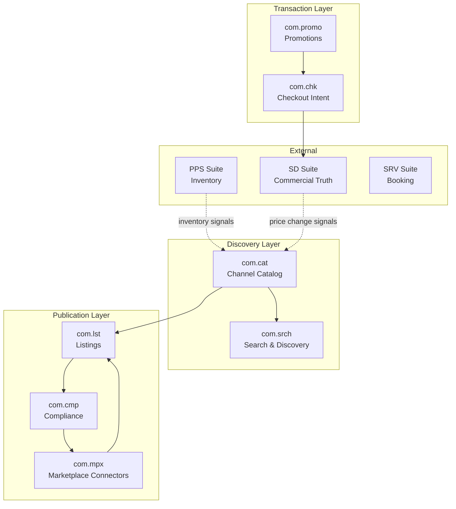
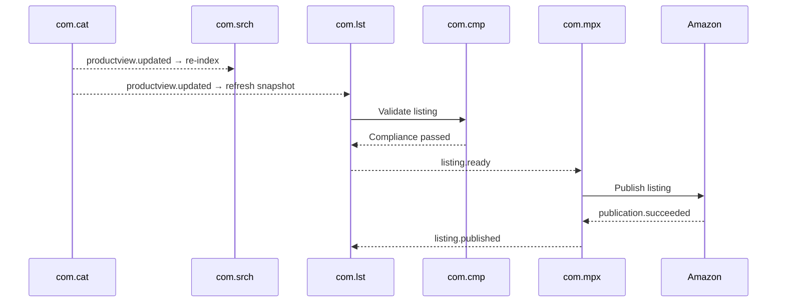
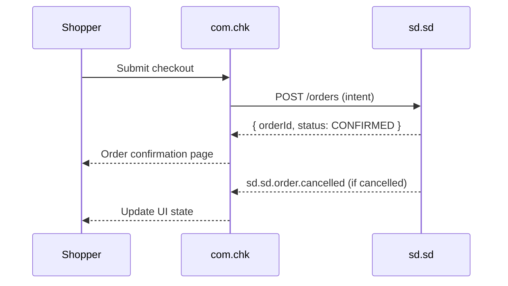
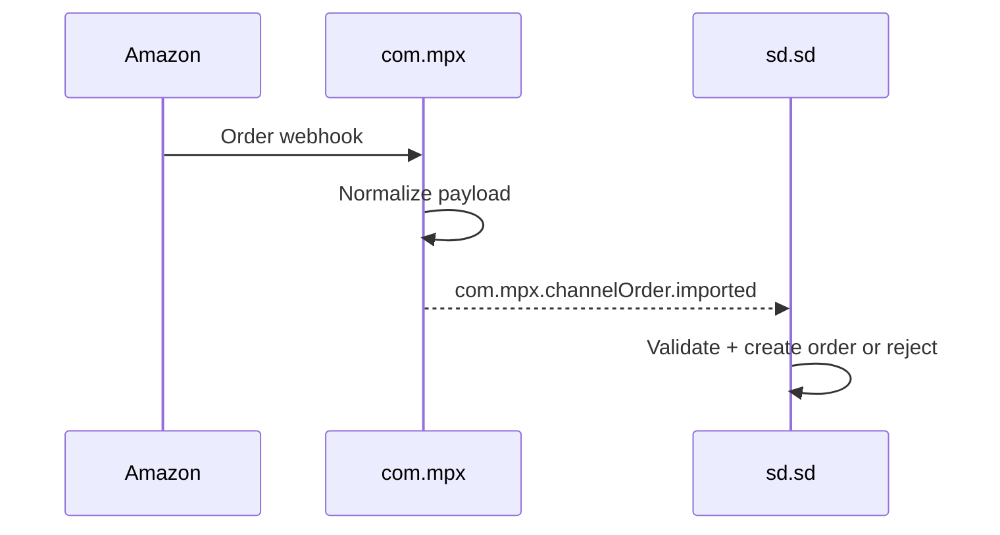

# Commerce (COM) Suite Specification

> **Conceptual Stack Layer:** Suite
> **Space:** Platform
> **Owner:** COM Domain Engineering Team
> **Schema alignment:** `suite-layer.schema.json`
> **Companion files:** `com.catalog.uvl` (referenced in SS6)
> **Contains:** Domain/Service Specs, Platform-Feature Specs, Feature Catalog

> **Meta Information**
> - **Version:** 2026-04-04
> - **Template:** `suite-spec.md` v1.0.0
> - **Template Compliance:** ~96% — fully compliant
> - **Author(s):** OpenLeap Architecture Team
> - **Status:** DRAFT
> - **Suite ID:** `com`
> - **Suite Name:** Commerce
> - **Description:** Customer-facing channel experience suite covering product discovery, catalog presentation, listings, checkout intent capture, marketplace connectors, compliance validation, and promotions.
> - **Semantic Version:** `3.1.0`
> - **Team:**
>   - Name: `team-com`
>   - Email: `com-team@openleap.io`
>   - Slack: `#com-team`
> - **Bounded Contexts:** `bc:channel-catalog`, `bc:listings`, `bc:search-discovery`, `bc:marketplace-connector`, `bc:compliance-publishing`, `bc:checkout-intent`, `bc:promotions-campaigns`

---

## Specification Guidelines

> **This specification MUST comply with the OpenLeap specification guidelines.**
>
> ### Non-Negotiables
> - Never invent facts. If required info is missing, add an **OPEN QUESTION** entry.
> - Preserve intent and decisions. Only change meaning when explicitly requested.
> - Keep the spec **self-contained**: no "see chat", no implicit context.
>
> ### Style Guide
> - Prefer short sentences and lists.
> - Use MUST/SHOULD/MAY for normative statements.
> - Keep terminology consistent with the Ubiquitous Language defined in SS1.

---

## 0. Suite Identity & Purpose

### 0.1 Suite Identity

| Field | Value |
|-------|-------|
| id | `com` |
| name | Commerce |
| description | Customer-facing channel experience suite covering product discovery, catalog presentation, listings, checkout intent capture, marketplace connectors, compliance validation, and promotions. |
| version | `3.1.0` |
| status | `draft` |
| owner.team | `team-com` |
| owner.email | `com-team@openleap.io` |
| owner.slack | `#com-team` |
| boundedContexts | `bc:channel-catalog`, `bc:listings`, `bc:search-discovery`, `bc:marketplace-connector`, `bc:compliance-publishing`, `bc:checkout-intent`, `bc:promotions-campaigns` |

### 0.2 Business Purpose

The Commerce (COM) Suite provides **customer-facing discovery, configuration, and checkout capabilities** across all sales channels. COM captures **customer intent** (browse → cart → checkout submission) and hands off **commercial commitments** to the **SD Suite**, which is the system of record for quotes, orders, contracts, and billing preparation.

**Core rule:**
> COM can *collect and present* — SD must *confirm and own*.

COM is the **channel experience layer** — it is not the commercial core. It integrates with SD for commercial truth, SRV for booking/scheduling, PPS for execution-grade inventory, and FI for accounting.

### 0.3 In Scope

- **Channel Catalog & Content:** Channel-ready product/variant views (denormalized, locale-aware), media management, SEO fields, content publishing pipelines
- **Listings & Publication Snapshots:** Channel-specific listing lifecycle, offer/availability snapshots per channel (webshop, marketplace, POS)
- **Search & Discovery:** Product discovery — keyword search, facets, ranking, basic recommendations, personalization signals
- **Marketplace Connectors:** Publish listings to external channels (Amazon, eBay, Shopify); ingest inbound channel orders as intent payloads
- **Compliance for Publishing:** Policy packs, per-channel/country/category validation, prohibited item checking, evidence references
- **Checkout Intent Capture:** Cart state, checkout session, delivery/payment UI orchestration, intent submission to SD
- **Promotions & Campaigns:** Discount rules, coupon codes, promotional campaign lifecycle, checkout-time promotion application
- **Price Preview (Optional):** Low-latency display price cache for browsing (not authoritative)

### 0.4 Out of Scope

- Quotes, orders, contracts, subscriptions (→ SD suite)
- Fulfillment orchestration and order lifecycle beyond "submitted" (→ SD suite)
- Booking/appointments/sessions/cases (→ SRV suite)
- Billing intents from commercial lifecycle (→ SD suite)
- Invoices, AR, payments, postings, tax journaling (→ FI suite)
- Authoritative product engineering data (BOM, routings) (→ PPS suite)
- Returns/refunds commercial policy (→ SD suite)
- Customer master data (→ BP suite)

### 0.5 Target Users

| Role | Interest |
|------|----------|
| Merchandiser | Product content, catalog management, pricing badges, SEO |
| Channel Manager | Listing management, channel publication, marketplace integration |
| E-commerce Manager | Storefront configuration, checkout flow, cart conversion |
| Compliance Officer | Publishing policy rules, violation review, evidence management |
| Marketing Manager | Promotional campaigns, coupon management, campaign performance |
| Search Analyst | Search relevance tuning, facet configuration, index health |
| End Customer (Shopper) | Product discovery, cart, checkout — via storefront UI |

### 0.6 Business Value

- **Revenue Growth:** Improved search relevance and merchandising directly increases conversion rate
- **Channel Reach:** Marketplace connectors multiply sales channels without manual listing effort
- **Compliance Protection:** Automated publication compliance prevents regulatory violations and marketplace bans
- **Checkout Efficiency:** Streamlined checkout intent capture reduces cart abandonment
- **Time-to-Market:** Channel catalog management reduces content publishing time from days to hours

---

## 1. Ubiquitous Language

### 1.1 Glossary

| ID | Term | Aliases | Definition |
|----|------|---------|------------|
| com:glossary:product-view | ProductView | Channel Catalog Item | A read-optimized, channel-specific denormalized view of a product/variant for storefront presentation. Not the authoritative product master (owned by PPS/SD). |
| com:glossary:listing | Listing | Channel Listing | A channel-specific publication snapshot combining content, offer snapshot, and availability snapshot for a specific channel (e.g., "Amazon DE"). |
| com:glossary:offer-snapshot | OfferViewSnapshot | Display Price | A point-in-time price display snapshot for a listing. Reflects display price and badges but is NOT the authoritative commercial price (that is SD). |
| com:glossary:availability-snapshot | AvailabilityViewSnapshot | Stock Badge | A point-in-time availability indicator (in-stock, backorder, lead time message) for a listing. Not authoritative inventory (that is PPS). |
| com:glossary:checkout-session | CheckoutSession | Cart Session | The stateful UI session capturing a shopper's delivery choices, identity context, payment UI state, and eventual intent submission. |
| com:glossary:checkout-intent | CheckoutIntent | Intent Submission | The payload submitted from COM to SD to create a commercial commitment (order, contract, or quote). COM never confirms; SD confirms. |
| com:glossary:search-index | SearchIndex | — | The denormalized, fast-query index maintained by com.srch, built from catalog content and listing data. |
| com:glossary:channel | Channel | Sales Channel | A specific sales context (e.g., "DE Webshop", "Amazon EU", "POS Berlin") for which listings and content are managed. |
| com:glossary:compliance-policy | CompliancePolicy | Policy Pack | A set of rules (per channel, country, category) that a listing must satisfy before it can be published. |
| com:glossary:marketplace-connector | MarketplaceConnector | Channel Connector | A COM-owned adapter for a specific external marketplace (Amazon, eBay, Shopify) that publishes listings and receives inbound orders. |
| com:glossary:channel-order | ChannelOrder | Inbound Channel Order | A marketplace-originated order captured by com.mpx as an intent payload. SD decides whether to accept/commit. |
| com:glossary:promotion | Promotion | Discount Rule | A configured pricing modifier (percentage, fixed, BOGO) active for a defined period, applied at checkout by com.promo. |
| com:glossary:coupon | Coupon | Voucher Code | A single-use or limited-use code redeemable by a shopper to apply a specific promotion. |
| com:glossary:price-preview | PricePreview | Display Price Cache | A cached price for browsing display; updated asynchronously from SD pricing signals. Never used for commercial commitment. |

### 1.2 UBL Boundary Test

**COM vs. SD (Sales & Distribution):**
In COM, a `CheckoutIntent` is a provisional request from a shopper's session — it has no commercial binding until SD creates the commitment. In SD, the same business moment produces an `Order` or `Contract` — immutable commercial truth. COM uses `CheckoutSessionId`; SD uses `OrderId`. They share the business event but own completely different objects.

**COM vs. SRV:**
In COM, a "booking-like" UI collects slot preferences and forwards them to SRV. COM never owns a `Booking` aggregate. In SRV, `Booking` is the authoritative slot reservation. COM may show SRV's confirmation in the UI but never stores it.

---

## 2. COM Domain Architecture

### 2.1 Domain Overview

### 2.2 Domain Responsibility Matrix

| Domain | Owns | Does NOT own |
|--------|------|-------------|
| com.cat | Channel content projections, media | Product engineering, pricing authority |
| com.lst | Channel listing snapshots | Commercial commitments |
| com.srch | Search index, facets, recommendations | Pricing, inventory truth |
| com.mpx | Channel connectors, external mappings | Order acceptance, billing |
| com.cmp | Compliance policy packs, validation | Legal compliance decisions (external) |
| com.chk | Cart, checkout session, intent submission | Order management post-submission |
| com.promo | Discount rules, coupon lifecycle | Commercial pricing authority |

---

## 3. COM Domain Catalog

### 3.1 Core Domains (Mandatory)

| # | Domain | Service ID | Purpose | Spec |
|---|--------|-----------|---------|------|
| 1 | **com.cat** | `com-cat-svc` | Channel catalog content, ProductView/VariantView projections | `domain-specs/com_cat-spec.md` |
| 2 | **com.lst** | `com-lst-svc` | Channel listings and offer/availability snapshots | `domain-specs/com_lst-spec.md` |
| 3 | **com.srch** | `com-srch-svc` | Search & discovery — indexing, facets, ranking | `domain-specs/com_srch-spec.md` |
| 4 | **com.mpx** | `com-mpx-svc` | Marketplace connectors — publish listings, ingest channel orders | `domain-specs/com_mpx-spec.md` |
| 5 | **com.cmp** | `com-cmp-svc` | Compliance for publishing — policy packs, validation | `domain-specs/com_cmp-spec.md` |
| 6 | **com.chk** | `com-chk-svc` | Cart, checkout session, intent submission to SD | `domain-specs/com_chk-spec.md` |

### 3.2 Optional Domains

| # | Domain | Service ID | Purpose | Spec |
|---|--------|-----------|---------|------|
| 7 | **com.promo** | `com-promo-svc` | Promotions & campaigns — discount rules, coupons | `domain-specs/com_promo-spec.md` |

### 3.3 API Base Paths

| Domain | Base Path | Port |
|--------|-----------|------|
| com.cat | `/api/com/cat/v1` | 8101 |
| com.lst | `/api/com/lst/v1` | 8102 |
| com.srch | `/api/com/srch/v1` | 8103 |
| com.mpx | `/api/com/mpx/v1` | 8104 |
| com.cmp | `/api/com/cmp/v1` | 8105 |
| com.chk | `/api/com/chk/v1` | 8106 |
| com.promo | `/api/com/promo/v1` | 8107 |

---

## 4. Cross-Domain Integration Patterns

### 4.1 SD Handoff Contract (COM → SD)

**Core rule:** COM submits intent; SD creates commercial commitment.

| COM Action | SD Call | SD Response |
|------------|---------|-------------|
| Checkout submit | `POST /api/sd/sd/v1/orders` | `{ orderId, status }` |
| Quote request | `POST /api/sd/sd/v1/quotes` | `{ quoteId, validity }` |

COM stores `checkoutSessionId → sdOrderId` mapping for UI continuity. COM listens to `sd.sd.order.confirmed` / `sd.sd.order.cancelled` to update UI state.

### 4.2 Key Integration Flows

#### Flow 1: Catalog → Index → Listing → Marketplace

#### Flow 2: Checkout Intent → SD Commitment

#### Flow 3: Inbound Channel Order

---

## 5. Event Conventions

### 5.1 Routing Key Pattern

`com.{domain}.{aggregate}.{event}`

### 5.2 Key Events by Domain

| Domain | Events |
|--------|--------|
| com.cat | `com.cat.productview.updated` |
| com.lst | `com.lst.listing.ready`, `com.lst.listing.published`, `com.lst.listing.failed` |
| com.srch | `com.srch.index.updated` |
| com.mpx | `com.mpx.publication.succeeded`, `com.mpx.publication.failed`, `com.mpx.channelOrder.imported` |
| com.cmp | `com.cmp.policy.updated` (optional) |
| com.chk | `com.chk.checkoutSession.submitted`, `com.chk.checkoutSession.failed` |
| com.promo | `com.promo.campaign.activated`, `com.promo.campaign.ended` |

---

## 6. Feature Catalog

Full catalog in `com.catalog.uvl`. Feature compositions in `features/compositions/`.

| Feature ID | Name | Type | Domain Coverage |
|------------|------|------|-----------------|
| F-COM-001 | Channel Catalog Management | COMPOSITION | com.cat, com.lst |
| F-COM-002 | Commerce Search & Discovery | COMPOSITION | com.srch |
| F-COM-003 | Checkout & Promotions | COMPOSITION | com.chk, com.promo |
| F-COM-004 | Marketplace & Compliance | COMPOSITION | com.mpx, com.cmp |

---

## 7. Cross-Cutting Concerns

### 7.1 Channel Context

All COM operations require a `channelId` (the target sales channel). Channel configuration drives locale, currency, pricing display rules, and compliance policy applicability.

### 7.2 Multi-Tenancy

All aggregates include `tenantId`. RLS enforced in PostgreSQL. Channel configuration is tenant-scoped.

### 7.3 Eventual Consistency

COM operates on eventually consistent read projections from upstream systems (PPS for inventory, SD for pricing). COM MUST NOT block on upstream systems for display — show cached snapshots with freshness indicators.

---

## 8. External Interfaces

### 8.1 Inbound Integrations

| Source | Protocol | Purpose |
|--------|----------|---------|
| SD suite | Event | Price change signals for com.cat price preview cache |
| PPS suite | Event | Inventory change signals for availability snapshots |
| External marketplaces | Webhook | Inbound channel orders (com.mpx) |
| i18n service | REST | Locale-aware content translations |

### 8.2 Outbound Integrations

| Target | Protocol | Purpose |
|--------|----------|---------|
| SD suite | REST | Checkout intent submission, price validation |
| SRV suite | REST | Slot availability queries (booking-like checkout) |
| External marketplaces | REST | Listing publication |
| DMS | REST | Compliance evidence storage |

---

## 9. Architecture Decisions

### ADR-COM-001: COM is the channel experience layer; SD is the commercial system of record

**Status:** Accepted  
**Decision:** COM MUST NOT own orders, quotes, contracts, subscriptions, or billing intents. These are SD domain.  
**Consequences:** Clear boundary prevents duplicated commercial logic; COM remains a lightweight experience layer.

### ADR-COM-002: Checkout submits intent to SD — COM never "confirms" an order

**Status:** Accepted  
**Decision:** `com.chk` submits to SD and stores `checkoutSessionId → sdOrderId` mapping. Confirmation comes from SD event.  
**Consequences:** SD is always the commercial truth; COM confirmation UI is driven by SD events.

### ADR-COM-003: Listings are presentation snapshots, not commercial commitments

**Status:** Accepted  
**Decision:** `OfferViewSnapshot` and `AvailabilityViewSnapshot` in com.lst are display-only. They MUST NOT be used for commercial pricing or fulfillment decisions.  
**Consequences:** SD and PPS remain authoritative for commercial/inventory truth.

### ADR-COM-004: Compliance validation is synchronous before listing publication

**Status:** Accepted  
**Decision:** com.lst MUST call com.cmp synchronously before triggering com.mpx publication.  
**Consequences:** Prevents non-compliant listings from reaching external channels.

### ADR-COM-005: com.promo is optional — base COM works without it

**Status:** Accepted  
**Decision:** Promotions add optional checkout-time discount calculation. Core browse/checkout flow works without com.promo.  
**Consequences:** Simpler initial deployment; promotions can be activated later.

---

## 10. Open Questions

| ID | Question | Priority |
|----|----------|----------|
| OQ-COM-001 | Port assignments for all COM services | LOW |
| OQ-COM-002 | Repository naming convention for COM services | LOW |
| OQ-COM-003 | Integration with SD pricing API for authoritative price at checkout (API contract needed from SD team) | HIGH |
| OQ-COM-004 | How are booking-like checkouts (time slots) handled — direct SRV call from com.chk or via SD? | MEDIUM |
