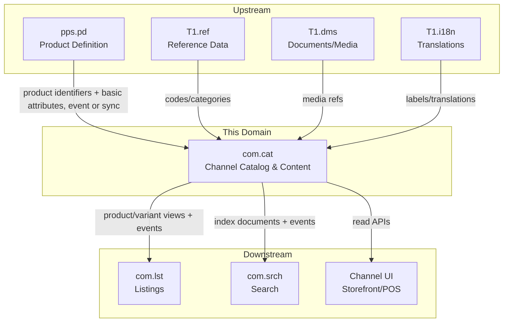
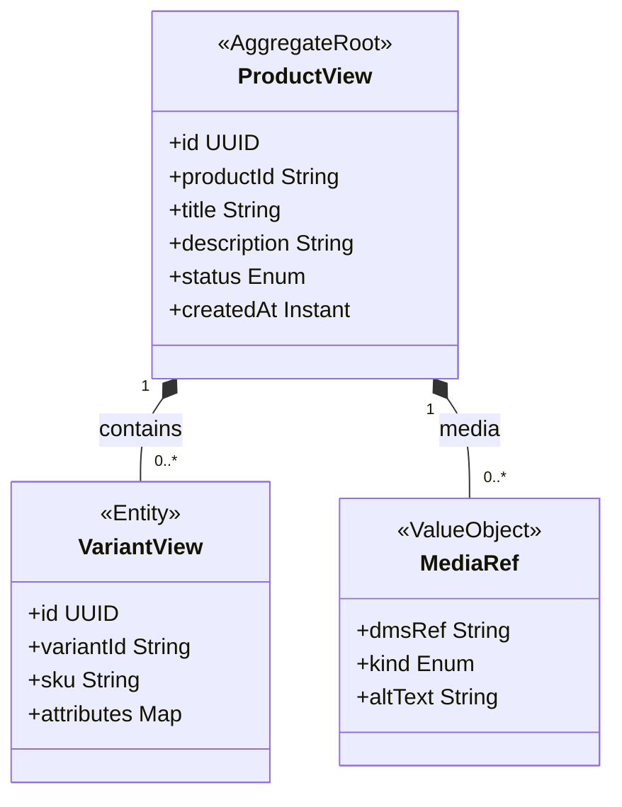
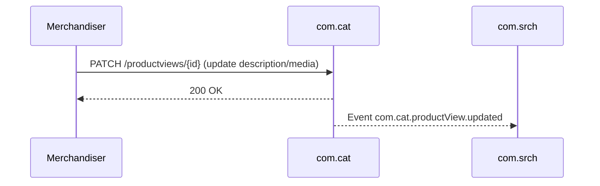

<!-- TEMPLATE COMPLIANCE: ~55%
Template: domain-service-spec.md v1.0.0
Present sections: §0 (purpose, audience, scope, related docs), §1 (business context, value, stakeholders, positioning), §2 (partial — meta block but no identity table), §3 (domain model, class diagram, UBL concepts), §4 (invariants only — no full business rules catalog), §6 (REST API), §7 (events — outbound/inbound), §8 (persistence/storage), §9 (security/roles/PII), §10 (NFR partial), §14 (decisions, open questions)
Missing sections: §2 (no formal service identity table), §4 (no BR catalog, no detailed rules), §5 (use cases), §8 (no ER diagram, no indexes), §11 (feature dependencies), §12 (extension points), §13 (migration), §15 (appendix/glossary)
Naming issues: file should be com_cat-spec.md per convention
Duplicates: none
Priority: LOW
-->
# Service Domain Specification — `com.cat` (Channel Catalog & Content)

> **Meta Information**
> - **Version:** 2026-01-18
> - **Template:** `domain-service-spec.md` v1.0.0
> - **Template Compliance:** ~55% — §2 (service identity table), §4 (BR catalog), §5 (use cases), §8 (ER diagram, indexes), §11 (feature dependencies), §12 (extension points), §13 (migration), §15 (appendix/glossary) missing
> - **Author(s):** OpenLeap Architecture Team
> - **Status:** DRAFT
> - **Tier:** T3
> - **Suite:** `com`
> - **Domain:** `cat`
> - **Service ID:** `com-cat-svc`
> - **basePackage:** `io.openleap.com.cat`
> - **API Base Path:** `/api/com/cat/v1`

---

## Specification Guidelines Compliance

> **This specification MUST comply with the project-wide specification guidelines.**
>
> #### Non-negotiables
> - Never invent facts. If information is missing, add an **OPEN QUESTION** entry.
> - Use **MUST/SHOULD/MAY** for normative statements.
> - Keep the spec **self-contained**: no references to chat context.
> - Record decisions and boundaries explicitly (see Section 12).

---

## 0. Document Purpose & Scope

### 0.1 Purpose
`com.cat` specifies the **channel-ready catalog & content** domain within the Commerce (COM) suite. It provides **read-optimized presentation projections** of sellable items for storefronts and publication pipelines.

`com.cat` exists to decouple **channel experience concerns** (content, SEO, media, localized presentation) from **core business execution** (product engineering in `pps.pd`, commercial commitments in `sd.sd`, and fulfillment execution in `pps`/`srv`).

### 0.2 Target Audience
- Product Owner / Fachbereich
- Architekt:innen / Tech Leads
- Integrations- und Plattform-Team
- Channel / Merchandising Teams

### 0.3 Scope

**In Scope (MUST):**
- MUST maintain channel-facing **presentation projections** (e.g., `ProductView`, `VariantView`) with stable identifiers.
- MUST manage rich content fields needed for channels (descriptions, media references, SEO fields).
- MUST support locale-aware content (by storing localized content or referencing an i18n mechanism).
- MUST expose read APIs for storefronts and for other COM domains (`com.srch`, `com.lst`).
- SHOULD publish change events so dependent consumers can refresh caches/indexes.

**Out of Scope (MUST NOT):**
- MUST NOT be the system of record for product engineering (BOM/routings/versions) → owned by `pps.pd`.
- MUST NOT be the system of record for inventory or operational availability → owned by `pps.im`/`pps.wm` (COM may display snapshots).
- MUST NOT own authoritative pricing for quotes/orders/contracts → owned by `sd.sd`.
- MUST NOT own quotes/orders/contracts/subscriptions → owned by `sd.sd`.

### 0.4 Terms & Acronyms
- **ProductView / VariantView:** Denormalized, read-optimized representation of a sellable item for channels.
- **Projection:** A derived view built from upstream sources (events and/or sync reads).
- **Aggregate Root:** Primary consistency boundary for domain concepts (here: `ProductView`).

### 0.5 Related Documents
- Suite-Architektur: `platform/tmpspec/T3_Domains/COM/_com_suite.md`
- Nachbar-Spezifikationen: `com_lst.md`, `com_srch.md`, `com_mpx.md`, `com_cmp.md`, `com_chk.md`
- Related suite baselines:
  - `platform/T3_Domains/SD/SD_sales.md`
  - `platform/T3_Domains/SRV/_srv_suite.md`

---

## 1. Business Context

### 1.1 Domain Purpose
`com.cat` provides a consistent **channel catalog view** so that:
- storefronts can render product tiles and product detail pages quickly,
- listing/publication can reuse consistent presentation data,
- search can index consistent content fields.

### 1.2 Business Value
- Faster channel UX (read-optimized projections).
- Better separation of concerns: content/SEO/media changes do not couple to SD order lifecycle.
- Enables multi-channel publication without leaking operational core complexity.

### 1.3 Stakeholders & Roles
| Rolle | Verantwortung | Primäre Use-Cases |
|------|----------------|-------------------|
| Merchandiser / Content Editor | Maintain channel content | Update descriptions/media/SEO for storefronts |
| Channel Frontend | Consume catalog views | Render product/variant pages |
| Search Engineer | Index content | Subscribe to updates and (re-)index |
| Integration/Platform | Upstream ingestion | Define projection inputs and consistency policies |

### 1.4 Strategic Positioning (Context Diagram)

---

## 2. Domain Boundaries & Responsibilities

### 2.1 Responsibilities
- MUST provide a stable **presentation identity** for sellable items suitable for channels.
- MUST allow maintenance of channel content fields (text/media/SEO) independent from operational product engineering.
- MUST support multiple channels/locales either via:
  - channel-specific fields, or
  - channel-scoped views (OPEN QUESTION: preferred model).

### 2.2 Non-Responsibilities (Non-Goals)
- MUST NOT manage stock truth, ATP, or warehouse execution states (display-only snapshots belong in `com.lst`).
- MUST NOT own any commercial document lifecycle (orders/contracts) (owned by `sd.sd`).

### 2.3 Data Ownership and "Source of Truth"
- **Source of Truth für:** Channel-facing content projections → `com.cat`.
- **Referenziert (nur IDs):**
  - Product engineering identifiers → `pps.pd`.
  - Business partner identifiers (if used for personalization) → `shared.bp` (OPEN QUESTION if needed).

---

## 3. Domänenmodell

### 3.1 Überblick (Mermaid `classDiagram`)

### 3.2 Kern-Konzepte (Ubiquitous Language)
- **ProductView:** What the channel renders (presentation projection).
- **VariantView:** A sellable variant (SKU-like), enriched for presentation.
- **MediaRef:** Reference to media assets stored externally (e.g., `T1.dms`).

---

## 4. Aggregate, Zustände & Invarianten

### 4.1 Aggregate-Liste
- `ProductView`

### 4.2 Invarianten (MUST/SHOULD)
- MUST ensure `ProductView` uses stable identifiers and preserves history via an auditable change record (OPEN QUESTION: whether event-sourcing is used).
- MUST ensure a `VariantView` references a valid upstream variant identity (as configured by the deployment).
- SHOULD ensure content changes do not require changes in SD order/contract state.

### 4.3 Zustandsautomaten (wenn relevant)
- (OPEN QUESTION) Do we model publication readiness states in `com.cat`, or is that exclusively in `com.lst`?

---

## 5. Datenhaltung (Persistence)

### 5.1 Storage-Entscheidung
- (OPEN QUESTION) Storage technology (e.g., PostgreSQL, document store, search store) for content projections.
- (OPEN QUESTION) Tenant model: multi-tenant with `tenant_id` vs single-org.

### 5.2 Tabellen-/Collections-Design
**Naming:** tables/collections MUST be prefixed with `cat_`.

- `cat_product_view`
- `cat_variant_view`
- `cat_media_ref`

(OPEN QUESTION) Exact schema and indexes; likely needs full-text support or integration with `com.srch`.

---

## 6. Öffentliche Schnittstellen (APIs)

### 6.1 REST API (OpenAPI-friendly)
**Base Path:** `/api/com/cat/v1`

#### 6.1.1 Product View lookup
- `GET /productviews/{id}`
  - MUST return a read-optimized view of the product for UI.
- `GET /productviews?query=...`
  - MAY support simple filtering; full search belongs to `com.srch`.

#### 6.1.2 Content management (back office)
- `POST /productviews` / `PATCH /productviews/{id}`
  - (OPEN QUESTION) Whether COM supports authoring vs only projection ingestion.

### 6.2 Read-Model / UI-Use-Cases (falls relevant)
- Localized rendering (locale param / header)
- Channel scoping (channelId param) (OPEN QUESTION)

---

## 7. Events & Messaging

### 7.1 Konventionen
- **Exchange/Topic:** `com.cat.events`
- **Routing Key:** `com.cat.<aggregate>.<event>`

### 7.2 Outbound Events
- `com.cat.productView.updated` – MUST be emitted when content relevant for channels changes.
- `com.cat.productView.published` – MAY be emitted if `com.cat` tracks a publish state (OPEN QUESTION).

### 7.3 Inbound Events
- `pps.pd.product.*` – MAY be consumed to update projections (exact routing keys OPEN QUESTION).
- `t1.dms.asset.*` – MAY be consumed to keep media references valid (OPEN QUESTION).

---

## 8. Typische Interaktionen (Sequenzen)

### 8.1 Happy Path

### 8.2 Failure / Retry / Idempotency
- (OPEN QUESTION) Idempotency policy for authoring endpoints.

---

## 9. Sicherheit & Berechtigungen

### 9.1 Rollenmodell
- `COM_CAT_VIEWER`
- `COM_CAT_EDITOR`
- `COM_CAT_ADMIN`

### 9.2 AuthN/AuthZ Policies
- `GET` endpoints MUST be accessible to channel UIs under appropriate scopes.
- Mutating endpoints MUST be restricted to back-office roles.

### 9.3 Datenschutz / PII
- Data classification: INTERNAL (typically no PII).
- MUST avoid storing customer-specific data in catalog projections.

---

## 10. Non-Functional Requirements (NFR)

### 10.1 Performance
- MUST optimize for read-heavy traffic from channels.

### 10.2 Verfügbarkeit & Resilienz
- SHOULD support graceful degradation (stale cache acceptable for non-critical content).

### 10.3 Konsistenzmodell
- Eventual consistency relative to upstream product engineering and media.

---

## 11. Operability & Observability

### 11.1 Logging
- Logs MUST include `traceId`/`correlationId`.

### 11.2 Metrics
- Read latency, cache hit ratio (if caching), event lag.

---

## 12. Entscheidungen, Konflikte, Open Questions

### 12.1 Entscheidungen (Decisions)
- **DEC-001:** `com.cat` is projection/presentation content, not operational product engineering — aligns with COM boundary to `pps.pd` and `sd.sd`.

### 12.2 Konflikte (Sources/Constraints)
- (OPEN QUESTION) How to represent “sellable item” identity consistently across SD/PPS/COM.

### 12.3 OPEN QUESTIONS
- **OQ-001:** Does COM author content, or is content ingested from an upstream PIM/MDM?
- **OQ-002:** How are channel scopes modeled (per channel, per locale, per market)?
- **OQ-003:** What is the canonical upstream for product identifiers (`pps.pd` vs a shared product master)?

---

## 13. Änderungsverlauf
- Created: 2026-01-18
