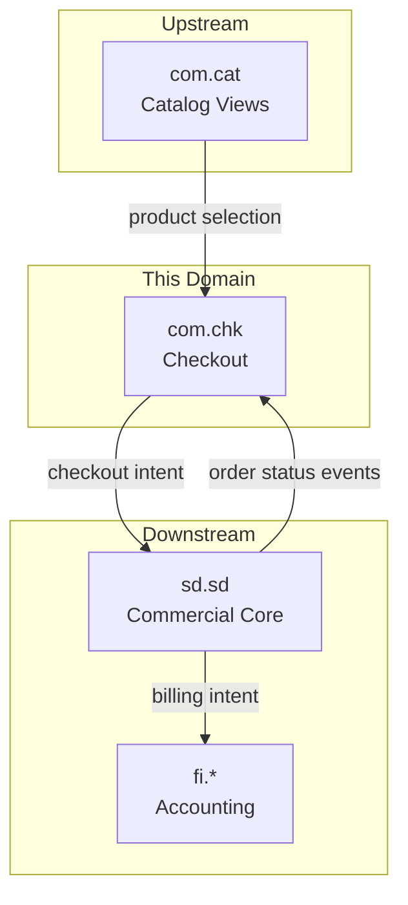
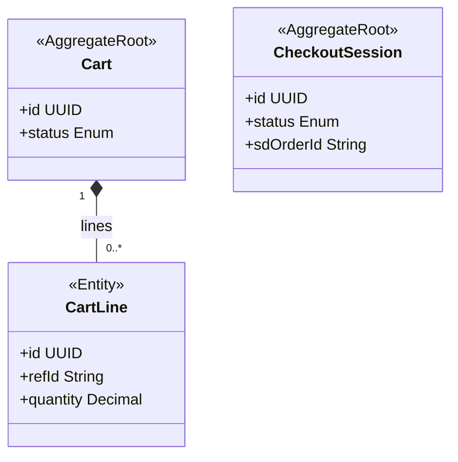
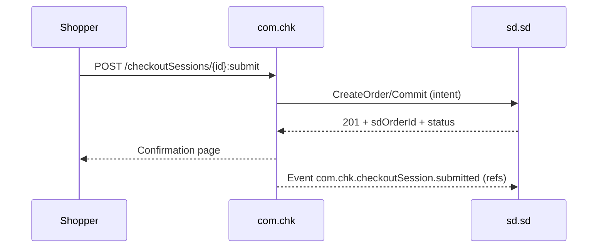

<!-- TEMPLATE COMPLIANCE: ~45%
Template: domain-service-spec.md v1.0.0
Present sections: §0 (purpose, audience, scope, related docs), §1 (business context, value, stakeholders, positioning), §3 (domain model, class diagram), §4 (invariants only — no BR catalog), §6 (REST API), §7 (events — outbound/inbound), §9 (security/roles/PII), §14 (decisions, open questions)
Missing sections: §2 (service identity table), §4 (full business rules), §5 (use cases), §8 (data model/persistence), §10 (quality attributes), §11 (feature dependencies), §12 (extension points), §13 (migration), §15 (appendix)
Naming issues: file should be com_chk-spec.md per convention
Duplicates: none
Priority: LOW
-->
# Service Domain Specification — `com.chk` (Cart, Checkout & Intent Submission)

> **Meta Information**
> - **Version:** 2026-01-18
> - **Template:** `domain-service-spec.md` v1.0.0
> - **Template Compliance:** ~45% — §2 (service identity table), §4 (full business rules), §5 (use cases), §8 (data model/persistence), §10 (quality attributes), §11 (feature dependencies), §12 (extension points), §13 (migration), §15 (appendix) missing
> - **Author(s):** OpenLeap Architecture Team
> - **Status:** DRAFT
> - **Tier:** T3
> - **Suite:** `com`
> - **Domain:** `chk`
> - **Service ID:** `com-chk-svc`
> - **basePackage:** `io.openleap.com.chk`
> - **API Base Path:** `/api/com/chk/v1`

---

## Specification Guidelines Compliance

> **This specification MUST comply with the project-wide specification guidelines.**
>
> #### Non-negotiables
> - Never invent facts. If information is missing, add an **OPEN QUESTION** entry.
> - Use **MUST/SHOULD/MAY** for normative statements.
> - Keep the spec **self-contained**: no references to chat context.
> - Record decisions and boundaries explicitly (see Section 12).

---

## 0. Document Purpose & Scope

### 0.1 Purpose
`com.chk` specifies the checkout experience domain: it manages carts and checkout sessions and submits **checkout intents** to SD, which remains the commercial system of record.

### 0.2 Target Audience
- Product Owner / Fachbereich
- Channel/UI Teams
- Architekt:innen / Tech Leads
- Integrations- und Plattform-Team

### 0.3 Scope

**In Scope (MUST):**
- MUST manage cart state and checkout session state for channel UX.
- MUST orchestrate checkout submission as an intent to `sd.sd`.
- MUST store mapping `checkoutSessionId → sdOrderId/sdContractId` for UI continuity.
- SHOULD support idempotency to prevent duplicate submissions.

**Out of Scope (MUST NOT):**
- MUST NOT confirm or own orders/contracts/subscriptions → `sd.sd`.
- MUST NOT post payments, manage AR, or perform accounting → `fi`.
- MUST NOT implement booking/appointments/sessions/cases → `srv`.

### 0.4 Terms & Acronyms
- **Checkout Intent:** A request to create a commercial commitment in SD.
- **Checkout Session:** UI-driven state machine leading to intent submission.

### 0.5 Related Documents
- Suite-Architektur: `platform/tmpspec/T3_Domains/COM/_com_suite.md`
- SD baseline: `platform/T3_Domains/SD/SD_sales.md`
- SRV boundary: `platform/T3_Domains/SRV/_srv_suite.md`

---

## 1. Business Context

### 1.1 Domain Purpose
Provide a robust checkout UX while enforcing the strict boundary that SD owns commercial truth.

### 1.2 Business Value
- Better conversion and consistent checkout behavior.
- Clean separation of channel UX from ERP commercial commitments.

### 1.3 Stakeholders & Roles
| Rolle | Verantwortung | Primäre Use-Cases |
|------|----------------|-------------------|
| Shopper | Buy/checkout | Add to cart, checkout, receive confirmation |
| Customer Support | Assist checkout | Retry, investigate failures |
| SD Owner | Commercial commitment | Accept/reject intent |

### 1.4 Strategic Positioning (Context Diagram)

---

## 2. Domain Boundaries & Responsibilities

### 2.1 Responsibilities
- MUST manage cart items and checkout session steps.
- MUST validate only channel/session constraints (formatting, required fields) but MUST defer commercial validation to SD.
- MUST submit checkout intent to SD and persist the resulting reference IDs.

### 2.2 Non-Responsibilities (Non-Goals)
- MUST NOT implement cross-suite order-to-cash sagas.

### 2.3 Data Ownership and "Source of Truth"
- **Source of Truth für:** Cart + checkout session state → `com.chk`.
- **Referenziert (nur IDs):** Commercial documents → `sd.sd`.

---

## 3. Domänenmodell

### 3.1 Überblick (Mermaid `classDiagram`)

---

## 4. Aggregate, Zustände & Invarianten

### 4.2 Invarianten (MUST/SHOULD)
- MUST ensure a checkout submission is idempotent for a given `CheckoutSession` (e.g., via idempotency key).
- MUST not expose a “confirmed” state without an SD response.

---

## 6. Öffentliche Schnittstellen (APIs)

### 6.1 REST API (OpenAPI-friendly)
**Base Path:** `/api/com/chk/v1`

#### 6.1.1 Cart
- `POST /carts`
- `POST /carts/{id}:addLine`
- `POST /carts/{id}:removeLine`
- `GET /carts/{id}`

#### 6.1.2 Checkout session
- `POST /checkoutSessions`
- `GET /checkoutSessions/{id}`
- `POST /checkoutSessions/{id}:submit`
  - MUST call SD to create/confirm the commercial commitment.

---

## 7. Events & Messaging

### 7.1 Konventionen
- **Exchange/Topic:** `com.chk.events`
- **Routing Key:** `com.chk.<aggregate>.<event>`

### 7.2 Outbound Events
- `com.chk.checkoutSession.submitted`
- `com.chk.checkoutSession.failed`

### 7.3 Inbound Events
- `sd.sd.order.confirmed` – MAY be consumed to update UI state.
- `sd.sd.order.cancelled` – MAY be consumed to update UI state.

---

## 8. Typische Interaktionen (Sequenzen)

### 8.1 Happy Path

---

## 9. Sicherheit & Berechtigungen

### 9.1 Rollenmodell
- `COM_CHK_VIEWER`
- `COM_CHK_EDITOR`
- `COM_CHK_ADMIN`

### 9.3 Datenschutz / PII
- Data classification: PII likely present (addresses, contact data) (OPEN QUESTION: exact fields).
- MUST apply log redaction/masking for PII.

---

## 12. Entscheidungen, Konflikte, Open Questions

### 12.1 Entscheidungen (Decisions)
- **DEC-001:** `com.chk` submits intent; SD is the commercial system of record.

### 12.3 OPEN QUESTIONS
- **OQ-001:** Which payment flows are in scope for `com.chk` (UI only vs tokenization callbacks)?
- **OQ-002:** How is guest checkout handled vs authenticated checkout?

---

## 13. Änderungsverlauf
- Created: 2026-01-18
