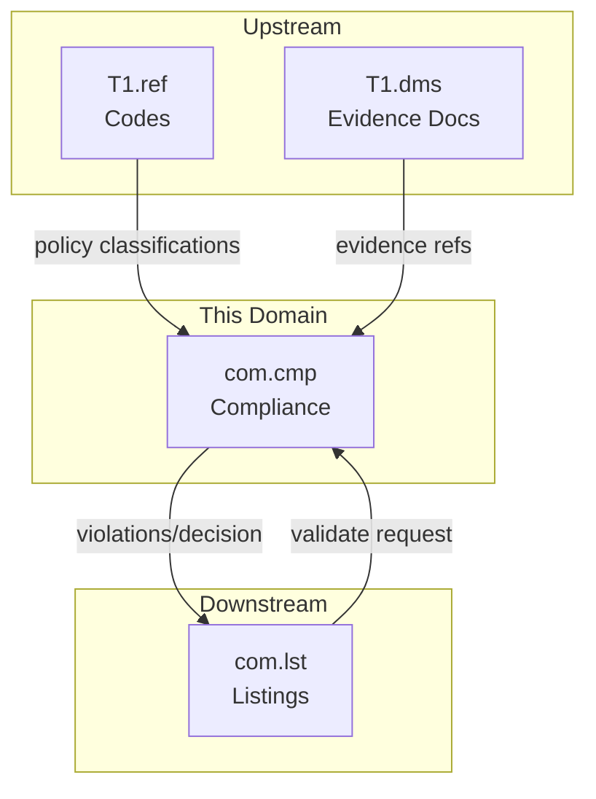
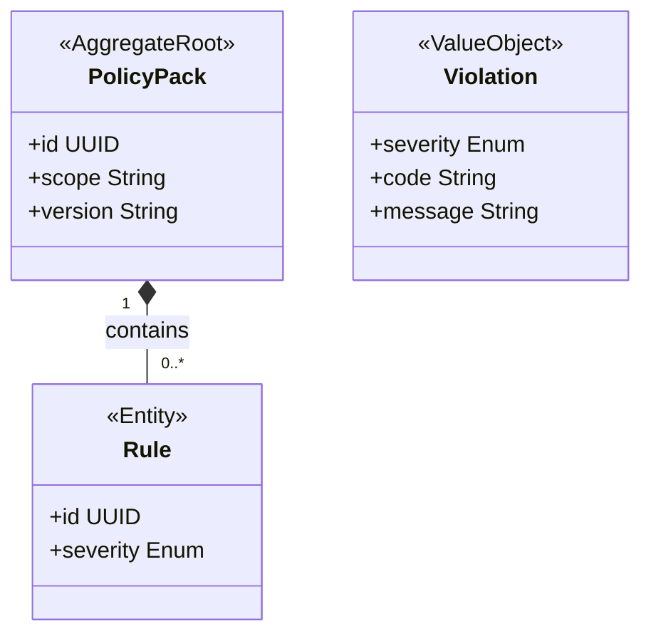

<!-- TEMPLATE COMPLIANCE: ~40%
Template: domain-service-spec.md v1.0.0
Present sections: §0 (purpose, audience, scope, related docs), §1 (business context, value, stakeholders, positioning), §3 (domain model, class diagram), §6 (REST API), §7 (events — outbound/inbound), §9 (security/roles), §14 (decisions, open questions)
Missing sections: §2 (service identity table), §4 (business rules catalog), §5 (use cases), §8 (data model/persistence), §10 (quality attributes), §11 (feature dependencies), §12 (extension points), §13 (migration), §15 (appendix)
Naming issues: file should be com_cmp-spec.md per convention
Duplicates: none
Priority: LOW
-->
# Service Domain Specification — `com.cmp` (Compliance for Publishing)

> **Meta Information**
> - **Version:** 2026-01-18
> - **Template:** `domain-service-spec.md` v1.0.0
> - **Template Compliance:** ~40% — §2 (service identity table), §4 (business rules catalog), §5 (use cases), §8 (data model/persistence), §10 (quality attributes), §11 (feature dependencies), §12 (extension points), §13 (migration), §15 (appendix) missing
> - **Author(s):** OpenLeap Architecture Team
> - **Status:** DRAFT
> - **Tier:** T3
> - **Suite:** `com`
> - **Domain:** `cmp`
> - **Service ID:** `com-cmp-svc`
> - **basePackage:** `io.openleap.com.cmp`
> - **API Base Path:** `/api/com/cmp/v1`

---

## Specification Guidelines Compliance

> **This specification MUST comply with the project-wide specification guidelines.**
>
> #### Non-negotiables
> - Never invent facts. If information is missing, add an **OPEN QUESTION** entry.
> - Use **MUST/SHOULD/MAY** for normative statements.
> - Keep the spec **self-contained**: no references to chat context.
> - Record decisions and boundaries explicitly (see Section 12).

---

## 0. Document Purpose & Scope

### 0.1 Purpose
`com.cmp` specifies **publication compliance** within COM. It validates whether a listing is publishable for a channel/market based on legal, safety, and channel policy rules.

### 0.2 Target Audience
- Compliance / Legal
- Channel Operations
- Architekt:innen / Tech Leads

### 0.3 Scope

**In Scope (MUST):**
- MUST manage compliance policy packs (by channel, country/market, category).
- MUST validate a listing against relevant policies and return structured violations.
- MUST support evidence references (e.g., certificates) for auditability.

**Out of Scope (MUST NOT):**
- MUST NOT implement tax posting/journaling → `fi`.
- MUST NOT implement commercial contract terms (refund policy, credit terms) → `sd.sd`.
- MUST NOT own listing lifecycle → `com.lst`.

### 0.4 Terms & Acronyms
- **Policy Pack:** A set of rules applicable to a channel/market scope.
- **Violation:** A structured finding (severity, message, reference).
- **EvidenceRef:** Reference to supporting evidence (likely in `T1.dms`).

### 0.5 Related Documents
- Suite-Architektur: `platform/tmpT3_Domains/COM/_com_suite.md`
- Neighbor: `com_lst.md`

---

## 1. Business Context

### 1.1 Domain Purpose
Prevent publication of non-compliant listings and provide explainable violation feedback.

### 1.2 Business Value
- Reduces legal/channel risk.
- Creates a single compliance decision point reusable by multiple channels.

### 1.3 Stakeholders & Roles
| Rolle | Verantwortung | Primäre Use-Cases |
|------|----------------|-------------------|
| Compliance Officer | Define/approve policies | Maintain policy packs |
| Channel Manager | Ensure publishability | Validate listings before publish |
| Auditor | Evidence trail | Inspect why a listing was blocked |

### 1.4 Strategic Positioning (Context Diagram)

---

## 2. Domain Boundaries & Responsibilities

### 2.1 Responsibilities
- MUST provide a deterministic compliance decision for a listing in a given channel/market scope.
- MUST return structured violations with severity.
- SHOULD support rule versioning and auditability.

### 2.2 Non-Responsibilities (Non-Goals)
- MUST NOT publish or manage listing state transitions (owned by `com.lst`).

### 2.3 Data Ownership and "Source of Truth"
- **Source of Truth für:** Compliance policies and validation results → `com.cmp`.
- **Referenziert (nur IDs):** Evidence documents in `T1.dms`.

---

## 3. Domain Model

### 3.1 Overview (Mermaid `classDiagram`)

---

## 6. Public Interfaces (APIs)

### 6.1 REST API (OpenAPI-friendly)
**Base Path:** `/api/com/cmp/v1`

#### 6.1.1 Validate listing
- `POST /validate`
  - MUST return violations and an allow/deny decision.

#### 6.1.2 Policy management
- `POST /policyPacks`
- `PATCH /policyPacks/{id}`

---

## 7. Events & Messaging

### 7.1 Konventionen
- **Exchange/Topic:** `com.cmp.events`
- **Routing Key:** `com.cmp.<aggregate>.<event>`

### 7.2 Outbound Events
- `com.cmp.policyPack.updated` – SHOULD be emitted when policies change.

### 7.3 Inbound Events
- (OPEN QUESTION) Are listing validation requests purely synchronous, or is there an async validation pipeline?

---

## 9. Security & Authorization

### 9.1 Rollenmodell
- `COM_CMP_VIEWER`
- `COM_CMP_EDITOR`
- `COM_CMP_ADMIN`

---

## 12. Decisions, Conflicts, Open Questions

### 12.1 Entscheidungen (Decisions)
- **DEC-001:** Compliance decisions are separated from listing lifecycle: `com.cmp` decides, `com.lst` acts.

### 12.3 OPEN QUESTIONS
- **OQ-001:** What is the minimum policy set required for MVP per channel?
- **OQ-002:** How are rule packs authored (UI, code, DSL)?

---

## 13. Change Log
- Created: 2026-01-18
