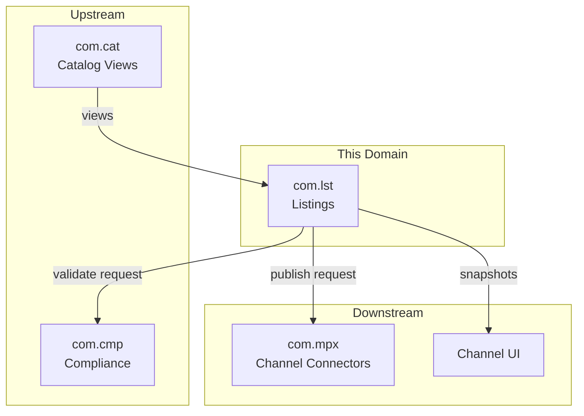
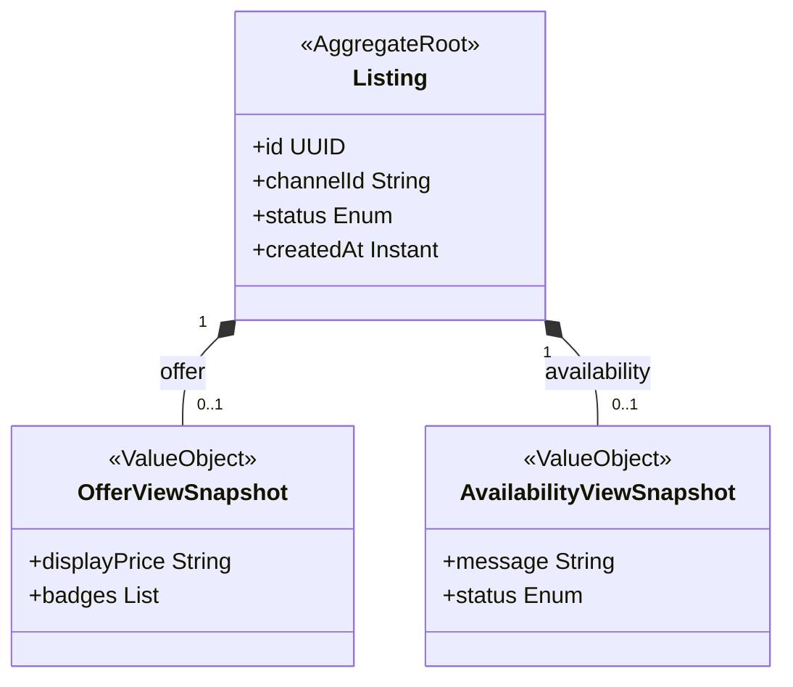
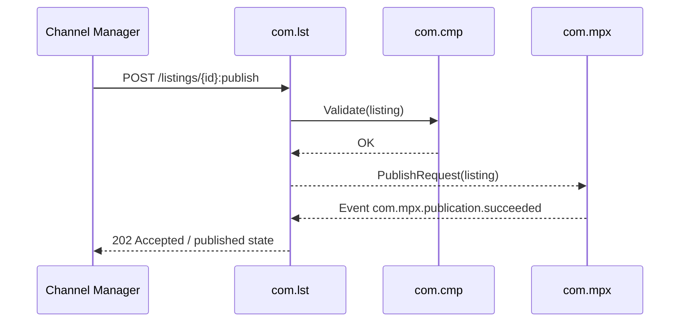

<!-- TEMPLATE COMPLIANCE: ~50%
Template: domain-service-spec.md v1.0.0
Present sections: §0 (purpose, audience, scope, related docs), §1 (business context, value, stakeholders, positioning), §3 (domain model, class diagram, UBL concepts), §4 (invariants only — no BR catalog), §6 (REST API), §7 (events — outbound/inbound), §8 (persistence partial — table names), §9 (security/roles), §10 (NFR partial), §14 (decisions, open questions)
Missing sections: §2 (service identity table), §4 (full business rules), §5 (use cases), §8 (no ER diagram, no indexes), §11 (feature dependencies), §12 (extension points), §13 (migration), §15 (appendix)
Naming issues: file should be com_lst-spec.md per convention
Duplicates: none
Priority: LOW
-->
# Service Domain Specification — `com.lst` (Listings & Publication Snapshots)

> **Meta Information**
> - **Version:** 2026-01-18
> - **Template:** `domain-service-spec.md` v1.0.0
> - **Template Compliance:** ~50% — §2 (service identity table), §4 (full business rules), §5 (use cases), §8 (ER diagram, indexes), §11 (feature dependencies), §12 (extension points), §13 (migration), §15 (appendix) missing
> - **Author(s):** OpenLeap Architecture Team
> - **Status:** DRAFT
> - **Tier:** T3
> - **Suite:** `com`
> - **Domain:** `lst`
> - **Service ID:** `com-lst-svc`
> - **basePackage:** `io.openleap.com.lst`
> - **API Base Path:** `/api/com/lst/v1`

---

## Specification Guidelines Compliance

> **This specification MUST comply with the project-wide specification guidelines.**
>
> #### Non-negotiables
> - Never invent facts. If information is missing, add an **OPEN QUESTION** entry.
> - Use **MUST/SHOULD/MAY** for normative statements.
> - Keep the spec **self-contained**: no references to chat context.
> - Record decisions and boundaries explicitly (see Section 12).

---

## 0. Document Purpose & Scope

### 0.1 Purpose
`com.lst` specifies the **listing** domain within COM: it manages channel-specific listings and **presentation snapshots** (what a shopper sees “right now”), and coordinates publication to external channels via `com.mpx`.

### 0.2 Target Audience
- Product Owner / Fachbereich
- Architekt:innen / Tech Leads
- Integrations- und Plattform-Team
- Channel Operations / Marketplace Teams

### 0.3 Scope

**In Scope (MUST):**
- MUST manage `Listing` lifecycle per channel (e.g., DRAFT → READY → PUBLISHED/FAILED).
- MUST compose and persist presentation snapshots for channel display (e.g., offer badge text, availability messaging).
- MUST coordinate publication requests to `com.mpx`.
- MUST integrate with `com.cmp` for compliance validation before publication.

**Out of Scope (MUST NOT):**
- MUST NOT be the system of record for content authoring → `com.cat`.
- MUST NOT be the system of record for compliance policies → `com.cmp`.
- MUST NOT confirm orders or manage commercial commitments → `sd.sd`.
- MUST NOT own fulfillment execution or stock truth → `pps`/`srv`.

### 0.4 Terms & Acronyms
- **Listing:** Channel-specific representation of a sellable item that can be published.
- **Snapshot:** Deterministic, presentation-grade view used by a channel at a point in time.
- **Publication:** The act of pushing/activating a listing in an external channel.

### 0.5 Related Documents
- Suite-Architektur: `platform/tmpspec/T3_Domains/COM/_com_suite.md`
- Nachbar-Spezifikationen: `com_cat.md`, `com_cmp.md`, `com_mpx.md`

---

## 1. Business Context

### 1.1 Domain Purpose
Provide a governed mechanism to:
- prepare listings per channel,
- validate compliance,
- publish to external channels,
- track publication outcomes,
- serve stable snapshots to channels.

### 1.2 Business Value
- Prevents publishing incomplete or non-compliant listings.
- Enables controlled rollout (drafting, approvals) before going live.
- Decouples external channel APIs from internal content and catalog views.

### 1.3 Stakeholders & Roles
| Rolle | Verantwortung | Primäre Use-Cases |
|------|----------------|-------------------|
| Channel Manager | Listing lifecycle | Create/prepare/publish listings |
| Compliance Officer | Publication constraints | Ensure required evidence/fields |
| Marketplace Operator | External publication | Monitor success/failure and retries |
| Channel UI | Display | Render listing snapshots |

### 1.4 Strategic Positioning (Context Diagram)

---

## 2. Domain Boundaries & Responsibilities

### 2.1 Verantwortlichkeiten (Responsibilities)
- MUST create and maintain listings per channel.
- MUST produce a snapshot representation suitable for channel rendering.
- MUST ensure compliance validation is performed before publication.
- SHOULD support idempotent publish actions and retry semantics.

### 2.2 Nicht-Verantwortlichkeiten (Non-Goals)
- MUST NOT implement channel connector logic (owned by `com.mpx`).
- MUST NOT implement pricing authority (owned by `sd.sd`); listing may display price previews only.

### 2.3 Ownership von Daten & „Source of Truth“ 
- **Source of Truth für:** Listing lifecycle, listing snapshots → `com.lst`.
- **Referenziert (nur IDs):** `com.cat` product/variant view IDs; external channel identifiers maintained by `com.mpx`.

---

## 3. Domänenmodell

### 3.1 Überblick (Mermaid `classDiagram`)

### 3.2 Kern-Konzepte (Ubiquitous Language)
- **Listing:** A channel-specific publishable unit.
- **Snapshot:** What is rendered/published; may be refreshed based on content/availability signals.

---

## 4. Aggregate, Zustände & Invarianten

### 4.1 Aggregate-Liste
- `Listing`

### 4.2 Invarianten (MUST/SHOULD)
- MUST prevent publishing when compliance validation fails.
- MUST keep an audit trail of publication attempts/outcomes (OPEN QUESTION: where stored).
- SHOULD avoid coupling to real-time stock truth; rely on snapshots.

---

## 5. Datenhaltung (Persistence)

### 5.1 Storage-Entscheidung
- (OPEN QUESTION) Storage tech and schema.

### 5.2 Tabellen-/Collections-Design
**Naming:** tables/collections MUST be prefixed with `lst_`.

- `lst_listing`
- `lst_publication_attempt`
- `lst_snapshot`

---

## 6. Öffentliche Schnittstellen (APIs)

### 6.1 REST API (OpenAPI-friendly)
**Base Path:** `/api/com/lst/v1`

#### 6.1.1 Listing lifecycle
- `POST /listings`
- `GET /listings/{id}`
- `PATCH /listings/{id}`

#### 6.1.2 Publish
- `POST /listings/{id}:publish`
  - MUST be idempotent for the same listing version (OPEN QUESTION: versioning model).

---

## 7. Events & Messaging

### 7.1 Konventionen
- **Exchange/Topic:** `com.lst.events`
- **Routing Key:** `com.lst.<aggregate>.<event>`

### 7.2 Outbound Events
- `com.lst.listing.ready`
- `com.lst.listing.published`
- `com.lst.listing.failed`

### 7.3 Inbound Events
- `com.cat.productView.updated` – MAY trigger snapshot refresh.
- `com.cmp.validation.*` – MAY be used if compliance validation is async (OPEN QUESTION).
- `com.mpx.publication.*` – SHOULD be consumed for publication outcomes.

---

## 8. Typische Interaktionen (Sequenzen)

### 8.1 Happy Path

---

## 9. Sicherheit & Berechtigungen

### 9.1 Rollenmodell
- `COM_LST_VIEWER`
- `COM_LST_EDITOR`
- `COM_LST_ADMIN`

---

## 10. Non-Functional Requirements (NFR)

### 10.1 Performance
- MUST serve snapshot reads quickly for channel traffic.

---

## 12. Entscheidungen, Konflikte, Open Questions

### 12.1 Entscheidungen (Decisions)
- **DEC-001:** `com.lst` owns listing lifecycle and snapshots; connector logic is delegated to `com.mpx`.

### 12.3 OPEN QUESTIONS
- **OQ-001:** Is compliance validation synchronous (API call) or asynchronous (event-based)?
- **OQ-002:** Do we need explicit approval workflows before publish (human approval)?

---

## 13. Änderungsverlauf
- Created: 2026-01-18
